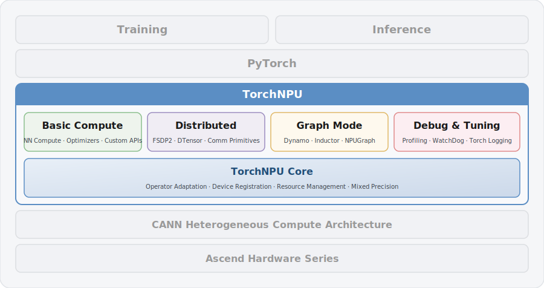

<h1 align="center">TorchNPU</h1>

<p align="center">
  <strong>PyTorch Adapter Plugin for Ascend NPU</strong>
</p>

<p align="center">
  English · <a href="./README.zh.md">中文</a>
</p>

<p align="center">
  <a href="#installation">Installation</a> ·
  <a href="#quick-start">Quick Start</a> ·
  <a href="./COMPATIBILITY.md">Compatibility</a> ·
  <a href="./SUPPORT.md">Support</a> ·
  <a href="./CONTRIBUTING.md">Contributing</a> ·
  <a href="https://www.hiascend.com/developer/software/ai-frameworks/pytorch/document">Docs</a> ·
  <a href="https://www.hiascend.com/cn/developer/software/ai-frameworks/pytorch">Community</a>
</p>

<p align="center">
  
  
  <a href="./LICENSE"></a>
  <a href="https://pypi.org/project/torch-npu/"></a>
  
  <a href="https://gitcode.com/Ascend/pytorch"></a>
  <a href="https://github.com/Ascend/pytorch"></a>
  
  
  
</p>

---

## Overview

As the core component of the Ascend for PyTorch community, **TorchNPU** is a deep learning adapter plugin built by Ascend for PyTorch, enabling the PyTorch framework to directly invoke Ascend NPU and providing developers with the powerful compute capabilities of Ascend AI processors.

Ascend is a full-stack AI computing infrastructure for industry applications and services based on Huawei Ascend AI processors and software. For more information about Ascend, see [Ascend Community](https://www.hiascend.com/en/).

## Key Features

TorchNPU fully inherits and reuses extensive mature capabilities from upstream PyTorch, and on this foundation provides deep adaptation and optimization for Ascend NPU. The diagram below illustrates the main functional modules of TorchNPU:

<div align="center">
  
</div>

**Key Modules:**

- **Basic Compute:** Extensive support for PyTorch native APIs and custom APIs, covering mainstream AI scenarios with a consistent experience, enabling rapid model and algorithm implementation.
- **Distributed:** Supports accelerating distributed training via FSDP2. Core compute APIs support DTensor, along with collective communication primitives such as AllGather, AllReduce, and AllToAll, as well as point-to-point primitives like Send and Recv.
- **Graph Mode:** Significantly accelerates model training and inference through "dynamic graph capture + static graph optimization + efficient code generation," and supports offloading execution via NPUGraph. Supported in v2.6.0 and above.
- **Debug & Tuning:** Supports profiling analysis of compute, communication, and memory usage, with real-time communication anomaly monitoring via WatchDog.
- **TorchNPU Core:** Supports virtual memory management to reduce memory fragmentation, cross-stream memory reuse optimization in distributed scenarios, and integrates operators and device resources into PyTorch via PrivateUse1.

## Latest News

- 📢 [2026-06-30] Advance notice on standardized naming conventions for Ascend for PyTorch community components. [🔗 Learn more](https://www.hiascend.com/productbulletins/detail/791)
- 📢 [2026-04-30] TorchNPU 26.0.0 released, adding support for PyTorch 2.10.0, Python 3.13, P2P communication group dispatch, DTensor strategy extensions, and more. [🔗 Learn more](https://www.hiascend.com/productbulletins/detail/779)

## Installation

### From Binary

Take installing TorchNPU 2.10.0.post2 as an example. Run the following commands for installation. For other versions, please refer to the community download page: [TorchNPU Download](https://www.hiascend.com/developer/software/ai-frameworks/pytorch/download).

#### Install CANN

Install CANN 9.0.0. For detailed steps, please refer to the [CANN Installation Guide](https://www.hiascend.com/cann/download).

#### Install PyTorch

Run the following command to install PyTorch 2.10.0:

```bash
pip install torch==2.10.0 --index-url https://download.pytorch.org/whl/cpu
```

#### Install TorchNPU

Run the following command to install TorchNPU 2.10.0.post2:

```bash
pip install torch-npu==2.10.0.post2
```

### From Source

For detailed steps on compiling TorchNPU, please refer to the [TorchNPU Source Installation Guide](https://www.hiascend.com/document/detail/zh/Pytorch/latest/configandinstg/instg/docs/zh/installation_guide/compilation_installation_using_source_code.md).

## Quick Start

### Initialize Environment

```shell
# Default path, modify according to your actual installation location
source /usr/local/Ascend/ascend-toolkit/set_env.sh
```

### Run Example

```python
import torch
import torch_npu

x = torch.randn(2, 2).npu()
y = torch.randn(2, 2).npu()
z = x.mm(y)
print(z)
```

> Starting from TorchNPU 2.5.1, `import torch_npu` is no longer mandatory (auto-registration occurs), but explicit import is still recommended to ensure device initialization.

If the following output appears, the execution is successful:

```text
tensor([[-0.0515,  0.3664],
        [-0.1258, -0.5425]], device='npu:0')
```

For complete model migration and training tutorials, please refer to the [TorchNPU Quick Start Guide](https://www.hiascend.com/document/detail/zh/Pytorch/latest/fastexperience/docs/en/quick_start/quick_start.md).

## Community

The Ascend for PyTorch community consists of multiple Special Interest Groups (SIGs), each responsible for development, maintenance, and community collaboration in specific technical areas. Below is a list of all current SIGs. Click the corresponding links for detailed descriptions.

|    SIG Name     | Description                                                                                                                                                                                                                                                                                        |                                                 Link                                                  |
|:---------------:|:---------------------------------------------------------------------------------------------------------------------------------------------------------------------------------------------------------------------------------------------------------------------------------------------------|:-----------------------------------------------------------------------------------------------------:|
|    Core SIG     | Focuses on the development of the PyTorch core adaptation layer on the Ascend NPU platform, responsible for the design, implementation, and maintenance of the `TorchNPU` extension library and its operator plugin `OpPlugin`.                                                                    |    [🔗 Learn more](https://gitcode.com/Ascend/community/tree/master/FrameworkPTAdapter/sigs/core)     |
| Distributed SIG | Dedicated to building efficient, easy-to-use, and scalable parallel training capabilities based on the PyTorch distributed training framework (torch.distributed) on the Ascend NPU hardware foundation, delivering extreme performance for LLM, multimodal, and reinforcement learning scenarios. | [🔗 Learn more](https://gitcode.com/Ascend/community/tree/master/FrameworkPTAdapter/sigs/distributed) |
| Graph Mode SIG  | Focuses on core technologies such as Dynamo, Inductor, and NPUGraph, aiming to bridge the gap between "ease of use" and "high performance" through automated graph capture and compilation optimization.                                                                                           | [🔗 Learn more](https://gitcode.com/Ascend/community/tree/master/FrameworkPTAdapter/sigs/graph-mode)  |
|  Usability SIG  | Dedicated to improving the usability experience of Ascend for PyTorch, including documentation, tutorials, examples, and more.                                                                                                                                                                     |  [🔗 Learn more](https://gitcode.com/Ascend/community/tree/master/FrameworkPTAdapter/sigs/usability)  |

Each SIG holds regular meetings, mailing lists, and contribution guides. Click the corresponding SIG links to view detailed contact information, goals, and participation guidelines. Everyone is welcome to contribute to the community. If you have any questions or suggestions, please submit [GitHub Issues](https://github.com/Ascend/pytorch/issues). We will reply as soon as possible. Thank you for your support.

## Security Note

For system security hardening, recommended user configurations, and file permission controls for TorchNPU, please refer to the [Security Note](SECURITYNOTE.md).

## Disclaimer

This plugin is for debugging and development purposes only. Users are responsible for ensuring the security of input commands and properly controlling access to data generated during use. By using this plugin, you agree to and accept the above statement.

## License

For the license of TorchNPU, please refer to the [LICENSE](LICENSE) file. For the license of TorchNPU documentation, please refer to the [LICENSE](./docs/LICENSE) file.

## Acknowledgments

Thanks for every PR from the community! We welcome developers to contribute code to the TorchNPU plugin!
