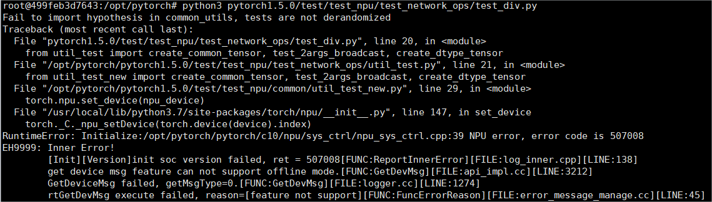
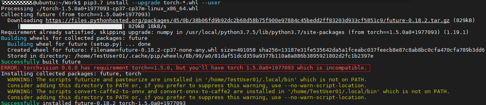
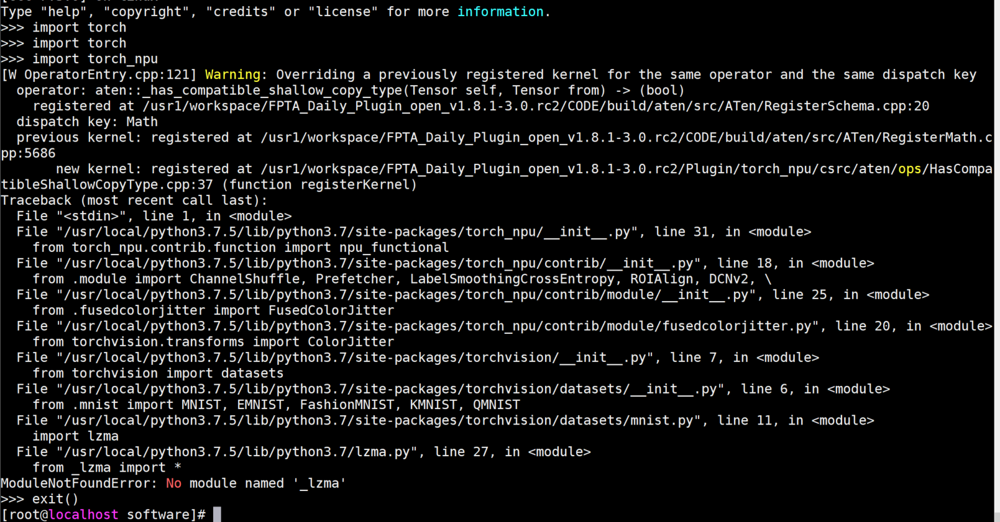
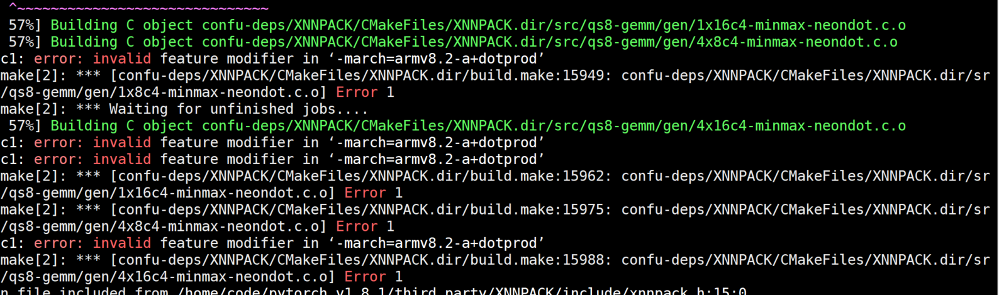

# AscendPyTorch
<h2 id="简介md">简介</h2>

本项目开发了PyTorch Adapter插件，用于昇腾适配PyTorch框架，为使用PyTorch框架的开发者提供昇腾AI处理器的超强算力。用户在准备相关环境进行基于PyTorch框架模型的开发、运行时，可以选择在服务器中手动编译相关模块。

<h2 id="md">前提条件</h2>

- 需完成CANN开发或运行环境的安装，具体操作请参考《CANN 软件安装指南》。
- Python支持版本为3.7.5、3.8、3.9。

# 系统依赖库

## CentOS & EulerOS

yum install -y  patch zlib-devel libffi-devel openssl-devel libjpeg-turbo-devel gcc-c++ sqlite-devel dos2unix openblas git dos2unix

yum install -y gcc==7.3.0 cmake==3.12.0

## Ubuntu

apt-get install -y patch g++ make build-essential libssl-dev zlib1g-dev libbz2-dev libreadline-dev libsqlite3-dev wget curl llvm libncurses5-dev libncursesw5-dev xz-utils tk-dev libffi-dev liblzma-dev m4 dos2unix libopenblas-dev git dos2unix

apt-get install -y gcc==7.3.0 cmake==3.12.0


> **说明：** 
>若安装gcc与cmake依赖命令报错，请参考FAQ使用源码安装。


# Ascend配套软件
| AscendPyTorch版本 | CANN版本 | 支持PyTorch版本 | Gitee分支名称 | AscendHub镜像版本 |
| :------------ | :----------- | :----------- | ------------- | ------------- |
| 2.0.2 | CANN 5.0.2 | 1.5.0.post2 | 2.0.2.tr5 | 21.0.2 |
| 2.0.3 | CANN 5.0.3 | 1.5.0.post3 | 2.0.3.tr5 | 21.0.3 |
| 2.0.4 | CANN 5.0.4 | 1.5.0.post4 | 2.0.4.tr5 | 21.0.4 |
| 3.0.rc1 | CANN 5.1.RC1 | 1.5.0.post5 | v1.5.0-3.0.rc1 | 22.0.RC1 |
| 3.0.rc1 | CANN 5.1.RC1 | 1.8.1.rc1 | v1.8.1-3.0.rc1 | \ |
| 3.0.rc2 | CANN 5.1.RC2 | 1.5.0.post6 | v1.5.0-3.0.rc2 | 22.0.RC2 |
| 3.0.rc2 | CANN 5.1.RC2 | 1.8.1.rc2 | v1.8.1-3.0.rc2 | 22.0.RC2-1.8.1 |
| 3.0.rc3 | CANN 6.0.RC1 | 1.5.0.post7 | v1.5.0-3.0.rc3 | \ |
| 3.0.rc3 | CANN 6.0.RC1 | 1.8.1.rc3 | v1.8.1-3.0.rc3 | 22.0.RC3-1.8.1 |
| 3.0.rc3 | CANN 6.0.RC1 | 1.11.0.rc1 | v1.11.0-3.0.rc3 | \ |

# 安装方式

## 安装PyTorch依赖环境

如果使用非root用户安装，用户需要在本步骤的每句命令后加**--user**，示例如：pip3 install pyyaml --user。

```sh
pip3 install pyyaml
pip3 install wheel
```

## 编译安装PyTorch和昇腾插件

首先安装官方torch包，然后编译安装插件。

```sh
#x86_64
pip3 install torch==1.8.1+cpu #若使用pip命令安装cpu版本PyTorch报错，请手动下载whl包安装，下载地址：（https://download.pytorch.org/whl/torch）

#aarch64（推荐使用镜像）
可在docker中使用AscendHub镜像仓库提供的基于PyTorch版本制作的基础镜像，包含训练、转换和推理等功能。
#镜像仓库地址：（https://ascendhub.huawei.com/#/detail/pytorch-modelzoo）
#社区未提供arm架构cpu安装包，如需尝试编译安装PyTorch框架，可参见FAQ第一条，使用源码编译安装pytorch。
```

编译生成pytorch插件的二进制安装包。

```
# 下载master分支代码，进入插件根目录
git clone -b master https://gitee.com/ascend/pytorch.git 
cd pytorch    
# 指定python版本编包方式：
bash ci/build.sh --python=3.7
# 或
bash ci/build.sh --python=3.8
# 或
bash ci/build.sh --python=3.9
```

然后安装pytorch/dist下生成的插件torch_npu包，{arch}为架构名称。

```
pip3 install --upgrade dist/torch_npu-1.8.1rc2-cp37-cp37m-linux_{arch}.whl
```

下载torchvision。
```
pip3 install torchvision==0.9.1
```

# 运行

## 运行环境变量

在当前仓库根目录中执行设置环境变量脚本

```
source env.sh
```


## 自定义环境变量

可选的环境变量可能会对运行的模型产生影响:

```
export COMBINED_ENABLE=1 # 非连续转连续二级推导优化，可选，开启设置为1。当模型中有大量AsStrided高耗时算子被调用时，可以尝试开启此优化以获得潜在的device执行效率的提升。
export ACL_DUMP_DATA=1 # 算子数据dump功能，调试时使用，可选，开启设置为1
```

**表 1**  环境变量说明
<a name="zh-cn_topic_0000001152616261_table42017516135"></a>

<table><thead align="left"><tr id="zh-cn_topic_0000001152616261_row16198951191317"><th class="cellrowborder" valign="top" width="55.48%" id="mcps1.2.3.1.1"><p id="zh-cn_topic_0000001152616261_p51981251161315"><a name="zh-cn_topic_0000001152616261_p51981251161315"></a><a name="zh-cn_topic_0000001152616261_p51981251161315"></a>配置项</p>
</th>
<th class="cellrowborder" valign="top" width="44.519999999999996%" id="mcps1.2.3.1.2"><p id="zh-cn_topic_0000001152616261_p9198135114133"><a name="zh-cn_topic_0000001152616261_p9198135114133"></a><a name="zh-cn_topic_0000001152616261_p9198135114133"></a>说明</p>
<tr id="row78312162301"><td class="cellrowborder" valign="top" width="55.48%" headers="mcps1.2.3.1.1 "><p id="p1832171673019"><a name="p1832171673019"></a><a name="p1832171673019"></a>COMBINED_ENABLE</p>
</td>
<td class="cellrowborder" valign="top" width="44.519999999999996%" headers="mcps1.2.3.1.2 "><p id="p583261643014"><a name="p583261643014"></a><a name="p583261643014"></a>（可选）非连续转连续二级推导优化，开启设置为1。当模型中有大量AsStrided高耗时算子被调用时，可以尝试开启此优化以获得潜在的device执行效率的提升。但是Host下发性能存在下降风险。</p>
</td>
</tr>
<tr id="row183041355123411"><td class="cellrowborder" valign="top" width="55.48%" headers="mcps1.2.3.1.1 "><p id="p730435533415"><a name="p730435533415"></a><a name="p730435533415"></a>ACL_DUMP_DATA</p>
</td>
<td class="cellrowborder" valign="top" width="44.519999999999996%" headers="mcps1.2.3.1.2 "><p id="p16304105533412"><a name="p16304105533412"></a><a name="p16304105533412"></a>（可选）算子数据dump功能，调试时使用，开启设置为1。</p>
</td>
</tr>
</tbody>
</table>


## 执行单元测试脚本

验证运行, 输出结果OK

```shell
cd test/test_network_ops/
python3 test_div.py
```

# 安装混合精度模块（可选）

AscendPyTorch1.8.1集成了AMP模块，也可用于混合精度训练等应用场景，与Apex模块的区别如下，请用户根据功能需要选择使用，若需安装Apex模块请参考相关[README文档](https://gitee.com/ascend/apex)进行编译安装Apex模块。

- AMP
  - 动态loss scale：动态计算loss scale的值并判断是否溢出。
  - 不支持tensor融合功能。

- APEX

  - O1配置模式：Conv，Matmul等使用float16精度计算，其他如softmax、BN使用float32精度。
  - O2配置模式：除BN使用float32精度外，其他部分使用float16精度。
  - 静态loss scale：静态设置参数确保混合精度训练收敛。
  - 动态loss scale：动态计算loss scale的值并判断是否溢出。

  


# 文档

有关安装指南、模型迁移和训练/推理教程和API列表等更多详细信息，请参考[用户文档](docs/zh)。

# 建议与交流

热忱希望各位在用户社区加入讨论，并贡献您的建议，我们会尽快给您回复。

# 分支维护策略

Ascend PyTorch的版本分支有以下几种维护阶段：

| **状态**       | **持续时间**    | **说明**                                          |
|-------------|---------------|--------------------------------------------------|
| Planning    | 1 - 3 months  | 特性规划。                     |
| Development | 3 months      | 特性开发。                  |
| Maintained  | 6 - 12 months | 允许所有问题修复的合入，并发布版本。 |
| Unmaintained| 0 - 3 months  | 允许所有问题修复的合入，无专人维护，不再发布版本。                                                 |
| End Of Life (EOL) |  N/A |  不再接受修改合入该分支。    |

# 现有分支维护状态

| **分支名** | **当前状态**  | **上线时间**          | **后续状态**                           | **EOL 日期**|
|------------|--------------|----------------------|----------------------------------------|------------|
| **v2.0.2**   | Maintained   | 2021-07-29           | Unmaintained <br> 2022-07-29 estimated |            |
| **v2.0.3**   | Maintained   | 2021-10-15           | Unmaintained <br> 2022-10-15 estimated |            |
| **v2.0.4**   | Maintained   | 2022-01-15           | Unmaintained <br> 2023-01-15 estimated |            |
| **v3.0.rc1**   | Maintained   | 2022-04-10           | Unmaintained <br> 2023-04-10 estimated |            |
| **v3.0.rc2**   | Maintained   | 2022-07-15           | Unmaintained <br> 2023-07-15 estimated |            |
| **v3.0.rc3**   | Maintained   | 2022-10-20           | Unmaintained <br> 2023-10-20 estimated |            |

# FAQ

## CPU架构为ARM架构时，由于社区未提供ARM架构CPU版本的torch包，无法使用PIP3命令安装PyTorch1.8.1，需要使用源码编译安装。

下载PyTorch v1.8.1源码包。

```
git clone -b v1.8.1 https://github.com/pytorch/pytorch.git --depth=1 pytorch_v1.8.1
```

进入源码包获取被动依赖代码。

```
cd pytorch_v1.8.1
git submodule sync
git submodule update --init --recursive 
```

配置环境变量

```
export USE_XNNPACK=0
```

执行编译安装。

```
python3 setup.py install
```

## 在PIP设置为华为源时，安装requirments.txt中的typing依赖后，会导致python环境错误。

在PIP设置为华为源时，需打开requirments.txt文件，删除typing依赖，再执行命令。

```
pip3 install -r requirments.txt
```

## 编译过程执行bash build.sh报错no module named yaml/typing_extensions.

pytorch编译依赖 yaml库和typing_extensions库，需要手动安装。

```
pip3 install pyyaml

pip3 install typing_extensions
```

安装成功后，注意需要执行make clean在执行bash build.sh进行编译，否则可能因缓存出现未知编译错误。

## 运行遇到找不到te问题

开发态:

```
cd /urs/local/Ascend/ascend-toolkit/latest/{arch}-linux/lib64  #{arch}为架构名称

pip3 install --upgrade topi-0.4.0-py3-none-any.whl

pip3 install --upgrade te-0.4.0-py3-none-any.whl
```

用户态:

```
cd /urs/local/Ascend/nnae/latest/{arch}-linux/lib64  #{arch}为架构名称

pip3 install --upgrade topi-0.4.0-py3-none-any.whl

pip3 install --upgrade te-0.4.0-py3-none-any.whl
```

## 命令行安装cmake依赖时提示找不到包、编译cmake报错版本过低，可使用安装脚本或源码编译安装。

方法一：下载安装脚本安装cmake。（参考cmake官网）

​		X86_64环境脚本安装：cmake-3.12.0-Linux-x86_64.sh

​		aarch64环境脚本安装：cmake-3.12.0-Linux-aarch64.sh

1. 执行命令。

   ```
   ./cmake-3.12.0-Linux-{arch}.sh #{arch}为架构名称
   ```

2. 设置软连接。

   ```
   ln -s /usr/local/cmake/bin/cmake /usr/bin/cmake
   ```

3. 执行如下命令验证是否安装成功。

   ```
   cmake --version
   ```

   如显示“cmake version 3.12.0”则表示安装成功。


方法二：使用源码编译安装。

1. 获取cmake软件包。

   ```
   wget https://cmake.org/files/v3.12/cmake-3.12.0.tar.gz --no-check-certificate
   ```

2. 解压并进入软件包目录。

   ```
   tar -xf cmake-3.12.0.tar.gz
   cd cmake-3.12.0/
   ```

3. 执行配置、编译和安装命令。

   ```
   ./configure --prefix=/usr/local/cmake
   make && make install
   ```

4. 设置软连接。

   ```
   ln -s /usr/local/cmake/bin/cmake /usr/bin/cmake
   ```

5. 执行如下命令验证是否安装成功。

   ```
   cmake --version
   ```

   如显示“cmake version 3.12.0”则表示安装成功。

## 命令行安装gcc依赖时提示找不到包、编译时gcc报错问题

部分源下载gcc时会提示无法找到包，需要使用源码编译安装。

以下步骤请在root用户下执行。

1. 下载gcc-7.3.0.tar.gz，下载地址为[https://mirrors.tuna.tsinghua.edu.cn/gnu/gcc/gcc-7.3.0/gcc-7.3.0.tar.gz](https://mirrors.tuna.tsinghua.edu.cn/gnu/gcc/gcc-7.3.0/gcc-7.3.0.tar.gz)。

2. 安装gcc时候会占用大量临时空间，所以先执行下面的命令清空/tmp目录：

   ```
   sudo rm -rf /tmp/*
   ```

3. 安装依赖（以CentOS和Ubuntu系统为例）。

   - CentOS执行如下命令安装。

     ```
     yum install bzip2    
     ```

   - Ubuntu执行如下命令安装。

     ```
     apt-get install bzip2    
     ```

4. 编译安装gcc。

   1. 进入gcc-7.3.0.tar.gz源码包所在目录，解压源码包，命令为：

      ```
      tar -zxvf gcc-7.3.0.tar.gz
      ```

   2. 进入解压后的文件夹，执行如下命令下载gcc依赖包：

      ```
      cd gcc-7.3.0
      ./contrib/download_prerequisites
      ```

      如果执行上述命令报错，需要执行如下命令在“gcc-7.3.0/“文件夹下下载依赖包：

      ```
      wget http://gcc.gnu.org/pub/gcc/infrastructure/gmp-6.1.0.tar.bz2
      wget http://gcc.gnu.org/pub/gcc/infrastructure/mpfr-3.1.4.tar.bz2
      wget http://gcc.gnu.org/pub/gcc/infrastructure/mpc-1.0.3.tar.gz
      wget http://gcc.gnu.org/pub/gcc/infrastructure/isl-0.16.1.tar.bz2
      ```

      下载好上述依赖包后，重新执行以下命令：

      ```
      ./contrib/download_prerequisites
      ```

      如果命令校验失败，需要确认上述依赖包在文件夹中的唯一性，无重复下载，若存在重复的依赖包，需删除。

   3. <a name="zh-cn_topic_0000001135347812_zh-cn_topic_0000001173199577_zh-cn_topic_0000001172534867_zh-cn_topic_0276688294_li1649343041310"></a>执行配置、编译和安装命令：

      ```
      ./configure --enable-languages=c,c++ --disable-multilib --with-system-zlib --prefix=/usr/local/linux_gcc7.3.0
      make -j15    # 通过grep -w processor /proc/cpuinfo|wc -l查看cpu数，示例为15，用户可自行设置相应参数。
      make install    
      ```

      > **须知：** 
      >其中“--prefix“参数用于指定linux\_gcc7.3.0安装路径，用户可自行配置，但注意不要配置为“/usr/local“及“/usr“，因为会与系统使用软件源默认安装的gcc相冲突，导致系统原始gcc编译环境被破坏。示例指定为“/usr/local/linux\_gcc7.3.0“。

   4. 修改软连接。

         ```
      ln -s ${install_path}/gcc-7.3.0/bin/gcc /usr/bin/gcc
      ln -s ${install_path}/gcc-7.3.0/bin/g++ /usr/bin/g++
      ln -s ${install_path}/gcc-7.3.0/bin/c++ /usr/bin/c++
      ```

   5.配置环境变量。

   当用户执行训练时，需要用到gcc升级后的编译环境，因此要在训练脚本中配置环境变量，通过如下命令配置。

   ```
   export LD_LIBRARY_PATH=${install_path}/lib64:${LD_LIBRARY_PATH}
   ```

   其中$\{install\_path\}为[3.](#zh-cn_topic_0000001135347812_zh-cn_topic_0000001173199577_zh-cn_topic_0000001172534867_zh-cn_topic_0276688294_li1649343041310)中配置的gcc7.3.0安装路径，本示例为“/usr/local/gcc7.3.0/“。

   > **说明：** 
   >本步骤为用户在需要用到gcc升级后的编译环境时才配置环境变量。

若存在pytorch编译不过，请检查软连接的库是否正确。


libstdc++->libstdc++.so.6.0.24(7.3.0)

## 找不到libblas.so问题

环境缺少openblas库，需要安装openblas库

Centos，EulerOS环境

```sh
yum -y install openblas
```

Ubuntu环境

```sh
apt install libopenblas-dev
```

## 容器中未挂载device问题

在容器中运行脚本出现NPU相关ERROR。由于启动容器实例时，未挂载device参数，导致无法正常启动实例。



请用户参考以下命令，重启容器。

```sh
docker run -it --ipc=host \
--device=/dev/davinciX \
--device=/dev/davinci_manager \
--device=/dev/devmm_svm \
--device=/dev/hisi_hdc \
-v /usr/local/Ascend/driver \
-v /usr/local/dcmi \
-v /usr/local/bin/npu-smi \
${镜像名称}:{tag} \
/bin/bash
```

参数说明：

/dev/davinciX：NPU设配，X是芯片物理ID号例如davinci0。

/dev/davinci_manager：管理设备。

/dev/devmm_svm：管理设备。

/dev/hisi_hdc：管理设备。

/usr/local/Ascend/driver：驱动目录。

/usr/local/dcmi：DCMI目录。

/usr/local/bin/npu-smi：npu-smi工具。

${镜像名称}:{tag}：镜像名称与版本号。

## 安装-torch--whl-提示-torch-1-5-0xxxx-与-torchvision-所依赖的版本不匹配

安装“torch-\*.whl”时，提示"ERROR：torchvision 0.6.0 has requirement torch==1.5.0, but you'll have torch 1.5.0a0+1977093 which is incompatible"。


安装torch时，会自动触发torchvision进行依赖版本检查，环境中安装的torchvision版本为0.6.0，检查时发现我们安装的torch-\*.whl的版本号与要求的1.5.0不一致，所以提示报错，但实际安装成功 。

对实际结果无影响，无需处理。

## import torch_npu 显示_has_compatible_shallow_copy_type重复注册warning问题

warning如下图所示，由Tensor.set_data浅拷贝操作触发。主要原因是PyTorch插件化解耦后，`_has_compatible_shallow_copy_type`缺乏对NPU Tensor的浅拷贝判断支持，因此需要重新注册`_has_compatible_shallow_copy_type`。

该warning不影响模型的精度和性能，可以忽略。

待NPU 设备号合入社区或者后续PyTorch版本`_has_compatible_shallow_copy_type`注册方式发生变动，该warning会被解决。


## 在编译torch_npu的目录进入python引用torch_npu报错问题

验证torch_npu的引入，请切换至其他目录进行，在编译目录执行会提示如下错误。


## 在执行import torch_npu时出现ModuleNotFooundError: NO module named '_lzma'报错问题

在python命令行下，执行import torch_npu测试时，出现ModuleNotFooundError: NO module named '_lzma'问题，可能由于Python环境失效，重装Python即可。

## 编译过程中出现XNNPACK相关的Make Error报错

编译原生pytorch时，未配置相关环境变量，导致编译不成功。



1. 执行命令设置环境变量

   ```
   export USE_XNNPACK=0
   ```

2. 执行命令清除当前编译内容

   ```
   make clean
   ```

3. 重新编译

## 编译时出现Breakpad error: field 'regs' has incomplete type 'google_breakpad::user_regs_struct'报错

编译原生pytorch时，未配置相关环境变量，导致编译不成功。

1. 执行命令配置环境变量

   ```
   export BUILD_BREAKPAD=0
   ```

2. 执行命令清除当前编译内容

   ```
   make clean
   ```

3. 重新编译

## 多卡训练初始化阶段卡顿至超时

init_process_group 函数中使用了IPV6地址，例如::1(注意localhost 可能指向IPv6的地址)，使用IPv4可以避免这个问题
# 版本说明

版本说明请参阅[ReleseNote](docs/zh/RELEASENOTE)