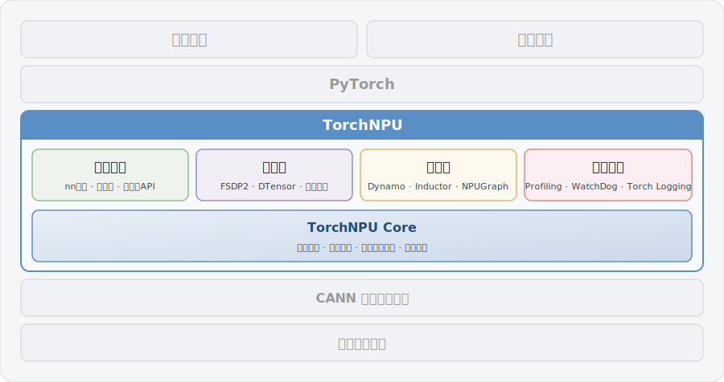

<h1 align="center">TorchNPU</h1>

<p align="center">
  <strong>基于昇腾NPU的PyTorch适配插件</strong>
</p>

<p align="center">
  <a href="./README.md">English</a> · 中文
</p>

<p align="center">
  <a href="#安装">安装</a> ·
  <a href="#快速开始">快速开始</a> ·
  <a href="./COMPATIBILITY.md">版本配套</a> ·
  <a href="./SUPPORT.md">支持说明</a> ·
  <a href="./CONTRIBUTING.md">贡献指南</a> ·
  <a href="https://www.hiascend.com/developer/software/ai-frameworks/pytorch/document">文档</a> ·
  <a href="https://www.hiascend.com/cn/developer/software/ai-frameworks/pytorch">社区</a>
</p>

<p align="center">
  
  
  <a href="./LICENSE"></a>
  <a href="https://pypi.org/project/torch-npu/"></a>
  
  <a href="https://gitcode.com/Ascend/pytorch"></a>
  <a href="https://github.com/Ascend/pytorch"></a>
  
  
  
</p>

---

## 简介

作为 Ascend for PyTorch 社区的核心组件，**TorchNPU** 是昇腾专为 PyTorch 打造的深度学习适配插件，使 PyTorch 框架能够直接调用昇腾 NPU，为开发者提供昇腾 AI 处理器的超强算力。

昇腾为基于华为昇腾 AI 处理器和软件的行业应用及服务提供全栈 AI 计算基础设施。您可以通过访问[昇腾社区](https://www.hiascend.com/zh/)，了解关于昇腾的更多信息。

## 核心特性

TorchNPU 充分继承和复用上游 PyTorch 的大量成熟功能，并在此基础上针对昇腾 NPU 进行深度适配与优化，下图展示了 TorchNPU 的主要功能模块：

<div align="center">
  
</div>

**TorchNPU 主要模块介绍：**

- **基础计算：** 广泛支持 PyTorch 原生 API 及自定义 API，覆盖主流AI场景，提供一致性体验，支撑用户快速实现模型和算法。
- **分布式：** 支持通过 FSDP2 加速分布式训练，核心计算 API 支持 Dtensor，支持 AllGather、AllReduce、AllToAll 等集合通信原语，和 Send、Recv 等点对点通信原语。
- **图模式：** 通过“动态图捕获+静态图优化+高效代码生成”的方式显著加速模型训练和推理任务，并支持通过 NPUGraph 下沉执行，在 2.6.0 以上版本已支持。
- **调试调优：** 支持 Profiling 分析计算、通信和内存使用，支持通过 WatchDog 实时监控分析通信异常。
- **TorchNPU Core：** 支持虚拟内存管理降低内存碎片，在分布式场景支持跨流内存复用优化，通过 PrivateUse1 将算子和设备资源接入 PyTorch。

## 最新动态

- 📢 [2026-06-30] Ascend for PyTorch 社区相关组件名称规范统一预告。[🔗 了解更多](https://www.hiascend.com/productbulletins/detail/791)
- 📢 [2026-04-30] TorchNPU 26.0.0 版本发布，新增支持 PyTorch 2.10.0，支持Python3.13， 新增P2P通信支持group下发、DTensor策略扩展等特性。[🔗 了解更多](https://www.hiascend.com/productbulletins/detail/779)

## 安装

### 软件包安装

以安装 TorchNPU 2.10.0.post2 版本为例，请按照以下命令进行安装。下载其他版本的方式请参见社区下载页面 [TorchNPU 下载](https://www.hiascend.com/developer/software/ai-frameworks/pytorch/download)。

#### 安装 CANN

安装 9.0.0 版本的 CANN，具体步骤请参见 [CANN 安装指南](https://www.hiascend.com/cann/download)。

#### 安装 PyTorch

执行以下命令安装 PyTorch 2.10.0：

```bash
pip install torch==2.10.0 --index-url https://download.pytorch.org/whl/cpu
```

#### 安装 TorchNPU

执行以下命令安装 TorchNPU 2.10.0.post2：

```bash
pip install torch-npu==2.10.0.post2
```

### 源码编译安装

编译 TorchNPU 的详细步骤请参见 [TorchNPU 源码安装指南](https://www.hiascend.com/document/detail/zh/Pytorch/latest/configandinstg/instg/docs/zh/installation_guide/compilation_installation_using_source_code.md)。

## 快速开始

### 初始化环境

```shell
# 默认路径，请根据实际安装位置修改
source /usr/local/Ascend/ascend-toolkit/set_env.sh
```

### 运行示例

```python
import torch
import torch_npu

x = torch.randn(2, 2).npu()
y = torch.randn(2, 2).npu()
z = x.mm(y)
print(z)
```

> 从 TorchNPU 2.5.1 版本起，`import torch_npu` 不再是强制要求（会自动注册），但建议在代码中显式导入以确保设备初始化。

输出如下类似信息说明运行成功:

```text
tensor([[-0.0515,  0.3664],
        [-0.1258, -0.5425]], device='npu:0')
```

完整的模型迁移和训练教程，请参见 [TorchNPU 快速入门](https://www.hiascend.com/document/detail/zh/Pytorch/latest/fastexperience/docs/zh/quick_start/quick_start.md)。

## 社区交流

Ascend for PyTorch 社区由多个 Special Interest Groups（SIGs）组成，每个 SIG 负责特定技术领域的开发、维护和社区协作。以下是当前所有 SIG 的列表，点击对应链接可查看详细说明。

|      SIG名称      | 简要描述                                                                                                   |                                               链接                                                |
|:---------------:|:-------------------------------------------------------------------------------------------------------|:-----------------------------------------------------------------------------------------------:|
|    Core SIG     | 聚焦于昇腾 NPU 平台上的 PyTorch 核心适配层开发，负责 `TorchNPU` 扩展库及其算子插件 `OpPlugin` 的设计、实现与维护。                           |    [🔗 了解更多](https://gitcode.com/Ascend/community/tree/master/FrameworkPTAdapter/sigs/core)     |
| Distributed SIG | 致力于在昇腾 NPU 硬件底座上，围绕 PyTorch 分布式训练框架（torch.distributed）构建高效、易用、可扩展的并行训练能力，为大语言模型、多模态模型和强化学习等场景提供极致性能体验。 | [🔗 了解更多](https://gitcode.com/Ascend/community/tree/master/FrameworkPTAdapter/sigs/distributed) |
| Graph Mode SIG  | 聚焦于 Dynamo、Inductor、NPUGraph等核心技术，旨在通过自动化的图捕捉与编译优化技术，弥合“易用性”与“高性能”之间的鸿沟。                               | [🔗 了解更多](https://gitcode.com/Ascend/community/tree/master/FrameworkPTAdapter/sigs/graph-mode)  |
|  Usability SIG  | 致力于推动Ascend for PyTorch易用性体验提升，包含文档、教程、案例等。                                                            |  [🔗 了解更多](https://gitcode.com/Ascend/community/tree/master/FrameworkPTAdapter/sigs/usability)  |

每个SIG都有自己的例会、邮件列表和贡献指南。点击对应的SIG链接可查看详细联系方式、工作目标及参与方式。欢迎大家为社区做贡献。如果有任何疑问或建议，请提交 [GitCode Issues](https://gitcode.com/Ascend/pytorch/issues)，我们会尽快回复。感谢您的支持。

## 安全声明

TorchNPU 的系统安全加固、运行用户建议和文件权限控制等内容，请参见 [安全声明](SECURITYNOTE.md)。

## 免责声明

本插件仅供调试和开发使用。使用者需自行保证输入命令行的安全性，并对使用过程中产生的数据做好权限控制。使用本插件即表示您同意并接受以上声明。

## License

TorchNPU 的使用许可证，请参见 [LICENSE](LICENSE) 文件。 TorchNPU 资料文档的使用许可证，请参见 [LICENSE](./docs/LICENSE) 文件。

## 致谢

感谢来自社区的每一个 PR，欢迎开发者向 TorchNPU 插件贡献代码！
