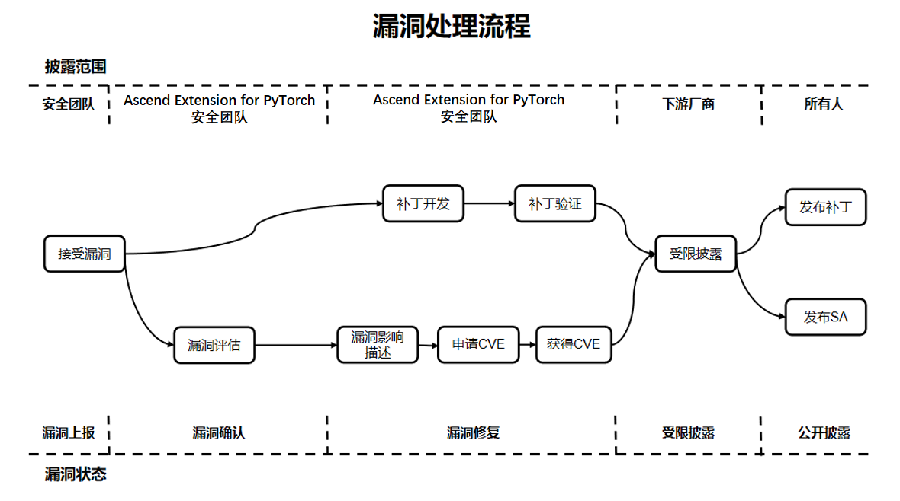

# Ascend Extension for PyTorch插件 安全声明

## 系统安全加固

建议用户在系统中配置开启ASLR（级别2 ），又称**全随机地址空间布局随机化**，可参考以下方式进行配置：

    echo 2 > /proc/sys/kernel/randomize_va_space

## 运行用户建议

出于安全性及权限最小化角度考虑，不建议使用root等管理员类型账户使用torch_npu。

## 文件权限控制

1. 建议用户对训练所需文件、训练过程中保存的文件、用户个人的隐私数据、商业资产等敏感文件做好权限控制等安全措施，例如多用户共享数据集场景下的数据集文件写权限控制、profiler等场景产生数据文件权限控制等，设定的权限建议参考[文件权限参考](#文件权限参考)进行设置。

2. torch_npu中profiler工具会生成性能记录文件，生成的文件权限为640，文件夹权限为750，用户可根据需要自行对生成后的相关文件进行权限控制。

3. 用户安装和使用过程需要做好权限控制，建议参考[文件权限参考](#文件权限参考)进行设置。如需要保存安装/卸载日志，可在安装/卸载命令后面加上参数--log <FILE>， 注意对<FILE>文件及目录做好权限管控。

4. PyTorch框架运行中所生成的文件权限依赖系统设定，如torch.save接口保存的文件。建议当前执行脚本的用户根据自身需要，对生成文件做好权限控制，设定的权限可参考[文件权限参考](#文件权限参考) 。可使用umask控制默认权限，降低提权等安全风险，建议用户将主机（包括宿主机）和容器中的umask设置为0027及其以上，提高安全性。

##### 文件权限参考

|   类型                             |   Linux权限参考最大值   |
|----------------------------------- |-----------------------|
|  用户主目录                         |   750（rwxr-x---）     |
|  程序文件(含脚本文件、库文件等)       |   550（r-xr-x---）     |
|  程序文件目录                       |   550（r-xr-x---）     |
|  配置文件                           |   640（rw-r-----）     |
|  配置文件目录                       |   750（rwxr-x---）     |
|  日志文件(记录完毕或者已经归档)       |   440（r--r-----）     |
|  日志文件(正在记录)                  |   640（rw-r-----）    |
|  日志文件目录                       |   750（rwxr-x---）     |
|  Debug文件                         |   640（rw-r-----）      |
|  Debug文件目录                      |   750（rwxr-x---）     |
|  临时文件目录                       |   750（rwxr-x---）     |
|  维护升级文件目录                   |   770（rwxrwx---）      |
|  业务数据文件                       |   640（rw-r-----）      |
|  业务数据文件目录                   |   750（rwxr-x---）      |
|  密钥组件、私钥、证书、密文文件目录   |   700（rwx------）      |
|  密钥组件、私钥、证书、加密密文       |   600（rw-------）     |
|  加解密接口、加解密脚本              |   500（r-x------）      |

## 调试工具声明

torch_npu内集成性能分析工具profiler：
 - 集成原因：对标pytorch原生支持能力，提供NPU PyTorch框架开发性能分析能力，加速性能分析调试过程。
 - 使用场景：默认不采集，如用户需要进行性能分析时，可在模型训练脚本中添加Ascend Extension for PyTorch Profiler接口，执行训练的同时采集性能数据，完成训练后直接输出可视化的性能数据文件。
 - 风险提示：使用该功能会在本地生成性能数据，用户需加强对相关性能数据的保护，请在需要模型性能分析时使用，分析完成后及时关闭。Profiler工具具体细节请参考[《PyTorch 性能分析工具介绍》](https://www.hiascend.com/document/detail/zh/Pytorch/60RC2/ptmoddevg/trainingmigrguide/performance_tuning_0013.html)。

## 数据安全声明

1. PyTorch使用过程中需要加载和保存数据，部分接口使用风险模块pickle，可能存在数据风险，如torch.load、torch.jit.load、torch.distributed.scatter_object_list等接口，可参考[torch.load](https://pytorch.org/docs/main/generated/torch.load.html#torch.load)、[collective-functions](https://pytorch.org/docs/main/distributed.html#collective-functions)了解具体风险。
2. Ascend Extension for PyTorch依赖CANN的基础能力实现AOE性能调优、算子dump、日志记录等功能，用户需要关注上述功能生成文件的权限控制，加强对相关数据的保护。

## 构建安全声明

torch_npu支持源码编译安装，在编译时会下载依赖第三方库并执行构建shell脚本，在编译过程中会产生临时程序文件和编译目录。用户可根据需要自行对源代码目录内的文件进行权限管控降低安全风险。

## 运行安全声明

1. 建议用户结合运行环境资源状况编写对应训练脚本。若训练脚本与资源状况不匹配，如数据集加载内存大小超出内存容量限制、训练脚本在本地生成数据超过磁盘空间大小等情况，可能引发错误并导致进程意外退出。
2. PyTorch和torch_npu在运行异常时会退出进程并打印报错信息，属于正常现象。建议用户根据报错提示定位具体错误原因，包括设定算子同步执行、查看CANN日志、解析生成的Core Dump文件等方式。
3. PyTorch和torch_npu的分布式特性仅适用于内部通信。出于性能考虑，这些分布式特性不包含任何授权协议，并且会发送未加密的消息。关于PyTorch分布式特性的详细说明及安全注意事项，可参考[using-distributed-features](https://github.com/pytorch/pytorch/security#using-distributed-features)。

## 公网地址声明

在torch_npu的配置文件和脚本中存在[公网地址](#公网地址)

##### 公网地址

| 类型   | 开源代码地址                                                                                                                                                                                                                         | 文件名                                    | 公网IP地址/公网URL地址/域名/邮箱地址                                                        | 用途说明                           |
|------|--------------------------------------------------------------------------------------------------------------------------------------------------------------------------------------------------------------------------------|----------------------------------------|-------------------------------------------------------------------------------|--------------------------------|
| 自研   | 不涉及                                                                                                                                                                                                                            | .gitmodules                   | https://gitee.com/ascend/op-plugin.git                         | 依赖的开源代码仓            |
| 自研   | 不涉及                                                                                                                                                                                                                            | .gitmodules                   | https://gitee.com/mirrors/googletest.git                         | 依赖的开源代码仓            |
| 自研   | 不涉及                                                                                                                                                                                                                            | .gitmodules                   | https://gitee.com/ascend/torchair.git                         | 依赖的开源代码仓            |
| 自研   | 不涉及                                                                                                                                                                                                                            | .gitmodules                   | https://gitee.com/ascend/Tensorpipe.git                        | 依赖的开源代码仓            |
| 自研   | 不涉及                                                                                                                                                                                                                            | .gitmodules                   | https://gitee.com/mirrors/fmt.git                       | 依赖的开源代码仓            |
| 自研   | 不涉及                                                                                                                                                                                                                            | .gitmodules                   | https://gitee.com/mirrors/nlohmann-json.git              | 依赖的开源代码仓            |
| 自研   | 不涉及                                                                                                                                                                                                                            | ci\docker\X86\Dockerfile               | https://mirrors.huaweicloud.com/repository/pypi/simple                        | docker配置文件，用于配置pip源            |
| 自研   | 不涉及                                                                                                                                                                                                                            | ci\docker\X86\Dockerfile               | https://download.pytorch.org/whl/cpu                                          | docker配置源，用于配置torch下载连接        |
| 自研   | 不涉及                                                                                                                                                                                                                            | ci\docker\ARM\Dockerfile               | https://mirrors.huaweicloud.com/repository/pypi/simple                        | docker配置文件，用于配置pip源            |
| 自研   | 不涉及                                                                                                                                                                                          | ci\docker\X86\Dockerfile                      | https://mirrors.wlnmp.com/centos/Centos7-aliyun-altarch.repo                 | docker配置文件，用于配置yum源            |
| 自研   | 不涉及                                                                                                                                                                                          | ci\docker\ARM\Dockerfile                      | https://mirrors.wlnmp.com/centos/Centos7-aliyun-altarch.repo                 | docker配置文件，用于配置yum源            |
| 自研   | 不涉及                                                                                                                                                                                                                            | .github\workflows\\_build-and-test.yml | https://mirrors.huaweicloud.com/repository/pypi/simple                        | workflow配置文件，用于配置pip源          |
| 自研   | 不涉及                                                                                                                                                                                                                            | setup.cfg                              | https://gitee.com/ascend/pytorch                                              | 用于打包whl的url入参                  |
| 自研   | 不涉及                                                                                                                                                                                                                            | setup.cfg                              | https://gitee.com/ascend/pytorch/tags                                         | 用于打包whl的download_url入参         |
| 自研   | 不涉及                                                                                                                                                                                                                            | third_party\op-plugin\ci\build.sh      | https://gitee.com/ascend/pytorch.git                                          | 编译脚本根据torch_npu仓库地址拉取代码进行编译    |
| 自研   | 不涉及                                                                                                                                                                                                                            | third_party\op-plugin\ci\exec_ut.sh    | https://gitee.com/ascend/pytorch.git                                          | UT脚本根据torch_npu仓库地址下拉取代码进行UT测试 |
| 开源引入 | https://github.com/pytorch/pytorch/blob/v2.5.1/test/nn/test_convolution.py <br> https://github.com/pytorch/pytorch/blob/v2.5.1/test/test_mps.py <br> https://github.com/pytorch/pytorch/blob/v2.5.1/test/test_serialization.py | test\url.ini                           | https://download.pytorch.org/test_data/legacy_conv2d.pt                       | 用于test脚本下载相关pt文件               |
| 开源引入 | https://github.com/pytorch/pytorch/blob/v2.5.1/test/test_serialization.py                                                                                                                                                      | test\url.ini                           | https://download.pytorch.org/test_data/legacy_serialized.pt                   | 用于test脚本下载相关pt文件               |
| 开源引入 | https://github.com/pytorch/pytorch/blob/v2.5.1/test/test_serialization.py                                                                                                                                                      | test\url.ini                           | https://download.pytorch.org/test_data/gpu_tensors.pt                         | 用于test脚本下载相关pt文件               |
| 开源引入 | https://github.com/pytorch/pytorch/blob/v2.5.1/test/onnx/test_utility_funs.py                                                                                                                                                  | test\url.ini                           | https://github.com/pytorch/pytorch/issues/new?template=bug-report.yml         | issue的链接                       |
| 开源引入 | https://github.com/pytorch/pytorch/blob/v2.5.1/test/test_nn.py <br> https://github.com/pytorch/pytorch/blob/v2.5.1/test/test_serialization.py                                                                                  | test\url.ini                           | https://download.pytorch.org/test_data/linear.pt                              | 用于test脚本下载相关pt文件               |
| 自研   | 不涉及                                                                                                                                                                                                                            | torch_npu\npu\config.yaml              | https://raw.githubusercontent.com/brendangregg/FlameGraph/master/flamegraph.pl | 火焰图脚本下载路径                      |
| 自研   | 不涉及                                                                                                                                                                                                                            | test\requirements.txt                  | https://download.pytorch.org/whl/cpu                                   | 下载链接，用于下载torch-cpu版本           |
| 自研   | 不涉及                                                                                                                                                                                                                            | test\requirements.txt                  | https://data.pyg.org/whl/torch-2.4.0+cpu.html                                 | 下载链接，用于下载torch-scatter的cpu版本   |
| 自研   | 不涉及                                                                                                                                                                                                                            | requirements.txt                       | https://download.pytorch.org/whl/cpu                                  | 下载链接，用于下载torch-cpu版本           |
| 自研   | 不涉及                                                                                                                                                                                                                            | test\get_synchronized_files.sh         | https://github.com/pytorch/pytorch.git                                        | 下载链接，用于下载pytorch的测试用例        |

## 公开接口声明

Ascend Extension for PyTorch是PyTorch适配插件，支持用户使用PyTorch在昇腾设备上进行训练和推理。Ascend Extension for PyTorch适配后支持用户使用PyTorch原生接口。除了原生PyTorch接口外，Ascend Extension for PyTorch提供了部分自定义接口，包括自定义算子、亲和库和其他接口，支持PyTorch接口和自定义接口连接，具体可参考[《PyTorch API参考》](https://www.hiascend.com/document/detail/zh/Pytorch/60RC2/apiref/apilist/ptaoplist_000001.html)。

参考[PyTorch社区公开接口规范](https://github.com/pytorch/pytorch/wiki/Public-API-definition-and-documentation)，Ascend Extension for PyTorch提供了对外的自定义接口。如果一个函数看起来符合公开接口的标准且在文档中有展示，则该接口是公开接口。否则，使用该功能前可以在社区询问该功能是否确实是公开的或意外暴露的接口，因为这些未暴露接口将来可能会被修改或者删除。

Ascend Extension for PyTorch项目采用C++和Python联合开发，当前除Libtorch场景外正式接口只提供Python接口，在torch_npu的二进制包中动态库不直接提供服务，暴露的接口为内部使用，不建议用户使用。

## 通信安全加固

PyTorch分布式训练服务需要在设备间进行通信，通信开启的端口默认为全0侦听，为了降低安全风险，建议用户针对此场景进行安全加固，如使用iptables配置防火墙，在运行分布式训练开始前限制外部对分布式训练使用端口的访问，在运行分布式训练结束后清理防火墙规则。

1. 防火墙规则设定和移除参考脚本模板
    - 防火墙规则设定，可参考如下脚本：

    ```
    #!/bin/bash
    set -x

    # 要限制的端口号
    port={端口号}

    # 清除旧规则
    iptables -D INPUT -p tcp -j {规则名}
    iptables -F {规则名}
    iptables -X {规则名}

    # 创建新的规则链
    iptables -t filter -N {规则名}

    # 在多机场景下设定白名单，允许其他节点访问主节点的侦听端口
    # 在规则链中添加允许特定IP地址范围的规则
    iptables -t filter -A {规则名} -i eno1 -p tcp --dport $port -s {允许外部访问的IP} -j ACCEPT

    # 屏蔽外部地址访问分布式训练端口
    # 在PORT-LIMIT-RULE规则链中添加拒绝其他IP地址的规则
    iptables -t filter -A {规则名} -i {要限制的网卡名} -p tcp --dport $port -j DROP

    # 将流量传递给规则链
    iptables -I INPUT -p tcp -j {规则名}
    ```

    - 防火墙规则移除，可参考如下脚本：

    ```
    #!/bin/bash
    set -x
    # 清除规则
    iptables -D INPUT -p tcp -j {规则名}
    iptables -F {规则名}
    iptables -X {规则名}
    ```

2. 防火墙规则设定和移除参考脚本示例
    1. 针对特定端口设定防火墙，脚本中端口号为要限制的端口，在PyTorch分布式训练中端口号请参考[通信矩阵信息](#通信矩阵信息)；要限制的网卡名为服务器用于分布式通信使用的网卡，允许的外部访问的IP为分布式训练服务器的IP地址。网卡和服务器IP可以通过ifconfig查看，如下文回显的eth0为网卡名，192.168.1.1为服务器IP地址：

        ```
        # ifconfig
        eth0
            inet addr:192.168.1.1 Bcast:192.168.1.255 Mask:255.255.255.0
            inet6 addr: fe80::230:64ee:ef1a:c1a/64 Scope:Link
        ```
    2. 假定服务器主节点地址192.168.1.1，另一台需要进行分布式训练的服务器为192.168.1.2，训练端口为29510。
        - 防火墙规则设定，可参考如下脚本：

        ```
        #!/bin/bash
        set -x

        # 设定侦听的端口
        port=29510

        # 清除旧规则
        iptables -D INPUT -p tcp -j PORT-LIMIT-RULE
        iptables -F PORT-LIMIT-RULE
        iptables -X PORT-LIMIT-RULE

        # 创建新的PORT-LIMIT-RULE规则链
        iptables -t filter -N PORT-LIMIT-RULE

        # 在多机场景下设定白名单，允许192.168.1.2访问主节点
        # 在PORT-LIMIT-RULE规则链中添加允许特定IP地址范围的规则
        iptables -t filter -A PORT-LIMIT-RULE -i eno1 -p tcp --dport $port -s 192.168.1.2 -j ACCEPT

        # 屏蔽外部地址访问分布式训练端口
        # 在PORT-LIMIT-RULE规则链中添加拒绝其他IP地址的规则
        iptables -t filter -A PORT-LIMIT-RULE -i eth0 -p tcp --dport $port -j DROP

        # 将流量传递给PORT-LIMIT-RULE规则链
        iptables -I INPUT -p tcp -j PORT-LIMIT-RULE
        ```

        - 防火墙规则移除，可参考如下脚本：

        ```
        #!/bin/bash
        set -x
        # 清除规则
        iptables -D INPUT -p tcp -j PORT-LIMIT-RULE
        iptables -F PORT-LIMIT-RULE
        iptables -X PORT-LIMIT-RULE
        ```

## 通信矩阵

PyTorch提供分布式训练能力，支持在单机和多机场景下进行训练，需要进行网络通信。其中PyTorch需要使用TCP进行通信，torch_npu使用CANN中HCCL在NPU设备间通信，通信端口见[通信矩阵信息](#通信矩阵信息)。用户需要注意并保障节点间通信网络安全，可以使用iptables等方式消减安全风险，可参考[通信安全加固](#通信安全加固)进行网络安全加固。

##### 通信矩阵信息

| 组件                  |  PyTorch                             |  HCCL                                |
| --------------------- | ------------------------------------ | ------------------------------------ |
| 源设备                | 运行torch_npu进程的服务器              | 运行torch_npu进程的服务器             |
| 源IP                  | 设备地址IP                            | 设备地址IP                            |
| 源端口                | 操作系统自动分配，分配范围由操作系统的自身配置决定      | 默认值为60000，取值范围[1024,65520]。用户可以通过HCCL_IF_BASE_PORT环境变量指定Host网卡起始端口号，配置后系统默认占用以该端口起始的16个端口      |
| 目的设备              | 运行torch_npu进程的服务器              | 运行torch_npu进程的服务器              |
| 目的IP                | 设备地址IP                            | 设备地址IP                            |
| 目的端口 （侦听）      | 默认29500/29400，用户可以设定端口号     | 默认值为60000，取值范围[1024,65520]。用户可以通过HCCL_IF_BASE_PORT环境变量指定Host网卡起始端口号，配置后系统默认占用以该端口起始的16个端口      |
| 协议                  | TCP                                  | TCP                                   |
| 端口说明              | 分布式场景下 <br> 1. torchrun/torch.distributed.launch <br> (1) backend为static时（默认该backend），目的端口（默认29500）用于接收和发送数据，源端口用于接收和发送数据。使用master-addr指定地址，master-port指定端口 <br> (2) backend为c10d时，目的端口（默认29400）用于接收和发送数据，源端口用于接收和发送数据。使用rdzv_endpoint指定地址和端口号，格式为"地址:端口号" <br> 2. torch_npu_run:目的端口（默认29500）用于接收和发送数据，源端口用于接收和发送数据。使用master-addr指定地址，master-port指定端口       | 默认值为60000，取值范围[1024,65520]。用户可以通过HCCL_IF_BASE_PORT环境变量指定Host网卡起始端口号，配置后系统默认占用以该端口起始的16个端口       |
| 侦听端口是否可更改     | 是                                    | 是                                    |
| 认证方式              | 无认证方式                             | 无认证方式                             |
| 加密方式              | 无                                    | 无                                    |
| 所属平面              | 不涉及                                | 不涉及                                 |
| 版本                  | 所有版本                              | 所有版本                               |
| 特殊场景              | 无                                    | 无                                     |
| 备注                  | 该通信过程由开源软件PyTorch控制，配置为PyTorch原生设置，可参考[PyTorch文档](https://pytorch.org/docs/stable/distributed.html#launch-utility)。源端口由操作系统自动分配，分配范围由操作系统的配置决定，例如ubuntu：采用/proc/sys/net/ipv4/ipv4_local_port_range文件指定，可通过cat /proc/sys/net/ipv4/ipv4_local_port_range或sysctl net.ipv4.ip_local_port_range查看       | 该通信过程由CANN中HCCL组件控制，torch_npu不进行控制，端口范围可参考[《环境变量参考》](https://www.hiascend.com/document/detail/zh/canncommercial/80RC2/apiref/envvar/envref_07_0001.html)的“执行相关 > 集合通信与分布式训练 > 集合通信相关配置>HCCL_IF_BASE_PORT”          |

## 漏洞机制说明

Ascend Extension for PyTorch 社区非常重视社区版本的安全性，专门设置了漏洞管理专员负责处理漏洞相关的事务，同时为了构建更安全的AI全流程工具链，我们也欢迎您一起参与。

### 漏洞处理流程

对于每一个安全漏洞，Ascend Extension for PyTorch 社区会安排人员进行跟踪和处理，漏洞处理的端到端流程如下图所示。



下面将重点解释漏洞上报、漏洞评估、漏洞披露的流程。

### 漏洞上报

您可以通过提交issue的方式联系 Ascend Extension for PyTorch 社区团队，我们将会第一时间安排安全漏洞专项人员向您联系。
注意，为了确保安全性，请不要在issue中描述涉及安全隐私的具体信息。

#### 上报响应

1. Ascend Extension for PyTorch 社区会在3个工作日内确认、分析、上报安全漏洞问题，同时启动安全处理流程。
2. Ascend Extension for PyTorch 安全团队在确认安全漏洞问题后，会对问题进行分发和跟进。
3. 在安全漏洞问题从分类、确定、修复和发布的过程中，我们会及时更新报告。

### 漏洞评估

业界普遍使用 CVSS 标准评估漏洞的严重性，Ascend Extension for PyTorch 在使用 CVSS v3.1 进行漏洞评估时，需要设定漏洞攻击场景，基于在该攻击场景下的实际影响进行评估。漏洞严重等级评估是指针对漏洞利用难易程度，以及利用后对机密性、完整性、可用性的影响进行评估，并生成一个评分值。

#### 漏洞评估标准

Ascend Extension for PyTorch 通过以下向量评估一个漏洞的严重等级：

- 攻击向量（AV）：表示攻击的“远程性”以及如何利用此漏洞。
- 攻击复杂性（AC）：讲述攻击执行的难度以及成功进行攻击需要哪些因素。
- 用户交互（UI）：确定攻击是否需要用户参与。
- 所需的权限（PR）：记录成功进行攻击所需的用户身份验证级别。
- 范围（S）：确定攻击者是否可以影响具有不同权限级别的组件。
- 机密性（C）：衡量信息泄露给非授权方后导致的影响程度。
- 完整性（I）：衡量信息被篡改后导致的影响程度。
- 可用性（A）：衡量用户在需要访问数据或服务时受影响的程度。

#### 评估原则

- 评估漏洞的严重等级，不是评估风险。
- 评估时必须基于攻击场景，且保证在该场景下，攻击者成功攻击后能对系统造成机密性、完整性、可用性影响。
- 当安全漏洞有多个攻击场景时，应以造成最大的影响，即 CVSS 评分最高的攻击场景为依据。
- 被嵌入调用的库存在漏洞，要根据该库在产品中的使用方式，确定漏洞的攻击场景后进行评估。
- 安全缺陷不能被触发或不影响 CIA（机密性、完整性、可用性），CVSS 评分为 0 分。

#### 评估步骤

评估漏洞严重等级时，可根据下述步骤进行操作：

1. 设定可能的攻击场景，基于攻击场景评分。
2. 确定漏洞组件（Vulnerable Component）和受影响组件（Impact Component）。

3. 选择基础指标的值。

   - 可利用指标（攻击向量、攻击复杂度、所需权限、用户交互、范围）根据漏洞组件选择指标值。

   - 影响指标（机密性、完整性、可用性）要么反映对漏洞组件的影响，要么反映对受影响组件影响，以结果最严重的为准。

#### 严重等级划分

| **严重等级（Severity Rating）** | **CVSS评分（Score）** | **漏洞修复时长** |
| ------------------------------- | --------------------- | ---------------- |
| 致命（Critical）                | 9.0~10.0              | 7天              |
| 高（High）                      | 7.0~8.9               | 14天             |
| 中（Medium）                    | 4.0~6.9               | 30天             |
| 低（Low）                       | 0.1~3.9               | 30天             |

### 漏洞披露

安全漏洞修复后 Ascend Extension for PyTorch 社区会发布安全公告 （SA）以及安全说明（SN） ，安全公告内容包括该漏洞的技术细节、类型、上报人、CVE ID 以及受到该漏洞影响的版本和修复版本等信息。
为了保护 Ascend Extension for PyTorch 用户的安全，在进行调查、修复和发布安全公告之前， Ascend Extension for PyTorch 社区不会公开披露、讨论或确认 Ascend Extension for PyTorch 产品的安全问题。

### 附录

#### 安全公告（SA）

目前在维护版本，无安全漏洞

#### 安全说明（SN）

涉及第三方的开源组件部分漏洞说明：

PyTorch 2.6.0以下版本存在CVE-2025-32434漏洞，该漏洞因torch/serialization.py组件兼容性处理导致潜在的远程代码执行（RCE）风险。 torch_npu已参考[LINK](https://github.com/pytorch/pytorch/pull/145020)进行修复。