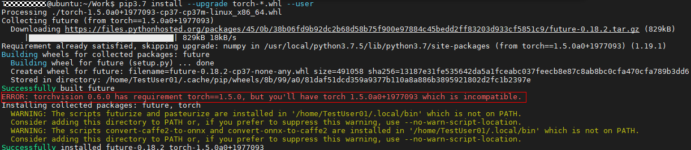

# FrameworkPTAdapter 2.0.2 PyTorch Installation Guide
-   [Overview](#overview)
-   [Manual Build and Installation](#manual-build-and-installation)
    -   [Prerequisites](#prerequisites)
    -   [Installing the PyTorch Framework](#installing-the-pytorch-framework)
    -   [Configuring Environment Variables](#configuring-environment-variables)
    -   [Installing the Mixed Precision Module](#installing-the-mixed-precision-module)
-   [Using the Ascend Hub Image](#using-the-ascend-hub-image)
    -   [Obtaining the PyTorch Image from the Ascend Hub](#obtaining-the-pytorch-image-from-the-ascend-hub)
    -   [Configuring Environment Variables](#configuring-environment-variables-0)
-   [References](#references)
    -   [Installing CMake](#installing-cmake)
    -   [How Do I Install GCC 7.3.0?](#how-do-i-install-gcc-7-3-0)
    -   [What Do I Do If "torch 1.5.0xxxx" and "torchvision" Do Not Match When torch-\*.whl Is Installed?](#what-do-i-do-if-torch-1-5-0xxxx-and-torchvision-do-not-match-when-torch--whl-is-installed)
<h2 id="overview">Overview</h2>

When setting up the environment for PyTorch model porting and training, you can manually build and install the modules adapted to the PyTorch framework on a training server, or use the base image provided by the Ascend Hub image center \(the PyTorch module and mixed precision module have been installed in the image\).

**Figure  1**  Environment setup process<a name="en-us_topic_0000001119176876_fig1938918396117"></a>  


<h2 id="manual-build-and-installation">Manual Build and Installation</h2>

-   **[Prerequisites](#prerequisites)**  

-   **[Installing the PyTorch Framework](#installing-the-pytorch-framework)**  

-   **[Configuring Environment Variables](#configuring-environment-variables)**  

-   **[Installing the Mixed Precision Module](#installing-the-mixed-precision-module)**  


<h2 id="prerequisites">Prerequisites</h2>

## Prerequisites<a name="en-us_topic_0000001105856382_en-us_topic_0275872734_section108914373254"></a>

-   The development or operating environment of CANN has been installed. For details, see the  _CANN Software Installation Guide_.
-   CMake 3.12.0 or later has been installed. For details about how to install CMake, see  [Installing CMake](#installing-cmake).
-   GCC 7.3.0 or later has been installed. For details about how to install and use GCC 7.3.0, see  [How Do I Install GCC 7.3.0?](#how-do-i-install-gcc-7-3-0).
-   The Patch and Git tools have been installed in the environment. To install the tools for Ubuntu and CentOS, run the following commands:
    -   Ubuntu

        ```
        apt-get install patch
        apt-get install git
        ```

    -   CentOS

        ```
        yum install patch
        yum install git
        ```


<h2 id="installing-the-pytorch-framework">Installing the PyTorch Framework</h2>

## Installation Process<a name="en-us_topic_0000001152776301_section1611810384557"></a>

1.  Log in to the server as the  **root**  user or a non-root user.
2.  Run the following commands in sequence to install the PyTorch dependencies.

    If you install Python and its dependencies as a non-root user, add  **--user**  at the end of each command in this step. Example command:  **pip3.7 install pyyaml --user**.

    ```
    pip3 install pyyaml
    pip3 install wheel
    ```

3.  Obtain the PyTorch source code.

    1.  Run the following command to obtain the PyTorch source code adapted to Ascend AI Processors:

        ```
        git clone https://gitee.com/ascend/pytorch.git
        ```

        The directory structure of the downloaded source code is as follows:

        ```
        pytorch
        │ ├─patch             # Directory of the patch adapted to Ascend AI Processors
        │    ├─npu.patch
        │ ├─scripts           # Build and create a directory.
        │    ├─gen.sh
        │ ├─src               # Source code directory
        │ ├─test              # Directory for storing test cases
        │ ├─README.md
        ```

    2.  Run the following commands to go to the  **pytorch**  directory and obtain the native PyTorch source code:

        ```
        cd pytorch
        git clone -b v1.5.0 --depth=1 https://github.com/pytorch/pytorch.git
        ```

        After the native PyTorch source code is downloaded, the main directory structure of the code is as follows:

        ```
        pytorch
        │ ├─patch             # Directory of the patch adapted to Ascend AI Processors
        │    ├─npu.patch
        │ ├─pytorch           # Directory for storing the native PyTorch code
        │ ├─scripts           # Build and create a directory.
        │    ├─gen.sh
        │ ├─src               # Source code directory
        │ ├─test              # Directory for storing test cases
        │ ├─README.md
        ```

    3.  Run the following commands to go to the native PyTorch code directory  **pytorch**  and obtain the PyTorch passive dependency code:

        ```
        cd  pytorch
        git submodule sync
        git submodule update --init --recursive
        ```

    > **NOTE:** 
    >Due to network fluctuation, it may take a long time to obtain the source code. If no error is reported after the download is complete, the PyTorch and third-party code on which PyTorch depends are generated.

4.  Generate the PyTorch installation package adapted to Ascend AI Processors.
    1.  Go to the  **pytorch/scripts**  directory and run the conversion script to generate full code adapted to Ascend AI Processors.

        ```
        cd ../scripts
        bash gen.sh
        ```

        The full code adapted to Ascend AI Processors is generated in the  **pytorch/pytorch**  directory.

    2.  Go to the full code directory  **pytorch/pytorch**, and compile and generate the binary installation package of PyTorch.

        ```
        cd ../pytorch
        bash build.sh
        ```

        The generated binary package is stored in the current dist directory  **pytorch/pytorch/dist**.

5.  <a name="en-us_topic_0000001152776301_li49671667141"></a>Install PyTorch.

    Go to the  **pytorch/pytorch/dist**  directory and run the following command to install PyTorch:

    ```
    pip3 install --upgrade torch-1.5.0+ascend-cp37-cp37m-linux_{arch}.whl
    ```

    _\{**arch\}**_  indicates the architecture information. The value can be  **aarch64**  or  **x86\_64**.

    > **NOTE:** 
    >To upgrade PyTorch in the environment, uninstall the PyTorch software package installed in the environment and then perform  [Step 5 Install PyTorch](#en-us_topic_0000001152776301_li49671667141). Run the following command to check whether PyTorch has been installed:
    >**pip3 list | grep torch**


<h2 id="configuring-environment-variables">Configuring Environment Variables</h2>

After the software packages are installed, configure environment variables to use Ascend PyTorch. You are advised to build a startup script, for example, the  **set\_env.sh**  script, and run  **source set\_env.sh**  to configure the environment variables. The content of the  **set\_env.sh**  script is as follows \(the  **root**  user is used as the installation user and the default installation path is used\):

```
cpu_type=$(echo $HOSTTYPE)

if [ x"${cpu_type}" == x"x86_64" ];then
  cpu_type=x86_64-linux
else
  cpu_type=arm64-linux
fi
if [ -d /usr/local/Ascend/nnae/latest ];then
	export LD_LIBRARY_PATH=/usr/local/:/usr/local/python3.7.5/lib/:/usr/local/openblas/lib:/usr/local/lib/:/usr/lib64/:/usr/lib/:/usr/local/Ascend/nnae/latest/fwkacllib/lib64/:/usr/local/Ascend/driver/lib64/common/:/usr/local/Ascend/driver/lib64/driver/:/usr/local/Ascend/add-ons/:/usr/lib/aarch64_64-linux-gnu:$LD_LIBRARY_PATH
  export PATH=$PATH:/usr/local/Ascend/nnae/latest/fwkacllib/ccec_compiler/bin/:/usr/local/Ascend/nnae/latest/toolkit/tools/ide_daemon/bin/
  export ASCEND_OPP_PATH=/usr/local/Ascend/nnae/latest/opp/
  export OPTION_EXEC_EXTERN_PLUGIN_PATH=/usr/local/Ascend/nnae/latest/fwkacllib/lib64/plugin/opskernel/libfe.so:/usr/local/Ascend/nnae/latest/fwkacllib/lib64/plugin/opskernel/libaicpu_engine.so:/usr/local/Ascend/nnae/latest/fwkacllib/lib64/plugin/opskernel/libge_local_engine.so
  export PYTHONPATH=/usr/local/Ascend/nnae/latest/fwkacllib/python/site-packages/:/usr/local/Ascend/nnae/latest/fwkacllib/python/site-packages/auto_tune.egg/auto_tune:/usr/local/Ascend/nnae/latest/fwkacllib/python/site-packages/schedule_search.egg:$PYTHONPATH
	export ASCEND_AICPU_PATH=/usr/local/Ascend/nnae/latest/
else
	export LD_LIBRARY_PATH=/usr/local/:/usr/local/lib/:/usr/lib64/:/usr/lib/:/usr/local/python3.7.5/lib/:/usr/local/openblas/lib:/usr/local/Ascend/ascend-toolkit/latest/fwkacllib/lib64/:/usr/local/Ascend/driver/lib64/common/:/usr/local/Ascend/driver/lib64/driver/:/usr/local/Ascend/add-ons/:/usr/lib/aarch64-linux-gnu:$LD_LIBRARY_PATH
	export PATH=$PATH:/usr/local/Ascend/ascend-toolkit/latest/fwkacllib/ccec_compiler/bin/:/usr/local/Ascend/ascend-toolkit/latest/toolkit/tools/ide_daemon/bin/
	export ASCEND_OPP_PATH=/usr/local/Ascend/ascend-toolkit/latest/opp/
	export OPTION_EXEC_EXTERN_PLUGIN_PATH=/usr/local/Ascend/ascend-toolkit/latest/fwkacllib/lib64/plugin/opskernel/libfe.so:/usr/local/Ascend/ascend-toolkit/latest/fwkacllib/lib64/plugin/opskernel/libaicpu_engine.so:/usr/local/Ascend/ascend-toolkit/latest/fwkacllib/lib64/plugin/opskernel/libge_local_engine.so
	export PYTHONPATH=/usr/local/Ascend/ascend-toolkit/latest/fwkacllib/python/site-packages/:/usr/local/Ascend/ascend-toolkit/latest/fwkacllib/python/site-packages/auto_tune.egg/auto_tune:/usr/local/Ascend/ascend-toolkit/latest/fwkacllib/python/site-packages/schedule_search.egg:$PYTHONPATH
	export ASCEND_AICPU_PATH=/usr/local/Ascend/ascend-toolkit/latest/${cpu_type}
fi
path_lib=$(python3.7 -c """
import sys
import re
result=''
for index in range(len(sys.path)):
    match_sit = re.search('-packages', sys.path[index])
    if match_sit is not None:
        match_lib = re.search('lib', sys.path[index])
        if match_lib is not None:
            end=match_lib.span()[1]
            result += sys.path[index][0:end] + ':'
        result+=sys.path[index] + '/torch/lib:'
print(result)"""
)
export LD_LIBRARY_PATH=/usr/local/python3.7.5/lib/:${path_lib}:$LD_LIBRARY_PATH
export TASK_QUEUE_ENABLE=1 

# (Optional) If the system is openEuler, run this command to cancel CPU core binding.
# unset GOMP_CPU_AFFINITY

# Select an HCCL initialization method and configure the corresponding environment variables in the following scenarios. The details are as follows:
# Scenario 1: Single-node scenario
export HCCL_WHITELIST_DISABLE=1 # Disable the HCCL trustlist.
# Scenario 2: Multi-node scenario
export HCCL_WHITELIST_DISABLE=1 # Disable the HCCL trustlist.
export HCCL_IF_IP="1.1.1.1"  # 1.1.1.1 is the NIC IP address of the host. Change it based on the site requirements. Ensure that the NIC IP addresses used can communicate with each other in the cluster.
```

[Table 1](#en-us_topic_0000001152616261_table42017516135)  describes related variables.

**Table  1**  Description of environment variables

<a name="en-us_topic_0000001152616261_table42017516135"></a>
<table><thead align="left"><tr id="en-us_topic_0000001152616261_row16198951191317"><th class="cellrowborder" valign="top" width="55.48%" id="mcps1.2.3.1.1"><p id="en-us_topic_0000001152616261_p51981251161315"><a name="en-us_topic_0000001152616261_p51981251161315"></a><a name="en-us_topic_0000001152616261_p51981251161315"></a>Environment Variable</p>
</th>
<th class="cellrowborder" valign="top" width="44.519999999999996%" id="mcps1.2.3.1.2"><p id="en-us_topic_0000001152616261_p9198135114133"><a name="en-us_topic_0000001152616261_p9198135114133"></a><a name="en-us_topic_0000001152616261_p9198135114133"></a>Description</p>
</th>
</tr>
</thead>
<tbody><tr id="en-us_topic_0000001152616261_row6882121917329"><td class="cellrowborder" valign="top" width="55.48%" headers="mcps1.2.3.1.1 "><p id="en-us_topic_0000001152616261_p688241953218"><a name="en-us_topic_0000001152616261_p688241953218"></a><a name="en-us_topic_0000001152616261_p688241953218"></a>LD_LIBRARY_PATH</p>
</td>
<td class="cellrowborder" valign="top" width="44.519999999999996%" headers="mcps1.2.3.1.2 "><p id="en-us_topic_0000001152616261_p1888291915322"><a name="en-us_topic_0000001152616261_p1888291915322"></a><a name="en-us_topic_0000001152616261_p1888291915322"></a>Dynamic library search path. Set this variable based on the preceding example.</p>
<p id="p1292181892120"><a name="p1292181892120"></a><a name="p1292181892120"></a>If you need to upgrade GCC in OSs such as CentOS, Debian, and BC-Linux, add <strong id="b6163826603"><a name="b6163826603"></a><a name="b6163826603"></a><em id="i161631926505"><a name="i161631926505"></a><a name="i161631926505"></a>${install_path}</em>/lib64</strong> to the <span class="parmname" id="parmname161637265015"><a name="parmname161637265015"></a><a name="parmname161637265015"></a><b>LD_LIBRARY_PATH</b></span> variable of the dynamic library search path. Replace <em id="i01649261704"><a name="i01649261704"></a><a name="i01649261704"></a><strong id="b1216317261109"><a name="b1216317261109"></a><a name="b1216317261109"></a>{install_path}</strong></em> with the GCC installation path. For details, see <a href="#how-do-i-install-gcc-7-3-0#en-us_topic_0000001135347812_en-us_topic_0000001173199577_en-us_topic_0000001172534867_en-us_topic_0276688294_li9745165315131">5</a>.</p>
</td>
</tr>
<tr id="en-us_topic_0000001152616261_row16194175523010"><td class="cellrowborder" valign="top" width="55.48%" headers="mcps1.2.3.1.1 "><p id="en-us_topic_0000001152616261_p16195185523019"><a name="en-us_topic_0000001152616261_p16195185523019"></a><a name="en-us_topic_0000001152616261_p16195185523019"></a>PYTHONPATH</p>
</td>
<td class="cellrowborder" valign="top" width="44.519999999999996%" headers="mcps1.2.3.1.2 "><p id="en-us_topic_0000001152616261_p19637083322"><a name="en-us_topic_0000001152616261_p19637083322"></a><a name="en-us_topic_0000001152616261_p19637083322"></a>Python search path. Set this variable based on the preceding example.</p>
</td>
</tr>
<tr id="en-us_topic_0000001152616261_row2954102119329"><td class="cellrowborder" valign="top" width="55.48%" headers="mcps1.2.3.1.1 "><p id="en-us_topic_0000001152616261_p195452113218"><a name="en-us_topic_0000001152616261_p195452113218"></a><a name="en-us_topic_0000001152616261_p195452113218"></a>PATH</p>
</td>
<td class="cellrowborder" valign="top" width="44.519999999999996%" headers="mcps1.2.3.1.2 "><p id="en-us_topic_0000001152616261_p964914893211"><a name="en-us_topic_0000001152616261_p964914893211"></a><a name="en-us_topic_0000001152616261_p964914893211"></a>Executable program search path. Set this variable based on the preceding example.</p>
</td>
</tr>
<tr id="en-us_topic_0000001152616261_row58592816294"><td class="cellrowborder" valign="top" width="55.48%" headers="mcps1.2.3.1.1 "><p id="en-us_topic_0000001152616261_p1886016892913"><a name="en-us_topic_0000001152616261_p1886016892913"></a><a name="en-us_topic_0000001152616261_p1886016892913"></a>ASCEND_OPP_PATH</p>
</td>
<td class="cellrowborder" valign="top" width="44.519999999999996%" headers="mcps1.2.3.1.2 "><p id="en-us_topic_0000001152616261_p28608892915"><a name="en-us_topic_0000001152616261_p28608892915"></a><a name="en-us_topic_0000001152616261_p28608892915"></a>Operator package (OPP) root directory. Set this variable based on the preceding example.</p>
</td>
</tr>
<tr id="en-us_topic_0000001152616261_row144592037903"><td class="cellrowborder" valign="top" width="55.48%" headers="mcps1.2.3.1.1 "><p id="en-us_topic_0000001152616261_p104601373014"><a name="en-us_topic_0000001152616261_p104601373014"></a><a name="en-us_topic_0000001152616261_p104601373014"></a>OPTION_EXEC_EXTERN_PLUGIN_PATH</p>
</td>
<td class="cellrowborder" valign="top" width="44.519999999999996%" headers="mcps1.2.3.1.2 "><p id="en-us_topic_0000001152616261_p1046013716017"><a name="en-us_topic_0000001152616261_p1046013716017"></a><a name="en-us_topic_0000001152616261_p1046013716017"></a>Path of the operator information library.</p>
</td>
</tr>
<tr id="en-us_topic_0000001152616261_row16184379493"><td class="cellrowborder" valign="top" width="55.48%" headers="mcps1.2.3.1.1 "><p id="en-us_topic_0000001152616261_p131851873492"><a name="en-us_topic_0000001152616261_p131851873492"></a><a name="en-us_topic_0000001152616261_p131851873492"></a>ASCEND_AICPU_PATH</p>
</td>
<td class="cellrowborder" valign="top" width="44.519999999999996%" headers="mcps1.2.3.1.2 "><p id="en-us_topic_0000001152616261_p181851575497"><a name="en-us_topic_0000001152616261_p181851575497"></a><a name="en-us_topic_0000001152616261_p181851575497"></a>Path of the AI CPU operator package.</p>
</td>
</tr>
<tr id="en-us_topic_0000001152616261_row234714854615"><td class="cellrowborder" valign="top" width="55.48%" headers="mcps1.2.3.1.1 "><p id="en-us_topic_0000001152616261_p2034724894619"><a name="en-us_topic_0000001152616261_p2034724894619"></a><a name="en-us_topic_0000001152616261_p2034724894619"></a>TASK_QUEUE_ENABLE</p>
</td>
<td class="cellrowborder" valign="top" width="44.519999999999996%" headers="mcps1.2.3.1.2 "><p id="en-us_topic_0000001152616261_p53477489462"><a name="en-us_topic_0000001152616261_p53477489462"></a><a name="en-us_topic_0000001152616261_p53477489462"></a>Whether to asynchronously deliver tasks and call the ACL APIs. You are advised to set this parameter to <strong id="en-us_topic_0000001152616261_b186701714141819"><a name="en-us_topic_0000001152616261_b186701714141819"></a><a name="en-us_topic_0000001152616261_b186701714141819"></a>1</strong> to enable this function.</p>
</td>
</tr>
<tr id="en-us_topic_0000001152616261_row1680820246202"><td class="cellrowborder" valign="top" width="55.48%" headers="mcps1.2.3.1.1 "><p id="en-us_topic_0000001152616261_p4809112415207"><a name="en-us_topic_0000001152616261_p4809112415207"></a><a name="en-us_topic_0000001152616261_p4809112415207"></a>HCCL_WHITELIST_DISABLE</p>
</td>
<td class="cellrowborder" valign="top" width="44.519999999999996%" headers="mcps1.2.3.1.2 "><p id="en-us_topic_0000001152616261_p952814428206"><a name="en-us_topic_0000001152616261_p952814428206"></a><a name="en-us_topic_0000001152616261_p952814428206"></a>Whether to enable the communication trustlist when the HCCL is used.</p>
<a name="ul928845132310"></a><a name="ul928845132310"></a><ul id="ul928845132310"><li><strong id="b12793231525"><a name="b12793231525"></a><a name="b12793231525"></a>0</strong>: enable the trustlist. The HCCL communication trustlist does not need to be verified.</li><li><strong id="b1146142619212"><a name="b1146142619212"></a><a name="b1146142619212"></a>1</strong>: disable the trustlist. The HCCL communication trustlist needs to be verified.</li></ul>
<p id="en-us_topic_0000001152616261_p5809162416201"><a name="en-us_topic_0000001152616261_p5809162416201"></a><a name="en-us_topic_0000001152616261_p5809162416201"></a>The default value is <strong id="en-us_topic_0000001152616261_b1270332516435"><a name="en-us_topic_0000001152616261_b1270332516435"></a><a name="en-us_topic_0000001152616261_b1270332516435"></a>0</strong>, indicating that the trustlist is enabled by default.</p>
</td>
</tr>
<tr id="en-us_topic_0000001152616261_row0671137162115"><td class="cellrowborder" valign="top" width="55.48%" headers="mcps1.2.3.1.1 "><p id="en-us_topic_0000001152616261_p4671203792114"><a name="en-us_topic_0000001152616261_p4671203792114"></a><a name="en-us_topic_0000001152616261_p4671203792114"></a>HCCL_IF_IP</p>
</td>
<td class="cellrowborder" valign="top" width="44.519999999999996%" headers="mcps1.2.3.1.2 "><p id="en-us_topic_0000001152616261_p1822165982114"><a name="en-us_topic_0000001152616261_p1822165982114"></a><a name="en-us_topic_0000001152616261_p1822165982114"></a>IP address of the NIC for initializing communication in the HCCL.</p>
<a name="ul2676102292415"></a><a name="ul2676102292415"></a><ul id="ul2676102292415"><li>The IP address is in dotted decimal notation.</li><li>Currently, only the host NIC is supported.</li></ul>
<p id="en-us_topic_0000001152616261_p1167163719217"><a name="en-us_topic_0000001152616261_p1167163719217"></a><a name="en-us_topic_0000001152616261_p1167163719217"></a>By default, the host communication NICs are selected in the following sequence: NICs other than Docker/local NICs (in ascending alphabetical order of NIC names) &gt; Docker NICs &gt; local NICs.</p>
</td>
</tr>
<tr id="en-us_topic_0000001152616261_row1371356152313"><td class="cellrowborder" valign="top" width="55.48%" headers="mcps1.2.3.1.1 "><p id="en-us_topic_0000001152616261_p16711563237"><a name="en-us_topic_0000001152616261_p16711563237"></a><a name="en-us_topic_0000001152616261_p16711563237"></a>unset GOMP_CPU_AFFINITY</p>
</td>
<td class="cellrowborder" valign="top" width="44.519999999999996%" headers="mcps1.2.3.1.2 "><p id="en-us_topic_0000001152616261_p0711356152317"><a name="en-us_topic_0000001152616261_p0711356152317"></a><a name="en-us_topic_0000001152616261_p0711356152317"></a>(Optional) If the system is openEuler, run this command to cancel CPU core binding.</p>
</td>
</tr>
</tbody>
</table>

<h2 id="installing-the-mixed-precision-module">Installing the Mixed Precision Module</h2>

## Prerequisites<a name="en-us_topic_0000001106176190_section3225481020"></a>

1.  Ensure that the PyTorch framework adapted to Ascend AI Processors in the operating environment can be used properly.
2.  Before building and installing Apex, you have configured the environment variables on which the build depends. See  [Configuring Environment Variables](#configuring-environment-variables).

## Installation Process<a name="en-us_topic_0000001106176190_section11880164819567"></a>

1.  Log in to the server as the  **root**  user or a non-root user.
2.  Obtain the Apex source code.

    1.  Run the following command to obtain the Apex source code adapted to Ascend AI Processors:

        ```
        git clone https://gitee.com/ascend/apex.git
        ```

        The directory structure of the downloaded source code is as follows:

        ```
        apex
        │ ├─patch             # Directory of the patch adapted to Ascend AI Processors
        │    ├─npu.patch
        │ ├─scripts           # Build and create a directory.
        │    ├─gen.sh
        │ ├─src               # Source code directory
        │ ├─tests              # Directory for storing test cases
        │ ├─README.md
        ```

    2.  Run the following commands to go to the  **apex**  directory and obtain the native Apex source code:

        ```
        cd apex
        git clone https://github.com/NVIDIA/apex.git
        ```

        After the native Apex source code is downloaded, the main directory structure of the code is as follows:

        ```
        apex
        │ ├─apex              # Directory for storing the native Apex code
        │ ├─patch             # Directory of the patch adapted to Ascend AI Processors
        │    ├─npu.patch
        │ ├─scripts           # Build and create a directory.
        │    ├─gen.sh
        │ ├─src               # Source code directory
        │ ├─tests              # Directory for storing test cases
        │ ├─README.md
        ```

    3.  Go to the native Apex code directory, that is,  **apex/apex**. Switch to the code branch whose commit ID is 4ef930c1c884fdca5f472ab2ce7cb9b505d26c1a.

        ```
        cd apex
        git checkout 4ef930c1c884fdca5f472ab2ce7cb9b505d26c1a
        cd ..
        ```

    > **NOTE:** 
    >Due to network fluctuation, it may take a long time to obtain the source code.

3.  Generate the Apex installation package adapted to Ascend AI Processors.
    1.  Go to the  **apex/scripts**  directory and run the conversion script to generate full code adapted to Ascend AI Processors.

        ```
        cd ../scripts
        bash gen.sh
        ```

        The full code adapted to Ascend AI Processors is generated in the  **apex/apex**  directory.

    2.  Go to the full code directory  **apex/apex**, and compile and generate the binary installation package of Apex.

        ```
        cd ../apex
        python3 setup.py --cpp_ext --npu_float_status bdist_wheel
        ```

        The generated binary package is stored in the current dist directory  **apex/apex/dist**.

4.  <a name="en-us_topic_0000001106176190_li425495374416"></a>Install Apex.

    Go to the  **apex/apex/dist**  directory and run the following command to install Apex:

    ```
    pip3.7 install --upgrade apex-0.1+ascend-cp37-cp37m-linux_{arch}.whl
    ```

    _\{**arch\}**_  indicates the architecture information. The value can be  **aarch64**  or  **x86\_64**.

    > **NOTE:** 
    >To upgrade PyTorch in the environment, uninstall the PyTorch software package installed in the environment and then perform  [Step 4 Install Apex](#en-us_topic_0000001106176190_li425495374416). Run the following command to check whether PyTorch has been installed:
    >**pip3 list | grep apex**


<h2 id="using-the-ascend-hub-image">Using the Ascend Hub Image</h2>

-   **[Obtaining the PyTorch Image from the Ascend Hub](#obtaining-the-pytorch-image-from-the-ascend-hub)**  

-   **[Configuring Environment Variables](#configuring-environment-variables-0)**  


<h2 id="obtaining-the-pytorch-image-from-the-ascend-hub">Obtaining the PyTorch Image from the Ascend Hub</h2>

## Prerequisites<a name="en-us_topic_0000001118701830_en-us_topic_0275872734_section108914373254"></a>

-   The development or operating environment of CANN has been installed. For details, see the  _CANN Software Installation Guide_.
-   Docker has been installed on the host.

## Obtaining and Using an Image<a name="en-us_topic_0000001118701830_section108941734162613"></a>

Log in to the  [Ascend Hub](https://ascendhub.huawei.com/#/home)  to obtain the required image. \(Activate the account when applying for an image for the first time.\)

[Table 1](#en-us_topic_0000001118701830_en-us_topic_0000001074498056_table1519011227314)  lists the supported images. Select an image that you want.

**Table  1**  Image list

<a name="en-us_topic_0000001118701830_en-us_topic_0000001074498056_table1519011227314"></a>
<table><thead align="left"><tr id="en-us_topic_0000001118701830_en-us_topic_0000001074498056_row0190152218319"><th class="cellrowborder" valign="top" width="55.00000000000001%" id="mcps1.2.4.1.1"><p id="en-us_topic_0000001118701830_en-us_topic_0000001074498056_p1419132211315"><a name="en-us_topic_0000001118701830_en-us_topic_0000001074498056_p1419132211315"></a><a name="en-us_topic_0000001118701830_en-us_topic_0000001074498056_p1419132211315"></a>Image Name</p>
</th>
<th class="cellrowborder" valign="top" width="20%" id="mcps1.2.4.1.2"><p id="en-us_topic_0000001118701830_en-us_topic_0000001074498056_p75071327115313"><a name="en-us_topic_0000001118701830_en-us_topic_0000001074498056_p75071327115313"></a><a name="en-us_topic_0000001118701830_en-us_topic_0000001074498056_p75071327115313"></a>Image Version</p>
</th>
<th class="cellrowborder" valign="top" width="25%" id="mcps1.2.4.1.3"><p id="en-us_topic_0000001118701830_en-us_topic_0000001074498056_p1024411406234"><a name="en-us_topic_0000001118701830_en-us_topic_0000001074498056_p1024411406234"></a><a name="en-us_topic_0000001118701830_en-us_topic_0000001074498056_p1024411406234"></a>CANN Version</p>
</th>
</tr>
</thead>
<tbody><tr id="en-us_topic_0000001118701830_en-us_topic_0000001074498056_row71915221134"><td class="cellrowborder" valign="top" width="55.00000000000001%" headers="mcps1.2.4.1.1 "><a name="en-us_topic_0000001118701830_en-us_topic_0000001074498056_ul81691515131910"></a><a name="en-us_topic_0000001118701830_en-us_topic_0000001074498056_ul81691515131910"></a><ul id="en-us_topic_0000001118701830_en-us_topic_0000001074498056_ul81691515131910"><li>ARM architecture: <a href="https://ascendhub.huawei.com/#/detail?name=ascend-pytorch-arm" target="_blank" rel="noopener noreferrer">ascend-pytorch-arm</a></li><li>x86 architecture: <a href="https://ascendhub.huawei.com/#/detail?name=ascend-pytorch-x86" target="_blank" rel="noopener noreferrer">ascend-pytorch-x86</a></li></ul>
</td>
<td class="cellrowborder" valign="top" width="20%" headers="mcps1.2.4.1.2 "><p id="en-us_topic_0000001118701830_en-us_topic_0000001074498056_p14648161414516"><a name="en-us_topic_0000001118701830_en-us_topic_0000001074498056_p14648161414516"></a><a name="en-us_topic_0000001118701830_en-us_topic_0000001074498056_p14648161414516"></a>21.0.2</p>
</td>
<td class="cellrowborder" valign="top" width="25%" headers="mcps1.2.4.1.3 "><p id="en-us_topic_0000001118701830_en-us_topic_0000001074498056_p1264815147514"><a name="en-us_topic_0000001118701830_en-us_topic_0000001074498056_p1264815147514"></a><a name="en-us_topic_0000001118701830_en-us_topic_0000001074498056_p1264815147514"></a><a href="https://support.huawei.com/enterprise/zh/ascend-computing/cann-pid-251168373" target="_blank" rel="noopener noreferrer">5.0.2</a></p>
</td>
</tr>
</tbody>
</table>

<h2 id="configuring-environment-variables-0">Configuring Environment Variables</h2>

After starting and entering the image container, configure the environment variables on which model training depends by referring to  [Configuring Environment Variables](#configuring-environment-variables).

<h2 id="references">References</h2>

-   **[Installing CMake](#installing-cmake)**  

-   **[How Do I Install GCC 7.3.0?](#how-do-i-install-gcc-7-3-0)**  

-   **[What Do I Do If "torch 1.5.0xxxx" and "torchvision" Do Not Match When torch-\*.whl Is Installed?](#what-do-i-do-if-torch-1-5-0xxxx-and-torchvision-do-not-match-when-torch--whl-is-installed)**  


<h2 id="installing-cmake">Installing CMake</h2>

Procedure for upgrading CMake to 3.12.1

1.  Obtain the CMake software package.

    ```
    wget https://cmake.org/files/v3.12/cmake-3.12.1.tar.gz --no-check-certificate
    ```

2.  Decompress the package and go to the software package directory.

    ```
    tar -xf cmake-3.12.1.tar.gz
    cd cmake-3.12.1/
    ```

3.  Run the configuration, build, and installation commands.

    ```
    ./configure --prefix=/usr/local/cmake
    make && make install
    ```

4.  Set the soft link.

    ```
    ln -s /usr/local/cmake/bin/cmake /usr/bin/cmake
    ```

5.  Run the following command to check whether CMake has been installed:

    ```
    cmake --version
    ```

    If the message "cmake version 3.12.1" is displayed, the installation is successful.


<h2 id="how-do-i-install-gcc-7-3-0">How Do I Install GCC 7.3.0?</h2>

Perform the following steps as the  **root**  user.

1.  Download  **gcc-7.3.0.tar.gz**  from  [https://mirrors.tuna.tsinghua.edu.cn/gnu/gcc/gcc-7.3.0/gcc-7.3.0.tar.gz](https://mirrors.tuna.tsinghua.edu.cn/gnu/gcc/gcc-7.3.0/gcc-7.3.0.tar.gz).
2.  GCC installation requires adequate temporary space. Run the following command to clear the  **/tmp**  directory in advance:

    ```
    sudo rm -rf /tmp/*
    ```

3.  Install the dependency package. \(CentOS and Ubuntu are used as examples.\)
    -   For CentOS, run the following command:

        ```
        yum install bzip2    
        ```

    -   For Ubuntu, run the following command:

        ```
        apt-get install bzip2    
        ```

4.  Build and install GCC.
    1.  Go to the directory where the source package  **gcc-7.3.0.tar.gz**  is located and run the following command to decompress it:

        ```
        tar -zxvf gcc-7.3.0.tar.gz
        ```

    2.  Go to the extracted directory and run the following command to download the GCC dependency packages:

        ```
        cd gcc-7.3.0
        ./contrib/download_prerequisites
        ```

        If an error is reported during the command execution, run the following commands in the  **gcc-7.3.0/**  directory to download the dependency packages:

        ```
        wget http://gcc.gnu.org/pub/gcc/infrastructure/gmp-6.1.0.tar.bz2
        wget http://gcc.gnu.org/pub/gcc/infrastructure/mpfr-3.1.4.tar.bz2
        wget http://gcc.gnu.org/pub/gcc/infrastructure/mpc-1.0.3.tar.gz
        wget http://gcc.gnu.org/pub/gcc/infrastructure/isl-0.16.1.tar.bz2
        ```

        After the preceding dependencies are downloaded, run the following command again:

        ```
        ./contrib/download_prerequisites
        ```

        If the validation fails, check whether the dependency packages are repeatedly downloaded. The packages should be downloaded at a time.

    3.  <a name="en-us_topic_0000001135347812_en-us_topic_0000001173199577_en-us_topic_0000001172534867_en-us_topic_0276688294_li1649343041310"></a>Run the configuration, build, and installation commands.

        ```
        ./configure --enable-languages=c,c++ --disable-multilib --with-system-zlib --prefix=/usr/local/linux_gcc7.3.0
        make -j15    # Check the number of CPUs by running grep -w processor /proc/cpuinfo|wc -l. In this example, the number is 15.
        make install    
        ```

        > **NOTICE:** 
        >The  **--prefix**  option is used to specify the linux\_gcc7.3.0 installation path, which is configurable. Do not set it to  **/usr/local**  or  **/usr**, which is the default installation path for the GCC installed by using the software source. Otherwise, a conflict occurs and the original GCC compilation environment of the system is damaged. In this example, the installation path is set to  **/usr/local/linux\_gcc7.3.0**.


5.  Set the environment variable.

    Training must be performed in the compilation environment with GCC upgraded. If you want to run training, configure the following environment variable in your training script:

    ```
    export LD_LIBRARY_PATH=${install_path}/lib64:${LD_LIBRARY_PATH}
    ```

    **$\{install\_path\}**  indicates the GCC 7.3.0 installation path configured in  [3](#en-us_topic_0000001135347812_en-us_topic_0000001173199577_en-us_topic_0000001172534867_en-us_topic_0276688294_li1649343041310). In this example, the GCC 7.3.0 installation path is  **/usr/local/gcc7.3.0/**.

    > **NOTE:** 
    >Skip this step if you do not need to use the compilation environment with GCC upgraded.


<h2 id="what-do-i-do-if-torch-1-5-0xxxx-and-torchvision-do-not-match-when-torch--whl-is-installed">What Do I Do If "torch 1.5.0xxxx" and "torchvision" Do Not Match When torch-\*.whl Is Installed?</h2>

## Symptom<a name="en-us_topic_0000001105856364_en-us_topic_0175549220_section197270431505"></a>

During the installation of  **torch-**_\*_**.whl**, the message "ERROR: torchvision 0.6.0 has requirement torch==1.5.0, but you'll have torch 1.5.0a0+1977093 which is incompatible" " is displayed.



## Possible Causes<a name="en-us_topic_0000001105856364_en-us_topic_0175549220_section169499490501"></a>

When the PyTorch is installed, the version check is automatically triggered. The version of the torchvision installed in the environment is 0.6.0. During the check, it is found that the version of the  **torch-**_\*_**.whl**  is inconsistent with the required version 1.5.0. As a result, an error message is displayed, but the installation is successful.

## Solution<a name="en-us_topic_0000001105856364_section108142031907"></a>

This problem has no impact on the actual result, and no action is required.

