# PyTorch Network Model Porting and Training Guide

- [PyTorch Network Model Porting and Training Guide](#pytorch-network-model-porting-and-training-guide)
  - [Overview](#overview)
    - [Solution Features and Advantages](#solution-features-and-advantages)
  - [Restrictions and Limitations](#restrictions-and-limitations)
  - [Porting Process](#porting-process)
  - [Quick Start](#quick-start)
    - [Introduction](#introduction)
    - [Model Selection](#model-selection)
    - [Model Porting Evaluation](#model-porting-evaluation)
    - [Environment Setup](#environment-setup)
    - [Model Porting](#model-porting)
      - [Single-Device Training Porting](#single-device-training-porting)
      - [Single-Server Multi-Device Training Modification](#single-server-multi-device-training-modification)
    - [Model Training](#model-training)
  - [Model Porting Evaluation](#model-porting-evaluation-1)
  - [Environment Setup](#environment-setup-1)
  - [Model Porting](#model-porting-1)
    - [Tool-Facilitated](#tool-facilitated)
      - [Introduction](#introduction-1)
        - [Overview](#overview-1)
        - [System Requirement](#system-requirement)
        - [Environment Setup](#environment-setup-2)
      - [Instructions](#instructions)
        - [Command-line Options](#command-line-options)
        - [Customizing a Rule File](#customizing-a-rule-file)
        - [Performing Conversion](#performing-conversion)
      - [Result Analysis](#result-analysis)
    - [Manual](#manual)
      - [Single-Device Training Model Porting](#single-device-training-model-porting)
      - [Multi-Device Training Model Porting](#multi-device-training-model-porting)
      - [PyTorch-related API Replacement](#pytorch-related-api-replacement)
    - [Mixed Precision](#mixed-precision)
      - [Overview](#overview-2)
      - [Supported Features](#supported-features)
      - [Integrating Mixed Precision Module Into the PyTorch Model](#integrating-mixed-precision-module-into-the-pytorch-model)
  - [Model Training](#model-training-1)
  - [Performance Analysis and Optimization](#performance-analysis-and-optimization)
    - [Prerequisites](#prerequisites)
    - [Commissioning Process](#commissioning-process)
      - [Overall Guideline](#overall-guideline)
      - [Training Data Collection](#training-data-collection)
        - [Profile Data Collection](#profile-data-collection)
        - [Obtaining Operator Information (OP_INFO)](#obtaining-operator-information-op_info)
      - [Host-side Performance Optimization](#host-side-performance-optimization)
        - [Overview](#overview-3)
        - [Changing the CPU Performance Mode (x86 Server)](#changing-the-cpu-performance-mode-x86-server)
          - [Setting the Power Policy to High Performance](#setting-the-power-policy-to-high-performance)
          - [Setting the CPU Mode to Performance](#setting-the-cpu-mode-to-performance)
        - [Changing the CPU Performance Mode (ARM Server)](#changing-the-cpu-performance-mode-arm-server)
          - [Setting the Power Policy to High Performance](#setting-the-power-policy-to-high-performance-1)
        - [Installing the High-Performance Pillow Library (x86 Server)](#installing-the-high-performance-pillow-library-x86-server)
        - [(Optional) Installing the OpenCV Library of the Specified Version](#optional-installing-the-opencv-library-of-the-specified-version)
      - [Training Performance Optimization](#training-performance-optimization)
        - [Operator Bottleneck Optimization](#operator-bottleneck-optimization)
        - [Copy Bottleneck Optimization](#copy-bottleneck-optimization)
        - [Framework Bottleneck Optimization](#framework-bottleneck-optimization)
        - [Compilation Bottleneck Optimization](#compilation-bottleneck-optimization)
    - [E2E Performance Tool (E2E prof) Instructions](#e2e-performance-tool-e2e-prof-instructions)
      - [Introduction](#introduction-2)
      - [Usage Tutorial](#usage-tutorial)
      - [Result Parsing](#result-parsing)
      - [Advanced Settings](#advanced-settings)
    - [Affinity Library](#affinity-library)
      - [Source](#source)
      - [Functions](#functions)
  - [Precision Commissioning](#precision-commissioning)
    - [Prerequisites](#prerequisites-1)
    - [Commissioning Process](#commissioning-process-1)
      - [Overall Guideline](#overall-guideline-1)
      - [Precision Tuning Methods](#precision-tuning-methods)
        - [**Environment Setup**](#environment-setup-3)
        - [Model Operator Precision Comparison](#model-operator-precision-comparison)
        - [Single-Operator Overflow/Underflow Detection](#single-operator-overflowunderflow-detection)
        - [Mapping Between IR and TBE Operators](#mapping-between-ir-and-tbe-operators)
        - [Mapping Between NPU and GPU Operators.](#mapping-between-npu-and-gpu-operators)
  - [Model Saving and Conversion](#model-saving-and-conversion)
    - [Introduction](#introduction-3)
    - [Saving a Model](#saving-a-model)
    - [Exporting an ONNX Model](#exporting-an-onnx-model)
      - [Introduction](#introduction-4)
      - [Using the .pth or .pt File to Export the ONNX Model](#using-the-pth-or-pt-file-to-export-the-onnx-model)
      - [Using the .pth.tar File to Export the ONNX Model](#using-the-pthtar-file-to-export-the-onnx-model)
  - [Samples](#samples)
    - [ShuffleNet Model Optimization](#shufflenet-model-optimization)
      - [Obtaining Samples](#obtaining-samples)
        - [How to Obtain](#how-to-obtain)
        - [Directory Structure](#directory-structure)
      - [Model Evaluation](#model-evaluation)
      - [Porting the Network](#porting-the-network)
      - [Commissioning the Network](#commissioning-the-network)
        - [Forward check](#forward-check)
        - [Entire Network Check](#entire-network-check)
        - [Python Optimization Details](#python-optimization-details)
  - [References](#references)
    - [Single-Operator Sample Building](#single-operator-sample-building)
    - [Single-Operator Dump Method](#single-operator-dump-method)
      - [Collecting Dump Data](#collecting-dump-data)
      - [Viewing Overflowed Data](#viewing-overflowed-data)
      - [Parse the dump file of an overflow operator.](#parse-the-dump-file-of-an-overflow-operator)
    - [Common Environment Variables](#common-environment-variables)
    - [dump op Method](#dump-op-method)
    - [Compilation Option Settings](#compilation-option-settings)
    - [How Do I Install GCC 7.3.0?](#how-do-i-install-gcc-730)
    - [HDF5 Compilation and Installation](#hdf5-compilation-and-installation)
  - [FAQs](#faqs)
    - [FAQs About Software Installation](#faqs-about-software-installation)
    - [FAQs About Model and Operator Running](#faqs-about-model-and-operator-running)
    - [FAQs About Model Commissioning](#faqs-about-model-commissioning)
    - [FAQs About Other Operations](#faqs-about-other-operations)
    - [FAQs About Distributed Model Training](#faqs-about-distributed-model-training)

## Overview

Currently, the solution of adapting to the Ascend AI Processor is an online solution.

### Solution Features and Advantages

The acceleration of the Ascend AI Processor is implemented by calling various operators (OP-based). That is, the AscendCL is used to call one or more D affinity operators to replace the original GPU-based implementation.  [Figure 1](#fig2267112413239)  shows the logical model of the implementation.

**Figure  1**  Logical model 


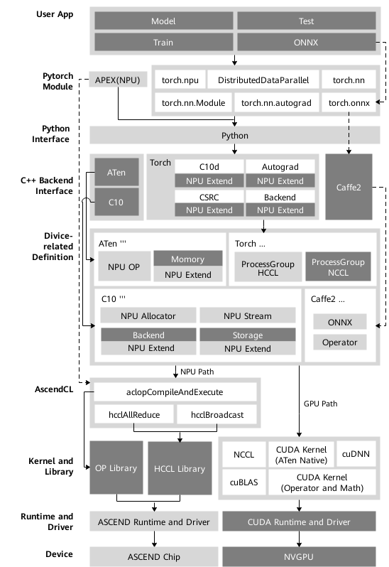

Currently, the main reasons for selecting the online adaptation solution are as follows:

1.  The dynamic graph feature of the PyTorch framework is inherited to the maximum extent.
2.  The GPU's usage on the PyTorch is inherited to the maximum extent, which minimizes the changes in the development mode and code reuse when a model is ported to the Ascend AI Processor for training.
3.  The original PyTorch architecture is inherited to the maximum extent and the excellent features of the PyTorch architecture are retained, such as automatic differentiation, dynamic distribution, debugging, profiling, storage sharing mechanism, and dynamic memory management on the device side.
4.  It has good scalability. During the streamlining process, only the development and implementation of related compute operators are involved for new network types or structures. Framework operators, reverse graph building, and implementation mechanisms can be reused.
5.  The usage and style are the same as those of the GPU-based implementation. During online adaption, you only need to specify the device as the Ascend AI Processor in Python and device operations to develop, train, and debug the network in PyTorch using the Ascend AI Processor. You do not need to pay attention to the underlying details of the Ascend AI Processor. In this way, you can minimize the modification and complete porting with low costs.

## Restrictions and Limitations

-   In the  **infershape**  phase, operators do not support unknown shape inference.
-   Only the float16 operator can be used for cube computing.
-   inf/nan data of the float16 type cannot be input or output.
-   Dimensions cannot be reduced when the format larger than 4D is used.
-   In the current version, Apex is implemented using Python, and the customized optimization CUDA kernel in Apex is not supported.
-   The current version of Apex supports only the mixed precision calculation and multiple fusion optimizer functions adapted to Ascend AI Processors.
-   The restrictions on collective communication are as follows:
    -   In data parallel mode, the graphs executed on different devices must be the same.
    -   Allocation at only 1, 2, 4, or 8 processors is supported.
    -   Only the int8, int32, float16, and float32 data types are supported.

## Porting Process

Model porting refers to moving models that have been implemented in the open-source community to an Ascend AI Processor.  [Figure 2](#fig759451810422)  shows the model porting process.

**Figure  2**  Porting process 
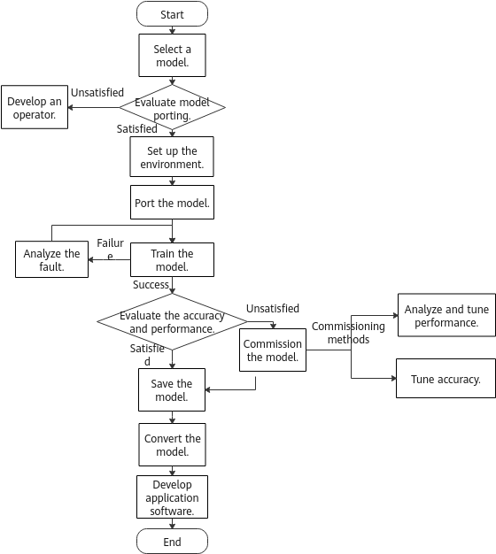

**Table  1**  Porting process

<table><thead align="left"><tr id="row163496162279"><th class="cellrowborder" valign="top" width="28.18%" id="mcps1.2.3.1.1"><p id="p163497165271"><a name="p163497165271"></a><a name="p163497165271"></a>Scenario</p>
</th>
<th class="cellrowborder" valign="top" width="71.82%" id="mcps1.2.3.1.2"><p id="p12349121682716"><a name="p12349121682716"></a><a name="p12349121682716"></a>Description</p>
</th>
</tr>
</thead>
<tbody><tr id="row17349111602716"><td class="cellrowborder" valign="top" width="28.18%" headers="mcps1.2.3.1.1 "><p id="p1234921620273"><a name="p1234921620273"></a><a name="p1234921620273"></a>Model selection</p>
</td>
<td class="cellrowborder" valign="top" width="71.82%" headers="mcps1.2.3.1.2 "><p id="p1338111557277"><a name="p1338111557277"></a><a name="p1338111557277"></a>Select the model to be ported.</a></p>
</td>
</tr>
<tr id="row53492016112717"><td class="cellrowborder" valign="top" width="28.18%" headers="mcps1.2.3.1.1 "><p id="p133501716132719"><a name="p133501716132719"></a><a name="p133501716132719"></a>Model porting evaluation</p>
</td>
<td class="cellrowborder" valign="top" width="71.82%" headers="mcps1.2.3.1.2 "><p id="p113504168278"><a name="p113504168278"></a><a name="p113504168278"></a>For details, see <a href="#model-porting-evaluationmd">Model Porting Evaluation</a>.</p>
</td>
</tr>
<tr id="row9883113014287"><td class="cellrowborder" valign="top" width="28.18%" headers="mcps1.2.3.1.1 "><p id="p8883203017280"><a name="p8883203017280"></a><a name="p8883203017280"></a>Operator development</p>
</td>
<td class="cellrowborder" valign="top" width="71.82%" headers="mcps1.2.3.1.2 "><p id="p158831830192814"><a name="p158831830192814"></a><a name="p158831830192814"></a>For details, see the <span id="ph144957513112"><a name="ph144957513112"></a><a name="ph144957513112"></a><span id="ph45906272222"><a name="ph45906272222"></a><a name="ph45906272222"></a><em id="en-us_topic_0000001182024971_i12125819204013"><a name="en-us_topic_0000001182024971_i12125819204013"></a><a name="en-us_topic_0000001182024971_i12125819204013"></a>PyTorch Operator Developer Guide</em></span></span>.</p>
</td>
</tr>
<tr id="row2056653212812"><td class="cellrowborder" valign="top" width="28.18%" headers="mcps1.2.3.1.1 "><p id="p1656743213814"><a name="p1656743213814"></a><a name="p1656743213814"></a>Environment setup</p>
</td>
<td class="cellrowborder" valign="top" width="71.82%" headers="mcps1.2.3.1.2 "><p id="p1156712323811"><a name="p1156712323811"></a><a name="p1156712323811"></a>For details, see <a href="#environment-setupmd">Environment Setup</a>.</p>
</td>
</tr>
<tr id="row43031317489"><td class="cellrowborder" valign="top" width="28.18%" headers="mcps1.2.3.1.1 "><p id="p14304131711817"><a name="p14304131711817"></a><a name="p14304131711817"></a>Model porting</p>
</td>
<td class="cellrowborder" valign="top" width="71.82%" headers="mcps1.2.3.1.2 "><p id="p53043171687"><a name="p53043171687"></a><a name="p53043171687"></a>For details, see <a href="#model-portingmd">Model Porting</a>.</p>
</td>
</tr>
<tr id="row10695931399"><td class="cellrowborder" valign="top" width="28.18%" headers="mcps1.2.3.1.1 "><p id="p186956311094"><a name="p186956311094"></a><a name="p186956311094"></a>Model training</p>
</td>
<td class="cellrowborder" valign="top" width="71.82%" headers="mcps1.2.3.1.2 "><p id="p10696123117914"><a name="p10696123117914"></a><a name="p10696123117914"></a>For details, see <a href="#model-trainingmd">Model Training</a>.</p>
</td>
</tr>
<tr id="row1658912015291"><td class="cellrowborder" valign="top" width="28.18%" headers="mcps1.2.3.1.1 "><p id="p195901920192910"><a name="p195901920192910"></a><a name="p195901920192910"></a>Error analysis</p>
</td>
<td class="cellrowborder" valign="top" width="71.82%" headers="mcps1.2.3.1.2 "><p id="p95904208295"><a name="p95904208295"></a><a name="p95904208295"></a>For details, see "AI Core Error Analyzer Instructions" in the <span id="ph7924185091616"><a name="ph7924185091616"></a><a name="ph7924185091616"></a><em id="en-us_topic_0000001135865460_i173201451362"><a name="en-us_topic_0000001135865460_i173201451362"></a><a name="en-us_topic_0000001135865460_i173201451362"></a>CANN Log Reference</em></span> and <span id="ph1572317171516"><a name="ph1572317171516"></a><a name="ph1572317171516"></a><em id="en-us_topic_0000001135865460_i17706223113013"><a name="en-us_topic_0000001135865460_i17706223113013"></a><a name="en-us_topic_0000001135865460_i17706223113013"></a>CANN Auxiliary Development Tool User Guide </em></span>.</p>
</td>
</tr>
<tr id="row13191151664310"><td class="cellrowborder" valign="top" width="28.18%" headers="mcps1.2.3.1.1 "><p id="p219216162433"><a name="p219216162433"></a><a name="p219216162433"></a>Performance analysis and optimization</p>
</td>
<td class="cellrowborder" valign="top" width="71.82%" headers="mcps1.2.3.1.2 "><p id="p11192181615434"><a name="p11192181615434"></a><a name="p11192181615434"></a>For details, see <a href="#performance-analysis-and-optimizationmd">Performance Optimization and Analysis</a>.</p>
</td>
</tr>
<tr id="row94308194435"><td class="cellrowborder" valign="top" width="28.18%" headers="mcps1.2.3.1.1 "><p id="p74301019144319"><a name="p74301019144319"></a><a name="p74301019144319"></a>Precision commissioning</p>
</td>
<td class="cellrowborder" valign="top" width="71.82%" headers="mcps1.2.3.1.2 "><p id="p24301119174313"><a name="p24301119174313"></a><a name="p24301119174313"></a>For details, see <a href="#precision-commissioningmd">Precision Commissioning</a>.</p>
</td>
</tr>
<tr id="row7630202112430"><td class="cellrowborder" valign="top" width="28.18%" headers="mcps1.2.3.1.1 "><p id="p1263012210438"><a name="p1263012210438"></a><a name="p1263012210438"></a>Model saving and conversion</p>
</td>
<td class="cellrowborder" valign="top" width="71.82%" headers="mcps1.2.3.1.2 "><p id="p12631521104319"><a name="p12631521104319"></a><a name="p12631521104319"></a>For details, see <a href="#model-saving-and-conversionmd">Model Saving and Conversion</a> and "ATC Tool Instructions" in the <span id="ph98735134233"><a name="ph98735134233"></a><a name="ph98735134233"></a><em id="en-us_topic_0000001135865460_i17706223113013_1"><a name="en-us_topic_0000001135865460_i17706223113013_1"></a><a name="en-us_topic_0000001135865460_i17706223113013_1"></a>CANN Auxiliary Development Tool User Guide </em></span>.</p>
</td>
</tr>
<tr id="row196272410438"><td class="cellrowborder" valign="top" width="28.18%" headers="mcps1.2.3.1.1 "><p id="p176218241431"><a name="p176218241431"></a><a name="p176218241431"></a>Application software development</p>
</td>
<td class="cellrowborder" valign="top" width="71.82%" headers="mcps1.2.3.1.2 "><p id="p1962142434317"><a name="p1962142434317"></a><a name="p1962142434317"></a>For details, see the <span id="ph1062525151815"><a name="ph1062525151815"></a><a name="ph1062525151815"></a><em id="en-us_topic_0000001135865460_i4250117357"><a name="en-us_topic_0000001135865460_i4250117357"></a><a name="en-us_topic_0000001135865460_i4250117357"></a>CANN Application Software Development Guide (C and C++, Inference)</em></span>.</p>
</td>
</tr>
<tr id="row17586759102515"><td class="cellrowborder" valign="top" width="28.18%" headers="mcps1.2.3.1.1 "><p id="p6586155952510"><a name="p6586155952510"></a><a name="p6586155952510"></a>FAQs</p>
</td>
<td class="cellrowborder" valign="top" width="71.82%" headers="mcps1.2.3.1.2 "><p id="p105871359192515"><a name="p105871359192515"></a><a name="p105871359192515"></a>Describes how to prepare the environment, port models, commission models, and resolve other common problems. For details, see <a href="#faqsmd">FAQs</a>.</p>
</td>
</tr>
</tbody>
</table>

## Quick Start

### Introduction

This section describes how to port a ResNet-50 model to help users quickly understand the porting process.

### Model Selection

In this example, the [main.py](https://github.com/pytorch/examples/tree/master/imagenet/main.py) script for model training on the ImageNet dataset is ported to adapt to Ascend 910 AI Processors. This script can be obtained from the PyTorch official website 

### Model Porting Evaluation

Whether a model can be successfully ported depends on whether its operators are supported by Ascend AI Processors. Therefore, you can evaluate whether operators of the model are supported by Ascend AI Processors using either of the following methods:

- Before model porting, obtain information about the operators by dumping them, and then compare them with those in the PyTorch Operator Support to determine whether they are supported by Ascend AI Processors.
- After model porting, run the training script on an Ascend AI Processor. If operators not supported by Ascend AI Processors exist, an error is reported.

If operators not supported by Ascend AI Processors exist, you can replace them with equivalent operators or develop other appropriate operators. For details, see the *PyTorch Operator Developer Guide*.

The operators used by the ResNet-50 model are supported by Ascend AI Processors.

### Environment Setup

Install the CANN software, PyTorch framework, and mixed precision module, and set environment variables. For details, see the *PyTorch Installation Guide*.

Set up the Python environment and prepare dependencies required for model running. For details, see the PyTorch [examples](https://github.com/pytorch/examples/tree/master/imagenet).

### Model Porting

Modify the **main.py** training script to implement single-device model training and single-server multi-device model training porting.

#### Single-Device Training Porting

1. Import the **torch.npu** module to **main.py**.

   ```python
   import torch.npu
   ```

2. Define the training device in **main.py**.

   ```python
   CALCULATE_DEVICE = "npu:0"
   ```

3. Modify the parameters and options so that the script can be trained only on Ascend 910 AI Processors.

   Code location: **main_worker()** function in **main.py**:

   ```python
   def main_worker(gpu, ngpus_per_node, args):
       global best_acc1
       # The source code specifies that the GPU is used for training. The following is an example.
       # args.gpu = gpu
       ############## npu modify begin #############
       args.gpu = None
       ############## npu modify end #############
       
       if args.gpu is not None:
           print("Use GPU: {} for training".format(args.gpu))
           
       if args.distributed:
           if args.dist_url == "env://" and args.rank == -1:
               args.rank = int(os.environ["RANK"])
           if args.multiprocessing_distributed:
               # For multiprocessing distributed training, rank needs to be the
               # global rank among all the processes
               args.rank = args.rank * ngpus_per_node + gpu
           dist.init_process_group(backend=args.dist_backend, init_method=args.dist_url,
                                   world_size=args.world_size, rank=args.rank)
       # create model
       if args.pretrained:
           print("=> using pre-trained model '{}'".format(args.arch))
           model = models.__dict__[args.arch](pretrained=True)
       else:
           print("=> creating model '{}'".format(args.arch))
           model = models.__dict__[args.arch]()
       # The source code determines whether to perform training on the GPU. The following is an example.
       # if not torch.cuda.is_available():
           # print('using CPU, this will be slow')
       # elif args.distributed:
       ############## npu modify begin #############
       # After the porting, the source code only determines whether to perform distributed training (without determining whether to perform training on the GPU).
       if args.distributed:
       ############## npu modify end #############
           # For multiprocessing distributed, DistributedDataParallel constructor
           # should always set the single device scope, otherwise,
           # DistributedDataParallel will use all available devices.
           if args.gpu is not None:
              ......
   ```

4. Port the model and loss function to an Ascend 910 AI Processor for calculation.

   Code location: **main_worker()** function in **main.py**:

   ```python 
   elif args.gpu is not None:
           torch.cuda.set_device(args.gpu)
           model = model.cuda(args.gpu)
       else:
           # DataParallel will divide and allocate batch_size to all available GPUs
           if args.arch.startswith('alexnet') or args.arch.startswith('vgg'):
               model.features = torch.nn.DataParallel(model.features)
               model.cuda()
           else:
               # The source code uses the torch.nn.DataParallel() class to accelerate training on multiple GPUs.
               # model = torch.nn.DataParallel(model).cuda()
           ############## npu modify begin #############
               # Port the model to the NPU for training.
              model = model.to(CALCULATE_DEVICE)
          ############## npu modify end #############
       # In the source code, the loss function is calculated on the GPU.
       # # define loss function (criterion) and optimizer
       # criterion = nn.CrossEntropyLoss().cuda(args.gpu)
       ############## npu modify begin #############
       # Port the loss function to the NPU for calculation.
       criterion = nn.CrossEntropyLoss().to(CALCULATE_DEVICE)   
       ############## npu modify end #############
   ```

5. Change the type of the **target** operator in the dataset to **int32** to resolve the operator error. Port the dataset to the Ascend 910 AI Processor for calculation.

   - Code location: **train()** function in **main.py**:

     ```python
        for i, (images, target) in enumerate(train_loader):
             # measure data loading time
             data_time.update(time.time() - end)
     
             if args.gpu is not None:
                 images = images.cuda(args.gpu, non_blocking=True)
             # In the source code, the training dataset is loaded and calculated on the GPU. The following is an example.
             # if torch.cuda.is_available():
                 # target = target.cuda(args.gpu, non_blocking=True)
             ############## npu modify begin #############
             # Port the dataset to the NPU for calculation and modify the target data type to improve performance.
             if 'npu' in CALCULATE_DEVICE:     
                 target = target.to(torch.int32)                      
             images, target = images.to(CALCULATE_DEVICE, non_blocking=True), target.to(CALCULATE_DEVICE, non_blocking=True)
             ############## npu modify end #############
     ```

   - Code location: **validate()** function in **main.py**:

     ```python
         with torch.no_grad():
             end = time.time()
             for i, (images, target) in enumerate(val_loader):
                 if args.gpu is not None:
                     images = images.cuda(args.gpu, non_blocking=True)
                 # In the source code, the training dataset is loaded and calculated on the GPU. The following is an example.
                 # if torch.cuda.is_available():
                     # target = target.cuda(args.gpu, non_blocking=True)
                 ############## npu modify begin #############
                 # Port the dataset to the NPU for calculation and modify the target data type.
                 if 'npu' in CALCULATE_DEVICE:
                     target = target.to(torch.int32)
               images, target = images.to(CALCULATE_DEVICE, non_blocking=True), target.to(CALCULATE_DEVICE, non_blocking=True)
                ############## npu modify end #############
     ```

6. Set the device in use.

   Code location: Main function entry point in **main.py**

   ```python
   if __name__ == '__main__':
       ############## npu modify begin #############
       if 'npu' in CALCULATE_DEVICE:
          torch.npu.set_device(CALCULATE_DEVICE)
       ############## npu modify begin #############
       main()
   ```

#### Single-Server Multi-Device Training Modification

1. Add a header file to **main.py** to support mixed precision training of PyTorch-based models on Ascend 910 AI Processors.

   ```python
   import torch.npu
   from apex import amp
   ```

2. Add the following parameters, including those for specifying the Ascend 910 AI Processors involved in training and those required for mixed precision training.

   ```python
   parser.add_argument('--device', default='npu', type=str, help='npu or gpu')                        
   parser.add_argument('--addr', default='10.136.181.115', type=str, help='master addr')                        
   parser.add_argument('--device-list', default='0,1,2,3,4,5,6,7', type=str, help='device id list')
   parser.add_argument('--amp', default=False, action='store_true', help='use amp to train the model')                    
   parser.add_argument('--loss-scale', default=1024., type=float,
                       help='loss scale using in amp, default -1 means dynamic')
   parser.add_argument('--opt-level', default='O2', type=str,
                       help='loss scale using in amp, default -1 means dynamic')
   ```

3. Create a mapping function from **device_id** to **process_id** and specify the device for training. Add the following API to the **main.py** function:

   ```python
   def device_id_to_process_device_map(device_list):
       devices = device_list.split(",")
       devices = [int(x) for x in devices]
       devices.sort()
   
       process_device_map = dict()
       for process_id, device_id in enumerate(devices):
           process_device_map[process_id] = device_id
   
       return process_device_map
   ```

4. Specify the IP address and port number of the training server.

   Code location: Main function **main()** in **main.py** (The changes are in bold.)

   ```python
   def main():
       args = parser.parse_args()
       ############## npu modify begin #############
       os.environ['MASTER_ADDR'] = args.addr 
       os.environ['MASTER_PORT'] = '29688'
       ############## npu modify end #############
   ```

5. Create a mapping parameter from **device_id** to **process_id** to obtain the number of Ascend 910 AI Processors on a single node.

   Code location: Main function **main()** in **main.py**

   ```python
   args.distributed = args.world_size > 1 or args.multiprocessing_distributed
   ############## npu modify begin #############
   args.process_device_map = device_id_to_process_device_map(args.device_list)
   if args.device == 'npu':
       ngpus_per_node = len(args.process_device_map)
   else:
       ngpus_per_node = torch.cuda.device_count()
   ############## npu modify end #############
   # The source code is as follows:
   # ngpus_per_node = torch.cuda.device_count()
   ```

6. Obtain the ID of the Ascend 910 AI Processor corresponding to **process_id** and specify the Ascend 910 AI Processor for training.

   Code location: **main_worker()** function in **main.py**:

   ```python
   def main_worker(gpu, ngpus_per_node, args):   
       global best_acc1
       ############## npu modify begin #############
       args.gpu = args.process_device_map[gpu]
       ############## npu modify end #############
       # The source code is as follows:
       # args.gpu = gpu
   ```

7. Initialize the process group and mask the initialization mode.

   Code location: **main_worker()** function in **main.py**:

   ```python
         ############## npu modify begin #############  
           if args.device == 'npu':
               dist.init_process_group(backend=args.dist_backend, #init_method=args.dist_url,
                                   world_size=args.world_size, rank=args.rank)
           else:
               dist.init_process_group(backend=args.dist_backend, init_method=args.dist_url,         
                                   world_size=args.world_size, rank=args.rank)
         ############## npu modify begin #############  
         # The source code is as follows:
         # dist.init_process_group(backend=args.dist_backend, init_method=args.dist_url,
         #                          world_size=args.world_size, rank=args.rank)
   ```

8. To perform distributed training, the mixed precision module needs to be introduced, and the model needs to be ported to Ascend AI Processors. Therefore, the code for determining whether the training is distributed training and whether the model is trained on the GPU needs to be masked.

   Code location: **main_worker()** function in **main.py**:

   ```python
       # create model
       if args.pretrained:
           print("=> using pre-trained model '{}'".format(args.arch))
           model = models.__dict__[args.arch](pretrained=True)
       else:
           print("=> creating model '{}'".format(args.arch))
           model = models.__dict__[args.arch]()
   ############## npu modify begin #############
       # Add the following content to the code.
       # Specify Ascend AI Processors as the training devices.
       loc = 'npu:{}'.format(args.gpu)
       torch.npu.set_device(loc)
       # Calculate batch_size and workers used for training.
       args.batch_size = int(args.batch_size / ngpus_per_node)
       args.workers = int((args.workers + ngpus_per_node - 1) / ngpus_per_node)
   ############## npu modify end #############
       # The source code is as follows, which needs to be masked and is commented out.
       # if not torch.cuda.is_available():
       #     print('using CPU, this will be slow')
       # elif args.distributed:
       #     # For multiprocessing distributed, DistributedDataParallel constructor
       #     # should always set the single device scope, otherwise,
       #     # DistributedDataParallel will use all available devices.
       #     if args.gpu is not None:
       #         torch.cuda.set_device(args.gpu)
       #         model.cuda(args.gpu)
       #         # When using a single GPU per process and per
       #         # DistributedDataParallel, we need to divide the batch size
       #         # ourselves based on the total number of GPUs we have
       #         args.batch_size = int(args.batch_size / ngpus_per_node)
       #         args.workers = int((args.workers + ngpus_per_node - 1) / ngpus_per_node)
       #         model = torch.nn.parallel.DistributedDataParallel(model, device_ids=[args.gpu])
       #     else:
       #         model.cuda()
       #         # DistributedDataParallel will divide and allocate batch_size to all
       #         # available GPUs if device_ids are not set
       #         model = torch.nn.parallel.DistributedDataParallel(model)
       # elif args.gpu is not None:
       #     torch.cuda.set_device(args.gpu)
       #     model = model.cuda(args.gpu)
       # else:
       #     # DataParallel will divide and allocate batch_size to all available GPUs
       #     if args.arch.startswith('alexnet') or args.arch.startswith('vgg'):
       #         model.features = torch.nn.DataParallel(model.features)
       #         model.cuda()
       #     else:
       #         model = torch.nn.DataParallel(model).cuda()
   ```

9. Mask the loss function, optimizer, and resume training at breakpoint. This part is combined with the mixed precision training later.

   Code location: **main_worker()** function in **main.py**:

   ```python
       # The source code is masked and commented out.
       # # define loss function (criterion) and optimizer
       # criterion = nn.CrossEntropyLoss().cuda(args.gpu)
       #
       # optimizer = torch.optim.SGD(model.parameters(), args.lr,
       #                             momentum=args.momentum,
       #                             weight_decay=args.weight_decay)
       #
       # # optionally resume from a checkpoint
       # if args.resume:
       #     if os.path.isfile(args.resume):
       #         print("=> loading checkpoint '{}'".format(args.resume))
       #         if args.gpu is None:
       #             checkpoint = torch.load(args.resume)
       #         else:
       #             # Map model to be loaded to specified single gpu.
       #             loc = 'cuda:{}'.format(args.gpu)
       #             checkpoint = torch.load(args.resume, map_location=loc)
       #         args.start_epoch = checkpoint['epoch']
       #         best_acc1 = checkpoint['best_acc1']
       #         if args.gpu is not None:
       #             # best_acc1 may be from a checkpoint from a different GPU
       #             best_acc1 = best_acc1.to(args.gpu)
       #         model.load_state_dict(checkpoint['state_dict'])
       #         optimizer.load_state_dict(checkpoint['optimizer'])
       #         print("=> loaded checkpoint '{}' (epoch {})"
       #               .format(args.resume, checkpoint['epoch']))
       #     else:
       #         print("=> no checkpoint found at '{}'".format(args.resume))
       #
       # cudnn.benchmark = True
   ```

10. A data loader combines a dataset and a sampler and can provide multiple threads to process the dataset. If Ascend AI Processors are used for training, **pin_memory** must be set to **False**. Currently, only training in a static shape is supported. The number of remaining samples in the data flow may be less than the batch size. Therefore, **drop_last** must be set to **True**. In addition, you need to set **shuffle** to **True** for some datasets to be verified.

    Code location: **main_worker()** function in **main.py**:

    ```python
        ############## npu modify begin #############
        train_loader = torch.utils.data.DataLoader(
            train_dataset, batch_size=args.batch_size, shuffle=(train_sampler is None),
            num_workers=args.workers, pin_memory=False, sampler=train_sampler, drop_last=True)
    
        val_loader = torch.utils.data.DataLoader(
            datasets.ImageFolder(valdir, transforms.Compose([
                transforms.Resize(256),
                transforms.CenterCrop(224),
                transforms.ToTensor(),
                normalize,
            ])),
            batch_size=args.batch_size, shuffle=True,
            num_workers=args.workers, pin_memory=False, drop_last=True)
            ############## npu modify end #############
    ```

11. Construct the loss function and optimizer, and port the model and loss function to Ascend AI Processors. The optimizer, model, and resume training are combined with the mixed precision module are combined to support the mixed precision training.

    Code location: after data loading verification in **main_worker()** in **main.py**.

    ```python
        val_loader = torch.utils.data.DataLoader(
            datasets.ImageFolder(valdir, transforms.Compose([
                transforms.Resize(256),
                transforms.CenterCrop(224),
                transforms.ToTensor(),
                normalize,
            ])),
            batch_size=args.batch_size, shuffle=True,
            num_workers=args.workers, pin_memory=False, drop_last=True)
    
        ############## npu modify begin #############
        model = model.to(loc)
        # define loss function (criterion) and optimizer
        criterion = nn.CrossEntropyLoss().to(loc)
        optimizer = torch.optim.SGD(model.parameters(), args.lr,
                                    momentum=args.momentum,
                                    weight_decay=args.weight_decay)
    
        if args.amp:
            model, optimizer = amp.initialize(model, optimizer, opt_level=args.opt_level, loss_scale=args.loss_scale)
        model = torch.nn.parallel.DistributedDataParallel(model, device_ids=[args.gpu])
    
        # optionally resume from a checkpoint
        if args.resume:
            if os.path.isfile(args.resume):
                print("=> loading checkpoint '{}'".format(args.resume))
                checkpoint = torch.load(args.resume, map_location=loc)
                args.start_epoch = checkpoint['epoch']
                best_acc1 = checkpoint['best_acc1']
                model.load_state_dict(checkpoint['state_dict'])
                optimizer.load_state_dict(checkpoint['optimizer'])
                if args.amp:
                  amp.load_state_dict(checkpoint['amp'])
                print("=> loaded checkpoint '{}' (epoch {})"
                      .format(args.resume, checkpoint['epoch']))
            else:
                print("=> no checkpoint found at '{}'".format(args.resume))
    
        cudnn.benchmark = True
        ############## npu modify end #############
    ```

12. The checkpoint saving needs to be combined with the mixed precision training. The modification is as follows:

    Code location: **main_worker()** in **main.py** (The changes are in bold.)

    ```python
            # remember best acc@1 and save checkpoint
            is_best = acc1 > best_acc1
            best_acc1 = max(acc1, best_acc1)
    
            if not args.multiprocessing_distributed or (args.multiprocessing_distributed
                    and args.rank % ngpus_per_node == 0):
            ############## npu modify begin #############
                if args.amp:
                    save_checkpoint({
                        'epoch': epoch + 1,
                        'arch': args.arch,
                        'state_dict': model.state_dict(),
                        'best_acc1': best_acc1,
                        'optimizer' : optimizer.state_dict(),
                        'amp': amp.state_dict(),
                    }, is_best)
                else:
                    save_checkpoint({
                        'epoch': epoch + 1,
                        'arch': args.arch,
                        'state_dict': model.state_dict(),
                        'best_acc1': best_acc1,
                        'optimizer' : optimizer.state_dict(),
                    }, is_best)
             ############## npu modify end #############
    ```

13. During training, you need to port the dataset to Ascend AI Processors. The modification is as follows:

    Code location: **train()** in **main.py** (The changes are in bold.)

    ```python
        for i, (images, target) in enumerate(train_loader):
            # measure data loading time
            data_time.update(time.time() - end)
            ############## npu modify begin #############
            loc = 'npu:{}'.format(args.gpu)
            target = target.to(torch.int32)
            images, target = images.to(loc, non_blocking=False), target.to(loc, non_blocking=False)
            ############## npu modify end #############
            # The source model code is as follows:
            # if args.gpu is not None:
            #     images = images.cuda(args.gpu, non_blocking=True)
            # if torch.cuda.is_available():
            #     target = target.cuda(args.gpu, non_blocking=True)
    ```

14. Mark the location where the backpropagation **.backward()** occurs so that the mixed precision module can perform loss scaling and clear the status of each iteration. The code is as follows:

    Code location: **train()** in **main.py** (The changes are in bold.)

    ```python
            optimizer.zero_grad()
            ############## npu modify begin #############
            if args.amp:
                with amp.scale_loss(loss, optimizer) as scaled_loss:
                    scaled_loss.backward()
            else:
                loss.backward()
            ############## npu modify end #############
            # The source code is as follows:
            # loss.backward()
            optimizer.step()
    ```

15. Before validation, you need to port the validation dataset to Ascend AI Processors. The modification is as follows:

    Code location: **validate()** function in **main.py**:

    ```python
        with torch.no_grad():
            end = time.time()
            for i, (images, target) in enumerate(val_loader):
            ############## npu modify begin #############
                loc = 'npu:{}'.format(args.gpu)
                target = target.to(torch.int32)
                images, target = images.to(loc, non_blocking=False), target.to(loc, non_blocking=False)
            ############## npu modify end #############
            # The source model code is as follows:
            # if args.gpu is not None:
            #     images = images.cuda(args.gpu, non_blocking=True)
            # if torch.cuda.is_available():
            #     target = target.cuda(args.gpu, non_blocking=True)
    ```

### Model Training

**Dataset Preparation**

Prepare a dataset and upload it to a directory in the operating environment, for example, **/home/data/resnet50/imagenet**.

**Command Execution**

Single-device training:

```shell
python3 main.py /home/data/resnet50/imagenet --batch-size 128 \       # Training batch size
                                               --lr 0.1 \               # Learning rate
                                               --epochs 90 \            # Number of training epochs
                                               --arch resnet50 \        # Model architecture
                                               --world-size 1 \
                                               --rank 0 \         
                                               --workers 40 \           # Number of processes for loading data
                                               --momentum 0.9 \         # Momentum  
                                               --weight-decay 1e-4      # Weight decay
```

Distributed training:

```shell
python3 main.py /home/data/resnet50/imagenet --addr='1.1.1.1' \                # Example IP address. Replace it with the actual IP address.
                                               --seed 49  \                      # Random seed
                                               --workers 160 \                   # Number of processes for loading data
                                               --lr 0.8 \
                                               --print-freq 1 \
                                               --arch resnet50 \                 # Model architecture
                                               --dist-url 'tcp://127.0.0.1:50000' \                   
                                               --dist-backend 'hccl' \
                                               --multiprocessing-distributed \   # Multi-device training
                                               --world-size 1 \
                                               --batch-size 2048 \               # Training batch size
                                               --epochs 90 \                     # Number of training epochs
                                               --rank 0 \
                                               --device-list '0,1,2,3,4,5,6,7' \
                                               --amp                             # Use mixed precision for training.
```

> **NOTE:** **dist-backend** must be set to **hccl** to support distributed training on Ascend AI devices.

## Model Porting Evaluation

1. When selecting models, select authoritative PyTorch models as benchmarks, including but not limited to PyTorch ([example](https://github.com/pytorch/examples/tree/master/imagenet)/[vision](https://github.com/pytorch/vision)), facebookresearch ([Detectron](https://github.com/facebookresearch/Detectron)/[detectron2](https://github.com/facebookresearch/detectron2)), and open-mmlab ([mmdetection](https://github.com/open-mmlab/mmdetection)/[mmpose](https://github.com/open-mmlab/mmpose)).

2. Check the operator adaptation. Before porting the original model and training script to an Ascend AI Processor, train the original model and training script on the CPU, obtain the operator information by using the dump op method, and compare the operator information with that in the  _PyTorch Operator Support_  to check whether the operator is supported. For details about the dump op method, see  [dump op Method](#dump-op-method). If an operator is not supported, develop the operator. For details, see the *PyTorch Operator Development Guide*.

    > **NOTE:** 
    >You can also port the model and training script to the Ascend AI Processor for training to view the error information. For details about how to port the model and training script, see the following sections. Generally, a message is displayed, indicating that an operator (the first operator that is not supported) cannot run in the backend of the Ascend AI Processor. Environment Setup

## Environment Setup

Refer to the  _PyTorch Installation Guide_  to install PyTorch and the mixed precision module, and configure required environment variables.

## Model Porting

### Tool-Facilitated

The Ascend platform provides a script conversion tool to enable you to port training scripts to Ascend AI Processors using commands. The following will provide the details. In addition to using commands, you can also use the PyTorch GPU2Ascend function integrated in MindStudio to port scripts. For details, see the  _MindStudio User Guide_.

#### Introduction

##### Overview

Ascend NPU is an up-and-comer in the AI computing field, but most training and online inference scripts are based on GPUs. Due to the architecture differences between NPUs and GPUs, GPU-based training and online inference scripts cannot be directly used on NPUs. The script conversion tool provides an automated method for converting GPU-based scripts into NPU-based scripts, reducing the learning cost and workload of manual script migration, thereby improving the migration efficiency.

> **NOTE:** 
>-   msFmkTransplt provides suggestions and converts scripts by the adaptation rules, significantly accelerating script migration and reducing development workload. The scripts in  [Table 2](#en-us_topic_0000001133095885_table4705239194613)  can be directly executed after being converted. The conversion results of other scripts are for reference only. You need to perform adaptation based on the site requirements.
>-   The original scripts in  [Table 2](#en-us_topic_0000001133095885_table4705239194613)  must be executed in the GPU environment and based on Python 3.
>-   For scripts in  [Table 2](#en-us_topic_0000001133095885_table4705239194613), the execution logic after conversion is the same as that before conversion.
>-   This script conversion tool only supports the conversion of PyTorch training scripts.

**Table  2**  Supported models

<table><thead align="left"><tr id="en-us_topic_0000001133095885_row1270543910462"><th class="cellrowborder" valign="top" width="27.41%" id="mcps1.2.3.1.1"><p id="en-us_topic_0000001133095885_p670613914465"><a name="en-us_topic_0000001133095885_p670613914465"></a><a name="en-us_topic_0000001133095885_p670613914465"></a>No.</p>
</th>
<th class="cellrowborder" valign="top" width="72.59%" id="mcps1.2.3.1.2"><p id="en-us_topic_0000001133095885_p57061739124611"><a name="en-us_topic_0000001133095885_p57061739124611"></a><a name="en-us_topic_0000001133095885_p57061739124611"></a>Model</p>
</th>
</tr>
</thead>
<tbody><tr id="en-us_topic_0000001133095885_row11706239134617"><td class="cellrowborder" valign="top" width="27.41%" headers="mcps1.2.3.1.1 "><p id="en-us_topic_0000001133095885_p18706163918464"><a name="en-us_topic_0000001133095885_p18706163918464"></a><a name="en-us_topic_0000001133095885_p18706163918464"></a>1</p>
</td>
<td class="cellrowborder" valign="top" width="72.59%" headers="mcps1.2.3.1.2 "><p id="en-us_topic_0000001133095885_p3573354194212"><a name="en-us_topic_0000001133095885_p3573354194212"></a><a name="en-us_topic_0000001133095885_p3573354194212"></a>3D AttentionNet</p>
</td>
</tr>
<tr id="en-us_topic_0000001133095885_row67061939194612"><td class="cellrowborder" valign="top" width="27.41%" headers="mcps1.2.3.1.1 "><p id="en-us_topic_0000001133095885_p17706143917468"><a name="en-us_topic_0000001133095885_p17706143917468"></a><a name="en-us_topic_0000001133095885_p17706143917468"></a>2</p>
</td>
<td class="cellrowborder" valign="top" width="72.59%" headers="mcps1.2.3.1.2 "><p id="en-us_topic_0000001133095885_p1957314543423"><a name="en-us_topic_0000001133095885_p1957314543423"></a><a name="en-us_topic_0000001133095885_p1957314543423"></a>3D Nested_UNet</p>
</td>
</tr>
<tr id="en-us_topic_0000001133095885_row197069395460"><td class="cellrowborder" valign="top" width="27.41%" headers="mcps1.2.3.1.1 "><p id="en-us_topic_0000001133095885_p207061639194612"><a name="en-us_topic_0000001133095885_p207061639194612"></a><a name="en-us_topic_0000001133095885_p207061639194612"></a>3</p>
</td>
<td class="cellrowborder" valign="top" width="72.59%" headers="mcps1.2.3.1.2 "><p id="en-us_topic_0000001133095885_p15573155434213"><a name="en-us_topic_0000001133095885_p15573155434213"></a><a name="en-us_topic_0000001133095885_p15573155434213"></a>Advanced East</p>
</td>
</tr>
<tr id="en-us_topic_0000001133095885_row1706103914467"><td class="cellrowborder" valign="top" width="27.41%" headers="mcps1.2.3.1.1 "><p id="en-us_topic_0000001133095885_p2706163911464"><a name="en-us_topic_0000001133095885_p2706163911464"></a><a name="en-us_topic_0000001133095885_p2706163911464"></a>4</p>
</td>
<td class="cellrowborder" valign="top" width="72.59%" headers="mcps1.2.3.1.2 "><p id="en-us_topic_0000001133095885_p125731454144217"><a name="en-us_topic_0000001133095885_p125731454144217"></a><a name="en-us_topic_0000001133095885_p125731454144217"></a>AlexNet</p>
</td>
</tr>
<tr id="en-us_topic_0000001133095885_row9706739124610"><td class="cellrowborder" valign="top" width="27.41%" headers="mcps1.2.3.1.1 "><p id="en-us_topic_0000001133095885_p5706739114611"><a name="en-us_topic_0000001133095885_p5706739114611"></a><a name="en-us_topic_0000001133095885_p5706739114611"></a>5</p>
</td>
<td class="cellrowborder" valign="top" width="72.59%" headers="mcps1.2.3.1.2 "><p id="en-us_topic_0000001133095885_p1357319544426"><a name="en-us_topic_0000001133095885_p1357319544426"></a><a name="en-us_topic_0000001133095885_p1357319544426"></a>DeeplabV3+(Xception-JFT)</p>
</td>
</tr>
<tr id="en-us_topic_0000001133095885_row177079399465"><td class="cellrowborder" valign="top" width="27.41%" headers="mcps1.2.3.1.1 "><p id="en-us_topic_0000001133095885_p147072039184612"><a name="en-us_topic_0000001133095885_p147072039184612"></a><a name="en-us_topic_0000001133095885_p147072039184612"></a>6</p>
</td>
<td class="cellrowborder" valign="top" width="72.59%" headers="mcps1.2.3.1.2 "><p id="en-us_topic_0000001133095885_p657315454213"><a name="en-us_topic_0000001133095885_p657315454213"></a><a name="en-us_topic_0000001133095885_p657315454213"></a>DeepMar</p>
</td>
</tr>
<tr id="en-us_topic_0000001133095885_row15707173954611"><td class="cellrowborder" valign="top" width="27.41%" headers="mcps1.2.3.1.1 "><p id="en-us_topic_0000001133095885_p13707103984614"><a name="en-us_topic_0000001133095885_p13707103984614"></a><a name="en-us_topic_0000001133095885_p13707103984614"></a>7</p>
</td>
<td class="cellrowborder" valign="top" width="72.59%" headers="mcps1.2.3.1.2 "><p id="en-us_topic_0000001133095885_p1057345444220"><a name="en-us_topic_0000001133095885_p1057345444220"></a><a name="en-us_topic_0000001133095885_p1057345444220"></a>Densenet121</p>
</td>
</tr>
<tr id="en-us_topic_0000001133095885_row2707739124612"><td class="cellrowborder" valign="top" width="27.41%" headers="mcps1.2.3.1.1 "><p id="en-us_topic_0000001133095885_p18707839114617"><a name="en-us_topic_0000001133095885_p18707839114617"></a><a name="en-us_topic_0000001133095885_p18707839114617"></a>8</p>
</td>
<td class="cellrowborder" valign="top" width="72.59%" headers="mcps1.2.3.1.2 "><p id="en-us_topic_0000001133095885_p175731454114210"><a name="en-us_topic_0000001133095885_p175731454114210"></a><a name="en-us_topic_0000001133095885_p175731454114210"></a>DenseNet161</p>
</td>
</tr>
<tr id="en-us_topic_0000001133095885_row1270714392464"><td class="cellrowborder" valign="top" width="27.41%" headers="mcps1.2.3.1.1 "><p id="en-us_topic_0000001133095885_p197072397468"><a name="en-us_topic_0000001133095885_p197072397468"></a><a name="en-us_topic_0000001133095885_p197072397468"></a>9</p>
</td>
<td class="cellrowborder" valign="top" width="72.59%" headers="mcps1.2.3.1.2 "><p id="en-us_topic_0000001133095885_p05731654204218"><a name="en-us_topic_0000001133095885_p05731654204218"></a><a name="en-us_topic_0000001133095885_p05731654204218"></a>DenseNet169</p>
</td>
</tr>
<tr id="en-us_topic_0000001133095885_row17707113914468"><td class="cellrowborder" valign="top" width="27.41%" headers="mcps1.2.3.1.1 "><p id="en-us_topic_0000001133095885_p18707339144611"><a name="en-us_topic_0000001133095885_p18707339144611"></a><a name="en-us_topic_0000001133095885_p18707339144611"></a>10</p>
</td>
<td class="cellrowborder" valign="top" width="72.59%" headers="mcps1.2.3.1.2 "><p id="en-us_topic_0000001133095885_p125731254154212"><a name="en-us_topic_0000001133095885_p125731254154212"></a><a name="en-us_topic_0000001133095885_p125731254154212"></a>DenseNet201</p>
</td>
</tr>
<tr id="en-us_topic_0000001133095885_row1707439204614"><td class="cellrowborder" valign="top" width="27.41%" headers="mcps1.2.3.1.1 "><p id="en-us_topic_0000001133095885_p2707153974611"><a name="en-us_topic_0000001133095885_p2707153974611"></a><a name="en-us_topic_0000001133095885_p2707153974611"></a>11</p>
</td>
<td class="cellrowborder" valign="top" width="72.59%" headers="mcps1.2.3.1.2 "><p id="en-us_topic_0000001133095885_p12573354164210"><a name="en-us_topic_0000001133095885_p12573354164210"></a><a name="en-us_topic_0000001133095885_p12573354164210"></a>EAST</p>
</td>
</tr>
<tr id="en-us_topic_0000001133095885_row67083391464"><td class="cellrowborder" valign="top" width="27.41%" headers="mcps1.2.3.1.1 "><p id="en-us_topic_0000001133095885_p1070883911466"><a name="en-us_topic_0000001133095885_p1070883911466"></a><a name="en-us_topic_0000001133095885_p1070883911466"></a>12</p>
</td>
<td class="cellrowborder" valign="top" width="72.59%" headers="mcps1.2.3.1.2 "><p id="en-us_topic_0000001133095885_p1157312542426"><a name="en-us_topic_0000001133095885_p1157312542426"></a><a name="en-us_topic_0000001133095885_p1157312542426"></a>FCN</p>
</td>
</tr>
<tr id="en-us_topic_0000001133095885_row127085393465"><td class="cellrowborder" valign="top" width="27.41%" headers="mcps1.2.3.1.1 "><p id="en-us_topic_0000001133095885_p4708133911464"><a name="en-us_topic_0000001133095885_p4708133911464"></a><a name="en-us_topic_0000001133095885_p4708133911464"></a>13</p>
</td>
<td class="cellrowborder" valign="top" width="72.59%" headers="mcps1.2.3.1.2 "><p id="en-us_topic_0000001133095885_p857395417429"><a name="en-us_topic_0000001133095885_p857395417429"></a><a name="en-us_topic_0000001133095885_p857395417429"></a>FD-GAN</p>
</td>
</tr>
<tr id="en-us_topic_0000001133095885_row570863914618"><td class="cellrowborder" valign="top" width="27.41%" headers="mcps1.2.3.1.1 "><p id="en-us_topic_0000001133095885_p17708143904620"><a name="en-us_topic_0000001133095885_p17708143904620"></a><a name="en-us_topic_0000001133095885_p17708143904620"></a>14</p>
</td>
<td class="cellrowborder" valign="top" width="72.59%" headers="mcps1.2.3.1.2 "><p id="en-us_topic_0000001133095885_p14573185411425"><a name="en-us_topic_0000001133095885_p14573185411425"></a><a name="en-us_topic_0000001133095885_p14573185411425"></a>FOTS</p>
</td>
</tr>
<tr id="en-us_topic_0000001133095885_row11708839174619"><td class="cellrowborder" valign="top" width="27.41%" headers="mcps1.2.3.1.1 "><p id="en-us_topic_0000001133095885_p1670883917466"><a name="en-us_topic_0000001133095885_p1670883917466"></a><a name="en-us_topic_0000001133095885_p1670883917466"></a>15</p>
</td>
<td class="cellrowborder" valign="top" width="72.59%" headers="mcps1.2.3.1.2 "><p id="en-us_topic_0000001133095885_p157355416428"><a name="en-us_topic_0000001133095885_p157355416428"></a><a name="en-us_topic_0000001133095885_p157355416428"></a>GENet</p>
</td>
</tr>
<tr id="en-us_topic_0000001133095885_row87085397467"><td class="cellrowborder" valign="top" width="27.41%" headers="mcps1.2.3.1.1 "><p id="en-us_topic_0000001133095885_p16708439164618"><a name="en-us_topic_0000001133095885_p16708439164618"></a><a name="en-us_topic_0000001133095885_p16708439164618"></a>16</p>
</td>
<td class="cellrowborder" valign="top" width="72.59%" headers="mcps1.2.3.1.2 "><p id="en-us_topic_0000001133095885_p4574254164219"><a name="en-us_topic_0000001133095885_p4574254164219"></a><a name="en-us_topic_0000001133095885_p4574254164219"></a>GoogleNet</p>
</td>
</tr>
<tr id="en-us_topic_0000001133095885_row5708839174615"><td class="cellrowborder" valign="top" width="27.41%" headers="mcps1.2.3.1.1 "><p id="en-us_topic_0000001133095885_p11708113914462"><a name="en-us_topic_0000001133095885_p11708113914462"></a><a name="en-us_topic_0000001133095885_p11708113914462"></a>17</p>
</td>
<td class="cellrowborder" valign="top" width="72.59%" headers="mcps1.2.3.1.2 "><p id="en-us_topic_0000001133095885_p105743542421"><a name="en-us_topic_0000001133095885_p105743542421"></a><a name="en-us_topic_0000001133095885_p105743542421"></a>GRU</p>
</td>
</tr>
<tr id="en-us_topic_0000001133095885_row170933914612"><td class="cellrowborder" valign="top" width="27.41%" headers="mcps1.2.3.1.1 "><p id="en-us_topic_0000001133095885_p1170963974615"><a name="en-us_topic_0000001133095885_p1170963974615"></a><a name="en-us_topic_0000001133095885_p1170963974615"></a>18</p>
</td>
<td class="cellrowborder" valign="top" width="72.59%" headers="mcps1.2.3.1.2 "><p id="en-us_topic_0000001133095885_p20574054104214"><a name="en-us_topic_0000001133095885_p20574054104214"></a><a name="en-us_topic_0000001133095885_p20574054104214"></a>Inception V4</p>
</td>
</tr>
<tr id="en-us_topic_0000001133095885_row670913934612"><td class="cellrowborder" valign="top" width="27.41%" headers="mcps1.2.3.1.1 "><p id="en-us_topic_0000001133095885_p270993924620"><a name="en-us_topic_0000001133095885_p270993924620"></a><a name="en-us_topic_0000001133095885_p270993924620"></a>19</p>
</td>
<td class="cellrowborder" valign="top" width="72.59%" headers="mcps1.2.3.1.2 "><p id="en-us_topic_0000001133095885_p11574135411427"><a name="en-us_topic_0000001133095885_p11574135411427"></a><a name="en-us_topic_0000001133095885_p11574135411427"></a>InceptionV2</p>
</td>
</tr>
<tr id="en-us_topic_0000001133095885_row15709939174615"><td class="cellrowborder" valign="top" width="27.41%" headers="mcps1.2.3.1.1 "><p id="en-us_topic_0000001133095885_p2709133914614"><a name="en-us_topic_0000001133095885_p2709133914614"></a><a name="en-us_topic_0000001133095885_p2709133914614"></a>20</p>
</td>
<td class="cellrowborder" valign="top" width="72.59%" headers="mcps1.2.3.1.2 "><p id="en-us_topic_0000001133095885_p105741754124219"><a name="en-us_topic_0000001133095885_p105741754124219"></a><a name="en-us_topic_0000001133095885_p105741754124219"></a>LPRNet</p>
</td>
</tr>
<tr id="en-us_topic_0000001133095885_row3709143917462"><td class="cellrowborder" valign="top" width="27.41%" headers="mcps1.2.3.1.1 "><p id="en-us_topic_0000001133095885_p0709193913461"><a name="en-us_topic_0000001133095885_p0709193913461"></a><a name="en-us_topic_0000001133095885_p0709193913461"></a>21</p>
</td>
<td class="cellrowborder" valign="top" width="72.59%" headers="mcps1.2.3.1.2 "><p id="en-us_topic_0000001133095885_p25745540427"><a name="en-us_topic_0000001133095885_p25745540427"></a><a name="en-us_topic_0000001133095885_p25745540427"></a>LSTM</p>
</td>
</tr>
<tr id="en-us_topic_0000001133095885_row177091639184618"><td class="cellrowborder" valign="top" width="27.41%" headers="mcps1.2.3.1.1 "><p id="en-us_topic_0000001133095885_p157091239164617"><a name="en-us_topic_0000001133095885_p157091239164617"></a><a name="en-us_topic_0000001133095885_p157091239164617"></a>22</p>
</td>
<td class="cellrowborder" valign="top" width="72.59%" headers="mcps1.2.3.1.2 "><p id="en-us_topic_0000001133095885_p157485414422"><a name="en-us_topic_0000001133095885_p157485414422"></a><a name="en-us_topic_0000001133095885_p157485414422"></a>MNASNet0_5</p>
</td>
</tr>
<tr id="en-us_topic_0000001133095885_row18709173944613"><td class="cellrowborder" valign="top" width="27.41%" headers="mcps1.2.3.1.1 "><p id="en-us_topic_0000001133095885_p177091739124615"><a name="en-us_topic_0000001133095885_p177091739124615"></a><a name="en-us_topic_0000001133095885_p177091739124615"></a>23</p>
</td>
<td class="cellrowborder" valign="top" width="72.59%" headers="mcps1.2.3.1.2 "><p id="en-us_topic_0000001133095885_p9574205454219"><a name="en-us_topic_0000001133095885_p9574205454219"></a><a name="en-us_topic_0000001133095885_p9574205454219"></a>MNASNet0_75</p>
</td>
</tr>
<tr id="en-us_topic_0000001133095885_row187101039144614"><td class="cellrowborder" valign="top" width="27.41%" headers="mcps1.2.3.1.1 "><p id="en-us_topic_0000001133095885_p1371023914612"><a name="en-us_topic_0000001133095885_p1371023914612"></a><a name="en-us_topic_0000001133095885_p1371023914612"></a>24</p>
</td>
<td class="cellrowborder" valign="top" width="72.59%" headers="mcps1.2.3.1.2 "><p id="en-us_topic_0000001133095885_p357475415426"><a name="en-us_topic_0000001133095885_p357475415426"></a><a name="en-us_topic_0000001133095885_p357475415426"></a>MNASNet1_0</p>
</td>
</tr>
<tr id="en-us_topic_0000001133095885_row1471033917465"><td class="cellrowborder" valign="top" width="27.41%" headers="mcps1.2.3.1.1 "><p id="en-us_topic_0000001133095885_p3710939164613"><a name="en-us_topic_0000001133095885_p3710939164613"></a><a name="en-us_topic_0000001133095885_p3710939164613"></a>25</p>
</td>
<td class="cellrowborder" valign="top" width="72.59%" headers="mcps1.2.3.1.2 "><p id="en-us_topic_0000001133095885_p15741754144213"><a name="en-us_topic_0000001133095885_p15741754144213"></a><a name="en-us_topic_0000001133095885_p15741754144213"></a>MNASNet1_3</p>
</td>
</tr>
<tr id="en-us_topic_0000001133095885_row8710163924614"><td class="cellrowborder" valign="top" width="27.41%" headers="mcps1.2.3.1.1 "><p id="en-us_topic_0000001133095885_p8710143914614"><a name="en-us_topic_0000001133095885_p8710143914614"></a><a name="en-us_topic_0000001133095885_p8710143914614"></a>26</p>
</td>
<td class="cellrowborder" valign="top" width="72.59%" headers="mcps1.2.3.1.2 "><p id="en-us_topic_0000001133095885_p2574135464217"><a name="en-us_topic_0000001133095885_p2574135464217"></a><a name="en-us_topic_0000001133095885_p2574135464217"></a>MobileNetV1</p>
</td>
</tr>
<tr id="en-us_topic_0000001133095885_row1471063944618"><td class="cellrowborder" valign="top" width="27.41%" headers="mcps1.2.3.1.1 "><p id="en-us_topic_0000001133095885_p11710203910465"><a name="en-us_topic_0000001133095885_p11710203910465"></a><a name="en-us_topic_0000001133095885_p11710203910465"></a>27</p>
</td>
<td class="cellrowborder" valign="top" width="72.59%" headers="mcps1.2.3.1.2 "><p id="en-us_topic_0000001133095885_p20574254104215"><a name="en-us_topic_0000001133095885_p20574254104215"></a><a name="en-us_topic_0000001133095885_p20574254104215"></a>MobileNetV2</p>
</td>
</tr>
<tr id="en-us_topic_0000001133095885_row171010393463"><td class="cellrowborder" valign="top" width="27.41%" headers="mcps1.2.3.1.1 "><p id="en-us_topic_0000001133095885_p47101339154613"><a name="en-us_topic_0000001133095885_p47101339154613"></a><a name="en-us_topic_0000001133095885_p47101339154613"></a>28</p>
</td>
<td class="cellrowborder" valign="top" width="72.59%" headers="mcps1.2.3.1.2 "><p id="en-us_topic_0000001133095885_p1557415444214"><a name="en-us_topic_0000001133095885_p1557415444214"></a><a name="en-us_topic_0000001133095885_p1557415444214"></a>PNet</p>
</td>
</tr>
<tr id="en-us_topic_0000001133095885_row7611556191918"><td class="cellrowborder" valign="top" width="27.41%" headers="mcps1.2.3.1.1 "><p id="en-us_topic_0000001133095885_p12611156171919"><a name="en-us_topic_0000001133095885_p12611156171919"></a><a name="en-us_topic_0000001133095885_p12611156171919"></a>29</p>
</td>
<td class="cellrowborder" valign="top" width="72.59%" headers="mcps1.2.3.1.2 "><p id="en-us_topic_0000001133095885_p1757435454213"><a name="en-us_topic_0000001133095885_p1757435454213"></a><a name="en-us_topic_0000001133095885_p1757435454213"></a>PSENet</p>
</td>
</tr>
<tr id="en-us_topic_0000001133095885_row5477004202"><td class="cellrowborder" valign="top" width="27.41%" headers="mcps1.2.3.1.1 "><p id="en-us_topic_0000001133095885_p1847770182017"><a name="en-us_topic_0000001133095885_p1847770182017"></a><a name="en-us_topic_0000001133095885_p1847770182017"></a>30</p>
</td>
<td class="cellrowborder" valign="top" width="72.59%" headers="mcps1.2.3.1.2 "><p id="en-us_topic_0000001133095885_p165741254194213"><a name="en-us_topic_0000001133095885_p165741254194213"></a><a name="en-us_topic_0000001133095885_p165741254194213"></a>RAFT</p>
</td>
</tr>
<tr id="en-us_topic_0000001133095885_row67255202017"><td class="cellrowborder" valign="top" width="27.41%" headers="mcps1.2.3.1.1 "><p id="en-us_topic_0000001133095885_p9725728202"><a name="en-us_topic_0000001133095885_p9725728202"></a><a name="en-us_topic_0000001133095885_p9725728202"></a>31</p>
</td>
<td class="cellrowborder" valign="top" width="72.59%" headers="mcps1.2.3.1.2 "><p id="en-us_topic_0000001133095885_p1757465464214"><a name="en-us_topic_0000001133095885_p1757465464214"></a><a name="en-us_topic_0000001133095885_p1757465464214"></a>RecVAE</p>
</td>
</tr>
<tr id="en-us_topic_0000001133095885_row83941035161019"><td class="cellrowborder" valign="top" width="27.41%" headers="mcps1.2.3.1.1 "><p id="en-us_topic_0000001133095885_p173949354104"><a name="en-us_topic_0000001133095885_p173949354104"></a><a name="en-us_topic_0000001133095885_p173949354104"></a>32</p>
</td>
<td class="cellrowborder" valign="top" width="72.59%" headers="mcps1.2.3.1.2 "><p id="en-us_topic_0000001133095885_p2057435444220"><a name="en-us_topic_0000001133095885_p2057435444220"></a><a name="en-us_topic_0000001133095885_p2057435444220"></a>ResNet101</p>
</td>
</tr>
<tr id="en-us_topic_0000001133095885_row14021731181017"><td class="cellrowborder" valign="top" width="27.41%" headers="mcps1.2.3.1.1 "><p id="en-us_topic_0000001133095885_p13402231171018"><a name="en-us_topic_0000001133095885_p13402231171018"></a><a name="en-us_topic_0000001133095885_p13402231171018"></a>33</p>
</td>
<td class="cellrowborder" valign="top" width="72.59%" headers="mcps1.2.3.1.2 "><p id="en-us_topic_0000001133095885_p05741554194217"><a name="en-us_topic_0000001133095885_p05741554194217"></a><a name="en-us_topic_0000001133095885_p05741554194217"></a>ResNet152</p>
</td>
</tr>
<tr id="en-us_topic_0000001133095885_row106426081116"><td class="cellrowborder" valign="top" width="27.41%" headers="mcps1.2.3.1.1 "><p id="en-us_topic_0000001133095885_p06426017111"><a name="en-us_topic_0000001133095885_p06426017111"></a><a name="en-us_topic_0000001133095885_p06426017111"></a>34</p>
</td>
<td class="cellrowborder" valign="top" width="72.59%" headers="mcps1.2.3.1.2 "><p id="en-us_topic_0000001133095885_p19574145464214"><a name="en-us_topic_0000001133095885_p19574145464214"></a><a name="en-us_topic_0000001133095885_p19574145464214"></a>ResNet18</p>
</td>
</tr>
<tr id="en-us_topic_0000001133095885_row13947174191112"><td class="cellrowborder" valign="top" width="27.41%" headers="mcps1.2.3.1.1 "><p id="en-us_topic_0000001133095885_p894715491110"><a name="en-us_topic_0000001133095885_p894715491110"></a><a name="en-us_topic_0000001133095885_p894715491110"></a>35</p>
</td>
<td class="cellrowborder" valign="top" width="72.59%" headers="mcps1.2.3.1.2 "><p id="en-us_topic_0000001133095885_p25741754204213"><a name="en-us_topic_0000001133095885_p25741754204213"></a><a name="en-us_topic_0000001133095885_p25741754204213"></a>ResNet34</p>
</td>
</tr>
<tr id="en-us_topic_0000001133095885_row1359519811113"><td class="cellrowborder" valign="top" width="27.41%" headers="mcps1.2.3.1.1 "><p id="en-us_topic_0000001133095885_p059516861111"><a name="en-us_topic_0000001133095885_p059516861111"></a><a name="en-us_topic_0000001133095885_p059516861111"></a>36</p>
</td>
<td class="cellrowborder" valign="top" width="72.59%" headers="mcps1.2.3.1.2 "><p id="en-us_topic_0000001133095885_p957475454218"><a name="en-us_topic_0000001133095885_p957475454218"></a><a name="en-us_topic_0000001133095885_p957475454218"></a>ResNet50</p>
</td>
</tr>
<tr id="en-us_topic_0000001133095885_row10740141321119"><td class="cellrowborder" valign="top" width="27.41%" headers="mcps1.2.3.1.1 "><p id="en-us_topic_0000001133095885_p27401713131114"><a name="en-us_topic_0000001133095885_p27401713131114"></a><a name="en-us_topic_0000001133095885_p27401713131114"></a>37</p>
</td>
<td class="cellrowborder" valign="top" width="72.59%" headers="mcps1.2.3.1.2 "><p id="en-us_topic_0000001133095885_p2574125415422"><a name="en-us_topic_0000001133095885_p2574125415422"></a><a name="en-us_topic_0000001133095885_p2574125415422"></a>Resnext101_32x8d</p>
</td>
</tr>
<tr id="en-us_topic_0000001133095885_row667112181118"><td class="cellrowborder" valign="top" width="27.41%" headers="mcps1.2.3.1.1 "><p id="en-us_topic_0000001133095885_p146715124119"><a name="en-us_topic_0000001133095885_p146715124119"></a><a name="en-us_topic_0000001133095885_p146715124119"></a>38</p>
</td>
<td class="cellrowborder" valign="top" width="72.59%" headers="mcps1.2.3.1.2 "><p id="en-us_topic_0000001133095885_p15574135484218"><a name="en-us_topic_0000001133095885_p15574135484218"></a><a name="en-us_topic_0000001133095885_p15574135484218"></a>Resnext50</p>
</td>
</tr>
<tr id="en-us_topic_0000001133095885_row4738182913104"><td class="cellrowborder" valign="top" width="27.41%" headers="mcps1.2.3.1.1 "><p id="en-us_topic_0000001133095885_p107383299102"><a name="en-us_topic_0000001133095885_p107383299102"></a><a name="en-us_topic_0000001133095885_p107383299102"></a>39</p>
</td>
<td class="cellrowborder" valign="top" width="72.59%" headers="mcps1.2.3.1.2 "><p id="en-us_topic_0000001133095885_p857445444218"><a name="en-us_topic_0000001133095885_p857445444218"></a><a name="en-us_topic_0000001133095885_p857445444218"></a>RNet</p>
</td>
</tr>
<tr id="en-us_topic_0000001133095885_row328451021115"><td class="cellrowborder" valign="top" width="27.41%" headers="mcps1.2.3.1.1 "><p id="en-us_topic_0000001133095885_p928461019117"><a name="en-us_topic_0000001133095885_p928461019117"></a><a name="en-us_topic_0000001133095885_p928461019117"></a>40</p>
</td>
<td class="cellrowborder" valign="top" width="72.59%" headers="mcps1.2.3.1.2 "><p id="en-us_topic_0000001133095885_p6574175464211"><a name="en-us_topic_0000001133095885_p6574175464211"></a><a name="en-us_topic_0000001133095885_p6574175464211"></a>Shufflenetv2</p>
</td>
</tr>
<tr id="en-us_topic_0000001133095885_row128999641118"><td class="cellrowborder" valign="top" width="27.41%" headers="mcps1.2.3.1.1 "><p id="en-us_topic_0000001133095885_p198995621117"><a name="en-us_topic_0000001133095885_p198995621117"></a><a name="en-us_topic_0000001133095885_p198995621117"></a>41</p>
</td>
<td class="cellrowborder" valign="top" width="72.59%" headers="mcps1.2.3.1.2 "><p id="en-us_topic_0000001133095885_p13575125419422"><a name="en-us_topic_0000001133095885_p13575125419422"></a><a name="en-us_topic_0000001133095885_p13575125419422"></a>SqueezeNet1_0</p>
</td>
</tr>
<tr id="en-us_topic_0000001133095885_row136314218119"><td class="cellrowborder" valign="top" width="27.41%" headers="mcps1.2.3.1.1 "><p id="en-us_topic_0000001133095885_p53631028119"><a name="en-us_topic_0000001133095885_p53631028119"></a><a name="en-us_topic_0000001133095885_p53631028119"></a>42</p>
</td>
<td class="cellrowborder" valign="top" width="72.59%" headers="mcps1.2.3.1.2 "><p id="en-us_topic_0000001133095885_p757535410428"><a name="en-us_topic_0000001133095885_p757535410428"></a><a name="en-us_topic_0000001133095885_p757535410428"></a>SqueezeNet1_1</p>
</td>
</tr>
<tr id="en-us_topic_0000001133095885_row156190549108"><td class="cellrowborder" valign="top" width="27.41%" headers="mcps1.2.3.1.1 "><p id="en-us_topic_0000001133095885_p106191454141012"><a name="en-us_topic_0000001133095885_p106191454141012"></a><a name="en-us_topic_0000001133095885_p106191454141012"></a>43</p>
</td>
<td class="cellrowborder" valign="top" width="72.59%" headers="mcps1.2.3.1.2 "><p id="en-us_topic_0000001133095885_p657545410427"><a name="en-us_topic_0000001133095885_p657545410427"></a><a name="en-us_topic_0000001133095885_p657545410427"></a>U-Net</p>
</td>
</tr>
<tr id="en-us_topic_0000001133095885_row9370164720106"><td class="cellrowborder" valign="top" width="27.41%" headers="mcps1.2.3.1.1 "><p id="en-us_topic_0000001133095885_p9370144741015"><a name="en-us_topic_0000001133095885_p9370144741015"></a><a name="en-us_topic_0000001133095885_p9370144741015"></a>44</p>
</td>
<td class="cellrowborder" valign="top" width="72.59%" headers="mcps1.2.3.1.2 "><p id="en-us_topic_0000001133095885_p957585415426"><a name="en-us_topic_0000001133095885_p957585415426"></a><a name="en-us_topic_0000001133095885_p957585415426"></a>VAE+GAN</p>
</td>
</tr>
<tr id="en-us_topic_0000001133095885_row453116573102"><td class="cellrowborder" valign="top" width="27.41%" headers="mcps1.2.3.1.1 "><p id="en-us_topic_0000001133095885_p95311557151018"><a name="en-us_topic_0000001133095885_p95311557151018"></a><a name="en-us_topic_0000001133095885_p95311557151018"></a>45</p>
</td>
<td class="cellrowborder" valign="top" width="72.59%" headers="mcps1.2.3.1.2 "><p id="en-us_topic_0000001133095885_p957525454210"><a name="en-us_topic_0000001133095885_p957525454210"></a><a name="en-us_topic_0000001133095885_p957525454210"></a>VGG11</p>
</td>
</tr>
<tr id="en-us_topic_0000001133095885_row1478625141010"><td class="cellrowborder" valign="top" width="27.41%" headers="mcps1.2.3.1.1 "><p id="en-us_topic_0000001133095885_p3786195151010"><a name="en-us_topic_0000001133095885_p3786195151010"></a><a name="en-us_topic_0000001133095885_p3786195151010"></a>46</p>
</td>
<td class="cellrowborder" valign="top" width="72.59%" headers="mcps1.2.3.1.2 "><p id="en-us_topic_0000001133095885_p1557565434218"><a name="en-us_topic_0000001133095885_p1557565434218"></a><a name="en-us_topic_0000001133095885_p1557565434218"></a>VGG11_BN</p>
</td>
</tr>
<tr id="en-us_topic_0000001133095885_row129701341121014"><td class="cellrowborder" valign="top" width="27.41%" headers="mcps1.2.3.1.1 "><p id="en-us_topic_0000001133095885_p199701641141016"><a name="en-us_topic_0000001133095885_p199701641141016"></a><a name="en-us_topic_0000001133095885_p199701641141016"></a>47</p>
</td>
<td class="cellrowborder" valign="top" width="72.59%" headers="mcps1.2.3.1.2 "><p id="en-us_topic_0000001133095885_p957517542420"><a name="en-us_topic_0000001133095885_p957517542420"></a><a name="en-us_topic_0000001133095885_p957517542420"></a>VGG13</p>
</td>
</tr>
<tr id="en-us_topic_0000001133095885_row1286634916106"><td class="cellrowborder" valign="top" width="27.41%" headers="mcps1.2.3.1.1 "><p id="en-us_topic_0000001133095885_p5866124917105"><a name="en-us_topic_0000001133095885_p5866124917105"></a><a name="en-us_topic_0000001133095885_p5866124917105"></a>48</p>
</td>
<td class="cellrowborder" valign="top" width="72.59%" headers="mcps1.2.3.1.2 "><p id="en-us_topic_0000001133095885_p10575115416421"><a name="en-us_topic_0000001133095885_p10575115416421"></a><a name="en-us_topic_0000001133095885_p10575115416421"></a>VGG13_BN</p>
</td>
</tr>
<tr id="en-us_topic_0000001133095885_row269355152015"><td class="cellrowborder" valign="top" width="27.41%" headers="mcps1.2.3.1.1 "><p id="en-us_topic_0000001133095885_p469385122011"><a name="en-us_topic_0000001133095885_p469385122011"></a><a name="en-us_topic_0000001133095885_p469385122011"></a>49</p>
</td>
<td class="cellrowborder" valign="top" width="72.59%" headers="mcps1.2.3.1.2 "><p id="en-us_topic_0000001133095885_p557519545422"><a name="en-us_topic_0000001133095885_p557519545422"></a><a name="en-us_topic_0000001133095885_p557519545422"></a>VGG16</p>
</td>
</tr>
<tr id="en-us_topic_0000001133095885_row1874673971014"><td class="cellrowborder" valign="top" width="27.41%" headers="mcps1.2.3.1.1 "><p id="en-us_topic_0000001133095885_p674693981017"><a name="en-us_topic_0000001133095885_p674693981017"></a><a name="en-us_topic_0000001133095885_p674693981017"></a>50</p>
</td>
<td class="cellrowborder" valign="top" width="72.59%" headers="mcps1.2.3.1.2 "><p id="en-us_topic_0000001133095885_p11575454114215"><a name="en-us_topic_0000001133095885_p11575454114215"></a><a name="en-us_topic_0000001133095885_p11575454114215"></a>VGG16_BN</p>
</td>
</tr>
<tr id="en-us_topic_0000001133095885_row149883820103"><td class="cellrowborder" valign="top" width="27.41%" headers="mcps1.2.3.1.1 "><p id="en-us_topic_0000001133095885_p9982038151018"><a name="en-us_topic_0000001133095885_p9982038151018"></a><a name="en-us_topic_0000001133095885_p9982038151018"></a>51</p>
</td>
<td class="cellrowborder" valign="top" width="72.59%" headers="mcps1.2.3.1.2 "><p id="en-us_topic_0000001133095885_p657585417429"><a name="en-us_topic_0000001133095885_p657585417429"></a><a name="en-us_topic_0000001133095885_p657585417429"></a>VGG19</p>
</td>
</tr>
<tr id="en-us_topic_0000001133095885_row154671633171013"><td class="cellrowborder" valign="top" width="27.41%" headers="mcps1.2.3.1.1 "><p id="en-us_topic_0000001133095885_p114677333101"><a name="en-us_topic_0000001133095885_p114677333101"></a><a name="en-us_topic_0000001133095885_p114677333101"></a>52</p>
</td>
<td class="cellrowborder" valign="top" width="72.59%" headers="mcps1.2.3.1.2 "><p id="en-us_topic_0000001133095885_p557535415426"><a name="en-us_topic_0000001133095885_p557535415426"></a><a name="en-us_topic_0000001133095885_p557535415426"></a>VGG19_BN</p>
</td>
</tr>
<tr id="en-us_topic_0000001133095885_row054412715104"><td class="cellrowborder" valign="top" width="27.41%" headers="mcps1.2.3.1.1 "><p id="en-us_topic_0000001133095885_p954482714105"><a name="en-us_topic_0000001133095885_p954482714105"></a><a name="en-us_topic_0000001133095885_p954482714105"></a>53</p>
</td>
<td class="cellrowborder" valign="top" width="72.59%" headers="mcps1.2.3.1.2 "><p id="en-us_topic_0000001133095885_p95752543424"><a name="en-us_topic_0000001133095885_p95752543424"></a><a name="en-us_topic_0000001133095885_p95752543424"></a>VIT-base</p>
</td>
</tr>
<tr id="en-us_topic_0000001133095885_row53891311191318"><td class="cellrowborder" valign="top" width="27.41%" headers="mcps1.2.3.1.1 "><p id="en-us_topic_0000001133095885_p1438911115138"><a name="en-us_topic_0000001133095885_p1438911115138"></a><a name="en-us_topic_0000001133095885_p1438911115138"></a>54</p>
</td>
<td class="cellrowborder" valign="top" width="72.59%" headers="mcps1.2.3.1.2 "><p id="en-us_topic_0000001133095885_p3575654184213"><a name="en-us_topic_0000001133095885_p3575654184213"></a><a name="en-us_topic_0000001133095885_p3575654184213"></a>Wide_ResNet101_2</p>
</td>
</tr>
<tr id="en-us_topic_0000001133095885_row1928912911311"><td class="cellrowborder" valign="top" width="27.41%" headers="mcps1.2.3.1.1 "><p id="en-us_topic_0000001133095885_p182893901310"><a name="en-us_topic_0000001133095885_p182893901310"></a><a name="en-us_topic_0000001133095885_p182893901310"></a>55</p>
</td>
<td class="cellrowborder" valign="top" width="72.59%" headers="mcps1.2.3.1.2 "><p id="en-us_topic_0000001133095885_p2057525424213"><a name="en-us_topic_0000001133095885_p2057525424213"></a><a name="en-us_topic_0000001133095885_p2057525424213"></a>Wide_ResNet50_2</p>
</td>
</tr>
</tbody>
</table>

##### System Requirement

msFmkTransplt runs on Ubuntu 18.04, CentOS 7.6, and EulerOS 2.8 only.

##### Environment Setup

Set up the development environment by referring to the  _CANN Software Installation Guide_.

#### Instructions

##### Command-line Options

**Table  3**  Command-line options

<table><thead align="left"><tr id="en-us_topic_0000001086713630_row175811919124014"><th class="cellrowborder" valign="top" width="22.35%" id="mcps1.2.4.1.1"><p id="en-us_topic_0000001086713630_p155823194404"><a name="en-us_topic_0000001086713630_p155823194404"></a><a name="en-us_topic_0000001086713630_p155823194404"></a>Option</p>
</th>
<th class="cellrowborder" valign="top" width="54.75%" id="mcps1.2.4.1.2"><p id="en-us_topic_0000001086713630_p105820192400"><a name="en-us_topic_0000001086713630_p105820192400"></a><a name="en-us_topic_0000001086713630_p105820192400"></a>Description</p>
</th>
<th class="cellrowborder" valign="top" width="22.900000000000002%" id="mcps1.2.4.1.3"><p id="en-us_topic_0000001086713630_p6580427104516"><a name="en-us_topic_0000001086713630_p6580427104516"></a><a name="en-us_topic_0000001086713630_p6580427104516"></a>Example Value</p>
</th>
</tr>
</thead>
<tbody><tr id="en-us_topic_0000001086713630_row1582131914407"><td class="cellrowborder" valign="top" width="22.35%" headers="mcps1.2.4.1.1 "><p id="en-us_topic_0000001086713630_p19582151918409"><a name="en-us_topic_0000001086713630_p19582151918409"></a><a name="en-us_topic_0000001086713630_p19582151918409"></a>-i</p>
<p id="en-us_topic_0000001086713630_p2473202124113"><a name="en-us_topic_0000001086713630_p2473202124113"></a><a name="en-us_topic_0000001086713630_p2473202124113"></a>--input</p>
</td>
<td class="cellrowborder" valign="top" width="54.75%" headers="mcps1.2.4.1.2 "><a name="en-us_topic_0000001086713630_ul1242295411339"></a><a name="en-us_topic_0000001086713630_ul1242295411339"></a><ul id="en-us_topic_0000001086713630_ul1242295411339"><li>Path of the folder or file where the original script file to be converted is located.</li><li>Required</li></ul>
</td>
<td class="cellrowborder" valign="top" width="22.900000000000002%" headers="mcps1.2.4.1.3 "><a name="en-us_topic_0000001086713630_ul1643544143415"></a><a name="en-us_topic_0000001086713630_ul1643544143415"></a><ul id="en-us_topic_0000001086713630_ul1643544143415"><li>/home/username/fmktransplt</li><li>/home/username/fmktransplt.py</li></ul>
</td>
</tr>
<tr id="en-us_topic_0000001086713630_row1742052304118"><td class="cellrowborder" valign="top" width="22.35%" headers="mcps1.2.4.1.1 "><p id="en-us_topic_0000001086713630_p442092316415"><a name="en-us_topic_0000001086713630_p442092316415"></a><a name="en-us_topic_0000001086713630_p442092316415"></a>-o</p>
<p id="en-us_topic_0000001086713630_p16543329134117"><a name="en-us_topic_0000001086713630_p16543329134117"></a><a name="en-us_topic_0000001086713630_p16543329134117"></a>--output</p>
</td>
<td class="cellrowborder" valign="top" width="54.75%" headers="mcps1.2.4.1.2 "><a name="en-us_topic_0000001086713630_ul1363116594714"></a><a name="en-us_topic_0000001086713630_ul1363116594714"></a><ul id="en-us_topic_0000001086713630_ul1363116594714"><li>Output path of the script conversion result. A folder with the .msft suffix will be generated in the path.</li><li>Required</li></ul>
</td>
<td class="cellrowborder" valign="top" width="22.900000000000002%" headers="mcps1.2.4.1.3 "><p id="en-us_topic_0000001086713630_p2478319143616"><a name="en-us_topic_0000001086713630_p2478319143616"></a><a name="en-us_topic_0000001086713630_p2478319143616"></a>/home/username/fmktransplt_output</p>
</td>
</tr>
<tr id="en-us_topic_0000001086713630_row5405851153019"><td class="cellrowborder" valign="top" width="22.35%" headers="mcps1.2.4.1.1 "><p id="en-us_topic_0000001086713630_p164051151163010"><a name="en-us_topic_0000001086713630_p164051151163010"></a><a name="en-us_topic_0000001086713630_p164051151163010"></a>-r</p>
<p id="en-us_topic_0000001086713630_p11383956183014"><a name="en-us_topic_0000001086713630_p11383956183014"></a><a name="en-us_topic_0000001086713630_p11383956183014"></a>--rule</p>
</td>
<td class="cellrowborder" valign="top" width="54.75%" headers="mcps1.2.4.1.2 "><a name="en-us_topic_0000001086713630_ul4776121015816"></a><a name="en-us_topic_0000001086713630_ul4776121015816"></a><ul id="en-us_topic_0000001086713630_ul4776121015816"><li>Path of the JSON file for custom general conversion rules, which cover function parameter, function name, and module name modifications.</li><li>Optional</li></ul>
</td>
<td class="cellrowborder" valign="top" width="22.900000000000002%" headers="mcps1.2.4.1.3 "><p id="en-us_topic_0000001086713630_p6273113412368"><a name="en-us_topic_0000001086713630_p6273113412368"></a><a name="en-us_topic_0000001086713630_p6273113412368"></a>/home/username/fmktransplt_rule.json</p>
</td>
</tr>
<tr id="en-us_topic_0000001086713630_row1736213644115"><td class="cellrowborder" valign="top" width="22.35%" headers="mcps1.2.4.1.1 "><p id="en-us_topic_0000001086713630_p1036312363411"><a name="en-us_topic_0000001086713630_p1036312363411"></a><a name="en-us_topic_0000001086713630_p1036312363411"></a>-h</p>
<p id="en-us_topic_0000001086713630_p176714017418"><a name="en-us_topic_0000001086713630_p176714017418"></a><a name="en-us_topic_0000001086713630_p176714017418"></a>--help</p>
</td>
<td class="cellrowborder" valign="top" width="54.75%" headers="mcps1.2.4.1.2 "><p id="en-us_topic_0000001086713630_p1373193411818"><a name="en-us_topic_0000001086713630_p1373193411818"></a><a name="en-us_topic_0000001086713630_p1373193411818"></a>Help information.</p>
</td>
<td class="cellrowborder" valign="top" width="22.900000000000002%" headers="mcps1.2.4.1.3 "><p id="en-us_topic_0000001086713630_p358017279458"><a name="en-us_topic_0000001086713630_p358017279458"></a><a name="en-us_topic_0000001086713630_p358017279458"></a>-</p>
</td>
</tr>
</tbody>
</table>

##### Customizing a Rule File

An example of a custom conversion rule is as follows:

```
{
    "rules": {
        "ArgsModifyRule": [
            {
                "func_name": "name1",
                "arg_idx": 0,
                "arg_new": "agrs0"
            },
            {
                "func_name": "name2",
                "arg_idx": 0,
                "arg_new": "agrs0"
            }
        ],
        "FuncNameModifyRule": [
            {
                "old_name": "func",
                "new_name": "new_func"
            }
        ],
        "ModuleNameModifyRule": [
            {
                "old_name": "module",
                "new_name": "new_module",
                "parent_module":"parent_module"
            }
        ]
    }
}
```

**Table  4**  Options

<table><thead align="left"><tr id="en-us_topic_0000001086713630_row20236153212276"><th class="cellrowborder" valign="top" width="30%" id="mcps1.2.3.1.1"><p id="en-us_topic_0000001086713630_p13236113220275"><a name="en-us_topic_0000001086713630_p13236113220275"></a><a name="en-us_topic_0000001086713630_p13236113220275"></a>Option</p>
</th>
<th class="cellrowborder" valign="top" width="70%" id="mcps1.2.3.1.2"><p id="en-us_topic_0000001086713630_p22366325276"><a name="en-us_topic_0000001086713630_p22366325276"></a><a name="en-us_topic_0000001086713630_p22366325276"></a>Description</p>
</th>
</tr>
</thead>
<tbody><tr id="en-us_topic_0000001086713630_row192361632122710"><td class="cellrowborder" valign="top" width="30%" headers="mcps1.2.3.1.1 "><p id="en-us_topic_0000001086713630_p8236163222717"><a name="en-us_topic_0000001086713630_p8236163222717"></a><a name="en-us_topic_0000001086713630_p8236163222717"></a>ArgsModifyRule</p>
</td>
<td class="cellrowborder" valign="top" width="70%" headers="mcps1.2.3.1.2 "><p id="en-us_topic_0000001086713630_p62361632152712"><a name="en-us_topic_0000001086713630_p62361632152712"></a><a name="en-us_topic_0000001086713630_p62361632152712"></a>Function parameter modification</p>
</td>
</tr>
<tr id="en-us_topic_0000001086713630_row923683292713"><td class="cellrowborder" valign="top" width="30%" headers="mcps1.2.3.1.1 "><p id="en-us_topic_0000001086713630_p923633219273"><a name="en-us_topic_0000001086713630_p923633219273"></a><a name="en-us_topic_0000001086713630_p923633219273"></a>func_name</p>
</td>
<td class="cellrowborder" valign="top" width="70%" headers="mcps1.2.3.1.2 "><p id="en-us_topic_0000001086713630_p4236113252712"><a name="en-us_topic_0000001086713630_p4236113252712"></a><a name="en-us_topic_0000001086713630_p4236113252712"></a>Function name</p>
</td>
</tr>
<tr id="en-us_topic_0000001086713630_row9236123219278"><td class="cellrowborder" valign="top" width="30%" headers="mcps1.2.3.1.1 "><p id="en-us_topic_0000001086713630_p11236183218277"><a name="en-us_topic_0000001086713630_p11236183218277"></a><a name="en-us_topic_0000001086713630_p11236183218277"></a>arg_idx</p>
</td>
<td class="cellrowborder" valign="top" width="70%" headers="mcps1.2.3.1.2 "><p id="en-us_topic_0000001086713630_p723643215279"><a name="en-us_topic_0000001086713630_p723643215279"></a><a name="en-us_topic_0000001086713630_p723643215279"></a>Parameter position</p>
</td>
</tr>
<tr id="en-us_topic_0000001086713630_row16236153222714"><td class="cellrowborder" valign="top" width="30%" headers="mcps1.2.3.1.1 "><p id="en-us_topic_0000001086713630_p923615322278"><a name="en-us_topic_0000001086713630_p923615322278"></a><a name="en-us_topic_0000001086713630_p923615322278"></a>arg_new</p>
</td>
<td class="cellrowborder" valign="top" width="70%" headers="mcps1.2.3.1.2 "><p id="en-us_topic_0000001086713630_p1923663214271"><a name="en-us_topic_0000001086713630_p1923663214271"></a><a name="en-us_topic_0000001086713630_p1923663214271"></a>New parameter</p>
</td>
</tr>
<tr id="en-us_topic_0000001086713630_row32361732192719"><td class="cellrowborder" valign="top" width="30%" headers="mcps1.2.3.1.1 "><p id="en-us_topic_0000001086713630_p17236432122717"><a name="en-us_topic_0000001086713630_p17236432122717"></a><a name="en-us_topic_0000001086713630_p17236432122717"></a>FuncNameModifyRule</p>
</td>
<td class="cellrowborder" valign="top" width="70%" headers="mcps1.2.3.1.2 "><p id="en-us_topic_0000001086713630_p11236173212716"><a name="en-us_topic_0000001086713630_p11236173212716"></a><a name="en-us_topic_0000001086713630_p11236173212716"></a>Function name modification</p>
</td>
</tr>
<tr id="en-us_topic_0000001086713630_row19236332172716"><td class="cellrowborder" valign="top" width="30%" headers="mcps1.2.3.1.1 "><p id="en-us_topic_0000001086713630_p123693212273"><a name="en-us_topic_0000001086713630_p123693212273"></a><a name="en-us_topic_0000001086713630_p123693212273"></a>ModuleNameModifyRule</p>
</td>
<td class="cellrowborder" valign="top" width="70%" headers="mcps1.2.3.1.2 "><p id="en-us_topic_0000001086713630_p823623217276"><a name="en-us_topic_0000001086713630_p823623217276"></a><a name="en-us_topic_0000001086713630_p823623217276"></a>Module name modification</p>
</td>
</tr>
<tr id="en-us_topic_0000001086713630_row293132093217"><td class="cellrowborder" valign="top" width="30%" headers="mcps1.2.3.1.1 "><p id="en-us_topic_0000001086713630_p79311320153212"><a name="en-us_topic_0000001086713630_p79311320153212"></a><a name="en-us_topic_0000001086713630_p79311320153212"></a>old_name</p>
</td>
<td class="cellrowborder" valign="top" width="70%" headers="mcps1.2.3.1.2 "><p id="en-us_topic_0000001086713630_p79321420103212"><a name="en-us_topic_0000001086713630_p79321420103212"></a><a name="en-us_topic_0000001086713630_p79321420103212"></a>Old name</p>
</td>
</tr>
<tr id="en-us_topic_0000001086713630_row0742203193210"><td class="cellrowborder" valign="top" width="30%" headers="mcps1.2.3.1.1 "><p id="en-us_topic_0000001086713630_p974353111329"><a name="en-us_topic_0000001086713630_p974353111329"></a><a name="en-us_topic_0000001086713630_p974353111329"></a>new_name</p>
</td>
<td class="cellrowborder" valign="top" width="70%" headers="mcps1.2.3.1.2 "><p id="en-us_topic_0000001086713630_p87431931133212"><a name="en-us_topic_0000001086713630_p87431931133212"></a><a name="en-us_topic_0000001086713630_p87431931133212"></a>New name</p>
</td>
</tr>
<tr id="en-us_topic_0000001086713630_row4677165715235"><td class="cellrowborder" valign="top" width="30%" headers="mcps1.2.3.1.1 "><p id="en-us_topic_0000001086713630_p2434071544"><a name="en-us_topic_0000001086713630_p2434071544"></a><a name="en-us_topic_0000001086713630_p2434071544"></a>parent_module</p>
</td>
<td class="cellrowborder" valign="top" width="70%" headers="mcps1.2.3.1.2 "><p id="en-us_topic_0000001086713630_p443419713418"><a name="en-us_topic_0000001086713630_p443419713418"></a><a name="en-us_topic_0000001086713630_p443419713418"></a>Parent module name</p>
</td>
</tr>
</tbody>
</table>

##### Performing Conversion

1.  Go to the directory of the script conversion tool msFmkTransplt.

    ```
    cd {Ascend-CANN-Toolkit install path}/ascend-toolkit/{version}/{arch}-linux/toolkit/tools/ms_fmk_transplt
    ```

2.  Execute msFmkTransplt.

    ```
    python3 ms_fmk_transplt.py -i original script path -o output path of the script conversion result [-r path of the JSON file for custom general conversion rules]
    ```

3.  Find the converted script in the specified output path.

#### Result Analysis

You can view the result files in the output path when the script is converted.

```
├── xxx_msft                // Directory for storing script conversion results. The default directory is the directory of the original script. xxx indicates the name of the folder where the original script is stored.
│   ├── generated script file    // The directory structure is the same as that of the script file before conversion.
│   ├── msFmkTranspltlog.txt                 // Log file generated during script conversion
│   ├── unsupported_op.xlsx                // File of the unsupported operator list
```

### Manual

#### Single-Device Training Model Porting

The advantage of the online adaption is that the training on the Ascend AI Processor is consistent with the usage of the GPU. During online adaption,** you only need to specify the device as the Ascend AI Processor in Python and device operations**  to develop, train, and debug the network in PyTorch using the Ascend AI Processor. For single-device model training, main changes for porting are as follows:

GPU code before porting:

```
    CALCULATE_DEVICE = "gpu:0"  
    torch.cuda.set_device(CALCULATE_DEVICE)
    # Two methods for porting the code to device  
    model = model.cuda() # Method 1
    model = model.to(CALCULATE_DEVICE) # Method 2
    # Port the input from host to device.
    images = images.to(CALCULATE_DEVICE)
    target = target.to(CALCULATE_DEVICE)
```

The code ported to the Ascend AI Processor is as follows:

```
    CALCULATE_DEVICE = "npu:0"   
    torch.npu.set_device(CALCULATE_DEVICE)   
    # Two methods for porting the code to device  
    model = model.npu() # Method 1
    model = model.to(CALCULATE_DEVICE) # Method 2
    # Port the input from host to device.
    images = images.to(CALCULATE_DEVICE)
    target = target.to(CALCULATE_DEVICE)
```

For details, see  [Single-Device Training Porting](#single-device-training-porting).

#### Multi-Device Training Model Porting

To port a multi-device training model,  you need to specify the device as the Ascend AI Processor in Python and device operations. In addition, you can perform distributed training using PyTorch  **DistributedDataParallel**, that is, run  **init\_process\_group**  during model initialization, and then initialize the model into a  **DistributedDataParallel**  model. Note that the  **backend **must be set to  **hccl **and the initialization mode must be shielded when  **init\_process\_group**  is executed.

PyTorch distributed training code example \(some code is omitted\):

```
import torch
import torch.distributed as dist
import torch.nn.parallel
def main():
    args = parser.parse_args()
    # The initialization mode needs to be shielded.
    dist.init_process_group(backend='hccl',# init_method=args.dist_url,
                                world_size=args.world_size, rank=args.rank)
    model = torch.nn.parallel.DistributedDataParallel(model, device_ids=[args.gpu]) # The model needs to be delivered to the NPU.
    train_loader = torch.utils.data.DataLoader(
        train_dataset, batch_size=args.batch_size, shuffle=(train_sampler is None),
        num_workers=args.workers, pin_memory=True, sampler=train_sampler)
    for epoch in range(args.start_epoch, args.epochs):
        acc1 = train(train_loader, model, criterion, optimizer, epoch, args,ngpus_per_node,
          lr_scheduler)
```

For details, see [Single-Server Multi-Device Training Modification](#single-server-multi-device-training-modification).

#### PyTorch-related API Replacement

1.  To enable the Ascend AI Processor to use the capabilities of the PyTorch framework, the native PyTorch framework needs to be adapted at the device layer. The APIs related to the CPU and CUDA need to be replaced for external presentation. During network porting, some device-related APIs need to be replaced with the APIs related to the Ascend AI Processor.  [Table 5](#table1922064517344)  lists the supported device-related APIs.

    **Table  5**  Device-related APIs

    <table><thead align="left"><tr id="row1222164553413"><th class="cellrowborder" valign="top" width="43.43434343434344%" id="mcps1.2.4.1.1"><p id="p15221445163419"><a name="p15221445163419"></a><a name="p15221445163419"></a>Original PyTorch API</p>
    </th>
    <th class="cellrowborder" valign="top" width="42.154215421542155%" id="mcps1.2.4.1.2"><p id="p11221164583414"><a name="p11221164583414"></a><a name="p11221164583414"></a>API Adapted to the Ascend AI Processor</p>
    </th>
    <th class="cellrowborder" valign="top" width="14.411441144114413%" id="mcps1.2.4.1.3"><p id="p1622118457342"><a name="p1622118457342"></a><a name="p1622118457342"></a>Description</p>
    </th>
    </tr>
    </thead>
    <tbody><tr id="row2022164516340"><td class="cellrowborder" valign="top" width="43.43434343434344%" headers="mcps1.2.4.1.1 "><p id="p172214454341"><a name="p172214454341"></a><a name="p172214454341"></a>torch.cuda.is_available()</p>
    </td>
    <td class="cellrowborder" valign="top" width="42.154215421542155%" headers="mcps1.2.4.1.2 "><p id="p1222144515342"><a name="p1222144515342"></a><a name="p1222144515342"></a>torch.npu.is_available()</p>
    </td>
    <td class="cellrowborder" valign="top" width="14.411441144114413%" headers="mcps1.2.4.1.3 "><p id="p1222144553413"><a name="p1222144553413"></a><a name="p1222144553413"></a>Checks whether the device is available in the current environment (not the final result).</p>
    </td>
    </tr>
    <tr id="row19221245203420"><td class="cellrowborder" valign="top" width="43.43434343434344%" headers="mcps1.2.4.1.1 "><p id="p1722124593416"><a name="p1722124593416"></a><a name="p1722124593416"></a>torch.cuda.current_device()</p>
    </td>
    <td class="cellrowborder" valign="top" width="42.154215421542155%" headers="mcps1.2.4.1.2 "><p id="p622184515348"><a name="p622184515348"></a><a name="p622184515348"></a>torch.npu.current_device()</p>
    </td>
    <td class="cellrowborder" valign="top" width="14.411441144114413%" headers="mcps1.2.4.1.3 "><p id="p192214455345"><a name="p192214455345"></a><a name="p192214455345"></a>Obtains the device in use.</p>
    </td>
    </tr>
    <tr id="row822114455346"><td class="cellrowborder" valign="top" width="43.43434343434344%" headers="mcps1.2.4.1.1 "><p id="p1522111454345"><a name="p1522111454345"></a><a name="p1522111454345"></a>torch.cuda.device_count()</p>
    </td>
    <td class="cellrowborder" valign="top" width="42.154215421542155%" headers="mcps1.2.4.1.2 "><p id="p9506132713377"><a name="p9506132713377"></a><a name="p9506132713377"></a>torch.npu.device_count()</p>
    </td>
    <td class="cellrowborder" valign="top" width="14.411441144114413%" headers="mcps1.2.4.1.3 "><p id="p52211345183414"><a name="p52211345183414"></a><a name="p52211345183414"></a>Obtains the number of devices in the current environment.</p>
    </td>
    </tr>
    <tr id="row422124520348"><td class="cellrowborder" valign="top" width="43.43434343434344%" headers="mcps1.2.4.1.1 "><p id="p1322134593411"><a name="p1322134593411"></a><a name="p1322134593411"></a>torch.cuda.set_device()</p>
    </td>
    <td class="cellrowborder" valign="top" width="42.154215421542155%" headers="mcps1.2.4.1.2 "><p id="p7221645123417"><a name="p7221645123417"></a><a name="p7221645123417"></a>torch.npu.set_device()</p>
    </td>
    <td class="cellrowborder" valign="top" width="14.411441144114413%" headers="mcps1.2.4.1.3 "><p id="p922164543419"><a name="p922164543419"></a><a name="p922164543419"></a>Sets the device in use.</p>
    </td>
    </tr>
    <tr id="row31815177105"><td class="cellrowborder" valign="top" width="43.43434343434344%" headers="mcps1.2.4.1.1 "><p id="p42131523171020"><a name="p42131523171020"></a><a name="p42131523171020"></a>torch.tensor([1,2,3]).is_cuda</p>
    </td>
    <td class="cellrowborder" valign="top" width="42.154215421542155%" headers="mcps1.2.4.1.2 "><p id="p102131234108"><a name="p102131234108"></a><a name="p102131234108"></a>torch.tensor([1,2,3]).is_npu</p>
    </td>
    <td class="cellrowborder" valign="top" width="14.411441144114413%" headers="mcps1.2.4.1.3 "><p id="p132132231105"><a name="p132132231105"></a><a name="p132132231105"></a>Checks whether a tensor is in the format on the CUDA or NPU device.</p>
    </td>
    </tr>
    <tr id="row7650141431011"><td class="cellrowborder" valign="top" width="43.43434343434344%" headers="mcps1.2.4.1.1 "><p id="p5213122316102"><a name="p5213122316102"></a><a name="p5213122316102"></a>torch.tensor([1,2,3]).cuda()</p>
    </td>
    <td class="cellrowborder" valign="top" width="42.154215421542155%" headers="mcps1.2.4.1.2 "><p id="p2213202341016"><a name="p2213202341016"></a><a name="p2213202341016"></a>torch.tensor([1,2,3]).npu()</p>
    </td>
    <td class="cellrowborder" valign="top" width="14.411441144114413%" headers="mcps1.2.4.1.3 "><p id="p1921312361010"><a name="p1921312361010"></a><a name="p1921312361010"></a>Converts a tensor to the format on the CUDA or NPU device.</p>
    </td>
    </tr>
    <tr id="row1321915121101"><td class="cellrowborder" valign="top" width="43.43434343434344%" headers="mcps1.2.4.1.1 "><p id="p1821322314102"><a name="p1821322314102"></a><a name="p1821322314102"></a>torch.tensor([1,2,3]).to("cuda")</p>
    </td>
    <td class="cellrowborder" valign="top" width="42.154215421542155%" headers="mcps1.2.4.1.2 "><p id="p142131823181018"><a name="p142131823181018"></a><a name="p142131823181018"></a>torch.tensor([1,2,3]).to('npu')</p>
    </td>
    <td class="cellrowborder" valign="top" width="14.411441144114413%" headers="mcps1.2.4.1.3 "><p id="p182131423191019"><a name="p182131423191019"></a><a name="p182131423191019"></a>Converts a tensor to the format on the CUDA or NPU device.</p>
    </td>
    </tr>
    <tr id="row722110451342"><td class="cellrowborder" valign="top" width="43.43434343434344%" headers="mcps1.2.4.1.1 "><p id="p1222112451349"><a name="p1222112451349"></a><a name="p1222112451349"></a>torch.cuda.synchronize()</p>
    </td>
    <td class="cellrowborder" valign="top" width="42.154215421542155%" headers="mcps1.2.4.1.2 "><p id="p16222124503411"><a name="p16222124503411"></a><a name="p16222124503411"></a>torch.npu.synchronize()</p>
    </td>
    <td class="cellrowborder" valign="top" width="14.411441144114413%" headers="mcps1.2.4.1.3 "><p id="p922264516347"><a name="p922264516347"></a><a name="p922264516347"></a>Waits until the event is complete.</p>
    </td>
    </tr>
    <tr id="row132226452341"><td class="cellrowborder" valign="top" width="43.43434343434344%" headers="mcps1.2.4.1.1 "><p id="p152221545123413"><a name="p152221545123413"></a><a name="p152221545123413"></a>torch.cuda.device</p>
    </td>
    <td class="cellrowborder" valign="top" width="42.154215421542155%" headers="mcps1.2.4.1.2 "><p id="p15222445193410"><a name="p15222445193410"></a><a name="p15222445193410"></a>torch.npu.device</p>
    </td>
    <td class="cellrowborder" valign="top" width="14.411441144114413%" headers="mcps1.2.4.1.3 "><p id="p16222184523412"><a name="p16222184523412"></a><a name="p16222184523412"></a>Generates a device class, which can be used to perform device-related operations.</p>
    </td>
    </tr>
    <tr id="row1222104543416"><td class="cellrowborder" valign="top" width="43.43434343434344%" headers="mcps1.2.4.1.1 "><p id="p922284573412"><a name="p922284573412"></a><a name="p922284573412"></a>torch.cuda.Stream(device)</p>
    </td>
    <td class="cellrowborder" valign="top" width="42.154215421542155%" headers="mcps1.2.4.1.2 "><p id="p16222124512343"><a name="p16222124512343"></a><a name="p16222124512343"></a>torch.npu.Stream(device)</p>
    </td>
    <td class="cellrowborder" valign="top" width="14.411441144114413%" headers="mcps1.2.4.1.3 "><p id="p8222144583419"><a name="p8222144583419"></a><a name="p8222144583419"></a>Generates a stream object.</p>
    </td>
    </tr>
    <tr id="row11579712134013"><td class="cellrowborder" valign="top" width="43.43434343434344%" headers="mcps1.2.4.1.1 "><p id="p45791812154016"><a name="p45791812154016"></a><a name="p45791812154016"></a>torch.cuda.stream(Stream)</p>
    </td>
    <td class="cellrowborder" valign="top" width="42.154215421542155%" headers="mcps1.2.4.1.2 "><p id="p7580151217409"><a name="p7580151217409"></a><a name="p7580151217409"></a>torch.npu.stream(Stream)</p>
    </td>
    <td class="cellrowborder" valign="top" width="14.411441144114413%" headers="mcps1.2.4.1.3 "><p id="p1058019125401"><a name="p1058019125401"></a><a name="p1058019125401"></a>Mainly used for scope restriction.</p>
    </td>
    </tr>
    <tr id="row117072156404"><td class="cellrowborder" valign="top" width="43.43434343434344%" headers="mcps1.2.4.1.1 "><p id="p137074157405"><a name="p137074157405"></a><a name="p137074157405"></a>torch.cuda.current_stream()</p>
    </td>
    <td class="cellrowborder" valign="top" width="42.154215421542155%" headers="mcps1.2.4.1.2 "><p id="p170741544012"><a name="p170741544012"></a><a name="p170741544012"></a>torch.npu.current_stream()</p>
    </td>
    <td class="cellrowborder" valign="top" width="14.411441144114413%" headers="mcps1.2.4.1.3 "><p id="p56119267579"><a name="p56119267579"></a><a name="p56119267579"></a>Obtains the current stream. </p>
    </td>
    </tr>
    <tr id="row13397184409"><td class="cellrowborder" valign="top" width="43.43434343434344%" headers="mcps1.2.4.1.1 "><p id="p14339181815400"><a name="p14339181815400"></a><a name="p14339181815400"></a>torch.cuda.default_stream()</p>
    </td>
    <td class="cellrowborder" valign="top" width="42.154215421542155%" headers="mcps1.2.4.1.2 "><p id="p203391182401"><a name="p203391182401"></a><a name="p203391182401"></a>torch.npu.default_stream()</p>
    </td>
    <td class="cellrowborder" valign="top" width="14.411441144114413%" headers="mcps1.2.4.1.3 "><p id="p15339101814018"><a name="p15339101814018"></a><a name="p15339101814018"></a>Obtains the default stream.</p>
    </td>
    </tr>
    <tr id="row16315232204019"><td class="cellrowborder" valign="top" width="43.43434343434344%" headers="mcps1.2.4.1.1 "><p id="p53151332164015"><a name="p53151332164015"></a><a name="p53151332164015"></a>device = torch.device("cuda:0")</p>
    </td>
    <td class="cellrowborder" valign="top" width="42.154215421542155%" headers="mcps1.2.4.1.2 "><p id="p11315732124016"><a name="p11315732124016"></a><a name="p11315732124016"></a>device = torch.device("npu:0")</p>
    </td>
    <td class="cellrowborder" valign="top" width="14.411441144114413%" headers="mcps1.2.4.1.3 "><p id="p631512321408"><a name="p631512321408"></a><a name="p631512321408"></a>Specifies a device.</p>
    </td>
    </tr>
    <tr id="row11692173414015"><td class="cellrowborder" valign="top" width="43.43434343434344%" headers="mcps1.2.4.1.1 "><p id="p91981312105112"><a name="p91981312105112"></a><a name="p91981312105112"></a>torch.autograd.profiler.profile</p>
    <p id="p9692103434015"><a name="p9692103434015"></a><a name="p9692103434015"></a>(use_cuda=True)</p>
    </td>
    <td class="cellrowborder" valign="top" width="42.154215421542155%" headers="mcps1.2.4.1.2 "><p id="p143251615120"><a name="p143251615120"></a><a name="p143251615120"></a>torch.autograd.profiler.profile</p>
    <p id="p46924341402"><a name="p46924341402"></a><a name="p46924341402"></a>(use_npu=True)</p>
    </td>
    <td class="cellrowborder" valign="top" width="14.411441144114413%" headers="mcps1.2.4.1.3 "><p id="p111818451031"><a name="p111818451031"></a><a name="p111818451031"></a>Specifies that CUDA/NPU is used during profiler execution.</p>
    </td>
    </tr>
    <tr id="row851311373404"><td class="cellrowborder" valign="top" width="43.43434343434344%" headers="mcps1.2.4.1.1 "><p id="p1513737104012"><a name="p1513737104012"></a><a name="p1513737104012"></a>torch.cuda.Event()</p>
    </td>
    <td class="cellrowborder" valign="top" width="42.154215421542155%" headers="mcps1.2.4.1.2 "><p id="p11513837184012"><a name="p11513837184012"></a><a name="p11513837184012"></a>torch.npu.Event()</p>
    </td>
    <td class="cellrowborder" valign="top" width="14.411441144114413%" headers="mcps1.2.4.1.3 "><p id="p14513133754017"><a name="p14513133754017"></a><a name="p14513133754017"></a>Returns events on a device.</p>
    </td>
    </tr>
    </tbody>
    </table>
    
2.  When building or porting a network, you need to create tensors of specified data types. The following table lists the tensors created on the Ascend AI Processor.

    **Table  6**  Tensor-related APIs

    <table><thead align="left"><tr id="row1926554133710"><th class="cellrowborder" valign="top" width="50.349999999999994%" id="mcps1.2.3.1.1"><p id="p797211564811"><a name="p797211564811"></a><a name="p797211564811"></a>GPU tensor</p>
    </th>
    <th class="cellrowborder" valign="top" width="49.65%" id="mcps1.2.3.1.2"><p id="p132651418371"><a name="p132651418371"></a><a name="p132651418371"></a>API Adapted to the Ascend AI Processor</p>
    </th>
    </tr>
    </thead>
    <tbody><tr id="row42654453716"><td class="cellrowborder" valign="top" width="50.349999999999994%" headers="mcps1.2.3.1.1 "><p id="p1526514163715"><a name="p1526514163715"></a><a name="p1526514163715"></a>torch.tensor([1,2,3],dtype=torch.long,device='cuda')</p>
    </td>
    <td class="cellrowborder" valign="top" width="49.65%" headers="mcps1.2.3.1.2 "><p id="p026512416374"><a name="p026512416374"></a><a name="p026512416374"></a>torch.tensor([1,2,3],dtype=torch.long,device='npu')</p>
    </td>
    </tr>
    <tr id="row102651241374"><td class="cellrowborder" valign="top" width="50.349999999999994%" headers="mcps1.2.3.1.1 "><p id="p1967975918509"><a name="p1967975918509"></a><a name="p1967975918509"></a>torch.tensor([1,2,3],dtype=torch.int,device='cuda')</p>
    </td>
    <td class="cellrowborder" valign="top" width="49.65%" headers="mcps1.2.3.1.2 "><p id="p106785599501"><a name="p106785599501"></a><a name="p106785599501"></a>torch.tensor([1,2,3],dtype=torch.int,device='npu')</p>
    </td>
    </tr>
    <tr id="row2026518423713"><td class="cellrowborder" valign="top" width="50.349999999999994%" headers="mcps1.2.3.1.1 "><p id="p1867615917507"><a name="p1867615917507"></a><a name="p1867615917507"></a>torch.tensor([1,2,3],dtype=torch.half,device='cuda')</p>
    </td>
    <td class="cellrowborder" valign="top" width="49.65%" headers="mcps1.2.3.1.2 "><p id="p467515985019"><a name="p467515985019"></a><a name="p467515985019"></a>torch.tensor([1,2,3],dtype=torch.half,device='npu')</p>
    </td>
    </tr>
    <tr id="row126594183715"><td class="cellrowborder" valign="top" width="50.349999999999994%" headers="mcps1.2.3.1.1 "><p id="p2673175915506"><a name="p2673175915506"></a><a name="p2673175915506"></a>torch.tensor([1,2,3],dtype=torch.float,device='cuda')</p>
    </td>
    <td class="cellrowborder" valign="top" width="49.65%" headers="mcps1.2.3.1.2 "><p id="p146721459155010"><a name="p146721459155010"></a><a name="p146721459155010"></a>torch.tensor([1,2,3],dtype=torch.float,device='npu')</p>
    </td>
    </tr>
    <tr id="row1526519423711"><td class="cellrowborder" valign="top" width="50.349999999999994%" headers="mcps1.2.3.1.1 "><p id="p2669175985014"><a name="p2669175985014"></a><a name="p2669175985014"></a>torch.tensor([1,2,3],dtype=torch.bool,device='cuda')</p>
    </td>
    <td class="cellrowborder" valign="top" width="49.65%" headers="mcps1.2.3.1.2 "><p id="p1666845913509"><a name="p1666845913509"></a><a name="p1666845913509"></a>torch.tensor([1,2,3],dtype=torch.bool,device='npu')</p>
    </td>
    </tr>
    <tr id="row692750173015"><td class="cellrowborder" valign="top" width="50.349999999999994%" headers="mcps1.2.3.1.1 "><p id="p1392135073013"><a name="p1392135073013"></a><a name="p1392135073013"></a>torch.cuda.BoolTensor([1,2,3])</p>
    </td>
    <td class="cellrowborder" valign="top" width="49.65%" headers="mcps1.2.3.1.2 "><p id="p15921350113017"><a name="p15921350113017"></a><a name="p15921350113017"></a>torch.npu.BoolTensor([1,2,3])</p>
    </td>
    </tr>
    <tr id="row113063522303"><td class="cellrowborder" valign="top" width="50.349999999999994%" headers="mcps1.2.3.1.1 "><p id="p20306135263013"><a name="p20306135263013"></a><a name="p20306135263013"></a>torch.cuda.FloatTensor([1,2,3])</p>
    </td>
    <td class="cellrowborder" valign="top" width="49.65%" headers="mcps1.2.3.1.2 "><p id="p16306155203017"><a name="p16306155203017"></a><a name="p16306155203017"></a>torch.npu.FloatTensor([1,2,3])</p>
    </td>
    </tr>
    <tr id="row1566617547300"><td class="cellrowborder" valign="top" width="50.349999999999994%" headers="mcps1.2.3.1.1 "><p id="p2666854133010"><a name="p2666854133010"></a><a name="p2666854133010"></a>torch.cuda.IntTensor([1,2,3])</p>
    </td>
    <td class="cellrowborder" valign="top" width="49.65%" headers="mcps1.2.3.1.2 "><p id="p1766611543307"><a name="p1766611543307"></a><a name="p1766611543307"></a>torch.npu.IntTensor([1,2,3])</p>
    </td>
    </tr>
    <tr id="row36931628203120"><td class="cellrowborder" valign="top" width="50.349999999999994%" headers="mcps1.2.3.1.1 "><p id="p1969322811312"><a name="p1969322811312"></a><a name="p1969322811312"></a>torch.cuda.LongTensor([1,2,3])</p>
    </td>
    <td class="cellrowborder" valign="top" width="49.65%" headers="mcps1.2.3.1.2 "><p id="p17693628153115"><a name="p17693628153115"></a><a name="p17693628153115"></a>torch.npu.LongTensor([1,2,3])</p>
    </td>
    </tr>
    <tr id="row199463307311"><td class="cellrowborder" valign="top" width="50.349999999999994%" headers="mcps1.2.3.1.1 "><p id="p19947930123111"><a name="p19947930123111"></a><a name="p19947930123111"></a>torch.cuda.HalfTensor([1,2,3])</p>
    </td>
    <td class="cellrowborder" valign="top" width="49.65%" headers="mcps1.2.3.1.2 "><p id="p119471630113112"><a name="p119471630113112"></a><a name="p119471630113112"></a>torch.npu.HalfTensor([1,2,3])</p>
    </td>
    </tr>
    </tbody>
    </table>


For more APIs, see the  _PyTorch API Support_.

### Mixed Precision

#### Overview

Based on the architecture features of the NPU chip, mixed precision training is involved, that is, the scenario where the float16 and float32 data types are used together. Replacing float32 with float16 has the following advantages:

-   The memory usage of intermediate variables is reduced.
-   The data transfer time decreases because the memory usage is reduced.
-   The computing units of float16 provide better computing performance.

However, the mixed precision training is limited by the precision range expressed by float16. If float32 is converted into float16, the training convergence is affected. To use float16 for acceleration in some computations and ensure training convergence, the mixed precision module Apex is used. The mixed precision module Apex is a comprehensive optimization library that features high optimization performance and precision.

In addition to the preceding advantages, the mixed precision module Apex adapted to Ascend AI Processors can improve computing performance. Details are described as follows:

-   During mixed precision calculation, Apex calculates the grad of the model. You can enable combine\_grad to accelerate these operations. Set the  **combine\_grad**  parameter of the amp.initialize\(\) interface to  **True**.
-   After the adaptation, Apex optimizes optimizers, such as adadelta, adam, sgd, and lamb to adapt them to Ascend AI Processors. As a result, the obtained NPU-based fusion optimizers are consistent with the native algorithms, but the calculation speed is faster. You only need to replace the original optimizer with  **apex.optimizers.\***  \(**\***  indicates the optimizer name, for example,  **NpuFusedSGD**\).

#### Supported Features

[Table 7](#table10717173813332)  describes the functions and optimization of the mixed precision module.

**Table  7**  Functions of the mixed precision module

<table><thead align="left"><tr id="row371716385333"><th class="cellrowborder" valign="top" width="32.269999999999996%" id="mcps1.2.3.1.1"><p id="p13717163815333"><a name="p13717163815333"></a><a name="p13717163815333"></a>Function</p>
</th>
<th class="cellrowborder" valign="top" width="67.73%" id="mcps1.2.3.1.2"><p id="p14400173910345"><a name="p14400173910345"></a><a name="p14400173910345"></a>Description</p>
</th>
</tr>
</thead>
<tbody><tr id="row1571763813334"><td class="cellrowborder" valign="top" width="32.269999999999996%" headers="mcps1.2.3.1.1 "><p id="p4502732153412"><a name="p4502732153412"></a><a name="p4502732153412"></a>O1 configuration</p>
</td>
<td class="cellrowborder" valign="top" width="67.73%" headers="mcps1.2.3.1.2 "><p id="p640053920348"><a name="p640053920348"></a><a name="p640053920348"></a>Conv and Matmul use float16 for computing, and Softmax and BN use float32.</p>
</td>
</tr>
<tr id="row3717173817336"><td class="cellrowborder" valign="top" width="32.269999999999996%" headers="mcps1.2.3.1.1 "><p id="p11503103210344"><a name="p11503103210344"></a><a name="p11503103210344"></a>O2 configuration</p>
</td>
<td class="cellrowborder" valign="top" width="67.73%" headers="mcps1.2.3.1.2 "><p id="p164001639143419"><a name="p164001639143419"></a><a name="p164001639143419"></a>BN uses float32, and others use float16.</p>
</td>
</tr>
<tr id="row14717193815334"><td class="cellrowborder" valign="top" width="32.269999999999996%" headers="mcps1.2.3.1.1 "><p id="p1950318328349"><a name="p1950318328349"></a><a name="p1950318328349"></a>Static loss scale</p>
</td>
<td class="cellrowborder" valign="top" width="67.73%" headers="mcps1.2.3.1.2 "><p id="p1440033983418"><a name="p1440033983418"></a><a name="p1440033983418"></a>Parameters are statically set to ensure the convergence of mixed precision training.</p>
</td>
</tr>
<tr id="row871733813317"><td class="cellrowborder" valign="top" width="32.269999999999996%" headers="mcps1.2.3.1.1 "><p id="p1550303243417"><a name="p1550303243417"></a><a name="p1550303243417"></a>Dynamic loss scale</p>
</td>
<td class="cellrowborder" valign="top" width="67.73%" headers="mcps1.2.3.1.2 "><p id="p15400143963412"><a name="p15400143963412"></a><a name="p15400143963412"></a>The loss scale value is dynamically calculated to determine whether overflow occurs.</p>
</td>
</tr>
</tbody>
</table>

> **NOTE:** 
>-   In the current version, Apex is implemented using Python and does not support AscendCL or CUDA optimization.
>-   Ascend AI devices do not support the original FusedLayerNorm interface module of Apex. If the original model script file uses the FusedLayerNorm interface module, you need to replace the script header file  **from apex.normalization import FusedLayerNorm**  with  **from torch.nn import LayerNorm**.

#### Integrating Mixed Precision Module Into the PyTorch Model

1.  To use the mixed precision module Apex, you need to import the amp from the Apex library as follows:

    ```
    from apex import amp
    ```

2.  After the amp module is imported, you need to initialize the amp module so that it can modify the model, optimizer, and PyTorch internal functions. The initialization code is as follows:

    ```
    model, optimizer = amp.initialize(model, optimizer, combine_grad=True)
    ```

3.  Mark the location where the back propagation  **.backward\(\)**  occurs so that the amp can perform loss scaling and clear the status of each iteration. The code is as follows:

    Original code:

    ```
    loss = criterion(...)
    loss.backward() 
    optimizer.step()
    ```

    Code after the modification to support loss scaling:

    ```
    loss = criterion(...)
    with amp.scale_loss(loss, optimizer) as scaled_loss:     
        scaled_loss.backward() 
    optimizer.step()
    ```

## Model Training

After the training scripts are ported, set environment variables by following the instructions in  [Environment Variable Configuration](#en-us_topic_0000001144082004md)  and run the  **python3** _xxx_  command to train a model. For details, see  [Script Execution](#script-executionmd).

> **NOTE:** 
>When running the  **python3** _xxx_  command, create a soft link between Python 3 and the installation path of Python that matches the current PyTorch version.

## Performance Analysis and Optimization

### Prerequisites

1.  Modify the open-source code to ensure that the model can run properly, including data preprocessing, forward propagation, loss calculation, mixed precision, back propagation, and parameter update. For details, see [Samples](#samples).
2.  During model porting, check whether the model can run properly and whether the existing operators can meet the requirements. If no operator meets the requirements, develop an adapted operator. For details, see the  _PyTorch Operator Development Guide_.
3.  Prioritize the single-device function, and then enable the multi-device function.

### Commissioning Process

#### Overall Guideline

1.  Check whether the throughput meets the expected requirements based on the training execution result.
2.  If the throughput does not meet requirements, you need to find out the causes of the performance bottleneck. Possible causes are as follows:
    -   Operator bottleneck: The execution of an operator is too slow.
    -   Copy bottleneck: The bottleneck is caused by the copy operation during converting non-contiguous tensors to contiguous tensors.
    -   Framework bottleneck: Additional operations are required due to operator format conversion.
    -   Compilation bottleneck: Repeated compilation is caused by the changes of shape or attributes.

3.  Analyze the preceding causes of performance bottlenecks and optimize the performance.

#### Training Data Collection

##### Profile Data Collection

During model training, if the throughput does not meet requirements, you can collect profile data generated during the training process to analyze which step and which operator cause the performance consumption. The profile data is collected at the PyTorch layer (PyTorch API data) and CANN layer (TBE operator data).

Select a collection mode based on the site requirements and perform the following steps to collect the profile data.

-   Profile data collection at the PyTorch layer
    1. Obtain the  **chrome\_trace**  file.

        Use the profile API to reconstruct the loss calculation and optimization process of the original code.

        ```
        # Use the profile API adapted to Ascend-PyTorch. You are advised to run only one step.
        with torch.autograd.profiler.profile(use_npu=True) as prof:
            out = model(input_tensor)
            loss=loss_func(out)
            loss.backward()
            optimizer.zero_grad()
            optimizer.step()
        # Print the profiling result.
        print(prof)
        # Export the chrome_trace file to a specified path.
        output_path = '/home/HwHiAiUser/profile_data.json'
        prof.export_chrome_trace(output_path)
        ```

    2.  After the execution is successful, print the profiling result.
    
        The printed result includes the CPU and NPU time consumption. For details, see Table 8.
        
        <a name='Table 8 Profiling result field'>**Table 8** Profiling result fields</a>
        
        | Name | Self CPU % | Self CPU | CPU total % | CPU total | CPU time avg | Self NPU % | Self NPU | NPU total | NPU time avg | # of Calls |
        | ---- | ---------- | -------- | ----------- | --------- | ------------ | ---------- | -------- | --------- | ------------ | :--------: |
        
    3. View the **chrome_trace** file.
    
        To view the **chrome_trace** file, access **chrome://tracing** in the Chrome browser, drag the file in the blank space. You can press **W**, **A**, **S**, or **D** to zoom in, zoom out, or move the profiling result.
    
    4. Other profiling functions are as follows.
    
        - Obtain the shape information of the input tensor of an operator.
    
          ```python
          # Add the record_shapes parameter to obtain the shape information of the input tensor.
          with torch.autograd.profiler.profile(use_npu=True, record_shapes=True) as prof:
              # Add the model calculation process.
          print(prof)
          ```
    
          The `Input Shape` information of each operator is added to the printed result.
    
        - Obtain the memory information of the NPU in use.
    
          ```python
          # Add the profile parameter to obtain the memory usage of the operators.
          with torch.autograd.profiler.profile(use_npu=True, profile_memory=True) as prof:
              # Add the model calculation process.
          print(prof)
          ```
    
          The `CPU Mem`, `Self CPU Mem`, `NPU Mem`, and `Self NPU Mem` information of each operator is added to the printed result.
    
          > **NOTE:**  
          >
          >This function is supported only by PyTorch 1.8 or later.
    
        - Obtain a simplified operator performance report.
    
          This function prints only the operator information at the bottom layer of each operator stack, simplifying the analysis result.
    
          ```python
          # Add the use_npu_simple parameter to obtain the simplified operator performance report.
          with torch.autograd.profiler.profile(use_npu=True, use_npu_simple=True) as prof:
              # Add the model calculation process.
          # Export the chrome_trace file to a specified path.
          output_path = '/home/HwHiAiUser/profile_data.json'
          prof.export_chrome_trace(output_path)
          ```
    
          Open the **chrome_trace** result file in the Chrome browser to view the simplified operator performance report.


-   Profile data collection at the CANN layer
    1.  Obtain the profile data file.

        ```
        profiler_result_path  = "/home/profiling_data"     # folder for storing the profile data. You need to manually create the folder in advance based on the site requirements.
        with torch.npu.profile(profiler_result_path):
            out = model(input_tensor)
            loss=loss_func(out,target)
            loss.backward()
            optimizer.zero_grad()
            optimizer.step()
        ```

        > **NOTE:** 
        >When obtaining the profile data file, deliver  **model**,  **input\_tensor**, and  **target**  to the NPU.

    2.  Parse the profile data file.

        For details, see "Profiling Instructions \(Training\)" in the *CANN Auxiliary Development Tool User Guide*.

##### Obtaining Operator Information (OP_INFO)

The network model is executed as an operator (OP). The OPInfo log can be used to obtain the operator and its attributes during the actual execution. Obtain the information by running the  **get_ascend_op_info.py**  script.

1.  Write the  **get_ascend_op_info.py**  script to obtain the operator information. The script content is as follows:

    ```
    # -*- coding: utf-8 -*-
    """ Used to export operator information.
    """
    import os
    import sys
    import argparse
    
    def func(host_log_folder):
        """
        :param host_log_folder: where host_log_folder addr is.
        :return:
        """
        host_log_files = os.listdir(host_log_folder)
        result = {}
    
        for host_log in host_log_files:
            if not host_log.endswith('.log') or host_log.endswith('.out'):
                continue
            with open(os.path.join(host_log_folder, host_log), 'r')as f:
                host_log_lines = f.readlines()
                for line in host_log_lines:
                    if line.startswith('[INFO] ASCENDCL') and "aclopCompile::aclOp" in line:
                        op_info = line.split('OpType: ')[1][:-2]
                        op_type = op_info.split(',')[0]
                        op_param = op_info[len(op_type) + 2:]
                        if op_type not in result.keys():
                            result[op_type] = [op_param]
                        else:
                            result[op_type].append(op_param)
    
        with open('ascend_op_info_summary.txt', 'w')as f:
            for k, v in result.items():
                v_set = set(v)
                for info in v_set:
                    f.write(k + " " + info + "\n")
    
    if __name__ == "__main__":
        parser = argparse.ArgumentParser(description='trans the log')
        parser.add_argument('--host_log_folder', default="./",
                            help="input the dir name, trans the current dir with default")
        ags = parser.parse_args()
        func(ags.host_log_folder)
    ```

2.  Set the environment variable to print host logs to the screen.

    ```
    export ASCEND_SLOG_PRINT_TO_STDOUT=1
    ```

3.  Set the log level to  **info**. For details, see the  _CANN Log Reference_.
4.  Run the training script to train the model. After the training is complete, obtain the host logs. By default, the logs are stored in the **$HOME/ascend/log/plog**  directory. **$HOME**  indicates the root directory of the user on the host.
5.  After the host logs are parsed, obtain the operator information  **ascend_op_info_summary.txt**  in the current directory.

    ```
    python3 get_ascend_op_info.py --host_log_folder $HOME/ascend/log/plog
    ```

6.  Analyze the extra tasks in TaskInfo, especially transdata.

#### Host-side Performance Optimization

##### Overview

During PyTorch model porting and training, the number of images recognized within one second (FPS) for some network models is low and the performance does not meet the requirements. You can perform the following optimization on the server to improve the training performance:

-   Change the CPU performance mode.
-   Install the high-performance Pillow library.
-   (Optional) Install the OpenCV library of the specified version.

##### Changing the CPU Performance Mode (x86 Server)

###### Setting the Power Policy to High Performance

To improve network performance, you need to set the power policy to high performance in the BIOS settings of the x86 server. The detailed operations are as follows:

1.  Log in to the iBMC WebUI, start the virtual console, and select  **HTML5 Integrated Remote Console**, as shown in  [Figure 3](#fig15869135420288).

    **Figure  3**  Remote console
    

2.  On the virtual toolbar, click the startup item tool  . The startup item drop-down list is displayed, as shown in  [Figure 4](#fig744814574243).

    **Figure  4**  Startup item tool
    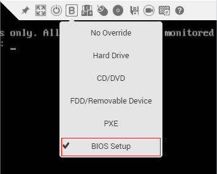

3.  In the drop-down list, choose, select  **BIOS Setup**, and click    on the toolbar to restart the server.
4.  After the system restarts, the BIOS configuration screen is displayed. Choose  **Advanced**  \>  **Socket Configuration**. See  [Figure 5](#fig4546303814).

    **Figure  5**  Socket Configuration
    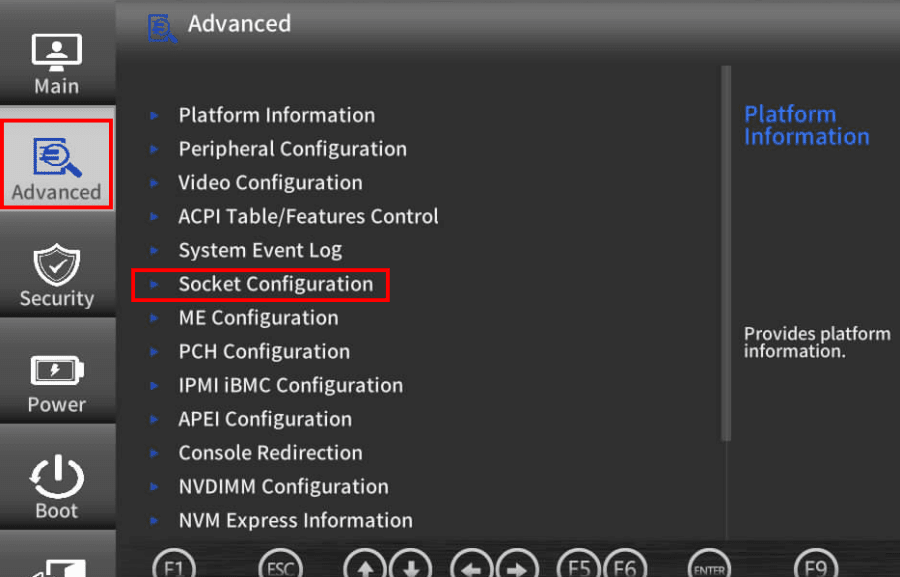

5.  On the  **Advanced Power Mgmt. Configuration**  page displayed, set  **Power Policy**  to  **Performance**, See  [Figure 6](#fig15501111014442).

    **Figure  6**  Setting the power policy
    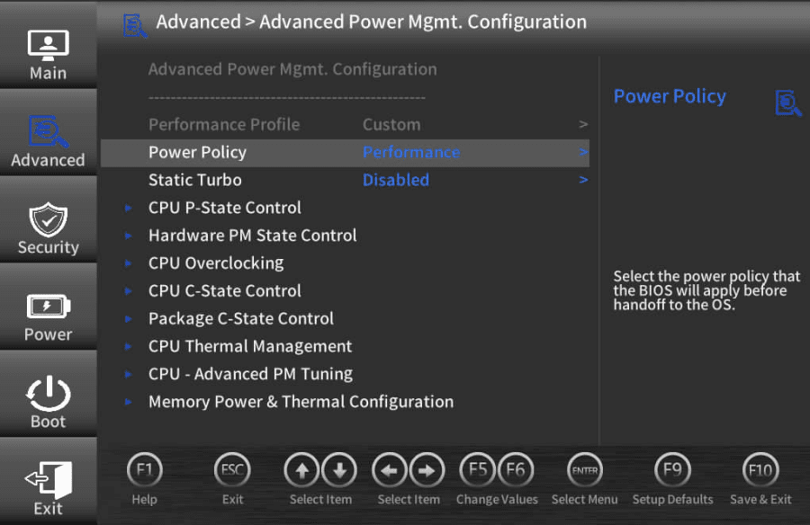

6.  Press  **F10**  to save the settings and reboot the server.

###### Setting the CPU Mode to Performance

Perform the following steps as the  **root**  user:

1.  Run the following command to check the current CPU mode:

    ```
    cat /sys/devices/system/cpu/cpu0/cpufreq/scaling_governor
    ```

    After the preceding command is run, the current CPU mode is displayed. For details, see  [Table 1](#table354392019384). If the current CPU mode is not performance, perform the following operations to set the CPU mode to performance: Otherwise, skip this step.

    **Table  1**  CPU mode

    <table><thead align="left"><tr id="row16543172093819"><th class="cellrowborder" valign="top" width="30.819999999999997%" id="mcps1.2.3.1.1"><p id="p2526552113912"><a name="p2526552113912"></a><a name="p2526552113912"></a>Governor</p>
    </th>
    <th class="cellrowborder" valign="top" width="69.17999999999999%" id="mcps1.2.3.1.2"><p id="p452519525397"><a name="p452519525397"></a><a name="p452519525397"></a>Description</p>
    </th>
    </tr>
    </thead>
    <tbody><tr id="row654317204384"><td class="cellrowborder" valign="top" width="30.819999999999997%" headers="mcps1.2.3.1.1 "><p id="p2376242163917"><a name="p2376242163917"></a><a name="p2376242163917"></a>performance</p>
    </td>
    <td class="cellrowborder" valign="top" width="69.17999999999999%" headers="mcps1.2.3.1.2 "><p id="p14376442183917"><a name="p14376442183917"></a><a name="p14376442183917"></a>The CPU runs at the maximum frequency.</p>
    </td>
    </tr>
    <tr id="row854318200381"><td class="cellrowborder" valign="top" width="30.819999999999997%" headers="mcps1.2.3.1.1 "><p id="p153761542123910"><a name="p153761542123910"></a><a name="p153761542123910"></a>powersave</p>
    </td>
    <td class="cellrowborder" valign="top" width="69.17999999999999%" headers="mcps1.2.3.1.2 "><p id="p8376942173913"><a name="p8376942173913"></a><a name="p8376942173913"></a>The CPU runs at the minimum frequency.</p>
    </td>
    </tr>
    <tr id="row75431920203818"><td class="cellrowborder" valign="top" width="30.819999999999997%" headers="mcps1.2.3.1.1 "><p id="p1437611425398"><a name="p1437611425398"></a><a name="p1437611425398"></a>userspace</p>
    </td>
    <td class="cellrowborder" valign="top" width="69.17999999999999%" headers="mcps1.2.3.1.2 "><p id="p103771642173920"><a name="p103771642173920"></a><a name="p103771642173920"></a>The CPU runs at a frequency specified by the user.</p>
    </td>
    </tr>
    <tr id="row165438202382"><td class="cellrowborder" valign="top" width="30.819999999999997%" headers="mcps1.2.3.1.1 "><p id="p7377142113915"><a name="p7377142113915"></a><a name="p7377142113915"></a>ondemand</p>
    </td>
    <td class="cellrowborder" valign="top" width="69.17999999999999%" headers="mcps1.2.3.1.2 "><p id="p237794283917"><a name="p237794283917"></a><a name="p237794283917"></a>The CPU frequency is dynamically adjusted as required. Once a task needs CPU computing power, the CPU runs at the maximum frequency. If the idle time increases, the CPU frequency decreases.</p>
    </td>
    </tr>
    <tr id="row55441320113810"><td class="cellrowborder" valign="top" width="30.819999999999997%" headers="mcps1.2.3.1.1 "><p id="p8377142203913"><a name="p8377142203913"></a><a name="p8377142203913"></a>conservative</p>
    </td>
    <td class="cellrowborder" valign="top" width="69.17999999999999%" headers="mcps1.2.3.1.2 "><p id="p737794216395"><a name="p737794216395"></a><a name="p737794216395"></a>The CPU frequency is dynamically adjusted as required. The adjustment is more conservative than that of the <strong id="b8120182619306"><a name="b8120182619306"></a><a name="b8120182619306"></a>ondemand</strong> mode.</p>
    </td>
    </tr>
    <tr id="row5544620123817"><td class="cellrowborder" valign="top" width="30.819999999999997%" headers="mcps1.2.3.1.1 "><p id="p13377154273919"><a name="p13377154273919"></a><a name="p13377154273919"></a>schedutil</p>
    </td>
    <td class="cellrowborder" valign="top" width="69.17999999999999%" headers="mcps1.2.3.1.2 "><p id="p183779421393"><a name="p183779421393"></a><a name="p183779421393"></a>The CPU frequency is adjusted based on the scheduler.</p>
    </td>
    </tr>
    </tbody>
    </table>
    
2.  Run the following command to install the tool:
    -   The  **ubuntu/debian**  system is used as an example.

        ```
        apt-get install linux-tools-$(uname -r)
        ```

    -   The  **centos/bclinux/euler**  system is used as an example:

        ```
        yum install kernel-tools -y
        systemctl daemon-reload 
        systemctl enable cpupower 
        systemctl start cpupower
        ```

3.  Sets the CPU mode to performance.

    ```
    cpupower frequency-set -g performance
    ```

4.  Perform  [Step 1](#li158435131344)  again to check whether the current CPU mode is set to performance.

##### Changing the CPU Performance Mode (ARM Server)

###### Setting the Power Policy to High Performance

Some models that have demanding requirements on the CPUs on the host, for example, the object detection model, require complex image pre-processing. Enabling the high-performance mode of the power supply can improve performance and stability. To improve network performance, you need to set the power policy to high performance in the BIOS settings of the ARM server. The detailed operations are as follows:

1.  Log in to the iBMC WebUI, start the virtual console, and select  **HTML5 Integrated Remote Console**, as shown in  [Figure 7](#fig15869135420288).

    **Figure  7**  Remote console
    

2.  On the virtual toolbar, click the startup item tool  . The startup item drop-down list is displayed, as shown in  [Figure 8](#fig744814574243).

    **Figure  8**  Startup item tool
    

3.  In the drop-down list, select  **BIOS Setup**, and click    on the toolbar to restart the server.
4.  After the system restarts, the BIOS configuration screen is displayed. Choose  **Advanced**  \>  **Performance Config**. See  [Figure 9](#fig4546303814).

    **Figure  9**  Performance Config
    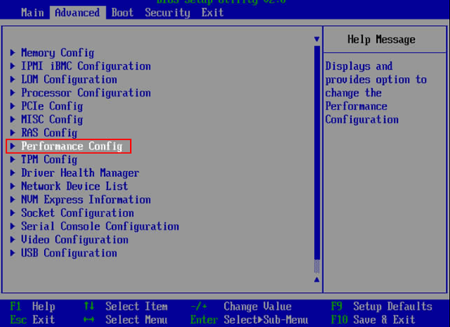

5.  On the  **Performance Config**  page, set  **Power Policy**  to  **Performance**. See  [Figure 10](#fig15501111014442).

    **Figure  10**  Setting the power policy 
    

6.  Press  **F10**  to save the settings and reboot the server.

##### Installing the High-Performance Pillow Library (x86 Server)

1.  Run the following command to install the dependencies for the high-performance pillow library:

    Ubuntu/Debian:

    ```
    apt-get install libtiff5-dev libjpeg8-dev libopenjp2-7-dev zlib1g-dev libfreetype6-dev liblcms2-dev libwebp-dev tcl8.6-dev tk8.6-dev python3-tk libharfbuzz-dev libfribidi-dev libxcb1-dev
    ```

    CentOS/BC-Linux/EulerOS:

    ```
    yum install libtiff-devel libjpeg-devel openjpeg2-devel zlib-devel freetype-devel lcms2-devel libwebp-devel tcl-devel tk-devel harfbuzz-devel fribidi-devel libraqm-devel libimagequant-devel libxcb-devel
    ```

2.  Install the high-performance Pillow library.
    1.  Run the following command to uninstall the native Pillow:

        ```
        pip3.7 uninstall -y pillow
        ```

    2.  Install the pillow-simd of the SSE4 version.

        Run the following command as the  **root**  user. If a non-root user is used, add  **--user**  to the end of the command.

        ```
        pip3.7 install pillow-simd
        ```

        > **NOTE:** 
        >If the CPU supports the AVX2 instruction set, run the following command to install pillow-simd of the AVX2 version:
        >```
        >CC="cc -mavx2" pip3.7 install -U --force-reinstall pillow-simd
        >```


3.  Modify the TorchVision code to solve the problem that the pillow-simd does not contain the  **PILLOW\_VERSION**  field. For details about how to install TorchVision, see [How to Obtain](#how-to-obtain).

    Modify the code in line 5 of  **/usr/local/python3._x.x_/lib/python3._x_/site-packages/torchvision/transforms/functional.py**  as follows:

    ```
    try:
        from PIL import Image, ImageOps, ImageEnhance,PILLOW_VERSION
    except:
        from PIL import Image, ImageOps, ImageEnhance
        PILLOW_VERSION="7.0.0"
    ```

##### (Optional) Installing the OpenCV Library of the Specified Version

If the model depends on OpenCV, you are advised to install OpenCV 3.4.10 to ensure training performance.

1.  Source code:  [Link](https://opencv.org/releases/)
2.  Installation guide:  [Link](https://docs.opencv.org/3.4.10/d7/d9f/tutorial_linux_install.html)

#### Training Performance Optimization

##### Operator Bottleneck Optimization

1.  Obtain the profile data during training. For details, see [Profile Data Collection](#profile-data-collection).
2.  Analyze the profile data to obtain the time-consuming operator.
3.  See [Single-Operator Sample Building](#single-operator-sample-building) to build the single-operator sample of the time-consuming operator, and compare the execution time of a single-operator sample on the CPU and GPU. If the performance is insufficient, use either of the following methods to solve the problem:
    -   Workaround: Use other efficient operators with the same semantics.
    -   Solution: Improve the operator performance.


##### Copy Bottleneck Optimization

1.  Obtain the profile data during training. For details, see [Profile Data Collection](#profile-data-collection).
2.  Analyze the Profile data to obtain the execution time of  **D2DCopywithStreamSynchronize**,  **PTCopy**, or  **format\_contiguous**  in the entire network.
3.  If the execution takes a long time, use either of the following methods to solve the problem:
    -   Method 1 \(workaround\): Replace view operators with compute operators. In PyTorch, view operators cause conversion from non-contiguous tensors to contiguous tensors. The optimization idea is to replace view operators with compute operators. Common view operators include view, permute, and transpose operators. For more view operators, go to  [https://pytorch.org/docs/stable/tensor\_view.html](https://pytorch.org/docs/stable/tensor_view.html).
    -   Method 2 \(solution\): Accelerate the operation of converting non-contiguous tensors to contiguous tensors.


##### Framework Bottleneck Optimization

1.  Obtain the operator information (OP_INFO) during the training. For details, see [Obtaining Operator Information (OP_INFO)](#obtaining-operator-information-op_info).
2.  Analyze the specifications and calling relationship of operators in OP\_INFO to check whether redundant operators are inserted. Pay special attention to check whether transdata is proper.
3.  Solution: Specify the initialization format of some operators to eliminate cast operators.
4.  In  **pytorch/torch/nn/modules/module.py**, specify the operator initialization format in  **cast\_weight**, as shown in the following figure.

    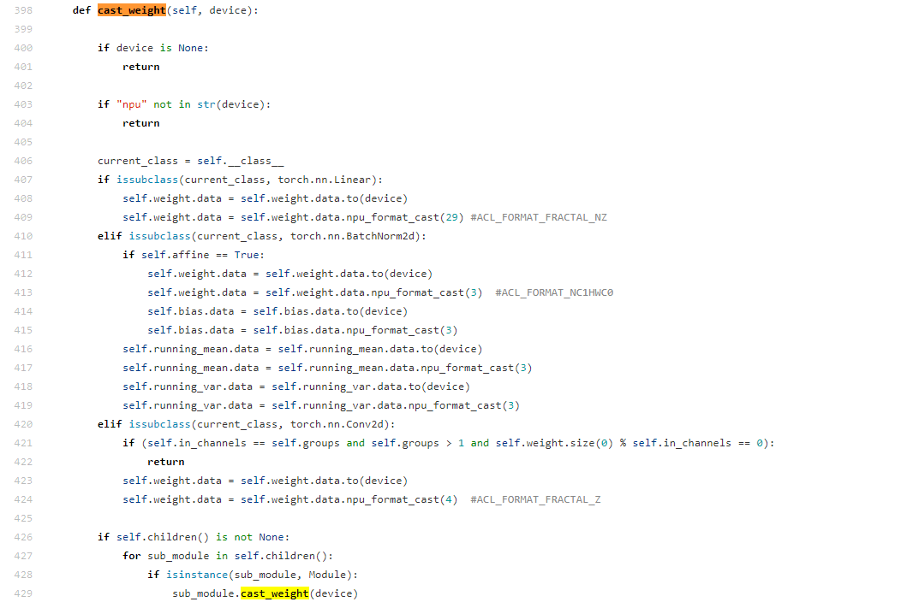

    The format setting principle is as follows:

    -   For the Conv2D operator, weight can be set to FZ format, for example, line 424.
    -   For the linear operator, weight can be set to NZ format, for example, line 409.


##### Compilation Bottleneck Optimization

1.  Obtain the operator information (OP_INFO) during the training. For details, see [Obtaining Operator Information (OP_INFO)](#obtaining-operator-information-op_info).
2.  View the INFO log and check the keyword  **aclopCompile::aclOp**  after the first step. If  **Match op inputs/type failed**  or  **To compile op**  is displayed, the operator is dynamically compiled and needs to be optimized.
3.  Use either of the following methods to solve the problem:
    -   Workaround: Based on the understanding of model semantics and related APIs, replace dynamic shape with static shape.
    -   Solution: Reduce compilation or do not compile the operator.
    -   For details about how to optimize the operator compilation configuration, see [Compilation Option Settings](#compilation-option-settings).

### E2E Performance Tool (E2E prof) Instructions

#### Introduction

The E2E prof tool integrates the framework-layer data obtained by the Profiling tool of PyTorch and the operator profile data obtained by the CANN prof tool to implement end-to-end model and operator performance analysis.

#### Usage Tutorial

Add the following with statement to enable the E2E prof function.

```
with torch.npu.profile(profiler_result_path="./result",use_e2e_profiler=Ture):

     model_train()
```

- **profiler_result_path** indicates the path for     storing the prof results. If no path is specified, the current path is     used by default.
- **use_e2e_profiler** indicates whether to enable     the E2E prof function. The default value is **False**, indicating that only the CANN prof function is enabled.

(The NUP operator can be executed only after compilation. To ensure data accuracy, you are advised to run it for 10 steps first, and then perform the E2E prof operation. Generally, only one or two steps are required for profiling.)

#### Result Parsing

The results obtained by using the E2E prof tool are raw data, which can be viewed only after being parsed.

1. Use the path in the tutorial as an example. The tool creates a folder in the *profiler_result_path* directory to save the raw data.

   

2. Switch to the **./result** directory in the preceding figure and run the following script:

   ```
   /usr/local/Ascend/ascend-toolkit/latest/toolkit/tools/profiler/bin/msprof --export=on --output=./
   ```

   - **output**: indicates the path of the raw data.

3. After the running is complete, find the **timeline** directory in the raw data path. See the following figure.

   

4. The **timeline** directory stores the parsed profile data, which can be opened in **chrome://tracing/**.

   1. Open a browser and enter **chrome://tracing/** in the address box.

   2. Click **Load** to upload the file.

      
   An example is provided as follows:

   

   This example contains four layers from top to bottom. The first layer (MsprofTx) contains the PyTorch framework data, the second layer (AscendCL) contains the AscendCL data, the third layer (Task Scheduler) contains the device data, and the fourth layer (AI CPU) contains the AI CPU data.

#### Advanced Settings

By default, the E2E prof tool can obtain all of the preceding data. However, the process of obtaining data affects the performance. If a large amount of data is obtained, the profile data cannot be used as a reference. Therefore, the E2E prof tool provides configurable options for fine-grained control over obtaining data of specified layers.

```
with torch.npu.profile(profiler_result_path="./results", use_e2e_profiler=True，config=torch.npu. profileConfig(ACL_PROF_ACL_API=True, ACL_PROF_TASK_TIME=True, ACL_PROF_AICORE_METRICS=True,ACL_PROF_AICPU=True, ACL_PROF_L2CACHE=True, ACL_PROF_HCCL_TRACE=True, ACL_PROF_TRAINING_TRACE=True, aiCoreMetricsType=0)):
```

-   **ACL_PROF_ACL_API**: collects profile data of     AscendCL APIs. The default value is **True**.
-   **ACL_PROF_TASK_TIME**: collects the execution time     of AI Core operators. The default value is **True**.
-   **ACL_PROF_AICORE_METRICS**: collects the AI Core     performance metrics. Only those configured in **aicore_metrics** are valid. The default value is **True**.
-   **ACL_PROF_AICPU**: 0x0008, collects traces of     AI CPU tasks, including the start and end of each task. The default value     is **True**.
-   **ACL_PROF_L2CACHE**: collects L2 cache data. The     default value is **True**.
-   **ACL_PROF_HCCL_TRACE**: collects HCCL data. The     default value is **True**.
-   **ACL_PROF_TRAINING_TRACE**: collects iteration traces,     which record the forward and backward propagation steps of a model. The     default value is **True**.

The values of **aiCoreMetricsType** are defined as follows. The default value is **0**.

- **ACL_AICORE_ARITHMETIC_UTILIZATION     = 0**: percentages of arithmetic     throughput, including metrics **mac_fp16_ratio**,     **mac_int8_ratio**, **vec_fp32_ratio**, **vec_fp16_ratio**, **vec_int32_ratio**, and **vec_misc_ratio**
- **ACL_AICORE_PIPE_UTILIZATION =     1**: percentages of time taken     by the compute units and MTEs, including metrics **vec_ratio**, **mac_ratio**,     **scalar_ratio**, **mte1_ratio**, **mte2_ratio**, **mte3_ratio**,     and **icache_miss_rate**
- **ACL_AICORE_MEMORY_BANDWIDTH =     2**: percentages of external     memory read/write instructions, including metrics **ub_read_bw**, **ub_write_bw**,     **l1_read_bw**, **l1_write_bw**, **l2_read_bw**, **l2_write_bw**,     **main_mem_read_bw**, and **main_mem_write_bw**
- **ACL_AICORE_L0B_AND_WIDTH**: percentages of internal     memory read/write instructions, including **scalar_ld_ratio**, **scalar_st_ratio**,     **l0a_read_bw**, **l0a_write_bw**, **l0b_read_bw**, **l0b_write_bw**,     **l0c_read_bw**, and **l0c_write_bw**.
- **ACL_AICORE_RESOURCE_CONFLICT_RATIO**: percentages of pipeline     stall instructions, including **vec_bankgroup_cflt_ratio**,     **vec_bank_cflt_ratio**, **vec_resc_cflt_ratio**, **mte1_iq_full_ratio**, **mte2_iq_full_ratio**, **mte3_iq_full_ratio**, **cube_iq_full_ratio**, **vec_iq_full_ratio**, and **iq_full_ratio**.
- **ACL_AICORE_NONE = 0xFF**: Profiling disabled

### Affinity Library

#### Source

The common network structures and functions in the public models are optimized to greatly improve computing performance. In addition, the network structures and functions are integrated into the PyTorch framework to facilitate model performance optimization.

#### Functions

<table><thead align="left"><tr id="row1348193013113"><th class="cellrowborder" valign="top" width="46.21462146214622%" id="mcps1.1.4.1.1"><p id="p98051838191114"><a name="p98051838191114"></a><a name="p98051838191114"></a>Function</p>
</th>
<th class="cellrowborder" valign="top" width="25.292529252925295%" id="mcps1.1.4.1.2"><p id="p1080553881111"><a name="p1080553881111"></a><a name="p1080553881111"></a>Location</p>
</th>
<th class="cellrowborder" valign="top" width="28.49284928492849%" id="mcps1.1.4.1.3"><p id="p14805153841113"><a name="p14805153841113"></a><a name="p14805153841113"></a>Description</p>
</th>
</tr>
</thead>
<tbody><tr id="row1449163011112"><td class="cellrowborder" valign="top" width="46.21462146214622%" headers="mcps1.1.4.1.1 "><p id="p138051838121113"><a name="p138051838121113"></a><a name="p138051838121113"></a>pairwise_iou</p>
</td>
<td class="cellrowborder" valign="top" width="25.292529252925295%" headers="mcps1.1.4.1.2 "><p id="p1080514386118"><a name="p1080514386118"></a><a name="p1080514386118"></a>torch.contrib.npu.optimized_lib</p>
</td>
<td class="cellrowborder" valign="top" width="28.49284928492849%" headers="mcps1.1.4.1.3 "><p id="p1480593811116"><a name="p1480593811116"></a><a name="p1480593811116"></a>Calculates the IOUs of the two bounding boxes.</p>
</td>
</tr>
<tr id="row174933013118"><td class="cellrowborder" valign="top" width="46.21462146214622%" headers="mcps1.1.4.1.1 "><p id="p1280513819113"><a name="p1280513819113"></a><a name="p1280513819113"></a>fast_rcnn_inference_single_image</p>
</td>
<td class="cellrowborder" valign="top" width="25.292529252925295%" headers="mcps1.1.4.1.2 "><p id="p198057389119"><a name="p198057389119"></a><a name="p198057389119"></a>torch.contrib.npu.optimized_lib</p>
</td>
<td class="cellrowborder" valign="top" width="28.49284928492849%" headers="mcps1.1.4.1.3 "><p id="p118053381118"><a name="p118053381118"></a><a name="p118053381118"></a>Provides the inference API of the Mask R-CNN and Faster R-CNN models.</p>
</td>
</tr>
<tr id="row349530141119"><td class="cellrowborder" valign="top" width="46.21462146214622%" headers="mcps1.1.4.1.1 "><p id="p2806538181110"><a name="p2806538181110"></a><a name="p2806538181110"></a>ChannelShuffle</p>
</td>
<td class="cellrowborder" valign="top" width="25.292529252925295%" headers="mcps1.1.4.1.2 "><p id="p48069388115"><a name="p48069388115"></a><a name="p48069388115"></a>torch.contrib.npu.optimized_lib</p>
</td>
<td class="cellrowborder" valign="top" width="28.49284928492849%" headers="mcps1.1.4.1.3 "><p id="p5806123817112"><a name="p5806123817112"></a><a name="p5806123817112"></a>Provides NPU-affinity channelshuffle operations and applies to models such as shufflenetv2.</p>
</td>
</tr>
<tr id="row849203018111"><td class="cellrowborder" valign="top" width="46.21462146214622%" headers="mcps1.1.4.1.1 "><p id="p188062384116"><a name="p188062384116"></a><a name="p188062384116"></a>PreLoader</p>
</td>
<td class="cellrowborder" valign="top" width="25.292529252925295%" headers="mcps1.1.4.1.2 "><p id="p6806938111113"><a name="p6806938111113"></a><a name="p6806938111113"></a>torch.contrib.npu.optimized_lib</p>
</td>
<td class="cellrowborder" valign="top" width="28.49284928492849%" headers="mcps1.1.4.1.3 "><p id="p14806103861118"><a name="p14806103861118"></a><a name="p14806103861118"></a>Provides the data loading method for accelerating Ascend AI Processors.</p>
</td>
</tr>
</tbody>
</table>

> **NOTE:** 
>The optimization content will be enhanced and updated with the version. Use the content in the corresponding path of the actual PyTorch version.

## Precision Commissioning

### Prerequisites

Run a certain number of epochs \(20% of the total number of epoches is recommended\) with the same semantics and hyperparameters to align the precision and loss with the corresponding level of the GPU. After the alignment is complete, align the final precision.

### Commissioning Process

#### Overall Guideline

To locate the precision problem, you need to find out the step in which the problem occurs. The following aspects are involved:

1.  Model network calculation error
    -   Locating method: Add a hook to the network to determine which part is suspected. Then build a single-operator sample by referring to [Single-Operator Sample Building](#single-operator-sample-building) to narrow down the error range. This can prove that the operator calculation is incorrect in the current network. You can compare the result with the CPU or GPU result to prove the problem.

    -   Workaround: Use other operators with the same semantics.

    -   Solution: Improve the operator precision or function.

2.  Loss calculation error
    -   Locating method: The loss is special and can be customized. After determining that the loss calculation is incorrect, you are advised to dump the loss input in the network instead of a random tensor with the identical shape, so that the problem can be better reproduced and proved.

    -   Workaround: Use other operators with the same semantics.

    -   Solution: Improve the operator precision or function. \(Loss is also formed by operators.\)

3.  Parameter update error

    -   Locating method: Before each  **optim.step\(\)**, print the gradients of the parameters in the network one by one to determine which part is suspected. Then build a single-operator sample to narrow down the error range. This can prove that the gradient calculation by the operator is incorrect in the current network. You can compare the result with the CPU or GPU result to prove the problem. The priority of this item should be lower than that of items  [1](#li17755175510322)  and  [2](#li25281726103316)  because the errors of items 1 and 2 can also cause the gradient exception.

    -   Workaround: Use other operators with the same semantics.

    -   Solution: Improve the precision or function of the operator for gradient calculation.

4.  Multi-device calculation error

    -   Locating method: When the precision of a single-device is ensured, multi-device calculation errors occur.

    -   Solution: Contact Huawei support to provide the single-device script and multi-device script of stable reproduction.

#### Precision Tuning Methods

General model precision problems are as follows: training loss not converge or unqualified precision due to operator overflow/underflow; unqualified performance due to network-wide training. You can perform single-operator overflow/underflow detection and network-wide commissioning to resolve the preceding problems.

##### **Environment Setup**

- Install the HDF5 tool to support the operator dump function. For details about how to install the tool, see [HDF5 Compilation and Installation](#hdf5-compilation-and-installation)。

  To use the operator precision comparison function, Install the HDF5 tool in both the NPU and GPU environments. Otherwise, install it only in the NPU environment.

- Install the Ascend PyTorch framework that supports the dump function. Modify the **build.sh** script before compilation. For details about other operations, see the *PyTorch Installation Guide*.

  - Install PyTorch in the NPU environment.

    Add the  `USE_DUMP=1` field to the **build.sh** script before compilation.

    ```bash
    DEBUG=0 USE_DISTRIBUTED=1 USE_HCCL=1 USE_MKLDNN=0 USE_CUDA=0 USE_NPU=1 BUILD_TEST=0 USE_NNPACK=0 USE_DUMP=1 python"${PY_VERSION}" setup.py build bdist_wheel
    ```

  - (Optional) Install PyTorch in the GPU environment. Perform this operation only when you want to compare the precision of model operators.

    Before compilation, open the **build.sh** script, add the `USE_DUMP=1 ` and `USE_NCCL=0` fields, change the values of the  `USE_HCCL` and `USE_NPU` fields to **0**, and change the value of the `USE_CUDA` field to **1**.

    ```bash
    DEBUG=0 USE_DISTRIBUTED=1 USE_HCCL=0 USE_NCCL=0 USE_MKLDNN=0 USE_CUDA=1 USE_NPU=0 BUILD_TEST=0 USE_NNPACK=0 USE_DUMP=1 python"${PY_VERSION}" setup.py build bdist_wheel
    ```

##### Model Operator Precision Comparison

With the same inputs, you can use the Model Accuracy Analyzer to obtain the precision difference of the operator outputs of a model when the model is trained on the GPU and NPU, helping you locate operator precision problems.

Restrictions:

- You are advised to use a small batch size (**8** or fewer).

  The input and output data of each operator is stored on drives and occupies a large space. Therefore, you are advised to set a small batch size to save the drive space.

- You are advised to dump data of only one step for     precision comparison.

- Currently, operators during O1 or O2 training can be     used for precision comparison (FP32 only).

Comparison modes:

- Assume that the input and output of the GPU are known     data. Load the input data of the GPU to the NPU to obtain the output data,     and compare the NPU-based output with the GPU-based output.
- Assume that the input and output of the NPU are known     data. Load the input data of the NPU to the GPU to obtain the output data,     and compare the NPU-based output with the GPU-based output.

Procedure:

1. In the GPU or NPU environment, use the Dumper tool to obtain the model input and operator output on the GPU or NPU.

   Modify the training code to add the data dump function. Use the `with` statement in the forward and backward propagation positions of the model training code to add the `torch.utils.dumper()` method to dump data. For example, the following is a modification example in the GPU environment:

   ```python
   for i, data in enumerate(dataloader):
       with torch.utils.dumper(use_dump=True, dump_path="./model_gpu.h5") as dump:
           # Model training code
           xxx # forward code 
           xxx # backward code
       exit()
       xxx # optimizer code 
   ```

   **dump_path** indicates the path of the dump data file, including the file name. You are advised to dump the data of only one step for precision comparison and place the parameter update code outside the with statement.

2. Copy the **model_gpu.h5** data dumped in the GPU (NPU) environment to the NPU (GPU) environment.

3. In the GPU or NPU environment, use the Dumper tool to load the dumped data and obtain the operator output data.

   Modify the training code and add the data load and dump functions. Use the `with` statement in the forward and backward propagation positions of the model training code to add the `torch.utils.dumper()` method to load and dump data. For example, the following is a modification example in the NPU environment:

   ```python
   for i, data in enumerate(dataloader):
       with torch.utils.dumper(use_dump=True, load_file_path="./model_gpu.h5", dump_path="./model_npu.h5") as dump:
           # Model training code
           xxx # forward code 
           xxx # backward code
       exit()
       xxx # optimizer code
   ```

   **load_file_path** indicates the path of dump data obtained from the GPU or NPU. **dump_path** indicates the path of the dump data file, including the file name. You are advised to dump the data of only one step for precision comparison and place the parameter update code outside the with statement.

4. Use msaccucmp.py to compare the operator output data.

   1. Ascend-Toolkit provides the msaccucmp.py tool for precision comparison.

      - The script is stored in **/user/local/Ascend/ascend-toolkit/latest/tools/operator_cmp/compare/msaccucmp.py**.

        The path is for reference only. Replace it with the actual installation path of Ascend-Toolkit.

      - You can also run the following command to query the path of msaccucmp.py:

        ```linux
        find / -name msaccucmp.py
        ```

   2. Run the msaccucmp.py script to compare the precision.

      ```
      python3 /user/local/Ascend/ascend-toolkit/latest/tools/operator_cmp/compare/msaccucmp.py compare -m ./model_npu.h5 -g ./model_gpu.h5
      ```

      Parameters:

      `-g` passes the path of dump data obtained from the GPU.

      `-m` passes the path of dump data obtained from the NPU.

##### Single-Operator Overflow/Underflow Detection

With this function, you can check whether an operator overflows/underflows and collect data of overflow/underflow operators, helping developers quickly locate and solve operator precision problems.

Restrictions:

-   This function provides only IR-level operator overflow/underflow detection for only the AI Core (not Atomic).
-   When using the single-operator overflow/underflow detection function, do not enable the dynamic loss scale mode of apex and the tensor fusion function at the same time.

Collecting data of overflow/underflow operators

```
# check_overflow is the overflow/underflow detection control switch.
# dump_path is the path for storing dump files.
with torch.utils.dumper(check_overflow=check_overflow, dump_path=dump_path, load_file_path='') as dump:   
    # Code snippet for detecting operator overflow/underflow.
```

During model running of a step, if an operator overflows/underflows, the name of the corresponding IR is printed.

Viewing dump data:

If dump data is collected during training, an .h5 file of the dump data is generated in the {dump_path} directory. You can go to the directory to view the dump data.

Solution:

1. Map the collected .h5 file to the TBE operators. For details, see [Mapping Between IR and TBE Operators](#Mapping Between IR and TBE Operators).

2. Send the screenshots of operator overflow/underflow and the input and output files of the mapped TBE operators to Huawei R&D engineers as the attachment of an issue.

##### Mapping Between IR and TBE Operators

Prerequisites:

- Set the environment variable export `ACL_DUMP_DATA=0`.
- Do not use the `torch.npu.init.dump()` and `torch.npu.set.dump()` APIs in the script.

Procedure:

1. Prepare the .h5 file of the operators to be mapped.

   - In the operator overflow/underflow detection scenario, the .h5 file of the operators to be mapped has been generated for single-operator overflow/underflow detection.

   - In the precision comparison scenario, run the following command to extract the .h5 file of the operators to be mapped based on the comparison result:

     ```
     h5copy -pv -i "./input.h5" -o "./output.h5" -s "/op1/seqid/" -d "/op1/seqid/"
     ```

     **-i** indicates the input precision comparison file.

     **-o** indicates the output .h5 file of the operators to be mapped.

     **-s** indicates the name and **seqid** of the source operator to be extracted.

     **-d** indicates the name and **seqid** of the target operator to be extracted.

     If multiple operators need to be extracted, modify the **-s** and **-d** parameters and run the command for multiple times to extract multiple operators to **output.h5**.

     The **-s** and **-d** parameters in this command must be the same.

     Example:

     ```
     h5copy -pv -i "./dump_npu.h5" -o "./output.h5" -s "/numpy_T/1/" -d "/numpy_T/1/"
     ```

     This example indicates that the input and output data of the numpy_T operator whose **seqid** is **1** is extracted from **./dump_npu.h5** to the **./output.h5** file.

2. Configure the **acl.json** file.

   Create the **acl.json** configuration file required by the AscendCL dump function in the model directory.

   ```
   {
       "dump":
   	    {
               "dump_list":[]
               "dump_path":"./output_IR2TBE"# Mapping result output path
               "dump_mode":"all"
               "dump_op_switch":"on"
   	    }
   
   }
   ```

   Change `dump_path` to the result output path. Other fields do not need to be modified.

3. Modify the training script.

   Add the `with` statement to the training script to enable the IR-to-TBE mapping function.

   ```python
   with torch.utils.dumper(use_load=True, dump_path="./",load_file_path="./output.h5", load_with_acl_dump=True) as dump:
       # Model calculation code, which needs to be added by users
       # x = model(input_data)
   ```

4. Run the model.

   Run a complete model calculation process. During the calculation, if **load** encounters data in **output.h5**, the AscendCL dump function is automatically enabled to execute the IR and dump the input and output data of the TBE operators corresponding to the IR. After the IR is executed, the AscendCL dump ends.

5. Obtain the mapping file.

   After the execution is successful, view the output result file in the `dump_path` directory in the **acl.json** configuration file.

##### Mapping Between NPU and GPU Operators.

For details, see "Data Preparation > [Preparing Data Files for Accuracy Comparison with PyTorch as the Original Training Network]([CANN 5.0.3 Auxiliary Development Tool User Guide 01 - Huawei](https://support.huawei.com/enterprise/en/doc/EDOC1100219270/2324edc8#ZH-CN_TOPIC_0000001162580808))" in "Model Accuracy Analyzer Instructions (Training)" in the Auxiliary Development Tool User Guide.

<h5 id="network-wide-commissioningmd">Network-wide Commissioning </h5>

You can also commission the network model precision by analyzing the entire network.

1.  Determine whether the calculation on the Ascend AI Processor is correct by comparing the calculation result on the CPU and that on the Ascend AI Processor.

    Code example (this example shows only the basic method and does not allow direct copy):

    ```
    # The input parameters are fixed to ensure that the model and input data are the same on the CPU and Ascend AI Processor.
    input_tensor_cpu = torch.Tensor()
    model_cpu = build_model()
    # Port the input data to the Ascend AI Processor.
    input_tensor_npu = input_tensor_cpu.npu()
    # Port the model to the Ascend AI Processor.
    model_npu = model_cpu.npu()
    
    #Compare the calculation results.
    output_cpu = model_cpu(input_tensor_cpu)
    output_npu = model_npu(input_tensor_npu)
    compute_result = (output_cpu - output_npu).abs().mean())
    print(compute_result)
    ```

    The calculation results are slightly different because the hardware architecture of the Ascend AI Processor is different from that of the CPU. If the calculation results are close \(generally not higher than 1e-4\), then they are normal.

2.  Use the hook mechanism of PyTorch to print the inputs and outputs of the module in the forward and backward propagation for analysis.

    Code example (this example shows only the basic method and does not allow direct copy):

    ```
    # Set the hook function.
    def hook_func(name, module):
        def hook_function(module, inputs, outputs):
            print(name+' inputs', inputs)
            print(name+' outputs', outputs)
        return hook_function
    
    # Register the forward and backward hooks.
    for name, module in model.named_modules():
        module.register_forward_hook(hook_func('[forward]: '+name, module))
        module.register_backward_hook(hook_func('[backward]: '+name, module))
    
    # Run
    model(input_tensor)
    ```

    Analyze the printed inputs and outputs in the forward and backward propagation.

3.  Obtain parameters such as  **grad**,  **running\_mean**, and  **running\_var**  of the module to analyze the updates.

    Code example (this example shows only the basic method and does not allow direct copy):

    ```
    # For example, obtain the gradient and average value of BN for check.
    for name, module in model.named_modules():
        if isinstance(module, nn._BatchNorm):
            print("[BN_buffer]: "+name, module.running_mean, module.running_var)
        print("[grad]: "+name, module.grad)
    ```

## Model Saving and Conversion

### Introduction

After the model training is complete, save the model file and export the ONNX model by using the APIs provided by PyTorch. Then use the ATC tool to convert the model into an .om file that adapts to the Ascend AI Processor for offline inference.

This section describes how to convert the trained .pth or .pth.tar file into the ONNX model. For details about how to convert the ONNX model into an .om file adapted to the Ascend AI Processor, see "ATC Tool Instructions" in the  _CANN Auxiliary Development Tool User Guide _.

For details about how to use the Auto Tune function, see "Auto Tune Instructions" in the  _CANN Auxiliary Development Tool User Guide _.

For details about how to build an offline inference application, see the  _CANN Application Software Development Guide (C and C++, Inference)_. The process is as follows:


### Saving a Model

During PyTorch training,  **torch.save()**  is used to save checkpoint files. Based on the usage of model files, model files are saved in the following two formats:

-   .pth or .pt files: These files are used for online inference or exporting ONNX models. Only model parameters are saved, and the model structure is not saved, so that the compressed file can be opened using a visualization tool such as Netron.  [Figure 11](#fig315704722610)  shows an example.

    **Figure  11**  .pth file
    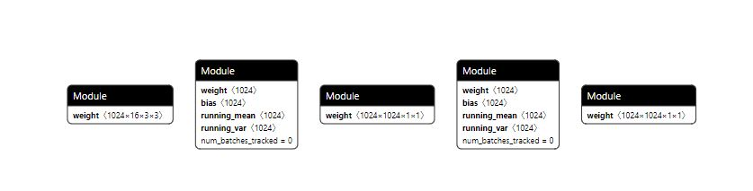

    Use  **state\_dict**  to save and load a model. The following is an example:

    1.  Save a model.

        ```
        # Create a storage path.
        PATH = "state_dict_model.pt"
        # Save a model.
        torch.save(net.state_dict(), PATH)
        ```

    2.  Load the model for online inference. The following is an example. For details, see the  _PyTorch Online Inference Guide_.

        ```
        # Path for storing the model file
        PATH = "state_dict_model.pt"
        model = TheModelClass(*args, **kwargs)
        # Load a model.
        model.load_state_dict(torch.load(PATH))
        model.eval()
        ```

    > **NOTICE:** 
    >The model definition file must be provided when the .pth or .pt file is saved. Otherwise, the deployment cannot be performed.

-   .pth.tar files: can be used for online inference or training after reloading. Multiple components are saved in dictionary format. Common components include the  **state\_dict**  of the model and optimizer, epoch when the training stops, training loss of the latest record, and the external torch.nn.Embedding layer. If only an inference model needs to be deployed, you are advised to save the weight information only, that is, the  **state\_dict**  of the model, in the .pth.tar file.

    The following is an example of saving and loading a model:

    1.  Save a model.

        ```
        PATH = "checkpoint.pth.tar"
        torch.save({
            'epoch': epoch,
            'loss': loss,
            'state_dict': model.state_dict(),
            'optimizer' : optimizer.state_dict(),
            ...
        }, PATH)
        ```

    2.  Load a model for inference or resuming training.

        ```
        model = TheModelClass(*args, **kwargs)
        optimizer = TheOptimizerClass(*args, **kwargs)
        
        checkpoint = torch.load(PATH)
        model.load_state_dict(checkpoint['model_state_dict'])
        optimizer.load_state_dict(checkpoint['optimizer_state_dict'])
        epoch = checkpoint['epoch']
        loss = checkpoint['loss']
        
        model.eval()
        # - or -
        model.train()
        ```

> **NOTICE:** 
>Generally, an operator is processed in different ways in the training graph and inference graph (for example, BatchNorm and dropout operators), and the input formats are also different. Therefore, before inference or ONNX model exporting,  **model.eval\(\)**  must be called to set the dropout and batch normalization layers to the inference mode.

### Exporting an ONNX Model

#### Introduction

The deployment policy of the Ascend AI Processor for PyTorch models is implemented based on the ONNX module that is supported by PyTorch. ONNX is a mainstream model format in the industry and is widely used for model sharing and deployment. This section describes how to export a checkpoint file as an ONNX model by using the  **torch.onnx.export\(\)**  API.

#### Using the .pth or .pt File to Export the ONNX Model

The saved .pth or .pt file can be restored by building a model using PyTorch and then loading the weight. Then you can export the ONNX model. The following is an example.

```
import torch
import torch.onnx
import torchvision.models as models
# Set the CPU to be used to export the model.
device = torch.device("cpu") 
 
def convert():
# The model definition comes from the torchvision. The model file generated in the example is based on the ResNet-50 model.
    model = models.resnet50(pretrained = False)  
    resnet50_model = torch.load('resnet50.pth', map_location='cpu')
    model.load_state_dict(resnet50_model) 
 
    batch_size = 1 # Size of the batch processing
    input_shape = (3, 224, 224) # Input data. Replace it with the actual shape.

    # Set the model to inference mode.
    model.eval()

    dummy_input = torch.randn(batch_size, *input_shape) # Define the input shape.
    torch.onnx.export(model, 
                      dummy_input, 
                      "resnet50_official.onnx", 
                      input_names = ["input"], # Construct the input name.
                      output_names = ["output"], # Construct the output name.
                      opset_version=11, # Currently, the ATC tool supports only opset_version=11.
                      dynamic_axes={"input":{0:"batch_size"}, "output":{0:"batch_size"}}) # Dynamic axes of the output is supported.
                      ) 
     
if __name__ == "__main__":
    convert()
```

> **NOTE:** 
>-   Before exporting the ONNX model, the  **model.eval\(\)**  must be called to set the dropout and batch normalization layers to inference mode.
>-   The model in the sample script comes from the definition in the torchvision module. You need to specify a model when using your own model.
>-   The constructed input and output must correspond to the input and output during training. Otherwise, the inference cannot be performed properly.

#### Using the .pth.tar File to Export the ONNX Model

Before exporting the ONNX model using the .pth.tar file, you need to check the saved information. Sometimes, the saved node name may be different from the node name in the model definition. For example, a prefix and suffix may be added. During the conversion, you can modify the node name. The following is an example of the conversion.

```
import torch
import torch.onnx
from collections import OrderedDict
import mobilenet

# In this example, when the .pth.tar file is saved, the prefix module is added to the node name. Delete it by traversing.
def proc_nodes_module(checkpoint, AttrName):
    new_state_dict = OrderedDict()
    for key, value in checkpoint[AttrName].items():
        if key == "module.features.0.0.weight":
            print(value)
        if(key[0:7] == "module."):
            name = key[7:]
        else:
            name = key[0:]

        new_state_dict[name] = value
    return new_state_dict

def convert():
    checkpoint = torch.load("./mobilenet_cpu.pth.tar", map_location=torch.device('cpu'))
    checkpoint['state_dict'] = proc_nodes_module(checkpoint,'state_dict')
    model = mobilenet.mobilenet_v2(pretrained = False)
    model.load_state_dict(checkpoint['state_dict'])
    model.eval()
    input_names = ["actual_input_1"]
    output_names = ["output1"]
    dummy_input = torch.randn(1, 3, 224, 224)
    torch.onnx.export(model, dummy_input, "mobilenetV2_npu.onnx", input_names = input_names, output_names = output_names, opset_version=11)

if __name__ == "__main__":
    convert()
```

## Samples

### ShuffleNet Model Optimization

#### Obtaining Samples

##### How to Obtain

1.  This sample is used to adapt to the porting and reconstruction of the  Ascend 910 AI Processor  based on the ImageNet dataset training model provided by the PyTorch official website. The sample can be obtained from  [https://github.com/pytorch/examples/tree/master/imagenet](https://github.com/pytorch/examples/tree/master/imagenet).
2.  For details about the ShuffleNet model, see the  [ShuffleNet V2](https://pytorch.org/hub/pytorch_vision_shufflenet_v2/)  in the PyTorch official website. Set the  **arch**  parameter to  **shufflenet\_v2\_x1\_0**  during script execution.

    ```
    --arch shufflenet_v2_x1_0
    ```

    > **NOTE:** 
    >ShuffleNet is a model built in PyTorch. For more built-in models, visit the  [PyTorch official website](https://pytorch.org/).


##### Directory Structure

The structure of major directories and files is as follows:

```
├──main.py 
```

#### Model Evaluation

Model evaluation focuses on operator adaptation. Use the dump op method to obtain the ShuffleNet operator information and compare the information with that in the  _PyTorch Operator Support_. If an operator is not supported, in simple scenarios, you can replace the operator with a similar operator or place the operator on the CPU to avoid this problem. In complex scenarios, operator development is required. For details, see the  _PyTorch Operator Development Guide_.

#### Porting the Network

For details about how to port the training scripts, see  [Single-Device Training Porting](#single-device-training-porting)  and  [Single-Server Multi-Device Training Modification](#single-server-multi-device-training-modification). During the script execution, select the  **--arch shufflenet\_v2\_x1\_0**  parameter.

#### Commissioning the Network

For details about how to commission the network, see [Commissioning Process](#commissioning-process). After check, it is found that too much time is consumed by operators during ShuffleNet running. The following provides the time consumption data and solutions.

##### Forward check

The forward check record table is as follows:

**Table  1**  Forward check

<table><thead align="left"><tr id="row5326170182016"><th class="cellrowborder" valign="top" width="6.419999999999999%" id="mcps1.2.5.1.1"><p id="p113266011202"><a name="p113266011202"></a><a name="p113266011202"></a>No.</p>
</th>
<th class="cellrowborder" valign="top" width="10.39%" id="mcps1.2.5.1.2"><p id="p1232670152015"><a name="p1232670152015"></a><a name="p1232670152015"></a>time (ms)</p>
</th>
<th class="cellrowborder" valign="top" width="11.35%" id="mcps1.2.5.1.3"><p id="p1132670152010"><a name="p1132670152010"></a><a name="p1132670152010"></a>batch_size</p>
</th>
<th class="cellrowborder" valign="top" width="71.84%" id="mcps1.2.5.1.4"><p id="p1532619082018"><a name="p1532619082018"></a><a name="p1532619082018"></a>Detail</p>
</th>
</tr>
</thead>
<tbody><tr id="row53268019209"><td class="cellrowborder" valign="top" width="6.419999999999999%" headers="mcps1.2.5.1.1 "><p id="p193266092012"><a name="p193266092012"></a><a name="p193266092012"></a>1</p>
</td>
<td class="cellrowborder" valign="top" width="10.39%" headers="mcps1.2.5.1.2 "><p id="p14326102208"><a name="p14326102208"></a><a name="p14326102208"></a>1100</p>
</td>
<td class="cellrowborder" valign="top" width="11.35%" headers="mcps1.2.5.1.3 "><p id="p7326105208"><a name="p7326105208"></a><a name="p7326105208"></a>512</p>
</td>
<td class="cellrowborder" valign="top" width="71.84%" headers="mcps1.2.5.1.4 "><p id="p133269002013"><a name="p133269002013"></a><a name="p133269002013"></a>Replace <strong id="b357779184319"><a name="b357779184319"></a><a name="b357779184319"></a>channel_shuffle</strong> with <strong id="b14131818104319"><a name="b14131818104319"></a><a name="b14131818104319"></a>channel_shuffle_index_select</strong>.</p>
</td>
</tr>
<tr id="row5326150202019"><td class="cellrowborder" valign="top" width="6.419999999999999%" headers="mcps1.2.5.1.1 "><p id="p123267020208"><a name="p123267020208"></a><a name="p123267020208"></a>2</p>
</td>
<td class="cellrowborder" valign="top" width="10.39%" headers="mcps1.2.5.1.2 "><p id="p63261403208"><a name="p63261403208"></a><a name="p63261403208"></a>600</p>
</td>
<td class="cellrowborder" valign="top" width="11.35%" headers="mcps1.2.5.1.3 "><p id="p14326904209"><a name="p14326904209"></a><a name="p14326904209"></a>512</p>
</td>
<td class="cellrowborder" valign="top" width="71.84%" headers="mcps1.2.5.1.4 "><p id="p0326908205"><a name="p0326908205"></a><a name="p0326908205"></a>Perform the <strong id="b15454145441"><a name="b15454145441"></a><a name="b15454145441"></a>channel_shuffle_index_select</strong> operation twice to reduce the non-contiguous tensors caused by chunk.</p>
</td>
</tr>
<tr id="row03268014201"><td class="cellrowborder" valign="top" width="6.419999999999999%" headers="mcps1.2.5.1.1 "><p id="p1332620019203"><a name="p1332620019203"></a><a name="p1332620019203"></a>3</p>
</td>
<td class="cellrowborder" valign="top" width="10.39%" headers="mcps1.2.5.1.2 "><p id="p173263082011"><a name="p173263082011"></a><a name="p173263082011"></a>300</p>
</td>
<td class="cellrowborder" valign="top" width="11.35%" headers="mcps1.2.5.1.3 "><p id="p632617010204"><a name="p632617010204"></a><a name="p632617010204"></a>512</p>
</td>
<td class="cellrowborder" valign="top" width="71.84%" headers="mcps1.2.5.1.4 "><p id="p1432716017202"><a name="p1432716017202"></a><a name="p1432716017202"></a>Specify the concat output format to NCHW through the framework layer to eliminate excessive transdata.</p>
</td>
</tr>
<tr id="row132740142011"><td class="cellrowborder" valign="top" width="6.419999999999999%" headers="mcps1.2.5.1.1 "><p id="p83271404205"><a name="p83271404205"></a><a name="p83271404205"></a>4</p>
</td>
<td class="cellrowborder" valign="top" width="10.39%" headers="mcps1.2.5.1.2 "><p id="p173278042012"><a name="p173278042012"></a><a name="p173278042012"></a>285</p>
</td>
<td class="cellrowborder" valign="top" width="11.35%" headers="mcps1.2.5.1.3 "><p id="p123272082015"><a name="p123272082015"></a><a name="p123272082015"></a>512</p>
</td>
<td class="cellrowborder" valign="top" width="71.84%" headers="mcps1.2.5.1.4 "><p id="p632715019200"><a name="p632715019200"></a><a name="p632715019200"></a>Rectify the weight format.</p>
</td>
</tr>
<tr id="row123271804206"><td class="cellrowborder" valign="top" width="6.419999999999999%" headers="mcps1.2.5.1.1 "><p id="p23271501207"><a name="p23271501207"></a><a name="p23271501207"></a>5</p>
</td>
<td class="cellrowborder" valign="top" width="10.39%" headers="mcps1.2.5.1.2 "><p id="p33271104207"><a name="p33271104207"></a><a name="p33271104207"></a>275</p>
</td>
<td class="cellrowborder" valign="top" width="11.35%" headers="mcps1.2.5.1.3 "><p id="p5327304206"><a name="p5327304206"></a><a name="p5327304206"></a>512</p>
</td>
<td class="cellrowborder" valign="top" width="71.84%" headers="mcps1.2.5.1.4 "><p id="p132710016204"><a name="p132710016204"></a><a name="p132710016204"></a>Rectify the problem that the output format 5HD was not specified for DWCONV.</p>
</td>
</tr>
</tbody>
</table>

The details are as follows:

-   The native  **torch.transpose\(x, 1, 2\).contiguous\(\)**  uses the view operator transpose, which produced non-contiguous tensors. For example, the copy bottleneck described in the  [copy bottleneck optimization](#training-performance-optimizationmd)  uses  **channel\_shuffle\_index\_select**  to replace the framework operator with the compute operator when the semantics is the same, reducing the time consumption.
-   ShuffleNet V2 contains a large number of chunk operations, and chunk operations are framework operators in PyTorch. As a result, a tensor is split into several non-contiguous tensors of the same length. The operation of converting non-contiguous tensors to contiguous tensors takes a long time. Therefore, the compute operator is used to eliminate non-contiguous tensors. For details, see the copy bottleneck described in the  [copy bottleneck optimization](#training-performance-optimizationmd)
-   During operator adaptation, the output format is specified as the input format by default. However, Concat does not support the 5HD format whose C dimension is not an integral multiple of 16, so it converts the format into 4D for processing. In addition, the Concat is followed by the GatherV2 operator, which supports only the 4D format. Therefore, the data format conversion process is 5HD \> 4D \> Concat \> 5HD \> 4D \> GatherV2 \> 5HD. The solution is to modify the Concat output format. When the output format is not an integer multiple of 16, the specified output format is 4D. After the optimization, the data format conversion process is 5HD \> 4D \> Concat \> GatherV2 \> 5HD. For details about the method for ShuffleNet, see line 121 in  **pytorch/aten/src/ATen/native/npu/CatKernelNpu.cpp**.
-   Set the weight initialization format to avoid repeated transdata during calculation, for example, the framework bottleneck described in the  [copy bottleneck optimization](#training-performance-optimizationmd).
-   The output format of the DWCONV weight is rectified to avoid the unnecessary conversion from 5HD to 4D.

##### Entire Network Check

The record table of the entire network check is as follows:

**Table  2**  Entire network check

<table><thead align="left"><tr id="row487985710248"><th class="cellrowborder" valign="top" width="6.419999999999999%" id="mcps1.2.5.1.1"><p id="p10879125714244"><a name="p10879125714244"></a><a name="p10879125714244"></a>No.</p>
</th>
<th class="cellrowborder" valign="top" width="10.39%" id="mcps1.2.5.1.2"><p id="p887995716244"><a name="p887995716244"></a><a name="p887995716244"></a>time (ms)</p>
</th>
<th class="cellrowborder" valign="top" width="11.35%" id="mcps1.2.5.1.3"><p id="p20880195718241"><a name="p20880195718241"></a><a name="p20880195718241"></a>batch_size</p>
</th>
<th class="cellrowborder" valign="top" width="71.84%" id="mcps1.2.5.1.4"><p id="p178802574242"><a name="p178802574242"></a><a name="p178802574242"></a>Detail</p>
</th>
</tr>
</thead>
<tbody><tr id="row198802057102413"><td class="cellrowborder" valign="top" width="6.419999999999999%" headers="mcps1.2.5.1.1 "><p id="p163268032610"><a name="p163268032610"></a><a name="p163268032610"></a>1</p>
</td>
<td class="cellrowborder" valign="top" width="10.39%" headers="mcps1.2.5.1.2 "><p id="p832616092615"><a name="p832616092615"></a><a name="p832616092615"></a>5500</p>
</td>
<td class="cellrowborder" valign="top" width="11.35%" headers="mcps1.2.5.1.3 "><p id="p19326170172611"><a name="p19326170172611"></a><a name="p19326170172611"></a>512</p>
</td>
<td class="cellrowborder" valign="top" width="71.84%" headers="mcps1.2.5.1.4 "><p id="p43261107269"><a name="p43261107269"></a><a name="p43261107269"></a>The <strong id="b1067763122518"><a name="b1067763122518"></a><a name="b1067763122518"></a>index_add</strong> operation is performed by copying index to CPU through the framework layer.</p>
</td>
</tr>
<tr id="row108801057122419"><td class="cellrowborder" valign="top" width="6.419999999999999%" headers="mcps1.2.5.1.1 "><p id="p632612020269"><a name="p632612020269"></a><a name="p632612020269"></a>2</p>
</td>
<td class="cellrowborder" valign="top" width="10.39%" headers="mcps1.2.5.1.2 "><p id="p63267042618"><a name="p63267042618"></a><a name="p63267042618"></a>4000</p>
</td>
<td class="cellrowborder" valign="top" width="11.35%" headers="mcps1.2.5.1.3 "><p id="p832650172620"><a name="p832650172620"></a><a name="p832650172620"></a>512</p>
</td>
<td class="cellrowborder" valign="top" width="71.84%" headers="mcps1.2.5.1.4 "><p id="p23266002618"><a name="p23266002618"></a><a name="p23266002618"></a>Customize operators to pre-generate an index.</p>
</td>
</tr>
<tr id="row8880175792411"><td class="cellrowborder" valign="top" width="6.419999999999999%" headers="mcps1.2.5.1.1 "><p id="p532616052611"><a name="p532616052611"></a><a name="p532616052611"></a>3</p>
</td>
<td class="cellrowborder" valign="top" width="10.39%" headers="mcps1.2.5.1.2 "><p id="p203262082619"><a name="p203262082619"></a><a name="p203262082619"></a>1800</p>
</td>
<td class="cellrowborder" valign="top" width="11.35%" headers="mcps1.2.5.1.3 "><p id="p832612022620"><a name="p832612022620"></a><a name="p832612022620"></a>512</p>
</td>
<td class="cellrowborder" valign="top" width="71.84%" headers="mcps1.2.5.1.4 "><p id="p153277016260"><a name="p153277016260"></a><a name="p153277016260"></a>Customize operators to combine index_add and chunk.</p>
</td>
</tr>
<tr id="row1888065718245"><td class="cellrowborder" valign="top" width="6.419999999999999%" headers="mcps1.2.5.1.1 "><p id="p43279082615"><a name="p43279082615"></a><a name="p43279082615"></a>4</p>
</td>
<td class="cellrowborder" valign="top" width="10.39%" headers="mcps1.2.5.1.2 "><p id="p23279032618"><a name="p23279032618"></a><a name="p23279032618"></a>885</p>
</td>
<td class="cellrowborder" valign="top" width="11.35%" headers="mcps1.2.5.1.3 "><p id="p8327708268"><a name="p8327708268"></a><a name="p8327708268"></a>512</p>
</td>
<td class="cellrowborder" valign="top" width="71.84%" headers="mcps1.2.5.1.4 "><p id="p14327404268"><a name="p14327404268"></a><a name="p14327404268"></a>Add <strong id="b14185739195312"><a name="b14185739195312"></a><a name="b14185739195312"></a>contiguous_with_gatherv2</strong>.</p>
</td>
</tr>
<tr id="row1809181814263"><td class="cellrowborder" valign="top" width="6.419999999999999%" headers="mcps1.2.5.1.1 "><p id="p10266151062717"><a name="p10266151062717"></a><a name="p10266151062717"></a>5</p>
</td>
<td class="cellrowborder" valign="top" width="10.39%" headers="mcps1.2.5.1.2 "><p id="p3266191019278"><a name="p3266191019278"></a><a name="p3266191019278"></a>3480</p>
</td>
<td class="cellrowborder" valign="top" width="11.35%" headers="mcps1.2.5.1.3 "><p id="p426631017276"><a name="p426631017276"></a><a name="p426631017276"></a>1024</p>
</td>
<td class="cellrowborder" valign="top" width="71.84%" headers="mcps1.2.5.1.4 "><p id="p726615104272"><a name="p726615104272"></a><a name="p726615104272"></a>Modify <strong id="b18329435101010"><a name="b18329435101010"></a><a name="b18329435101010"></a>batchsize</strong>.</p>
</td>
</tr>
<tr id="row319224152613"><td class="cellrowborder" valign="top" width="6.419999999999999%" headers="mcps1.2.5.1.1 "><p id="p10266310122713"><a name="p10266310122713"></a><a name="p10266310122713"></a>6</p>
</td>
<td class="cellrowborder" valign="top" width="10.39%" headers="mcps1.2.5.1.2 "><p id="p6266141042716"><a name="p6266141042716"></a><a name="p6266141042716"></a>1650</p>
</td>
<td class="cellrowborder" valign="top" width="11.35%" headers="mcps1.2.5.1.3 "><p id="p1426611012713"><a name="p1426611012713"></a><a name="p1426611012713"></a>1024</p>
</td>
<td class="cellrowborder" valign="top" width="71.84%" headers="mcps1.2.5.1.4 "><p id="p9266810202717"><a name="p9266810202717"></a><a name="p9266810202717"></a>Modify <strong id="b166283761018"><a name="b166283761018"></a><a name="b166283761018"></a>batchsize </strong>and <strong id="b1569963815413"><a name="b1569963815413"></a><a name="b1569963815413"></a>contiguous_with_gatherv2</strong>.</p>
</td>
</tr>
<tr id="row1638723117266"><td class="cellrowborder" valign="top" width="6.419999999999999%" headers="mcps1.2.5.1.1 "><p id="p13266171012714"><a name="p13266171012714"></a><a name="p13266171012714"></a>7</p>
</td>
<td class="cellrowborder" valign="top" width="10.39%" headers="mcps1.2.5.1.2 "><p id="p1326615108277"><a name="p1326615108277"></a><a name="p1326615108277"></a>1424</p>
</td>
<td class="cellrowborder" valign="top" width="11.35%" headers="mcps1.2.5.1.3 "><p id="p10266151019277"><a name="p10266151019277"></a><a name="p10266151019277"></a>1024</p>
</td>
<td class="cellrowborder" valign="top" width="71.84%" headers="mcps1.2.5.1.4 "><p id="p02661010122711"><a name="p02661010122711"></a><a name="p02661010122711"></a>Customize operators to combine cat, shuffle, and chunk to eliminate non-contiguous tensors.</p>
</td>
</tr>
<tr id="row3364411265"><td class="cellrowborder" valign="top" width="6.419999999999999%" headers="mcps1.2.5.1.1 "><p id="p13266810192715"><a name="p13266810192715"></a><a name="p13266810192715"></a>8</p>
</td>
<td class="cellrowborder" valign="top" width="10.39%" headers="mcps1.2.5.1.2 "><p id="p15266610192715"><a name="p15266610192715"></a><a name="p15266610192715"></a>1360</p>
</td>
<td class="cellrowborder" valign="top" width="11.35%" headers="mcps1.2.5.1.3 "><p id="p182661010172714"><a name="p182661010172714"></a><a name="p182661010172714"></a>1024</p>
</td>
<td class="cellrowborder" valign="top" width="71.84%" headers="mcps1.2.5.1.4 "><p id="p9266210132711"><a name="p9266210132711"></a><a name="p9266210132711"></a>Modify the format of the gradient transferred by ReluGrad through the framework layer.</p>
</td>
</tr>
<tr id="row6787652162615"><td class="cellrowborder" valign="top" width="6.419999999999999%" headers="mcps1.2.5.1.1 "><p id="p726617104277"><a name="p726617104277"></a><a name="p726617104277"></a>9</p>
</td>
<td class="cellrowborder" valign="top" width="10.39%" headers="mcps1.2.5.1.2 "><p id="p11266161012272"><a name="p11266161012272"></a><a name="p11266161012272"></a>1300</p>
</td>
<td class="cellrowborder" valign="top" width="11.35%" headers="mcps1.2.5.1.3 "><p id="p626618101279"><a name="p626618101279"></a><a name="p626618101279"></a>1024</p>
</td>
<td class="cellrowborder" valign="top" width="71.84%" headers="mcps1.2.5.1.4 "><p id="p11266151019277"><a name="p11266151019277"></a><a name="p11266151019277"></a>Modify the backward propagation input format of <strong id="b161124125218"><a name="b161124125218"></a><a name="b161124125218"></a>IndexSelectFullImplementation</strong>.</p>
</td>
</tr>
<tr id="row04915505264"><td class="cellrowborder" valign="top" width="6.419999999999999%" headers="mcps1.2.5.1.1 "><p id="p8266111017270"><a name="p8266111017270"></a><a name="p8266111017270"></a>10</p>
</td>
<td class="cellrowborder" valign="top" width="10.39%" headers="mcps1.2.5.1.2 "><p id="p32661110112716"><a name="p32661110112716"></a><a name="p32661110112716"></a>920</p>
</td>
<td class="cellrowborder" valign="top" width="11.35%" headers="mcps1.2.5.1.3 "><p id="p426712104276"><a name="p426712104276"></a><a name="p426712104276"></a>1024</p>
</td>
<td class="cellrowborder" valign="top" width="71.84%" headers="mcps1.2.5.1.4 "><p id="p7267710172713"><a name="p7267710172713"></a><a name="p7267710172713"></a>Modify amp O1.</p>
</td>
</tr>
<tr id="row11238472267"><td class="cellrowborder" valign="top" width="6.419999999999999%" headers="mcps1.2.5.1.1 "><p id="p62671810142717"><a name="p62671810142717"></a><a name="p62671810142717"></a>11</p>
</td>
<td class="cellrowborder" valign="top" width="10.39%" headers="mcps1.2.5.1.2 "><p id="p7267141062717"><a name="p7267141062717"></a><a name="p7267141062717"></a>860</p>
</td>
<td class="cellrowborder" valign="top" width="11.35%" headers="mcps1.2.5.1.3 "><p id="p182672010142713"><a name="p182672010142713"></a><a name="p182672010142713"></a>1024</p>
</td>
<td class="cellrowborder" valign="top" width="71.84%" headers="mcps1.2.5.1.4 "><p id="p19267710182715"><a name="p19267710182715"></a><a name="p19267710182715"></a>Modify amp O2.</p>
</td>
</tr>
<tr id="row05412410260"><td class="cellrowborder" valign="top" width="6.419999999999999%" headers="mcps1.2.5.1.1 "><p id="p19267161014278"><a name="p19267161014278"></a><a name="p19267161014278"></a>12</p>
</td>
<td class="cellrowborder" valign="top" width="10.39%" headers="mcps1.2.5.1.2 "><p id="p17267141062711"><a name="p17267141062711"></a><a name="p17267141062711"></a>830</p>
</td>
<td class="cellrowborder" valign="top" width="11.35%" headers="mcps1.2.5.1.3 "><p id="p1267131052710"><a name="p1267131052710"></a><a name="p1267131052710"></a>1024</p>
</td>
<td class="cellrowborder" valign="top" width="71.84%" headers="mcps1.2.5.1.4 "><p id="p526741013275"><a name="p526741013275"></a><a name="p526741013275"></a>Eliminate the excessive transdata introduced by the AXPY during BN parameter update.</p>
</td>
</tr>
<tr id="row1287433810267"><td class="cellrowborder" valign="top" width="6.419999999999999%" headers="mcps1.2.5.1.1 "><p id="p226771012272"><a name="p226771012272"></a><a name="p226771012272"></a>13</p>
</td>
<td class="cellrowborder" valign="top" width="10.39%" headers="mcps1.2.5.1.2 "><p id="p142671610202714"><a name="p142671610202714"></a><a name="p142671610202714"></a>800</p>
</td>
<td class="cellrowborder" valign="top" width="11.35%" headers="mcps1.2.5.1.3 "><p id="p926731042718"><a name="p926731042718"></a><a name="p926731042718"></a>1024</p>
</td>
<td class="cellrowborder" valign="top" width="71.84%" headers="mcps1.2.5.1.4 "><p id="p1026781062712"><a name="p1026781062712"></a><a name="p1026781062712"></a>Cancel the stream synchronization among forward propagation, backward propagation, and <strong id="b8400442175219"><a name="b8400442175219"></a><a name="b8400442175219"></a>parm_update</strong>.</p>
</td>
</tr>
<tr id="row1421637112613"><td class="cellrowborder" valign="top" width="6.419999999999999%" headers="mcps1.2.5.1.1 "><p id="p2026741052717"><a name="p2026741052717"></a><a name="p2026741052717"></a>14</p>
</td>
<td class="cellrowborder" valign="top" width="10.39%" headers="mcps1.2.5.1.2 "><p id="p192671109273"><a name="p192671109273"></a><a name="p192671109273"></a>461</p>
</td>
<td class="cellrowborder" valign="top" width="11.35%" headers="mcps1.2.5.1.3 "><p id="p8267410112719"><a name="p8267410112719"></a><a name="p8267410112719"></a>1024</p>
</td>
<td class="cellrowborder" valign="top" width="71.84%" headers="mcps1.2.5.1.4 "><p id="p182671510182719"><a name="p182671510182719"></a><a name="p182671510182719"></a>Optimize the GatherV2 operator for non-32-byte alignment scenarios.</p>
</td>
</tr>
<tr id="row2016593542618"><td class="cellrowborder" valign="top" width="6.419999999999999%" headers="mcps1.2.5.1.1 "><p id="p9267191020272"><a name="p9267191020272"></a><a name="p9267191020272"></a>15</p>
</td>
<td class="cellrowborder" valign="top" width="10.39%" headers="mcps1.2.5.1.2 "><p id="p122675102278"><a name="p122675102278"></a><a name="p122675102278"></a>429</p>
</td>
<td class="cellrowborder" valign="top" width="11.35%" headers="mcps1.2.5.1.3 "><p id="p1267121012718"><a name="p1267121012718"></a><a name="p1267121012718"></a>1024</p>
</td>
<td class="cellrowborder" valign="top" width="71.84%" headers="mcps1.2.5.1.4 "><p id="p9267710192717"><a name="p9267710192717"></a><a name="p9267710192717"></a>Optimize GatherV2 to GatherV3 in the ShuffleNet V2 scenario.</p>
</td>
</tr>
</tbody>
</table>

The details are as follows:

1.  Replace framework operators with compute operators.

2.  Use buffer to record the index information to the NPU, and cancel the  **index.to(npu creation)**  operation.

3.  Use compute operators to eliminate non-contiguous tensors.

4.  The AI Core operator GatherV2 is used for  **contiguous_with_gatherv2**  to convert non-contiguous tensors to contiguous tensors.

5.  Modify  **batchsize**.

6.  Modify  **batchsize **and  **contiguous_with_gatherv2**.

7.  The chunk operator is the backward calculation mode of the Concat operator. It may produce non-contiguous tensors. Therefore, the backward calculation mode of the Concat operator needs to be customized. Combine cat, shuffle, and chunk, then replace chunk with GatherV2 to eliminate non-contiguous tensors.

8.  The ReluGrad operator has two inputs:  **grad_output**  (backward input) and  **self**  (forward output). In ShuffleNet, the 4D and 5HD formats exist at the same time in some cases. However, the FE format is usually aligned with the format of the first tensor, so the following process occurs: (4D, 5HD) > (4D, 4D) > ReluGrad > 4D > 5HD. The forward output format is basically the input format, and ReLU is usually used together with Conv and BN. In this scenario, 5HD format is more suitable for output. Therefore, insert  **npu_format_cast**  manually, and the following process occurs: (4D, 5HD) > (5HD, 5HD) > ReluGrad > 5HD.

9.  In IndexSelectFullImplementation, the gatherv2 operation is performed twice on a 5HD tensor. In this case, the conversion from 5HD to 4D is performed twice. You can manually convert 5HD to 4D once, so that transdata is not performed during the gatherv2 operation, reducing a transdata operation.

10. Add the mixed precision O1.

11. Add the mixed precision O2.
12. Due to the parameter verification of the Axpy operator, when the parameters of all networks are updated, if C dimension is not exactly divided by 16, the Axpy operation for 4D is performed by transdata operators. In this case, a large number of transdata operators are introduced. To solve this problem, add a function, when the Axpy input shapes are the same, the verification ends. This avoids format conversion and improves the running efficiency.

13. Delete all the stream synchronization operations. This is not adopted because it is easy to cause non-convergence.

14. After using the GatherV2 operator optimized for non-alignment scenarios, the overall performance is improved to the delivery level.

15. After using the GatherV3 operator optimized for the ShuffleNet V2 scenario, the overall performance can be further improved.


##### Python Optimization Details

The optimization on the Python side is to make the network more affinity on the NPU by modifying some equivalent semantics. The current operations of converting non-contiguous tensors to contiguous tensors can be the performance bottleneck. The  **channel\_shuffle**  operation in ShuffleNet V2 involves the conversion operations after permute, causing poor performance of the entire network. The performance of the entire network can be greatly improved by modifying the equivalent semantics of the  **channel\_shuffle**  operation and combining it with the concat operation. The torchvision version is used. For details, go to  [open source link](https://github.com/pytorch/vision/blob/master/torchvision/models/shufflenetv2.py).

-   Original  **channel\_shuffle**  operation:

    ```
    def channel_shuffle(x, groups):
        # type: (torch.Tensor, int) -> torch.Tensor
        batchsize, num_channels, height, width = x.data.size()
        channels_per_group = num_channels // groups
        # reshape
        x = x.view(batchsize, groups,
                   channels_per_group, height, width)
        x = torch.transpose(x, 1, 2).contiguous()
        # flatten
        x = x.view(batchsize, -1, height, width)
        return x
    
    class InvertedResidual(nn.Module):
        def __init__(self, inp, oup, stride):
            super(InvertedResidual, self).__init__()
            if not (1 <= stride <= 3):
                raise ValueError('illegal stride value')
            self.stride = stride
            branch_features = oup // 2
            assert (self.stride != 1) or (inp == branch_features << 1)
            if self.stride > 1:
                self.branch1 = nn.Sequential(
                    self.depthwise_conv(inp, inp, kernel_size=3, stride=self.stride, padding=1),
                    nn.BatchNorm2d(inp),
                    nn.Conv2d(inp, branch_features, kernel_size=1, stride=1, padding=0, bias=False),
                    nn.BatchNorm2d(branch_features),
                    nn.ReLU(inplace=True),
                )
            else:
                self.branch1 = nn.Sequential()
    
            self.branch2 = nn.Sequential(
                nn.Conv2d(inp if (self.stride > 1) else branch_features,
                          branch_features, kernel_size=1, stride=1, padding=0, bias=False),
                nn.BatchNorm2d(branch_features),
                nn.ReLU(inplace=True),
                self.depthwise_conv(branch_features, branch_features, kernel_size=3, stride=self.stride, padding=1),
                nn.BatchNorm2d(branch_features),
                nn.Conv2d(branch_features, branch_features, kernel_size=1, stride=1, padding=0, bias=False),
                nn.BatchNorm2d(branch_features),
                nn.ReLU(inplace=True),
            )
    
        @staticmethod
        def depthwise_conv(i, o, kernel_size, stride=1, padding=0, bias=False):
            return nn.Conv2d(i, o, kernel_size, stride, padding, bias=bias, groups=i)
    
        def forward(self, x):
            if self.stride == 1:
                x1, x2 = x.chunk(2, dim=1)
                out = torch.cat((x1, self.branch2(x2)), dim=1)
            else:
                out = torch.cat((self.branch1(x), self.branch2(x)), dim=1)
    
            out = channel_shuffle(out, 2)
    
            return out
    ```

-   Equivalent semantics rewriting:

```
def channel_shuffle_index_select(x, groups=2):
    N, C, H, W = x.shape
    inp = C
# The channel_shuffle operation is to rearrange the C dimension according to certain rules. It can be expressed as a simple rearrangement.
    group_len = inp // groups
    index = torch.from_numpy(np.array(list(range(inp))).reshape(groups, group_len).transpose(1, 0).flatten()).long()

    x = x.index_select(1, index)
    return x

# Compare the results of the two operations. The semantics are the same.
x = torch.randn(2, 232, 14, 14)
for group in [2, 4, 8]:
    out1 = channel_shuffle(x, group)
    out2 = channel_shuffle_index_select(x, group)
    print((out1 - out2).sum())
```

-   Affinity writing method of the Ascend AI Processor:

    ```
    # Corresponding to out = channel_shuffle(torch.cat((self.branch1(x), self.branch2(x)), dim=1))
    # Replace channel_shuffle with channel_shuffle_index_select.
    # Customize operators to combine channel_shuffle_index_select and cat, and use compute operators to reduce non-contiguous tensors.
    class IndexSelectFullImplementation(torch.autograd.Function):
        @staticmethod
        def forward(ctx, x1, x2, fp_index, bp_index1, bp_index2):
            # Forcible stream synchronization, which is used only for training stabilization.
            stream = torch.npu.current_stream()
            stream.synchronize()
    
            # Register bp_index1 and bp_index2 with context so that they can be used in backward propagation.
            ctx.bp_index1 = bp_index1
            ctx.bp_index2 = bp_index2
    
            x = torch.cat([x1, x2], dim=1)
    
    # Replace channel_shuffle with index_select. In this example, the chunk operator is not used.
            result = x.index_select(1, fp_index)
    
            return result
    
        @staticmethod
        def backward(ctx, grad_output):
            # Forcible stream synchronization, which is used only for training stabilization.
            stream = torch.npu.current_stream()
            stream.synchronize()
    
    # Convert the format to NCHW to reduce extra transdata because index_select does not support the 5HD format.
            grad_output.data = grad_output.data.npu_format_cast(0)
    
            # Use index_select to reverse index_select and cat based on the reverse expression obtained from forward derivation.
            out1 = grad_output.index_select(1, ctx.bp_index1)
            out2 = grad_output.index_select(1, ctx.bp_index2)
            return out1, out2, None, None, None, None
    
    
    class IndexSelectHalfImplementation(torch.autograd.Function):
        @staticmethod
        def forward(ctx, x1, x2, fp_index1, fp_index2, bp_index1, bp_index2):
            ctx.bp_index1 = bp_index1
            ctx.bp_index2 = bp_index2
            x = torch.cat([x1, x2], dim=1)
    
    # Replace channel_shuffle with index_select. In this example, the chunk operator is used.
            return x.index_select(1, fp_index1), x.index_select(1, fp_index2)
    
        @staticmethod
        def backward(ctx, grad_output1, grad_output2):
            grad_output = torch.cat([grad_output1, grad_output2], 1)
    
            out1 = grad_output.index_select(1, ctx.bp_index1)
            out2 = grad_output.index_select(1, ctx.bp_index2)
            return out1, out2, None, None, None, None
    
    
    class Channel_Shuffle(nn.Module):
        def __init__(self, inp, groups=2, split_shuffle=True):
            super(Channel_Shuffle, self).__init__()
    
            self.split_shuffle = split_shuffle
            self.group_len = inp // groups
    
            # Initialize fp_index to be used in channel_shuffle_index_select.
            self.out = np.array(list(range(inp))).reshape(groups, self.group_len).transpose(1, 0).flatten().tolist()
    
            # Register the initialized fp_index as the buffer of the module. When to.device is called, the buffer is brought to the device to reduce the time consumed by host-to-device copy.
            # This section describes only the common usage when the value of group is 2. Expand based on the actual scenario.
            if self.split_shuffle:
                self.register_buffer('fp_index1', torch.tensor(self.out[:self.group_len], dtype=torch.int32))
                self.register_buffer('fp_index2', torch.tensor(self.out[self.group_len:], dtype=torch.int32))
            else:
                self.register_buffer('fp_index', torch.tensor(self.out, dtype=torch.int32))
    
            # Register the corresponding bp_index as the buffer of the module. When to.device is called, the buffer is brought to the device to reduce the time consumed by host-to-device copy.
            self.register_buffer('bp_index1', torch.tensor(list(range(0, inp, 2)), dtype=torch.int32))
            self.register_buffer('bp_index2', torch.tensor(list(range(1, inp, 2)), dtype=torch.int32))
    
        def forward(self, x1, x2):
            if self.split_shuffle:
                return IndexSelectHalfImplementation.apply(x1, x2, self.fp_index1, self.fp_index2, self.bp_index1,
                                                           self.bp_index2)
            else:
                return IndexSelectFullImplementation.apply(x1, x2, self.fp_index, self.bp_index1, self.bp_index2)
    
    
    class InvertedResidual(nn.Module):
        def __init__(self, inp, oup, stride, split_shuffle=True):
            super(InvertedResidual, self).__init__()
    
            if not (1 <= stride <= 3):
                raise ValueError('illegal stride value')
            self.stride = stride
    
            branch_features = oup // 2
            assert (self.stride != 1) or (inp == branch_features << 1)
    
            if self.stride > 1:
                self.branch1 = nn.Sequential(
                    self.depthwise_conv(inp, inp, kernel_size=3, stride=self.stride, padding=1),
                    nn.BatchNorm2d(inp),
                    nn.Conv2d(inp, branch_features, kernel_size=1, stride=1, padding=0, bias=False),
                    nn.BatchNorm2d(branch_features),
                    nn.ReLU(inplace=True),
                )
            else:
                self.branch1 = nn.Sequential()
    
            self.branch2 = nn.Sequential(
                nn.Conv2d(inp if (self.stride > 1) else branch_features,
                          branch_features, kernel_size=1, stride=1, padding=0, bias=False),
                nn.BatchNorm2d(branch_features),
                nn.ReLU(inplace=True),
                self.depthwise_conv(branch_features, branch_features, kernel_size=3, stride=self.stride, padding=1),
                nn.BatchNorm2d(branch_features),
                nn.Conv2d(branch_features, branch_features, kernel_size=1, stride=1, padding=0, bias=False),
                nn.BatchNorm2d(branch_features),
                nn.ReLU(inplace=True),
            )
    
            if self.stride > 1:
                self.channel_shuffle = Channel_Shuffle(inp=branch_features + branch_features, groups=2,
                                                       split_shuffle=split_shuffle)
            else:
                self.channel_shuffle = Channel_Shuffle(inp=inp, groups=2, split_shuffle=split_shuffle)
    
        @staticmethod
        def depthwise_conv(i, o, kernel_size, stride=1, padding=0, bias=False):
            return nn.Conv2d(i, o, kernel_size, stride, padding, bias=bias, groups=i)
    
        def forward(self, x):
    
    # Delete the concat and chunk operations and combine them into self.channel_shuffle for processing.
            if self.stride == 1:
                x1, x2 = x
                x2 = self.branch2(x2)
            else:
                x1 = self.branch1(x)
                x2 = self.branch2(x)
    
            out = self.channel_shuffle(x1, x2)
    
            return out
    ```

## References

### Single-Operator Sample Building

When a problem occurs in a model, it is costly to reproduce the problem in the entire network. You can build a single-operator sample to reproduce the precision or performance problem to locate and solve the problem. A single-operator sample can be built in either of the following ways: For details about single-operator dump methods, see  [Single-Operator Dump Method](#single-operator-dump-method).

1.  Build a single-operator sample test case. You can directly call the operator to reproduce the error scenario.

    The following is an example of building a single-operator sample of the max operator:

    ```
    import torch
    import copy
    from torch.testing._internal.common_utils import TestCase, run_tests 
    class TestMax(TestCase):    
        def cpu_op_exec(self, input1):
            # Call the operator.
            output = torch.max(input1)
            output = output.to('cpu')
            output = output.numpy()
            return output
    
        def npu_op_exec(self, input1):
            # Call the corresponding NPU operator.
            output = torch.max(input1)
            return output
    
        def test_max(self):
            input = torch.randn(10,20))
            input = input.to(torch.int64) # Convert the data type.
            input_cpu = copy.deepcopy(input)
            input_npu = copy.deepcopy(input).npu()
    
            output_cpu = self.cpu_op_exec(input_cpu)
            output_npu = self.npu_op_exec(input_npu)
    
            # Compare the calculation results of the CPU and NPU. prec is the allowed error.
            self.assertEqual(output_cpu, output_npu, prec = 1e-4) 
    
    if __name__ == '__main__':
        run_tests()
    ```

    > **NOTE:** 
    >-   Run the preceding code. If the reported error information is the same as that of the max operator in the model, the single-operator test case is successfully built.
    >-   Assume that the data type conversion code is commented out. If no error is reported in the test case, an error of the max operator is reported on the NPU when the input parameter is  **torch.int64**.

2.  Build a single-operator test case based on the context.

    Although this is a single-operator sample, sometimes it is not only an operation but also a scenario with context or a module with parameters. The module mode is a more common method. The following is an example of building a module that contains two operators:

    ```
    import torch
    import copy
    from torch.testing._internal.common_utils import TestCase, run_tests 
    
    class Model(nn.Module):
        def __init__(self, in_channels=1, hooks=False):
            super(Model, self).__init__()
            self.conv = nn.Conv2d(in_channels, in_channels*2, kernel_size=64)
            if hooks:
                self.conv.weight.register_hook(lambda grad: print(grad))
        def forward(self, x):
            out = self.conv(x)
            return out
    
    class TestConv2d(TestCase): 
        def test_conv2d(self):
    
            model = Model(in_channels=16)
    
            # Add hooks to obtain the backward propagation result.
            # model = Model(in_channels=16, hooks=True)
            # Create an input tensor.
            input_tensor = torch.randn(4,16,64,64)
    
            input_tensor_cpu= copy.deepcopy(input_tensor)
            out = model(input_tensor_cpu)
            loss = out.sum()
            loss.backward()
            cpuout = out
    
            # Run the model and input tensor on the NPU.
            torch.npu.set_device("npu:0") # Set the running device first.
            model_npu = Model(in_channels=16).npu()
            input_tensor_npu= copy.deepcopy(input_tensor).npu()
            out = model_npu(input_tensor_npu)
            loss = out.sum()
            loss.backward()
            npuout = out
            # Determine whether the scenario is an error scenario based on the result.
            self.assertEqual(cpuout, npuout, prec = 1e-4)
    
    if __name__ == '__main__':
        run_tests()
    ```

### Single-Operator Dump Method

#### Collecting Dump Data

Currently, the PyTorch adapted to Ascend AI Processors uses the init\_dump\(\), set\_dump\(\), and finalize\_dump\(\) interfaces in  **torch.npu**  to collect operator dump data. The init\_dump\(\) interface initializes the dump configuration, invokes the set\_dump\(\) interface to import the configuration file to configure dump parameters, and invokes the finalize\_dump interface to end the dump. The following uses the add\_ operator as an example to describe how to collect dump data.

```
import torch
torch.npu.set_device("npu:0")
torch.npu.init_dump()
torch.npu.set_dump("/home/HwHiAiUser/dump.json") # "/home/HwHiAiUser/dump.json" is the path of the configuration file. You can configure it as required.
a = torch.tensor([2, 2]).to("npu:0")
a.add_(1)
torch.npu.finalize_dump()
```

The configuration method of  **dump.json**  is as follows.

```
{
 "dump":
 {
         "dump_list":[],
         "dump_path":"/home/HwHiAiUser/dump/output",
         "dump_mode":"all",
         "dump_op_switch":"on"
 }
```

The fields of  **dump.json**  are described as follows.

<table><thead align="left"><tr id="row7771809407"><th class="cellrowborder" valign="top" width="32.76%" id="mcps1.1.3.1.1"><p id="p107700114017"><a name="p107700114017"></a><a name="p107700114017"></a>Field</p>
</th>
<th class="cellrowborder" valign="top" width="67.24%" id="mcps1.1.3.1.2"><p id="p197718014407"><a name="p197718014407"></a><a name="p197718014407"></a>Description</p>
</th>
</tr>
</thead>
<tbody><tr id="row146948317485"><td class="cellrowborder" valign="top" width="32.76%" headers="mcps1.1.3.1.1 "><p id="p62831031184315"><a name="p62831031184315"></a><a name="p62831031184315"></a>dump_list</p>
</td>
<td class="cellrowborder" valign="top" width="67.24%" headers="mcps1.1.3.1.2 "><p id="p82827315430"><a name="p82827315430"></a><a name="p82827315430"></a>Operator model whose data is to be dumped. Leave this parameter empty.</p>
</td>
</tr>
<tr id="row37740184015"><td class="cellrowborder" valign="top" width="32.76%" headers="mcps1.1.3.1.1 "><p id="p13281133117438"><a name="p13281133117438"></a><a name="p13281133117438"></a>dump_path</p>
</td>
<td class="cellrowborder" valign="top" width="67.24%" headers="mcps1.1.3.1.2 "><p id="p146394521491"><a name="p146394521491"></a><a name="p146394521491"></a>Directory where dump data files are stored in the operating environment. The value can be an absolute path or a relative path.</p>
<a name="ul1163911521496"></a><a name="ul1163911521496"></a><ul id="ul1163911521496"><li>An absolute path starts with a slash (/), for example, <strong id="b1510971513253"><a name="b1510971513253"></a><a name="b1510971513253"></a>/home/HwHiAiUser/output</strong>.</li><li>A relative path starts with a directory name, for example, <strong id="b73061120132510"><a name="b73061120132510"></a><a name="b73061120132510"></a>output</strong>.</li></ul>
<p id="p2063995219490"><a name="p2063995219490"></a><a name="p2063995219490"></a>For example, if <strong id="b1694213268253"><a name="b1694213268253"></a><a name="b1694213268253"></a>dump_path</strong> is set to <strong id="b16950102610258"><a name="b16950102610258"></a><a name="b16950102610258"></a>/home/HwHiAiUser/output</strong>, the dump data files are generated under the <strong id="b1995013265256"><a name="b1995013265256"></a><a name="b1995013265256"></a>/home/HwHiAiUser/output</strong> directory in the operating environment.</p>
</td>
</tr>
<tr id="row2773094012"><td class="cellrowborder" valign="top" width="32.76%" headers="mcps1.1.3.1.1 "><p id="p12841429175217"><a name="p12841429175217"></a><a name="p12841429175217"></a>dump_mode</p>
</td>
<td class="cellrowborder" valign="top" width="67.24%" headers="mcps1.1.3.1.2 "><p id="p984122918526"><a name="p984122918526"></a><a name="p984122918526"></a>Dump data mode. The configuration is as follows:</p>
<a name="ul18387936175418"></a><a name="ul18387936175418"></a><ul id="ul18387936175418"><li><strong id="b19454184318251"><a name="b19454184318251"></a><a name="b19454184318251"></a>output</strong> (default): dumps operator outputs only.</li><li><strong id="b1351140162516"><a name="b1351140162516"></a><a name="b1351140162516"></a>input</strong>: dumps operator inputs only.</li><li><strong id="b1168104613257"><a name="b1168104613257"></a><a name="b1168104613257"></a>all</strong>: dumps both operator inputs and outputs.</li></ul>
</td>
</tr>
<tr id="row777102409"><td class="cellrowborder" valign="top" width="32.76%" headers="mcps1.1.3.1.1 "><p id="p16131622553"><a name="p16131622553"></a><a name="p16131622553"></a>dump_op_switch</p>
</td>
<td class="cellrowborder" valign="top" width="67.24%" headers="mcps1.1.3.1.2 "><p id="p9138225516"><a name="p9138225516"></a><a name="p9138225516"></a>Dump data status of the single-operator model. The configuration is as follows:</p>
<a name="ul113761601828"></a><a name="ul113761601828"></a><ul id="ul113761601828"><li><strong id="b91852034171815"><a name="b91852034171815"></a><a name="b91852034171815"></a>off</strong> (default): disables dump for the single-operator model.</li></ul>
<a name="ul14294625155518"></a><a name="ul14294625155518"></a><ul id="ul14294625155518"><li><strong id="b15596144386"><a name="b15596144386"></a><a name="b15596144386"></a>on</strong>: enables dump for the single-operator model.</li></ul>
</td>
</tr>
</tbody>
</table>

#### Viewing Overflowed Data

The collected dump data is generated in the  _\{dump\_path\}_**/**_\{time\}_**/**_\{deviceid\}_**/**_\{model\_id\}_**/**_\{data\_index\}_  directory, for example,  **/home/HwHiAiUser/output/20200808163566/0/0**.

The fields in the dump data path and file are described as follows:

-   _dump\_path_: user-defined path for storing overflowed data, for example,  **/home/HwHiAiUser/output**.

-   _time_: timestamp (for example,  **20200808163566**)
-   _deviceid_: device ID
-   **_model\_id_**: subgraph ID
-   A dump file is named as:  _\{op\_type\}_._\{op\_name\}_._\{taskid\}_._\{stream\_id\}_._\{timestamp\}_. Any period \(.\), slash \(/\), backslash \(\\\), or space in the  _op\_type_  or  _op\_name_  field is replaced by an underscore \(\_\).

#### Parse the dump file of an overflow operator.

1.  Upload the  **_\{op\_type\}.\{op\_name\}.\{taskid\}.\{stream\_id\}.\{timestamp\}_**  file to the environment with CANN installed.
2.  Go to the path where the parsing script is stored. Assume that the installation directory of the CANN is  **/home/HwHiAiUser/Ascend**.

    **cd  /home/HwHiAiUser/Ascend/ascend-toolkit/latest/toolkit/tools/operator\_cmp/compare**

3.  Run the  **msaccucmp.pyc**  script to convert the dump file into a NumPy file. The following is an example:

    **python3 msaccucmp.pyc convert -d /home/HwHiAiUser/dump -out /home/HwHiAiUser/dumptonumpy -v 2**

    > **NOTE:** 
    >The  **-d**  option enables the conversion of a single dump file or all dump files in a path.

4.  Use Python to save the NumPy data into a .txt file. The following is an example:

    **$ python3**

    **\>\>\> import numpy as np**

    **\>\>\> a = np.load("/home/HwHiAiUser/dumptonumpy/Pooling.pool1.1147.1589195081588018.output.0.npy")**

    **\>\>\> b = a.flatten\(\)**

    **\>\>\> np.savetxt("/home/HwHiAiUser/dumptonumpy/Pooling.pool1.1147.1589195081588018.output.0.txt", b)**

    The dimension and  **Dtype**  information no longer exist in the .txt file. For details, visit the NumPy website.

### Common Environment Variables

1.  Enables the task delivery in multi-thread mode. When this function is enabled, the training performance of the entire network is improved in most cases.

    **export TASK\_QUEUE\_ENABLE=1**

2.  Redirects logs to stdout, which is used to export host logs to the screen.

    **export ASCEND\_SLOG\_PRINT\_TO\_STDOUT=0**

3.  Sets the log level. Log levels in descending order are: debug \> info \> warning \> error \> null. Generally, the log level is set to  **error**.  **info**  is used for debugging. For details about how to set the log level, see the  _CANN Log Reference_.

    **export ASCEND\_GLOBAL\_LOG\_LEVEL=3**

4.  Dumps graph, which is used to view the graph structure.

    **export DUMP\_GE\_GRAPH=2**

    **export DUMP\_GRAPH\_LEVEL=3**

5.  Enables/Disables the event log function.

    **export ASCEND\_GLOBAL\_EVENT\_ENABLE=0**

6.  Enables/Disables PTCopy.

    **export PTCOPY\_ENABLE=1**

7.  Enables/Disables the combined flag.

    **export COMBINED\_ENABLE=1**

8.  Sets whether to recompile the code in special scenarios. You do not need to modify this parameter.

    **export DYNAMIC\_OP="ADD\#MUL"**

9.  Enables/Disables the HCCL trustlist.

    **export HCCL\_WHITELIST\_DISABLE=1**

### dump op Method

1.  Use the profile API to reconstruct the loss calculation and optimization process of the original code training script and print the operator information. The following is a code example.

    ```
    with torch.autograd.profiler.profile() as prof:
        out = model(input_tensor)
        loss = out.sum()
        loss.backward()
    # You can also export the file.
    print(prof.key_averages().table(sort_by="self_cpu_time_total"))
    ```

2.  Train the reconstructed training script on the CPU. The related operator information is displayed.

### Compilation Option Settings

Configure the attributes of an operator during compilation to improve performance, which is implemented by ACL APIs. The usage and explanation are as follows:

```
import torch
option = {key: val}
torch.npu.set_option(option) # Set in dict mode.

The key options are as follows:
ACL_OP_SELECT_IMPL_MODE,      // Sets the operator implementation mode (high-precision or high-performance).
ACL_OPTYPELIST_FOR_IMPLMODE,  // Lists operator types. Operators on the list are implemented in the mode specified by ACL_OP_SELECT_IMPL_MODE.
ACL_OP_DEBUG_LEVEL,           // Enables TBE operator debug during operator compilation.
ACL_DEBUG_DIR,                // Sets the debug directory, for saving the files generated during model conversion and network migration, including the .o, .json, and .cce files of operators. The diretory must exist.
ACL_OP_COMPILER_CACHE_MODE,   // Sets the disk cache mode for operator compilation.
ACL_OP_COMPILER_CACHE_DIR,    // Sets the path of the disk cache for operator compilation. The path must exist.

The key values are as follows:
ACL_OP_SELECT_IMPL_MODE: Sets the operator implementation mode (high-precision or high-performance). If this option is not set, high_precision is used by default.
    high_precision: All operators in the network are implemented with high precision.
    high_performance: All operators in the network are implemented with high performance.

ACL_OPTYPELIST_FOR_IMPLMODE: Sets the implementation mode of an operator in the optype list. Currently, this parameter can set the implementation mode of only one operator, such as Pooling, SoftmaxV2, LRN, or ROIAlign. Operators in the operator type list use the modes specified by ACL_OP_SELECT_IMPL_MODE.

ACL_OP_DEBUG_LEVEL: Enables TBE operator debug during operator compilation.
    0: Disables operator debug. The operator binary file (.o) and operator description file (.json) are not retained in the kernel_meta folder in the atc command execution directory.
    1: Enables operator debug. TBE instruction mapping files, including an operator CCE file (*.cce) and a Python-CCE mapping file (*_loc.json), are generated in the kernel_meta folder under the atc command execution directory. You can locate AI Core errors by using tools.
    2: Enables operator debug. TBE instruction mapping files, including an operator CCE file (.cce), a Python-CCE mapping file (*_loc.json) and a Python-CCE mapping file (*_loc.json), are generated in the kernel_meta folder under the atc command execution directory. Build optimization is disabled and CCE compiler debug is enabled (by setting -O0-g). You can locate AI Core errors by using tools.
    3: Disables operator debug. However, the operator binary file (.o) and operator description file (.json) are retained in the kernel_meta folder in the atc command execution directory.
    4: Disables operator debug. The operator binary (.o) and operator description file (.json) are retained, and a TBE instruction mapping file (.cce) and a UB fusion description file ({$kernel_name}_compute.json) are generated in the kernel_meta folder under the atc command execution directory.

ACL_DEBUG_DIR: Sets the debug directory for saving the debug-related files generated during model conversion and network migration, including the .o, .json, and .cce files of operators.

ACL_OP_COMPILER_CACHE_MODE: Configures the disk cache mode for operator compilation. This compilation option must be used together with ACL_OP_COMPILER_CACHE_DIR.
    enable: operator compilation cache enabled.
    disable: operator compilation cache disabled.
    force: cache forcibly refreshed. That is, the existing cache is deleted, recompiled, and then added to the cache. When the Python or dependency library of a user changes, you need to use force to clear the existing cache.

ACL_OP_COMPILER_CACHE_DIR: Configures the disk cache directory for operator compilation. This compilation option must be used together with ACL_OP_COMPILER_CACHE_MODE.
```

### How Do I Install GCC 7.3.0?

Perform the following steps as the  **root**  user.

1.  Download  **gcc-7.3.0.tar.gz**  from  [https://mirrors.tuna.tsinghua.edu.cn/gnu/gcc/gcc-7.3.0/gcc-7.3.0.tar.gz](https://mirrors.tuna.tsinghua.edu.cn/gnu/gcc/gcc-7.3.0/gcc-7.3.0.tar.gz).
2.  GCC installation requires adequate temporary space. Run the following command to clear the  **/tmp**  directory in advance:

    ```
    sudo rm -rf /tmp/*
    ```

3.  Install dependencies.

    For CentOS/BCLinux, run the following command:

    ```
    yum install bzip2    
    ```

    For Ubuntu/Debian, run the following command:

    ```
    apt-get install bzip2    
    ```

4.  Build and install GCC.
    1.  Go to the directory where the source package  **gcc-7.3.0.tar.gz**  is located and run the following command to decompress it:

        ```
        tar -zxvf gcc-7.3.0.tar.gz
        ```

    2.  Go to the extracted directory and run the following command to download the GCC dependency packages:

        ```
        cd gcc-7.3.0
        ./contrib/download_prerequisites
        ```

        If an error is reported during the command execution, run the following commands in the  **gcc-7.3.0/**  directory to download the dependency packages:

        ```
        wget http://gcc.gnu.org/pub/gcc/infrastructure/gmp-6.1.0.tar.bz2
        wget http://gcc.gnu.org/pub/gcc/infrastructure/mpfr-3.1.4.tar.bz2
        wget http://gcc.gnu.org/pub/gcc/infrastructure/mpc-1.0.3.tar.gz
        wget http://gcc.gnu.org/pub/gcc/infrastructure/isl-0.16.1.tar.bz2
        ```

        After the preceding dependencies are downloaded, run the following command again:

        ```
        ./contrib/download_prerequisites
        ```

        If the validation fails, check whether the dependency packages are repeatedly downloaded. The packages should be downloaded at a time.

    3.  Run the following commands for configuration, build, and installation.

        ```
        ./configure --enable-languages=c,c++ --disable-multilib --with-system-zlib --prefix=/usr/local/linux_gcc7.3.0
        make -j15    # Check the number of CPUs by running grep -w processor /proc/cpuinfo|wc -l. In this example, the number is 15.
        make install    
        ```

        > **CAUTION:** 
        >The  **--prefix**  option is used to specify the linux\_gcc7.3.0 installation path, which is configurable. Do not set it to  **/usr/local**  or  **/usr**, which is the default installation path for the GCC installed by using the software source. Otherwise, a conflict occurs and the original GCC compilation environment of the system is damaged. In this example, the installation path is set to  **/usr/local/linux\_gcc7.3.0**.


5.  Set the environment variable.

    Training must be performed in the compilation environment with GCC upgraded. If you will run training, configure the following environment variable in your training script:

    ```
    export LD_LIBRARY_PATH=${install_path}/lib64:${LD_LIBRARY_PATH}
    ```

    **$\{install\_path\}**  indicates the GCC 7.3.0 installation path configured in  [3](#en-us_topic_0000001173199577_en-us_topic_0000001172534867_en-us_topic_0276688294_li1649343041310). In this example, the GCC 7.3.0 installation path is  **/usr/local/gcc7.3.0/**.

    > **NOTE:** 
    >Skip this step if you do not need to use the compilation environment with GCC upgraded.

### HDF5 Compilation and Installation

Perform the following steps as the  **root**  user.

1.  Obtain the code.

    ```
    git clone https://github.com/HDFGroup/hdf5.git 
    ```

2.  Switch to the hdf5-1\_10\_7 branch.

    ```
    cd hdf5
    git checkout remotes/origin/hdf5_1_10_7 
    ```

3.  Compile HDF5.

    ```
    ./configure --prefix=/usr/local/hdf5 --enable-cxx
    make -j72                 # The value following -j can be set based on the number of CPU cores.
    make check                # run test suite.
    make install
    make check-install        # verify installation. 
    ```

4.  Add environment variables.

    ```
    export PATH=/usr/local/hdf5/bin:$PATH
    export LD_LIBRARY_PATH=/usr/local/hdf5/lib:$LD_LIBRARY_PATH
    export LIBRARY_PATH=/usr/local/hdf5/lib:$LIBRARY_PATH
    export CPATH=/usr/local/hdf5/include:$CPATH 
    ```


##FAQs

-   **[FAQs About Software Installation](#faqs-about-software-installationmd)**  

-   **[FAQs About Model and Operator Running](#faqs-about-model-and-operator-runningmd)**  

-   **[FAQs About Model Commissioning](#faqs-about-model-commissioningmd)**  

-   **[FAQs About Other Operations](#faqs-about-other-operationsmd)**  

-   **[FAQs About Distributed Model Training](#faqs-about-distributed-model-trainingmd)**  


###FAQs About Software Installation

-   **[pip3.7 install Pillow==5.3.0 Installation Failed](#pip3-7-install-pillow-5-3-0-installation-failedmd)**  


####pip3.7 install Pillow==5.3.0 Installation Failed

##### Symptom

**pip3.7 install pillow==5.3.0**  installation failed.

##### Possible Causes

Necessary dependencies are missing, such as libjpeg, python-devel, zlib-devel, and libjpeg-turbo-devel.

##### Solutions

Run the following commands to install the dependencies:

-   CentOS/EulerOS/Tlinux/BClinux/Suse

    **yum install libjpeg python-devel  zlib-devel  libjpeg-turbo-devel**

-   Ubuntu/Debian/UOS

    **apt-get install libjpeg python-devel  zlib-devel  libjpeg-turbo-devel**


###FAQs About Model and Operator Running

-   **[What Do I Do If the Error Message "RuntimeError: ExchangeDevice:" Is Displayed During Model or Operator Running?](#what-do-i-do-if-the-error-message-runtimeerror-exchangedevice-is-displayed-during-model-or-operatormd)**  

-   **[What Do I Do If the Error Message "Error in atexit.\_run\_exitfuncs:" Is Displayed During Model or Operator Running?](#what-do-i-do-if-the-error-message-error-in-atexit-_run_exitfuncs-is-displayed-during-model-or-operatmd)**  

-   **[What Do I Do If the Error Message "terminate called after throwing an instance of 'c10::Error' what\(\): HelpACLExecute:" Is Displayed During Model Running?](#what-do-i-do-if-the-error-message-terminate-called-after-throwing-an-instance-of-c10-error-what-hemd)**  

-   **[What Do I Do If the Error Message "terminate called after throwing an instance of 'c10::Error' what\(\): 0 INTERNAL ASSERT" Is Displayed During Model Running?](#what-do-i-do-if-the-error-message-terminate-called-after-throwing-an-instance-of-c10-error-what-0md)**  

-   **[What Do I Do If the Error Message "ImportError: libhccl.so." Is Displayed During Model Running?](#what-do-i-do-if-the-error-message-importerror-libhccl-so-is-displayed-during-model-runningmd)**  

-   **[What Do I Do If the Error Message "RuntimeError: Initialize." Is Displayed During Model Running?](#what-do-i-do-if-the-error-message-runtimeerror-initialize-is-displayed-during-model-runningmd)**  

-   **[What Do I Do If the Error Message "TVM/te/cce error." Is Displayed During Model Running?](#what-do-i-do-if-the-error-message-tvm-te-cce-error-is-displayed-during-model-runningmd)**  

-   **[What Do I Do If the Error Message "MemCopySync:drvMemcpy failed." Is Displayed During Model Running?](#what-do-i-do-if-the-error-message-memcopysync-drvmemcpy-failed-is-displayed-during-model-runningmd)**  

-   **[What Do I Do If the Error Message "MemCopySync:drvMemcpy failed." Is Displayed During Model Running?](#what-do-i-do-if-the-error-message-memcopysync-drvmemcpy-failed-is-displayed-during-model-running-6md)**  

-   **[What Do I Do If the Error Message "HelpACLExecute." Is Displayed After Multi-Task Delivery Is Disabled \(export TASK\_QUEUE\_ENABLE=0\) During Model Running?](#what-do-i-do-if-the-error-message-helpaclexecute-is-displayed-after-multi-task-delivery-is-disabledmd)**  

-   **[What Do I Do If the Error Message "55056 GetInputConstDataOut: ErrorNo: -1\(failed\)" Is Displayed During Model Running?](#what-do-i-do-if-the-error-message-55056-getinputconstdataout-errorno--1failed-is-displayed-duringmd)**  


<h4 id="what-do-i-do-if-the-error-message-runtimeerror-exchangedevice-is-displayed-during-model-or-operatormd">What Do I Do If the Error Message "RuntimeError: ExchangeDevice:" Is Displayed During Model or Operator Running?</h4>

##### Symptom

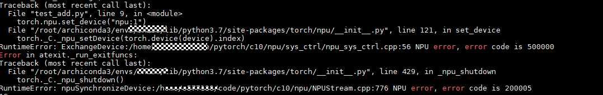

##### Possible Causes

Currently, only one NPU device can be called in a thread. When different NPU devices are switched, the preceding error occurs.

##### Solution

In the code, when  **torch.npu.set_device(device)**,  **tensor.to(device)**, or  **model.to(device)**  is called in the same thread, the device names are inconsistent. For multiple threads (such as multi-device training), each thread can call only a fixed NPU device.

<h4 id="what-do-i-do-if-the-error-message-error-in-atexit-_run_exitfuncs-is-displayed-during-model-or-operatmd">What Do I Do If the Error Message "Error in atexit.\_run\_exitfuncs:" Is Displayed During Model or Operator Running?</h4>

##### Symptom


##### Possible Causes

If no NPU device is specified by  **torch.npu.device\(id\)**  during torch initialization, device 0 is used by default. If another NPU device is directly used, for example, a tensor is created on device 1, the preceding error occurs during running.

##### Solution

Before calling an NPU device, specify the NPU device by using  **torch.npu.set_device(device)**.

<h4 id="what-do-i-do-if-the-error-message-terminate-called-after-throwing-an-instance-of-c10-error-what()-hemd">What Do I Do If the Error Message "terminate called after throwing an instance of 'c10::Error' what(): HelpACLExecute:" Is Displayed During Model Running?</h4>

##### Symptom


##### Possible Causes

Currently, the HelpACLExecute error cannot be directly located. In this case, an error is reported when the task is delivered. This is because the multi-thread delivery of the task is enabled (**export TASK_QUEUE_ENABLE=1**), and the error information is encapsulated at the upper layer. As a result, more detailed error logs cannot be obtained.

##### Solution

You can resolve this exception by using either of the following methods:

-   Check the host error log information. The default log path is  **/var/log/npu/slog/host-0/**. Search for the log file whose name is prefixed with  **host-0**  based on the time identifier, open the log file, and search for error information using keyword  **ERROR**.
-   Disable multi-thread delivery (**export TASK_QUEUE_ENABLE=0**) and run the code again. Generally, you can locate the fault based on the error information reported by the terminal.

<h4 id="what-do-i-do-if-the-error-message-terminate-called-after-throwing-an-instance-of-c10-error-what()-0md">What Do I Do If the Error Message "terminate called after throwing an instance of 'c10::Error' what(): 0 INTERNAL ASSERT" Is Displayed During Model Running?</h4>

##### Symptom

```
import torch

npu = "npu"

def test_cpu():
    input = torch.randn(2000, 1000).detach().requires_grad_()
    output = torch.sum(input)
    output.backward(torch.ones_like(output))

def test_npu():
    input = torch.randn(2000, 1000).detach().requires_grad_().npu()
    output = torch.sum(input)
    output.backward(torch.ones_like(output))

if __name__ == "__main__":
    test_cpu()
    torch.npu.set_device(f"{npu}:1")
    test_npu()
```

The following error message is displayed after code execution.

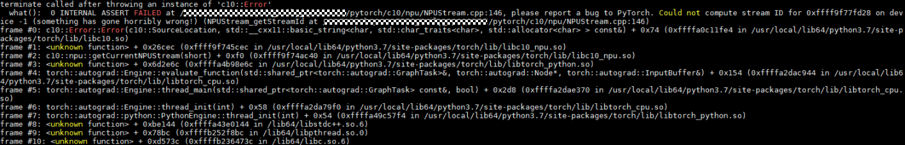

##### Possible Causes

After the backward operation is performed, the  **set\_decice\(\)**  method is used to manually set the device. As a result, an error is reported. During the backward operation, if the device is not set, the program automatically initializes the device to  **0**  by default. That is,  **set\_device\("npu:0"\)**  is executed. Currently, the device cannot be switched for calculation. If the device is manually set by using the  **set\_decice\(\)**  method, this error may occur.

##### Solution

Before performing the backward operation, use the  **set\_decice\(\)**  method to manually set the device. The modification is as follows:

```
if __name__ == "__main__":
    torch.npu.set_device(f"{npu}:1")
    test_cpu()
    test_npu()
```

<h4 id="what-do-i-do-if-the-error-message-importerror-libhccl-so-is-displayed-during-model-runningmd">What Do I Do If the Error Message "ImportError: libhccl.so." Is Displayed During Model Running?</h4>

##### Symptom


##### Possible Causes

Currently, the released PyTorch installation package uses the NPU and HCCL functions by default. Therefore, you need to add the path of the HCCL module to the environment variables when calling the PyTorch installation package. The error message "can not find libhccl.so" indicates that the cause is that the HCCL library file is missing.

##### Solution

Add the path of the HCCL module to the environment variables. Generally, the path of the HCCL library file is  **.../fwkacllib/python/site-packages/hccl**  in the installation package.

<h4 id="what-do-i-do-if-the-error-message-runtimeerror-initialize-is-displayed-during-model-runningmd">What Do I Do If the Error Message "RuntimeError: Initialize." Is Displayed During Model Running?</h4>

##### Symptom

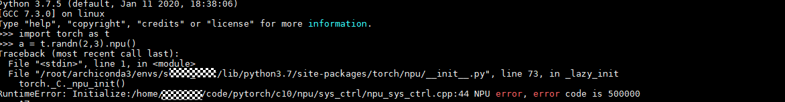

##### Possible Causes

According to the error information, it is preliminarily determined that an error occurs during the initialization of the NPU device. The error information in the host log is as follows:

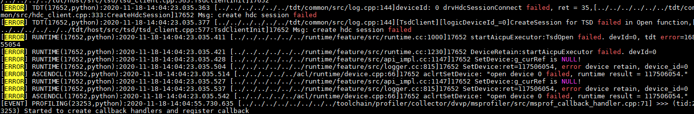

The log information indicates that an error is reported when the system starts the NPU device.

##### Solution

To solve the problem, perform the following steps:

1.  Restart the server and all NPU devices.

    If the problem is resolved, no further action is required.

    If the problem persists, go to  [2](#li77121667913).

2.  Check whether the driver version matches the firmware version.

    If no, go to  [3](#li967615545918).

    If yes, go to  [4](#li475615212912).

3.  Ensure that the driver version matches the firmware version.

    If the problem is resolved, no further action is required.

    If the problem persists, go to Step 4.

4.  Contact Huawei technical support personnel.

<h4 id="what-do-i-do-if-the-error-message-tvm-te-cce-error-is-displayed-during-model-runningmd">What Do I Do If the Error Message "TVM/te/cce error." Is Displayed During Model Running?</h4>

##### Symptom

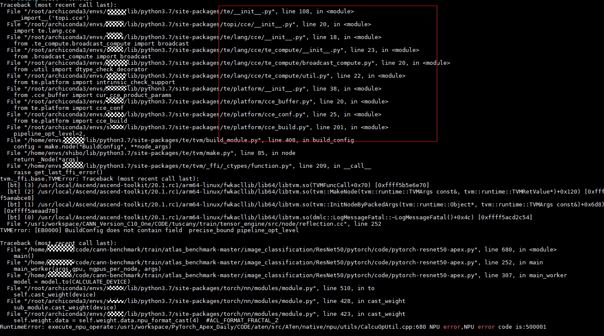

##### Possible Causes

Calling an NPU operator in PyTorch strongly depends on the TE, CCE, and TVM components. The PyTorch, CANN/NNAE, and TE versions must be the same. After CANN/NNAE is updated, components such as TE are not automatically updated. When their versions do not match, this error is reported.

##### Solution

Update the versions of components such as TE. The  **te-*.whl**  and  **topi-*.whl**  installation packages need to be updated. In the  **lib64**  subdirectory of the CANN or NNAE installation directory (the installation user is the  **root**  user and the default installation directory is  **/usr/local/Ascend/ascend-toolkit/latest/lib64**), update the installation packages: The  **topi-0.4.0-py3-none-any.whl**  and  **te-0.4.0-py3-none-any.whl**  installation packages exist in the directory. Run the  **pip3 install --upgrade topi-0.4.0-py3-none-any.whl**  and  **pip install --upgrade te-0.4.0-py3-none-any.whl**  commands, respectively.

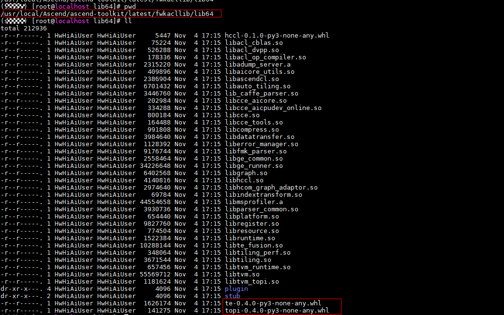

<h4 id="what-do-i-do-if-the-error-message-memcopysync-drvmemcpy-failed-is-displayed-during-model-runningmd">What Do I Do If the Error Message "MemCopySync:drvMemcpy failed." Is Displayed During Model Running?</h4>

##### Symptom

Scripts:

```
    import torch

    def test_sum():
        xs_shape = [22400, 8]
        ys_shape = [22400, 8]
        gt_bboxes_shape = [22400, 8,4]
        xs = torch.rand(xs_shape).npu()
        ys = torch.rand(ys_shape).npu()
        gt_bboxes = torch.rand(gt_bboxes_shape).npu().half()
        left = xs - gt_bboxes[..., 0]
        right = gt_bboxes[..., 2] - xs
        top = ys - gt_bboxes[..., 1]
        bottom = gt_bboxes[..., 3] - ys
        # stream = torch.npu.current_stream()
        # stream.synchronize()
        # left, top: fp32,  right, bottom: fp16,
        # print(left.dtype, top.dtype, right.dtype, bottom.dtype)
        bbox_targets = torch.stack((left, top, right, bottom), -1)  # Error reported here
        # stream.synchronize()

        bbox_targets = torch.sum(bbox_targets)
```

Shell error message:

```
    RuntimeError: Run:/usr1/workspace/PyTorch_Apex_Daily_c20tr5/CODE/aten/src/ATen/native/npu/utils/OpParamMaker.h:280 NPU error,NPU error code is:500002
    [ERROR] RUNTIME(160809)kernel task happen error, retCode=0x28, [aicpu timeout].
    [ERROR] RUNTIME(160809)aicpu kernel execute failed, device_id=0, stream_id=512, task_id=24, fault so_name=, fault kernel_name=, extend_info=.
    Error in atexit._run_exitfuncs:
    Traceback (most recent call last):
    File "/usr/local/python3.7.5/lib/python3.7/site-packages/torch/__init__.py", line 429, in _npu_shutdown
        torch._C._npu_shutdown()
    RuntimeError: npuSynchronizeDevice:/usr1/workspace/PyTorch_Apex_Daily_c20tr5/CODE/c10/npu/NPUStream.cpp:806 NPU error, error code is 0
```

Log message:

```
    [ERROR] RUNTIME(12731,python3.7):2021-02-02-22:23:56.475.679 [../../../../../../runtime/feature/src/npu_driver.cc:1408]12828 MemCopySync:drvMemcpy failed: dst=0x108040288000, destMax=1240, src=0x7fe7649556d0, size=1240, kind=1, drvRetCode=17!
    [ERROR] RUNTIME(12731,python3.7):2021-02-02-22:23:56.475.698 [../../../../../../runtime/feature/src/logger.cc:113]12828 KernelLaunch:launch kernel failed, kernel=140631803535760/ArgMinWithValue_tvmbin, dim=32, stream=0x55b22b3def50
    [ERROR] RUNTIME(12731,python3.7):2021-02-02-22:23:56.475.717 [../../../../../../runtime/feature/src/api_c.cc:224]12828 rtKernelLaunch:ErrCode=207001, desc=[module new memory error], InnerCode=0x70a0002
```

##### Possible Causes

The shell error message does not match the log message.

The shell error message indicates that the error occurs on the AI CPU during synchronization. However, the log message indicates that the error occurs on the min operator \(internal call of ArgMinWithValue\_tvmbin\). The two error messages do not match. Generally, this problem occurs because the error information generation in the log is delayed.

The possible cause is that the AI CPU operator is executed asynchronously. As a result, the error information is delayed.

##### Solution

Perform the following steps to locate the fault based on the actual error information:

1.  Disable multi-task operator delivery. It is found that the result remains unchanged. It is inferred that the error occurs before the error in the shell error message and the error in the log message occur.
2.  Perform stream synchronization based on the error information to narrow down the error range and locate the error operator. Stream synchronization requires that all calculations before the position where the code runs must be complete to locate the error.
3.  It is determined that the error operator is stack.
4.  Print the shape, dtype, and npu\_format of all stack parameters. Construct a single-operator case to reproduce the problem. The cause is that the data types of the input parameters for subtraction are different. As a result, the data types of the a-b and b-a results are different, and an error is reported in the stack operator.
5.  Convert the data types of the stack input parameters to the same one to temporarily avoid the problem.

<h4 id="what-do-i-do-if-the-error-message-memcopysync-drvmemcpy-failed-is-displayed-during-model-running-6md">What Do I Do If the Error Message "MemCopySync:drvMemcpy failed." Is Displayed During Model Running?</h4>

##### Symptom

Script:

```
    import torch

    def test_sum():
        xs_shape = [22400, 8]
        ys_shape = [22400, 8]
        gt_bboxes_shape = [22400, 8,4]
        xs = torch.rand(xs_shape).npu()
        ys = torch.rand(ys_shape).npu()
        gt_bboxes = torch.rand(gt_bboxes_shape).npu().half()
        left = xs - gt_bboxes[..., 0]
        right = gt_bboxes[..., 2] - xs
        top = ys - gt_bboxes[..., 1]
        bottom = gt_bboxes[..., 3] - ys
        # stream = torch.npu.current_stream()
        # stream.synchronize()
        # left, top: fp32,  right, bottom: fp16,
        # print(left.dtype, top.dtype, right.dtype, bottom.dtype)
        bbox_targets = torch.stack((left, top, right, bottom), -1)  # Error reported here
        # stream.synchronize()

        bbox_targets = torch.sum(bbox_targets)
```

Shell error message:

```
    RuntimeError: Run:/usr1/workspace/PyTorch_Apex_Daily_c20tr5/CODE/aten/src/ATen/native/npu/utils/OpParamMaker.h:280 NPU error,NPU error code is:500002
    [ERROR] RUNTIME(160809)kernel task happen error, retCode=0x28, [aicpu timeout].
    [ERROR] RUNTIME(160809)aicpu kernel execute failed, device_id=0, stream_id=512, task_id=24, fault so_name=, fault kernel_name=, extend_info=.
    Error in atexit._run_exitfuncs:
    Traceback (most recent call last):
    File "/usr/local/python3.7.5/lib/python3.7/site-packages/torch/__init__.py", line 429, in _npu_shutdown
        torch._C._npu_shutdown()
    RuntimeError: npuSynchronizeDevice:/usr1/workspace/PyTorch_Apex_Daily_c20tr5/CODE/c10/npu/NPUStream.cpp:806 NPU error, error code is 0
```

Log message:

```
    [ERROR] RUNTIME(12731,python3.7):2021-02-02-22:23:56.475.679 [../../../../../../runtime/feature/src/npu_driver.cc:1408]12828 MemCopySync:drvMemcpy failed: dst=0x108040288000, destMax=1240, src=0x7fe7649556d0, size=1240, kind=1, drvRetCode=17!
    [ERROR] RUNTIME(12731,python3.7):2021-02-02-22:23:56.475.698 [../../../../../../runtime/feature/src/logger.cc:113]12828 KernelLaunch:launch kernel failed, kernel=140631803535760/ArgMinWithValue_tvmbin, dim=32, stream=0x55b22b3def50
    [ERROR] RUNTIME(12731,python3.7):2021-02-02-22:23:56.475.717 [../../../../../../runtime/feature/src/api_c.cc:224]12828 rtKernelLaunch:ErrCode=207001, desc=[module new memory error], InnerCode=0x70a0002
```

##### Possible Causes

The shell error message does not match the log message.

The shell error message indicates that the error occurs on the AI CPU during synchronization. However, the log message indicates that the error occurs on the min operator \(internal call of ArgMinWithValue\_tvmbin\). The two error messages do not match. Generally, this problem occurs because the error information generation in the log is delayed.

The possible cause is that the AI CPU operator is executed asynchronously. As a result, the error information is delayed.

##### Solution

Perform the following steps to locate the fault based on the actual error information:

1.  Disable multi-task operator delivery. It is found that the result remains unchanged. It is inferred that the error occurs before the error in the shell error message and the error in the log message occur.
2.  Perform stream synchronization based on the error information to narrow down the error range and locate the error operator. Stream synchronization requires that all calculations before the position where the code runs must be complete to locate the error.
3.  It is determined that the error operator is stack.
4.  Print the shape, dtype, and npu\_format of all stack parameters. Construct a single-operator case to reproduce the problem. The cause is that the data types of the input parameters for subtraction are different. As a result, the data types of the a-b and b-a results are different, and an error is reported in the stack operator.
5.  Convert the data types of the stack input parameters to the same one to temporarily avoid the problem.

<h4 id="what-do-i-do-if-the-error-message-helpaclexecute-is-displayed-after-multi-task-delivery-is-disabledmd">What Do I Do If the Error Message "HelpACLExecute." Is Displayed After Multi-Task Delivery Is Disabled (export TASK\_QUEUE\_ENABLE=0) During Model Running?</h4>

##### Symptom


##### Possible Causes

The PyTorch operator runs on the NPU and calls the optimized operators at the bottom layer through the AcendCL API. When the error message "HelpACLExecute." is reported at the upper layer, the error information and logs are being optimized. As a result, when errors occur in some operators, the error information fails to be obtained.

##### Solution

View the host log to determine the operator and location where the error is reported. The default log path is  **/var/log/npu/slog/host-0**. Search for the  **ERROR**  field in the log file of the corresponding time to find the error information. For the preceding error, the  **ERROR**  field in the log is as follows:


The error information in the log indicates that the error operator is topKD and the error cause is "The number of attrs in op desc and op store does not match." Therefore, it is determined that the error cause is that the parameters of the topKD operator do not match.

Locate the topKD operator in the model code and check whether the operator can be replaced by another operator. If the operator can be replaced by another operator, use the replacement solution and report the operator error information to Huawei engineers. If the operator cannot be replaced by another operator, contact Huawei technical support.

<h4 id="what-do-i-do-if-the-error-message-55056-getinputconstdataout-errorno--1(failed)-is-displayed-duringmd">What Do I Do If the Error Message "55056 GetInputConstDataOut: ErrorNo: -1(failed)" Is Displayed During Model Running?</h4>

##### Symptom

During model training, the following error information may be displayed in the host training log \(directory:  **/root/ascend/log/plog/**\):

.png)

##### Possible Causes

A public API is called.

##### Solution

The error information does not affect the training function and performance and can be ignored.

###FAQs About Model Commissioning

-   **[What Do I Do If the Error Message "RuntimeError: malloc:/..../pytorch/c10/npu/NPUCachingAllocator.cpp:293 NPU error, error code is 500000." Is Displayed During Model Commissioning?](#what-do-i-do-if-the-error-message-runtimeerror-malloc-pytorch-c10-npu-npucachingallocator-cpp-293-npmd)**  

-   **[What Do I Do If the Error Message "RuntimeError: Could not run 'aten::trunc.out' with arguments from the 'NPUTensorId' backend." Is Displayed During Model Commissioning](#what-do-i-do-if-the-error-message-runtimeerror-could-not-run-aten-trunc-out-with-arguments-from-themd)**  

-   **[What Do I Do If the MaxPoolGradWithArgmaxV1 and max Operators Report Errors During Model Commissioning?](#what-do-i-do-if-the-maxpoolgradwithargmaxv1-and-max-operators-report-errors-during-model-commissionimd)**  

-   **[What Do I Do If the Error Message "ModuleNotFoundError: No module named 'torch.\_C'" Is Displayed When torch Is Called?](#what-do-i-do-if-the-error-message-modulenotfounderror-no-module-named-torch-_c-is-displayed-when-tormd)**  


<h4 id="what-do-i-do-if-the-error-message-runtimeerror-malloc-pytorch-c10-npu-npucachingallocator-cpp-293-npmd">What Do I Do If the Error Message "RuntimeError: malloc:/..../pytorch/c10/npu/NPUCachingAllocator.cpp:293 NPU error, error code is 500000." Is Displayed During Model Commissioning?</h4>

##### Symptom

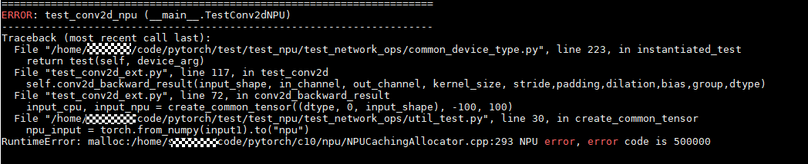

##### Possible Causes

For the malloc error in  **NPUCachingAllocator**, the possible cause is that the required video memory is larger than the available video memory on the NPU.

##### Solution

During model commissioning, you can decrease the value of the  **batch size**  parameter to reduce the size of the occupied video memory on the NPU.

<h4 id="what-do-i-do-if-the-error-message-runtimeerror-could-not-run-aten-trunc-out-with-arguments-from-themd">What Do I Do If the Error Message "RuntimeError: Could not run 'aten::trunc.out' with arguments from the 'NPUTensorId' backend." Is Displayed During Model Commissioning</h4>

##### Symptom


##### Possible Causes

Currently, the NPU supports only some PyTorch operators. The preceding error is reported when operators that are not supported are used. The operators are being developed. For details about the supported operators, see  [PyTorch Native Operators](https://support.huaweicloud.com/intl/en-us/opl-pytorch/atlasptol_09_0001.html).

##### Solution

During model commissioning, you can decrease the value of the  **batch size**  parameter to reduce the size of the occupied video memory on the NPU.

<h4 id="what-do-i-do-if-the-maxpoolgradwithargmaxv1-and-max-operators-report-errors-during-model-commissionimd">What Do I Do If the MaxPoolGradWithArgmaxV1 and max Operators Report Errors During Model Commissioning?</h4>

##### Symptom

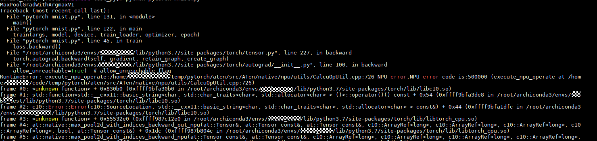

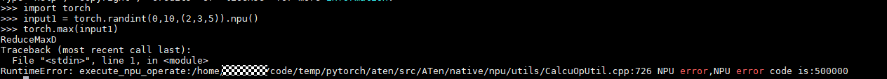

##### Possible Causes

During model building, the operator input parameters are diversified. For some operators (such as MaxPoolGradWithArgmaxV1 and max) with specific parameters, an error is reported during calculation or the operators are not supported. You can locate the operators based on the error information.

##### Solution

Locate the operators based on the error information and perform the following steps:

1.  Check whether the call mode and parameters of the operators in the model are correct.
2.  Build a single-operator case based on the error operators to construct the error scenario.
3.  Generally, operator errors cannot be resolved on Python, and error scenarios need to be constructed. Post the error scenario in the forum and ask for help from Huawei engineers.

    > **NOTE:** 
    >Pay special attention to the input parameters  **shape**  and  **dtype**, which are the main causes of operator errors.


In the preceding figure, the error information indicates that the MaxPoolGradWithArgmaxV1 and max operators report the error. MaxPoolGradWithArgmaxV1 reports the error during backward propagation. Therefore, construct a reverse scenario. The max operator reports the error during forward propagation. Therefore, construct a forward scenario.

If an operator error is reported in the model, you are advised to build a single-operator test case and determine the error scenario and cause. If a single-operator case cannot be built in a single operator, you need to construct a context-based single-operator scenario. For details about how to build a test case, see  [Single-Operator Sample Building](#single-operator-sample-building).

<h4 id="what-do-i-do-if-the-error-message-modulenotfounderror-no-module-named-torch-_c-is-displayed-when-tormd">What Do I Do If the Error Message "ModuleNotFoundError: No module named 'torch.\_C'" Is Displayed When torch Is Called?</h4>

##### Symptom

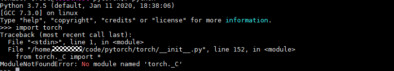

##### Possible Causes

In the preceding figure, the error path is  **.../code/pytorch/torch/\_\_init\_\_.py**. However, the current operating path is  **.../code/pytorch**. When the  **import torch**  command is executed, the  **torch**  folder is searched in the current directory by default. As a result, an error is reported. The torch package installed in the system directory instead of the torch package in the current directory is called.

##### Solution

Switch to another directory to run the script.

###FAQs About Other Operations

-   **[What Do I Do If an Error Is Reported During CUDA Stream Synchronization?](#what-do-i-do-if-an-error-is-reported-during-cuda-stream-synchronizationmd)**  

-   **[What Do I Do If aicpu\_kernels/libpt\_kernels.so Does Not Exist?](#what-do-i-do-if-aicpu_kernels-libpt_kernels-so-does-not-existmd)**  

-   **[What Do I Do If the Python Process Is Residual When the npu-smi info Command Is Used to View Video Memory?](#what-do-i-do-if-the-python-process-is-residual-when-the-npu-smi-info-command-is-used-to-view-video-mmd)**  

-   **[What Do I Do If the Error Message "match op inputs failed"Is Displayed When the Dynamic Shape Is Used?](#what-do-i-do-if-the-error-message-match-op-inputs-failed-is-displayed-when-the-dynamic-shape-is-usedmd)**  

-   **[What Do I Do If the Error Message "Op type SigmoidCrossEntropyWithLogitsV2 of ops kernel AIcoreEngine is unsupported" Is Displayed?](#what-do-i-do-if-the-error-message-op-type-sigmoidcrossentropywithlogitsv2-of-ops-kernel-aicoreenginemd)**  

-   **[What Do I Do If a Hook Failure Occurs?](#what-do-i-do-if-a-hook-failure-occursmd)**  

-   **[What Do I Do If the Error Message "load state\_dict error." Is Displayed When the Weight Is Loaded?](#what-do-i-do-if-the-error-message-load-state_dict-error-is-displayed-when-the-weight-is-loadedmd)**  


<h4 id="what-do-i-do-if-an-error-is-reported-during-cuda-stream-synchronizationmd">What Do I Do If an Error Is Reported During CUDA Stream Synchronization?</h4>

##### Symptom

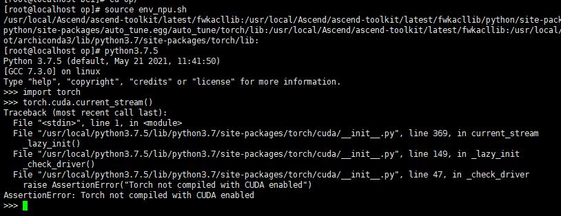

##### Possible Causes

The NPU does not use NPU stream synchronization.

##### Solution

Use NPU stream synchronization.

```
stream = torch.npu.current_stream()
stream.synchronize()
```

<h4 id="what-do-i-do-if-aicpu_kernels-libpt_kernels-so-does-not-existmd">What Do I Do If aicpu\_kernels/libpt\_kernels.so Does Not Exist?</h4>

##### Symptom

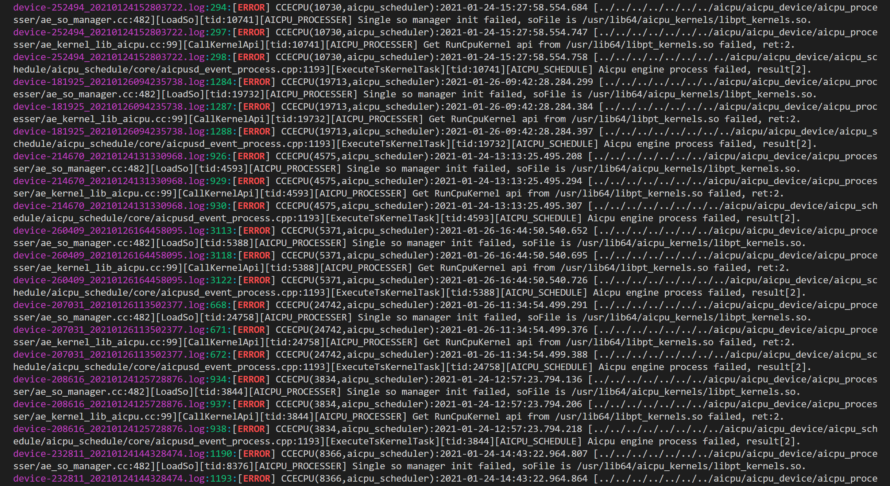

##### Possible Causes

The AI CPU is not imported.

##### Solution

Import the AI CPU. \(The following describes how to install the CANN software package as the  **root**  user in the default installation path.\)

```
export ASCEND_AICPU_PATH=/usr/local/Ascend/ascend-toolkit/latest
```

<h4 id="what-do-i-do-if-the-python-process-is-residual-when-the-npu-smi-info-command-is-used-to-view-video-mmd">What Do I Do If the Python Process Is Residual When the npu-smi info Command Is Used to View Video Memory?</h4>

##### Symptom


##### Possible Causes

The Python process needs to be killed.

##### Solution

Kill the Python process.

```
pkill -9 python
```

<h4 id="what-do-i-do-if-the-error-message-match-op-inputs-failed-is-displayed-when-the-dynamic-shape-is-usedmd">What Do I Do If the Error Message "match op inputs failed"Is Displayed When the Dynamic Shape Is Used?</h4>

##### Symptom

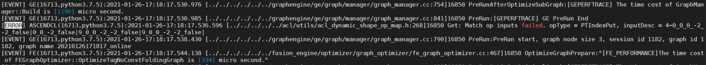

##### Possible Causes

The operator compiled by  **PTIndexPut**  does not match the input shape, and the log starting with  **acl\_dynamic\_shape\_op**  is displayed. It is determined that an error is reported for the dynamic shape.

##### Solution

**PTIndexPut**  corresponds to  **tensor\[indices\] = value**. Locate the field in the code and change the dynamic shape to a fixed shape.

<h4 id="what-do-i-do-if-the-error-message-op-type-sigmoidcrossentropywithlogitsv2-of-ops-kernel-aicoreenginemd">What Do I Do If the Error Message "Op type SigmoidCrossEntropyWithLogitsV2 of ops kernel AIcoreEngine is unsupported" Is Displayed?</h4>

##### Symptom

```
[ERROR] GE(24836,python3.7):2021-01-27-18:27:51.562.111 [../../../../../../graphengine/ge/engine_manager/dnnengine_manager.cc:266]25155 GetDNNEngineName: ErrorNo: 1343242282(assign engine failed) GetDNNEngineName:Op type SigmoidCrossEntropyWithLogitsV2 of ops kernel AIcoreEngine is unsupported, reason:Op SigmoidCrossEntropyWithLogitsV2 not supported reason: The type of this op is not found in op store, check whether the op store has this type of op. Op store name is tbe-custom.
The dtype, format or shape of input in op desc is not supported in op store, check the dtype, format or shape of input between the op store and the graph. Op store name is tbe-builtin.
```

##### Possible Causes

The input data type is not supported by the SigmoidCrossEntropyWithLogitsV2 operator. The possible cause is that the input data type is int64.

##### Solution

Check the input data type in the Python code and modify the data type.

<h4 id="what-do-i-do-if-a-hook-failure-occursmd">What Do I Do If a Hook Failure Occurs?</h4>

##### Symptom

```
Traceback (most recent call last):
  File "tools/train.py", line 227, in <module>
    main()
  File "tools/train.py", line 221, in main
    meta=meta)
  File "/root/YoloV3/mmdetection/mmdet/apis/train.py", line 192, in train_detector
    runner.run(data_loaders, cfg.workflow, cfg.total_epochs)
  File "/usr/local/python3.7.5/lib/python3.7/site-packages/mmcv/runner/epoch_based_runner.py", line 166, in run
    epoch_runner(data_loaders[i], **kwargs)
  File "/usr/local/python3.7.5/lib/python3.7/site-packages/mmcv/runner/epoch_based_runner.py", line 50, in train
    self.run_iter(data_batch, train_mode=True)
  File "/usr/local/python3.7.5/lib/python3.7/site-packages/mmcv/runner/epoch_based_runner.py", line 30, in run_iter
    outputs = self.model.train_step(data_batch, self.optimizer, **kwargs)
  File "/usr/local/python3.7.5/lib/python3.7/site-packages/mmcv/parallel/data_parallel.py", line 100, in train_step
    return self.module.train_step(*inputs[0], **kwargs[0])
  File "/root/YoloV3/mmdetection/mmdet/models/detectors/base.py", line 251, in train_step
    losses = self(**data)
  File "/usr/local/python3.7.5/lib/python3.7/site-packages/torch/nn/modules/module.py", line 660, in __call__
    var = next((v for v in var.values() if isinstance(v, torch.Tensor)))
StopIteration
```

##### Possible Causes

The loss structure of the mmdet triggers the bug of the native hook of PyTorch, leading to an infinite loop.

##### Solution

Add  **try**  to line 658 to skip in the  **/usr/local/python3.7.5/lib/python3.7/site-packages/torch/nn/modules/module.py**  file:

```
if len(self._backward_hooks) > 0:
    var = result
    try:
        while not isinstance(var, torch.Tensor):
            if isinstance(var, dict):
                var = next((v for v in var.values() if isinstance(v, torch.Tensor)))
            else:
                var = var[0]
        grad_fn = var.grad_fn
        if grad_fn is not None:
            for hook in self._backward_hooks.values():
                wrapper = functools.partial(hook, self)
                functools.update_wrapper(wrapper, hook)
                grad_fn.register_hook(wrapper)
    except Exception as e:
        print('hook failed..')
        print(str(e))
return result
```

<h4 id="what-do-i-do-if-the-error-message-load-state_dict-error-is-displayed-when-the-weight-is-loadedmd">What Do I Do If the Error Message "load state\_dict error." Is Displayed When the Weight Is Loaded?</h4>

##### Symptom


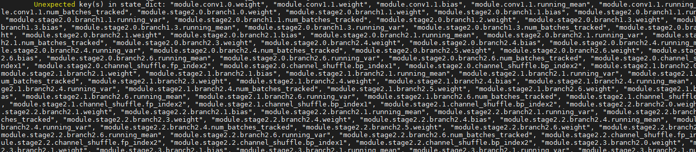

##### Possible Causes

The key value of  **state\_dict**  saved after model training is different from the key value of  **state\_dict**  when the model is loaded. When the model is saved, a  **module**  prefix is added to the beginning of each key.

##### Solution

When loading the weight, traverse the  **state\_dict**  dictionary, modify the key value, and use the new dictionary. For details about the test case, see  **demo.py**.

The script is as follows:

```
   ckpt = torch.load("checkpoint.pth", map_location=loc)
   # model.load_state_dict(ckpt['state_dict'])
   state_dict_old = ckpt['state_dict']
   state_dict = {}
   for key, value in state_dict_old.items():
       key = key[7:]
       state_dict[key] = value
   model.load_state_dict(state_dict)
```

###FAQs About Distributed Model Training

-   **[What Do I Do If the Error Message "host not found." Is Displayed During Distributed Model Training?](#what-do-i-do-if-the-error-message-host-not-found-is-displayed-during-distributed-model-trainingmd)**  

-   **[What Do I Do If the Error Message "RuntimeError: connect\(\) timed out." Is Displayed During Distributed Model Training?](#what-do-i-do-if-the-error-message-runtimeerror-connect-timed-out-is-displayed-during-distributed-mmd)**  


<h4 id="what-do-i-do-if-the-error-message-host-not-found-is-displayed-during-distributed-model-trainingmd">What Do I Do If the Error Message "host not found." Is Displayed During Distributed Model Training?</h4>

##### Symptom

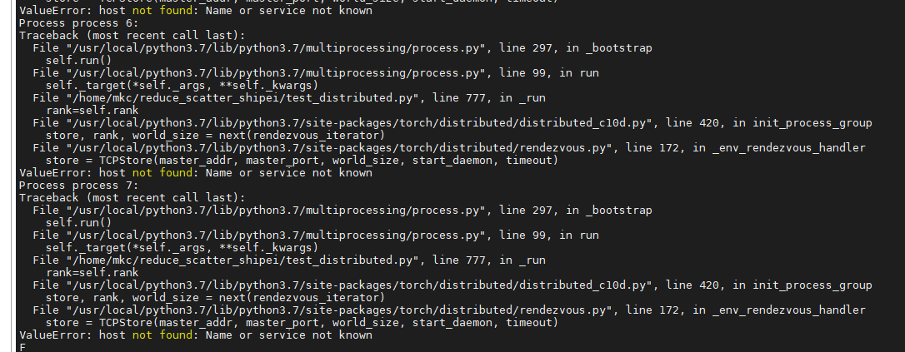

##### Possible Causes

During distributed model training, the Huawei Collective Communication Library \(HCCL\) is invoked. You need to set the IP address and port number based on the site requirements. The error information indicates that the IP address is incorrect.

##### Solution

Set the correct IP address in the running script. If a single server is deployed, set the IP address to the IP address of the server. If multiple servers are deployed, set the IP address in the script on each server to the IP address of the active node.

<h4 id="what-do-i-do-if-the-error-message-runtimeerror-connect()-timed-out-is-displayed-during-distributed-mmd">What Do I Do If the Error Message "RuntimeError: connect\(\) timed out." Is Displayed During Distributed Model Training?</h4>

##### Symptom

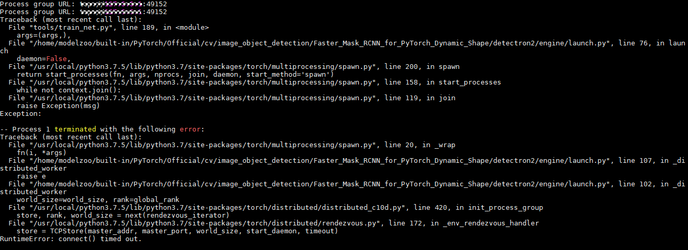

##### Possible Causes

During distributed model training, the system firewall may block the communication of the HCCL port. Check whether the communication port is enabled based on the error information and perform related settings.

##### Solution

Query the HCCL port that is blocked by the system firewall and enable the port.

