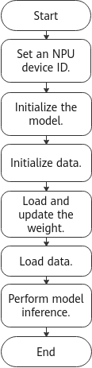

# PyTorch Online Inference Guide
-   [Application Scenario](#application-scenariomd)
-   [Basic Workflow](#basic-workflowmd)
    -   [Prerequisites](#prerequisitesmd)
    -   [Online Inference Process](#online-inference-processmd)
    -   [Environment Variable Configuration](#environment-variable-configurationmd)
    -   [Sample Reference](#sample-referencemd)
-   [Special Topics](#special-topicsmd)
    -   [Mixed Precision](#mixed-precisionmd)
-   [How Do I Install GCC 7.3.0?](#how-do-i-install-gcc-7-3-0md)
<h2 id="application-scenariomd">Application Scenario</h2>

Online inference, unlike offline inference, allows developers to perform inference directly with PyTorch models using the  **model.eval\(\)**  method.

In this way, PyTorch-based inference apps can be directly ported to the  Ascend AI Processor, which is especially useful in the data center inference scenarios.

### Supported Processors<a name="section15598658104219"></a>

Ascend 910 AI Processor

Ascend 710 AI Processor

<h2 id="basic-workflowmd">Basic Workflow</h2>

-   **[Prerequisites](#prerequisitesmd)**  

-   **[Online Inference Process](#online-inference-processmd)**  

-   **[Environment Variable Configuration](#environment-variable-configurationmd)**  

-   **[Sample Reference](#sample-referencemd)**  


<h3 id="prerequisitesmd">Prerequisites</h3>

The PyTorch framework and mixed precision module have been installed. For details, see the  _PyTorch Installation Guide_.

<h3 id="online-inference-processmd">Online Inference Process</h3>

[Figure 1](#fig13802941161818)  shows the online inference process.

**Figure  1**  Online inference process<a name="fig13802941161818"></a>  


<h3 id="environment-variable-configurationmd">Environment Variable Configuration</h3>

The following are the environment variables required for starting the inference process on PyTorch:

```
# Set the environment variable for the installation path of the infrastructure software on which online inference depends. The following assumes that the installation user is HwHiAiUser, and the default installation path is used.
# Method 1: Install Ascend-CANN-Toolkit for inference on an Ascend AI device, which serves as the development environment.
. /home/HwHiAiUser/Ascend/ascend-toolkit/set_env.sh 
# Method 2: Install Ascend-CANN-NNAE on an Ascend AI device.
. /home/HwHiAiUser/Ascend/nnae/set_env.sh 

# If multiple Python 3 versions exist in the operating environment, configure the installation path of Python 3.7.5 in environment variables.
export PATH=/usr/local/python3.7.5/bin:$PATH
export LD_LIBRARY_PATH=/usr/local/python3.7.5/lib:$LD_LIBRARY_PATH

# Set the logical ID of a processor.
export ASCEND_DEVICE_ID=0

# Output log information. Replace it as required.
export ASCEND_SLOG_PRINT_TO_STDOUT=1
export ASCEND_GLOBAL_LOG_LEVEL=0

# Task issued with multiple threads
export TASK_QUEUE_ENABLE=0
```

**Table  1**  Description of environment variables

<a name="table2072027194819"></a>
<table><thead align="left"><tr id="row1173527114812"><th class="cellrowborder" valign="top" width="46.75467546754676%" id="mcps1.2.4.1.1"><p id="p073027114816"><a name="p073027114816"></a><a name="p073027114816"></a>Environment Variable</p>
</th>
<th class="cellrowborder" valign="top" width="43.18431843184319%" id="mcps1.2.4.1.2"><p id="p157362712480"><a name="p157362712480"></a><a name="p157362712480"></a>Description</p>
</th>
<th class="cellrowborder" valign="top" width="10.061006100610062%" id="mcps1.2.4.1.3"><p id="p187392714485"><a name="p187392714485"></a><a name="p187392714485"></a>Required/Optional</p>
</th>
</tr>
</thead>
<tbody><tr id="row2732273481"><td class="cellrowborder" valign="top" width="46.75467546754676%" headers="mcps1.2.4.1.1 "><p id="p57382719481"><a name="p57382719481"></a><a name="p57382719481"></a>LD_LIBRARY_PATH</p>
</td>
<td class="cellrowborder" valign="top" width="43.18431843184319%" headers="mcps1.2.4.1.2 "><p id="p07319271480"><a name="p07319271480"></a><a name="p07319271480"></a>Dynamic library search path. Set this variable based on the preceding example.</p>
<div class="note" id="note119943144912"><a name="note119943144912"></a><a name="note119943144912"></a><span class="notetitle"> NOTE: </span><div class="notebody"><p id="p49933104915"><a name="p49933104915"></a><a name="p49933104915"></a>If GCC 7.3.0 is installed in OSs such as CentOS 7.6, Debian, and BC-Linux, configure the related environment variables. For details, see <a href="#how-do-i-install-gcc-7-3-0md#en-us_topic_0000001146754749_en-us_topic_0000001072593337_l5e5c9395407d46439788b12f0e6342bc">5</a>.</p>
</div></div>
</td>
<td class="cellrowborder" valign="top" width="10.061006100610062%" headers="mcps1.2.4.1.3 "><p id="p187352744817"><a name="p187352744817"></a><a name="p187352744817"></a>Required</p>
</td>
</tr>
<tr id="row17342744812"><td class="cellrowborder" valign="top" width="46.75467546754676%" headers="mcps1.2.4.1.1 "><p id="p4731227184818"><a name="p4731227184818"></a><a name="p4731227184818"></a>PATH</p>
</td>
<td class="cellrowborder" valign="top" width="43.18431843184319%" headers="mcps1.2.4.1.2 "><p id="p97310276484"><a name="p97310276484"></a><a name="p97310276484"></a>Executable program search path. Set this variable based on the preceding example.</p>
</td>
<td class="cellrowborder" valign="top" width="10.061006100610062%" headers="mcps1.2.4.1.3 "><p id="p1573142711483"><a name="p1573142711483"></a><a name="p1573142711483"></a>Required</p>
</td>
</tr>
<tr id="row95241840165613"><td class="cellrowborder" valign="top" width="46.75467546754676%" headers="mcps1.2.4.1.1 "><p id="p15242404566"><a name="p15242404566"></a><a name="p15242404566"></a>ASCEND_DEVICE_ID</p>
</td>
<td class="cellrowborder" valign="top" width="43.18431843184319%" headers="mcps1.2.4.1.2 "><p id="p688447526"><a name="p688447526"></a><a name="p688447526"></a>Sets the logical ID of a processor.</p>
<p id="p178824712212"><a name="p178824712212"></a><a name="p178824712212"></a>The value range is [0, <em id="i18812110304"><a name="i18812110304"></a><a name="i18812110304"></a>N</em> – 1] and the default value is<strong id="b1381717104019"><a name="b1381717104019"></a><a name="b1381717104019"></a> 0</strong>. <em id="i1156411211703"><a name="i1156411211703"></a><a name="i1156411211703"></a>N</em> indicates the device count in the physical machine, VM, or container.</p>
</td>
<td class="cellrowborder" valign="top" width="10.061006100610062%" headers="mcps1.2.4.1.3 "><p id="p105245400562"><a name="p105245400562"></a><a name="p105245400562"></a>Optional</p>
</td>
</tr>
<tr id="row203705529819"><td class="cellrowborder" valign="top" width="46.75467546754676%" headers="mcps1.2.4.1.1 "><p id="p53705522810"><a name="p53705522810"></a><a name="p53705522810"></a>ASCEND_SLOG_PRINT_TO_STDOUT</p>
</td>
<td class="cellrowborder" valign="top" width="43.18431843184319%" headers="mcps1.2.4.1.2 "><p id="en-us_topic_0000001073203258_p763102116322"><a name="en-us_topic_0000001073203258_p763102116322"></a><a name="en-us_topic_0000001073203258_p763102116322"></a>Enables or disables log printing. Values:</p>
<a name="en-us_topic_0000001073203258_ul95291245104113"></a><a name="en-us_topic_0000001073203258_ul95291245104113"></a><ul id="en-us_topic_0000001073203258_ul95291245104113"><li><strong id="b1877191971104041"><a name="b1877191971104041"></a><a name="b1877191971104041"></a>0</strong> or not configured: disabled</li><li><strong id="b737654378104041"><a name="b737654378104041"></a><a name="b737654378104041"></a>1</strong>: enabled</li></ul>
</td>
<td class="cellrowborder" valign="top" width="10.061006100610062%" headers="mcps1.2.4.1.3 "><p id="p6370125217818"><a name="p6370125217818"></a><a name="p6370125217818"></a>Optional</p>
</td>
</tr>
<tr id="row188405280914"><td class="cellrowborder" valign="top" width="46.75467546754676%" headers="mcps1.2.4.1.1 "><p id="p5840928594"><a name="p5840928594"></a><a name="p5840928594"></a>ASCEND_GLOBAL_LOG_LEVEL</p>
</td>
<td class="cellrowborder" valign="top" width="43.18431843184319%" headers="mcps1.2.4.1.2 "><p id="en-us_topic_0000001073521184_p763102116322"><a name="en-us_topic_0000001073521184_p763102116322"></a><a name="en-us_topic_0000001073521184_p763102116322"></a>Sets the global log level. Values:</p>
<a name="en-us_topic_0000001073521184_u4d735da6e0494e55abbf5eb6aefe988d"></a><a name="en-us_topic_0000001073521184_u4d735da6e0494e55abbf5eb6aefe988d"></a><ul id="en-us_topic_0000001073521184_u4d735da6e0494e55abbf5eb6aefe988d"><li><strong id="b1731786453104041"><a name="b1731786453104041"></a><a name="b1731786453104041"></a>0</strong>: DEBUG</li><li><strong id="b758139838104041"><a name="b758139838104041"></a><a name="b758139838104041"></a>1</strong>: INFO</li><li><strong id="b539270545104041"><a name="b539270545104041"></a><a name="b539270545104041"></a>2</strong>: WARNING</li><li><strong id="b444623067104041"><a name="b444623067104041"></a><a name="b444623067104041"></a>3</strong>: ERROR</li><li><strong id="b1157662181104041"><a name="b1157662181104041"></a><a name="b1157662181104041"></a>4</strong>: NULL (no log output)</li><li>Other values: invalid</li></ul>
</td>
<td class="cellrowborder" valign="top" width="10.061006100610062%" headers="mcps1.2.4.1.3 "><p id="p6841928598"><a name="p6841928598"></a><a name="p6841928598"></a>Optional</p>
</td>
</tr>
<tr id="row17638114219104"><td class="cellrowborder" valign="top" width="46.75467546754676%" headers="mcps1.2.4.1.1 "><p id="p20638342191018"><a name="p20638342191018"></a><a name="p20638342191018"></a>TASK_QUEUE_ENABLE</p>
</td>
<td class="cellrowborder" valign="top" width="43.18431843184319%" headers="mcps1.2.4.1.2 "><p id="p126381842151019"><a name="p126381842151019"></a><a name="p126381842151019"></a>Enables or disables the task delivery in multi-thread mode. When this function is enabled, the training performance of the entire network is improved in most cases. Values:</p>
<a name="ul6194152711118"></a><a name="ul6194152711118"></a><ul id="ul6194152711118"><li><strong id="b166811333191713"><a name="b166811333191713"></a><a name="b166811333191713"></a>0</strong> or not configured: disabled</li><li><strong id="b3865153321914"><a name="b3865153321914"></a><a name="b3865153321914"></a>1</strong>: enabled</li></ul>
</td>
<td class="cellrowborder" valign="top" width="10.061006100610062%" headers="mcps1.2.4.1.3 "><p id="p86386423103"><a name="p86386423103"></a><a name="p86386423103"></a>Optional</p>
</td>
</tr>
</tbody>
</table>

> **NOTE:** 
>For more log information, see the  _CANN Log Reference_.

<h3 id="sample-referencemd">Sample Reference</h3>

#### Sample Code<a name="section2017032418274"></a>

Try to minimize the initialization frequency across the app lifetime during inference. The inference mode is set using the  **model.eval\(\)**  method, and the inference process must run under the code branch  **with torch.no\_grad\(\):**.

The following uses Python code of the ResNet-50 network as an example for description.

**resnet50\_infer\_for\_pytorch.py**  sample code:

```
import argparse
import os
import time
import torch
import torch_npu
import torch.nn.parallel
import torch.optim
import torch.utils.data
import torch.utils.data.distributed
import torchvision.transforms as transforms
import torchvision.datasets as datasets
import torchvision.models as models


from apex import amp

model_names = sorted(name for name in models.__dict__
                     if name.islower() and not name.startswith("__")
                     and callable(models.__dict__[name]))


def parse_args():
    """ User-defined dataset path and model path """
    parser = argparse.ArgumentParser(description='PyTorch ImageNet Training')
    parser.add_argument('--data', metavar='DIR', default="/data/imagenet",
                        help='path to dataset')
    parser.add_argument('-a', '--arch', metavar='ARCH', default='resnet50',
                        choices=model_names,
                        help='model architecture: ' +
                             ' | '.join(model_names) +
                             ' (default: resnet18)')

    parser.add_argument('--epochs', default=100, type=int, metavar='N',
                        help='number of total epochs to run')

    parser.add_argument('-b', '--batch_size', default=512, type=int,
                        metavar='N',
                        help='mini-batch size (default: 256), this is the total '
                             'batch size of all GPUs on the current node when '
                             'using Data Parallel or Distributed Data Parallel')

    parser.add_argument('--resume', default='', type=str, metavar='PATH',
                        help='path to latest checkpoint (default: none)')

    parser.add_argument('--pretrained', dest='pretrained', action='store_true',
                        help='use pre-trained model')

    parser.add_argument('--npu', default=None, type=int,
                        help='NPU id to use.')

    parser.add_argument('-j', '--workers', default=32, type=int, metavar='N',
                        help='number of data loading workers (default: 8)')

    parser.add_argument('--lr', '--learning_rate', default=0.1, type=float,
                        metavar='LR', help='initial learning rate', dest='lr')
    parser.add_argument('--wd', '--weight_decay', default=1e-4, type=float,
                        metavar='W', help='weight decay (default: 1e-4)',
                        dest='weight_decay')

    args, unknown_args = parser.parse_known_args()
    if len(unknown_args) > 0:
        for bad_arg in unknown_args:
            print("ERROR: Unknown command line arg: %s" % bad_arg)
        raise ValueError("Invalid command line arg(s)")

    return args


# =========================================================================
# Main function entry
# =========================================================================
def main():
    args = parse_args()
    if args.npu is None:
        args.npu = 0
    global CALCULATE_DEVICE
    CALCULATE_DEVICE = "npu:{}".format(args.npu)
    torch_npu.npu.set_device(CALCULATE_DEVICE)
    print("use ", CALCULATE_DEVICE)
    main_worker(args.npu, args)


def main_worker(npu, args):
    global best_acc1
    args.npu = npu

    # =========================================================================
    # Create a model.
    # =========================================================================
    print("=> creating model '{}'".format(args.arch))
    model = models.__dict__[args.arch](zero_init_residual=True)

    # Copy the model data to the Ascend AI Processor.
    model = model.to(CALCULATE_DEVICE)

    optimizer = torch.optim.SGD([
        {'params': [param for name, param in model.named_parameters() if name[-4:] == 'bias'], 'weight_decay': 0.0},
        {'params': [param for name, param in model.named_parameters() if name[-4:] != 'bias'],
         'weight_decay': args.weight_decay}],
        args.lr)

    # =========================================================================
    # Initialize the mixed precision model. After the model is used, the calculation can be accelerated, but the accuracy may slightly decrease. Determine whether to use the model based on the actual scenario.
    # =========================================================================
    model, optimizer = amp.initialize(model, optimizer, opt_level="O2", loss_scale=1024, verbosity=1)

    # =========================================================================
    # Load the trained model parameters.
    # =========================================================================
    # Restore model parameters from the model file.
    if os.path.isfile(args.resume):
        print("=> loading checkpoint '{}'".format(args.resume))
        checkpoint = torch.load(args.resume)

        best_acc1 = checkpoint['best_acc1']
        best_acc1 = best_acc1.to("npu:{}".format(args.npu))

        model.load_state_dict(checkpoint['state_dict'])
        print("=> loaded checkpoint '{}' (epoch {})".format(args.resume, checkpoint['epoch']))

    else:
        print("=> no checkpoint found at '{}'".format(args.resume))

    # =========================================================================
    # Initialize the database.
    # =========================================================================
    # Load and preprocess image data.
    valdir = os.path.join(args.data, 'val')
    normalize = transforms.Normalize(mean=[0.485, 0.456, 0.406],
                                     std=[0.229, 0.224, 0.225])

    val_loader = torch.utils.data.DataLoader(
        datasets.ImageFolder(valdir, transforms.Compose([
            transforms.Resize(256),
            transforms.CenterCrop(224),
            transforms.ToTensor(),
            normalize,
        ])),
        batch_size=args.batch_size, shuffle=True,
        num_workers=args.workers, pin_memory=True)

    # =========================================================================
    # Run the validate command.
    # =========================================================================
    validate(val_loader, model, args)


# =========================================================================
# Implement the sample API for online inference.
# =========================================================================
def validate(val_loader, model, args):
    batch_time = AverageMeter('Time', ':6.3f')
    top1 = AverageMeter('Acc@1', ':6.2f')
    top5 = AverageMeter('Acc@5', ':6.2f')
    progress = ProgressMeter(
        len(val_loader),
        [batch_time, top1, top5],
        prefix='Test: ')

    # =========================================================================
# Switch to the inference mode.
    # =========================================================================
    model.eval()

    # =========================================================================
# Execute the model forward propagation under the torch.no_grad(): branch.
    # =========================================================================
    with torch.no_grad():
        end = time.time()
        for i, (images, target) in enumerate(val_loader):

            # Place the image data on the NPU.
            images = images.to(CALCULATE_DEVICE, non_blocking=True)
            target = target.to(torch.int32).to(CALCULATE_DEVICE, non_blocking=True)

            # Calculate the output.
            output = model(images)

            # Collect statistics on result precisions.
            acc1, acc5 = accuracy(output, target, topk=(1, 5))
            top1.update(acc1[0], images.size(0))
            top5.update(acc5[0], images.size(0))

            # Measure the running time.
            batch_time.update(time.time() - end)
            end = time.time()

            # Print inference logs.
            progress.display(i)

        print(' * Acc@1 {top1.avg:.3f} Acc@5 {top5.avg:.3f}'.format(top1=top1, top5=top5))

    return top1.avg


class AverageMeter(object):
    """Calculate and store the average value and current value."""
    def __init__(self, name, fmt=':f'):
        self.name = name
        self.fmt = fmt
        self.reset()
        self.start_count_index = 10

    def reset(self):
        self.val = 0
        self.avg = 0
        self.sum = 0
        self.count = 0

    def update(self, val, n=1):
        if self.count == 0:
            self.batchsize = n

        self.val = val
        self.count += n
        if self.count > (self.start_count_index * self.batchsize):
            self.sum += val * n
            self.avg = self.sum / (self.count - self.start_count_index * self.batchsize)

    def __str__(self):
        fmtstr = '{name} {val' + self.fmt + '} ({avg' + self.fmt + '})'
        return fmtstr.format(**self.__dict__)


class ProgressMeter(object):
    """Record model computing information."""
    def __init__(self, num_batches, meters, prefix=""):
        self.batch_fmtstr = self._get_batch_fmtstr(num_batches)
        self.meters = meters
        self.prefix = prefix

    def display(self, batch):
        entries = [self.prefix + self.batch_fmtstr.format(batch)]
        entries += [str(meter) for meter in self.meters]
        print('\t'.join(entries))

    def _get_batch_fmtstr(self, num_batches):
        num_digits = len(str(num_batches // 1))
        fmt = '{:' + str(num_digits) + 'd}'
        return '[' + fmt + '/' + fmt.format(num_batches) + ']'


def accuracy(output, target, topk=(1,)):
    """Calculate the precision of k top predictions based on the specified value k."""
    with torch.no_grad():
        maxk = max(topk)
        batch_size = target.size(0)

        _, pred = output.topk(maxk, 1, True, True)
        pred = pred.t()
        correct = pred.eq(target.view(1, -1).expand_as(pred))

        res = []
        for k in topk:
            correct_k = correct[:k].view(-1).float().sum(0, keepdim=True)
            res.append(correct_k.mul_(100.0 / batch_size))
        return res


if __name__ == '__main__':
    main()
```

#### Sample Running<a name="section340764716270"></a>

The following uses the ResNet-50 model as an example to describe how to perform online inference.

1.  Download a pre-trained model.

    Visit  [Ascend ModelZoo](https://www.hiascend.com/en/software/modelzoo)  and click  **Download Model**  to download a pre-trained ResNet-50 model.

2.  Edit the inference script.

    Create a model script file  **resnet50\_infer\_for\_pytorch.py**  and write code. For how to write the code, see [Sample Code]().

3.  Run inference.

    Set environment variables (for how to set them, see [Environment Variable Configuration](https://gitee.com/ascend/ModelZoo-PyTorch/blob/master/PyTorch/built-in/cv/classification/ResNet50_for_PyTorch/env_npu.sh)) and then run the following command:

    ```
    python3 resnet50_infer_for_pytorch.py \
        --data /data/imagenet \
        --npu 7 \
        --epochs 90 \
        --resume ./checkpoint.pth.tar    # ./checkpoint.pth.tar is the path of the sample pre-trained model file.
    ```

    > **NOTE:** 
    >The preceding command is an example only. Modify the arguments as needed.


<h2 id="special-topicsmd">Special Topics</h2>

-   **[Mixed Precision](#mixed-precisionmd)**  


<h3 id="mixed-precisionmd">Mixed Precision</h3>

#### Overview<a name="section14734122962615"></a>

Based on the architecture features of the NPU, mixed precision is involved in the model computing, that is, the scenario where the float16 and float32 data types are used together. Replacing float32 with float16 has the following advantages:

-   The memory usage of intermediate variables is reduced.
-   The data transfer time decreases because the memory usage is reduced.
-   The compute units of float16 provide better computing performance.

However, the mixed precision training is limited by the precision range expressed by float16. If float32 is converted into float16, the training convergence is affected. To use float16 for acceleration in some computations and ensure training convergence, the mixed precision module Apex is used. The mixed precision module Apex is a comprehensive optimization library that features high optimization performance and precision.

#### Supported Features<a name="section175201458521"></a>

[Table 1](#en-us_topic_0278765773_table10717173813332)  describes the functions and optimization of the mixed precision module.

**Table  1**  Functions of the mixed precision module

<a name="en-us_topic_0278765773_table10717173813332"></a>
<table><thead align="left"><tr id="en-us_topic_0278765773_row371716385333"><th class="cellrowborder" valign="top" width="32.269999999999996%" id="mcps1.2.3.1.1"><p id="en-us_topic_0278765773_p13717163815333"><a name="en-us_topic_0278765773_p13717163815333"></a><a name="en-us_topic_0278765773_p13717163815333"></a>Function</p>
</th>
<th class="cellrowborder" valign="top" width="67.73%" id="mcps1.2.3.1.2"><p id="en-us_topic_0278765773_p14400173910345"><a name="en-us_topic_0278765773_p14400173910345"></a><a name="en-us_topic_0278765773_p14400173910345"></a>Description</p>
</th>
</tr>
</thead>
<tbody><tr id="en-us_topic_0278765773_row1571763813334"><td class="cellrowborder" valign="top" width="32.269999999999996%" headers="mcps1.2.3.1.1 "><p id="en-us_topic_0278765773_p4502732153412"><a name="en-us_topic_0278765773_p4502732153412"></a><a name="en-us_topic_0278765773_p4502732153412"></a>O1 configuration</p>
</td>
<td class="cellrowborder" valign="top" width="67.73%" headers="mcps1.2.3.1.2 "><p id="en-us_topic_0278765773_p640053920348"><a name="en-us_topic_0278765773_p640053920348"></a><a name="en-us_topic_0278765773_p640053920348"></a>Conv and Matmul use float16 for computing, and Softmax and BN use float32.</p>
</td>
</tr>
<tr id="en-us_topic_0278765773_row3717173817336"><td class="cellrowborder" valign="top" width="32.269999999999996%" headers="mcps1.2.3.1.1 "><p id="en-us_topic_0278765773_p11503103210344"><a name="en-us_topic_0278765773_p11503103210344"></a><a name="en-us_topic_0278765773_p11503103210344"></a>O2 configuration</p>
</td>
<td class="cellrowborder" valign="top" width="67.73%" headers="mcps1.2.3.1.2 "><p id="en-us_topic_0278765773_p164001639143419"><a name="en-us_topic_0278765773_p164001639143419"></a><a name="en-us_topic_0278765773_p164001639143419"></a>BN uses float32, and others use float16.</p>
</td>
</tr>
<tr id="en-us_topic_0278765773_row14717193815334"><td class="cellrowborder" valign="top" width="32.269999999999996%" headers="mcps1.2.3.1.1 "><p id="en-us_topic_0278765773_p1950318328349"><a name="en-us_topic_0278765773_p1950318328349"></a><a name="en-us_topic_0278765773_p1950318328349"></a>Static loss scale</p>
</td>
<td class="cellrowborder" valign="top" width="67.73%" headers="mcps1.2.3.1.2 "><p id="en-us_topic_0278765773_p1440033983418"><a name="en-us_topic_0278765773_p1440033983418"></a><a name="en-us_topic_0278765773_p1440033983418"></a>Parameters are statically set to ensure the convergence of mixed precision training.</p>
</td>
</tr>
<tr id="en-us_topic_0278765773_row871733813317"><td class="cellrowborder" valign="top" width="32.269999999999996%" headers="mcps1.2.3.1.1 "><p id="en-us_topic_0278765773_p1550303243417"><a name="en-us_topic_0278765773_p1550303243417"></a><a name="en-us_topic_0278765773_p1550303243417"></a>Dynamic loss scale</p>
</td>
<td class="cellrowborder" valign="top" width="67.73%" headers="mcps1.2.3.1.2 "><p id="en-us_topic_0278765773_p15400143963412"><a name="en-us_topic_0278765773_p15400143963412"></a><a name="en-us_topic_0278765773_p15400143963412"></a>The loss scale value is dynamically calculated to determine whether overflow occurs.</p>
</td>
</tr>
</tbody>
</table>

> **NOTE:** 
>In the current version, Apex is implemented using Python and does not support AscendCL or CUDA optimization.

#### Initializing the Mixed Precision Model<a name="section18178125518268"></a>

1.  To use the mixed precision module Apex, import the amp module from the Apex library.

    ```
    from apex import amp
    ```

2.  Initialize the amp module so that it can modify the model, optimizer, and PyTorch internal functions.

    ```
    model, optimizer = amp.initialize(model, optimizer)
    ```

    For details, see "Initialize the mixed precision model."# in  [Sample Code](#sample-referencemd).

    ```
    model, optimizer = amp.initialize(model, optimizer, opt_level="O2", loss_scale=1024, verbosity=1)
    ```


#### Mixed Precision Inference<a name="section818071513288"></a>

After the mixed precision model is initialized, perform model forward propagation.

Sample code: For details, see the implementation of  **validate\(val\_loader, model, args\)**  in  [Sample Code](#sample-referencemd).

<h2 id="how-do-i-install-gcc-7-3-0md">How Do I Install GCC 7.3.0?</h2>

Perform the following steps as the  **root**  user.

1.  Download  **gcc-7.3.0.tar.gz**  from  [https://mirrors.tuna.tsinghua.edu.cn/gnu/gcc/gcc-7.3.0/gcc-7.3.0.tar.gz](https://mirrors.tuna.tsinghua.edu.cn/gnu/gcc/gcc-7.3.0/gcc-7.3.0.tar.gz).
2.  To install GCC, you need to reserve adequate temporary space. Run the following command to clear the  **/tmp**  directory before the installation:

    ```
    sudo rm -rf /tmp/*
    ```

3.  Install the dependency package. \(CentOS and Ubuntu are used as examples.\)
    -   For CentOS, run the following command:

        ```
        yum install bzip2    
        ```

    -   For Ubuntu, run the following command:

        ```
        apt-get install bzip2    
        ```

4.  Build and install GCC.
    1.  Go to the directory where the source package  **gcc-7.3.0.tar.gz**  is located and run the following command to extract it:

        ```
        tar -zxvf gcc-7.3.0.tar.gz
        ```

    2.  Go to the extracted directory and run the following command to download the GCC dependency packages:

        ```
        cd gcc-7.3.0
        ./contrib/download_prerequisites
        ```

        If an error is reported during the command execution, run the following commands in the  **gcc-7.3.0/**  directory to download the dependency packages:

        ```
        wget http://gcc.gnu.org/pub/gcc/infrastructure/gmp-6.1.0.tar.bz2
        wget http://gcc.gnu.org/pub/gcc/infrastructure/mpfr-3.1.4.tar.bz2
        wget http://gcc.gnu.org/pub/gcc/infrastructure/mpc-1.0.3.tar.gz
        wget http://gcc.gnu.org/pub/gcc/infrastructure/isl-0.16.1.tar.bz2
        ```

        After downloading the preceding dependency packages, run the following command:

        ```
        ./contrib/download_prerequisites
        ```

        If the verification fails, check whether the dependency package is repeatedly downloaded. The package should be downloaded at a time.

    3.  <a name="en-us_topic_0000001146754749_en-us_topic_0000001072593337_l75d31a2874534a2092e80a5f865b46f0"></a>Run the following commands for configuration, build, and installation.

        ```
        ./configure --enable-languages=c,c++ --disable-multilib --with-system-zlib --prefix=/usr/local/linux_gcc7.3.0
        make -j15    # The value 15 indicates the number of CPUs, which is configurable and can be queried by running grep -w processor /proc/cpuinfo|wc -l.
        make install    
        ```

        > **NOTICE:** 
        >The  **--prefix**  parameter is used to specify the linux\_gcc7.3.0 installation path, which is configurable. Do not set it to  **/usr/local**  or  **/usr**, which is the default installation path for the GCC installed by using the software source. Otherwise, a conflict occurs and the original GCC compilation environment of the system is damaged. In this example, the installation path is set to  **/usr/local/linux\_gcc7.3.0**.


5.  Set the environment variable.

    Training must be performed in the compilation environment with GCC upgraded. Therefore, configure the following environment variable in the training script:

    ```
    export LD_LIBRARY_PATH=${install_path}/lib64:${LD_LIBRARY_PATH}
    ```

    **$\{install\_path\}**  indicates the GCC 7.3.0 installation path configured in  [3.](#en-us_topic_0000001146754749_en-us_topic_0000001072593337_l75d31a2874534a2092e80a5f865b46f0). In this example, the GCC 7.3.0 installation path is  **/usr/local/linux\_gcc7.3.0/**.

    > **NOTE:** 
    >Skip this step if you do not the compilation environment with GCC upgraded.

