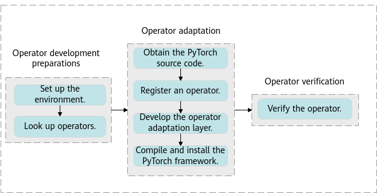
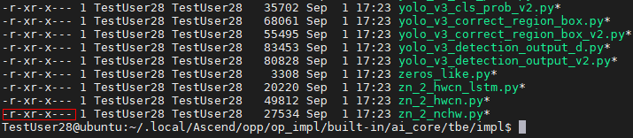
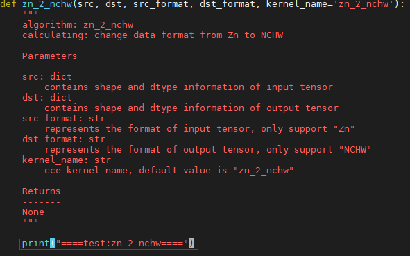
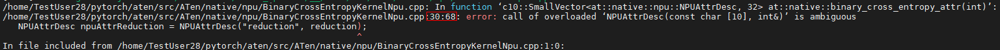
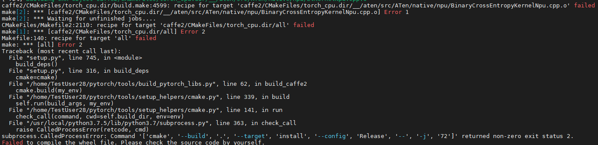

# PyTorch Operator Development Guide
-   [Introduction](#introductionmd)
-   [Operator Development Process](#operator-development-processmd)
-   [Operator Development Preparations](#operator-development-preparationsmd)
    -   [Setting Up the Environment](#setting-up-the-environmentmd)
    -   [Looking Up Operators](#looking-up-operatorsmd)
-   [Operator Adaptation](#operator-adaptationmd)
    -   [Prerequisites](#prerequisitesmd)
    -   [Obtaining the PyTorch Source Code](#obtaining-the-pytorch-source-codemd)
    -   [Registering an Operator](#registering-an-operatormd)
        -   [Overview](#overviewmd)
        -   [Registering an Operator for PyTorch 1.5.0](#registering-an-operator-for-pytorch-1-5-0md)
        -   [Registering an Operator for PyTorch 1.8.1](#registering-an-operator-for-pytorch-1-8-1md)
    -   [Developing an Operator Adaptation Plugin](#developing-an-operator-adaptation-pluginmd)
    -   [Compiling and Installing the PyTorch Framework](#compiling-and-installing-the-pytorch-frameworkmd)
-   [Operator Function Verification](#operator-function-verificationmd)
    -   [Overview](#overview-0md)
    -   [Implementation](#implementationmd)
-   [FAQs](#faqsmd)
    -   [Pillow==5.3.0 Installation Failed](#pillow-5-3-0-installation-failedmd)
    -   [pip3.7 install torchvision Installation Failed](#pip3-7-install-torchvision-installation-failedmd)
    -   ["torch 1.5.0xxxx" and "torchvision" Do Not Match When torch-\*.whl Is Installed](#torch-1-5-0xxxx-and-torchvision-do-not-match-when-torch--whl-is-installedmd)
    -   [How Do I View Test Run Logs?](#how-do-i-view-test-run-logsmd)
    -   [Why Cannot the Custom TBE Operator Be Called?](#why-cannot-the-custom-tbe-operator-be-calledmd)
    -   [How Do I Determine Whether the TBE Operator Is Correctly Called for PyTorch Adaptation?](#how-do-i-determine-whether-the-tbe-operator-is-correctly-called-for-pytorch-adaptationmd)
    -   [PyTorch Compilation Fails and the Message "error: ld returned 1 exit status" Is Displayed](#pytorch-compilation-fails-and-the-message-error-ld-returned-1-exit-status-is-displayedmd)
    -   [PyTorch Compilation Fails and the Message "error: call of overload...." Is Displayed](#pytorch-compilation-fails-and-the-message-error-call-of-overload-is-displayedmd)
-   [Appendixes](#appendixesmd)
    -   [Installing CMake](#installing-cmakemd)
    -   [Exporting a Custom Operator](#exporting-a-custom-operatormd)
<h2 id="introductionmd">Introduction</h2>

### Overview<a name="en-us_topic_0000001125558589_section7405182695312"></a>

To enable the PyTorch deep learning framework to run on Ascend AI Processors, you need to use Tensor Boost Engine \(TBE\) to customize the framework operators.

<h2 id="operator-development-processmd">Operator Development Process</h2>

PyTorch operator development includes TBE operator development and operator adaptation to the PyTorch framework.

1.  TBE operator development: If an operator on your network is incompatible with the  Ascend AI Software Stack, you need to develop a TBE operator and then adapt it to the PyTorch framework.

    For details about the TBE operator development process and methods, see the  _CANN TBE Custom Operator Development Guide_.

2.  Operator adaptation to the PyTorch framework: If a TBE operator has been developed and is compatible with the  Ascend AI Software Stack, you can directly adapt it to the PyTorch framework.

    The following figure shows the operator adaptation process in the PyTorch framework.

    **Figure  1**  Operator adaptation process in the PyTorch framework<a name="en-us_topic_0000001105032530_fig1981905141719"></a>  
    


**Table  1**  Description of the operator development process

<a name="en-us_topic_0000001105032530_en-us_topic_0228422310_table131083578318"></a>
<table><thead align="left"><tr id="en-us_topic_0000001105032530_en-us_topic_0228422310_row210905703113"><th class="cellrowborder" valign="top" width="6.811326262527976%" id="mcps1.2.5.1.1"><p id="en-us_topic_0000001105032530_en-us_topic_0228422310_p41091857143113"><a name="en-us_topic_0000001105032530_en-us_topic_0228422310_p41091857143113"></a><a name="en-us_topic_0000001105032530_en-us_topic_0228422310_p41091857143113"></a>No.</p>
</th>
<th class="cellrowborder" valign="top" width="17.865135740001946%" id="mcps1.2.5.1.2"><p id="en-us_topic_0000001105032530_en-us_topic_0228422310_p1710955713112"><a name="en-us_topic_0000001105032530_en-us_topic_0228422310_p1710955713112"></a><a name="en-us_topic_0000001105032530_en-us_topic_0228422310_p1710955713112"></a>Procedure</p>
</th>
<th class="cellrowborder" valign="top" width="55.55123090396029%" id="mcps1.2.5.1.3"><p id="en-us_topic_0000001105032530_en-us_topic_0228422310_p26391719183320"><a name="en-us_topic_0000001105032530_en-us_topic_0228422310_p26391719183320"></a><a name="en-us_topic_0000001105032530_en-us_topic_0228422310_p26391719183320"></a>Description</p>
</th>
<th class="cellrowborder" valign="top" width="19.772307093509777%" id="mcps1.2.5.1.4"><p id="en-us_topic_0000001105032530_en-us_topic_0228422310_p13109155719317"><a name="en-us_topic_0000001105032530_en-us_topic_0228422310_p13109155719317"></a><a name="en-us_topic_0000001105032530_en-us_topic_0228422310_p13109155719317"></a>Reference</p>
</th>
</tr>
</thead>
<tbody><tr id="en-us_topic_0000001105032530_row1381016124918"><td class="cellrowborder" valign="top" width="6.811326262527976%" headers="mcps1.2.5.1.1 "><p id="en-us_topic_0000001105032530_p1181015128915"><a name="en-us_topic_0000001105032530_p1181015128915"></a><a name="en-us_topic_0000001105032530_p1181015128915"></a>1</p>
</td>
<td class="cellrowborder" valign="top" width="17.865135740001946%" headers="mcps1.2.5.1.2 "><p id="en-us_topic_0000001105032530_p1881012121799"><a name="en-us_topic_0000001105032530_p1881012121799"></a><a name="en-us_topic_0000001105032530_p1881012121799"></a>Set up the environment.</p>
</td>
<td class="cellrowborder" valign="top" width="55.55123090396029%" headers="mcps1.2.5.1.3 "><p id="en-us_topic_0000001105032530_p1381018121891"><a name="en-us_topic_0000001105032530_p1381018121891"></a><a name="en-us_topic_0000001105032530_p1381018121891"></a>Set up the development and operating environments required for operator development, execution, and verification.</p>
</td>
<td class="cellrowborder" rowspan="2" valign="top" width="19.772307093509777%" headers="mcps1.2.5.1.4 "><p id="en-us_topic_0000001105032530_p1498205181013"><a name="en-us_topic_0000001105032530_p1498205181013"></a><a name="en-us_topic_0000001105032530_p1498205181013"></a><a href="#operator-development-preparationsmd">Operator Development Preparations</a></p>
</td>
</tr>
<tr id="en-us_topic_0000001105032530_row194671091290"><td class="cellrowborder" valign="top" headers="mcps1.2.5.1.1 "><p id="en-us_topic_0000001105032530_p3467169594"><a name="en-us_topic_0000001105032530_p3467169594"></a><a name="en-us_topic_0000001105032530_p3467169594"></a>2</p>
</td>
<td class="cellrowborder" valign="top" headers="mcps1.2.5.1.2 "><p id="en-us_topic_0000001105032530_p1346749990"><a name="en-us_topic_0000001105032530_p1346749990"></a><a name="en-us_topic_0000001105032530_p1346749990"></a>Look up operators.</p>
</td>
<td class="cellrowborder" valign="top" headers="mcps1.2.5.1.3 "><p id="en-us_topic_0000001105032530_p1767111499129"><a name="en-us_topic_0000001105032530_p1767111499129"></a><a name="en-us_topic_0000001105032530_p1767111499129"></a>View the list of supported TBE operators and list of operators adapted to PyTorch.</p>
<a name="en-us_topic_0000001105032530_ul03431749101318"></a><a name="en-us_topic_0000001105032530_ul03431749101318"></a><ul id="en-us_topic_0000001105032530_ul03431749101318"><li>List of operators supported by <span id="en-us_topic_0000001105032530_ph1748571571010"><a name="en-us_topic_0000001105032530_ph1748571571010"></a><a name="en-us_topic_0000001105032530_ph1748571571010"></a>Ascend AI Processors</span> and detailed specifications and constraints of the supported operators</li><li>List of operators adapted to PyTorch</li></ul>
</td>
</tr>
<tr id="en-us_topic_0000001105032530_en-us_topic_0228422310_row411025743119"><td class="cellrowborder" valign="top" width="6.811326262527976%" headers="mcps1.2.5.1.1 "><p id="en-us_topic_0000001105032530_p156991054952"><a name="en-us_topic_0000001105032530_p156991054952"></a><a name="en-us_topic_0000001105032530_p156991054952"></a>3</p>
</td>
<td class="cellrowborder" valign="top" width="17.865135740001946%" headers="mcps1.2.5.1.2 "><p id="en-us_topic_0000001105032530_en-us_topic_0228422310_p3110657203110"><a name="en-us_topic_0000001105032530_en-us_topic_0228422310_p3110657203110"></a><a name="en-us_topic_0000001105032530_en-us_topic_0228422310_p3110657203110"></a>Obtain the PyTorch source code.</p>
</td>
<td class="cellrowborder" valign="top" width="55.55123090396029%" headers="mcps1.2.5.1.3 "><p id="en-us_topic_0000001105032530_en-us_topic_0228422310_p381282212"><a name="en-us_topic_0000001105032530_en-us_topic_0228422310_p381282212"></a><a name="en-us_topic_0000001105032530_en-us_topic_0228422310_p381282212"></a>Obtain the PyTorch source code from the Ascend Community.</p>
</td>
<td class="cellrowborder" rowspan="4" valign="top" width="19.772307093509777%" headers="mcps1.2.5.1.4 "><p id="en-us_topic_0000001105032530_p10679152717175"><a name="en-us_topic_0000001105032530_p10679152717175"></a><a name="en-us_topic_0000001105032530_p10679152717175"></a><a href="#operator-development-preparationsmd">Operator Adaptation</a></p>
</td>
</tr>
<tr id="en-us_topic_0000001105032530_row1184984391512"><td class="cellrowborder" valign="top" headers="mcps1.2.5.1.1 "><p id="en-us_topic_0000001105032530_p1054075616153"><a name="en-us_topic_0000001105032530_p1054075616153"></a><a name="en-us_topic_0000001105032530_p1054075616153"></a>4</p>
</td>
<td class="cellrowborder" valign="top" headers="mcps1.2.5.1.2 "><p id="en-us_topic_0000001105032530_p1463045415151"><a name="en-us_topic_0000001105032530_p1463045415151"></a><a name="en-us_topic_0000001105032530_p1463045415151"></a>Register an operator.</p>
</td>
<td class="cellrowborder" valign="top" headers="mcps1.2.5.1.3 "><p id="en-us_topic_0000001105032530_p1634748161614"><a name="en-us_topic_0000001105032530_p1634748161614"></a><a name="en-us_topic_0000001105032530_p1634748161614"></a>Distribute the operator to the Ascend AI Processor.</p>
</td>
</tr>
<tr id="en-us_topic_0000001105032530_en-us_topic_0228422310_row252634054913"><td class="cellrowborder" valign="top" headers="mcps1.2.5.1.1 "><p id="en-us_topic_0000001105032530_p55407561152"><a name="en-us_topic_0000001105032530_p55407561152"></a><a name="en-us_topic_0000001105032530_p55407561152"></a>5</p>
</td>
<td class="cellrowborder" valign="top" headers="mcps1.2.5.1.2 "><p id="en-us_topic_0000001105032530_p116302054131518"><a name="en-us_topic_0000001105032530_p116302054131518"></a><a name="en-us_topic_0000001105032530_p116302054131518"></a>Develop the operator adaptation layer.</p>
</td>
<td class="cellrowborder" valign="top" headers="mcps1.2.5.1.3 "><p id="en-us_topic_0000001105032530_p8583195119173"><a name="en-us_topic_0000001105032530_p8583195119173"></a><a name="en-us_topic_0000001105032530_p8583195119173"></a>Develop the operator adaptation layer to map the attributes of operators based on third-party frameworks to those of the operators adapted to Ascend AI Processors.</p>
</td>
</tr>
<tr id="en-us_topic_0000001105032530_en-us_topic_0228422310_row17721543154917"><td class="cellrowborder" valign="top" headers="mcps1.2.5.1.1 "><p id="en-us_topic_0000001105032530_p125402056121515"><a name="en-us_topic_0000001105032530_p125402056121515"></a><a name="en-us_topic_0000001105032530_p125402056121515"></a>6</p>
</td>
<td class="cellrowborder" valign="top" headers="mcps1.2.5.1.2 "><p id="en-us_topic_0000001105032530_p963085451515"><a name="en-us_topic_0000001105032530_p963085451515"></a><a name="en-us_topic_0000001105032530_p963085451515"></a>Compile and install the PyTorch framework.</p>
</td>
<td class="cellrowborder" valign="top" headers="mcps1.2.5.1.3 "><p id="en-us_topic_0000001105032530_p1463431151811"><a name="en-us_topic_0000001105032530_p1463431151811"></a><a name="en-us_topic_0000001105032530_p1463431151811"></a>Compile and adapt the developed PyTorch source code, and install the compiled source package.</p>
</td>
</tr>
<tr id="en-us_topic_0000001105032530_en-us_topic_0228422310_row162484372491"><td class="cellrowborder" valign="top" width="6.811326262527976%" headers="mcps1.2.5.1.1 "><p id="en-us_topic_0000001105032530_p454075611155"><a name="en-us_topic_0000001105032530_p454075611155"></a><a name="en-us_topic_0000001105032530_p454075611155"></a>7</p>
</td>
<td class="cellrowborder" valign="top" width="17.865135740001946%" headers="mcps1.2.5.1.2 "><p id="en-us_topic_0000001105032530_p11630135413155"><a name="en-us_topic_0000001105032530_p11630135413155"></a><a name="en-us_topic_0000001105032530_p11630135413155"></a>Verify the operator functions.</p>
</td>
<td class="cellrowborder" valign="top" width="55.55123090396029%" headers="mcps1.2.5.1.3 "><p id="en-us_topic_0000001105032530_en-us_topic_0228422310_p4952132615216"><a name="en-us_topic_0000001105032530_en-us_topic_0228422310_p4952132615216"></a><a name="en-us_topic_0000001105032530_en-us_topic_0228422310_p4952132615216"></a>Verify the operator functions in the real-world hardware environment.</p>
</td>
<td class="cellrowborder" valign="top" width="19.772307093509777%" headers="mcps1.2.5.1.4 "><p id="en-us_topic_0000001105032530_en-us_topic_0228422310_p20908934557"><a name="en-us_topic_0000001105032530_en-us_topic_0228422310_p20908934557"></a><a name="en-us_topic_0000001105032530_en-us_topic_0228422310_p20908934557"></a><a href="#operator-function-verificationmd">Operator Function Verification</a></p>
</td>
</tr>
</tbody>
</table>

<h2 id="operator-development-preparationsmd">Operator Development Preparations</h2>

-   **[Setting Up the Environment](#setting-up-the-environmentmd)**  

-   **[Looking Up Operators](#looking-up-operatorsmd)**  


<h3 id="setting-up-the-environmentmd">Setting Up the Environment</h3>

-   The development or operating environment of CANN has been installed. For details, see the  _CANN Software Installation Guide_.
-   Python 3.7.5 or 3.8 has been installed.
-   CMake 3.12.0 or later has been installed. For details, see  [Installing CMake](#installing-cmakemd).
-   GCC 7.3.0 or later has been installed. For details about how to install and use GCC 7.3.0, see "Installing GCC 7.3.0" in the  _CANN Software Installation Guide_.
-   The Git tool has been installed. To install Git for Ubuntu and CentOS, run the following commands:
    -   Ubuntu

        ```
        apt-get install patch
        apt-get install git
        ```

    -   CentOS

        ```
        yum install patch
        yum install git
        ```


<h3 id="looking-up-operatorsmd">Looking Up Operators</h3>

During operator development, you can query the list of operators supported by Ascend AI Processors and the list of operators adapted to PyTorch. Develop or adapt operators to PyTorch based on the query result.

-   If an operator is not supported by the Ascend AI Processor, develop a TBE operator and adapt the operator to the PyTorch framework.
-   If an operator is supported by the Ascend AI Processor but has not been adapted to the PyTorch framework, you only need to adapt the operator to the PyTorch framework.
-   If an operator has been adapted to the PyTorch framework, you can directly use the operator without development or adaptation.

The following describes how to query the operators supported by Ascend AI Processors as well as operators adapted to PyTorch.

-   You can query the operators supported by Ascend AI Processors and the corresponding operator constraints in either of the following modes:
    -   For operator development on the command line, you can perform offline query. For details, see the  _CANN Operator List \(Ascend 910\)_.
    -   For operator development using  MindStudio, you can perform online query on  MindStudio. For details, see "Supported Operators and Models" in the  _MindStudio User Guide_.

-   For the list of operators adapted to PyTorch, see the  _PyTorch Operator Support_.

<h2 id="operator-adaptationmd">Operator Adaptation</h2>

-   **[Prerequisites](#prerequisitesmd)**  

-   **[Obtaining the PyTorch Source Code](#obtaining-the-pytorch-source-codemd)**  

-   **[Registering an Operator](#registering-an-operatormd)**  

-   **[Developing an Operator Adaptation Plugin](#developing-an-operator-adaptation-pluginmd)**  

-   **[Compiling and Installing the PyTorch Framework](#compiling-and-installing-the-pytorch-frameworkmd)**  


<h3 id="prerequisitesmd">Prerequisites</h3>

-   The development and operating environments have been set up, and related dependencies have been installed. For details, see  [Setting Up the Environment](#setting-up-the-environmentmd).
-   TBE operators have been developed and deployed. For details, see the  _CANN TBE Custom Operator Development Guide_.

<h3 id="obtaining-the-pytorch-source-codemd">Obtaining the PyTorch Source Code</h3>

Currently, only PyTorch 1.5.0 and 1.8.1 are supported. To obtain the PyTorch source code, perform steps described in the "Installing the PyTorch Framework" in the  _PyTorch Installation Guide_. The full code adapted to Ascend AI Processors is generated in the  **pytorch/pytorch**  directory. The PyTorch operator is also adapted and developed in this directory.

<h3 id="registering-an-operatormd">Registering an Operator</h3>

-   **[Overview](#overviewmd)**  

-   **[Registering an Operator for PyTorch 1.5.0](#registering-an-operator-for-pytorch-1-5-0md)**  

-   **[Registering an Operator for PyTorch 1.8.1](#registering-an-operator-for-pytorch-1-8-1md)**  


<h4 id="overviewmd">Overview</h4>

Currently, the NPU adaptation dispatch principle is as follows: The NPU operator is directly dispatched as the NPU adaptation function without being processed by the common function of the framework. That is, the operator execution call stack contains only the function call of the NPU adaptation and does not contain the common function of the framework. During compilation, the PyTorch framework generates the calling description of the middle layer of the new operator based on the definition in  **native\_functions.yaml**  and the type and device dispatch principle defined in the framework. For NPUs, the description is generated in  **build/aten/src/ATen/NPUType.cpp**.

<h4 id="registering-an-operator-for-pytorch-1-5-0md">Registering an Operator for PyTorch 1.5.0</h4>

##### Registering an Operator<a name="section575212111125"></a>

1.  Open the  **native\_functions.yaml**  file.

    The  **native\_functions.yaml**  file defines all operator function prototypes, including function names and parameters. Each operator function supports dispatch information of different hardware platforms. The file is in the  **pytorch/aten/src/ATen/native/native\_functions.yaml**  directory.

2.  Determine the functions to be dispatched.
    -   Existing operator in the YAML file

        Dispatch all functions related to the operator to be adapted.

    -   Custom operator that does not exist in the YAML file

        The YAML file does not contain the operator information. Therefore, you need to manually add related functions, including the function names, parameters, and return types. For details about how to add a rule, see  **pytorch/aten/src/ATen/native/README.md**.

        ```
        - func: operator name (input parameter information) -> return type
        ```

3.  Modify the  **native\_functions.yaml**  file and add the dispatch description of the functions related to the operator.

    Regulations on the YAML files:

    -   The keyword  **npu\_dispatch**  is used for adapting the original operator functions in the YAML file.

        ```
        npu_dispatch:
          NPU: NPU_Adapt_Fun_Name
        ```

    -   The keyword  **npu\_dispatch\_only**  is used for adapting custom operator functions in the YAML file.

        ```
        npu_dispatch_only:
          NPU: NPU_Adapt_Fun_Name
        ```

    > **NOTE:** 
    >The formats of  _NPU\_Adapt\_Fun\_Name_  are as follows:
    >-   If the original  _NPU\_Adapt\_Fun\_Name_  does not have the suffix  **\_**, the format is  _NPU\_Adapt\_Fun\_Name_  +  **\_**  +  **npu**, for example,  **add**  --\>  **add\_npu**.
    >-   If the original  _NPU\_Adapt\_Fun\_Name_  has the suffix  **\_**, the format is  _NPU\_Adapt\_Fun\_Name_  +  **npu\_**, for example,  **add\_**  --\>  **add\_npu\_**.
    >The formats are for reference only. The function name during operator adaptation must be the same as  **NPU\_Adapt\_Fun\_Name**.


##### Examples<a name="section434031421219"></a>

The following uses the torch.add\(\) operator as an example to describe how to register an operator.

1.  Open the  **native\_functions.yaml**  file.
2.  Determine related functions.

    Search for  **add**  in the YAML file and find the functions related to the add operator.

3.  Add the dispatch description.
    1.  Dispatch description of  **add.Tensor**

        ```
        - func: add.Tensor(Tensor self, Tensor other, *, Scalar alpha=1) -> Tensor
          use_c10_dispatcher: full
          variants: function, method
          dispatch:
            CPU: add
            CUDA: add
            SparseCPU: add_sparse
            SparseCUDA: add_sparse
            MkldnnCPU: mkldnn_add
          # Add the dispatch description.
          npu_dispatch:             
            NPU: add_npu            
          supports_named_tensor: True
        ```

    2.  Dispatch description of  **add.Scalar**

        ```
        - func: add.Scalar(Tensor self, Scalar other, Scalar alpha=1) -> Tensor
          use_c10_dispatcher: full
          variants: function, method
          supports_named_tensor: True
          # Add the dispatch description.
          npu_dispatch:           
            NPU: add_npu          
        ```

    3.  Dispatch description of  **add\_.Tensor**

        ```
        - func: add_.Tensor(Tensor(a!) self, Tensor other, *, Scalar alpha=1) -> Tensor(a!)
          variants: method
          dispatch:
            CPU: add_
            CUDA: add_
            SparseCPU: add_sparse_
            SparseCUDA: add_sparse_
            MkldnnCPU: mkldnn_add_
          # Add the dispatch description.
          npu_dispatch:
            NPU: add_npu_
          supports_named_tensor: True
        ```

    4.  Dispatch description of  **add\_.Scalar**

        ```
        - func: add_.Scalar(Tensor(a!) self, Scalar other, Scalar alpha=1) -> Tensor(a!)
          variants: method
          supports_named_tensor: True
          # Add the dispatch description.
          npu_dispatch:
            NPU: add_npu_
        ```

    5.  Dispatch description of  **add.out**

        ```
        - func: add.out(Tensor self, Tensor other, *, Scalar alpha=1, Tensor(a!) out) -> Tensor(a!)
          dispatch:
            CPU: add_out
            CUDA: add_out
            SparseCPU: add_out_sparse_cpu
            SparseCUDA: add_out_sparse_cuda
            MkldnnCPU: mkldnn_add_out
          # Add the dispatch description.
          npu_dispatch:               
            NPU: add_out_npu         
          supports_named_tensor: True
        ```


<h4 id="registering-an-operator-for-pytorch-1-8-1md">Registering an Operator for PyTorch 1.8.1</h4>

##### Registering an Operator<a name="section575212111125"></a>

1.  Open the  **native\_functions.yaml**  file.

    The  **native\_functions.yaml**  file defines all operator function prototypes, including function names and parameters. Each operator function supports dispatch information of different hardware platforms. The file is in the  **pytorch/aten/src/ATen/native/native\_functions.yaml**  directory.

2.  Determine the functions to be dispatched.
    -   Existing operator in the YAML file

        Dispatch all functions related to the operator to be adapted.

    -   Custom operator that does not exist in the YAML file

        The YAML file does not contain the operator information. Therefore, you need to manually add related functions, including the function names, parameters, and return types. For details about how to add a rule, see  **pytorch/aten/src/ATen/native/README.md**.

        ```
        - func: operator name (input parameter information) -> return type
        ```


##### Examples<a name="section434031421219"></a>

The following uses the torch.add\(\) operator as an example to describe how to register an operator.

1.  Open the  **native\_functions.yaml**  file.
2.  Search for related functions.

    Search for  **add**  in the YAML file and find  **func**  that describes the add operator. The add operator is a built-in operator of PyTorch. Therefore, you do not need to manually add  **func**. If the operator is a custom operator, you need to manually add  **func**.

3.  Determine the function description related to operator name and type.
    -   Dispatch description of  **add.Tensor**

        ```
        - func: add.Tensor(Tensor self, Tensor other, *, Scalar alpha=1) -> Tensor
          structured_delegate: add.out
          variants: function, method
          dispatch:
            SparseCPU, SparseCUDA: add_sparse
            MkldnnCPU: mkldnn_add
        ```

    -   Dispatch description of  **add.Scalar**

        ```
        - func: add.Scalar(Tensor self, Scalar other, Scalar alpha=1) -> Tensor
          variants: function, method
          dispatch:
            DefaultBackend: add
        ```

    -   Dispatch description of  **add\_.Tensor**

        ```
        - func: add_.Tensor(Tensor(a!) self, Tensor other, *, Scalar alpha=1) -> Tensor(a!)
          variants: method
          structured_delegate: add.out
          dispatch:
            SparseCPU, SparseCUDA: add_sparse_
            MkldnnCPU: mkldnn_add_
        ```

    -   Dispatch description of  **add\_.Scalar**

        ```
        - func: add_.Scalar(Tensor(a!) self, Scalar other, Scalar alpha=1) -> Tensor(a!)
          variants: method
          dispatch:
            DefaultBackend: add_
        ```

    -   Dispatch description of  **add.out**

        ```
        - func: add.out(Tensor self, Tensor other, *, Scalar alpha=1, Tensor(a!) out) -> Tensor(a!)
          structured: True
          structured_inherits: TensorIteratorBase
          dispatch:
            CPU, CUDA: add_out
            SparseCPU: add_out_sparse_cpu
            SparseCUDA: add_out_sparse_cuda
            MkldnnCPU: mkldnn_add_out
        ```


<h3 id="developing-an-operator-adaptation-pluginmd">Developing an Operator Adaptation Plugin</h3>

#### Overview<a name="en-us_topic_0000001125315877_section16410139174517"></a>

You can develop an operator adaptation plugin to convert the formats of the input parameters, output parameters, and attributes of the PyTorch native operators so that the obtained formats are the same as the formats of the input parameters, output parameters, and attributes of the TBE operators. The PyTorch source code that is adapted to Ascend AI Processors provides methods related to adaptation association, type conversion and discrimination, and dynamic shape processing for users.

#### Adaptation Plugin Implementation<a name="en-us_topic_0000001125315877_section1174074518456"></a>

1.  Create an adaptation plugin file.

    The NPU TBE operator adaptation file is stored in the  **pytorch/aten/src/ATen/native/npu**  directory and is named in the upper camel case. The file name is in the format of  _operator name_  +  **KernelNpu.cpp**, for example,  **AddKernelNpu.cpp**.

2.  Introduce the dependency header files.

    The PyTorch source code that is adapted to Ascend AI Processors provides common tools in  **ATen/native/npu/utils**  for users.

    > **NOTE:** 
    >For details about the functions and usage of the tools, see the header files and source code.

3.  Define the main adaptation function of the operator.

    Determine the adaptation theme function for custom operators based on the dispatch function in the registered operator.

4.  Implement the main adaptation functions.

    Implement the operator adaptation theme function and construct the corresponding input, output, and attributes based on the TBE operator prototype.

5.  Use the  **TORCH\_LIBRARY\_IMPL**  macro to associate the operator description func in the  **native\_functions.yaml**  file generated during the operator registration. \(Only PyTorch 1.8.1 requires this step.\) 

    **TORCH\_LIBRARY\_IMPL**  is a macro provided by PyTorch for registered operator distribution. To use it, perform the following steps:

    ```
    Torch_LIBRARY_IMPL(aten, PrivateUse1, m){
        m.impl("Operator func name in YAML 1", TORCH_FN("Corresponding main adaptation function 1"))
        m.impl("Operator func name in YAML 2", TORCH_FN("Corresponding main adaptation function 2"))
    }
    ```

    -   **aten**  is the namespace, which can be customized based on the namespace of the implementation file.
    -   **PrivateUse1**  is  **dispatchKey**, which is used to set the NPU.
    -   **m**  is a fixed field.


#### Example<a name="en-us_topic_0000001125315877_section18021337113012"></a>

The following uses the torch.add\(\) operator as an example to describe how to adapt an operator.

1.  Create an adaptation plugin file.

    Create the  **AddKernelNpu.cpp**  adaptation file in the  **pytorch/aten/src/ATen/native/npu**  directory.

2.  Introduce the dependency header files.

    ```
    #include <c10/npu/OptionsManager.h>
    #include "ATen/native/npu/utils/CalcuOpUtil.h"
    #include "ATen/native/npu/utils/OpAdapter.h"
    ```

    > **NOTE:** 
    >**CalcuOpUtil.h**  contains type conversion and discrimination functions.
    >**OpAdapter.h**  contains header files related to adaptation.

3.  Define the main adaptation function of the operator.

    ```
    Tensor add_npu(const Tensor& self, const Tensor& other, Scalar alpha) 
    Tensor add_npu(const Tensor& self, Scalar other, Scalar alpha) 
    Tensor& add_npu_(Tensor& self, const Tensor& other, Scalar alpha)
    Tensor& add_npu_(Tensor& self, Scalar other, Scalar alpha)
    Tensor& add_out_npu(Tensor& result, const Tensor& self, const Tensor& other, Scalar alpha) 
    ```

4.  Implement the main adaptation functions.
    1.  **add\_npu**  implementation

        ```
        // When two tensors are input
        Tensor add_npu(const Tensor& self, const Tensor& other, Scalar alpha) {
          alpha_check_npu(self.scalar_type(), alpha);
          if ((!(self.is_contiguous() && other.is_contiguous())) &&
              (NpuUtils::check_5d_5d_match(self) ||
               NpuUtils::check_5d_5d_match(other)) &&
              check_size(self, other)) {
            int64_t c0_len = 16;
            Tensor self_use = stride_add_tensor_get(self);
            Scalar self_c1_offset(
                self.storage_offset() / (self.size(2) * self.size(3) * c0_len));
            Tensor other_use = stride_add_tensor_get(other);
            Scalar other_c1_offset(
                other.storage_offset() / (other.size(2) * other.size(3) * c0_len));
            Scalar stride_len(self.size(1) / c0_len);
            Tensor result = at::npu_stride_add(
                self_use, other_use, self_c1_offset, other_c1_offset, stride_len);
            return result;
          }
          // calculate the output size
          Tensor outputTensor = add_dest_output(self, other);
          auto outputSize = broadcast_ops_npu_output_size(self, other);
        
          // construct the output tensor of the NPU
          Tensor result = at::empty_with_format(
              outputSize,
              outputTensor.options(),
              CalcuOpUtil::get_tensor_npu_format(outputTensor));
        
          // calculate the output result of the NPU
          add_out_npu_nocheck(result, self, other, alpha);
        
          return result;
        }
        
        // When a tensor and a scalar are input
        Tensor add_npu(const Tensor& self, Scalar other, Scalar alpha) {
          alpha_check_npu(self.scalar_type(), alpha);
          // calculate the output size
          auto outputSize = input_same_output_size(self);
          // construct the output tensor of the NPU
          Tensor result = at::empty_with_format(
              outputSize, self.options(), CalcuOpUtil::get_tensor_npu_format(self));
        
          // calculate the output result of the NPU
          adds_out_npu_nocheck(result, self, other, alpha);
        
          return result;
        }
        
        ```

    2.  **add\_npu\_**  implementation \(in in-place operation scenarios, the return value is the class itself\)

        ```
        // When two tensors are input
        Tensor& add_npu_(Tensor& self, const Tensor& other, Scalar alpha) {
          SmallVector<Tensor, N> inputs = {self, other};
          SmallVector<Tensor, N> outputs = {self};
          CalcuOpUtil::check_memory_over_laps(inputs, outputs);
        
          if (!NpuUtils::check_match(&self)) {
            Tensor contiguousSelf = NpuUtils::format_contiguous(self);
            Tensor result = add_out_npu_nocheck(contiguousSelf, contiguousSelf, other, alpha);
            NpuUtils::format_fresh_view(self, result);
          } else {
            add_out_npu_nocheck(self, self, other, alpha);
          }
        
          return self;
        }
        
        // When a tensor and a scalar are input
        Tensor& add_npu_(Tensor& self, Scalar other, Scalar alpha) {
          if (!NpuUtils::check_match(&self)) {
            Tensor contiguousSelf = NpuUtils::format_contiguous(self);
            Tensor result = adds_out_npu_nocheck(contiguousSelf, contiguousSelf, other, alpha);
            NpuUtils::format_fresh_view(self, result);
          } else {
            adds_out_npu_nocheck(self, self, other, alpha);
          }
        
          return self;
        }
        
        ```

    3.  **add\_out\_npu**  implementation \(when the return value is used as the input\)

        ```
        Tensor& add_out_npu(
            Tensor& result,
            const Tensor& self,
            const Tensor& other,
            Scalar alpha) {
          bool isSelfWrapped = CalcuOpUtil::is_scalar_wrapped_to_tensor(self);
        
          Tensor outputTensor;
          if (not isSelfWrapped) {
            outputTensor = self;
          } else {
            outputTensor = other;
          }
          auto outputSize = broadcast_ops_npu_output_size(self, other);
          OpPreparation::CheckOut(
              {self},
              result,
              CalcuOpUtil::get_tensor_npu_format(result),
              outputTensor.scalar_type(),
              outputSize);
        
          OpPipeWithDefinedOut pipe;
          return pipe.CheckMemory({self, other}, {result})
           .Func([&self, &other, &alpha](Tensor& result){add_out_npu_nocheck(result, self, other, alpha);})
           .Call(result);
        }
        ```

5.  Use the  **TORCH\_LIBRARY\_IMPL**  macro to associate the registered operator. \(Only PyTorch 1.8.1 requires this step.\) 

    ```
    TORCH_LIBRARY_IMPL(aten, NPU, m) {  
        m.impl("add.Tensor", TORCH_FN(add_npu));  
        m.impl("add_.Tensor", TORCH_FN(add_npu_));  
        m.impl("add.out", TORCH_FN(add_out_npu));}
    ```


> **NOTE:** 
>For details about the implementation code of  **AddKernelNpu.cpp**, see the  **pytorch/aten/src/ATen/native/npu/AddKernelNpu.cpp**  document.

<h3 id="compiling-and-installing-the-pytorch-frameworkmd">Compiling and Installing the PyTorch Framework</h3>

#### Compiling the PyTorch Framework<a name="en-us_topic_0000001125736777_section470105143317"></a>

1.  Go to the PyTorch working directory  **pytorch/pytorch**.
2.  Install the dependency.

    ```
    pip3 install -r requirements.txt
    ```

3.  Compile and generate the binary installation package of PyTorch.

    ```
    bash build.sh --python=3.7
    or
    bash build.sh --python=3.8
    ```

    Specify the Python version in the environment for compilation. After the compilation is successful, the binary package  **torch-\*.whl**  is generated in the  **pytorch/pytorch/dist**  directory, for example,  **torch-1.5.0+ascend.post3-cp37-cp37m-linux\_x86.whl**  or  **torch-1.8.1+ascend-cp37-cp37m-linux\_x86.whl**.


#### Installing the PyTorch Framework<a name="en-us_topic_0000001125736777_section119821419153412"></a>

Go to the  **pytorch/pytorch/dist**  directory and run the following command to install PyTorch:

```
pip3 install --upgrade torch-1.5.0+ascend.post3-cp37-cp37m-linux_{arch}.whl
```

_**\{arch\}**_  indicates the architecture information. The value can be  **aarch64**  or  **x86\_64**.

> **NOTE:** 
>If PyTorch has been installed in the environment, uninstall the PyTorch software package first. You can run the following command to check whether PyTorch has been installed in the environment:
>**pip3 list | grep torch**

After the code has been modified, you need to re-compile and re-install PyTorch.

<h2 id="operator-function-verificationmd">Operator Function Verification</h2>

-   **[Overview](#overview-0md)**  

-   **[Implementation](#implementationmd)**  


<h3 id="overview-0md">Overview</h3>

#### Introduction<a name="en-us_topic_0000001117556616_section29881459155718"></a>

After operator adaptation is complete, you can run the PyTorch operator adapted to Ascend AI Processor to verify the operator running result.

Operator verification involves all deliverables generated during operator development, including the implementation files, operator prototype definitions, operator information library, and operator plugins. This section describes only the verification method.

#### Test Cases and Records<a name="en-us_topic_0000001117556616_section158972351160"></a>

Use the PyTorch frontend to construct the custom operator function and run the function to verify the custom operator functions.

The test cases and test tools are provided in the  **pytorch/test/test\_npu**  directory at  **https://gitee.com/ascend/pytorch**.

<h3 id="implementationmd">Implementation</h3>

#### Introduction<a name="en-us_topic_0000001164276377_section29881459155718"></a>

This section describes how to test the functions of a PyTorch operator.

#### Procedure<a name="en-us_topic_0000001164276377_section02504494109"></a>

1.  Set environment variables.

    ```
    # Set environment variables. The details are as follows (the HwHiAiUser user is used as an example and the installation path is the default path):
    . /home/HwHiAiUser/Ascend/ascend-toolkit/set_env.sh 
    ```

2.  Compile test scripts. Take the add operator as an example. Compile the test script file  **test\_add.py**  in the  **pytorch/test/test\_npu/test\_network\_ops**  directory.

    The following is only a simple example. The implementation of a test case must be completely covered based on the operator definition to ensure that the function is basically correct.

    ```
    # Import the dependency library.
    import sys
    sys.path.append('..')
    import torch
    import numpy as np
    from common_utils import TestCase, run_tests
    from common_device_type import dtypes, instantiate_device_type_tests
    from util_test import create_common_tensor
    
    # Define the add test case class.
    class TestAdd(TestCase):
    
        # Define the functions to execute the add operator on the CPU and NPU.
        def cpu_op_exec(self, input1, input2):
            output = torch.add(input1, input2, alpha = 1)
            output = output.numpy()
            return output
        def npu_op_exec_new(self, input1, input2):
            output = torch.add(input1, input2, alpha = 1)
            output = output.to("cpu")
            output = output.numpy()
            return output
    
        # Define a general function for the add scenario. This function is used to input data and compare the compute results of the CPU and NPU.
        def add_result(self, shape_format):
            for item in shape_format:
                cpu_input1, npu_input1 = create_common_tensor(item, 0, 100)
                cpu_input2, npu_input2 = create_common_tensor(item, 0, 100)
                if cpu_input1.dtype == torch.float16:
                    cpu_input1 = cpu_input1.to(torch.float32)
                    cpu_input2 = cpu_input2.to(torch.float32)                
                cpu_output = self.cpu_op_exec(cpu_input1, cpu_input2)
                npu_output = self.npu_op_exec_new(npu_input1, npu_input2)
                cpu_output = cpu_output.astype(npu_output.dtype)            
                self.assertRtolEqual(cpu_output, npu_output)
    
        # Define a test case for a specific add scenario. The test case function must start with test_.
        def test_add_shape_format_fp32_2d(self, device):
            format_list = [0, 3, 29]
            shape_format = [
                [np.float32, i, [5, 256]]  for i in format_list 
            ]
            self.add_result(shape_format)
    
    instantiate_device_type_tests(TestAdd, globals(), except_for="cpu")
    if __name__ == "__main__":
        run_tests()
    ```

3.  Execute the test case script.

    Go to the directory where  **test\_add.py**  is located, and run the following command:

    ```
    python3.7 test_add.py
    ```


<h2 id="faqsmd">FAQs</h2>

-   **[Pillow==5.3.0 Installation Failed](#pillow-5-3-0-installation-failedmd)**  

-   **[pip3.7 install torchvision Installation Failed](#pip3-7-install-torchvision-installation-failedmd)**  

-   **["torch 1.5.0xxxx" and "torchvision" Do Not Match When torch-\*.whl Is Installed](#torch-1-5-0xxxx-and-torchvision-do-not-match-when-torch--whl-is-installedmd)**  

-   **[How Do I View Test Run Logs?](#how-do-i-view-test-run-logsmd)**  

-   **[Why Cannot the Custom TBE Operator Be Called?](#why-cannot-the-custom-tbe-operator-be-calledmd)**  

-   **[How Do I Determine Whether the TBE Operator Is Correctly Called for PyTorch Adaptation?](#how-do-i-determine-whether-the-tbe-operator-is-correctly-called-for-pytorch-adaptationmd)**  

-   **[PyTorch Compilation Fails and the Message "error: ld returned 1 exit status" Is Displayed](#pytorch-compilation-fails-and-the-message-error-ld-returned-1-exit-status-is-displayedmd)**  

-   **[PyTorch Compilation Fails and the Message "error: call of overload...." Is Displayed](#pytorch-compilation-fails-and-the-message-error-call-of-overload-is-displayedmd)**  


<h3 id="pillow-5-3-0-installation-failedmd">Pillow==5.3.0 Installation Failed</h3>

#### Symptom<a name="en-us_topic_0000001125315879_en-us_topic_0175549220_section197270431505"></a>

**Pillow==5.3.0**  installation failed.

#### Possible Cause<a name="en-us_topic_0000001125315879_en-us_topic_0175549220_section169499490501"></a>

Necessary dependencies are missing, such as libjpeg, python-devel, zlib-devel, and libjpeg-turbo-devel.

#### Solutions<a name="en-us_topic_0000001125315879_section108142031907"></a>

Run the following command to install the required dependencies:

```
apt-get install libjpeg python-devel  zlib-devel  libjpeg-turbo-devel
```

<h3 id="pip3-7-install-torchvision-installation-failedmd">pip3.7 install torchvision Installation Failed</h3>

#### Symptom<a name="en-us_topic_0000001125641109_en-us_topic_0175549220_section197270431505"></a>

**pip3.7 install torchvision**  installation failed.

#### Possible Cause<a name="en-us_topic_0000001125641109_en-us_topic_0175549220_section169499490501"></a>

The versions of PyTorch and TorchVision do not match.

#### Solutions<a name="en-us_topic_0000001125641109_section108142031907"></a>

Run the following command:

```
pip3.7 install torchvision --no-deps
```

<h3 id="torch-1-5-0xxxx-and-torchvision-do-not-match-when-torch--whl-is-installedmd">"torch 1.5.0xxxx" and "torchvision" Do Not Match When torch-\*.whl Is Installed</h3>

#### Symptom<a name="en-us_topic_0000001125315883_en-us_topic_0175549220_section197270431505"></a>

During the installation of  **torch-**_\*_**.whl**, the message "ERROR: torchvision 0.6.0 has requirement torch==1.5.0, but you'll have torch 1.5.0a0+1977093 which is incompatible" " is displayed.


However, the installation is successful.

#### Possible Cause<a name="en-us_topic_0000001125315883_en-us_topic_0175549220_section169499490501"></a>

When the PyTorch is installed, the version check is automatically triggered. The version of the torchvision installed in the environment is 0.6.0. During the check, it is found that the version of the  **torch-**_\*_**.whl**  is inconsistent with the required version 1.5.0. As a result, an error message is displayed.

#### Solutions<a name="en-us_topic_0000001125315883_section108142031907"></a>

This problem has no impact on the actual result, and no action is required.

<h3 id="how-do-i-view-test-run-logsmd">How Do I View Test Run Logs?</h3>

When an error message is displayed during the test, but the reference information is insufficient, how can we view more detailed run logs?

Output the logs to the screen and redirect them to a specified text file.

1.  Set the environment variable to display the logs of the current user on the screen.

    ```
    export SLOG_PRINT_TO_STDOUT=1
    ```

    After the setting is complete, run the test case to output related logs to the screen. To facilitate viewing and backtracking, you are advised to perform  [2](#en-us_topic_0000001125315889_li168732325719)  as required.

2.  <a name="en-us_topic_0000001125315889_li168732325719"></a>Redirect the logs to a specified file when a test case is executed.

    ```
    python3.7 test_add.py > test_log.txt
    ```


<h3 id="why-cannot-the-custom-tbe-operator-be-calledmd">Why Cannot the Custom TBE Operator Be Called?</h3>

#### Symptom<a name="en-us_topic_0000001125736795_en-us_topic_0175549220_section197270431505"></a>

The custom TBE operator has been developed and adapted to PyTorch. However, the newly developed operator cannot be called during test case execution.

#### Possible Cause<a name="en-us_topic_0000001125736795_en-us_topic_0175549220_section169499490501"></a>

-   The environment variables are not set correctly.
-   An error occurs in the YAML file. As a result, the operator is not correctly dispatched.
-   The implementation of the custom TBE operator is incorrect. As a result, the operator cannot be called.

#### Solutions<a name="en-us_topic_0000001125736795_section108142031907"></a>

1.  Set the operating environment by referring to  [Verifying Operator Functions](#operator-function-verificationmd). Pay special attention to the following settings:

    ```
    . /home/HwHiAiUser/Ascend/ascend-toolkit/set_env.sh 
    ```

2.  Check whether the dispatch configuration of the corresponding operator in the YAML file is correct and complete.
3.  Analyze and check the code implementation. The recommended methods are as follows:
    1.  Modify the operator adaptation implementation in PyTorch so that  **test\_add.py**  can call the TBE operator in the custom operator package.

        "pytorch/aten/src/ATen/native/npu/AddKernelNpu.cpp"

        

    2.  After the compilation and installation steps are complete, call  **python3.7 test\_add.py**  to perform the test.

        ```
        Run the cd command to go to the directory where test_add.py is stored and call
        test_add.py
        to perform the test.
        ```

        There should be no error in this step. The log added in  **add**  should be displayed. If an error occurs, check the code to ensure that no newly developed code affects the test.

    3.  The newly developed custom TBE operator is combined into CANN. Logs are added to the operator entry as the running identifier.
    4.  After the compilation and installation of CANN are complete, call  **python3.7.5 test\_add.py**  to perform the test.

        > **NOTE:** 
        >According to the design logic of Ascend, the priority of the custom operator package is higher than that of the built-in operator package. During operator loading, the system preferentially loads the operators in the custom operator package. During the process, if the operator information file in the custom operator package fails to be parsed, the custom operator package is skipped and no operator in the custom operator package is loaded or scheduled.
        >-   If an error occurs in this step or the log added in  **add**  is not displayed, the newly developed custom TBE operator is incorrect, which affects the loading of the custom operator package. You are advised to  **check whether the operator information definition in the newly developed custom TBE operator is correct**.
        >-   If this step is correct,  **the operator information definition in the newly developed custom TBE operator does not affect the running**.

    5.  Call  **python3.7.5** _xxx_**\_testcase.py**  to perform the test.

        > **NOTE:** 
        >-   If the logs added to the newly developed custom TBE operator are displayed on the screen, the newly developed operator is scheduled.
        >-   If the logs added to the newly developed custom TBE operator are not displayed on the screen, the problem may occur in PyTorch adaptation. In this case, you need to check the implementation code of PyTorch adaptation. Most of the problems are due to the incorrect adaption of input and output of  _xxxx_**KernelNpu.cpp**.


<h3 id="how-do-i-determine-whether-the-tbe-operator-is-correctly-called-for-pytorch-adaptationmd">How Do I Determine Whether the TBE Operator Is Correctly Called for PyTorch Adaptation?</h3>

Both the custom and built-in operators are stored in the installation directory as .py source code after installation. Therefore, you can edit the source code and add logs at the API entry to print the input parameters, and determine whether the input parameters are correct.

> **CAUTION:** 
>This operation may cause risks. You are advised to back up the file to be modified before performing this operation. If the files are not backed up and cannot be restored after being damaged, contact technical support.

The following uses the  **zn\_2\_nchw**  operator in the built-in operator package as an example:

1.  Open the installation directory of the operator package in the user directory.

    ```
    cd ~/.local/Ascend/opp/op_impl/built-in/ai_core/tbe/impl
    ll
    ```

    The .py source code file of the corresponding operator is read-only, that is, the file cannot be edited.

    

2.  Modify the attributes of the .py source code file of the operator and add the write permission.

    ```
    sudo chmod +w zn_2_nchw.py
    ll
    ```

    

3.  Open the .py source code file of the operator, add logs, save the file, and exit.

    ```
    vi zn_2_nchw.py
    ```

    

    In the preceding example, only an identifier is added. In actual commissioning, you can add the input parameters to be printed.

4.  Call and execute the test case to analyze the input parameter information.
5.  After the test analysis is complete, open the .py source code file of the operator again, delete the added logs, save the file, and exit.
6.  Modify the attributes of the .py source code file of the operator and remove the write permission.

    ```
    sudo chmod -w zn_2_nchw.py
    ```

    


<h3 id="pytorch-compilation-fails-and-the-message-error-ld-returned-1-exit-status-is-displayedmd">PyTorch Compilation Fails and the Message "error: ld returned 1 exit status" Is Displayed</h3>

#### Symptom<a name="en-us_topic_0000001125315885_en-us_topic_0175549220_section197270431505"></a>

PyTorch compilation fails and the message "error: ld returned 1 exit status" is displayed.


#### Possible Cause<a name="en-us_topic_0000001125315885_en-us_topic_0175549220_section169499490501"></a>

According to the log analysis, the possible cause is that the adaptation function implemented in  _xxxx_**KernelNpu.cpp**  does not match the dispatch implementation API parameters required by the PyTorch framework operator. In the preceding example, the function is  **binary\_cross\_entropy\_npu**. Open the corresponding  _xxxx_**KernelNpu.cpp**  file and find the adaptation function.


In the implementation, the type of the last parameter is  **int**, which does not match the required  **long**.

#### Solutions<a name="en-us_topic_0000001125315885_section108142031907"></a>

Modify the adaptation function implemented in  _xxxx_**KernelNpu.cpp**. In the preceding example, change the type of the last parameter in the  **binary\_cross\_entropy\_npu**  function to  **int64\_t**  \(use  **int64\_t**  instead of  **long**  in the .cpp file\).

<h3 id="pytorch-compilation-fails-and-the-message-error-call-of-overload-is-displayedmd">PyTorch Compilation Fails and the Message "error: call of overload...." Is Displayed</h3>

#### Symptom<a name="en-us_topic_0000001125641113_en-us_topic_0175549220_section197270431505"></a>

PyTorch compilation fails and the message "error: call of overload...." is displayed.





#### Possible Cause<a name="en-us_topic_0000001125641113_en-us_topic_0175549220_section169499490501"></a>

According to the log analysis, the error is located in line 30 in the  _xxxx_**KernelNpu.cpp**  file, indicating that the  **NPUAttrDesc**  parameter is invalid. In the preceding example, the function is  **binary\_cross\_entropy\_attr**. Open the corresponding  _xxxx_**KernelNpu.cpp**  file and find the adaptation function.


In the implementation, the type of the second input parameter of  **NPUAttrDesc**  is  **int**, which does not match the definition of  **NPUAttrDesc**.

#### Solutions<a name="en-us_topic_0000001125641113_section108142031907"></a>

1. Replace the incorrect code line in the  **binary\_cross\_entropy\_attr\(\)**  function with the code in the preceding comment.

2. Change the input parameter type of  **binary\_cross\_entropy\_attr\(\)**  to  **int64\_t**.

<h2 id="appendixesmd">Appendixes</h2>

-   **[Installing CMake](#installing-cmakemd)**  

-   **[Exporting a Custom Operator](#exporting-a-custom-operatormd)**  


<h3 id="installing-cmakemd">Installing CMake</h3>

The following describes how to upgrade CMake to 3.12.1.

1.  Obtain the CMake software package.

    ```
    wget https://cmake.org/files/v3.12/cmake-3.12.1.tar.gz --no-check-certificate
    ```

2.  Decompress the package and go to the software package directory.

    ```
    tar -xf cmake-3.12.1.tar.gz
    cd cmake-3.12.1/
    ```

3.  Run the configuration, compilation, and installation commands.

    ```
    ./configure --prefix=/usr/local/cmake
    make && make install
    ```

4.  Set the soft link.

    ```
    ln -s /usr/local/cmake/bin/cmake /usr/bin/cmake
    ```

5.  Run the following command to check whether CMake has been installed:

    ```
    cmake --version
    ```

    If the message "cmake version 3.12.1" is displayed, the installation is successful.


<h3 id="exporting-a-custom-operatormd">Exporting a Custom Operator</h3>

#### Overview<a name="en-us_topic_0000001136292799_section13121145561615"></a>

A PyTorch model contains a custom operator. You can export the custom operator as an ONNX single-operator model, which can be easily ported to other AI frameworks. Three types of custom operator export are available: NPU-adapted TBE operator export, C++ operator export, and pure Python operator export.

#### Prerequisites<a name="en-us_topic_0000001136292799_section6744175713010"></a>

You have installed the PyTorch framework.

#### TBE Operator Export<a name="en-us_topic_0000001136292799_section17568113818325"></a>

A TBE operator can be exported using either of the following methods:

Method 1:

1.  Define and register an operator.

    ```
    # Define an operator.
    @parse_args('v', 'v', 'f', 'i', 'i', 'i', 'i')
    def symbolic_npu_roi_align(g, input, rois, spatial_scale, pooled_height, pooled_width, sample_num, roi_end_mode):
        args = [input, rois]
        kwargs = {"spatial_scale_f": spatial_scale,
                "pooled_height_i": pooled_height,
                "pooled_width_i": pooled_width,
                "sample_num_i": sample_num,
                "roi_end_mode_i": roi_end_mode}
    
        return g.op('torch::npu_roi_align',*args, **kwargs)
    
    # Register the operator.
    import torch.onnx.symbolic_registry as sym_registry
    def register_onnx_sym_npu_roi_align():
          sym_registry.register_op('npu_roi_align', symbolic_npu_roi_align, '', 11)   
              
    register_onnx_sym_npu_roi_align()
    ```

2.  Customize a model.

    ```
    # Define a model.
    class CustomModel_npu_op(torch.nn.Module):
        def __init__(self,a,b):
            super(CustomModel_npu_op, self).__init__()
    
            self.weight = Parameter(torch.Tensor(8,10,1024))    
            init.kaiming_uniform_(self.weight, a=math.sqrt(5))
    
        def forward(self, a, b, d):  
            spatial_scale=d[0].item()
            pooled_height=d[1].item()
            pooled_width=d[2].item()
            sample_num=d[3].item()
            roi_end_mode=d[4].item()
            rtn = torch.npu_roi_align(a, self.weight, spatial_scale, pooled_height, pooled_width, sample_num,roi_end_mode)
    
            return rtn
    ```

3.  Export the ONNX file.

    ```
    # Define an export function.
    def do_export(model, inputs, f, *args, **kwargs):
        out = torch.onnx._export(model, inputs, f, verbose=True, export_params=True, do_constant_folding=True,*args, **kwargs)
    
    # Initialize the input.
    """
    Initialize the input parameters a, b, and h1 of the model. For details, see the detailed code.
    """
    
    # Export the ONNX file.
    model = CustomModel_npu_op(a,b)
    model = model.npu()
    model.eval()
    do_export(model, (a, b, h1), f, input_names=["intput"]+["","","","","","","npu_roi_align.weight"],opset_version=11)
    ```


Method 2:

1.  Define a method class.

    ```
    # Implement the operator method class and symbol export method.
    class CustomClassOp_Func_npu_roi_align(Function):
        @staticmethod
        def forward(ctx, input, rois, spatial_scale, pooled_height, pooled_width , sample_num, roi_end_mode):
            rtn = torch.npu_roi_align(input, rois, spatial_scale, pooled_height, pooled_width, sample_num, roi_end_mode)
            return rtn
    
        @staticmethod
        def symbolic(g, input, rois, spatial_scale, pooled_height, pooled_width , sample_num, roi_end_mode):
            args = [input, rois]
            kwargs = {"spatial_scale_f": spatial_scale,
                        "pooled_height_i": pooled_height,
                        "pooled_width_i": pooled_width,
                        "sample_num_i": sample_num,
                        "roi_end_mode_i": roi_end_mode}
            return g.op('torch::npu_roi_align',*args, **kwargs)
    ```

2.  Customize an operator model.

    ```
    # Implement an operator model.
    class NpuOp_npu_roi_align_Module(torch.nn.Module):
        def __init__(self):
            super(NpuOp_npu_roi_align_Module, self).__init__()
    
            self.spatial_scale = torch.randn(10, dtype=torch.float32, requires_grad=False,device="cpu")[0].item()
            self.pooled_height = 2
            self.pooled_width = 0
            self.sample_num = 1
            self.roi_end_mode = 1
    
            self.weight = Parameter(torch.Tensor(8,10,1024))
            init.kaiming_uniform_(self.weight, a=math.sqrt(5))
    
            self.func = CustomClassOp_Func_npu_roi_align.apply
            self.test_npu_op=1
    
        def forward(self, input):
            rtn = self.func(input, self.weight, self.spatial_scale, self.pooled_height, self.pooled_width, self.sample_num, self.roi_end_mode)
            return rtn
    ```

3.  Customize a model.

    ```
    # Create a custom model.
    class CustomModel_Module_op(torch.nn.Module):
        def __init__(self,a,b):
            super(CustomModel_Module_op, self).__init__()
            self.npu_roi_align = NpuOp_npu_roi_align_Module()
        #@staticmethod
        def forward(self, a):
            rtn = self.npu_roi_align(a) 
            return rtn
    ```

4.  Export the ONNX file.

    ```
    # Build data.
    a = torch.randn(5, 10, 1024, dtype=torch.float32, requires_grad=True,device=rnddata_device)
    b = torch.randn(10, 10, 1024, dtype=torch.float32, requires_grad=True,device=rnddata_device)
    
    # Instantiate the model.
    model = CustomModel_Module_op(a,b)
    model = model.npu()
    model.eval()
    a = a.to('npu:6')
    b = b.to('npu:6')
    
    # Export the ONNX file.
    do_export(model, a, f=ONNX_NPU_OP_MODULE_FILENAME, input_names=["intput"]+["npu_roi_align.weight"],opset_version=11)
    ```


> **NOTE:** 
>For details about the implementation code, see  [test\_custom\_ops\_npu\_demo.py](https://gitee.com/ascend/pytorch/blob/master/test/test_npu/test_onnx/torch.onnx/custom_ops_demo/test_custom_ops_npu_demo.py). If you do not have the permission to obtain the code, contact Huawei technical support to join the  **Ascend**  organization.

#### C++ Operator Export<a name="en-us_topic_0000001136292799_section1465619203319"></a>

1.  Customize an operator.

    ```
    import torch
    import torch.utils.cpp_extension
    # Define a C++ operator.
    def test_custom_add():    
        op_source = """    
        #include <torch/script.h>    
    
        torch::Tensor custom_add(torch::Tensor self, torch::Tensor other) {
            return self + other;    
        }
        static auto registry = 
            torch::RegisterOperators("custom_namespace::custom_add",&custom_add);
        """
        torch.utils.cpp_extension.load_inline(
            name="custom_add",
            cpp_sources=op_source,
            is_python_module=False,
            verbose=True,
        )
    
    test_custom_add()
    ```

2.  Register the custom operator.

    ```
    # Define the operator registration method and register the operator.
    from torch.onnx import register_custom_op_symbolic
    
    def symbolic_custom_add(g, self, other):
        return g.op('custom_namespace::custom_add', self, other)
    
    register_custom_op_symbolic('custom_namespace::custom_add', symbolic_custom_add, 9)
    ```

3.  Build a model.

    ```
    # Build an operator model.
    class CustomAddModel(torch.nn.Module):
        def forward(self, a, b):
            return torch.ops.custom_namespace.custom_add(a, b)
    ```

4.  Export the operator as an ONNX model.

    ```
    # Export the operator as an ONNX model.
    def do_export(model, inputs, *args, **kwargs):
        out = torch.onnx._export(model, inputs, "custom_demo.onnx", *args, **kwargs)
    
    x = torch.randn(2, 3, 4, requires_grad=False)
    y = torch.randn(2, 3, 4, requires_grad=False)
    model = CustomAddModel()
    do_export(model, (x, y), opset_version=11)
    ```


> **NOTE:** 
>For details about the implementation code, see  [test\_custom\_ops\_demo.py](https://gitee.com/ascend/pytorch/blob/master/test/test_npu/test_onnx/torch.onnx/custom_ops_demo/test_custom_ops_demo.py). If you do not have the permission to obtain the code, contact Huawei technical support to join the  **Ascend**  organization.

#### Pure Python Operator Export<a name="en-us_topic_0000001136292799_section98044317326"></a>

1.  Customize an operator.

    ```
    import torch
    import torch.onnx.symbolic_registry as sym_registry
    
    import torch.utils.cpp_extension
    import torch.nn as nn
    import torch.nn.modules as Module
    from torch.autograd import Function
    import numpy as np
    
    from torch.nn.parameter import Parameter
    import math
    from torch.nn  import init
    
    # Define an operator class method.
    class CustomClassOp_Add_F(Function):
        @staticmethod
        def forward(ctx, input1,input2):
            rtn = torch.add(input1,input2)
            return torch.add(input1,rtn)
    
        @staticmethod
        def symbolic(g,input1,input2):
            rtn = g.op("Custom::CustomClassOp_Add", input1, input2,test_attr1_i=1,test_attr2_f=1.0)
            rtn = g.op("ATen::CustomClassOp_Add", input1, rtn)
            rtn = g.op("C10::CustomClassOp_Add", rtn, input2)
            #erro doman: rtn = g.op("onnx::CustomClassOp_Add", input1, input2)
    
            return rtn
    ```

2.  Build a model.

    ```
    # Register the operator and build a model.
    class CustomClassOp_Add(torch.nn.Module):
        def __init__(self):
            super(CustomClassOp_Add, self).__init__()
            self.add = CustomClassOp_Add_F.apply
    
            #graph(%0 : Float(1, 8, 10, 1024),
            #      %1 : Float(8, 10, 1024))
            self.weight = Parameter(torch.Tensor(8,10,1024))
    
            #%1 : Float(8, 10, 1024) = onnx::Constant[value=<Tensor>]()
            self.weight1 = torch.Tensor(8,10,1024)
    
            init.kaiming_uniform_(self.weight, a=math.sqrt(5))
            init.kaiming_uniform_(self.weight1, a=math.sqrt(5))
        def forward(self, input):
            rtn = torch.add(self.weight1, self.weight)
    
            rtn = self.add(self.weight, rtn)
            rtn1 = self.add(self.weight, self.weight1)
            rtn1 = self.add(self.weight1,rtn1) 
            rtn = self.add(rtn,rtn1)
    
            return rtn
    ```

3.  Export the operator as an ONNX model.

    ```
    ONNX_FILE_NAME = "./custom_python_module_demo.onnx"
    def do_export(model, inputs, *args, **kwargs):
        out = torch.onnx._export(model, inputs, ONNX_FILE_NAME, verbose=True,keep_initializers_as_inputs=True, *args, **kwargs)
    
    def test_class_export():
        model = CustomModel()
        model.eval()
        input_x_shape = [1, 8, 10, 1024]
        input = torch.randn(input_x_shape)
        output = model(input)
        do_export(model, input, opset_version=11)
    
    # Export the operator as an ONNX model.
    test_class_export()
    ```


> **NOTE:** 
>For details about the implementation code, see  [test\_custom\_ops\_python\_module.py](https://gitee.com/ascend/pytorch/blob/master/test/test_npu/test_onnx/torch.onnx/custom_ops_demo/test_custom_ops_python_module.py). If you do not have the permission to obtain the code, contact Huawei technical support to join the  **Ascend**  organization.

