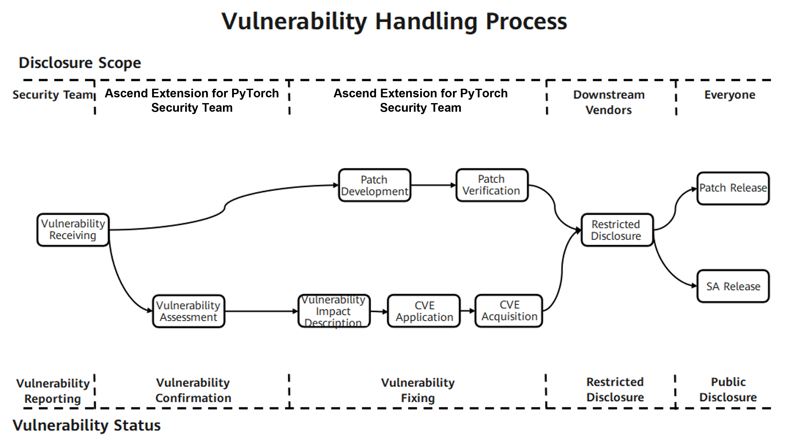

# Ascend Extension for PyTorch Security Statement

## System Security Hardening

You are advised to enable address space layout randomization (ASLR) level 2 in the system. Run the following command to enable it:

    echo 2 > /proc/sys/kernel/randomize_va_space

## Running User Recommendations

For security reasons and the principle of least privilege, do not use root or other privileged accounts to run torch_npu.

## File Permission Control

1. It is recommended that users implement appropriate access controls for sensitive files such as training data, intermediate saved files, personal private data, and commercial assets. For example, in multi-user dataset sharing scenarios, write permissions for dataset files should be restricted; permission controls should also be applied to files generated during profiling. For permission settings, refer to the [File Permission Reference](#file-permission-reference).

2. The torch_npu profiler generates performance record files with default permission `640` and directories with permission `750`. Users may adjust these permissions as needed.

3. Users should enforce permission controls during installation and usage. Refer to the [File Permission Reference](#file-permission-reference) for recommended settings. If you need to save installation/uninstallation logs, append `--log` to the installation/uninstallation command, and ensure proper permission management on the generated files and directories.

4. Files generated during PyTorch framework execution (for example, files saved via `torch.save`) inherit system‑default permissions. It is recommended that the user executing the script applies appropriate permission controls on output files as needed. Refer to the [File Permission Reference](#file-permission-reference) for guidance. The `umask` setting can be used to control default permissions and mitigate privilege escalation risks. It is recommended to set `umask` to `0027` or stricter on both hosts (including the host machine) and containers to enhance security.

### File Permission Reference

| Type | Maximum Linux Permission |
| --- | --- |
| Home directory | 750 (rwxr-x---) |
| Program files (including scripts and libraries) | 550 (r-xr-x---) |
| Program file directory | 550 (r-xr-x---) |
| Configuration files               |   640 (rw-r-----)     |
| Configuration file directory     |   750 (rwxr-x---)     |
| Log files (recorded or archived)  |   440 (r--r-----)     |
| Log files (being recorded)        |   640 (rw-r-----)     |
| Log file directory               |   750 (rwxr-x---)     |
| Debug files                       |   640 (rw-r-----)     |
| Debug file directory             |   750 (rwxr-x---)     |
| Temporary file directory         |   750 (rwxr-x---)     |
| Maintenance and upgrade file directory |   770 (rwxrwx---)     |
| Service data files               |   640 (rw-r-----)     |
| Service data file directory     |   750 (rwxr-x---)     |
| Key components, private keys, certificates, and ciphertext file directory |   700 (rwx------)     |
| Key components, private keys, certificates, and ciphertext files |   600 (rw-------)     |
| APIs and scripts for encryption and decryption |   500 (r-x------)     |

## Debugging Tool Statement

The performance analysis tool profiler is integrated within torch_npu:

- Reason for integration: To align with PyTorch's native capabilities, provide performance analysis support for NPU-based PyTorch development, and accelerate the performance debugging process.
- Usage scenario: Data collection is disabled by default. When performance analysis is needed, users can add the Ascend Extension for PyTorch Profiler API to the model training script. Performance data is collected during training, and a visual performance data file is output after training completes.
- Risk notification: Using this feature generates performance data locally. Users are advised to take necessary precautions to protect this data. It is recommended to use the tool only when performance analysis is required and to disable it promptly after analysis is complete. For more details about the Profiler tool, please refer to the [PyTorch Performance Profiler](https://www.hiascend.com/document/detail/zh/Pytorch/710/ptmoddevg/trainingmigrguide/performance_tuning_0014.html).

## Data Security Statement

1. PyTorch requires loading and saving data during its operation. Some interfaces rely on the pickle module, which may introduce security risks. Examples include torch.load, torch.jit.load, and torch.distributed.scatter_object_list. For more information on these risks, please refer to the [torch.load](https://pytorch.org/docs/main/generated/torch.load.html#torch.load) and [collective-functions](https://pytorch.org/docs/main/distributed.html#collective-functions) documentation.
2. The Ascend Extension for PyTorch relies on CANN's foundational capabilities to provide features such as AOE performance tuning, operator dumping, and logging. Users should carefully manage permission controls over files generated by these features and strengthen the protection of related data.

## Build Security Statement

torch_npu supports source code compilation and installation. During the build process, it downloads dependent third-party libraries and executes build shell scripts. Temporary program files and build directories are generated during compilation. Users may apply permission controls on files within the source code directory as needed to reduce security risks.

## Runtime Security Statement

1. You are advised to write training scripts that match the resource constraints of their runtime environment. Mismatches between the training script and available resources—such as loading a dataset that exceeds memory capacity or generating local data that exceeds disk space—may cause errors and unexpected process termination.
2. When runtime exceptions occur, PyTorch and torch_npu will terminate the process and print error messages, which is expected behavior. Users are advised to diagnose the root cause using the error messages, for example by enabling synchronous operator execution, inspecting CANN logs, or analyzing generated Core Dump files.
3. The distributed features of PyTorch and torch_npu are intended for internal communication only. For performance reasons, these features do not include any authentication protocol and may send unencrypted messages. For detailed documentation and security considerations regarding PyTorch's distributed capabilities, refer to [using-distributed-features](https://github.com/pytorch/pytorch/security#using-distributed-features).

## Public Network Address Statement

There are [public network addresses](#public-network-addresses) in the configuration files and scripts of torch_npu.

### Public Network Addresses

| Type | Open Source Code Address | Filename | Public IP Address/Public URL Address/Domain Name/Email Address | Usage Description |
| --- | --- | --- | --- | --- |
| Self-developed | Not applicable | .gitmodules | <https://gitcode.com/ascend/op-plugin.git> | Dependent Open Source Repository |
| Self-developed | Not applicable | .gitmodules | <https://gitee.com/mirrors/googletest.git> | Dependent Open Source Repository |
| Self-developed | Not applicable | .gitmodules | <https://gitee.com/ascend/torchair.git> | Dependent Open Source Repository |
| Self-developed | Not applicable | .gitmodules | <https://gitcode.com/ascend/Tensorpipe.git> | Dependent Open Source Repository |
| Self-developed | Not applicable | .gitmodules | <https://gitee.com/mirrors/fmt.git> | Dependent Open Source Repository |
| Self-developed | Not applicable | .gitmodules | <https://gitee.com/mirrors_llvm/torch-mlir.git> | Dependent Open Source Repository |
| Self-developed | Not applicable | .gitmodules | <https://gitee.com/mirrors/nlohmann-json.git> | Dependent Open Source Repository |
| Self-developed | Not applicable | .gitmodules | <https://gitcode.com/cann/runtime.git> | Dependent Open Source Repository |
| Self-developed | Not applicable | .gitmodules | <https://gitcode.com/cann/ge.git> | Dependent Open Source Repository |
| Self-developed | Not applicable | .gitmodules | <https://gitcode.com/cann/graph-autofusion.git> | Dependent Open Source Repository |
| Self-developed | Not applicable | ci\docker\X86\Dockerfile | <https://mirrors.huaweicloud.com/repository/pypi/simple> | Docker Configuration File, used to configure pip source |
| Self-developed | Not applicable | ci\docker\X86\Dockerfile | <https://download.pytorch.org/whl/cpu> | Docker configuration source, used to configure torch Download Link |
| Self-developed | Not applicable | ci\docker\ARM\Dockerfile | <https://mirrors.huaweicloud.com/repository/pypi/simple> | Docker Configuration File, used to configure pip source |
| Self-developed | Not applicable | ci\docker\X86\Dockerfile | <https://mirrors.wlnmp.com/centos/Centos7-aliyun-altarch.repo> | Docker Configuration File, used to configure yum source |
| Self-developed | Not applicable | ci\docker\ARM\Dockerfile | <https://mirrors.wlnmp.com/centos/Centos7-aliyun-altarch.repo> | Docker Configuration File, used to configure yum source |
| Self-developed | Not applicable | .github\workflows\\_build-and-test.yml | <https://mirrors.huaweicloud.com/repository/pypi/simple> | Workflow Configuration File, used to configure pip source |
| Self-developed | Not applicable | setup.cfg | <https://gitcode.com/ascend/pytorch> | URL parameter for packaging whl |
| Self-developed | Not applicable | setup.cfg | <https://gitcode.com/ascend/pytorch/tags> | download_url parameter for packaging whl |
| Self-developed | Not applicable | third_party\op-plugin\ci\build.sh | <https://gitcode.com/ascend/pytorch.git> | Build script pulls code from torch_npu repository address for compilation |
| Self-developed | Not applicable | third_party\op-plugin\ci\exec_ut.sh | <https://gitcode.com/ascend/pytorch.git> | UT script pulls code from torch_npu repository address for UT testing |
| Open Source Introduction | <https://github.com/pytorch/pytorch/blob/v2.7.1/test/nn/test_convolution.py> <br> <https://github.com/pytorch/pytorch/blob/v2.7.1/test/test_mps.py> <br> <https://github.com/pytorch/pytorch/blob/v2.7.1/test/test_serialization.py> | test\url.ini | <https://download.pytorch.org/test_data/legacy_conv2d.pt> | Used for test Script Download of related pt files |
| Open Source Introduction | <https://github.com/pytorch/pytorch/blob/v2.7.1/test/test_serialization.py> | test\url.ini | <https://download.pytorch.org/test_data/legacy_serialized.pt> | Used for test Script Download of related pt files |
| Open Source Introduction | <https://github.com/pytorch/pytorch/blob/v2.7.1/test/test_serialization.py> | test\url.ini | <https://download.pytorch.org/test_data/gpu_tensors.pt> | Used for test Script Download of related pt files |
| Open Source Introduction | <https://github.com/pytorch/pytorch/blob/v2.7.1/test/onnx/test_utility_funs.py> | test\url.ini | <https://github.com/pytorch/pytorch/issues/new?template=bug-report.yml> | Link to issue |
| Open Source Introduction | <https://github.com/pytorch/pytorch/blob/v2.7.1/test/test_nn.py> <br> <https://github.com/pytorch/pytorch/blob/v2.7.1/test/test_serialization.py> | test\url.ini | <https://download.pytorch.org/test_data/linear.pt> | Used for test Script Download of related pt files |
| Self-developed | Not applicable | torch_npu\npu\config.yaml | <https://raw.githubusercontent.com/brendangregg/FlameGraph/master/flamegraph.pl> | Flame graph Script Download path |
| Self-developed | Not applicable | test\requirements.txt | <https://download.pytorch.org/whl/nightly/cpu> | Download Link, used to download torch-cpu version |
| Self-developed | Not applicable | test\requirements.txt | <https://data.pyg.org/whl/torch-2.7.0+cpu.html> | Download Link, used to download torch-scatter cpu version |
| Self-developed | Not applicable | requirements.txt | <https://download.pytorch.org/whl/nightly/cpu> | Download Link, used to download torch-cpu version |
| Self-developed | Not applicable | test\get_synchronized_files.sh | <https://github.com/pytorch/pytorch.git> | Download Link, used to download PyTorch test cases |

## Public API Statement

The Ascend Extension for PyTorch is an adapter plugin for PyTorch that enables users to perform training and inference on Ascend devices using PyTorch. After adaptation, the extension allows users to use native PyTorch APIs. In addition to native PyTorch APIs, the Ascend Extension for PyTorch provides several custom APIs, including custom operators, affinity libraries, and other APIs, supporting integration between PyTorch APIs and custom ones. For details, refer to the [Ascend Extension for PyTorch Custom API Reference](https://www.hiascend.com/document/detail/zh/Pytorch/710/apiref/torchnpuCustomsapi/context/%E6%A6%82%E8%BF%B0.md) and [PyTorch API List](https://www.hiascend.com/document/detail/zh/Pytorch/710/apiref/PyTorchNativeapi/ptaoplist_000003.html).

Following the [PyTorch Community Public API Guidelines](https://github.com/pytorch/pytorch/wiki/Public-API-definition-and-documentation), the Ascend Extension for PyTorch provides external custom interfaces. If a function appears to meet the criteria for a public API and is documented as such, it is considered a public API. Otherwise, before using such a feature, you are encouraged to inquire with the community to confirm whether it is intentionally public or has been inadvertently exposed, as undocumented interfaces may be modified or removed in the future.

The Ascend Extension for PyTorch is developed using both C++ and Python. Except for Libtorch scenarios, the official APIs are currently provided only as Python APIs. The shared libraries within the torch_npu binary package do not provide direct services; any exposed interfaces are for internal use only and are not recommended for user adoption.

## Communication Security Hardening

PyTorch distributed training services require communication between devices. The ports opened for communication listen on 0.0.0.0 by default. To mitigate security risks, you are advised to harden the security for this scenario, for example, by configuring firewall rules using iptables to restrict external access to the ports used for distributed training before the training starts, and cleaning up the firewall rules after distributed training completes.

1. Firewall rule configuration and removal reference script template
    - For firewall rule configuration, refer to the following script:
  
      ```bash
      #!/bin/bash
      set -x

      # Port Number to be restricted
      port={port_number}

      # Clear old rules
      iptables -D INPUT -p tcp -j {rule_name}
      iptables -F {rule_name}
      iptables -X {rule_name}

      # Create a new rule chain
      iptables -t filter -N {rule_name}

      # In a multi-node scenario, configure a whitelist to allow other nodes to access the listening port of the master node.
      # Add a rule to the rule chain that allows a specific IP address range.
      iptables -t filter -A {rule_name} -i eno1 -p tcp --dport $port -s {IP allowed for external access} -j ACCEPT

      # Block external addresses from accessing the distributed training port.
      # Add a rule to the PORT-LIMIT-RULE chain to deny other IP addresses.
      iptables -t filter -A {rule_name} -i {NIC to be restricted} -p tcp --dport $port -j DROP

      # Pass traffic to the rule chain
      iptables -I INPUT -p tcp -j {rule_name}
      ```

    - To remove a firewall rule, refer to the following script:

      ```bash
      #!/bin/bash
      set -x
      # Clear rules
      iptables -D INPUT -p tcp -j {rule name}
      iptables -F {rule name}
      iptables -X {rule name}
      ```

2. Firewall rule configuration and removal reference script example
    - Configure the firewall for a specific port. The port number in the script is the port to be restricted. For the port number in PyTorch distributed training, refer to [Communication Matrix Information](#communication-matrix-information). The network interface card name to be restricted is the NIC used by the server for distributed communication, and the allowed external access IP is the IP address of the distributed training server. The NIC and server IP can be viewed using ifconfig. In the following output, eth0 is the NIC name and 192.168.1.1 is the server IP address:

        ```bash
        # ifconfig
        eth0
            inet addr:192.168.1.1 Bcast:192.168.1.255 Mask:255.255.255.0
            inet6 addr: fe80::230:64ee:ef1a:c1a/64 Scope:Link
        ```

    - Assume the server master node address is 192.168.1.1, another server that needs to perform distributed training is 192.168.1.2, and the training port is 29510.
        - Firewall rule configuration, refer to the following script:

            ```bash
            #!/bin/bash
            set -x

            # Set the listening port
            port=29510

            # Clear old rules
            iptables -D INPUT -p tcp -j PORT-LIMIT-RULE
            iptables -F PORT-LIMIT-RULE
            iptables -X PORT-LIMIT-RULE

            # Create a new PORT-LIMIT-RULE chain
            iptables -t filter -N PORT-LIMIT-RULE

            # Set a whitelist in a multi-node scenario to allow 192.168.1.2 to access the master node
            # Add a rule in the PORT-LIMIT-RULE chain to allow a specific IP address range
            iptables -t filter -A PORT-LIMIT-RULE -i eno1 -p tcp --dport $port -s 192.168.1.2 -j ACCEPT

            # Block external addresses from accessing the distributed training port
            # Add a rule in the PORT-LIMIT-RULE chain to deny other IP addresses
            iptables -t filter -A PORT-LIMIT-RULE -i eth0 -p tcp --dport $port -j DROP

            # Pass traffic to the PORT-LIMIT-RULE chain
            iptables -I INPUT -p tcp -j PORT-LIMIT-RULE
            ```

        - Firewall rule removal, refer to the following script:

            ```bash
            #!/bin/bash
            set -x
            # Clear rules
            iptables -D INPUT -p tcp -j PORT-LIMIT-RULE
            iptables -F PORT-LIMIT-RULE
            iptables -X PORT-LIMIT-RULE
            ```

## Communication Matrix

PyTorch provides distributed training capabilities and supports training in both single‑node and multi‑node scenarios, which requires network communication. Specifically, PyTorch communicates over TCP, while torch_npu uses HCCL from CANN for communication between NPU devices. For port details, refer to the [communication matrix](#communication-matrix-information). Users should pay attention to and ensure the security of inter‑node communication networks. Measures such as iptables can be used to mitigate security risks. For network security hardening, refer to the [Communication Security Hardening](#communication-security-hardening) section.

### Communication Matrix Information

| Component | PyTorch | HCCL |
| --------------------- | ------------------------------------ | ------------------------------------ |
| Source Device | Server running the torch_npu process | Server running the torch_npu process |
| Source IP | Device IP Address | Device IP Address |
| Source Port | Automatically assigned by the operating system. The assignment range is determined by the OS's own configuration. | Default value is 60000, Value Range [1024, 65520]. Users can specify the starting port number of the Host NIC via the HCCL_IF_BASE_PORT Environment Variable. After configuration, the system occupies 16 ports starting from this port by default. |
| Destination Device | Server running the torch_npu process | Server running the torch_npu process |
| Destination IP | Device IP Address | Device IP Address |
| Destination Port (Listening) | Default 29500/29400, users can set the Port Number | Default value is 60000, Value Range [1024, 65520]. Users can specify the starting port number of the Host NIC via the HCCL_IF_BASE_PORT Environment Variable. After configuration, the system occupies 16 ports starting from this port by default. |
| Protocol | TCP | TCP |
| Port Description | In distributed scenarios <br> 1. torchrun/torch.distributed.launch <br> (1) When backend is static (default), the destination port (default 29500) is used for receiving and sending data, and the source port is used for receiving and sending data. Use master-addr to specify the address and master-port to specify the port. <br> (2) When backend is c10d, the destination port (default 29400) is used for receiving and sending data, and the source port is used for receiving and sending data. Use rdzv_endpoint to specify the address and port number in the format "address:port number". <br> 2. torch_npu_run: The destination port (default 29500) is used for receiving and sending data, and the source port is used for receiving and sending data. Use master-addr to specify the address and master-port to specify the port. | Default value is 60000, Value Range [1024, 65520]. Users can specify the starting port number of the Host NIC via the HCCL_IF_BASE_PORT Environment Variable. After configuration, the system occupies 16 ports starting from this port by default. |
| Can Listening Port Be Changed | Yes | Yes |
| Authentication Method | No authentication | No authentication |
| Encryption Method | None | None |
| Belonging Plane | Not involved | Not involved |
| Version | All versions | All versions |
| Special Scenario | None | None |
| Remarks | This communication process is controlled by the open-source software PyTorch, configured with PyTorch native settings. Refer to the [PyTorch documentation](https://pytorch.org/docs/stable/distributed.html#launch-utility). The source port is automatically assigned by the operating system, and the assignment range is determined by the OS configuration. For example, on Ubuntu: it is specified by the /proc/sys/net/ipv4/ipv4_local_port_range file, which can be viewed via cat /proc/sys/net/ipv4/ipv4_local_port_range or sysctl net.ipv4.ip_local_port_range. | This communication process is controlled by the HCCL component in CANN; torch_npu does not control it. For the port range, refer to the "Execution Related > Collective Communication > HCCL_IF_BASE_PORT" section in the [Environment Variable Reference](https://www.hiascend.com/document/detail/en/canncommercial/82RC1/maintenref/envvar/envref_07_0001.html). |

## Vulnerability Security Statement

The Ascend Extension for PyTorch community highly values the security of community versions. Vulnerability management specialists are specifically designated to handle vulnerability-related matters. To build a more secure AI full-process toolchain, we look forward to your participation.

### Vulnerability Handling Procedure

For each security vulnerability, the MindStudio community assigns personnel to follow up and handle it. The end-to-end vulnerability handling process is shown in the following figure.



The following sections explain the vulnerability reporting, assessment, and disclosure processes.

### Vulnerability Reporting

You can contact the Ascend Extension for PyTorch community team by submitting an issue. We will arrange for a security vulnerability specialist to contact you promptly. 
Note that to ensure security, do not include specific information about security privacy in the issue.

#### Response to Reports

1. The Ascend Extension for PyTorch community will confirm, analyze, and report security vulnerability issues within three working days, while initiating the security handling process.
2. The Ascend Extension for PyTorch security team will assign confirmed security vulnerability issues to dedicated personnel and follow up on them.
3. During the process of classifying, confirming, and fixing security vulnerabilities, as well as releasing patches, we will provide timely updates on the report.

### Vulnerability Assessment

The industry widely uses the CVSS standard to assess vulnerability severity. When using CVSS v3.1 for vulnerability assessment, Ascend Extension for PyTorch sets specific attack scenarios and performs assessments based on the actual impact within those scenarios. Vulnerability severity assessment involves assessing the difficulty of exploitation as well as the impact on confidentiality, integrity, and availability after exploitation, resulting in a numerical score.

#### Vulnerability Assessment Metrics

Ascend Extension for PyTorch assesses vulnerability severity levels by using the following vector metrics:

- Attack vector (AV): indicates the "remoteness" of an attack and how a vulnerability can be exploited.
- Attack complexity (AC): describes the difficulty of executing an attack and the factors required for a successful attack.
- User interaction (UI): determines whether the attack requires user participation.
- Privileges required (PR): records the level of user authentication required for a successful attack.
- Scope (S): determines whether an attack can affect components with different permission levels.
- Confidentiality (C): measures the impact resulting from information disclosure to unauthorized parties.
- Integrity (I): measures the impact resulting from information tampering.
- Availability (A): measures the impact on users' access to data or services when needed.

#### Assessment Principles

- Assess the severity level of the vulnerability, not the risk.
- The assessment must be based on an attack scenario where a successful attack can compromise the confidentiality, integrity, and availability of the system.
- When a security vulnerability has multiple attack scenarios, the attack scenario with the highest CVSS score (that is, with the greatest impact) shall prevail in the assessment.
- If a vulnerability exists in an embedded or invoked library, perform the assessment after determining the attack scenario based on how the library is used in the product.
- If a security defect cannot be triggered or does not affect confidentiality, integrity, or availability (CIA), the CVSS score is 0.

#### Assessment Procedure

To assess the severity level of a vulnerability, perform the following steps:

1. Set a possible attack scenario and score based on this attack scenario.
2. Identify the vulnerable component and affected components.

3. Select values for the base metrics.

    - Select values for the exploitability metrics (attack vector, attack complexity, privileges required, user interaction, and scope) based on the vulnerable component.
  
    - Ensure impact metrics (confidentiality, integrity, and availability) reflect the impact on either the vulnerable component or the affected components, whichever is more severe.

#### Severity Rating

| **Severity Rating** | **CVSS Score** | **Vulnerability Fix Time** |
| ------------------------------- | --------------------- | ---------------- |
| Critical | 9.0~10.0 | 7 days |
| High | 7.0~8.9 | 14 days |
| Medium | 4.0~6.9 | 30 days |
| Low | 0.1~3.9 | 30 days |

### Vulnerability Disclosure

After a security vulnerability is fixed, the Ascend Extension for PyTorch community will release a security advisory (SA) and security notice (SN). The SA includes technical details of the vulnerability, type, reporter, CVE ID, affected versions, and fixed versions.
To ensure security for Ascend Extension for PyTorch users, the Ascend Extension for PyTorch community will not publicly disclose, discuss, or confirm security issues until after investigation and fixing are complete and an SA has been released.

### Appendix

#### Security Advisory (SA)

Currently maintained versions have no security vulnerabilities.

#### Security Note (SN)

No vulnerability notices are currently available for third-party open-source components.
