# Ascend PyTorch Profiler

<!-- md-trans-meta sourceCommit=unknown translatedAt=2026-06-14T00:45:10.779Z pushedAt=2026-06-14T07:51:04.584Z -->

## Usage Guide

The Ascend PyTorch Profiler supports performance data profiling and parsing. You can use it according to the process flow described in the following table.

| Process | Corresponding Section |
| -------------------- | ------------------------------------------------------------ |
| Data profiling | You can choose any of the following profiling modes based on your actual needs. Note that you cannot use two or more modes simultaneously in the same process.<br>[Profiling and automatic parsing](#profiling-and-automatic-parsing)<br>&#8226; [Profile and parse performance data (torch_npu.profiler.profile)](#profile-and-parse-performance-data-torch_npuprofilerprofile)<br>(Recommended) Provides a complete profiling APIs. By manually adding the APIs to the code, you can freely choose the content to profile.<br>&#8226; [Profile and parse performance data (dynamic_profile)](#profile-and-parse-performance-data-dynamic_profile)<br>(Recommended) Supports starting profiling at any time during training and supports starting profiling without modifying user code, offering a more flexible collection method. |
| (Optional) Extended profiling | If you need to profile other data, you can use the following functions.<br>[Extended profiling functions](#extended-profiling-functions)<br/>&#8226; [Profile and parse mstx data](#profile-and-parse-mstx-data)<br>&#8226; [Profile environment variables](#profiling-environment-variables)<br>&#8226; [Mark performance data profiling](#mark-performance-data-profiling-process)<br>&#8226; [Device memory visualization](#device-memory-visualization)<br>&#8226; [Create Profiler sub-thread profiling](#create-profiler-sub-thread-profiling) |
| (Optional) Data parsing | [Offline parsing](#offline-parsing)<br>Generally, the data profiling API performs automatic parsing during profiling. Therefore, offline parsing is applicable to scenarios where unparsed raw performance data needs to be parsed. |
| Data analysis | After completing collection and automatic parsing or offline parsing, you can view the corresponding performance data files in the performance data directory. For details about specific files, see [Output result file description](#output-result-file-description), or import the performance data into the [MindStudio Insight](https://gitcode.com/Ascend/msinsight/blob/26.0.0/docs/en/user_guide/overview.md) tool for analysis. |

## Introduction

Ascend PyTorch Profiler is a performance analysis tool developed for the PyTorch framework. By adding the profiler to PyTorch training or online inference scripts, it profiles performance data during task execution and directly outputs visualized performance data files upon completion, thereby improving performance analysis efficiency.

The profiler comprehensively profiles performance data in PyTorch training and online inference scenarios, including PyTorch layer operator information, CANN layer operator information, underlying NPU operator information, and operator memory usage information. This enables a full-spectrum analysis of performance status during PyTorch training and online inference.

## Preparation

**Environment Setup**

- Install the matching version of the CANN Toolkit development suite or operator package and configure environment variables. For details, see [CANN Quick Installation Guide](https://www.hiascend.com/en/cann/download).
- Prepare a training model developed with PyTorch 2.1.0 or later and the corresponding dataset, then migrate the model to the Ascend AI processor by following the [Model Migration](https://gitcode.com/Ascend/ModelZoo-PyTorch/blob/master/PyTorch/docs/model_migration/README.md) section in the *PyTorch Model Migration and Tuning Guide*.

### Constraints

Before using this tool, understand its constraints:

- Permission constraints
  - Ensure the principle of least privilege is applied (for example, prohibit write permission for other users, such as not setting file permissions to 666 or 777).
  - Before using the profiler, ensure that the umask value of the executing user is greater than or equal to 0027. Otherwise, the directory and file permissions for the profile data will be too permissive.
  - For security and the principle of least privilege, do not use high-privilege accounts such as root with this tool. It is recommended to execute it with a regular user account.
  - This tool is intended for development and debugging. It is not recommended for use in production environments.
  - This tool depends on CANN and its corresponding driver software package. Before using this tool, install CANN and the driver software package, and use the `source` command to execute the CANN `set_env.sh` environment variable file. For security, do not modify the environment variables involved in `set_env.sh` after sourcing.
  - Ensure that the performance data is saved in the current user's directory without symbolic links. Otherwise, it may cause security issues.

- Execution constraints
  - It is not recommended to use the performance data profiling function and the dump function simultaneously. Dump operations affect system performance. If the profiling function and the dump function are enabled at the same time, the profile data metrics will be inaccurate. Disable data dump before starting profiling.
  - The Ascend PyTorch Profiler APIs support multiple profiling modes. Different profiling modes cannot be enabled simultaneously.
  - Ensure that the call to the Ascend PyTorch Profiler API and the service process to be profiled are in the same process.
  - When the Ascend PyTorch Profiler API performs a profiling task, the relationship between processes and devices is as follows:
        - Multi-process multi-device scenario: Supports setting one profiling process for each device.
        - Single-process multi-device scenario: Supported. Requires PyTorch 2.1.0post14, 2.5.1post2, 2.6.0, or later versions.
        - Multi-process single-device scenario: The profiling operations between multiple processes must be serial, meaning that profiling operations do not start at the same time, and each profiling operation must include a complete start and stop.

- Data dump constraints
  - Performance data occupies a certain amount of drive space, which may cause the risk of the server becoming unavailable due to a full drive. The space required for performance data is closely related to model parameters, profiling switch configurations, and the number of profiled iterations. Ensure sufficient available drive space in the dump directory.
  - It is recommended that the performance data profiling time be within 5 minutes, and reserve at least 20 times the memory and drive space of the raw performance data size. The raw data size refers to the total data size under the data directory after profiling and dumping.

## Profiling and Automatic Parsing

### Profile and Parse Performance Data (torch_npu.profiler.profile)

#### Function Description

Use the `torch_npu.profiler.profile` series of APIs to profile and parse performance data.

#### Precautions

None

#### Usage Example

1. Add the following sample code to the training script (for example, `train_*.py` file) or online inference script to configure performance data profiling parameters, then start training or online inference.

    >[!NOTE]
    >
    >- For details about the `torch_npu.profiler.profile` API and its parameters in the following sample code, see [Ascend PyTorch Profiler API Description](#ascend-pytorch-profiler-api-description).
    >- Two sample code examples are provided below, using different methods to call the `torch_npu.profiler.profile` API. You can choose either one.

    - Example 1: Use the `with` statement to call the `torch_npu.profiler.profile` API to automatically create a profiler, and profile performance data for the code segment within the `with` block.

        ```python
        import torch
        import torch_npu
        
        ...
        
        # Add extended configuration parameters for Profiling collection. For detailed parameter descriptions, see the parameter description below.
        experimental_config = torch_npu.profiler._ExperimentalConfig(
            export_type=torch_npu.profiler.ExportType.Text,
            profiler_level=torch_npu.profiler.ProfilerLevel.Level0,
            aic_metrics=torch_npu.profiler.AiCMetrics.AiCoreNone
        )
        
        # Add basic configuration parameters for profiling. For detailed parameter descriptions, see the parameter description below.
        with torch_npu.profiler.profile(
            activities=[
                torch_npu.profiler.ProfilerActivity.CPU,
                torch_npu.profiler.ProfilerActivity.NPU
                ],
            schedule=torch_npu.profiler.schedule(wait=0, warmup=0, active=1, repeat=1, skip_first=0, skip_first_wait=0),    # Used in conjunction with prof.step()
            on_trace_ready=torch_npu.profiler.tensorboard_trace_handler("./result"),
            profile_memory=False,
            with_modules=False,
            experimental_config=experimental_config) as prof:
        
            # Start performance data collection
            for step in range(steps):    # Training Function
                train_one_step()    # Training Function
                prof.step()    # Used in conjunction with schedule
        ```

    - Example 2: Create a `torch_npu.profiler.profile` object, and control the profiling of performance data through the start and stop APIs. You can customize the location where the profiling starts.

        ```python
        import torch
        import torch_npu
        ...
        
        # Add Profiling collection extended configuration parameters. For detailed parameter descriptions, see the parameter description below.
        experimental_config = torch_npu.profiler._ExperimentalConfig(
            export_type=torch_npu.profiler.ExportType.Text,
            profiler_level=torch_npu.profiler.ProfilerLevel.Level0,
            aic_metrics=torch_npu.profiler.AiCMetrics.AiCoreNone
        )
        
        # Add basic configuration parameters for profiling. For detailed parameter descriptions, see the parameter description below.
        prof = torch_npu.profiler.profile(
            activities=[
                torch_npu.profiler.ProfilerActivity.CPU,
                torch_npu.profiler.ProfilerActivity.NPU
                ],
            schedule=torch_npu.profiler.schedule(wait=0, warmup=0, active=1, repeat=1, skip_first=0, skip_first_wait=0),
            on_trace_ready=torch_npu.profiler.tensorboard_trace_handler("./result"),
            profile_memory=False,
            with_modules=False,
            experimental_config=experimental_config)
        
        prof.start()    # Start performance data profiling
        for step in range(steps):    # Training function
            train_one_step()    # Training function
            prof.step()    # Used together with schedule
        prof.stop()    # End performance data profiling
        ```

    The above two examples primarily use `tensorboard_trace_handler` to export performance data. You can also use the following `prof.export_chrome_trace` method to export a single performance file `chrome_trace_{pid}.json`. Since the performance data exported by `tensorboard_trace_handler` already includes the performance data exported by `prof.export_chrome_trace`, you only need to choose one method based on your actual requirements.

    ```python
    import torch
    import torch_npu
    
    ...
    
    with torch_npu.profiler.profile() as prof:
    
        # Start performance data profiling
        for step in range(steps):    # Training function
            train_one_step()    # Training function
    prof.export_chrome_trace('./chrome_trace_14.json')    # Specifies the export path for the chrome_trace_{pid}.json file
    ```

2. Parse the performance.

    Supports automatic parsing (refer to `tensorboard_trace_handler` and `prof.export_chrome_trace` in the sample code above) and [offline parsing](#offline-parsing).

3. View performance data result files and performance data analysis result.

    For details about performance data result files, see [output result file description](#output-result-file-description).

    For details, see [MindStudio Insight System Tuning](https://gitcode.com/Ascend/msinsight/blob/26.0.0/docs/en/user_guide/system_tuning.md) to visualize and analyze the parsed performance data files.

    You can use the [msprof-analyze](https://gitcode.com/Ascend/msprof-analyze/blob/26.0.0/docs/en/getting_started/quick_start.md) tool to assist in analyzing performance data.

### Profile and Parse Performance Data (dynamic_profile)

#### Function Description

The `dynamic_profile` function allows you to start the profiling process at any time during model training or online inference.

#### Precautions

Only one of the following methods can be used. You cannot enable `dynamic_profile` using two or more methods simultaneously.

**Table 1** Dynamic profiling methods

| Dynamic Profiling Method | Description |
| ------------------------------------------------------------ | ------------------------------------------------------------ |
| Configure environment variables. | Supports only training scenarios. Controls Profiling configuration by modifying the configuration file `profiler_config.json`, without modifying user code. |
| Modify user training/online inference script and add the dynamic_profile API. | Supports training/online inference scenarios. Controls Profiling startup by modifying the configuration file `profiler_config.json`. The `dynamic_profile` API must be added to the user script in advance. |
| Modify user training/online inference script and add the `dynamic_profile dp.start()` function. | Supports training/online inference scenarios. Controls profiling startup by adding the `dp.start()` API to the user script in advance. The position where the `dp.start()` API is added can be customized, suitable for use when the collection scope needs to be narrowed. |

#### Usage Example (Configuring Environment Variables)

1. Configure the following environment variables.

   ```bash
   export PROF_CONFIG_PATH="/path/to/profiler_config_path"
   ```

   After configuring the environment variables and starting training, `dynamic_profile` will automatically create a template file `profiler_config.json` under `profiler_config_path`. You can customize the configuration items based on the template file.

   > [!NOTE]
   >
   >- This method only supports training scenarios.
   >- In this method, `dynamic_profile` does not support profiling data for the first iteration (step0).
   >- This method relies on the native PyTorch `Optimizer.step()` to divide the profiling steps during training, and does not support custom optimizer scenarios.
   >- The path specified by `PROF_CONFIG_PATH` can be customized (read and write permissions are required). The path format only supports strings consisting of letters, digits, and underscores, and does not support soft links, for example, `/home/xxx/profiler_config_path`.

2. Start the training task.
3. Open a new command line window and modify the `profiler_config.json` configuration file to enable the Profiling task.

    The configuration file contains performance data profiling parameters. You can refer to [profiler_config.json File Description](#profiler_configjson-file-description) to modify configuration file parameters for different profiling tasks.

    > [!NOTE]
    >
    > - dynamic_profile determines whether the file has been modified by identifying the status of the profiler_config.json file:
    > - dynamic_profile polls every 2 seconds. If a change to the profiler_config.json file is detected, the collection process starts, and then the running interval between adjacent steps is recorded. This time is used as the new polling interval, with a minimum value of 1 second.
    > - If the profiler_config.json file is modified during dynamic_profile collection execution, the dynamic_profile collection for the last file modification will be started again after the collection process ends.
    > - It is recommended that users use shared storage to set the profiler_config_path for dynamic_profile.
    > - Debugging logs for dynamic_profile are automatically recorded in the profiler_config_path directory. For details, see [dynamic_profile Debugging Logs](#dynamic_profile-debugging-logs).
    > - The modified start_step parameter value should be greater than the currently executed training/online inference step and should not exceed the maximum step. For example, if the total number of steps is 10 and step 3 has been executed, start_step can only be configured between 3 and 10. Note that since the training/online inference task is still running during configuration, the configured value should be greater than step 3.

4. Parse the performance data.

    Both automatic parsing and manual parsing are supported. See the analysis parameter in Table 1.

5. View performance data result files and performance data analysis.

    For details about the performance data result file, see [Output Result File Description](#output-result-file-description).

    See [MindStudio Insight System Tuning](https://gitcode.com/Ascend/msinsight/blob/26.0.0/docs/en/user_guide/system_tuning.md) to visualize and analyze the parsed performance data files.

    You can use the [msprof-analyze](https://gitcode.com/Ascend/msprof-analyze/blob/26.0.0/docs/en/getting_started/quick_start.md) tool to assist in analyzing performance data.

#### Usage Example (Modifying the User Training/Online Inference Script by Adding the dynamic_profile API)

1. Add the following sample code to the training script (such as `train_*.py` file) / online inference script.

    ```python
    # Load the dynamic_profile module
    from torch_npu.profiler import dynamic_profile as dp
    # Set the path for the Profiling configuration file
    dp.init("profiler_config_path")
    ...
    for step in steps:
        train_one_step()
        # Divide steps
        dp.step()
    ```

    During `init`, `dynamic_profile` automatically creates a template file named `profiler_config.json` under `profiler_config_path`. Users can customize the configuration items based on this template file.

    The `profiler_config_path` path format only supports strings composed of letters, digits, and underscores. Soft links are not supported.

2. Start the training/online inference task.
3. Open a new command line window and modify the `profiler_config.json` configuration file to enable the profiling task.

   The configuration file contains the performance data profiling parameters of the profiler. You can modify the configuration file parameters by referring to [profiler_config.json File Description](#profiler_configjson-file-description) to execute different Profiling tasks.

   > [!NOTE]
   >
   > - dynamic_profile determines whether the file has been modified by identifying the status of the profiler_config.json file:
   > - dynamic_profile polls every 2 seconds. If a change to the profiler_config.json file is detected, the collection process starts, and then the running interval between adjacent steps is recorded. This time is used as the new polling time, with a minimum value of 1 second.
   > - If the profiler_config.json file is modified during the dynamic_profile collection execution, the dynamic_profile collection for the last file modification will be started again after the collection process ends.
   > - It is recommended that you use shared storage to set the profiler_config_path for dynamic_profile.
   > - Debugging logs for dynamic_profile are automatically recorded in the profiler_config_path directory. For details, see [dynamic_profile Debugging Logs](#dynamic_profile-debugging-logs).
   > - The modified start_step parameter value should be greater than the currently executed training/online inference step and not exceed the maximum step. For example, if the total number of steps is 10 and step 3 has been executed, start_step can only be configured between 3 and 10. Note that since the training/online inference task continues to run during configuration, the configured value must be greater than step 3.

4. Both automatic parsing and manual parsing are supported. See the analysis parameter in table 1.
5. View the performance data result files and performance data analysis.

    For detailed description of the performance data result files, see [Output Result File Description](#output-result-file-description).

    See [MindStudio Insight System Tuning](https://gitcode.com/Ascend/msinsight/blob/26.0.0/docs/en/user_guide/system_tuning.md) to visualize and analyze the parsed performance data files.

    You can use the [msprof-analyze](https://gitcode.com/Ascend/msprof-analyze/blob/26.0.0/docs/en/getting_started/quick_start.md) tool to assist in analyzing performance data.

#### Usage Example (Modifying the User Training/Online Inference Script by Adding the dp.start() Function of dynamic_profile)

1. Add the following sample code to the training script (such as `train_*.py` file) / online inference script.

   ```python
   # Load the dynamic_profile module
   from torch_npu.profiler import dynamic_profile as dp
   # Set the Profiling configuration file path for the init interface
   dp.init("profiler_config_path")
   ...
   for step in steps:
       if step==5:
           # Set the Profiling configuration file path for the start interface
           dp.start("start_config_path")
       train_one_step()
       # Divide steps. The code to be profiled must be placed between the dp.start() interface and the dp.step() interface.
       dp.step()
   ```

   `start_config_path` is also specified as `profiler_config.json`, but you need to manually create the configuration file according to [profiler_config.json File Description](#profiler_configjson-file-description) and configure parameters based on the scenario. A specific file name must be specified here, for example, `dp.start("/home/xx/start_config_path/profiler_config.json")`.

   The path format for `profiler_config_path` and `start_config_path` only supports strings consisting of letters, digits, and underscores, and does not support soft links.

   > [!NOTE]
   >
   > - After adding `dp.start()`, when the training/online inference task reaches `dp.start()`, data collection will automatically proceed according to the profiler_config.json file specified by start\_config\_path. The `dp.start()` function is not aware of modifications to the profiler_config.json file and will only trigger one collection task during the training/online inference process.
   > - After adding `dp.start()` and starting training/online inference:
   > - If `dp.start()` does not specify a profiler_config.json configuration file or the configuration file fails to take effect, data collection will proceed according to the profiler_config.json file configuration in the profiler\_config\_path directory when `dp.start()` is reached.
   > - If the script runs to `dp.start()` while the dynamic_profile configured by `dp.init()` is in effect, `dp.start()` will not take effect.
   > - If the script runs to `dp.start()` after the dynamic_profile collection configured by `dp.init()` has ended, `dp.start()` collection will continue and a new performance data file directory will be generated under the prof\_dir directory.
   > - If the profiler_config.json file in the profiler\_config\_path directory is modified while the dynamic_profile configured by `dp.start()` is in effect, `dp.init()` will wait for the `dp.start()` collection to complete before starting, and a new performance data file directory will be generated under the prof\_dir directory.
   > - It is recommended that users use shared storage to set the profiler\_config_path for dynamic_profile.
   > - The modified start\_step parameter value should be greater than the current training/online inference step that has been executed and must not exceed the maximum step. For example, if the total number of steps is 10 and step 3 has been executed, start\_step can only be configured between 3 and 10. Note that since the training/online inference task continues to execute during configuration, the configured value must be greater than step 3.

2. Start the training/online inference task.
3. Parse the performance data.

    Both automatic and manual parsing are supported. For details, see the analysis parameter in table 1.

4. View the performance data result files and analyze the performance data.

    For a detailed description of the performance data result files, see [Output Result File Description](#output-result-file-description).

    For details, see [MindStudio Insight System Tuning](https://gitcode.com/Ascend/msinsight/blob/26.0.0/docs/en/user_guide/system_tuning.md) to visualize and analyze the parsed performance data files.

    You can use the [msprof-analyze](https://gitcode.com/Ascend/msprof-analyze/blob/26.0.0/docs/en/getting_started/quick_start.md) tool to assist in analyzing performance data.

## Extended Profiling Functions

### Profile and Parse mstx Data

#### Function Description

For large-scale cluster scenarios where traditional profiling involves large data volumes and complex analysis processes, the mstx custom marking function allows you to define collection time periods or the start and end time points of key functions, identify information such as key functions or iterations, and quickly locate performance issues.

The usage process is as follows:

1. Add the Ascend PyTorch Profiler interface to the PyTorch script, and enable the custom marking function through the `mstx` parameter of [experimental_config](#experimental_config-parameter-description).
2. (Optional) Set the profiler_level switch to Level_none (you can configure the corresponding level based on actual collection needs) and use the domain filtering attributes mstx_domain_include or mstx_domain_exclude to collect marking data.
3. In the PyTorch script, call the [torch_npu.npu.mstx](https://gitcode.com/Ascend/op-plugin/blob/26.0.0/docs/en/custom_APIs/torch_npu-npu/torch_npu-npu_list.md#table17382716193111) series APIs for the events you want to profile, to profile the duration of the corresponding events.

#### Precautions

If the user's code only involves pure CPU-side operations, there is no need to pass the stream parameter when calling the [torch_npu.npu.mstx](https://gitcode.com/Ascend/op-plugin/blob/26.0.0/docs/en/custom_APIs/torch_npu-npu/torch_npu-npu_list.md#table17382716193111) series APIs. If the user's code includes device operations and it is necessary to observe the duration on the device side, the stream parameter must be passed.

#### Usage Example

- Record only the host-side range duration (thread-level):

  ```python
  torch_npu.npu.mstx.range_push("dataloader", None)    # Set the second input parameter to None or leave it unset to record only the Host-side range duration.
  dataloader()
  torch_npu.npu.mstx.range_pop()
  ```

- Mark on the compute stream to record both the Host-side range duration and the corresponding Device-side range duration (thread-level):

  ```python
  stream = torch_npu.npu.current_stream()
  torch_npu.npu.mstx.range_push("matmul", stream)    # Set the second input parameter to a valid stream to record both the Host-side range duration and the corresponding Device-side range duration.
  torch.matmul()    # Computational stream operation
  torch_npu.npu.mstx.range_pop()
  ```

- Record only the Host-side range duration (process level):

  ```python
  id = torch_npu.npu.mstx.range_start("dataloader", None)    # Set the second input parameter to None or leave it unset to record only the Host-side range duration.
  dataloader()
  torch_npu.npu.mstx.range_end(id)
  ```

- Mark on the computational stream to record both the host-side range duration and the corresponding device-side range duration (process level):

  ```python
  stream = torch_npu.npu.current_stream()
  id = torch_npu.npu.mstx.range_start("matmul", stream)    # Set the second input parameter to a valid stream to record both the Host-side range duration and the corresponding Device-side range duration.
  torch.matmul()    # Computing stream operation
  torch_npu.npu.mstx.range_end(id)
  ```

- Custom API or function instrumentation (with statement call):

  ```python
  with torch_npu.npu.mstx.annotate('my_code_range', cur_stream):
      time.sleep(1)
  ```

- Custom API or function instrumentation (decorator call):

  ```python
  @torch_npu.npu.mstx.annotate()
  def sleep_one():
      print("sleep start")
      time.sleep(1)
      print("sleep end")
  ```

- Instrumentation on the collective communication stream:

  ```python
  from torch.distributed.distributed_c10d import _world
  
  if (torch.__version__ != '1.11.0') :
      stream_id = _world.default_pg._get_backend(torch.device('npu'))._get_stream_id(False)
      collective_stream = torch.npu.Stream(stream_id=stream_id, device_type=20, device_index=device_id)    # Set device_index to the actual device_id of the service
  else:
      stream_id = _world.default_pg._get_stream_id(False)
      current_stream = torch.npu.current_stream()
      cdata = current_stream._cdata & 0xffff000000000000
      collective_stream = torch.npu.Stream(_cdata=( stream_id + cdata), device_index=device_id)    # Set device_index to the actual device_id value of the service.
  id = torch_npu.npu.mstx.range_start("allreduce", collective_stream)    # Set a valid stream as the second input parameter to record the range duration on the Host side and the corresponding range duration on the Device side.
  torch.allreduce()    # Collective Communication Stream Operation Diagram
  torch_npu.npu.mstx.range_end(id)
  ```

- Marking on the P2P communication stream:

  ```python
  from torch.distributed.distributed_c10d import _world
   
  if (torch.__version__ != '1.11.0') :
      stream_id = _world.default_pg._get_backend(torch.device('npu'))._get_stream_id(True)
      p2p_stream = torch.npu.Stream(stream_id=stream_id, device_type=20, device_index=device_id)    # Set device_index to the actual device_id value of the service.
  else:
      stream_id = _world.default_pg._get_stream_id(True)
      current_stream = torch.npu.current_stream()
      cdata = current_stream._cdata & 0xffff000000000000
      p2p_stream = torch.npu.Stream(_cdata=( stream_id + cdata), device_index=device_id)    # Set device_index to the actual device_id value of the service.
  id = torch_npu.npu.mstx.range_start("send", p2p_stream)    # Set a valid stream as the second input parameter to record the range duration on the Host side and the corresponding range duration on the Device side.
  torch.send()
  torch_npu.npu.mstx.range_end(id)
  ```

- To collect data for the above scenario, you need to configure the `torch_npu.profiler.profile` API and enable the mstx switch. A reference example is as follows:

  ```python
  import torch
  import torch_npu
  
  experimental_config = torch_npu.profiler._ExperimentalConfig(
      profiler_level=torch_npu.profiler.ProfilerLevel.Level_none,
      mstx=True,    # The original parameter name msprof_tx has been changed to mstx. The new version remains compatible with the original parameter name msprof_tx.
      export_type=[
          torch_npu.profiler.ExportType.Db
          ])
  with torch_npu.profiler.profile(
      schedule=torch_npu.profiler.schedule(wait=0, warmup=0, active=1, repeat=1, skip_first=0, skip_first_wait=0),
      on_trace_ready=torch_npu.profiler.tensorboard_trace_handler("./result"),
      experimental_config=experimental_config) as prof:
         
      for step in range(steps):
          train_one_step()    # User code, including calls to the mstx interface.
          prof.step()
  ```

- Profile by domain:

  ```python
  import torch
  import torch_npu
  import time
  experimental_config = torch_npu.profiler._ExperimentalConfig(
      data_simplification=False,
      # Enable mstx and set the domain filtering attributes mstx_domain_include or mstx_domain_exclude
      mstx=True,
      mstx_domain_include=['default','domain1']    # Configure to collect marking data for 'default' and 'domain1'
      # mstx_domain_exclude=['domain2']    # Configure to exclude marking data for 'domain2'. Do not configure this simultaneously with mstx_domain_include.
  )
  with torch_npu.profiler.profile(
      activities=[torch_npu.profiler.ProfilerActivity.CPU, torch_npu.profiler.ProfilerActivity.NPU],
      schedule=torch_npu.profiler.schedule(wait=0, warmup=0, active=1, repeat=1, skip_first=0, skip_first_wait=0),
      on_trace_ready=torch_npu.profiler.tensorboard_trace_handler("./result"),
      experimental_config=experimental_config) as prof:
      for i in range(5):
          # Mark mstx marking for the default domain
          torch_npu.npu.mstx.mark("mark_with_default_domain")
          range_id = torch_npu.npu.mstx.range_start("range_with_default_domain")
          time.sleep(1)    # Simulated user code
          torch_npu.npu.mstx.range_end(range_id)
          ...    # User code
          # Mark the mstx trace point of user-defined domain1
          torch_npu.npu.mstx.mark("mark_with_domain1", domain = "domain1")
          range_id1 = torch_npu.npu.mstx.range_start("range_with_domain1", domain="domain1")
          time.sleep(1)    # Simulated user code
          torch_npu.npu.mstx.range_end(range_id1, domain="domain1")
          ...    # User code
          # Mark mstx markers for user-defined domain2
          torch_npu.npu.mstx.mark("mark_with_domain2", domain = "domain2")
          range_id2 = torch_npu.npu.mstx.range_start("range_with_domain2", domain="domain2")
          time.sleep(1)    # Simulate user code
          torch_npu.npu.mstx.range_end(range_id2, domain="domain2")
          prof.step()
  ```

#### Output Result File Description

Open the marker data using the MindStudio Insight tool. The visualization effect is as follows:

**Figure 1**  Example of marker results 

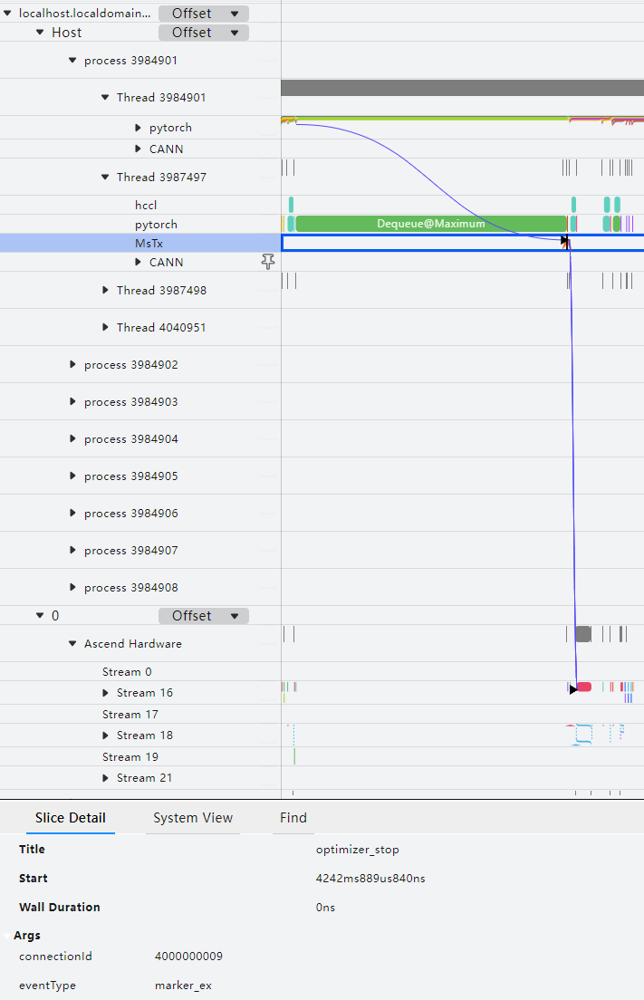

The mstx function collects performance data for communication operators, dataloader duration, and checkpoint saving interface duration by default. The data content formats are as follows:

- Format: \{"streamId": "\{pg streamId\}","count": "\{count\}","dataType": "\{dataType\}",\["srcRank": "\{srcRank\}"\],\["destRank": "\{destRank\}"\],"groupName": "\{groupName\}","opName": "\{opName\}"\}

- Example: \{"streamId": "32","count": "25701386","dataType": "fp16","groupName": "group\_name\_43","opName": "HcclAllreduce"\}

  - streamId: The Stream ID used to execute the marking task.
  - count: number of input data.
  - dataType: data type of the input data.
  - srcRank: Rank ID of the data sender in the communication domain. Only the hcclRecv operator has srcRank.
  - destRank: Rank ID of the data receiver in the communication domain. Only the hcclSend operator has destRank.
  - groupName: communication domain name.
  - opName: operator name.

- dataloader
- save\_checkpoint

In addition, the mstx function can also obtain performance data for the four key stages of the PyTorch model—dataloader, forward, step, and save_checkpoint—through **mstx\_torch\_plugin**. For details, see [mstx\_torch\_plugin](https://gitcode.com/Ascend/mstt/blob/26.0.0/profiler/example/mstx_torch_plugin/README.md).

This function allows you to view the execution scheduling of user-defined markers from the framework side to the CANN layer and then to the NPU side, helping identify key functions or events that users want to observe and locate performance issues.

For details about mstx collection result data, see [msproftx data description](https://gitcode.com/Ascend/msprof/blob/26.0.0/docs/en/user_guide/profile_data_file_references.md#msproftx-data-description).

### Profiling Environment Variables

### Function Description

When collecting performance data through the Ascend PyTorch Profiler interface, environment variable information is collected by default. The currently supported environment variables for collection are as follows:

- "ASCEND\_GLOBAL\_LOG\_LEVEL"
- "HCCL_RDMA_TC"
- "HCCL_RDMA_SL"
- "ACLNN_CACHE_LIMIT"

#### Precautions

None

#### Usage Example

1. Configure environment variables in the environment. Example:

    ```bash
    export ASCEND_GLOBAL_LOG_LEVEL=1
    export HCCL_RDMA_TC=0
    export HCCL_RDMA_SL=0
    export ACLNN_CACHE_LIMIT=4096
    ```

    Configure environment variables based on actual user requirements.

2. Execute the Ascend PyTorch Profiler interface for collection.

#### Output Description

- When the `export_type` parameter of `experimental_config` is set to `torch_npu.profiler.ExportType.Text`, the environment variable information configured in the preceding steps will be saved in the `profiler_metadata.json` file under the `{worker_name}_{timestamp}_ascend_pt` directory and in the `META_DATA` table of the `ascend_pytorch_profiler_{Rank_ID}.db` file.
- When the `export_type` parameter of `experimental_config` is set to `torch_npu.profiler.ExportType.Db`, the environment variable information is written to the `META_DATA` table in the `ascend_pytorch_profiler_{Rank_ID}`.db file.

### Mark Performance Data Profiling Process

#### Function Description

Marks the performance data collection process in the form of custom string keys and string values.

#### Precautions

None

#### Usage Example

```python
with torch_npu.profiler.profile(...)  as prof:
    prof.add_metadata(key, value)
```

`add_metadata and add_metadata_json` can be configured under `torch_npu.profiler.profile`. They must be added after profiler initialization and before finalize, that is, within the code of the performance data collection process.

**Table 1** add_metadata interface description

|Class/Function Name|Description|
|--|--|
|add_metadata|Adds a string tag. Values:<br>&#8226; *key*: String key.<br/>&#8226; *value*: String value.<br/>Example: prof.add_metadata("test_key1", "test_value1")|
|add_metadata_json|Adds a JSON-formatted string tag. Values:<br/>&#8226; *key*: String key.<br/>&#8226; *value*: String value in JSON format.<br/>Example: prof.add_metadata_json("test_key2", json.dumps({"key1": test_value1, "key2": test_value2}))|

#### Output Description

The metadata passed through this interface is written to the profiler_metadata.json file in the root directory of the Ascend PyTorch Profiler collection results.

### Device Memory Visualization

#### Function Description

This function classifies and visualizes the data occupied by the training process during model training when it consumes storage space. It primarily exports visualization files through the `export_memory_timeline` interface.

#### API Description

`export_memory_timeline` is used to export memory event information for a given device from the collected data and generate a timeline chart.

API parameters:

- output_path: Required parameter, specifies the exported result file, string type, configuration format: path = "{path}/{file_name}.html", where {path} is the result file path and {file_name} is the result file name. The path or file will be automatically created if it does not exist.
- device: Required parameter. Specifies the device ID (Device ID or Rank ID) to be exported. String type. Configuration format: device = "npu:{ID}". {ID} must be configured as an existing device ID in the collected data. Currently, only one value can be specified.

Using `export_memory_timeline`, you can export files in three formats, each controlled by the suffix of `output_path`:

- For plots compatible with HTML, use the suffix `.html`. The memory timeline plot will be embedded as a PNG file in the HTML file.
- For plot points consisting of [timestamp, [sizes by category]], where timestamp is the timestamp and sizes is the memory usage for each category. The memory timeline plot will be saved as a `.json` file or compressed `.json.gz`, depending on the suffix.
- For raw memory information, use the suffix `raw.json.gz`. Each raw memory event will consist of (timestamp, action, numbytes, category), where action is one of [PREEXISTING, CREATE, INCREMENT_VERSION, DESTROY], and category is one of [PARAMETER, OPTIMIZER_STATE, INPUT, TEMPORARY, ACTIVATION, GRADIENT, AUTOGRAD_DETAIL, UNKNOWN].

#### Precautions

To export an HTML file, you need to first install matplotlib in the Python environment and set the corresponding `torch_npu.profiler.profile` parameter to True. In addition, using this function will generate a data file with the suffix ascend_pt in the current directory.

#### Usage Example

The operation example is as follows:

```python
import torch
import torch_npu
...

def trace_handler(prof: torch_npu.profiler.profile):
    prof.export_memory_timeline(output_path="./memory_timeline.html", device="npu:0")

with torch_npu.profiler.profile(
    activities=[
        torch_npu.profiler.ProfilerActivity.CPU,
        torch_npu.profiler.ProfilerActivity.NPU
    ],
    schedule=torch_npu.profiler.schedule(wait=0, warmup=0, active=4, repeat=1, skip_first=0, skip_first_wait=0),
    on_trace_ready=trace_handler,
    record_shapes=True,           # Set to True
    profile_memory=True,          # Set to True
    with_stack=True,              # Either with_stack or with_modules is set to True
    with_modules=True
) as prof:
    for _ in range(steps):
        ...
        prof.step()
```

#### Output Result File Description

After collecting and exporting memory_timeline.html, the visualization effect is as follows:

**Figure 1** memory_timeline  
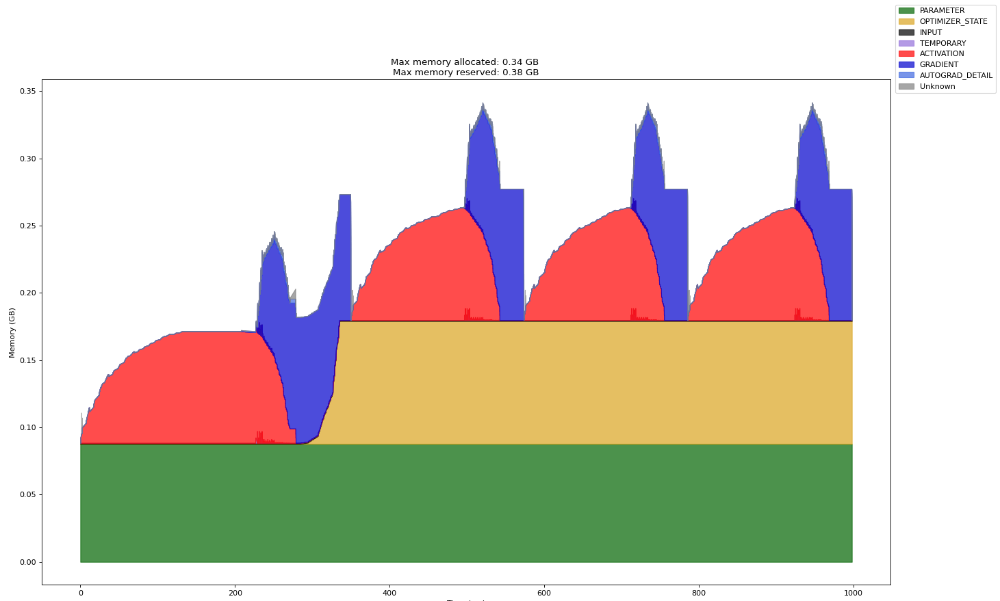

- Time (ms): The horizontal axis, representing the memory occupation time of the tensor type, in ms.
- Memory (GB): The vertical axis, representing the memory size occupied by the tensor type, in GB.
- Max memory allocated: The maximum total allocated memory, in GB.
- Max memory reserved: The maximum total reserved memory, in GB.
- PARAMETER: Model parameters and model weights.
- OPTIMIZER_STATE: Optimizer state. For example, the Adam optimizer records certain states during model training.
- INPUT: Input data.
- TEMPORARY: Temporary occupation, defined here as memory allocated and then released within a single operator, typically tensors that hold intermediate values.
- ACTIVATION: Activation values obtained during forward computation.
- GRADIENT: Gradient values.
- AUTOGRAD_DETAIL: Memory usage generated during the backward computation process.
- UNKNOWN: Unknown type.

### Create Profiler Sub-thread Profiling

#### Function Description

In inference scenarios, it is common to use a single process with multiple threads to call torch operators. In this case, because the Profiler cannot detect sub-threads created by the user, it also cannot collect framework-side data such as torch operators dispatched by these sub-threads. Therefore, the user needs to call the torch_npu.profiler.profile.enable_profiler_in_child_thread and torch_npu.profiler.profile.disable_profiler_in_child_thread interfaces in the created sub-threads to register the Profiler collection callback function and collect framework-side data such as torch operators dispatched by the sub-threads.

#### Precautions

None

#### Usage Example

The operation example is as follows:

```python
import threading
import torch
import torch_npu

# Inference model definition
...

def infer(device, child_thread):
    torch.npu.set_device(device)

    if child_thread:
        # Start collecting framework-side data such as torch operators for the sub-thread
        torch_npu.profiler.profile.enable_profiler_in_child_thread(with_modules=True)

    for _ in range(5):
        outputs = model(input_data)

    if child_thread:
        # Stop collecting framework-side data such as torch operators for the sub-thread
        torch_npu.profiler.profile.disable_profiler_in_child_thread()


if __name__ == "__main__":
    experimental_config = torch_npu.profiler._ExperimentalConfig(
        aic_metrics=torch_npu.profiler.AiCMetrics.PipeUtilization,
        profiler_level=torch_npu.profiler.ProfilerLevel.Level1
    )

    prof = torch_npu.profiler.profile(
        activities=[torch_npu.profiler.ProfilerActivity.CPU, torch_npu.profiler.ProfilerActivity.NPU],
        on_trace_ready=torch_npu.profiler.tensorboard_trace_handler("./result"),
        record_shapes=True,
        profile_memory=True,
        with_stack=False,
        with_flops=False,
        with_modules=True,
        experimental_config=experimental_config)

    prof.start()

    threads = []
    for i in range(1, 3):
        # Create two sub-threads to perform inference tasks on device1 and device2 respectively
        t = threading.Thread(target=infer, args=(i, True))
        t.start()
        threads.append(t)

    # The main thread runs the inference task on device0 and is collected normally by the Profiler, not through the enable_profiler_in_child_thread interface
    infer(0, False)

    for t in threads:
        t.join()

    prof.stop()
```

#### Output Result File Description

After sub-thread collection is completed, the generated sub-thread performance data is as follows:

**Figure 1**  Sub-thread performance data  
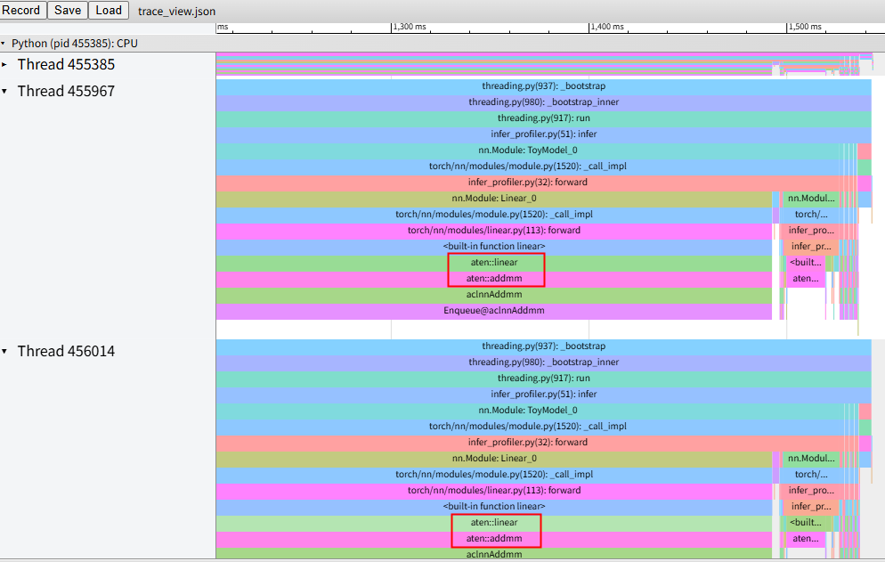

In the figure above, Thread 455385 is the main thread, which the Profiler can collect normally and does not need attention in this function scenario. The timeline with the "aten" prefix in the other two threads is the torch operator data collected by this function.

## Offline Parsing

### Function Description

When the performance data collected using the Ascend PyTorch Profiler interface is large, if the on_trace_ready interface is used directly in the current environment for automatic parsing, it may cause excessive resource usage and lag. In this case, you can cancel the on_trace_ready interface and set the disk storage directory using the environment variable ASCEND_WORK_PATH (for example: export ASCEND_WORK_PATH=xx/xx). After the performance data collection is complete, perform offline parsing.

### Precautions

None

### Usage Example

1. Create a *{file_name}*.py file, where *{file_name}* is customized, and edit the following code.

    ```python
    from torch_npu.profiler.profiler import analyse
    
    if __name__ == "__main__":
        analyse(profiler_path="./result_data", max_process_number=1, export_type=['text'])
    ```

    **Table 1** Parameter description

    | Parameter | Optional/Required | Description |
    | ------------------ | --------- | ------------------------------------------------------------ |
    | profiler_path | Required | PyTorch performance data path. The path format only supports strings consisting of letters, digits, and underscores. Soft links are not supported. The specified directory stores the PyTorch performance data directory {worker_name}\_{timestamp}_ascend_pt. |
    | max_process_number | Optional | Maximum number of processes for offline parsing. The value range is 1 to the number of CPU cores, and the default is half the number of CPU cores. If the setting exceeds the number of CPU cores in the environment, the number of CPU cores is automatically used. If an invalid value is set, the default value (half the number of CPU cores) is used. |
    | export_type | Optional | Sets the format of the exported performance data result file, of List type. Values:<br>&#8226; text: Parses into timeline and summary files in json and csv formats, as well as db format files (ascend_pytorch_profiler\_{Rank_ID}.db, analysis.db) that aggregate all performance data.<br>&#8226; db: Parses only into .db format files (ascend_pytorch_profiler_{Rank_ID}.db, analysis.db) that aggregate all performance data, displayed using the MindStudio Insight tool. Only supports export via the on_trace_ready interface and offline parsing export. Requires the installation of a Toolkit package that supports db format export.<br>If an invalid value is set or no configuration is made, the export_type field in profiler_info.json is read to determine the export format.<br>For details about the parsing result data, see [Output Result File Description](#output-result-file-description). |

    > [!NOTE]
    >
    > - The offline parsing interface supports parallel parsing of multiple performance data directories. When the performance data volume is large and there are many data directories, parsing may fail due to insufficient environment memory. In this case, you can control resource usage by customizing the maximum number of processes (max\_process\_number).
    >
    > - Parsing process logs are stored in the \{worker\_name\}\_\{timestamp\}\_ascend\_pt/logs directory.

2. After saving the file, execute the following command to parse the performance data:

    ```bash
    python3 {file_name}.py
    ```

3. View the performance data result files and performance data analysis.

    For details about the performance data result files, see [output result file description](#output-result-file-description).

    See [MindStudio Insight System Tuning](https://gitcode.com/Ascend/msinsight/blob/26.0.0/docs/en/user_guide/system_tuning.md) to visualize and analyze the parsed performance data files.

    You can use the [msprof-analyze](https://gitcode.com/Ascend/msprof-analyze/blob/26.0.0/docs/en/getting_started/quick_start.md) tool to assist in analyzing performance data.

## Output Result File Description

### Data Directory Description

The directory structure for performance data persistence is as follows:

- Directory structure when calling the tensorboard_trace_handler function:

  > [!NOTE]
  >
  >- The performance data files output by the PyTorch framework in this scenario are largely consistent. The data from both frameworks are introduced together below, with individual differences noted in comments.
  >- Users do not need to open the following data files for viewing. You can use the [MindStudio Insight](https://gitcode.com/Ascend/msinsight/blob/26.0.0/docs/en/user_guide/overview.md) tool to view and analyze performance data.
  >- If a StepID null value appears in kernel_details.csv, users can view the step information of that operator through the trace_view.json file, or re-collect Profiling data.
  >- The following data is collected based on the actual environment. If the corresponding conditions do not exist in the environment, the corresponding data or files will not be generated. For example, if the model has no AICPU operators, the corresponding data_preprocess.csv file will not be generated even if collection is performed.

  ```text
  └── localhost.localdomain_139247_20230628101435_ascend_pt    // Performance data result directory, naming format: {worker_name}_{timestamp}_ascend_{framework}. By default, {worker_name} is {hostname}_{pid}, {timestamp} is the timestamp, and {framework} is the abbreviation of the PyTorch framework (pt).
      ├── profiler_info_{Rank_ID}.json    // Used to record Profiler-related metadata. The file name does not display {Rank_ID} in the PyTorch single-card scenario.
      ├── profiler_metadata.json    // Used to store information added by users through the add_metadata API and other Profiler-related metadata
      ├── ASCEND_PROFILER_OUTPUT    // Data directory for performance data collected and parsed by the Ascend PyTorch Profiler API
      │   ├── analysis.db    // Generated by default in scenarios involving communication, such as multi-card or cluster PyTorch setups
      │   ├── task_time.csv    // Generated when the torch_npu.profiler.ProfilerActivity.NPU switch is enabled and profiler_level is configured to Level0, Level1, or Level2
      │   ├── api_statistic.csv    // Generated when profiler_level is configured to Level1 or Level2
      │   ├── ascend_pytorch_profiler_{Rank_ID}.db    // Generated by default in PyTorch scenarios. The filename does not display {Rank_ID} in single-card scenarios.
      │   ├── communication.json    // Generated in scenarios involving communication such as multi-card or cluster setups, providing a visual data foundation for performance analysis. Generated when profiler_level is configured to Level1 or Level2.
      │   ├── communication_matrix.json    // Generated in scenarios involving communication such as multi-card or cluster setups, providing a visual data foundation for performance analysis. This is the basic information file for small communication operators. Generated when profiler_level is configured to Level1 or Level2.
      │   ├── data_preprocess.csv    // Generated when profiler_level is configured to Level2.
      │   ├── hccs.csv    // Generated when sys_interconnection is configured to True.
      │   ├── kernel_details.csv    // Generated when activities is configured as NPU type
      │   ├── l2_cache.csv    // Generated when l2_cache is configured as True
      │   ├── memory_record.csv    // Generated when profile_memory is configured as True
      │   ├── nic.csv    // Generated when sys_io is configured as True
      │   ├── npu_module_mem.csv    // Generated when profile_memory is configured as True
      │   ├── operator_details.csv    // Generated by default
      │   ├── operator_memory.csv    // Generated when profile_memory is set to True
      │   ├── op_statistic.csv    // AI Core and AI CPU operator call count and duration data
      │   ├── pcie.csv    // Generated when sys_interconnection is set to True
      │   ├── roce.csv    // Generated when sys_io is set to True
      │   ├── step_trace_time.csv    // Time statistics of computation and communication in iterations
      │   ├── soc_pmu.csv    // Generated when torch_npu.profiler.ProfilerActivity.NPU and l2_cache switches are enabled
      │   └── trace_view.json    // Records the time information of the entire AI task
      ├── FRAMEWORK    // Raw performance data on the framework side, no need to pay attention
      ├── logs    // Parsing process logs
      └── PROF_000001_20230628101435646_FKFLNPEPPRRCFCBA    // Performance data at the CANN layer, naming format: PROF_{number}_{timestamp}_{string}. When data_simplification is set to True, only the raw performance data in this directory is retained, and other data is deleted.
            ├── analyze    // Generated when profiler_level is set to Level1 or Level2 in scenarios involving communication, such as multi-card or cluster environments.
            ├── device_{Rank_ID}    //  Raw performance data on the device side collected by CANN Profiling.
            ├── host    // Raw performance data on the host side collected by CANN Profiling.
            ├── mindstudio_profiler_log    // Log files parsed by CANN Profiling.
            └── mindstudio_profiler_output    // Performance data parsed by CANN Profiling
  ├── localhost.localdomain_139247_20230628101435_ascend_pt_op_arg    // PyTorch scenario operator information statistics file directory, generated when record_op_args is set to True
  ```

  The Ascend PyTorch Profiler interface associates and integrates framework-side data with CANN Profiling data to form performance data files such as trace, Kernel, and memory. These files are saved in the ASCEND_PROFILER_OUTPUT directory, including [timeline and summary data](#timeline-and-summary-data) in json and csv formats, [ascend_pytorch_profiler_{Rank_ID}.db data](#ascend_pytorch_profiler_rank_iddb-data), and [analysis.db data](#analysisdb-data).

  The PROF directory contains performance data collected by CANN Profiling, mainly saved in the mindstudio_profiler_output directory and the `msprof_*.db` file. For details about the data, see [Performance Data File Reference](https://gitcode.com/Ascend/msprof/blob/26.0.0/docs/en/user_guide/profile_data_file_references.md).

- When the `export_chrome_trace` method is called in the PyTorch scenario, the Ascend PyTorch Profiler interface writes the parsed trace data to a \*.json file, where \* is the file name. If the file does not exist, it is automatically created in the specified path.

### Timeline and Summary Data

**trace\_view.json**

**Figure 1**  trace\_view  
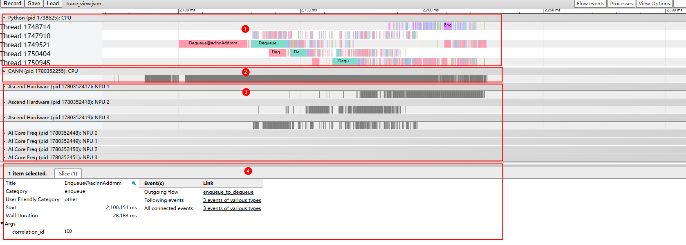

As shown in Figure 1, the trace data mainly displays the following areas:

- Area 1: Upper-layer application data, containing the duration information of upper-layer application operators.
- Area 2: CANN layer data, mainly including the time consumption data of AscendCL, GE, and Runtime components
- Area 3: Bottom-layer NPU data, mainly including the time consumption data of the Task Scheduler component, iteration trace data, and other Ascend AI processor system data.
- Area 4: Displays detailed information of each operator and API in the trace. Shown when clicking on individual trace events.

> [!NOTE]
>
>trace\_view.json can be opened using the MindStudio Insight tool, `chrome://tracing/`, and `https://ui.perfetto.dev/`.

**Figure 2**  trace\_view (record\_shapes)  


When record_shapes is enabled, the upper-layer application operators in trace_view will display Input Dims and Input type information.

**Figure 3** trace_view (with_stack)  
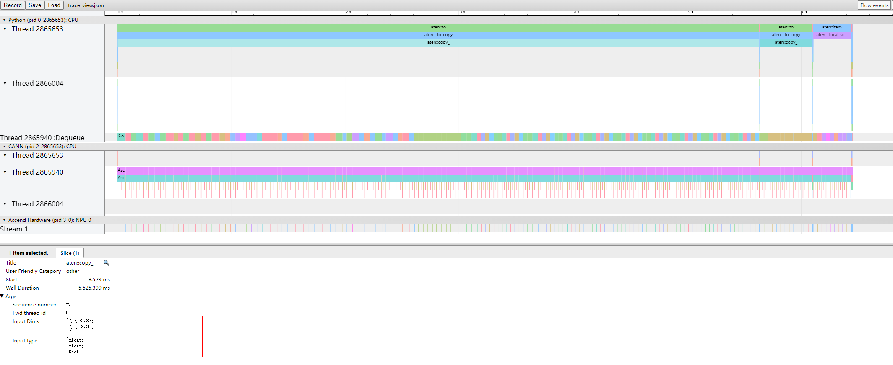

When with_stack is enabled, the upper-layer application operators in trace_view will display Call stack information.

**Figure 4** trace_view (GC)  
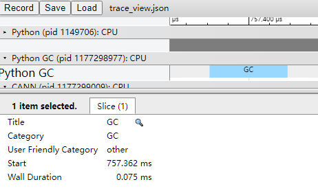

In the collection result of Figure 4, the time period of the Python GC layer is the duration of this GC execution.

During GC execution, the current process is blocked and must wait for GC to complete. If the GC time is too long, you can adjust GC parameters (for details, see [Garbage Collector](https://docs.python.org/3.14/library/gc.html) for gc.set_threshold) to mitigate process blocking caused by GC.

**kernel\_details.csv**

**Figure 5** kernel_details  
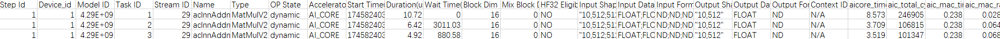

The file contains information about all operators executed on the NPU. If the user calls schedule on the frontend for Step marking, a Step Id field is added. However, if schedule has warmup set (not 0) and there are asynchronous operator execution operations after each Step during training or online inference, the operators executed during the warmup phase of these asynchronous operations may be collected, resulting in no Step Id field in kernel_details.csv.

The field information is shown in Table 1.

> [!NOTE]
>
> When the `aic_metrics` parameter of `experimental_config` is configured, the `kernel_details.csv` file will add corresponding fields based on the `aic_metrics` configuration of the `experimental_config` parameter. For details on the main additions, see [experimental_config parameter description](#experimental_config-parameter-description). For detailed descriptions of related fields in the file, see [op_summary (Operator Details)](https://gitcode.com/Ascend/msprof/blob/26.0.0/docs/en/user_guide/profile_data_file_references.md#op_summary-operator-details).

**Table 1** kernel\_details

|Field Name|Field Description|
|---|---|
|Step Id|Iteration ID.|
|Device_id|Device ID.|
|Model ID|Model ID.|
|Task ID|ID of the Task.|
|Stream ID|Stream ID where the Task resides.|
|Name|Operator name.|
|Type|Operator type.|
|OP State|Dynamic/static information of the operator. `dynamic` indicates a dynamic operator, `static` indicates a static operator. Communication operators do not have this state and display `N/A`. This field is reported only when `--task-time=l1`; it displays `N/A` when `--task-time=l0`.|
|Accelerator Core|AI acceleration core type, including AI Core, AI CPU, etc.|
|Start Time(us)|Operator execution start time, in us.|
|Duration(us)|Execution duration of the current operator, in us.|
|Wait Time(us)|Operator execution wait time, in us.|
|Block Num|Number of run splits, corresponding to the number of cores during task execution.|
|Mix Block Num|Some operators execute on both AI Core and Vector Core simultaneously. The Block Num of the primary accelerator is described in the Block Num field, and the Block Num of the secondary accelerator is described in this field. When `task_time` is `l0`, this field is not collected and displays `N/A`.<br>Supported only on Atlas A2 Training Series/Atlas A2 Inference Series and Atlas A3 Training Series/Atlas A3 Inference Series.|
|HF32 Eligible|Indicates whether the HF32 precision flag is used. `YES` indicates used, `NO` indicates not used.|
|Input Shapes|Operator input Shape.|
|Input Data Types|Operator input data type.|
|Input Formats|Operator input data format.|
|Output Shapes|Operator output Shape.|
|Output Data Types|Operator output data type.|
|Output Formats|Operator output data format.|

**memory\_record.csv**

**Figure 6** memory\_record  
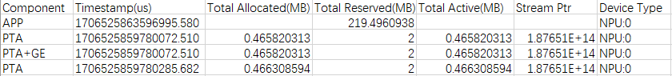

The file contains HBM usage records for PTA and GE, primarily recording the memory requested by components such as PTA and GE and the duration of usage. The field information is shown in [Table 2](#table2).

**Table 2**  memory_record<a name="table2"></a>

|Field Name|Field Description|
|--|--|
|Component|Components, including: PTA and GE components, APP process level, WORKSPACE (generated when the environment variable TASK_QUEUE_ENABLE=2 is configured before collecting performance data), etc.|
|Timestamp (µs)|Timestamp, recording the start time of HBM usage, in µs.|
|Total Allocated (MB)|Total memory allocated, in MB.|
|Total Reserved (MB)|Total memory reserved, in MB.|
|Total Active (MB)|Total memory requested by the stream (including unreleased memory reused by other streams), in MB.|
|Stream Ptr|Memory address of the AscendCL stream, used to mark different AscendCL streams.|
|Device Type|Device type and device ID, involving NPU only.|

**operator\_memory.csv**

**Figure 7**  operator_memory  
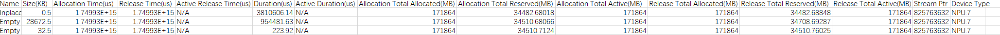

The file contains the memory usage details of operators, primarily recording the memory required for operator execution on the NPU and the occupation time. The memory is allocated by PTA and GE. The field information is shown in [Table 3](#table3).

> [!NOTE]
> 
> If negative or null values appear in the operator_memory.csv file, for detailed reasons, see the negative and null value description in [operator_memory (Memory Usage Details of CANN Operators)](https://gitcode.com/Ascend/msprof/blob/26.0.0/docs/en/user_guide/profile_data_file_references.md#operator_memory-details-about-memory-usage-of-cann-operators).

**Table 3** operator_memory<a name="table3"></a>

|Field Name|Field Description|
|--|--|
|Name|Operator name.|
|Size(KB)|Memory size occupied by the operator, in KB.|
|Allocation Time(us)|Tensor memory allocation time, in us.|
|Release Time(us)|Tensor memory release time, in us.|
|Active Release Time(us)|Time when the memory is actually returned to the memory pool, in us.|
|Duration(us)|Memory occupation time (Release Time - Allocation Time), in us.|
|Active Duration(us)|Actual memory occupation time (Active Release Time - Allocation Time), in us.|
|Allocation Total Allocated(MB)|Total allocated memory at the time of operator memory allocation (PTA memory when the Name operator name starts with aten, GE memory when the operator name starts with cann), in MB.|
|Allocation Total Reserved(MB)|Total reserved memory at the time of operator memory allocation (PTA memory when the Name operator name starts with aten, GE memory when the operator name starts with cann), in MB.|
|Allocation Total Active(MB)|Total memory requested by the current stream at the time of operator memory allocation (including unreleased memory reused by other streams), in MB.|
|Release Total Allocated(MB)|Total allocated memory at the time of operator memory release (PTA memory when the Name operator name starts with aten, GE memory when the operator name starts with cann), in MB.|
|Release Total Reserved(MB)|Total reserved memory at the time of operator memory release (PTA memory when the Name operator name starts with aten, GE memory when the operator name starts with cann), in MB.|
|Release Total Active(MB)|Total memory reused by other streams at the time of operator memory release (PTA memory when the Name operator name starts with aten, GE memory when the operator name starts with cann), in MB.|
|Stream Ptr|Memory address of the AscendCL stream, used to mark different AscendCL streams.|
|Device Type|Device type and device ID, involving NPU only.|

**npu\_module\_mem.csv**

**Figure 8** npu_module_mem  
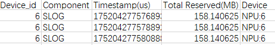

The npu_module_mem.csv data is automatically collected during the collection process. It contains component-level memory usage and mainly records the memory occupied by components at the current moment when they are executed on the NPU. The field information is shown in [Table 4](#table4).

**Table 4** npu\_module\_mem<a name="table4"></a>

|Field Name|Field Description|
|--|--|
|Device_id|Device ID.|
|Component|Component name.|
|Timestamp (µs)|Timestamp, indicating the memory occupied by the component at the current moment, in µs.|
|Total Reserved(MB)|Memory usage, in MB.|
|Device|Device type and device ID, involving only NPU.|

**operator\_details.csv**

**Figure 9** operator\_details  
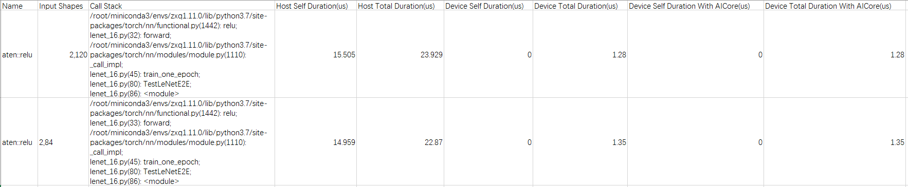

The operator\_details.csv file contains the information shown in [Table 5](#table5).

**Table 5** operator\_details<a name="table5"></a>

|Field|Description|
|--|--|
|Name|Operator name.|
|Input Shapes|Shape information.|
|Call Stack|Function call stack information. Controlled by the with_stack field.|
|Host Self Duration (µs)|Duration of the operator on the Host side (excluding other operators called internally), in µs.|
|Host Total Duration (µs)|Duration of the operator on the Host side, in µs.|
|Device Self Duration (µs)|Duration of the operator on the Device side (excluding other operators called internally), in µs.|
|Device Total Duration (µs)|Duration of the operator on the Device side, in µs.|
|Device Self Duration With AICore (µs)|Duration of the operator executed on the AI Core on the Device side (excluding internally called operators), in µs.|
|Device Total Duration With AICore (µs)|Duration of the operator executed on the AI Core on the Device side, in µs.|

**step\_trace\_time.csv**

**Figure 10** step\_trace\_time  
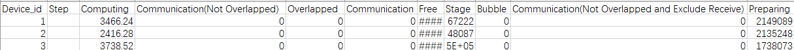

Time statistics for computation and communication within an iteration, containing the information shown in [Table 6](#table6).

**Table 6** step\_trace\_time<a name="table6"></a>

|Field|Description|
|--|--|
|Device_id|Device ID.|
|Step|Number of iterations.|
|Computing|Total computation time of operators on the NPU, in µs.|
|Communication (Not Overlapped)|Communication time, which is the total communication time minus the overlapping time between computation and communication, in µs.|
|Overlapped|Overlapping time between computation and communication, in µs. More overlap indicates better parallelism between computation and communication. Ideally, communication and computation are fully overlapped.|
|Communication|Total communication time of operators on the NPU, in µs.|
|Free|Total iteration time minus computation and communication time, in µs. This may include initialization, data loading, CPU computation, etc.|
|Stage|Stage time, representing the time excluding the receive operator time, in µs.|
|Bubble|Total receive time, in µs.|
|Communication (Not Overlapped and Exclude Receive)|Total communication time minus the overlapping time between computation and communication and the receive operator time, in µs.|
|Preparing|Time from the start of the iteration to the execution of the first computation or communication operator, in µs.|

**task\_time.csv**

The task_time.csv file records the scheduling duration of AI tasks during runtime. For examples and field descriptions, refer to [task_time (Task Scheduling Information)](https://gitcode.com/Ascend/msprof/blob/26.0.0/docs/en/user_guide/profile_data_file_references.md#task_time-task-scheduling-information). Actual results may vary slightly, so please refer to the actual situation.

**data\_preprocess.csv**

The data_preprocess.csv file records AI CPU data. For examples and field descriptions, refer to [aicpu (AI CPU Operator Detailed Duration)](https://gitcode.com/Ascend/msprof/blob/26.0.0/docs/en/user_guide/profile_data_file_references.md#aicpu-detailed-duration-of-aicpu-operators). Actual results may vary slightly, so please refer to the actual situation.

**l2\_cache.csv**

For examples and field descriptions, refer to [l2_cache (L2 Cache Hit Rate)](https://gitcode.com/Ascend/msprof/blob/26.0.0/docs/en/user_guide/profile_data_file_references.md#l2_cache-l2-cache-hit-ratio). Actual results may vary slightly, so please refer to the actual situation.

**op\_statistic.csv**

For examples and field descriptions, refer to [op_statistic (Operator Call Count and Duration)](https://gitcode.com/Ascend/msprof/blob/26.0.0/docs/en/user_guide/profile_data_file_references.md#op_statistic-operator-call-counts-and-durations). Actual results may vary slightly; please refer to the actual situation.

**api\_statistic.csv**

For examples and field descriptions, refer to the api_statistic_*.csv file description in [api_statistic (API Duration Statistics)](https://gitcode.com/Ascend/msprof/blob/26.0.0/docs/en/user_guide/profile_data_file_references.md#api_statistic-api-duration-statistics). Actual results may vary slightly; please refer to the actual situation.

**pcie.csv**

For examples and field descriptions, refer to the [pcie (PCIe bandwidth)](https://gitcode.com/Ascend/msprof/blob/26.0.0/docs/en/user_guide/profile_data_file_references.md#pcie-pcie-bandwidth) > pcie\_\*.csv file description. Actual results may vary slightly; please refer to the actual situation.

**hccs.csv**

For examples and field descriptions, refer to the [hccs (collective communication bandwidth)](https://gitcode.com/Ascend/msprof/blob/26.0.0/docs/en/user_guide/profile_data_file_references.md#hccs-collective-communication-bandwidth) > hccs\_\*.csv file description. Actual results may vary slightly; please refer to the actual situation.

**nic.csv**

For examples and field descriptions, refer to the [nic (network information per time node)](https://gitcode.com/Ascend/msprof/blob/26.0.0/docs/en/user_guide/profile_data_file_references.md#nic-nic-summary) > nic\_\*.csv file description. Actual results may vary slightly; please refer to the actual situation.

**roce.csv**

For examples and field descriptions, refer to [roce (RoCE communication interface bandwidth)](https://gitcode.com/Ascend/msprof/blob/26.0.0/docs/en/user_guide/profile_data_file_references.md#roce-roce-bandwidth) \> roce\_\*.csv file description. Actual results may vary slightly. Please refer to the actual results.

**soc\_pmu.csv**

For examples and field descriptions, refer to [soc_pmu (TLB hit rate)](https://gitcode.com/Ascend/msprof/blob/26.0.0/docs/en/user_guide/profile_data_file_references.md#soc_pmu-tlb-hit-rate). Actual results may vary slightly. Please refer to the actual results.

### ascend_pytorch_profiler_{Rank_ID}.db data

This file is a table structure file. It is recommended to use the MindStudio Insight tool for viewing, or you can directly open it using database development tools such as Navicat Premium. The performance data summarized in the current db file is as follows:

**STRING\_IDS**

Mapping table, used to store the mapping relationship between IDs and strings.

No switch. Records the String ID mapping relationship used on the CANN side, typically incrementing from 0.

**Table 1** Format

|Field Name|Type|Index|Description|
|--|--|--|--|
|id|INTEGER|Primary Key|ID corresponding to the string|
|value|TEXT|-|String content|

**PYTORCH\_API**

Framework-side API data, currently containing only torch_npu API data.

Controlled by the torch_npu.profiler.ProfilerActivity.CPU switch of the Ascend PyTorch Profiler interface.

**Table 2** Format

|Field Name|Type|Description|
|--|--|--|
|startNs|INTEGER|op API start time, in ns|
|endNs|INTEGER|op API end time, in ns|
|globalTid|INTEGER|The global tid to which this API belongs. Upper 32 bits: pid, lower 32 bits: tid|
|connectionId|INTEGER|Used to query the corresponding connectionId in the CONNECTION_IDS table; if there is no connectionId, this field is empty|
|name|INTEGER|The name of this op API, STRING_IDS(name)|
|sequenceNumber|INTEGER|op sequence number|
|fwdThreadId|INTEGER|op forward thread id|
|inputDtypes|INTEGER|Input data type, STRING_IDS(inputDtypes)|
|inputShapes|INTEGER|Input shape, STRING_IDS(inputShapes)|
|callchainId|INTEGER|Used to query the corresponding call stack information in the PYTORCH_CALLCHAINS table; if there is no stack information, this field is empty|
|type|INTEGER|Mark data type, op, queue, mstx, or python_trace. The data type is stored in the enumeration table ENUM_API_TYPE|

**CONNECTION\_IDS**

Association relationship data between framework-side APIs and themselves or with CANN APIs.

Controlled by the torch\_npu.profiler.ProfilerActivity.CPU switch of the Ascend PyTorch Profiler interface.

**Table 3** Format

|Field Name|Type|Description|
|--|--|--|
|id|INTEGER|Corresponds to the connectionId in the PYTORCH_API table|
|connectionId|INTEGER|ID used to represent association relationships, currently including three types: task_queue, fwd_bwd, and torch-cann-task|

**PYTORCH\_CALLCHAINS**

Stack information on the framework side.

Controlled by the with\_stack parameter of the Ascend PyTorch Profiler interface.

**Table 4** Format

|Field Name|Type|Description|
|--|--|--|
|id|INTEGER|Corresponds to the callchainId in the PYTORCH_API table|
|stack|INTEGER|Corresponds to the ID of the current stack's string content in the STRING_IDS table|
|stackDepth|INTEGER|Depth of the current stack|

**MEMORY\_RECORD**

Records the HBM usage on the framework side.

Controlled by the profile\_memory parameter of the Ascend PyTorch Profiler interface.

**Table 5** Format

|Field Name|Type|Description|
|--|--|--|
|component|INTEGER|ID corresponding to the component name (GE, PTA, PTA+GE) in the STRING_IDS table|
|timestamp|INTEGER|Timestamp|
|totalAllocated|INTEGER|Total memory allocated|
|totalReserved|INTEGER|Total memory reserved|
|totalActive|INTEGER|Total memory requested by the PTA stream|
|streamPtr|INTEGER|ascendcl stream address|
|deviceId|INTEGER|Device ID|

**OP\_MEMORY**

Operator memory usage information integrated based on MEMORY_RECORD on the framework side.

Controlled by the profile_memory parameter of the Ascend PyTorch Profiler interface.

**Table 6** Format

|Field Name|Type|Description|
|--|--|--|
|name|INTEGER|torch and GE operator name, STRING_IDS(name)|
|size|INTEGER|Memory size occupied by the operator, in Byte|
|allocationTime|INTEGER|Operator memory allocation time, in ns|
|releaseTime|INTEGER|Operator memory release time, in ns|
|activeReleaseTime|INTEGER|Time when memory is actually returned to the memory pool, in ns|
|duration|INTEGER|Memory occupation duration, in ns|
|activeDuration|INTEGER|Actual memory occupation duration, in ns|
|allocationTotalAllocated|INTEGER|Total PTA and GE memory allocated when the operator memory is allocated, in Byte|
|allocationTotalReserved|INTEGER|Total PTA and GE memory occupied when the operator memory is allocated, in Byte|
|allocationTotalActive|INTEGER|Total memory requested by the current stream when the operator memory is allocated, in Byte|
|releaseTotalAllocated|INTEGER|Total PTA and GE memory allocated when the operator memory is released, in Byte|
|releaseTotalReserved|INTEGER|Total PTA and GE memory occupied when the operator memory is released, in Byte|
|releaseTotalActive|INTEGER|Total memory requested by the current stream when the operator memory is released, in Byte|
|streamPtr|INTEGER|ascendcl stream address|
|deviceId|INTEGER|Device ID|

**RANK\_DEVICE\_MAP**

Mapping data between rankId and deviceId.

No corresponding switch; generated by default when exporting the ascend\_pytorch\_profiler\_\{Rank\_ID\}.db file.

**Table 7** Format

|Field Name|Type|Description|
|--|--|--|
|rankId|INTEGER|Node identifier ID in cluster scenarios. When displayed as -1, it indicates that rankId is not set.|
|deviceId|INTEGER|Device ID on the node. When displayed as -1, it indicates that deviceId is not collected.|

**STEP\_TIME**

Saves the step start time collected by Profiler.

Controlled by the parameters of the torch\_npu.profiler.schedule class of the Ascend PyTorch Profiler interface.

**Table 8** Format

|Field Name|Type|Description|
|--|--|--|
|id|INTEGER|Step ID value|
|startNs|INTEGER|Step start time, in ns|
|endNs|INTEGER|Step end time, in ns|

**GC\_RECORD**

Saves GC events collected by the Profiler.

Controlled by the gc\_detect\_threshold parameter of the Ascend PyTorch Profiler interface.

**Table 9** Format

|Field Name|Type|Meaning|
|--|--|--|
|startNs|INTEGER|GC event start time, in ns|
|endNs|INTEGER|GC event end time, in ns|
|globalTid|INTEGER|Global tid of the GC event|

**ROCE**

RoCE communication interface bandwidth data.

Control switch:

- `--sys-io-profiling` and `--sys-io-sampling-freq` of the msprof command
- `sys_io` of Ascend PyTorch Profiler

**Table 10** Format

| Field Name | Type | Description |
| -- | -- | -- |
| deviceId | INTEGER | device ID |
| timestampNs | INTEGER | local time, in ns |
| bandwidth | INTEGER | bandwidth, in Byte/s |
| rxPacketRate | NUMERIC | receive packet rate, in packet/s |
| rxByteRate | NUMERIC | receive byte rate, in Byte/s |
| rxPackets | INTEGER | cumulative received packets, in packet |
| rxBytes | INTEGER | cumulative received bytes, in Byte |
| rxErrors | INTEGER | cumulative receive error packets, in packet |
| rxDropped | INTEGER | cumulative receive dropped packets, in packet |
| txPacketRate | NUMERIC | transmit packet rate, in packet/s |
| txByteRate | NUMERIC | transmit byte rate, in Byte/s |
| txPackets | INTEGER | cumulative transmitted packets, in packet |
| txBytes | INTEGER | cumulative transmitted bytes, in Byte |
| txErrors | INTEGER | cumulative transmit error packets, in packet |
| txDropped | INTEGER | cumulative transmit dropped packets, in packet |
| funcId | INTEGER | port number |

**NIC**

Network information data at each time node.

Control switch:

- `--sys-io-profiling` and `--sys-io-sampling-freq` of the msprof command
- `sys_io` of Ascend PyTorch Profiler

**Table 11** Format

|Field Name|Type|Description|
|--|--|--|
|deviceId|INTEGER|Device ID|
|timestampNs|INTEGER|Local time, in ns|
|bandwidth|INTEGER|Bandwidth, in Byte/s|
|rxPacketRate|NUMERIC|Packet receive rate, in packet/s|
|rxByteRate|NUMERIC|Byte receive rate, in Byte/s|
|rxPackets|INTEGER|Total number of received packets, in packet|
|rxBytes|INTEGER|Total number of received bytes, in Byte|
|rxErrors|INTEGER|Total number of received error packets, in packet|
|rxDropped|INTEGER|Total number of received dropped packets, in packet|
|txPacketRate|NUMERIC|Packet transmit rate, in packet/s|
|txByteRate|NUMERIC|Byte transmit rate, in Byte/s|
|txPackets|INTEGER|Total number of transmitted packets, in packet|
|txBytes|INTEGER|Total number of transmitted bytes, in Byte|
|txErrors|INTEGER|Total number of transmitted error packets, in packet|
|txDropped|INTEGER|Total number of transmitted dropped packets, in packet|
|funcId|INTEGER|Port number|

**HCCS**

HCCS collective communication bandwidth data.

Control switch:

- `--sys-interconnection-profiling` and `--sys-interconnection-freq` of the msprof command
- `sys_interconnection` of Ascend PyTorch Profiler

**Table 12** Format

|Field Name|Type|Description|
|--|--|--|
|deviceId|INTEGER|device ID|
|timestampNs|INTEGER|local time, in ns|
|txThroughput|NUMERIC|transmit bandwidth, in Byte/s|
|rxThroughput|NUMERIC|receive bandwidth, in Byte/s|

**PCIE**

PCIe bandwidth data.

Control switch:

- `--sys-interconnection-profiling` and `--sys-interconnection-freq` options of the msprof command
- `sys_interconnection` of Ascend PyTorch Profiler

**Table 13** Format

|Field Name|Type|Description|
|--|--|--|
|deviceId|INTEGER|Device ID|
|timestampNs|INTEGER|Local time, in ns|
|txPostMin|NUMERIC|Minimum bandwidth of PCIe Post data transmission at the sender, in Byte/s|
|txPostMax|NUMERIC|Maximum bandwidth of PCIe Post data transmission at the sender, in Byte/s|
|txPostAvg|NUMERIC|Average bandwidth of PCIe Post data transmission at the sender, in Byte/s|
|txNonpostMin|NUMERIC|Minimum bandwidth of PCIe Non-Post data transmission at the sender, in Byte/s|
|txNonpostMax|NUMERIC|Maximum bandwidth of PCIe Non-Post data transmission at the sender, in Byte/s|
|txNonpostAvg|NUMERIC|Average bandwidth of PCIe Non-Post data transmission at the sender, in Byte/s|
|txCplMin|NUMERIC|Minimum completion packet received at the sender for write requests, in Byte/s|
|txCplMax|NUMERIC|Maximum completion packet received at the sender for write requests, in Byte/s|
|txCplAvg|NUMERIC|Average completion packet received at the sender for write requests, in Byte/s|
|txNonpostLatencyMin|NUMERIC|Minimum transmission latency in PCIe Non-Post mode at the sender, in ns|
|txNonpostLatencyMax|NUMERIC|Maximum transmission latency in PCIe Non-Post mode at the sender, in ns|
|txNonpostLatencyAvg|NUMERIC|Average transmission latency in PCIe Non-Post mode at the sender, in ns|
|rxPostMin|NUMERIC|Minimum bandwidth of PCIe Post data transmission at the receiver, in Byte/s|
|rxPostMax|NUMERIC|Maximum bandwidth of PCIe Post data transmission at the receiver, in Byte/s|
|rxPostAvg|NUMERIC|Average bandwidth of PCIe Post data transmission at the receiver, in Byte/s|
|rxNonpostMin|NUMERIC|Minimum bandwidth of PCIe Non-Post data transmission at the receiver, in Byte/s|
|rxNonpostMax|NUMERIC|Maximum bandwidth of PCIe Non-Post data transmission at the receiver, in Byte/s|
|rxNonpostAvg|NUMERIC|Average bandwidth of PCIe Non-Post data transmission at the receiver, in Byte/s|
|rxCplMin|NUMERIC|Minimum completion packet received at the receiver for write requests, in Byte/s|
|rxCplMax|NUMERIC|Maximum completion packet received at the receiver for write requests, in Byte/s|
|rxCplAvg|NUMERIC|Average completion packet received at the receiver for write requests, in Byte/s|

### analysis.db Data

This file is a table structure file. It is recommended to use the MindStudio Insight tool for viewing, or you can directly open it using database development tools such as Navicat Premium. The performance data summarized in the current db file is as follows:

**CommAnalyzerBandwidth**

**Table 1** Format

|Field Name|Type|Description|
|--|--|--|
|hccl_op_name|TEXT|Name of the communication macro operator, for example, hcom_broadcast__303_1_1|
|group_name|TEXT|Communication operator group|
|transport_type|TEXT|Transport type, including: LOCAL, SDMA, RDMA|
|transit_size|NUMERIC|Amount of data transmitted, in MB|
|transit_time|NUMERIC|Transmission duration, in ms|
|bandwidth|NUMERIC|Bandwidth, in GB/s|
|large_packet_ratio|NUMERIC|Ratio of large data packets|
|package_size|NUMERIC|Size of the communication data packet per transmission, in MB|
|count|NUMERIC|Number of communication transmissions|
|total_duration|NUMERIC|Total duration of data transmission|
|step|TEXT|The step to which the operator belongs, for example, step12|
|type|TEXT|Operator type, including: Collective, P2P|

**CommAnalyzerTime**

**Table 2** Format

|Field Name|Type|Description|
|--|--|--|
|hccl_op_name|TEXT|Name of the communication operator.|
|group_name|TEXT|Group of the communication operator.|
|start_timestamp|NUMERIC|Communication start timestamp, in us.|
|elapse_time|NUMERIC|Total communication duration of the operator, in ms.|
|transit_time|NUMERIC|Communication duration, in ms. Indicates the communication time of the communication operator. If the communication time is too long, there may be a problem with a certain link.|
|wait_time|NUMERIC|Wait time, in ms. Nodes need to synchronize before communication to ensure that the two communicating nodes are synchronized before communication begins.|
|synchronization_time|NUMERIC|Synchronization time, in ms. The time required for synchronization between nodes.|
|idle_time|NUMERIC|Idle time, in ms. Idle time (idle_time) = Total communication duration of the operator (elapse_time) - Communication duration (transit_time) - Wait time (wait_time).|
|step|TEXT|Step to which the operator belongs.|
|type|TEXT|Operator type, including: Collective, P2P.|

**CommAnalyzerMatrix**

**Table 3** Format

|Field Name|Type|Description|
|--|--|--|
|hccl_op_name|TEXT|Simplified operator name after matrix analysis, e.g., send-top1.|
|group_name|TEXT|Communication domain hash ID.|
|src_rank|TEXT|Rank ID of the sending data, e.g., 0.|
|dst_rank|TEXT|Rank ID of the receiving data, e.g., 1.|
|transport_type|TEXT|Transport type, including: LOCAL, SDMA, RDMA.|
|transit_size|NUMERIC|Amount of data transmitted, in MB.|
|transit_time|NUMERIC|Transmission duration, in ms.|
|bandwidth|NUMERIC|Bandwidth, in GB/s.|
|step|TEXT|Step to which the operator belongs, e.g., step12.|
|type|TEXT|Operator type, including: Collective, P2P.|
|op_name|TEXT|Original name of the operator, e.g., hcom_broadcast__303_1_1.|

**StepTraceTime**

**Table 4** Format

|Field Name|Type|Description|
|--|--|--|
|deviceId|INTEGER|Device ID|
|step|TEXT|Step number, for example, 12|
|computing|NUMERIC|Computation time, in ms|
|communication|NUMERIC|Communication time, in ms|
|overlapped|NUMERIC|Time spent on both computation and communication simultaneously, in ms|
|communication_not_overlapped|NUMERIC|Time spent purely on communication, in ms|
|free|NUMERIC|Idle time, in ms|
|stage|NUMERIC|Time within the step excluding data reception time, in ms|
|bubble|NUMERIC|Time within the step spent on data reception, in ms|
|communication_not_overlapped_and_exclude_receive|NUMERIC|Time spent purely on communication minus data reception time, in ms|

## Appendixes

### Ascend PyTorch Profiler API Description

**Table 1** `torch_npu.profiler.profile` and `torch_npu.profiler._KinetoProfile` configuration parameters

| Parameter | Optional/Required | Description |
| -- | -- | -- |
| activities | Optional | CPU and NPU event collection list, Enum type. Values: <br>&#8226; torch_npu.profiler.ProfilerActivity.CPU: Switch for framework-side data collection. <br>&#8226; torch_npu.profiler.ProfilerActivity.NPU: Switch for CANN software stack and NPU data collection. <br/>Both switches are enabled by default. |
| schedule | Optional | Sets the behavior for different steps, Callable type, controlled by the schedule class. No operation is performed by default. <br/>torch_npu.profiler._KinetoProfile does not support this parameter. |
| on_trace_ready | Optional | Automatically executes an operation when collection ends, Callable type. Currently supports executing the tensorboard_trace_handler function. When the amount of collected data is too large to directly parse performance data in the current environment, or when the training/online inference process is interrupted during collection and only partial performance data is collected, you can use [offline parsing](#offline-parsing). <br/>No operation is performed by default. <br/>torch_npu.profiler._KinetoProfile does not support this parameter. <br/>For multi-card large-scale cluster scenarios using shared storage, directly using on_trace_ready to execute the tensorboard_trace_handler function to write performance data to disk may cause performance inflation due to multi-card data being written directly to shared storage. For solutions, see [How to Avoid Performance Inflation Caused by Directly Writing Performance Data to Shared Storage in PyTorch Multi-Card Large Cluster Scenarios](#how-to-avoid-performance-inflation-caused-by-directly-writing-performance-data-to-shared-storage-in-pytorch-multi-card-large-cluster-scenarios). |
| record_shapes | Optional | Records the InputShapes and InputTypes of operators, Bool type. Values: <br/>&#8226; True: Enable. <br/>&#8226; False: Disable. <br/>Disabled by default. <br/>Takes effect when torch_npu.profiler.ProfilerActivity.CPU is enabled. |
| profile_memory | Optional | Records the HBM usage of operators, Bool type. Values: <br/>&#8226; True: Enable. <br/>&#8226; False: Disable. <br/>Disabled by default. <br/>When torch_npu.profiler.ProfilerActivity.CPU is enabled, collects framework HBM usage; when torch_npu.profiler.ProfilerActivity.NPU is enabled, collects CANN HBM usage. <br/>It is known that collecting memory data in environments with glibc < 2.34 may trigger a known glibc [Bug 19329](https://sourceware.org/bugzilla/show_bug.cgi?id=19329). This issue can be resolved by upgrading the glibc version of the environment. |
| with_stack | Optional | Records operator call stacks, Bool type. Includes call information at the framework layer and CPU operator layer. Values: <br/>&#8226; True: Enable. <br/>&#8226; False: Disable. <br/>Disabled by default. <br/>Takes effect when torch_npu.profiler.ProfilerActivity.CPU is enabled. <br/>Enabling this configuration introduces additional performance inflation. |
| with_modules | Optional | Records Python call stacks at the modules level, i.e., call information at the framework layer, Bool type. Values: <br/>&#8226; True: Enable. <br/>&#8226; False: Disable. <br/>Disabled by default. <br/>Takes effect when torch_npu.profiler.ProfilerActivity.CPU is enabled. <br/>Enabling this configuration introduces additional performance inflation. |
| with_flops | Optional | Records operator floating-point operations (this parameter does not currently support parsing performance data). Values: <br/>&#8226; True: Enable. <br/>&#8226; False: Disable. <br/>Disabled by default. <br/>Takes effect when torch_npu.profiler.ProfilerActivity.CPU is enabled. |
| experimental_config | Optional | Extended parameter, used to configure common collection items for performance analysis tools. For supported collection items and detailed descriptions, see [experimental_config Parameter Description](#experimental_config-parameter-description). |
| custom_trace_id_callback | Optional | Generates a trace_id to identify each Profiler data file. <br>For a usage example, see [torch_npu.profiler.profile](https://gitcode.com/Ascend/op-plugin/blob/26.0.0/docs/en/custom_APIs/torch_npu-profiler/torch_npu-profiler-profile.md) <br>The trace_id is output in the profiler\_metadata.json file. |

**Table 2** Description of `torch_npu.profiler.profile` and `torch_npu.profiler._KinetoProfile` methods

| Method | Description |
| -- | -- |
| step | Divides different iterations. torch_npu.profiler._KinetoProfile does not support this method. |
| export_chrome_trace | Exports trace. Writes trace data to the specified .json file. Trace is the execution time and correlation of operators and APIs displayed after the Ascend PyTorch Profiler interface integrates framework-side CANN software stack and NPU data. Includes parameters:<br>&#8226; *path*: Path to the trace file (.json). The path format for the specified file only supports strings consisting of letters, digits, and underscores, and does not support soft links. Required.<br>In multi-device scenarios, different file names need to be set for different devices.<br>Sample code:<br>`pid = os.getpid()`<br/>`prof.export_chrome_trace(f'./chrome_trace_{pid}.json')` |
| export_stacks | Exports stack information to a file. Includes parameters:<br>&#8226; *path*: Path for saving the stack file. The file name must be configured as "\*.log". A path can be specified, for example: /home/*.log. If only a file name is configured, the file is saved in the current directory. The path format only supports strings consisting of letters, digits, and underscores, and does not support soft links. Required.<br/>&#8226; metric: The chip type to save can be CPU or NPU, configured as "self_cpu_time_total" or "self_npu_time_total". Required.<br/>The position in the training/online inference script is the same as the export_chrome_trace method, as shown in the following example:<br/>`export_stacks('result_dir/stack.log', metric='self_npu_time_total')`<br/>The exported result file can be viewed using the FlameGraph tool. The operation method is as follows:<br/>`git clone https://github.com/brendangregg/FlameGraph`<br/>`cd FlameGraph`<br/>`./flamegraph.pl --title "NPU time" --countname "us." profiler.stacks > perf_viz.svg` |
| export_memory_timeline | For details, see [Device memory visualization](#device-memory-visualization). |
| start | Sets the position where collection starts. Refer to the following sample to add start and stop before and after the training/online inference code where performance data needs to be collected:<br/>`prof = torch_npu.profiler.profile(`<br/>`on_trace_ready=torch_npu.profiler.tensorboard_trace_handler("./result"))`<br/>`for step in range(steps):`<br/>`if step == 5:`<br/>`prof.start()`<br/>`train_one_step()`<br/>`if step == 5:`<br/>`prof.stop()` |
| stop | Sets the position where collection ends. start must be executed first. |
| enable_profiler_in_child_thread | Registers the Profiler collection callback function to collect framework-side data such as torch operators dispatched by user sub-threads. Other parameters of torch_npu.profiler.profile (including record_shapes, profile_memory, with_stack, with_flops, with_modules) can be additionally configured in this parameter as the collection configuration for the Profiler sub-thread.<br/>Used in pair with torch_npu.profiler.profile.enable_profiler_in_child_thread.<br/>For detailed usage, see [Create Profiler Sub-Thread Profiling](#create-profiler-sub-thread-profiling).<br/>torch_npu.profiler._KinetoProfile does not support this method. |
| disable_profiler_in_child_thread | Unregisters the Profiler collection callback function. Used in pair with torch_npu.profiler.profile.enable_profiler_in_child_thread. torch_npu.profiler._KinetoProfile does not support this method. |

**Table 3** Description of torch\_npu.profiler classes and functions

|Class/Function|Description|
|--|--|
|torch_npu.profiler.schedule|Sets the behavior of different steps. By default, this operation is not performed. To obtain more stable performance data, it is recommended to configure the specific parameters of this class. For parameter values and detailed usage, see [torch_npu.profiler.schedule Class Parameter Description](#torch_npuprofilerschedule-class-parameter-description).|
|torch_npu.profiler.tensorboard_trace_handler|Exports performance data. Values:<br/>&#8226; dir_name: Storage path for the collected performance data, string type. The path format only supports strings consisting of letters, digits, and underscores. Soft links are not supported. If no specific path is specified after configuring the tensorboard_trace_handler function, performance data is saved to the current directory by default. If on_trace_ready=torch_npu.profiler.tensorboard_trace_handler is not used in the code, the saved performance data is raw data, which requires [offline parsing](#offline-parsing). Optional. This function has a higher priority than ASCEND_WORK_PATH. For details, see [Environment Variable Reference](https://www.hiascend.com/document/detail/en/canncommercial/850/maintenref/envvar/envref_07_0001.html).<br/>&#8226; worker_name: Used to distinguish unique worker threads, string type. The default value is {hostname}\_{pid}. The path format only supports strings consisting of letters, digits, and underscores. Soft links are not supported. Optional.<br/>&#8226; analyse_flag: Switch for automatic parsing of performance data, bool type. Values: True (enable automatic parsing, default), False (disable automatic parsing. The collected performance data can be processed using [offline parsing](#offline-parsing)). Optional.<br/>&#8226; async_mode: Controls whether to enable asynchronous parsing (meaning the parsing process does not block the main AI task flow), bool type. Values: True (enable asynchronous parsing), False (disable asynchronous parsing, i.e., synchronous parsing, default).<br/>torch_npu.profiler.\_KinetoProfile does not support this function.<br/>Parsing process logs are stored in the {worker_name}\_{timestamp}_ascend_pt/logs directory.|
|torch_npu.profiler.ProfilerAction|Profiler state, Enum type. Values:<br/>&#8226; NONE: No action.<br/>&#8226; WARMUP: Performance data collection warm-up.<br/>&#8226; RECORD: Performance data collection.<br/>&#8226; RECORD_AND_SAVE: Collect and save performance data.|
|torch_npu.profiler._ExperimentalConfig|Performance data collection extension, Enum type. Called via experimental_config of torch_npu.profiler.profile. For detailed introduction, see [experimental_config Parameter Description](#experimental_config-parameter-description).|
|torch_npu.profiler.supported_activities|Queries the CPU and NPU events of the activities parameter currently supported for collection.|
|torch_npu.profiler.supported_profiler_level|Queries the profiler_level level of the experimental_config parameter currently supported.|
|torch_npu.profiler.supported_ai_core_metrics|Queries the AI Core performance metric collection items of the experimental_config parameter currently supported.|
|torch_npu.profiler.supported_export_type|Queries the performance data result file types of torch_npu.profiler.ExportType currently supported.|

### profiler_config.json File Description

The content of the profiler\_config.json file is as follows, using the default configuration as an example:

```json
{
    "activities": ["CPU", "NPU"],
    "prof_dir": "./",
    "analyse": false,
    "async_mode": false,
    "record_shapes": false,
    "profile_memory": false,
    "with_stack": false,
    "with_flops": false,
    "with_modules": false,
    "active": 1,
    "warmup": 0,
    "start_step": 0,
    "is_rank": false,
    "rank_list": [],
    "experimental_config": {
        "profiler_level": "Level0",
        "aic_metrics": "AiCoreNone",
        "l2_cache": false,
        "op_attr": false,
        "gc_detect_threshold": null,
        "data_simplification": true,
        "record_op_args": false,
        "export_type": ["text"],
        "mstx": false,
        "mstx_domain_include": [],
        "mstx_domain_exclude": [],
        "host_sys": [],
        "sys_io": false,
        "sys_interconnection": false
    }
}
```

**Table 1** Parameters

|Parameter|Optional/Required|Description|
|--|--|--|
|start_step|Required|Sets the step at which collection starts. The default value is 0 (no collection). When set to -1, collection starts at the next step after the configuration is saved. When set to a positive integer, collection starts when that step is reached.<br>To start the collection process, this parameter must be configured with a valid value.|
|activities|Optional|CPU and NPU event collection list. Values:<br/>&#8226; CPU: Switch for framework-side data collection.<br/>&#8226; NPU: Switch for CANN software stack and NPU data collection.<br/>By default, both switches are enabled.|
|prof_dir|Optional|Storage path for the collected performance data. Default path: ./. The path format only supports strings consisting of letters, digits, and underscores. Soft links are not supported.|
|analyse|Optional|Switch for automatic parsing of performance data. Values:<br/>&#8226; true: Enable automatic parsing.<br/>&#8226; false: Disable automatic parsing, i.e., manual parsing. The collected performance data can be used for [offline parsing](#offline-parsing).<br/>Disabled by default.|
|record_shapes|Optional|Records the InputShapes and InputTypes of operators. Values:<br/>&#8226; true: Enable.<br/>&#8226; false: Disable.<br/>Disabled by default.<br/>Takes effect when activities is set to CPU.|
|profile_memory|Optional|Records the device memory usage of operators. Values:<br/>&#8226; true: Enable.<br/>&#8226; false: Disable.<br/>Disabled by default.<br/>When activities enables CPU, framework memory usage is collected; when activities enables NPU, CANN device memory usage is collected.<br/>It is known that collecting memory data in environments with glibc < 2.34 may trigger a known glibc [Bug 19329](https://sourceware.org/bugzilla/show_bug.cgi?id=19329). This issue can be resolved by upgrading the glibc version of the environment.|
|with_stack|Optional|Records the operator call stack, including call information at the framework layer and CPU operator layer. Values:<br/>&#8226; true: Enable.<br/>&#8226; false: Disable.<br/>Disabled by default.<br/>Takes effect when activities is set to CPU.|
|with_flops|Optional|Records operator floating-point operations (this parameter does not support parsing performance data yet). Values:<br/>&#8226; true: Enable.<br/>&#8226; false: Disable.<br/>Disabled by default.<br/>Takes effect when activities is set to CPU.|
|with_modules|Optional|Records the Python call stack at the modules level, i.e., call information at the framework layer. Values:<br/>&#8226; true: Enable.<br/>&#8226; false: Disable.<br/>Disabled by default.<br/>Takes effect when activities is set to CPU.|
|active|Optional|Configures the number of iterations for collection. The value is a positive integer. Default value: 1.|
|warmup|Optional|Number of warmup steps. Default value: 0. It is recommended to set 1 warmup step.|
|is_rank|Optional|Enables collection for specified ranks. Values:<br/>&#8226; true: Enable.<br/>&#8226; false: Disable.<br/>Disabled by default.<br/>When enabled, dynamic_profile identifies the Rank IDs configured in the rank_list parameter and performs collection on the corresponding ranks existing in the environment. If enabled but rank_list is empty, no performance data is collected.<br/>When enabled, automatic parsing via analyse does not take effect, and [offline parsing](#offline-parsing) must be used.|
|rank_list|Optional|Configures the Rank IDs for collection. The value is an integer. Default value: empty, meaning no performance data is collected. Must be configured as valid Rank IDs in the environment. One or more ranks can be specified simultaneously. Configuration example: "rank_list": [1,2,3].|
|async_mode|Optional|Controls whether to enable asynchronous parsing (meaning the parsing process does not block the main AI task flow). Values:<br/>&#8226; true: Enable asynchronous parsing.<br/>&#8226; false: Disable asynchronous parsing, i.e., synchronous parsing.<br/>Disabled by default.|
|experimental_config|Optional|Extended parameters for configuring common collection items of the performance analysis tool. For details, see [experimental_config parameter description](#experimental_config-parameter-description).<br/>For dynamic collection scenarios, set the sub-parameter options of experimental_config in this configuration file to their actual parameter values, for example, "aic_metrics": "PipeUtilization".|
|metadata|Optional|Collects model hyperparameters (key) and configuration information (value).<br/>Saves data to the META_DATA table in ascend_pytorch_profiler\_{Rank_ID}.db and to the profiler_metadata.json file in the {worker_name}\_{timestamp}_ascend_pt directory.<br/>Configuration example:<br/>`"metadata": {`<br/>`"distributed_args":{`<br/>`"tp":2,`<br/>`"pp":4,`<br/>`"dp":8`<br/>`}`<br/>`}`|

### experimental_config Parameter Description (dynamic_profile scenario)

The experimental\_config parameters are all optional. The supported extended collection items are as follows:

**Table 1**  experimental\_config

|Parameter|Description|
|--|--|
|profiler_level|Collection level. Values:<br/>&#8226; Level_none: Does not collect data controlled by any level hierarchy, i.e., disables profiler_level.<br/>&#8226; Level0: Collects upper-layer application data, underlying NPU data, and operator information executed on the NPU. When this parameter is configured, only partial data is collected, and some operator information is not collected. For details, see [op_summary (Operator Detailed Information)](https://gitcode.com/Ascend/msprof/blob/26.0.0/docs/en/user_guide/profile_data_file_references.md#op_summary-operator-details).<br/>&#8226; Level1: On top of Level0, additionally collects CANN layer AscendCL data and AI Core performance metric information executed on the NPU, enables aic_metrics=torch_npu.profiler.AiCMetrics.PipeUtilization, and generates communication.json, communication_matrix.json, and api_statistic.csv files for communication operators.<br/>&#8226; Level2: On top of Level1, additionally collects CANN layer Runtime data and AI CPU (data_preprocess.csv file) data.<br/>Default value is Level0.|
|aic_metrics|AI Core performance metric collection items. Values:<br/>The result data of the following collection items will be displayed in Kernel View.<br/>For the meaning of the result data of the following collection items, see [op_summary (Operator Detailed Information)](https://gitcode.com/Ascend/msprof/blob/26.0.0/docs/en/user_guide/profile_data_file_references.md#op_summary-operator-details), but the specific collection results are subject to actual conditions.<br/>&#8226; AiCoreNone: Disables AI Core performance metric collection.<br/>&#8226; PipeUtilization: Proportion of time consumed by compute units and data transfer units.<br/>&#8226; ArithmeticUtilization: Proportion statistics of various compute metrics.<br/>&#8226; Memory: Proportion of external memory read/write instructions.<br/>&#8226; MemoryL0: Proportion of internal L0 memory read/write instructions.<br/>&#8226; ResourceConflictRatio: Proportion of pipeline queue instructions.<br/>&#8226; MemoryUB: Proportion of internal UB memory read/write instructions.<br/>&#8226; L2Cache: Number of read/write cache hits and reallocations after misses.<br/>&#8226; MemoryAccess: Bandwidth data volume of operator memory access on the core.<br/>When profiler_level is set to Level_none or Level0, the default value is AiCoreNone; when profiler_level is set to Level1 or Level2, the default value is PipeUtilization.|
|l2_cache|Controls the L2 Cache data collection switch. Values:<br/>&#8226; true: Enable.<br/>&#8226; false: Disable.<br/>Disabled by default.<br/>This collection item generates an l2_cache.csv file in ASCEND_PROFILER_OUTPUT. For result field descriptions, see [l2_cache (L2 Cache Hit Rate)](https://gitcode.com/Ascend/msprof/blob/26.0.0/docs/en/user_guide/profile_data_file_references.md#l2_cache-l2-cache-hit-ratio).|
|op_attr|Controls the switch for collecting operator attribute information. Currently, only aclnn operators are supported. Values:<br/>&#8226; true: Enable.<br/>&#8226; false: Disable.<br/>Disabled by default.<br/>This parameter does not take effect at Level_none.|
|gc_detect_threshold|GC detection threshold. Value range is a number greater than or equal to 0, in ms. When the threshold set by the user is a number, it indicates that GC detection is enabled, and only GC events exceeding the threshold are collected.<br/>When set to 0, all GC events are collected (which may result in an excessively large amount of collected data; configure with caution). It is recommended to set it to 1ms.<br/>Default is null, indicating that the GC detection function is not enabled.<br/>**GC** is the memory reclamation of destroyed objects by the Python process.<br/>The parsing result of this parameter generates a GC layer in trace_view.json or a GC_RECORD table in ascend_pytorch_profiler_{Rank_ID}.db.|
|data_simplification|Data simplification mode. When enabled, redundant data is deleted after exporting performance data, retaining only profiler_*.json files, the ASCEND_PROFILER_OUTPUT directory, raw performance data in the PROF_XXX directory, the FRAMEWORK directory, and the logs directory to save storage space. Values:<br/>&#8226; true: Enable.<br/>&#8226; false: Disable.<br/>Enabled by default.|
|record_op_args|Controls the operator information statistics function switch. Values:<br/>&#8226; true: Enable.<br/>&#8226; false: Disable.<br/>Disabled by default.<br/>When enabled, collected operator information files are output in the {worker_name}_{timestamp}_ascend_pt_op_args directory.<br/>This parameter is used for tuning in PyTorch training scenarios executed by the AOE tool, and it is not recommended to enable it simultaneously with other performance data collection interfaces. For detailed introduction, see [AOE Tuning Tool User Guide](https://www.hiascend.com/document/detail/en/canncommercial/850/devaids/aoe/auxiliarydevtool_aoe_0001.html).|
|export_type|Sets the format of the exported performance data result file, List type. Values:<br/>&#8226; text: Indicates parsing into timeline and summary files in json and csv formats, as well as db format files (ascend_pytorch_profiler_{Rank_ID}.db, analysis.db) that aggregate all performance data.<br/>&#8226; db: Indicates parsing only into .db format files (ascend_pytorch_profiler_{Rank_ID}.db, analysis.db) that aggregate all performance data, displayed using the MindStudio Insight tool. Only supports export via the on_trace_ready interface and offline parsing export.<br/>If an invalid value is set or not configured, the default value text is used.<br/>For parsing result data, see [Output Result File Description](#output-result-file-description).|
|mstx or msprof_tx|Marker control switch, enabling custom marking functionality via the switch. Values:<br/>&#8226; true: Enable.<br/>&#8226; false: Disable.<br/>Disabled by default.<br/>For usage of this parameter, see [Profile and Parse mstx Data](#profile-and-parse-mstx-data).<br/>The original parameter name msprof_tx has been changed to mstx, and the new version remains compatible with the original parameter name msprof_tx.|
|mstx_domain_include|Outputs the required domain data. When calling the torch_npu.npu.mstx series marking interfaces and using the default domain or a specified domain for marking, you can choose to output only the domain data configured by this parameter.<br/>The domain name is the domain passed in by the user when calling the torch_npu.npu.mstx series interfaces or the default domain ('default'). Domain names are input using the List type.<br/>Mutually exclusive with the mstx_domain_exclude parameter. If both are configured, only mstx_domain_include takes effect.<br/>mstx=True must be configured.|
|mstx_domain_exclude|Filters out unwanted domain data. When calling the torch_npu.npu.mstx series marking interfaces and using the default domain or a specified domain for marking, you can choose not to output the domain data configured by this parameter.<br/>The domain name is the domain passed in by the user when calling the torch_npu.npu.mstx series interfaces or the default domain ('default'). Domain names are input using the List type.<br/>Mutually exclusive with the mstx_domain_include parameter. If both are configured, only mstx_domain_include takes effect.<br/>mstx=True must be configured.|
|host_sys|Host-side system data collection switch, List type. Not configured by default, indicating that Host-side system data collection is not enabled. Values:<br/>&#8226; cpu: Process-level CPU utilization.<br/>&#8226; mem: Process-level memory utilization.<br/>&#8226; disk: Process-level disk I/O utilization.<br/>&#8226; network: System-level network I/O utilization.<br/>&#8226; osrt: Process-level syscall and pthreadcall.<br/>Configuration example: host_sys: ["cpu", "disk"].<br/>&#8226; Collecting Host-side disk performance data requires installing the third-party open-source tool iotop. Collecting osrt performance data requires installing the third-party open-source tools perf and ltrace. For installation methods, see [Installing perf, iotop, and ltrace Tools](https://www.hiascend.com/document/detail/en/canncommercial/850/devaids/profiling/atlasprofiling_16_0136.html). After installation, user permissions must be configured as described in [Configuring User Permissions](https://www.hiascend.com/document/detail/en/canncommercial/850/devaids/profiling/atlasprofiling_16_0137.html), and reconfiguration is required each time the CANN software package is reinstalled.<br/>&#8226; Using the open-source tool ltrace to collect osrt performance data will cause high CPU usage, which is related to the pthread locking/unlocking of the application project and will affect the process running speed.<br/>&#8226; The osrt parameter is supported on the KylinV10SP1 operating system with x86_64 architecture, but not on the KylinV10SP1 operating system with aarch64 architecture.<br/>&#8226; The network parameter is not supported on the virtualized environment Euler2.9 system.|
|sys_io|NIC, ROCE, MAC collection switch. Values:<br/>&#8226; true: Enable.<br/>&#8226; false: Disable.<br/>Disabled by default.|
|sys_interconnection|Collective communication bandwidth data (HCCS), PCIe data collection switch, inter-chip transmission bandwidth information collection switch. Values:<br/>&#8226; true: Enable.<br/>&#8226; false: Disable.<br/>Disabled by default.|

### experimental_config Parameter Description

The experimental\_config parameters are all optional and support the following extended collection items:

**Table 1**  experimental\_config

|Parameter|Description|
|--|--|
|export_type|Sets the format of the exported performance data result file, of List type. Values: <br/>• torch_npu.profiler.ExportType.Text: Indicates parsing into timeline and summary files in .json and .csv formats, as well as .db format files (ascend_pytorch_profiler\_{Rank_ID}.db, analysis.db) that aggregate all performance data. <br/>• torch_npu.profiler.ExportType.Db: Indicates parsing only into .db format files (ascend_pytorch_profiler_{Rank_ID}.db, analysis.db) that aggregate all performance data, for display using the MindStudio Insight tool. Only supported for export via the on_trace_ready interface and [offline parsing](#offline-parsing). <br/>If an invalid value is set or no configuration is provided, the default value torch_npu.profiler.ExportType.Text is used. <br/>For details on the parsed result data, see [output result file description](#output-result-file-description).|
|profiler_level|The Level of collection, of Enum type. Values: <br/>• torch_npu.profiler.ProfilerLevel.Level_none: Does not collect data controlled by any Level hierarchy, i.e., disables profiler_level. <br/>• torch_npu.profiler.ProfilerLevel.Level0: Collects upper-layer application data, lower-layer NPU data, and information on operators executed on the NPU. When this parameter is configured, only partial data is collected, and some operator information is not collected. For details, see the description regarding task_time being l0 in [op_summary (Operator Details)](https://gitcode.com/Ascend/msprof/blob/26.0.0/docs/en/user_guide/profile_data_file_references.md#op_summary-operator-details). <br/>• torch_npu.profiler.ProfilerLevel.Level1: In addition to Level0, collects CANN layer AscendCL data and AI Core performance metric information executed on the NPU, enables aic_metrics=torch_npu.profiler.AiCMetrics.PipeUtilization, and generates communication.json, communication_matrix.json, and api_statistic.csv files for communication operators. <br/>• torch_npu.profiler.ProfilerLevel.Level2: In addition to Level1, collects CANN layer Runtime data and AI CPU (data_preprocess.csv file) data. <br/>The default value is torch_npu.profiler.ProfilerLevel.Level0.|
|mstx or msprof_tx|Mark control switch. Enables the custom mark function via this switch, of bool type. Values: <br/>• True: Enable. <br/>• False: Disable. <br/>Disabled by default. <br/>For usage of this parameter, see [Profile and Parse mstx Data](#profile-and-parse-mstx-data). The original parameter name msprof_tx has been changed to mstx, but the new version remains compatible with the original parameter name msprof_tx.|
|mstx_domain_include|Outputs the required domain data. When calling the [torch_npu.npu.mstx](https://gitcode.com/Ascend/op-plugin/blob/26.0.0/docs/en/custom_APIs/torch_npu-npu/torch_npu-npu-mstx.md) series of mark interfaces and using the default domain or a specified domain for marking, you can choose to output only the domain data configured by this parameter. <br/>The domain name is the domain passed in by the user when calling the torch_npu.npu.mstx series interfaces or the default domain ('default'). The domain name is input as a List type. <br/>This parameter is mutually exclusive with mstx_domain_exclude. If both are configured, only mstx_domain_include takes effect. <br/>mstx=True must be configured.|
|mstx_domain_exclude|Filters out unwanted domain data. When calling the [torch_npu.npu.mstx](https://gitcode.com/Ascend/op-plugin/blob/26.0.0/docs/en/custom_APIs/torch_npu-npu/torch_npu-npu-mstx.md) series of mark interfaces and using the default domain or a specified domain for marking, you can choose not to output the domain data configured by this parameter. <br/>The domain name is the domain passed in by the user when calling the torch_npu.npu.mstx series interfaces or the default domain ('default'). The domain name is input as a List type. <br/>This parameter is mutually exclusive with mstx_domain_include. If both are configured, only mstx_domain_include takes effect. <br/>mstx=True must be configured.|
|aic_metrics|AI Core performance metric collection items. Values: <br/>The result data for the following collection items will be displayed in Kernel View. <br/>For the meaning of the result data for the following collection items, see [op_summary (Operator Details)](https://gitcode.com/Ascend/msprof/blob/26.0.0/docs/en/user_guide/profile_data_file_references.md#op_summary-operator-details), but the specific collection results are subject to actual conditions. <br/>• AiCoreNone: Disables AI Core performance metric collection. <br/>• PipeUtilization: The proportion of time consumed by compute units and data transfer units. <br/>• ArithmeticUtilization: Statistics on the proportion of various compute-related metrics. <br/>• Memory: The proportion of external memory read/write instructions. <br/>• MemoryL0: The proportion of internal L0 memory read/write instructions. <br/>• ResourceConflictRatio: The proportion of pipeline queue instructions. <br/>• MemoryUB: The proportion of internal UB memory read/write instructions. <br/>• L2Cache: The number of read/write cache hits and reallocations after misses. <br/>• MemoryAccess: The bandwidth data volume of memory access on the core by the operator. <br/>When profiler_level is set to torch_npu.profiler.ProfilerLevel.Level_none or torch_npu.profiler.ProfilerLevel.Level0, the default value is AiCoreNone; when profiler_level is set to torch_npu.profiler.ProfilerLevel.Level1 or torch_npu.profiler.ProfilerLevel.Level2, the default value is PipeUtilization.|
|l2_cache|Controls the L2 Cache data collection switch, of bool type. Values: <br/>• True: Enable. <br/>• False: Disable. <br/>Disabled by default. <br/>This collection item generates an l2_cache.csv file in ASCEND_PROFILER_OUTPUT. For an introduction to the result fields, see [l2_cache (L2 Cache Hit Rate)](https://gitcode.com/Ascend/msprof/blob/26.0.0/docs/en/user_guide/profile_data_file_references.md#l2_cache-l2-cache-hit-ratio).|
|op_attr|Controls the switch for collecting operator attribute information. Currently, only supports collecting aclnn operators, of bool type. Values: <br/>• True: Enable. <br/>• False: Disable. <br/>Disabled by default. <br/>The performance data collected by this parameter only takes effect for db format files; when torch_npu.profiler.ProfilerLevel.Level_none is set, this parameter does not take effect.|
|data_simplification|Data simplification mode. When enabled, redundant data will be deleted after exporting performance data, retaining only profiler_*.json files, the ASCEND_PROFILER_OUTPUT directory, the original performance data in the PROF_XXX directory, the FRAMEWORK directory, and the logs directory to save storage space, of bool type. Values: <br/>• True: Enable. <br/>• False: Disable. <br/>Enabled by default.|
|record_op_args|Controls the switch for the operator information statistics function, of bool type. Values: <br/>• True: Enable. <br/>• False: Disable. <br/>Disabled by default. <br/>When enabled, the collected operator information files will be output in the {worker_name}\_{timestamp}_ascend_pt_op_args directory. <br/>This parameter is used when the AOE tool performs tuning in PyTorch training scenarios, and it is not recommended to enable it simultaneously with other performance data collection interfaces. For detailed introduction, see [AOE Tuning Tool User Guide](https://www.hiascend.com/document/detail/en/canncommercial/850/devaids/aoe/auxiliarydevtool_aoe_0001.html).|
|gc_detect_threshold|GC detection threshold, of float type. The value range is a number greater than or equal to 0, in ms. When the threshold set by the user is a number, it indicates that GC detection is enabled, and only GC events exceeding the threshold are collected. <br/>When configured as 0, it indicates collecting all GC events (which may result in an excessively large amount of collected data; please configure with caution). It is recommended to set it to 1 ms. <br/>The default is None, indicating that the GC detection function is not enabled. <br/>**GC** is the memory reclamation of destroyed objects by the Python process. <br/>The parsing result of this parameter is the generation of a GC layer in trace_view.json or a GC_RECORD table in ascend_pytorch_profiler_{Rank_ID}.db.|
|host_sys|Host-side system data collection switch, of List type. By default, it is not configured, indicating that Host-side system data collection is not enabled. Values: <br/>• torch_npu.profiler.HostSystem.CPU: Process-level CPU utilization. <br/>• torch_npu.profiler.HostSystem.MEM: Process-level memory utilization. <br/>• torch_npu.profiler.HostSystem.DISK: Process-level disk I/O utilization. <br/>• torch_npu.profiler.HostSystem.NETWORK: System-level network I/O utilization. <br/>• torch_npu.profiler.HostSystem.OSRT: Process-level syscall and pthreadcall. <br/>Configuration example: host_sys=[torch_npu.profiler.HostSystem.CPU, torch_npu.profiler.HostSystem.MEM] <br/>• Collecting Host-side disk performance data requires installing the third-party open-source tool iotop, and collecting osrt performance data requires installing the third-party open-source tools perf and ltrace. For installation methods, see [Installing perf, iotop, and ltrace Tools](https://www.hiascend.com/document/detail/en/canncommercial/850/devaids/profiling/atlasprofiling_16_0136.html), you must complete user permission configuration as described in [Configuring User Permissions](https://www.hiascend.com/document/detail/en/canncommercial/850/devaids/profiling/atlasprofiling_16_0137.html), and this configuration must be redone each time the CANN software package is reinstalled. <br/>• Using the open-source tool ltrace to collect osrt performance data will cause high CPU usage, which is related to the pthread locking and unlocking of the application project and will affect the process running speed. <br/>• The torch_npu.profiler.HostSystem.OSRT parameter is supported on the KylinV10SP1 operating system with x86_64 architecture, but not on the KylinV10SP1 operating system with aarch64 architecture. <br/>• The torch_npu.profiler.HostSystem.NETWORK parameter is not supported on the virtualized environment Euler2.9 system.|
|sys_io|NIC, ROCE, and MAC collection switch, of bool type. Values: <br/>• True: Enable. <br/>• False: Disable. <br/>Disabled by default.|
|sys_interconnection|Collective communication bandwidth data (HCCS), PCIe data collection switch, and inter-chip transmission bandwidth information collection switch, of bool type. Values: <br/>• True: Enable. <br/>• False: Disable. <br/>Disabled by default.|

### torch_npu.profiler.schedule Class Parameter Description

The torch_npu.profiler.schedule class is used to set the collection behavior at different steps during the collection process. The interface prototype is:

```python
torch_npu.profiler.schedule(wait, active, warmup = 0, repeat = 0, skip_first = 0, skip_first_wait = 0)
```

**Table 1** Parameter description

| Parameter | Optional/Required | Description |
| -- | -- | -- |
| wait | Required | Number of steps to skip before each repeated collection, int type. |
| active | Required | Number of steps for collection, int type. |
| warmup | Optional | Number of warmup steps, int type. Default value is 0. It is recommended to set 1 warmup step. |
| repeat | Optional | Number of times to repeat wait + warmup + active, int type. The value range is an integer greater than or equal to 0, and the default value is 0.<br>When using the cluster analysis tool or MindStudio Insight for viewing, it is recommended to configure repeat = 1 (indicating execution once, generating only one copy of performance data), because:<br>&#8226; If repeat > 1, multiple copies of performance data will be generated in the same directory. In this case, you need to manually divide the collected performance data folders into repeat equal parts, place them in different folders, and re-parse them. The classification method is based on the chronological order of the timestamps in the folder names.<br>&#8226; If repeat = 0, the specific number of repetitions is determined by the total number of training steps. For example, if the total number of training steps is 100, wait + active + warmup = 10, and skip_first = 10, then repeat = (100 - 10) / 10 = 9, indicating that it is repeated 9 times, generating 9 copies of performance data. |
| skip_first | Optional | Number of steps to skip before collection, int type. Default value is 0. For dynamic shape scenarios, it is recommended to skip the first 10 steps to ensure stable performance data; for other scenarios, you can configure it according to the actual situation. |
| skip_first_wait | Optional | Skip the first wait during collection, int type. Default value is 0, indicating that this parameter function is disabled. When configured with a non-zero int value, it indicates that this parameter function is enabled.<br>When this parameter function is enabled, the first wait of the wait parameter will be canceled, that is, the next action will be executed directly at the first step in the first repeat, but it will still be executed normally after the second repeat. This can be used to save collection time. |

> [!NOTE]
>
> It is recommended to configure the schedule according to this formula: total number of steps >= skip_first + (wait + warmup + active) * repeat

The relationship diagram of the `torch_npu.profiler.schedule` class, step, and `on_trace_ready` function is as follows:

**Figure 1** Relationship diagram of the `torch_npu.profiler.schedule` class, step, and `on_trace_ready` function  
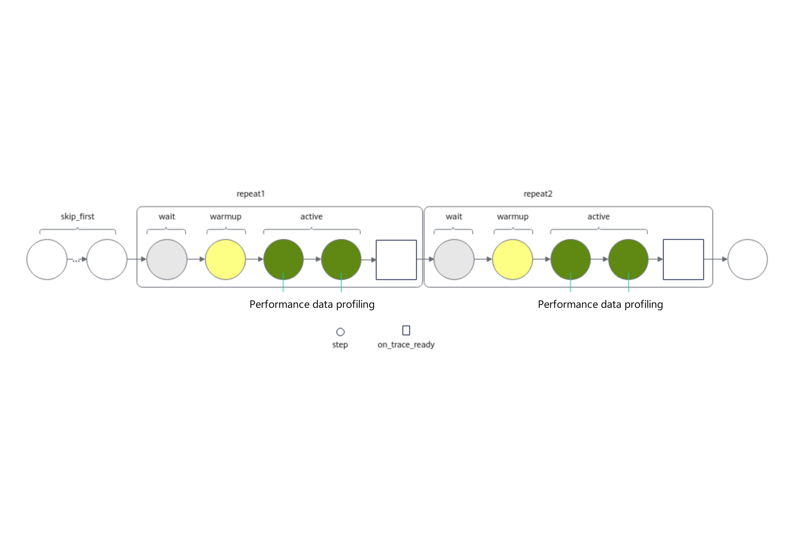

The sample configuration code is as follows:

```python
with torch_npu.profiler.profile(
    activities=[
        torch_npu.profiler.ProfilerActivity.CPU,
        torch_npu.profiler.ProfilerActivity.NPU,
    ],
    schedule=torch_npu.profiler.schedule(
        wait=2,                        # Wait phase, skip 2 steps
        warmup=1,                      # Warm-up phase, skip 1 step
        active=2,                      # Record activity data for 2 steps, and call on_trace_ready afterwards
        repeat=2,                      # Loop the wait+warmup+active process 2 times
        skip_first=1,                  # Skip 1 step
        skip_first_wait=1            # Skip the first wait
    ),
    on_trace_ready=torch_npu.profiler.tensorboard_trace_handler('./result')
    ) as prof:
        for _ in range(9):
            train_one_step()
            prof.step()                # Notify the profiler that a step is complete
```

### dynamic_profile Debugging Logs

The dynamic_profile dynamic collection mode automatically records dynamic_profile debugging logs in the profiler_config_path directory. An example of the generated log directory structure is as follows:

```text
profiler_config_path/
├── log
│    ├── dp_ubuntu_xxxxxx_rank_*.log
│    ├── dp_ubuntu_xxxxxx_rank_*.log.1
│    ├── monitor_dp_ubuntu_xxxxxx_rank_*.log
│    ├── monitor_dp_ubuntu_xxxxxx_rank_*.log.1
├── profiler_config.json
└── shm
```

- `dp_ubuntu_xxxxxx.log`: The execution log of `dynamic_profile`, recording all actions (INFO), warnings (WARNING), and errors (ERROR) during the dynamic collection process. File naming format: dp_{operating system}_{AI task process ID}_{Rank_ID}.log.

    When an AI task starts, each Rank starts an AI task process. dynamic_profile generates log files for each AI task process based on its process ID.

- `dp_ubuntu_xxxxxx.log.1`: Log aging backup file. The storage limit for the `dp_ubuntu_xxxxxx.log` file is 200 KB. When the limit is reached, the oldest log records are transferred to `dp_ubuntu_xxxxxx.log.1`. The storage limit for the `dp_ubuntu_xxxxxx.log.1` file is also 200 KB. When this limit is reached, the oldest log records are aged and deleted.
- `monitor_dp_ubuntu_xxxxxx.log`: The `profiler_config.json` file modification log. After enabling dynamic_profile, it records in real time each modification time of the `profiler_config.json` file, whether the modification takes effect, and the termination of the dynamic_profile process. An example is as follows:

    ```log
    2024-08-21 15:51:46,392 [INFO] [2127856] _dynamic_profiler_monitor.py: Dynamic profiler process load json success
    2024-08-21 15:51:58,406 [INFO] [2127856] _dynamic_profiler_monitor.py: Dynamic profiler process load json success
    2024-08-21 15:58:16,795 [INFO] [2127856] _dynamic_profiler_monitor.py: Dynamic profiler process done
    ```

    File naming format: monitor_dp_{operating_system}_{monitor_process_ID}_{Rank_ID}.log.

- `monitor_dp_ubuntu_xxxxxx.log.1`: Log aging backup file. The storage limit of the `monitor_dp_ubuntu_xxxxxx.log` file is 200 KB. When the limit is reached, the earliest log records are transferred to `monitor_dp_ubuntu_xxxxxx.log.1`. The storage limit of the `monitor_dp_ubuntu_xxxxxx.log.1` file is also 200 KB. When the limit is reached, the earliest log records are aged and deleted.
- `shm` directory: To adapt to Python 3.7, dynamic_profile generates a shm directory in the py37 environment. A binary file (DynamicProfileNpuShm+time) is generated in the directory to map shared memory. It is automatically cleaned up after the program ends normally. When the program is terminated using pkill, since it is an abnormal termination, the program cannot release resources. You need to manually clean up this file. Otherwise, if dynamic_profile is started again with the same configuration path within a short time (<1h), it will cause dynamic_profile to be abnormal. For Python 3.8 and later versions, the binary file (DynamicProfileNpuShm+time) is stored in the /dev/shm directory. When the program is terminated using pkill, you also need to manually clean up this file.

## FAQs

### How to Avoid Performance Inflation Caused by Directly Writing Performance Data to Shared Storage in PyTorch Multi-Card Large Cluster Scenarios

**Symptom**

In PyTorch multi-card large cluster scenarios, when using the Ascend PyTorch Profiler interface to collect and write performance data, the performance data is written by using the on_trace_ready to execute the tensorboard_trace_handler function.

The time consumed for collecting performance data is inflated.

**Possible Cause**

Because the `on_trace_ready` function is used to execute the `tensorboard_trace_handler` function, the disk write path is directly pointed to the shared storage. A large number of disk write requests from multiple cards cause the shared storage to experience response delays.

**Solution**

By customizing the disk write method of `on_trace_ready`, the performance data is first written to the local disk and then copied from the local disk to the shared storage. This resolves the performance inflation issue. The sample code is as follows:

```python
import time
import torch
import torch_npu
import os
import random
import string
import shutil
import argparse
from torch_npu.profiler._profiler_path_creator import ProfPathCreator
def generate_random_filename(length=8):
    letters = string.ascii_lowercase
    random_letters = ''.join(random.choice(letters) for _ in range(length))
    return random_letters
def create_random_dictory():
    random_filename = generate_random_filename()
    file_path = os.path.join("/tmp/", f"{random_filename}")
    return file_path
def move_file_to_user_path(file_path, user_input_path):
    try:
        if not os.path.exists(user_input_path):
            os.makedirs(user_input_path)
        for item in os.listdir(file_path):
            source_item = os.path.join(file_path, item)
            destination_item = os.path.join(user_input_path, item)
            shutil.move(source_item, destination_item)
        os.rmdir(file_path)
        return True
    except Exception as e:
        print(str(e))
        return False
def train_one_step(i):
    print(f"[APP]train: {i} step...")
    a = torch.rand(2, 3).to("npu")
    b = torch.rand(2, 3).to("npu")
    c = a + b
    time.sleep(2)

# In the following code, `user_tensorboard_trace_handler` is the custom function for `on_trace_ready`, `ori_path` is the local path, and `dst_path` is the shared storage path.
def user_tensorboard_trace_handler(ori_path, dst_path, dir_name: str = None, worker_name: str = None, analyse_flag: bool = True):
    ProfPathCreator().init(worker_name=worker_name, dir_name=dir_name)
    def handler_fn(prof_inst) -> None:
        if analyse_flag:
            prof_inst.prof_if.analyse()
        result = move_file_to_user_path(ori_path, dst_path)
        if result is True:
            print(f"File successfully moved to path: {dst_path}")
        else:
            print(f"Error moving file: {result}")
    return handler_fn


def main():
    parser = argparse.ArgumentParser(description="Generate a random txt file and move it to the specified path.")
    parser.add_argument("path", help="Target path where the file will be moved")
    args = parser.parse_args()
    random_txt_file_path = create_random_dictory()
    # The following on_trace_ready calls the user_tensorboard_trace_handler custom function
    prof = torch_npu.profiler.profile(on_trace_ready=user_tensorboard_trace_handler(random_txt_file_path, args.path, random_txt_file_path),
                                      schedule=torch_npu.profiler.schedule(skip_first=1, repeat=1, active=2, wait=0, warmup=0))
    prof.start()
    step_num = 5
    for i in range(step_num):
        train_one_step(i)
        prof.step()
    prof.stop()
if __name__ == "__main__":
    main()
```

### Performance Inflation Caused by Using Profiler in PyTorch

**Symptom**

During model training, the steps where Profiler starts and ends take longer than other steps.

**Possible Cause**

Before the profiler starts collection, there is overhead in the profiler initialization for schedule active or warmup, resulting in some performance inflation.

In the automatic parsing scenario after Profiler collection, there is significant performance inflation during the parsing phase.

**Solution**

When the profiler is enabled to collect performance data, if you need to reference step durations, you can exclude the step durations corresponding to the profiler startup and parsing, and only reference the step durations in the middle portion.
