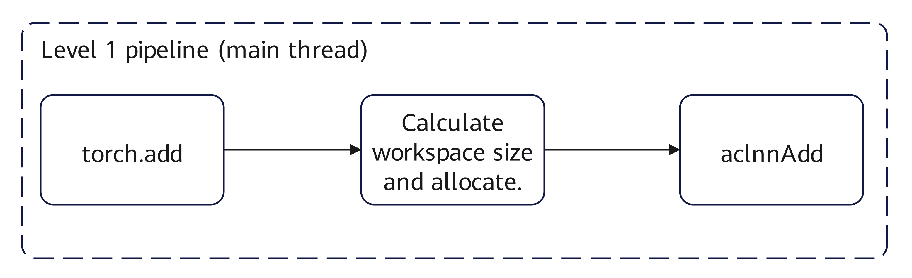
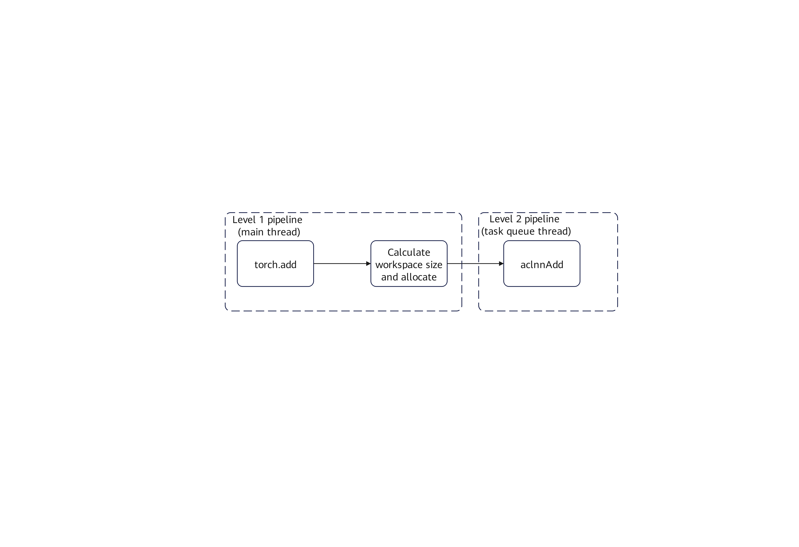
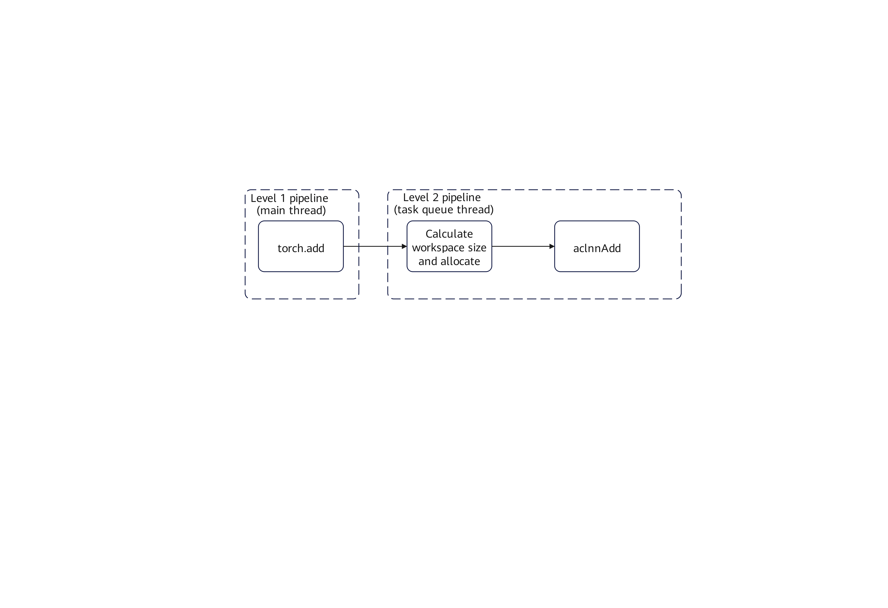

# TASK_QUEUE_ENABLE

<!-- md-trans-meta sourceCommit=e6dd39e7131a89f72cf49d80d53002e4cc645bbf translatedAt=2026-07-08T10:23:37.026Z pushedAt=2026-07-08T10:47:16.880Z -->

## Feature Description

This environment variable configures whether to enable the task_queue operator dispatch queue and its optimization level.

- When set to "0": Disables the task_queue operator dispatch queue optimization. The operator dispatch tasks are shown in Figure 1.

    **Figure 1** Disabling task_queue
    

- When set to "1" or not configured: Enables Level 1 optimization of the task_queue operator dispatch queue. The operator dispatch tasks are illustrated in Figure 2.

    Level 1 optimization: Enables the task_queue operator dispatch queue optimization, which splits operator dispatch tasks into two stages. A portion of the tasks (primarily the invocation of aclnn operators) is placed on the newly added second-level pipeline. The first-level and second-level pipelines transfer tasks through the operator queue and run in parallel with each other, partially masking the overall dispatch latency and improving end-to-end performance.

    **Figure 2** Level 1 optimization
    

- When set to "2": Enables Level 2 optimization of the task_queue operator dispatch queue. The operator dispatch tasks are illustrated in Figure 3.

    Level 2 optimization: Includes the Level 1 optimization and further balances the task load between the first-level and second-level pipelines, primarily by migrating workspace-related tasks to the second-level pipeline, achieving better masking effects and greater performance gains. This configuration takes effect only in binary scenarios. It is recommended to configure Level 2 optimization.

    **Figure 3** Level 2 optimization
    

    The default value of this environment variable is "1".

## Configuration Example

```bash
export TASK_QUEUE_ENABLE=2
```

## Usage Constraints

When [ASCEND_LAUNCH_BLOCKING](ASCEND_LAUNCH_BLOCKING.md) is set to "1", the task queue for operator dispatch is disabled, and the `TASK_QUEUE_ENABLE` setting does not take effect.

When `TASK_QUEUE_ENABLE` is set to "2", the peak NPU memory usage during runtime may increase due to memory concurrency.

## Supported Products

- <term>Atlas training products</term>
- <term>Atlas A2 training products</term>
- <term>Atlas A3 training products</term>
- <term>Atlas 800I A2 inference products</term>
- <term>Atlas inference products</term>
