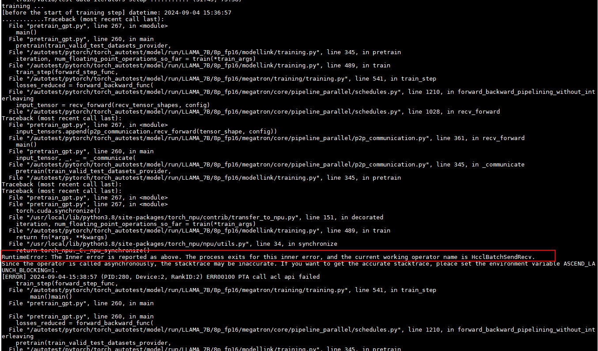

# Encountering the Error "RuntimeError: The Inner Error ..." During Distributed Model Training

<!-- md-trans-meta sourceCommit=unknown translatedAt=2026-06-15T12:05:46.739Z pushedAt=2026-06-16T03:14:22.353Z -->

## Symptom

In a scenario where `RANK_TABLE_FILE` is configured, the error "RuntimeError: The Inner Error ..." occurs during distributed model training, and the printed operator name is a specific communication operator.



## Cause Analysis

In the original negotiation-based link establishment method, there is a corresponding timeout for both the socket negotiation phase and the link establishment phase after negotiation, which is the time specified by `HCCL_CONNECT_TIMEOUT`. In the ranktable-based link establishment method, however, there is no socket negotiation, and link establishment begins directly, with the timeout for the link establishment phase also being the time specified by `HCCL_CONNECT_TIMEOUT`. Therefore, there may be cases where link establishment succeeds in the original process but times out in the ranktable-based method.

## Solution

You can resolve this issue by modifying the environment variable `HCCL_CONNECT_TIMEOUT`.

Add 30 seconds to the original value of `HCCL_CONNECT_TIMEOUT`. For example, if the original timeout is 120 seconds, you can set it as follows:

```bash
export HCCL_CONNECT_TIMEOUT=150
```

Finally, run the model again.
