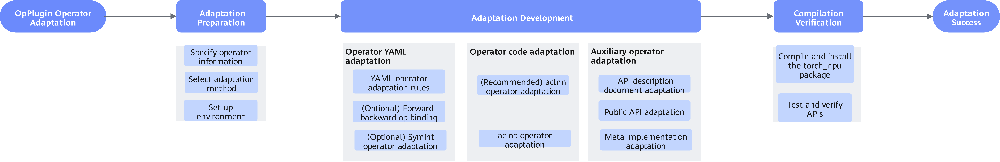

# Operator Adaptation Process

<!-- md-trans-meta sourceCommit=unknown translatedAt=2026-06-15T07:48:13.273Z pushedAt=2026-06-15T12:00:44.053Z -->

Operator adaptation must follow a standardized process to ensure functional correctness and optimal performance of operators on the Ascend NPU platform. The overall adaptation process is shown in the following figure.

**Figure 1**  Operator adaptation flowchart  

