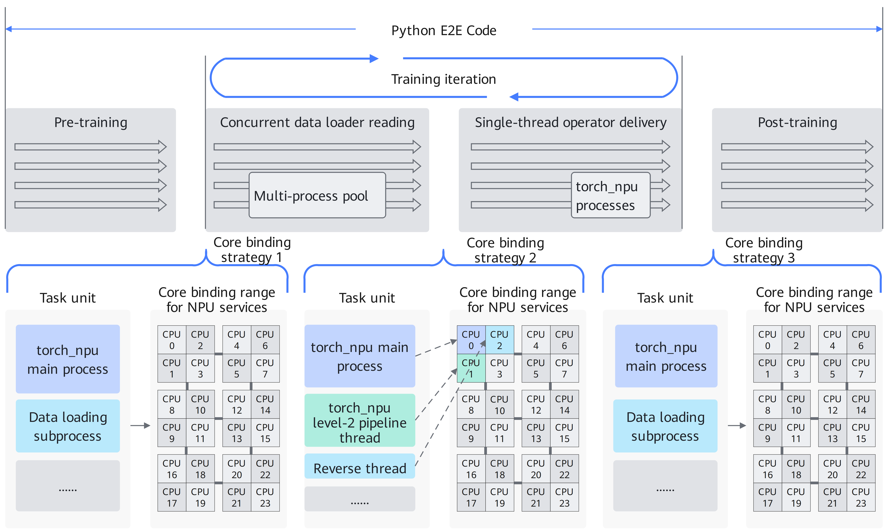

# Automatic Core Binding

<!-- md-trans-meta sourceCommit=e6dd39e7131a89f72cf49d80d53002e4cc645bbf translatedAt=2026-07-08T10:21:31.843Z pushedAt=2026-07-08T10:47:16.858Z -->

## Introduction

Ascend Extension for PyTorch can enable coarse-grained or fine-grained binding by setting the environment variable CPU_AFFINITY_CONF. This configuration helps avoid thread preemption, improve cache hit rates, prevent cross-NUMA (Non-Uniform Memory Access) node memory access, reduce task scheduling overhead, and optimize task execution efficiency.

The available core binding schemes are as follows:

- **Coarse-grained binding**: Binds all tasks to all CPU cores within the NPU service core binding range, preventing thread preemption between tasks on different devices.
- **Fine-grained binding**: Further optimization based on coarse-grained binding, anchoring torch_npu hotspot threads (main thread, second-level pipeline thread, etc.) to fixed CPU cores within the NPU service core binding range. Specifically, the main thread is bound to the first CPU core in the core binding range, the second-level pipeline thread is bound to the second CPU core, and so on. Non-hotspot threads (such as dataloader threads) are bound to the remaining CPU cores in the range, isolated from hotspot threads to reduce inter-core switching overhead.

    > [!NOTE]
    >
    > NPU service core binding range: When the core binding feature is enabled, the default core binding range for each NPU card's service is the corresponding segment after evenly dividing the total number of CPU cores by the total number of NPU cards. For example, if the environment has 160 CPU cores and 8 NPU cards, when core binding is enabled, the core binding range for NPU card 0's service is \[0,19\], i.e., the first segment after dividing into eight equal parts; the core binding range for NPU card 1's service is \[20,39\], and so on. In addition, users can specify the core binding range for a particular card's service by adding parameters in the environment variable. For details, see [Usage Guide](#usage-guide).

**Figure 1**  Schematic diagram of thread core binding timing and policy design  


## Use Cases

This feature is recommended in scenarios where host task dispatching is slow or service latency fluctuates significantly across cards.

## Usage Guide

Environment variable CPU\_AFFINITY\_CONF=<mode\>,npu<value1\>:<value2\>-<value3\>,npu\_affine:<value4\>

1. <mode\>: Required parameter, indicating the core binding mode.
    - 0 or not set: Indicates that the core binding feature is disabled.
    - 1: Indicates that coarse-grained binding is enabled.
    - 2: Indicates that fine-grained binding is enabled.

2. npu<value1\>:<value2\>-<value3\>: Optional parameter, specifying a custom NPU service core binding range. The custom NPU service core binding range takes effect only when the core binding feature is enabled, that is, when mode is set to 1 or 2.
    - npu<value1\>:<value2\>-<value3\> indicates that the "value1"-th card is bound to CPU cores in the closed interval from "value2" to "value3". For example, "npu0:0-2" indicates that the core binding range for the service threads of NPU card 0 is \[0,2\].
    - Modifying the service core binding range for some NPU cards is supported. For example, when the environment variable CPU\_AFFINITY\_CONF=1,npu0:0-0 is set, the service core binding range of NPU card 0 is changed to \[0,0\], while NPU card 1 retains its original service core binding range.

3. npu\_affine:<value4\>: Optional parameter, indicating whether NPU affinity binding is enabled.
    - 0 or not set: indicates that the affinity binding feature is not enabled.
    - 1: indicates that the affinity binding feature is enabled.

The core binding feature is disabled by default. If core binding is needed to improve performance, fine-grained binding is recommended.

> [!NOTE]  
>
>- The CPU core groups corresponding to NUMA nodes can be viewed using the **lscpu** command.
>- When binding cores, check whether the topology of the virtual machine is consistent with that of the physical machine. By default, the core group corresponding to npu0 or device 0 is NUMA0; however, container environments such as Docker may alter the mapping relationship. It is recommended to customize the core binding range based on the actual mapping relationship.
>- Before binding cores, the core binding range is checked. If any CPU core within the core binding range is found to be non-affine, the thread is determined to already have affinity, and the core binding corresponding to this environment variable will not be triggered.
>- The optimization effect of core binding varies across different models. In some service scenarios, additional threads may exist, and thread preemption may instead cause performance degradation.
>- For user-defined threads, since child threads inherit the affinity of the parent thread, it is recommended to manage the CPU affinity of child threads by calling torch_npu.utils.set_thread_affinity and torch_npu.utils.reset_thread_affinity before and after the location where child threads are spawned. For details, refer to the "[torch_npu.utils.set_thread_affinity](https://gitcode.com/Ascend/op-plugin/blob/26.0.0/docs/zh/custom_APIs/torch_npu-utils/torch_npu-utils.set_thread_affinity.md)" section in *Ascend Extension for PyTorch Custom API Reference* and the "[torch_npu.utils.reset_thread_affinity](https://gitcode.com/Ascend/op-plugin/blob/26.0.0/docs/zh/custom_APIs/torch_npu-utils/torch_npu-utils.reset_thread_affinity.md)" section in *Ascend Extension for PyTorch Custom API Reference*.
>- The affinity core binding range can be viewed using the **npu-smi info -t topo** command.

## Usage Examples

- Coarse-grained binding example:

    ```shell
    export CPU_AFFINITY_CONF=1
    ```

- Fine-grained binding example:

    ```shell
    export CPU_AFFINITY_CONF=2
    ```

- Custom NPU service core binding range example:

    For example, the core binding range for NPU card 0 is \[0,1\], for NPU card 1 is \[2,5\], for NPU card 3 is \[6,6\], and the core binding ranges for other NPU cards use the default settings. The configuration method is as follows:

    ```shell
    export CPU_AFFINITY_CONF=1,npu0:0-1,npu1:2-5,npu3:6-6
    ```

- NPU affinity binding example:

    ```shell
    export CPU_AFFINITY_CONF=1,npu_affine:1
    ```

## Constraints

Affinity binding is only supported on Atlas A2 training products.
