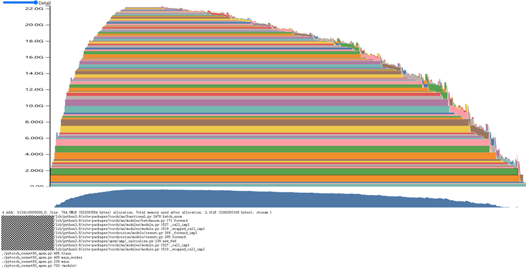
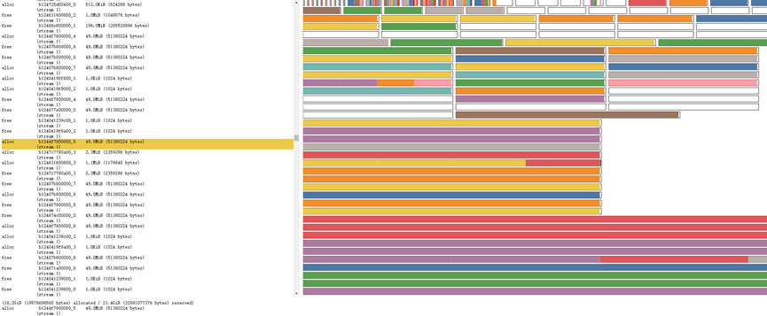

# Memory Snapshot

<!-- md-trans-meta sourceCommit=e6dd39e7131a89f72cf49d80d53002e4cc645bbf translatedAt=2026-07-08T10:22:41.230Z pushedAt=2026-07-08T10:47:16.870Z -->

## Introduction

The memory snapshot feature supports generating device memory snapshots when a memory overflow (OOM) occurs during training or when the user calls the `torch_npu.npu.memory._dump_snapshot` interface, and enables visual analysis through an interactive viewer ([memory_viz](https://pytorch.org/memory_viz)). The snapshot can record the state of allocated NPU memory at any point in time, and can optionally record the history of memory allocation operations. This feature is developed based on the community [memory snapshot feature](https://pytorch.org/docs/2.1/torch_cuda_memory.html#understanding-cuda-memory-usage) and supports the usage patterns of the community memory snapshot. An illustration of the memory snapshot is shown below:

**Figure 1**  Schematic diagram of memory usage status  


The horizontal axis represents the timeline, and the vertical axis represents the current device memory usage. Through the above diagram, the memory usage status over time can be intuitively observed. Pan and zoom operations are supported to inspect smaller memory allocation blocks in the diagram. For each allocated memory block, the corresponding stack trace and allocation information can be viewed.

It also supports viewing the history of memory allocator states. By selecting each memory allocator event displayed on the left timeline, you can view a visual summary of the memory allocator state at the time that event operation was executed. This summary shows each individual memory segment returned by the program's allocation request, as well as how the memory segments are divided into individually allocated or free memory blocks based on the actual requested memory size. Similarly, stack information at the time of memory allocation can also be viewed. The effect is shown in the following figure:

**Figure 2** Schematic diagram of memory allocator state history  


In addition, when the memory snapshot is saved, the current real-time memory occupied by each component at the time of the memory overflow (OOM) (curMemSize) and the maximum memory occupied during execution (memPeakSize) are both saved to a CSV file under the OOM_SNAPSHOT_PATH path. Users can download the CSV file and view it using tools such as Excel.

The environment variables OOM_SNAPSHOT_ENABLE and OOM_SNAPSHOT_PATH are used to control the recording of memory snapshots. When used in conjunction with TASK_QUEUE_ENABLE=2, the workspace memory usage of multi-level taskqueue pipelining can also be viewed.

## Use Cases

During model training, if you need to analyze NPU memory allocation (for example, when an OOM error occurs in the network), you can use this feature.

## Usage Guide

- When a memory shortage error occurs in the network, you can configure whether to save a memory snapshot via OOM_SNAPSHOT_ENABLE for analyzing the cause of the memory shortage.
- When set to 0, the memory snapshot feature is disabled and no memory data is saved.
- When set to 1, upon OOM, the current and historical memory usage information is saved, including allocated and freed memory information.
- When set to 2, only the current memory usage is saved upon OOM, including allocated and freed memory information.

- When a network encounters an out-of-memory error, the memory data save path can be configured via OOM_SNAPSHOT_PATH. This must be used in conjunction with OOM_SNAPSHOT_ENABLE.
- When not configured, memory data is saved to the current path by default.
- When configured, memory data is saved to the specified path.

For details on using this environment variable, refer to the "[OOM_SNAPSHOT_ENABLE](../environment_variable_reference/OOM_SNAPSHOT_ENABLE.md)" section in *Environment Variable Reference* and the "[OOM_SNAPSHOT_PATH](../environment_variable_reference/OOM_SNAPSHOT_PATH.md)" section in *Environment Variable Reference*.

For usage methods and examples of memory snapshots, refer to the [community documentation](https://pytorch.org/docs/2.7/torch_cuda_memory.html#understanding-cuda-memory-usage). For detailed usage of the community memory snapshot API, see the[reference](https://pytorch.org/docs/2.7/torch_cuda_memory.html#snapshot-api-reference).

## Usage Example

- To generate a memory snapshot when a memory overflow (OOM) occurs, configure the following environment variables:

```shell
export OOM_SNAPSHOT_ENABLE=1
export OOM_SNAPSHOT_PATH="/home/usr/"
```

- To save a memory snapshot at any time, call the `torch.npu.memory._dump_snapshot` API:

```python
# enable memory history, which will add tracebacks and event history to snapshots
torch_npu.npu.memory._record_memory_history()

run_your_code()
torch_npu.npu.memory._dump_snapshot("my_snapshot.pickle")
```

## Constraints

- Ascend Extension for PyTorch 6.0.0 and later versions support this feature.
- The feature of saving memory snapshot CSV files upon memory overflow (OOM) is supported only on Ascend HDK 25.5.0 and later versions, as well as CANN commercial 8.5.0 and later versions.
