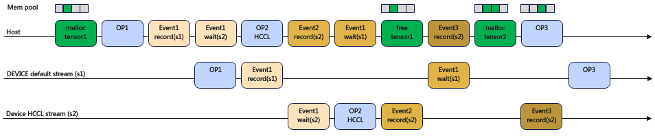
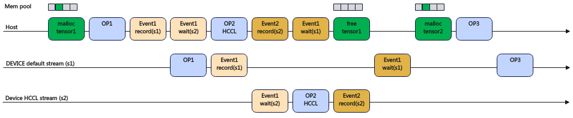

# Multi-Stream Memory Reuse

<!-- md-trans-meta sourceCommit=unknown translatedAt=2026-06-15T07:50:40.791Z pushedAt=2026-06-15T12:00:44.086Z -->

## Introduction

A stream is an important mechanism in PyTorch, where each stream represents a strictly sequential execution logic. Generally, PyTorch launches multiple streams during execution to parallelize model communication and computation tasks. During execution, each stream requests memory from the device as needed, which is referred to as the stream's memory pool. If the memory pool requested by one stream needs to be used by another stream, communication between the two streams is required. The completion of data execution corresponding to the memory block of the current stream serves as the signal that the block can be used by the other stream. When host operators are dispatched too quickly, the operators on the computation stream do not have enough time to reuse the memory on the communication stream. In particular, when operators on the communication stream have dependencies, all of them must finish before the memory is released for reuse.

The logic of multi-stream reuse is to release memory on the communication stream earlier so that the computation stream can reuse it. This is achieved by finding the right moment to erase the cross-stream dependency markers added during the `recordStream` call in memory management. The `work.wait()` call dispatches an event wait task to block the computation task. From the device execution perspective, the wait block is only lifted after the collective communication operator completes execution. At this point, the memory that the collective communication operator depends on has already been fully used by the collective communication task, and the cross-stream dependency markers are no longer needed to delay release, so they can be erased directly. Memory blocks with erased cross-stream dependency markers are returned directly to the memory pool after the tensor is destructed. After `work.wait()`, this memory block can be allocated to other operators. The subsequent operators are guaranteed to execute after the event wait task on the device, which means they use this memory block after the collective communication operator, thus avoiding concurrent operations with the collective communication operator. This is how multi-stream reuse is implemented.

The schematic diagram without multi-stream reuse enabled is shown in [Figure 1](#disabling-multi-stream-memory-reuse-schematic-diagram). When destructing tensor1 (free tensor1), the native PyTorch framework ensures that the memory of tensor1 is released only after the HCCL operator finishes using it. Therefore, after tensor1 is destructed (free tensor1), the memory is not immediately reclaimed by the memory pool. Instead, an Event3 record task is dispatched. Before the next memory allocation, the memory is only reclaimed into the memory pool after confirming that Event3 record is complete. In the diagram, malloc tensor2 cannot reuse the memory of tensor1 because the query for Event3 record completion has not yet finished, preventing the memory pool from reclaiming tensor1's memory in time.

**Figure 1**  Schematic diagram without multi-stream memory reuse enabled  <a id="disabling-multi-stream-memory-reuse-schematic-diagram"></a>


The schematic diagram for enabling multi-stream memory reuse is shown in [Figure 2](#enabling-multi-stream-memory-reuse-schematic-diagram). After the Event1 wait task, the cross-stream dependency marker is also erased, eliminating the need to issue an Event3 record task. After tensor1 is destructed (free tensor1), the tensor1 memory is directly reclaimed by the memory pool.

**Figure 2**  Schematic diagram with multi-stream memory reuse enabled <a id="enabling-multi-stream-memory-reuse-schematic-diagram"></a>
  

## Use Scenario

In large model distributed training scenarios, this feature can be considered when you want to avoid out-of-bounds memory access and improve the cross-stream memory reuse rate.

## Usage Guide

Controls whether to enable multi-stream memory reuse through the environment variable `MULTI_STREAM_MEMORY_REUSE`.

- 0: Disable memory reuse.
- 1: Enable memory reuse. Based on the eraseStream method, it erases previous recordStream marks to ensure memory reuse, holds a weak reference to the tensor, and does not extend the tensor's lifecycle.
- 2: Enable memory reuse. Based on the method of not executing recordStream marks, it ensures memory reuse capability, holds a strong reference to the tensor, and may extend the tensor's lifecycle. Currently not recommended.
- 3: Enable memory reuse. Based on the value "1", it performs further reuse optimization, allowing the erasure of recordStream marks in scenarios where tensors are released early.

The default value is 1.

For details on using this environment variable, refer to the [MULTI\_STREAM\_MEMORY\_REUSE](https://www.hiascend.com/document/detail/zh/Pytorch/720/comref/Envvariables/Envir_016.html) section in the *Environment Variable Reference*.

## Usage Example

Disable memory reuse:

```bash
export MULTI_STREAM_MEMORY_REUSE=0
```

## Constraints

None
