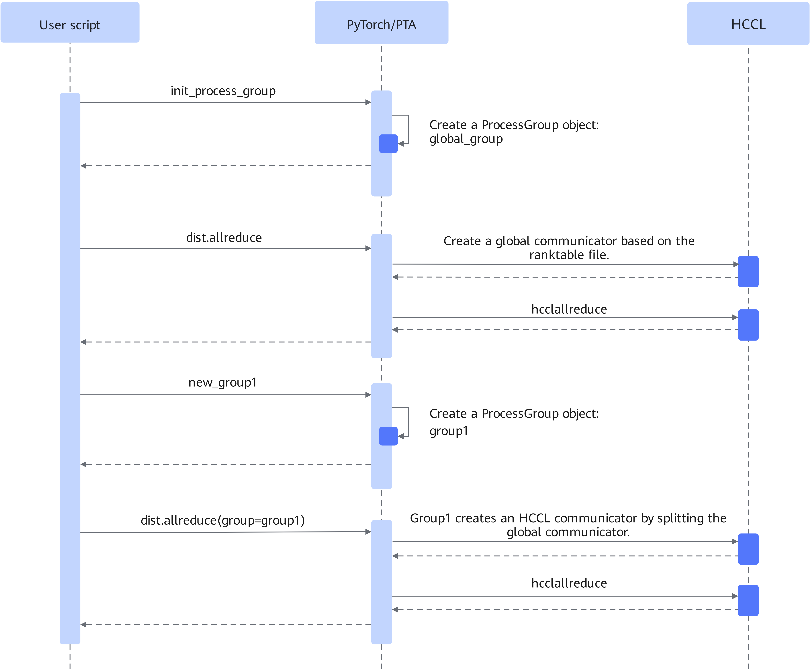

# Ranktable Link Setup

<!-- md-trans-meta sourceCommit=unknown translatedAt=2026-06-15T07:51:48.555Z pushedAt=2026-06-15T12:00:44.100Z -->

## Introduction

Supports establishing communicators using a ranktable file configuration to accelerate communicator establishment time, and makes the link setup time nearly independent of cluster scale, thereby solving the performance bottleneck of establishing communicators in large clusters.

**Figure 1** Flowchart for creating a communicator using a ranktable file  


PyTorch establishes the global communicator through a ranktable file. Sub-communicators are established by splitting the global communicator.

## Use Scenario

In large clusters, when the establishment of model communication domains becomes a performance bottleneck for model training, this feature can be considered.

## Usage Guide

The environment variable RANK\_TABLE\_FILE controls whether to establish collective communication domain links through ranktable file configuration.

- When not configured, collective communication domain links are established through the default negotiation process.
- When configured and the full file path is valid, collective communication domain links are established through the ranktable file.

This environment variable is not configured by default.

For the ranktable file configuration instructions, refer to the "rank table configuration resource information" section in the [CANN Huawei Collective Communication Library (HCCL)](https://www.hiascend.com/document/detail/en/CANNCommunityEdition/900/API/hcclug/hcclug_000001.html).

> [!CAUTION]
>
> - If the configured file path does not exist, the collective communication domain link setup will proceed through the default negotiation process.
> - If the configured file path exists but the configuration information is incorrect, the collective communication domain link setup will not proceed through the default negotiation process; instead, a corresponding error will be reported during actual communication.
> - The configured file path cannot be a symbolic link and must have read permission.

For details on using this environment variable, refer to the [RANK\_TABLE\_FILE](../environment_variable_reference/RANK_TABLE_FILE.md) section in the *Environment Variable Reference*.

## Usage Example

Example of enabling link setup via ranktable file:

```bash
export RANK_TABLE_FILE=/home/ranktable.json
```

Example of disabling link setup via ranktable file:

```bash
unset RANK_TABLE_FILE
```

## Constraints

This environment variable is only applicable to scenarios of neural networks built on the PyTorch framework, and is used in distributed collective communication scenarios.
