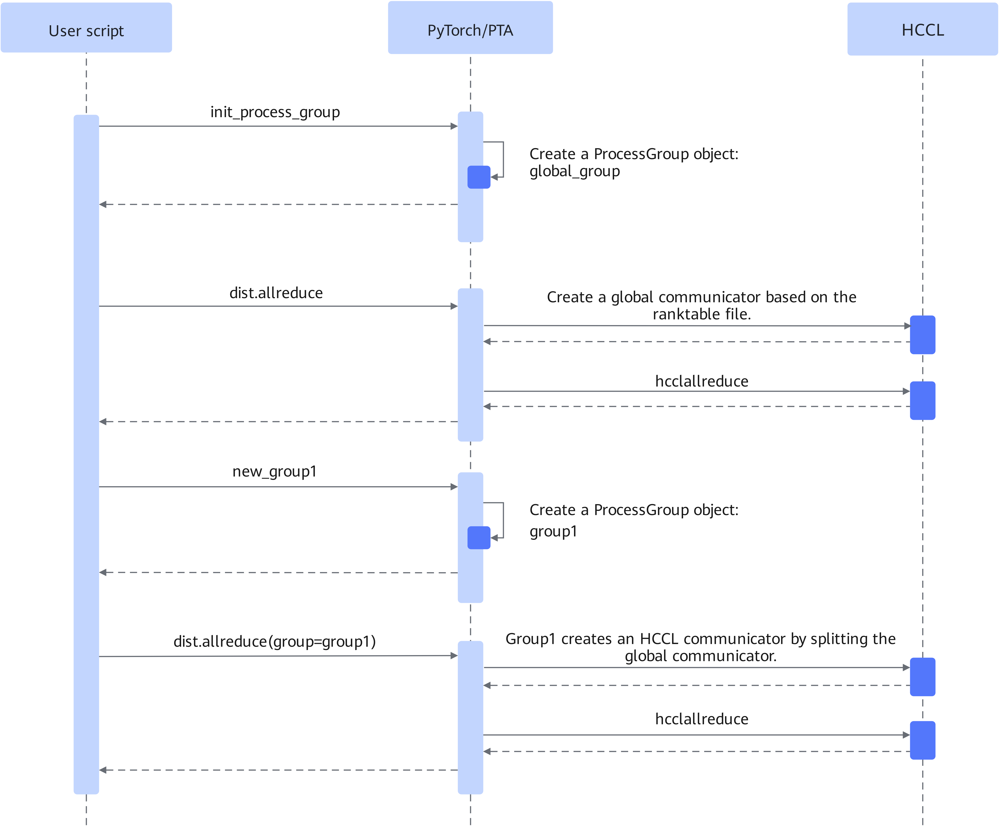

# Ranktable Link Setup

## Introduction

Supports establishing a communication domain by configuring the ranktable file to accelerate the communication domain establishment time, and makes the link setup time almost independent of cluster scale, thereby solving the performance bottleneck of establishing communication domains in large clusters.

**Figure 1**  Flowchart for establishing a communication domain using a ranktable file  


PyTorch establishes the global communication domain through the ranktable file. Sub-communication domains are established by splitting the global communication domain.

## Use Scenarios

In large clusters, when the establishment of the model communication domain becomes a performance bottleneck for model training, you can consider this feature.

## Usage Guide

The environment variable `RANK_TABLE_FILE` controls whether collective communication domain links are established through ranktable file configuration.

- If it is not configured, collective communication domain links are established through the default negotiation process.
- If it is configured and the full file path is valid, collective communication domain links are established through the ranktable file.

This environment variable is not configured by default.

 For ranktable file configuration instructions, refer to the "Cluster Information Configuration" section in *CANN HCCL Communication Library*.
 <!-- [Cluster Information Configuration](https://www.hiascend.com/document/detail/en/CANNCommunityEdition/910/commlib/hcclug/docs/en/user_guide/cluster_info_config/intro.md) -->

> [!CAUTION]
>
>- If the configured file path does not exist, collective communication domain links are established through the default negotiation process.
>- If the configured file path exists but the configuration information is incorrect, collective communication domain links are not established through the default negotiation process. Instead, a corresponding error is reported during actual communication.
>- The configured file path cannot be a symbolic link and must have read permission.

For details on using this environment variable, refer to the "[RANK_TABLE_FILE](../environment_variable_reference/RANK_TABLE_FILE.md)" section in *Environment Variable Reference*.

## Usage Examples

Example of enabling ranktable file-based link setup:

```bash
export RANK_TABLE_FILE=/home/ranktable.json
```

Example of disabling ranktable file-based link setup:

```bash
unset RANK_TABLE_FILE
```

## Constraints

This environment variable applies only to neural network scenarios built on the PyTorch framework and is used in distributed collective communication scenarios.
