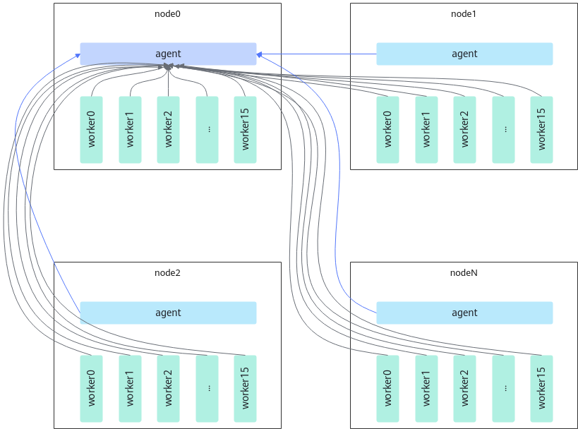
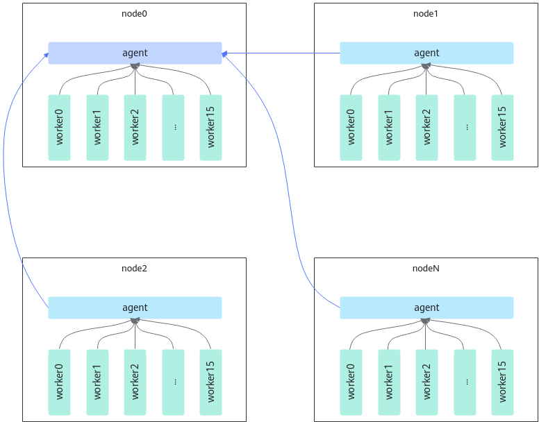

# torch\_npu\_run

<!-- md-trans-meta sourceCommit=unknown translatedAt=2026-06-15T07:52:43.386Z pushedAt=2026-06-15T12:00:44.114Z -->

## Introduction

torch\_npu\_run is an improved version of torchrun for large-scale cluster scenarios, enhancing cluster connection establishment performance.

torch\_npu\_run has the following improvements over torchrun:

1. torch\_npu\_run uses epoll to implement a multi-threaded TCP server, which can efficiently handle a large number of concurrent connections and quickly respond to client requests, thereby significantly improving the overall performance and throughput of the system.
2. torch\_npu\_run supports tiered connection establishment. By setting enable\_tiered\_parallel\_tcpstore to true, tiered connection establishment can be enabled.

In distributed training, each node typically starts a torchrun process, also known as an agent process. The agent is responsible for managing the startup and termination of multiple training processes on the node; these training processes are called workers. In native torchrun, all agents and workers establish TCP connections with the agent on node 0 (node0), as shown in [Figure 1](#original-torchrun-link-setup-method). Under the torchrun approach, the link setup time increases linearly with the number of training processes, leading to a performance bottleneck.

**Figure 1** Original torchrun link setup method <a id="original-torchrun-link-setup-method"></a>



torch_npu_run introduces a tiered TCPStore architecture on top of torchrun. Specifically, on each node, the agent starts a new role called proxy to manage worker communication. Workers on the node establish UnixSocket connections with the proxy, and all proxies establish TCP connections with the proxy on node0. This implements a tiered communication structure, breaking the linear bottleneck of link setup time and reducing the time complexity from $O(n)$ to $O(\sqrt{n})$, as shown in [Figure 2](#link-setup-method).

**Figure 2** torch_npu_run link setup method <a id="link-setup-method"></a>  


## Use Scenario

It is recommended to use this feature when launching distributed training tasks.

## Usage Guide

The usage of torch_npu_run is similar to that of torchrun. Some optional configuration parameters of torch_npu_run are as follows:

- `nnodes`: Number of nodes, or a range of node counts, in the format `<min_nodes>:<max_nodes>`.
- `nproc_per_node`: Number of worker processes per node. Supported values include auto, cpu, gpu, or an integer.
- `node_rank`: The rank of the node in multi-node distributed training.
- `rdzv_backend`: The backend mechanism for establishing collective communication connections.
- `rdzv_endpoint`: The backend service address used for rendezvous, in the format `<host>:<port>`.
- `rdzv_id`: A user-defined ID that uniquely identifies the worker group for a job. Each node uses this ID to join a specific worker group.
- `standalone`: Indicates running a distributed training job on a single machine, suitable for single-node multi-process jobs.
- `master_addr`: The network address of the master node (rank 0), used only for static rendezvous.
- `master_port`: The port of the master node (rank 0), used only for static rendezvous.
- `local_addr`: The IP address of the current node.
- `enable_tiered_parallel_tcpstore`: Whether to enable tiered connection establishment to further improve connection performance, that is, whether to establish connections separately within nodes and across nodes. Recommended for large-scale cluster scenarios. Supported values are true and false, defaulting to false (disabled).

## Usage Example

Example of launching a single-node 8-card training task:

```shell
export MASTER_IP_ADDR=**  # Fill ** with the IP address of node_rank0
export MASTER_PORT=**  # Fill ** with an available TCP port number
torch_npu_run --rdzv_backend=parallel --master_addr=$MASTER_IP_ADDR --master_port=$MASTER_PORT --nnodes=1 --nproc_per_node=8 ddp_test.py
```

Example of launching a two-node 16-card training task:

- Hierarchical connection establishment disabled

    ```shell
    # First machine
    export MASTER_IP_ADDR=**  # Fill ** with the IP address of node_rank0
    export MASTER_PORT=**  # Fill ** with an available TCP port number
    torch_npu_run --rdzv_backend=parallel --master_addr=$MASTER_IP_ADDR --master_port=$MASTER_PORT --nnodes=2 --node_rank 0 --nproc_per_node=8 ddp_test.py  
    
    # Second machine
    export MASTER_IP_ADDR=** # Fill ** with the IP address of node_rank0
    export MASTER_PORT=** # Fill ** with an available TCP port number
    torch_npu_run --rdzv_backend=parallel --master_addr=$MASTER_IP_ADDR --master_port=$MASTER_PORT --nnodes=2 --node_rank 1 --nproc_per_node=8 ddp_test.py
    ```

- Enable hierarchical connection establishment

    ```shell
    # First machine
    export MASTER_IP_ADDR=**  # Fill ** with the IP address of node_rank0
    export MASTER_PORT=**  # Fill ** with an available TCP port number
    torch_npu_run --rdzv_backend=parallel --master_addr=$MASTER_IP_ADDR --master_port=$MASTER_PORT --nnodes=2 --node_rank 0 --nproc_per_node=8 --enable_tiered_parallel_tcpstore=true ddp_test.py
      
    # Second machine
    export MASTER_IP_ADDR=** # Fill ** with the IP address of node_rank0
    export MASTER_PORT=** # Fill ** with an available TCP port number
    torch_npu_run --rdzv_backend=parallel --master_addr=$MASTER_IP_ADDR --master_port=$MASTER_PORT --nnodes=2 --node_rank 1 --nproc_per_node=8 --enable_tiered_parallel_tcpstore=true ddp_test.py
    ```

> [!NOTE]  
>
> ddp\_test.py is the model training script. ddp\_test.py is only an example; users can modify it according to the actual script name.

## Constraints

None
