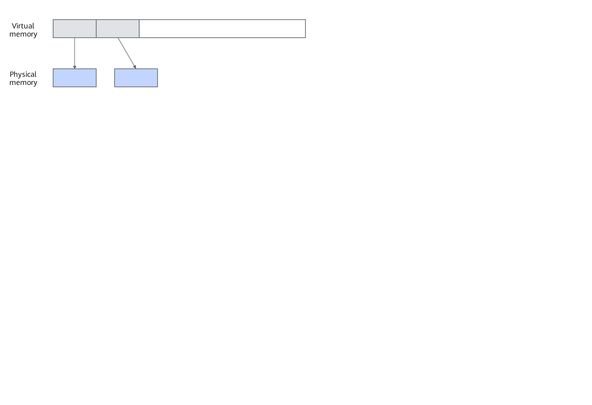

# Virtual Memory

<!-- md-trans-meta sourceCommit=unknown translatedAt=2026-06-15T07:52:56.693Z pushedAt=2026-06-15T12:00:44.117Z -->

## Introduction

The virtual memory management mechanism primarily separates the concepts of address and memory. By configuring the environment variable `PYTORCH_NPU_ALLOC_CONF` or modifying the `expandable_segments` attribute of the `torch.npu.memory._set_allocator_settings` interface, you can enable the virtual memory management mechanism. This mechanism allows PyTorch to manage the mapping between virtual memory and physical memory, and permits multiple allocations of contiguous memory. By constructing expandable memory segments and dynamically adjusting memory block sizes, it can effectively reduce memory fragmentation. For models with significant memory fragmentation, it can lower device memory usage.

As shown in [Figure 1](#virtual-address-and-physical-memory-mapping), through the interfaces provided by the underlying layer, a large block of virtual address space can be reserved in advance as a memory block. As users continuously request memory, they can obtain memory blocks at contiguous addresses, each mapped to physical memory at different addresses. When memory is released, memory blocks at contiguous addresses can be merged into a single memory block.

**Figure 1**  Virtual address and physical memory mapping  <a id="virtual-address-and-physical-memory-mapping"></a>  


## Use Scenario

Consider using this feature when an Out Of Memory (OOM) error occurs during training, or when you want to reduce the memory footprint of a model.

## Usage Guide

Choose one of the following methods:

- Set the environment variable PYTORCH\_NPU\_ALLOC\_CONF=expandable\_segments:<value\>. For details on using this environment variable, refer to the "[PYTORCH\_NPU\_ALLOC\_CONF](../environment_variable_reference/PYTORCH_NPU_ALLOC_CONF.md)" section in the *Environment Variable Reference*.
- Modify the "expandable\_segments" attribute value in the torch.npu.memory.\_set\_allocator\_settings("expandable\_segments: <value\>") API.

  The value can be True or False. The default is False.

  - When set to True, this setting instructs the caching allocator to create specific memory block allocations that can be subsequently expanded, so as to better handle situations where memory usage sizes change frequently.
  
  - When set to False, the memory pool expandable segments feature is disabled, and the original memory allocation method is used.

## Usage Example

- A usage example of PYTORCH\_NPU\_ALLOC\_CONF is shown below.

    Enable the virtual memory mechanism:

    ```shell
    export PYTORCH_NPU_ALLOC_CONF=expandable_segments:True
    ```

    Disable the virtual memory mechanism:

    ```shell
    export PYTORCH_NPU_ALLOC_CONF=expandable_segments:False
    ```

- The usage example of torch.npu.memory._set_allocator_settings is as follows:

    Enable the virtual memory mechanism:

    ```Python
    torch.npu.memory._set_allocator_settings("expandable_segments:True")
    ```

    Disable the virtual memory mechanism:

    ```Python
    torch.npu.memory._set_allocator_settings("expandable_segments:False")
    ```

## Constraints

The expandable_segments feature requires Ascend HDK 23.0.0 or later.

`torch.npu.memory._set_allocator_settings` is only supported in PyTorch 2.6.0 or later.

`torch.npu.memory._set_allocator_settings` currently only supports modifying the expandable_segments attribute.
