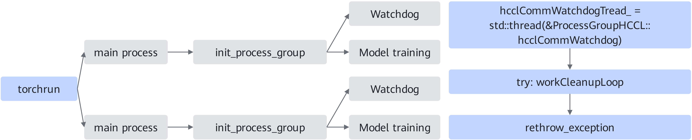

# WatchDog

<!-- md-trans-meta sourceCommit=unknown translatedAt=2026-06-15T07:52:55.034Z pushedAt=2026-06-15T12:00:44.116Z -->

## Introduction

Without compromising the performance and accuracy of large model training, it can quickly and stably detect errors. WatchDog monitors processes, significantly improving the reliability of PyTorch distributed training using HCCL. Essentially, WatchDog prevents distributed training from being blocked by capturing errors that occur in collective communication, throwing exceptions from child processes, and stopping the main process training.

**Figure 1**  WatchDog working diagram  


The figure above shows how the WatchDog process works in distributed training. First, the WatchDog thread is started when each process initializes process\_group, with one WatchDog thread monitoring the process\_group in a single process. Then, the WatchDog thread asynchronously monitors collective communication anomalies in the workCleanupLoop subfunction. After capturing an anomaly, it re-throws the exception in the WatchDog main function, allowing the main training process to perceive the anomaly and quickly terminate the training task.

WatchDog supports not only operator execution anomaly monitoring, communication timeout monitoring, and timeout analysis, but also ERROR CQE detection. CQE detection checks the communication link status of the device network port. When the communication link is abnormal, it is usually reflected as an ERROR CQE.

## Use Scenario

During large model training, if the model gets stuck after a collective communication anomaly, the training cannot be terminated in time, resulting in resource waste. Using this feature can prevent this situation.

## Usage Guide

Whether to enable WatchDog can be set through the environment variable HCCL_ASYNC_ERROR_HANDLING.

Values of HCCL_ASYNC_ERROR_HANDLING:

- 0: Disables asynchronous error handling.
- 1: Enables asynchronous error handling.

The default value is **0** when the PyTorch version is 1.11.0, and **1** when the PyTorch version is 2.1.0 or later.

For details about this environment variable, see the "[HCCL_ASYNC_ERROR_HANDLING](../environment_variable_reference/HCCL_ASYNC_ERROR_HANDLING.md)" section in *Environment Variable Reference*.

## Usage Example

Enable asynchronous error handling:

```shell
export HCCL_ASYNC_ERROR_HANDLING=1
```

## Constraints

- This environment variable is only applicable to neural network scenarios built on the PyTorch framework, with HCCL used as the communication backend.
- When enabling asynchronous error handling through this environment variable, to better identify the cause of HCCL timeouts, it is recommended to set the timeout parameter of `new_group` and `init_process_group` to a value greater than the time configured by the `HCCL_CONNECT_TIMEOUT` and `HCCL_EXEC_TIMEOUT` environment variables. For details about `HCCL_CONNECT_TIMEOUT`, see the "[HCCL_CONNECT_TIMEOUT](https://www.hiascend.com/document/detail/en/CANNCommunityEdition/900/maintenref/envvar/envref_07_0077.html)" section in the *CANN Description of Environment Variables*. For details about `HCCL_EXEC_TIMEOUT`, see the "[HCCL_EXEC_TIMEOUT](https://www.hiascend.com/document/detail/en/CANNCommunityEdition/900/maintenref/envvar/envref_07_0078.html)" section in the *CANN Description of Environment Variables*.
