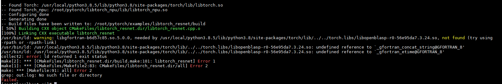

# FAQ

## Build Issues

### torch.libs/libopenblasp-r0-56e95da7.3.24.so Link Error or libgfortran Missing

**Symptom**

When performing libtorch inference tests in the aarch64 environment, the build depends on `torch.libs/*.so` libraries, which need to be loaded manually.

- Error Screenshot

    

- Error Text

    ```text
    [100%] Linking CXX executable libtorch_resnet
    /usr/bin/ld: warning: libgfortran-b6d57c85.so.5.0.0, needed by /usr/local/python3.8.5/lib/python3.8/site-packages/torch/lib/../../torch.libs/libopenblasp-r0-56e95da7.3.24.so, not found (try using     -rpath or -rpath-link)
    /usr/bin/ld: /usr/local/python3.8.5/lib/python3.8/site-packages/torch/lib/../../torch.libs/libopenblasp-r0-56e95da7.3.24.so: undefined reference to `_gfortran_concat_string@GFORTRAN_8'
    /usr/bin/ld: /usr/local/python3.8.5/lib/python3.8/site-packages/torch/lib/../../torch.libs/libopenblasp-r0-56e95da7.3.24.so: undefined reference to `_gfortran_etime@GFORTRAN_8'
    collect2: error: ld returned 1 exit status
    make[2]: *** [CMakeFiles/libtorch_resnet.dir/build.make:101: libtorch_resnet] Error 1
    make[1]: *** [CMakeFiles/Makefile2:83: CMakeFiles/libtorch_resnet.dir/all] Error 2
    make: *** [Makefile:91: all] Error 2
    ```

**Solution**

Add the `torch.libs/*.so` library link in the `CMakeLists.txt` build file. Example code:

```cmake
set(CMAKE_CXX_FLAGS "${CMAKE_CXX_FLAGS} ${TORCH_CXX_FLAGS}")

# Add the search path for torch.libs/*.so libraries during the linking phase. Replace the library path in the following command line based on your actual situation
link_directories(/usr/local/python3.8.5/lib/python3.8/site-packages/torch.libs)  

add_executable(libtorch_resnet libtorch_resnet.cpp)
target_link_libraries(libtorch_resnet "${TORCH_LIBRARIES}")
target_link_libraries(libtorch_resnet "${TORCH_NPU_LIBRARIES}")
```

### Missing Project Files in the third_party Directory During Build or Need to Switch Project Commit ID

**Symptom**

During the build, submodules are missing or need to be switched to a different version.

Error Text

```text
Traceback (most recent call last):
  File "/opt/_internal/cpython-3.9.21/lib/python3.9/runpy.py", line 197, in _run_module_as_main
    return _run_code(code, main_globals, None,
  File "/opt/_internal/cpython-3.9.21/lib/python3.9/runpy.py", line 87, in _run_code
    exec(code, run_globals)
  File "/home/pytorch/torchnpugen/gen_backend_stubs.py", line 948, in <module>
    main()
  File "/home/pytorch/torchnpugen/gen_backend_stubs.py", line 400, in main
    run(options.source_yaml, options.output_dir, options.dry_run,
  File "/home/pytorch/torchnpugen/gen_backend_stubs.py", line 823, in run
    merge_custom_yaml(source_yaml, op_plugin_yaml_path)
  File "/home/pytorch/torchnpugen/utils.py", line 153, in merge_custom_yaml
    PathManager.check_directory_path_readable(op_plugin_path)
  File "/home/pytorch/torchnpugen/utils.py", line 94, in check_directory_path_readable
    cls.check_path_owner_consistent(path)
  File "/home/pytorch/torchnpugen/utils.py", line 80, in check_path_owner_consistent
    raise RuntimeError(msg)
RuntimeError: The path does not exist: /home/pytorch/third_party/op-plugin/op_plugin/config/v2r7/op_plugin_functions.yaml
```

**Solution**

In the PyTorch directory, run the following command to initialize and update all submodules:

```bash
git submodule update --init --recursive
```

To switch the commit ID of a third_party project, go to the corresponding project directory and run:

```bash
git checkout <commit_id>
```

### Build-time Line Break Error

**Symptom**

The line break cannot be recognized during build.

Error Text

```text
ci/build.sh: line 2: $'\r': command not found
: invalid optione 3: set: -
set: usage: set [-abefhkmnptuvxBCHP] [-o option-name] [--] [arg ...]
ci/build.sh: line 4: $'\r': command not found
ci/build.sh: line 9: $'\r': command not found
ci/build.sh: line 11: syntax error near unexpected token `$'{\r''
'i/build.sh: line 11: `function parse_script_args() {
```

**Cause**

Windows line break issue. The file uses Windows-style line breaks (CRLF: \r\n), while Linux bash only recognizes Unix-style line breaks (LF: \n), causing "\r" to be executed as part of the command.

**Solution**

Try using the dos2unix tool to resolve this.

```bash
# Install the dos2unix tool
yum install -y dos2unix

# Batch convert text files (select the files to convert based on your needs and error content)
find /home/pytorch -type f \
  \( -name "*.sh" -o -name "*.py" -o -name "*.cpp" -o -name "*.h" \
  -o -name "*.c" -o -name "*.cmake" -o -name "CMakeLists.txt" \
  -o -name "configure" -o -name "*.txt" -o -name "*.yaml" -o -name "*.yml" \
  -o -name "*.md" -o -name "*.cfg" -o -name "*.in" \) \
  -exec dos2unix {} + 2>/dev/null

# Clean up the previous build cache (CMake cache may retain incorrect configuration)
rm -rf /home/pytorch/build

# Recompile
bash ci/build.sh
```

### Build-time Error: `CMake_minimum_required`

**Symptom**

A build-time error occurs due to CMake version mismatch.

Error Text

```text
CMake Error at third_party/Tensorpipe/third_party/libuv/CMakeLists.txt:1 (cmake_minimum_required):
  Compatibility with CMake < 3.5 has been removed from CMake.
```

**Cause**

This means that the CMake version in your container is relatively new (≥ 3.27). Starting from CMake 3.27, projects with `cmake_minimum_required` lower than 3.5 are no longer compatible, and the build exits with an error directly.

**Solution**

You can try adding `cmake_args.append('-DCMAKE_POLICY_VERSION_MINIMUM=3.5')` in the `run` function of `class CPPLibBuild` in the `setup.py` file, so that CMake processes the legacy `cmake_minimum_required` declaration in compatibility mode.

### Build-time Error: Linker Symbol Issue

**Symptom**

A build-time error occurs where the linker symbol cannot be correctly recognized.

Error Text

```text
/home/pytorch/third_party/torchair/torchair/third_party/ascend/include/ascendcl/external/acl/error_codes/rt_error_codes.h:1:1: error: expected unqualified-id before ‘.’ token
```

**Cause**

The file was originally a symbolic link. On Windows, Git automatically converted it into a text file containing a path.

**Solution**

```bash
# Fix broken symbolic links (find files whose content is a relative path and recreate them as symbolic links)
find /home/pytorch -type f -name "*.h" -exec grep -l '^\.\./' {} \; 2>/dev/null | while read f;do
    target=$(cat "$f")
    ln -sf "$target" "$f"
done
```

Or try replacing with the actual content:

For example, replace the content in `third_party\torchair\torchair\third_party\ascend\include\ascend/include/ascendcl/external/acl/error_codes/rt_error_codes.h` with the content in `third_party\torchair\torchair\third_party\ascend\include\air\external\ge\ge_error_codes.h`.

### fatal error: `filesystem` file not found

**Symptom**

A build-time error occurs indicating that the `filesystem` file is missing.

Error Text

```text
fatal error: 'filesystem' file not found
```

**Cause**

This error is usually caused by an outdated GCC version. Run the following command to check the current GCC version:

```bash
gcc --version
```

**Solution**

If the GCC version is earlier than 8, refer to *[Installing GCC 11.2.0](installing_gcc_11-2-0.md)* to install GCC 8 or later.

## Installation Issues

### The Built whl Package Does Not Match the Current Environment

**Symptom**

After the build is complete, the corresponding whl package cannot be installed.

Error Text

```text
ERROR: torch_npuxxx.whl is not a supported wheel on this platform
```

**Cause**

The Python environment used during build does not match the Python environment used during installation.

**Solution**

Before building the installation package, confirm the Python version required by the target environment, and specify the corresponding Python version using the `--python` parameter during the build:

```bash
bash ci/build.sh --python=3.xx
```

### ImportError: libhccl.so: cannot open shared object file: No such file or directory

**Symptom**

When importing torch_npu, the system reports that the `libhccl.so` file is missing.

Error Text

```text
ImportError: libhccl.so: cannot open shared object file: No such file or directory
```

**Cause**

The current environment does not meet the requirements for running TorchNPU. During the build, TorchNPU depends on torch, while at runtime it depends on the matching NPU driver firmware and CANN software.

**Solution**

Check whether the matching NPU driver firmware and CANN software (Toolkit, ops, and NNAL) are installed and whether the CANN environment variables are correctly configured. For details, see *[CANN Software Installation](https://www.hiascend.com/document/detail/en/CANNCommunityEdition/910/softwareinst/instg/instg_0000.html?OS=openEuler&InstallType=netyum)*.

### System Error: core dump When Importing torch_npu

**Symptom**

After building and installing TorchNPU, executing "import torch_npu" causes a system error with a core dump.

Error Text

```text
Segmentation fault
(core dumped)
```

**Cause**

The GCC version used during the build does not meet expectations. pybind performs ABI verification, and different GCC versions have inconsistent `abi_version` values, causing the verification to fail.

**Solution**

Use the corresponding GCC version for compilation. For specific version mappings, see [GCC and CMake Version Requirements](compilation_installation_using_source_code.md#gcc_cmake).

### "import torch_npu" Reports an Error That torch_npu._C Cannot Be Found

**Symptom**

After TorchNPU is installed, "import torch_npu" reports an error about `torch_npu._C`.

Error Text

```text
Traceback (most recent call last):
  File "<stdin>", line 1, in <module>
  File "/home/pytorch/torch_npu/__init__.py", line 58, in <module>
    import torch_npu.utils.patch_getenv
  File "/home/pytorch/torch_npu/utils/__init__.py", line 12, in <module>
    from torch_npu.npu.utils import get_cann_version
  File "/home/pytorch/torch_npu/npu/__init__.py", line 158, in <module>
    from .utils import (obfuscation_initialize, obfuscation_calculate, obfuscation_finalize, 
  File "/home/pytorch/torch_npu/npu/utils.py", line 11, in <module>
    import torch_npu._C
ModuleNotFoundError: No module named 'torch_npu._C'
```

**Cause**

Because the installed TorchNPU has the same name as the folder under this project, you cannot run "import torch_npu" in the project directory.

**Solution**

Go to a suitable runtime directory and retry, for example, run `cd test` or `cd /home/test` first, then "import torch_npu".
