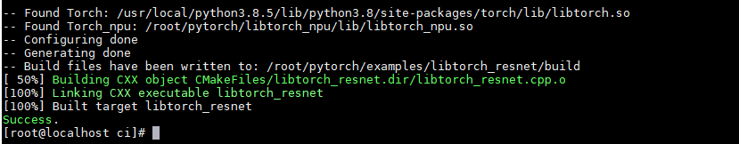

# Building libtorch_npu

<!-- md-trans-meta sourceCommit=unknown translatedAt=2026-06-15T03:37:26.268Z pushedAt=2026-06-15T07:27:21.196Z -->

libtorch_npu is the C++ version of the torch_npu plugin, which includes the header files, library files, and CMake configuration files required to use the torch_npu plugin. Through libtorch_npu, you can use C++ APIs exposed by the torch_npu plugin.

## Build Procedure

1. Refer to [Pre-installation Preparation](preparing_installation.md) and [Installing PyTorch](installing_PyTorch.md) to install PyTorch dependencies.
2. Obtain the libtorch_npu source code.

    ```bash
    git clone -b v2.7.1-26.0.0 https://gitcode.com/Ascend/pytorch.git
    cd pytorch
    git submodule update --init --recursive
    ```

    Pull the corresponding Ascend Extension for PyTorch branch code, for example v2.7.1-26.0.0. For other versions, refer to the "[Version Mapping](../release_notes/release_notes.md)" section in the *Release Notes* to download the corresponding branch code.

3. Execute the build to generate the libtorch_npu installation package.

    > [!NOTE]
    >
    > Currently, libtorch_npu uses CXX11_ABI=0 by default. It can be configured to CXX11_ABI=1 with the following command:
    >
    > ```bash
    > export _GLIBCXX_USE_CXX11_ABI=1
    > ```
    >
    > You can choose the ABI version based on actual conditions, ensuring it is consistent with the ABI of the PyTorch framework.

    ```bash
    python3 build_libtorch_npu.py
    ```

    The CMake version required for build must be 3.18.0 or later. Refer to [Installing CMake 3.18.4](installing_cmake_3-18-4.md).

    The release version is compiled by default. If the debug version is needed, add the DEBUG=1 environment variable. After build is complete, a libtorch_npu directory is generated in the current directory, containing the following files.

    - include: Generated C++ header files.
    - lib: Generated C++ library files.
    - share: Contains Torch_npuConfig.cmake, which is used to obtain necessary configuration files such as header files and library files during user build and building.

## libtorch Inference Test

Take the **pytorch/examples/libtorch_resnet** model under the v2.7.1-26.0.0 branch of the Ascend Extension for PyTorch source repository as an example to introduce the quick use of libtorch inference.

1. You need to install torch, torch_npu, torchvision, hypothesis, expecttest, and packaging in advance.
    - For the installation of torch, torch_npu, and torchvision, see [Installing PyTorch](installing_PyTorch.md) and [Installing torchvision](installing_torchvision.md).
    - To install hypothesis, expecttest, and packaging, run the following command. If you are installing as a non-root user, add `--user` to the command, for example: `pip3 install expecttest --user`.

        ```bash
        pip3 install expecttest
        pip3 install packaging
        pip3 install hypothesis
        ```

2. Add the NPU build configuration to the build file.

    For the build file that has been adapted for NPU, see "pytorch/examples/libtorch_resnet/**CMakeLists.txt**", which can be used directly for build.

    If you use a custom CMakeLists.txt build file, they need to add the following content to reference the libtorch_npu plugin for subsequent NPU-based build.

    ```cmake
    set(torch_npu_path path_to_libtorch_npu)         # Set the path to libtorch_npu
    include_directories(${torch_npu_path}/include)   # Set the include path for libtorch_npu header files
    link_directories(${torch_npu_path}/lib)          # Set the library path for libtorch_npu
    
    target_link_libraries(libtorch_resnet torch_npu) # Link the torch_npu library
    ```

3. To initialize and run the model on an NPU device, modify the GPU APIs in the C++ code to NPU-compatible APIs. The corresponding modifications have already been made in the current script. You can refer to the following content to modify their actual development scripts. For the model code file that has been adapted for NPU, see "pytorch/examples/libtorch\_resnet/**libtorch\_resnet.cpp**".

    The code example is as follows: include the torch\_npu header file and set the initialization device. When NPU usage ends, you need to call torch\_npu::finalize\_npu\(\) to release resources; otherwise, an error message may appear.

    ```Cpp
    // To use libtorch_npu related interfaces, include the libtorch_npu header file
    #include<torch_npu/torch_npu.h>
    
    // Initialize before using the NPU device
    torch_npu::init_npu("npu:0");
    
    // Construct an NPU device by passing an NPU string
    auto device = at::Device("npu:0");
    
    // Deinitialization is required after using the NPU device
    torch_npu::finalize_npu();
    ```

    **Table 1** C++ API description

    |API|Description|
    |--|--|
    |torch_npu::init_npu()|Initialization is required before using the NPU device. The input value format is npu:*id*, where *id* is the NPU card number.|
    |at::Device()|Constructs an NPU device by passing an NPU string. The input value format is npu:*id*, where *id* is the NPU card number.|
    |torch_npu::finalize_npu()|Deinitialization is required after using the NPU device. The input value format is npu:*id*, where *id* is the NPU card number.|

4. Execute build and inference.

    The "pytorch/examples/libtorch\_resnet/**resnet\_trace.py**" script is used to export the TorchScript file, which can be used for libtorch inference.

    For build and inference scripts, refer to "pytorch/ci/**libtorch\_resnet.sh**". The provided script has integrated the export of torchscript files, build, and inference. Execute the following command to compile and perform inference:

    ```bash
    bash libtorch_resnet.sh
    ```

    The following output indicates a successful build.

    **Figure 1** Command output  
    

    > [!NOTE]  
    > If an error occurs in the aarch64 environment indicating that the torch.libs/\*.so library does not exist, refer to [torch.libs/libopenblasp-r0-56e95da7.3.24.so does not exist](torch-libs-libopenblasp-r0-56e95da7-3-24-so_not_exist.md).
