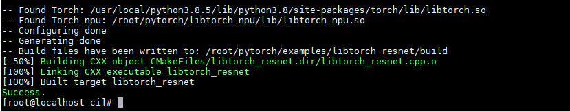

# Building libtorch_npu

libtorch_npu is the C++ version of the torch_npu plugin, which includes the header files, library files, and CMake configuration files required to run the torch_npu plugin. Through libtorch_npu, you can use the C++ interfaces exposed by the torch_npu plugin.

## Build Procedure

1. Refer to [Pre-installation Preparation](preparing_installation.md) and [Installing PyTorch](installing_PyTorch.md) to install the dependencies and PyTorch.
2. Obtain the libtorch_npu source code.

    ```bash
    git clone -b v2.7.1-26.1.0 https://gitcode.com/Ascend/pytorch.git
    cd pytorch
    git submodule update --init --recursive
    ```

    Taking v2.7.1-26.1.0 as an example, pull the corresponding torch_npu branch code. To download the branch code of other torch_npu versions, see the "[Version Mapping](../release_notes/release_notes.md)" section in the *Release Notes*.

3. Run the build to generate the libtorch_npu installation package.
    > [!NOTE]
    > 
    > Currently, libtorch_npu uses CXX11_ABI=0 by default and supports configuring CXX11_ABI=1. The command is as follows:
    >
    > ```bash
    > export _GLIBCXX_USE_CXX11_ABI=1
    > ```
    >
    > You can select the ABI version based on actual conditions. The ABI must be consistent with that of the PyTorch framework.

    ```bash
    python3 build_libtorch_npu.py
    ```

    The CMake version required for the build must be 3.18.0 or later. See [Installing CMake 3.18.4](installing_cmake_3-18-4.md).

    The release version is built by default. If you need the debug version, add the DEBUG=1 environment variable. After the build is complete, the libtorch_npu directory is generated in the current directory, containing the following files.

    - include: Generated C++ header files.
    - lib: Generated C++ library files.
    - share: Contains Torch_npuConfig.cmake, which is used to obtain the necessary header files, library files, and other configuration files during the build.

## libtorch Inference Test

Take the **pytorch/examples/libtorch_resnet** model under the v2.7.1-26.1.0 branch of the torch_npu source repository as an example to describe the quick use of libtorch inference.

1. You need to install torch, torch_npu, torchvision, hypothesis, expecttest, and packaging in advance.
    - For the installation of torch, torch_npu, and torchvision, see [Installing PyTorch](installing_PyTorch.md) and [Installing torchvision](installing_torchvision.md).
    - To install hypothesis, expecttest, and packaging, run the following commands. If you install as a non-root user, append `--user` to the command, for example: `pip3 install expecttest --user`.

        ```bash
        pip3 install expecttest
        pip3 install packaging
        pip3 install hypothesis
        ```

2. Add the NPU build configuration to the build file.

    For the build file that has been adapted for NPU, see "pytorch/examples/libtorch_resnet/**CMakeLists.txt**", which can be used directly for the build.

    If you use a custom CMakeLists.txt build file, you need to add the following content to reference the libtorch_npu plugin for subsequent NPU-based build.

    ```cmake
    set(torch_npu_path path_to_libtorch_npu)         # Set the path to libtorch_npu
    include_directories(${torch_npu_path}/include)   # Set the include path for libtorch_npu header files
    link_directories(${torch_npu_path}/lib)          # Set the library path for libtorch_npu
    
    target_link_libraries(libtorch_resnet torch_npu) # Link the torch_npu library
    ```

3. To initialize and run the model on an NPU device, you need to modify the GPU APIs in the C++ code to the APIs adapted for NPU. The current script has already made the corresponding modifications. You can refer to the following content to modify your actual development scripts. For the model code file that has been adapted for NPU, see "pytorch/examples/libtorch_resnet/**libtorch_resnet.cpp**".

    The code example is as follows. Include the torch_npu header file and set the Device for initialization. When NPU usage ends, you need to call torch_npu::finalize_npu() to release resources. Otherwise, an error message may be reported.

    ```Cpp
    // To use the libtorch_npu interfaces, include the libtorch_npu header file
    #include<torch_npu/torch_npu.h>
    
    // Initialize the NPU device before use
    torch_npu::init_npu("npu:0");
    
    // Construct an NPU device by passing an NPU string
    auto device = at::Device("npu:0");
    
    // Deinitialize after using the NPU device
    torch_npu::finalize_npu();
    ```

    **Table 1** C++ API description

    |API|Description|
    |--|--|
    |torch_npu::init_npu()|Initialization is required before using the NPU device. The input value format is npu:*id*, where *id* is the NPU card number.|
    |at::Device()|Constructs an NPU device by passing an NPU string. The input value format is npu:*id*, where *id* is the NPU card number.|
    |torch_npu::finalize_npu()|Deinitialization is required after using the NPU device. The input value format is npu:*id*, where *id* is the NPU card number.|

4. Run the build and perform inference.

    The "pytorch/examples/libtorch_resnet/**resnet_trace.py**" script is used to export the TorchScript file, which can be used for libtorch inference.

    For the build and inference scripts, see "pytorch/ci/**libtorch_resnet.sh**". The provided script has integrated the export of the TorchScript file, build, and inference. Run the following command to build and perform inference:

    ```bash
    bash libtorch_resnet.sh
    ```

    The following output indicates a successful build.

    **Figure 1** Command output
    

    > [!NOTE]
    >
    > In the aarch64 environment, an error is reported that the `torch.libs/*.so` library does not exist. See [torch.libs/libopenblasp-r0-56e95da7.3.24.so does not exist](FAQ.md#torchlibslibopenblasp-r0-56e95da7324so-link-error-or-libgfortran-missing).
