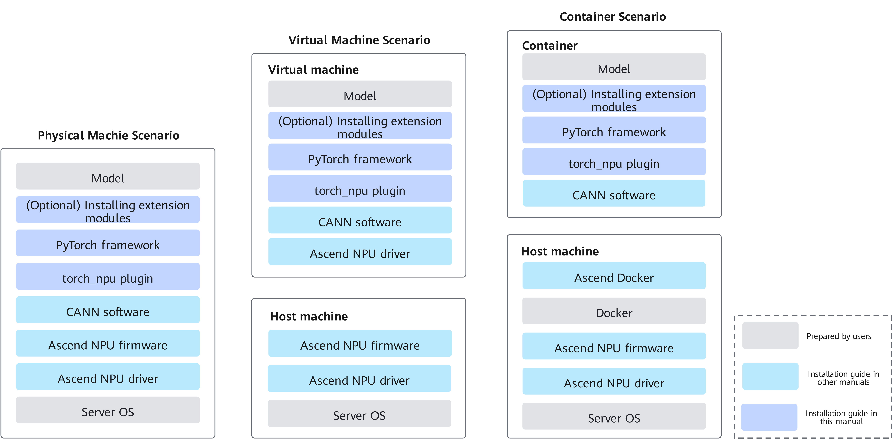

# Installation Instructions

<!-- md-trans-meta sourceCommit=unknown translatedAt=2026-06-15T03:37:46.091Z pushedAt=2026-06-15T07:27:21.202Z -->

To provide PyTorch developers with access to the powerful computing capabilities of Ascend AI processors, Ascend provides the Ascend Extension for PyTorch (the torch_npu plugin) as an adaptation layer for the PyTorch framework.

This document guides you through the quick installation of the PyTorch framework, the Ascend Extension for PyTorch (torch_npu plugin), and related extension modules.

## Installation Solution

This document covers installation of drivers, firmware, CANN software, the PyTorch framework, and the torch_npu plugin in physical machine, container, and virtual machine scenarios. The deployment architecture is shown in [Figure 1](#installation-solution-diagram).

**Figure 1** Installation solution  

## Hardware Compatibility and Supported Operating Systems

**Table 1** Supported hardware products

|Product|Supported (Training Scenario)|
|--|:-:|
|<term>Atlas A3 training products</term>|√|
|<term>Atlas A3 inference products</term>|x|
|<term>Atlas A2 training products</term>|√|
|<term>Atlas A2 inference products</term>|x|
|<term>Atlas 200I/500 A2 inference products</term>|x|
|<term>Atlas inference products</term>|x|
|<term>Atlas training products</term>|√|

> [!NOTE]
>
> In the above table, "√" indicates supported, and "x" indicates not supported.

- For the operating systems supported by each hardware product in physical machine deployment scenarios, refer to the [Compatibility Query Assistant](https://www.hiascend.com/en/hardware/compatibility/).

- For the operating systems supported by each hardware product in virtual machine and container deployment scenarios, refer to the [OS Compatibility](https://www.hiascend.com/document/detail/en/canncommercial/900/softwareinst/instg/instg_0101.html?OS=openEuler&InstallType=netyum) section in *CANN Software Installation* (commercial version) or the [OS Compatibility](https://www.hiascend.com/document/detail/zh/CANNCommunityEdition/900/softwareinst/instg/instg_0101.html?OS=openEuler&InstallType=netyum) section (community version).

## Installation Methods

This guide provides offline installation (whl) and source code installation methods. You can choose the method for installing the PyTorch framework and the torch_npu plugin based on actual requirements, and the two installation methods are not required to be the same.
