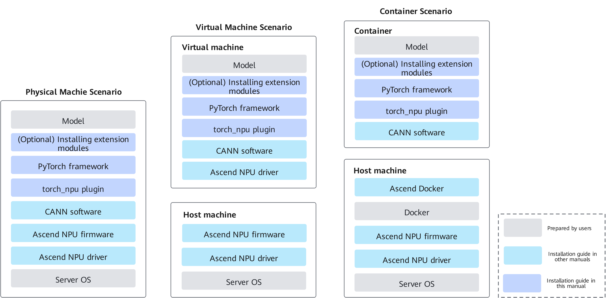

# Installation Instructions

To provide developers who use the PyTorch framework with the powerful computing capability of Ascend AI processors, Ascend has developed TorchNPU to adapt to the PyTorch framework.

This document mainly introduces how to quickly complete the installation of the PyTorch framework, TorchNPU, and extension modules.

## Installation Solution

This document provides solutions for installing drivers, firmware, CANN software, the PyTorch framework, and the TorchNPU plugin in physical machine, container, and virtual machine scenarios. The deployment architecture is shown in [Figure 1](#figure1).

**Figure 1**  Installation solution  

## Hardware Compatibility and Supported Operating Systems

**Table 1**  Supported hardware products

|Product|Supported|
|--|:-:|
|<term>Ascend 950DT</term>|√|
|<term>Atlas A3 training products</term>|√|
|<term>Atlas A3 inference products</term>|x|
|<term>Atlas A2 training products</term>|√|
|<term>Atlas A2 inference products</term>|x|
|<term>Atlas training products</term>|√|
|<term>Atlas inference products</term>|x|
|<term>Atlas 200I/500 A2 inference products</term>|x|

> [!NOTE]
>
> In the table, "√" indicates supported, and "x" indicates not supported.

- For more details about Ascend product forms, refer to the [Ascend Product Form Description](https://www.hiascend.com/document/detail/en/AscendFAQ/ProduTech/productform/hardwaredesc_0001.html).
- For the operating systems supported by each hardware product in physical machine deployment scenarios, refer to the [Compatibility Query Assistant](https://www.hiascend.com/hardware/compatibility).
- For the operating systems supported by each hardware product in virtual machine and container deployment scenarios, refer to the "OS Compatibility" section in *CANN Software Installation*.
<!-- "[OS Compatibility](https://www.hiascend.com/document/detail/en/CANNCommunityEdition/910/softwareinst/instg/instg_0101.html?OS=openEuler&InstallType=netyum)" -->

## Installation Methods

This guide provides offline installation (Whl) and source code installation methods. You can choose the installation method for the PyTorch framework and the TorchNPU plugin based on your actual requirements. The two installation methods are not required to be the same.
