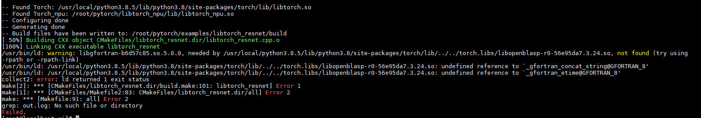

<!-- md-trans-meta sourceCommit=unknown translatedAt=2026-06-15T03:37:29.652Z pushedAt=2026-06-15T07:27:21.198Z -->

# torch.libs/libopenblasp-r0-56e95da7.3.24.so Link Error or Missing libgfortran

## Symptom

When performing libtorch inference tests in an aarch64 environment, the build depends on torch.libs/\*.so libraries, which need to be loaded manually.

- Error screenshot

    

- Error message

    ```text
    [100%] Linking CXX executable libtorch_resnet
    /usr/bin/ld: warning: libgfortran-b6d57c85.so.5.0.0, needed by /usr/local/python3.8.5/lib/python3.8/site-packages/torch/lib/../../torch.libs/libopenblasp-r0-56e95da7.3.24.so, not found (try using     -rpath or -rpath-link)
    /usr/bin/ld: /usr/local/python3.8.5/lib/python3.8/site-packages/torch/lib/../../torch.libs/libopenblasp-r0-56e95da7.3.24.so: undefined reference to `_gfortran_concat_string@GFORTRAN_8'
    /usr/bin/ld: /usr/local/python3.8.5/lib/python3.8/site-packages/torch/lib/../../torch.libs/libopenblasp-r0-56e95da7.3.24.so: undefined reference to `_gfortran_etime@GFORTRAN_8'
    collect2: error: ld returned 1 exit status
    make[2]: *** [CMakeFiles/libtorch_resnet.dir/build.make:101: libtorch_resnet] Error 1
    make[1]: *** [CMakeFiles/Makefile2:83: CMakeFiles/libtorch_resnet.dir/all] Error 2
    make: *** [Makefile:91: all] Error 2
    ```

## Solution

Add the link to the torch.libs/\*.so library in the CMakeLists.txt build file. The code example is as follows:

```cmake
set(CMAKE_CXX_FLAGS "${CMAKE_CXX_FLAGS} ${TORCH_CXX_FLAGS}")

# Add the search path for the torch.libs/*.so library during the compile and link phase. Replace the library path in the following command line based on your actual situation.
link_directories(/usr/local/python3.8.5/lib/python3.8/site-packages/torch.libs)  

add_executable(libtorch_resnet libtorch_resnet.cpp)
target_link_libraries(libtorch_resnet "${TORCH_LIBRARIES}")
target_link_libraries(libtorch_resnet "${TORCH_NPU_LIBRARIES}")
```
