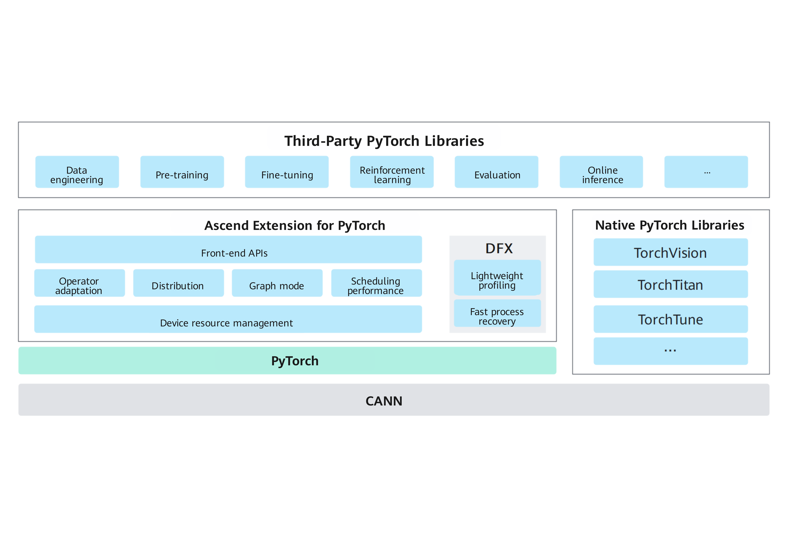

# Ascend Extension for PyTorch

<!-- md-trans-meta sourceCommit=unknown translatedAt=2026-06-14T00:44:17.982Z pushedAt=2026-06-14T07:51:04.563Z -->

Ascend Extension for PyTorch (also known as the torch_npu plugin) is a deep learning adaptation framework that enables Ascend NPUs to support the PyTorch ecosystem. It provides PyTorch developers with access to the powerful computing capabilities of Ascend AI processors.

[Source code](https://gitcode.com/Ascend/pytorch) is available here.

## Overall Architecture

The overall architecture of Ascend Extension for PyTorch is shown below.

**Figure 1** Ascend Extension for PyTorch overall architecture

- Ascend Extension for PyTorch: The Ascend PyTorch adaptation plugin, which inherits open-source PyTorch features and is deeply optimized for the Ascend AI processor series, supporting users in implementing model training and tuning based on the PyTorch framework.
- PyTorch native library/third-party library adaptation: Adapts to support PyTorch native libraries and mainstream third-party libraries, complementing ecosystem capabilities and improving the ease of use of the Ascend platform.

## Key Features and Capabilities

- **Device Adaptation and Operator Dispatch**: Based on the PyTorch Dispatcher mechanism, the NPU is registered as a native device type in PyTorch. The execution logic of operators on the NPU remains consistent with that on CPU/CUDA. Two custom operator development methods are provided, OpPlugin and C++ extensions, to meet the requirements for high-performance custom operators.
- **Basic Framework Capabilities**: The extension fully inherits PyTorch's core framework capabilities, including eager mode, automatic differentiation, profiling, and optimizers. It interfaces with Ascend hardware through the CANN Runtime API, enabling efficient NPU execution while preserving PyTorch's native semantics.
- **Memory Management**: A built-in NPU memory allocator with caching (`NPUCachingAllocator`) supports memory pool reuse, swap-in/swap-out, multi-stream memory reuse, pluggable custom allocators. These features effectively reduce memory fragmentation and allocation overhead. The allocator also supports a memory snapshot feature that automatically generates a device memory snapshot to assist with troubleshooting when out-of-memory (OOM) errors occur.
- **Graph Compilation Acceleration**: Supports `torch.compile` by capturing computation graphs through the Dynamo frontend and integrating multiple compilation backends such as inductor (operator fusion + code generation), NPUGraphs (graph sinking with one-time capture and multiple replays), and NPUGraph_EX (graph sinking + graph optimization + compilation cache reuse), significantly reducing kernel launch overhead and adapting to various training and inference scenarios.
- **Distributed Training**: Supports native distributed data-parallel training and provides collective communication primitives (Broadcast, AllReduce, etc.). It also supports advanced parallel strategies such as FSDP2, tensor parallelism, and pipeline parallelism. The underlying HCCL communication library enables efficient data exchange between NPUs.
- **Model Inference**: Supports exporting standard ONNX models, which can be converted into offline inference models using offline conversion tools, fully leveraging NPU inference acceleration capabilities.

## More Information

To explore further, see the online course: [Ascend Extension for PyTorch](https://www.hiascend.com/edu/courses?activeTab=Ascend+Extension+for+PyTorch).
