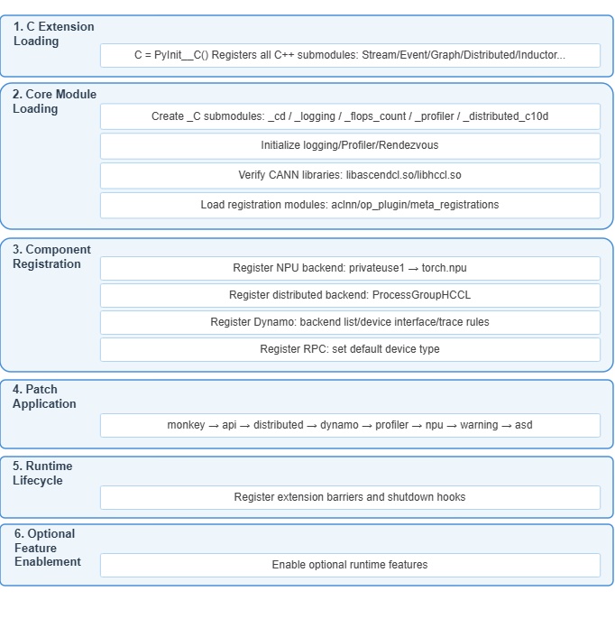
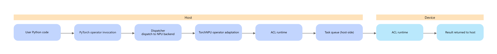
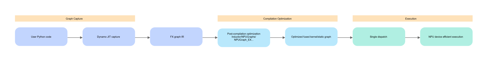
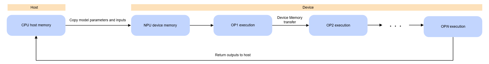

# TorchNPU Overview

TorchNPU is a deep learning adaptation framework based on Ascend. It enables Ascend NPU to support the PyTorch framework and provides PyTorch users with the exceptional computing power of Ascend AI processors. TorchNPU adopts the **device adaptation** implementation approach. It registers Ascend NPU as a new backend device in the Device abstraction layer of PyTorch, alongside device types such as CPU and CUDA. Developers only need to specify NPU as the device in the code, and the native operator dispatch mechanism of PyTorch automatically routes computation tasks to the NPU for execution, without modifying the model structure or training logic.

TorchNPU sits between the upper-layer APIs of PyTorch and the underlying Ascend CANN (heterogeneous computing architecture) software stack. Upward, it carries all the features of the PyTorch framework (dynamic graphs, automatic differentiation, Profiling, and so on). Downward, it interfaces with the ACL (Ascend Compute Language) runtime, operator libraries, and the HCCL collective communication library of CANN, completing the full mapping from PyTorch operators to NPU-executable kernels.

By design, TorchNPU inherits the native features of the PyTorch framework to the greatest extent possible. Developers almost do not need to change their original development habits or coding style:

- **Consistent APIs**: Uses the exact same Python APIs as native PyTorch. You only need to replace `.cuda()` with `.npu()` for tensors and models to complete device migration.
- **Consistent execution modes**: Supports both Eager Mode (single-operator execution of dynamic graphs, the default mode) and Graph Mode (`torch.compile` compilation execution), keeping the usage consistent with native PyTorch.
- **Ecosystem compatibility**: Adapts PyTorch native libraries and mainstream third-party libraries (for example, torchvision and transformers), complementing the ecosystem capabilities of the Ascend platform.
- **Consistent debugging experience**: Supports native PyTorch development and debugging tools such as Profiling, automatic differentiation, and gradient checking, reducing the learning cost.

For the project source code, see [details](https://gitcode.com/Ascend/pytorch) here.

## Software Architecture

TorchNPU adopts a **C++/Python two-layer architecture**. The C++ layer provides underlying capabilities in the form of the `torch_npu._C` extension module, and the Python layer builds user-oriented complete APIs and feature sets on top of it. From top to bottom, the overall architecture is divided into the following layers:

| Layer | Composition | Description |
| ------ | ------ | ------ |
| **Application layer** | User model code | Model training/inference code written by developers using standard PyTorch APIs |
| **PyTorch framework layer** | PyTorch Core | Open-source PyTorch core framework, providing infrastructure such as autograd automatic differentiation, nn.Module, optimizers, DataLoader, and Dispatcher operator dispatch |
| **TorchNPU adaptation layer (Python)** | TorchNPU Python package | User-oriented Python API layer, including modules such as the initialization framework, NPU device interfaces, graph compilation backend, distributed training, and Profiling |
| **TorchNPU adaptation layer (C++)** | `torch_npu._C` extension module | C++ core bound through PyBind11, including underlying implementations such as tensor infrastructure, memory allocators, operator execution framework, HCCL communication, and the Inductor backend |
| **Computing library layer** | CANN software stack | Ascend heterogeneous computing architecture, providing the ACL runtime, GE graph engine, AICPU/TBE/AI Core operator libraries, and HCCL collective communication library |
| **Hardware layer** | Ascend NPU processors | Ascend AI processor hardware, integrating heterogeneous computing units such as AI Core, AI CPU, and Vector Core, as well as HCCS high-speed interconnection |

## Initialization Process

The startup of TorchNPU follows a strict six-stage initialization sequence to ensure that modules are loaded and initialized in the correct dependency order, achieving seamless integration between PyTorch and Ascend NPU:

## Data Flow

**End-to-end data flow in Eager Mode (dynamic graph mode):**

In Eager Mode, each operator is dispatched and executed independently, retaining the flexibility and real-time feedback capability of PyTorch dynamic graphs. The NPU supports concurrent execution of multiple streams. Through Stream-level TaskQueue, two-level pipeline parallel dispatch is implemented, reducing the scheduling latency between the Host and Device.

**End-to-end data flow in Graph Mode (graph compilation mode):**

Graph Mode is enabled with one click through `torch.compile()`. The Dynamo frontend compiles Eager code into FX graphs in real time, and the compilation backend is responsible for operator fusion, memory optimization, and code generation. NPUGraphs sinks the captured graphs to the NPU side, supporting one-time capture and multiple replays to eliminate repeated kernel startup overhead. The Inductor backend implements deep optimization at the computation graph level through operator fusion and code generation.

**Tensor data flow:**

Model parameters and input data are copied from the CPU Host memory to the NPU Device memory (HBM). During computation, tensor data resides on the NPU Device side, and each operator passes intermediate results directly through Device memory. Finally, the output results are transferred back to the Host side as required.

## Key Features

- **Device adaptation and operator dispatch**: Based on the PyTorch Dispatcher mechanism, NPU is registered as a native device type of PyTorch, and the execution logic of operators on the NPU is consistent with that on CPU/CUDA. In addition, two custom operator development methods, OpPlugin and C++ Extensions, are provided to meet the requirements of high-performance custom operators.
- **Basic framework functions**: Fully inherits the basic framework capabilities of PyTorch, such as dynamic graphs, automatic differentiation, Profiling, and optimizers. It interfaces with Ascend hardware through the CANN Runtime API, achieving efficient execution on the NPU while preserving the native semantics of PyTorch.
- **Memory management**: Provides a built-in cached NPU memory allocator (`NPUCachingAllocator`), supporting memory pool reuse, swap-in and swap-out, multi-stream memory reuse, and pluggable custom allocators, effectively reducing memory fragmentation and allocation overhead. It supports the memory snapshot function, which automatically generates a Device memory snapshot to assist in fault location in the event of an OOM.
- **Graph compilation acceleration**: Supports `torch.compile`. Through the Dynamo frontend to capture computation graphs, combined with multiple compilation backends such as Inductor (operator fusion + code generation), NPUGraphs (graph sinking, one-time capture and multiple replays), and NPUGraph_EX (graph sinking + graph optimization + compilation cache reuse), kernel startup overhead is significantly reduced, adapting to different training and inference scenarios.
- **Distributed training**: Supports native distributed data parallel training and provides collective communication primitives (Broadcast, AllReduce, and so on). It also supports advanced parallel strategies such as FSDP2, tensor parallelism, and pipeline parallelism. Efficient data interaction between NPUs is implemented based on the HCCL communication library.
- **Model inference**: Supports exporting standard ONNX models. The ONNX models can be converted into offline inference models through offline conversion tools, fully leveraging the NPU inference acceleration capability.

## More Information

For more information about TorchNPU, see the online course: [TorchNPU](https://www.hiascend.com/edu/courses?activeTab=Ascend+Extension+for+PyTorch).
