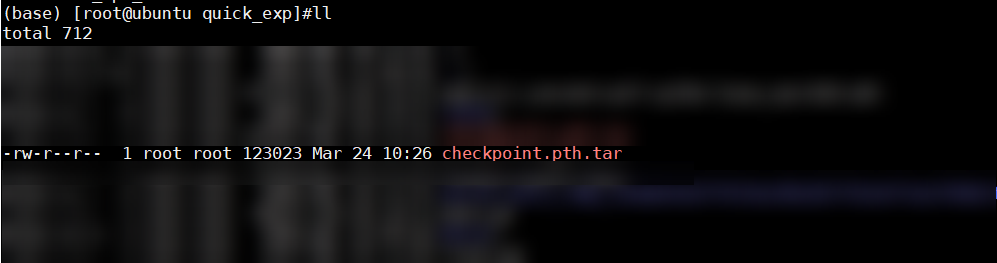

# Quick Start

<!-- md-trans-meta sourceCommit=e6dd39e7131a89f72cf49d80d53002e4cc645bbf translatedAt=2026-07-08T10:24:07.374Z pushedAt=2026-07-08T10:47:16.885Z -->

## Environment Preparation

This quick start uses the Atlas 800T A2 training server as an example.

- Install the matching versions of NPU driver firmware and CANN software (Toolkit, ops, and NNAL). For details, see [CANN Software Installation](https://www.hiascend.com/document/detail/en/CANNCommunityEdition/900/softwareinst/instg/instg_0000.html?OS=openEuler&InstallType=netyum):
  - Operating system: Select an available operating system (for compatibility, see the [Compatibility Query Assistant](https://www.hiascend.com/hardware/compatibility))
  - Installation type: Select "Offline Installation"
- Install the PyTorch framework and the torch_npu plugin. For details, see [Ascend Extension for PyTorch Software Installation Guide](../installation_guide/installation_description.md).

## Model Migration Training

This section provides a simple model migration example using the simplest automatic migration method, helping users quickly experience the process of migrating GPU model scripts to Ascend NPUs. This example is based on a CNN model script for recognizing handwritten digits. The original GPU training code is modified so that it can be migrated to Ascend NPUs for training.

1. Create a new script train.py and write the following original GPU script code into it.

    ```python
    # Import modules
    import time
    import torch
    import torch.nn as nn
    from torch.utils.data import Dataset, DataLoader
    import torchvision
    
    # Initialize the running device
    device = torch.device('cuda:0')   
    
    # Define the model network
    class CNN(nn.Module):
        def __init__(self):
            super(CNN, self).__init__()
            self.net = nn.Sequential(
                # Convolutional layer
                nn.Conv2d(in_channels=1, out_channels=16,
                          kernel_size=(3, 3),
                          stride=(1, 1),
                          padding=1),
                # Pooling layer
                nn.MaxPool2d(kernel_size=2),
                # Convolutional layer
                nn.Conv2d(16, 32, 3, 1, 1),
                # Pooling layer
                nn.MaxPool2d(2),
                # Flatten multi-dimensional input
                nn.Flatten(),
                nn.Linear(32*7*7, 16),
                # Activation function
                nn.ReLU(),
                nn.Linear(16, 10)
            )
        def forward(self, x):
            return self.net(x)
    
    # Download dataset
    train_data = torchvision.datasets.MNIST(
        root='mnist',
        download=True,
        train=True,
        transform=torchvision.transforms.ToTensor()
    )
    
    # Define training parameters
    batch_size = 64   
    model = CNN().to(device)  # Define model
    train_dataloader = DataLoader(train_data, batch_size=batch_size)    # Define DataLoader
    loss_func = nn.CrossEntropyLoss().to(device)    # Define loss function
    optimizer = torch.optim.SGD(model.parameters(), lr=0.1)    # Define optimizer
    epochs = 10  # Set the number of epochs
    
    # Set up the loop
    for epoch in range(epochs):
        for imgs, labels in train_dataloader:
            start_time = time.time()    # Record the training start time
            imgs = imgs.to(device)    # Place the image data on the specified NPU
            labels = labels.to(device)    # Place the label data on the specified NPU
            outputs = model(imgs)    # Forward computation
            loss = loss_func(outputs, labels)    # Loss function calculation
            optimizer.zero_grad()
            loss.backward()    # Loss function backward computation
            optimizer.step()    # Update optimizer
    
    # Define model saving
    torch.save({
                   'epoch': 10,
                   'arch': CNN,
                   'state_dict': model.state_dict(),
                   'optimizer' : optimizer.state_dict(),
                },'checkpoint.pth.tar')
    ```

2. Add the following code to train.py.

    - If you are using Atlas training products, you need to enable mixed precision after migration is complete and before training begins, due to their architectural characteristics.
    - If you are using Atlas A2 training or Atlas A3 training products, you can choose whether to enable mixed precision.

    > [!NOTE]
    >
    > For details, see the "[Mixed Precision Adaptation](https://gitcode.com/Ascend/docs/blob/master/FrameworkPTAdapter/26.0.0/en/pytorch_model_migration_fine_tuning/adaptation_introduction.md)" section in *PyTorch Training Model Migration and Tuning Guide*.

    ```diff
        import time
        import torch
        ......
    +   import torch_npu
    +   from torch_npu.npu import amp # Import AMP module
    +   from torch_npu.contrib import transfer_to_npu    # Enable automatic migration
    ```

    If automatic migration is not enabled, refer to the "[Manual Migration](https://gitcode.com/Ascend/docs/blob/master/FrameworkPTAdapter/26.0.0/en/pytorch_model_migration_fine_tuning/manual_migration.md)" section in the *PyTorch Training Model Migration and Tuning Guide*.

3. Enable AMP mixed precision computation. If you are using Atlas A2 training or Atlas A3 training products, you may skip this step.

    After defining the model and optimizer, define the GradScaler for AMP functionality.

    ```python
    ......
    loss_func = nn.CrossEntropyLoss().to(device)    # Define loss function
    optimizer = torch.optim.SGD(model.parameters(), lr=0.1)    # Define optimizer
    scaler = amp.GradScaler()    # After defining the model and optimizer, define GradScaler
    epochs = 10
    ```

    Delete the following original GPU script code.

    ```diff
    ......
    for epoch in range(epochs):
        for imgs, labels in train_dataloader:
            start_time = time.time()    # Record training start time
            imgs = imgs.to(device)    # Place image data on the specified NPU
            labels = labels.to(device)    # Place label data on the specified NPU
            outputs = model(imgs)    # Forward computation
            loss = loss_func(outputs, labels)    # Loss function computation
            optimizer.zero_grad()
    -       loss.backward()    # Loss function backward computation
    -       optimizer.step()    # Update optimizer
    ```

    Add the following code to enable AMP.

    ```diff
    ......
    for i in range(epochs):
        for imgs, labels in train_dataloader:
            imgs = imgs.to(device)
            labels = labels.to(device)
    +        with amp.autocast():
                outputs = model(imgs)    # Forward computation
                loss = loss_func(outputs, labels)    # Loss function calculation
            optimizer.zero_grad()
    +        # Perform loss scaling and parameter update before and after backpropagation
    +        scaler.scale(loss).backward()    # Loss scaling and backpropagation
    +        scaler.step(optimizer)    # Update parameters (auto unscaling)
    +        scaler.update()    # Update the loss_scaling factor based on dynamic loss scale
    ```

4. Run the command to start the training script (the script name can be modified as needed).

    ```bash
    python3 train.py
    ```

    After training completes, a weight file as shown below is generated, indicating that the migration training is successful.

    

## Advanced Development

- If you want to explore more features of PyTorch model training migration, please refer to the *[PyTorch Training Model Migration and Tuning Guide](https://gitcode.com/Ascend/docs/blob/master/FrameworkPTAdapter/26.0.0/en/pytorch_model_migration_fine_tuning/overview.md)* document.
- If you want to explore more features of large model training, see Table 1.

    **Table 1** Model migration guide

    | Large Model | Component | Migration Guide |
    | -- | -- | -- |
    | Megatron-LM distributed large model | MindSpeed Core affinity acceleration module | See the [Distributed Training Acceleration Library Migration Guide](https://gitcode.com/Ascend/MindSpeed/blob/26.0.0_core_r0.12.1/docs/en/user-guide/model-migration.md). |
    | Megatron-LM large language model | MindSpeed LLM Suite | See the [MindSpeed LLM Documentation Guide](https://gitcode.com/Ascend/MindSpeed-LLM/blob/26.0.0/docs/en/docs_guide.md). |
    | Megatron-LM multimodal model | MindSpeed MM Suite | See the [MindSpeed MM Migration and Tuning Guide](https://gitcode.com/Ascend/MindSpeed-MM/blob/26.0.0/docs/en/pytorch/model_migration.md). |
    | Large language model or multimodal model | MindSpeed RL Suite | For detail, see [MindSpeed RL](https://gitcode.com/Ascend/MindSpeed-RL/tree/master). |
