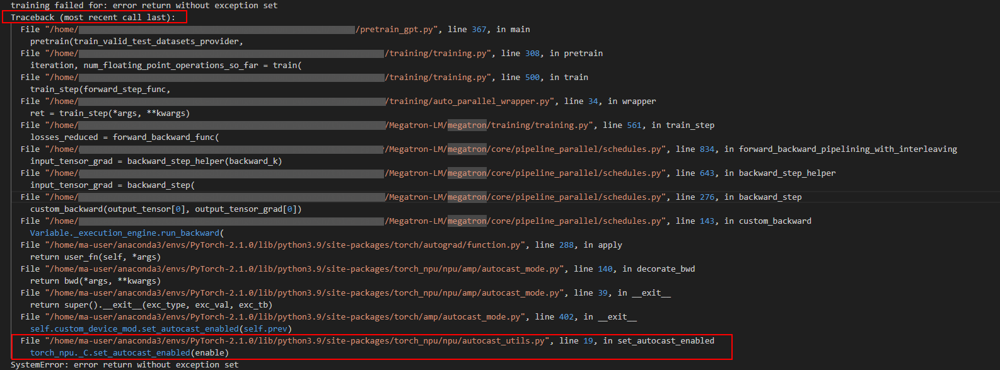

# Command Output

<!-- md-trans-meta sourceCommit=unknown translatedAt=2026-06-12T08:20:59.996Z pushedAt=2026-06-12T11:22:41.015Z -->

Command output is usually extensive, with many components outputting error messages on the screen. It can be categorized as follows:

- Python call stack and exception information
- torch_npu error codes
- CANN software error codes
- Native framework error messages

## Python Call Stack and Exception Information

When a Python error occurs, the current stack is printed on the screen. You can view the stack of the Python application by searching for the keyword "Traceback". If multiple stack information exists, prioritize viewing the first Traceback, as shown in [Figure 1](#viewing-the-stack-information-of-a-python-application).

**Figure 1** Viewing the stack information of a Python application<a id="viewing-the-stack-information-of-a-python-application"></a>  


In the output example above, you can see that the final call stack is on the `set_autocast_enabled` interface of the torch_npu. Generally, you can submit an issue in the [Ascend Community](https://gitcode.com/Ascend/pytorch/issues) for assistance.

If the final call stack is on the native torch, you can trace upward along the stack to find Ascend-related stacks. If the entire stack contains no Ascend-related stacks, check whether the model training script has issues.

## torch_npu Error Codes

During model training, the printed error code information may vary depending on the scenario, mode, and cause of the fault. Therefore, it is necessary to perform joint location using the specific error message and plogs. For detailed information about torch_npu error codes, see [Error Code Introduction](error_codes_introduction.md).

The representation of error codes in the output is as follows:

\[ERROR\] \[%s\] \(PID:\[%s\], Device:\[%s\], RankID:\[%s\]\) ERR\[%s\]\[%s\] \[%s\] \[%s\]

## CANN Error Codes

Due to different scenarios, use cases, and causes of failures, the printed error code information varies. Therefore, in the examples, the \[%s\] variable is used to replace the actual printed logs. The actual logs replaced by \[%s\] are subject to the screen printout. For detailed information about CANN software error codes, see the [Error Codes](https://www.hiascend.com/document/detail/en/CANNCommunityEdition/900/maintenref/troubleshooting/troubleshooting_0225.html) section in *CANN Troubleshooting*.

For example, the representation of the E10035 error code in the manual is as follows:

E10035: \[PID:  _xxxxxx_\]  _Timestamp_  The \[--dynamic\_batch\_size\], \[--dynamic\_image\_size\], or \[--dynamic\_dims\] argument has  \[%s\] profiles, which is less than the minimum \[%s\].

As shown in [Figure 2](#CANN-software-error-code-echo-example), there are Python call stack errors, torch_npu error codes (ERR00100), and CANN software error codes (EZ3002). Users can see from the following example that the CANN software error code is at the very front, so they should focus on its error message. From the error message, you can see that there is an unsupported operator. You can obtain the [logs](https://www.hiascend.com/support) to contact technical support.

**Figure 2** CANN software error code output example<a id="CANN-software-error-code-echo-example"></a>  


## Native Framework Error Messages

Check whether the Python call stack involves native framework error messages, similar to the following output (using PyTorch 2.1.0 as an example). You can contact [technical support](https://github.com/pytorch/pytorch/issues).

```Python
import torch
t1 = torch.tensor([[1, 2], [3, 4]],dtype=torch.bfloat16)
t2 = torch.tensor([2, 3],dtype=torch.bfloat16)
torch.isin(t1, t2)
Traceback (most recent call last):
  File "<stdin>", line 1, in <module>
RuntimeError: Unsupported input type encountered for isin(): BFloat16
```
