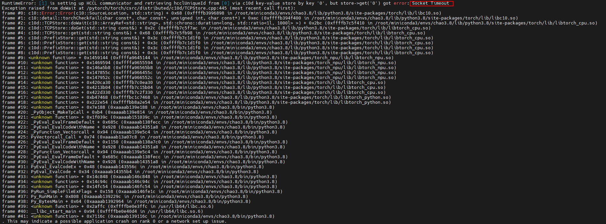

# Communication Domain Link Establishment Timeout

<!-- md-trans-meta sourceCommit=unknown translatedAt=2026-06-12T08:20:48.045Z pushedAt=2026-06-12T11:22:41.014Z -->

## Symptom

Keyword **Socket Timeout**

## Cause Analysis

During multi-card model training, a communication domain link establishment timeout error occurs. Possible causes:

- The network between rank 0 and other cards is abnormal, causing other SIM wait pending timeout errors.
- Rank 0 exits abnormally, causing other SIM wait pending timeout errors.
- Rank 0 establishes the communication domain more slowly than other cards, causing other SIM wait pending timeout errors.

## Solution

1. Check the network status between rank 0 and other cards.
2. Check whether rank 0 has exited abnormally.
3. Check whether rank 0 is slow in executing the communication domain establishment operation.
