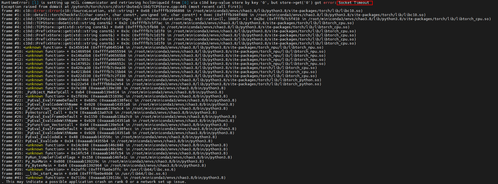

# Communication Domain Link Establishment Timeout

## Symptom

Keyword **Socket Timeout**

## Cause Analysis

During multi-card model training, a communication domain link establishment timeout error occurs. Possible causes:

- The network between card 0 and the other cards is abnormal. Therefore, the other cards wait until timeout and report errors.
- Card 0 exits abnormally. Therefore, the other cards wait until timeout and report errors.
- Card 0 establishes the communication domain more slowly than the other cards. Therefore, the other cards wait until timeout and report errors.

## Solution

1. Check the network status between card 0 and the other cards.
2. Check whether card 0 has exited abnormally.
3. Check whether card 0 is slow in executing the communication domain establishment operation.
