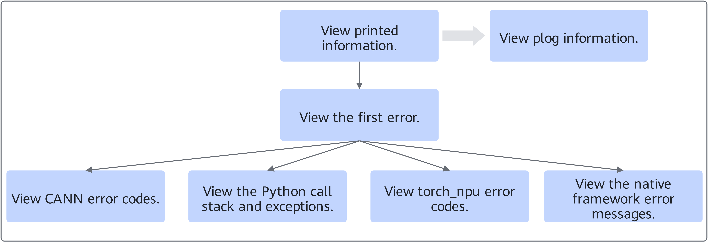
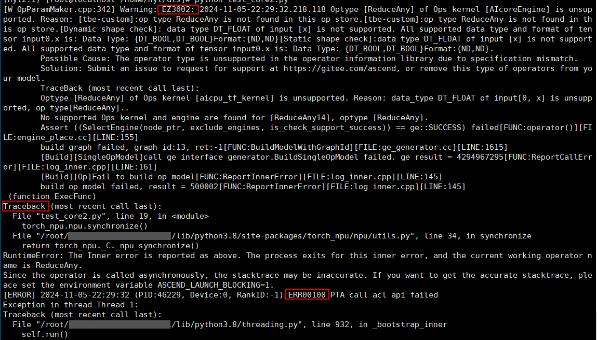
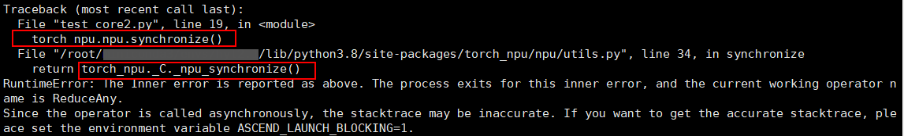
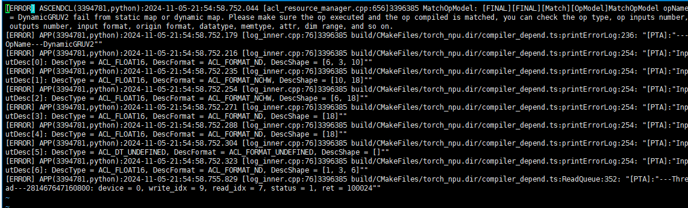

# Error Message Analysis Process

<!-- md-trans-meta sourceCommit=unknown translatedAt=2026-06-12T08:22:55.588Z pushedAt=2026-06-12T11:22:41.039Z -->

## Analysis Process

After obtaining the error message, refer to the following process for self-service problem analysis, so that developers can quickly locate and resolve faults.

**Figure 1** Error message analysis process  


1. Check the error message printed on the screen. First check the first error, then further check by category based on specific message, and finally analyze the cause of the fault.
2. If the printed message cannot definitively determine the cause of the fault, continue to check the plog to assist in the analysis.

## Analysis Example

This section uses the output message in the following figure as an example to describe how to analyze error messages.

**Figure 2** Output message example  


1. Check the first error in the output message.

    ```ColdFusion
    EZ3002: 2024-11-05-22:31:29.035.909 Optype [%s] of Ops kernel [%s] is unsupported. Reason: %s.
    ```

    "EZ3002" is the CANN software error code. You can refer to the "[Error Code Reference](https://www.hiascend.com/document/detail/en/canncommercial/850/maintenref/troubleshooting/troubleshooting_0225.html)" chapter in *CANN Troubleshooting* to perform fault analysis based on the corresponding error code information. If the source of the problem remains unclear, you can further check other output messages.

2. Check the Python call stack and exception information.

    **Figure 3**  Python call stack  
    

    The screen shows that `torch_npu.npu.synchronize()` is called first, and then `torch_npu._C._npu_synchronize()` fails. The exception information indicates that the operator running when the error occurred is ReduceAny. You can locate the corresponding abnormal component based on this. If there is no clear error indication, continue checking subsequent calls.

3. Check the torch_npu error code.

    ```ColdFusion
    ERR00100 PTA call acl api failed
    ```

    "ERR00100" is the torch_npu error code. If there is a clear error indication, clear the fault based on the specific fault cause.

4. In addition, this indicates that torch_npu reported an error when calling the underlying interface. You can also check the plog and analyze the fault cause based on the first error in the log.

    **Figure 4**  Locating the error-reporting component in the plog
    

    The error-reporting component in the above print information is ASCENDCL, and the error message is the operator DynamicGRUV2. You can locate the corresponding abnormal component based on this. If you still cannot identify the faulty component based on the error message, you can contact Huawei technical support for assistance.

> [!NOTE]
> If the output message shows a native framework error, resolve it based on the error message indication. If it involves Ascend-related issues, you can check other Ascend first error messages.
