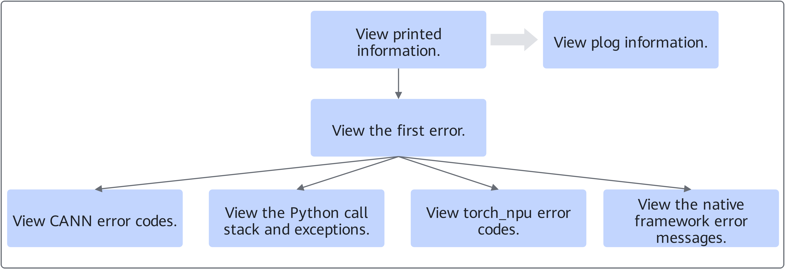
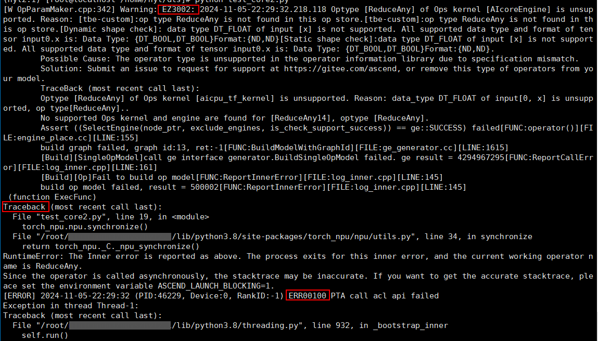
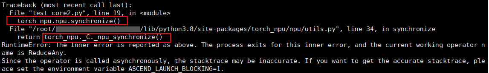
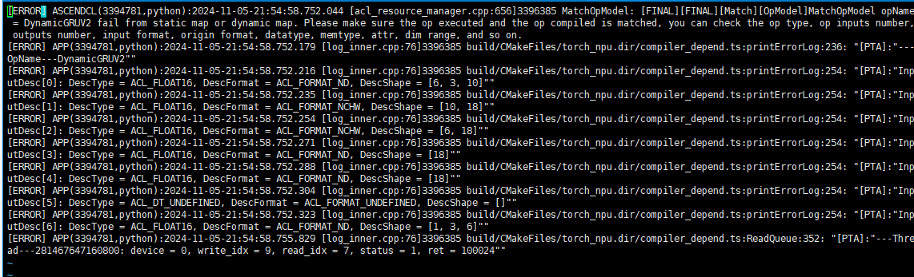

# Error Information Analysis Process

## Analysis Process

After obtaining the error information, you can refer to the following process for self-service problem analysis, so that developers can quickly locate and resolve faults.

**Figure 1**  Error information analysis process  


1. Check the error information printed on the screen. First check the first error, then further examine the information by specific categories, and finally analyze the cause of the fault.
2. If the output information cannot ultimately determine the cause of the fault, you can continue to check the plog log to assist in the analysis.

## Analysis Example

This section uses the following output information as an example to describe how to analyze error information.

**Figure 2**  Echo information example  


1. Check the first error in the output information.

    ```text
    EZ3002: 2024-11-05-22:31:29.035.909 Optype [%s] of Ops kernel [%s] is unsupported. Reason: %s.
    ```

    "EZ3002" is the CANN software error code. You can refer to the "[Error Code Reference](https://www.hiascend.com/document/detail/en/CANNCommunityEdition/910/maintenref/troubleshooting/troubleshooting_0225.html)" section in *CANN Troubleshooting* to perform fault analysis based on the corresponding error code information. If the source of the problem remains unclear, you can further check other output information.

2. Check the Python call stack and exception information.

    **Figure 3**  Python call stack  
    

    The screen shows that `torch_npu.npu.synchronize()` is called first, and then `torch_npu._C._npu_synchronize()` fails. The exception information indicates that the operator running at the time of the error is ReduceAny. You can locate the corresponding abnormal component based on this. If there is no clear error indication, continue to check the subsequent calls.

3. Check the TorchNPU error code.

    ```text
    ERR00100 PTA call acl api failed
    ```

    "ERR00100" is the TorchNPU error code. If there is a clear error indication, you can troubleshoot based on the specific fault cause.

4. In addition, this indicates that TorchNPU reports an error when calling the underlying interface. You can also check the plog log and analyze the fault cause based on the first error in the log.

    **Figure 4**  Locate the error-reporting component in the plog log  
    

    In the preceding printed information, the error-reporting component is ASCENDCL, and the error information is the operator DynamicGRUV2. You can locate the corresponding abnormal component based on this. If you still cannot identify the faulty component based on the error information, submit an issue on [GitCode Issues](https://gitcode.com/Ascend/pytorch/issues) for help.

> [!NOTE]  
> If the output information shows a native framework error, resolve it based on the error information. If it involves Ascend-related issues, check other Ascend first error information.
