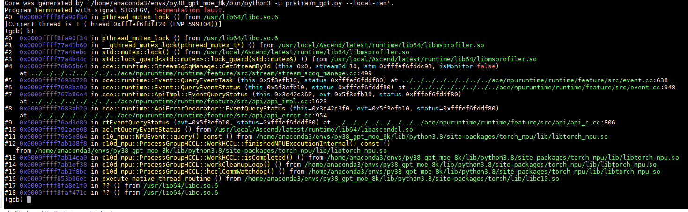

# Locating Core Dump Faults

<!-- md-trans-meta sourceCommit=unknown translatedAt=2026-06-12T08:24:02.752Z pushedAt=2026-06-12T11:22:41.051Z -->

When an exception occurs during application execution and **Segmentation fault** is displayed on the screen, it indicates a core dump has occurred. If **Segmentation fault** is not displayed on the screen, there is no Python stack trace, there are no ERROR-level logs in the plog, and a process receives signal 11, it also indicates a core dump has occurred.

## Obtaining the Core File

1. Configure the system to generate core dump files.

    Run the following command to view the current settings:

    ```bash
    ulimit -c
    ```

    If it is unlimited, the size of the generated core dump file is set to unlimited, and a core dump file will be generated if the process crashes.

    If it is 0, the core dump file will not be saved when an exception occurs. You need to run the following command to configure it:

    ```bash
    ulimit -c unlimited
    ```

2. Set the storage location and name of the core dump file.

    > [!NOTE] Note
    >
    > - The following commands require root permissions. Use sudo or switch to the root user in advance.
    > - Ensure that the `{path_to_coredump}` directory has been created in advance; otherwise, the core dump file cannot be generated.

    ```bash
    # Temporarily modify the name of the generated core dump file
    sysctl -w kernel.core_pattern=core-%e.%p.%h.%t
    # Set the core dump generation directory
    echo "/{path_to_coredump}/core.%t.%e.%p" >/proc/sys/kernel/core_pattern
    ```

    In the command, `%e.%p.%h.%t` or `%t.%e.%p` are variables for the file name, and `{path_to_coredump}` is the generation directory, which you can set as needed.

3. Generate the core dump file.

    Run the model script. If the model reports an error or the process crashes, a core dump file will be generated.

    > [!NOTE]
    >
    > - By default, the core file configuration is not enabled, so no core dump file will be generated.
    > - In a container scenario, ensure that the path where the core dump file is generated is mounted outside the container so that the file persists after the container is destroyed.

## Debugging Core Files Using GDB

GDB command-line debugging is primarily used for core dump scenarios. After executing a script, a core dump file is generated in the current directory. Use GDB to debug this file and print the stack trace. The method is as follows:

1. Install GDB by referring to the [official GDB documentation](https://sourceware.org/gdb/).
2. Debug the core dump file.

    Run the following command to enter GDB mode and debug the core dump file.

    ```bash
    gdb python3 core*.*    # Modify the core dump file name according to your own settings.
    ```

    After executing the command, the GDB tool will enter interactive mode. You can then run relevant commands to view the code where the exception occurred, the function it is in, the file name, and the line number within the file, facilitating fault locating.

    > [!NOTE]
    >
    > The debugging environment must be consistent with the environment where the core dump file was generated. For example, in a container scenario, you must enter the corresponding container for debugging.

3. View the stack trace using the following command.

    ```gdb
    (gdb) bt        # View the stack
    (gdb) thread apply all bt     # View the stack for all processes
    ```

    Locate the fault position based on the function stack trace in the output.

    **Figure 1**  Viewing the Stack
    
