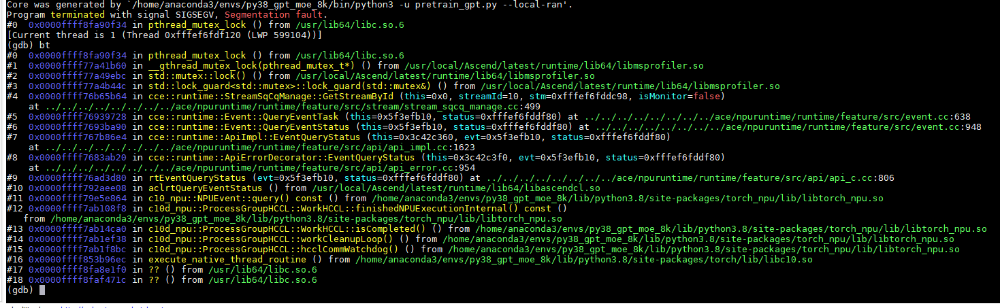

# Locating Core Dump Faults

When an exception occurs during application execution, that is, when the screen displays "Segmentation fault", it indicates that a coredump has occurred. If the screen does not display "Segmentation fault", there is no Python stack, no ERROR-level logs in the plog, and a process receives signal 11, it also indicates that a coredump has occurred.

## Obtaining the Core File

1. Configure coredump file generation.

    Run the following command to view the current settings:

    ```bash
    ulimit -c
    ```

    If it is unlimited, the size of the generated coredump file is set to unlimited, and a coredump file will be generated when a process crashes.

    If it is 0, the coredump file will not be saved when an exception occurs. You need to run the following command to configure it:

    ```bash
    ulimit -c unlimited
    ```

2. Set the storage location and name of the coredump file.

    > [!NOTE]
    >
    > - The following commands require root privileges. Use sudo or switch to the root user beforehand.
    > - Ensure that the `{path_to_coredump}` directory has been created in advance. Otherwise, the coredump file will not be generated.

    ```bash
    # Temporarily modify the name of the generated coredump file
    sysctl -w kernel.core_pattern=core-%e.%p.%h.%t
    # Set the coredump generation directory
    echo "/{path_to_coredump}/core.%t.%e.%p" >/proc/sys/kernel/core_pattern
    ```

    In the command, `%e.%p.%h.%t` or `%t.%e.%p` are file name variables, and `{path_to_coredump}` is the generation directory, which you can set as needed.

3. Generate the coredump file.

    Run the model script. If the model reports an error and the process crashes, a coredump file will be generated.

    > [!NOTE]
    >
    > - By default, the core file configuration is not enabled. Therefore, no coredump file will be generated.
    > - In a container scenario, ensure that the path where the coredump file is generated is mounted outside the container so that the file persists after the container is destroyed.

## Debugging Core Files with GDB

GDB command-line debugging is primarily used for coredump scenarios. After executing the script, a coredump file will be generated in the current directory. Use GDB to debug this file and print the stack trace as follows:

1. Install GDB by referring to the [GDB official documentation](https://sourceware.org/gdb/).
2. Debug the coredump file.

    Run the following command to enter GDB mode and debug the coredump file.

    ```bash
    gdb python3 core*.*    # Modify the coredump filename according to your own settings
    ```

    After executing the command, the gdb tool will enter interactive mode. You can then run relevant commands to view the code where the exception occurred, the function it is in, the filename, and the line number within the file, making it easier to locate the issue.

    > [!NOTE]
    >
    > The debugging environment must be consistent with the environment where the coredump file was generated. For example, in a container scenario, you must enter the corresponding container for debugging.

3. View the stack using the following command.

    ```gdb
    (gdb) bt        # View the stack
    (gdb) thread apply all bt     # View the stack of all processes
    ```

    Locate the error position based on the function stack in the output.

    **Figure 1**  Viewing the stack
    
