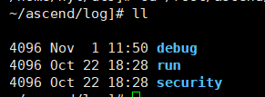
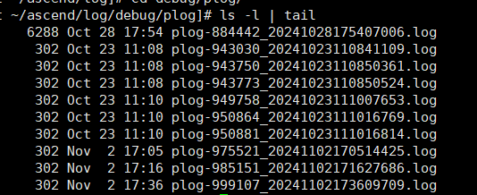
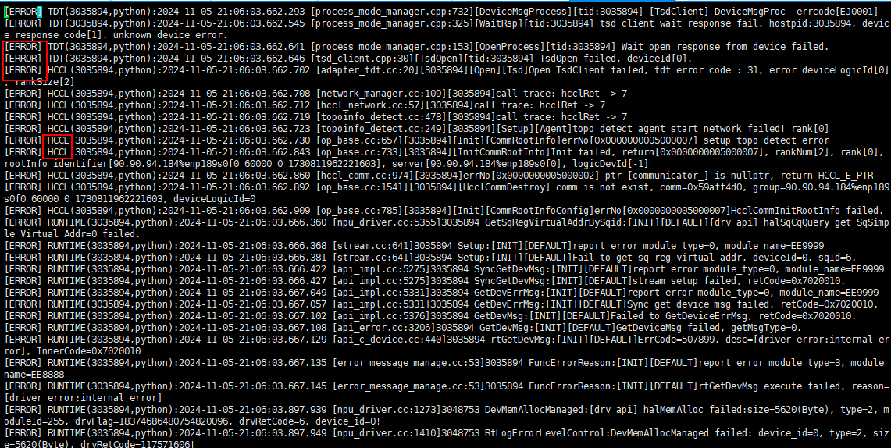
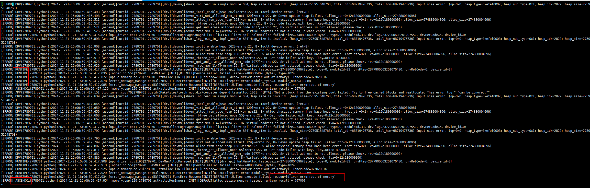

# Plog Information

<!-- md-trans-meta sourceCommit=unknown translatedAt=2026-06-12T08:24:35.574Z pushedAt=2026-06-12T11:22:41.053Z -->

After the application finishes running, you can view its application logs in the default directory `$HOME/ascend/log`, as shown in the following figure.

**Figure 1** Application logs  

Among them, plog logs can be viewed in `$HOME/ascend/log/debug/plog`, as shown in the following figure. This path stores the debug logs generated by running applications on the Host side, mainly including logs from compiler components (such as GE, FE, AI CPU, TBE, HCCL, etc.), Runtime components (such as AscendCL, GE, Runtime, etc.), the AI framework (such as torch_npu), and Driver user-mode logs.

**Figure 2** Obtaining plogs  

As shown in [Figure 3](#plog-log-example-hccl), users can view the log level (for example, **ERROR**) and the name of the module that generated the log (for example, **HCCL**).

**Figure 3** plog example (HCCL)  

**Figure 4**  plog example (OOM error reported at the lower layer)

> [!NOTE]
>
> For details about more logs, see the [CANN Log Reference](https://www.hiascend.com/document/detail/en/CANNCommunityEdition/900/maintenref/logreference/logreference_0001.html).
