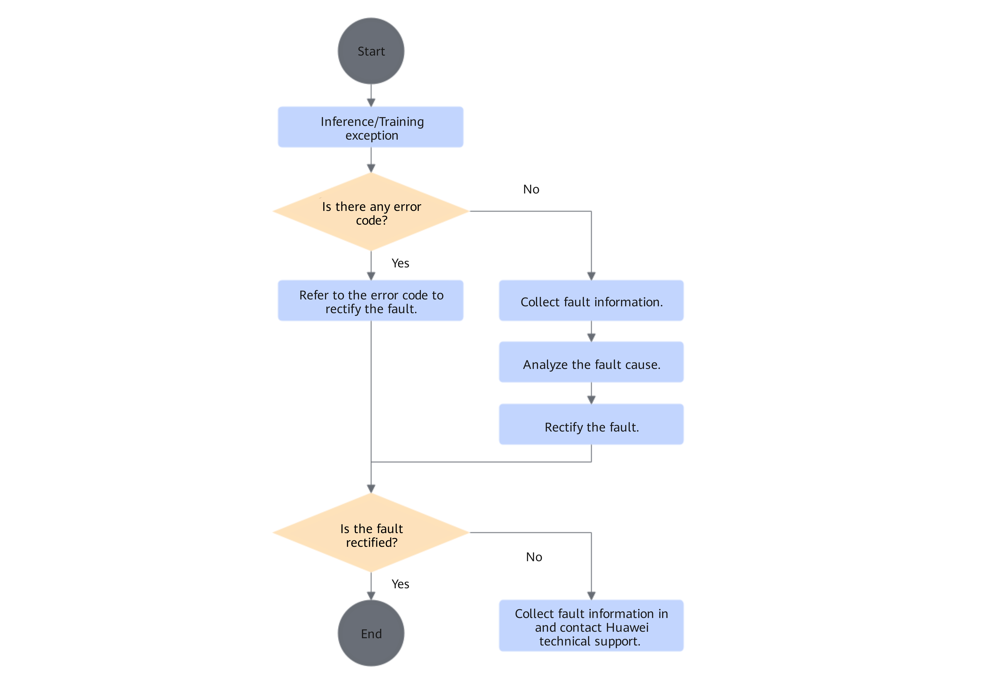

# Troubleshooting Process

<!-- md-trans-meta sourceCommit=unknown translatedAt=2026-06-12T08:25:14.984Z pushedAt=2026-06-12T11:22:41.062Z -->

This document uses various faults that developers may encounter during inference and training as entry points, providing self-service fault locating and handling methods to help developers quickly locate and resolve faults. The content includes: **error code messages printed on the screen and handling methods**, **one-click log collection**, and **usage of various fault locating tools**.

**The overall fault handling process mainly includes the following procedures: collecting faults, analyzing faults, troubleshooting, and recording the fault handling process**. The specific implementation process is shown in [Figure 1](#fault-handling-process).

**Figure 1**  Fault handling process  

- Refer to **Error Code** handling

    For details about the error codes of CANN software, see the "[Error Code Reference](https://www.hiascend.com/document/detail/en/canncommercial/900/maintenref/troubleshooting/troubleshooting_0225.html)" section in *CANN Troubleshooting*.

    For details about the error codes of the torch_npu plugin, see [Error Codes](error_codes_introduction.md).

- Collecting fault information

    Fault information is an important basis for fault handling. Fault handling personnel should collect as much fault information as possible, including but not limited to logs, environment information, etc.

    For log information, a top-down log analysis method is generally adopted, gradually narrowing down to the underlying fault phenomenon based on the business process.

    For a detailed introduction to log levels, see the "[Setting Log Levels](https://www.hiascend.com/document/detail/en/canncommercial/900/maintenref/logreference/logreference_0008.html)" section in the *CANN Log Reference*.

    For a detailed introduction to log paths and log files, see the "[Viewing Logs (Ascend EP)](https://www.hiascend.com/document/detail/en/canncommercial/900/maintenref/logreference/logreference_0002.html)" section in the *CANN Log Reference*.

    Regarding echo information, alarm information of Ascend Extension for PyTorch is printed normally by default. In cluster scenarios, alarm information is printed normally on the screen of the first node.

    Use the msnpureport tool to transfer system logs from the Device side to the Host side for viewing. For details, see [msnpureport Instructions](https://support.huawei.com/enterprise/en/ascend-computing/atlas-800t-a2-pid-254184887?category=reference-guides).

- Analyzing fault causes

    Analyzing fault causes refers to the process of identifying the cause of a fault from numerous possible causes. By analyzing and comparing various possible fault causes through certain methods or means, continuously eliminating possible factors, the specific cause of the fault is ultimately determined.

- Troubleshooting

    Troubleshooting refers to the process of clearing faults based on different fault causes.

- Recording the Fault Handling Process

    After troubleshooting, the key points of fault handling should be recorded, and preventive and improvement measures for such faults should be provided to avoid the recurrence of similar faults.

> [!NOTE] Note
> You can also share fault handling cases on the [Huawei Developer Community Forum](https://www.hiascend.com/forum/) to share your experience for other developers' reference, forming a virtuous cycle, enriching community content, and achieving mutual benefits.
> The third-party tools mentioned in the fault handling steps provided in this document (such as eseye u and Netron) are examples, not mandatory tools. Please refer to them or replace them with other similar tools based on your actual situation.
