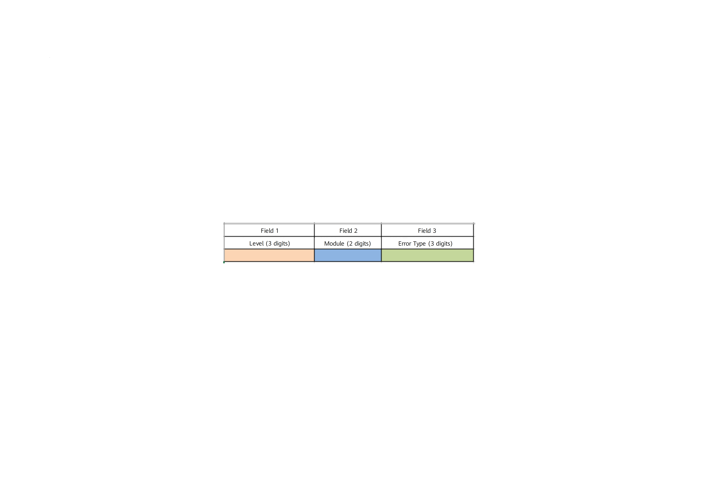
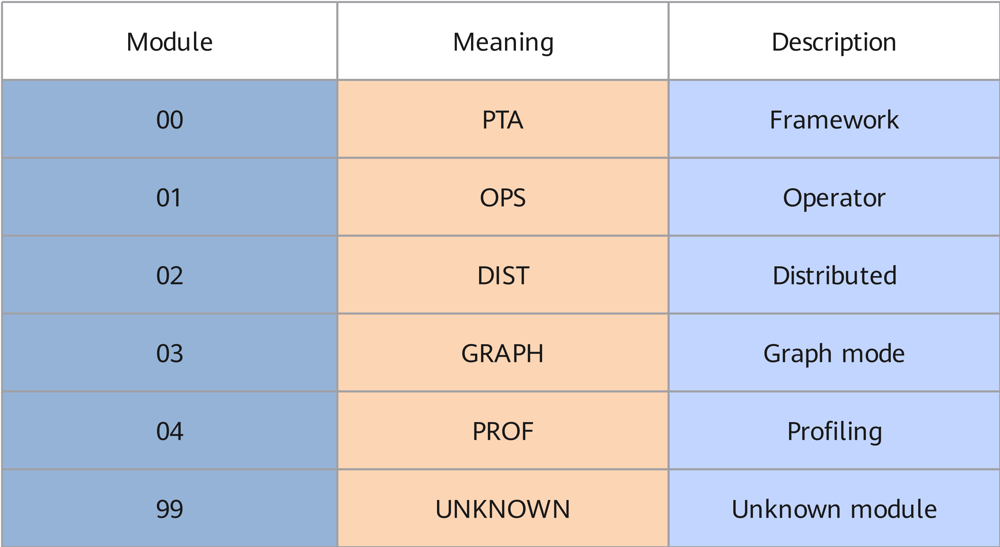
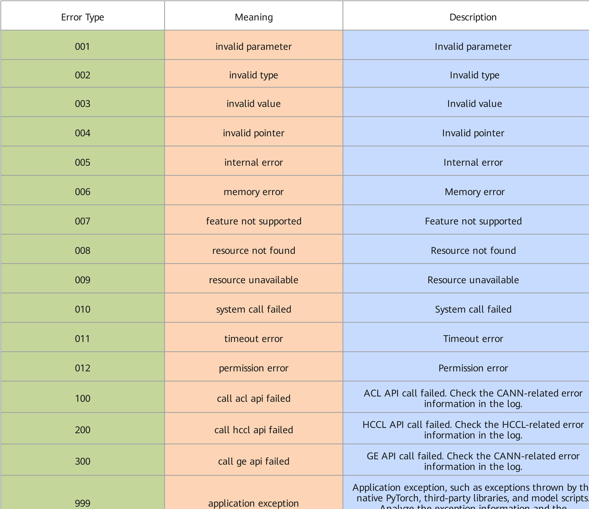

# Usage Instructions

<!-- md-trans-meta sourceCommit=e6dd39e7131a89f72cf49d80d53002e4cc645bbf translatedAt=2026-07-08T10:23:02.862Z pushedAt=2026-07-08T10:47:16.875Z -->

## Generation Mechanism

When an exception error occurs during model building, inference execution, training scripts, or other scenarios—such as detecting input errors (incorrect command-line input parameters, incorrect API input parameters, incorrect input files, unsupported operators, unsupported shape/format, etc.) or environment errors—the system displays the error code information on the user interface. In actual problem locating, it is necessary to combine the specific error message with plog logs for joint diagnosis.

## Error Code Display Description

> [!NOTE]
>
> Generally, ERR\*\*005 indicates an internal error. For internal errors, you can contact Huawei for troubleshooting, or you can submit an issue at [Ascend Community](https://gitcode.com/Ascend/pytorch/issues) for assistance.  
> The error code-related information described in this document is fully displayed during on-screen error reporting, including possible causes and solutions. Therefore, this section only lists the relevant content for reference.

Due to differences in scenarios, use cases, and failure causes, the printed error code information may vary. Therefore, this document uses the \[%s\] variable format to represent actual print logs. Refer to the actual screen output for the specific logs.

For example, the representation of error code ERR00002 in the manual is as follows:

\[ERROR\] \[%s\] \(PID:\[%s\], Device:\[%s\], RankID:\[%s\]\) ERR\[%s\]\[%s\] \[%s\] \[%s\]

An actual error message example on the user interface is shown below. The error message consists of five parts. For details, see Table 1.

```text
[ERROR] 2024-03-07-01:31:48 (PID:116072, Device:0, RankID:-1) ERR00002 PTA invalid type
```

**Table 1** Error message details

|Error Message|Description|
|:---|:---|
|Log level|Example: [ERROR].|
|Log timestamp|Example: 2024-03-07-01:31:48.|
|Device information|Example: (PID:116072, Device:0, RankID:-1).<br>- PID: Process ID of the faulty process.<br>- Device: Device number where the faulty process resides, obtained through the ACL interface. If retrieval fails, the default value -1 is printed.<br>- RankID: Sequence number of the device where the faulty process resides within the communication domain, obtained through the environment variable RANK. If not configured, the default value -1 is printed.|
|Error codes|Example: ERR00002.<br>Error codes are represented as 8-character strings. For field descriptions, see Figure 1.<br>- Field 1 is ERR, which indicates an error class.<br>- Field 2 is a two-digit number indicating the error module. For details, see Figure 2.<br>- Field 3 is a three-digit number indicating the error type. For details, see Figure 3.|
|Error code description|Example: PTA invalid type.|

**Figure 1**  Field descriptions


**Figure 2**  Meaning of field 2


**Figure 3**  Meaning of field 3

