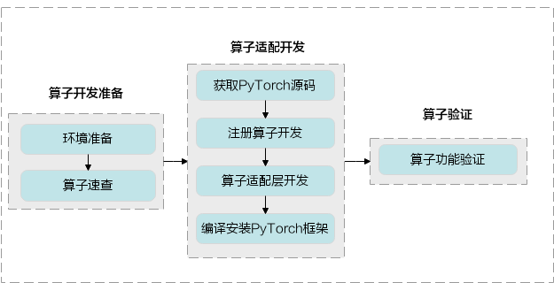
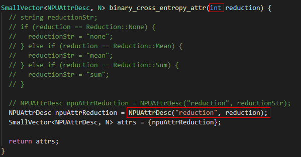

# PyTorch API开发指南
-   [简介](#简介md)
-   [算子开发流程](#算子开发流程md)
-   [算子开发准备](#算子开发准备md)
    -   [环境准备](#环境准备md)
    -   [API速查](#API速查md)
-   [API适配开发](#API适配开发md)
    -   [前提条件](#前提条件md)
    -   [获取PyTorch源码](#获取PyTorch源码md)
    -   [注册API开发](#注册API开发md)
        -   [概述](#概述md)
        -   [PyTorch1.8.1 注册API开发](#PyTorch1-8-1-注册API开发md)
    -   [API适配插件开发](#API适配插件开发md)
    -   [编译和安装PyTorch框架](#编译和安装PyTorch框架md)
-   [API功能验证](#API功能验证md)
    -   [概述](#概述-0md)
    -   [实现过程](#实现过程md)
-   [FAQ](#FAQmd)
    -   [Pillow==5.3.0安装失败](#Pillow-5-3-0安装失败md)
    -   [pip3.7 install torchvision安装失败](#pip3-7-install-torchvision安装失败md)
    -   [安装“torch-\*.whl ”提示“torch 1.5.0xxxx”与“torchvision”所依赖的版本不匹配](#安装-torch--whl-提示-torch-1-5-0xxxx-与-torchvision-所依赖的版本不匹配md)
    -   [如何查看测试的运行日志](#如何查看测试的运行日志md)
    -   [为什么我实现的“自定义TBE算子”无法调用到？](#为什么我实现的-自定义TBE算子-无法调用到md)
    -   [如何确定“TBE算子”是否被“PyTorch适配”正确调用](#如何确定-TBE算子-是否被-PyTorch适配-正确调用md)
    -   [PyTorch编译失败，提示“error: ld returned 1 exit status”](#PyTorch编译失败-提示-error-ld-returned-1-exit-statusmd)
    -   [PyTorch编译失败，提示“error: call of overload ....”](#PyTorch编译失败-提示-error-call-of-overloadmd)
-   [附录](#附录md)
    -   [CMake安装方法](#CMake安装方法md)
    -   [自定义API导出方法](#自定义API导出方法md)
<h2 id="简介md">简介</h2>

### 概述<a name="zh-cn_topic_0000001125558589_section7405182695312"></a>

为了实现PyTorch深度学习框架在昇腾AI处理器上运行，需要将框架算子用TBE自定义开发。

<h2 id="算子开发流程md">算子开发流程</h2>

PyTorch算子开发包含TBE算子开发和PyTorch框架下的API适配。

1.  TBE算子开发：昇腾AI软件栈中不包含相应的算子，需要先完成TBE算子的开发，再进行PyTorch框架下的API适配。

    TBE算子开发流程及方法请参见《CANN TBE自定义算子开发指南》。

2.  PyTorch框架下的API适配：昇腾AI软件栈中已实现了相应的TBE算子，可直接进行PyTorch框架适配。

    PyTorch框架下的API适配流程如下所示。

    **图 1**  PyTorch框架下的API适配流程<a name="zh-cn_topic_0000001105032530_fig1981905141719"></a>  
    

**表 1**  算子开发步骤详解

<a name="zh-cn_topic_0000001105032530_zh-cn_topic_0228422310_table131083578318"></a>

<table><thead align="left"><tr id="zh-cn_topic_0000001105032530_zh-cn_topic_0228422310_row210905703113"><th class="cellrowborder" valign="top" width="6.811326262527976%" id="mcps1.2.5.1.1"><p id="zh-cn_topic_0000001105032530_zh-cn_topic_0228422310_p41091857143113"><a name="zh-cn_topic_0000001105032530_zh-cn_topic_0228422310_p41091857143113"></a><a name="zh-cn_topic_0000001105032530_zh-cn_topic_0228422310_p41091857143113"></a>序号</p>
</th>
<th class="cellrowborder" valign="top" width="17.865135740001946%" id="mcps1.2.5.1.2"><p id="zh-cn_topic_0000001105032530_zh-cn_topic_0228422310_p1710955713112"><a name="zh-cn_topic_0000001105032530_zh-cn_topic_0228422310_p1710955713112"></a><a name="zh-cn_topic_0000001105032530_zh-cn_topic_0228422310_p1710955713112"></a>步骤</p>
</th>
<th class="cellrowborder" valign="top" width="55.55123090396029%" id="mcps1.2.5.1.3"><p id="zh-cn_topic_0000001105032530_zh-cn_topic_0228422310_p26391719183320"><a name="zh-cn_topic_0000001105032530_zh-cn_topic_0228422310_p26391719183320"></a><a name="zh-cn_topic_0000001105032530_zh-cn_topic_0228422310_p26391719183320"></a>描述</p>
</th>
<th class="cellrowborder" valign="top" width="19.772307093509777%" id="mcps1.2.5.1.4"><p id="zh-cn_topic_0000001105032530_zh-cn_topic_0228422310_p13109155719317"><a name="zh-cn_topic_0000001105032530_zh-cn_topic_0228422310_p13109155719317"></a><a name="zh-cn_topic_0000001105032530_zh-cn_topic_0228422310_p13109155719317"></a>参考</p>
</th>
</tr>
</thead>
<tbody><tr id="zh-cn_topic_0000001105032530_row1381016124918"><td class="cellrowborder" valign="top" width="6.811326262527976%" headers="mcps1.2.5.1.1 "><p id="zh-cn_topic_0000001105032530_p1181015128915"><a name="zh-cn_topic_0000001105032530_p1181015128915"></a><a name="zh-cn_topic_0000001105032530_p1181015128915"></a>1</p>
</td>
<td class="cellrowborder" valign="top" width="17.865135740001946%" headers="mcps1.2.5.1.2 "><p id="zh-cn_topic_0000001105032530_p1881012121799"><a name="zh-cn_topic_0000001105032530_p1881012121799"></a><a name="zh-cn_topic_0000001105032530_p1881012121799"></a>环境准备</p>
</td>
<td class="cellrowborder" valign="top" width="55.55123090396029%" headers="mcps1.2.5.1.3 "><p id="zh-cn_topic_0000001105032530_p1381018121891"><a name="zh-cn_topic_0000001105032530_p1381018121891"></a><a name="zh-cn_topic_0000001105032530_p1381018121891"></a>准备算子开发及运行验证所依赖的开发环境与运行环境。</p>
</td>
<td class="cellrowborder" rowspan="2" valign="top" width="19.772307093509777%" headers="mcps1.2.5.1.4 "><p id="zh-cn_topic_0000001105032530_p1498205181013"><a name="zh-cn_topic_0000001105032530_p1498205181013"></a><a name="zh-cn_topic_0000001105032530_p1498205181013"></a><a href="#API开发准备md">算子开发准备</a></p>
</td>
</tr>
<tr id="zh-cn_topic_0000001105032530_row194671091290"><td class="cellrowborder" valign="top" headers="mcps1.2.5.1.1 "><p id="zh-cn_topic_0000001105032530_p3467169594"><a name="zh-cn_topic_0000001105032530_p3467169594"></a><a name="zh-cn_topic_0000001105032530_p3467169594"></a>2</p>
</td>
<td class="cellrowborder" valign="top" headers="mcps1.2.5.1.2 "><p id="zh-cn_topic_0000001105032530_p1346749990"><a name="zh-cn_topic_0000001105032530_p1346749990"></a><a name="zh-cn_topic_0000001105032530_p1346749990"></a>API速查</p>
</td>
<td class="cellrowborder" valign="top" headers="mcps1.2.5.1.3 "><p id="zh-cn_topic_0000001105032530_p1767111499129"><a name="zh-cn_topic_0000001105032530_p1767111499129"></a><a name="zh-cn_topic_0000001105032530_p1767111499129"></a>查看TBE算子支持列表和PyTorchAPI适配列表。</p>
<a name="zh-cn_topic_0000001105032530_ul03431749101318"></a><a name="zh-cn_topic_0000001105032530_ul03431749101318"></a><ul id="zh-cn_topic_0000001105032530_ul03431749101318"><li>当前<span id="zh-cn_topic_0000001105032530_ph1748571571010"><a name="zh-cn_topic_0000001105032530_ph1748571571010"></a><a name="zh-cn_topic_0000001105032530_ph1748571571010"></a>昇腾AI处理器</span>支持的算子列表及支持的算子的详细规格约束。</li><li>当前PyTorch适配的API列表。</li></ul>
</td>
</tr>
<tr id="zh-cn_topic_0000001105032530_zh-cn_topic_0228422310_row411025743119"><td class="cellrowborder" valign="top" width="6.811326262527976%" headers="mcps1.2.5.1.1 "><p id="zh-cn_topic_0000001105032530_p156991054952"><a name="zh-cn_topic_0000001105032530_p156991054952"></a><a name="zh-cn_topic_0000001105032530_p156991054952"></a>3</p>
</td>
<td class="cellrowborder" valign="top" width="17.865135740001946%" headers="mcps1.2.5.1.2 "><p id="zh-cn_topic_0000001105032530_zh-cn_topic_0228422310_p3110657203110"><a name="zh-cn_topic_0000001105032530_zh-cn_topic_0228422310_p3110657203110"></a><a name="zh-cn_topic_0000001105032530_zh-cn_topic_0228422310_p3110657203110"></a>获取PyTorch源码</p>
</td>
<td class="cellrowborder" valign="top" width="55.55123090396029%" headers="mcps1.2.5.1.3 "><p id="zh-cn_topic_0000001105032530_zh-cn_topic_0228422310_p381282212"><a name="zh-cn_topic_0000001105032530_zh-cn_topic_0228422310_p381282212"></a><a name="zh-cn_topic_0000001105032530_zh-cn_topic_0228422310_p381282212"></a>获取昇腾社区PyTorch源码。</p>
</td>
<td class="cellrowborder" rowspan="4" valign="top" width="19.772307093509777%" headers="mcps1.2.5.1.4 "><p id="zh-cn_topic_0000001105032530_p10679152717175"><a name="zh-cn_topic_0000001105032530_p10679152717175"></a><a name="zh-cn_topic_0000001105032530_p10679152717175"></a><a href="#算子开发准备md">API适配开发</a></p>
</td>
</tr>
<tr id="zh-cn_topic_0000001105032530_row1184984391512"><td class="cellrowborder" valign="top" headers="mcps1.2.5.1.1 "><p id="zh-cn_topic_0000001105032530_p1054075616153"><a name="zh-cn_topic_0000001105032530_p1054075616153"></a><a name="zh-cn_topic_0000001105032530_p1054075616153"></a>4</p>
</td>
<td class="cellrowborder" valign="top" headers="mcps1.2.5.1.2 "><p id="zh-cn_topic_0000001105032530_p1463045415151"><a name="zh-cn_topic_0000001105032530_p1463045415151"></a><a name="zh-cn_topic_0000001105032530_p1463045415151"></a>注册算子开发</p>
</td>
<td class="cellrowborder" valign="top" headers="mcps1.2.5.1.3 "><p id="zh-cn_topic_0000001105032530_p1634748161614"><a name="zh-cn_topic_0000001105032530_p1634748161614"></a><a name="zh-cn_topic_0000001105032530_p1634748161614"></a>将算子分发到昇腾AI处理器。</p>
</td>
</tr>
<tr id="zh-cn_topic_0000001105032530_zh-cn_topic_0228422310_row252634054913"><td class="cellrowborder" valign="top" headers="mcps1.2.5.1.1 "><p id="zh-cn_topic_0000001105032530_p55407561152"><a name="zh-cn_topic_0000001105032530_p55407561152"></a><a name="zh-cn_topic_0000001105032530_p55407561152"></a>5</p>
</td>
<td class="cellrowborder" valign="top" headers="mcps1.2.5.1.2 "><p id="zh-cn_topic_0000001105032530_p116302054131518"><a name="zh-cn_topic_0000001105032530_p116302054131518"></a><a name="zh-cn_topic_0000001105032530_p116302054131518"></a>API适配层开发</p>
</td>
<td class="cellrowborder" valign="top" headers="mcps1.2.5.1.3 "><p id="zh-cn_topic_0000001105032530_p8583195119173"><a name="zh-cn_topic_0000001105032530_p8583195119173"></a><a name="zh-cn_topic_0000001105032530_p8583195119173"></a>API适配层开发，将基于第三方框架的算子属性映射成适配昇腾AI处理器的算子属性。</p>
</td>
</tr>
<tr id="zh-cn_topic_0000001105032530_zh-cn_topic_0228422310_row17721543154917"><td class="cellrowborder" valign="top" headers="mcps1.2.5.1.1 "><p id="zh-cn_topic_0000001105032530_p125402056121515"><a name="zh-cn_topic_0000001105032530_p125402056121515"></a><a name="zh-cn_topic_0000001105032530_p125402056121515"></a>6</p>
</td>
<td class="cellrowborder" valign="top" headers="mcps1.2.5.1.2 "><p id="zh-cn_topic_0000001105032530_p963085451515"><a name="zh-cn_topic_0000001105032530_p963085451515"></a><a name="zh-cn_topic_0000001105032530_p963085451515"></a>编译安装PyTorch框架</p>
</td>
<td class="cellrowborder" valign="top" headers="mcps1.2.5.1.3 "><p id="zh-cn_topic_0000001105032530_p1463431151811"><a name="zh-cn_topic_0000001105032530_p1463431151811"></a><a name="zh-cn_topic_0000001105032530_p1463431151811"></a>编译适配开发后的PyTorch源码，并安装编译的源码包。</p>
</td>
</tr>
<tr id="zh-cn_topic_0000001105032530_zh-cn_topic_0228422310_row162484372491"><td class="cellrowborder" valign="top" width="6.811326262527976%" headers="mcps1.2.5.1.1 "><p id="zh-cn_topic_0000001105032530_p454075611155"><a name="zh-cn_topic_0000001105032530_p454075611155"></a><a name="zh-cn_topic_0000001105032530_p454075611155"></a>7</p>
</td>
<td class="cellrowborder" valign="top" width="17.865135740001946%" headers="mcps1.2.5.1.2 "><p id="zh-cn_topic_0000001105032530_p11630135413155"><a name="zh-cn_topic_0000001105032530_p11630135413155"></a><a name="zh-cn_topic_0000001105032530_p11630135413155"></a>API功能验证</p>
</td>
<td class="cellrowborder" valign="top" width="55.55123090396029%" headers="mcps1.2.5.1.3 "><p id="zh-cn_topic_0000001105032530_zh-cn_topic_0228422310_p4952132615216"><a name="zh-cn_topic_0000001105032530_zh-cn_topic_0228422310_p4952132615216"></a><a name="zh-cn_topic_0000001105032530_zh-cn_topic_0228422310_p4952132615216"></a>在真实的硬件环境中验证API功能。</p>
</td>
<td class="cellrowborder" valign="top" width="19.772307093509777%" headers="mcps1.2.5.1.4 "><p id="zh-cn_topic_0000001105032530_zh-cn_topic_0228422310_p20908934557"><a name="zh-cn_topic_0000001105032530_zh-cn_topic_0228422310_p20908934557"></a><a name="zh-cn_topic_0000001105032530_zh-cn_topic_0228422310_p20908934557"></a><a href="#API功能验证md">API功能验证</a></p>
</td>
</tr>
</tbody>
</table>


<h2 id="算子开发准备md">算子开发准备</h2>

-   **[环境准备](#环境准备md)**  

-   **[API速查](#API速查md)**  


<h3 id="环境准备md">环境准备</h3>

-   需完成CANN开发或运行环境的安装，具体操作请参考《CANN 软件安装指南》。
-   需安装python版本为3.7.5或3.8。
-   需安装3.12.0及以上版本的CMake，安装方法请参考[CMake安装方法](#CMake安装方法md)。
-   需确保已安装7.3.0以上版本的gcc，7.3.0版本gcc具体安装及使用方式请参见《CANN 软件安装指南》中的“安装7.3.0版本gcc”章节。
-   需确保环境中已安装git工具，以Ubuntu和CentOS系统为例，命令如下:
    -   Ubuntu、EulerOS系统

        ```
        apt-get install patch
        apt-get install git
        ```

    -   CentOS系统

        ```
        yum install patch
        yum install git
        ```


<h3 id="API速查md">API速查</h3>

进行API开发时，您可以查询当前昇腾AI处理器中支持的算子列表和当前PyTorch适配的API列表。根据查询结果进行算子开发或PyTorchAPI适配。

-   若昇腾AI处理器不支持算子，则需要进行TBE算子开发和PyTorch框架API适配。
-   若昇腾AI处理器支持算子但PyTorch框架没有API适配，仅需要进行PyTorch框架下API适配。
-   若PyTorch框架已经适配API，直接使用API即可，不需要开发和适配。

昇腾AI处理器和PyTorch适配的API查询方式如下。

-   当前昇腾AI处理器中支持的算子以及对应的API约束可以通过以下两种方式查询。
    -   命令行开发方式下，您可以参见《CANN 算子清单 \(Ascend 910\)》进行离线查询。
    -   MindStudio开发方式下，您可以通过MindStudio进行在线查询，详细查看方法可参见《MindStudio 用户指南》中的“算子&模型速查”章节。
-   当前PyTorch适配的API列表可以参见[《PyTorch API支持清单》](https://gitee.com/ascend/pytorch/blob/master/docs/zh/PyTorch%20API%E6%94%AF%E6%8C%81%E6%B8%85%E5%8D%95.md)。

<h2 id="API适配开发md">API适配开发</h2>

-   **[前提条件](#前提条件md)**  

-   **[获取PyTorch源码](#获取PyTorch源码md)**  

-   **[注册API开发](#注册API开发md)**  

-   **[API适配插件开发](#API适配插件开发md)**  

-   **[编译和安装PyTorch框架](#编译和安装PyTorch框架md)**  


<h3 id="前提条件md">前提条件</h3>

-   完成开发及运行环境准备及相关依赖的安装，详情请参见[环境准备](#环境准备md)。
-   完成相关的TBE算子开发及部署，详情请参见《CANN TBE自定义算子开发指南》。

<h3 id="获取PyTorch源码md">获取PyTorch源码</h3>

针对pytorch1.8.1版本，PyTorch源码获取请参见[《PyTorch安装指南》](https://gitee.com/ascend/pytorch/blob/master/docs/zh/PyTorch%E5%AE%89%E8%A3%85%E6%8C%87%E5%8D%97/PyTorch%E5%AE%89%E8%A3%85%E6%8C%87%E5%8D%97.md)中“安装PyTorch框架”章节，完成在"pytorch/pytorch_v1.8.1"目录生成适配昇腾AI处理器的全量代码步骤。将在pytorch/pytorch目录中进行PyTorch API适配开发。

<h3 id="注册API开发md">注册API开发</h3>

-   **[概述](#概述md)**  

-   **[PyTorch1.8.1 注册API开发](#PyTorch1-8-1-注册API开发md)**  


<h4 id="概述md">概述</h4>

当前制定的NPU适配派发原则是NPUAPI的派发不经过框架公共函数，直接派发成NPU适配的函数，即API执行调用栈中只包含NPU适配的函数调用，不包含框架公共函数。PyTorch框架在编译时，会根据 native\_functions.yaml 的定义，按框架中定义的类型和设备分发原则，生成相应的新API的中间层的调用说明。对于NPU，会生成在 build/aten/src/ATen/NPUType.cpp。

<h4 id="PyTorch1-8-1-注册API开发md">PyTorch1.8.1 注册API开发</h4>

##### 注册API开发方法<a name="section575212111125"></a>

1.  打开native\_functions.yaml文件。

    native\_functions.yaml 文件中，定义了所有API函数原型，包括函数名称和参数等信息，每个API函数支持不同硬件平台的派发信息。该文件所在路径为pytorch/aten/src/ATen/native/native\_functions.yaml。

2.  确定需要派发函数。
    -   yaml 中已存在的API

        将所有与待适配API相关的函数进行派发。

    -   yaml中未存在的自定义API

        由于yaml中没有相关API的信息，需要手动添加相关函数，包括函数名，参数信息，返回类型信息。添加规则及方法请参见“pytorch/aten/src/ATen/native/README.md“。

        ```
        - func：适配API名称(输入参数信息) -> 返回类型
        ```


##### 示例<a name="section434031421219"></a>

以torch.add\(\)API为例介绍注册API开发过程。

1.  打开native\_functions.yaml文件。
2.  搜索相关函数。

    在yaml中搜索add，找到与addAPI相关的函数描述func。由于add是PyTorch内置API，不需要手动添加func。若是自定义API，需要手动添加func。

3.  确定API相关函数名称及其类型的func描述。
    -   add.Tensor 的函数分发描述。

        ```
        - func: add.Tensor(Tensor self, Tensor other, *, Scalar alpha=1) -> Tensor
          structured_delegate: add.out
          variants: function, method
          dispatch:
            SparseCPU, SparseCUDA: add_sparse
            MkldnnCPU: mkldnn_add
        ```

    -   add.Scalar 的函数分发描述。

        ```
        - func: add.Scalar(Tensor self, Scalar other, Scalar alpha=1) -> Tensor
          variants: function, method
          dispatch:
            DefaultBackend: add
        ```

    -   add\_.Tensor 的函数分发描述。

        ```
        - func: add_.Tensor(Tensor(a!) self, Tensor other, *, Scalar alpha=1) -> Tensor(a!)
          variants: method
          structured_delegate: add.out
          dispatch:
            SparseCPU, SparseCUDA: add_sparse_
            MkldnnCPU: mkldnn_add_
        ```

    -   add\_.Scalar 的函数分发描述。

        ```
        - func: add_.Scalar(Tensor(a!) self, Scalar other, Scalar alpha=1) -> Tensor(a!)
          variants: method
          dispatch:
            DefaultBackend: add_
        ```

    -   add.out 的函数分发描述。

        ```
        - func: add.out(Tensor self, Tensor other, *, Scalar alpha=1, Tensor(a!) out) -> Tensor(a!)
          structured: True
          structured_inherits: TensorIteratorBase
          dispatch:
            CPU, CUDA: add_out
            SparseCPU: add_out_sparse_cpu
            SparseCUDA: add_out_sparse_cuda
            MkldnnCPU: mkldnn_add_out
        ```


<h3 id="API适配插件开发md">API适配插件开发</h3>

#### 简介<a name="zh-cn_topic_0000001125315877_section16410139174517"></a>

用户通过开发API适配插件，实现PyTorch原生API的输入参数、输出参数和属性的格式转换，使转换后的格式与TBE算子的输入参数、输出参数和属性的格式相同。适配昇腾AI处理器的PyTorch源代码中提供了适配关联、类型转换和判别、处理动态shape等相关的方法供用户使用。

#### npu_native_functions.yaml文件介绍

```
backend: NPU     # Backend类型
cpp_namespace: at_npu::native     # 插件中开发API的命名空间
supported:     # 已支持的和PyTorch Native Functions对齐的API
  - add.Tensor
  - add.Scalar
  - slow_conv3d.out
  - slow_conv3d_forward.output
  - slow_conv3d_forward
  - convolution
  - _convolution
  - _convolution_nogroup
  - addcdiv
  - addcdiv_
  - addcdiv.out

autograd:       # 已支持的和PyTorch Native Functions对齐的继承自Function的具有前反向操作的API
  - maxpool2d

custom:     # 自定义API，需要提供API格式定义
  - func: npu_dtype_cast(Tensor self, ScalarType dtype) -> Tensor
    variants: function, method
  - func: npu_dtype_cast_(Tensor(a!) self, Tensor src) -> Tensor(a!)
    variants: method
  - func: npu_alloc_float_status(Tensor self) -> Tensor
    variants: function, method
  - func: npu_get_float_status(Tensor self) -> Tensor
    variants: function, method
 
custom_autograd:    # 自定义继承自Function的自定义API
  - func: npu_convolution(Tensor input, Tensor weight, Tensor? bias, ...) -> Tensor
```

官方提供的native_functions.yaml文件定义了PyTorch Native Functions的具体API定义和分发细节，在NPU设备上适配官方已定义API，我们不需要重新定义，只需要注册NPU分发即可。由于我们可以根据已支持的API（supported，autograd）对应解析官方yaml文件得到每个函数的具体格式，所以对应的函数声明和注册分发可以自动化完成，API迁移和开发的时候只需要关注对应的实现细节即可。对于自定义API，由于没有具体的API定义，我们需要在npu_native_functions.yaml文件中给出定义，以便对API进行结构化解析从而实现自动化注册和Python接口绑定。

#### 适配插件实现<a name="zh-cn_topic_0000001125315877_section1174074518456"></a>

1.  注册API。

    根据npu_native_functions.yaml文件介绍，添加相应API信息。

2. 创建适配插件文件。

   NPU TBE算子适配文件保存在pytorch/torch_npu/csrc/aten/ops目录下，命名风格采用大驼峰，命名格式：<API名\> + <KernelNpu\>.cpp，如：AddKernelNpu.cpp。

3. 引入依赖头文件。

   适配昇腾AI处理器的PyTorch源代码在torch_npu/csrc/framework/utils中提供适配常用的工具供用户使用。

   > **说明：** 
   >工具的功能和使用方法，可查看头文件和源码获得。

4. 定义API适配主体函数。

   根据注册API开发中的分发函数确定自定义API适配主体函数。

5. 分别实现适配主体函数。

   实现API适配主题函数，根据TBE算子原型构造得到对应的input、output、attr。


#### 示例<a name="zh-cn_topic_0000001125315877_section18021337113012"></a>

以torch.add\(\)API为例介绍API适配开发过程。

1. 注册API。

   将addAPI添加到npu_native_functions.yaml文件的对应位置，用于自动化声明和注册。

   ```
   supported:       #已支持的Pytorch Native Functions 对齐的API
     add.Tensor
     add_.Tensor
     add.out
     add.Scaler
     add_.Scaler
   ```

   格式参考：[《算子迁移和开发指南》](https://gitee.com/ascend/pytorch/wikis/%E7%AE%97%E5%AD%90%E8%BF%81%E7%A7%BB%E5%92%8C%E5%BC%80%E5%8F%91%E6%8C%87%E5%8D%97) 

2. 创建适配插件文件。

   在pytorch/torch_npu/csrc/aten/ops目录下创建AddKernelNpu.cpp适配文件。

3. 引入依赖头文件。

   ```
   #include <ATen/Tensor.h>
   #include <c10/util/SmallVector.h>
   
   #include "torch_npu/csrc/core/npu/register/OptionsManager.h"
   #include "torch_npu/csrc/framework/utils/CalcuOpUtil.h"
   #include "torch_npu/csrc/framework/utils/OpAdapter.h"
   #include "torch_npu/csrc/aten/NPUNativeFunctions.h"
   ```

   > **说明：** 
   >" CalcuOpUtil.h "中主要包含类型转换和判别的函数。
   >" OpAdapter.h"文件中主要包含适配关联的头文件。

4. 定义API适配主体函数。

   ```
   at::Tensor NPUNativeFunctions::add(const at::Tensor &self, const at::Tensor &other, at::Scalar alpha)
   at::Tensor NPUNativeFunctions::add(const at::Tensor &self, at::Scalar other, at::Scalar alpha)
   at::Tensor &NPUNativeFunctions::add_(at::Tensor &self, const at::Tensor &other, at::Scalar alpha)
   at::Tensor &NPUNativeFunctions::add_(at::Tensor &self, at::Scalar other, at::Scalar alpha)
   at::Tensor &NPUNativeFunctions::add_out(const at::Tensor &self, const at::Tensor &other, at::Scalar alpha,at::Tensor &result)
   ```

   >  **说明：** 
   >
   > NPUNativeFunctions是API定义需要添加的命名空间约束。

5. 分别实现适配主体函数。

   1. add实现

      ```
       // 输入参数为Tensor和Tensor时
             at::Tensor NPUNativeFunctions::add(const at::Tensor &self, const at::Tensor &other, at::Scalar alpha)
             {
               alpha_check_npu(self.scalar_type(), alpha);
               if ((!(self.is_contiguous() && other.is_contiguous())) &&
                   (NpuUtils::check_5d_5d_match(self) ||
                   NpuUtils::check_5d_5d_match(other)) &&
                   check_size(self, other))
               {
                 int64_t c0_len = 16;
                 at::Tensor self_use = stride_add_tensor_get(self);
                 at::Scalar self_c1_offset(
                   self.storage_offset() / (self.size(2) * self.size(3) * c0_len));
                 at::Tensor other_use = stride_add_tensor_get(other);
                 at::Scalar other_c1_offset(
                   other.storage_offset() / (other.size(2) * other.size(3) * c0_len));
                 at::Scalar stride_len(self.size(1) / c0_len);
                 at::Tensor result = NPUNativeFunctions::npu_stride_add(
                   self_use, other_use, self_c1_offset, other_c1_offset, stride_len);
                 return result;
               }
               // calculate the output size
               at::Tensor outputTensor = add_dest_output(self, other);
               auto outputSize = broadcast_ops_npu_output_size(self, other);
             
               // construct the output tensor of the NPU
               at::Tensor result = OpPreparation::ApplyTensorWithFormat(
                   outputSize,
             	  outputTensor.options(),
             	  CalcuOpUtil::get_tensor_npu_format(outputTensor));
             
               // calculate the output result of the NPU
               add_out_npu_nocheck(result, self, other, alpha);
             
               return result;
             }
                 
             // 输入参数为Tensor和Scalar时
             at::Tensor NPUNativeFunctions::add(const at::Tensor &self, at::Scalar other, at::Scalar alpha)
             {
               alpha_check_npu(self.scalar_type(), alpha);
               // calculate the output size
               auto outputSize = input_same_output_size(self);
               // construct the output tensor of the NPU
               at::Tensor result = OpPreparation::ApplyTensorWithFormat(
                   outputSize, self.options(), CalcuOpUtil::get_tensor_npu_format(self));
             
               // calculate the output result of the NPU
               adds_out_npu_nocheck(result, self, other, alpha);
             
               return result;
             }
      
      ```

   2. add\_实现（就地操作场景，返回值为self）

      ```
      // 输入参数为Tensor和Tensor时
             at::Tensor &NPUNativeFunctions::add_(at::Tensor &self, const at::Tensor &other, at::Scalar alpha)
             {
               c10::SmallVector<at::Tensor, N> inputs = {self, other};
               c10::SmallVector<at::Tensor, N> outputs = {self};
               CalcuOpUtil::check_memory_over_laps(inputs, outputs);
             
               if (!NpuUtils::check_match(&self))
               {
                 at::Tensor contiguousSelf = NpuUtils::format_contiguous(self);
                 at::Tensor result = add_out_npu_nocheck(contiguousSelf, contiguousSelf, other, alpha);
                 NpuUtils::format_fresh_view(self, result);
               }
               else
               {
                 add_out_npu_nocheck(self, self, other, alpha);
               }
             
               return self;
             }
             
             // 输入参数为Tensor和Scalar时
             at::Tensor &NPUNativeFunctions::add_(at::Tensor &self, at::Scalar other, at::Scalar alpha)
             {
               if (!NpuUtils::check_match(&self))
               {
                 at::Tensor contiguousSelf = NpuUtils::format_contiguous(self);
                 at::Tensor result = adds_out_npu_nocheck(contiguousSelf, contiguousSelf, other, alpha);
                 NpuUtils::format_fresh_view(self, result);
               }
               else
               {
                 adds_out_npu_nocheck(self, self, other, alpha);
               }
             
               return self;
             }
      
      ```

   3.  add\_out实现（输入参数result为返回值场景）

       ```
       at::Tensor &NPUNativeFunctions::add_out(
               const at::Tensor &self,
               const at::Tensor &other,
               at::Scalar alpha,
               at::Tensor &result)
           {
             bool isSelfWrapped = CalcuOpUtil::is_scalar_wrapped_to_tensor(self);
       
             at::Tensor outputTensor;
             if (not isSelfWrapped)
             {
               outputTensor = self;
             }
             else
             {
               outputTensor = other;
             }
             auto outputSize = broadcast_ops_npu_output_size(self, other);
             OpPreparation::CheckOut(
                 {self},
                 result,
                 CalcuOpUtil::get_tensor_npu_format(result),
                 outputTensor.scalar_type(),
                 outputSize);
       
             OpPipeWithDefinedOut pipe;
             return pipe.CheckMemory({self, other}, {result})
                 .Func([&self, &other, &alpha](at::Tensor &result)
                       { add_out_npu_nocheck(result, self, other, alpha); })
                 .Call(result);
           }
       ```


> **说明：** 
>AddKernelNpu.cpp的详细实现代码请参见pytorch/torch_npu/csrc/aten/ops/AddKernelNpu.cpp文档。

<h3 id="编译和安装PyTorch插件md">编译和安装PyTorch插件</h3>

#### 编译PyTorch插件<a name="zh-cn_topic_0000001125736777_section470105143317"></a>

1.  进入PyTorch工作目录 ：“pytorch“。
2.  依赖库安装。

    ```
    pip3 install -r requirements.txt
    ```

3.  编译生成pytorch插件的二进制安装包。

    ```
    bash ci/build.sh --python=3.7
    或
    bash ci/build.sh --python=3.8
    或
    bash ci/build.sh --python=3.9
    ```
    
     请指定环境中python版本进行编译。编译成功后，会在pytorch/dist”文件夹目录下生成二进制包 torch_npu\*.whl ，例如：torch_npu-1.8.1rc1-cp37-cp37m-linux_x86_64.whl。


#### 安装PyTorch插件<a name="zh-cn_topic_0000001125736777_section119821419153412"></a>

进入“pytorch/dist“文件夹目录，执行如下命令安装。

```
pip3 install --upgrade torch_npu-1.8.1rc1-cp37-cp37m-linux_{arch}.whl
```

**\{arch\}**表示架构信息，为aarch64或x86\_64。

> **说明：** 
>--upgrade:卸载环境中已安装的PyTorch插件软件包再执行更新安装。
>
>可以通过执行如下命令查询环境上是否已安装PyTorch插件。
>**pip3 list | grep torch_npu**

修改代码之后，需要重新执行“编译”和“安装”PyTorch插件过程。

<h2 id="API功能验证md">API功能验证</h2>

-   **[概述](#概述-0md)**  

-   **[实现过程](#实现过程md)**  


<h3 id="概述-0md">概述</h3>

#### 简介<a name="zh-cn_topic_0000001117556616_section29881459155718"></a>

完成API适配开发后，可通过运行适配昇腾处理器的PyTorchAPI，验证API运行结果是否正确。

API功能验证会覆盖API开发的所有交付件，包含实现文件，API原型定义、API信息库以及API适配插件。本节仅对验证的方法做介绍。

#### 测试用例及测试工具<a name="zh-cn_topic_0000001117556616_section158972351160"></a>

进行自定义API功能验证，通过PyTorch前端构造自定义API的函数并运行验证。

在https://gitee.com/ascend/pytorch 中 "pytorch/test/test_network_ops"目录下提供了测试用例及测试工具，供用户参考。

<h3 id="实现过程md">实现过程</h3>

#### 简介<a name="zh-cn_topic_0000001164276377_section29881459155718"></a>

本章通过具体例子，完成PyTorchAPI的功能测试步骤。

#### 操作步骤<a name="zh-cn_topic_0000001164276377_section02504494109"></a>

1. 设置环境变量。

   ```
   # 进行环境变量设置。具体如下（以root用户安装，安装路径为默认路径为例）：
   usr/local/Ascend/ascend-toolkit/set_env.sh
   # 进行环境变量设置。具体如下（以非root用户安装，安装路径为默认路径为例）：
   ${HOME}/Ascend/ascend-toolkit/set_env.sh
   ```

2.  编写测试脚本。以addAPI为例，在“pytorch/test/test\_network\_ops“路径下编写测试脚本文件： test\_add.py。

    ```
    # 引入依赖库
    import torch
    import torch_npu
    import numpy as np
    
    from torch_npu.testing.testcase import TestCase, run_tests
    from torch_npu.testing.common_utils import create_common_tensor
    
    # 定义add测试用例类
    class TestAdd(TestCase):
    
        # 定义CPU和NPU add执行的函数
        def cpu_op_exec(self, input1, input2):
            output = torch.add(input1, input2, alpha = 1)
            output = output.numpy()
            return output
        def npu_op_exec_new(self, input1, input2):
            output = torch.add(input1, input2, alpha = 1)
            output = output.to("cpu")
            output = output.numpy()
            return output
    
        # 定义add对应场景通用函数，该函数负责输入数据并对比CPU和NPU的计算结果
        def add_result(self, shape_format):
            for item in shape_format:
                cpu_input1, npu_input1 = create_common_tensor(item, 0, 100)
                cpu_input2, npu_input2 = create_common_tensor(item, 0, 100)
                if cpu_input1.dtype == torch.float16:
                    cpu_input1 = cpu_input1.to(torch.float32)
                    cpu_input2 = cpu_input2.to(torch.float32)                
                cpu_output = self.cpu_op_exec(cpu_input1, cpu_input2)
                npu_output = self.npu_op_exec_new(npu_input1, npu_input2)
                cpu_output = cpu_output.astype(npu_output.dtype)            
                self.assertRtolEqual(cpu_output, npu_output)
    
        # 定义具体add场景的测试用例，用例函数需要以test_开头
        def test_add_shape_format_fp32_2d(self):
            format_list = [0, 3, 29]
            shape_format = [
                [np.float32, i, [5, 256]]  for i in format_list 
            ]
            self.add_result(shape_format)
    
    
    if __name__ == "__main__":
        run_tests()
    ```
    
3.  执行测试用例脚本

    进入test\_add.py所在的目录，执行：

    ```
    python3.7 test_add.py
    ```


<h2 id="FAQmd">FAQ</h2>

-   **[Pillow==5.3.0安装失败](#Pillow-5-3-0安装失败md)**  

-   **[pip3.7 install torchvision安装失败](#pip3-7-install-torchvision安装失败md)**  

-   **[安装“torch-\*.whl ”提示“torch 1.5.0xxxx”与“torchvision”所依赖的版本不匹配](#安装-torch--whl-提示-torch-1-5-0xxxx-与-torchvision-所依赖的版本不匹配md)**  

-   **[如何查看测试的运行日志](#如何查看测试的运行日志md)**  

-   **[为什么我实现的“自定义TBE算子”无法调用到？](#为什么我实现的-自定义TBE算子-无法调用到md)**  

-   **[如何确定“TBE算子”是否被“PyTorch适配”正确调用](#如何确定-TBE算子-是否被-PyTorch适配-正确调用md)**  

-   **[PyTorch编译失败，提示“error: ld returned 1 exit status”](#PyTorch编译失败-提示-error-ld-returned-1-exit-statusmd)**  

-   **[PyTorch编译失败，提示“error: call of overload ....”](#PyTorch编译失败-提示-error-call-of-overloadmd)**  


<h3 id="Pillow-5-3-0安装失败md">Pillow==5.3.0安装失败</h3>

#### 现象描述<a name="zh-cn_topic_0000001125315879_zh-cn_topic_0175549220_section197270431505"></a>

pillow==5.3.0安装失败。

#### 可能原因<a name="zh-cn_topic_0000001125315879_zh-cn_topic_0175549220_section169499490501"></a>

缺少必要的依赖，如：libjpeg、python-devel、 zlib-devel 、libjpeg-turbo-devel等等。

#### 处理方法<a name="zh-cn_topic_0000001125315879_section108142031907"></a>

执行以下命令安装所需依赖。

```
apt-get install libjpeg python-devel  zlib-devel  libjpeg-turbo-devel  #Ubunntu、Euler0S
yum install libjpeg python-devel  zlib-devel  libjpeg-turbo-devel      #centOS
```

<h3 id="pip3-7-install-torchvision安装失败md">pip3.7 install torchvision安装失败</h3>

#### 现象描述<a name="zh-cn_topic_0000001125641109_zh-cn_topic_0175549220_section197270431505"></a>

pip3.7 install torchvision安装失败。

#### 可能原因<a name="zh-cn_topic_0000001125641109_zh-cn_topic_0175549220_section169499490501"></a>

torch与torchvision版本不匹配。

#### 处理方法<a name="zh-cn_topic_0000001125641109_section108142031907"></a>

执行以下命令。

```
pip3.7 install torchvision --no-deps
```

<h3 id="安装-torch--whl-提示-torch-1-5-0xxxx-与-torchvision-所依赖的版本不匹配md">安装“torch-\*.whl ”提示“torch 1.5.0xxxx”与“torchvision”所依赖的版本不匹配</h3>

#### 现象描述<a name="zh-cn_topic_0000001125315883_zh-cn_topic_0175549220_section197270431505"></a>

安装“torch-\*.whl”时，提示"ERROR：torchvision 0.6.0 has requirement torch==1.5.0, but you'll have torch 1.5.0a0+1977093 which is incompatible"。


但实际安装成功

#### 可能原因<a name="zh-cn_topic_0000001125315883_zh-cn_topic_0175549220_section169499490501"></a>

安装torch时，会自动触发torchvision进行依赖版本检查，环境中安装的torchvision版本为0.6.0，检查时发现我们安装的torch-\*.whl的版本号与要求的1.5.0不一致，所以提示了一条错误 。

#### 处理方法<a name="zh-cn_topic_0000001125315883_section108142031907"></a>

对实际结果无影响，无需处理。

<h3 id="如何查看测试的运行日志md">如何查看测试的运行日志</h3>

测试运行过程提示错误，但直接可参考的信息太少，如何才能看到更详细的运行日志？

设置日志输出到屏幕，重定向到指定文本文件

1. 设置环境变量，将当前用户的日志到屏幕。

   ```
   #打印log
   export SLOG_PRINT_TO_STDOUT=1
   export ASCEND_GLOBAL_LOG_LEVEL=1
   #0：debug级别;1：info;2：warning;3：error
   ```
   
   设置完成后，直接运行测试用例，就可以将相关的日志输出到屏幕，为了方便查看和回溯，建议根据需要使用[2](#zh-cn_topic_0000001125315889_li168732325719)运行。
   
2.  <a name="zh-cn_topic_0000001125315889_li168732325719"></a>运行测试用例时，将日志重定向到指定文件。

    ```
    python3.7 test_add.py > test_log.txt
    ```

<h3 id="为什么我实现的-自定义TBE算子-无法调用到md">为什么我实现的“自定义TBE算子”无法调用到？</h3>

#### 现象描述<a name="zh-cn_topic_0000001125736795_zh-cn_topic_0175549220_section197270431505"></a>

完成“自定义TBE算子”开发，和“PyTorch”适配开发，但执行测试用例，发现无法调用到新开发的API。

#### 可能原因<a name="zh-cn_topic_0000001125736795_zh-cn_topic_0175549220_section169499490501"></a>

-   环境变量没有正确设置。
-   yaml存在错误，导致没有正确分发。
-   自定义TBE算子实现存在问题，导致无法调用到。

#### 处理方法<a name="zh-cn_topic_0000001125736795_section108142031907"></a>

1.  参考“[API功能验证](#API功能验证md)”章节，完成运行环境设置，特别注意：

    ```
    . /home/HwHiAiUser/Ascend/ascend-toolkit/set_env.sh 
    ```

2.  检查yaml文件中对应API的分发配置，是否正确的完整分发；
3.  分析排查代码实现，建议手段：
    1.  修改"pytorch"中的API适配实现，让“test\_add.py”可以调用到“自定义API包”中的TBE算子；

        "pytorch/aten/src/ATen/native/npu/AddKernelNpu.cpp"

        

    2.  完成上两步的编译、安装，调用“python3.7 test\_add.py”进行测试。

        ```
        cd 至"test_add.py" 所在路径，调用
        test_add.py
        进行测试
        ```

        至此步骤，不应该有错误，屏幕应该输出 "add" 中增加的日志打印。若出错，请完成代码清理排查，保证无新开发的代码影响测试。

    3.  将新开发的“自定义TBE算子”合并到"cann"中，在对应的在API入口增加日志打印，作为运行标识。
    4. 完成上面的"cann"编译、安装，调用“python3.7.5 test\_add.py”进行测试。

       > **说明：** 
       >根据Ascend的设计逻辑，用户开发安装的“custom”API包优先级高于“built-in”的内置API包，在运行加载时，会优先加载调度“custom”包中的API。过程中，若解析“custom”中的API信息文件失败，则会跳过“custom”API包，不加载调度任何“custom”API包中的任何API。
       >
       >-   若此步骤出错，或屏幕未输出 "add" 中增加的日志打印，则说明新开发的“自定义TBE算子”有错误，影响了“自定义API包”的加载，建议**优先排查新开发的“自定义TBE算子”中的“API信息定义”是否正确**。
       >-   若此步骤正确，至少说明  **新开发的“自定义TBE算子”中的“API信息定义”不影响运行**。
    
    5.  调用“python3.7.5 xxx\_testcase.py”进行测试；
    
        > **说明：** 
        >-   若屏幕正常输出新开发的“自定义TBE算子”中增加的日志打印，则至少说明调度到了新开发的API。
        >-   若屏幕未输出新开发的“自定义TBE算子”中增加的日志打印，则问题可能出现在“PyTorch适配”中，需要排查这一部分的实现代码，较多的可能会出现在“XxxxKernelNpu.cpp”中的输入、输出未能正确适配。


<h3 id="如何确定-TBE算子-是否被-PyTorch适配-正确调用md">如何确定“TBE算子”是否被“PyTorch适配”正确调用</h3>

不管是“custom”API，还是“built-in”API，在安装后，都是以\*.py源码的方式存放在安装目录下，所以我们可以通过编辑源码，在API入口增加日志的方式，打印输出入参，确定输入的参数是否正确。

> **注意：** 
>该操作存在风险，建议在操作前备份计划修改的文件。若未备份，损坏后无法恢复，请及时联系支持人员。

下面以"built-in"API中的"zn\_2\_nchw"API为例：

1.  打开安装在用户目录下的API包安装目录。

    ```
    cd ~/.local/Ascend/opp/op_impl/built-in/ai_core/tbe/impl
    ll
    ```

    可以看到相应的API\*.py源码文件均为“只读”，即此时不可编辑。

    

2.  修改API\*.py源码文件属性，增加“可写”权限。

    ```
    sudo chmod +w zn_2_nchw.py
    ll
    ```

    

3.  打开API\*.py源码文件，增加日志，保存退出。

    ```
    vi zn_2_nchw.py
    ```

    

    上面例子只加了个标识，实际调测时，可以增加打印输入参数信息。

4.  调用脚本执行测试用例，通过打印日志分析“输入参数信息”。
5.  完成测试分析后，重新打开API\*.py源码文件，删除增加的日志，保存退出。
6.  修改API\*.py源码文件属性，删除“可写”权限。

    ```
    sudo chmod -w zn_2_nchw.py
    ```

    


<h3 id="PyTorch编译失败-提示-error-ld-returned-1-exit-statusmd">PyTorch编译失败，提示“error: ld returned 1 exit status”</h3>

#### 现象描述<a name="zh-cn_topic_0000001125315885_zh-cn_topic_0175549220_section197270431505"></a>

PyTorch编译失败，提示“ error: ld returned 1 exit status”。


#### 可能原因<a name="zh-cn_topic_0000001125315885_zh-cn_topic_0175549220_section169499490501"></a>

通过日志分析，大概原因为XxxxKernelNpu.cpp中实现的适配函数，与PyTorch框架API要求的分发实现接口参数不匹配。在上面的例子中，是“binary\_cross\_entropy\_npu”，打开对应的XxxxKernelNpu.cpp文件，找到相应的适配函数。


可以看出实现中，最后一个参数是"int" ，与要求的“long”不匹配。

#### 处理方法<a name="zh-cn_topic_0000001125315885_section108142031907"></a>

修改XxxxKernelNpu.cpp中实现的适配函数，在上面的例子中，修改“binary\_cross\_entropy\_npu”方法最后一个参数类型为“int64\_t”\(cpp中“long”的类型使用"int64\_t"\)。

<h3 id="PyTorch编译失败-提示-error-call-of-overloadmd">PyTorch编译失败，提示“error: call of overload ....”</h3>

#### 现象描述<a name="zh-cn_topic_0000001125641113_zh-cn_topic_0175549220_section197270431505"></a>

PyTorch编译失败，提示“error: call of overload ....”。


#### 可能原因<a name="zh-cn_topic_0000001125641113_zh-cn_topic_0175549220_section169499490501"></a>

通过日志分析，错误出在XxxxKernelNpu.cpp中30行位置，NPUAttrDesc的参数不合法。在上面的例子中，是“binary\_cross\_entropy\_attr”，打开对应的XxxxKernelNpu.cpp文件，找到相应的适配函数。



可以看出实现中，NPUAttrDesc的入参，第二个参数是"int" ，与NPUAttrDesc定义不匹配。

#### 处理方法<a name="zh-cn_topic_0000001125641113_section108142031907"></a>

1、将binary\_cross\_entropy\_attr\(\)中错误的行代码替换为上面的注释中的代码

2、binary\_cross\_entropy\_attr\(\)入参类型修改为 int64\_t。

<h2 id="附录md">附录</h2>

-   **[CMake安装方法](#CMake安装方法md)**  

-   **[自定义API导出方法](#自定义API导出方法md)**  


<h3 id="CMake安装方法md">CMake安装方法</h3>

以CMake版本升级为3.12.1为例说明。

1.  获取Cmake软件包。

    ```
    wget https://cmake.org/files/v3.12/cmake-3.12.1.tar.gz --no-check-certificate
    ```

2.  解压并进入软件包目录。

    ```
    tar -xf cmake-3.12.1.tar.gz
    cd cmake-3.12.1/
    ```

3.  执行配置、编译和安装命令。

    ```
    ./configure --prefix=/usr/local/cmake
    make && make install
    ```

4.  设置软连接。

    ```
    ln -s /usr/local/cmake/bin/cmake /usr/bin/cmake
    ```

5.  执行如下命令验证是否安装成功。

    ```
    cmake --version
    ```

    显示“cmake version 3.12.1”则表示安装成功。


<h3 id="自定义算子导出方法md">自定义算子导出方法</h3>

#### 简介<a name="zh-cn_topic_0000001136292799_section13121145561615"></a>

PyTorch训练模型中包含自定义API，将自定义API导出成onnx单API模型，方便转移到其他AI框架中使用。自定义API导出有三种形式，适配NPU的TBE算子导出、C++API导出、纯PythonAPI导出。

#### 前提条件<a name="zh-cn_topic_0000001136292799_section6744175713010"></a>

安装PyTorch框架。

#### TBE算子导出<a name="zh-cn_topic_0000001136292799_section17568113818325"></a>

TBE算子导出有两种方式。

方式一：

1.  定义和注册API

    ```
    # 定义API
    @parse_args('v', 'v', 'f', 'i', 'i', 'i', 'i')
    def symbolic_npu_roi_align(g, input, rois, spatial_scale, pooled_height, pooled_width, sample_num, roi_end_mode):
        args = [input, rois]
        kwargs = {"spatial_scale_f": spatial_scale,
                "pooled_height_i": pooled_height,
                "pooled_width_i": pooled_width,
                "sample_num_i": sample_num,
                "roi_end_mode_i": roi_end_mode}
    
        return g.op('torch::npu_roi_align',*args, **kwargs)
    
    # 注册API
    import torch.onnx.symbolic_registry as sym_registry
    def register_onnx_sym_npu_roi_align():
          sym_registry.register_op('npu_roi_align', symbolic_npu_roi_align, '', 11)   
              
    register_onnx_sym_npu_roi_align()
    ```

2.  自定义模型

    ```
    # 定义模型
    class CustomModel_npu_op(torch.nn.Module):
        def __init__(self,a,b):
            super(CustomModel_npu_op, self).__init__()
    
            self.weight = Parameter(torch.Tensor(8,10,1024))    
            init.kaiming_uniform_(self.weight, a=math.sqrt(5))
    
        def forward(self, a, b, d):  
            spatial_scale=d[0].item()
            pooled_height=d[1].item()
            pooled_width=d[2].item()
            sample_num=d[3].item()
            roi_end_mode=d[4].item()
            rtn = torch_npu.npu_roi_align(a, self.weight, spatial_scale, pooled_height, pooled_width, sample_num,roi_end_mode)
    
            return rtn
    ```

3.  导出onnx

    ```
    # 定义导出函数
    def do_export(model, inputs, f, *args, **kwargs):
        out = torch.onnx._export(model, inputs, f, verbose=True, export_params=True, do_constant_folding=True,*args, **kwargs)
    
    # 初始化输入
    """
    实现模型输入参数a,b,h1初始化，此处忽略，请参考详细代码。
    """
    
    # 导出onnx
    model = CustomModel_npu_op(a,b)
    model = model.npu()
    model.eval()
    do_export(model, (a, b, h1), f, input_names=["intput"]+["","","","","","","npu_roi_align.weight"],opset_version=11)
    ```


方式二：

1.  定义方法类

    ```
    # 实现API方法类及符号导出实现的方法
    class CustomClassOp_Func_npu_roi_align(Function):
        @staticmethod
        def forward(ctx, input, rois, spatial_scale, pooled_height, pooled_width , sample_num, roi_end_mode):
            rtn = torch_npu.npu_roi_align(input, rois, spatial_scale, pooled_height, pooled_width, sample_num, roi_end_mode)
            return rtn
    
        @staticmethod
        def symbolic(g, input, rois, spatial_scale, pooled_height, pooled_width , sample_num, roi_end_mode):
            args = [input, rois]
            kwargs = {"spatial_scale_f": spatial_scale,
                        "pooled_height_i": pooled_height,
                        "pooled_width_i": pooled_width,
                        "sample_num_i": sample_num,
                        "roi_end_mode_i": roi_end_mode}
            return g.op('torch::npu_roi_align',*args, **kwargs)
    ```

2.  自定义API模型

    ```
    # 实现API模型
    class NpuOp_npu_roi_align_Module(torch.nn.Module):
        def __init__(self):
            super(NpuOp_npu_roi_align_Module, self).__init__()
    
            self.spatial_scale = torch.randn(10, dtype=torch.float32, requires_grad=False,device="cpu")[0].item()
            self.pooled_height = 2
            self.pooled_width = 0
            self.sample_num = 1
            self.roi_end_mode = 1
    
            self.weight = Parameter(torch.Tensor(8,10,1024))
            init.kaiming_uniform_(self.weight, a=math.sqrt(5))
    
            self.func = CustomClassOp_Func_npu_roi_align.apply
            self.test_npu_op=1
    
        def forward(self, input):
            rtn = self.func(input, self.weight, self.spatial_scale, self.pooled_height, self.pooled_width, self.sample_num, self.roi_end_mode)
            return rtn
    ```

3.  自定义模型

    ```
    # 创建自定义模型
    class CustomModel_Module_op(torch.nn.Module):
        def __init__(self,a,b):
            super(CustomModel_Module_op, self).__init__()
            self.npu_roi_align = NpuOp_npu_roi_align_Module()
        #@staticmethod
        def forward(self, a):
            rtn = self.npu_roi_align(a) 
            return rtn
    ```

4.  导出onnx

    ```
    # 构建数据
    a = torch.randn(5, 10, 1024, dtype=torch.float32, requires_grad=True,device=rnddata_device)
    b = torch.randn(10, 10, 1024, dtype=torch.float32, requires_grad=True,device=rnddata_device)
    
    # 模型实例化
    model = CustomModel_Module_op(a,b)
    model = model.npu()
    model.eval()
    a = a.to('npu:6')
    b = b.to('npu:6')
    
    # 导出onnx
    do_export(model, a, f=ONNX_NPU_OP_MODULE_FILENAME, input_names=["intput"]+["npu_roi_align.weight"],opset_version=11)
    ```


> **说明：** 
>详细实现代码请参见[test\_custom\_ops\_npu\_demo.py](https://gitee.com/ascend/pytorch/blob/master/test/test_npu/test_onnx/torch.onnx/custom_ops_demo/test_custom_ops_npu_demo.py)，如无权限获取代码，请联系华为技术支持申请加入“Ascend”组织。

#### C++API导出<a name="zh-cn_topic_0000001136292799_section1465619203319"></a>

1. 自定义API

   ```
   import torch
   import torch_npu
   import torch.utils.cpp_extension
   # 定义C++实现的API
   def test_custom_add():    
       op_source = """    
       #include <torch/script.h>    
   
       torch::Tensor custom_add(torch::Tensor self, torch::Tensor other) {
           return self + other;    
       }
       static auto registry = 
           torch::RegisterOperators("custom_namespace::custom_add",&custom_add);
       """
       torch.utils.cpp_extension.load_inline(
           name="custom_add",
           cpp_sources=op_source,
           is_python_module=False,
           verbose=True,
       )
   
   test_custom_add()
   ```

2.  注册自定义API

    ```
    # 定义API注册方法并注册API
    from torch.onnx import register_custom_op_symbolic
    
    def symbolic_custom_add(g, self, other):
        return g.op('custom_namespace::custom_add', self, other)
    
    register_custom_op_symbolic('custom_namespace::custom_add', symbolic_custom_add, 9)
    ```

3.  建立模型

    ```
    # 建立API模型
    class CustomAddModel(torch.nn.Module):
        def forward(self, a, b):
            return torch.ops.custom_namespace.custom_add(a, b)
    ```

4.  导出APIonnx模型

    ```
    # 将API导出onnx模型
    def do_export(model, inputs, *args, **kwargs):
        out = torch.onnx._export(model, inputs, "custom_demo.onnx", *args, **kwargs)
    
    x = torch.randn(2, 3, 4, requires_grad=False)
    y = torch.randn(2, 3, 4, requires_grad=False)
    model = CustomAddModel()
    do_export(model, (x, y), opset_version=11)
    ```


> **说明：** 
>详细实现代码请参见[test\_custom\_ops\_demo.py](https://gitee.com/ascend/pytorch/blob/master/test/test_npu/test_onnx/torch.onnx/custom_ops_demo/test_custom_ops_demo.py)，如无权限获取代码，请联系华为技术支持申请加入“Ascend”组织。

#### 纯PythonAPI导出<a name="zh-cn_topic_0000001136292799_section98044317326"></a>

1. 自定义API

   ```
   import torch
   import torch_npu
   import torch.onnx.symbolic_registry as sym_registry
   
   import torch.utils.cpp_extension
   import torch.nn as nn
   import torch.nn.modules as Module
   from torch.autograd import Function
   import numpy as np
   
   from torch.nn.parameter import Parameter
   import math
   from torch.nn  import init
   
   # 定义API类方法
   class CustomClassOp_Add_F(Function):
       @staticmethod
       def forward(ctx, input1,input2):
           rtn = torch.add(input1,input2)
           return torch.add(input1,rtn)
   
       @staticmethod
       def symbolic(g,input1,input2):
           rtn = g.op("Custom::CustomClassOp_Add", input1, input2,test_attr1_i=1,test_attr2_f=1.0)
           rtn = g.op("ATen::CustomClassOp_Add", input1, rtn)
           rtn = g.op("C10::CustomClassOp_Add", rtn, input2)
           #erro doman: rtn = g.op("onnx::CustomClassOp_Add", input1, input2)
   
           return rtn
   ```

2.  建立模型

    ```
    # 注册API并建立模型
    class CustomClassOp_Add(torch.nn.Module):
        def __init__(self):
            super(CustomClassOp_Add, self).__init__()
            self.add = CustomClassOp_Add_F.apply
    
            #graph(%0 : Float(1, 8, 10, 1024),
            #      %1 : Float(8, 10, 1024))
            self.weight = Parameter(torch.Tensor(8,10,1024))
    
            #%1 : Float(8, 10, 1024) = onnx::Constant[value=<Tensor>]()
            self.weight1 = torch.Tensor(8,10,1024)
    
            init.kaiming_uniform_(self.weight, a=math.sqrt(5))
            init.kaiming_uniform_(self.weight1, a=math.sqrt(5))
        def forward(self, input):
            rtn = torch.add(self.weight1, self.weight)
    
            rtn = self.add(self.weight, rtn)
            rtn1 = self.add(self.weight, self.weight1)
            rtn1 = self.add(self.weight1,rtn1) 
            rtn = self.add(rtn,rtn1)
    
            return rtn
    ```

3.  导出APIonnx模型

    ```
    ONNX_FILE_NAME = "./custom_python_module_demo.onnx"
    def do_export(model, inputs, *args, **kwargs):
        out = torch.onnx._export(model, inputs, ONNX_FILE_NAME, verbose=True,keep_initializers_as_inputs=True, *args, **kwargs)
    
    def test_class_export():
        model = CustomModel()
        model.eval()
        input_x_shape = [1, 8, 10, 1024]
        input = torch.randn(input_x_shape)
        output = model(input)
        do_export(model, input, opset_version=11)
    
    # 将API导出到onnx模型
    test_class_export()
    ```


> **说明：** 
>详细实现代码请参见[test\_custom\_ops\_python\_module.py](https://gitee.com/ascend/pytorch/blob/master/test/test_npu/test_onnx/torch.onnx/custom_ops_demo/test_custom_ops_python_module.py)，如无权限获取代码，请联系华为技术支持申请加入“Ascend”组织。

​	
