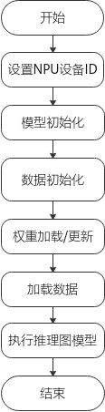

# PyTorch在线推理指南
-   [使用场景](#使用场景)
-   [基本使用流程](#基本使用流程)
    -   [前提条件](#前提条件)
    -   [在线推理流程](#在线推理流程)
    -   [环境变量配置](#环境变量配置)
    -   [样例参考](#样例参考)
-   [专题](#专题)
    -   [混合精度](#混合精度)
-   [安装7.3.0版本gcc](#安装7-3-0版本gcc)
<h2 id="使用场景">使用场景</h2>

在线推理是在AI框架内执行推理的场景，例如在PyTorch框架上，加载模型后，通过“model.eval\(\)“将模型切换为推理模式。

相比于离线推理场景，使用在线推理可以方便将原来基于PyTorch框架做推理的应用快速迁移到昇腾AI处理器，适用于数据中心推理场景。

## 支持的芯片型号<a name="section15598658104219"></a>

昇腾910 AI处理器

昇腾710 AI处理器

<h2 id="基本使用流程">基本使用流程</h2>

-   **[前提条件](#前提条件)**  

-   **[在线推理流程](#在线推理流程)**  

-   **[环境变量配置](#环境变量配置)**  

-   **[样例参考](#样例参考)**  


<h2 id="前提条件">前提条件</h2>

已完成PyTorch框架及混合精度模块的安装，详情请参见[《PyTorch安装指南》](https://gitee.com/ascend/pytorch/blob/2.0.2.tr5/docs/zh/PyTorch%E5%AE%89%E8%A3%85%E6%8C%87%E5%8D%97/PyTorch%E5%AE%89%E8%A3%85%E6%8C%87%E5%8D%97.md)进行PyTorch相关运行环境搭建。

<h2 id="在线推理流程">在线推理流程</h2>

在线推理流程如[图1](#fig13802941161818)所示。

**图 1**  在线推理流程图<a name="fig13802941161818"></a>  


<h2 id="环境变量配置">环境变量配置</h2>

PyTorch在线推理进程启动所依赖的环境变量：

```
# 请依据实际在下列场景中选择其一，进行在线推理依赖包安装路径的环境变量设置。具体如下（以HwHiAiUser用户安装，安装路径为默认路径为例）：
# 场景一：昇腾设备安装部署开发套件包Ascend-cann-toolkit(此时开发环境可进行推理任务)。
. /home/HwHiAiUser/Ascend/ascend-toolkit/set_env.sh 
# 场景二：昇腾设备安装部署软件包Ascend-cann-nnae。
. /home/HwHiAiUser/Ascend/nnae/set_env.sh 

# 若运行环境中存在多个python3版本时，需要在环境变量中配置python3.7.5的安装路径。
export PATH=/usr/local/python3.7.5/bin:$PATH
export LD_LIBRARY_PATH=/usr/local/python3.7.5/lib:$LD_LIBRARY_PATH

# 指定芯片的逻辑ID
export ASCEND_DEVICE_ID=0

# 输出日志信息,可根据实际修改
export ASCEND_SLOG_PRINT_TO_STDOUT=1
export ASCEND_GLOBAL_LOG_LEVEL=0

# TASK多线程下发
export TASK_QUEUE_ENABLE=0
```

**表 1**  环境变量说明

<a name="table2072027194819"></a>
<table><thead align="left"><tr id="row1173527114812"><th class="cellrowborder" valign="top" width="35.51355135513551%" id="mcps1.2.4.1.1"><p id="p073027114816"><a name="p073027114816"></a><a name="p073027114816"></a>配置项</p>
</th>
<th class="cellrowborder" valign="top" width="54.42544254425443%" id="mcps1.2.4.1.2"><p id="p157362712480"><a name="p157362712480"></a><a name="p157362712480"></a>说明</p>
</th>
<th class="cellrowborder" valign="top" width="10.061006100610062%" id="mcps1.2.4.1.3"><p id="p187392714485"><a name="p187392714485"></a><a name="p187392714485"></a>必选/可选</p>
</th>
</tr>
</thead>
<tbody><tr id="row2732273481"><td class="cellrowborder" valign="top" width="35.51355135513551%" headers="mcps1.2.4.1.1 "><p id="p57382719481"><a name="p57382719481"></a><a name="p57382719481"></a>LD_LIBRARY_PATH</p>
</td>
<td class="cellrowborder" valign="top" width="54.42544254425443%" headers="mcps1.2.4.1.2 "><p id="p07319271480"><a name="p07319271480"></a><a name="p07319271480"></a>动态库的查找路径，参考上述举例配置。</p>
<div class="note" id="note119943144912"><a name="note119943144912"></a><a name="note119943144912"></a><span class="notetitle"> 说明： </span><div class="notebody"><p id="p49933104915"><a name="p49933104915"></a><a name="p49933104915"></a>若系统环境安装了gcc7.3.0（例如CentOS7.6、Debian和BClinux系统），需要配置gcc相关环境变量，详情请参见<a href="#安装7-3-0版本gcc.md#zh-cn_topic_0000001146754749_zh-cn_topic_0000001072593337_l5e5c9395407d46439788b12f0e6342bc">5</a>。</p>
</div></div>
</td>
<td class="cellrowborder" valign="top" width="10.061006100610062%" headers="mcps1.2.4.1.3 "><p id="p187352744817"><a name="p187352744817"></a><a name="p187352744817"></a>必选</p>
</td>
</tr>
<tr id="row17342744812"><td class="cellrowborder" valign="top" width="35.51355135513551%" headers="mcps1.2.4.1.1 "><p id="p4731227184818"><a name="p4731227184818"></a><a name="p4731227184818"></a>PATH</p>
</td>
<td class="cellrowborder" valign="top" width="54.42544254425443%" headers="mcps1.2.4.1.2 "><p id="p97310276484"><a name="p97310276484"></a><a name="p97310276484"></a>可执行程序的查找路径，参考上述举例配置。</p>
</td>
<td class="cellrowborder" valign="top" width="10.061006100610062%" headers="mcps1.2.4.1.3 "><p id="p1573142711483"><a name="p1573142711483"></a><a name="p1573142711483"></a>必选</p>
</td>
</tr>
<tr id="row95241840165613"><td class="cellrowborder" valign="top" width="35.51355135513551%" headers="mcps1.2.4.1.1 "><p id="p15242404566"><a name="p15242404566"></a><a name="p15242404566"></a>ASCEND_DEVICE_ID</p>
</td>
<td class="cellrowborder" valign="top" width="54.42544254425443%" headers="mcps1.2.4.1.2 "><p id="p688447526"><a name="p688447526"></a><a name="p688447526"></a>指定芯片的逻辑ID。</p>
<p id="p178824712212"><a name="p178824712212"></a><a name="p178824712212"></a>取值范围[0,N-1]，默认为0。其中N为当前物理机/虚拟机/容器内的设备总数。</p>
</td>
<td class="cellrowborder" valign="top" width="10.061006100610062%" headers="mcps1.2.4.1.3 "><p id="p105245400562"><a name="p105245400562"></a><a name="p105245400562"></a>可选</p>
</td>
</tr>
<tr id="row203705529819"><td class="cellrowborder" valign="top" width="35.51355135513551%" headers="mcps1.2.4.1.1 "><p id="p53705522810"><a name="p53705522810"></a><a name="p53705522810"></a>ASCEND_SLOG_PRINT_TO_STDOUT</p>
</td>
<td class="cellrowborder" valign="top" width="54.42544254425443%" headers="mcps1.2.4.1.2 "><p id="zh-cn_topic_0000001073203258_p763102116322"><a name="zh-cn_topic_0000001073203258_p763102116322"></a><a name="zh-cn_topic_0000001073203258_p763102116322"></a>是否开启日志打屏。取值：</p>
<a name="zh-cn_topic_0000001073203258_ul95291245104113"></a><a name="zh-cn_topic_0000001073203258_ul95291245104113"></a><ul id="zh-cn_topic_0000001073203258_ul95291245104113"><li>0或不配置：关闭日志打屏</li><li>1：开启日志打屏</li></ul>
</td>
<td class="cellrowborder" valign="top" width="10.061006100610062%" headers="mcps1.2.4.1.3 "><p id="p6370125217818"><a name="p6370125217818"></a><a name="p6370125217818"></a>可选</p>
</td>
</tr>
<tr id="row188405280914"><td class="cellrowborder" valign="top" width="35.51355135513551%" headers="mcps1.2.4.1.1 "><p id="p5840928594"><a name="p5840928594"></a><a name="p5840928594"></a>ASCEND_GLOBAL_LOG_LEVEL</p>
</td>
<td class="cellrowborder" valign="top" width="54.42544254425443%" headers="mcps1.2.4.1.2 "><p id="zh-cn_topic_0000001073521184_p763102116322"><a name="zh-cn_topic_0000001073521184_p763102116322"></a><a name="zh-cn_topic_0000001073521184_p763102116322"></a>设置日志的全局日志级别。取值：</p>
<a name="zh-cn_topic_0000001073521184_u4d735da6e0494e55abbf5eb6aefe988d"></a><a name="zh-cn_topic_0000001073521184_u4d735da6e0494e55abbf5eb6aefe988d"></a><ul id="zh-cn_topic_0000001073521184_u4d735da6e0494e55abbf5eb6aefe988d"><li>0：对应DEBUG级别。</li><li>1：对应INFO级别。</li><li>2：对应WARNING级别。</li><li>3：对应ERROR级别。</li><li>4：对应NULL级别，不输出日志。</li><li>其他值为非法值。</li></ul>
</td>
<td class="cellrowborder" valign="top" width="10.061006100610062%" headers="mcps1.2.4.1.3 "><p id="p6841928598"><a name="p6841928598"></a><a name="p6841928598"></a>可选</p>
</td>
</tr>
<tr id="row17638114219104"><td class="cellrowborder" valign="top" width="35.51355135513551%" headers="mcps1.2.4.1.1 "><p id="p20638342191018"><a name="p20638342191018"></a><a name="p20638342191018"></a>TASK_QUEUE_ENABLE</p>
</td>
<td class="cellrowborder" valign="top" width="54.42544254425443%" headers="mcps1.2.4.1.2 "><p id="p126381842151019"><a name="p126381842151019"></a><a name="p126381842151019"></a>是否开启TASK多线程下发，绝大多数情况下，打开该功能会进一步提升整网训练性能。取值：</p>
<a name="ul6194152711118"></a><a name="ul6194152711118"></a><ul id="ul6194152711118"><li>0或不配置：关闭TASK多线程下发。</li><li>1：开启TASK多线程下发。</li></ul>
</td>
<td class="cellrowborder" valign="top" width="10.061006100610062%" headers="mcps1.2.4.1.3 "><p id="p86386423103"><a name="p86386423103"></a><a name="p86386423103"></a>可选</p>
</td>
</tr>
</tbody>
</table>

> **说明：** 
>更多日志信息，请参见[《CANN 日志参考》](https://support.huawei.com/enterprise/zh/doc/EDOC1100206691?idPath=23710424%7C251366513%7C22892968%7C251168373)。

<h2 id="样例参考">样例参考</h2>

## 样例代码<a name="section2017032418274"></a>

在进行推理应用时，应尽量保证应用在生命周期内不频繁初始化。推理模式通过模型model.eval\(\)进行设置，并且推理过程要在“with torch.no\_grad\(\):”代码分支下运行。

本例中，我们将使用Resnet50网络的python代码进行说明。

样例代码 resnet50\_infer\_for\_pytorch.py：

```
import argparse
import os
import time
import torch
import torch.nn.parallel
import torch.optim
import torch.utils.data
import torch.utils.data.distributed
import torchvision.transforms as transforms
import torchvision.datasets as datasets
import torchvision.models as models

import torch.npu
from apex import amp

model_names = sorted(name for name in models.__dict__
                     if name.islower() and not name.startswith("__")
                     and callable(models.__dict__[name]))


def parse_args():
    """ 用户自定义数据集路径、模型路径 """
    parser = argparse.ArgumentParser(description='PyTorch ImageNet Training')
    parser.add_argument('--data', metavar='DIR', default="/data/imagenet",
                        help='path to dataset')
    parser.add_argument('-a', '--arch', metavar='ARCH', default='resnet50',
                        choices=model_names,
                        help='model architecture: ' +
                             ' | '.join(model_names) +
                             ' (default: resnet18)')

    parser.add_argument('--epochs', default=100, type=int, metavar='N',
                        help='number of total epochs to run')

    parser.add_argument('-b', '--batch_size', default=512, type=int,
                        metavar='N',
                        help='mini-batch size (default: 256), this is the total '
                             'batch size of all GPUs on the current node when '
                             'using Data Parallel or Distributed Data Parallel')

    parser.add_argument('--resume', default='', type=str, metavar='PATH',
                        help='path to latest checkpoint (default: none)')

    parser.add_argument('--pretrained', dest='pretrained', action='store_true',
                        help='use pre-trained model')

    parser.add_argument('--npu', default=None, type=int,
                        help='NPU id to use.')

    parser.add_argument('-j', '--workers', default=32, type=int, metavar='N',
                        help='number of data loading workers (default: 8)')

    parser.add_argument('--lr', '--learning_rate', default=0.1, type=float,
                        metavar='LR', help='initial learning rate', dest='lr')
    parser.add_argument('--wd', '--weight_decay', default=1e-4, type=float,
                        metavar='W', help='weight decay (default: 1e-4)',
                        dest='weight_decay')

    args, unknown_args = parser.parse_known_args()
    if len(unknown_args) > 0:
        for bad_arg in unknown_args:
            print("ERROR: Unknown command line arg: %s" % bad_arg)
        raise ValueError("Invalid command line arg(s)")

    return args


# =========================================================================
# 主函数入口
# =========================================================================
def main():
    args = parse_args()
    if args.npu is None:
        args.npu = 0
    global CALCULATE_DEVICE
    CALCULATE_DEVICE = "npu:{}".format(args.npu)
    torch.npu.set_device(CALCULATE_DEVICE)
    print("use ", CALCULATE_DEVICE)
    main_worker(args.npu, args)


def main_worker(npu, args):
    global best_acc1
    args.npu = npu

    # =========================================================================
    # 创建模型
    # =========================================================================
    print("=> creating model '{}'".format(args.arch))
    model = models.__dict__[args.arch](zero_init_residual=True)

    # 将模型数据复制到昇腾AI处理器中
    model = model.to(CALCULATE_DEVICE)

    optimizer = torch.optim.SGD([
        {'params': [param for name, param in model.named_parameters() if name[-4:] == 'bias'], 'weight_decay': 0.0},
        {'params': [param for name, param in model.named_parameters() if name[-4:] != 'bias'],
         'weight_decay': args.weight_decay}],
        args.lr)

    # =========================================================================
    # 初始化混合精度模型，使用后可加速运算，但结果的准确率可能会轻微降低。可根据实际场景选择使用
    # =========================================================================
    model, optimizer = amp.initialize(model, optimizer, opt_level="O2", loss_scale=1024, verbosity=1)

    # =========================================================================
    # 加载训练好的模型参数
    # =========================================================================
    # 从模型文件中恢复模型参数
    if os.path.isfile(args.resume):
        print("=> loading checkpoint '{}'".format(args.resume))
        checkpoint = torch.load(args.resume)

        best_acc1 = checkpoint['best_acc1']
        best_acc1 = best_acc1.to("npu:{}".format(args.npu))

        model.load_state_dict(checkpoint['state_dict'])
        print("=> loaded checkpoint '{}' (epoch {})".format(args.resume, checkpoint['epoch']))

    else:
        print("=> no checkpoint found at '{}'".format(args.resume))

    # =========================================================================
    # 初始化数据集
    # =========================================================================
    # 图像数据加载与预处理
    valdir = os.path.join(args.data, 'val')
    normalize = transforms.Normalize(mean=[0.485, 0.456, 0.406],
                                     std=[0.229, 0.224, 0.225])

    val_loader = torch.utils.data.DataLoader(
        datasets.ImageFolder(valdir, transforms.Compose([
            transforms.Resize(256),
            transforms.CenterCrop(224),
            transforms.ToTensor(),
            normalize,
        ])),
        batch_size=args.batch_size, shuffle=True,
        num_workers=args.workers, pin_memory=True)

    # =========================================================================
    # 运行validate
    # =========================================================================
    validate(val_loader, model, args)


# =========================================================================
# 在线推理样例接口实现
# =========================================================================
def validate(val_loader, model, args):
    batch_time = AverageMeter('Time', ':6.3f')
    top1 = AverageMeter('Acc@1', ':6.2f')
    top5 = AverageMeter('Acc@5', ':6.2f')
    progress = ProgressMeter(
        len(val_loader),
        [batch_time, top1, top5],
        prefix='Test: ')

    # =========================================================================
    # 切换到推理模式
    # =========================================================================
    model.eval()

    # =========================================================================
    # 在 torch.no_grad():分支下执行模型正向计算
    # =========================================================================
    with torch.no_grad():
        end = time.time()
        for i, (images, target) in enumerate(val_loader):

            # 将图像数据置于NPU中
            images = images.to(CALCULATE_DEVICE, non_blocking=True)
            target = target.to(torch.int32).to(CALCULATE_DEVICE, non_blocking=True)

            # 计算输出
            output = model(images)

            # 统计结果精度
            acc1, acc5 = accuracy(output, target, topk=(1, 5))
            top1.update(acc1[0], images.size(0))
            top5.update(acc5[0], images.size(0))

            # 测量运行时间
            batch_time.update(time.time() - end)
            end = time.time()

            # 打印推理运算过程日志
            progress.display(i)

        print(' * Acc@1 {top1.avg:.3f} Acc@5 {top5.avg:.3f}'.format(top1=top1, top5=top5))

    return top1.avg


class AverageMeter(object):
    """计算并存储平均值和当前值"""
    def __init__(self, name, fmt=':f'):
        self.name = name
        self.fmt = fmt
        self.reset()
        self.start_count_index = 10

    def reset(self):
        self.val = 0
        self.avg = 0
        self.sum = 0
        self.count = 0

    def update(self, val, n=1):
        if self.count == 0:
            self.batchsize = n

        self.val = val
        self.count += n
        if self.count > (self.start_count_index * self.batchsize):
            self.sum += val * n
            self.avg = self.sum / (self.count - self.start_count_index * self.batchsize)

    def __str__(self):
        fmtstr = '{name} {val' + self.fmt + '} ({avg' + self.fmt + '})'
        return fmtstr.format(**self.__dict__)


class ProgressMeter(object):
    """记录模型运算过程信息"""
    def __init__(self, num_batches, meters, prefix=""):
        self.batch_fmtstr = self._get_batch_fmtstr(num_batches)
        self.meters = meters
        self.prefix = prefix

    def display(self, batch):
        entries = [self.prefix + self.batch_fmtstr.format(batch)]
        entries += [str(meter) for meter in self.meters]
        print('\t'.join(entries))

    def _get_batch_fmtstr(self, num_batches):
        num_digits = len(str(num_batches // 1))
        fmt = '{:' + str(num_digits) + 'd}'
        return '[' + fmt + '/' + fmt.format(num_batches) + ']'


def accuracy(output, target, topk=(1,)):
    """根据指定值k，计算k个顶部预测的精度"""
    with torch.no_grad():
        maxk = max(topk)
        batch_size = target.size(0)

        _, pred = output.topk(maxk, 1, True, True)
        pred = pred.t()
        correct = pred.eq(target.view(1, -1).expand_as(pred))

        res = []
        for k in topk:
            correct_k = correct[:k].view(-1).float().sum(0, keepdim=True)
            res.append(correct_k.mul_(100.0 / batch_size))
        return res


if __name__ == '__main__':
    main()
```

## 样例执行<a name="section340764716270"></a>

以ResNet50模型为例，执行在线推理样例。

1.  下载预训练模型。

    打开ModelZoo中[ResNet50详情页](https://ascend.huawei.com/zh/#/software/modelzoo/detail/C/cf20ab8b8bea4032a6b056ab503112e4)，单击该页面的“下载模型“下载已训练好的模型文件。

2.  编辑推理脚本。

    创建“resnet50\_infer\_for\_pytorch.py“模型脚本文件，并参考[样例代码]()写入相关代码。

3.  执行推理。

    参考[环境变量配置](#环境变量配置)设置环境变量，并执行命令：

    ```
    python3 pytorch-resnet50-apex.py --data /data/imagenet \
                                     --npu 7 \
                                     --epochs 90 \
                                     --resume ./checkpoint.pth.tar    # ./checkpoint.pth.tar为示例预训练模型文件路径
    ```

    > **说明：** 
    >上述为样例输入，用户可根据实际修改传入参数。


<h2 id="专题">专题</h2>

-   **[混合精度](#混合精度)**  


<h2 id="混合精度">混合精度</h2>

## 概述<a name="section14734122962615"></a>

基于NPU芯片的架构特性，模型运算会涉及到混合精度，即混合使用float16和float32数据类型的应用场景。使用float16代替float32有如下好处：

-   对于中间变量的内存占用更少，节省内存的使用。
-   因内存使用会减少，所以数据传出的时间也会相应减少。
-   float16的计算单元可以提供更快的计算性能。

但是，混合精度训练受限于float16表达的精度范围，单纯将float32转换成float16会影响训练收敛情况，为了保证部分计算使用float16来进行加速的同时能保证训练收敛，这里采用混合精度模块Apex来达到以上效果。混合精度模块Apex是一个集优化性能、精度收敛于一身的综合优化库。

## 特性支持<a name="section175201458521"></a>

混合精度模块功能和优化描述如[表1](#zh-cn_topic_0278765773_table10717173813332)所示。

**表 1**  混合精度模块功能

<a name="zh-cn_topic_0278765773_table10717173813332"></a>
<table><thead align="left"><tr id="zh-cn_topic_0278765773_row371716385333"><th class="cellrowborder" valign="top" width="32.269999999999996%" id="mcps1.2.3.1.1"><p id="zh-cn_topic_0278765773_p13717163815333"><a name="zh-cn_topic_0278765773_p13717163815333"></a><a name="zh-cn_topic_0278765773_p13717163815333"></a>功能</p>
</th>
<th class="cellrowborder" valign="top" width="67.73%" id="mcps1.2.3.1.2"><p id="zh-cn_topic_0278765773_p14400173910345"><a name="zh-cn_topic_0278765773_p14400173910345"></a><a name="zh-cn_topic_0278765773_p14400173910345"></a>描述</p>
</th>
</tr>
</thead>
<tbody><tr id="zh-cn_topic_0278765773_row1571763813334"><td class="cellrowborder" valign="top" width="32.269999999999996%" headers="mcps1.2.3.1.1 "><p id="zh-cn_topic_0278765773_p4502732153412"><a name="zh-cn_topic_0278765773_p4502732153412"></a><a name="zh-cn_topic_0278765773_p4502732153412"></a>O1配置模式</p>
</td>
<td class="cellrowborder" valign="top" width="67.73%" headers="mcps1.2.3.1.2 "><p id="zh-cn_topic_0278765773_p640053920348"><a name="zh-cn_topic_0278765773_p640053920348"></a><a name="zh-cn_topic_0278765773_p640053920348"></a>Conv, Matmul等使用<span>float16</span>计算，其他如Softmax、BN使用<span>float32</span>。</p>
</td>
</tr>
<tr id="zh-cn_topic_0278765773_row3717173817336"><td class="cellrowborder" valign="top" width="32.269999999999996%" headers="mcps1.2.3.1.1 "><p id="zh-cn_topic_0278765773_p11503103210344"><a name="zh-cn_topic_0278765773_p11503103210344"></a><a name="zh-cn_topic_0278765773_p11503103210344"></a>O2配置模式</p>
</td>
<td class="cellrowborder" valign="top" width="67.73%" headers="mcps1.2.3.1.2 "><p id="zh-cn_topic_0278765773_p164001639143419"><a name="zh-cn_topic_0278765773_p164001639143419"></a><a name="zh-cn_topic_0278765773_p164001639143419"></a>BN使用<span>float32</span>，其他绝大部分使用<span>float16</span>。</p>
</td>
</tr>
<tr id="zh-cn_topic_0278765773_row14717193815334"><td class="cellrowborder" valign="top" width="32.269999999999996%" headers="mcps1.2.3.1.1 "><p id="zh-cn_topic_0278765773_p1950318328349"><a name="zh-cn_topic_0278765773_p1950318328349"></a><a name="zh-cn_topic_0278765773_p1950318328349"></a>静态Loss Scale功能</p>
</td>
<td class="cellrowborder" valign="top" width="67.73%" headers="mcps1.2.3.1.2 "><p id="zh-cn_topic_0278765773_p1440033983418"><a name="zh-cn_topic_0278765773_p1440033983418"></a><a name="zh-cn_topic_0278765773_p1440033983418"></a>静态设置参数确保混合精度训练收敛。</p>
</td>
</tr>
<tr id="zh-cn_topic_0278765773_row871733813317"><td class="cellrowborder" valign="top" width="32.269999999999996%" headers="mcps1.2.3.1.1 "><p id="zh-cn_topic_0278765773_p1550303243417"><a name="zh-cn_topic_0278765773_p1550303243417"></a><a name="zh-cn_topic_0278765773_p1550303243417"></a>动态Loss Scale功能</p>
</td>
<td class="cellrowborder" valign="top" width="67.73%" headers="mcps1.2.3.1.2 "><p id="zh-cn_topic_0278765773_p15400143963412"><a name="zh-cn_topic_0278765773_p15400143963412"></a><a name="zh-cn_topic_0278765773_p15400143963412"></a>动态计算Loss Scale值并判读是否溢出。</p>
</td>
</tr>
</tbody>
</table>

> **说明：** 
>当前版本的实现方式主要为python实现，不支持AscendCL或者CUDA优化。

## 混合精度模型初始化<a name="section18178125518268"></a>

1.  使用apex混合精度模块需要首先从apex库中导入amp，代码如下：

    ```
    from apex import amp
    ```

2.  导入amp模块后，需要初始化amp，使其能对模型、优化器以及PyTorch内部函数进行必要的改动，初始化代码如下：

    ```
    model, optimizer = amp.initialize(model, optimizer)
    ```

    也可参考[样例代码](#样例参考)中的“初始化混合精度模型”：

    ```
    model, optimizer = amp.initialize(model, optimizer, opt_level="O2", loss_scale=1024, verbosity=1)
    ```


## 混合精度推理<a name="section818071513288"></a>

按混合精度模型初始化后，正常执行模型正向计算即可。

参考代码：可参考[样例代码](#样例参考)实现。

<h2 id="安装7-3-0版本gcc">安装7.3.0版本gcc</h2>

以下步骤请在root用户下执行。

1.  下载gcc-7.3.0.tar.gz，下载地址为[https://mirrors.tuna.tsinghua.edu.cn/gnu/gcc/gcc-7.3.0/gcc-7.3.0.tar.gz](https://mirrors.tuna.tsinghua.edu.cn/gnu/gcc/gcc-7.3.0/gcc-7.3.0.tar.gz)。
2.  安装gcc时候会占用大量临时空间，请先执行下面的命令清空/tmp目录：

    ```
    sudo rm -rf /tmp/*
    ```

3.  安装依赖（以CentOS和Ubuntu系统为例）。
    -   CentOS执行如下命令安装。

        ```
        yum install bzip2    
        ```

    -   Ubuntu执行如下命令安装。

        ```
        apt-get install bzip2    
        ```

4.  编译安装gcc。
    1.  进入gcc-7.3.0.tar.gz源码包所在目录，解压源码包，命令为：

        ```
        tar -zxvf gcc-7.3.0.tar.gz
        ```

    2.  进入解压后的文件夹，执行如下命令下载gcc依赖包：

        ```
        cd gcc-7.3.0
        ./contrib/download_prerequisites
        ```

        如果执行上述命令报错，需要执行如下命令在“gcc-7.3.0/“文件夹下下载依赖包：

        ```
        wget http://gcc.gnu.org/pub/gcc/infrastructure/gmp-6.1.0.tar.bz2
        wget http://gcc.gnu.org/pub/gcc/infrastructure/mpfr-3.1.4.tar.bz2
        wget http://gcc.gnu.org/pub/gcc/infrastructure/mpc-1.0.3.tar.gz
        wget http://gcc.gnu.org/pub/gcc/infrastructure/isl-0.16.1.tar.bz2
        ```

        下载好上述依赖包后，重新执行以下命令：

        ```
        ./contrib/download_prerequisites
        ```

        如果上述命令校验失败，需要确保依赖包为一次性下载成功，无重复下载现象。

    3.  <a name="zh-cn_topic_0000001146754749_zh-cn_topic_0000001072593337_l75d31a2874534a2092e80a5f865b46f0"></a>执行配置、编译和安装命令：

        ```
        ./configure --enable-languages=c,c++ --disable-multilib --with-system-zlib --prefix=/usr/local/linux_gcc7.3.0
        make -j15    # 通过grep -w processor /proc/cpuinfo|wc -l查看cpu数，示例为15，用户可自行设置相应参数。
        make install    
        ```

        > **须知：** 
        >其中“--prefix“参数用于指定linux\_gcc7.3.0安装路径，用户可自行配置，但注意不要配置为“/usr/local“及“/usr“，因为会与系统使用软件源默认安装的gcc相冲突，导致系统原始gcc编译环境被破坏。示例指定为“/usr/local/linux\_gcc7.3.0“。


5.  配置环境变量。

    当用户执行训练时，需要用到gcc升级后的编译环境，因此要在训练脚本中配置环境变量，通过如下命令配置。

    ```
    export LD_LIBRARY_PATH=${install_path}/lib64:${LD_LIBRARY_PATH}
    ```

    其中$\{install\_path\}为[3.](#zh-cn_topic_0000001146754749_zh-cn_topic_0000001072593337_l75d31a2874534a2092e80a5f865b46f0)中配置的gcc7.3.0安装路径，本示例为“/usr/local/linux\_gcc7.3.0/“。

    > **说明：** 
    >本步骤为用户在需要用到gcc升级后的编译环境时才配置环境变量。


