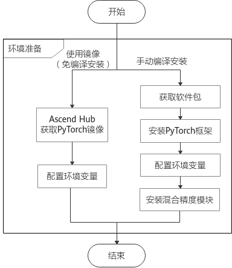

# PyTorch安装指南
-   [简介](#简介.md)
-   [手动编译安装](#手动编译安装.md)
    -   [前提条件](#前提条件.md)
    -   [安装PyTorch框架](#安装PyTorch框架.md)
    -   [配置环境变量](#配置环境变量.md)
    -   [安装混合精度模块](#安装混合精度模块.md)
-   [使用Ascend Hub镜像](#使用Ascend-Hub镜像.md)
    -   [Ascend Hub获取PyTorch镜像](#Ascend-Hub获取PyTorch镜像.md)
    -   [配置环境变量](#配置环境变量-0.md)
-   [参考信息](#参考信息.md)
    -   [CMake安装方法](#CMake安装方法.md)
    -   [安装7.3.0版本gcc](#安装7-3-0版本gcc.md)
    -   [安装“torch-\*.whl ”提示“torch 1.5.0xxxx”与“torchvision”所依赖的版本不匹配](#安装-torch--whl-提示-torch-1-5-0xxxx-与-torchvision-所依赖的版本不匹配.md)
<h2 id="简介.md">简介</h2>

用户在准备相关环境进行PyTorch模型的移植及训练时，可以选择在训练服务器中手动编译安装PyTorch框架相关模块，或直接获取Ascend Hub镜像中心提供的基础镜像（镜像中已安装PyTorch模块和混合精度模块），进行模型的移植与训练。

**图 1**  环境准备流程图<a name="zh-cn_topic_0000001119176876_fig1938918396117"></a>  


<h2 id="手动编译安装.md">手动编译安装</h2>

-   **[前提条件](#前提条件.md)**  

-   **[安装PyTorch框架](#安装PyTorch框架.md)**  

-   **[配置环境变量](#配置环境变量.md)**  

-   **[安装混合精度模块](#安装混合精度模块.md)**  


<h2 id="前提条件.md">前提条件</h2>

## 前提条件<a name="zh-cn_topic_0000001105856382_zh-cn_topic_0275872734_section108914373254"></a>

-   需完成CANN开发或运行环境的安装，具体操作请参考《CANN 软件安装指南》。
-   需安装3.12.0以上版本的CMake，安装方法请参考[CMake安装方法](#CMake安装方法.md)。
-   需确保已安装7.3.0以上版本的gcc，7.3.0版本gcc具体安装及使用方式请参考[安装7.3.0版本gcc](#安装7-3-0版本gcc.md)。
-   需确保环境中已安装patch、git工具，以Ubuntu和CentOS系统为例，命令如下：
    -   Ubuntu系统

        ```
        apt-get install patch
        apt-get install git
        ```

    -   CentOS系统

        ```
        yum install patch
        yum install git
        ```


<h2 id="安装PyTorch框架.md">安装PyTorch框架</h2>

## 安装流程<a name="zh-cn_topic_0000001152776301_section1611810384557"></a>

1.  以root或非root用户登录服务器。
2.  依次执行如下命令安装PyTorch依赖环境。

    如果使用非root用户安装Python及其依赖，用户需要在本步骤中的每句命令结尾加上**--user**，命令示例为：**pip3.7 install pyyaml --user**

    ```
    pip3 install pyyaml
    pip3 install wheel
    ```

3.  获取PyTorch源代码。

    1.  运行如下命令，获取适配昇腾AI处理器的PyTorch源代码。

        ```
        git clone https://gitee.com/ascend/pytorch.git
        ```

        下载的源码主要目录结构如下所示：

        ```
        pytorch
        │ ├─patch             # 昇腾AI处理器适配补丁目录
        │    ├─npu.patch
        │ ├─scripts           # 编译构建目录
        │    ├─gen.sh
        │ ├─src               # 源码目录
        │ ├─test              # 测试用例存放目录
        │ ├─README.md
        ```

    2.  运行如下命令，进入“pytorch“目录，并获取原生PyTorch源代码。

        ```
        cd pytorch
        git clone -b v1.5.0 --depth=1 https://github.com/pytorch/pytorch.git
        ```

        下载原生pytorch源码后，代码主要目录结构如下所示：

        ```
        pytorch
        │ ├─patch             # 昇腾AI处理器适配补丁目录
        │    ├─npu.patch
        │ ├─pytorch           # 原生pytorch代码目录
        │ ├─scripts           # 编译构建目录
        │    ├─gen.sh
        │ ├─src               # 源码目录
        │ ├─test              # 测试用例存放目录
        │ ├─README.md
        ```

    3.  运行如下命令，进入原生pytorch代码目录“pytorch“，并获取PyTorch被动依赖代码。

        ```
        cd  pytorch
        git submodule sync
        git submodule update --init --recursive
        ```


    > **说明：** 
    >受网络波动影响，源码获取时间可能较长，下载过程中请耐心等待。 下载完成之后若没有报错，即生成了PyTorch及其依赖的第三方代码。

4.  编译生成适配昇腾AI处理器的PyTorch安装包。
    1.  进入“pytorch/scripts“文件夹，执行转换脚本，生成适配昇腾AI处理器的全量代码。

        ```
        cd ../scripts
        bash gen.sh
        ```

        将在"pytorch/pytorch"目录中生成适配昇腾AI处理器的全量代码。

    2.  进入适配后的全量代码目录，即“pytorch/pytorch“目录，编译生成pytorch的二进制安装包。

        ```
        cd ../pytorch
        bash build.sh
        ```

        生成的二进制包在当前的dist目录下，即“pytorch/pytorch/dist”文件夹目录下。


5.  <a name="zh-cn_topic_0000001152776301_li49671667141"></a>安装PyTorch。

    进入“pytorch/pytorch/dist“文件夹目录，执行如下命令安装。

    ```
    pip3 install --upgrade torch-1.5.0+ascend-cp37-cp37m-linux_{arch}.whl
    ```

    **\{arch\}**表示架构信息，为aarch64或x86\_64。

    > **说明：** 
    >若对环境中的PyTorch进行升级时，需要先卸载环境中已安装的PyTorch软件包再执行[5. 安装PyTorch。](#zh-cn_topic_0000001152776301_li49671667141)可以通过执行如下命令查询环境上是否已安装PyTorch。
    >**pip3 list | grep torch**


<h2 id="配置环境变量.md">配置环境变量</h2>

安装完软件包后，需要配置环境变量才能正常使用昇腾PyTorch。建议构建启动脚本，例如构建set\_env.sh脚本，使用source set\_env.sh配置当前窗口的环境变量。set\_env.sh脚本内容如下（以root用户安装，安装路径为默认路径为例）。

```
cpu_type=$(echo $HOSTTYPE)

if [ x"${cpu_type}" == x"x86_64" ];then
  cpu_type=x86_64-linux
else
  cpu_type=arm64-linux
fi
if [ -d /usr/local/Ascend/nnae/latest ];then
	export LD_LIBRARY_PATH=/usr/local/:/usr/local/python3.7.5/lib/:/usr/local/openblas/lib:/usr/local/lib/:/usr/lib64/:/usr/lib/:/usr/local/Ascend/nnae/latest/fwkacllib/lib64/:/usr/local/Ascend/driver/lib64/common/:/usr/local/Ascend/driver/lib64/driver/:/usr/local/Ascend/add-ons/:/usr/lib/aarch64_64-linux-gnu:$LD_LIBRARY_PATH
  export PATH=$PATH:/usr/local/Ascend/nnae/latest/fwkacllib/ccec_compiler/bin/:/usr/local/Ascend/nnae/latest/toolkit/tools/ide_daemon/bin/
  export ASCEND_OPP_PATH=/usr/local/Ascend/nnae/latest/opp/
  export OPTION_EXEC_EXTERN_PLUGIN_PATH=/usr/local/Ascend/nnae/latest/fwkacllib/lib64/plugin/opskernel/libfe.so:/usr/local/Ascend/nnae/latest/fwkacllib/lib64/plugin/opskernel/libaicpu_engine.so:/usr/local/Ascend/nnae/latest/fwkacllib/lib64/plugin/opskernel/libge_local_engine.so
  export PYTHONPATH=/usr/local/Ascend/nnae/latest/fwkacllib/python/site-packages/:/usr/local/Ascend/nnae/latest/fwkacllib/python/site-packages/auto_tune.egg/auto_tune:/usr/local/Ascend/nnae/latest/fwkacllib/python/site-packages/schedule_search.egg:$PYTHONPATH
	export ASCEND_AICPU_PATH=/usr/local/Ascend/nnae/latest/
else
	export LD_LIBRARY_PATH=/usr/local/:/usr/local/lib/:/usr/lib64/:/usr/lib/:/usr/local/python3.7.5/lib/:/usr/local/openblas/lib:/usr/local/Ascend/ascend-toolkit/latest/fwkacllib/lib64/:/usr/local/Ascend/driver/lib64/common/:/usr/local/Ascend/driver/lib64/driver/:/usr/local/Ascend/add-ons/:/usr/lib/aarch64-linux-gnu:$LD_LIBRARY_PATH
	export PATH=$PATH:/usr/local/Ascend/ascend-toolkit/latest/fwkacllib/ccec_compiler/bin/:/usr/local/Ascend/ascend-toolkit/latest/toolkit/tools/ide_daemon/bin/
	export ASCEND_OPP_PATH=/usr/local/Ascend/ascend-toolkit/latest/opp/
	export OPTION_EXEC_EXTERN_PLUGIN_PATH=/usr/local/Ascend/ascend-toolkit/latest/fwkacllib/lib64/plugin/opskernel/libfe.so:/usr/local/Ascend/ascend-toolkit/latest/fwkacllib/lib64/plugin/opskernel/libaicpu_engine.so:/usr/local/Ascend/ascend-toolkit/latest/fwkacllib/lib64/plugin/opskernel/libge_local_engine.so
	export PYTHONPATH=/usr/local/Ascend/ascend-toolkit/latest/fwkacllib/python/site-packages/:/usr/local/Ascend/ascend-toolkit/latest/fwkacllib/python/site-packages/auto_tune.egg/auto_tune:/usr/local/Ascend/ascend-toolkit/latest/fwkacllib/python/site-packages/schedule_search.egg:$PYTHONPATH
	export ASCEND_AICPU_PATH=/usr/local/Ascend/ascend-toolkit/latest/${cpu_type}
fi
path_lib=$(python3.7 -c """
import sys
import re
result=''
for index in range(len(sys.path)):
    match_sit = re.search('-packages', sys.path[index])
    if match_sit is not None:
        match_lib = re.search('lib', sys.path[index])
        if match_lib is not None:
            end=match_lib.span()[1]
            result += sys.path[index][0:end] + ':'
        result+=sys.path[index] + '/torch/lib:'
print(result)"""
)
export LD_LIBRARY_PATH=/usr/local/python3.7.5/lib/:${path_lib}:$LD_LIBRARY_PATH
export TASK_QUEUE_ENABLE=1 

# （可选）当系统为openeuler时，需设置此命令，取消CPU绑核。
# unset GOMP_CPU_AFFINITY

# 请依据实际，在下列场景中选择合适的HCCL初始化方式，并配置相应环境变量。具体如下：
# 场景一：单机场景
export HCCL_WHITELIST_DISABLE=1  # 关闭HCCL通信白名单
# 场景二：多机场景。
export HCCL_WHITELIST_DISABLE=1  # 关闭HCCL通信白名单
export HCCL_IF_IP="1.1.1.1"  # “1.1.1.1”为示例使用的host网卡IP，请根据实际修改。需要保证使用的网卡IP在集群内是互通的。
```

相关参数介绍参见[表1](#zh-cn_topic_0000001152616261_table42017516135)。

**表 1**  环境变量说明

<a name="zh-cn_topic_0000001152616261_table42017516135"></a>
<table><thead align="left"><tr id="zh-cn_topic_0000001152616261_row16198951191317"><th class="cellrowborder" valign="top" width="55.48%" id="mcps1.2.3.1.1"><p id="zh-cn_topic_0000001152616261_p51981251161315"><a name="zh-cn_topic_0000001152616261_p51981251161315"></a><a name="zh-cn_topic_0000001152616261_p51981251161315"></a>配置项</p>
</th>
<th class="cellrowborder" valign="top" width="44.519999999999996%" id="mcps1.2.3.1.2"><p id="zh-cn_topic_0000001152616261_p9198135114133"><a name="zh-cn_topic_0000001152616261_p9198135114133"></a><a name="zh-cn_topic_0000001152616261_p9198135114133"></a>说明</p>
</th>
</tr>
</thead>
<tbody><tr id="zh-cn_topic_0000001152616261_row6882121917329"><td class="cellrowborder" valign="top" width="55.48%" headers="mcps1.2.3.1.1 "><p id="zh-cn_topic_0000001152616261_p688241953218"><a name="zh-cn_topic_0000001152616261_p688241953218"></a><a name="zh-cn_topic_0000001152616261_p688241953218"></a>LD_LIBRARY_PATH</p>
</td>
<td class="cellrowborder" valign="top" width="44.519999999999996%" headers="mcps1.2.3.1.2 "><p id="zh-cn_topic_0000001152616261_p1888291915322"><a name="zh-cn_topic_0000001152616261_p1888291915322"></a><a name="zh-cn_topic_0000001152616261_p1888291915322"></a>动态库的查找路径，参考上述举例配置。</p>
<p id="p1292181892120"><a name="p1292181892120"></a><a name="p1292181892120"></a>若训练所在系统环境需要升级gcc（例如CentOS、Debian和BClinux系统），则<span class="parmname" id="parmname795020446318"><a name="parmname795020446318"></a><a name="parmname795020446318"></a>“LD_LIBRARY_PATH”</span>配置项处动态库查找路径需要添加<span class="filepath" id="zh-cn_topic_0256062644_filepath115819811512"><a name="zh-cn_topic_0256062644_filepath115819811512"></a><a name="zh-cn_topic_0256062644_filepath115819811512"></a>“${install_path}/lib64”</span>，其中<span class="filepath" id="zh-cn_topic_0256062644_filepath195951574421"><a name="zh-cn_topic_0256062644_filepath195951574421"></a><a name="zh-cn_topic_0256062644_filepath195951574421"></a>“{install_path}”</span>为gcc升级安装路径。请参见<a href="#安装7-3-0版本gcc.md#zh-cn_topic_0000001135347812_zh-cn_topic_0000001173199577_zh-cn_topic_0000001172534867_zh-cn_topic_0276688294_li9745165315131">5</a>。</p>
</td>
</tr>
<tr id="zh-cn_topic_0000001152616261_row16194175523010"><td class="cellrowborder" valign="top" width="55.48%" headers="mcps1.2.3.1.1 "><p id="zh-cn_topic_0000001152616261_p16195185523019"><a name="zh-cn_topic_0000001152616261_p16195185523019"></a><a name="zh-cn_topic_0000001152616261_p16195185523019"></a>PYTHONPATH</p>
</td>
<td class="cellrowborder" valign="top" width="44.519999999999996%" headers="mcps1.2.3.1.2 "><p id="zh-cn_topic_0000001152616261_p19637083322"><a name="zh-cn_topic_0000001152616261_p19637083322"></a><a name="zh-cn_topic_0000001152616261_p19637083322"></a>Python搜索路径，参考上述举例配置。</p>
</td>
</tr>
<tr id="zh-cn_topic_0000001152616261_row2954102119329"><td class="cellrowborder" valign="top" width="55.48%" headers="mcps1.2.3.1.1 "><p id="zh-cn_topic_0000001152616261_p195452113218"><a name="zh-cn_topic_0000001152616261_p195452113218"></a><a name="zh-cn_topic_0000001152616261_p195452113218"></a>PATH</p>
</td>
<td class="cellrowborder" valign="top" width="44.519999999999996%" headers="mcps1.2.3.1.2 "><p id="zh-cn_topic_0000001152616261_p964914893211"><a name="zh-cn_topic_0000001152616261_p964914893211"></a><a name="zh-cn_topic_0000001152616261_p964914893211"></a>可执行程序的查找路径，参考上述举例配置。</p>
</td>
</tr>
<tr id="zh-cn_topic_0000001152616261_row58592816294"><td class="cellrowborder" valign="top" width="55.48%" headers="mcps1.2.3.1.1 "><p id="zh-cn_topic_0000001152616261_p1886016892913"><a name="zh-cn_topic_0000001152616261_p1886016892913"></a><a name="zh-cn_topic_0000001152616261_p1886016892913"></a>ASCEND_OPP_PATH</p>
</td>
<td class="cellrowborder" valign="top" width="44.519999999999996%" headers="mcps1.2.3.1.2 "><p id="zh-cn_topic_0000001152616261_p28608892915"><a name="zh-cn_topic_0000001152616261_p28608892915"></a><a name="zh-cn_topic_0000001152616261_p28608892915"></a>算子根目录，参考上述举例配置。</p>
</td>
</tr>
<tr id="zh-cn_topic_0000001152616261_row144592037903"><td class="cellrowborder" valign="top" width="55.48%" headers="mcps1.2.3.1.1 "><p id="zh-cn_topic_0000001152616261_p104601373014"><a name="zh-cn_topic_0000001152616261_p104601373014"></a><a name="zh-cn_topic_0000001152616261_p104601373014"></a>OPTION_EXEC_EXTERN_PLUGIN_PATH</p>
</td>
<td class="cellrowborder" valign="top" width="44.519999999999996%" headers="mcps1.2.3.1.2 "><p id="zh-cn_topic_0000001152616261_p1046013716017"><a name="zh-cn_topic_0000001152616261_p1046013716017"></a><a name="zh-cn_topic_0000001152616261_p1046013716017"></a>算子信息库路径。</p>
</td>
</tr>
<tr id="zh-cn_topic_0000001152616261_row16184379493"><td class="cellrowborder" valign="top" width="55.48%" headers="mcps1.2.3.1.1 "><p id="zh-cn_topic_0000001152616261_p131851873492"><a name="zh-cn_topic_0000001152616261_p131851873492"></a><a name="zh-cn_topic_0000001152616261_p131851873492"></a>ASCEND_AICPU_PATH</p>
</td>
<td class="cellrowborder" valign="top" width="44.519999999999996%" headers="mcps1.2.3.1.2 "><p id="zh-cn_topic_0000001152616261_p181851575497"><a name="zh-cn_topic_0000001152616261_p181851575497"></a><a name="zh-cn_topic_0000001152616261_p181851575497"></a>aicpu算子包路径。</p>
</td>
</tr>
<tr id="zh-cn_topic_0000001152616261_row234714854615"><td class="cellrowborder" valign="top" width="55.48%" headers="mcps1.2.3.1.1 "><p id="zh-cn_topic_0000001152616261_p2034724894619"><a name="zh-cn_topic_0000001152616261_p2034724894619"></a><a name="zh-cn_topic_0000001152616261_p2034724894619"></a>TASK_QUEUE_ENABLE</p>
</td>
<td class="cellrowborder" valign="top" width="44.519999999999996%" headers="mcps1.2.3.1.2 "><p id="zh-cn_topic_0000001152616261_p53477489462"><a name="zh-cn_topic_0000001152616261_p53477489462"></a><a name="zh-cn_topic_0000001152616261_p53477489462"></a>使用异步任务下发，异步调用acl接口。建议开启，开启设置为1。</p>
</td>
</tr>
<tr id="zh-cn_topic_0000001152616261_row1680820246202"><td class="cellrowborder" valign="top" width="55.48%" headers="mcps1.2.3.1.1 "><p id="zh-cn_topic_0000001152616261_p4809112415207"><a name="zh-cn_topic_0000001152616261_p4809112415207"></a><a name="zh-cn_topic_0000001152616261_p4809112415207"></a>HCCL_WHITELIST_DISABLE</p>
</td>
<td class="cellrowborder" valign="top" width="44.519999999999996%" headers="mcps1.2.3.1.2 "><p id="zh-cn_topic_0000001152616261_p952814428206"><a name="zh-cn_topic_0000001152616261_p952814428206"></a><a name="zh-cn_topic_0000001152616261_p952814428206"></a>配置在使用HCCL时是否开启通信白名单。</p>
<a name="ul928845132310"></a><a name="ul928845132310"></a><ul id="ul928845132310"><li>0：开启白名单，无需校验HCCL通信白名单。</li><li>1：关闭白名单，需校验HCCL通信白名单。</li></ul>
<p id="zh-cn_topic_0000001152616261_p5809162416201"><a name="zh-cn_topic_0000001152616261_p5809162416201"></a><a name="zh-cn_topic_0000001152616261_p5809162416201"></a>缺省值为0，默认开启白名单。</p>
</td>
</tr>
<tr id="zh-cn_topic_0000001152616261_row0671137162115"><td class="cellrowborder" valign="top" width="55.48%" headers="mcps1.2.3.1.1 "><p id="zh-cn_topic_0000001152616261_p4671203792114"><a name="zh-cn_topic_0000001152616261_p4671203792114"></a><a name="zh-cn_topic_0000001152616261_p4671203792114"></a>HCCL_IF_IP</p>
</td>
<td class="cellrowborder" valign="top" width="44.519999999999996%" headers="mcps1.2.3.1.2 "><p id="zh-cn_topic_0000001152616261_p1822165982114"><a name="zh-cn_topic_0000001152616261_p1822165982114"></a><a name="zh-cn_topic_0000001152616261_p1822165982114"></a>配置HCCL的初始化通信网卡IP。</p>
<a name="ul2676102292415"></a><a name="ul2676102292415"></a><ul id="ul2676102292415"><li>ip格式为点分十进制。</li><li>暂只支持host网卡。</li></ul>
<p id="zh-cn_topic_0000001152616261_p1167163719217"><a name="zh-cn_topic_0000001152616261_p1167163719217"></a><a name="zh-cn_topic_0000001152616261_p1167163719217"></a>缺省时，按照以下优先级选定host通信网卡名：docker/local以外网卡（网卡名字字典序升序排列）&gt;docker 网卡 &gt; local网卡</p>
</td>
</tr>
<tr id="zh-cn_topic_0000001152616261_row1371356152313"><td class="cellrowborder" valign="top" width="55.48%" headers="mcps1.2.3.1.1 "><p id="zh-cn_topic_0000001152616261_p16711563237"><a name="zh-cn_topic_0000001152616261_p16711563237"></a><a name="zh-cn_topic_0000001152616261_p16711563237"></a>unset GOMP_CPU_AFFINITY</p>
</td>
<td class="cellrowborder" valign="top" width="44.519999999999996%" headers="mcps1.2.3.1.2 "><p id="zh-cn_topic_0000001152616261_p0711356152317"><a name="zh-cn_topic_0000001152616261_p0711356152317"></a><a name="zh-cn_topic_0000001152616261_p0711356152317"></a>（可选）当系统为openeuler时，需设置此命令，取消CPU绑核。</p>
</td>
</tr>
</tbody>
</table>

<h2 id="安装混合精度模块.md">安装混合精度模块</h2>

## 前提条件<a name="zh-cn_topic_0000001106176190_section3225481020"></a>

1.  请确保运行环境中适配昇腾AI处理器的PyTorch框架能正常使用。
2.  编译安装Apex前，需参见[配置环境变量](#配置环境变量.md)配置好编译过程依赖的环境变量。

## 安装流程<a name="zh-cn_topic_0000001106176190_section11880164819567"></a>

1.  以root或非root用户登录服务器。
2.  获取apex源代码。

    1.  运行如下命令，获取适配昇腾AI处理器的apex源代码。

        ```
        git clone https://gitee.com/ascend/apex.git
        ```

        下载的源码主要目录结构如下所示：

        ```
        apex
        │ ├─patch             # 昇腾AI处理器适配补丁目录
        │    ├─npu.patch
        │ ├─scripts           # 编译构建目录
        │    ├─gen.sh
        │ ├─src               # 源码目录
        │ ├─tests              # 测试用例存放目录
        │ ├─README.md
        ```

    2.  运行如下命令，进入“apex“目录，并获取原生apex源代码。

        ```
        cd apex
        git clone https://github.com/NVIDIA/apex.git
        ```

        下载原生apex源码后，代码主要目录结构如下所示：

        ```
        apex
        │ ├─apex              # 原生apex代码目录
        │ ├─patch             # 昇腾AI处理器适配补丁目录
        │    ├─npu.patch
        │ ├─scripts           # 编译构建目录
        │    ├─gen.sh
        │ ├─src               # 源码目录
        │ ├─tests              # 测试用例存放目录
        │ ├─README.md
        ```

    3.  进入原生apex代码目录，即“apex/apex“目录。切换至commitid为4ef930c1c884fdca5f472ab2ce7cb9b505d26c1a的代码分支。

        ```
        cd apex
        git checkout 4ef930c1c884fdca5f472ab2ce7cb9b505d26c1a
        cd ..
        ```


    > **说明：** 
    >受网络波动影响，源码获取时间可能较长，下载过程中请耐心等待。

3.  编译生成适配昇腾AI处理器的apex安装包。
    1.  进入“apex/scripts“文件夹，执行转换脚本，生成适配昇腾AI处理器的全量代码。

        ```
        cd ../scripts
        bash gen.sh
        ```

        将在"apex/apex"目录中生成适配昇腾AI处理器的全量代码。

    2.  进入适配后的全量代码目录，即“apex/apex“目录，编译生成apex的二进制安装包。

        ```
        cd ../apex
        python3 setup.py --cpp_ext --npu_float_status bdist_wheel
        ```

        生成的二进制包在当前的dist目录下，即“apex/apex/dist”文件夹目录下。


4.  <a name="zh-cn_topic_0000001106176190_li425495374416"></a>安装apex。

    进入“apex/apex/dist“文件夹目录，执行如下命令安装。

    ```
    pip3.7 install --upgrade apex-0.1+ascend-cp37-cp37m-linux_{arch}.whl
    ```

    **\{arch\}**表示架构信息，为aarch64或x86\_64。

    > **说明：** 
    >若对环境中的Apex进行升级时，需要先卸载环境中已安装的PyTorch软件包再执行[4. 安装apex。](#zh-cn_topic_0000001106176190_li425495374416)可以通过执行如下命令查询环境上是否已安装PyTorch。
    >**pip3 list | grep apex**


<h2 id="使用Ascend-Hub镜像.md">使用Ascend Hub镜像</h2>

-   **[Ascend Hub获取PyTorch镜像](#Ascend-Hub获取PyTorch镜像.md)**  

-   **[配置环境变量](#配置环境变量-0.md)**  


<h2 id="Ascend-Hub获取PyTorch镜像.md">Ascend Hub获取PyTorch镜像</h2>

## 前提条件<a name="zh-cn_topic_0000001118701830_zh-cn_topic_0275872734_section108914373254"></a>

-   已完成CANN开发或运行环境的安装，具体操作请参考《CANN 软件安装指南》。
-   宿主机上已安装Docker。

## 获取并使用镜像<a name="zh-cn_topic_0000001118701830_section108941734162613"></a>

用户可登录[Ascend Hub](https://ascendhub.huawei.com/#/home)获取相应镜像（首次申请需要激活账号）。

当前支持的镜像列表如[表1](#zh-cn_topic_0000001118701830_zh-cn_topic_0000001074498056_table1519011227314)所示。用户可根据实际选择所需的镜像进行下载并使用。

**表 1**  镜像列表

<a name="zh-cn_topic_0000001118701830_zh-cn_topic_0000001074498056_table1519011227314"></a>
<table><thead align="left"><tr id="zh-cn_topic_0000001118701830_zh-cn_topic_0000001074498056_row0190152218319"><th class="cellrowborder" valign="top" width="55.00000000000001%" id="mcps1.2.4.1.1"><p id="zh-cn_topic_0000001118701830_zh-cn_topic_0000001074498056_p1419132211315"><a name="zh-cn_topic_0000001118701830_zh-cn_topic_0000001074498056_p1419132211315"></a><a name="zh-cn_topic_0000001118701830_zh-cn_topic_0000001074498056_p1419132211315"></a>镜像名称</p>
</th>
<th class="cellrowborder" valign="top" width="20%" id="mcps1.2.4.1.2"><p id="zh-cn_topic_0000001118701830_zh-cn_topic_0000001074498056_p75071327115313"><a name="zh-cn_topic_0000001118701830_zh-cn_topic_0000001074498056_p75071327115313"></a><a name="zh-cn_topic_0000001118701830_zh-cn_topic_0000001074498056_p75071327115313"></a>镜像版本</p>
</th>
<th class="cellrowborder" valign="top" width="25%" id="mcps1.2.4.1.3"><p id="zh-cn_topic_0000001118701830_zh-cn_topic_0000001074498056_p1024411406234"><a name="zh-cn_topic_0000001118701830_zh-cn_topic_0000001074498056_p1024411406234"></a><a name="zh-cn_topic_0000001118701830_zh-cn_topic_0000001074498056_p1024411406234"></a>配套CANN版本</p>
</th>
</tr>
</thead>
<tbody><tr id="zh-cn_topic_0000001118701830_zh-cn_topic_0000001074498056_row71915221134"><td class="cellrowborder" valign="top" width="55.00000000000001%" headers="mcps1.2.4.1.1 "><a name="zh-cn_topic_0000001118701830_zh-cn_topic_0000001074498056_ul81691515131910"></a><a name="zh-cn_topic_0000001118701830_zh-cn_topic_0000001074498056_ul81691515131910"></a><ul id="zh-cn_topic_0000001118701830_zh-cn_topic_0000001074498056_ul81691515131910"><li>ARM架构：<a href="https://ascendhub.huawei.com/#/detail?name=ascend-pytorch-arm" target="_blank" rel="noopener noreferrer">ascend-pytorch-arm</a></li><li>x86架构：<a href="https://ascendhub.huawei.com/#/detail?name=ascend-pytorch-x86" target="_blank" rel="noopener noreferrer">ascend-pytorch-x86</a></li></ul>
</td>
<td class="cellrowborder" valign="top" width="20%" headers="mcps1.2.4.1.2 "><p id="zh-cn_topic_0000001118701830_zh-cn_topic_0000001074498056_p14648161414516"><a name="zh-cn_topic_0000001118701830_zh-cn_topic_0000001074498056_p14648161414516"></a><a name="zh-cn_topic_0000001118701830_zh-cn_topic_0000001074498056_p14648161414516"></a>21.0.2</p>
</td>
<td class="cellrowborder" valign="top" width="25%" headers="mcps1.2.4.1.3 "><p id="zh-cn_topic_0000001118701830_zh-cn_topic_0000001074498056_p1264815147514"><a name="zh-cn_topic_0000001118701830_zh-cn_topic_0000001074498056_p1264815147514"></a><a name="zh-cn_topic_0000001118701830_zh-cn_topic_0000001074498056_p1264815147514"></a><a href="https://support.huawei.com/enterprise/zh/ascend-computing/cann-pid-251168373" target="_blank" rel="noopener noreferrer">5.0.2</a></p>
</td>
</tr>
</tbody>
</table>

<h2 id="配置环境变量-0.md">配置环境变量</h2>

启动并进入镜像容器后，请参见[配置环境变量](#配置环境变量.md)配置模型训练依赖的环境变量。

<h2 id="参考信息.md">参考信息</h2>

-   **[CMake安装方法](#CMake安装方法.md)**  

-   **[安装7.3.0版本gcc](#安装7-3-0版本gcc.md)**  

-   **[安装“torch-\*.whl ”提示“torch 1.5.0xxxx”与“torchvision”所依赖的版本不匹配](#安装-torch--whl-提示-torch-1-5-0xxxx-与-torchvision-所依赖的版本不匹配.md)**  


<h2 id="CMake安装方法.md">CMake安装方法</h2>

CMake版本升级为3.12.1的方法

1.  获取Cmake软件包。

    ```
    wget https://cmake.org/files/v3.12/cmake-3.12.1.tar.gz --no-check-certificate
    ```

2.  解压并进入软件包目录。

    ```
    tar -xf cmake-3.12.1.tar.gz
    cd cmake-3.12.1/
    ```

3.  执行配置、编译和安装命令。

    ```
    ./configure --prefix=/usr/local/cmake
    make && make install
    ```

4.  设置软连接。

    ```
    ln -s /usr/local/cmake/bin/cmake /usr/bin/cmake
    ```

5.  执行如下命令验证是否安装成功。

    ```
    cmake --version
    ```

    如显示“cmake version 3.12.1”则表示安装成功。


<h2 id="安装7-3-0版本gcc.md">安装7.3.0版本gcc</h2>

以下步骤请在root用户下执行。

1.  下载gcc-7.3.0.tar.gz，下载地址为[https://mirrors.tuna.tsinghua.edu.cn/gnu/gcc/gcc-7.3.0/gcc-7.3.0.tar.gz](https://mirrors.tuna.tsinghua.edu.cn/gnu/gcc/gcc-7.3.0/gcc-7.3.0.tar.gz)。
2.  安装gcc时候会占用大量临时空间，所以先执行下面的命令清空/tmp目录：

    ```
    sudo rm -rf /tmp/*
    ```

3.  安装依赖（以CentOS和Ubuntu系统为例）。
    -   CentOS执行如下命令安装。

        ```
        yum install bzip2    
        ```

    -   Ubuntu执行如下命令安装。

        ```
        apt-get install bzip2    
        ```


4.  编译安装gcc。
    1.  进入gcc-7.3.0.tar.gz源码包所在目录，解压源码包，命令为：

        ```
        tar -zxvf gcc-7.3.0.tar.gz
        ```

    2.  进入解压后的文件夹，执行如下命令下载gcc依赖包：

        ```
        cd gcc-7.3.0
        ./contrib/download_prerequisites
        ```

        如果执行上述命令报错，需要执行如下命令在“gcc-7.3.0/“文件夹下下载依赖包：

        ```
        wget http://gcc.gnu.org/pub/gcc/infrastructure/gmp-6.1.0.tar.bz2
        wget http://gcc.gnu.org/pub/gcc/infrastructure/mpfr-3.1.4.tar.bz2
        wget http://gcc.gnu.org/pub/gcc/infrastructure/mpc-1.0.3.tar.gz
        wget http://gcc.gnu.org/pub/gcc/infrastructure/isl-0.16.1.tar.bz2
        ```

        下载好上述依赖包后，重新执行以下命令：

        ```
        ./contrib/download_prerequisites
        ```

        如果上述命令校验失败，需要确保依赖包为一次性下载成功，无重复下载现象。

    3.  <a name="zh-cn_topic_0000001135347812_zh-cn_topic_0000001173199577_zh-cn_topic_0000001172534867_zh-cn_topic_0276688294_li1649343041310"></a>执行配置、编译和安装命令：

        ```
        ./configure --enable-languages=c,c++ --disable-multilib --with-system-zlib --prefix=/usr/local/linux_gcc7.3.0
        make -j15    # 通过grep -w processor /proc/cpuinfo|wc -l查看cpu数，示例为15，用户可自行设置相应参数。
        make install    
        ```

        > **须知：** 
        >其中“--prefix“参数用于指定linux\_gcc7.3.0安装路径，用户可自行配置，但注意不要配置为“/usr/local“及“/usr“，因为会与系统使用软件源默认安装的gcc相冲突，导致系统原始gcc编译环境被破坏。示例指定为“/usr/local/linux\_gcc7.3.0“。


5.  配置环境变量。

    当用户执行训练时，需要用到gcc升级后的编译环境，因此要在训练脚本中配置环境变量，通过如下命令配置。

    ```
    export LD_LIBRARY_PATH=${install_path}/lib64:${LD_LIBRARY_PATH}
    ```

    其中$\{install\_path\}为[3.](#zh-cn_topic_0000001135347812_zh-cn_topic_0000001173199577_zh-cn_topic_0000001172534867_zh-cn_topic_0276688294_li1649343041310)中配置的gcc7.3.0安装路径，本示例为“/usr/local/gcc7.3.0/“。

    > **说明：** 
    >本步骤为用户在需要用到gcc升级后的编译环境时才配置环境变量。


<h2 id="安装-torch--whl-提示-torch-1-5-0xxxx-与-torchvision-所依赖的版本不匹配.md">安装“torch-\*.whl ”提示“torch 1.5.0xxxx”与“torchvision”所依赖的版本不匹配</h2>

## 现象描述<a name="zh-cn_topic_0000001105856364_zh-cn_topic_0175549220_section197270431505"></a>

安装“torch-\*.whl”时，提示"ERROR：torchvision 0.6.0 has requirement torch==1.5.0, but you'll have torch 1.5.0a0+1977093 which is incompatible"。


## 可能原因<a name="zh-cn_topic_0000001105856364_zh-cn_topic_0175549220_section169499490501"></a>

安装torch时，会自动触发torchvision进行依赖版本检查，环境中安装的torchvision版本为0.6.0，检查时发现我们安装的torch-\*.whl的版本号与要求的1.5.0不一致，所以提示报错，但实际安装成功 。

## 处理方法<a name="zh-cn_topic_0000001105856364_section108142031907"></a>

对实际结果无影响，无需处理。

