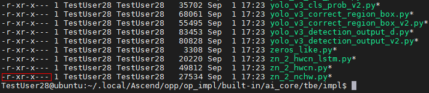
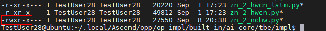
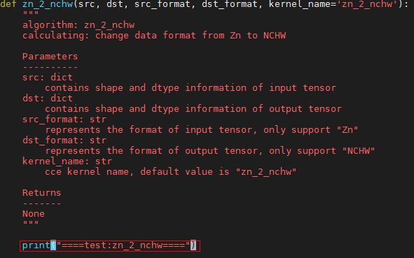
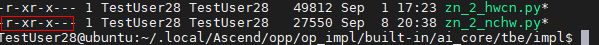
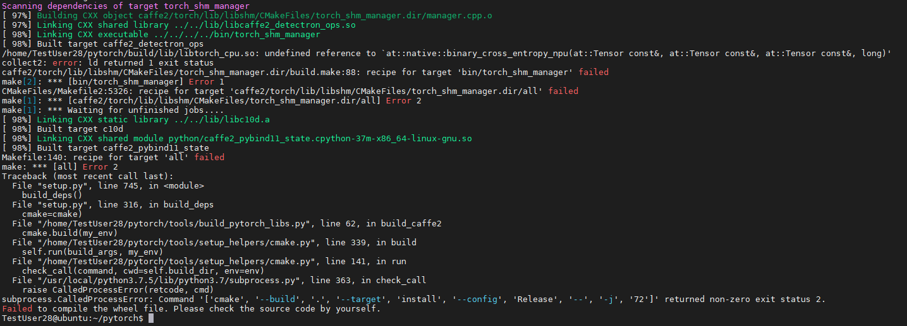
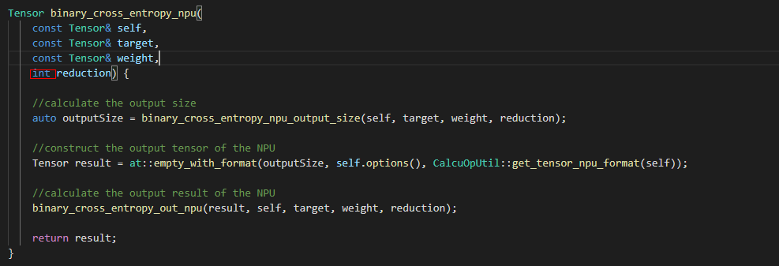
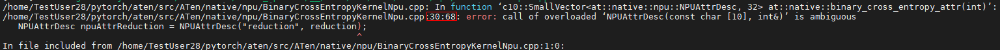
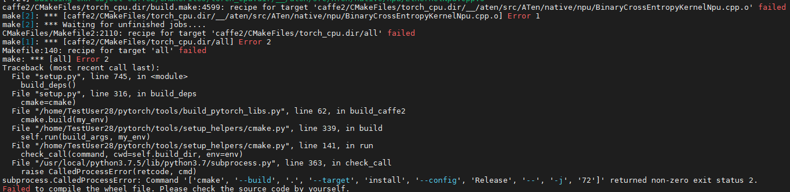

# PyTorch算子开发指南
-   [简介](#简介.md)
-   [算子开发流程](#算子开发流程.md)
-   [算子开发准备](#算子开发准备.md)
    -   [环境准备](#环境准备.md)
    -   [算子速查](#算子速查.md)
-   [算子适配开发](#算子适配开发.md)
    -   [前提条件](#前提条件.md)
    -   [获取PyTorch源码](#获取PyTorch源码.md)
    -   [注册算子开发](#注册算子开发.md)
    -   [算子适配开发](#算子适配开发-0.md)
    -   [编译安装PyTorch框架](#编译安装PyTorch框架.md)
-   [算子功能验证](#算子功能验证.md)
    -   [概述](#概述.md)
    -   [实现过程](#实现过程.md)
-   [FAQ](#FAQ.md)
    -   [Pillow==5.3.0安装失败](#Pillow==5.3.0安装失败.md)
    -   [pip3.7 install torchvision安装失败](#pip3.7 install torchvision安装失败.md)
    -   [安装“torch-\*.whl ”提示“torch 1.5.0xxxx”与“torchvision”所依赖的版本不匹配](#安装torch-\*.whl提示torch 1.5.0xxxx与torchvision所依赖的版本不匹配.md)
    -   [执行算子功能验证用例，结果成功，但会报一个错误“THPModule\_npu\_shutdown failed.”](#执行算子功能验证用例，结果成功，但会报一个错误THPModule\_npu\_shutdown failed.md)
    -   [如何查看测试的运行日志](#如何查看测试的运行日志.md)
    -   [测试运行输出的NPU错误码是什么意思，有无对应的含义解释？](#测试运行输出的NPU错误码是什么意思，有无对应的含义解释？.md)
    -   [为什么我实现的“自定义TBE算子”无法调用到？](#为什么我实现的自定义TBE算子无法调用到？.md)
    -   [如何确定“TBE算子”是否被“PyTorch适配”正确调用？](#如何确定TBE算子是否被PyTorch适配正确调用？.md)
    -   [PyTorch编译失败，提示“error: ld returned 1 exit status”](#PyTorch编译失败，提示error: ld returned 1 exit status.md)
    -   [PyTorch编译失败，提示“error: call of overload ....”](#PyTorch编译失败，提示error: call of overload.md)
-   [附录](#附录.md)
    -   [CMake安装方法](#CMake安装方法.md)
    -   [自定义算子导出方法](#自定义算子导出方法.md)
## 简介<a name="简介.md"></a>

用户通过完成TBE自定义算子适配PyTorch框架，实现PyTorch框架中算子在昇腾AI处理器上运行。

## 算子开发流程<a name="算子开发流程.md"></a>

Pytorch算子开发包含TBE算子开发和PyTorch框架下的算子适配。

1.  TBE算子开发：昇腾AI软件栈中不包含相应的算子，需要先完成TBE算子的开发，再进行PyTorch框架下的算子适配。

    TBE算子开发流程及方法请参见《[CANN TBE自定义算子开发指南](https://support.huawei.com/enterprise/zh/doc/EDOC1100191916)》。

2.  PyTorch框架下的算子适配：昇腾AI软件栈中已实现了相应的TBE算子，可直接进行PyTorch框架适配。

    PyTorch框架下的算子适配流程如下所示。

    **图 1**  PyTorch框架下的算子适配流程<a name="zh-cn_topic_0000001105032530_fig1981905141719"></a>  
    

**表 1**  算子开发步骤详解

| 序号 | 步骤                | 描述                                                         | 参考                             |
| ---- | ------------------- | ------------------------------------------------------------ | -------------------------------- |
| 1    | 环境准备            | 准备算子开发及运行验证所依赖的开发环境与运行环境。           | [算子开发准备](#算子开发准备.md) |
| 2    | 算子速查            | 查看TBE算子支持列表和PyTorch算子适配列表。当前昇腾AI处理器支持的算子列表及支持的算子的详细规格约束；当前PyTorch适配的算子列表。 | [算子开发准备](#算子开发准备.md) |
| 3    | 获取PyTorch源码     | 获取昇腾社区PyTorch源码。                                    | [算子适配开发](#算子适配开发.md) |
| 4    | 注册算子开发        | 将算子分发到昇腾AI处理器。                                   | [算子适配开发](#算子适配开发.md) |
| 5    | 算子适配层开发      | 算子适配层开发，将基于第三方框架的算子属性映射成适配昇腾AI处理器的算子属性。 | [算子适配开发](#算子适配开发.md) |
| 6    | 编译安装PyTorch框架 | 编译适配开发后的Pytorch源码，并安装编译的源码包。            | [算子适配开发](#算子适配开发.md) |
| 7    | 算子验证            | 在真实的硬件环境中验证算子功能。                             | [算子功能验证](#算子功能验证.md) |

## 算子开发准备<a name="算子开发准备.md"></a>

-   **[环境准备](#环境准备.md)**  

-   **[算子速查](#算子速查.md)**  

### 环境准备<a name="环境准备.md"></a>

**前提条件**

-   已完成CANN开发或运行环境的安装，具体操作请参考《[CANN 软件安装指南](https://support.huawei.com/enterprise/zh/ascend-computing/cann-pid-251168373)》。
-   需安装3.12.0以上版本的CMake，安装方法请参考[CMake安装方法](#CMake安装方法.md)。
-   需确保已安装7.3.0以上版本的gcc，7.3.0版本gcc具体安装及使用方式请参见《[CANN 软件安装指南](https://support.huawei.com/enterprise/zh/ascend-computing/cann-pid-251168373)》中的“安装7.3.0版本gcc”章节。
-   需确保环境中已安装git工具，以Ubuntu和CentOS系统为例，命令如下:
    -   Ubuntu系统

        **apt-get install git**

    -   CentOS系统

        **yum install git**


**安装PyTorch依赖环境**

如果使用非root用户安装Python及其依赖，用户需要在每句命令结尾加上**--user**，保证安装的正常进行。命令示例为：**pip3.7 install pyyaml --user**

```
pip3.7 install pyyaml
pip3.7 install wheel
pip3.7 install Pillow==5.3.0
```

> **说明：** 
>若以上过程出错，请参考[FAQ](#FAQ.md)尝试解决问题。

### 算子速查<a name="算子速查.md"></a>

进行算子开发时，您可以查询当前昇腾AI处理器中支持的算子列表和当前PyTorch适配的算子列表。根据查询结果进行算子开发或PyTorch算子适配。

-   当前昇腾AI处理器中支持的算子以及对应的算子约束可以通过以下两种方式查询。
    -   命令行开发方式下，您可以参见《[CANN 算子清单 \(Ascend 910\)](https://support.huawei.com/enterprise/zh/doc/EDOC1100191920)》进行离线查询。
    -   MindStudio开发方式下，您可以通过MindStudio进行在线查询，详细查看方法可参见《[MindStudio 用户指南](https://support.huaweicloud.com/mindstudio301/index.html)》中的“算子&模型速查”章节。
-   当前PyTorch适配的算子列表可以参见《[PyTorch适配算子清单](https://support.huawei.com/enterprise/zh/doc/EDOC1100191773)》

## 算子适配开发<a name="算子适配开发.md"></a>

-   **[前提条件](#前提条件.md)**

-   **[获取PyTorch源码](#获取PyTorch源码.md)**

-   **[注册算子开发](#注册算子开发.md)**

-   **[算子适配开发](#算子适配开发-0.md)**

-   **[编译安装PyTorch框架](#编译安装PyTorch框架.md)**

### 前提条件<a name="前提条件.md"></a>

1.  完成开发及运行环境准备及相关依赖的安装，详情请参见[环境准备](#环境准备.md)。
2.  完成相关的TBE算子开发及部署，详情请参见《[CANN TBE自定义算子开发指南](https://support.huawei.com/enterprise/zh/doc/EDOC1100191916)》。

### 获取PyTorch源码<a name="获取PyTorch源码.md"></a>

从gitee上获取适配昇腾AI处理器的PyTorch源代码，获取地址为：[https://gitee.com/ascend/pytorch](https://gitee.com/ascend/pytorch)  。用户可以通过执行下面git命令行下载源代码。

```
git clone https://gitee.com/ascend/pytorch.git --deepth=1
```

下载成功后，得到pytorch文件目录。

> **说明：** 
>如无权限获取代码，请联系华为技术支持申请加入“Ascend”组织。

### 注册算子开发<a name="注册算子开发.md"></a>

#### 概述

当前制定的NPU适配派发原则是NPU算子的派发不经过框架公共函数，直接派发成NPU适配的函数，即算子执行调用栈中只包含NPU适配的函数调用，不包含框架公共函数。PyTorch框架在编译时，会根据 native\_functions.yaml 的定义，按框架中定义的类型和设备分发原则，生成相应的新算子的中间层的调用说明。对于NPU，会生成在 build/aten/src/ATen/NPUType.cpp。

#### 注册算子开发方法

1.  打开native\_functions.yaml文件。

    native\_functions.yaml 文件中，定义了所有算子函数原型，包括函数名称和参数等信息，每个算子函数支持不同硬件平台的派发信息。该文件所在路径为pytorch/aten/src/ATen/native/native\_functions.yaml。

2.  确定需要派发函数。
    -   yaml 中已存在的算子

        将所有与待适配算子相关的函数进行派发。

    -   yaml中未存在的自定义算子

        由于yaml中没有相关算子的信息，需要手动添加相关函数，包括函数名，参数信息，返回类型信息。

        ```
        - func：适配算子名称(输入参数信息) -> 返回类型
        ```


3.  修改native\_functions.yaml文件，添加实现该算子相关函数的分发描述。

    yaml 文件编写规范：

    -   yaml 中原有的算子函数适配使用 “npu\_dispatch”关键字；

        ```
        npu_dispatch:
          NPU: NPU_Adapt_Fun_Name
        ```

    -   yaml 中新增昇腾AI处理器自定义算子函数适配使用“npu\_dispatch\_only”关键字；

        ```
        npu_dispatch_only:
          NPU: NPU_Adapt_Fun_Name
        ```


    > **说明：** 
    >NPU\_Adapt\_Fun\_Name的格式为 :
    >-   如果原Fun\_Name无"\_"后缀，则格式：Fun\_Name + "\_" + "npu"，如：add --\> add\_npu。
    >-   如果原Fun\_Name有"\_"后缀，则格式：Fun\_Name + "npu\_"，如：add\_ --\> add\_npu\_。
    >该格式供参考，算子适配开发过程中的函数名需与NPU\_Adapt\_Fun\_Name保持一致。


#### 示例

以torch.add\(\)算子为例介绍注册算子开发过程。

1.  打开native\_functions.yaml文件。
2.  确定相关函数

    在yaml中搜索add，找到与add算子相关的函数。

3.  添加分发描述。
    1.  add.Tensor 的函数分发描述。

        ```
        - func: add.Tensor(Tensor self, Tensor other, *, Scalar alpha=1) -> Tensor
          use_c10_dispatcher: full
          variants: function, method
          dispatch:
            CPU: add
            CUDA: add
            SparseCPU: add_sparse
            SparseCUDA: add_sparse
            MkldnnCPU: mkldnn_add
          # 增加分发描述
          npu_dispatch:             
            NPU: add_npu            
          supports_named_tensor: True
        ```

    2.  add.Scalar 的函数分发描述。

        ```
        - func: add.Scalar(Tensor self, Scalar other, Scalar alpha=1) -> Tensor
          use_c10_dispatcher: full
          variants: function, method
          supports_named_tensor: True
          # 增加分发描述
          npu_dispatch:           
            NPU: add_npu          
        ```

    3.  add\_.Tensor 的函数分发描述。

        ```
        - func: add_.Tensor(Tensor(a!) self, Tensor other, *, Scalar alpha=1) -> Tensor(a!)
          variants: method
          dispatch:
            CPU: add_
            CUDA: add_
            SparseCPU: add_sparse_
            SparseCUDA: add_sparse_
            MkldnnCPU: mkldnn_add_
          # 增加分发描述
          npu_dispatch:
            NPU: add_npu_
          supports_named_tensor: True
        ```

    4.  add\_.Scalar 的函数分发描述。

        ```
        - func: add_.Scalar(Tensor(a!) self, Scalar other, Scalar alpha=1) -> Tensor(a!)
          variants: method
          supports_named_tensor: True
          # 增加分发描述
          npu_dispatch:
            NPU: add_npu_
        ```

    5.  add.out 的函数分发描述。

        ```
        - func: add.out(Tensor self, Tensor other, *, Scalar alpha=1, Tensor(a!) out) -> Tensor(a!)
          dispatch:
            CPU: add_out
            CUDA: add_out
            SparseCPU: add_out_sparse_cpu
            SparseCUDA: add_out_sparse_cuda
            MkldnnCPU: mkldnn_add_out
          # 增加分发描述
          npu_dispatch:               
            NPU: add_out_npu         
          supports_named_tensor: True
        ```

### 算子适配开发<a name="算子适配开发-0.md"></a>

#### 简介

用户通过开发算子适配插件，实现PyTorch原生算子的输入参数、输出参数和属性的格式转换，使转换后的格式与TBE算子的输入参数、输出参数和属性的格式相同。适配昇腾AI处理器的PyTorch源代码中提供了适配关联、类型转换和判别、处理动态shape等相关的方法供用户使用。

#### 适配插件实现

1.  创建适配插件文件

    NPU TBE算子适配文件保存在pytorch/aten/src/ATen/native/npu目录下，命名风格采用大驼峰，命名格式：<算子名\> + <KernelNpu\>.cpp，如：AddKernelNpu.cpp。

2.  引入依赖头文件

    适配昇腾AI处理器的PyTorch源代码在ATen/native/npu/utils中提供适配常用的工具供用户使用。

    > **说明：** 
    >工具的功能和使用方法，可查看头文件和源码获得。

3.  定义算子适配主体函数。

    根据注册算子开发中的分发函数确定自定义算子适配主题函数。

4.  分别实现适配主体函数。

    实现算子适配主题函数，根据TBE算子原型构造得到对应的input、output、attr。


#### 示例

以torch.add\(\)算子为例介绍算子适配开发过程。

1.  创建适配插件文件

    在pytorch/aten/src/ATen/native/npu目录下创建AddKernelNpu.cpp适配文件

2.  引入依赖头文件

    ```
    #include <c10/npu/OptionsManager.h>
    #include "ATen/native/npu/utils/CalcuOpUtil.h"
    #include "ATen/native/npu/utils/OpAdapter.h"
    ```

    > **说明：** 
    >" OptionsManager.h"中主要包含类型动态shape相关的函数。
    >" CalcuOpUtil.h "中主要包含类型转换和判别的函数。
    >" OpAdapter.h"文件中主要包含适配关联的头文件。

3.  定义算子适配主体函数。

    ```
    Tensor add_npu(const Tensor& self, const Tensor& other, Scalar alpha) 
    Tensor add_npu(const Tensor& self, Scalar other, Scalar alpha) 
    Tensor& add_npu_(Tensor& self, const Tensor& other, Scalar alpha)
    Tensor& add_npu_(Tensor& self, Scalar other, Scalar alpha)
    Tensor& add_out_npu(Tensor& result, const Tensor& self, const Tensor& other, Scalar alpha) 
    ```

4.  分别实现适配主体函数。
    1.  add\_npu实现

        ```
        // 输入参数为Tensor和Tensor时
        Tensor add_npu(const Tensor& self, const Tensor& other, Scalar alpha) {
          alpha_check_npu(self.scalar_type(), alpha);
          if ((!(self.is_contiguous() && other.is_contiguous())) &&
              (NpuUtils::check_5d_5d_match(self) ||
               NpuUtils::check_5d_5d_match(other)) &&
              check_size(self, other)) {
            int64_t c0_len = 16;
            Tensor self_use = stride_add_tensor_get(self);
            Scalar self_c1_offset(
                self.storage_offset() / (self.size(2) * self.size(3) * c0_len));
            Tensor other_use = stride_add_tensor_get(other);
            Scalar other_c1_offset(
                other.storage_offset() / (other.size(2) * other.size(3) * c0_len));
            Scalar stride_len(self.size(1) / c0_len);
            Tensor result = at::npu_stride_add(
                self_use, other_use, self_c1_offset, other_c1_offset, stride_len);
            return result;
          }
          // calculate the output size
          Tensor outputTensor = add_dest_output(self, other);
          auto outputSize = broadcast_ops_npu_output_size(self, other);
        
          // construct the output tensor of the NPU
          Tensor result = at::empty_with_format(
              outputSize,
              outputTensor.options(),
              CalcuOpUtil::get_tensor_npu_format(outputTensor));
        
          // calculate the output result of the NPU
          add_out_npu_nocheck(result, self, other, alpha);
        
          return result;
        }
        
        // 输入参数为Tensor和Scalar时
        Tensor add_npu(const Tensor& self, Scalar other, Scalar alpha) {
          alpha_check_npu(self.scalar_type(), alpha);
          // calculate the output size
          auto outputSize = input_same_output_size(self);
          // construct the output tensor of the NPU
          Tensor result = at::empty_with_format(
              outputSize, self.options(), CalcuOpUtil::get_tensor_npu_format(self));
        
          // calculate the output result of the NPU
          adds_out_npu_nocheck(result, self, other, alpha);
        
          return result;
        }
        
        ```

    2.  add\_npu\_实现（就地操作场景，返回值为self）

        ```
        // 输入参数为Tensor和Tensor时
        Tensor& add_npu_(Tensor& self, const Tensor& other, Scalar alpha) {
          SmallVector<Tensor, N> inputs = {self, other};
          SmallVector<Tensor, N> outputs = {self};
          CalcuOpUtil::check_memory_over_laps(inputs, outputs);
        
          if (!NpuUtils::check_match(&self)) {
            Tensor contiguousSelf = NpuUtils::format_contiguous(self);
            Tensor result = add_out_npu_nocheck(contiguousSelf, contiguousSelf, other, alpha);
            NpuUtils::format_fresh_view(self, result);
          } else {
            add_out_npu_nocheck(self, self, other, alpha);
          }
        
          return self;
        }
        
        // 输入参数为Tensor和Scalar时
        Tensor& add_npu_(Tensor& self, Scalar other, Scalar alpha) {
          if (!NpuUtils::check_match(&self)) {
            Tensor contiguousSelf = NpuUtils::format_contiguous(self);
            Tensor result = adds_out_npu_nocheck(contiguousSelf, contiguousSelf, other, alpha);
            NpuUtils::format_fresh_view(self, result);
          } else {
            adds_out_npu_nocheck(self, self, other, alpha);
          }
        
          return self;
        }
        
        ```

    3.  add\_out\_npu实现（输入参数result为返回值场景）

        ```
        Tensor& add_out_npu(
            Tensor& result,
            const Tensor& self,
            const Tensor& other,
            Scalar alpha) {
          bool isSelfWrapped = CalcuOpUtil::is_scalar_wrapped_to_tensor(self);
        
          Tensor outputTensor;
          if (not isSelfWrapped) {
            outputTensor = self;
          } else {
            outputTensor = other;
          }
          auto outputSize = broadcast_ops_npu_output_size(self, other);
          OpPreparation::CheckOut(
              {self},
              result,
              CalcuOpUtil::get_tensor_npu_format(result),
              outputTensor.scalar_type(),
              outputSize);
        
          OpPipeWithDefinedOut pipe;
          return pipe.CheckMemory({self, other}, {result})
           .Func([&self, &other, &alpha](Tensor& result){add_out_npu_nocheck(result, self, other, alpha);})
           .Call(result);
        }
        ```


> **说明：** 
>AddKernelNpu.cpp的详细实现代码请参见pytorch/aten/src/ATen/native/npu/AddKernelNpu.cpp文档。

### 编译安装PyTorch框架<a name="编译安装PyTorch框架.md"></a>

#### 编译PyTorch框架

1.  进入PyTorch工作目录 ：“pytorch“。
2.  给脚本文件赋权限：

    **chmod +x build.sh**

3.  执行如下命令进行编译：

    **./build.sh**

4.  编译成功后，会在“**pytorch/dist**” 下会生成 torch-\*.whl 包，例如：torch-1.5.0a0-cp37-cp37m-linux\_x86.whl

> **说明：** 
>首次编译持续的时间较长，可能超过30分钟，建议：若无必要，无需执行"make clean"。

#### 安装PyTorch框架

1.  将[编译安装PyTorch框架](#编译安装PyTorch框架.md)生成的torch-\*.whl包上传到服务器任一路径。
2.  进入torch-\*.whl 所在的目录，使用pip命令完成torch安装。

    当前登录用户为root用户时，执行：

    ```
    pip3.7.5 install torch-*.whl
    ```

    当前登录用户为非root用户时，执行：

    ```
    pip3.7.5 install torch-*.whl --user
    ```


> **说明：** 
>1.  修改代码之后，需要重新执行“编译”和“安装”PyTorch过程。
>2.  安装过程中，可能会出现错误提示"torchvision 0.6.0" 版本不匹配，此问题无影响，忽略即可。

## 算子功能验证<a name="算子功能验证.md"></a>

-   **[概述](#概述.md)**  

-   **[实现过程](#实现过程.md)**  

### 概述<a name="概述.md"></a>

#### 简介

完成算子适配开发后，可通过运行适配昇腾处理器的PyTorch算子，验证算子运行结果是否正确。

算子功能验证会覆盖算子开发的所有交付件，包含实现文件，算子原型定义、算子信息库以及算子适配插件。本节仅对验证的方法做介绍。

#### 测试用例及测试工具

进行自定义算子功能验证，通过PyTorch前端构造自定义算子的函数并运行验证。

在https://gitee.com/ascend/pytorch中 "pytorch/test/test\_npu/test\_network\_ops"目录下提供了测试用例及测试工具，供用户参考。

### 实现过程<a name="实现过程.md"></a>

#### 简介

本章通过具体例子，完成PyTorch算子的功能测试步骤。

#### 操作步骤

1.  设置环境变量。

    ```
    export install_path=/home/HwHiAiUser/Ascend/ascend-toolkit/latest
    export PATH={install_path}/fwkacllib/ccec_compiler/bin:{install_path}/fwkacllib/bin:{install_path}/toolkit/bin:$PATH
    export LD_LIBRARY_PATH={install_path}/fwkacllib/lib64:$LD_LIBRARY_PATH
    export PYTHONPATH={install_path}/fwkacllib/python/site-packages:{install_path}/toolkit/python/site-packages:$PYTHONPATH
    export ASCEND_OPP_PATH={install_path}/opp/
    export ASCEND_AICPU_PATH={install_path}/x86_64-linux/ 
    ```

    install\_path请修改为Toolkit的实际安装路径。

2.  编写测试脚本。以add算子为例，在“pytorch/test/test\_npu/test\_network\_ops“路径下编写测试脚本文件： testcase\_add.py。

    以下示例仅为一个简单的用例实现供用户参考，具体测试用例的实现，需要根据算子定义进行完整的覆盖才能保证功能的基本正确。

    ```
    # 引入依赖库
    import sys
    sys.path.append('..')
    import torch
    import numpy as np
    from common_utils import TestCase, run_tests
    from common_device_type import dtypes, instantiate_device_type_tests
    from util_test import create_common_tensor
    
    # 定义add测试用例类
    class TestAdd(TestCase):
    
        # 定义CPU和NPU add执行的函数
        def cpu_op_exec(self, input1, input2):
            output = torch.add(input1, input2, alpha = 1)
            output = output.numpy()
            return output
        def npu_op_exec_new(self, input1, input2):
            output = torch.add(input1, input2, alpha = 1)
            output = output.to("cpu")
            output = output.numpy()
            return output
    
        # 定义add对应场景通用函数，该函数中负责场景对应输入数据和对比CPU和NPU返回结果
        def add_result(self, shape_format):
            for item in shape_format:
                cpu_input1, npu_input1 = create_common_tensor(item, 0, 100)
                cpu_input2, npu_input2 = create_common_tensor(item, 0, 100)
                if cpu_input1.dtype == torch.float16:
                    cpu_input1 = cpu_input1.to(torch.float32)
                    cpu_input2 = cpu_input2.to(torch.float32)                
                cpu_output = self.cpu_op_exec(cpu_input1, cpu_input2)
                npu_output = self.npu_op_exec_new(npu_input1, npu_input2)
                cpu_output = cpu_output.astype(npu_output.dtype)            
                self.assertRtolEqual(cpu_output, npu_output)
    
        # 定义具体add场景的测试用例，用例函数需要以test_开头
        def test_add_shape_format_fp32_2d(self, device):
            format_list = [0, 3, 29]
            shape_format = [
                [np.float32, i, [5, 256]]  for i in format_list 
            ]        
            self.add_result(shape_format)
    
    instantiate_device_type_tests(TestAdd, globals(), except_for="cpu")
    if __name__ == "__main__":
        torch.npu.set_device("npu:0")
        run_tests()
    
    
    ```

3.  执行测试用例脚本

    进入add\_testcase.py所在的目录，执行：

    ```
    python3.7.5 testcase_add.py
    ```

## FAQ<a name="FAQ.md"></a>

-   **[Pillow==5.3.0安装失败](#Pillow==5.3.0安装失败.md)**  

-   **[pip3.7 install torchvision安装失败](#pip3.7 install torchvision安装失败.md)**  

-   **[安装“torch-\*.whl ”提示“torch 1.5.0xxxx”与“torchvision”所依赖的版本不匹配](#安装torch-\*.whl提示torch 1.5.0xxxx与torchvision所依赖的版本不匹配.md)**  

-   **[执行算子功能验证用例，结果成功，但会报一个错误“THPModule\_npu\_shutdown failed.”](#执行算子功能验证用例，结果成功，但会报一个错误THPModule\_npu\_shutdown failed.md)**  

-   **[如何查看测试的运行日志](#如何查看测试的运行日志.md)**  

-   **[测试运行输出的NPU错误码是什么意思，有无对应的含义解释？](#测试运行输出的NPU错误码是什么意思，有无对应的含义解释？.md)**  

-   **[为什么我实现的“自定义TBE算子”无法调用到？](#为什么我实现的自定义TBE算子无法调用到？.md)**  

-   **[如何确定“TBE算子”是否被“PyTorch适配”正确调用？](#如何确定TBE算子是否被PyTorch适配正确调用？.md)**  

-   **[PyTorch编译失败，提示“error: ld returned 1 exit status”](#PyTorch编译失败，提示error: ld returned 1 exit status.md)**  

-   **[PyTorch编译失败，提示“error: call of overload ....”](#PyTorch编译失败，提示error: call of overload.md)**  

### Pillow==5.3.0安装失败<a name="Pillow==5.3.0安装失败.md"></a>

**现象描述**

pillow==5.3.0安装失败。

**可能原因**

缺少必要的依赖，如：libjpeg、python-devel、 zlib-devel 、libjpeg-turbo-devel等等。

**处理方法**

apt-get install libjpeg python-devel  zlib-devel  libjpeg-turbo-devel。

### pip3.7 install torchvision安装失败<a name="pip3.7 install torchvision安装失败.md"></a>

**现象描述**

pip3.7 install torchvision安装失败。

**可能原因**

torch与torchvision版本不匹配。

**处理方法**

pip3.7 install torchvision --no-deps

### 安装“torch-\*.whl ”提示“torch 1.5.0xxxx”与“torchvision”所依赖的版本不匹配<a name="安装torch-\*.whl提示torch 1.5.0xxxx与torchvision所依赖的版本不匹配.md"></a>

**现象描述**

安装“torch-\*.whl”时，提示"ERROR：torchvision 0.6.0 has requirement torch==1.5.0, but you'll have torch 1.5.0a0+1977093 which is incompatible"。


但实际安装成功。

**可能原因**

安装torch时，会自动触发torchvision进行依赖版本检查，环境中安装的torchvision版本为0.6.0，检查时发现我们安装的torch-\*.whl的版本号与要求的1.5.0不一致，所以提示了一条错误 。

**处理方法**

对实际结果无影响，无需处理。

### 执行算子功能验证用例，结果成功，但会报一个错误“THPModule\_npu\_shutdown failed.”<a name="执行算子功能验证用例，结果成功，但会报一个错误THPModule\_npu\_shutdown failed.md"></a>

**现象描述**

执行算子功能验证用例，结果成功，但会报一个错误“THPModule\_npu\_shutdown failed.”。


**可能原因**

可能是框架影响，待进一步定位 。

**处理方法**

对实际结果无影响，无需处理，忽略此问题。

### 如何查看测试的运行日志<a name="如何查看测试的运行日志.md"></a>

测试运行过程提示错误，但直接可参考的信息太少，如何才能看到更详细的运行日志？

方式一：直接查看运行日志

1.  进入 "/var/log/npu"目录

    在此目录下，对于算子功能测试运行，主要的涉及日志路径为“oplog”和“slog”，建议优先查看“oplog”中的日志，这里记录了算子运行过程中的关键信息；slog下的日志记录系统的运行过程及异常信息，具体日志信息内容，参考[日志文件](https://support.huaweicloud.com/lr-A800_9000_9010/atlaslog_24_0003.html)描述。

2.  进入对应的日志目录，使用vi等工具打开最新的日志文件，进行日志查看。

    > **说明：** 
    >以“/var/log/npu/oplog”为例，"vi oplog.log"，可以查看到很多日志信息。但由于可能存在很多开发者同时操作设备进行测试，所有会包含其他开发者的运行日志信息，需要开发者通过“时间”等信息，识别出相关的日志。建议使用“方式二”


方式二：设置日志输出到屏幕，重定向到指定文本文件

1.  设置环境变量，将当前用户的日志到屏幕。

    ```
    export SLOG_PRINT_TO_STDOUT=1
    ```

    设置完成后，直接运行测试用例，就可以将相关的日志输出到屏幕，为了方便查看和回溯，建议根据需要使用[2](#zh-cn_topic_0000001125315889_li168732325719)运行。

2.  运行测试用例时，将日志重定向到指定文件。

    ```
    python3.7.5 add_testcase.py > test_log.txt
    ```

### 测试运行输出的NPU错误码是什么意思，有无对应的含义解释？<a name="测试运行输出的NPU错误码是什么意思，有无对应的含义解释？.md"></a>

参考“[错误码定义](https://support.huaweicloud.com/adevg-A300_3000_3010/atlasdevelopment_01_0256.html)”。

### 为什么我实现的“自定义TBE算子”无法调用到？<a name="为什么我实现的自定义TBE算子无法调用到？.md"></a>

**现象描述**

完成“自定义TBE算子”开发，和“PyTorch”适配开发，但执行测试用例，发现无法调用到新开发的算子。

**可能原因**

1.  环境变量没有正确设置；
2.  yaml存在错误，导致没有正确分发；
3.  自定义TBE算子实现存在问题，导致无法调用到。

**处理方法**

1.  参考“[算子功能验证](#算子功能验证.md)”章节，完成运行环境设置，特别注意：

    ```
    export ASCEND_OPP_PATH=~/.local/Ascend/opp
    export CUSTOM_OP_LIB_PATH=~/.local/Ascend/opp/framework/custom/tensorflow
    ```

2.  检查yaml文件中对应算子的分发配置，是否正确的完整分发；
3.  分析排查代码实现，建议手段：
    1.  修改"pytorch"中的算子适配实现，让"add\_testcase.py"可以调用到“自定义算子包”中的TBE算子；

        "pytorch/aten/src/ATen/native/npu/AddKernelNpu.cpp"

        

    2.  修改"cann"中的"add"算子实现\(建议此时不要包含新开发的“自定义TBE算子”，方便对比\)，在算子入口增加日志打印，作为运行标识；

        "cann/ops/contrib/ops/custom/tbe/impl/add.py"

    3.  完成上两步的编译、安装，调用"python3.7.5 add\_testcase.py"进行测试；

        ```
        cd 至"add_testcase.py" 所在路径，调用
         add_testcase.py
        进行测试
        ```

        至此步骤，不应该有错误，屏幕应该输出 "add" 中增加的日志打印。若出错，请完成代码清理排查，保证无新开发的代码影响测试。

    4.  将新开发的“自定义TBE算子”合并到"cann"中，在对应的在算子入口增加日志打印，作为运行标识；
    5.  完成上面的"cann"编译、安装，调用"python3.7.5 add\_testcase.py"进行测试；

        > **说明：** 
        >1、背景知识：根据Ascend的设计逻辑，用户开发安装的“custom”算子包优先级高于“built-in”的内置算子包，在运行加载时，会优先加载调度“custom”包中的算子。过程中，若解析“custom”中的算子信息文件失败，则会跳过“custom”算子包，不加载调度任何“custom”算子包中的任何算子。
        >2、若此步骤出错，或屏幕未输出 "add" 中增加的日志打印，则说明新开发的“自定义TBE算子”有错误，影响了“自定义算子包”的加载，建议**优先排查新开发的“自定义TBE算子”中的“算子信息定义”是否正确**。
        >3、若此步骤正确，至少说明  **新开发的“自定义TBE算子”中的“算子信息定义”不影响运行**。

    6.  调用"python3.7.5 xxx\_testcase.py"进行测试；

        > **说明：** 
        >1、若屏幕正常输出新开发的“自定义TBE算子”中增加的日志打印，则至少说明调度到了新开发的算子。
        >2、若屏幕未输出新开发的“自定义TBE算子”中增加的日志打印，则问题可能出现在"PyTorch适配"中，需要排查这一部分的实现代码，较多的可能会出现在“XxxxKernelNpu.cpp”中的输入、输出未能正确适配。


### 如何确定“TBE算子”是否被“PyTorch适配”正确调用？<a name="如何确定TBE算子是否被PyTorch适配正确调用？.md"></a>

不管是“custom”算子，还是“built-in”算子，在安装后，都是以\*.py源码的方式存放在安装目录下，所以我们可以通过编辑源码，在API入口增加日志的方式，打印输出入参，确定输入的参数是否正确。

> **注意：** 
>该操作存在风险，建议在操作前备份计划修改的文件。若未备份，损坏后无法恢复，请及时联系支持人员。

下面以"built-in"算子中的"zn\_2\_nchw"算子为例：

1.  打开安装在用户目录下的算子包安装目录

    ```
    cd ~/.local/Ascend/opp/op_impl/built-in/ai_core/tbe/impl
    ll
    ```

    可以看到相应的算子\*.py源码文件均为“只读”，即此时不可编辑。

    

2.  修改算子\*.py源码文件属性，增加“可写”权限。

    ```
    sudo chmod +w zn_2_nchw.py
    ll
    ```

    

3.  打开算子\*.py源码文件，增加日志，保存退出。

    ```
    vi zn_2_nchw.py
    ```

    

    上面例子只加了个标识，实际调测时，可以增加打印输入参数信息。

4.  调用脚本执行测试用例，通过打印日志分析“输入参数信息”。
5.  完成测试分析后，重新打开算子\*.py源码文件，删除增加的日志，保存退出。
6.  修改算子\*.py源码文件属性，删除“可写”权限。

    ```
    sudo chmod -w zn_2_nchw.py
    ```

    

### PyTorch编译失败，提示“error: ld returned 1 exit status”<a name="PyTorch编译失败，提示error: ld returned 1 exit status.md"></a>

**现象描述**

PyTorch编译失败，提示“ error: ld returned 1 exit status”。



**可能原因**

通过日志分析，大概原因为XxxxKernelNpu.cpp中实现的适配函数，与PyTorch框架算子要求的分发实现接口参数不匹配。在上面的例子中，是“binary\_cross\_entropy\_npu”，打开对应的XxxxKernelNpu.cpp文件，找到相应的适配函数。



可以看出实现中，最后一个参数是"int" ，与要求的“long”不匹配。

**处理方法**

修改XxxxKernelNpu.cpp中实现的适配函数，在上面的例子中，修改“binary\_cross\_entropy\_npu”方法最后一个参数类型为“int64\_t”\(cpp中“long”的类型使用"int64\_t"\)。

### PyTorch编译失败，提示“error: call of overload ....”<a name="PyTorch编译失败，提示error: call of overload.md"></a>

**现象描述**

PyTorch编译失败，提示“error: call of overload ....”





**可能原因**

通过日志分析，错误出在XxxxKernelNpu.cpp中30行位置，NPUAttrDesc的参数不合法。在上面的例子中，是“binary\_cross\_entropy\_attr”，打开对应的XxxxKernelNpu.cpp文件，找到相应的适配函数。


可以看出实现中，NPUAttrDesc的入参，第二个参数是"int" ，与NPUAttrDesc定义不匹配。

**处理方法**

1. 将binary\_cross\_entropy\_attr\(\)中错误的行代码替换为上面的注释中的代码。

2. binary\_cross\_entropy\_attr\(\)入参类型修改为 int64\_t。


## 附录<a name="附录.md"></a>

-   **[CMake安装方法](#CMake安装方法.md)**

-   **[自定义算子导出方法](#自定义算子导出方法.md)**

### CMake安装方法<a name="CMake安装方法.md"></a>

CMake版本升级为3.12.1的方法

1.  获取Cmake软件包。

    ```
    wget https://cmake.org/files/v3.12/cmake-3.12.1.tar.gz --no-check-certificate
    ```

2.  解压并进入软件包目录。

    ```
    tar -xf cmake-3.12.1.tar.gz
    cd cmake-3.12.1/
    ```

3.  执行配置、编译和安装命令。

    ```
    ./configure --prefix=/usr/local/cmake
    make && make install
    ```

4.  设置软连接。

    ```
    ln -s /usr/local/cmake/bin/cmake /usr/bin/cmake
    ```

5.  执行如下命令验证是否安装成功。

    ```
    cmake --version
    ```

    如显示“cmake version 3.12.1”则表示安装成功。

### 自定义算子导出方法<a name="自定义算子导出方法.md"></a>

#### 简介

PyTorch训练模型中包含自定义算子，将自定义算子导出成onnx单算子模型，方便转移到其他AI框架中使用。自定义算子导出有三种形式，适配NPU的TBE算子导出、C++算子导出、纯Python算子导出。

#### 前提条件

安装PyTorch框架。

#### TBE算子导出

TBE算子导出有两种方式。

第一种方式。

1.  定义和注册算子

    ```
    # 定义算子
    @parse_args('v', 'v', 'f', 'i', 'i', 'i', 'i')
    def symbolic_npu_roi_align(g, input, rois, spatial_scale, pooled_height, pooled_width, sample_num, roi_end_mode):
        args = [input, rois]
        kwargs = {"spatial_scale_f": spatial_scale,
                "pooled_height_i": pooled_height,
                "pooled_width_i": pooled_width,
                "sample_num_i": sample_num,
                "roi_end_mode_i": roi_end_mode}
    
        return g.op('torch::npu_roi_align',*args, **kwargs)
    
    # 注册算子
    import torch.onnx.symbolic_registry as sym_registry
    def register_onnx_sym_npu_roi_align():
          sym_registry.register_op('npu_roi_align', symbolic_npu_roi_align, '', 11)   
              
    register_onnx_sym_npu_roi_align()
    ```

2.  自定义模型

    ```
    # 定义模型
    class CustomModel_npu_op(torch.nn.Module):
        def __init__(self,a,b):
            super(CustomModel_npu_op, self).__init__()
    
            self.weight = Parameter(torch.Tensor(8,10,1024))    
            init.kaiming_uniform_(self.weight, a=math.sqrt(5))
    
        def forward(self, a, b, d):  
            spatial_scale=d[0].item()
            pooled_height=d[1].item()
            pooled_width=d[2].item()
            sample_num=d[3].item()
            roi_end_mode=d[4].item()
            rtn = torch.npu_roi_align(a, self.weight, spatial_scale, pooled_height, pooled_width, sample_num,roi_end_mode)
    
            return rtn
    ```

3.  导出onnx

    ```
    # 定义导出函数
    def do_export(model, inputs, f, *args, **kwargs):
        out = torch.onnx._export(model, inputs, f, verbose=True, export_params=True, do_constant_folding=True,*args, **kwargs)
    
    # 初始化输入
    """
    实现模型输入参数a,b,h1初始化，此处忽略，请参考详细代码。
    """
    
    # 导出onnx
    model = CustomModel_npu_op(a,b)
    model = model.npu()
    model.eval()
    do_export(model, (a, b, h1), f, input_names=["intput"]+["","","","","","","npu_roi_align.weight"],opset_version=11)
    ```


第二种方式。

1.  定义方法类

    ```
    # 实现算子方法类及符号导出实现的方法
    class CustomClassOp_Func_npu_roi_align(Function):
        @staticmethod
        def forward(ctx, input, rois, spatial_scale, pooled_height, pooled_width , sample_num, roi_end_mode):
            rtn = torch.npu_roi_align(input, rois, spatial_scale, pooled_height, pooled_width, sample_num, roi_end_mode)
            return rtn
    
        @staticmethod
        def symbolic(g, input, rois, spatial_scale, pooled_height, pooled_width , sample_num, roi_end_mode):
            args = [input, rois]
            kwargs = {"spatial_scale_f": spatial_scale,
                        "pooled_height_i": pooled_height,
                        "pooled_width_i": pooled_width,
                        "sample_num_i": sample_num,
                        "roi_end_mode_i": roi_end_mode}
            return g.op('torch::npu_roi_align',*args, **kwargs)
    ```

2.  自定义算子模型

    ```
    # 实现算子模型
    class NpuOp_npu_roi_align_Module(torch.nn.Module):
        def __init__(self):
            super(NpuOp_npu_roi_align_Module, self).__init__()
    
            self.spatial_scale = torch.randn(10, dtype=torch.float32, requires_grad=False,device="cpu")[0].item()
            self.pooled_height = 2
            self.pooled_width = 0
            self.sample_num = 1
            self.roi_end_mode = 1
    
            self.weight = Parameter(torch.Tensor(8,10,1024))
            init.kaiming_uniform_(self.weight, a=math.sqrt(5))
    
            self.func = CustomClassOp_Func_npu_roi_align.apply
            self.test_npu_op=1
    
        def forward(self, input):
            rtn = self.func(input, self.weight, self.spatial_scale, self.pooled_height, self.pooled_width, self.sample_num, self.roi_end_mode)
            return rtn
    ```

3.  自定义模型

    ```
    # 创建自定义模型
    class CustomModel_Module_op(torch.nn.Module):
        def __init__(self,a,b):
            super(CustomModel_Module_op, self).__init__()
            self.npu_roi_align = NpuOp_npu_roi_align_Module()
        #@staticmethod
        def forward(self, a):
            rtn = self.npu_roi_align(a) 
            return rtn
    ```

4.  导出onnx

    ```
    # 构建数据
    a = torch.randn(5, 10, 1024, dtype=torch.float32, requires_grad=True,device=rnddata_device)
    b = torch.randn(10, 10, 1024, dtype=torch.float32, requires_grad=True,device=rnddata_device)
    
    # 模型实例化
    model = CustomModel_Module_op(a,b)
    model = model.npu()
    model.eval()
    a = a.to('npu:6')
    b = b.to('npu:6')
    
    # 导出onnx
    do_export(model, a, f=ONNX_NPU_OP_MODULE_FILENAME, input_names=["intput"]+["npu_roi_align.weight"],opset_version=11)
    ```


> **说明：** 
>详细实现代码请参见[test\_custom\_ops\_npu\_demo.py](https://gitee.com/ascend/pytorch/blob/master/test/test_npu/test_onnx/torch.onnx/custom_ops_demo/test_custom_ops_npu_demo.py)，如无权限获取代码，请联系华为技术支持申请加入“Ascend”组织。

#### C++算子导出

1.  自定义算子

    ```
    import torch
    import torch.utils.cpp_extension
    # 定义C++实现的算子
    def test_custom_add():    
        op_source = """    
        #include <torch/script.h>    
    
        torch::Tensor custom_add(torch::Tensor self, torch::Tensor other) {
            return self + other;    
        }
        static auto registry = 
            torch::RegisterOperators("custom_namespace::custom_add",&custom_add);
        """
        torch.utils.cpp_extension.load_inline(
            name="custom_add",
            cpp_sources=op_source,
            is_python_module=False,
            verbose=True,
        )
    
    test_custom_add()
    ```

2.  注册自定义算子

    ```
    # 定义算子注册方法并注册算子
    from torch.onnx import register_custom_op_symbolic
    
    def symbolic_custom_add(g, self, other):
        return g.op('custom_namespace::custom_add', self, other)
    
    register_custom_op_symbolic('custom_namespace::custom_add', symbolic_custom_add, 9)
    ```

3.  建立模型

    ```
    # 建立算子模型
    class CustomAddModel(torch.nn.Module):
        def forward(self, a, b):
            return torch.ops.custom_namespace.custom_add(a, b)
    ```

4.  导出算子onnx模型

    ```
    # 将算子导出onnx模型
    def do_export(model, inputs, *args, **kwargs):
        out = torch.onnx._export(model, inputs, "custom_demo.onnx", *args, **kwargs)
    
    x = torch.randn(2, 3, 4, requires_grad=False)
    y = torch.randn(2, 3, 4, requires_grad=False)
    model = CustomAddModel()
    do_export(model, (x, y), opset_version=11)
    ```


> **说明：** 
>详细实现代码请参见[test\_custom\_ops\_demo.py](https://gitee.com/ascend/pytorch/blob/master/test/test_npu/test_onnx/torch.onnx/custom_ops_demo/test_custom_ops_demo.py)，如无权限获取代码，请联系华为技术支持申请加入“Ascend”组织。

#### 纯Python算子导出

1.  自定义算子

    ```
    import torch
    import torch.onnx.symbolic_registry as sym_registry
    
    import torch.utils.cpp_extension
    import torch.nn as nn
    import torch.nn.modules as Module
    from torch.autograd import Function
    import numpy as np
    
    from torch.nn.parameter import Parameter
    import math
    from torch.nn  import init
    
    # 定义算子类方法
    class CustomClassOp_Add_F(Function):
        @staticmethod
        def forward(ctx, input1,input2):
            rtn = torch.add(input1,input2)
            return torch.add(input1,rtn)
    
        @staticmethod
        def symbolic(g,input1,input2):
            rtn = g.op("Custom::CustomClassOp_Add", input1, input2,test_attr1_i=1,test_attr2_f=1.0)
            rtn = g.op("ATen::CustomClassOp_Add", input1, rtn)
            rtn = g.op("C10::CustomClassOp_Add", rtn, input2)
            #erro doman: rtn = g.op("onnx::CustomClassOp_Add", input1, input2)
    
            return rtn
    ```

2.  建立模型

    ```
    # 注册算子并建立模型
    class CustomClassOp_Add(torch.nn.Module):
        def __init__(self):
            super(CustomClassOp_Add, self).__init__()
            self.add = CustomClassOp_Add_F.apply
    
            #graph(%0 : Float(1, 8, 10, 1024),
            #      %1 : Float(8, 10, 1024))
            self.weight = Parameter(torch.Tensor(8,10,1024))
    
            #%1 : Float(8, 10, 1024) = onnx::Constant[value=<Tensor>]()
            self.weight1 = torch.Tensor(8,10,1024)
    
            init.kaiming_uniform_(self.weight, a=math.sqrt(5))
            init.kaiming_uniform_(self.weight1, a=math.sqrt(5))
        def forward(self, input):
            rtn = torch.add(self.weight1, self.weight)
    
            rtn = self.add(self.weight, rtn)
            rtn1 = self.add(self.weight, self.weight1)
            rtn1 = self.add(self.weight1,rtn1) 
            rtn = self.add(rtn,rtn1)
    
            return rtn
    ```

3.  导出算子onnx模型

    ```
    ONNX_FILE_NAME = "./custom_python_module_demo.onnx"
    def do_export(model, inputs, *args, **kwargs):
        out = torch.onnx._export(model, inputs, ONNX_FILE_NAME, verbose=True,keep_initializers_as_inputs=True, *args, **kwargs)
    
    def test_class_export():
        model = CustomModel()
        model.eval()
        input_x_shape = [1, 8, 10, 1024]
        input = torch.randn(input_x_shape)
        output = model(input)
        do_export(model, input, opset_version=11)
    
    # 将算子导出到onnx模型
    test_class_export()
    ```


> **说明：** 
>详细实现代码请参见[test\_custom\_ops\_python\_module.py](https://gitee.com/ascend/pytorch/blob/master/test/test_npu/test_onnx/torch.onnx/custom_ops_demo/test_custom_ops_python_module.py)，如无权限获取代码，请联系华为技术支持申请加入“Ascend”组织。

