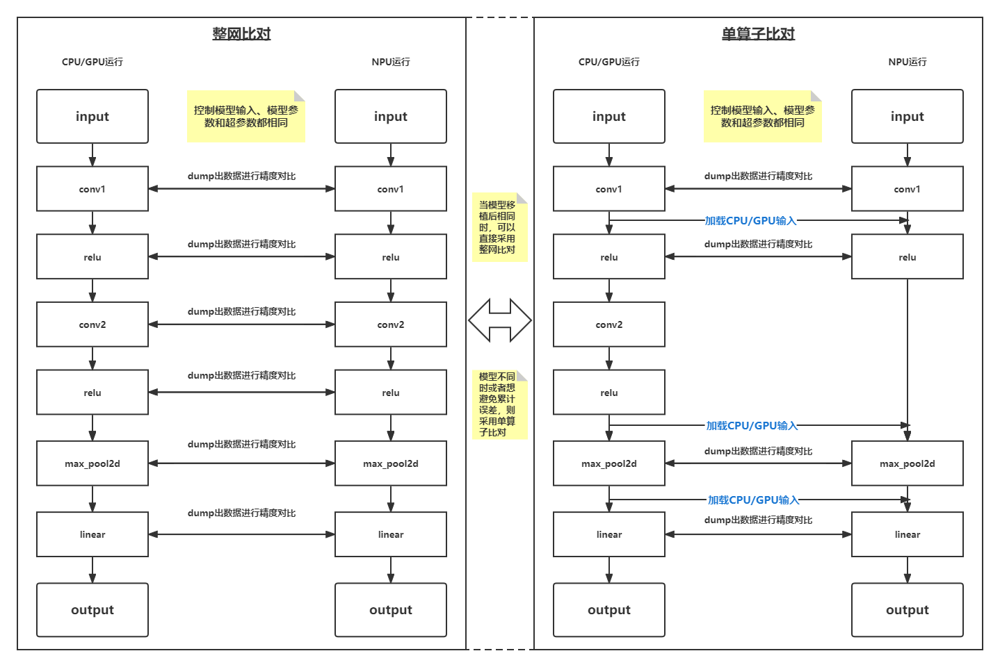
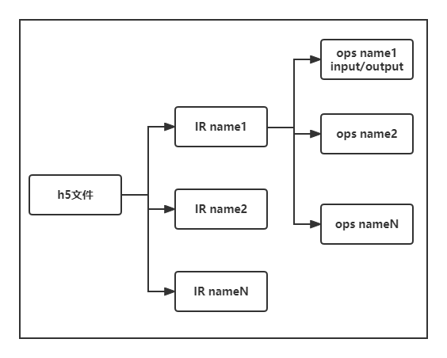

# **框架侧精度对比工具开发背景**

- [**框架侧精度对比工具开发背景**](#框架侧精度对比工具开发背景)
  - [**计算精度对比需求**](#计算精度对比需求)
  - [**已有的精度对比脚本工具**](#已有的精度对比脚本工具)
  - [**框架侧精度对比工具优势**](#框架侧精度对比工具优势)

## **计算精度对比需求**

华为对自有训练模型算子进行了优化，其中包括算子消除、算子融合、算子拆分等，以更好的适配NPU等训练设备。
因此在模型迁移的过程中，有时会遇到自有实现的算子运算的结果与业界标准算子运算结果存在偏差，精度不达标的问题，需要借助计算精度比对工具得出模型中的哪些算子在GPU和NPU的计算中会存在较大的差异，从而重点分析这些算子的表现性能，帮助开发人员快速定位并解决算子精度问题。

此外在进行模型版本迭代、底层算子迭代、计算设备(npu)迭代时也可能会引入计算精度的问题，有时会遇到新实现的算子运算的结果与要被替代的算子运算结果存在偏差等，需要借助计算精度对比工具得出那些算子在不同的版本或在不同的设备上存在较大的计算差异，从而快速定位计算精度问题。
## **已有的精度对比脚本工具**

目前已经有一些可以进行精度比对的脚本示例，其主要思路都是相同的，包括整网对比和单算子对比，如图所示。

其中dump出的数据常见为h5文件格式，其内部结构为树形层次结构

更多的H5文件使用方式，可以参考以下文档：https://www.hdfgroup.org/solutions/hdf5/

同时配套存在一些dump数据生成H5文件，并存在处理H5文件的相关脚本，进行算子的匹配和精度比对的计算。

## **框架侧精度对比工具优势**

相比于现有的精度比对脚本，在框架侧开发的精度比对工具有以下几点优势：

1. 使用环境配置简单，且不会出现兼容性等问题，仅需要完成PyTorch Adapter插件的编译安装即可。

2. 集成度更高，开发人员或使用人员不用关心精度比对工具的底层实现。

3. 工具的可维护性更强，相比于民间流传的工具脚本，在框架侧的功能维护与功能特性的更新迭代更有保障。

4. 可以支持更丰富的使用方式，例如在原先的脚本的精度对比是不支持function类的算子，在框架测进行开发则可以支持；且未来框架侧有望实现精度实时比对，避免了dump大量的同质化数据。
