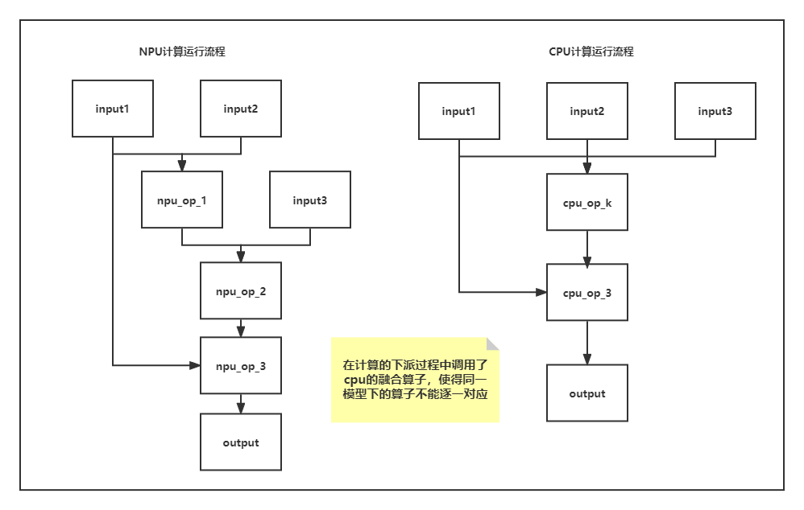

# **PyTorch精度对比工具使用指南**
- [**PyTorch精度对比工具使用指南**](#pytorch精度对比工具使用指南)
  - [**使用场景**](#使用场景)
  - [**前提条件**](#前提条件)
  - [**精度比对基本原理**](#精度比对基本原理)
    - [**算子匹配条件**](#算子匹配条件)
    - [**计算精度评价指标**](#计算精度评价指标)
  - [**快速上手样例参考**](#快速上手样例参考)


## **使用场景**

在同一模型或算子调试过程中，遇到算子相关的计算精度问题，定位时费时费力，所以推出了一个精度比对工具。

精度对比工具，通过在PyTorch模型中注入hook，跟踪计算图中算子的前向传播与反向传播时的输入与输出，排查存在计算精度误差，进行问题的精准定位。

主要的使用场景包括：

- 同一模型，从gpu(或cpu)移植到npu中存在精度下降问题，对比npu芯片中的算子计算数值与gpu(cpu)芯片中的算子计算数值，进行问题定位。
- 同一模型，进行迭代(模型、算子或设备迭代)时存在的精度下降问题，对比相同模型在迭代前后版本的算子计算数值，进行问题定位。

## **前提条件**

已完成PyTorch Adapter插件的编译安装，具体操作请参考[《AscendPyTorch安装指南》](../PyTorch安装指南/PyTorch安装指南.md)。

## **精度比对基本原理**

普遍适用的方法是以模型为单位，采用hook机制挂在模型的上。当模型在CPU(或GPU)上进行正向传播时跟踪并dump每一层的数值输入与输出，在反向传播时跟踪并dump每一层的梯度输入值与输出值；同样的当模型在NPU中进行计算时采用相同的方式记录下相应的数据，通过对比dump出的数值，计算余弦相似度和均方根误差的方式,
定位和排查NPU算子存在的计算精度问题。


图1即为精度对比的基本逻辑，思路清晰明了，但其中存在较多的细节问题：

1. 需要对大量的变量进行控制，要确保模型结构参数等相同。
2. 相同的模型在不同的硬件设备上进行运算时可能会出现相同的计算会调用不同的底层算子，造成npu算子可能出现的不匹配情形。
3. NPU与CPU/GPU的计算结果误差可能会随着模型的执行不断累积，最终会出现同一个算子因为输入的数据差异较大而无法匹配对比计算精度的情况。

其中细节问题2可能表现如下图2：



由于可能会出现融合算子，所以在算子的逐一匹配时可能会出现错误匹配或无法匹配的问题，例如图2中NPU算子npu_op_1与npu_op_2无法和cpu_op_k进行匹配，才去跳过的方式，直到到npu_op_3和cpu_op_3才从新对齐开始匹配。

### **算子匹配条件**

判断运行在cpu和npu上的两个算子是否相同采用的步骤如下：

1. 两个算子的名字是否相同
1. 两个算子的输入输出Tensor数量和各个Tensor的shape是否相同

通常满足以上的两个条件，就认为是同一个算子，成功进行算子的匹配，后续进行相应的计算精度比对。

### **计算精度评价指标**

在进行计算精度匹配时，基本共识为默认CPU或GPU的算子计算结果是准确的，最终比对生成的csv文件中主要包括以下的几个属性：
| Name  | Npu Tensor Dtype | Bench Tensor Dtype | Npu Tensor Shape | Bench Tensor Shape | Cosine | RMSE  | MAPE  |
| :---: | :--------------: | :----------------: | :--------------: | :----------------: | :----: | :---: | :---: |

其中主要使用算子Name、Dtype、Shape用于描述算子的基本特征，Cosine(余弦相似)、RMSE(均方根误差)、MAPE(绝对百分比误差)作为评价计算精度的主要评估指标：

1. 余弦相似度(通过计算两个向量的余弦值来判断其相似度)：

  $$
   \Large
   cos(\theta) = \frac{\sum_{i=1}^{n} (\hat{y_{i}} \times y_{i})}
   {\sqrt{\sum_{i=1}^{n}\hat{y_{i}}} \times \sqrt{\sum_{i=1}^{n}y_{i}^{2}}}
  $$
当余弦夹角数值越接近于1说明计算出的两个张量越相似，在计算中可能会存在nan，主要由于可能会出现其中一个向量为0

2. 均方根误差(RMSE)：

  $$
    \Large
    RMSE = \sqrt{\frac{1}{n} \sum_{i=1}^{n} (\hat{y_{i}} - y_{i})^{2}}
  $$
当均方根误差越接近0表示其计算的平均误差越小

3. 平均绝对百分比误差(MAPE)：

  $$ 
    \Large 
    MAPE = \frac{1}{n} \sum_{i=1}^{n}|\frac{\hat{y_{i}} - y_{i}}{y_{i}}|
  $$
绝对百分比误差衡量计算误差的百分比，越接近0越好，但当其中的实际计算结果中存在0时是无法进行计算的

## **快速上手样例参考**

使用精度比对工具进行模型的精度比对，样例代码如下：

```python
# 根据需要import包
import os
import torch
import torch.nn as nn

from torch_npu.hooks import set_dump_path, seed_all, register_acc_cmp_hook
from torch_npu.hooks.tools import compare


# 定义一个简单的网络
class ModuleOP(nn.Module):

    def __init__(self) -> None:
        super().__init__()
        self.linear_1 = nn.Linear(in_features=2, out_features=2)
        self.linear_2 = nn.Linear(in_features=2, out_features=1)
        self.relu = nn.ReLU()

    def forward(self, x):
        x1 = self.linear_1(x)
        x2 = self.linear_2(x1)
        r1 = self.relu(x2)
        return r1


# 对该网络进行hook注入和数据dump
module = ModuleOp()
register_acc_cmp_hook(module) # 对模型注入forwar和backward的hooks
seed_all()
x = torch.randn(2, 2)

# cpu上计算，dump数据
set_dump_path("./cpu_module_op.pkl")
out = module(x)
loss = out.sum()
loss.backward()
set_dump_path("./npu_mpdule_op.pkl")

# npu上计算，dump数据
module.npu()
x = x.npu()
out = module(x)
loss = out.sum()
loss.backward()

# 对比dump出的数据精度，生成csv文件
compare("./npu_module_op.pkl", "./cpu_module_op.pkl", "./module_result.csv")

```


使用精度比对工具进行torchvision下现有模型的计算精度比对，整体思路相同，其中cpu/gpu和npu的对比思路与npu和npu的对比思路也是相同，以resnet50模型为例代码如下：
```python
import os
import copy
import torch
import torch.nn as nn
from torchvision import models, datasets, transforms

from torch_npu.hooks import set_dump_path, seed_all, register_acc_cmp_hook
from torch_npu.hooks.tools import compare


# 选取需要的模型
model_cpu = models.resnet50()
model_cpu.eval()
model_npu = copy.deepcopy(model_cpu)
model_npu.eval()

# 对该计算进行hook注入和数据dump
register_acc_cmp_hook(model_cpu)
register_acc_cmp_hook(model_npu)
seed_all()

# 需要根据不同的模型输入和标签生成相应的tensor(或读取实际数据)，损失函数等，如果是随机生成的标签需要保证数据的有效性
inputs = torch.randn(1, 3, 244, 244)
labels = torch.randn(1).long()
criterion = nn.CrossEntropyLoss()

# cpu，若需要使用gpu或npu进行对比采用model_gpu = model.to("cuda:0")或model_npu = model.to("npu:0")
set_dump_path("./cpu_resnet50_op.pkl")
output = model_cpu(inputs)
loss = criterion(output, labels)
loss.backward()

# npu
set_dump_path("./npu_resnet50_op.pkl")
model_npu.npu()
inputs = inputs.npu()
labels = labels.npu()
output = model_npu(inputs)
loss = criterion(output, labels)
loss.backward()

# 对比dump出的数据精度，生成csv文件
compare("./npu_resnet50_op.pkl", "./cpu_resnet50_op.pkl", "./resnet50_result.csv")
```
