# PyTorch网络模型移植&训练指南

-   [概述](#概述md)
-   [约束与限制](#约束与限制md)
-   [迁移流程](#迁移流程md)
-   [快速上手](#快速上手)
-   [模型移植评估](#模型移植评估md)
-   [环境准备](#环境准备md)
-   [模型迁移](#模型迁移md)
-   [模型训练](#模型训练md)
-   [性能调优和分析](#性能调优和分析md)
-   [精度调测](#精度调测md)
-   [模型保存与转换](#模型保存与转换md)
-   [ShuffleNet模型调优示例](#ShuffleNet模型调优示例md)
-   [参考信息](#参考信息md)
-   [FAQ](#FAQmd)
    -   [软件安装常见问题](#软件安装常见问题md)
    -   [模型和算子运行常见问题](#模型和算子运行常见问题md)
    -   [模型调测常见问题](#模型调测常见问题md)
    -   [其他操作相关问题](#其他操作相关问题md)
    -   [模型分布式训练常见问题](#模型分布式训练常见问题md)
<h2 id="概述md">概述</h2>

当前阶段针对PyTorch框架实现的对接适配昇腾AI处理器的方案为在线对接方案。

**方案特性及优点**<a name="section1335113523385"></a>

昇腾AI处理器的加速实现方式是以各种算子为粒度进行调用（OP-based），即通过AscendCL调用一个或几个D亲和算子组合的形式，代替原有GPU的实现方式。其逻辑模型如[图1](#fig2267112413239)所示。

**图 1**  逻辑模型<a name="fig2267112413239"></a>  


当前选择在线对接适配方案的主要原因有以下几点：

1.  最大限度的继承PyTorch框架动态图的特性。
2.  最大限度的继承GPU在PyTorch上的使用方式，可以使用户在将模型移植到昇腾AI处理器设备进行训练时，在开发方式和代码重用方面做到最小的改动。
3.  最大限度的继承PyTorch原生的体系结构，保留框架本身出色的特性，比如自动微分、动态分发、Debug、Profiling、Storage共享机制以及设备侧的动态内存管理等。
4.  扩展性好。在打通流程的通路之上，对于新增的网络类型或结构，只需涉及相关计算类算子的开发和实现。框架类算子，反向图建立和实现机制等结构可保持复用。
5.  与GPU的使用方式和风格保持一致。用户在使用在线对接方案时，只需在Python侧和Device相关操作中，指定device为昇腾AI处理器，即可完成用昇腾AI处理器在PyTorch对网络的开发、训练以及调试，用户无需进一步关注昇腾AI处理器具体的底层细节。这样可以确保用户的最小化修改，迁移成本较低。

<h2 id="约束与限制md">约束与限制</h2>

-   infershape阶段算子不支持unknowshape的推导。
-   cube计算的算子只支持float16。
-   不支持float16类型的inf/nan数据输入输出 。
-   出现4D以上的format时不能降维。
-   Apex当前版本的实现方式为python实现，不支持APEX中的自定义优化CUDA Kernel。
-   Apex当前版本只支持适配昇腾AI处理器的混合精度计算和多种融合优化器功能，其他功能暂未支持。
-   集合通信约束：
    -   数据并行模式中不同device上执行的图相同。
    -   只支持1/2/4/8P粒度的分配。
    -   只支持int8，int32，float16和float32数据类型。


<h2 id="迁移流程md">迁移流程</h2>

模型迁移主要指将开源社区中实现过的模型迁移到昇腾AI处理器上，主要流程如[图1](#fig759451810422)所示。

**图 1**  迁移流程<a name="fig759451810422"></a>  


**表 1**  迁移流程说明

<a name="table634981613275"></a>
<table><thead align="left"><tr id="row163496162279"><th class="cellrowborder" valign="top" width="28.18%" id="mcps1.2.3.1.1"><p id="p163497165271"><a name="p163497165271"></a><a name="p163497165271"></a>场景</p>
</th>
<th class="cellrowborder" valign="top" width="71.82%" id="mcps1.2.3.1.2"><p id="p12349121682716"><a name="p12349121682716"></a><a name="p12349121682716"></a>说明</p>
</th>
</tr>
</thead>
<tbody><tr id="row17349111602716"><td class="cellrowborder" valign="top" width="28.18%" headers="mcps1.2.3.1.1 "><p id="p1234921620273"><a name="p1234921620273"></a><a name="p1234921620273"></a>模型选取</p>
</td>
<td class="cellrowborder" valign="top" width="71.82%" headers="mcps1.2.3.1.2 "><p id="p1338111557277"><a name="p1338111557277"></a><a name="p1338111557277"></a>选取需要迁移的模型。</p>
</td>
</tr>
<tr id="row53492016112717"><td class="cellrowborder" valign="top" width="28.18%" headers="mcps1.2.3.1.1 "><p id="p133501716132719"><a name="p133501716132719"></a><a name="p133501716132719"></a>模型移植评估</p>
</td>
<td class="cellrowborder" valign="top" width="71.82%" headers="mcps1.2.3.1.2 "><p id="p113504168278"><a name="p113504168278"></a><a name="p113504168278"></a>详情请参见<a href="#模型移植评估md">模型移植评估</a>。</p>
</td>
</tr>
<tr id="row9883113014287"><td class="cellrowborder" valign="top" width="28.18%" headers="mcps1.2.3.1.1 "><p id="p8883203017280"><a name="p8883203017280"></a><a name="p8883203017280"></a>算子开发</p>
</td>
<td class="cellrowborder" valign="top" width="71.82%" headers="mcps1.2.3.1.2 "><p id="p158831830192814"><a name="p158831830192814"></a><a name="p158831830192814"></a>详情请参见<span id="ph144957513112"><a name="ph144957513112"></a><a name="ph144957513112"></a><span id="ph45906272222"><a name="ph45906272222"></a><a name="ph45906272222"></a>《PyTorch算子开发指南》</span></span>。</p>
</td>
</tr>
<tr id="row2056653212812"><td class="cellrowborder" valign="top" width="28.18%" headers="mcps1.2.3.1.1 "><p id="p1656743213814"><a name="p1656743213814"></a><a name="p1656743213814"></a>环境准备</p>
</td>
<td class="cellrowborder" valign="top" width="71.82%" headers="mcps1.2.3.1.2 "><p id="p1156712323811"><a name="p1156712323811"></a><a name="p1156712323811"></a>详情请参见<a href="#环境准备md">环境准备</a>。</p>
</td>
</tr>
<tr id="row43031317489"><td class="cellrowborder" valign="top" width="28.18%" headers="mcps1.2.3.1.1 "><p id="p14304131711817"><a name="p14304131711817"></a><a name="p14304131711817"></a>模型迁移</p>
</td>
<td class="cellrowborder" valign="top" width="71.82%" headers="mcps1.2.3.1.2 "><p id="p53043171687"><a name="p53043171687"></a><a name="p53043171687"></a>详情请参见<a href="#模型迁移md">模型迁移</a>。</p>
</td>
</tr>
<tr id="row10695931399"><td class="cellrowborder" valign="top" width="28.18%" headers="mcps1.2.3.1.1 "><p id="p186956311094"><a name="p186956311094"></a><a name="p186956311094"></a>模型训练</p>
</td>
<td class="cellrowborder" valign="top" width="71.82%" headers="mcps1.2.3.1.2 "><p id="p10696123117914"><a name="p10696123117914"></a><a name="p10696123117914"></a>详情请参见<a href="#模型训练md">模型训练</a>。</p>
</td>
</tr>
<tr id="row1658912015291"><td class="cellrowborder" valign="top" width="28.18%" headers="mcps1.2.3.1.1 "><p id="p195901920192910"><a name="p195901920192910"></a><a name="p195901920192910"></a>错误分析</p>
</td>
<td class="cellrowborder" valign="top" width="71.82%" headers="mcps1.2.3.1.2 "><p id="p95904208295"><a name="p95904208295"></a><a name="p95904208295"></a>详情请参见<span id="ph7924185091616"><a name="ph7924185091616"></a><a name="ph7924185091616"></a>《CANN 日志参考》</span>和<span id="ph1572317171516"><a name="ph1572317171516"></a><a name="ph1572317171516"></a>《CANN 开发辅助工具指南》</span>中“AI Core Error分析工具使用指南”章节。</p>
</td>
</tr>
<tr id="row13191151664310"><td class="cellrowborder" valign="top" width="28.18%" headers="mcps1.2.3.1.1 "><p id="p219216162433"><a name="p219216162433"></a><a name="p219216162433"></a>性能调优和分析</p>
</td>
<td class="cellrowborder" valign="top" width="71.82%" headers="mcps1.2.3.1.2 "><p id="p11192181615434"><a name="p11192181615434"></a><a name="p11192181615434"></a>详情请参见<a href="#性能调优和分析md">性能调优和分析</a>。</p>
</td>
</tr>
<tr id="row94308194435"><td class="cellrowborder" valign="top" width="28.18%" headers="mcps1.2.3.1.1 "><p id="p74301019144319"><a name="p74301019144319"></a><a name="p74301019144319"></a>精度调测</p>
</td>
<td class="cellrowborder" valign="top" width="71.82%" headers="mcps1.2.3.1.2 "><p id="p24301119174313"><a name="p24301119174313"></a><a name="p24301119174313"></a>详情请参见<a href="#精度调测md">精度调测</a>。</p>
</td>
</tr>
<tr id="row7630202112430"><td class="cellrowborder" valign="top" width="28.18%" headers="mcps1.2.3.1.1 "><p id="p1263012210438"><a name="p1263012210438"></a><a name="p1263012210438"></a>模型保存与转换</p>
</td>
<td class="cellrowborder" valign="top" width="71.82%" headers="mcps1.2.3.1.2 "><p id="p12631521104319"><a name="p12631521104319"></a><a name="p12631521104319"></a>详情请参见<a href="#模型保存与转换md">模型保存与转换</a>和<span id="ph98735134233"><a name="ph98735134233"></a><a name="ph98735134233"></a>《CANN 开发辅助工具指南》</span>中“ATC工具使用指南”章节。</p>
</td>
</tr>
<tr id="row196272410438"><td class="cellrowborder" valign="top" width="28.18%" headers="mcps1.2.3.1.1 "><p id="p176218241431"><a name="p176218241431"></a><a name="p176218241431"></a>应用软件开发</p>
</td>
<td class="cellrowborder" valign="top" width="71.82%" headers="mcps1.2.3.1.2 "><p id="p1962142434317"><a name="p1962142434317"></a><a name="p1962142434317"></a>详情请参见<span id="ph1062525151815"><a name="ph1062525151815"></a><a name="ph1062525151815"></a>《CANN 应用软件开发指南(C&amp;C++, 推理)》</span>。</p>
</td>
</tr>
<tr id="row17586759102515"><td class="cellrowborder" valign="top" width="28.18%" headers="mcps1.2.3.1.1 "><p id="p6586155952510"><a name="p6586155952510"></a><a name="p6586155952510"></a>FAQ</p>
</td>
<td class="cellrowborder" valign="top" width="71.82%" headers="mcps1.2.3.1.2 "><p id="p105871359192515"><a name="p105871359192515"></a><a name="p105871359192515"></a>主要涉及环境准备、模型迁移、模型调测和其他常见问题的解决方法。详情请参见<a href="#FAQmd">FAQ</a>。</p>
</td>
</tr>
</tbody>
</table>

## 快速上手

### 简介

对ResNet50模型进行迁移，帮助用户快速了解迁移过程。

### 模型选取

本样例基于PyTorch官网提供的Imagenet数据集训练模型[main.py](https://github.com/pytorch/examples/tree/master/imagenet/main.py)脚本进行适配昇腾910 AI处理器的迁移。

### 模型移植评估

模型是否可以迁移成功主要取决于模型算子是否支持昇腾AI处理器。故需要对模型算子对昇腾AI处理器的支持性进行评估，一般有两种方式评估算子支持性

- 模型迁移前，使用dump op方法获取算子信息，与《PyTorch适配算子清单》算子进行比较，确定是否支持。
- 模型迁移后，在昇腾设备上进行运行训练脚本，若存在不支持昇腾AI设备的算子，会提示报错信息。

若存在不支持算子，可以采用修该模型用等价支持的算子替换或者参考《PyTorch算子开发指南》进行算子开发。

ResNet50模型用到的算子已经在昇腾AI处理器上支持。

### 环境准备

请参见[《PyTorch安装指南》](https://gitee.com/ascend/pytorch/blob/master/docs/zh/PyTorch%E5%AE%89%E8%A3%85%E6%8C%87%E5%8D%97/PyTorch%E5%AE%89%E8%A3%85%E6%8C%87%E5%8D%97.md) 进行CANN软件安装、PyTorch框架及混合精度模块安装，并配置环境变量。

参考PyTorch [examples](https://github.com/pytorch/examples/tree/master/imagenet) 准备模型运行所需要的Python环境及依赖。

### 模型迁移

在main.py训练脚本的基础上进行修改，实现模型的单卡训练和单机多卡训练迁移。

#### 单卡训练迁移

1. 在main.py脚本中导入torch.npu模块。

   ```python
   import torch.npu
   ```

2. 在main.py中定义训练设备。

   ```python
   CALCULATE_DEVICE = "npu:0"
   ```

3. 修改参数以及判断选项，使其只在昇腾910 AI处理器上进行训练。

   代码位置：main.py文件中的main\_worker\(\)函数：

   ```python
   def main_worker(gpu, ngpus_per_node, args):
       global best_acc1
       # 原代码为使用GPU进行训练，原代码如下：
       # args.gpu = gpu
       ############## npu modify begin #############
       args.gpu = None
       ############## npu modify end #############
       
       if args.gpu is not None:
           print("Use GPU: {} for training".format(args.gpu))
           
       if args.distributed:
           if args.dist_url == "env://" and args.rank == -1:
               args.rank = int(os.environ["RANK"])
           if args.multiprocessing_distributed:
               # For multiprocessing distributed training, rank needs to be the
               # global rank among all the processes
               args.rank = args.rank * ngpus_per_node + gpu
           dist.init_process_group(backend=args.dist_backend, init_method=args.dist_url,
                                   world_size=args.world_size, rank=args.rank)
       # create model
       if args.pretrained:
           print("=> using pre-trained model '{}'".format(args.arch))
           model = models.__dict__[args.arch](pretrained=True)
       else:
           print("=> creating model '{}'".format(args.arch))
           model = models.__dict__[args.arch]()
       # 原代码中需要判断是否在GPU上进行训练，原代码如下：
       # if not torch.cuda.is_available():
           # print('using CPU, this will be slow')
       # elif args.distributed:
       ############## npu modify begin #############
       # 迁移后为直接判断是否进行分布式训练，去掉判断是否在GPU上进行训练
       if args.distributed:
       ############## npu modify end #############
           # For multiprocessing distributed, DistributedDataParallel constructor
           # should always set the single device scope, otherwise,
           # DistributedDataParallel will use all available devices.
           if args.gpu is not None:
              ......
   ```

4. 将模型以及损失函数迁移到昇腾910 AI处理器上进行计算。

   代码位置：main.py文件中的main\_worker\(\)函数：

   ```python 
   elif args.gpu is not None:
           torch.cuda.set_device(args.gpu)
           model = model.cuda(args.gpu)
       else:
           # DataParallel will divide and allocate batch_size to all available GPUs
           if args.arch.startswith('alexnet') or args.arch.startswith('vgg'):
               model.features = torch.nn.DataParallel(model.features)
               model.cuda()
           else:
               # 原代码使用torch.nn.DataParallel()类来用多个GPU加速训练
               # model = torch.nn.DataParallel(model).cuda()
           ############## npu modify begin #############
               # 将模型迁移到NPU上进行训练。
              model = model.to(CALCULATE_DEVICE)
          ############## npu modify end #############
       # 原代码中损失函数是在GPU上进行计算
       # # define loss function (criterion) and optimizer
       # criterion = nn.CrossEntropyLoss().cuda(args.gpu)
       ############## npu modify begin #############
       # 将损失函数迁移到NPU上进行计算。
       criterion = nn.CrossEntropyLoss().to(CALCULATE_DEVICE)   
       ############## npu modify end #############
   ```

5. 将数据集目标结果target修改成int32类型解决算子报错问题；将数据集迁移到昇腾910 AI处理器上进行计算。

   - 代码位置：main.py文件中的train\(\)函数：

     ```python
        for i, (images, target) in enumerate(train_loader):
             # measure data loading time
             data_time.update(time.time() - end)
     
             if args.gpu is not None:
                 images = images.cuda(args.gpu, non_blocking=True)
             # 原代码中训练数据集在GPU上进行加载计算，原代码如下：
             # if torch.cuda.is_available():
                 # target = target.cuda(args.gpu, non_blocking=True)
             ############## npu modify begin #############
             # 将数据集迁移到NPU上进行计算并修改target数据类型，以提升性能
             if 'npu' in CALCULATE_DEVICE:     
                 target = target.to(torch.int32)                      
             images, target = images.to(CALCULATE_DEVICE, non_blocking=True), target.to(CALCULATE_DEVICE, non_blocking=True)
             ############## npu modify end #############
     ```

   - 代码位置：main.py文件中的validate\(\)函数：

     ```python
         with torch.no_grad():
             end = time.time()
             for i, (images, target) in enumerate(val_loader):
                 if args.gpu is not None:
                     images = images.cuda(args.gpu, non_blocking=True)
                 # 原代码中训练数据集在GPU上进行加载计算，原代码如下：
                 # if torch.cuda.is_available():
                     # target = target.cuda(args.gpu, non_blocking=True)
                 ############## npu modify begin #############
                 # 将数据集迁移到NPU上进行计算并修改target数据类型
                 if 'npu' in CALCULATE_DEVICE:
                     target = target.to(torch.int32)
               images, target = images.to(CALCULATE_DEVICE, non_blocking=True), target.to(CALCULATE_DEVICE, non_blocking=True)
                ############## npu modify end #############
     ```

6. 设置当前正在使用的device。

   代码位置：main.py文件中的主函数入口：

   ```python
   if __name__ == '__main__':
       ############## npu modify begin #############
       if 'npu' in CALCULATE_DEVICE:
          torch.npu.set_device(CALCULATE_DEVICE)
       ############## npu modify begin #############
       main()
   ```

#### 单机多卡训练修改

1. main.py增加头文件以支持基于PyTorch框架的模型在昇腾910 AI处理器上训练及进行混合精度训练。

   ```python
   import torch.npu
   from apex import amp
   ```

2. 参数设置增加以下参数，包括指定参与训练的昇腾910 AI处理器以及进行混合精度训练需要的参数。

   ```python
   parser.add_argument('--device', default='npu', type=str, help='npu or gpu')                        
   parser.add_argument('--addr', default='10.136.181.115', type=str, help='master addr')                        
   parser.add_argument('--device-list', default='0,1,2,3,4,5,6,7', type=str, help='device id list')
   parser.add_argument('--amp', default=False, action='store_true', help='use amp to train the model')                    
   parser.add_argument('--loss-scale', default=1024., type=float,
                       help='loss scale using in amp, default -1 means dynamic')
   parser.add_argument('--opt-level', default='O2', type=str,
                       help='loss scale using in amp, default -1 means dynamic')
   ```

3. 创建由device\_id到process\_id的映射函数，指定device进行训练。在main.py函数中增加以下接口。

   ```python
   def device_id_to_process_device_map(device_list):
       devices = device_list.split(",")
       devices = [int(x) for x in devices]
       devices.sort()
   
       process_device_map = dict()
       for process_id, device_id in enumerate(devices):
           process_device_map[process_id] = device_id
   
       return process_device_map
   ```

4. 指定训练服务器的ip和端口。

   代码位置：main.py文件中的主函数main\(\)（修改部分为字体加粗部分）。

   ```python
   def main():
       args = parser.parse_args()
       ############## npu modify begin #############
       os.environ['MASTER_ADDR'] = args.addr 
       os.environ['MASTER_PORT'] = '29688'
       ############## npu modify end #############
   ```

5. 创建由device\_id到process\_id的映射参数，获取单节点昇腾910 AI处理器数量。

   代码位置：main.py文件中的主函数main\(\)。

   ```python
   args.distributed = args.world_size > 1 or args.multiprocessing_distributed
   ############## npu modify begin #############
   args.process_device_map = device_id_to_process_device_map(args.device_list)
   if args.device == 'npu':
       ngpus_per_node = len(args.process_device_map)
   else:
       ngpus_per_node = torch.cuda.device_count()
   ############## npu modify end #############
   # 原代码如下：
   # ngpus_per_node = torch.cuda.device_count()
   ```

6. 获取进程process\_id对应的昇腾910 AI处理器编号，指定在对应的昇腾910 AI处理器上进行训练。

   代码位置：main.py文件中的main\_worker\(\)。

   ```python
   def main_worker(gpu, ngpus_per_node, args):   
       global best_acc1
       ############## npu modify begin #############
       args.gpu = args.process_device_map[gpu]
       ############## npu modify end #############
       # 原代码如下：
       # args.gpu = gpu
   ```

7. 初始化进程组，屏蔽掉初始化方式。

   代码位置：main.py文件中的main\_worker\(\)。

   ```python
         ############## npu modify begin #############  
           if args.device == 'npu':
               dist.init_process_group(backend=args.dist_backend, #init_method=args.dist_url,
                                   world_size=args.world_size, rank=args.rank)
           else:
               dist.init_process_group(backend=args.dist_backend, init_method=args.dist_url,         
                                   world_size=args.world_size, rank=args.rank)
         ############## npu modify begin #############  
         # 原代码如下：
         # dist.init_process_group(backend=args.dist_backend, init_method=args.dist_url,
         #                          world_size=args.world_size, rank=args.rank)
   ```

8. 要进行分布式训练且需要引入混合精度模块，并且需要将模型迁移到昇腾AI处理器上，因此需要屏蔽掉原始代码中判断是否为分布式训练以及模型是否在GPU上进行训练的代码部分。

   代码位置：main.py文件中的main\_worker\(\)。

   ```python
       # create model
       if args.pretrained:
           print("=> using pre-trained model '{}'".format(args.arch))
           model = models.__dict__[args.arch](pretrained=True)
       else:
           print("=> creating model '{}'".format(args.arch))
           model = models.__dict__[args.arch]()
   ############## npu modify begin #############
       # 代码中添加如下内容
       # 指定训练设备为昇腾AI处理器
       loc = 'npu:{}'.format(args.gpu)
       torch.npu.set_device(loc)
       # 计算用于训练的batch_size和workers
       args.batch_size = int(args.batch_size / ngpus_per_node)
       args.workers = int((args.workers + ngpus_per_node - 1) / ngpus_per_node)
   ############## npu modify end #############
       # 原始代码如下，需屏蔽掉，已注释
       # if not torch.cuda.is_available():
       #     print('using CPU, this will be slow')
       # elif args.distributed:
       #     # For multiprocessing distributed, DistributedDataParallel constructor
       #     # should always set the single device scope, otherwise,
       #     # DistributedDataParallel will use all available devices.
       #     if args.gpu is not None:
       #         torch.cuda.set_device(args.gpu)
       #         model.cuda(args.gpu)
       #         # When using a single GPU per process and per
       #         # DistributedDataParallel, we need to divide the batch size
       #         # ourselves based on the total number of GPUs we have
       #         args.batch_size = int(args.batch_size / ngpus_per_node)
       #         args.workers = int((args.workers + ngpus_per_node - 1) / ngpus_per_node)
       #         model = torch.nn.parallel.DistributedDataParallel(model, device_ids=[args.gpu])
       #     else:
       #         model.cuda()
       #         # DistributedDataParallel will divide and allocate batch_size to all
       #         # available GPUs if device_ids are not set
       #         model = torch.nn.parallel.DistributedDataParallel(model)
       # elif args.gpu is not None:
       #     torch.cuda.set_device(args.gpu)
       #     model = model.cuda(args.gpu)
       # else:
       #     # DataParallel will divide and allocate batch_size to all available GPUs
       #     if args.arch.startswith('alexnet') or args.arch.startswith('vgg'):
       #         model.features = torch.nn.DataParallel(model.features)
       #         model.cuda()
       #     else:
       #         model = torch.nn.DataParallel(model).cuda()
   ```

9. 屏蔽掉损失函数、优化器和断点训练部分，将这部分在后面与混合精度训练结合起来。

   代码位置：main.py文件中的main\_worker\(\)。

   ```python
       # 屏蔽掉原始代码，已注释
       # # define loss function (criterion) and optimizer
       # criterion = nn.CrossEntropyLoss().cuda(args.gpu)
       #
       # optimizer = torch.optim.SGD(model.parameters(), args.lr,
       #                             momentum=args.momentum,
       #                             weight_decay=args.weight_decay)
       #
       # # optionally resume from a checkpoint
       # if args.resume:
       #     if os.path.isfile(args.resume):
       #         print("=> loading checkpoint '{}'".format(args.resume))
       #         if args.gpu is None:
       #             checkpoint = torch.load(args.resume)
       #         else:
       #             # Map model to be loaded to specified single gpu.
       #             loc = 'cuda:{}'.format(args.gpu)
       #             checkpoint = torch.load(args.resume, map_location=loc)
       #         args.start_epoch = checkpoint['epoch']
       #         best_acc1 = checkpoint['best_acc1']
       #         if args.gpu is not None:
       #             # best_acc1 may be from a checkpoint from a different GPU
       #             best_acc1 = best_acc1.to(args.gpu)
       #         model.load_state_dict(checkpoint['state_dict'])
       #         optimizer.load_state_dict(checkpoint['optimizer'])
       #         print("=> loaded checkpoint '{}' (epoch {})"
       #               .format(args.resume, checkpoint['epoch']))
       #     else:
       #         print("=> no checkpoint found at '{}'".format(args.resume))
       #
       # cudnn.benchmark = True
   ```

10. 数据加载器，结合了数据集和取样器，并且可以提供多个线程处理数据集。使用昇腾AI处理器进行训练，需要将**pin\_memory**设置为**False**；由于当前仅支持固定shape下的训练，数据流中剩余的样本数可能小于batch大小，因此需要将**drop\_last**设置为**True**；另外需要将验证部分数据集**shuffle**设置为**True**。

    代码位置：main.py文件中的main\_worker\(\)。

    ```python
        ############## npu modify begin #############
        train_loader = torch.utils.data.DataLoader(
            train_dataset, batch_size=args.batch_size, shuffle=(train_sampler is None),
            num_workers=args.workers, pin_memory=False, sampler=train_sampler, drop_last=True)
    
        val_loader = torch.utils.data.DataLoader(
            datasets.ImageFolder(valdir, transforms.Compose([
                transforms.Resize(256),
                transforms.CenterCrop(224),
                transforms.ToTensor(),
                normalize,
            ])),
            batch_size=args.batch_size, shuffle=True,
            num_workers=args.workers, pin_memory=False, drop_last=True)
            ############## npu modify end #############
    ```

11. 进行损失函数及优化器构建，将模型、损失函数迁移到昇腾AI处理器上；将优化器、模型与混合精度模块进行结合以支持混合精度训练；将断点训练部分与混合精度模块结合以支持混合精度训练。

    代码位置：main.py文件中的main\_worker\(\)中验证数据加载后。

    ```python
        val_loader = torch.utils.data.DataLoader(
            datasets.ImageFolder(valdir, transforms.Compose([
                transforms.Resize(256),
                transforms.CenterCrop(224),
                transforms.ToTensor(),
                normalize,
            ])),
            batch_size=args.batch_size, shuffle=True,
            num_workers=args.workers, pin_memory=False, drop_last=True)
    
        ############## npu modify begin #############
        model = model.to(loc)
        # define loss function (criterion) and optimizer
        criterion = nn.CrossEntropyLoss().to(loc)
        optimizer = torch.optim.SGD(model.parameters(), args.lr,
                                    momentum=args.momentum,
                                    weight_decay=args.weight_decay)
    
        if args.amp:
            model, optimizer = amp.initialize(model, optimizer, opt_level=args.opt_level, loss_scale=args.loss_scale)
        model = torch.nn.parallel.DistributedDataParallel(model, device_ids=[args.gpu])
    
        # optionally resume from a checkpoint
        if args.resume:
            if os.path.isfile(args.resume):
                print("=> loading checkpoint '{}'".format(args.resume))
                checkpoint = torch.load(args.resume, map_location=loc)
                args.start_epoch = checkpoint['epoch']
                best_acc1 = checkpoint['best_acc1']
                model.load_state_dict(checkpoint['state_dict'])
                optimizer.load_state_dict(checkpoint['optimizer'])
                if args.amp:
                  amp.load_state_dict(checkpoint['amp'])
                print("=> loaded checkpoint '{}' (epoch {})"
                      .format(args.resume, checkpoint['epoch']))
            else:
                print("=> no checkpoint found at '{}'".format(args.resume))
    
        cudnn.benchmark = True
        ############## npu modify end #############
    ```

12. 断点checkpoint保存需要与混合精度训练结合，修改如下。

    代码位置：main.py文件中的main\_worker\(\)（修改部分为字体加粗部分）。

    ```python
            # remember best acc@1 and save checkpoint
            is_best = acc1 > best_acc1
            best_acc1 = max(acc1, best_acc1)
    
            if not args.multiprocessing_distributed or (args.multiprocessing_distributed
                    and args.rank % ngpus_per_node == 0):
            ############## npu modify begin #############
                if args.amp:
                    save_checkpoint({
                        'epoch': epoch + 1,
                        'arch': args.arch,
                        'state_dict': model.state_dict(),
                        'best_acc1': best_acc1,
                        'optimizer' : optimizer.state_dict(),
                        'amp': amp.state_dict(),
                    }, is_best)
                else:
                    save_checkpoint({
                        'epoch': epoch + 1,
                        'arch': args.arch,
                        'state_dict': model.state_dict(),
                        'best_acc1': best_acc1,
                        'optimizer' : optimizer.state_dict(),
                    }, is_best)
             ############## npu modify end #############
    ```

13. 训练时，需要将数据集迁移到昇腾AI处理器上，修改如下：

    代码位置：main.py文件中的train\(\)（修改部分为字体加粗部分）。

    ```python
        for i, (images, target) in enumerate(train_loader):
            # measure data loading time
            data_time.update(time.time() - end)
            ############## npu modify begin #############
            loc = 'npu:{}'.format(args.gpu)
            target = target.to(torch.int32)
            images, target = images.to(loc, non_blocking=False), target.to(loc, non_blocking=False)
            ############## npu modify end #############
            # 原模型代码如下：
            # if args.gpu is not None:
            #     images = images.cuda(args.gpu, non_blocking=True)
            # if torch.cuda.is_available():
            #     target = target.cuda(args.gpu, non_blocking=True)
    ```

14. 标记反向传播.backward\(\)发生的位置，这样混合精度模块就可以进行Loss Scaling并清除每次迭代的状态，代码如下：

    代码位置：main.py文件中的train\(\)（修改部分为字体加粗部分）。

    ```python
            optimizer.zero_grad()
            ############## npu modify begin #############
            if args.amp:
                with amp.scale_loss(loss, optimizer) as scaled_loss:
                    scaled_loss.backward()
            else:
                loss.backward()
            ############## npu modify end #############
            # 原代码如下注释部分：
            # loss.backward()
            optimizer.step()
    ```

15. 验证时，需要将验证数据集迁移到昇腾AI处理器上，修改如下：

    代码位置：main.py文件中的validate\(\)。

    ```python
        with torch.no_grad():
            end = time.time()
            for i, (images, target) in enumerate(val_loader):
            ############## npu modify begin #############
                loc = 'npu:{}'.format(args.gpu)
                target = target.to(torch.int32)
                images, target = images.to(loc, non_blocking=False), target.to(loc, non_blocking=False)
            ############## npu modify end #############
            # 原模型代码如下注释部分：
            # if args.gpu is not None:
            #     images = images.cuda(args.gpu, non_blocking=True)
            # if torch.cuda.is_available():
            #     target = target.cuda(args.gpu, non_blocking=True)
    ```

### 模型训练

**准备数据集**

准备数据集并上传到运行环境的目录下，例如：/home/data/resnet50/imagenet。

**执行命令**

单卡训练:

```shell
python3 main.py /home/data/resnet50/imagenet --batch-size 128 \       # 训练批次大小
                                               --lr 0.1 \               # 学习率
                                               --epochs 90 \            # 训练迭代轮数
                                               --arch resnet50 \        # 模型架构
                                               --world-size 1 \
                                               --rank 0 \         
                                               --workers 40 \           # 加载数据进程数
                                               --momentum 0.9 \         # 动量  
                                               --weight-decay 1e-4      # 权重衰减
```

分布式训练：

```shell
python3 main.py /home/data/resnet50/imagenet --addr='1.1.1.1' \                # 示例IP地址，请根据实际修改
                                               --seed 49  \                      # 随机种子
                                               --workers 160 \                   # 加载数据进程数
                                               --lr 0.8 \
                                               --print-freq 1 \
                                               --arch resnet50 \                 # 模型架构
                                               --dist-url 'tcp://127.0.0.1:50000' \                   
                                               --dist-backend 'hccl' \
                                               --multiprocessing-distributed \   # 使用多卡训练
                                               --world-size 1 \
                                               --batch-size 2048 \               # 训练批次大小
                                               --epochs 90 \                     # 训练迭代轮数
                                               --rank 0 \
                                               --device-list '0,1,2,3,4,5,6,7' \
                                               --amp                             # 使用混合精度训练
```

> **说明：** 
>dist-backend需配置成hccl以支持在昇腾AI设备上进行分布式训练。


<h2 id="模型移植评估md">模型移植评估</h2>

1.  在选取模型时，尽可能选取权威Pytorch模型实现仓作为标杆，包括但不限于Pytorch\([example](https://github.com/pytorch/examples/tree/master/imagenet)/[vision](https://github.com/pytorch/vision)等\)、facebookresearch\([Detectron](https://github.com/facebookresearch/Detectron)/[detectron2](https://github.com/facebookresearch/detectron2)等\)和open-mmlab\([mmdetection](https://github.com/open-mmlab/mmdetection)/[mmpose](https://github.com/open-mmlab/mmpose)等\)。
2.  查看算子适配情况。将原始模型及训练脚本迁移到昇腾AI处理器上之前，可以将原始模型及训练脚本在CPU上进行训练，使用dump op方法获取算子信息，与《PyTorch适配算子清单》算子进行比较，查看是否支持。dump op方法参见[dump op方法](#dump-op方法md)，当有不支持算子时参见《PyTorch算子开发指南》进行算子开发。

    > **说明：** 
    >查看算子适配情况也可以先将模型及训练脚本迁移到昇腾AI处理器（迁移方法参见下文）进行训练来查看报错信息。一般会提示不能在昇腾AI处理器的backend下运行某个算子（第一个不支持的算子）。


<h2 id="环境准备md">环境准备</h2>

请参见[《PyTorch安装指南》](https://gitee.com/ascend/pytorch/blob/master/docs/zh/PyTorch%E5%AE%89%E8%A3%85%E6%8C%87%E5%8D%97/PyTorch%E5%AE%89%E8%A3%85%E6%8C%87%E5%8D%97.md) 进行PyTorch及混合精度模块安装，并配置环境变量。

<h2 id="模型迁移md">模型迁移</h2>


<h3 id="工具迁移md">工具迁移</h3>

Ascend平台提供了脚本转换工具使用户能通过命令行方式将训练脚本迁移到昇腾AI处理器上进行训练，命令行方式工具详细使用说明参见下文。除命令行方式外，用户也可通过MindStudio中集成的PyTorch GPU2Ascend功能进行迁移，详情请参见《MindStudio 用户指南》。

<h4 id="功能介绍md">功能介绍</h4>

**简介**<a name="zh-cn_topic_0000001133095885_section20874690446"></a>

昇腾NPU是AI算力的后起之秀，但目前训练和在线推理脚本大多是基于GPU的。由于NPU与GPU的架构差异，基于GPU的训练和在线推理脚本不能直接在NPU上使用，脚本转换工具提供了将基于GPU的脚本转换为基于NPU的脚本的自动化方法，节省了人工手动进行脚本迁移的学习成本与工作量，大幅提升了迁移效率。

> **说明：** 
>-   脚本转换工具根据适配规则，对用户脚本给出修改建议并提供转换功能，大幅度提高了脚本迁移速度，降低了开发者的工作量。除使用[表1](#zh-cn_topic_0000001133095885_table4705239194613)里的脚本转换成功后可直接运行外，其他脚本的转换结果仅供参考，仍需用户根据实际情况做少量适配。
>-   [表1](#zh-cn_topic_0000001133095885_table4705239194613)里的原脚本需要在GPU环境下且基于python3能够跑通。
>-   [表1](#zh-cn_topic_0000001133095885_table4705239194613)里的脚本转换后的执行逻辑与转换前保持一致。
>-   此脚本转换工具当前仅支持PyTorch训练脚本转换。

**表 1**  模型支持列表

<a name="zh-cn_topic_0000001133095885_table4705239194613"></a>
<table><thead align="left"><tr id="zh-cn_topic_0000001133095885_row1270543910462"><th class="cellrowborder" valign="top" width="27.41%" id="mcps1.2.3.1.1"><p id="zh-cn_topic_0000001133095885_p670613914465"><a name="zh-cn_topic_0000001133095885_p670613914465"></a><a name="zh-cn_topic_0000001133095885_p670613914465"></a>序号</p>
</th>
<th class="cellrowborder" valign="top" width="72.59%" id="mcps1.2.3.1.2"><p id="zh-cn_topic_0000001133095885_p57061739124611"><a name="zh-cn_topic_0000001133095885_p57061739124611"></a><a name="zh-cn_topic_0000001133095885_p57061739124611"></a>模型名称</p>
</th>
</tr>
</thead>
<tbody><tr id="zh-cn_topic_0000001133095885_row11706239134617"><td class="cellrowborder" valign="top" width="27.41%" headers="mcps1.2.3.1.1 "><p id="zh-cn_topic_0000001133095885_p18706163918464"><a name="zh-cn_topic_0000001133095885_p18706163918464"></a><a name="zh-cn_topic_0000001133095885_p18706163918464"></a>1</p>
</td>
<td class="cellrowborder" valign="top" width="72.59%" headers="mcps1.2.3.1.2 "><p id="zh-cn_topic_0000001133095885_p3573354194212"><a name="zh-cn_topic_0000001133095885_p3573354194212"></a><a name="zh-cn_topic_0000001133095885_p3573354194212"></a>3D AttentionNet</p>
</td>
</tr>
<tr id="zh-cn_topic_0000001133095885_row67061939194612"><td class="cellrowborder" valign="top" width="27.41%" headers="mcps1.2.3.1.1 "><p id="zh-cn_topic_0000001133095885_p17706143917468"><a name="zh-cn_topic_0000001133095885_p17706143917468"></a><a name="zh-cn_topic_0000001133095885_p17706143917468"></a>2</p>
</td>
<td class="cellrowborder" valign="top" width="72.59%" headers="mcps1.2.3.1.2 "><p id="zh-cn_topic_0000001133095885_p1957314543423"><a name="zh-cn_topic_0000001133095885_p1957314543423"></a><a name="zh-cn_topic_0000001133095885_p1957314543423"></a>3D Nested_UNet</p>
</td>
</tr>
<tr id="zh-cn_topic_0000001133095885_row197069395460"><td class="cellrowborder" valign="top" width="27.41%" headers="mcps1.2.3.1.1 "><p id="zh-cn_topic_0000001133095885_p207061639194612"><a name="zh-cn_topic_0000001133095885_p207061639194612"></a><a name="zh-cn_topic_0000001133095885_p207061639194612"></a>3</p>
</td>
<td class="cellrowborder" valign="top" width="72.59%" headers="mcps1.2.3.1.2 "><p id="zh-cn_topic_0000001133095885_p15573155434213"><a name="zh-cn_topic_0000001133095885_p15573155434213"></a><a name="zh-cn_topic_0000001133095885_p15573155434213"></a>Advanced East</p>
</td>
</tr>
<tr id="zh-cn_topic_0000001133095885_row1706103914467"><td class="cellrowborder" valign="top" width="27.41%" headers="mcps1.2.3.1.1 "><p id="zh-cn_topic_0000001133095885_p2706163911464"><a name="zh-cn_topic_0000001133095885_p2706163911464"></a><a name="zh-cn_topic_0000001133095885_p2706163911464"></a>4</p>
</td>
<td class="cellrowborder" valign="top" width="72.59%" headers="mcps1.2.3.1.2 "><p id="zh-cn_topic_0000001133095885_p125731454144217"><a name="zh-cn_topic_0000001133095885_p125731454144217"></a><a name="zh-cn_topic_0000001133095885_p125731454144217"></a>AlexNet</p>
</td>
</tr>
<tr id="zh-cn_topic_0000001133095885_row9706739124610"><td class="cellrowborder" valign="top" width="27.41%" headers="mcps1.2.3.1.1 "><p id="zh-cn_topic_0000001133095885_p5706739114611"><a name="zh-cn_topic_0000001133095885_p5706739114611"></a><a name="zh-cn_topic_0000001133095885_p5706739114611"></a>5</p>
</td>
<td class="cellrowborder" valign="top" width="72.59%" headers="mcps1.2.3.1.2 "><p id="zh-cn_topic_0000001133095885_p1357319544426"><a name="zh-cn_topic_0000001133095885_p1357319544426"></a><a name="zh-cn_topic_0000001133095885_p1357319544426"></a>DeeplabV3+(Xception-JFT)</p>
</td>
</tr>
<tr id="zh-cn_topic_0000001133095885_row177079399465"><td class="cellrowborder" valign="top" width="27.41%" headers="mcps1.2.3.1.1 "><p id="zh-cn_topic_0000001133095885_p147072039184612"><a name="zh-cn_topic_0000001133095885_p147072039184612"></a><a name="zh-cn_topic_0000001133095885_p147072039184612"></a>6</p>
</td>
<td class="cellrowborder" valign="top" width="72.59%" headers="mcps1.2.3.1.2 "><p id="zh-cn_topic_0000001133095885_p657315454213"><a name="zh-cn_topic_0000001133095885_p657315454213"></a><a name="zh-cn_topic_0000001133095885_p657315454213"></a>DeepMar</p>
</td>
</tr>
<tr id="zh-cn_topic_0000001133095885_row15707173954611"><td class="cellrowborder" valign="top" width="27.41%" headers="mcps1.2.3.1.1 "><p id="zh-cn_topic_0000001133095885_p13707103984614"><a name="zh-cn_topic_0000001133095885_p13707103984614"></a><a name="zh-cn_topic_0000001133095885_p13707103984614"></a>7</p>
</td>
<td class="cellrowborder" valign="top" width="72.59%" headers="mcps1.2.3.1.2 "><p id="zh-cn_topic_0000001133095885_p1057345444220"><a name="zh-cn_topic_0000001133095885_p1057345444220"></a><a name="zh-cn_topic_0000001133095885_p1057345444220"></a>Densenet121</p>
</td>
</tr>
<tr id="zh-cn_topic_0000001133095885_row2707739124612"><td class="cellrowborder" valign="top" width="27.41%" headers="mcps1.2.3.1.1 "><p id="zh-cn_topic_0000001133095885_p18707839114617"><a name="zh-cn_topic_0000001133095885_p18707839114617"></a><a name="zh-cn_topic_0000001133095885_p18707839114617"></a>8</p>
</td>
<td class="cellrowborder" valign="top" width="72.59%" headers="mcps1.2.3.1.2 "><p id="zh-cn_topic_0000001133095885_p175731454114210"><a name="zh-cn_topic_0000001133095885_p175731454114210"></a><a name="zh-cn_topic_0000001133095885_p175731454114210"></a>DenseNet161</p>
</td>
</tr>
<tr id="zh-cn_topic_0000001133095885_row1270714392464"><td class="cellrowborder" valign="top" width="27.41%" headers="mcps1.2.3.1.1 "><p id="zh-cn_topic_0000001133095885_p197072397468"><a name="zh-cn_topic_0000001133095885_p197072397468"></a><a name="zh-cn_topic_0000001133095885_p197072397468"></a>9</p>
</td>
<td class="cellrowborder" valign="top" width="72.59%" headers="mcps1.2.3.1.2 "><p id="zh-cn_topic_0000001133095885_p05731654204218"><a name="zh-cn_topic_0000001133095885_p05731654204218"></a><a name="zh-cn_topic_0000001133095885_p05731654204218"></a>DenseNet169</p>
</td>
</tr>
<tr id="zh-cn_topic_0000001133095885_row17707113914468"><td class="cellrowborder" valign="top" width="27.41%" headers="mcps1.2.3.1.1 "><p id="zh-cn_topic_0000001133095885_p18707339144611"><a name="zh-cn_topic_0000001133095885_p18707339144611"></a><a name="zh-cn_topic_0000001133095885_p18707339144611"></a>10</p>
</td>
<td class="cellrowborder" valign="top" width="72.59%" headers="mcps1.2.3.1.2 "><p id="zh-cn_topic_0000001133095885_p125731254154212"><a name="zh-cn_topic_0000001133095885_p125731254154212"></a><a name="zh-cn_topic_0000001133095885_p125731254154212"></a>DenseNet201</p>
</td>
</tr>
<tr id="zh-cn_topic_0000001133095885_row1707439204614"><td class="cellrowborder" valign="top" width="27.41%" headers="mcps1.2.3.1.1 "><p id="zh-cn_topic_0000001133095885_p2707153974611"><a name="zh-cn_topic_0000001133095885_p2707153974611"></a><a name="zh-cn_topic_0000001133095885_p2707153974611"></a>11</p>
</td>
<td class="cellrowborder" valign="top" width="72.59%" headers="mcps1.2.3.1.2 "><p id="zh-cn_topic_0000001133095885_p12573354164210"><a name="zh-cn_topic_0000001133095885_p12573354164210"></a><a name="zh-cn_topic_0000001133095885_p12573354164210"></a>EAST</p>
</td>
</tr>
<tr id="zh-cn_topic_0000001133095885_row67083391464"><td class="cellrowborder" valign="top" width="27.41%" headers="mcps1.2.3.1.1 "><p id="zh-cn_topic_0000001133095885_p1070883911466"><a name="zh-cn_topic_0000001133095885_p1070883911466"></a><a name="zh-cn_topic_0000001133095885_p1070883911466"></a>12</p>
</td>
<td class="cellrowborder" valign="top" width="72.59%" headers="mcps1.2.3.1.2 "><p id="zh-cn_topic_0000001133095885_p1157312542426"><a name="zh-cn_topic_0000001133095885_p1157312542426"></a><a name="zh-cn_topic_0000001133095885_p1157312542426"></a>FCN</p>
</td>
</tr>
<tr id="zh-cn_topic_0000001133095885_row127085393465"><td class="cellrowborder" valign="top" width="27.41%" headers="mcps1.2.3.1.1 "><p id="zh-cn_topic_0000001133095885_p4708133911464"><a name="zh-cn_topic_0000001133095885_p4708133911464"></a><a name="zh-cn_topic_0000001133095885_p4708133911464"></a>13</p>
</td>
<td class="cellrowborder" valign="top" width="72.59%" headers="mcps1.2.3.1.2 "><p id="zh-cn_topic_0000001133095885_p857395417429"><a name="zh-cn_topic_0000001133095885_p857395417429"></a><a name="zh-cn_topic_0000001133095885_p857395417429"></a>FD-GAN</p>
</td>
</tr>
<tr id="zh-cn_topic_0000001133095885_row570863914618"><td class="cellrowborder" valign="top" width="27.41%" headers="mcps1.2.3.1.1 "><p id="zh-cn_topic_0000001133095885_p17708143904620"><a name="zh-cn_topic_0000001133095885_p17708143904620"></a><a name="zh-cn_topic_0000001133095885_p17708143904620"></a>14</p>
</td>
<td class="cellrowborder" valign="top" width="72.59%" headers="mcps1.2.3.1.2 "><p id="zh-cn_topic_0000001133095885_p14573185411425"><a name="zh-cn_topic_0000001133095885_p14573185411425"></a><a name="zh-cn_topic_0000001133095885_p14573185411425"></a>FOTS</p>
</td>
</tr>
<tr id="zh-cn_topic_0000001133095885_row11708839174619"><td class="cellrowborder" valign="top" width="27.41%" headers="mcps1.2.3.1.1 "><p id="zh-cn_topic_0000001133095885_p1670883917466"><a name="zh-cn_topic_0000001133095885_p1670883917466"></a><a name="zh-cn_topic_0000001133095885_p1670883917466"></a>15</p>
</td>
<td class="cellrowborder" valign="top" width="72.59%" headers="mcps1.2.3.1.2 "><p id="zh-cn_topic_0000001133095885_p157355416428"><a name="zh-cn_topic_0000001133095885_p157355416428"></a><a name="zh-cn_topic_0000001133095885_p157355416428"></a>GENet</p>
</td>
</tr>
<tr id="zh-cn_topic_0000001133095885_row87085397467"><td class="cellrowborder" valign="top" width="27.41%" headers="mcps1.2.3.1.1 "><p id="zh-cn_topic_0000001133095885_p16708439164618"><a name="zh-cn_topic_0000001133095885_p16708439164618"></a><a name="zh-cn_topic_0000001133095885_p16708439164618"></a>16</p>
</td>
<td class="cellrowborder" valign="top" width="72.59%" headers="mcps1.2.3.1.2 "><p id="zh-cn_topic_0000001133095885_p4574254164219"><a name="zh-cn_topic_0000001133095885_p4574254164219"></a><a name="zh-cn_topic_0000001133095885_p4574254164219"></a>GoogleNet</p>
</td>
</tr>
<tr id="zh-cn_topic_0000001133095885_row5708839174615"><td class="cellrowborder" valign="top" width="27.41%" headers="mcps1.2.3.1.1 "><p id="zh-cn_topic_0000001133095885_p11708113914462"><a name="zh-cn_topic_0000001133095885_p11708113914462"></a><a name="zh-cn_topic_0000001133095885_p11708113914462"></a>17</p>
</td>
<td class="cellrowborder" valign="top" width="72.59%" headers="mcps1.2.3.1.2 "><p id="zh-cn_topic_0000001133095885_p105743542421"><a name="zh-cn_topic_0000001133095885_p105743542421"></a><a name="zh-cn_topic_0000001133095885_p105743542421"></a>GRU</p>
</td>
</tr>
<tr id="zh-cn_topic_0000001133095885_row170933914612"><td class="cellrowborder" valign="top" width="27.41%" headers="mcps1.2.3.1.1 "><p id="zh-cn_topic_0000001133095885_p1170963974615"><a name="zh-cn_topic_0000001133095885_p1170963974615"></a><a name="zh-cn_topic_0000001133095885_p1170963974615"></a>18</p>
</td>
<td class="cellrowborder" valign="top" width="72.59%" headers="mcps1.2.3.1.2 "><p id="zh-cn_topic_0000001133095885_p20574054104214"><a name="zh-cn_topic_0000001133095885_p20574054104214"></a><a name="zh-cn_topic_0000001133095885_p20574054104214"></a>Inception V4</p>
</td>
</tr>
<tr id="zh-cn_topic_0000001133095885_row670913934612"><td class="cellrowborder" valign="top" width="27.41%" headers="mcps1.2.3.1.1 "><p id="zh-cn_topic_0000001133095885_p270993924620"><a name="zh-cn_topic_0000001133095885_p270993924620"></a><a name="zh-cn_topic_0000001133095885_p270993924620"></a>19</p>
</td>
<td class="cellrowborder" valign="top" width="72.59%" headers="mcps1.2.3.1.2 "><p id="zh-cn_topic_0000001133095885_p11574135411427"><a name="zh-cn_topic_0000001133095885_p11574135411427"></a><a name="zh-cn_topic_0000001133095885_p11574135411427"></a>InceptionV2</p>
</td>
</tr>
<tr id="zh-cn_topic_0000001133095885_row15709939174615"><td class="cellrowborder" valign="top" width="27.41%" headers="mcps1.2.3.1.1 "><p id="zh-cn_topic_0000001133095885_p2709133914614"><a name="zh-cn_topic_0000001133095885_p2709133914614"></a><a name="zh-cn_topic_0000001133095885_p2709133914614"></a>20</p>
</td>
<td class="cellrowborder" valign="top" width="72.59%" headers="mcps1.2.3.1.2 "><p id="zh-cn_topic_0000001133095885_p105741754124219"><a name="zh-cn_topic_0000001133095885_p105741754124219"></a><a name="zh-cn_topic_0000001133095885_p105741754124219"></a>LPRNet</p>
</td>
</tr>
<tr id="zh-cn_topic_0000001133095885_row3709143917462"><td class="cellrowborder" valign="top" width="27.41%" headers="mcps1.2.3.1.1 "><p id="zh-cn_topic_0000001133095885_p0709193913461"><a name="zh-cn_topic_0000001133095885_p0709193913461"></a><a name="zh-cn_topic_0000001133095885_p0709193913461"></a>21</p>
</td>
<td class="cellrowborder" valign="top" width="72.59%" headers="mcps1.2.3.1.2 "><p id="zh-cn_topic_0000001133095885_p25745540427"><a name="zh-cn_topic_0000001133095885_p25745540427"></a><a name="zh-cn_topic_0000001133095885_p25745540427"></a>LSTM</p>
</td>
</tr>
<tr id="zh-cn_topic_0000001133095885_row177091639184618"><td class="cellrowborder" valign="top" width="27.41%" headers="mcps1.2.3.1.1 "><p id="zh-cn_topic_0000001133095885_p157091239164617"><a name="zh-cn_topic_0000001133095885_p157091239164617"></a><a name="zh-cn_topic_0000001133095885_p157091239164617"></a>22</p>
</td>
<td class="cellrowborder" valign="top" width="72.59%" headers="mcps1.2.3.1.2 "><p id="zh-cn_topic_0000001133095885_p157485414422"><a name="zh-cn_topic_0000001133095885_p157485414422"></a><a name="zh-cn_topic_0000001133095885_p157485414422"></a>MNASNet0_5</p>
</td>
</tr>
<tr id="zh-cn_topic_0000001133095885_row18709173944613"><td class="cellrowborder" valign="top" width="27.41%" headers="mcps1.2.3.1.1 "><p id="zh-cn_topic_0000001133095885_p177091739124615"><a name="zh-cn_topic_0000001133095885_p177091739124615"></a><a name="zh-cn_topic_0000001133095885_p177091739124615"></a>23</p>
</td>
<td class="cellrowborder" valign="top" width="72.59%" headers="mcps1.2.3.1.2 "><p id="zh-cn_topic_0000001133095885_p9574205454219"><a name="zh-cn_topic_0000001133095885_p9574205454219"></a><a name="zh-cn_topic_0000001133095885_p9574205454219"></a>MNASNet0_75</p>
</td>
</tr>
<tr id="zh-cn_topic_0000001133095885_row187101039144614"><td class="cellrowborder" valign="top" width="27.41%" headers="mcps1.2.3.1.1 "><p id="zh-cn_topic_0000001133095885_p1371023914612"><a name="zh-cn_topic_0000001133095885_p1371023914612"></a><a name="zh-cn_topic_0000001133095885_p1371023914612"></a>24</p>
</td>
<td class="cellrowborder" valign="top" width="72.59%" headers="mcps1.2.3.1.2 "><p id="zh-cn_topic_0000001133095885_p357475415426"><a name="zh-cn_topic_0000001133095885_p357475415426"></a><a name="zh-cn_topic_0000001133095885_p357475415426"></a>MNASNet1_0</p>
</td>
</tr>
<tr id="zh-cn_topic_0000001133095885_row1471033917465"><td class="cellrowborder" valign="top" width="27.41%" headers="mcps1.2.3.1.1 "><p id="zh-cn_topic_0000001133095885_p3710939164613"><a name="zh-cn_topic_0000001133095885_p3710939164613"></a><a name="zh-cn_topic_0000001133095885_p3710939164613"></a>25</p>
</td>
<td class="cellrowborder" valign="top" width="72.59%" headers="mcps1.2.3.1.2 "><p id="zh-cn_topic_0000001133095885_p15741754144213"><a name="zh-cn_topic_0000001133095885_p15741754144213"></a><a name="zh-cn_topic_0000001133095885_p15741754144213"></a>MNASNet1_3</p>
</td>
</tr>
<tr id="zh-cn_topic_0000001133095885_row8710163924614"><td class="cellrowborder" valign="top" width="27.41%" headers="mcps1.2.3.1.1 "><p id="zh-cn_topic_0000001133095885_p8710143914614"><a name="zh-cn_topic_0000001133095885_p8710143914614"></a><a name="zh-cn_topic_0000001133095885_p8710143914614"></a>26</p>
</td>
<td class="cellrowborder" valign="top" width="72.59%" headers="mcps1.2.3.1.2 "><p id="zh-cn_topic_0000001133095885_p2574135464217"><a name="zh-cn_topic_0000001133095885_p2574135464217"></a><a name="zh-cn_topic_0000001133095885_p2574135464217"></a>MobileNetV1</p>
</td>
</tr>
<tr id="zh-cn_topic_0000001133095885_row1471063944618"><td class="cellrowborder" valign="top" width="27.41%" headers="mcps1.2.3.1.1 "><p id="zh-cn_topic_0000001133095885_p11710203910465"><a name="zh-cn_topic_0000001133095885_p11710203910465"></a><a name="zh-cn_topic_0000001133095885_p11710203910465"></a>27</p>
</td>
<td class="cellrowborder" valign="top" width="72.59%" headers="mcps1.2.3.1.2 "><p id="zh-cn_topic_0000001133095885_p20574254104215"><a name="zh-cn_topic_0000001133095885_p20574254104215"></a><a name="zh-cn_topic_0000001133095885_p20574254104215"></a>MobileNetV2</p>
</td>
</tr>
<tr id="zh-cn_topic_0000001133095885_row171010393463"><td class="cellrowborder" valign="top" width="27.41%" headers="mcps1.2.3.1.1 "><p id="zh-cn_topic_0000001133095885_p47101339154613"><a name="zh-cn_topic_0000001133095885_p47101339154613"></a><a name="zh-cn_topic_0000001133095885_p47101339154613"></a>28</p>
</td>
<td class="cellrowborder" valign="top" width="72.59%" headers="mcps1.2.3.1.2 "><p id="zh-cn_topic_0000001133095885_p1557415444214"><a name="zh-cn_topic_0000001133095885_p1557415444214"></a><a name="zh-cn_topic_0000001133095885_p1557415444214"></a>PNet</p>
</td>
</tr>
<tr id="zh-cn_topic_0000001133095885_row7611556191918"><td class="cellrowborder" valign="top" width="27.41%" headers="mcps1.2.3.1.1 "><p id="zh-cn_topic_0000001133095885_p12611156171919"><a name="zh-cn_topic_0000001133095885_p12611156171919"></a><a name="zh-cn_topic_0000001133095885_p12611156171919"></a>29</p>
</td>
<td class="cellrowborder" valign="top" width="72.59%" headers="mcps1.2.3.1.2 "><p id="zh-cn_topic_0000001133095885_p1757435454213"><a name="zh-cn_topic_0000001133095885_p1757435454213"></a><a name="zh-cn_topic_0000001133095885_p1757435454213"></a>PSENet</p>
</td>
</tr>
<tr id="zh-cn_topic_0000001133095885_row5477004202"><td class="cellrowborder" valign="top" width="27.41%" headers="mcps1.2.3.1.1 "><p id="zh-cn_topic_0000001133095885_p1847770182017"><a name="zh-cn_topic_0000001133095885_p1847770182017"></a><a name="zh-cn_topic_0000001133095885_p1847770182017"></a>30</p>
</td>
<td class="cellrowborder" valign="top" width="72.59%" headers="mcps1.2.3.1.2 "><p id="zh-cn_topic_0000001133095885_p165741254194213"><a name="zh-cn_topic_0000001133095885_p165741254194213"></a><a name="zh-cn_topic_0000001133095885_p165741254194213"></a>RAFT</p>
</td>
</tr>
<tr id="zh-cn_topic_0000001133095885_row67255202017"><td class="cellrowborder" valign="top" width="27.41%" headers="mcps1.2.3.1.1 "><p id="zh-cn_topic_0000001133095885_p9725728202"><a name="zh-cn_topic_0000001133095885_p9725728202"></a><a name="zh-cn_topic_0000001133095885_p9725728202"></a>31</p>
</td>
<td class="cellrowborder" valign="top" width="72.59%" headers="mcps1.2.3.1.2 "><p id="zh-cn_topic_0000001133095885_p1757465464214"><a name="zh-cn_topic_0000001133095885_p1757465464214"></a><a name="zh-cn_topic_0000001133095885_p1757465464214"></a>RecVAE</p>
</td>
</tr>
<tr id="zh-cn_topic_0000001133095885_row83941035161019"><td class="cellrowborder" valign="top" width="27.41%" headers="mcps1.2.3.1.1 "><p id="zh-cn_topic_0000001133095885_p173949354104"><a name="zh-cn_topic_0000001133095885_p173949354104"></a><a name="zh-cn_topic_0000001133095885_p173949354104"></a>32</p>
</td>
<td class="cellrowborder" valign="top" width="72.59%" headers="mcps1.2.3.1.2 "><p id="zh-cn_topic_0000001133095885_p2057435444220"><a name="zh-cn_topic_0000001133095885_p2057435444220"></a><a name="zh-cn_topic_0000001133095885_p2057435444220"></a>ResNet101</p>
</td>
</tr>
<tr id="zh-cn_topic_0000001133095885_row14021731181017"><td class="cellrowborder" valign="top" width="27.41%" headers="mcps1.2.3.1.1 "><p id="zh-cn_topic_0000001133095885_p13402231171018"><a name="zh-cn_topic_0000001133095885_p13402231171018"></a><a name="zh-cn_topic_0000001133095885_p13402231171018"></a>33</p>
</td>
<td class="cellrowborder" valign="top" width="72.59%" headers="mcps1.2.3.1.2 "><p id="zh-cn_topic_0000001133095885_p05741554194217"><a name="zh-cn_topic_0000001133095885_p05741554194217"></a><a name="zh-cn_topic_0000001133095885_p05741554194217"></a>ResNet152</p>
</td>
</tr>
<tr id="zh-cn_topic_0000001133095885_row106426081116"><td class="cellrowborder" valign="top" width="27.41%" headers="mcps1.2.3.1.1 "><p id="zh-cn_topic_0000001133095885_p06426017111"><a name="zh-cn_topic_0000001133095885_p06426017111"></a><a name="zh-cn_topic_0000001133095885_p06426017111"></a>34</p>
</td>
<td class="cellrowborder" valign="top" width="72.59%" headers="mcps1.2.3.1.2 "><p id="zh-cn_topic_0000001133095885_p19574145464214"><a name="zh-cn_topic_0000001133095885_p19574145464214"></a><a name="zh-cn_topic_0000001133095885_p19574145464214"></a>ResNet18</p>
</td>
</tr>
<tr id="zh-cn_topic_0000001133095885_row13947174191112"><td class="cellrowborder" valign="top" width="27.41%" headers="mcps1.2.3.1.1 "><p id="zh-cn_topic_0000001133095885_p894715491110"><a name="zh-cn_topic_0000001133095885_p894715491110"></a><a name="zh-cn_topic_0000001133095885_p894715491110"></a>35</p>
</td>
<td class="cellrowborder" valign="top" width="72.59%" headers="mcps1.2.3.1.2 "><p id="zh-cn_topic_0000001133095885_p25741754204213"><a name="zh-cn_topic_0000001133095885_p25741754204213"></a><a name="zh-cn_topic_0000001133095885_p25741754204213"></a>ResNet34</p>
</td>
</tr>
<tr id="zh-cn_topic_0000001133095885_row1359519811113"><td class="cellrowborder" valign="top" width="27.41%" headers="mcps1.2.3.1.1 "><p id="zh-cn_topic_0000001133095885_p059516861111"><a name="zh-cn_topic_0000001133095885_p059516861111"></a><a name="zh-cn_topic_0000001133095885_p059516861111"></a>36</p>
</td>
<td class="cellrowborder" valign="top" width="72.59%" headers="mcps1.2.3.1.2 "><p id="zh-cn_topic_0000001133095885_p957475454218"><a name="zh-cn_topic_0000001133095885_p957475454218"></a><a name="zh-cn_topic_0000001133095885_p957475454218"></a>ResNet50</p>
</td>
</tr>
<tr id="zh-cn_topic_0000001133095885_row10740141321119"><td class="cellrowborder" valign="top" width="27.41%" headers="mcps1.2.3.1.1 "><p id="zh-cn_topic_0000001133095885_p27401713131114"><a name="zh-cn_topic_0000001133095885_p27401713131114"></a><a name="zh-cn_topic_0000001133095885_p27401713131114"></a>37</p>
</td>
<td class="cellrowborder" valign="top" width="72.59%" headers="mcps1.2.3.1.2 "><p id="zh-cn_topic_0000001133095885_p2574125415422"><a name="zh-cn_topic_0000001133095885_p2574125415422"></a><a name="zh-cn_topic_0000001133095885_p2574125415422"></a>Resnext101_32x8d</p>
</td>
</tr>
<tr id="zh-cn_topic_0000001133095885_row667112181118"><td class="cellrowborder" valign="top" width="27.41%" headers="mcps1.2.3.1.1 "><p id="zh-cn_topic_0000001133095885_p146715124119"><a name="zh-cn_topic_0000001133095885_p146715124119"></a><a name="zh-cn_topic_0000001133095885_p146715124119"></a>38</p>
</td>
<td class="cellrowborder" valign="top" width="72.59%" headers="mcps1.2.3.1.2 "><p id="zh-cn_topic_0000001133095885_p15574135484218"><a name="zh-cn_topic_0000001133095885_p15574135484218"></a><a name="zh-cn_topic_0000001133095885_p15574135484218"></a>Resnext50</p>
</td>
</tr>
<tr id="zh-cn_topic_0000001133095885_row4738182913104"><td class="cellrowborder" valign="top" width="27.41%" headers="mcps1.2.3.1.1 "><p id="zh-cn_topic_0000001133095885_p107383299102"><a name="zh-cn_topic_0000001133095885_p107383299102"></a><a name="zh-cn_topic_0000001133095885_p107383299102"></a>39</p>
</td>
<td class="cellrowborder" valign="top" width="72.59%" headers="mcps1.2.3.1.2 "><p id="zh-cn_topic_0000001133095885_p857445444218"><a name="zh-cn_topic_0000001133095885_p857445444218"></a><a name="zh-cn_topic_0000001133095885_p857445444218"></a>RNet</p>
</td>
</tr>
<tr id="zh-cn_topic_0000001133095885_row328451021115"><td class="cellrowborder" valign="top" width="27.41%" headers="mcps1.2.3.1.1 "><p id="zh-cn_topic_0000001133095885_p928461019117"><a name="zh-cn_topic_0000001133095885_p928461019117"></a><a name="zh-cn_topic_0000001133095885_p928461019117"></a>40</p>
</td>
<td class="cellrowborder" valign="top" width="72.59%" headers="mcps1.2.3.1.2 "><p id="zh-cn_topic_0000001133095885_p6574175464211"><a name="zh-cn_topic_0000001133095885_p6574175464211"></a><a name="zh-cn_topic_0000001133095885_p6574175464211"></a>Shufflenetv2</p>
</td>
</tr>
<tr id="zh-cn_topic_0000001133095885_row128999641118"><td class="cellrowborder" valign="top" width="27.41%" headers="mcps1.2.3.1.1 "><p id="zh-cn_topic_0000001133095885_p198995621117"><a name="zh-cn_topic_0000001133095885_p198995621117"></a><a name="zh-cn_topic_0000001133095885_p198995621117"></a>41</p>
</td>
<td class="cellrowborder" valign="top" width="72.59%" headers="mcps1.2.3.1.2 "><p id="zh-cn_topic_0000001133095885_p13575125419422"><a name="zh-cn_topic_0000001133095885_p13575125419422"></a><a name="zh-cn_topic_0000001133095885_p13575125419422"></a>SqueezeNet1_0</p>
</td>
</tr>
<tr id="zh-cn_topic_0000001133095885_row136314218119"><td class="cellrowborder" valign="top" width="27.41%" headers="mcps1.2.3.1.1 "><p id="zh-cn_topic_0000001133095885_p53631028119"><a name="zh-cn_topic_0000001133095885_p53631028119"></a><a name="zh-cn_topic_0000001133095885_p53631028119"></a>42</p>
</td>
<td class="cellrowborder" valign="top" width="72.59%" headers="mcps1.2.3.1.2 "><p id="zh-cn_topic_0000001133095885_p757535410428"><a name="zh-cn_topic_0000001133095885_p757535410428"></a><a name="zh-cn_topic_0000001133095885_p757535410428"></a>SqueezeNet1_1</p>
</td>
</tr>
<tr id="zh-cn_topic_0000001133095885_row156190549108"><td class="cellrowborder" valign="top" width="27.41%" headers="mcps1.2.3.1.1 "><p id="zh-cn_topic_0000001133095885_p106191454141012"><a name="zh-cn_topic_0000001133095885_p106191454141012"></a><a name="zh-cn_topic_0000001133095885_p106191454141012"></a>43</p>
</td>
<td class="cellrowborder" valign="top" width="72.59%" headers="mcps1.2.3.1.2 "><p id="zh-cn_topic_0000001133095885_p657545410427"><a name="zh-cn_topic_0000001133095885_p657545410427"></a><a name="zh-cn_topic_0000001133095885_p657545410427"></a>U-Net</p>
</td>
</tr>
<tr id="zh-cn_topic_0000001133095885_row9370164720106"><td class="cellrowborder" valign="top" width="27.41%" headers="mcps1.2.3.1.1 "><p id="zh-cn_topic_0000001133095885_p9370144741015"><a name="zh-cn_topic_0000001133095885_p9370144741015"></a><a name="zh-cn_topic_0000001133095885_p9370144741015"></a>44</p>
</td>
<td class="cellrowborder" valign="top" width="72.59%" headers="mcps1.2.3.1.2 "><p id="zh-cn_topic_0000001133095885_p957585415426"><a name="zh-cn_topic_0000001133095885_p957585415426"></a><a name="zh-cn_topic_0000001133095885_p957585415426"></a>VAE+GAN</p>
</td>
</tr>
<tr id="zh-cn_topic_0000001133095885_row453116573102"><td class="cellrowborder" valign="top" width="27.41%" headers="mcps1.2.3.1.1 "><p id="zh-cn_topic_0000001133095885_p95311557151018"><a name="zh-cn_topic_0000001133095885_p95311557151018"></a><a name="zh-cn_topic_0000001133095885_p95311557151018"></a>45</p>
</td>
<td class="cellrowborder" valign="top" width="72.59%" headers="mcps1.2.3.1.2 "><p id="zh-cn_topic_0000001133095885_p957525454210"><a name="zh-cn_topic_0000001133095885_p957525454210"></a><a name="zh-cn_topic_0000001133095885_p957525454210"></a>VGG11</p>
</td>
</tr>
<tr id="zh-cn_topic_0000001133095885_row1478625141010"><td class="cellrowborder" valign="top" width="27.41%" headers="mcps1.2.3.1.1 "><p id="zh-cn_topic_0000001133095885_p3786195151010"><a name="zh-cn_topic_0000001133095885_p3786195151010"></a><a name="zh-cn_topic_0000001133095885_p3786195151010"></a>46</p>
</td>
<td class="cellrowborder" valign="top" width="72.59%" headers="mcps1.2.3.1.2 "><p id="zh-cn_topic_0000001133095885_p1557565434218"><a name="zh-cn_topic_0000001133095885_p1557565434218"></a><a name="zh-cn_topic_0000001133095885_p1557565434218"></a>VGG11_BN</p>
</td>
</tr>
<tr id="zh-cn_topic_0000001133095885_row129701341121014"><td class="cellrowborder" valign="top" width="27.41%" headers="mcps1.2.3.1.1 "><p id="zh-cn_topic_0000001133095885_p199701641141016"><a name="zh-cn_topic_0000001133095885_p199701641141016"></a><a name="zh-cn_topic_0000001133095885_p199701641141016"></a>47</p>
</td>
<td class="cellrowborder" valign="top" width="72.59%" headers="mcps1.2.3.1.2 "><p id="zh-cn_topic_0000001133095885_p957517542420"><a name="zh-cn_topic_0000001133095885_p957517542420"></a><a name="zh-cn_topic_0000001133095885_p957517542420"></a>VGG13</p>
</td>
</tr>
<tr id="zh-cn_topic_0000001133095885_row1286634916106"><td class="cellrowborder" valign="top" width="27.41%" headers="mcps1.2.3.1.1 "><p id="zh-cn_topic_0000001133095885_p5866124917105"><a name="zh-cn_topic_0000001133095885_p5866124917105"></a><a name="zh-cn_topic_0000001133095885_p5866124917105"></a>48</p>
</td>
<td class="cellrowborder" valign="top" width="72.59%" headers="mcps1.2.3.1.2 "><p id="zh-cn_topic_0000001133095885_p10575115416421"><a name="zh-cn_topic_0000001133095885_p10575115416421"></a><a name="zh-cn_topic_0000001133095885_p10575115416421"></a>VGG13_BN</p>
</td>
</tr>
<tr id="zh-cn_topic_0000001133095885_row269355152015"><td class="cellrowborder" valign="top" width="27.41%" headers="mcps1.2.3.1.1 "><p id="zh-cn_topic_0000001133095885_p469385122011"><a name="zh-cn_topic_0000001133095885_p469385122011"></a><a name="zh-cn_topic_0000001133095885_p469385122011"></a>49</p>
</td>
<td class="cellrowborder" valign="top" width="72.59%" headers="mcps1.2.3.1.2 "><p id="zh-cn_topic_0000001133095885_p557519545422"><a name="zh-cn_topic_0000001133095885_p557519545422"></a><a name="zh-cn_topic_0000001133095885_p557519545422"></a>VGG16</p>
</td>
</tr>
<tr id="zh-cn_topic_0000001133095885_row1874673971014"><td class="cellrowborder" valign="top" width="27.41%" headers="mcps1.2.3.1.1 "><p id="zh-cn_topic_0000001133095885_p674693981017"><a name="zh-cn_topic_0000001133095885_p674693981017"></a><a name="zh-cn_topic_0000001133095885_p674693981017"></a>50</p>
</td>
<td class="cellrowborder" valign="top" width="72.59%" headers="mcps1.2.3.1.2 "><p id="zh-cn_topic_0000001133095885_p11575454114215"><a name="zh-cn_topic_0000001133095885_p11575454114215"></a><a name="zh-cn_topic_0000001133095885_p11575454114215"></a>VGG16_BN</p>
</td>
</tr>
<tr id="zh-cn_topic_0000001133095885_row149883820103"><td class="cellrowborder" valign="top" width="27.41%" headers="mcps1.2.3.1.1 "><p id="zh-cn_topic_0000001133095885_p9982038151018"><a name="zh-cn_topic_0000001133095885_p9982038151018"></a><a name="zh-cn_topic_0000001133095885_p9982038151018"></a>51</p>
</td>
<td class="cellrowborder" valign="top" width="72.59%" headers="mcps1.2.3.1.2 "><p id="zh-cn_topic_0000001133095885_p657585417429"><a name="zh-cn_topic_0000001133095885_p657585417429"></a><a name="zh-cn_topic_0000001133095885_p657585417429"></a>VGG19</p>
</td>
</tr>
<tr id="zh-cn_topic_0000001133095885_row154671633171013"><td class="cellrowborder" valign="top" width="27.41%" headers="mcps1.2.3.1.1 "><p id="zh-cn_topic_0000001133095885_p114677333101"><a name="zh-cn_topic_0000001133095885_p114677333101"></a><a name="zh-cn_topic_0000001133095885_p114677333101"></a>52</p>
</td>
<td class="cellrowborder" valign="top" width="72.59%" headers="mcps1.2.3.1.2 "><p id="zh-cn_topic_0000001133095885_p557535415426"><a name="zh-cn_topic_0000001133095885_p557535415426"></a><a name="zh-cn_topic_0000001133095885_p557535415426"></a>VGG19_BN</p>
</td>
</tr>
<tr id="zh-cn_topic_0000001133095885_row054412715104"><td class="cellrowborder" valign="top" width="27.41%" headers="mcps1.2.3.1.1 "><p id="zh-cn_topic_0000001133095885_p954482714105"><a name="zh-cn_topic_0000001133095885_p954482714105"></a><a name="zh-cn_topic_0000001133095885_p954482714105"></a>53</p>
</td>
<td class="cellrowborder" valign="top" width="72.59%" headers="mcps1.2.3.1.2 "><p id="zh-cn_topic_0000001133095885_p95752543424"><a name="zh-cn_topic_0000001133095885_p95752543424"></a><a name="zh-cn_topic_0000001133095885_p95752543424"></a>VIT-base</p>
</td>
</tr>
<tr id="zh-cn_topic_0000001133095885_row53891311191318"><td class="cellrowborder" valign="top" width="27.41%" headers="mcps1.2.3.1.1 "><p id="zh-cn_topic_0000001133095885_p1438911115138"><a name="zh-cn_topic_0000001133095885_p1438911115138"></a><a name="zh-cn_topic_0000001133095885_p1438911115138"></a>54</p>
</td>
<td class="cellrowborder" valign="top" width="72.59%" headers="mcps1.2.3.1.2 "><p id="zh-cn_topic_0000001133095885_p3575654184213"><a name="zh-cn_topic_0000001133095885_p3575654184213"></a><a name="zh-cn_topic_0000001133095885_p3575654184213"></a>Wide_ResNet101_2</p>
</td>
</tr>
<tr id="zh-cn_topic_0000001133095885_row1928912911311"><td class="cellrowborder" valign="top" width="27.41%" headers="mcps1.2.3.1.1 "><p id="zh-cn_topic_0000001133095885_p182893901310"><a name="zh-cn_topic_0000001133095885_p182893901310"></a><a name="zh-cn_topic_0000001133095885_p182893901310"></a>55</p>
</td>
<td class="cellrowborder" valign="top" width="72.59%" headers="mcps1.2.3.1.2 "><p id="zh-cn_topic_0000001133095885_p2057525424213"><a name="zh-cn_topic_0000001133095885_p2057525424213"></a><a name="zh-cn_topic_0000001133095885_p2057525424213"></a>Wide_ResNet50_2</p>
</td>
</tr>
</tbody>
</table>
**系统要求**<a name="zh-cn_topic_0000001133095885_section1055723118446"></a>

脚本转换工具支持Ubuntu 18.04、CentOS 7.6或EulerOS 2.8。

**环境准备**<a name="zh-cn_topic_0000001133095885_section14907199142615"></a>

详情请参考《CANN 软件安装指南》安装开发环境。

<h4 id="操作指南md">操作指南</h4>

**参数说明**<a name="zh-cn_topic_0000001086713630_section21951346163910"></a>

**表 1**  参数说明

<a name="zh-cn_topic_0000001086713630_table1581171912407"></a>
<table><thead align="left"><tr id="zh-cn_topic_0000001086713630_row175811919124014"><th class="cellrowborder" valign="top" width="22.35%" id="mcps1.2.4.1.1"><p id="zh-cn_topic_0000001086713630_p155823194404"><a name="zh-cn_topic_0000001086713630_p155823194404"></a><a name="zh-cn_topic_0000001086713630_p155823194404"></a>参数</p>
</th>
<th class="cellrowborder" valign="top" width="54.75%" id="mcps1.2.4.1.2"><p id="zh-cn_topic_0000001086713630_p105820192400"><a name="zh-cn_topic_0000001086713630_p105820192400"></a><a name="zh-cn_topic_0000001086713630_p105820192400"></a>参数说明</p>
</th>
<th class="cellrowborder" valign="top" width="22.900000000000002%" id="mcps1.2.4.1.3"><p id="zh-cn_topic_0000001086713630_p6580427104516"><a name="zh-cn_topic_0000001086713630_p6580427104516"></a><a name="zh-cn_topic_0000001086713630_p6580427104516"></a>取值示例</p>
</th>
</tr>
</thead>
<tbody><tr id="zh-cn_topic_0000001086713630_row1582131914407"><td class="cellrowborder" valign="top" width="22.35%" headers="mcps1.2.4.1.1 "><p id="zh-cn_topic_0000001086713630_p19582151918409"><a name="zh-cn_topic_0000001086713630_p19582151918409"></a><a name="zh-cn_topic_0000001086713630_p19582151918409"></a>-i</p>
<p id="zh-cn_topic_0000001086713630_p2473202124113"><a name="zh-cn_topic_0000001086713630_p2473202124113"></a><a name="zh-cn_topic_0000001086713630_p2473202124113"></a>--input</p>
</td>
<td class="cellrowborder" valign="top" width="54.75%" headers="mcps1.2.4.1.2 "><a name="zh-cn_topic_0000001086713630_ul1242295411339"></a><a name="zh-cn_topic_0000001086713630_ul1242295411339"></a><ul id="zh-cn_topic_0000001086713630_ul1242295411339"><li>要进行转换的原始脚本文件所在文件夹路径或文件路径。</li><li>必选。</li></ul>
</td>
<td class="cellrowborder" valign="top" width="22.900000000000002%" headers="mcps1.2.4.1.3 "><a name="zh-cn_topic_0000001086713630_ul1643544143415"></a><a name="zh-cn_topic_0000001086713630_ul1643544143415"></a><ul id="zh-cn_topic_0000001086713630_ul1643544143415"><li>/home/username/fmktransplt</li><li>/home/username/fmktransplt.py</li></ul>
</td>
</tr>
<tr id="zh-cn_topic_0000001086713630_row1742052304118"><td class="cellrowborder" valign="top" width="22.35%" headers="mcps1.2.4.1.1 "><p id="zh-cn_topic_0000001086713630_p442092316415"><a name="zh-cn_topic_0000001086713630_p442092316415"></a><a name="zh-cn_topic_0000001086713630_p442092316415"></a>-o</p>
<p id="zh-cn_topic_0000001086713630_p16543329134117"><a name="zh-cn_topic_0000001086713630_p16543329134117"></a><a name="zh-cn_topic_0000001086713630_p16543329134117"></a>--output</p>
</td>
<td class="cellrowborder" valign="top" width="54.75%" headers="mcps1.2.4.1.2 "><a name="zh-cn_topic_0000001086713630_ul1363116594714"></a><a name="zh-cn_topic_0000001086713630_ul1363116594714"></a><ul id="zh-cn_topic_0000001086713630_ul1363116594714"><li>脚本转换结果文件输出路径。会在该路径下输出带有msft后缀的文件夹。</li><li>必选。</li></ul>
</td>
<td class="cellrowborder" valign="top" width="22.900000000000002%" headers="mcps1.2.4.1.3 "><p id="zh-cn_topic_0000001086713630_p2478319143616"><a name="zh-cn_topic_0000001086713630_p2478319143616"></a><a name="zh-cn_topic_0000001086713630_p2478319143616"></a>/home/username/fmktransplt_output</p>
</td>
</tr>
<tr id="zh-cn_topic_0000001086713630_row5405851153019"><td class="cellrowborder" valign="top" width="22.35%" headers="mcps1.2.4.1.1 "><p id="zh-cn_topic_0000001086713630_p164051151163010"><a name="zh-cn_topic_0000001086713630_p164051151163010"></a><a name="zh-cn_topic_0000001086713630_p164051151163010"></a>-r</p>
<p id="zh-cn_topic_0000001086713630_p11383956183014"><a name="zh-cn_topic_0000001086713630_p11383956183014"></a><a name="zh-cn_topic_0000001086713630_p11383956183014"></a>--rule</p>
</td>
<td class="cellrowborder" valign="top" width="54.75%" headers="mcps1.2.4.1.2 "><a name="zh-cn_topic_0000001086713630_ul4776121015816"></a><a name="zh-cn_topic_0000001086713630_ul4776121015816"></a><ul id="zh-cn_topic_0000001086713630_ul4776121015816"><li>用户自定义通用转换规则的json文件路径，主要分为：函数参数修改、函数名称修改和模块名称修改三部分。</li><li>可选。</li></ul>
</td>
<td class="cellrowborder" valign="top" width="22.900000000000002%" headers="mcps1.2.4.1.3 "><p id="zh-cn_topic_0000001086713630_p6273113412368"><a name="zh-cn_topic_0000001086713630_p6273113412368"></a><a name="zh-cn_topic_0000001086713630_p6273113412368"></a>/home/username/fmktransplt_rule.json</p>
</td>
</tr>
<tr id="zh-cn_topic_0000001086713630_row1355087145112"><td class="cellrowborder" valign="top" width="22.35%" headers="mcps1.2.4.1.1 "><p id="zh-cn_topic_0000001086713630_p1801752706"><a name="zh-cn_topic_0000001086713630_p1801752706"></a><a name="zh-cn_topic_0000001086713630_p1801752706"></a>-s</p>
<p id="zh-cn_topic_0000001086713630_p011914159516"><a name="zh-cn_topic_0000001086713630_p011914159516"></a><a name="zh-cn_topic_0000001086713630_p011914159516"></a>--specify-device</p>
</td>
<td class="cellrowborder" valign="top" width="54.75%" headers="mcps1.2.4.1.2 "><a name="zh-cn_topic_0000001086713630_ul186822151820"></a><a name="zh-cn_topic_0000001086713630_ul186822151820"></a><ul id="zh-cn_topic_0000001086713630_ul186822151820"><li>可以通过环境变量设置指定device作为高级特性，但有可能导致原本脚本中分布式功能失效。</li><li>可选。</li></ul>
</td>
<td class="cellrowborder" valign="top" width="22.900000000000002%" headers="mcps1.2.4.1.3 "><p id="zh-cn_topic_0000001086713630_p185502785114"><a name="zh-cn_topic_0000001086713630_p185502785114"></a><a name="zh-cn_topic_0000001086713630_p185502785114"></a>-</p>
</td>
</tr>
<tr id="zh-cn_topic_0000001086713630_row1914883514326"><td class="cellrowborder" valign="top" width="22.35%" headers="mcps1.2.4.1.1 "><p id="zh-cn_topic_0000001086713630_p51490353324"><a name="zh-cn_topic_0000001086713630_p51490353324"></a><a name="zh-cn_topic_0000001086713630_p51490353324"></a>-sim</p>
<p id="zh-cn_topic_0000001086713630_p5549113123714"><a name="zh-cn_topic_0000001086713630_p5549113123714"></a><a name="zh-cn_topic_0000001086713630_p5549113123714"></a>--similar</p>
</td>
<td class="cellrowborder" valign="top" width="54.75%" headers="mcps1.2.4.1.2 "><a name="zh-cn_topic_0000001086713630_ul856518554400"></a><a name="zh-cn_topic_0000001086713630_ul856518554400"></a><ul id="zh-cn_topic_0000001086713630_ul856518554400"><li>用功能相似的API替换某些不支持的API，但有可能导致准确性和性能下降。</li><li>可选。</li></ul>
</td>
<td class="cellrowborder" valign="top" width="22.900000000000002%" headers="mcps1.2.4.1.3 "><p id="zh-cn_topic_0000001086713630_p13149193573212"><a name="zh-cn_topic_0000001086713630_p13149193573212"></a><a name="zh-cn_topic_0000001086713630_p13149193573212"></a>-</p>
</td>
</tr>
<tr id="zh-cn_topic_0000001086713630_row311811519515"><td class="cellrowborder" valign="top" width="22.35%" headers="mcps1.2.4.1.1 "><p id="zh-cn_topic_0000001086713630_p1755018717511"><a name="zh-cn_topic_0000001086713630_p1755018717511"></a><a name="zh-cn_topic_0000001086713630_p1755018717511"></a>distributed</p>
</td>
<td class="cellrowborder" valign="top" width="54.75%" headers="mcps1.2.4.1.2 "><p id="zh-cn_topic_0000001086713630_p27033264208"><a name="zh-cn_topic_0000001086713630_p27033264208"></a><a name="zh-cn_topic_0000001086713630_p27033264208"></a>将GPU单卡脚本转换为NPU多卡脚本，仅支持使用torch.utils.data.DataLoader方式加载数据的场景，指定此参数时，才可以指定以下两个参数。</p>
<a name="zh-cn_topic_0000001086713630_ul94321522131015"></a><a name="zh-cn_topic_0000001086713630_ul94321522131015"></a><ul id="zh-cn_topic_0000001086713630_ul94321522131015"><li>-m，--main：训练脚本的入口python文件，必选。</li><li>-t，--target model：目标模型变量名，默认为'model'，可选。</li></ul>
</td>
<td class="cellrowborder" valign="top" width="22.900000000000002%" headers="mcps1.2.4.1.3 "><p id="zh-cn_topic_0000001086713630_p011961519515"><a name="zh-cn_topic_0000001086713630_p011961519515"></a><a name="zh-cn_topic_0000001086713630_p011961519515"></a>-</p>
</td>
</tr>
<tr id="zh-cn_topic_0000001086713630_row1736213644115"><td class="cellrowborder" valign="top" width="22.35%" headers="mcps1.2.4.1.1 "><p id="zh-cn_topic_0000001086713630_p1036312363411"><a name="zh-cn_topic_0000001086713630_p1036312363411"></a><a name="zh-cn_topic_0000001086713630_p1036312363411"></a>-h</p>
<p id="zh-cn_topic_0000001086713630_p176714017418"><a name="zh-cn_topic_0000001086713630_p176714017418"></a><a name="zh-cn_topic_0000001086713630_p176714017418"></a>--help</p>
</td>
<td class="cellrowborder" valign="top" width="54.75%" headers="mcps1.2.4.1.2 "><p id="zh-cn_topic_0000001086713630_p1373193411818"><a name="zh-cn_topic_0000001086713630_p1373193411818"></a><a name="zh-cn_topic_0000001086713630_p1373193411818"></a>显示帮助信息。</p>
</td>
<td class="cellrowborder" valign="top" width="22.900000000000002%" headers="mcps1.2.4.1.3 "><p id="zh-cn_topic_0000001086713630_p358017279458"><a name="zh-cn_topic_0000001086713630_p358017279458"></a><a name="zh-cn_topic_0000001086713630_p358017279458"></a>-</p>
</td>
</tr>
</tbody>
</table>
**自定义规则文件**<a name="zh-cn_topic_0000001086713630_section1879318256392"></a>

自定义转换规则样例如下：

```
{
    "rules": {
        "ArgsModifyRule": [
            {
                "func_name": "name1",
                "arg_idx": 0,
                "arg_new": "agrs0"
            },
            {
                "func_name": "name2",
                "arg_idx": 0,
                "arg_new": "agrs0"
            }
        ],
        "FuncNameModifyRule": [
            {
                "old_name": "func",
                "new_name": "new_func"
            }
        ],
        "ModuleNameModifyRule": [
            {
                "old_name": "module",
                "new_name": "new_module",
                "parent_module":"parent_module"
            }
        ]
    }
}
```

**表 2**  参数说明

<a name="zh-cn_topic_0000001086713630_table1623617321279"></a>
<table><thead align="left"><tr id="zh-cn_topic_0000001086713630_row20236153212276"><th class="cellrowborder" valign="top" width="30%" id="mcps1.2.3.1.1"><p id="zh-cn_topic_0000001086713630_p13236113220275"><a name="zh-cn_topic_0000001086713630_p13236113220275"></a><a name="zh-cn_topic_0000001086713630_p13236113220275"></a>参数</p>
</th>
<th class="cellrowborder" valign="top" width="70%" id="mcps1.2.3.1.2"><p id="zh-cn_topic_0000001086713630_p22366325276"><a name="zh-cn_topic_0000001086713630_p22366325276"></a><a name="zh-cn_topic_0000001086713630_p22366325276"></a>说明</p>
</th>
</tr>
</thead>
<tbody><tr id="zh-cn_topic_0000001086713630_row192361632122710"><td class="cellrowborder" valign="top" width="30%" headers="mcps1.2.3.1.1 "><p id="zh-cn_topic_0000001086713630_p8236163222717"><a name="zh-cn_topic_0000001086713630_p8236163222717"></a><a name="zh-cn_topic_0000001086713630_p8236163222717"></a>ArgsModifyRule</p>
</td>
<td class="cellrowborder" valign="top" width="70%" headers="mcps1.2.3.1.2 "><p id="zh-cn_topic_0000001086713630_p62361632152712"><a name="zh-cn_topic_0000001086713630_p62361632152712"></a><a name="zh-cn_topic_0000001086713630_p62361632152712"></a>函数参数修改</p>
</td>
</tr>
<tr id="zh-cn_topic_0000001086713630_row923683292713"><td class="cellrowborder" valign="top" width="30%" headers="mcps1.2.3.1.1 "><p id="zh-cn_topic_0000001086713630_p923633219273"><a name="zh-cn_topic_0000001086713630_p923633219273"></a><a name="zh-cn_topic_0000001086713630_p923633219273"></a>func_name</p>
</td>
<td class="cellrowborder" valign="top" width="70%" headers="mcps1.2.3.1.2 "><p id="zh-cn_topic_0000001086713630_p4236113252712"><a name="zh-cn_topic_0000001086713630_p4236113252712"></a><a name="zh-cn_topic_0000001086713630_p4236113252712"></a>函数名称</p>
</td>
</tr>
<tr id="zh-cn_topic_0000001086713630_row9236123219278"><td class="cellrowborder" valign="top" width="30%" headers="mcps1.2.3.1.1 "><p id="zh-cn_topic_0000001086713630_p11236183218277"><a name="zh-cn_topic_0000001086713630_p11236183218277"></a><a name="zh-cn_topic_0000001086713630_p11236183218277"></a>arg_idx</p>
</td>
<td class="cellrowborder" valign="top" width="70%" headers="mcps1.2.3.1.2 "><p id="zh-cn_topic_0000001086713630_p723643215279"><a name="zh-cn_topic_0000001086713630_p723643215279"></a><a name="zh-cn_topic_0000001086713630_p723643215279"></a>参数的位置</p>
</td>
</tr>
<tr id="zh-cn_topic_0000001086713630_row16236153222714"><td class="cellrowborder" valign="top" width="30%" headers="mcps1.2.3.1.1 "><p id="zh-cn_topic_0000001086713630_p923615322278"><a name="zh-cn_topic_0000001086713630_p923615322278"></a><a name="zh-cn_topic_0000001086713630_p923615322278"></a>arg_new</p>
</td>
<td class="cellrowborder" valign="top" width="70%" headers="mcps1.2.3.1.2 "><p id="zh-cn_topic_0000001086713630_p1923663214271"><a name="zh-cn_topic_0000001086713630_p1923663214271"></a><a name="zh-cn_topic_0000001086713630_p1923663214271"></a>新的参数</p>
</td>
</tr>
<tr id="zh-cn_topic_0000001086713630_row32361732192719"><td class="cellrowborder" valign="top" width="30%" headers="mcps1.2.3.1.1 "><p id="zh-cn_topic_0000001086713630_p17236432122717"><a name="zh-cn_topic_0000001086713630_p17236432122717"></a><a name="zh-cn_topic_0000001086713630_p17236432122717"></a>FuncNameModifyRule</p>
</td>
<td class="cellrowborder" valign="top" width="70%" headers="mcps1.2.3.1.2 "><p id="zh-cn_topic_0000001086713630_p11236173212716"><a name="zh-cn_topic_0000001086713630_p11236173212716"></a><a name="zh-cn_topic_0000001086713630_p11236173212716"></a>函数名称修改</p>
</td>
</tr>
<tr id="zh-cn_topic_0000001086713630_row19236332172716"><td class="cellrowborder" valign="top" width="30%" headers="mcps1.2.3.1.1 "><p id="zh-cn_topic_0000001086713630_p123693212273"><a name="zh-cn_topic_0000001086713630_p123693212273"></a><a name="zh-cn_topic_0000001086713630_p123693212273"></a>ModuleNameModifyRule</p>
</td>
<td class="cellrowborder" valign="top" width="70%" headers="mcps1.2.3.1.2 "><p id="zh-cn_topic_0000001086713630_p823623217276"><a name="zh-cn_topic_0000001086713630_p823623217276"></a><a name="zh-cn_topic_0000001086713630_p823623217276"></a>模块名称修改</p>
</td>
</tr>
<tr id="zh-cn_topic_0000001086713630_row293132093217"><td class="cellrowborder" valign="top" width="30%" headers="mcps1.2.3.1.1 "><p id="zh-cn_topic_0000001086713630_p79311320153212"><a name="zh-cn_topic_0000001086713630_p79311320153212"></a><a name="zh-cn_topic_0000001086713630_p79311320153212"></a>old_name</p>
</td>
<td class="cellrowborder" valign="top" width="70%" headers="mcps1.2.3.1.2 "><p id="zh-cn_topic_0000001086713630_p79321420103212"><a name="zh-cn_topic_0000001086713630_p79321420103212"></a><a name="zh-cn_topic_0000001086713630_p79321420103212"></a>旧名称</p>
</td>
</tr>
<tr id="zh-cn_topic_0000001086713630_row0742203193210"><td class="cellrowborder" valign="top" width="30%" headers="mcps1.2.3.1.1 "><p id="zh-cn_topic_0000001086713630_p974353111329"><a name="zh-cn_topic_0000001086713630_p974353111329"></a><a name="zh-cn_topic_0000001086713630_p974353111329"></a>new_name</p>
</td>
<td class="cellrowborder" valign="top" width="70%" headers="mcps1.2.3.1.2 "><p id="zh-cn_topic_0000001086713630_p87431931133212"><a name="zh-cn_topic_0000001086713630_p87431931133212"></a><a name="zh-cn_topic_0000001086713630_p87431931133212"></a>新名称</p>
</td>
</tr>
<tr id="zh-cn_topic_0000001086713630_row4677165715235"><td class="cellrowborder" valign="top" width="30%" headers="mcps1.2.3.1.1 "><p id="zh-cn_topic_0000001086713630_p2434071544"><a name="zh-cn_topic_0000001086713630_p2434071544"></a><a name="zh-cn_topic_0000001086713630_p2434071544"></a>parent_module</p>
</td>
<td class="cellrowborder" valign="top" width="70%" headers="mcps1.2.3.1.2 "><p id="zh-cn_topic_0000001086713630_p571992311016"><a name="zh-cn_topic_0000001086713630_p571992311016"></a><a name="zh-cn_topic_0000001086713630_p571992311016"></a>父级模块全名</p>
<p id="zh-cn_topic_0000001086713630_p1065614314599"><a name="zh-cn_topic_0000001086713630_p1065614314599"></a><a name="zh-cn_topic_0000001086713630_p1065614314599"></a>例如torch.cuda.amp，amp的父级模块全名为torch.cuda。</p>
</td>
</tr>
</tbody>
</table>
**执行转换**<a name="zh-cn_topic_0000001086713630_section163061458103913"></a>

1.  进入脚本转换工具所在路径。

    ```
    cd Ascend-cann-toolkit安装目录/ascend-toolkit/{version}/{arch}-linux/toolkit/tools/ms_fmk_transplt
    ```

2.  执行脚本转换工具。

    ```
    python3 ms_fmk_transplt.py -i 原始脚本路径 -o 脚本转换结果输出路径 [-r 自定义规则json文件路径] [-s] [-sim] [distributed -m 训练脚本的入口文件 -t 目标模型变量名]
    ```

    > **说明：** 
    >distributed及其参数-m、-t在语句最后指定。

3.  完成脚本转换。

<h4 id="结果解析md">结果解析</h4>

脚本转换完成后，进入脚本转换结果输出路径查看结果文件，以GPU单卡脚本转换为NPU多卡脚本为例。

```
├── xxx_msft                // 脚本转换结果输出目录，默认为原始脚本路径。xxx为原始脚本所在文件夹名称。
│   ├── 生成脚本文件                 // 与转换前的脚本文件目录结构一致。
│   ├── msFmkTranspltlog.txt                 // 脚本转换过程日志文件。
│   ├── unsupported_op.xlsx                // 不支持算子列表文件。
│   ├── change_list.csv                    // 修改记录文件。
│   ├── run_distributed_npu.sh            // 多卡启动shell脚本。
```

<h3 id="手工迁移md">手工迁移</h3>


<h4 id="单P训练模型迁移md">单P训练模型迁移</h4>

当前在线对接方案优点在于保证在昇腾AI处理器上训练与GPU的使用方式和风格保持一致。用户在使用在线对接方案时，**只需在Python侧和Device相关操作中，指定device为昇腾AI处理器**，即可完成用昇腾AI处理器在PyTorch对网络的开发、训练以及调试。针对单P模型训练，主要迁移改动如下。

迁移前GPU代码：

```
    CALCULATE_DEVICE = “gpu:0”  
    torch.cuda.set_device(CALCULATE_DEVICE)
    # 放到device的两种方法  
    model = model.cuda() # 写法1
    model = model.to(CALCULATE_DEVICE) # 写法2
    # 将输入也从host放到device
    images = images.to(CALCULATE_DEVICE)
    target = target.to(CALCULATE_DEVICE)
```

迁移到昇腾AI处理器上代码为：

```
    CALCULATE_DEVICE = “npu:0”   
    torch.npu.set_device(CALCULATE_DEVICE)   
    # 放到device的两种方法   
    model = model.npu() # 写法1
    model = model.to(CALCULATE_DEVICE) # 写法2
    # 将输入也从host放到device
    images = images.to(CALCULATE_DEVICE)
    target = target.to(CALCULATE_DEVICE)
```

更多迁移细节请参见[单P训练修改](#单P训练修改md)。

<h4 id="多P训练模型迁移md">多P训练模型迁移</h4>

多P训练模型迁移除了需在**Python侧和Device相关操作中，指定device为昇腾AI处理器**外，依然通过PyTorch的DistributedDataParallel方式来进行分布式训练，即在模型初始化阶段执行init\_process\_group，再将模型初始化为DistributedDataParallel模型。但须注意的是在初始化init\_process\_group时需要将**backend**配置为**hccl**并屏蔽掉初始化方式。

PyTorch分布式训练代码示例（部分代码省略）：

```
import torch
import torch.distributed as dist
import torch.nn.parallel
def main():
    args = parser.parse_args()
    # 需屏蔽掉初始化方式
    dist.init_process_group(backend='hccl',# init_method=args.dist_url,
                                world_size=args.world_size, rank=args.rank)
    model = torch.nn.parallel.DistributedDataParallel(model, device_ids=[args.gpu]) # model需要下发到npu上
    train_loader = torch.utils.data.DataLoader(
        train_dataset, batch_size=args.batch_size, shuffle=(train_sampler is None),
        num_workers=args.workers, pin_memory=True, sampler=train_sampler)
    for epoch in range(args.start_epoch, args.epochs):
        acc1 = train(train_loader, model, criterion, optimizer, epoch, args,ngpus_per_node,
          lr_scheduler)
```

更多迁移细节请参见[分布式训练修改](#分布式训练修改md)。

<h4 id="PyTorch接口替换md">PyTorch接口替换</h4>

1.  为了使昇腾AI处理器使用PyTorch框架的能力，需要对原生的PyTorch框架进行一定Device层面的适配，对外呈现是需要将跟cpu和cuda相关的接口进行切换；在进行网络迁移时，需要将某些设备相关的接口转换成跟昇腾AI处理器相关的接口，当前适配的设备相关接口请参见[表1](#table1922064517344)：

    **表 1**  设备接口替换

    <a name="table1922064517344"></a>
    <table><thead align="left"><tr id="row1222164553413"><th class="cellrowborder" valign="top" width="43.43434343434344%" id="mcps1.2.4.1.1"><p id="p15221445163419"><a name="p15221445163419"></a><a name="p15221445163419"></a>PyTorch原始接口</p>
    </th>
    <th class="cellrowborder" valign="top" width="42.154215421542155%" id="mcps1.2.4.1.2"><p id="p11221164583414"><a name="p11221164583414"></a><a name="p11221164583414"></a>适配昇腾AI处理器后的接口</p>
    </th>
    <th class="cellrowborder" valign="top" width="14.411441144114413%" id="mcps1.2.4.1.3"><p id="p1622118457342"><a name="p1622118457342"></a><a name="p1622118457342"></a>说明</p>
    </th>
    </tr>
    </thead>
    <tbody><tr id="row2022164516340"><td class="cellrowborder" valign="top" width="43.43434343434344%" headers="mcps1.2.4.1.1 "><p id="p172214454341"><a name="p172214454341"></a><a name="p172214454341"></a>torch.cuda.is_available()</p>
    </td>
    <td class="cellrowborder" valign="top" width="42.154215421542155%" headers="mcps1.2.4.1.2 "><p id="p1222144515342"><a name="p1222144515342"></a><a name="p1222144515342"></a>torch.npu.is_available()</p>
    </td>
    <td class="cellrowborder" valign="top" width="14.411441144114413%" headers="mcps1.2.4.1.3 "><p id="p1222144553413"><a name="p1222144553413"></a><a name="p1222144553413"></a>判断当前环境上设备是否可用（不代表最后结果）。</p>
    </td>
    </tr>
    <tr id="row19221245203420"><td class="cellrowborder" valign="top" width="43.43434343434344%" headers="mcps1.2.4.1.1 "><p id="p1722124593416"><a name="p1722124593416"></a><a name="p1722124593416"></a>torch.cuda.current_device()</p>
    </td>
    <td class="cellrowborder" valign="top" width="42.154215421542155%" headers="mcps1.2.4.1.2 "><p id="p622184515348"><a name="p622184515348"></a><a name="p622184515348"></a>torch.npu.current_device()</p>
    </td>
    <td class="cellrowborder" valign="top" width="14.411441144114413%" headers="mcps1.2.4.1.3 "><p id="p192214455345"><a name="p192214455345"></a><a name="p192214455345"></a>获取当前正在使用的device。</p>
    </td>
    </tr>
    <tr id="row822114455346"><td class="cellrowborder" valign="top" width="43.43434343434344%" headers="mcps1.2.4.1.1 "><p id="p1522111454345"><a name="p1522111454345"></a><a name="p1522111454345"></a>torch.cuda.device_count()</p>
    </td>
    <td class="cellrowborder" valign="top" width="42.154215421542155%" headers="mcps1.2.4.1.2 "><p id="p9506132713377"><a name="p9506132713377"></a><a name="p9506132713377"></a>torch.npu.device_count()</p>
    </td>
    <td class="cellrowborder" valign="top" width="14.411441144114413%" headers="mcps1.2.4.1.3 "><p id="p52211345183414"><a name="p52211345183414"></a><a name="p52211345183414"></a>获取当前环境上的设备数量。</p>
    </td>
    </tr>
    <tr id="row422124520348"><td class="cellrowborder" valign="top" width="43.43434343434344%" headers="mcps1.2.4.1.1 "><p id="p1322134593411"><a name="p1322134593411"></a><a name="p1322134593411"></a>torch.cuda.set_device()</p>
    </td>
    <td class="cellrowborder" valign="top" width="42.154215421542155%" headers="mcps1.2.4.1.2 "><p id="p7221645123417"><a name="p7221645123417"></a><a name="p7221645123417"></a>torch.npu.set_device()</p>
    </td>
    <td class="cellrowborder" valign="top" width="14.411441144114413%" headers="mcps1.2.4.1.3 "><p id="p922164543419"><a name="p922164543419"></a><a name="p922164543419"></a>设置当前正在使用的device。</p>
    </td>
    </tr>
    <tr id="row31815177105"><td class="cellrowborder" valign="top" width="43.43434343434344%" headers="mcps1.2.4.1.1 "><p id="p42131523171020"><a name="p42131523171020"></a><a name="p42131523171020"></a>torch.tensor([1,2,3]).is_cuda</p>
    </td>
    <td class="cellrowborder" valign="top" width="42.154215421542155%" headers="mcps1.2.4.1.2 "><p id="p102131234108"><a name="p102131234108"></a><a name="p102131234108"></a>torch.tensor([1,2,3]).is_npu</p>
    </td>
    <td class="cellrowborder" valign="top" width="14.411441144114413%" headers="mcps1.2.4.1.3 "><p id="p132132231105"><a name="p132132231105"></a><a name="p132132231105"></a>判断某个tensor是否是cuda/npu设备上的格式。</p>
    </td>
    </tr>
    <tr id="row7650141431011"><td class="cellrowborder" valign="top" width="43.43434343434344%" headers="mcps1.2.4.1.1 "><p id="p5213122316102"><a name="p5213122316102"></a><a name="p5213122316102"></a>torch.tensor([1,2,3]).cuda()</p>
    </td>
    <td class="cellrowborder" valign="top" width="42.154215421542155%" headers="mcps1.2.4.1.2 "><p id="p2213202341016"><a name="p2213202341016"></a><a name="p2213202341016"></a>torch.tensor([1,2,3]).npu()</p>
    </td>
    <td class="cellrowborder" valign="top" width="14.411441144114413%" headers="mcps1.2.4.1.3 "><p id="p1921312361010"><a name="p1921312361010"></a><a name="p1921312361010"></a>将某个tensor转换成cuda/npu格式。</p>
    </td>
    </tr>
    <tr id="row1321915121101"><td class="cellrowborder" valign="top" width="43.43434343434344%" headers="mcps1.2.4.1.1 "><p id="p1821322314102"><a name="p1821322314102"></a><a name="p1821322314102"></a>torch.tensor([1,2,3]).to("cuda")</p>
    </td>
    <td class="cellrowborder" valign="top" width="42.154215421542155%" headers="mcps1.2.4.1.2 "><p id="p142131823181018"><a name="p142131823181018"></a><a name="p142131823181018"></a>torch.tensor([1,2,3]).to('npu')</p>
    </td>
    <td class="cellrowborder" valign="top" width="14.411441144114413%" headers="mcps1.2.4.1.3 "><p id="p182131423191019"><a name="p182131423191019"></a><a name="p182131423191019"></a>将某个tensor转换成cuda/npu格式。</p>
    </td>
    </tr>
    <tr id="row722110451342"><td class="cellrowborder" valign="top" width="43.43434343434344%" headers="mcps1.2.4.1.1 "><p id="p1222112451349"><a name="p1222112451349"></a><a name="p1222112451349"></a>torch.cuda.synchronize()</p>
    </td>
    <td class="cellrowborder" valign="top" width="42.154215421542155%" headers="mcps1.2.4.1.2 "><p id="p16222124503411"><a name="p16222124503411"></a><a name="p16222124503411"></a>torch.npu.synchronize()</p>
    </td>
    <td class="cellrowborder" valign="top" width="14.411441144114413%" headers="mcps1.2.4.1.3 "><p id="p922264516347"><a name="p922264516347"></a><a name="p922264516347"></a>同步等待事件完成。</p>
    </td>
    </tr>
    <tr id="row132226452341"><td class="cellrowborder" valign="top" width="43.43434343434344%" headers="mcps1.2.4.1.1 "><p id="p152221545123413"><a name="p152221545123413"></a><a name="p152221545123413"></a>torch.cuda.device</p>
    </td>
    <td class="cellrowborder" valign="top" width="42.154215421542155%" headers="mcps1.2.4.1.2 "><p id="p15222445193410"><a name="p15222445193410"></a><a name="p15222445193410"></a>torch.npu.device</p>
    </td>
    <td class="cellrowborder" valign="top" width="14.411441144114413%" headers="mcps1.2.4.1.3 "><p id="p16222184523412"><a name="p16222184523412"></a><a name="p16222184523412"></a>生成一个device类，可以执行device相关操作。</p>
    </td>
    </tr>
    <tr id="row1222104543416"><td class="cellrowborder" valign="top" width="43.43434343434344%" headers="mcps1.2.4.1.1 "><p id="p922284573412"><a name="p922284573412"></a><a name="p922284573412"></a>torch.cuda.Stream(device)</p>
    </td>
    <td class="cellrowborder" valign="top" width="42.154215421542155%" headers="mcps1.2.4.1.2 "><p id="p16222124512343"><a name="p16222124512343"></a><a name="p16222124512343"></a>torch.npu.Stream(device)</p>
    </td>
    <td class="cellrowborder" valign="top" width="14.411441144114413%" headers="mcps1.2.4.1.3 "><p id="p8222144583419"><a name="p8222144583419"></a><a name="p8222144583419"></a>生成一个stream对象。</p>
    </td>
    </tr>
    <tr id="row11579712134013"><td class="cellrowborder" valign="top" width="43.43434343434344%" headers="mcps1.2.4.1.1 "><p id="p45791812154016"><a name="p45791812154016"></a><a name="p45791812154016"></a>torch.cuda.stream(Stream)</p>
    </td>
    <td class="cellrowborder" valign="top" width="42.154215421542155%" headers="mcps1.2.4.1.2 "><p id="p7580151217409"><a name="p7580151217409"></a><a name="p7580151217409"></a>torch.npu.stream(Stream)</p>
    </td>
    <td class="cellrowborder" valign="top" width="14.411441144114413%" headers="mcps1.2.4.1.3 "><p id="p1058019125401"><a name="p1058019125401"></a><a name="p1058019125401"></a>多用于作用域限定。</p>
    </td>
    </tr>
    <tr id="row117072156404"><td class="cellrowborder" valign="top" width="43.43434343434344%" headers="mcps1.2.4.1.1 "><p id="p137074157405"><a name="p137074157405"></a><a name="p137074157405"></a>torch.cuda.current_stream()</p>
    </td>
    <td class="cellrowborder" valign="top" width="42.154215421542155%" headers="mcps1.2.4.1.2 "><p id="p170741544012"><a name="p170741544012"></a><a name="p170741544012"></a>torch.npu.current_stream()</p>
    </td>
    <td class="cellrowborder" valign="top" width="14.411441144114413%" headers="mcps1.2.4.1.3 "><p id="p56119267579"><a name="p56119267579"></a><a name="p56119267579"></a>获取当前stream。</p>
    </td>
    </tr>
    <tr id="row13397184409"><td class="cellrowborder" valign="top" width="43.43434343434344%" headers="mcps1.2.4.1.1 "><p id="p14339181815400"><a name="p14339181815400"></a><a name="p14339181815400"></a>torch.cuda.default_stream()</p>
    </td>
    <td class="cellrowborder" valign="top" width="42.154215421542155%" headers="mcps1.2.4.1.2 "><p id="p203391182401"><a name="p203391182401"></a><a name="p203391182401"></a>torch.npu.default_stream()</p>
    </td>
    <td class="cellrowborder" valign="top" width="14.411441144114413%" headers="mcps1.2.4.1.3 "><p id="p15339101814018"><a name="p15339101814018"></a><a name="p15339101814018"></a>获取默认stream。</p>
    </td>
    </tr>
    <tr id="row16315232204019"><td class="cellrowborder" valign="top" width="43.43434343434344%" headers="mcps1.2.4.1.1 "><p id="p53151332164015"><a name="p53151332164015"></a><a name="p53151332164015"></a>device = torch.device("cuda:0")</p>
    </td>
    <td class="cellrowborder" valign="top" width="42.154215421542155%" headers="mcps1.2.4.1.2 "><p id="p11315732124016"><a name="p11315732124016"></a><a name="p11315732124016"></a>device = torch.device("npu:0")</p>
    </td>
    <td class="cellrowborder" valign="top" width="14.411441144114413%" headers="mcps1.2.4.1.3 "><p id="p631512321408"><a name="p631512321408"></a><a name="p631512321408"></a>指定一个设备。</p>
    </td>
    </tr>
    <tr id="row11692173414015"><td class="cellrowborder" valign="top" width="43.43434343434344%" headers="mcps1.2.4.1.1 "><p id="p91981312105112"><a name="p91981312105112"></a><a name="p91981312105112"></a>torch.autograd.profiler.profile</p>
    <p id="p9692103434015"><a name="p9692103434015"></a><a name="p9692103434015"></a>(use_cuda=True)</p>
    </td>
    <td class="cellrowborder" valign="top" width="42.154215421542155%" headers="mcps1.2.4.1.2 "><p id="p143251615120"><a name="p143251615120"></a><a name="p143251615120"></a>torch.autograd.profiler.profile</p>
    <p id="p46924341402"><a name="p46924341402"></a><a name="p46924341402"></a>(use_npu=True)</p>
    </td>
    <td class="cellrowborder" valign="top" width="14.411441144114413%" headers="mcps1.2.4.1.3 "><p id="p111818451031"><a name="p111818451031"></a><a name="p111818451031"></a>指定执行profiler过程中使用cuda/npu。</p>
    </td>
    </tr>
    <tr id="row851311373404"><td class="cellrowborder" valign="top" width="43.43434343434344%" headers="mcps1.2.4.1.1 "><p id="p1513737104012"><a name="p1513737104012"></a><a name="p1513737104012"></a>torch.cuda.Event()</p>
    </td>
    <td class="cellrowborder" valign="top" width="42.154215421542155%" headers="mcps1.2.4.1.2 "><p id="p11513837184012"><a name="p11513837184012"></a><a name="p11513837184012"></a>torch.npu.Event()</p>
    </td>
    <td class="cellrowborder" valign="top" width="14.411441144114413%" headers="mcps1.2.4.1.3 "><p id="p14513133754017"><a name="p14513133754017"></a><a name="p14513133754017"></a>返回某个设备上的事件。</p>
    </td>
    </tr>
    </tbody>
    </table>

2.  用户在构建网络或进行网络迁移时，需要创建指定数据类型的tensor，在昇腾AI处理器上创建的tensor如下。

    **表 2**  tensor创建接口替换

    <a name="table13265344373"></a>
    <table><thead align="left"><tr id="row1926554133710"><th class="cellrowborder" valign="top" width="50.349999999999994%" id="mcps1.2.3.1.1"><p id="p797211564811"><a name="p797211564811"></a><a name="p797211564811"></a>GPU tensor</p>
    </th>
    <th class="cellrowborder" valign="top" width="49.65%" id="mcps1.2.3.1.2"><p id="p132651418371"><a name="p132651418371"></a><a name="p132651418371"></a>适配昇腾AI处理器后的接口</p>
    </th>
    </tr>
    </thead>
    <tbody><tr id="row42654453716"><td class="cellrowborder" valign="top" width="50.349999999999994%" headers="mcps1.2.3.1.1 "><p id="p1526514163715"><a name="p1526514163715"></a><a name="p1526514163715"></a>torch.tensor([1,2,3],dtype=torch.long,device='cuda')</p>
    </td>
    <td class="cellrowborder" valign="top" width="49.65%" headers="mcps1.2.3.1.2 "><p id="p026512416374"><a name="p026512416374"></a><a name="p026512416374"></a>torch.tensor([1,2,3],dtype=torch.long,device='npu')</p>
    </td>
    </tr>
    <tr id="row102651241374"><td class="cellrowborder" valign="top" width="50.349999999999994%" headers="mcps1.2.3.1.1 "><p id="p1967975918509"><a name="p1967975918509"></a><a name="p1967975918509"></a>torch.tensor([1,2,3],dtype=torch.int,device='cuda')</p>
    </td>
    <td class="cellrowborder" valign="top" width="49.65%" headers="mcps1.2.3.1.2 "><p id="p106785599501"><a name="p106785599501"></a><a name="p106785599501"></a>torch.tensor([1,2,3],dtype=torch.int,device='npu')</p>
    </td>
    </tr>
    <tr id="row2026518423713"><td class="cellrowborder" valign="top" width="50.349999999999994%" headers="mcps1.2.3.1.1 "><p id="p1867615917507"><a name="p1867615917507"></a><a name="p1867615917507"></a>torch.tensor([1,2,3],dtype=torch.half,device='cuda')</p>
    </td>
    <td class="cellrowborder" valign="top" width="49.65%" headers="mcps1.2.3.1.2 "><p id="p467515985019"><a name="p467515985019"></a><a name="p467515985019"></a>torch.tensor([1,2,3],dtype=torch.half,device='npu')</p>
    </td>
    </tr>
    <tr id="row126594183715"><td class="cellrowborder" valign="top" width="50.349999999999994%" headers="mcps1.2.3.1.1 "><p id="p2673175915506"><a name="p2673175915506"></a><a name="p2673175915506"></a>torch.tensor([1,2,3],dtype=torch.float,device='cuda')</p>
    </td>
    <td class="cellrowborder" valign="top" width="49.65%" headers="mcps1.2.3.1.2 "><p id="p146721459155010"><a name="p146721459155010"></a><a name="p146721459155010"></a>torch.tensor([1,2,3],dtype=torch.float,device='npu')</p>
    </td>
    </tr>
    <tr id="row1526519423711"><td class="cellrowborder" valign="top" width="50.349999999999994%" headers="mcps1.2.3.1.1 "><p id="p2669175985014"><a name="p2669175985014"></a><a name="p2669175985014"></a>torch.tensor([1,2,3],dtype=torch.bool,device='cuda')</p>
    </td>
    <td class="cellrowborder" valign="top" width="49.65%" headers="mcps1.2.3.1.2 "><p id="p1666845913509"><a name="p1666845913509"></a><a name="p1666845913509"></a>torch.tensor([1,2,3],dtype=torch.bool,device='npu')</p>
    </td>
    </tr>
    <tr id="row692750173015"><td class="cellrowborder" valign="top" width="50.349999999999994%" headers="mcps1.2.3.1.1 "><p id="p1392135073013"><a name="p1392135073013"></a><a name="p1392135073013"></a>torch.cuda.BoolTensor([1,2,3])</p>
    </td>
    <td class="cellrowborder" valign="top" width="49.65%" headers="mcps1.2.3.1.2 "><p id="p15921350113017"><a name="p15921350113017"></a><a name="p15921350113017"></a>torch.npu.BoolTensor([1,2,3])</p>
    </td>
    </tr>
    <tr id="row113063522303"><td class="cellrowborder" valign="top" width="50.349999999999994%" headers="mcps1.2.3.1.1 "><p id="p20306135263013"><a name="p20306135263013"></a><a name="p20306135263013"></a>torch.cuda.FloatTensor([1,2,3])</p>
    </td>
    <td class="cellrowborder" valign="top" width="49.65%" headers="mcps1.2.3.1.2 "><p id="p16306155203017"><a name="p16306155203017"></a><a name="p16306155203017"></a>torch.npu.FloatTensor([1,2,3])</p>
    </td>
    </tr>
    <tr id="row1566617547300"><td class="cellrowborder" valign="top" width="50.349999999999994%" headers="mcps1.2.3.1.1 "><p id="p2666854133010"><a name="p2666854133010"></a><a name="p2666854133010"></a>torch.cuda.IntTensor([1,2,3])</p>
    </td>
    <td class="cellrowborder" valign="top" width="49.65%" headers="mcps1.2.3.1.2 "><p id="p1766611543307"><a name="p1766611543307"></a><a name="p1766611543307"></a>torch.npu.IntTensor([1,2,3])</p>
    </td>
    </tr>
    <tr id="row36931628203120"><td class="cellrowborder" valign="top" width="50.349999999999994%" headers="mcps1.2.3.1.1 "><p id="p1969322811312"><a name="p1969322811312"></a><a name="p1969322811312"></a>torch.cuda.LongTensor([1,2,3])</p>
    </td>
    <td class="cellrowborder" valign="top" width="49.65%" headers="mcps1.2.3.1.2 "><p id="p17693628153115"><a name="p17693628153115"></a><a name="p17693628153115"></a>torch.npu.LongTensor([1,2,3])</p>
    </td>
    </tr>
    <tr id="row199463307311"><td class="cellrowborder" valign="top" width="50.349999999999994%" headers="mcps1.2.3.1.1 "><p id="p19947930123111"><a name="p19947930123111"></a><a name="p19947930123111"></a>torch.cuda.HalfTensor([1,2,3])</p>
    </td>
    <td class="cellrowborder" valign="top" width="49.65%" headers="mcps1.2.3.1.2 "><p id="p119471630113112"><a name="p119471630113112"></a><a name="p119471630113112"></a>torch.npu.HalfTensor([1,2,3])</p>
    </td>
    </tr>
    </tbody>
    </table>


更多接口请参见《PyTorch API支持清单》。

<h3 id="混合精度md">混合精度</h3>

**概述**<a name="section166113311599"></a>

基于NPU芯片的架构特性，会涉及到混合精度训练，即混合使用float16和float32数据类型的应用场景。使用float16代替float32有如下好处：

-   对于中间变量的内存占用更少，节省内存的使用。
-   因内存使用会减少，所以数据传出的时间也会相应减少。
-   float16的计算单元可以提供更快的计算性能。

但是，混合精度训练受限于float16表达的精度范围，单纯将float32转换成float16会影响训练收敛情况，为了保证部分计算使用float16来进行加速的同时能保证训练收敛，这里采用混合精度模块Apex来达到以上效果。混合精度模块Apex是一个集优化性能、精度收敛于一身的综合优化库。

适配昇腾AI处理器的混合精度模块Apex除了上述优点外，还能提升运算性能。具体如下：

-   Apex在混合精度运算过程中，会对模型的grad进行运算。开启combine\_grad开关，可以加速这些运算。具体为将amp.initialize\(\)接口参数combine\_grad设置为True；
-   适配后的Apex针对adadelta/adam/sgd/lamb做了昇腾AI处理器亲和性优化，得到的NPU融合优化器与原生算法保持一致，但运算速度更快。使用时只需将原有优化器替换为apex.optimizers.\*（“\*”为优化器名称，例如NpuFusedSGD）。

**特性支持**<a name="section723462915303"></a>

混合精度模块功能和优化描述如[表1](#table10717173813332)所示。

**表 1**  混合精度模块功能

<a name="table10717173813332"></a>
<table><thead align="left"><tr id="row371716385333"><th class="cellrowborder" valign="top" width="32.269999999999996%" id="mcps1.2.3.1.1"><p id="p13717163815333"><a name="p13717163815333"></a><a name="p13717163815333"></a>功能</p>
</th>
<th class="cellrowborder" valign="top" width="67.73%" id="mcps1.2.3.1.2"><p id="p14400173910345"><a name="p14400173910345"></a><a name="p14400173910345"></a>描述</p>
</th>
</tr>
</thead>
<tbody><tr id="row1571763813334"><td class="cellrowborder" valign="top" width="32.269999999999996%" headers="mcps1.2.3.1.1 "><p id="p4502732153412"><a name="p4502732153412"></a><a name="p4502732153412"></a>O1配置模式</p>
</td>
<td class="cellrowborder" valign="top" width="67.73%" headers="mcps1.2.3.1.2 "><p id="p640053920348"><a name="p640053920348"></a><a name="p640053920348"></a>Conv，Matmul等使用float16计算，其他如Softmax、BN使用float32。</p>
</td>
</tr>
<tr id="row3717173817336"><td class="cellrowborder" valign="top" width="32.269999999999996%" headers="mcps1.2.3.1.1 "><p id="p11503103210344"><a name="p11503103210344"></a><a name="p11503103210344"></a>O2配置模式</p>
</td>
<td class="cellrowborder" valign="top" width="67.73%" headers="mcps1.2.3.1.2 "><p id="p164001639143419"><a name="p164001639143419"></a><a name="p164001639143419"></a>除了BN使用float32外，其他绝大部分使用float16。</p>
</td>
</tr>
<tr id="row14717193815334"><td class="cellrowborder" valign="top" width="32.269999999999996%" headers="mcps1.2.3.1.1 "><p id="p1950318328349"><a name="p1950318328349"></a><a name="p1950318328349"></a>静态Loss Scale功能</p>
</td>
<td class="cellrowborder" valign="top" width="67.73%" headers="mcps1.2.3.1.2 "><p id="p1440033983418"><a name="p1440033983418"></a><a name="p1440033983418"></a>静态设置参数确保混合精度训练收敛。</p>
</td>
</tr>
<tr id="row871733813317"><td class="cellrowborder" valign="top" width="32.269999999999996%" headers="mcps1.2.3.1.1 "><p id="p1550303243417"><a name="p1550303243417"></a><a name="p1550303243417"></a>动态Loss Scale功能</p>
</td>
<td class="cellrowborder" valign="top" width="67.73%" headers="mcps1.2.3.1.2 "><p id="p15400143963412"><a name="p15400143963412"></a><a name="p15400143963412"></a>动态计算loss Scale值并判断是否溢出。</p>
</td>
</tr>
</tbody>
</table>

> **说明：** 
>-   当前版本的实现方式主要为python实现，不支持AscendCL或者CUDA优化。
>-   当前昇腾AI设备暂不支持原始Apex的FusedLayerNorm接口模块，如果模型原始脚本文件使用了FusedLayerNorm接口模块，需要在模型迁移过程中将脚本头文件“from apex.normalization import FusedLayerNorm“替换为“from torch.nn import LayerNorm“。

**将混合精度模块集成到PyTorch模型中**<a name="section18578112873911"></a>

1.  使用apex混合精度模块需要首先从apex库中导入amp，代码如下：

    ```
    from apex import amp
    ```

2.  导入amp模块后，需要初始化amp，使其能对模型、优化器以及PyTorch内部函数进行必要的改动，初始化代码如下：

    ```
    model, optimizer = amp.initialize(model, optimizer，combine_grad=True)
    ```

3.  标记反向传播.backward\(\)发生的位置，这样Amp就可以进行Loss Scaling并清除每次迭代的状态，代码如下：

    原始代码：

    ```
    loss = criterion(…) 
    loss.backward() 
    optimizer.step()
    ```

    修改以支持loss scaling后的代码：

    ```
    loss = criterion(…) 
    with amp.scale_loss(loss, optimizer) as scaled_loss:     
        scaled_loss.backward() 
    optimizer.step()
    ```

<h2 id="模型训练md">模型训练</h2>

训练脚本迁移完成后，需要参见[配置环境变量](#zh-cn_topic_0000001144082004md)设置环境变量，然后执行**python3** _xxx_进行模型训练。具体样例请参考[脚本执行](#脚本执行md)。

> **说明：** 
>执行“python3 xxx“命令时，须将python3软链接到与当前pytorch适配版本的python安装路径。

<h2 id="性能调优和分析md">性能调优和分析</h2>


<h3 id="前提条件md">前提条件</h3>

1.  参见[样例说明](#样例说明md)改造开源代码，使模型能够正常运行，包括数据预处理，前向计算，loss计算，混合精度，反向计算，参数更新等。
2.  模型迁移阶段优先关注模型是否能跑通，现有算子是否能满足，如果遇到不满足的算子需参见《PyTorch算子开发指南》进行算子适配开发。
3.  优先打通单卡功能，再打通多卡功能。

<h3 id="调测过程md">调测过程</h3>

-   **[总体思路](#总体思路md)**  

-   **[采集训练过程相关数据](#采集训练过程相关数据md)**  

-   **[host侧性能优化](#host侧性能优化md)**  

-   **[训练过程性能优化](#训练过程性能优化md)**  


<h4 id="总体思路md">总体思路</h4>

1.  通过训练执行结果，判断吞吐量指标是否达到预期要求。
2.  当吞吐量指标不达标时，需要找出制约性能瓶颈的原因，主要为以下几个方面：
    -   算子瓶颈，在某个算子上执行过慢。
    -   copy瓶颈，非连续转连续时进行copy带来的瓶颈。
    -   框架瓶颈，由于算子格式转换带来了额外操作。
    -   编译瓶颈，由于shape或属性来回变化造成反复编译。

3.  针对以上制约性能瓶颈的原因进行分析与优化。

<h4 id="采集训练过程相关数据md">采集训练过程相关数据</h4>

**Profiling数据采集**<a name="section141471611314"></a>

当模型训练过程中吞吐量指标不达标时，可以通过采集训练过程中的profiling数据，分析哪个环节、哪个算子导致的性能消耗。Profiling数据采集分为PyTorch层面和CANN层面的采集，PyTorch层面采集的是PyTorch API的数据，CANN层面采集的是TBE算子的数据。

请参见以下方式进行profiling数据的获取，并根据实际情况选择需要的数据采集方式。

- PyTorch层面Profiling数据采集。
  1. 获取chrome\_trace文件。

     使用profile接口对原始代码的loss计算和优化过程进行改造。

     ```
     # 使用ascend-pytorch适配的profile接口，即可获得，推荐只运行一个step
     with torch.autograd.profiler.profile(use_npu=True) as prof:
         out = model(input_tensor)
     	     loss=loss_func(out)
         loss.backward()
         optimizer.zero_grad()
         optimizer.step()
     # 打印profiler结果信息
     print(prof)
     # 导出chrome_trace文件到指定路径
     output_path = '/home/HwHiAiUser/profile_data.json'
     prof.export_chrome_trace(output_path)
     ```

  2.  运行成功后会打印出profiler结果信息。

      打印结果包含CPU和NPU的耗时等相关信息，详细信息参见表2 。
      
      <a name='表2 profiler结果字段表'>**表2** profiler结果字段表</a>
      
      | Name | Self CPU % | Self CPU | CPU total % | CPU total | CPU time avg | Self NPU % | Self NPU | NPU total | NPU time avg | # of Calls |
      | ---- | ---------- | -------- | ----------- | --------- | ------------ | ---------- | -------- | --------- | ------------ | :--------: |
      
  3. 查看chrome\_trace文件。

     chrome\_trace文件可以通过以下方式打开查看：在Chrome浏览器 中输入“chrome://tracing“地址，然后将落盘文件拖到空白处即可打开文件内容，通过键盘W、A、S、D键，可以对profiler的结果进行缩放和移动。

  4.  profiler其他功能。
      - 获取算子输入tensor的shape信息。

        ```python
        # 添加record_shapes参数，获取算子输入tensor的shape信息
        with torch.autograd.profiler.profile(use_npu=True, record_shapes=True) as prof:
            # 添加模型计算过程
        print(prof)
        ```

        打印结果中增加了每个算子的`Input Shape`信息。

      - 获取使用NPU的内存信息。

        ```python
        # 添加profile参数，获取算子内存占用信息
        with torch.autograd.profiler.profile(use_npu=True, profile_memory=True) as prof:
            # 添加模型计算过程
        print(prof)
        ```

        打印结果中增加了每个算子的`CPU Mem`、`Self CPU Mem`、`NPU Mem`、`Self NPU Mem`信息。

        > **说明：** 
        >
        >该功能仅支持PyTorch1.8版本以上。

      - 获取简洁的算子性能信息。

        该功能只打印每个算子栈最底层的算子信息，使分析结果更简洁。

        ```python
        # 添加use_npu_simple参数，获取简洁的算子信息
        with torch.autograd.profiler.profile(use_npu=True, use_npu_simple=True) as prof:
            # 添加模型计算过程
        # 导出chrome_trace文件到指定路径
        output_path = '/home/HwHiAiUser/profile_data.json'
        prof.export_chrome_trace(output_path)
        ```

        在Chrome浏览器中打开chrome\_trace结果文件，可查看简洁的算子性能信息。

- CANN层面Profiling数据采集。

  1.  获取性能数据文件。

      ```
      profiler_result_path  = "/home/profiling_data"     # profiling 数据保存的文件夹，需提前手动创建，请根据实际指定。
      with torch.npu.profile(profiler_result_path):
          out = model(input_tensor)
          loss=loss_func(out,target)
          loss.backward()
          optimizer.zero_grad()
          optimizer.step()
      ```

      > **说明：** 
      >获取性能数据文件时，model、input\_tensor、target需要下发到npu上。

  2.  解析性能数据文件。

      请参见《CANN 开发辅助工具指南》中“Profiling工具使用指南（训练）”章节。


**获取算子信息OP\_INFO**<a name="section15654162853114"></a>

网络模型最终是以OP执行的，通过OPInfo日志，我们可以获取实际执行时的算子及其属性。通过get\_ascend\_op\_info.py脚本获取。

1.  编写get\_ascend\_op\_info.py脚本获取算子信息，脚本内容如下。

    ```
    # -*- coding: utf-8 -*-
    """用于导出OPINFO
    """
    import os
    import sys
    import argparse
    
    def func(host_log_folder):
        """
        :param host_log_folder: where host_log_folder addr is.
        :return:
        """
        host_log_files = os.listdir(host_log_folder)
        result = {}
    
        for host_log in host_log_files:
            if not host_log.endswith('.log') or host_log.endswith('.out'):
                continue
            with open(os.path.join(host_log_folder, host_log), 'r')as f:
                host_log_lines = f.readlines()
                for line in host_log_lines:
                    if line.startswith('[INFO] ASCENDCL') and "aclopCompile::aclOp" in line:
                        op_info = line.split('OpType: ')[1][:-2]
                        op_type = op_info.split(',')[0]
                        op_param = op_info[len(op_type) + 2:]
                        if op_type not in result.keys():
                            result[op_type] = [op_param]
                        else:
                            result[op_type].append(op_param)
    
        with open('ascend_op_info_summary.txt', 'w')as f:
            for k, v in result.items():
                v_set = set(v)
                for info in v_set:
                    f.write(k + " " + info + "\n")
    
    if __name__ == "__main__":
        parser = argparse.ArgumentParser(description='trans the log')
        parser.add_argument('--host_log_folder', default="./",
                            help="input the dir name, trans the current dir with default")
        ags = parser.parse_args()
        func(ags.host_log_folder)
    ```

2.  设置环境变量，将host日志打屏。

    ```
    export ASCEND_SLOG_PRINT_TO_STDOUT=1
    ```

3.  设置日志级别为info，参考《CANN 日志参考》设置日志级别。
4.  执行训练脚本，进行模型训练，训练完成后获取host侧日志，默认位置为$HOME/ascend/log/plog目录下，$HOME表示Host侧用户根目录。
5.  解析host侧日志会在当前目录下得到OPInfo信息ascend\_op\_info\_summary.txt。

    ```
    python3 get_ascend_op_info.py --host_log_folder $HOME/ascend/log/plog
    ```

6.  分析TaskInfo中额外的task，尤其关注transdata。

<h4 id="host侧性能优化md">host侧性能优化</h4>

-   **[概述](#概述-0md)**  

-   **[修改CPU性能模式（X86服务器）](#修改CPU性能模式X86服务器md)**  

-   **[修改CPU性能模式（ARM服务器）](#修改CPU性能模式ARM服务器md)**  

-   **[安装高性能pillow库（X86服务器）](#安装高性能pillow库X86服务器md)**  

-   **[（可选）安装指定版本OpenCV库](#可选安装指定版本OpenCV库md)**  


<h5 id="概述-0md">概述</h5>

在进行PyTorch模型迁移训练时，部分网络模型会出现FPS较低、性能不达标的情况。可以考虑对服务器进行以下优化尝试提高训练性能。

-   修改CPU性能模式。
-   安装高性能pillow库。
-   （可选）安装指定版本OpenCV库。

<h5 id="修改CPU性能模式（X86服务器）md">修改CPU性能模式（X86服务器）</h5>

**设置电源策略为高性能模式**<a name="section18832114453814"></a>

提升网络性能需要在X86服务器BIOS设置中将电源策略设为高性能模式，具体操作如下。

1.  登录iBMC界面，启动虚拟控制台，远程控制选择HTML5集成远程控制台，如[图1](#fig15869135420288)。

    **图 1**  远程登录控制台<a name="fig15869135420288"></a>  
    

2.  在虚拟界面工具栏中，单击启动项工具，弹出启动项配置界面，如[图2](#fig744814574243)。

    **图 2**  启动项工具<a name="fig744814574243"></a>  
    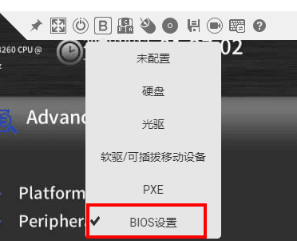

3.  在启动项配置界面选择，选择“BIOS设置”，然后在虚拟界面工具栏中单击重启工具，重启服务器。
4.  系统重启后进入BIOS配置界面，依次选择“Advanced”\>“Socket Configuration”，如[图3](#fig4546303814)所示。

    **图 3**  Socket Configuration<a name="fig4546303814"></a>  
    

5.  进入Advanced Power Mgmt. Configuration，设置Power Policy为Performance。如[图4](#fig15501111014442)。

    **图 4**  设置电源策略<a name="fig15501111014442"></a>  
    

6.  按下“F10”保存配置并重启服务器。

**将CPU设置为performance模式**<a name="section20155620469"></a>

请使用root用户执行如下操作。

1.  <a name="li158435131344"></a>使用如下命令查看当前CPU模式。

    ```
    cat /sys/devices/system/cpu/cpu0/cpufreq/scaling_governor
    ```

    执行以上命令会输出当前CPU模式，CPU模式说明请参见[表1](#table354392019384)。如果当前CPU模式不是performance模式，请执行以下操作设置CPU为performance模式。否则请跳过以下步骤。

    **表 1**  CPU模式

    <a name="table354392019384"></a>
    <table><thead align="left"><tr id="row16543172093819"><th class="cellrowborder" valign="top" width="30.819999999999997%" id="mcps1.2.3.1.1"><p id="p2526552113912"><a name="p2526552113912"></a><a name="p2526552113912"></a>调速器</p>
    </th>
    <th class="cellrowborder" valign="top" width="69.17999999999999%" id="mcps1.2.3.1.2"><p id="p452519525397"><a name="p452519525397"></a><a name="p452519525397"></a>描述</p>
    </th>
    </tr>
    </thead>
    <tbody><tr id="row654317204384"><td class="cellrowborder" valign="top" width="30.819999999999997%" headers="mcps1.2.3.1.1 "><p id="p2376242163917"><a name="p2376242163917"></a><a name="p2376242163917"></a>performance</p>
    </td>
    <td class="cellrowborder" valign="top" width="69.17999999999999%" headers="mcps1.2.3.1.2 "><p id="p14376442183917"><a name="p14376442183917"></a><a name="p14376442183917"></a>运行于最大频率。</p>
    </td>
    </tr>
    <tr id="row854318200381"><td class="cellrowborder" valign="top" width="30.819999999999997%" headers="mcps1.2.3.1.1 "><p id="p153761542123910"><a name="p153761542123910"></a><a name="p153761542123910"></a>powersave</p>
    </td>
    <td class="cellrowborder" valign="top" width="69.17999999999999%" headers="mcps1.2.3.1.2 "><p id="p8376942173913"><a name="p8376942173913"></a><a name="p8376942173913"></a>运行于最小频率。</p>
    </td>
    </tr>
    <tr id="row75431920203818"><td class="cellrowborder" valign="top" width="30.819999999999997%" headers="mcps1.2.3.1.1 "><p id="p1437611425398"><a name="p1437611425398"></a><a name="p1437611425398"></a>userspace</p>
    </td>
    <td class="cellrowborder" valign="top" width="69.17999999999999%" headers="mcps1.2.3.1.2 "><p id="p103771642173920"><a name="p103771642173920"></a><a name="p103771642173920"></a>运行于用户指定的频率。</p>
    </td>
    </tr>
    <tr id="row165438202382"><td class="cellrowborder" valign="top" width="30.819999999999997%" headers="mcps1.2.3.1.1 "><p id="p7377142113915"><a name="p7377142113915"></a><a name="p7377142113915"></a>ondemand</p>
    </td>
    <td class="cellrowborder" valign="top" width="69.17999999999999%" headers="mcps1.2.3.1.2 "><p id="p237794283917"><a name="p237794283917"></a><a name="p237794283917"></a>按需快速动态调整CPU频率，一有CPU计算量的任务，就会立即达到最大频率运行，空闲时间增加就降低频率。</p>
    </td>
    </tr>
    <tr id="row55441320113810"><td class="cellrowborder" valign="top" width="30.819999999999997%" headers="mcps1.2.3.1.1 "><p id="p8377142203913"><a name="p8377142203913"></a><a name="p8377142203913"></a>conservative</p>
    </td>
    <td class="cellrowborder" valign="top" width="69.17999999999999%" headers="mcps1.2.3.1.2 "><p id="p737794216395"><a name="p737794216395"></a><a name="p737794216395"></a>按需快速动态调整CPU频率，比ondemand的调整更保守。</p>
    </td>
    </tr>
    <tr id="row5544620123817"><td class="cellrowborder" valign="top" width="30.819999999999997%" headers="mcps1.2.3.1.1 "><p id="p13377154273919"><a name="p13377154273919"></a><a name="p13377154273919"></a>schedutil</p>
    </td>
    <td class="cellrowborder" valign="top" width="69.17999999999999%" headers="mcps1.2.3.1.2 "><p id="p183779421393"><a name="p183779421393"></a><a name="p183779421393"></a>基于调度程序调整 CPU 频率。</p>
    </td>
    </tr>
    </tbody>
    </table>

2.  安装工具，使用如下命令安装。
    -   以“ubuntu/debian“系统为例。

        ```
        apt-get install linux-tools-$(uname -r)
        ```

    -   以“centos/bclinux/euler“系统为例：

        ```
        yum install kernel-tools -y
        systemctl daemon-reload 
        systemctl enable cpupower 
        systemctl start cpupower
        ```

3.  设置CPU为performance模式。

    ```
    cpupower frequency-set -g performance
    ```

4.  再次执行[步骤1](#li158435131344)查看当前CPU模式是否已设置为performance模式。

<h5 id="修改CPU性能模式（ARM服务器）md">修改CPU性能模式（ARM服务器）</h5>

**设置电源策略为高性能模式**<a name="section18832114453814"></a>

在某些对Host侧CPU要求较高的模型中，例如目标检测类模型，需要进行较为复杂的图像预处理，开启电源高性能模式能一定程度上提高性能和稳定性。ARM服务器提升网络性能需要在BIOS设置中将电源策略设为高性能模式，具体操作如下。

1.  登录ibmc界面，启动虚拟控制台，远程控制选择HTML5集成远程控制台，如[图1](#fig15869135420288)。

    **图 1**  远程登录控制台<a name="fig15869135420288"></a>  
    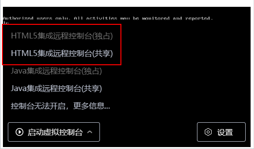

2.  在虚拟界面工具栏中，单击启动项工具，弹出启动项配置界面，如[图2](#fig744814574243)。

    **图 2**  启动项工具<a name="fig744814574243"></a>  
    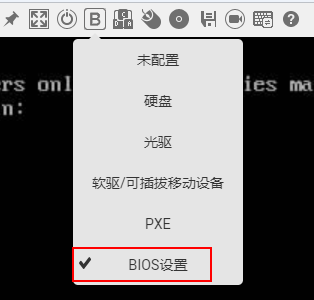

3.  在启动项配置界面选择，选择“BIOS设置”，然后在虚拟界面工具栏中单击重启工具，重启服务器。
4.  系统重启后进入BIOS配置界面，依次选择“Advanced”\>“ Performance Config”，如[图3](#fig4546303814)所示。

    **图 3**  Performance Config<a name="fig4546303814"></a>  
    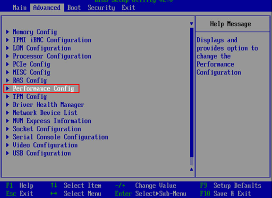

5.  进入“Performance Config”，设置Power Policy为Performance。如[图4](#fig15501111014442)。

    **图 4**  设置电源策略<a name="fig15501111014442"></a>  
    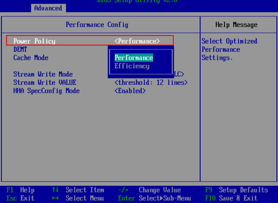

6.  按下“F10”保存配置并重启服务器。

<h5 id="安装高性能pillow库（X86服务器）md">安装高性能pillow库（X86服务器）</h5>

1.  安装高性能pillow库相关依赖，命令如下。

    ubuntu/debian：

    ```
    apt-get install libtiff5-dev libjpeg8-dev libopenjp2-7-dev zlib1g-dev libfreetype6-dev liblcms2-dev libwebp-dev tcl8.6-dev tk8.6-dev python3-tk libharfbuzz-dev libfribidi-dev libxcb1-dev
    ```

    centos/bclinux/euler：

    ```
    yum install libtiff-devel libjpeg-devel openjpeg2-devel zlib-devel freetype-devel lcms2-devel libwebp-devel tcl-devel tk-devel harfbuzz-devel fribidi-devel libraqm-devel libimagequant-devel libxcb-devel
    ```

2.  安装高性能pillow库。
    1.  执行如下命令卸载原生pillow。

        ```
        pip3.7 uninstall -y pillow
        ```

    2.  安装SSE4版本pillow-simd。

        使用root用户安装，执行如下命令，若使用非root用户安装，需在命令结尾加上--user。

        ```
        pip3.7 install pillow-simd
        ```

        > **说明：** 
        >如果CPU支持AVX2指令集，可安装AVX2版本pillow-simd，命令如下：
        >```
        >CC="cc -mavx2" pip3.7 install -U --force-reinstall pillow-simd
        >```


3.  修改torchvision代码解决pillow-simd缺少PILLOW\_VERSION问题。torchvision安装参见[样例获取](#样例获取md)。

    将/usr/local/python3.x.x/lib/python3.x/site-packages/torchvision/transforms/functional.py第5行代码修改如下：

    ```
    try:
        from PIL import Image, ImageOps, ImageEnhance,PILLOW_VERSION
    except:
        from PIL import Image, ImageOps, ImageEnhance
        PILLOW_VERSION="7.0.0"
    ```


<h5 id="（可选）安装指定版本OpenCV库md">（可选）安装指定版本OpenCV库</h5>

如模型依赖OpenCV，基于训练性能考虑，建议安装OpenCV-3.4.10版本。

1.  获取源码：[获取地址](https://opencv.org/releases/)。
2.  安装指导：[获取地址](https://docs.opencv.org/3.4.10/d7/d9f/tutorial_linux_install.html)。

<h4 id="训练过程性能优化md">训练过程性能优化</h4>

**算子瓶颈优化**<a name="section8727652134111"></a>

1.  获取训练过程中的Profiling数据，参见[Profiling数据采集](#采集训练过程相关数据md)。
2.  分析Profiling数据，得到耗时较大的算子。
3.  参见[单算子样例编写说明](#单算子样例编写说明md)构建耗时较大算子的单算子样例，通过与CPU或GPU运行单算子样例时间进行对比，若发现性能不足，则有以下两种方案解决。
    -   规避方案：使用同等语义其他高效算子替代。
    -   解决方案：改进算子性能。

**copy瓶颈优化**<a name="section219718193717"></a>

1.  获取训练过程中的Profiling数据，参见[Profiling数据采集](#采集训练过程相关数据md)。
2.  分析Profiling数据分析整网中的D2DCopywithStreamSynchronize/PTCopy/format\_contiguous的耗时。
3.  若发现耗时较大，则需参照以下两种方案解决。
    -   方案一：（规避方案）PyTorch中View类型框架类算子会导致非连续转连续操作。优化思路为尽量使用计算类算子代替View类框架算子，常见的View类框架算子如View、Permute、Transpose等。更多View类框架算子可参考[https://pytorch.org/docs/stable/tensor\_view.html](https://pytorch.org/docs/stable/tensor_view.html)。
    -   方案二：（解决方案）加速转连续操作。

**框架瓶颈优化**<a name="section1391981014420"></a>

1.  获取训练过程中算子信息OP\_INFO，参见[获取算子信息OP\_INFO](#采集训练过程相关数据md)。
2.  分析OP\_INFO中算子的规格和调用关系，定位是否插入了多余的算子，重点关注transdata是否合理。
3.  优化方案：通过指定部分算子初始化格式，对多余的格式转换算子进行消除。
4.  在pytorch/torch/nn/modules/module.py中，在cast\_weight中指定算子初始化格式，如下图。

    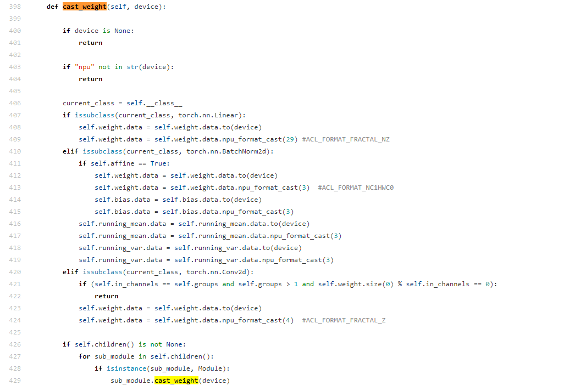

    格式设置原则可参考如下规则：

    -   Conv2D相关：Weight 可设置为FZ格式，如第424行。
    -   Linear相关的参数，可设置为NZ格式，如第409行。

**编译瓶颈优化**<a name="section148361506506"></a>

1.  获取训练过程中算子信息OP\_INFO，参见[获取算子信息OP\_INFO](#采集训练过程相关数据md)。
2.  查看INFO日志，观察第一个step以后的aclopCompile::aclOp关键字，如果后续接了Match op inputs/type failed或To compile op则说明该算子存在动态编译，需要优化。
3.  需参照以下两种方案解决。
    -   规避方案：在理解模型语义和相关API基础上，使用固定Shape的方式代替动态Shape。
    -   解决方案：减少编译或不需要编译该算子。
    -   优化算子编译配置请参见[编译选项设置](#编译选项设置md)。

### 端到端性能工具（E2E prof）使用说明

#### E2E prof工具介绍

E2E prof工具是一个将pytorch框架的profiling工具和cann prof工具获取到的框架层面数据和算子性能数据统一集成，实现端到端的模型和算子性能分析工具。

#### E2E prof使用教程

添加with语句使能E2E prof功能

```
with torch.npu.profile(profiler_result_path="./result",use_e2e_profiler=True):

     model_train()
```

- profiler_result_path表示prof结果保存路径，默认为当前路径，若设置其他路径请确保路径已存在。
- use_e2e_profiler表示是否开启E2E prof功能，默认为False（仅开启CANN prof功能）。

（因NUP算子需要编译后才能执行，为保证数据的准确性，建议先运行10个step，在第十个step后再进行E2E prof操作，并且一般只需要profiling1个或者2个setp即可。）

#### E2E prof结果解析

通过E2E prof工具获得的结果为原始数据，需要通过解析后查看。

1. 以使用教程中路径为例，工具会在profiler_result_path路径下创建文件夹以保存原始数据。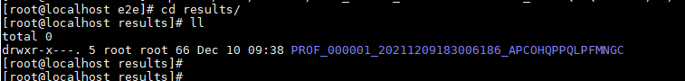

2. 切换至如上图./results/PROF_***路径后，执行下述脚本，其中PROF_***文件夹为自动生成的文件夹。

   ```
   /usr/local/Ascend/ascend-toolkit/latest/toolkit/tools/profiler/bin/msprof --export=on --output=./
   ```

   - output：原始数据路径。

3. 运行完成后，在原始数据路径下输出timeline目录。如下图：

   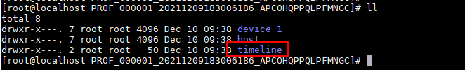

4. timeline路径下为解析得到的性能数据，可以通过chrome://tracing/中打开。

   1. 浏览器进入chrome://tracing/。

   2. 点击load，上传文件查看。

      

   内容示例如下图：

   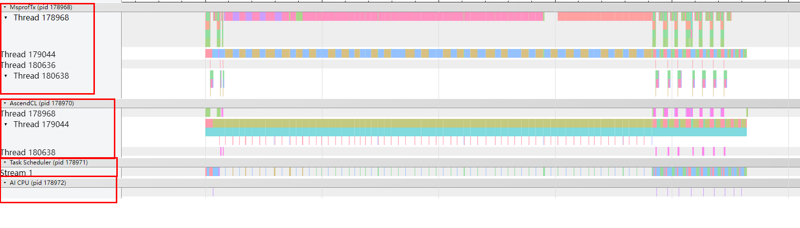

   该示例分为4个层次，由上到下，第一层（MsprofTx）为Pytorch框架数据，第二层（AscendCL）为ACL层面数据，第三层（Task Scheduler）为device数据，第四层（AI CPU）为AICPU数据。

#### E2E prof高级设置

E2E prof工具默认配置获取上述所有层面数据。获取数据过程亦会影响性能，若获取数据过多，会导致性能数据不具备参考价值。因此，E2E prof工具提供了可配置选项，用于精细化控制获取部分层面数据。

```
with torch.npu.profile(profiler_result_path="./results", use_e2e_profiler=True，config=torch.npu.profileConfig(ACL_PROF_ACL_API=True, 
ACL_PROF_TASK_TIME=True, 
ACL_PROF_AICORE_METRICS=True,
ACL_PROF_AICPU=True, 
ACL_PROF_L2CACHE=False, 
ACL_PROF_HCCL_TRACE=True, 
ACL_PROF_TRAINING_TRACE=False, 
aiCoreMetricsType=0)):
```

-   ACL_PROF_ACL_API：表示采集AscendCL接口的性能数据，默认True


- ACL_PROF_TASK_TIME：采集AI Core算子的执行时间，默认True


- ·ACL_PROF_AICORE_METRICS：表示采集AI Core性能指标数据，aicore_metrics入参处配置的性能指标采集项才有效，默认为True


-  ACL_PROF_AICPU：0x0008，集AI CPU任务的开始、结束轨迹数据，默认为True 

- · ACL_PROF_L2CACHE：表示采集L2 Cache数据，该数据会导致prof结果膨胀，默认False

-   ACL_PROF_HCCL_TRACE：表示采集HCCL数据，默认为True

-   ACL_PROF_TRAINING_TRACE：表示迭代轨迹数据，记录模型正向和反向等步骤，默认为False

其中，aiCoreMetricsType的取值和定义如下，默认为0：

- ACL_AICORE_ARITHMETIC_UTILIZATION = 0：表示各种计算类指标占比统计，包括采集项mac_fp16_ratio、mac_int8_ratio、vec_fp32_ratio、vec_fp16_ratio、vec_int32_ratio、vec_misc_ratio

- ACL_AICORE_PIPE_UTILIZATION = 1：表示计算单元和搬运单元耗时占比，包括采集项vec_ratio、mac_ratio、scalar_ratio、mte1_ratio、mte2_ratio、mte3_ratio、icache_miss_rate

- ACL_AICORE_MEMORY_BANDWIDTH = 2：表示外部内存读写类指令占比，包括采集项ub_read_bw、ub_write_bw、l1_read_bw、l1_write_bw、l2_read_bw、l2_write_bw、main_mem_read_bw、main_mem_write_bw

- ACL_AICORE_L0B_AND_WIDTH ：表示内部内存读写类指令占比，包括采集项scalar_ld_ratio、scalar_st_ratio、l0a_read_bw、l0a_write_bw、l0b_read_bw、l0b_write_bw、l0c_read_bw、l0c_write_bw

- ACL_AICORE_RESOURCE_CONFLICT_RATIO ：表示流水线队列类指令占比，包括采集项vec_bankgroup_cflt_ratio、vec_bank_cflt_ratio、vec_resc_cflt_ratio、mte1_iq_full_ratio、mte2_iq_full_ratio、mte3_iq_full_ratio、cube_iq_full_ratio、vec_iq_full_ratio、iq_full_ratio

- ACL_AICORE_NONE = 0xFF：表示不采集

​    

### 亲和库


<h4 id="来源介绍md">来源介绍</h4>

针对公版模型中常见的网络结构和函数，我们针对性地对其进行了优化，使得运算性能大幅度提升，同时，将其集成到Pytorch框架中，便于模型性能调优中使用。

<h4 id="功能介绍-1md">功能介绍</h4>

<a name="table348133010119"></a>
<table><thead align="left"><tr id="row1348193013113"><th class="cellrowborder" valign="top" width="46.21462146214622%" id="mcps1.1.4.1.1"><p id="p98051838191114"><a name="p98051838191114"></a><a name="p98051838191114"></a>函数名</p>
</th>
<th class="cellrowborder" valign="top" width="25.292529252925295%" id="mcps1.1.4.1.2"><p id="p1080553881111"><a name="p1080553881111"></a><a name="p1080553881111"></a>位置</p>
</th>
<th class="cellrowborder" valign="top" width="28.49284928492849%" id="mcps1.1.4.1.3"><p id="p14805153841113"><a name="p14805153841113"></a><a name="p14805153841113"></a>功能说明</p>
</th>
</tr>
</thead>
<tbody><tr id="row1449163011112"><td class="cellrowborder" valign="top" width="46.21462146214622%" headers="mcps1.1.4.1.1 "><p id="p138051838121113"><a name="p138051838121113"></a><a name="p138051838121113"></a>pairwise_iou</p>
</td>
<td class="cellrowborder" valign="top" width="25.292529252925295%" headers="mcps1.1.4.1.2 "><p id="p1080514386118"><a name="p1080514386118"></a><a name="p1080514386118"></a>torch.contrib.npu.optimized_lib</p>
</td>
<td class="cellrowborder" valign="top" width="28.49284928492849%" headers="mcps1.1.4.1.3 "><p id="p1480593811116"><a name="p1480593811116"></a><a name="p1480593811116"></a>计算两个目标框的IOU。</p>
</td>
</tr>
<tr id="row174933013118"><td class="cellrowborder" valign="top" width="46.21462146214622%" headers="mcps1.1.4.1.1 "><p id="p1280513819113"><a name="p1280513819113"></a><a name="p1280513819113"></a>fast_rcnn_inference_single_image</p>
</td>
<td class="cellrowborder" valign="top" width="25.292529252925295%" headers="mcps1.1.4.1.2 "><p id="p198057389119"><a name="p198057389119"></a><a name="p198057389119"></a>torch.contrib.npu.optimized_lib</p>
</td>
<td class="cellrowborder" valign="top" width="28.49284928492849%" headers="mcps1.1.4.1.3 "><p id="p118053381118"><a name="p118053381118"></a><a name="p118053381118"></a>Maskrcnn和Fasterrcnn模型的推理接口。</p>
</td>
</tr>
<tr id="row349530141119"><td class="cellrowborder" valign="top" width="46.21462146214622%" headers="mcps1.1.4.1.1 "><p id="p2806538181110"><a name="p2806538181110"></a><a name="p2806538181110"></a>ChannelShuffle</p>
</td>
<td class="cellrowborder" valign="top" width="25.292529252925295%" headers="mcps1.1.4.1.2 "><p id="p48069388115"><a name="p48069388115"></a><a name="p48069388115"></a>torch.contrib.npu.optimized_lib</p>
</td>
<td class="cellrowborder" valign="top" width="28.49284928492849%" headers="mcps1.1.4.1.3 "><p id="p5806123817112"><a name="p5806123817112"></a><a name="p5806123817112"></a>提供NPU亲和的channelshuffle操作，适用于shufflenetv2等模型。</p>
</td>
</tr>
<tr id="row849203018111"><td class="cellrowborder" valign="top" width="46.21462146214622%" headers="mcps1.1.4.1.1 "><p id="p188062384116"><a name="p188062384116"></a><a name="p188062384116"></a>PreLoader</p>
</td>
<td class="cellrowborder" valign="top" width="25.292529252925295%" headers="mcps1.1.4.1.2 "><p id="p6806938111113"><a name="p6806938111113"></a><a name="p6806938111113"></a>torch.contrib.npu.optimized_lib</p>
</td>
<td class="cellrowborder" valign="top" width="28.49284928492849%" headers="mcps1.1.4.1.3 "><p id="p14806103861118"><a name="p14806103861118"></a><a name="p14806103861118"></a>提供针对昇腾AI处理器加速的数据加载方法。</p>
</td>
</tr>
</tbody>
</table>

> **说明：** 
>该部分调优内容会随着版本不断增强和更新，请以实际PyTorch版本中对应路径下的内容为准。

<h2 id="精度调测md">精度调测</h2>


<h3 id="前提条件-2md">前提条件</h3>

优先在同等语义和超参下，跑一定的epoch（推荐完整epoch数的20%），使精度，loss等对齐GPU相应水平，完成后再对齐最终精度。

<h3 id="调测过程-3md">调测过程</h3>

-   **[总体思路](#总体思路-4md)**  

-   **[精度调优方法](#精度调优方法md)**  


<h4 id="总体思路-4md">总体思路</h4>

精度问题排查需要找出是哪一步出现的问题，主要以下几个方面：

1.  <a name="li17755175510322"></a>模型网络计算错误。
    -   定位思路：在网络中加入hook进行排查判断是哪个地方有较大嫌疑，然后构建[单算子用例](#单算子样例编写说明md)逐渐缩小错误范围，证明该算子在当前网络场景下计算有误，可以对比CPU或GPU结果证明。

    -   规避方案：使用同等语义其他算子替代。

    -   解决方案：改进算子精度或功能问题。

2.  <a name="li25281726103316"></a>loss计算错误。
    -   定位思路：由于Loss的特殊性和可以自定义，在判断Loss计算错误后建议dump网络中的loss的输入来测试而非随机同shape tensor，这样才能更好地复现证明。

    -   规避方案：使用同等语义其他算子替代。

    -   解决方案：改进算子精度或功能问题（loss也是由算子构成）。

3.  参数更新错误。

    -   定位思路：在每个optim.step\(\)前对网络中的参数逐个打印其grad进行排查判断是哪个地方有较大嫌疑，然后构建单算子用例逐渐缩小错误范围，证明该算子在当前网络场景下梯度计算有误，可以对比CPU或GPU结果证明。该项优先级应低于[1.](#li17755175510322)与[2.](#li25281726103316)，因为1与2的错误同样可以造成grad异常。

    -   规避方案：使用同等语义其他算子替代。

    -   解决方案：改进计算grad的算子精度或功能问题。

4.  多卡计算错误。

    -   定位思路：在保证单卡精度OK的前提下，稳定复现多卡不收敛。

    -   解决方案：建议联系华为方支撑人员，提供稳定复现的单P和多P脚本。

<h4 id="精度调优方法md">精度调优方法</h4>

模型出现精度问题一般有：因算子溢出导致的训练loss不收敛或者精度不达标问题，整个网络训练引起的性能不达标问题。用户可通过单算子溢出检测和整网调测适度解决模型精度不达标问题。

-   **[环境准备](#环境准备md)** 
-   **[模型算子精度对比](模型算子精度对比)**
-   **[单算子溢出检测](#单算子溢出检测md)**  
-   **[IR与TBE算子映射](IR与TBE算子映射)**
-   **[NPU与GPU算子映射](NPU与GPU算子映射)**
-   **[整网调测](#整网调测md)**  

##### 环境准备

- 安装hdf5工具以支持算子dump功能，安装详情请参见[编译安装hdf5](#编译安装hdf5md)。

  若使用模型算子精度对比功能，需要同时在NPU和GPU环境安装hdf5。否则，仅在NPU环境安装hdf5即可。

- 安装支持dump功能的Ascend PyTorch框架，编译前请修改build.sh脚本，其余操作请参见[《PyTorch安装指南》](https://gitee.com/ascend/pytorch/blob/master/docs/zh/PyTorch%E5%AE%89%E8%A3%85%E6%8C%87%E5%8D%97/PyTorch%E5%AE%89%E8%A3%85%E6%8C%87%E5%8D%97.md) 。

  - 在NPU环境PyTorch安装

    编译前修改build.sh脚本，在脚本中增加`USE_DUMP=1`字段。

    ```bash
    DEBUG=0 USE_DISTRIBUTED=1 USE_HCCL=1 USE_MKLDNN=0 USE_CUDA=0 USE_NPU=1 BUILD_TEST=0 USE_NNPACK=0 USE_DUMP=1 python"${PY_VERSION}" setup.py build bdist_wheel
    ```

  - （可选）在GPU环境PyTorch安装，若对模型算子精度对比，请执行此操作，否则请忽略。

    编译前修改build.sh，在脚本中增加`USE_DUMP=1`、`USE_NCCL=0`字段，将 `USE_HCCL`、`USE_NPU`字段的值修改为0，将`USE_CUDA`字段的值修改为1。

    ```bash
    DEBUG=0 USE_DISTRIBUTED=1 USE_HCCL=0 USE_NCCL=0 USE_MKLDNN=0 USE_CUDA=1 USE_NPU=0 BUILD_TEST=0 USE_NNPACK=0 USE_DUMP=1 python"${PY_VERSION}" setup.py build bdist_wheel
    ```

##### 模型算子精度对比

用户使用精度对比工具，在相同输入的情况下，获取模型在GPU和NPU进行训练时模型内算子输出的精度差异，从而帮助开发者实现算子精度问题定位。

约束说明：

- 建议使用小batchsize，一般设置为8及以下。

  由于每个算子输入、输出数据会存储在硬盘中，会占用较大空间，故建议使用小batchsize节省硬盘空间。

- 建议仅dump一个step的数据进行精度对比。

- 目前支持精度为fp32、O1或O2训练过程的算子精度对比。

对比模式： 

- GPU的输入和输出为已知数据，将GPU的输入数据加载到NPU上执行得到输出数据，NPU与GPU输出数据对比。
- NPU的输入和输出为已知数据，将NPU的输入数据加载到GPU上执行得到输出数据，NPU与GPU输出数据对比。

操作步骤：

1. 在GPU或NPU环境，使用dumper工具获取GPU或NPU的模型输入和算子输出数据。

   修改训练代码，增加数据dump功能。在模型训练代码的正向、反向计算位置使用`with`语句增加`torch.utils.dumper()`方法dump数据。例如，在GPU环境下修改示例：

   ```python
   for i, data in enumerate(dataloader):
       with torch.utils.dumper(use_dump=True, dump_path="./model_gpu.h5") as dump:
           # 模型训练代码
           xxx # forward code 
           xxx # backward code
       exit()
       xxx # optimizer code 
   ```

   dump_path参数为dump数据保存文件路径及名称。建议仅dump一个step的数据用于精度对比，同时参数更新代码放在with语句外。

2. 将在GPU(NPU)环境dump的数据model_gpu.h5拷贝到NPU(GPU)环境。

3. 在NPU或NPU环境，使用dumper工具加载已经dump出的数据，并获取算子输出数据。

   修改训练代码，增加数据load、dump功能。在模型训练代码的正向、反向计算位置使用`with`语句增加`torch.utils.dumper()`方法load、dump数据。例如，在NPU环境下修改示例：

   ```python
   for i, data in enumerate(dataloader):
       with torch.utils.dumper(use_dump=True, load_file_path="./model_gpu.h5", dump_path="./model_npu.h5") as dump:
           # 模型训练代码
           xxx # forward code 
           xxx # backward code
       exit()
       xxx # optimizer code
   ```

   load_file_path参数为从GPU或NPU获取的dump数据路径，dump_path参数为dump数据保存文件路径及名称。建议仅dump一个step的数据用于精度对比，同时参数更新代码放在with语句外。

4. 使用msaccucmp.py对算子输出数据对比。

   1. ascend-toolkit提供了msaccucmp.py工具脚本用具精度对比。

      - 该脚本路径为："/user/local/Ascend/ascend-toolkit/latest/tools/operator_cmp/compare/msaccucmp.py"，

        路径仅供参考，请以ascend-toolkit实际安装路径为准。

      - 也可以使用如下命令查找msaccucmp.py路径。

        ```linux
        find / -name msaccucmp.py
        ```

   2. 执行msaccucmp.py脚本，进行精度对比。

      ```
      python3 /user/local/Ascend/ascend-toolkit/latest/tools/operator_cmp/compare/msaccucmp.py compare -m ./model_npu.h5 -g ./model_gpu.h5
      ```

      参数说明：

      `-g`参数传入使用GPU获得的dump数据文件路径。

      `-m`参数传入使用NPU获得的dump数据文件路径。


<h5 id="单算子溢出检测md">单算子溢出检测</h5>

用户通过算子溢出检测功能检测算子是否有溢出，然后采集溢出算子的数据，从而帮助开发人员快速定位并解决算子精度问题。

约束说明：<a name="section52762019181510"></a>

-   本功能只提供IR级别的算子溢出检测，且只支持AICORE，不支持Atomic。
-   使用单算子溢出检测功能时，请不要同时开启apex的动态loss scale模式和使用tensor融合功能，使用单P对模型进行训练，不使用分布式。

采集溢出算子数据：<a name="section121407268191"></a>

```
# check_overflow为溢出检测控制开关
# dump_path为dump文件保存路径
with torch.utils.dumper(check_overflow=check_overflow, dump_path=dump_path, load_file_path='') as dump:   
    # 需要检测算子溢出的代码片段
```

运行一个step，模型运行过程中，如果有算子溢出，会打印出相应IR的名字。

查看Dump数据：<a name="section155351957142017"></a>

如果训练过程中采集到了Dump数据，则会在\{dump\_path\}路径下生成dump数据的.h5文件，用户可进入路径自行查看。

解决方法：<a name="section1729763162019"></a>

1. 将采集到的.h5文件映射到TBE算子，映射方法请参见[IR与TBE算子映射](#IR与TBE算子映射)。

2. 请将算子溢出的打印截图及映射后的TBE算子输入输出文件通过Issue附件形式反馈给华为开发人员。

##### IR与TBE算子映射

前提条件：

- 设置环境变量`export ACL_DUMP_DATA=0`。
- 在脚本中避免使用`torch.npu.init.dump()`和`torch.npu.set.dump()`接口。

操作步骤：

1. 准备好需要映射的算子.h5文件。

   - 算子溢出检测场景下，单算子溢出检测已生成需要映射的算子.h5文件。

   - 精度对比场景下，需根据精度对比结果，参照下面命令提取需要映射的算子.h5文件。

     ```
     h5copy -pv -i "./input.h5" -o "./output.h5" -s "/op1/seqid/" -d "/op1/seqid/"
     ```

     -i 为输入精度对比文件

     -o 为输出需要映射的算子.h5文件路径

     -s 为需要提取的源算子名称及seqid

     -d 为需要提取的目的算子名称及seqid

     若需要提取多个算子，则修改-s、-d参数，多次执行该命令，可以把多算子追加提取到output.h5中。

     该命令需-s和-d参数相同。

     示例：

     ```
     h5copy -pv -i "./dump_npu.h5" -o "./output.h5" -s "/numpy_T/1/" -d "/numpy_T/1/"
     ```

     该示例表示从“./dump_npu.h5”中抽取seqid为1的numpy_T算子的输入、输出数据到"./output.h5"文件中。

2. 配置acl.json文件。

   在模型目录下创建acl dump功能所需的的配置文件acl.json

   ```
   {
       "dump":
   	    {
               "dump_list":[]
               "dump_path":"./output_IR2TBE"# 映射结果输出路径
               "dump_mode":"all"
               "dump_op_switch":"on"
   	    }
   
   }
   ```

   需将`dump_path`修改为结果输出路径，其他字段不需要修改。

3. 修改训练脚本。

   在训练脚本中添加`with`语句开启IR映射TBE功能。

   ```python
   with torch.utils.dumper(use_load=True, dump_path="./",load_file_path="./output.h5", load_with_acl_dump=True) as dump:
       # 模型计算代码，需用户自己添加
       # x = model(input_data)
   ```

4. 模型运行。

   运行一步完整的模型计算过程，在计算过程中load遇到output.h5中的数据后，自动开启acl dump功能，执行IR，并dump出IR相对应的TBE算子的输入输出数据，IR执行结束，acl dump结束。

5. 获得映射文件。

   运行成功后，在acl.json配置文件中的`dump_path`路径下查看输出结果文件。

##### NPU与GPU算子映射

请参见《开发辅助工具指南》中 ”精度对比工具使用指南（训练）“中 “数据准备章节” 中的 “[准备以PyTorch为原始训练网络的精度比对数据文件](https://support.huawei.com/enterprise/zh/doc/EDOC1100219269/2324edc8#ZH-CN_TOPIC_0000001162580808)”。

<h5 id="整网调测md">整网调测</h5>

用户也可通过分析整个网络的方式来进行网络模型的精度调测。

1.  通过对比CPU和昇腾AI处理器的结果，判断在昇腾AI处理器上计算是否正确。

    代码样例（本样例只体现基本方法，禁止直接复制）如下：

    ```
    # 固定入参，保证模型与输入数据在CPU和昇腾AI处理器上相同
    input_tensor_cpu = torch.Tensor()
    model_cpu = build_model()
    # 将输入数据迁移到昇腾AI处理器上
    input_tensor_npu = input_tensor_cpu.npu()
    # 将模型迁移到昇腾AI处理器上
    model_npu = model_cpu.npu()
    
    # 运算结果对比
    output_cpu = model_cpu(input_tensor_cpu)
    output_npu = model_npu(input_tensor_npu)
    compute_result = (output_cpu - output_npu).abs().mean())
    print(compute_result)
    ```

    因昇腾AI处理器硬件架构与cpu不同，计算结果会略有不同。若运算结果较为接近（一般不高于1e-4），则认为运算结果正常。

2.  通过Pytorch的hook机制来打印正向反向传播中module的输入和输出来分析。

    代码样例（本样例只体现基本方法，禁止直接复制）如下：

    ```
    # 设置hook func
    def hook_func(name, module):
        def hook_function(module, inputs, outputs):
            print(name+' inputs', inputs)
            print(name+' outputs', outputs)
        return hook_function
    
    # 注册正反向hook
    for name, module in model.named_modules():
        module.register_forward_hook(hook_func('[forward]: '+name, module))
        module.register_backward_hook(hook_func('[backward]: '+name, module))
    
    # 运行
    model(input_tensor)
    ```

    通过分析打印正向反向传播中的inputs, outputs来确定。

3.  通过直接获取module的grad, running\_mean, running\_var等参数来分析更新量。

    代码样例（本样例只体现基本方法，禁止直接复制）如下：

    ```
    # 例如获取梯度和BN的均值方法来排查
    for name, module in model.named_modules():
        if isinstance(module, nn._BatchNorm):
            print("[BN_buffer]: "+name, module.running_mean, module.running_var)
        print("[grad]: "+name, module.grad)
    ```


<h2 id="模型保存与转换md">模型保存与转换</h2>

-   **[简介](#简介md)**  

-   **[模型保存](#模型保存md)**  

-   **[导出ONNX模型](#导出ONNX模型md)**  


<h3 id="简介md">简介</h3>

模型训练完成后，通过Pytorch提供的接口保存模型文件并导出ONNX模型，然后通过ATC工具将其转换为适配昇腾AI处理器的.om文件用于离线推理。

本章主要介绍如何将训练好的pth文件pth.tar文件转换为ONNX模型，将ONNX模型转换为适配昇腾AI处理器的.om文件流程请参考《CANN 开发辅助工具指南》手册中“ATC工具使用指南”章节。

如果想使用Auto Tune优化功能，请参考《CANN 开发辅助工具指南》手册中“Auto Tune工具使用指导”章节。

离线推理应用构建请参考《CANN 应用软件开发指南\(C&C++, 推理\)》。整体流程如下：


<h3 id="模型保存md">模型保存</h3>

Pytorch在训练过程中，通常使用torch.save\(\)来保存Checkpoint文件，根据模型文件的后续用途会保存为两种格式的模型文件：

-   .pth或.pt扩展名的文件：用于在线推理或导出ONNX格式模型，仅保存模型参数，不保存模型结构，以便压缩文件的体积，可以用Netron等可视化工具打开，一般如[图1 .pth文件](#fig315704722610)所示。

    **图 1**  .pth文件<a name="fig315704722610"></a>  
    

    通过**state\_dict**来保存和加载模型，示例如下：

    1.  保存模型。

        ```
        # 创建保存路径
        PATH = "state_dict_model.pt"
        # 保存模型
        torch.save(net.state_dict(), PATH)
        ```

    2.  加载模型以用于在线推理，示例如下，详情请参见《PyTorch在线推理指南》。

        ```
        # 模型文件保存路径
        PATH = "state_dict_model.pt"
        model = TheModelClass(*args, **kwargs)
        # 加载模型
        model.load_state_dict(torch.load(PATH))
        model.eval()
        ```

    > **须知：** 
    >保存.pth或.pt文件扩展名的文件时要提供模型定义文件，否则无法部署。

-   .pth.tar扩展名的文件：可用于在线推理或重新加载后继续训练。保存多个组件，以字典形式保存，常见的组件包括模型和优化器的state\_dict、停止时的epoch、最新记录的训练损失以及外部的torch.nn.Embedding层等。如果仅用于部署推理模型，推荐只在.pth.tar扩展名的文件中保存权重信息即模型的state\_dict。

    保存和加载模型示例如下：

    1.  保存模型。

        ```
        PATH = "checkpoint.pth.tar"
        torch.save({
            'epoch': epoch,
            'loss': loss,
            'state_dict': model.state_dict(),
            'optimizer' : optimizer.state_dict(),
            ...
        }, PATH)
        ```

    2.  加载模型用于推理或恢复训练。

        ```
        model = TheModelClass(*args, **kwargs)
        optimizer = TheOptimizerClass(*args, **kwargs)
        
        checkpoint = torch.load(PATH)
        model.load_state_dict(checkpoint['model_state_dict'])
        optimizer.load_state_dict(checkpoint['optimizer_state_dict'])
        epoch = checkpoint['epoch']
        loss = checkpoint['loss']
        
        model.eval()
        # - or -
        model.train()
        ```


> **须知：** 
>通常情况下，训练图和推理图中对同一个算子处理方式不同（例如BatchNorm和dropout等算子），在输入格式上也有差别，因此在运行推理或导出ONNX模型之前，必须调用model.eval\(\) 来将dropout和batch normalization层设置为推理模式。

<h3 id="导出ONNX模型md">导出ONNX模型</h3>

**简介**<a name="section5385151615714"></a>

昇腾AI处理器Pytorch模型的部署策略是基于Pytorch官方支持的ONNX模块实现的。ONNX是业内目前比较主流的模型格式，广泛用于模型交流及部署。本节主要介绍如何将Checkpoint文件通过torch.onnx.export\(\)接口导出为ONNX模型。

**.pth或.pt文件导出ONNX模型**<a name="section20969359757"></a>

保存的.pth或.pt文件可以通过Pytorch构建模型再加载权重的方法恢复，然后导出ONNX模型，样例如下。

```
import torch
import torch.onnx
import torchvision.models as models
# 设置使用CPU导出模型
device = torch.device("cpu") 
 
def convert():
    # 模型定义来自于torchvision，样例生成的模型文件是基于resnet50模型
    model = models.resnet50(pretrained = False)  
    resnet50_model = torch.load('resnet50.pth', map_location='cpu')
    model.load_state_dict(resnet50_model) 
 
    batch_size = 1  #批处理大小
    input_shape = (3, 224, 224)   #输入数据,改成自己的输入shape

    # 模型设置为推理模式
    model.eval()

    dummy_input = torch.randn(batch_size, *input_shape) #  定义输入shape
    torch.onnx.export(model, 
                      dummy_input, 
                      "resnet50_official.onnx", 
                      input_names = ["input"],   # 构造输入名
                      output_names = ["output"],    # 构造输出名
                      opset_version=11，    # ATC工具目前仅支持opset_version=11
                      dynamic_axes={"input":{0:"batch_size"}, "output":{0:"batch_size"}})  #支持输出动态轴
                      ) 
     
if __name__ == "__main__":
    convert()
```

> **说明：** 
>-   在导出ONNX模型之前，必须调用model.eval\(\) 来将dropout和batch normalization层设置为推理模式。
>-   样例脚本中的model来自于torchvision模块中的定义，用户使用自己的模型时需自行指定。
>-   构造输入输出需要对应训练时的输入输出，否则无法正常推理。

**.pth.tar文件导出ONNX模型**<a name="section558814595300"></a>

.pth.tar在导出ONNX模型时需要先确定保存时的信息，有时保存的节点名称和模型定义中的节点会有差异，例如会多出前缀和后缀。在进行转换的时候，可以对节点名称进行修改。转换代码样例如下。

```
import torch
import torch.onnx
from collections import OrderedDict
import mobilenet

# 本样例中的pth.tar文件保存时节点名加了前缀module，通过遍历删除
def proc_nodes_module(checkpoint, AttrName):
    new_state_dict = OrderedDict()
    for key, value in checkpoint[AttrName].items():
        if key == "module.features.0.0.weight":
            print(value)
        if(key[0:7] == "module."):
            name = key[7:]
        else:
            name = key[0:]

        new_state_dict[name] = value
    return new_state_dict

def convert():
    checkpoint = torch.load("./mobilenet_cpu.pth.tar", map_location=torch.device('cpu'))
    checkpoint['state_dict'] = proc_nodes_module(checkpoint,'state_dict')
    model = mobilenet.mobilenet_v2(pretrained = False)
    model.load_state_dict(checkpoint['state_dict'])
    model.eval()
    input_names = ["actual_input_1"]
    output_names = ["output1"]
    dummy_input = torch.randn(1, 3, 224, 224)
    torch.onnx.export(model, dummy_input, "mobilenetV2_npu.onnx", input_names = input_names, output_names = output_names, opset_version=11)

if __name__ == "__main__":
    convert()
```

<h2 id="样例说明md">模型调优样例</h2>

<h3 id="ShuffleNet模型调优示例md">ShuffleNet模型调优示例</h3>

-   **[样例获取](#样例获取-5md)**  

-   **[模型评估](#模型评估md)**  

-   **[网络迁移](#网络迁移md)**  

-   **[网络调测](#网络调测md)**  


<h4 id="样例获取-5md">样例获取</h4>

**样例获取**<a name="section1155115015182"></a>

1.  本样例基于PyTorch官网提供的Imagenet数据集训练模型进行适配昇腾910 AI处理器的迁移改造，样例获取路径为[https://github.com/pytorch/examples/tree/master/imagenet](https://github.com/pytorch/examples/tree/master/imagenet)。
2.  ShuffleNet模型参考PyTorch官网模型[ShuffleNet V2](https://pytorch.org/hub/pytorch_vision_shufflenet_v2/)，实际使用在脚本执行中直接指定参数arch为shufflenet\_v2\_x1\_0。

    ```
    --arch shufflenet_v2_x1_0
    ```

    > **说明：** 
    >ShuffleNet为PyTorch内置模型，了解更多内置模型请前往[Pytorch官网](https://pytorch.org/)。

**目录结构**<a name="section766832317011"></a>

主要文件目录结构如下所示：

```
├──main.py 
```

<h4 id="模型评估md">模型评估</h4>

模型评估主要关注算子适配情况，使用dump op方法获取ShuffleNet网络算子信息，与《PyTorch适配算子清单》算子进行对比，若是发现某个算子当前暂不支持，对于简单场景我们可以考虑先暂时替换成类似的算子或者把该算子单独放到cpu上执行两种方式规避，复杂场景不支持算子需要参见《PyTorch算子开发指南》进行算子开发。

<h4 id="网络迁移md">网络迁移</h4>

训练脚本迁移请参见[单P训练修改](#单P训练修改md)和[分布式训练修改](#分布式训练修改md)。脚本执行时注意选择参数--arch shufflenet\_v2\_x1\_0。

<h4 id="网络调测md">网络调测</h4>

网络调测具体方法请参见[调测过程](#调测过程md)。经排查ShuffleNet运行时相关算子耗时过大，以下给出耗时数据及解决方法。

**前向排查**<a name="section7544311140"></a>

前向排查记录表如下：

**表 1**  前向排查

<a name="table232610016208"></a>
<table><thead align="left"><tr id="row5326170182016"><th class="cellrowborder" valign="top" width="6.419999999999999%" id="mcps1.2.5.1.1"><p id="p113266011202"><a name="p113266011202"></a><a name="p113266011202"></a>序号</p>
</th>
<th class="cellrowborder" valign="top" width="10.39%" id="mcps1.2.5.1.2"><p id="p1232670152015"><a name="p1232670152015"></a><a name="p1232670152015"></a>time(ms)</p>
</th>
<th class="cellrowborder" valign="top" width="11.35%" id="mcps1.2.5.1.3"><p id="p1132670152010"><a name="p1132670152010"></a><a name="p1132670152010"></a>batch_size</p>
</th>
<th class="cellrowborder" valign="top" width="71.84%" id="mcps1.2.5.1.4"><p id="p1532619082018"><a name="p1532619082018"></a><a name="p1532619082018"></a>detail</p>
</th>
</tr>
</thead>
<tbody><tr id="row53268019209"><td class="cellrowborder" valign="top" width="6.419999999999999%" headers="mcps1.2.5.1.1 "><p id="p193266092012"><a name="p193266092012"></a><a name="p193266092012"></a>1</p>
</td>
<td class="cellrowborder" valign="top" width="10.39%" headers="mcps1.2.5.1.2 "><p id="p14326102208"><a name="p14326102208"></a><a name="p14326102208"></a>1100</p>
</td>
<td class="cellrowborder" valign="top" width="11.35%" headers="mcps1.2.5.1.3 "><p id="p7326105208"><a name="p7326105208"></a><a name="p7326105208"></a>512</p>
</td>
<td class="cellrowborder" valign="top" width="71.84%" headers="mcps1.2.5.1.4 "><p id="p133269002013"><a name="p133269002013"></a><a name="p133269002013"></a>channel_shuffle操作使用channel_shuffle_index_select替代。</p>
</td>
</tr>
<tr id="row5326150202019"><td class="cellrowborder" valign="top" width="6.419999999999999%" headers="mcps1.2.5.1.1 "><p id="p123267020208"><a name="p123267020208"></a><a name="p123267020208"></a>2</p>
</td>
<td class="cellrowborder" valign="top" width="10.39%" headers="mcps1.2.5.1.2 "><p id="p63261403208"><a name="p63261403208"></a><a name="p63261403208"></a>600</p>
</td>
<td class="cellrowborder" valign="top" width="11.35%" headers="mcps1.2.5.1.3 "><p id="p14326904209"><a name="p14326904209"></a><a name="p14326904209"></a>512</p>
</td>
<td class="cellrowborder" valign="top" width="71.84%" headers="mcps1.2.5.1.4 "><p id="p0326908205"><a name="p0326908205"></a><a name="p0326908205"></a>使用两个channel_shuffle_index_select操作消减chunk带来的不连续。</p>
</td>
</tr>
<tr id="row03268014201"><td class="cellrowborder" valign="top" width="6.419999999999999%" headers="mcps1.2.5.1.1 "><p id="p1332620019203"><a name="p1332620019203"></a><a name="p1332620019203"></a>3</p>
</td>
<td class="cellrowborder" valign="top" width="10.39%" headers="mcps1.2.5.1.2 "><p id="p173263082011"><a name="p173263082011"></a><a name="p173263082011"></a>300</p>
</td>
<td class="cellrowborder" valign="top" width="11.35%" headers="mcps1.2.5.1.3 "><p id="p632617010204"><a name="p632617010204"></a><a name="p632617010204"></a>512</p>
</td>
<td class="cellrowborder" valign="top" width="71.84%" headers="mcps1.2.5.1.4 "><p id="p1432716017202"><a name="p1432716017202"></a><a name="p1432716017202"></a>通过框架层，指定concat输出格式为NCHW以消除过多的transdata。</p>
</td>
</tr>
<tr id="row132740142011"><td class="cellrowborder" valign="top" width="6.419999999999999%" headers="mcps1.2.5.1.1 "><p id="p83271404205"><a name="p83271404205"></a><a name="p83271404205"></a>4</p>
</td>
<td class="cellrowborder" valign="top" width="10.39%" headers="mcps1.2.5.1.2 "><p id="p173278042012"><a name="p173278042012"></a><a name="p173278042012"></a>285</p>
</td>
<td class="cellrowborder" valign="top" width="11.35%" headers="mcps1.2.5.1.3 "><p id="p123272082015"><a name="p123272082015"></a><a name="p123272082015"></a>512</p>
</td>
<td class="cellrowborder" valign="top" width="71.84%" headers="mcps1.2.5.1.4 "><p id="p632715019200"><a name="p632715019200"></a><a name="p632715019200"></a>修复了未初始化weight格式。</p>
</td>
</tr>
<tr id="row123271804206"><td class="cellrowborder" valign="top" width="6.419999999999999%" headers="mcps1.2.5.1.1 "><p id="p23271501207"><a name="p23271501207"></a><a name="p23271501207"></a>5</p>
</td>
<td class="cellrowborder" valign="top" width="10.39%" headers="mcps1.2.5.1.2 "><p id="p33271104207"><a name="p33271104207"></a><a name="p33271104207"></a>275</p>
</td>
<td class="cellrowborder" valign="top" width="11.35%" headers="mcps1.2.5.1.3 "><p id="p5327304206"><a name="p5327304206"></a><a name="p5327304206"></a>512</p>
</td>
<td class="cellrowborder" valign="top" width="71.84%" headers="mcps1.2.5.1.4 "><p id="p132710016204"><a name="p132710016204"></a><a name="p132710016204"></a>修复了DWCONV没有指定输出格式为5HD的问题。</p>
</td>
</tr>
</tbody>
</table>

详细说明如下：

-   由于原生实现的torch.transpose\(x, 1, 2\).contiguous\(\)是使用了View类框架算子transpose，造成了非连续场景，如[copy瓶颈优化](#训练过程性能优化md)所描述Copy瓶颈，使用channel\_shuffle\_index\_select，在语义相同的情况下使用计算类算子替换框架类算子，从而减少耗时。
-   由于shufflenetv2中含有大量的chunk操作，而chunk操作在Pytorch中为框架类算子，其结果会将一个tensor分割为几个等长的非连续的tensor，而非连续转连续这个操作目前耗时较长，故使用计算类算子消除非连续，如[copy瓶颈优化](#训练过程性能优化md)所描述Copy瓶颈。
-   适配层在适配算子时默认指定输出格式为输入格式，但是concat不支持C轴非16整数倍的5HD的格式，会转为4D进行处理，又由于concat后面接的是gatherv2算子，也是仅支持4D格式的算子，所以导致数据格式转换过程为5HD-\>4D-\>concat-\>5HD-\>4D-\>gatherv2-\>5HD，解决方法是修改concat输出格式，当非16整数倍时指定输出格式为4D，优化后数据格式转换过程为5HD-\>4D-\>concat-\>gatherv2-\>5HD，当前针对ShuffleNet的做法具体可参考pytorch/aten/src/ATen/native/npu/CatKernelNpu.cpp 第121行。
-   设置weight初始化格式避免计算过程中反复的transdata，如[copy瓶颈优化](#训练过程性能优化md)所描述框架瓶颈。
-   修复了DWCONV weight输出格式指定，避免一些不必要5HD-\>4D。

**整网排查**<a name="section1261194410241"></a>

整网排查记录表如下：

**表 2**  整网排查

<a name="table687975742418"></a>

<table><thead align="left"><tr id="row487985710248"><th class="cellrowborder" valign="top" width="6.419999999999999%" id="mcps1.2.5.1.1"><p id="p10879125714244"><a name="p10879125714244"></a><a name="p10879125714244"></a>序号</p>
</th>
<th class="cellrowborder" valign="top" width="10.39%" id="mcps1.2.5.1.2"><p id="p887995716244"><a name="p887995716244"></a><a name="p887995716244"></a>time(ms)</p>
</th>
<th class="cellrowborder" valign="top" width="11.35%" id="mcps1.2.5.1.3"><p id="p20880195718241"><a name="p20880195718241"></a><a name="p20880195718241"></a>batch_size</p>
</th>
<th class="cellrowborder" valign="top" width="71.84%" id="mcps1.2.5.1.4"><p id="p178802574242"><a name="p178802574242"></a><a name="p178802574242"></a>detail</p>
</th>
</tr>
</thead>
<tbody><tr id="row198802057102413"><td class="cellrowborder" valign="top" width="6.419999999999999%" headers="mcps1.2.5.1.1 "><p id="p163268032610"><a name="p163268032610"></a><a name="p163268032610"></a>1</p>
</td>
<td class="cellrowborder" valign="top" width="10.39%" headers="mcps1.2.5.1.2 "><p id="p832616092615"><a name="p832616092615"></a><a name="p832616092615"></a>5500</p>
</td>
<td class="cellrowborder" valign="top" width="11.35%" headers="mcps1.2.5.1.3 "><p id="p19326170172611"><a name="p19326170172611"></a><a name="p19326170172611"></a>512</p>
</td>
<td class="cellrowborder" valign="top" width="71.84%" headers="mcps1.2.5.1.4 "><p id="p43261107269"><a name="p43261107269"></a><a name="p43261107269"></a>通过框架层，index tocpu成index_add操作</p>
</td>
</tr>
<tr id="row108801057122419"><td class="cellrowborder" valign="top" width="6.419999999999999%" headers="mcps1.2.5.1.1 "><p id="p632612020269"><a name="p632612020269"></a><a name="p632612020269"></a>2</p>
</td>
<td class="cellrowborder" valign="top" width="10.39%" headers="mcps1.2.5.1.2 "><p id="p63267042618"><a name="p63267042618"></a><a name="p63267042618"></a>4000</p>
</td>
<td class="cellrowborder" valign="top" width="11.35%" headers="mcps1.2.5.1.3 "><p id="p832650172620"><a name="p832650172620"></a><a name="p832650172620"></a>512</p>
</td>
<td class="cellrowborder" valign="top" width="71.84%" headers="mcps1.2.5.1.4 "><p id="p23266002618"><a name="p23266002618"></a><a name="p23266002618"></a>通过自定义算子，预生成index，不再tocpu</p>
</td>
</tr>
<tr id="row8880175792411"><td class="cellrowborder" valign="top" width="6.419999999999999%" headers="mcps1.2.5.1.1 "><p id="p532616052611"><a name="p532616052611"></a><a name="p532616052611"></a>3</p>
</td>
<td class="cellrowborder" valign="top" width="10.39%" headers="mcps1.2.5.1.2 "><p id="p203262082619"><a name="p203262082619"></a><a name="p203262082619"></a>1800</p>
</td>
<td class="cellrowborder" valign="top" width="11.35%" headers="mcps1.2.5.1.3 "><p id="p832612022620"><a name="p832612022620"></a><a name="p832612022620"></a>512</p>
</td>
<td class="cellrowborder" valign="top" width="71.84%" headers="mcps1.2.5.1.4 "><p id="p153277016260"><a name="p153277016260"></a><a name="p153277016260"></a>通过自定义算子，融合index_add和chunk</p>
</td>
</tr>
<tr id="row1888065718245"><td class="cellrowborder" valign="top" width="6.419999999999999%" headers="mcps1.2.5.1.1 "><p id="p43279082615"><a name="p43279082615"></a><a name="p43279082615"></a>4</p>
</td>
<td class="cellrowborder" valign="top" width="10.39%" headers="mcps1.2.5.1.2 "><p id="p23279032618"><a name="p23279032618"></a><a name="p23279032618"></a>885</p>
</td>
<td class="cellrowborder" valign="top" width="11.35%" headers="mcps1.2.5.1.3 "><p id="p8327708268"><a name="p8327708268"></a><a name="p8327708268"></a>512</p>
</td>
<td class="cellrowborder" valign="top" width="71.84%" headers="mcps1.2.5.1.4 "><p id="p14327404268"><a name="p14327404268"></a><a name="p14327404268"></a>添加contiguous_with_gatherv2</p>
</td>
</tr>
<tr id="row1809181814263"><td class="cellrowborder" valign="top" width="6.419999999999999%" headers="mcps1.2.5.1.1 "><p id="p10266151062717"><a name="p10266151062717"></a><a name="p10266151062717"></a>5</p>
</td>
<td class="cellrowborder" valign="top" width="10.39%" headers="mcps1.2.5.1.2 "><p id="p3266191019278"><a name="p3266191019278"></a><a name="p3266191019278"></a>3480</p>
</td>
<td class="cellrowborder" valign="top" width="11.35%" headers="mcps1.2.5.1.3 "><p id="p426631017276"><a name="p426631017276"></a><a name="p426631017276"></a>1024</p>
</td>
<td class="cellrowborder" valign="top" width="71.84%" headers="mcps1.2.5.1.4 "><p id="p726615104272"><a name="p726615104272"></a><a name="p726615104272"></a>修改batchsize</p>
</td>
</tr>
<tr id="row319224152613"><td class="cellrowborder" valign="top" width="6.419999999999999%" headers="mcps1.2.5.1.1 "><p id="p10266310122713"><a name="p10266310122713"></a><a name="p10266310122713"></a>6</p>
</td>
<td class="cellrowborder" valign="top" width="10.39%" headers="mcps1.2.5.1.2 "><p id="p6266141042716"><a name="p6266141042716"></a><a name="p6266141042716"></a>1650</p>
</td>
<td class="cellrowborder" valign="top" width="11.35%" headers="mcps1.2.5.1.3 "><p id="p1426611012713"><a name="p1426611012713"></a><a name="p1426611012713"></a>1024</p>
</td>
<td class="cellrowborder" valign="top" width="71.84%" headers="mcps1.2.5.1.4 "><p id="p9266810202717"><a name="p9266810202717"></a><a name="p9266810202717"></a>修改batchsize + contiguous_with_gatherv2</p>
</td>
</tr>
<tr id="row1638723117266"><td class="cellrowborder" valign="top" width="6.419999999999999%" headers="mcps1.2.5.1.1 "><p id="p13266171012714"><a name="p13266171012714"></a><a name="p13266171012714"></a>7</p>
</td>
<td class="cellrowborder" valign="top" width="10.39%" headers="mcps1.2.5.1.2 "><p id="p1326615108277"><a name="p1326615108277"></a><a name="p1326615108277"></a>1424</p>
</td>
<td class="cellrowborder" valign="top" width="11.35%" headers="mcps1.2.5.1.3 "><p id="p10266151019277"><a name="p10266151019277"></a><a name="p10266151019277"></a>1024</p>
</td>
<td class="cellrowborder" valign="top" width="71.84%" headers="mcps1.2.5.1.4 "><p id="p02661010122711"><a name="p02661010122711"></a><a name="p02661010122711"></a>通过自定义算子，融合cat+shuffle+chunk，消除不连续</p>
</td>
</tr>
<tr id="row3364411265"><td class="cellrowborder" valign="top" width="6.419999999999999%" headers="mcps1.2.5.1.1 "><p id="p13266810192715"><a name="p13266810192715"></a><a name="p13266810192715"></a>8</p>
</td>
<td class="cellrowborder" valign="top" width="10.39%" headers="mcps1.2.5.1.2 "><p id="p15266610192715"><a name="p15266610192715"></a><a name="p15266610192715"></a>1360</p>
</td>
<td class="cellrowborder" valign="top" width="11.35%" headers="mcps1.2.5.1.3 "><p id="p182661010172714"><a name="p182661010172714"></a><a name="p182661010172714"></a>1024</p>
</td>
<td class="cellrowborder" valign="top" width="71.84%" headers="mcps1.2.5.1.4 "><p id="p9266210132711"><a name="p9266210132711"></a><a name="p9266210132711"></a>通过框架层，修改relugrad传入的grad格式</p>
</td>
</tr>
<tr id="row6787652162615"><td class="cellrowborder" valign="top" width="6.419999999999999%" headers="mcps1.2.5.1.1 "><p id="p726617104277"><a name="p726617104277"></a><a name="p726617104277"></a>9</p>
</td>
<td class="cellrowborder" valign="top" width="10.39%" headers="mcps1.2.5.1.2 "><p id="p11266161012272"><a name="p11266161012272"></a><a name="p11266161012272"></a>1300</p>
</td>
<td class="cellrowborder" valign="top" width="11.35%" headers="mcps1.2.5.1.3 "><p id="p626618101279"><a name="p626618101279"></a><a name="p626618101279"></a>1024</p>
</td>
<td class="cellrowborder" valign="top" width="71.84%" headers="mcps1.2.5.1.4 "><p id="p11266151019277"><a name="p11266151019277"></a><a name="p11266151019277"></a>修改IndexSelectFullImplementation的bp传入格式</p>
</td>
</tr>
<tr id="row04915505264"><td class="cellrowborder" valign="top" width="6.419999999999999%" headers="mcps1.2.5.1.1 "><p id="p8266111017270"><a name="p8266111017270"></a><a name="p8266111017270"></a>10</p>
</td>
<td class="cellrowborder" valign="top" width="10.39%" headers="mcps1.2.5.1.2 "><p id="p32661110112716"><a name="p32661110112716"></a><a name="p32661110112716"></a>920</p>
</td>
<td class="cellrowborder" valign="top" width="11.35%" headers="mcps1.2.5.1.3 "><p id="p426712104276"><a name="p426712104276"></a><a name="p426712104276"></a>1024</p>
</td>
<td class="cellrowborder" valign="top" width="71.84%" headers="mcps1.2.5.1.4 "><p id="p7267710172713"><a name="p7267710172713"></a><a name="p7267710172713"></a>修改amp O1</p>
</td>
</tr>
<tr id="row11238472267"><td class="cellrowborder" valign="top" width="6.419999999999999%" headers="mcps1.2.5.1.1 "><p id="p62671810142717"><a name="p62671810142717"></a><a name="p62671810142717"></a>11</p>
</td>
<td class="cellrowborder" valign="top" width="10.39%" headers="mcps1.2.5.1.2 "><p id="p7267141062717"><a name="p7267141062717"></a><a name="p7267141062717"></a>860</p>
</td>
<td class="cellrowborder" valign="top" width="11.35%" headers="mcps1.2.5.1.3 "><p id="p182672010142713"><a name="p182672010142713"></a><a name="p182672010142713"></a>1024</p>
</td>
<td class="cellrowborder" valign="top" width="71.84%" headers="mcps1.2.5.1.4 "><p id="p19267710182715"><a name="p19267710182715"></a><a name="p19267710182715"></a>修改amp O2</p>
</td>
</tr>
<tr id="row05412410260"><td class="cellrowborder" valign="top" width="6.419999999999999%" headers="mcps1.2.5.1.1 "><p id="p19267161014278"><a name="p19267161014278"></a><a name="p19267161014278"></a>12</p>
</td>
<td class="cellrowborder" valign="top" width="10.39%" headers="mcps1.2.5.1.2 "><p id="p17267141062711"><a name="p17267141062711"></a><a name="p17267141062711"></a>830</p>
</td>
<td class="cellrowborder" valign="top" width="11.35%" headers="mcps1.2.5.1.3 "><p id="p1267131052710"><a name="p1267131052710"></a><a name="p1267131052710"></a>1024</p>
</td>
<td class="cellrowborder" valign="top" width="71.84%" headers="mcps1.2.5.1.4 "><p id="p526741013275"><a name="p526741013275"></a><a name="p526741013275"></a>消除BN参数更新时AXPY引入的过多的transdata</p>
</td>
</tr>
<tr id="row1287433810267"><td class="cellrowborder" valign="top" width="6.419999999999999%" headers="mcps1.2.5.1.1 "><p id="p226771012272"><a name="p226771012272"></a><a name="p226771012272"></a>13</p>
</td>
<td class="cellrowborder" valign="top" width="10.39%" headers="mcps1.2.5.1.2 "><p id="p142671610202714"><a name="p142671610202714"></a><a name="p142671610202714"></a>800</p>
</td>
<td class="cellrowborder" valign="top" width="11.35%" headers="mcps1.2.5.1.3 "><p id="p926731042718"><a name="p926731042718"></a><a name="p926731042718"></a>1024</p>
</td>
<td class="cellrowborder" valign="top" width="71.84%" headers="mcps1.2.5.1.4 "><p id="p1026781062712"><a name="p1026781062712"></a><a name="p1026781062712"></a>消除所有fp bp parm_updata间的流同步</p>
</td>
</tr>
<tr id="row1421637112613"><td class="cellrowborder" valign="top" width="6.419999999999999%" headers="mcps1.2.5.1.1 "><p id="p2026741052717"><a name="p2026741052717"></a><a name="p2026741052717"></a>14</p>
</td>
<td class="cellrowborder" valign="top" width="10.39%" headers="mcps1.2.5.1.2 "><p id="p192671109273"><a name="p192671109273"></a><a name="p192671109273"></a>461</p>
</td>
<td class="cellrowborder" valign="top" width="11.35%" headers="mcps1.2.5.1.3 "><p id="p8267410112719"><a name="p8267410112719"></a><a name="p8267410112719"></a>1024</p>
</td>
<td class="cellrowborder" valign="top" width="71.84%" headers="mcps1.2.5.1.4 "><p id="p182671510182719"><a name="p182671510182719"></a><a name="p182671510182719"></a>针对非32对齐场景，改进GatherV2算子</p>
</td>
</tr>
<tr id="row2016593542618"><td class="cellrowborder" valign="top" width="6.419999999999999%" headers="mcps1.2.5.1.1 "><p id="p9267191020272"><a name="p9267191020272"></a><a name="p9267191020272"></a>15</p>
</td>
<td class="cellrowborder" valign="top" width="10.39%" headers="mcps1.2.5.1.2 "><p id="p122675102278"><a name="p122675102278"></a><a name="p122675102278"></a>429</p>
</td>
<td class="cellrowborder" valign="top" width="11.35%" headers="mcps1.2.5.1.3 "><p id="p1267121012718"><a name="p1267121012718"></a><a name="p1267121012718"></a>1024</p>
</td>
<td class="cellrowborder" valign="top" width="71.84%" headers="mcps1.2.5.1.4 "><p id="p9267710192717"><a name="p9267710192717"></a><a name="p9267710192717"></a>针对ShufflenetV2场景再次优化GatherV2算子--&gt;GatherV3</p>
</td>
</tr>
</tbody>
</table>

详细说明如下：

1.  使用计算类算子替换框架类算子。

2.  使用buffer记录index信息到npu，消除index.to\('npu'\) 的操作。

3.  使用计算类算子消除非连续。

4.  contiguous\_with\_gatherv2是使用aicore算子GatherV2来完成非连续转连续操作。

5.  修改batchsize。

6.  修改batchsize + contiguous\_with\_gatherv2。

7.  由于concat算子的反向是chunk，会引起非连续问题，故自定义concat算子反向，使用Gatherv2替代chunk，将其融合成cat+shuffle+chunk，消除不连续。

8.  ReluGrad算子有两个输入：grad\_output（反向的输入），self（正向的输出），在shufflenet中有时会出现4D + 5HD的场景，而FE的格式对齐往往对齐第一个tensor的format，结果就会导致\(4D, 5HD\)-\>\(4D, 4D\)-\>ReluGrad-\>4D-\>5HD。由于正向的输出格式基本就是输入格式，而relu往往是配合在Conv+BN+Relu这样使用，所以可以认为，在这个场景下，输出5HD是更合适的选择。于是手动插入npu\_format\_cast，\(4D, 5HD\)-\>\(5HD, 5HD\)-\>ReluGrad-\>5HD。

9.  IndexSelectFullImplementation中涉及到了对一个5HD的tensor做两次gatherv2操作，这个时候会导致两次的5HD-\>4D，可以手动先做一次5HD-\>4D，这样就可以在gatherv2时不做transdata，从而消减一次transdata操作。

10. 加入混合精度O1。

11. 加入混合精度O2。
12. 由于Axpy算子的参数校验，所有网络在参数更新时，如C不整除16则会transdata为4D进行Axpy运算，引入了大量的transdata算子，通过增加一个函数，当Axpy的input的shape一致时结束校验，从而避免了格式转换，增加了运行效率。

13. 删除所有的流同步操作，原因是容易导致不收敛，没有采纳。

14. 使用针对非对齐优化后的Gatherv2算子后，整体性能提速至交付水平。

15. 使用针对ShufflenetV2场景再次优化后的Gatherv3算子后，整体性能还能继续提升。

**Python侧优化细节**<a name="section18548161019295"></a>

Python侧优化主要是通过一些同等语义的修改，使网络在NPU上边的更加亲和。当前非连续转连续容易成为性能瓶颈，而ShufflenetV2中的channel\_shuffle操作就涉及了permute后转连续的操作，导致整网性能在NPU上较差。通过对channel\_shuffle操作进行同等语义的修改，加上和concat操作的融合，使得整网性能得到飞升。采用的是torchvision版本参见[开源链接](https://github.com/pytorch/vision/blob/master/torchvision/models/shufflenetv2.py)。

-   框架原始channel\_shuffle操作。

    ```
    def channel_shuffle(x, groups):
        # type: (torch.Tensor, int) -> torch.Tensor
        batchsize, num_channels, height, width = x.data.size()
        channels_per_group = num_channels // groups
        # reshape
        x = x.view(batchsize, groups,
                   channels_per_group, height, width)
        x = torch.transpose(x, 1, 2).contiguous()
        # flatten
        x = x.view(batchsize, -1, height, width)
        return x
    
    class InvertedResidual(nn.Module):
        def __init__(self, inp, oup, stride):
            super(InvertedResidual, self).__init__()
            if not (1 <= stride <= 3):
                raise ValueError('illegal stride value')
            self.stride = stride
            branch_features = oup // 2
            assert (self.stride != 1) or (inp == branch_features << 1)
            if self.stride > 1:
                self.branch1 = nn.Sequential(
                    self.depthwise_conv(inp, inp, kernel_size=3, stride=self.stride, padding=1),
                    nn.BatchNorm2d(inp),
                    nn.Conv2d(inp, branch_features, kernel_size=1, stride=1, padding=0, bias=False),
                    nn.BatchNorm2d(branch_features),
                    nn.ReLU(inplace=True),
                )
            else:
                self.branch1 = nn.Sequential()
    
            self.branch2 = nn.Sequential(
                nn.Conv2d(inp if (self.stride > 1) else branch_features,
                          branch_features, kernel_size=1, stride=1, padding=0, bias=False),
                nn.BatchNorm2d(branch_features),
                nn.ReLU(inplace=True),
                self.depthwise_conv(branch_features, branch_features, kernel_size=3, stride=self.stride, padding=1),
                nn.BatchNorm2d(branch_features),
                nn.Conv2d(branch_features, branch_features, kernel_size=1, stride=1, padding=0, bias=False),
                nn.BatchNorm2d(branch_features),
                nn.ReLU(inplace=True),
            )
    
        @staticmethod
        def depthwise_conv(i, o, kernel_size, stride=1, padding=0, bias=False):
            return nn.Conv2d(i, o, kernel_size, stride, padding, bias=bias, groups=i)
    
        def forward(self, x):
            if self.stride == 1:
                x1, x2 = x.chunk(2, dim=1)
                out = torch.cat((x1, self.branch2(x2)), dim=1)
            else:
                out = torch.cat((self.branch1(x), self.branch2(x)), dim=1)
    
            out = channel_shuffle(out, 2)
    
            return out
    ```

- 同等语义改写。

  ```
  def channel_shuffle_index_select(x, groups=2):
      N, C, H, W = x.shape
      inp = C
      # channel_shuffle操作是对C维按一定规则的重排的工作，可以被表达为一次简单的重排
      group_len = inp // groups
      index = torch.from_numpy(np.array(list(range(inp))).reshape(groups, group_len).transpose(1, 0).flatten()).long()
  
      x = x.index_select(1, index)
      return x
  
  # 对两个操作进行结果对比，可以看到语义是相等的
  x = torch.randn(2, 232, 14, 14)
  for group in [2, 4, 8]:
      out1 = channel_shuffle(x, group)
      out2 = channel_shuffle_index_select(x, group)
      print((out1 - out2).sum())
  ```

-   昇腾AI处理器亲和写法。

    ```
    # 对应 out = channel_shuffle(torch.cat((self.branch1(x), self.branch2(x)), dim=1)) 的情形
    # 使用channel_shuffle_index_select替代channel_shuffle
    # 自定义OP，融合channel_shuffle_index_select和cat，使用计算类算子来消减非连续
    class IndexSelectFullImplementation(torch.autograd.Function):
        @staticmethod
        def forward(ctx, x1, x2, fp_index, bp_index1, bp_index2):
            # 强制流同步，仅稳定训练作用
            stream = torch.npu.current_stream()
            stream.synchronize()
    
            # 对ctx注册bp_index1, bp_index2使反向时可以使用
            ctx.bp_index1 = bp_index1
            ctx.bp_index2 = bp_index2
    
            x = torch.cat([x1, x2], dim=1)
    
            # 使用index_select替代channel_shuffle操作，这里是后面不接chunk算子的场景
            result = x.index_select(1, fp_index)
    
            return result
    
        @staticmethod
        def backward(ctx, grad_output):
            # 强制流同步，仅稳定训练作用
            stream = torch.npu.current_stream()
            stream.synchronize()
    
            # 由于index_select不支持5HD格式，将格式转换为NCHW来减少额外的transdata
            grad_output.data = grad_output.data.npu_format_cast(0)
    
            # 依据正向推导得到的反向的表达式，使用index_select同时完成对index_select和cat的反向
            out1 = grad_output.index_select(1, ctx.bp_index1)
            out2 = grad_output.index_select(1, ctx.bp_index2)
            return out1, out2, None, None, None, None
    
    
    class IndexSelectHalfImplementation(torch.autograd.Function):
        @staticmethod
        def forward(ctx, x1, x2, fp_index1, fp_index2, bp_index1, bp_index2):
            ctx.bp_index1 = bp_index1
            ctx.bp_index2 = bp_index2
            x = torch.cat([x1, x2], dim=1)
    
            # 使用index_select替代channel_shuffle操作，这里是后面接chunk算子的场景
            return x.index_select(1, fp_index1), x.index_select(1, fp_index2)
    
        @staticmethod
        def backward(ctx, grad_output1, grad_output2):
            grad_output = torch.cat([grad_output1, grad_output2], 1)
    
            out1 = grad_output.index_select(1, ctx.bp_index1)
            out2 = grad_output.index_select(1, ctx.bp_index2)
            return out1, out2, None, None, None, None
    
    
    class Channel_Shuffle(nn.Module):
        def __init__(self, inp, groups=2, split_shuffle=True):
            super(Channel_Shuffle, self).__init__()
    
            self.split_shuffle = split_shuffle
            self.group_len = inp // groups
    
            # 初始化channel_shuffle_index_select中需要使用的fp_index
            self.out = np.array(list(range(inp))).reshape(groups, self.group_len).transpose(1, 0).flatten().tolist()
    
            # 将初始化的fp_index按需注册为module的buffer，在to.device的时候顺路带到设备，减少h2dcopy的耗时
            # 此处仅展示常用的group=2的场景下的使用方式，其他情形请自行拓展
            if self.split_shuffle:
                self.register_buffer('fp_index1', torch.tensor(self.out[:self.group_len], dtype=torch.int32))
                self.register_buffer('fp_index2', torch.tensor(self.out[self.group_len:], dtype=torch.int32))
            else:
                self.register_buffer('fp_index', torch.tensor(self.out, dtype=torch.int32))
    
            # 将对应的bp_index按需注册为module的buffer，在to.device的时候顺路带到设备，减少h2dcopy的耗时
            self.register_buffer('bp_index1', torch.tensor(list(range(0, inp, 2)), dtype=torch.int32))
            self.register_buffer('bp_index2', torch.tensor(list(range(1, inp, 2)), dtype=torch.int32))
    
        def forward(self, x1, x2):
            if self.split_shuffle:
                return IndexSelectHalfImplementation.apply(x1, x2, self.fp_index1, self.fp_index2, self.bp_index1,
                                                           self.bp_index2)
            else:
                return IndexSelectFullImplementation.apply(x1, x2, self.fp_index, self.bp_index1, self.bp_index2)
    
    
    class InvertedResidual(nn.Module):
        def __init__(self, inp, oup, stride, split_shuffle=True):
            super(InvertedResidual, self).__init__()
    
            if not (1 <= stride <= 3):
                raise ValueError('illegal stride value')
            self.stride = stride
    
            branch_features = oup // 2
            assert (self.stride != 1) or (inp == branch_features << 1)
    
            if self.stride > 1:
                self.branch1 = nn.Sequential(
                    self.depthwise_conv(inp, inp, kernel_size=3, stride=self.stride, padding=1),
                    nn.BatchNorm2d(inp),
                    nn.Conv2d(inp, branch_features, kernel_size=1, stride=1, padding=0, bias=False),
                    nn.BatchNorm2d(branch_features),
                    nn.ReLU(inplace=True),
                )
            else:
                self.branch1 = nn.Sequential()
    
            self.branch2 = nn.Sequential(
                nn.Conv2d(inp if (self.stride > 1) else branch_features,
                          branch_features, kernel_size=1, stride=1, padding=0, bias=False),
                nn.BatchNorm2d(branch_features),
                nn.ReLU(inplace=True),
                self.depthwise_conv(branch_features, branch_features, kernel_size=3, stride=self.stride, padding=1),
                nn.BatchNorm2d(branch_features),
                nn.Conv2d(branch_features, branch_features, kernel_size=1, stride=1, padding=0, bias=False),
                nn.BatchNorm2d(branch_features),
                nn.ReLU(inplace=True),
            )
    
            if self.stride > 1:
                self.channel_shuffle = Channel_Shuffle(inp=branch_features + branch_features, groups=2,
                                                       split_shuffle=split_shuffle)
            else:
                self.channel_shuffle = Channel_Shuffle(inp=inp, groups=2, split_shuffle=split_shuffle)
    
        @staticmethod
        def depthwise_conv(i, o, kernel_size, stride=1, padding=0, bias=False):
            return nn.Conv2d(i, o, kernel_size, stride, padding, bias=bias, groups=i)
    
        def forward(self, x):
    
            # 删除concat和chunk操作，融合进self.channel_shuffle内处理
            if self.stride == 1:
                x1, x2 = x
                x2 = self.branch2(x2)
            else:
                x1 = self.branch1(x)
                x2 = self.branch2(x)
    
            out = self.channel_shuffle(x1, x2)
    
            return out
    ```


<h2 id="参考信息md">参考信息</h2>

-   **[单算子样例编写说明](#单算子样例编写说明md)**  

-   **[单算子dump方法](#单算子dump方法md)**  

-   **[常用环境变量说明](#常用环境变量说明md)**  

-   **[dump op方法](#dump-op方法md)**  

-   **[编译选项设置](#编译选项设置md)**  

-   **[安装7.3.0版本gcc](#安装7-3-0版本gccmd)**  

-   **[编译安装hdf5](#编译安装hdf5md)**  


<h3 id="单算子样例编写说明md">单算子样例编写说明</h3>

在模型中遇到问题时，使用整网复现问题成本较大，可以构建测试用例来复现精度或性能问题，便于定位解决。构建测试用例一般有如下两种方式。单算子dump方法请参见[单算子dump方法](#单算子dump方法md)。

1.  单算子测试用例构建，直接调用该算子即可复现错误场景。

    例如构建max算子的单算子样例如下：

    ```
    import torch
    import copy
    from torch.testing._internal.common_utils import TestCase, run_tests 
    class TestMax(TestCase):    
        def cpu_op_exec(self, input1):
            # 调用算子 
            output = torch.max(input1)
            output = output.to('cpu')
            output = output.numpy()
            return output
    
        def npu_op_exec(self, input1):
            # 调用对应npu算子 
            output = torch.max(input1)
            return output
    
        def test_max(self):
            input = torch.randn(10,20))
            input = input.to(torch.int64)   # 数据dtype转换
            input_cpu = copy.deepcopy(input)
            input_npu = copy.deepcopy(input).npu()
    
            output_cpu = self.cpu_op_exec(input_cpu)
            output_npu = self.npu_op_exec(input_npu)
    
            # 比较cpu和npu的计算结果，prec为允许误差
            self.assertEqual(output_cpu, output_npu, prec = 1e-4) 
    
    if __name__ == '__main__':
        run_tests()
    ```

    > **说明：** 
    >-   运行上述代码，如果发现报错信息与模型中的max算子报错信息相同，则说明单算子测试用例构建成功。
    >-   假设注释掉输入数据dtype转换代码，发现测试用例无报错，则可以说明在输入参数为torch.int64时，max算子在npu上报错。

2.  基于上下文的单算子测试用例构建。

    这里虽然是单算子样例，但有时候不仅仅为一个操作，而是带有上下文的场景，还有时候是一个带参数Module，Module的方式是更通用的方法。此处构建一个包含两个OP的Module，构建样例如下：

    ```
    import torch
    import copy
    from torch.testing._internal.common_utils import TestCase, run_tests 
    
    class Model(nn.Module):
        def __init__(self, in_channels=1, hooks=False):
            super(Model, self).__init__()
            self.conv = nn.Conv2d(in_channels, in_channels*2, kernel_size=64)
            if hooks:
                self.conv.weight.register_hook(lambda grad: print(grad))
        def forward(self, x):
            out = self.conv(x)
            return out
    
    class TestConv2d(TestCase): 
        def test_conv2d(self):
    
            model = Model(in_channels=16)
    
            # 若需要获取反向计算结果，则加入hooks获取反向即可
            # model = Model(in_channels=16, hooks=True)
            # 创建输入tensor
            input_tensor = torch.randn(4,16,64,64)
    
            input_tensor_cpu= copy.deepcopy(input_tensor)
            out = model(input_tensor_cpu)
            loss = out.sum()
            loss.backward()
            cpuout = out
    
            # 3 to NPU 运行，将model和input_tensor放到NPU运行
            torch.npu.set_device("npu:0") # 一般先set_device设定运行卡
            model_npu = Model(in_channels=16).npu()
            input_tensor_npu= copy.deepcopy(input_tensor).npu()
            out = model_npu(input_tensor_npu)
            loss = out.sum()
            loss.backward()
            npuout = out
            #根据结果，确定是否为报错场景
            self.assertEqual(cpuout, npuout, prec = 1e-4)
    
    if __name__ == '__main__':
        run_tests()
    ```


<h3 id="单算子dump方法md">单算子dump方法</h3>

#### 采集Dump数据<a name="zh-cn_topic_0235790166_section1470293916167"></a>

当前适配昇腾AI处理器的PyTorch通过torch.npu中的init\_dump\(\)、set\_dump\(\)和finalize\_dump接口来进行算子dump数据的采集。首先init\_dump\(\)会进行初始化dump配置，然后通过set\_dump\(\)接口通过传入配置文件来配置dump参数，最后通过finalize\_dump来结束dump。以下以add\_算子为例，介绍算子dump数据采集方法。

```
import torch
torch.npu.set_device("npu:0")
torch.npu.init_dump()
torch.npu.set_dump("/home/HwHiAiUser/dump.json")   # "/home/HwHiAiUser/dump.json"为配置文件路径，用户自行配置
a = torch.tensor([2, 2]).to("npu:0")
a.add_(1)
torch.npu.finalize_dump()
```

其中**dump.json**配置方法如下。

```
{
 "dump":
 {
         "dump_list":[],
         "dump_path":"/home/HwHiAiUser/dump/output",
         "dump_mode":"all",
         "dump_op_switch":"on"
 }
```

**dump.json**字段解释如下。

<a name="table97610004010"></a>
<table><thead align="left"><tr id="row7771809407"><th class="cellrowborder" valign="top" width="32.72%" id="mcps1.1.3.1.1"><p id="p107700114017"><a name="p107700114017"></a><a name="p107700114017"></a>字段名</p>
</th>
<th class="cellrowborder" valign="top" width="67.28%" id="mcps1.1.3.1.2"><p id="p197718014407"><a name="p197718014407"></a><a name="p197718014407"></a>说明</p>
</th>
</tr>
</thead>
<tbody><tr id="row146948317485"><td class="cellrowborder" valign="top" width="32.72%" headers="mcps1.1.3.1.1 "><p id="p62831031184315"><a name="p62831031184315"></a><a name="p62831031184315"></a>dump_list</p>
</td>
<td class="cellrowborder" valign="top" width="67.28%" headers="mcps1.1.3.1.2 "><p id="p82827315430"><a name="p82827315430"></a><a name="p82827315430"></a>待dump数据的算子模型。为空，无需配置。</p>
</td>
</tr>
<tr id="row37740184015"><td class="cellrowborder" valign="top" width="32.72%" headers="mcps1.1.3.1.1 "><p id="p13281133117438"><a name="p13281133117438"></a><a name="p13281133117438"></a>dump_path</p>
</td>
<td class="cellrowborder" valign="top" width="67.28%" headers="mcps1.1.3.1.2 "><p id="p146394521491"><a name="p146394521491"></a><a name="p146394521491"></a>dump数据文件存储到运行环境的目录，支持配置绝对路径或相对路径：</p>
<a name="ul1163911521496"></a><a name="ul1163911521496"></a><ul id="ul1163911521496"><li>绝对路径配置以“/”开头，例如：/home/HwHiAiUser/output。</li><li>相对路径配置直接以目录名开始，例如：output。</li></ul>
<p id="p2063995219490"><a name="p2063995219490"></a><a name="p2063995219490"></a>例如：dump_path配置为/home/HwHiAiUser/output，则dump数据文件存储到运行环境的/home/HwHiAiUser/output目录下。</p>
</td>
</tr>
<tr id="row2773094012"><td class="cellrowborder" valign="top" width="32.72%" headers="mcps1.1.3.1.1 "><p id="p12841429175217"><a name="p12841429175217"></a><a name="p12841429175217"></a>dump_mode</p>
</td>
<td class="cellrowborder" valign="top" width="67.28%" headers="mcps1.1.3.1.2 "><p id="p984122918526"><a name="p984122918526"></a><a name="p984122918526"></a>dump数据模式，配置如下。</p>
<a name="ul18387936175418"></a><a name="ul18387936175418"></a><ul id="ul18387936175418"><li>output：dump算子的输出数据，默认取值output。</li><li>input：dump算子的输入数据。</li><li>all：dump算子的输入、输出数据。</li></ul>
</td>
</tr>
<tr id="row777102409"><td class="cellrowborder" valign="top" width="32.72%" headers="mcps1.1.3.1.1 "><p id="p16131622553"><a name="p16131622553"></a><a name="p16131622553"></a>dump_op_switch</p>
</td>
<td class="cellrowborder" valign="top" width="67.28%" headers="mcps1.1.3.1.2 "><p id="p9138225516"><a name="p9138225516"></a><a name="p9138225516"></a>单算子模型dump数据开关，配置如下。</p>
<a name="ul113761601828"></a><a name="ul113761601828"></a><ul id="ul113761601828"><li>off：关闭单算子模型dump，默认取值off。</li></ul>
<a name="ul14294625155518"></a><a name="ul14294625155518"></a><ul id="ul14294625155518"><li>on：开启单算子模型dump。</li></ul>
</td>
</tr>
</tbody>
</table>

#### 查看溢出数据<a name="section0890191215713"></a>

采集的dump数据会在\{dump\_path\}/\{time\}/\{deviceid\}/\{model\_id\}/\{data\_index\}目录下生成例如：“/home/HwHiAiUser/output/20200808163566/0/0”目录。

存放路径及文件命名规则：

-   dump\_path：用户配置的溢出数据存放路径，例如/home/HwHiAiUser/output。

-   time：时间戳，例如20200808163566。
-   deviceid：Device设备ID号。
-   model\_id：子图ID。
-   dump文件：命名规则如\{op\_type\}.\{op\_name\}.\{taskid\}.\{stream\_id\}.\{timestamp\}，如果op\_type、op\_name出现了“.”、“/”、“\\”、空格时，会转换为下划线表示。

#### 解析溢出算子的dump文件<a name="section19808125141913"></a>

1.  请根据实际情况，将\{op\_type\}.\{op\_name\}.\{taskid\}.\{stream\_id\}.\{timestamp\}上传到安装有CANN软件包的环境。
2.  进入解析脚本所在路径，假设CANN软件包安装目录为：/home/HwHiAiUser/Ascend。

    **cd  /home/HwHiAiUser/Ascend/ascend-toolkit/latest/toolkit/tools/operator\_cmp/compare**

3.  执行msaccucmp.pyc脚本，转换dump文件为numpy文件。举例：

    **python3 msaccucmp.pyc convert -d /home/HwHiAiUser/dump -out /home/HwHiAiUser/dumptonumpy -v 2**

    > **说明：** 
    >-d参数支持传入单个文件，对单个dump文件进行转换，也支持传入目录，对整个path下所有的dump文件进行转换。

4.  调用Python，转换numpy文件为txt文件。举例：

    **$ python3**

    **\>\>\> import numpy as np**

    **\>\>\> a = np.load\("/home/HwHiAiUser/dumptonumpy/Pooling.pool1.1147.1589195081588018.output.0.npy"\)**

    **\>\>\> b = a.flatten\(\)**

    **\>\>\> np.savetxt\("/home/HwHiAiUser/dumptonumpy/Pooling.pool1.1147.1589195081588018.output.0.txt", b\)**

    转换为.txt格式文件后，维度信息、Dtype均不存在。详细的使用方法请参考numpy官网介绍。


<h3 id="常用环境变量说明md">常用环境变量说明</h3>

1.  开启TASK多线程下发，绝大多数情况下，打开该功能会进一步提升整网训练性能。

    **export TASK\_QUEUE\_ENABLE=1**

2.  开启重定向日志到stdout，用于导出host日志到屏幕。

    **export ASCEND\_SLOG\_PRINT\_TO\_STDOUT=0**

3.  设置日志级别，日志级别设置，信息从多到少分别是 debug --\> info --\> warning --\> error --\> null，一般设置为error，调试时使用info。请参考《CANN 日志参考》设置日志级别。

    **export ASCEND\_GLOBAL\_LOG\_LEVEL=3**

4.  dump图，主要用于查看图结构。

    **export DUMP\_GE\_GRAPH=2**

    **export DUMP\_GRAPH\_LEVEL=3**

5.  设置Event日志开启标志。

    **export ASCEND\_GLOBAL\_EVENT\_ENABLE=0**

6.  设置是否开启PTCopy。

    **export PTCOPY\_ENABLE=1**

7.  设置是否开启combined标志。

    **export COMBINED\_ENABLE=1**

8.  设置特殊场景是否需要重新编译,不需要修改。

    **export DYNAMIC\_OP="ADD\#MUL"**

9.  HCCL白名单开关。

    **export HCCL\_WHITELIST\_DISABLE=1**


<h3 id="dump-op方法md">dump op方法</h3>

1.  使用profile接口对原始代码训练脚本的loss计算和优化过程进行改造，打印算子信息。代码样例如下：

    ```
    with torch.autograd.profiler.profile() as prof:
        out = model(input_tensor)
        loss = out.sum()
        loss.backward()
    # 也可导出文件    
    print(prof.key_averages().table(sort_by="self_cpu_time_total"))
    ```

2.  将改造后的训练脚本在CPU上进行训练，屏幕会打印相关算子信息。

<h3 id="编译选项设置md">编译选项设置</h3>

用于配置算子编译过程中的属性，可用于提升性能，通过ACL接口实现。用法及解释如下：

```
import torch
option = {key: val}
torch.npu.set_option(option) # 以dict方式进行设置

其中key可选值和对应的含义如下：
ACL_OP_SELECT_IMPL_MODE,      //选择算子是高精度实现还是高性能实现
ACL_OPTYPELIST_FOR_IMPLMODE,  //列举算子类型的列表，该列表中的算子使用ACL_OP_SELECT_IMPL_MODE指定的模式
ACL_OP_DEBUG_LEVEL,           //TBE算子编译debug功能开关
ACL_DEBUG_DIR,                //保存模型转换、网络迁移过程中算子编译生成的调试相关过程文件的路径，包括算子.o/.json/.cce等文件。路径必须已经存在。
ACL_OP_COMPILER_CACHE_MODE,   //算子编译磁盘缓存模式
ACL_OP_COMPILER_CACHE_DIR,    //算子编译磁盘缓存的路径，路径必须已经存在。

key对应的val值解释和可设置值如下：
ACL_OP_SELECT_IMPL_MODE： 用于选择算子是高精度实现还是高性能实现。如果不配置该编译选项，默认采用high_precision。
    high_precision：表示网络模型中所有算子选择高精度实现。
    high_performance：表示网络模型中所有算子选择高性能实现。

ACL_OPTYPELIST_FOR_IMPLMODE：设置optype列表中算子的实现方式，该参数当前仅支持设置某个具体算子的实现方式，不支持设置多个算子。当前仅支持配置的算子为Pooling、SoftmaxV2、LRN、ROIAlign。算子类型的列表中的算子使用ACL_OP_SELECT_IMPL_MODE指定的模式。

ACL_OP_DEBUG_LEVEL：用于配置TBE算子编译debug功能开关。
    0：不开启算子debug功能。在执行atc命令当前路径算子编译生成的kernel_meta文件夹中不保留.o（算子二进制文件）和.json文件（算子描述文件）。
    1：开启算子debug功能，在执行atc命令当前路径算子编译生成的kernel_meta文件夹中生成TBE指令映射文件（算子cce文件*.cce和python-cce映射文件*_loc.json），用于后续工具进行AICore Error问题定位。
    2：开启算子debug功能，在执行atc命令当前路径算子编译生成的kernel_meta文件夹中生成TBE指令映射文件（算子cce文件*.cce和python-cce映射文件*_loc.json），并关闭编译优化开关并且开启ccec调试功能（ccec编译器选项设置为-O0-g），用于后续工具进行AICore Error问题定位。
    3：不开启算子debug功能，在执行atc命令当前路径算子编译生成的kernel_meta文件夹中保留.o（算子二进制文件）和.json文件（算子描述文件）。
    4：不开启算子debug功能，在执行atc命令当前路径算子编译生成的kernel_meta文件夹中保留.o（算子二进制文件）和.json文件（算子描述文件），生成TBE指令映射文件（算子cce文件*.cce）和UB融合计算描述文件（{$kernel_name}_compute.json）。

ACL_DEBUG_DIR：用于配置保存模型转换、网络迁移过程中算子编译生成的调试相关过程文件的路径，包括算子.o/.json/.cce等文件。

ACL_OP_COMPILER_CACHE_MODE：用于配置算子编译磁盘缓存模式。该编译选项需要与ACL_OP_COMPILER_CACHE_DIR配合使用。
    enable：表示启用算子编译缓存。
    disable：表示禁用算子编译缓存。
    force：表示强制刷新缓存，即先删除已有缓存，再重新编译并加入缓存。当用户的python或者依赖库等发生变化时，需要指定为force用于清理已有的缓存。

ACL_OP_COMPILER_CACHE_DIR：用于配置算子编译磁盘缓存的目录。该编译选项需要与ACL_OP_COMPILER_CACHE_MODE配合使用。
```

<h3 id="安装7-3-0版本gccmd">安装7.3.0版本gcc</h3>

以下步骤请在root用户下执行。

1.  下载gcc-7.3.0.tar.gz，下载地址为[https://mirrors.tuna.tsinghua.edu.cn/gnu/gcc/gcc-7.3.0/gcc-7.3.0.tar.gz](https://mirrors.tuna.tsinghua.edu.cn/gnu/gcc/gcc-7.3.0/gcc-7.3.0.tar.gz)。
2.  安装gcc时候会占用大量临时空间，所以先执行下面的命令清空/tmp目录：

    ```
    sudo rm -rf /tmp/*
    ```

3.  安装依赖。

    centos/bclinux执行如下命令安装。

    ```
    yum install bzip2    
    ```

    ubuntu/debian执行如下命令安装。

    ```
    apt-get install bzip2    
    ```

4.  编译安装gcc。
    1.  进入gcc-7.3.0.tar.gz源码包所在目录，解压源码包，命令为：

        ```
        tar -zxvf gcc-7.3.0.tar.gz
        ```

    2.  进入解压后的文件夹，执行如下命令下载gcc依赖包：

        ```
        cd gcc-7.3.0
        ./contrib/download_prerequisites
        ```

        如果执行上述命令报错，需要执行如下命令在“gcc-7.3.0/“文件夹下下载依赖包：

        ```
        wget http://gcc.gnu.org/pub/gcc/infrastructure/gmp-6.1.0.tar.bz2
        wget http://gcc.gnu.org/pub/gcc/infrastructure/mpfr-3.1.4.tar.bz2
        wget http://gcc.gnu.org/pub/gcc/infrastructure/mpc-1.0.3.tar.gz
        wget http://gcc.gnu.org/pub/gcc/infrastructure/isl-0.16.1.tar.bz2
        ```

        下载好上述依赖包后，重新执行以下命令：

        ```
        ./contrib/download_prerequisites
        ```

        如果上述命令校验失败，需要确保依赖包为一次性下载成功，无重复下载现象。

    3.  <a name="zh-cn_topic_0000001173199577_zh-cn_topic_0000001172534867_zh-cn_topic_0276688294_li1649343041310"></a>执行配置、编译和安装命令：

        ```
        ./configure --enable-languages=c,c++ --disable-multilib --with-system-zlib --prefix=/usr/local/linux_gcc7.3.0
        make -j15    # 通过grep -w processor /proc/cpuinfo|wc -l查看cpu数，示例为15，用户可自行设置相应参数。
        make install    
        ```

        > **注意：** 
        >其中“--prefix“参数用于指定linux\_gcc7.3.0安装路径，用户可自行配置，但注意不要配置为“/usr/local“及“/usr“，因为会与系统使用软件源默认安装的gcc相冲突，导致系统原始gcc编译环境被破坏。示例指定为“/usr/local/linux\_gcc7.3.0“。


5.  配置环境变量。

    当用户执行训练时，需要用到gcc升级后的编译环境，因此要在训练脚本中配置环境变量，通过如下命令配置。

    ```
    export LD_LIBRARY_PATH=${install_path}/lib64:${LD_LIBRARY_PATH}
    ```

    其中$\{install\_path\}为[3.](#zh-cn_topic_0000001173199577_zh-cn_topic_0000001172534867_zh-cn_topic_0276688294_li1649343041310)中配置的gcc7.3.0安装路径，本示例为“/usr/local/gcc7.3.0/“。

    > **说明：** 
    >本步骤为用户在需要用到gcc升级后的编译环境时才配置环境变量。


<h3 id="编译安装hdf5md">编译安装hdf5</h3>

以下步骤请在root用户下执行。

1.  获取代码。

    ```
    git clone https://github.com/HDFGroup/hdf5.git 
    ```

2.  切换到hdf5-1\_10\_7分支。

    ```
    cd hdf5
    git checkout remotes/origin/hdf5_1_10_7 
    ```

3.  编译hdf5。

    ```
    ./configure --prefix=/usr/local/hdf5 --enable-cxx
    make -j72                 #-j 后的数值可以根据CPU的核数设置
    make check                # run test suite.
    make install
    make check-install        # verify installation. 
    ```

4.  添加环境变量。

    ```
    export PATH=/usr/local/hdf5/bin:$PATH
    export LD_LIBRARY_PATH=/usr/local/hdf5/lib:$LD_LIBRARY_PATH
    export LIBRARY_PATH=/usr/local/hdf5/lib:$LIBRARY_PATH
    export CPATH=/usr/local/hdf5/include:$CPATH 
    ```


<h2 id="FAQmd">FAQ</h2>

-   **[软件安装常见问题](#软件安装常见问题md)**  

-   **[模型和算子运行常见问题](#模型和算子运行常见问题md)**  

-   **[模型调测常见问题](#模型调测常见问题md)**  

-   **[其他操作相关问题](#其他操作相关问题md)**  

-   **[模型分布式训练常见问题](#模型分布式训练常见问题md)**  


<h3 id="软件安装常见问题md">软件安装常见问题</h3>

-   **[pip3.7 install Pillow==5.3.0安装失败](#pip3-7-install-Pillow-5-3-0安装失败md)**  


<h4 id="pip3-7-install-Pillow-5-3-0安装失败md">pip3.7 install Pillow==5.3.0安装失败</h4>

**现象描述**<a name="zh-cn_topic_0175549220_section197270431505"></a>

pip3.7 install pillow==5.3.0安装失败。

**可能原因**<a name="zh-cn_topic_0175549220_section169499490501"></a>

缺少必要的依赖，如：libjpeg、python-devel、 zlib-devel 、libjpeg-turbo-devel等等。

**处理方法**<a name="section108142031907"></a>

安装相关依赖，通过如下命令安装：

-   CentOS/EulerOS/Tlinux/BClinux/Suse

    **yum install libjpeg python-devel  zlib-devel  libjpeg-turbo-devel**

-   Ubuntu/Debian/UOS

    **apt-get install libjpeg python-devel  zlib-devel  libjpeg-turbo-devel**


<h3 id="模型和算子运行常见问题md">模型和算子运行常见问题</h3>

-   **[在模型运行或者算子运行时遇到报错“RuntimeError: ExchangeDevice:”](#在模型运行或者算子运行时遇到报错-RuntimeError-ExchangeDevicemd)**  

-   **[在模型运行或者算子运行时遇到报错“Error in atexit.\_run\_exitfuncs:”](#在模型运行或者算子运行时遇到报错-Error-in-atexit-_run_exitfuncsmd)**  

-   **[在模型运行时遇到报错“terminate called after throwing an instance of 'c10::Error' what\(\): HelpACLExecute:”](#在模型运行时遇到报错-terminate-called-after-throwing-an-instance-of-c10-Error-what-HelpACLExecutemd)**  

-   **[在模型运行时遇到报错“terminate called after throwing an instance of 'c10::Error' what\(\): 0 INTERNAL ASSERT”](#在模型运行时遇到报错-terminate-called-after-throwing-an-instance-of-c10-Error-what-0-INTERNAL-ASSERTmd)**  

-   **[在模型运行时遇到报错“ImportError: libhccl.so.”](#在模型运行时遇到报错-ImportError-libhccl-somd)**  

-   **[在模型运行时遇到报错“RuntimeError: Initialize.”](#在模型运行时遇到报错-RuntimeError-Initializemd)**  

-   **[在模型运行时遇到报错“TVM/te/cce error.”](#在模型运行时遇到报错-TVM-te-cce-errormd)**  

-   **[在模型运行时遇到报错“MemCopySync:drvMemcpy failed.”](#在模型运行时遇到报错-MemCopySync-drvMemcpy-failedmd)**  

-   **[在模型运行时遇到报错“MemCopySync:drvMemcpy failed.”](#在模型运行时遇到报错-MemCopySync-drvMemcpy-failed-6md)**  

-   **[在模型运行时将多任务下发关闭\(export TASK\_QUEUE\_ENABLE=0\)后仍然遇到报错“HelpACLExecute.”](#在模型运行时将多任务下发关闭export-TASK_QUEUE_ENABLE-0后仍然遇到报错-HelpACLExecutemd)**  

-   **[在模型运行时遇到报错“55056 GetInputConstDataOut: ErrorNo: -1\(failed\)”](#在模型运行时遇到报错-55056-GetInputConstDataOut-ErrorNo--1failedmd)**  


<h4 id="在模型运行或者算子运行时遇到报错-RuntimeError-ExchangeDevicemd">在模型运行或者算子运行时遇到报错“RuntimeError: ExchangeDevice:”</h4>

**现象描述**<a name="section1785905019184"></a>


**可能原因**<a name="zh-cn_topic_0175549220_section169499490501"></a>

目前在一个线程内，只能调用一个NPU设备，当切换不同的npu device时，出现上述错误。

**处理方法**<a name="section8970834202112"></a>

检查代码中在调用torch.npu.set\_device\(device\)、tensor.to\(device\)或者model.to\(device\)时，同一个线程内前后调用时device名称不一致。对于多个线程情况（如多卡训练），每个线程同样只能调用固定的npu device。

<h4 id="在模型运行或者算子运行时遇到报错-Error-in-atexit-_run_exitfuncsmd">在模型运行或者算子运行时遇到报错“Error in atexit.\_run\_exitfuncs:”</h4>

**现象描述**<a name="section1785905019184"></a>


**可能原因**<a name="zh-cn_topic_0175549220_section169499490501"></a>

在torch初始化时，若未通过torch.npu.device\(id\)指定npu设备，则默认使用device 0设备。若直接使用其他NPU设备，如指定在device 1上创建tensor，那么在运行时会出现上述错误。

**处理方法**<a name="section8970834202112"></a>

在调用NPU设备之前，通过torch.npu.set\_device\(device\)指定需要使用的NPU设备即可。

<h4 id="在模型运行时遇到报错-terminate-called-after-throwing-an-instance-of-c10-Error-what()-HelpACLExecutemd">在模型运行时遇到报错“terminate called after throwing an instance of 'c10::Error' what\(\): HelpACLExecute:”</h4>

**现象描述**<a name="section1785905019184"></a>


**可能原因**<a name="zh-cn_topic_0175549220_section169499490501"></a>

目前HelpACLExecute的报错信息无法直接找到报错位置，此处在task任务下发时报错，是由于开启了TASK多线程下发（export TASK\_QUEUE\_ENABLE=1），上层封装了报错信息，导致无法获取更加详细的报错日志。

**处理方法**<a name="section8970834202112"></a>

可通过如下两种方式处理：

-   查看具体的host报错日志信息。日志默认路径为/var/log/npu/slog/host-0/，根据时间标识查找以host-0为前缀的日志文件，打开日志文件，搜索“ERROR”，查询具体的报错信息。
-   关闭多线程下发\(export TASK\_QUEUE\_ENABLE=0\)，再次运行代码，一般可根据终端报错信息定位错误原因。

<h4 id="在模型运行时遇到报错-terminate-called-after-throwing-an-instance-of-c10-Error-what()-0-INTERNAL-ASSERTmd">在模型运行时遇到报错“terminate called after throwing an instance of 'c10::Error' what\(\): 0 INTERNAL ASSERT”</h4>

**现象描述**<a name="section5498445105118"></a>

```
import torch

npu = "npu"

def test_cpu():
    input = torch.randn(2000, 1000).detach().requires_grad_()
    output = torch.sum(input)
    output.backward(torch.ones_like(output))

def test_npu():
    input = torch.randn(2000, 1000).detach().requires_grad_().npu()
    output = torch.sum(input)
    output.backward(torch.ones_like(output))

if __name__ == "__main__":
    test_cpu()
    torch.npu.set_device(f"{npu}:1")
    test_npu()
```

执行代码后出现如下报错。


**可能原因**<a name="section440935995113"></a>

在运行backward运算后，通过set\_decice\(\)方法手动设置device设备，导致报错。在运行backward运算时，若没有设置device，程序会自动默认初始化device为0，相当于执行了set\_device\("npu:0"\)。由于目前不支持切换device进行计算，若再通过set\_decice\(\)方法手动设置device设备，则可能出现该错误。

**处理方法**<a name="section1828321115218"></a>

在运行backward运算前，通过set\_decice\(\)方法手动设置device。修改如下。

```
if __name__ == "__main__":
    torch.npu.set_device(f"{npu}:1")
    test_cpu()
    test_npu()
```

<h4 id="在模型运行时遇到报错-ImportError-libhccl-somd">在模型运行时遇到报错“ImportError: libhccl.so.”</h4>

**现象描述**<a name="section1785905019184"></a>


**可能原因**<a name="zh-cn_topic_0175549220_section169499490501"></a>

目前对外发布的pytorch安装包，默认使用NPU和HCCL功能，因此在调用时需要将HCCL模块路径添加到环境变量中。根据报错信息“can not find libhccl.so”，出现上述错误原因为缺少hccl库文件。

**处理方法**<a name="section8970834202112"></a>

将hccl模块的路径添加到环境变量中，一般情况下hccl库文件路径为安装包下的.../fwkacllib/python/site-packages/hccl。

<h4 id="在模型运行时遇到报错-RuntimeError-Initializemd">在模型运行时遇到报错“RuntimeError: Initialize.”</h4>

**现象描述**<a name="section1785905019184"></a>


**可能原因**<a name="zh-cn_topic_0175549220_section169499490501"></a>

根据报错信息，初步判断为npu设备初始化错误。进一步查找host日志报错信息如下：


根据日志信息定位报错原因为系统在拉起npu设备时报错。

**处理方法**<a name="section8970834202112"></a>

可通过以下步骤解决该问题。

1.  重启服务器和所有npu device。

    如果问题解决，处理完毕。

    如果问题未解决，请执行[2](#li77121667913)。

2.  <a name="li77121667913"></a>检查安装的driver和firmware版本是否匹配。

    如果不匹配，请执行[3](#li967615545918)。

    如果匹配，请执行[4](#li475615212912)。

3.  <a name="li967615545918"></a>更换正确版本的driver和firmware。

    如果问题解决，处理完毕。

    如果问题未解决，执行步骤四

4.  <a name="li475615212912"></a>联系华为工程师。

<h4 id="在模型运行时遇到报错-TVM-te-cce-errormd">在模型运行时遇到报错“TVM/te/cce error.”</h4>

**现象描述**<a name="section1785905019184"></a>


**可能原因**<a name="zh-cn_topic_0175549220_section169499490501"></a>

pytorch内调用npu类型算子时，强依赖于te、cce、tvm组件，pytorch、CANN/nnae和te版本需要一致。在更新CANN/nnae后，te等组件不会自动更新，当版本不匹配时，则会出现该报错。

**处理方法**<a name="section8970834202112"></a>

更新te等组件版本，具体需要更新te-_\*.whl和topi-\*_.whl安装包。在安装的CANN或者nnae的lib64子目录下（以root安装用户为例：默认安装路径在/usr/local/Ascend/ascend-toolkit/latest/lib64目录下，更新安装包即可。在该目录下有安装包topi-0.4.0-py3-none-any.whl和te-0.4.0-py3-none-any.whl，分别执行pip3 install --upgrade topi-0.4.0-py3-none-any.whl，pip install --upgrade te-0.4.0-py3-none-any.whl。


<h4 id="在模型运行时遇到报错-MemCopySync-drvMemcpy-failedmd">在模型运行时遇到报错“MemCopySync:drvMemcpy failed.”</h4>

**现象描述**<a name="section1785905019184"></a>

脚本：

```
    import torch

    def test_sum():
        xs_shape = [22400, 8]
        ys_shape = [22400, 8]
        gt_bboxes_shape = [22400, 8,4]
        xs = torch.rand(xs_shape).npu()
        ys = torch.rand(ys_shape).npu()
        gt_bboxes = torch.rand(gt_bboxes_shape).npu().half()
        left = xs - gt_bboxes[..., 0]
        right = gt_bboxes[..., 2] - xs
        top = ys - gt_bboxes[..., 1]
        bottom = gt_bboxes[..., 3] - ys
        # stream = torch.npu.current_stream()
        # stream.synchronize()
        # left, top 结果是fp32，  right, bottom 结果是fp16，
        # print(left.dtype, top.dtype, right.dtype, bottom.dtype)
        bbox_targets = torch.stack((left, top, right, bottom), -1)  #报错位置在这里
        # stream.synchronize()

        bbox_targets = torch.sum(bbox_targets)
```

shell报错信息：

```
    RuntimeError: Run:/usr1/workspace/PyTorch_Apex_Daily_c20tr5/CODE/aten/src/ATen/native/npu/utils/OpParamMaker.h:280 NPU error,NPU error code is:500002
    [ERROR] RUNTIME(160809)kernel task happen error, retCode=0x28, [aicpu timeout].
    [ERROR] RUNTIME(160809)aicpu kernel execute failed, device_id=0, stream_id=512, task_id=24, fault so_name=, fault kernel_name=, extend_info=.
    Error in atexit._run_exitfuncs:
    Traceback (most recent call last):
    File "/usr/local/python3.7.5/lib/python3.7/site-packages/torch/__init__.py", line 429, in _npu_shutdown
        torch._C._npu_shutdown()
    RuntimeError: npuSynchronizeDevice:/usr1/workspace/PyTorch_Apex_Daily_c20tr5/CODE/c10/npu/NPUStream.cpp:806 NPU error, error code is 0
```

日志信息：

```
    [ERROR] RUNTIME(12731,python3.7):2021-02-02-22:23:56.475.679 [../../../../../../runtime/feature/src/npu_driver.cc:1408]12828 MemCopySync:drvMemcpy failed: dst=0x108040288000, destMax=1240, src=0x7fe7649556d0, size=1240, kind=1, drvRetCode=17!
    [ERROR] RUNTIME(12731,python3.7):2021-02-02-22:23:56.475.698 [../../../../../../runtime/feature/src/logger.cc:113]12828 KernelLaunch:launch kernel failed, kernel=140631803535760/ArgMinWithValue_tvmbin, dim=32, stream=0x55b22b3def50
    [ERROR] RUNTIME(12731,python3.7):2021-02-02-22:23:56.475.717 [../../../../../../runtime/feature/src/api_c.cc:224]12828 rtKernelLaunch:ErrCode=207001, desc=[module new memory error], InnerCode=0x70a0002
```

**可能原因**<a name="zh-cn_topic_0175549220_section169499490501"></a>

根据shell和日志报错信息，两者报错信息不匹配。

shell报错是在同步操作中和AI CPU错误，而日志报错信息却是在min算子（内部调用ArgMinWithValue\_tvmbin），二者报错信息不对应。一般这类问题出现的原因是由于日志生成的报错信息滞后。

报错信息滞后可能是由于AI CPU算子的异步执行，导致报错信息滞后。

**处理方法**<a name="section8970834202112"></a>

对于该报错需要根据实际的错误来定位，可参考如下步骤进行处理：

1.  通过关闭多任务算子下发后发现结果不变，推断在shell脚本报错位置和日志报错算子之前就已出现错误。
2.  根据报错加上stream同步操作，缩小错误范围，定位错误算子。stream同步操作的作用在于其要求代码所运行到的位置之前的所有计算必须为完成状态，从而定位错误位置。
3.  通过在代码中加上stream同步操作，确定报错算子为stack。
4.  打印stack所有参数的shape、dtype、npu\_format，通过构造单算子用例复现问题。定位到问题原因为减法计算输入参数数据类型不同，导致a-b和b-a结果的数据类型不一致，最终在stack算子中报错。
5.  将stack入参数据类型转换为一致即可临时规避问题。

<h4 id="在模型运行时遇到报错-MemCopySync-drvMemcpy-failed-6md">在模型运行时遇到报错“MemCopySync:drvMemcpy failed.”</h4>

**现象描述**<a name="section1785905019184"></a>

脚本：

```
    import torch

    def test_sum():
        xs_shape = [22400, 8]
        ys_shape = [22400, 8]
        gt_bboxes_shape = [22400, 8,4]
        xs = torch.rand(xs_shape).npu()
        ys = torch.rand(ys_shape).npu()
        gt_bboxes = torch.rand(gt_bboxes_shape).npu().half()
        left = xs - gt_bboxes[..., 0]
        right = gt_bboxes[..., 2] - xs
        top = ys - gt_bboxes[..., 1]
        bottom = gt_bboxes[..., 3] - ys
        # stream = torch.npu.current_stream()
        # stream.synchronize()
        # left, top 结果是fp32，  right, bottom 结果是fp16，
        # print(left.dtype, top.dtype, right.dtype, bottom.dtype)
        bbox_targets = torch.stack((left, top, right, bottom), -1)  #报错位置在这里
        # stream.synchronize()

        bbox_targets = torch.sum(bbox_targets)
```

shell报错信息：

```
    RuntimeError: Run:/usr1/workspace/PyTorch_Apex_Daily_c20tr5/CODE/aten/src/ATen/native/npu/utils/OpParamMaker.h:280 NPU error,NPU error code is:500002
    [ERROR] RUNTIME(160809)kernel task happen error, retCode=0x28, [aicpu timeout].
    [ERROR] RUNTIME(160809)aicpu kernel execute failed, device_id=0, stream_id=512, task_id=24, fault so_name=, fault kernel_name=, extend_info=.
    Error in atexit._run_exitfuncs:
    Traceback (most recent call last):
    File "/usr/local/python3.7.5/lib/python3.7/site-packages/torch/__init__.py", line 429, in _npu_shutdown
        torch._C._npu_shutdown()
    RuntimeError: npuSynchronizeDevice:/usr1/workspace/PyTorch_Apex_Daily_c20tr5/CODE/c10/npu/NPUStream.cpp:806 NPU error, error code is 0
```

日志信息：

```
    [ERROR] RUNTIME(12731,python3.7):2021-02-02-22:23:56.475.679 [../../../../../../runtime/feature/src/npu_driver.cc:1408]12828 MemCopySync:drvMemcpy failed: dst=0x108040288000, destMax=1240, src=0x7fe7649556d0, size=1240, kind=1, drvRetCode=17!
    [ERROR] RUNTIME(12731,python3.7):2021-02-02-22:23:56.475.698 [../../../../../../runtime/feature/src/logger.cc:113]12828 KernelLaunch:launch kernel failed, kernel=140631803535760/ArgMinWithValue_tvmbin, dim=32, stream=0x55b22b3def50
    [ERROR] RUNTIME(12731,python3.7):2021-02-02-22:23:56.475.717 [../../../../../../runtime/feature/src/api_c.cc:224]12828 rtKernelLaunch:ErrCode=207001, desc=[module new memory error], InnerCode=0x70a0002
```

**可能原因**<a name="zh-cn_topic_0175549220_section169499490501"></a>

根据shell和日志报错信息，两者报错信息不匹配。

shell报错是在同步操作中和ai cpu错误，而日志报错信息却是在min算子（内部调用ArgMinWithValue\_tvmbin），二者报错信息不对应。一般这类问题出现的原因是由于日志生成的报错信息滞后。

报错信息滞后可能是由于AI cpu算子的异步执行，导致报错信息滞后。

**处理方法**<a name="section8970834202112"></a>

对于该报错需要根据实际的错误来定位，可参考如下步骤进行处理：

1.  通过关闭多任务算子下发后发现结果不变，推断在shell脚本报错位置和日志报错算子之前就已出现错误。
2.  根据报错加上stream同步操作，缩小错误范围，定位错误算子。stream同步操作的作用在于其要求代码所运行到的位置之前的所有计算必须为完成状态，从而定位错误位置。
3.  通过在代码中加上stream同步操作，确定报错算子为stack。
4.  打印stack所有参数的shape、dtype、npu\_format，通过构造单算子用例复现问题。定位到问题原因为减法计算输入参数数据类型不同，导致a-b和b-a结果的数据类型不一致，最终在stack算子中报错。
5.  将stack入参数据类型转换为一致即可临时规避问题。

<h4 id="在模型运行时将多任务下发关闭(export-TASK_QUEUE_ENABLE-0)后仍然遇到报错-HelpACLExecutemd">在模型运行时将多任务下发关闭\(export TASK\_QUEUE\_ENABLE=0\)后仍然遇到报错“HelpACLExecute.”</h4>

**现象描述**<a name="section1785905019184"></a>


**可能原因**<a name="zh-cn_topic_0175549220_section169499490501"></a>

pytorch算子在npu上运行，通过ACL接口调用底层经过优化的算子。由于在上层报错信息显示为HelpACLExecute. 时，内部也正在对报错信息与日志进行完善，导致部分算子发生错误时，报错信息获取异常。

**处理方法**<a name="section8970834202112"></a>

查看host日志，确定报错算子和位置，日志默认路径为/var/log/npu/slog/host-0。查找对应时间的log文件，搜索ERROR字段，查找错误信息。如对上述的错误，查询日志中的ERROR字段为：


从日志信息EEROR部分可以发现，报错算子为topKD，报错原因为“The number of attrs in op desc and op store does not match. ”，定位到错误原因为topk算子参数不匹配。

在模型代码中查找topk算子调用位置，确定该算子是否可由其他算子代替，若可由其他算子报错，暂时使用代替方案，并将算子报错信息报告华为工程师。若无替代算子，请将算子报错信息通知华为工程师解决。

<h4 id="在模型运行时遇到报错-55056-GetInputConstDataOut-ErrorNo--1(failed)md">在模型运行时遇到报错“55056 GetInputConstDataOut: ErrorNo: -1\(failed\)”</h4>

**现象描述**<a name="section170419711269"></a>

模型训练过程中，查看host训练日志（路径：“/root/ascend/log/plog/“），可能出现如下报错信息。

.png)

**可能原因**<a name="zh-cn_topic_0175549220_section169499490501"></a>

该报错信息是由于调用某一公共API接口导致。

**处理方法**<a name="section8970834202112"></a>

该报错信息不影响训练功能与性能，可忽略该报错信息。

<h3 id="模型调测常见问题md">模型调测常见问题</h3>

-   **[在模型调测时遇到报错“RuntimeError: malloc:/..../pytorch/c10/npu/NPUCachingAllocator.cpp:293 NPU error, error code is 500000.”](#在模型调测时遇到报错-RuntimeError-malloc-pytorch-c10-npu-NPUCachingAllocator-cpp-293-NPU-error-error-code-is-5md)**  

-   **[在模型调测时遇到报错“RuntimeError: Could not run 'aten::trunc.out' with arguments from the 'NPUTensorId' backend.”](#在模型调测时遇到报错-RuntimeError-Could-not-run-aten-trunc-out-with-arguments-from-the-NPUTensorId-backendmd)**  

-   **[在模型调测时遇到如MaxPoolGradWithArgmaxV1算子和max算子报错](#在模型调测时遇到如MaxPoolGradWithArgmaxV1算子和max算子报错md)**  

-   **[在调用torch时遇到报错“ModuleNotFoundError: No module named 'torch.\_C'”](#在调用torch时遇到报错-ModuleNotFoundError-No-module-named-torch-_Cmd)**  


<h4 id="在模型调测时遇到报错-RuntimeError-malloc-pytorch-c10-npu-NPUCachingAllocator-cpp-293-NPU-error-error-code-is-5md">在模型调测时遇到报错“RuntimeError: malloc:/..../pytorch/c10/npu/NPUCachingAllocator.cpp:293 NPU error, error code is 500000.”</h4>

**现象描述**<a name="section1785905019184"></a>

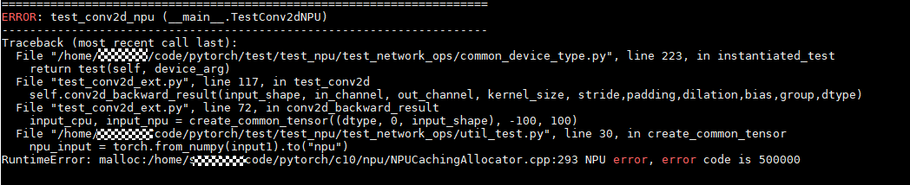

**可能原因**<a name="zh-cn_topic_0175549220_section169499490501"></a>

对于NPUCachingAllocator中malloc类型的错误原因一般为NPU显存不足，所需显存大于npu上可用显存。

**处理方法**<a name="section8970834202112"></a>

在模型调测中，可用通过减小batch size参数来减少NPU显存的分配，解决该问题。

<h4 id="在模型调测时遇到报错-RuntimeError-Could-not-run-aten-trunc-out-with-arguments-from-the-NPUTensorId-backendmd">在模型调测时遇到报错“RuntimeError: Could not run 'aten::trunc.out' with arguments from the 'NPUTensorId' backend.”</h4>

**现象描述**<a name="section1785905019184"></a>

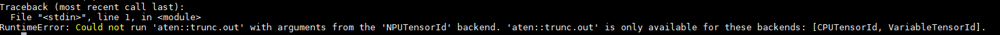

**可能原因**<a name="zh-cn_topic_0175549220_section169499490501"></a>

目前npu设备仅支持pytorch部分算子，对于不支持的算子在使用时均会报上述错误，算子正在不断开发中。算子支持情况可参考[PyTorch原生算子](https://support.huaweicloud.com/opl-pytorch/atlasptol_09_0001.html)，持续更新。

**处理方法**<a name="section8970834202112"></a>

在模型调测中，可通过减小batch size参数，来减少NPU显存的占用，解决该问题。

<h4 id="在模型调测时遇到如MaxPoolGradWithArgmaxV1算子和max算子报错md">在模型调测时遇到如MaxPoolGradWithArgmaxV1算子和max算子报错</h4>

**现象描述**<a name="section1785905019184"></a>

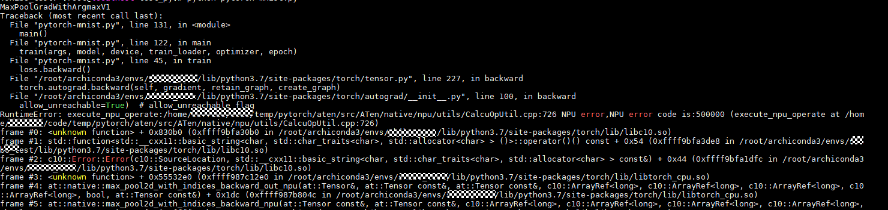


**可能原因**<a name="zh-cn_topic_0175549220_section169499490501"></a>

在模型搭建中，算子输入参数是多样的。某些算子（如MaxPoolGradWithArgmaxV1算子和max算子）在特定参数下，计算报错或者不支持，根据报错信息可以定位到具体算子。

**处理方法**<a name="section8970834202112"></a>

根据报错信息定位到具体算子，解决步骤如下：

1.  排查模型中对该算子的调用方式和参数是否正确；
2.  根据报错算子构建单算子用例，构建报错场景；
3.  一般算子错误无法在python侧解决，构建出报错场景。在论坛中发帖附上报错场景，求助华为工程师即可。

    > **说明：** 
    >输入参数shape和dtype需要重点关注，一般是导致算子报错的主要原因。


前述图中，根据报错信息，定位到是MaxPoolGradWithArgmaxV1算子和max算子报错。MaxPoolGradWithArgmaxV1是在反向计算过程中报错，那么构建测试用例时需要构建对应的反向场景；而对于max算子，是正向计算时报错，构建正向场景即可。

在模型中遇到算子报错，首选是仅构建单算子测试用例，确定报错场景和原因即可；若无法在单算子中构建单算子用例，则需要构建基于上下文的单算子场景, 可以参考[单算子样例编写说明](#单算子样例编写说明md)编写用例。

<h4 id="在调用torch时遇到报错-ModuleNotFoundError-No-module-named-torch-_Cmd">在调用torch时遇到报错“ModuleNotFoundError: No module named 'torch.\_C'”</h4>

**现象描述**<a name="section1785905019184"></a>

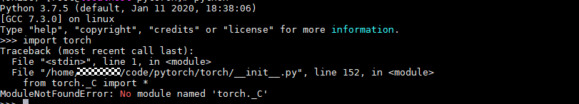

**可能原因**<a name="zh-cn_topic_0175549220_section169499490501"></a>

首先确定报错位置，上述报错路径为.../code/pytorch/torch/\_\_init\_\_.py，而当前运行路径在.../code/pytorch下，在执行import torch时，默认首先在当前目录下查找torch文件夹，因此报错。此处应是调用在系统目录下安装的torch包，而不是当前目录下的torch。

**处理方法**<a name="section8970834202112"></a>

切换到其他目录执行脚本。

<h3 id="其他操作相关问题md">其他操作相关问题</h3>

-   **[cuda流同步操作报错](#cuda流同步操作报错md)**  

-   **[aicpu\_kernels/libpt\_kernels.so不存在](#aicpu_kernels-libpt_kernels-so不存在md)**  

-   **[使用npu-smi info查看显存时发现python进程残留](#使用npu-smi-info查看显存时发现python进程残留md)**  

-   **[动态shape报错“match op inputs failed”](#动态shape报错-match-op-inputs-failedmd)**  

-   **[Op type SigmoidCrossEntropyWithLogitsV2 of ops kernel AIcoreEngine is unsupported](#Op-type-SigmoidCrossEntropyWithLogitsV2-of-ops-kernel-AIcoreEngine-is-unsupportedmd)**  

-   **[Hook失败](#Hook失败md)**  

-   **[加载权重时遇到报错“load state\_dict error.”](#加载权重时遇到报错-load-state_dict-errormd)**  


<h4 id="cuda流同步操作报错md">cuda流同步操作报错</h4>

**现象描述**<a name="section1785905019184"></a>


**可能原因**<a name="zh-cn_topic_0175549220_section169499490501"></a>

npu未使用npu的流同步方法。

**处理方法**<a name="section8970834202112"></a>

使用NPU的流同步方法：

```
stream = torch.npu.current_stream()
stream.synchronize()
```

<h4 id="aicpu_kernels-libpt_kernels-so不存在md">aicpu\_kernels/libpt\_kernels.so不存在</h4>

**现象描述**<a name="section1785905019184"></a>


**可能原因**<a name="zh-cn_topic_0175549220_section169499490501"></a>

未导入AICPU。

**处理方法**<a name="section8970834202112"></a>

导入AICPU（以root用户安装CANN软件包，安装路径为默认路径为例）：

```
export ASCEND_AICPU_PATH=/usr/local/Ascend/ascend-toolkit/latest
```

<h4 id="使用npu-smi-info查看显存时发现python进程残留md">使用npu-smi info查看显存时发现python进程残留</h4>

**现象描述**<a name="section1785905019184"></a>


**可能原因**<a name="zh-cn_topic_0175549220_section169499490501"></a>

python进程残留，需要kill。

**处理方法**<a name="section8970834202112"></a>

终止python进程：

```
pkill -9 python
```

<h4 id="动态shape报错-match-op-inputs-failedmd">动态shape报错“match op inputs failed”</h4>

**现象描述**<a name="section1785905019184"></a>


**可能原因**<a name="zh-cn_topic_0175549220_section169499490501"></a>

PTIndexPut编译的算子和输入的shape不一致， 并有acl\_dynamic\_shape\_op打头的日志字样，确定为动态shape报错。

**处理方法**<a name="section8970834202112"></a>

PTIndexPut对应tensor\[indices\] = value，需要在代码中找到对应的地方将动态shape修改为固定shape。

<h4 id="Op-type-SigmoidCrossEntropyWithLogitsV2-of-ops-kernel-AIcoreEngine-is-unsupportedmd">Op type SigmoidCrossEntropyWithLogitsV2 of ops kernel AIcoreEngine is unsupported</h4>

**现象描述**<a name="section1785905019184"></a>

```
[ERROR] GE(24836,python3.7):2021-01-27-18:27:51.562.111 [../../../../../../graphengine/ge/engine_manager/dnnengine_manager.cc:266]25155 GetDNNEngineName: ErrorNo: 1343242282(assign engine failed) GetDNNEngineName:Op type SigmoidCrossEntropyWithLogitsV2 of ops kernel AIcoreEngine is unsupported, reason:Op SigmoidCrossEntropyWithLogitsV2 not supported reason: The type of this op is not found in op store, check whether the op store has this type of op. Op store name is tbe-custom.
The dtype, format or shape of input in op desc is not supported in op store, check the dtype, format or shape of input between the op store and the graph. Op store name is tbe-builtin.
```

**可能原因**<a name="zh-cn_topic_0175549220_section169499490501"></a>

SigmoidCrossEntropyWithLogitsV2算子输入了不支持的数据类型，可能是输入int64类型导致的错误。

**处理方法**<a name="section8970834202112"></a>

检查对应python代码中输入的数据类型，并修改。

<h4 id="Hook失败md">Hook失败</h4>

**现象描述**<a name="section1785905019184"></a>

```
Traceback (most recent call last):
  File "tools/train.py", line 227, in <module>
    main()
  File "tools/train.py", line 221, in main
    meta=meta)
  File "/root/YoloV3/mmdetection/mmdet/apis/train.py", line 192, in train_detector
    runner.run(data_loaders, cfg.workflow, cfg.total_epochs)
  File "/usr/local/python3.7.5/lib/python3.7/site-packages/mmcv/runner/epoch_based_runner.py", line 166, in run
    epoch_runner(data_loaders[i], **kwargs)
  File "/usr/local/python3.7.5/lib/python3.7/site-packages/mmcv/runner/epoch_based_runner.py", line 50, in train
    self.run_iter(data_batch, train_mode=True)
  File "/usr/local/python3.7.5/lib/python3.7/site-packages/mmcv/runner/epoch_based_runner.py", line 30, in run_iter
    outputs = self.model.train_step(data_batch, self.optimizer, **kwargs)
  File "/usr/local/python3.7.5/lib/python3.7/site-packages/mmcv/parallel/data_parallel.py", line 100, in train_step
    return self.module.train_step(*inputs[0], **kwargs[0])
  File "/root/YoloV3/mmdetection/mmdet/models/detectors/base.py", line 251, in train_step
    losses = self(**data)
  File "/usr/local/python3.7.5/lib/python3.7/site-packages/torch/nn/modules/module.py", line 660, in __call__
    var = next((v for v in var.values() if isinstance(v, torch.Tensor)))
StopIteration
```

**可能原因**<a name="zh-cn_topic_0175549220_section169499490501"></a>

mmdet的loss部分结构触发了pytorch原生hook的bug，导致死循环。

**处理方法**<a name="section8970834202112"></a>

解决方案是在/usr/local/python3.7.5/lib/python3.7/site-packages/torch/nn/modules/module.py这个文件的658行加上try跳过：

```
if len(self._backward_hooks) > 0:
    var = result
    try:
        while not isinstance(var, torch.Tensor):
            if isinstance(var, dict):
                var = next((v for v in var.values() if isinstance(v, torch.Tensor)))
            else:
                var = var[0]
        grad_fn = var.grad_fn
        if grad_fn is not None:
            for hook in self._backward_hooks.values():
                wrapper = functools.partial(hook, self)
                functools.update_wrapper(wrapper, hook)
                grad_fn.register_hook(wrapper)
    except Exception as e:
        print('hook failed..')
        print(str(e))
return result
```

<h4 id="加载权重时遇到报错-load-state_dict-errormd">加载权重时遇到报错“load state\_dict error.”</h4>

**现象描述**<a name="section1785905019184"></a>


**可能原因**<a name="zh-cn_topic_0175549220_section169499490501"></a>

模型训练后保存的state\_dict的key值与加载时state\_dict的key值不一致，保存时会在每个key的最前面多一个module前缀。

**处理方法**<a name="section8970834202112"></a>

加载权重时先遍历state\_dict字典，修改key值，并使用新建的字典，具体用例参考demo.py。

脚本如下：

```
   ckpt = torch.load("checkpoint.pth", map_location=loc)
   # model.load_state_dict(ckpt['state_dict'])
   state_dict_old = ckpt['state_dict']
   state_dict = {}
   for key, value in state_dict_old.items():
       key = key[7:]
       state_dict[key] = value
   model.load_state_dict(state_dict)
```

<h3 id="模型分布式训练常见问题md">模型分布式训练常见问题</h3>

-   **[在进行模型分布式训练时遇到报错“host not found.”](#在进行模型分布式训练时遇到报错-host-not-foundmd)**  

-   **[在进行模型分布式训练时遇到报错“RuntimeError：connect\(\) timed out.”](#在进行模型分布式训练时遇到报错-RuntimeError-connect()-timed-outmd)**  


<h4 id="在进行模型分布式训练时遇到报错-host-not-foundmd">在进行模型分布式训练时遇到报错“host not found.”</h4>

**现象描述**<a name="section1785905019184"></a>


**可能原因**<a name="zh-cn_topic_0175549220_section169499490501"></a>

对模型进行分布式训练时，会调用集合通信模块HCCL，需要根据实际情况设置IP和端口信息。根据报错信息，确定是IP地址设置错误。

**处理方法**<a name="section8970834202112"></a>

在运行脚本中设置正确的IP地址，对于单机情况，设置为本机的IP地址即可；对于多机情况，每个服务器上脚本中的IP需要设置为master节点的IP。

<h4 id="在进行模型分布式训练时遇到报错-RuntimeError-connect()-timed-outmd">在进行模型分布式训练时遇到报错“RuntimeError：connect\(\) timed out.”</h4>

**现象描述**<a name="section1785905019184"></a>


**可能原因**<a name="zh-cn_topic_0175549220_section169499490501"></a>

模型进行分布式训练时，系统防火墙可能会阻截HCCL的集合通信端口的通信。需要根据报错信息，排查通信端口的开放情况，并进行相应设置。

**处理方法**<a name="section8970834202112"></a>

查询出被系统防火墙阻截的集合通信端口，并开放相应端口。

