# PyTorch网络模型移植&训练指南

-   [概述](#概述)
-   [约束与限制](#约束与限制)
-   [迁移流程](#迁移流程)
-   [快速上手](#快速上手)
-   [混合精度说明](#混合精度说明)
-   [模型保存与转换](#模型保存与转换)
-   [参考信息](#参考信息)
-   [FAQ](#FAQ)
    -   [软件安装常见问题](#软件安装常见问题)
    -   [模型和算子运行常见问题](#模型和算子运行常见问题)
    -   [其他操作相关问题](#其他操作相关问题)
    -   [模型分布式训练常见问题](#模型分布式训练常见问题)

## 概述

当前阶段针对PyTorch框架实现的对接适配昇腾AI处理器的方案为在线对接方案。

**方案特性及优点**<a name="section1335113523385"></a>

昇腾AI处理器的加速实现方式是以各种算子为粒度进行调用（OP-based），即通过AscendCL调用一个或几个D亲和算子组合的形式，代替原有GPU的实现方式。其逻辑模型如[图1](#fig2267112413239)所示。

**图 1**  逻辑模型<a name="fig2267112413239"></a>  


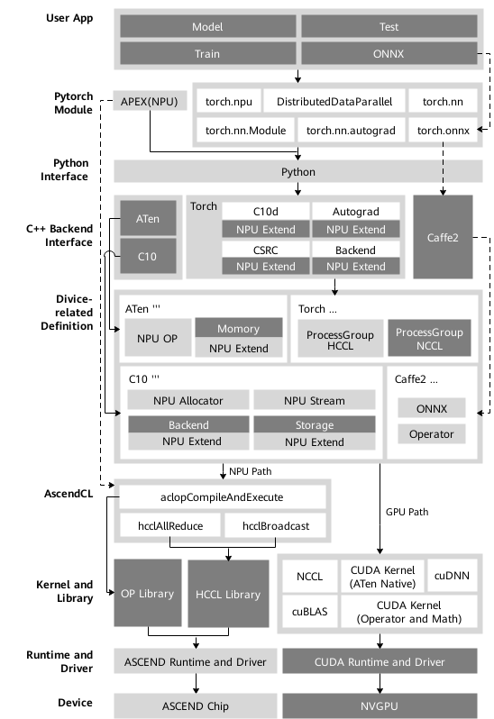

当前选择在线对接适配方案的主要原因有以下几点：

1.  最大限度的继承PyTorch框架动态图的特性。
2.  最大限度的继承GPU在PyTorch上的使用方式，可以使用户在将模型移植到昇腾AI处理器设备进行训练时，在开发方式和代码重用方面做到最小的改动。
3.  最大限度的继承PyTorch原生的体系结构，保留框架本身出色的特性，比如自动微分、动态分发、Debug、Profiling、Storage共享机制以及设备侧的动态内存管理等。
4.  扩展性好。在打通流程的通路之上，对于新增的网络类型或结构，只需涉及相关计算类算子的开发和实现。框架类算子，反向图建立和实现机制等结构可保持复用。
5.  与GPU的使用方式和风格保持一致。用户在使用在线对接方案时，只需在Python侧和Device相关操作中，指定device为昇腾AI处理器，即可完成用昇腾AI处理器在PyTorch对网络的开发、训练以及调试，用户无需进一步关注昇腾AI处理器具体的底层细节。这样可以确保用户的最小化修改，迁移成本较低。

## 约束与限制

-   infershape阶段算子不支持unknowshape的推导。
-   cube计算的算子只支持float16。
-   不支持float16类型的inf/nan数据输入输出 。
-   出现4D以上的format时不能降维。
-   Apex当前版本的实现方式为python实现，不支持APEX中的自定义优化CUDA Kernel。
-   Apex当前版本只支持适配昇腾AI处理器的混合精度计算和多种融合优化器功能，其他功能暂未支持。
-   集合通信约束：
    -   数据并行模式中不同device上执行的图相同。
    -   只支持1/2/4/8P粒度的分配。
    -   只支持int8，int32，float16和float32数据类型。

## 迁移流程

模型迁移主要指将开源社区中实现过的模型迁移到昇腾AI处理器上，主要流程如[图1](#fig759451810422)所示。

**图 1**  迁移流程<a name="fig759451810422"></a>  


**表 1**  迁移流程说明

<a name="table634981613275"></a>

<table><thead align="left"><tr id="row163496162279"><th class="cellrowborder" valign="top" width="28.18%" id="mcps1.2.3.1.1"><p id="p163497165271"><a name="p163497165271"></a><a name="p163497165271"></a>场景</p>
</th>
<th class="cellrowborder" valign="top" width="71.82%" id="mcps1.2.3.1.2"><p id="p12349121682716"><a name="p12349121682716"></a><a name="p12349121682716"></a>说明</p>
</th>
</tr>
</thead>
<tbody><tr id="row17349111602716"><td class="cellrowborder" valign="top" width="28.18%" headers="mcps1.2.3.1.1 "><p id="p1234921620273"><a name="p1234921620273"></a><a name="p1234921620273"></a>模型选取</p>
</td>
<td class="cellrowborder" valign="top" width="71.82%" headers="mcps1.2.3.1.2 "><p id="p1338111557277"><a name="p1338111557277"></a><a name="p1338111557277"></a>选取需要迁移的模型。</p>
</td>
</tr>
<tr id="row53492016112717"><td class="cellrowborder" valign="top" width="28.18%" headers="mcps1.2.3.1.1 "><p id="p133501716132719"><a name="p133501716132719"></a><a name="p133501716132719"></a>模型移植评估</p>
</td>
<td class="cellrowborder" valign="top" width="71.82%" headers="mcps1.2.3.1.2 "><p id="p113504168278"><a name="p113504168278"></a><a name="p113504168278"></a>详情请参见<a href="#模型移植评估md">模型移植评估</a>。</p>
</td>
</tr>
<tr id="row9883113014287"><td class="cellrowborder" valign="top" width="28.18%" headers="mcps1.2.3.1.1 "><p id="p8883203017280"><a name="p8883203017280"></a><a name="p8883203017280"></a>算子开发</p>
</td>
    <td class="cellrowborder" valign="top" width="71.82%" headers="mcps1.2.3.1.2 "><p id="p158831830192814"><a name="p158831830192814"></a><a name="p158831830192814"></a>详情请参见<span id="ph144957513112"><a name="ph144957513112"></a><a name="ph144957513112"></a><span id="ph45906272222"><a name="ph45906272222"></a><a name="ph45906272222"></a><a href="https://gitee.com/ascend/pytorch/blob/v1.8.1-3.0.rc3/docs/zh/PyTorch%E7%AE%97%E5%AD%90%E5%BC%80%E5%8F%91%E6%8C%87%E5%8D%97/PyTorch%E7%AE%97%E5%AD%90%E5%BC%80%E5%8F%91%E6%8C%87%E5%8D%97.md">《PyTorch算子开发指南》</a></span></span>。</p>
</td>
</tr>
<tr id="row2056653212812"><td class="cellrowborder" valign="top" width="28.18%" headers="mcps1.2.3.1.1 "><p id="p1656743213814"><a name="p1656743213814"></a><a name="p1656743213814"></a>环境准备</p>
</td>
<td class="cellrowborder" valign="top" width="71.82%" headers="mcps1.2.3.1.2 "><p id="p1156712323811"><a name="p1156712323811"></a><a name="p1156712323811"></a>详情请参见<a href="#环境准备md">环境准备</a>。</p>
</td>
</tr>
<tr id="row43031317489"><td class="cellrowborder" valign="top" width="28.18%" headers="mcps1.2.3.1.1 "><p id="p14304131711817"><a name="p14304131711817"></a><a name="p14304131711817"></a>模型迁移</p>
</td>
<td class="cellrowborder" valign="top" width="71.82%" headers="mcps1.2.3.1.2 "><p id="p53043171687"><a name="p53043171687"></a><a name="p53043171687"></a>详情请参见<a href="#模型迁移md">模型迁移</a>。</p>
</td>
</tr>
<tr id="row10695931399"><td class="cellrowborder" valign="top" width="28.18%" headers="mcps1.2.3.1.1 "><p id="p186956311094"><a name="p186956311094"></a><a name="p186956311094"></a>模型训练</p>
</td>
<td class="cellrowborder" valign="top" width="71.82%" headers="mcps1.2.3.1.2 "><p id="p10696123117914"><a name="p10696123117914"></a><a name="p10696123117914"></a>详情请参见<a href="#模型训练">模型训练</a>。</p>
</td>
</tr>
<tr id="row1658912015291"><td class="cellrowborder" valign="top" width="28.18%" headers="mcps1.2.3.1.1 "><p id="p195901920192910"><a name="p195901920192910"></a><a name="p195901920192910"></a>错误分析</p>
</td>
<td class="cellrowborder" valign="top" width="71.82%" headers="mcps1.2.3.1.2 "><p id="p95904208295"><a name="p95904208295"></a><a name="p95904208295"></a>详情请参见<span id="ph7924185091616"><a name="ph7924185091616"></a><a name="ph7924185091616"></a><a href="https://www.hiascend.com/document/detail/zh/canncommercial/51RC2/troublemanagement/logreference/logreference_0001.html">日志参考</a>中“日志操作”章节设置日志级别</span>和<span id="ph1572317171516"><a name="ph1572317171516"></a><a name="ph1572317171516"></a><a href="https://www.hiascend.com/document/detail/zh/canncommercial/51RC2/devtools/auxiliarydevtool/atlasaicoreerr_16_0003.html">开发工具</a></span>中“AI Core Error分析工具”章节。</p>
</td>
</tr>
<tr id="row13191151664310"><td class="cellrowborder" valign="top" width="28.18%" headers="mcps1.2.3.1.1 "><p id="p219216162433"><a name="p219216162433"></a><a name="p219216162433"></a>性能调优和分析</p>
</td>
<td class="cellrowborder" valign="top" width="71.82%" headers="mcps1.2.3.1.2 "><p id="p11192181615434"><a name="p11192181615434"></a><a name="p11192181615434"></a>详情请参见<a href="https://www.hiascend.com/document/detail/zh/canncommercial/51RC2/troublemanagement/logreference/logreference_0001.html">《PyTorch训练调优&工具使用指南》</a></a>。</p>
</td>
</tr>
<tr id="row94308194435"><td class="cellrowborder" valign="top" width="28.18%" headers="mcps1.2.3.1.1 "><p id="p74301019144319"><a name="p74301019144319"></a><a name="p74301019144319"></a>精度调测</p>
</td>
<td class="cellrowborder" valign="top" width="71.82%" headers="mcps1.2.3.1.2 "><p id="p24301119174313"><a name="p24301119174313"></a><a name="p24301119174313"></a>详情请参见<a href="https://gitee.com/ascend/pytorch/tree/v1.8.1-3.0.rc3/docs/zh/PyTorch%E7%B2%BE%E5%BA%A6%E6%AF%94%E5%AF%B9%E5%B7%A5%E5%85%B7%E4%BD%BF%E7%94%A8%E6%8C%87%E5%8D%97">《PyTorch精度比对工具使用指南》</a></a>。</p>
</td>
</tr>
<tr id="row7630202112430"><td class="cellrowborder" valign="top" width="28.18%" headers="mcps1.2.3.1.1 "><p id="p1263012210438"><a name="p1263012210438"></a><a name="p1263012210438"></a>模型保存与转换</p>
</td>
<td class="cellrowborder" valign="top" width="71.82%" headers="mcps1.2.3.1.2 "><p id="p12631521104319"><a name="p12631521104319"></a><a name="p12631521104319"></a>详情请参见<a href="#模型保存与转换">模型保存与转换</a>和<span id="ph98735134233"><a name="ph98735134233"></a><a name="ph98735134233"></a><a href="https://www.hiascend.com/document/detail/zh/canncommercial/51RC2/inferapplicationdev/atctool/atctool_0001.htmll">推理应用开发</a></span>中“ATC模型转换”章节。</p>
</td>
</tr>
<tr id="row196272410438"><td class="cellrowborder" valign="top" width="28.18%" headers="mcps1.2.3.1.1 "><p id="p176218241431"><a name="p176218241431"></a><a name="p176218241431"></a>应用软件开发</p>
</td>
<td class="cellrowborder" valign="top" width="71.82%" headers="mcps1.2.3.1.2 "><p id="p1962142434317"><a name="p1962142434317"></a><a name="p1962142434317"></a>详情请参见<span id="ph1062525151815"><a name="ph1062525151815"></a><a name="ph1062525151815"></a><a href="https://www.hiascend.com/document/detail/zh/canncommercial/51RC2/inferapplicationdev/atctool/atctool_0001.htmll">推理应用开发</a></span>中”应用开发（c++）“章节。</p>
</td>
</tr>
<tr id="row17586759102515"><td class="cellrowborder" valign="top" width="28.18%" headers="mcps1.2.3.1.1 "><p id="p6586155952510"><a name="p6586155952510"></a><a name="p6586155952510"></a>FAQ</p>
</td>
<td class="cellrowborder" valign="top" width="71.82%" headers="mcps1.2.3.1.2 "><p id="p105871359192515"><a name="p105871359192515"></a><a name="p105871359192515"></a>主要涉及环境准备、模型迁移、模型调测和其他常见问题的解决方法。详情请参见<a href="#FAQ">FAQ</a>。</p>
</td>
</tr>
</tbody>
</table>


## 快速上手

### 简介

对ResNet50模型进行迁移，帮助用户快速了解迁移过程。

### 模型选取

在选取模型时，尽可能选取权威Pytorch模型实现仓作为标杆，包括但不限于Pytorch\([example](https://github.com/pytorch/examples/tree/master/imagenet)/[vision](https://github.com/pytorch/vision)等\)、facebookresearch\([Detectron](https://github.com/facebookresearch/Detectron)/[detectron2](https://github.com/facebookresearch/detectron2)等\)和open-mmlab\([mmdetection](https://github.com/open-mmlab/mmdetection)/[mmpose](https://github.com/open-mmlab/mmpose)等\)。

本样例基于PyTorch官网提供的Imagenet数据集训练模型[main.py](https://github.com/pytorch/examples/tree/master/imagenet/main.py)脚本进行适配昇腾910 AI处理器的迁移。

### 模型移植评估<a name="模型移植评估md"></a>

模型是否可以迁移成功主要取决于模型算子是否支持昇腾AI处理器。故需要对模型算子对昇腾AI处理器的支持性进行评估，一般有两种方式评估算子支持性

- 模型迁移前，使用dump op方法获取算子信息，与[《PyTorch API 支持清单》](https://gitee.com/ascend/pytorch/blob/v1.8.1-3.0.rc3/docs/zh/PyTorch%20API%E6%94%AF%E6%8C%81%E6%B8%85%E5%8D%95.md)中自定义算子进行比较，确定是否支持。

  查看算子适配情况。将原始模型及训练脚本迁移到昇腾AI处理器上之前，可以将原始模型及训练脚本在CPU上进行训练，使用dump op方法获取当前模型算子列表并在[《PyTorch API 支持清单》](https://gitee.com/ascend/pytorch/blob/v1.8.1-3.0.rc3/docs/zh/PyTorch%20API%E6%94%AF%E6%8C%81%E6%B8%85%E5%8D%95.md)中查找该算子查看是否支持。dump op方法参见<a href="#dump-op方法">dump op方法</a>，

- 模型迁移后，在昇腾设备上进行运行训练脚本，若存在不支持昇腾AI设备的算子，会提示报错信息。

  当有不支持算子时参见[《PyTorch算子开发指南》](https://gitee.com/ascend/pytorch/blob/v1.8.1-3.0.rc3/docs/zh/PyTorch%E7%AE%97%E5%AD%90%E5%BC%80%E5%8F%91%E6%8C%87%E5%8D%97/PyTorch%E7%AE%97%E5%AD%90%E5%BC%80%E5%8F%91%E6%8C%87%E5%8D%97.md)进行算子开发。

若存在不支持算子，可以采用修改模型用等价支持的算子替换或者参考[《PyTorch算子开发指南》](https://gitee.com/ascend/pytorch/blob/v1.8.1-3.0.rc3/docs/zh/PyTorch%E7%AE%97%E5%AD%90%E5%BC%80%E5%8F%91%E6%8C%87%E5%8D%97/PyTorch%E7%AE%97%E5%AD%90%E5%BC%80%E5%8F%91%E6%8C%87%E5%8D%97.md)进行算子开发。

### 环境准备<a name="环境准备md"></a>

请参见[《PyTorch安装指南》](https://gitee.com/ascend/pytorch/blob/v1.8.1-3.0.rc3/docs/zh/PyTorch%E5%AE%89%E8%A3%85%E6%8C%87%E5%8D%97/PyTorch%E5%AE%89%E8%A3%85%E6%8C%87%E5%8D%97.md) 进行CANN软件安装、PyTorch框架及混合精度模块安装，并配置环境变量。

参考PyTorch [examples](https://github.com/pytorch/examples/tree/master/imagenet) 准备模型运行所需要的Python环境及依赖。

### 硬件支持

aarch64架构推荐使用：Atlas800-9000+kunpeng920+Ascend910+NVMe 3.2T+750GRAM

X86_64架构推荐使用：Atlas800-9010+Intel Platinum8260+Ascend910+NVMe 3.2T+750GRAM

### 模型迁移<a name="模型迁移md"></a>

#### 工具迁移

Ascend平台提供了脚本转换工具使用户能通过命令行方式将训练脚本迁移到昇腾AI处理器上进行训练，命令行方式工具详细使用说明参见下文。除命令行方式外，用户也可通过MindStudio中集成的PyTorch GPU2Ascend功能进行迁移，详情请参见[《MindStudio 用户指南》](https://www.hiascend.com/document/detail/zh/mindstudio/304/msug)。

##### 功能介绍

**简介**<a name="zh-cn_topic_0000001133095885_section20874690446"></a>

昇腾NPU是AI算力的后起之秀，但目前训练和在线推理脚本大多是基于GPU的。由于NPU与GPU的架构差异，基于GPU的训练和在线推理脚本不能直接在NPU上使用，脚本转换工具提供了将基于GPU的脚本转换为基于NPU的脚本的自动化方法，节省了人工手动进行脚本迁移的学习成本与工作量，大幅提升了迁移效率。

> **说明：** 
>
>-   脚本转换工具根据适配规则，对用户脚本给出修改建议并提供转换功能，大幅度提高了脚本迁移速度，降低了开发者的工作量。
>-   此脚本转换工具当前仅支持PyTorch训练脚本转换。

**模型支持**

目前支持模型请参考[《昇腾Modelzoo社区》](https://www.hiascend.com/software/modelzoo) ，筛选类型分类：“训练”、框架分类：“Pytorch”的Pytorch训练模型。

**系统要求**<a name="zh-cn_topic_0000001133095885_section1055723118446"></a>

脚本转换工具支持Ubuntu 18.04、CentOS 7.6或EulerOS 2.8。

**环境准备**<a name="zh-cn_topic_0000001133095885_section14907199142615"></a>

详情请参考[《CANN 软件安装指南》](https://www.hiascend.com/document/detail/zh/canncommercial/51RC2/envdeployment/instg) 安装开发环境。

##### 操作指南

**参数说明**<a name="zh-cn_topic_0000001086713630_section21951346163910"></a>

**表 1**  参数说明

<a name="zh-cn_topic_0000001086713630_table1581171912407"></a>

<table><thead align="left"><tr id="zh-cn_topic_0000001086713630_row175811919124014"><th class="cellrowborder" valign="top" width="22.35%" id="mcps1.2.4.1.1"><p id="zh-cn_topic_0000001086713630_p155823194404"><a name="zh-cn_topic_0000001086713630_p155823194404"></a><a name="zh-cn_topic_0000001086713630_p155823194404"></a>参数</p>
</th>
<th class="cellrowborder" valign="top" width="54.75%" id="mcps1.2.4.1.2"><p id="zh-cn_topic_0000001086713630_p105820192400"><a name="zh-cn_topic_0000001086713630_p105820192400"></a><a name="zh-cn_topic_0000001086713630_p105820192400"></a>参数说明</p>
</th>
<th class="cellrowborder" valign="top" width="22.900000000000002%" id="mcps1.2.4.1.3"><p id="zh-cn_topic_0000001086713630_p6580427104516"><a name="zh-cn_topic_0000001086713630_p6580427104516"></a><a name="zh-cn_topic_0000001086713630_p6580427104516"></a>取值示例</p>
</th>
</tr>
</thead>
<tbody><tr id="zh-cn_topic_0000001086713630_row1582131914407"><td class="cellrowborder" valign="top" width="22.35%" headers="mcps1.2.4.1.1 "><p id="zh-cn_topic_0000001086713630_p19582151918409"><a name="zh-cn_topic_0000001086713630_p19582151918409"></a><a name="zh-cn_topic_0000001086713630_p19582151918409"></a>-i</p>
<p id="zh-cn_topic_0000001086713630_p2473202124113"><a name="zh-cn_topic_0000001086713630_p2473202124113"></a><a name="zh-cn_topic_0000001086713630_p2473202124113"></a>--input</p>
</td>
<td class="cellrowborder" valign="top" width="54.75%" headers="mcps1.2.4.1.2 "><a name="zh-cn_topic_0000001086713630_ul1242295411339"></a><a name="zh-cn_topic_0000001086713630_ul1242295411339"></a><ul id="zh-cn_topic_0000001086713630_ul1242295411339"><li>要进行转换的原始脚本文件所在文件夹路径或文件路径。</li><li>必选。</li></ul>
</td>
<td class="cellrowborder" valign="top" width="22.900000000000002%" headers="mcps1.2.4.1.3 "><a name="zh-cn_topic_0000001086713630_ul1643544143415"></a><a name="zh-cn_topic_0000001086713630_ul1643544143415"></a><ul id="zh-cn_topic_0000001086713630_ul1643544143415"><li>/home/username/fmktransplt</li><li>/home/username/fmktransplt.py</li></ul>
</td>
</tr>
<tr id="zh-cn_topic_0000001086713630_row1742052304118"><td class="cellrowborder" valign="top" width="22.35%" headers="mcps1.2.4.1.1 "><p id="zh-cn_topic_0000001086713630_p442092316415"><a name="zh-cn_topic_0000001086713630_p442092316415"></a><a name="zh-cn_topic_0000001086713630_p442092316415"></a>-o</p>
<p id="zh-cn_topic_0000001086713630_p16543329134117"><a name="zh-cn_topic_0000001086713630_p16543329134117"></a><a name="zh-cn_topic_0000001086713630_p16543329134117"></a>--output</p>
</td>
<td class="cellrowborder" valign="top" width="54.75%" headers="mcps1.2.4.1.2 "><a name="zh-cn_topic_0000001086713630_ul1363116594714"></a><a name="zh-cn_topic_0000001086713630_ul1363116594714"></a><ul id="zh-cn_topic_0000001086713630_ul1363116594714"><li>脚本转换结果文件输出路径。会在该路径下输出带有msft后缀的文件夹。</li><li>必选。</li></ul>
</td>
<td class="cellrowborder" valign="top" width="22.900000000000002%" headers="mcps1.2.4.1.3 "><p id="zh-cn_topic_0000001086713630_p2478319143616"><a name="zh-cn_topic_0000001086713630_p2478319143616"></a><a name="zh-cn_topic_0000001086713630_p2478319143616"></a>/home/username/fmktransplt_output</p>
</td>
</tr>
<tr id="zh-cn_topic_0000001086713630_row5405851153019"><td class="cellrowborder" valign="top" width="22.35%" headers="mcps1.2.4.1.1 "><p id="zh-cn_topic_0000001086713630_p164051151163010"><a name="zh-cn_topic_0000001086713630_p164051151163010"></a><a name="zh-cn_topic_0000001086713630_p164051151163010"></a>-r</p>
<p id="zh-cn_topic_0000001086713630_p11383956183014"><a name="zh-cn_topic_0000001086713630_p11383956183014"></a><a name="zh-cn_topic_0000001086713630_p11383956183014"></a>--rule</p>
</td>
<td class="cellrowborder" valign="top" width="54.75%" headers="mcps1.2.4.1.2 "><a name="zh-cn_topic_0000001086713630_ul4776121015816"></a><a name="zh-cn_topic_0000001086713630_ul4776121015816"></a><ul id="zh-cn_topic_0000001086713630_ul4776121015816"><li>用户自定义通用转换规则的json文件路径，主要分为：函数参数修改、函数名称修改和模块名称修改三部分。</li><li>可选。</li></ul>
</td>
<td class="cellrowborder" valign="top" width="22.900000000000002%" headers="mcps1.2.4.1.3 "><p id="zh-cn_topic_0000001086713630_p6273113412368"><a name="zh-cn_topic_0000001086713630_p6273113412368"></a><a name="zh-cn_topic_0000001086713630_p6273113412368"></a>/home/username/fmktransplt_rule.json</p>
</td>
</tr>
<tr id="zh-cn_topic_0000001086713630_row1355087145112"><td class="cellrowborder" valign="top" width="22.35%" headers="mcps1.2.4.1.1 "><p id="zh-cn_topic_0000001086713630_p1801752706"><a name="zh-cn_topic_0000001086713630_p1801752706"></a><a name="zh-cn_topic_0000001086713630_p1801752706"></a>-s</p>
<p id="zh-cn_topic_0000001086713630_p011914159516"><a name="zh-cn_topic_0000001086713630_p011914159516"></a><a name="zh-cn_topic_0000001086713630_p011914159516"></a>--specify-device</p>
</td>
<td class="cellrowborder" valign="top" width="54.75%" headers="mcps1.2.4.1.2 "><a name="zh-cn_topic_0000001086713630_ul186822151820"></a><a name="zh-cn_topic_0000001086713630_ul186822151820"></a><ul id="zh-cn_topic_0000001086713630_ul186822151820"><li>可以通过环境变量设置指定device作为高级特性，但有可能导致原本脚本中分布式功能失效。</li><li>可选。</li></ul>
</td>
<td class="cellrowborder" valign="top" width="22.900000000000002%" headers="mcps1.2.4.1.3 "><p id="zh-cn_topic_0000001086713630_p185502785114"><a name="zh-cn_topic_0000001086713630_p185502785114"></a><a name="zh-cn_topic_0000001086713630_p185502785114"></a>-</p>
</td>
</tr>
<tr id="zh-cn_topic_0000001086713630_row1914883514326"><td class="cellrowborder" valign="top" width="22.35%" headers="mcps1.2.4.1.1 "><p id="zh-cn_topic_0000001086713630_p51490353324"><a name="zh-cn_topic_0000001086713630_p51490353324"></a><a name="zh-cn_topic_0000001086713630_p51490353324"></a>-sim</p>
<p id="zh-cn_topic_0000001086713630_p5549113123714"><a name="zh-cn_topic_0000001086713630_p5549113123714"></a><a name="zh-cn_topic_0000001086713630_p5549113123714"></a>--similar</p>
</td>
<td class="cellrowborder" valign="top" width="54.75%" headers="mcps1.2.4.1.2 "><a name="zh-cn_topic_0000001086713630_ul856518554400"></a><a name="zh-cn_topic_0000001086713630_ul856518554400"></a><ul id="zh-cn_topic_0000001086713630_ul856518554400"><li>用功能相似的API替换某些不支持的API，但有可能导致准确性和性能下降。</li><li>可选。</li></ul>
</td>
<td class="cellrowborder" valign="top" width="22.900000000000002%" headers="mcps1.2.4.1.3 "><p id="zh-cn_topic_0000001086713630_p13149193573212"><a name="zh-cn_topic_0000001086713630_p13149193573212"></a><a name="zh-cn_topic_0000001086713630_p13149193573212"></a>-</p>
</td>
</tr>
<tr id="zh-cn_topic_0000001086713630_row311811519515"><td class="cellrowborder" valign="top" width="22.35%" headers="mcps1.2.4.1.1 "><p id="zh-cn_topic_0000001086713630_p1755018717511"><a name="zh-cn_topic_0000001086713630_p1755018717511"></a><a name="zh-cn_topic_0000001086713630_p1755018717511"></a>distributed</p>
</td>
<td class="cellrowborder" valign="top" width="54.75%" headers="mcps1.2.4.1.2 "><p id="zh-cn_topic_0000001086713630_p27033264208"><a name="zh-cn_topic_0000001086713630_p27033264208"></a><a name="zh-cn_topic_0000001086713630_p27033264208"></a>将GPU单卡脚本转换为NPU多卡脚本，仅支持使用torch.utils.data.DataLoader方式加载数据的场景，指定此参数时，才可以指定以下两个参数。</p>
<a name="zh-cn_topic_0000001086713630_ul94321522131015"></a><a name="zh-cn_topic_0000001086713630_ul94321522131015"></a><ul id="zh-cn_topic_0000001086713630_ul94321522131015"><li>-m，--main：训练脚本的入口python文件，必选。</li><li>-t，--target model：目标模型变量名，默认为'model'，可选。</li></ul>
</td>
<td class="cellrowborder" valign="top" width="22.900000000000002%" headers="mcps1.2.4.1.3 "><p id="zh-cn_topic_0000001086713630_p011961519515"><a name="zh-cn_topic_0000001086713630_p011961519515"></a><a name="zh-cn_topic_0000001086713630_p011961519515"></a>-</p>
</td>
</tr>
<tr id="zh-cn_topic_0000001086713630_row1736213644115"><td class="cellrowborder" valign="top" width="22.35%" headers="mcps1.2.4.1.1 "><p id="zh-cn_topic_0000001086713630_p1036312363411"><a name="zh-cn_topic_0000001086713630_p1036312363411"></a><a name="zh-cn_topic_0000001086713630_p1036312363411"></a>-h</p>
<p id="zh-cn_topic_0000001086713630_p176714017418"><a name="zh-cn_topic_0000001086713630_p176714017418"></a><a name="zh-cn_topic_0000001086713630_p176714017418"></a>--help</p>
</td>
<td class="cellrowborder" valign="top" width="54.75%" headers="mcps1.2.4.1.2 "><p id="zh-cn_topic_0000001086713630_p1373193411818"><a name="zh-cn_topic_0000001086713630_p1373193411818"></a><a name="zh-cn_topic_0000001086713630_p1373193411818"></a>显示帮助信息。</p>
</td>
<td class="cellrowborder" valign="top" width="22.900000000000002%" headers="mcps1.2.4.1.3 "><p id="zh-cn_topic_0000001086713630_p358017279458"><a name="zh-cn_topic_0000001086713630_p358017279458"></a><a name="zh-cn_topic_0000001086713630_p358017279458"></a>-</p>
</td>
</tr>
</tbody>
</table>

**自定义规则文件** <a name="zh-cn_topic_0000001086713630_section1879318256392"></a>

自定义转换规则样例如下：

```
{
    "rules": {
        "ArgsModifyRule": [
            {
                "func_name": "name1",
                "arg_idx": 0,
                "arg_new": "agrs0"
            },
            {
                "func_name": "name2",
                "arg_idx": 0,
                "arg_new": "agrs0"
            }
        ],
        "FuncNameModifyRule": [
            {
                "old_name": "func",
                "new_name": "new_func"
            }
        ],
        "ModuleNameModifyRule": [
            {
                "old_name": "module",
                "new_name": "new_module",
                "parent_module":"parent_module"
            }
        ]
    }
}
```

**表 2**  参数说明

<a name="zh-cn_topic_0000001086713630_table1623617321279"></a>

<table><thead align="left"><tr id="zh-cn_topic_0000001086713630_row20236153212276"><th class="cellrowborder" valign="top" width="30%" id="mcps1.2.3.1.1"><p id="zh-cn_topic_0000001086713630_p13236113220275"><a name="zh-cn_topic_0000001086713630_p13236113220275"></a><a name="zh-cn_topic_0000001086713630_p13236113220275"></a>参数</p>
</th>
<th class="cellrowborder" valign="top" width="70%" id="mcps1.2.3.1.2"><p id="zh-cn_topic_0000001086713630_p22366325276"><a name="zh-cn_topic_0000001086713630_p22366325276"></a><a name="zh-cn_topic_0000001086713630_p22366325276"></a>说明</p>
</th>
</tr>
</thead>
<tbody><tr id="zh-cn_topic_0000001086713630_row192361632122710"><td class="cellrowborder" valign="top" width="30%" headers="mcps1.2.3.1.1 "><p id="zh-cn_topic_0000001086713630_p8236163222717"><a name="zh-cn_topic_0000001086713630_p8236163222717"></a><a name="zh-cn_topic_0000001086713630_p8236163222717"></a>ArgsModifyRule</p>
</td>
<td class="cellrowborder" valign="top" width="70%" headers="mcps1.2.3.1.2 "><p id="zh-cn_topic_0000001086713630_p62361632152712"><a name="zh-cn_topic_0000001086713630_p62361632152712"></a><a name="zh-cn_topic_0000001086713630_p62361632152712"></a>函数参数修改</p>
</td>
</tr>
<tr id="zh-cn_topic_0000001086713630_row923683292713"><td class="cellrowborder" valign="top" width="30%" headers="mcps1.2.3.1.1 "><p id="zh-cn_topic_0000001086713630_p923633219273"><a name="zh-cn_topic_0000001086713630_p923633219273"></a><a name="zh-cn_topic_0000001086713630_p923633219273"></a>func_name</p>
</td>
<td class="cellrowborder" valign="top" width="70%" headers="mcps1.2.3.1.2 "><p id="zh-cn_topic_0000001086713630_p4236113252712"><a name="zh-cn_topic_0000001086713630_p4236113252712"></a><a name="zh-cn_topic_0000001086713630_p4236113252712"></a>函数名称</p>
</td>
</tr>
<tr id="zh-cn_topic_0000001086713630_row9236123219278"><td class="cellrowborder" valign="top" width="30%" headers="mcps1.2.3.1.1 "><p id="zh-cn_topic_0000001086713630_p11236183218277"><a name="zh-cn_topic_0000001086713630_p11236183218277"></a><a name="zh-cn_topic_0000001086713630_p11236183218277"></a>arg_idx</p>
</td>
<td class="cellrowborder" valign="top" width="70%" headers="mcps1.2.3.1.2 "><p id="zh-cn_topic_0000001086713630_p723643215279"><a name="zh-cn_topic_0000001086713630_p723643215279"></a><a name="zh-cn_topic_0000001086713630_p723643215279"></a>参数的位置</p>
</td>
</tr>
<tr id="zh-cn_topic_0000001086713630_row16236153222714"><td class="cellrowborder" valign="top" width="30%" headers="mcps1.2.3.1.1 "><p id="zh-cn_topic_0000001086713630_p923615322278"><a name="zh-cn_topic_0000001086713630_p923615322278"></a><a name="zh-cn_topic_0000001086713630_p923615322278"></a>arg_new</p>
</td>
<td class="cellrowborder" valign="top" width="70%" headers="mcps1.2.3.1.2 "><p id="zh-cn_topic_0000001086713630_p1923663214271"><a name="zh-cn_topic_0000001086713630_p1923663214271"></a><a name="zh-cn_topic_0000001086713630_p1923663214271"></a>新的参数</p>
</td>
</tr>
<tr id="zh-cn_topic_0000001086713630_row32361732192719"><td class="cellrowborder" valign="top" width="30%" headers="mcps1.2.3.1.1 "><p id="zh-cn_topic_0000001086713630_p17236432122717"><a name="zh-cn_topic_0000001086713630_p17236432122717"></a><a name="zh-cn_topic_0000001086713630_p17236432122717"></a>FuncNameModifyRule</p>
</td>
<td class="cellrowborder" valign="top" width="70%" headers="mcps1.2.3.1.2 "><p id="zh-cn_topic_0000001086713630_p11236173212716"><a name="zh-cn_topic_0000001086713630_p11236173212716"></a><a name="zh-cn_topic_0000001086713630_p11236173212716"></a>函数名称修改</p>
</td>
</tr>
<tr id="zh-cn_topic_0000001086713630_row19236332172716"><td class="cellrowborder" valign="top" width="30%" headers="mcps1.2.3.1.1 "><p id="zh-cn_topic_0000001086713630_p123693212273"><a name="zh-cn_topic_0000001086713630_p123693212273"></a><a name="zh-cn_topic_0000001086713630_p123693212273"></a>ModuleNameModifyRule</p>
</td>
<td class="cellrowborder" valign="top" width="70%" headers="mcps1.2.3.1.2 "><p id="zh-cn_topic_0000001086713630_p823623217276"><a name="zh-cn_topic_0000001086713630_p823623217276"></a><a name="zh-cn_topic_0000001086713630_p823623217276"></a>模块名称修改</p>
</td>
</tr>
<tr id="zh-cn_topic_0000001086713630_row293132093217"><td class="cellrowborder" valign="top" width="30%" headers="mcps1.2.3.1.1 "><p id="zh-cn_topic_0000001086713630_p79311320153212"><a name="zh-cn_topic_0000001086713630_p79311320153212"></a><a name="zh-cn_topic_0000001086713630_p79311320153212"></a>old_name</p>
</td>
<td class="cellrowborder" valign="top" width="70%" headers="mcps1.2.3.1.2 "><p id="zh-cn_topic_0000001086713630_p79321420103212"><a name="zh-cn_topic_0000001086713630_p79321420103212"></a><a name="zh-cn_topic_0000001086713630_p79321420103212"></a>旧名称</p>
</td>
</tr>
<tr id="zh-cn_topic_0000001086713630_row0742203193210"><td class="cellrowborder" valign="top" width="30%" headers="mcps1.2.3.1.1 "><p id="zh-cn_topic_0000001086713630_p974353111329"><a name="zh-cn_topic_0000001086713630_p974353111329"></a><a name="zh-cn_topic_0000001086713630_p974353111329"></a>new_name</p>
</td>
<td class="cellrowborder" valign="top" width="70%" headers="mcps1.2.3.1.2 "><p id="zh-cn_topic_0000001086713630_p87431931133212"><a name="zh-cn_topic_0000001086713630_p87431931133212"></a><a name="zh-cn_topic_0000001086713630_p87431931133212"></a>新名称</p>
</td>
</tr>
<tr id="zh-cn_topic_0000001086713630_row4677165715235"><td class="cellrowborder" valign="top" width="30%" headers="mcps1.2.3.1.1 "><p id="zh-cn_topic_0000001086713630_p2434071544"><a name="zh-cn_topic_0000001086713630_p2434071544"></a><a name="zh-cn_topic_0000001086713630_p2434071544"></a>parent_module</p>
</td>
<td class="cellrowborder" valign="top" width="70%" headers="mcps1.2.3.1.2 "><p id="zh-cn_topic_0000001086713630_p571992311016"><a name="zh-cn_topic_0000001086713630_p571992311016"></a><a name="zh-cn_topic_0000001086713630_p571992311016"></a>父级模块全名</p>
<p id="zh-cn_topic_0000001086713630_p1065614314599"><a name="zh-cn_topic_0000001086713630_p1065614314599"></a><a name="zh-cn_topic_0000001086713630_p1065614314599"></a>例如torch.cuda.amp，amp的父级模块全名为torch.cuda。</p>
</td>
</tr>
</tbody>
</table>


**执行转换**<a name="zh-cn_topic_0000001086713630_section163061458103913"></a>

1. 进入脚本转换工具所在路径。

   ```
   cd Ascend-cann-toolkit安装目录/ascend-toolkit/{version}/tools/ms_fmk_transplt
   ```

2. 执行脚本转换工具。

   ```
   python3 ms_fmk_transplt.py -i 原始脚本路径 -o 脚本转换结果输出路径 [-r 自定义规则json文件路径] [-s] [-sim] [distributed -m 训练脚本的入口文件 -t 目标模型变量名]
   ```

   > **说明：** 
   >distributed及其参数-m、-t在语句最后指定。

3. 完成脚本转换。

##### 结果解析

脚本转换完成后，进入脚本转换结果输出路径查看结果文件，以GPU单卡脚本转换为NPU多卡脚本为例。

```
├── xxx_msft                // 脚本转换结果输出目录，默认为原始脚本路径。xxx为原始脚本所在文件夹名称。
│   ├── 生成脚本文件                 // 与转换前的脚本文件目录结构一致。
│   ├── msFmkTranspltlog.txt                 // 脚本转换过程日志文件。
│   ├── unsupported_op.xlsx                // 不支持算子列表文件。
│   ├── change_list.csv                    // 修改记录文件。
│   ├── run_distributed_npu.sh            // 多卡启动shell脚本。
```

#### 手工迁移

在main.py训练脚本的基础上进行修改，实现模型的单卡训练和单机多卡训练迁移。

##### 单卡训练迁移<a name="单卡训练"></a>

1. 在main.py脚本中导入torch_npu模块。

   ```python
   import torch
   import torch_npu
   ```

2. 在main.py中定义训练设备。

   ```python
   CALCULATE_DEVICE = "npu:0"
   ```

3. 修改参数以及判断选项，使其只在昇腾910 AI处理器上进行训练。

   代码位置：main.py文件中的main\_worker\(\)函数：

   ```python
   def main_worker(gpu, ngpus_per_node, args):
       global best_acc1
       # 原代码为使用GPU进行训练，原代码如下：
       # args.gpu = gpu
       ############## npu modify begin #############
       args.gpu = None
       ############## npu modify end #############
       
       if args.gpu is not None:
           print("Use GPU: {} for training".format(args.gpu))
           
       if args.distributed:
           if args.dist_url == "env://" and args.rank == -1:
               args.rank = int(os.environ["RANK"])
           if args.multiprocessing_distributed:
               # For multiprocessing distributed training, rank needs to be the
               # global rank among all the processes
               args.rank = args.rank * ngpus_per_node + gpu
           dist.init_process_group(backend=args.dist_backend, init_method=args.dist_url,
                                   world_size=args.world_size, rank=args.rank)
       # create model
       if args.pretrained:
           print("=> using pre-trained model '{}'".format(args.arch))
           model = models.__dict__[args.arch](pretrained=True)
       else:
           print("=> creating model '{}'".format(args.arch))
           model = models.__dict__[args.arch]()
       # 原代码中需要判断是否在GPU上进行训练，原代码如下：
       # if not torch.cuda.is_available():
           # print('using CPU, this will be slow')
       # elif args.distributed:
       ############## npu modify begin #############
       # 迁移后为直接判断是否进行分布式训练，去掉判断是否在GPU上进行训练
       if args.distributed:
       ############## npu modify end #############
           # For multiprocessing distributed, DistributedDataParallel constructor
           # should always set the single device scope, otherwise,
           # DistributedDataParallel will use all available devices.
           if args.gpu is not None:
              ......
   ```

4. 将模型以及损失函数迁移到昇腾910 AI处理器上进行计算。

   代码位置：main.py文件中的main\_worker\(\)函数：

   ```python 
   elif args.gpu is not None:
           torch.cuda.set_device(args.gpu)
           model = model.cuda(args.gpu)
       else:
           # DataParallel will divide and allocate batch_size to all available GPUs
           if args.arch.startswith('alexnet') or args.arch.startswith('vgg'):
               model.features = torch.nn.DataParallel(model.features)
               model.cuda()
           else:
               # 原代码使用torch.nn.DataParallel()类来用多个GPU加速训练
               # model = torch.nn.DataParallel(model).cuda()
           ############## npu modify begin #############
               # 将模型迁移到NPU上进行训练。
              model = model.to(CALCULATE_DEVICE)
          ############## npu modify end #############
       # 原代码中损失函数是在GPU上进行计算
       # # define loss function (criterion) and optimizer
       # criterion = nn.CrossEntropyLoss().cuda(args.gpu)
       ############## npu modify begin #############
       # 将损失函数迁移到NPU上进行计算。
       criterion = nn.CrossEntropyLoss().to(CALCULATE_DEVICE)   
       ############## npu modify end #############
   ```

5. 将数据集目标结果target修改成int32类型解决算子报错问题；将数据集迁移到昇腾910 AI处理器上进行计算。

   - 代码位置：main.py文件中的train\(\)函数：

     ```python
        for i, (images, target) in enumerate(train_loader):
             # measure data loading time
             data_time.update(time.time() - end)
     
             if args.gpu is not None:
                 images = images.cuda(args.gpu, non_blocking=True)
             # 原代码中训练数据集在GPU上进行加载计算，原代码如下：
             # if torch.cuda.is_available():
                 # target = target.cuda(args.gpu, non_blocking=True)
             ############## npu modify begin #############
             # 将数据集迁移到NPU上进行计算并修改target数据类型，以提升性能
             if 'npu' in CALCULATE_DEVICE:     
                 target = target.to(torch.int32)                      
             images, target = images.to(CALCULATE_DEVICE, non_blocking=True), target.to(CALCULATE_DEVICE, non_blocking=True)
             ############## npu modify end #############
     ```

   - 代码位置：main.py文件中的validate\(\)函数：

     ```python
         with torch.no_grad():
             end = time.time()
             for i, (images, target) in enumerate(val_loader):
                 if args.gpu is not None:
                     images = images.cuda(args.gpu, non_blocking=True)
                 # 原代码中训练数据集在GPU上进行加载计算，原代码如下：
                 # if torch.cuda.is_available():
                     # target = target.cuda(args.gpu, non_blocking=True)
                 ############## npu modify begin #############
                 # 将数据集迁移到NPU上进行计算并修改target数据类型
                 if 'npu' in CALCULATE_DEVICE:
                     target = target.to(torch.int32)
               images, target = images.to(CALCULATE_DEVICE, non_blocking=True), target.to(CALCULATE_DEVICE, non_blocking=True)
                ############## npu modify end #############
     ```

6. 设置当前正在使用的device，如果不设置device默认运行在0卡。

   代码位置：main.py文件中的主函数入口：

   ```python
   if __name__ == '__main__':
       ############## npu modify begin #############
       if 'npu' in CALCULATE_DEVICE:
          torch_npu.npu.set_device(CALCULATE_DEVICE)
       ############## npu modify begin #############
       main()
   ```

##### 单机多卡训练迁移<a name="分布式训练"></a>

1. main.py增加头文件以支持基于PyTorch框架的模型在昇腾910 AI处理器上训练及进行混合精度训练。

   ```python
   import torch
   import torch_npu
   from apex import amp
   ```

2. 参数设置增加以下参数，包括指定参与训练的昇腾910 AI处理器以及进行混合精度训练需要的参数。

   ```python
   parser.add_argument('--device', default='npu', type=str, help='npu or gpu')                        
   parser.add_argument('--addr', default='10.136.181.115', type=str, help='master addr')                        
   parser.add_argument('--device_list', default='0,1,2,3,4,5,6,7', type=str, help='device id list')
   parser.add_argument('--amp', default=False, action='store_true', help='use amp to train the model')                    
   parser.add_argument('--loss_scale', default=1024., type=float,
                       help='loss scale using in amp, default -1 means dynamic')
   parser.add_argument('--opt_level', default='O2', type=str,
                       help='loss scale using in amp, default -1 means dynamic')
   parser.add_argument('--dist_backend', default='hccl', type=str,
                       help='distributed backend')
   ```

3. 创建由device\_id到process\_id的映射函数，指定device进行训练（请指定相邻的device，如1，2卡或2，3卡）。在main.py函数中增加以下接口。

   ```python
   def device_id_to_process_device_map(device_list):
       devices = device_list.split(",")
       devices = [int(x) for x in devices]
       devices.sort()
   
       process_device_map = dict()
       for process_id, device_id in enumerate(devices):
           process_device_map[process_id] = device_id
   
       return process_device_map
   ```

4. 指定训练服务器的ip和端口。

   代码位置：main.py文件中的主函数main\(\)（修改部分为字体加粗部分）。

   ```python
   def main():
       args = parser.parse_args()
       ############## npu modify begin #############
       os.environ['MASTER_ADDR'] = args.addr 
       os.environ['MASTER_PORT'] = '29688'
       ############## npu modify end #############
   ```

5. 创建由device\_id到process\_id的映射参数，获取单节点昇腾910 AI处理器数量。

   代码位置：main.py文件中的主函数main\(\)。

   ```python
   args.distributed = args.world_size > 1 or args.multiprocessing_distributed
   ############## npu modify begin #############
   args.process_device_map = device_id_to_process_device_map(args.device_list)
   if args.device == 'npu':
       ngpus_per_node = len(args.process_device_map)
   else:
       ngpus_per_node = torch.cuda.device_count()
   ############## npu modify end #############
   # 原代码如下：
   # ngpus_per_node = torch.cuda.device_count()
   ```

6. 获取进程process\_id对应的昇腾910 AI处理器编号，指定在对应的昇腾910 AI处理器上进行训练。

   代码位置：main.py文件中的main\_worker\(\)。

   ```python
   def main_worker(gpu, ngpus_per_node, args):   
       global best_acc1
       ############## npu modify begin #############
       args.gpu = args.process_device_map[gpu]
       ############## npu modify end #############
       # 原代码如下：
       # args.gpu = gpu
   ```

7. 初始化进程组，屏蔽掉初始化方式。

   代码位置：main.py文件中的main\_worker\(\)。

   ```python
         ############## npu modify begin #############  
           if args.device == 'npu':
               dist.init_process_group(backend=args.dist_backend, #init_method=args.dist_url,
                                   world_size=args.world_size, rank=args.rank)
           else:
               dist.init_process_group(backend=args.dist_backend, init_method=args.dist_url,         
                                   world_size=args.world_size, rank=args.rank)
         ############## npu modify begin #############  
         # 原代码如下：
         # dist.init_process_group(backend=args.dist_backend, init_method=args.dist_url,
         #                          world_size=args.world_size, rank=args.rank)
   ```

8. 要进行分布式训练且需要引入混合精度模块，并且需要将模型迁移到昇腾AI处理器上，因此需要屏蔽掉原始代码中判断是否为分布式训练以及模型是否在GPU上进行训练的代码部分。

   代码位置：main.py文件中的main\_worker\(\)。

   ```python
       # create model
       if args.pretrained:
           print("=> using pre-trained model '{}'".format(args.arch))
           model = models.__dict__[args.arch](pretrained=True)
       else:
           print("=> creating model '{}'".format(args.arch))
           model = models.__dict__[args.arch]()
   ############## npu modify begin #############
       # 代码中添加如下内容
       # 指定训练设备为昇腾AI处理器
       loc = 'npu:{}'.format(args.gpu)
       torch_npu.npu.set_device(loc)
       # 计算用于训练的batch_size和workers
       args.batch_size = int(args.batch_size / ngpus_per_node)
       args.workers = int((args.workers + ngpus_per_node - 1) / ngpus_per_node)
   ############## npu modify end #############
       # 原始代码如下，需屏蔽掉，已注释
       # if not torch.cuda.is_available():
       #     print('using CPU, this will be slow')
       # elif args.distributed:
       #     # For multiprocessing distributed, DistributedDataParallel constructor
       #     # should always set the single device scope, otherwise,
       #     # DistributedDataParallel will use all available devices.
       #     if args.gpu is not None:
       #         torch.cuda.set_device(args.gpu)
       #         model.cuda(args.gpu)
       #         # When using a single GPU per process and per
       #         # DistributedDataParallel, we need to divide the batch size
       #         # ourselves based on the total number of GPUs we have
       #         args.batch_size = int(args.batch_size / ngpus_per_node)
       #         args.workers = int((args.workers + ngpus_per_node - 1) / ngpus_per_node)
       #         model = torch.nn.parallel.DistributedDataParallel(model, device_ids=[args.gpu])
       #     else:
       #         model.cuda()
       #         # DistributedDataParallel will divide and allocate batch_size to all
       #         # available GPUs if device_ids are not set
       #         model = torch.nn.parallel.DistributedDataParallel(model)
       # elif args.gpu is not None:
       #     torch.cuda.set_device(args.gpu)
       #     model = model.cuda(args.gpu)
       # else:
       #     # DataParallel will divide and allocate batch_size to all available GPUs
       #     if args.arch.startswith('alexnet') or args.arch.startswith('vgg'):
       #         model.features = torch.nn.DataParallel(model.features)
       #         model.cuda()
       #     else:
       #         model = torch.nn.DataParallel(model).cuda()
   ```

9. 屏蔽掉损失函数、优化器和断点训练部分，将这部分在后面与混合精度训练结合起来。

   代码位置：main.py文件中的main\_worker\(\)。

   ```python
       # 屏蔽掉原始代码，已注释
       # # define loss function (criterion) and optimizer
       # criterion = nn.CrossEntropyLoss().cuda(args.gpu)
       #
       # optimizer = torch.optim.SGD(model.parameters(), args.lr,
       #                             momentum=args.momentum,
       #                             weight_decay=args.weight_decay)
       #
       # # optionally resume from a checkpoint
       # if args.resume:
       #     if os.path.isfile(args.resume):
       #         print("=> loading checkpoint '{}'".format(args.resume))
       #         if args.gpu is None:
       #             checkpoint = torch.load(args.resume)
       #         else:
       #             # Map model to be loaded to specified single gpu.
       #             loc = 'cuda:{}'.format(args.gpu)
       #             checkpoint = torch.load(args.resume, map_location=loc)
       #         args.start_epoch = checkpoint['epoch']
       #         best_acc1 = checkpoint['best_acc1']
       #         if args.gpu is not None:
       #             # best_acc1 may be from a checkpoint from a different GPU
       #             best_acc1 = best_acc1.to(args.gpu)
       #         model.load_state_dict(checkpoint['state_dict'])
       #         optimizer.load_state_dict(checkpoint['optimizer'])
       #         print("=> loaded checkpoint '{}' (epoch {})"
       #               .format(args.resume, checkpoint['epoch']))
       #     else:
       #         print("=> no checkpoint found at '{}'".format(args.resume))
       #
       # cudnn.benchmark = True
   ```

10. 数据加载器，结合了数据集和取样器，并且可以提供多个线程处理数据集。使用昇腾AI处理器进行训练，需要将**pin\_memory**设置为**False**；由于当前仅支持固定shape下的训练，数据流中剩余的样本数可能小于batch大小，因此需要将**drop\_last**设置为**True**；另外需要将验证部分数据集**shuffle**设置为**True**。

    代码位置：main.py文件中的main\_worker\(\)。

    ```python
        ############## npu modify begin #############
        train_loader = torch.utils.data.DataLoader(
            train_dataset, batch_size=args.batch_size, shuffle=(train_sampler is None),
            num_workers=args.workers, pin_memory=False, sampler=train_sampler, drop_last=True)
    
        val_loader = torch.utils.data.DataLoader(
            datasets.ImageFolder(valdir, transforms.Compose([
                transforms.Resize(256),
                transforms.CenterCrop(224),
                transforms.ToTensor(),
                normalize,
            ])),
            batch_size=args.batch_size, shuffle=True,
            num_workers=args.workers, pin_memory=False, drop_last=True)
            ############## npu modify end #############
    ```

11. 进行损失函数及优化器构建，将模型、损失函数迁移到昇腾AI处理器上；将优化器、模型与混合精度模块进行结合以支持混合精度训练；将断点训练部分与混合精度模块结合以支持混合精度训练。

    代码位置：main.py文件中的main\_worker\(\)中验证数据加载后。

    ```python
        val_loader = torch.utils.data.DataLoader(
            datasets.ImageFolder(valdir, transforms.Compose([
                transforms.Resize(256),
                transforms.CenterCrop(224),
                transforms.ToTensor(),
                normalize,
            ])),
            batch_size=args.batch_size, shuffle=True,
            num_workers=args.workers, pin_memory=False, drop_last=True)
    
        ############## npu modify begin #############
        model = model.to(loc)
        # define loss function (criterion) and optimizer
        criterion = nn.CrossEntropyLoss().to(loc)
        optimizer = torch.optim.SGD(model.parameters(), args.lr,
                                    momentum=args.momentum,
                                    weight_decay=args.weight_decay)
    
        if args.amp:
            model, optimizer = amp.initialize(model, optimizer, opt_level=args.opt_level, loss_scale=args.loss_scale)
        model = torch.nn.parallel.DistributedDataParallel(model, device_ids=[args.gpu])
    
        # optionally resume from a checkpoint
        if args.resume:
            if os.path.isfile(args.resume):
                print("=> loading checkpoint '{}'".format(args.resume))
                checkpoint = torch.load(args.resume, map_location=loc)
                args.start_epoch = checkpoint['epoch']
                best_acc1 = checkpoint['best_acc1']
                model.load_state_dict(checkpoint['state_dict'])
                optimizer.load_state_dict(checkpoint['optimizer'])
                if args.amp:
                  amp.load_state_dict(checkpoint['amp'])
                print("=> loaded checkpoint '{}' (epoch {})"
                      .format(args.resume, checkpoint['epoch']))
            else:
                print("=> no checkpoint found at '{}'".format(args.resume))
    
        cudnn.benchmark = True
        ############## npu modify end #############
    ```

12. 断点checkpoint保存需要与混合精度训练结合，修改如下。

    代码位置：main.py文件中的main\_worker\(\)（修改部分为字体加粗部分）。

    ```python
            # remember best acc@1 and save checkpoint
            is_best = acc1 > best_acc1
            best_acc1 = max(acc1, best_acc1)
    
            if not args.multiprocessing_distributed or (args.multiprocessing_distributed
                    and args.rank % ngpus_per_node == 0):
            ############## npu modify begin #############
                if args.amp:
                    save_checkpoint({
                        'epoch': epoch + 1,
                        'arch': args.arch,
                        'state_dict': model.state_dict(),
                        'best_acc1': best_acc1,
                        'optimizer' : optimizer.state_dict(),
                        'amp': amp.state_dict(),
                    }, is_best)
                else:
                    save_checkpoint({
                        'epoch': epoch + 1,
                        'arch': args.arch,
                        'state_dict': model.state_dict(),
                        'best_acc1': best_acc1,
                        'optimizer' : optimizer.state_dict(),
                    }, is_best)
             ############## npu modify end #############
    ```

13. 训练时，需要将数据集迁移到昇腾AI处理器上，修改如下：

    代码位置：main.py文件中的train\(\)（修改部分为字体加粗部分）。

    ```python
        for i, (images, target) in enumerate(train_loader):
            # measure data loading time
            data_time.update(time.time() - end)
            ############## npu modify begin #############
            loc = 'npu:{}'.format(args.gpu)
            target = target.to(torch.int32)
            images, target = images.to(loc, non_blocking=False), target.to(loc, non_blocking=False)
            ############## npu modify end #############
            # 原模型代码如下：
            # if args.gpu is not None:
            #     images = images.cuda(args.gpu, non_blocking=True)
            # if torch.cuda.is_available():
            #     target = target.cuda(args.gpu, non_blocking=True)
    ```

14. 标记反向传播.backward\(\)发生的位置，这样混合精度模块就可以进行Loss Scaling并清除每次迭代的状态，代码如下：

    代码位置：main.py文件中的train\(\)（修改部分为字体加粗部分）。

    ```python
            optimizer.zero_grad()
            ############## npu modify begin #############
            if args.amp:
                with amp.scale_loss(loss, optimizer) as scaled_loss:
                    scaled_loss.backward()
            else:
                loss.backward()
            ############## npu modify end #############
            # 原代码如下注释部分：
            # loss.backward()
            optimizer.step()
    ```

15. 验证时，需要将验证数据集迁移到昇腾AI处理器上，修改如下：

    代码位置：main.py文件中的validate\(\)。

    ```python
        with torch.no_grad():
            end = time.time()
            for i, (images, target) in enumerate(val_loader):
            ############## npu modify begin #############
                loc = 'npu:{}'.format(args.gpu)
                target = target.to(torch.int32)
                images, target = images.to(loc, non_blocking=False), target.to(loc, non_blocking=False)
            ############## npu modify end #############
            # 原模型代码如下注释部分：
            # if args.gpu is not None:
            #     images = images.cuda(args.gpu, non_blocking=True)
            # if torch.cuda.is_available():
            #     target = target.cuda(args.gpu, non_blocking=True)
    ```

##### 单机多卡添加分布式（8P）训练

###### mp.spawn启动方式

1. 导入依赖

   ```python
   import torch.nn.parallel
   import torch.distributed as dist
   import torch.multiprocessing as mp
   ```

   torch.nn.parallel用于调用模型并行接口

   torch.distributed用于调用初始化进程组接口

   torch.multiprocessing用于调用多个进程接口

   上述参数设置增加以下参数，包括指定参与训练的昇腾910 AI处理器需要的参数 。

2. 若源码中已有该参数则不用添加

   ```python
   parser.add_argument('--addr', default='127.0.0.1', type=str, help='master addr')
   parser.add_argument('--port', default='29688', type=str, help='master port')
   parser.add_argument('--world-size', default=1, type=int,
                       help='number of nodes for distributed training')
   parser.add_argument('--rank', default=0, type=int,
                       help='node rank for distributed training')
   parser.add_argument('--dist-url', default='env://', type=str,
                       help='url used to set up distributed training')
   parser.add_argument('--dist-backend', default='hccl', type=str,
                       help='distributed backend')
   parser.add_argument('--multiprocessing-distributed', action='store_true',
                       help='Use multi-processing distributed training to launch '
                            'N processes per node, which has N NPUs. This is the '
                            'fastest way to use PyTorch for either single node or '
                            'multi node data parallel training')
   ```

   --addr和--port用于多进程之间通信

   --multiprocessing-distributed用于判断是否使用分布式训练

   --world-size、--rank、--dist-url、--dist-backend为下面初始化进程组接口所需参数

3. 获取训练服务器可用device数、设置地址和端口号、拉起多进程

   代码位置：main.py文件中的主函数main（文件名以及函数名根据具体模型而定,下同）

   由于昇腾AI处理器初始化进程组时init_method 只支持env:// （即环境变量初始化方式），所以在初始化前需要配置MASTER_ADDR、MASTER_PORT等参数

   修改前：

   ```python
   def main():
       args = parser.parse_args()
       ngpus_per_node = torch.cuda.device_count()
       main_worker(args.gpu, ngpus_per_node, args)
   ```

   修改后：

   ```python
   def main():
       args = parser.parse_args()
       os.environ['MASTER_ADDR'] = args.addr 
       os.environ['MASTER_PORT'] = args.port
       ngpus_per_node = torch.npu.device_count()
       if args.multiprocessing_distributed:
           mp.spawn(main_worker, nprocs=ngpus_per_node, args=(ngpus_per_node, args))
       else:
           # Simply call main_worker function
           main_worker(args.gpu, ngpus_per_node, args)
   ```

   其中mp.spawn第一个参数为模型主函数名称，根据具体模型具体修改。

4. 添加分布式逻辑

   1）初始化进程组

   代码位置：main.py文件中的main_worker

   修改前：

   ```python
   def main_worker(gpu, ngpus_per_node, args):
       global best_acc1
       args.gpu = gpu
       if args.gpu is not None:
           print("Use GPU: {} for training".format(args.gpu))
   ```

   修改后：

   mp.spawn多进程拉起main_worker后，第一个参数gpu自动获得device号（0 ~ ngpus_per_node - 1）

   ```python
   def main_worker(gpu, ngpus_per_node, args):
       global best_acc1
       args.gpu = gpu
       if args.gpu is not None:
           print("Use NPU: {} for training".format(args.gpu))
       if args.multiprocessing_distributed:
           # For multiprocessing distributed training, rank needs to be the
           # global rank among all the processes
           args.rank = args.rank * ngpus_per_node + args.gpu
           args.world_size = ngpus_per_node * args.world_size
           args.batch_size = int(args.batch_size / ngpus_per_node)
           dist.init_process_group(backend=args.dist_backend, 
                                   init_method=args.dist_url,
                                   world_size=args.world_size, 
                                   rank=args.rank)
   ```

   在8P分布式情况下传入的batch_size一般为单P的8倍，所以需要对batch_size进行处理，以保证8P分布式每张卡的batch_size和单P保持一致；同样地，为了保证精度，8P分布式情况下传入的学习率也应该为单P时的8倍，但模型中不需要对学习率再做处理。

   2）数据集切分和模型并行

   数据加载器，结合了数据集和取样器，并且可以提供多个线程处理数据集。由于当前仅支持固定shape下的训练，数据流中剩余的样本数可能小于batch大小，因此需要将drop_last设置为True；train_sampler存在时train_loader的shuffle参数不可为True，因此shuffle须设置为train_sampler is None。

   代码位置：main.py文件中的main_worker

   修改前：

   ```python
   train_loader = torch.utils.data.DataLoader(
       			train_dataset, 
       			batch_size=args.batch_size, 
       			num_workers=args.workers, 
       			pin_memory=True)
   ```

   修改后：

   ```python
   train_sampler = torch.utils.data.distributed.DistributedSampler(train_dataset) if args.multiprocessing_distributed else None
   train_loader = torch.utils.data.DataLoader(
       			train_dataset, 
       			batch_size=args.batch_size, 
       			num_workers=args.workers, 
       			pin_memory=True,
   				shuffle=(train_sampler is None),
   				sampler=train_sampler,
   				drop_last=True)
   ```

   找到模型定义处

   修改前：

   ```python
   print("=> creating model '{}'".format(args.arch))
   model = models.__dict__[args.arch]()
   ```

   修改后：

   ```python
   print("=> creating model '{}'".format(args.arch))
   model = models.__dict__[args.arch]()
   model = model.to('npu:{}'.format(args.gpu))
   if args.multiprocessing_distributed:
   	model = torch.nn.parallel.DistributedDataParallel(model, device_ids=[args.gpu])
   ```

   3）设置当前的epoch，为了让不同的结点之间保持同步

    代码位置：main.py文件中的main_worker

   修改前：

   ```python
   for epoch in range(args.start_epoch, args.epochs):
       adjust_learning_rate(optimizer, epoch, args)
   ```

   修改后：

   ```python
   for epoch in range(args.start_epoch, args.epochs):
       if args.multiprocessing_distributed:
           train_sampler.set_epoch(epoch)
       adjust_learning_rate(optimizer, epoch, args)
   ```

5. 拉起训练

   其余所需参数未列举

   ```python
   python3 main.py
   	  	--rank 0
           --world-size 1 
           --dist-url 'env://'
           --dist-backend 'hccl'
           --multiprocessing-distribute
   ```

   

###### Python命令启动方式

1. 导入依赖

   ```python
   import torch.nn.parallel
   import torch.distributed as dist
   ```

   torch.nn.parallel用于调用模型并行接口

   torch.distributed用于调用初始化进程组接口

2. 参数设置增加以下参数，包括指定参与训练的昇腾910 AI处理器需要的参数

   若源码中已有该参数则不用添加

   ```python
   parser.add_argument("--local_rank", default=-1, type=int)
   parser.add_argument('--addr', default='127.0.0.1', type=str, help='master addr')
   parser.add_argument('--port', default='29688', type=str, help='master port')
   parser.add_argument('--world-size', default=1, type=int,
                       help='number of nodes for distributed training')
   parser.add_argument('--rank', default=0, type=int,
                       help='node rank for distributed training')
   parser.add_argument('--dist-url', default='env://', type=str,
                       help='url used to set up distributed training')
   parser.add_argument('--dist-backend', default='hccl', type=str,
                       help='distributed backend')
   parser.add_argument('--multiprocessing-distributed', action='store_true',
                       help='Use multi-processing distributed training to launch '
                            'N processes per node, which has N NPUs. This is the '
                            'fastest way to use PyTorch for either single node or '
                            'multi node data parallel training')
   ```

   --local_rank用于自动获取device号

   --addr和--port用于多进程之间通信

   --multiprocessing-distributed用于判断是否使用分布式训练

   --world-size、--rank、--dist-url、--dist-backend为下面初始化进程组接口所需参数

3. 获取训练服务器可用device数、设置地址和端口号

   代码位置：main.py文件中的主函数main（文件名以及函数名根据具体模型而定,下同）

   由于昇腾AI处理器初始化进程组时init_method 只支持env:// （即环境变量初始化方式），所以在初始化前需要配置MASTER_ADDR、MASTER_PORT等参数。

   修改前：

   ```python
   def main():
       args = parser.parse_args()
       ngpus_per_node = torch.cuda.device_count()
       main_worker(args.gpu, ngpus_per_node, args)
   ```

   修改后：

   ```python
   def main():
       args = parser.parse_args()
       os.environ['MASTER_ADDR'] = args.addr 
       os.environ['MASTER_PORT'] = args.port
       ngpus_per_node = torch.npu.device_count()
       main_worker(args.gpu, ngpus_per_node, args)
   ```

4. 添加分布式逻辑

   1）初始化进程组

   代码位置：main.py文件中的main_worker

   修改前：

   ```python
   def main_worker(gpu, ngpus_per_node, args):
       global best_acc1
       args.gpu = gpu
       if args.gpu is not None:
           print("Use GPU: {} for training".format(args.gpu))
   ```

   修改后：

   任务拉起后，local_rank自动获得device号

   ```python
   def main_worker(gpu, ngpus_per_node, args):
       global best_acc1
       args.gpu = args.local_rank
       if args.gpu is not None:
           print("Use NPU: {} for training".format(args.gpu))
       if args.multiprocessing_distributed:
           # For multiprocessing distributed training, rank needs to be the
           # global rank among all the processes
           args.rank = args.rank * ngpus_per_node + args.gpu
           args.world_size = ngpus_per_node * args.world_size
           args.batch_size = int(args.batch_size / ngpus_per_node)
           dist.init_process_group(backend=args.dist_backend, 
                                   init_method=args.dist_url,
                                   world_size=args.world_size, 
                                   rank=args.rank)
   ```

   在8P分布式情况下传入的batch_size一般为单P的8倍，所以需要对batch_size进行处理，以保证8P分布式每张卡的batch_size和单P保持一致；同样地，为了保证精度，8P分布式情况下传入的学习率也应该为单P时的8倍，但模型中不需要对学习率再做处理。

   2）数据集切分和模型并行

   数据加载器，结合了数据集和取样器，并且可以提供多个线程处理数据集。由于当前仅支持固定shape下的训练，数据流中剩余的样本数可能小于batch大小，因此需要将drop_last设置为True；train_sampler存在时train_loader的shuffle参数不可为True，因此shuffle须设置为train_sampler is None。

   代码位置：main.py文件中的main_worker

   修改前：

   ```python
   train_loader = torch.utils.data.DataLoader(
       			train_dataset, 
       			batch_size=args.batch_size, 
       			num_workers=args.workers, 
       			pin_memory=True)
   ```

   修改后：

   ```python
   train_sampler = torch.utils.data.distributed.DistributedSampler(train_dataset) if args.multiprocessing_distributed else None
   train_loader = torch.utils.data.DataLoader(
       			train_dataset, 
       			batch_size=args.batch_size, 
       			num_workers=args.workers, 
       			pin_memory=True,
   				shuffle=(train_sampler is None),
   				sampler=train_sampler,
   				drop_last=True)
   ```

   找到模型定义处

   修改前：

   ```python
   print("=> creating model '{}'".format(args.arch))
   model = models.__dict__[args.arch]()
   ```

   修改后：

   ```python
   print("=> creating model '{}'".format(args.arch))
   model = models.__dict__[args.arch]()
   model = model.to('npu:{}'.format(args.gpu))
   if args.multiprocessing_distributed:
   	model = torch.nn.parallel.DistributedDataParallel(model, device_ids=[args.gpu])
   ```

   3）设置当前的epoch，为了让不同的结点之间保持同步

    代码位置：main.py文件中的main_worker

   修改前：

   ```python
   for epoch in range(args.start_epoch, args.epochs):
       adjust_learning_rate(optimizer, epoch, args)
   ```

   修改后：

   ```python
   for epoch in range(args.start_epoch, args.epochs):
       if args.multiprocessing_distributed:
           train_sampler.set_epoch(epoch)
       adjust_learning_rate(optimizer, epoch, args)
   ```

5. 拉起训练

   其余所需参数未列举

   ```python
   python3 -m torch.distributed.launch --nproc_per_node 8 main.py
   ```
   
   

###### Shell脚本方式

1. 导入依赖

   ```python
   import torch.nn.parallel
   import torch.distributed as dist
   ```

   torch.nn.parallel用于调用模型并行接口

   torch.distributed用于调用初始化进程组接口

2. 参数设置增加以下参数，包括指定参与训练的昇腾910 AI处理器需要的参数

   若源码中已有该参数则不用添加

   ```python
   parser.add_argument('--addr', default='127.0.0.1', type=str, help='master addr')
   parser.add_argument('--port', default='29688', type=str, help='master port')
   parser.add_argument('--world-size', default=1, type=int,
                       help='number of nodes for distributed training')
   parser.add_argument('--rank', default=0, type=int,
                       help='node rank for distributed training')
   parser.add_argument('--dist-url', default='env://', type=str,
                       help='url used to set up distributed training')
   parser.add_argument('--dist-backend', default='hccl', type=str,
                       help='distributed backend')
   parser.add_argument('--multiprocessing-distributed', action='store_true',
                       help='Use multi-processing distributed training to launch '
                            'N processes per node, which has N NPUs. This is the '
                            'fastest way to use PyTorch for either single node or '
                            'multi node data parallel training')
   ```

   --addr和--port用于多进程之间通信

   --multiprocessing-distributed用于判断是否使用分布式训练

   --world-size、--rank、--dist-url、--dist-backend为下面初始化进程组接口所需参数

3. 获取训练服务器可用device数、设置地址和端口号

   代码位置：main.py文件中的主函数main**（**文件名以及函数名根据具体模型而定**,下同）**

   由于昇腾AI处理器初始化进程组时init_method 只支持env:// （即环境变量初始化方式），所以在初始化前需要配置MASTER_ADDR、MASTER_PORT等参数

   修改前：

   ```python
   def main():
       args = parser.parse_args()
       ngpus_per_node = torch.cuda.device_count()
       main_worker(args.gpu, ngpus_per_node, args)
   ```

   修改后：

   ```python
   def main():
       args = parser.parse_args()
       os.environ['MASTER_ADDR'] = args.addr 
       os.environ['MASTER_PORT'] = args.port
       ngpus_per_node = torch.npu.device_count()
       main_worker(args.gpu, ngpus_per_node, args)
   ```

4. 添加分布式逻辑

   1）初始化进程组

   代码位置：main.py文件中的main_worker

   修改前**：**

   ```python
   def main_worker(gpu, ngpus_per_node, args):
       global best_acc1
       args.gpu = gpu
       if args.gpu is not None:
           print("Use GPU: {} for training".format(args.gpu))
   ```

   修改后：

   在shell脚本中循环传入LOCAL_RANK变量作为指定的device

   ```python
   def main_worker(gpu, ngpus_per_node, args):
       global best_acc1
       args.gpu = int(os.environ['LOCAL_RANK'])
       if args.gpu is not None:
           print("Use NPU: {} for training".format(args.gpu))
       if args.multiprocessing_distributed:
           # For multiprocessing distributed training, rank needs to be the
           # global rank among all the processes
           args.rank = args.rank * ngpus_per_node + args.gpu
           args.world_size = ngpus_per_node * args.world_size
           args.batch_size = int(args.batch_size / ngpus_per_node)
           dist.init_process_group(backend=args.dist_backend, 
                                   init_method=args.dist_url,
                                   world_size=args.world_size, 
                                   rank=args.rank)
   ```

   在8P分布式情况下传入的batch_size一般为单P的8倍，所以需要对batch_size进行处理，以保证8P分布式每张卡的batch_size和单P保持一致；同样地，为了保证精度，8P分布式情况下传入的学习率也应该为单P时的8倍，但模型中不需要对学习率再做处理

   2）数据集切分和模型并行

   数据加载器，结合了数据集和取样器，并且可以提供多个线程处理数据集。由于当前仅支持固定shape下的训练，数据流中剩余的样本数可能小于batch大小，因此需要将drop_last设置为True；train_sampler存在时train_loader的shuffle参数不可为True，因此shuffle须设置为train_sampler is None

   代码位置：main.py文件中的main_worker

   修改前：

   ```python
   train_loader = torch.utils.data.DataLoader(
       			train_dataset, 
       			batch_size=args.batch_size, 
       			num_workers=args.workers, 
       			pin_memory=True)
   ```

   修改后：

   ```python
   train_sampler = torch.utils.data.distributed.DistributedSampler(train_dataset) if args.multiprocessing_distributed else None
   train_loader = torch.utils.data.DataLoader(
       			train_dataset, 
       			batch_size=args.batch_size, 
       			num_workers=args.workers, 
       			pin_memory=True,
   				shuffle=(train_sampler is None),
   				sampler=train_sampler,
   				drop_last=True)
   ```

   找到模型定义处

   修改前：

   ```python
   print("=> creating model '{}'".format(args.arch))
   model = models.__dict__[args.arch]()
   ```

   修改后：

   ```python
   print("=> creating model '{}'".format(args.arch))
   model = models.__dict__[args.arch]()
   model = model.to('npu:{}'.format(args.gpu))
   if args.multiprocessing_distributed:
   	model = torch.nn.parallel.DistributedDataParallel(model, device_ids=[args.gpu])
   ```

   3）设置当前的epoch，为了让不同的结点之间保持同步

    代码位置：main.py文件中的main_worker

   修改前：

   ```python
   for epoch in range(args.start_epoch, args.epochs):
       adjust_learning_rate(optimizer, epoch, args)
   ```

   修改后：

   ```python
   for epoch in range(args.start_epoch, args.epochs):
       if args.multiprocessing_distributed:
           train_sampler.set_epoch(epoch)
       adjust_learning_rate(optimizer, epoch, args)
   ```

5. 拉起训练

   新建shell脚本

   ```python
   RANK_ID_START=0
   WORLD_SIZE=8
   for((RANK_ID=$RANK_ID_START;RANK_ID<$((WORLD_SIZE+RANK_ID_START));RANK_ID++));
   do
   	echo "Device ID: $RANK_ID"
   	export LOCAL_RANK=$RANK_ID
   	
   	python3 main.py
   	  	--rank 0
           --world-size 1 
           --dist-url 'env://'
           --dist-backend 'hccl'
           --multiprocessing-distribute
   done
   wait
   ```

##### PyTorch接口替换

- 为了使昇腾AI处理器使用PyTorch框架的能力，需要对原生的PyTorch框架进行一定Device层面的适配，对外呈现是需要将跟cpu和cuda相关的接口进行切换；在进行网络迁移时，需要将某些设备相关的接口转换成跟昇腾AI处理器相关的接口，当前适配的设备相关部分接口请参见[表1](#table1922064517344)，更多接口请参见[《PyTorch API 支持清单》](https://gitee.com/ascend/pytorch/blob/v1.8.1-3.0.rc3/docs/zh/PyTorch%20API%E6%94%AF%E6%8C%81%E6%B8%85%E5%8D%95.md)。


**表 1**  设备接口替换

<a name="table1922064517344"></a>

<table><thead align="left"><tr id="row1222164553413"><th class="cellrowborder" valign="top" width="43.43434343434344%" id="mcps1.2.4.1.1"><p id="p15221445163419"><a name="p15221445163419"></a><a name="p15221445163419"></a>PyTorch原始接口</p>
</th>
<th class="cellrowborder" valign="top" width="42.154215421542155%" id="mcps1.2.4.1.2"><p id="p11221164583414"><a name="p11221164583414"></a><a name="p11221164583414"></a>适配昇腾AI处理器后的接口</p>
</th>
<th class="cellrowborder" valign="top" width="14.411441144114413%" id="mcps1.2.4.1.3"><p id="p1622118457342"><a name="p1622118457342"></a><a name="p1622118457342"></a>说明</p>
</th>
</tr>
</thead>
<tbody><tr id="row2022164516340"><td class="cellrowborder" valign="top" width="43.43434343434344%" headers="mcps1.2.4.1.1 "><p id="p172214454341"><a name="p172214454341"></a><a name="p172214454341"></a>torch.cuda.is_available()</p>
</td>
<td class="cellrowborder" valign="top" width="42.154215421542155%" headers="mcps1.2.4.1.2 "><p id="p1222144515342"><a name="p1222144515342"></a><a name="p1222144515342"></a>torch_npu.npu.is_available()
</p> 
</td>
<td class="cellrowborder" valign="top" width="14.411441144114413%" headers="mcps1.2.4.1.3 "><p id="p1222144553413"><a name="p1222144553413"></a><a name="p1222144553413"></a>判断当前环境上设备是否可用（不代表最后结果）。</p>
</td>
</tr>
<tr id="row19221245203420"><td class="cellrowborder" valign="top" width="43.43434343434344%" headers="mcps1.2.4.1.1 "><p id="p1722124593416"><a name="p1722124593416"></a><a name="p1722124593416"></a>torch.cuda.current_device()</p>
</td>
<td class="cellrowborder" valign="top" width="42.154215421542155%" headers="mcps1.2.4.1.2 "><p id="p622184515348"><a name="p622184515348"></a><a name="p622184515348"></a>torch_npu.npu.current_device()</p>
</td>
<td class="cellrowborder" valign="top" width="14.411441144114413%" headers="mcps1.2.4.1.3 "><p id="p192214455345"><a name="p192214455345"></a><a name="p192214455345"></a>获取当前正在使用的device。</p>
</td>
</tr>
<tr id="row822114455346"><td class="cellrowborder" valign="top" width="43.43434343434344%" headers="mcps1.2.4.1.1 "><p id="p1522111454345"><a name="p1522111454345"></a><a name="p1522111454345"></a>torch.cuda.device_count()</p>
</td>
<td class="cellrowborder" valign="top" width="42.154215421542155%" headers="mcps1.2.4.1.2 "><p id="p9506132713377"><a name="p9506132713377"></a><a name="p9506132713377"></a>torch_npu.npu.device_count()</p>
</td>
<td class="cellrowborder" valign="top" width="14.411441144114413%" headers="mcps1.2.4.1.3 "><p id="p52211345183414"><a name="p52211345183414"></a><a name="p52211345183414"></a>获取当前环境上的设备数量。</p>
</td>
</tr>
<tr id="row422124520348"><td class="cellrowborder" valign="top" width="43.43434343434344%" headers="mcps1.2.4.1.1 "><p id="p1322134593411"><a name="p1322134593411"></a><a name="p1322134593411"></a>torch.cuda.set_device()</p>
</td>
<td class="cellrowborder" valign="top" width="42.154215421542155%" headers="mcps1.2.4.1.2 "><p id="p7221645123417"><a name="p7221645123417"></a><a name="p7221645123417"></a>torch_npu.npu.set_device()</p>
</td>
<td class="cellrowborder" valign="top" width="14.411441144114413%" headers="mcps1.2.4.1.3 "><p id="p922164543419"><a name="p922164543419"></a><a name="p922164543419"></a>设置当前正在使用的device。</p>
</td>
</tr>
<tr id="row31815177105"><td class="cellrowborder" valign="top" width="43.43434343434344%" headers="mcps1.2.4.1.1 "><p id="p42131523171020"><a name="p42131523171020"></a><a name="p42131523171020"></a>torch.tensor([1,2,3]).is_cuda</p>
</td>
<td class="cellrowborder" valign="top" width="42.154215421542155%" headers="mcps1.2.4.1.2 "><p id="p102131234108"><a name="p102131234108"></a><a name="p102131234108"></a>torch.tensor([1,2,3]).is_npu</p>
</td>
<td class="cellrowborder" valign="top" width="14.411441144114413%" headers="mcps1.2.4.1.3 "><p id="p132132231105"><a name="p132132231105"></a><a name="p132132231105"></a>判断某个tensor是否是cuda/npu设备上的格式。</p>
</td>
</tr>
<tr id="row7650141431011"><td class="cellrowborder" valign="top" width="43.43434343434344%" headers="mcps1.2.4.1.1 "><p id="p5213122316102"><a name="p5213122316102"></a><a name="p5213122316102"></a>torch.tensor([1,2,3]).cuda()</p>
</td>
<td class="cellrowborder" valign="top" width="42.154215421542155%" headers="mcps1.2.4.1.2 "><p id="p2213202341016"><a name="p2213202341016"></a><a name="p2213202341016"></a>torch.tensor([1,2,3]).npu()</p>
</td>
<td class="cellrowborder" valign="top" width="14.411441144114413%" headers="mcps1.2.4.1.3 "><p id="p1921312361010"><a name="p1921312361010"></a><a name="p1921312361010"></a>将某个tensor转换成cuda/npu格式。</p>
</td>
</tr>
<tr id="row1321915121101"><td class="cellrowborder" valign="top" width="43.43434343434344%" headers="mcps1.2.4.1.1 "><p id="p1821322314102"><a name="p1821322314102"></a><a name="p1821322314102"></a>torch.tensor([1,2,3]).to("cuda")</p>
</td>
<td class="cellrowborder" valign="top" width="42.154215421542155%" headers="mcps1.2.4.1.2 "><p id="p142131823181018"><a name="p142131823181018"></a><a name="p142131823181018"></a>torch.tensor([1,2,3]).to('npu')</p>
</td>
<td class="cellrowborder" valign="top" width="14.411441144114413%" headers="mcps1.2.4.1.3 "><p id="p182131423191019"><a name="p182131423191019"></a><a name="p182131423191019"></a>将某个tensor转换成cuda/npu格式。</p>
</td>
</tr>
<tr id="row722110451342"><td class="cellrowborder" valign="top" width="43.43434343434344%" headers="mcps1.2.4.1.1 "><p id="p1222112451349"><a name="p1222112451349"></a><a name="p1222112451349"></a>torch.cuda.synchronize()</p>
</td>
<td class="cellrowborder" valign="top" width="42.154215421542155%" headers="mcps1.2.4.1.2 "><p id="p16222124503411"><a name="p16222124503411"></a><a name="p16222124503411"></a>torch_npu.npu.synchronize()</p>
</td>
<td class="cellrowborder" valign="top" width="14.411441144114413%" headers="mcps1.2.4.1.3 "><p id="p922264516347"><a name="p922264516347"></a><a name="p922264516347"></a>同步等待事件完成。</p>
</td>
</tr>
<tr id="row132226452341"><td class="cellrowborder" valign="top" width="43.43434343434344%" headers="mcps1.2.4.1.1 "><p id="p152221545123413"><a name="p152221545123413"></a><a name="p152221545123413"></a>torch.cuda.device</p>
</td>
<td class="cellrowborder" valign="top" width="42.154215421542155%" headers="mcps1.2.4.1.2 "><p id="p15222445193410"><a name="p15222445193410"></a><a name="p15222445193410"></a>torch_npu.npu.device</p>
</td>
<td class="cellrowborder" valign="top" width="14.411441144114413%" headers="mcps1.2.4.1.3 "><p id="p16222184523412"><a name="p16222184523412"></a><a name="p16222184523412"></a>生成一个device类，可以执行device相关操作。</p>
</td>
</tr>
<tr id="row1222104543416"><td class="cellrowborder" valign="top" width="43.43434343434344%" headers="mcps1.2.4.1.1 "><p id="p922284573412"><a name="p922284573412"></a><a name="p922284573412"></a>torch.cuda.Stream(device)</p>
</td>
<td class="cellrowborder" valign="top" width="42.154215421542155%" headers="mcps1.2.4.1.2 "><p id="p16222124512343"><a name="p16222124512343"></a><a name="p16222124512343"></a>torch_npu.npu.Stream(device)</p>
</td>
<td class="cellrowborder" valign="top" width="14.411441144114413%" headers="mcps1.2.4.1.3 "><p id="p8222144583419"><a name="p8222144583419"></a><a name="p8222144583419"></a>生成一个stream对象。</p>
</td>
</tr>
<tr id="row11579712134013"><td class="cellrowborder" valign="top" width="43.43434343434344%" headers="mcps1.2.4.1.1 "><p id="p45791812154016"><a name="p45791812154016"></a><a name="p45791812154016"></a>torch.cuda.stream(Stream)</p>
</td>
<td class="cellrowborder" valign="top" width="42.154215421542155%" headers="mcps1.2.4.1.2 "><p id="p7580151217409"><a name="p7580151217409"></a><a name="p7580151217409"></a>torch_npu.npu.stream(Stream)</p>
</td>
<td class="cellrowborder" valign="top" width="14.411441144114413%" headers="mcps1.2.4.1.3 "><p id="p1058019125401"><a name="p1058019125401"></a><a name="p1058019125401"></a>多用于作用域限定。</p>
</td>
</tr>
<tr id="row117072156404"><td class="cellrowborder" valign="top" width="43.43434343434344%" headers="mcps1.2.4.1.1 "><p id="p137074157405"><a name="p137074157405"></a><a name="p137074157405"></a>torch.cuda.current_stream()</p>
</td>
<td class="cellrowborder" valign="top" width="42.154215421542155%" headers="mcps1.2.4.1.2 "><p id="p170741544012"><a name="p170741544012"></a><a name="p170741544012"></a>torch_npu.npu.current_stream()</p>
</td>
<td class="cellrowborder" valign="top" width="14.411441144114413%" headers="mcps1.2.4.1.3 "><p id="p56119267579"><a name="p56119267579"></a><a name="p56119267579"></a>获取当前stream。</p>
</td>
</tr>
<tr id="row13397184409"><td class="cellrowborder" valign="top" width="43.43434343434344%" headers="mcps1.2.4.1.1 "><p id="p14339181815400"><a name="p14339181815400"></a><a name="p14339181815400"></a>torch.cuda.default_stream()</p>
</td>
<td class="cellrowborder" valign="top" width="42.154215421542155%" headers="mcps1.2.4.1.2 "><p id="p203391182401"><a name="p203391182401"></a><a name="p203391182401"></a>torch_npu.npu.default_stream()</p>
</td>
<td class="cellrowborder" valign="top" width="14.411441144114413%" headers="mcps1.2.4.1.3 "><p id="p15339101814018"><a name="p15339101814018"></a><a name="p15339101814018"></a>获取默认stream。</p>
</td>
</tr>
<tr id="row16315232204019"><td class="cellrowborder" valign="top" width="43.43434343434344%" headers="mcps1.2.4.1.1 "><p id="p53151332164015"><a name="p53151332164015"></a><a name="p53151332164015"></a>device = torch.device("cuda:0")</p>
</td>
<td class="cellrowborder" valign="top" width="42.154215421542155%" headers="mcps1.2.4.1.2 "><p id="p11315732124016"><a name="p11315732124016"></a><a name="p11315732124016"></a>device = torch.device("npu:0")</p>
</td>
<td class="cellrowborder" valign="top" width="14.411441144114413%" headers="mcps1.2.4.1.3 "><p id="p631512321408"><a name="p631512321408"></a><a name="p631512321408"></a>指定一个设备。</p>
</td>
</tr>
<tr id="row11692173414015"><td class="cellrowborder" valign="top" width="43.43434343434344%" headers="mcps1.2.4.1.1 "><p id="p91981312105112"><a name="p91981312105112"></a><a name="p91981312105112"></a>torch.autograd.profiler.profile</p>
<p id="p9692103434015"><a name="p9692103434015"></a><a name="p9692103434015"></a>(use_cuda=True)</p>
</td>
<td class="cellrowb+order" valign="top" width="42.154215421542155%" headers="mcps1.2.4.1.2 "><p id="p143251615120"><a name="p143251615120"></a><a name="p143251615120"></a>torch.autograd.profiler.profile</p>
<p id="p46924341402"><a name="p46924341402"></a><a name="p46924341402"></a>(use_npu=True)</p>
</td>
<td class="cellrowborder" valign="top" width="14.411441144114413%" headers="mcps1.2.4.1.3 "><p id="p111818451031"><a name="p111818451031"></a><a name="p111818451031"></a>指定执行profiler过程中使用cuda/npu。</p>
</td>
</tr>
<tr id="row851311373404"><td class="cellrowborder" valign="top" width="43.43434343434344%" headers="mcps1.2.4.1.1 "><p id="p1513737104012"><a name="p1513737104012"></a><a name="p1513737104012"></a>torch.cuda.Event()</p>
</td>
<td class="cellrowborder" valign="top" width="42.154215421542155%" headers="mcps1.2.4.1.2 "><p id="p11513837184012"><a name="p11513837184012"></a><a name="p11513837184012"></a>torch_npu.npu.Event()</p>
</td>
<td class="cellrowborder" valign="top" width="14.411441144114413%" headers="mcps1.2.4.1.3 "><p id="p14513133754017"><a name="p14513133754017"></a><a name="p14513133754017"></a>返回某个设备上的事件。</p>
</td>
</tr>
</tbody>
</table>

- 用户在构建网络或进行网络迁移时，需要创建指定数据类型的tensor，在昇腾AI处理器上创建的部分tensor如下，更多接口请参见[《PyTorch API 支持清单》](https://gitee.com/ascend/pytorch/blob/v1.8.1-3.0.rc3/docs/zh/PyTorch%20API%E6%94%AF%E6%8C%81%E6%B8%85%E5%8D%95.md)。。


**表 2**  tensor创建接口替换

<a name="table13265344373"></a>

<table><thead align="left"><tr id="row1926554133710"><th class="cellrowborder" valign="top" width="50.349999999999994%" id="mcps1.2.3.1.1"><p id="p797211564811"><a name="p797211564811"></a><a name="p797211564811"></a>GPU tensor</p>
</th>
<th class="cellrowborder" valign="top" width="49.65%" id="mcps1.2.3.1.2"><p id="p132651418371"><a name="p132651418371"></a><a name="p132651418371"></a>适配昇腾AI处理器后的接口</p>
</th>
</tr>
</thead>
<tbody><tr id="row42654453716"><td class="cellrowborder" valign="top" width="50.349999999999994%" headers="mcps1.2.3.1.1 "><p id="p1526514163715"><a name="p1526514163715"></a><a name="p1526514163715"></a>torch.tensor([1,2,3],dtype=torch.long,device='cuda')</p>
</td>
<td class="cellrowborder" valign="top" width="49.65%" headers="mcps1.2.3.1.2 "><p id="p026512416374"><a name="p026512416374"></a><a name="p026512416374"></a>torch.tensor([1,2,3],dtype=torch.long,device='npu')</p>
</td>
</tr>
<tr id="row102651241374"><td class="cellrowborder" valign="top" width="50.349999999999994%" headers="mcps1.2.3.1.1 "><p id="p1967975918509"><a name="p1967975918509"></a><a name="p1967975918509"></a>torch.tensor([1,2,3],dtype=torch.int,device='cuda')</p>
</td>
<td class="cellrowborder" valign="top" width="49.65%" headers="mcps1.2.3.1.2 "><p id="p106785599501"><a name="p106785599501"></a><a name="p106785599501"></a>torch.tensor([1,2,3],dtype=torch.int,device='npu')</p>
</td>
</tr>
<tr id="row2026518423713"><td class="cellrowborder" valign="top" width="50.349999999999994%" headers="mcps1.2.3.1.1 "><p id="p1867615917507"><a name="p1867615917507"></a><a name="p1867615917507"></a>torch.tensor([1,2,3],dtype=torch.half,device='cuda')</p>
</td>
<td class="cellrowborder" valign="top" width="49.65%" headers="mcps1.2.3.1.2 "><p id="p467515985019"><a name="p467515985019"></a><a name="p467515985019"></a>torch.tensor([1,2,3],dtype=torch.half,device='npu')</p>
</td>
</tr>
<tr id="row126594183715"><td class="cellrowborder" valign="top" width="50.349999999999994%" headers="mcps1.2.3.1.1 "><p id="p2673175915506"><a name="p2673175915506"></a><a name="p2673175915506"></a>torch.tensor([1,2,3],dtype=torch.float,device='cuda')</p>
</td>
<td class="cellrowborder" valign="top" width="49.65%" headers="mcps1.2.3.1.2 "><p id="p146721459155010"><a name="p146721459155010"></a><a name="p146721459155010"></a>torch.tensor([1,2,3],dtype=torch.float,device='npu')</p>
</td>
</tr>
<tr id="row1526519423711"><td class="cellrowborder" valign="top" width="50.349999999999994%" headers="mcps1.2.3.1.1 "><p id="p2669175985014"><a name="p2669175985014"></a><a name="p2669175985014"></a>torch.tensor([1,2,3],dtype=torch.bool,device='cuda')</p>
</td>
<td class="cellrowborder" valign="top" width="49.65%" headers="mcps1.2.3.1.2 "><p id="p1666845913509"><a name="p1666845913509"></a><a name="p1666845913509"></a>torch.tensor([1,2,3],dtype=torch.bool,device='npu')</p>
</td>
</tr>
<tr id="row692750173015"><td class="cellrowborder" valign="top" width="50.349999999999994%" headers="mcps1.2.3.1.1 "><p id="p1392135073013"><a name="p1392135073013"></a><a name="p1392135073013"></a>torch.cuda.BoolTensor([1,2,3])</p>
</td>
<td class="cellrowborder" valign="top" width="49.65%" headers="mcps1.2.3.1.2 "><p id="p15921350113017"><a name="p15921350113017"></a><a name="p15921350113017"></a>torch.npu.BoolTensor([1,2,3])</p>
</td>
</tr>
<tr id="row113063522303"><td class="cellrowborder" valign="top" width="50.349999999999994%" headers="mcps1.2.3.1.1 "><p id="p20306135263013"><a name="p20306135263013"></a><a name="p20306135263013"></a>torch.cuda.FloatTensor([1,2,3])</p>
</td>
<td class="cellrowborder" valign="top" width="49.65%" headers="mcps1.2.3.1.2 "><p id="p16306155203017"><a name="p16306155203017"></a><a name="p16306155203017"></a>torch.npu.FloatTensor([1,2,3])</p>
</td>
</tr>
<tr id="row1566617547300"><td class="cellrowborder" valign="top" width="50.349999999999994%" headers="mcps1.2.3.1.1 "><p id="p2666854133010"><a name="p2666854133010"></a><a name="p2666854133010"></a>torch.cuda.IntTensor([1,2,3])</p>
</td>
<td class="cellrowborder" valign="top" width="49.65%" headers="mcps1.2.3.1.2 "><p id="p1766611543307"><a name="p1766611543307"></a><a name="p1766611543307"></a>torch.npu.IntTensor([1,2,3])</p>
</td>
</tr>
<tr id="row36931628203120"><td class="cellrowborder" valign="top" width="50.349999999999994%" headers="mcps1.2.3.1.1 "><p id="p1969322811312"><a name="p1969322811312"></a><a name="p1969322811312"></a>torch.cuda.LongTensor([1,2,3])</p>
</td>
<td class="cellrowborder" valign="top" width="49.65%" headers="mcps1.2.3.1.2 "><p id="p17693628153115"><a name="p17693628153115"></a><a name="p17693628153115"></a>torch.npu.LongTensor([1,2,3])</p>
</td>
</tr>
<tr id="row199463307311"><td class="cellrowborder" valign="top" width="50.349999999999994%" headers="mcps1.2.3.1.1 "><p id="p19947930123111"><a name="p19947930123111"></a><a name="p19947930123111"></a>torch.cuda.HalfTensor([1,2,3])</p>
</td>
<td class="cellrowborder" valign="top" width="49.65%" headers="mcps1.2.3.1.2 "><p id="p119471630113112"><a name="p119471630113112"></a><a name="p119471630113112"></a>torch.npu.HalfTensor([1,2,3])</p>
</td>
</tr>
</tbody>
</table>

### 开启混合精度

在迁移完成准备训练之前，需要开启混合精度，用户可以根据场景选择引入APEX混合精度模块或使用1.8.1框架自带的AMP功能，以保证模型的性能。APEX混合精度模块与amp功能只需使用一个，除在分布式训练时引入APEX模块combine_ddp参数的加速功能时的有区别外，其他训练场景无需区分DDP的使用。DistributedDataParallel模式的使用与原生框架无异，可参考[PyTorch官方文档](https://pytorch.org/docs/1.8.1/notes/ddp.html?highlight=distributed)使用。

- 单卡训练迁移：
  - 使用APEX混合精度模块。
  - 使用框架自带AMP功能。
- 单机多卡训练迁移：
  - 使用APEX混合精度模块。
  - 使用框架自带AMP功能。
- 分布式训练迁移：
  - 使用APEX混合精度并开启combine_ddp开关，并关闭框架DistributedDataParallel模式。
  - 使用APEX混合精度并关闭combine_ddp开关，并开启框架DistributedDataParallel模式。
  - 使用amp功能并开启框架DistributedDataParallel模式。

### 模型训练

**准备数据集**

准备数据集并上传到运行环境的目录下，例如：/home/data/resnet50/imagenet。

**执行命令** <a name="命令"></a>

配置环境变量

1. 配置框架相关环境变量

   ```
   source Pytorch安装目录/env.sh                                 #PyTorch环境变量
   ```

2. 配置训练相关环境变量shell脚本env_npu.sh。

   ```
   CANN_INSTALL_PATH_CONF='/etc/Ascend/ascend_cann_install.info'
   
   if [ -f $CANN_INSTALL_PATH_CONF ]; then
       CANN_INSTALL_PATH=$(cat $CANN_INSTALL_PATH_CONF | grep Install_Path | cut -d "=" -f 2)
   else
       CANN_INSTALL_PATH="/usr/local/Ascend"
   fi
   
   if [ -d ${CANN_INSTALL_PATH}/ascend-toolkit/latest ]; then
       source ${CANN_INSTALL_PATH}/ascend-toolkit/set_env.sh
   else
       source ${CANN_INSTALL_PATH}/nnae/set_env.sh
   fi
   
   
   #将Host日志输出到串口,0-关闭/1-开启
   export ASCEND_SLOG_PRINT_TO_STDOUT=0
   #设置默认日志级别,0-debug/1-info/2-warning/3-error
   export ASCEND_GLOBAL_LOG_LEVEL=3
   #设置Event日志开启标志,0-关闭/1-开启
   export ASCEND_GLOBAL_EVENT_ENABLE=0
   #设置是否开启taskque,0-关闭/1-开启
   export TASK_QUEUE_ENABLE=1
   #设置是否开启PTCopy,0-关闭/1-开启
   export PTCOPY_ENABLE=1
   #设置是否开启combined标志,0-关闭/1-开启
   export COMBINED_ENABLE=1
   #设置特殊场景是否需要重新编译,不需要修改
   export DYNAMIC_OP="ADD#MUL"
   #HCCL白名单开关,1-关闭/0-开启
   export HCCL_WHITELIST_DISABLE=1
   export HCCL_IF_IP=$(hostname -I |awk '{print $1}')
   
   #设置device侧日志登记为error
   msnpureport -g error -d 0
   msnpureport -g error -d 1
   msnpureport -g error -d 2
   msnpureport -g error -d 3
   msnpureport -g error -d 4
   msnpureport -g error -d 5
   msnpureport -g error -d 6
   msnpureport -g error -d 7
   #关闭Device侧Event日志
   msnpureport -e disable
   
   #export SCALAR_TO_HOST_MEM=1
   #export BMMV2_ENABLE=1
   
   ulimit -SHn 512000
   
   path_lib=$(python3.7 -c """
   import sys
   import re
   result=''
   for index in range(len(sys.path)):
       match_sit = re.search('-packages', sys.path[index])
       if match_sit is not None:
           match_lib = re.search('lib', sys.path[index])
   
           if match_lib is not None:
               end=match_lib.span()[1]
               result += sys.path[index][0:end] + ':'
   
           result+=sys.path[index] + '/torch/lib:'
   print(result)"""
   )
   
   echo ${path_lib}
   
   export LD_LIBRARY_PATH=/usr/local/python3.7.5/lib/:${path_lib}:$LD_LIBRARY_PATH
   ```

3. 执行命令配置环境变量

   ```
   source env_npu.sh
   ```

4. 执行训练

   单卡训练:

   ```shell
   python3 main.py /home/data/resnet50/imagenet --batch-size 128 \       # 训练批次大小
                                                  --lr 0.1 \               # 学习率
                                                  --epochs 90 \            # 训练迭代轮数
                                                  --arch resnet50 \        # 模型架构
                                                  --world-size 1 \
                                                  --rank 0 \         
                                                  --workers 40 \           # 加载数据进程数
                                                  --momentum 0.9 \         # 动量  
                                                  --weight-decay 1e-4      # 权重衰减
   ```

   分布式训练：

   ```shell
   python3 main.py /home/data/resnet50/imagenet --addr='1.1.1.1' \                # 示例IP地址，请根据实际修改
                                                  --seed 49  \                      # 随机种子
                                                  --workers 160 \                   # 加载数据进程数
                                                  --lr 0.8 \
                                                  --print-freq 1 \
                                                  --arch resnet50 \                 # 模型架构
                                                  --dist-url 'tcp://127.0.0.1:50000' \                   
                                                  --dist-backend 'hccl' \
                                                  --multiprocessing-distributed \   # 使用多卡训练
                                                  --world-size 1 \
                                                  --batch-size 2048 \               # 训练批次大小
                                                  --epochs 90 \                     # 训练迭代轮数
                                                  --rank 0 \
                                                  --device-list '0,1,2,3,4,5,6,7' \
                                                  --amp                             # 使用混合精度训练
   ```

   > **说明：** 
   >dist-backend需配置成hccl以支持在昇腾AI设备上进行分布式训练。
   >
   >执行“python3 xxx“命令时，须将python3软链接到与当前pytorch适配版本的python安装路径。

## 混合精度说明

### 概述

在迁移完成准备训练之前，需要开启混合精度，用户可以根据场景选择引入APEX混合精度模块或使用1.8.1框架自带的AMP功能，以保证模型的性能。APEX模块有4种功能模式可选择，可以提供不同场景下的混合精度训练支持，而AMP功能只类似APEX模块中的一种功能，但无需引入可以直接使用。

### APEX混合精度模块

#### **概述**<a name="section166113311599"></a>

基于NPU芯片的架构特性，会涉及到混合精度训练，即混合使用float16和float32数据类型的应用场景。使用float16代替float32有如下好处：

-   对于中间变量的内存占用更少，节省内存的使用。
-   因内存使用会减少，所以数据传出的时间也会相应减少。
-   float16的计算单元可以提供更快的计算性能。

但是，混合精度训练受限于float16表达的精度范围，单纯将float32转换成float16会影响训练收敛情况，为了保证部分计算使用float16来进行加速的同时能保证训练收敛，这里采用混合精度模块Apex来达到以上效果。混合精度模块Apex是一个集优化性能、精度收敛于一身的综合优化库。

**表 1**  混合精度模块功能

<a name="table10717173813332"></a>

<table><thead align="left"><tr id="row371716385333"><th class="cellrowborder" valign="top" width="32.269999999999996%" id="mcps1.2.3.1.1"><p id="p13717163815333"><a name="p13717163815333"></a><a name="p13717163815333"></a>功能</p>
</th>
<th class="cellrowborder" valign="top" width="67.73%" id="mcps1.2.3.1.2"><p id="p14400173910345"><a name="p14400173910345"></a><a name="p14400173910345"></a>描述</p>
</th>
</tr>
</thead>
<tbody><tr id="row1571763813334"><td class="cellrowborder" valign="top" width="32.269999999999996%" headers="mcps1.2.3.1.1 "><p id="p4502732153412"><a name="p4502732153412"></a><a name="p4502732153412"></a>O1配置模式</p>
</td>
<td class="cellrowborder" valign="top" width="67.73%" headers="mcps1.2.3.1.2 "><p id="p640053920348"><a name="p640053920348"></a><a name="p640053920348"></a>Conv，Matmul等使用float16计算，其他如Softmax、BN使用float32。</p>
</td>
</tr>
<tr id="row3717173817336"><td class="cellrowborder" valign="top" width="32.269999999999996%" headers="mcps1.2.3.1.1 "><p id="p11503103210344"><a name="p11503103210344"></a><a name="p11503103210344"></a>O2配置模式</p>
</td>
<td class="cellrowborder" valign="top" width="67.73%" headers="mcps1.2.3.1.2 "><p id="p164001639143419"><a name="p164001639143419"></a><a name="p164001639143419"></a>针对全网中float32数据类型的算子，按照内置优化策略，自动将部分Float32的算子降低精度到Float16，从而在精度损失很小的情况下提升性能并减少内存使用。</p>
</td>
</tr>
<tr id="row14717193815334"><td class="cellrowborder" valign="top" width="32.269999999999996%" headers="mcps1.2.3.1.1 "><p id="p1950318328349"><a name="p1950318328349"></a><a name="p1950318328349"></a>静态Loss Scale功能</p>
</td>
<td class="cellrowborder" valign="top" width="67.73%" headers="mcps1.2.3.1.2 "><p id="p1440033983418"><a name="p1440033983418"></a><a name="p1440033983418"></a>静态设置参数确保混合精度训练收敛。</p>
</td>
</tr>
<tr id="row871733813317"><td class="cellrowborder" valign="top" width="32.269999999999996%" headers="mcps1.2.3.1.1 "><p id="p1550303243417"><a name="p1550303243417"></a><a name="p1550303243417"></a>动态Loss Scale功能</p>
</td>
<td class="cellrowborder" valign="top" width="67.73%" headers="mcps1.2.3.1.2 "><p id="p15400143963412"><a name="p15400143963412"></a><a name="p15400143963412"></a>动态计算loss Scale值并判断是否溢出。</p>
</td>
</tr>
</tbody>
</table>


#### **将混合精度模块集成到PyTorch模型中**<a name="section18578112873911"></a>

1. 使用apex混合精度模块需要首先从apex库中导入amp，代码如下：

   ```
   from apex import amp
   ```

2. 导入amp模块后，需要初始化amp，使其能对模型、优化器以及PyTorch内部函数进行必要的改动，初始化代码如下：

   ```
   model, optimizer = amp.initialize(model, optimizer, combine_grad=True)
   ```

3. 标记反向传播.backward\(\)发生的位置，这样Amp就可以进行Loss Scaling并清除每次迭代的状态，代码如下：

   原始代码：

   ```
   loss = criterion(…) 
   loss.backward() 
   optimizer.step()
   ```

   修改以支持loss scaling后的代码：

   ```
   loss = criterion(…) 
   with amp.scale_loss(loss, optimizer) as scaled_loss:     
       scaled_loss.backward() 
   optimizer.step()
   ```

4. 更多混合精度模块的使用可参见[原生混合精度模块](https://nvidia.github.io/apex/amp.html)

#### **特性支持**<a name="section723462915303"></a>

- 切换混合精度模式

  混合精度模式切换需配置amp.initialize函数的opt_level参数，混合精度模块功能和优化描述如[表1](#table10717173813332)所示。

  ```
  model, optimizer = amp.initialize(model, optimizer, opt_level="O2") #配置功能模块参数opt_level
  ```

- 替换亲和优化器函数

  适配后的Apex针对adadelta/adam/sgd/lamb做了昇腾AI处理器亲和性优化，得到的NPU融合优化器与原生算法保持一致，但运算速度更快。使用时只需将原有优化器替换为apex.optimizers.\*（“\*”为优化器名称，例如NpuFusedSGD）。

- 分布式训练性能开关

  适配后的Apex针对数据并行场景做了昇腾AI处理器亲和性优化，支持利用融合grad进行加速，同时保持计算逻辑一致性。通过开启combine_ddp开关，也就是将amp.initialize()接口参数combine_ddp设置为True并关闭框架的DistributedDataParallel模式，即可开启该功能。

  ```
  model, optimizer = amp.initialize(model, optimizer, combine_ddp=True) #配置运算加速参数combine_grad
  ```

> **说明：** 
>
>-   当前版本的实现方式主要为python实现，不支持AscendCL或者CUDA优化。
>-   当前昇腾AI设备暂不支持原始Apex的FusedLayerNorm接口模块，如果模型原始脚本文件使用了FusedLayerNorm接口模块，需要在模型迁移过程中将脚本头文件“from apex.normalization import FusedLayerNorm“替换为“from torch.nn import LayerNorm“。

#### 注意事项

1. 推荐优先使用 `opt_level='O2', loss_scale=128.0` 的配置进行amp.initialize
2. 若无法收敛推荐使用 `opt_level='O1', loss_scale=128.0` 的配置进行amp.initialize
3. 若依然无法收敛推荐使用 `opt_level='O1', loss_scale=None` 的配置进行amp.initialize
4. 混合精度开启可能会提升性能，但不针对所有模型，需要做进一步调优修改。
5. 官方参考[APEX.amp](https://nvidia.github.io/apex/)。

### AMP使用说明

#### 概述

AMP功能在昇腾Pytorch1.8.1版本及以上可用，类似于Apex AMP的O1模式（动态 loss scale），也是通过将部分算子的输入转换为fp16类型来实现混合精度的训练。

#### AMP使用场景

- 典型场景。

- 梯度累加场景。

- 多Models,Losses,and Optimizers场景。

- DDP场景（one NPU per process）。

目前针对pytorch1.8.1框架仅支持以上4种场景，更多场景使用请参考[pytorch官方操作指南](https://pytorch.org/docs/1.8.1/notes/amp_examples.html)。

#### NPU上AMP的使用方法

1. 模型从GPU适配到NPU时，需要将代码torch.cuda.amp修改为torch_npu.npu.amp即可。
2. 当前Pytroch1.8.1 AMP工具中GradScaler增加了dynamic选项（默认为True）,设置为False时，AMP能支持静态Loss Scale。

#### 注意事项

1. 1.8.1中AMP使用装饰器的方式实现。在train与test时需要通过添加with Autocast()将模型的入参转换为FP16，如果不添加，模型入参仍为FP32，在极限batchsize下，会出现内存不足的问题。
2. 当前1.8.1AMP不支持tensor融合功能。
3. 1.8.1框架AMP使用官方参考[torch.cuda.amp](https://pytorch.org/docs/1.8.1/amp.html?highlight=torch%20cuda%20amp#module-torch.cuda.amp)

## 模型保存与转换

-   **[简介](#简介md)**  

-   **[模型保存](#模型保存md)**  

-   **[导出ONNX模型](#导出ONNX模型md)**  

### 简介

模型训练完成后，通过Pytorch提供的接口保存模型文件并导出ONNX模型，然后通过ATC工具将其转换为适配昇腾AI处理器的.om文件用于离线推理。

本章主要介绍如何将训练好的pth文件pth.tar文件转换为ONNX模型，将ONNX模型转换为适配昇腾AI处理器的.om文件流程请参考[《推理应用开发》](https://www.hiascend.com/document/detail/zh/canncommercial/51RC2/inferapplicationdev/atctool/atctool_0001.html)手册中“ATC模型转换”章节。

如果想使用Auto Tune优化功能，请参考[《开发工具》](https://www.hiascend.com/document/detail/zh/canncommercial/51RC2/troublemanagement/logreference/logreference_0001.html)手册中“Auto Tune工具”章节。

离线推理应用构建请参考[《推理应用开发》](https://www.hiascend.com/document/detail/zh/canncommercial/51RC2/inferapplicationdev/aclcppdevg/aclcppdevg_000000.html)手册中“应用开发（c++）“章节。整体流程如下：


### 模型保存

Pytorch在训练过程中，通常使用torch.save\(\)来保存Checkpoint文件，根据模型文件的后续用途会保存为两种格式的模型文件：

-   .pth或.pt扩展名的文件：用于在线推理或导出ONNX格式模型，仅保存模型参数，不保存模型结构，以便压缩文件的体积，可以用Netron等可视化工具打开，一般如[图1 .pth文件](#fig315704722610)所示。

    **图 1**  .pth文件<a name="fig315704722610"></a>  
    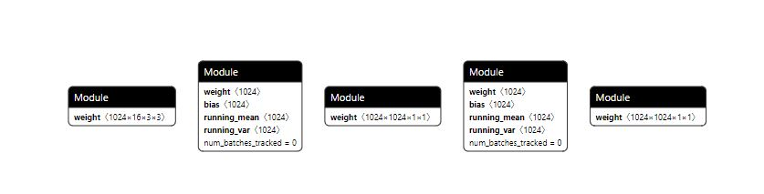

    通过**state\_dict**来保存和加载模型，示例如下：

    1.  保存模型。

        ```
        # 创建保存路径
        PATH = "state_dict_model.pt"
        # 保存模型
        torch.save(net.state_dict(), PATH)
        ```

    2.  加载模型以用于在线推理，示例如下，详情请参见[《PyTorch在线推理指南》](https://gitee.com/ascend/pytorch/blob/v1.8.1-3.0.rc3/docs/zh/PyTorch%E5%9C%A8%E7%BA%BF%E6%8E%A8%E7%90%86%E6%8C%87%E5%8D%97/PyTorch%E5%9C%A8%E7%BA%BF%E6%8E%A8%E7%90%86%E6%8C%87%E5%8D%97.md)。

        ```
        # 模型文件保存路径
        PATH = "state_dict_model.pt"
        model = TheModelClass(*args, **kwargs)
        # 加载模型
        model.load_state_dict(torch.load(PATH))
        model.eval()
        ```

    > **须知：** 
    >保存.pth或.pt文件扩展名的文件时要提供模型定义文件，否则无法部署。

-   .pth.tar扩展名的文件：可用于在线推理或重新加载后继续训练。保存多个组件，以字典形式保存，常见的组件包括模型和优化器的state\_dict、停止时的epoch、最新记录的训练损失以及外部的torch.nn.Embedding层等。如果仅用于部署推理模型，推荐只在.pth.tar扩展名的文件中保存权重信息即模型的state\_dict。

    保存和加载模型示例如下：

    1.  保存模型。

        ```
        PATH = "checkpoint.pth.tar"
        torch.save({
            'epoch': epoch,
            'loss': loss,
            'state_dict': model.state_dict(),
            'optimizer' : optimizer.state_dict(),
            ...
        }, PATH)
        ```

    2.  加载模型用于推理或恢复训练。

        ```
        model = TheModelClass(*args, **kwargs)
        optimizer = TheOptimizerClass(*args, **kwargs)
        
        checkpoint = torch.load(PATH)
        model.load_state_dict(checkpoint['model_state_dict'])
        optimizer.load_state_dict(checkpoint['optimizer_state_dict'])
        epoch = checkpoint['epoch']
        loss = checkpoint['loss']
        
        model.eval()
        # - or -
        model.train()
        ```


> **须知：** 
>通常情况下，训练图和推理图中对同一个算子处理方式不同（例如BatchNorm和dropout等算子），在输入格式上也有差别，因此在运行推理或导出ONNX模型之前，必须调用model.eval\(\) 来将dropout和batch normalization层设置为推理模式。

### 导出ONNX模型

**简介**<a name="section5385151615714"></a>

昇腾AI处理器Pytorch模型的部署策略是基于Pytorch官方支持的ONNX模块实现的。ONNX是业内目前比较主流的模型格式，广泛用于模型交流及部署。本节主要介绍如何将Checkpoint文件通过torch.onnx.export\(\)接口导出为ONNX模型。

**.pth或.pt文件导出ONNX模型**<a name="section20969359757"></a>

保存的.pth或.pt文件可以通过Pytorch构建模型再加载权重的方法恢复，然后导出ONNX模型，样例如下。

```
import torch
import torch_npu
import torch.onnx
import torchvision.models as models
# 设置使用CPU导出模型
device = torch.device("cpu") 
 
def convert():
    # 模型定义来自于torchvision，样例生成的模型文件是基于resnet50模型
    model = models.resnet50(pretrained = False)  
    resnet50_model = torch.load('resnet50.pth', map_location='cpu')
    model.load_state_dict(resnet50_model) 
 
    batch_size = 1  #批处理大小
    input_shape = (3, 224, 224)   #输入数据,改成自己的输入shape

    # 模型设置为推理模式
    model.eval()

    dummy_input = torch.randn(batch_size, *input_shape) #  定义输入shape
    torch.onnx.export(model, 
                      dummy_input, 
                      "resnet50_official.onnx", 
                      input_names = ["input"],   # 构造输入名
                      output_names = ["output"],    # 构造输出名
                      opset_version=11，    # ATC工具目前支持opset_version=9，10，11，12，13
                      dynamic_axes={"input":{0:"batch_size"}, "output":{0:"batch_size"}})  #支持输出动态轴
                      ) 
     
if __name__ == "__main__":
    convert()
```

> **说明：** 
>-   在导出ONNX模型之前，必须调用model.eval\(\) 来将dropout和batch normalization层设置为推理模式。
>-   样例脚本中的model来自于torchvision模块中的定义，用户使用自己的模型时需自行指定。
>-   构造输入输出需要对应训练时的输入输出，否则无法正常推理。

**.pth.tar文件导出ONNX模型**<a name="section558814595300"></a>

.pth.tar在导出ONNX模型时需要先确定保存时的信息，有时保存的节点名称和模型定义中的节点会有差异，例如会多出前缀和后缀。在进行转换的时候，可以对节点名称进行修改。转换代码样例如下。

```
from collections import OrderedDict
import mobilenet
import torch
import torch_npu
import torch.onnx


# 本样例中的pth.tar文件保存时节点名加了前缀module，通过遍历删除
def proc_nodes_module(checkpoint, AttrName):
    new_state_dict = OrderedDict()
    for key, value in checkpoint[AttrName].items():
        if key == "module.features.0.0.weight":
            print(value)
        if(key[0:7] == "module."):
            name = key[7:]
        else:
            name = key[0:]

        new_state_dict[name] = value
    return new_state_dict

def convert():
    checkpoint = torch.load("./mobilenet_cpu.pth.tar", map_location=torch.device('cpu'))
    checkpoint['state_dict'] = proc_nodes_module(checkpoint,'state_dict')
    model = mobilenet.mobilenet_v2(pretrained = False)
    model.load_state_dict(checkpoint['state_dict'])
    model.eval()
    input_names = ["actual_input_1"]
    output_names = ["output1"]
    dummy_input = torch.randn(1, 3, 224, 224)
    torch.onnx.export(model, dummy_input, "mobilenetV2_npu.onnx", input_names = input_names, output_names = output_names, opset_version=11)

if __name__ == "__main__":
    convert()
```

## 参考信息

-   **[常用环境变量说明](#常用环境变量说明)**  
-   **[dump op方法](#dump-op方法)**  
-   **[安装7.3.0版本gcc](#安装7-3-0版本gcc)**  
-   **[编译安装hdf5](#编译安装hdf5)**  
-   **[AI Core和AI CPU算子数据参考](#AI Core和AI CPU算子数据参考)**  

### 常用环境变量说明

1.  开启TASK多线程下发，绝大多数情况下，打开该功能会进一步提升整网训练性能。

    **export TASK\_QUEUE\_ENABLE=1**

2.  开启重定向日志到stdout，用于导出host日志到屏幕。

    **export ASCEND\_SLOG\_PRINT\_TO\_STDOUT=0**

3.  设置日志级别，日志级别设置，信息从多到少分别是 debug --\> info --\> warning --\> error --\> null，一般设置为error，调试时使用info。请参考[《故障管理》](https://www.hiascend.com/document/detail/zh/canncommercial/51RC2/troublemanagement/logreference/logreference_0001.html)中“日志参考>日志操作”章节设置日志级别设置日志级别。

    **export ASCEND\_GLOBAL\_LOG\_LEVEL=3**

4.  dump图，主要用于查看图结构。

    **export DUMP\_GE\_GRAPH=2**

    **export DUMP\_GRAPH\_LEVEL=3**

5.  设置Event日志开启标志。

    **export ASCEND\_GLOBAL\_EVENT\_ENABLE=0**

6.  设置是否开启PTCopy算子模式，加速转连续及copy过程。

    **export PTCOPY\_ENABLE=1**

7.  设置是否开启combined标志，用于优化非连续两个算子组合类场景。

    **export COMBINED\_ENABLE=1**

8.  设置特殊场景是否需要重新编译，不需要修改。

    **export DYNAMIC\_OP="ADD\#MUL"**

9.  HCCL白名单开关，配置在使用HCCL时是否关闭通信白名单，1关闭，0开启，缺省值为0。

    **export HCCL\_WHITELIST\_DISABLE=1**

### dump op方法

1.  使用profile接口对原始代码训练脚本的loss计算和优化过程进行改造，打印算子信息。代码样例如下：

    ```
    with torch.autograd.profiler.profile() as prof:
        out = model(input_tensor)
        loss = out.sum()
        loss.backward()
    # 也可导出文件    
    print(prof.key_averages().table(sort_by="self_cpu_time_total"))
    ```

2.  将改造后的训练脚本在CPU上进行训练，屏幕会打印相关算子信息。

### 安装7.3.0版本gcc

以下步骤请在root用户下执行。

1.  下载gcc-7.3.0.tar.gz，下载地址为[https://mirrors.tuna.tsinghua.edu.cn/gnu/gcc/gcc-7.3.0/gcc-7.3.0.tar.gz](https://mirrors.tuna.tsinghua.edu.cn/gnu/gcc/gcc-7.3.0/gcc-7.3.0.tar.gz)。
2.  安装gcc时候会占用大量临时空间，所以先执行下面的命令清空/tmp目录：

    ```
    sudo rm -rf /tmp/*
    ```

3.  安装依赖。

    centos/bclinux执行如下命令安装。

    ```
    yum install bzip2    
    ```

    ubuntu/debian执行如下命令安装。

    ```
    apt-get install bzip2    
    ```

4.  编译安装gcc。
    1.  进入gcc-7.3.0.tar.gz源码包所在目录，解压源码包，命令为：

        ```
        tar -zxvf gcc-7.3.0.tar.gz
        ```

    2.  进入解压后的文件夹，执行如下命令下载gcc依赖包：

        ```
        cd gcc-7.3.0
        ./contrib/download_prerequisites
        ```

        如果执行上述命令报错，需要执行如下命令在“gcc-7.3.0/“文件夹下下载依赖包：

        ```
        wget http://gcc.gnu.org/pub/gcc/infrastructure/gmp-6.1.0.tar.bz2
        wget http://gcc.gnu.org/pub/gcc/infrastructure/mpfr-3.1.4.tar.bz2
        wget http://gcc.gnu.org/pub/gcc/infrastructure/mpc-1.0.3.tar.gz
        wget http://gcc.gnu.org/pub/gcc/infrastructure/isl-0.16.1.tar.bz2
        ```

        下载好上述依赖包后，重新执行以下命令：

        ```
        ./contrib/download_prerequisites
        ```

        如果上述命令校验失败，需要确保依赖包为一次性下载成功，无重复下载现象。

    3.  <a name="zh-cn_topic_0000001173199577_zh-cn_topic_0000001172534867_zh-cn_topic_0276688294_li1649343041310"></a>执行配置、编译和安装命令：

        ```
        ./configure --enable-languages=c,c++ --disable-multilib --with-system-zlib --prefix=/usr/local/linux_gcc7.3.0
        make -j15    # 通过grep -w processor /proc/cpuinfo|wc -l查看cpu数，示例为15，用户可自行设置相应参数。
        make install    
        ```

        > **注意：** 
        >其中“--prefix“参数用于指定linux\_gcc7.3.0安装路径，用户可自行配置，但注意不要配置为“/usr/local“及“/usr“，因为会与系统使用软件源默认安装的gcc相冲突，导致系统原始gcc编译环境被破坏。示例指定为“/usr/local/linux\_gcc7.3.0“。


5.  配置环境变量。

    当用户执行训练时，需要用到gcc升级后的编译环境，因此要在训练脚本中配置环境变量，通过如下命令配置。

    ```
    export LD_LIBRARY_PATH=${install_path}/lib64:${LD_LIBRARY_PATH}
    ```

    其中$\{install\_path\}为[3.](#zh-cn_topic_0000001173199577_zh-cn_topic_0000001172534867_zh-cn_topic_0276688294_li1649343041310)中配置的gcc7.3.0安装路径，本示例为“/usr/local/gcc7.3.0/“。

    > **说明：** 
    >本步骤为用户在需要用到gcc升级后的编译环境时才配置环境变量。

### 编译安装hdf5

以下步骤请在root用户下执行。

1.  获取代码。

    ```
    git clone https://github.com/HDFGroup/hdf5.git 
    ```

2.  切换到hdf5-1\_10\_7分支。

    ```
    cd hdf5
    git checkout remotes/origin/hdf5_1_10_7 
    ```

3.  编译hdf5。

    ```
    ./configure --prefix=/usr/local/hdf5 --enable-cxx
    make -j72                 #-j 后的数值可以根据CPU的核数设置
    make check                # run test suite.
    make install
    make check-install        # verify installation. 
    ```

4.  添加环境变量。

    ```
    export PATH=/usr/local/hdf5/bin:$PATH
    export LD_LIBRARY_PATH=/usr/local/hdf5/lib:$LD_LIBRARY_PATH
    export LIBRARY_PATH=/usr/local/hdf5/lib:$LIBRARY_PATH
    export CPATH=/usr/local/hdf5/include:$CPATH 
    ```


## FAQ

-   **[软件安装常见问题](#软件安装常见问题)**  

-   **[模型和算子运行常见问题](#模型和算子运行常见问题)**  

-   **[模型调测常见问题](#模型调测常见问题)**  

-   **[其他操作相关问题](#其他操作相关问题)**  

-   **[模型分布式训练常见问题](#模型分布式训练常见问题)**  

### 软件安装常见问题

-   **[pip3.7 install Pillow==5.3.0安装失败](#pip3-7-install-Pillow-5-3-0安装失败)**  
-   **[No module named 'tensorboard'](#依赖)**  

<h4 id="pip3-7-install-Pillow-5-3-0安装失败">pip3.7 install Pillow==5.3.0安装失败</h4>

**现象描述**<a name="zh-cn_topic_0175549220_section197270431505"></a>

pip3.7 install pillow==5.3.0安装失败。

**可能原因**<a name="zh-cn_topic_0175549220_section169499490501"></a>

缺少必要的依赖，如：libjpeg、python-devel、 zlib-devel 、libjpeg-turbo-devel等等。

**处理方法**<a name="section108142031907"></a>

安装相关依赖，通过如下命令安装：

-   CentOS/EulerOS/Tlinux/BClinux/Suse

    **yum install libjpeg python-devel  zlib-devel  libjpeg-turbo-devel**

-   Ubuntu/Debian/UOS

    **apt-get install libjpeg python-devel  zlib-devel  libjpeg-turbo-devel**

<h4 name="依赖">No module named 'tensorboard'</h4>

**现象描述**<a name="zh-cn_topic_0175549220_section197270431505"></a>

ModuleNotFoundError:No module named 'tensorboard' 

**可能原因**<a name="zh-cn_topic_0175549220_section169499490501"></a>

缺少python依赖tensorboard。

**处理方法**<a name="section108142031907"></a>

安装相关依赖，通过如下命令安装：

```
pip3 install tensorboard
```


### 模型运行常见问题

-   **[在模型运行或者算子运行时遇到报错“RuntimeError: ExchangeDevice:”](#在模型运行或者算子运行时遇到报错-RuntimeError-ExchangeDevicemd)**  

-   **[在模型运行或者算子运行时遇到报错“Error in atexit.\_run\_exitfuncs:”](#在模型运行或者算子运行时遇到报错-Error-in-atexit-_run_exitfuncsmd)**  

-   **[在模型运行时遇到报错“terminate called after throwing an instance of 'c10::Error' what\(\): HelpACLExecute:”](#在模型运行时遇到报错-terminate-called-after-throwing-an-instance-of-c10-Error-what-HelpACLExecutemd)**  

-   **[在模型运行时遇到报错“terminate called after throwing an instance of 'c10::Error' what\(\): 0 INTERNAL ASSERT”](#在模型运行时遇到报错-terminate-called-after-throwing-an-instance-of-c10-Error-what-0-INTERNAL-ASSERTmd)**  

-   **[在模型运行时遇到报错“ImportError: libhccl.so.”](#在模型运行时遇到报错-ImportError-libhccl-somd)**  

-   **[在模型运行时遇到报错“RuntimeError: Initialize.”](#在模型运行时遇到报错-RuntimeError-Initializemd)**  

-   **[在模型运行时遇到报错“TVM/te/cce error.”](#在模型运行时遇到报错-TVM-te-cce-errormd)**  

-   **[在模型运行时遇到报错“MemCopySync:drvMemcpy failed.”](#在模型运行时遇到报错-MemCopySync-drvMemcpy-failedmd)**  

-   **[在模型运行时遇到报错“MemCopySync:drvMemcpy failed.”](#在模型运行时遇到报错-MemCopySync-drvMemcpy-failed-6md)**  

-   **[在模型运行时将多任务下发关闭\(export TASK\_QUEUE\_ENABLE=0\)后仍然遇到报错“HelpACLExecute.”](#在模型运行时将多任务下发关闭export-TASK_QUEUE_ENABLE-0后仍然遇到报错-HelpACLExecutemd)**  

-   **[在模型运行时遇到报错“55056 GetInputConstDataOut: ErrorNo: -1\(failed\)”](#在模型运行时遇到报错-55056-GetInputConstDataOut-ErrorNo--1failedmd)**  


<h4 id="在模型运行或者算子运行时遇到报错-RuntimeError-ExchangeDevicemd">在模型运行或者算子运行时遇到报错“RuntimeError: ExchangeDevice:”</h4>

**现象描述**<a name="section1785905019184"></a>


**可能原因**<a name="zh-cn_topic_0175549220_section169499490501"></a>

目前在一个线程内，只能调用一个NPU设备，当切换不同的npu device时，出现上述错误。

**处理方法**<a name="section8970834202112"></a>

检查代码中在调用torch_npu.npu.set\_device\(device\)、tensor.to\(device\)或者model.to\(device\)时，同一个线程内前后调用时device名称不一致。对于多个线程情况（如多卡训练），每个线程同样只能调用固定的npu device。

<h4 id="在模型运行或者算子运行时遇到报错-Error-in-atexit-_run_exitfuncsmd">在模型运行或者算子运行时遇到报错“Error in atexit.\_run\_exitfuncs:”</h4>

**现象描述**<a name="section1785905019184"></a>

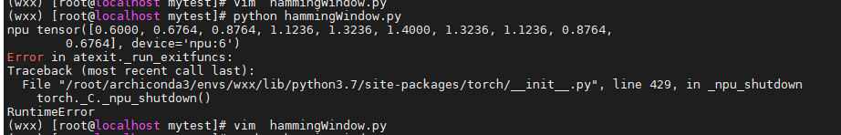

**可能原因**<a name="zh-cn_topic_0175549220_section169499490501"></a>

在torch初始化时，若未通过torch_npu.npu.device\(id\)指定npu设备，则默认使用device 0设备。若直接使用其他NPU设备，如指定在device 1上创建tensor，那么在运行时会出现上述错误。

**处理方法**<a name="section8970834202112"></a>

在调用NPU设备之前，通过torch_npu.npu.set\_device\(device\)指定需要使用的NPU设备即可。

<h4 id="在模型运行时遇到报错-terminate-called-after-throwing-an-instance-of-c10-Error-what()-HelpACLExecutemd">在模型运行时遇到报错“terminate called after throwing an instance of 'c10::Error' what\(\): HelpACLExecute:”</h4>

**现象描述**<a name="section1785905019184"></a>

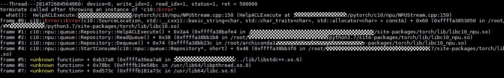

**可能原因**<a name="zh-cn_topic_0175549220_section169499490501"></a>

目前HelpACLExecute的报错信息无法直接找到报错位置，此处在task任务下发时报错，是由于开启了TASK多线程下发（export TASK\_QUEUE\_ENABLE=1），上层封装了报错信息，导致无法获取更加详细的报错日志。

**处理方法**<a name="section8970834202112"></a>

可通过如下两种方式处理：

-   查看具体的host报错日志信息。日志默认路径为/var/log/npu/slog/host-0/，根据时间标识查找以host-0为前缀的日志文件，打开日志文件，搜索“ERROR”，查询具体的报错信息。
-   关闭多线程下发\(export TASK\_QUEUE\_ENABLE=0\)，再次运行代码，一般可根据终端报错信息定位错误原因。

<h4 id="在模型运行时遇到报错-terminate-called-after-throwing-an-instance-of-c10-Error-what()-0-INTERNAL-ASSERTmd">在模型运行时遇到报错“terminate called after throwing an instance of 'c10::Error' what\(\): 0 INTERNAL ASSERT”</h4>

**现象描述**<a name="section5498445105118"></a>

```
import torch
import torch_npu
npu = "npu"

def test_cpu():
    input = torch.randn(2000, 1000).detach().requires_grad_()
    output = torch.sum(input)
    output.backward(torch.ones_like(output))

def test_npu():
    input = torch.randn(2000, 1000).detach().requires_grad_().npu()
    output = torch.sum(input)
    output.backward(torch.ones_like(output))

if __name__ == "__main__":
    test_cpu()
    torch_npu.npu.set_device(f"{npu}:1")
    test_npu()
```

执行代码后出现如下报错。


**可能原因**<a name="section440935995113"></a>

在运行backward运算后，通过set\_decice\(\)方法手动设置device设备，导致报错。在运行backward运算时，若没有设置device，程序会自动默认初始化device为0，相当于执行了set\_device\("npu:0"\)。由于目前不支持切换device进行计算，若再通过set\_decice\(\)方法手动设置device设备，则可能出现该错误。

**处理方法**<a name="section1828321115218"></a>

在运行backward运算前，通过set\_decice\(\)方法手动设置device。修改如下。

```
if __name__ == "__main__":
    torch_npu.npu.set_device(f"{npu}:1")
    test_cpu()
    test_npu()
```

<h4 id="在模型运行时遇到报错-ImportError-libhccl-somd">在模型运行时遇到报错“ImportError: libhccl.so.”</h4>

**现象描述**<a name="section1785905019184"></a>

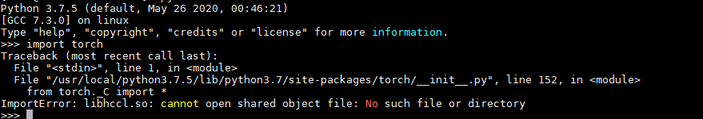

**可能原因**<a name="zh-cn_topic_0175549220_section169499490501"></a>

目前对外发布的pytorch安装包，默认使用NPU和HCCL功能，因此在调用时需要将HCCL模块路径添加到环境变量中。根据报错信息“can not find libhccl.so”，出现上述错误原因为缺少hccl库文件。

**处理方法**<a name="section8970834202112"></a>

执行以下命令

```
source Ascend-cann-toolkit安装目录/Ascend-toolkit/set_env.sh  
```

<h4 id="在模型运行时遇到报错-RuntimeError-Initializemd">在模型运行时遇到报错“RuntimeError: Initialize.”</h4>

**现象描述**<a name="section1785905019184"></a>


**可能原因**<a name="zh-cn_topic_0175549220_section169499490501"></a>

根据报错信息，初步判断为npu设备初始化错误。进一步查找host日志报错信息如下：

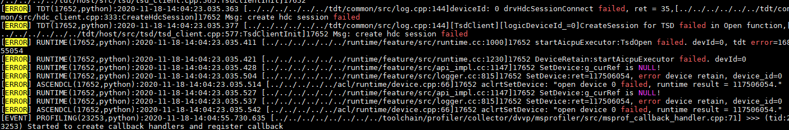

根据日志信息定位报错原因为系统在拉起npu设备时报错。

**处理方法**<a name="section8970834202112"></a>

可通过以下步骤解决该问题。

1.  重启服务器和所有npu device。

    如果问题解决，处理完毕。

    如果问题未解决，请执行[2](#li77121667913)。

2.  <a name="li77121667913"></a>检查安装的driver和firmware版本是否匹配。

    如果不匹配，请执行[3](#li967615545918)。

    如果匹配，请执行[4](#li475615212912)。

3.  <a name="li967615545918"></a>更换正确版本的driver和firmware。

    如果问题解决，处理完毕。

    如果问题未解决，执行步骤四

4.  <a name="li475615212912"></a>联系华为工程师。

<h4 id="在模型运行时遇到报错-TVM-te-cce-errormd">在模型运行时遇到报错“TVM/te/cce error.”</h4>

**现象描述**<a name="section1785905019184"></a>

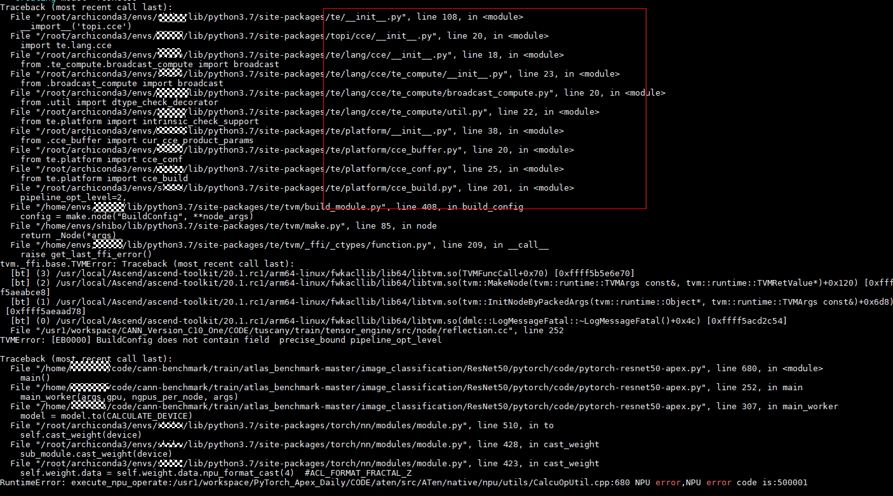

**可能原因**<a name="zh-cn_topic_0175549220_section169499490501"></a>

pytorch内调用npu类型算子时，强依赖于te、cce、tvm组件，pytorch、CANN/nnae和te版本需要一致。在更新CANN/nnae后，te等组件不会自动更新，当版本不匹配时，则会出现该报错。

**处理方法**<a name="section8970834202112"></a>

更新te等组件版本，具体需要更新te-_\*.whl和topi-\*_.whl安装包。在安装的CANN或者nnae的lib64子目录下（以root安装用户为例：默认安装路径在/usr/local/Ascend/ascend-toolkit/latest/lib64目录下，更新安装包即可。在该目录下有安装包topi-0.4.0-py3-none-any.whl和te-0.4.0-py3-none-any.whl，分别执行pip3 install --upgrade topi-0.4.0-py3-none-any.whl，pip install --upgrade te-0.4.0-py3-none-any.whl。

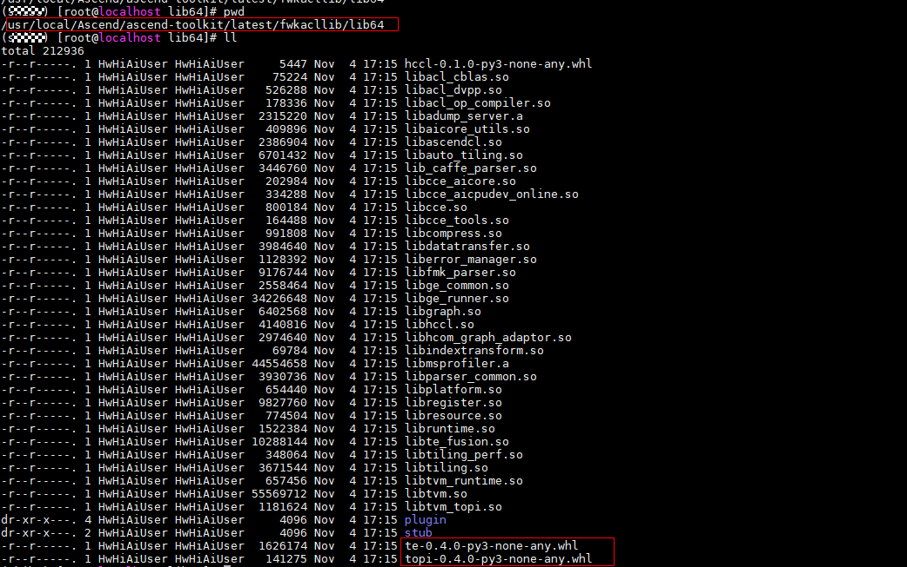

<h4 id="在模型运行时遇到报错-MemCopySync-drvMemcpy-failedmd">在模型运行时遇到报错“MemCopySync:drvMemcpy failed.”</h4>

**现象描述**<a name="section1785905019184"></a>

脚本：

```
    import torch
    import torch_npu
    def test_sum():
        xs_shape = [22400, 8]
        ys_shape = [22400, 8]
        gt_bboxes_shape = [22400, 8,4]
        xs = torch.rand(xs_shape).npu()
        ys = torch.rand(ys_shape).npu()
        gt_bboxes = torch.rand(gt_bboxes_shape).npu().half()
        left = xs - gt_bboxes[..., 0]
        right = gt_bboxes[..., 2] - xs
        top = ys - gt_bboxes[..., 1]
        bottom = gt_bboxes[..., 3] - ys
        # stream = torch_npu.npu.current_stream()
        # stream.synchronize()
        # left, top 结果是fp32，  right, bottom 结果是fp16，
        # print(left.dtype, top.dtype, right.dtype, bottom.dtype)
        bbox_targets = torch.stack((left, top, right, bottom), -1)  #报错位置在这里
        # stream.synchronize()

        bbox_targets = torch.sum(bbox_targets)
```

shell报错信息：

```
    RuntimeError: Run:/usr1/workspace/PyTorch_Apex_Daily_c20tr5/CODE/aten/src/ATen/native/npu/utils/OpParamMaker.h:280 NPU error,NPU error code is:500002
    [ERROR] RUNTIME(160809)kernel task happen error, retCode=0x28, [aicpu timeout].
    [ERROR] RUNTIME(160809)aicpu kernel execute failed, device_id=0, stream_id=512, task_id=24, fault so_name=, fault kernel_name=, extend_info=.
    Error in atexit._run_exitfuncs:
    Traceback (most recent call last):
    File "/usr/local/python3.7.5/lib/python3.7/site-packages/torch/__init__.py", line 429, in _npu_shutdown
        torch._C._npu_shutdown()
    RuntimeError: npuSynchronizeDevice:/usr1/workspace/PyTorch_Apex_Daily_c20tr5/CODE/c10/npu/NPUStream.cpp:806 NPU error, error code is 0
```

日志信息：

```
    [ERROR] RUNTIME(12731,python3.7):2021-02-02-22:23:56.475.679 [../../../../../../runtime/feature/src/npu_driver.cc:1408]12828 MemCopySync:drvMemcpy failed: dst=0x108040288000, destMax=1240, src=0x7fe7649556d0, size=1240, kind=1, drvRetCode=17!
    [ERROR] RUNTIME(12731,python3.7):2021-02-02-22:23:56.475.698 [../../../../../../runtime/feature/src/logger.cc:113]12828 KernelLaunch:launch kernel failed, kernel=140631803535760/ArgMinWithValue_tvmbin, dim=32, stream=0x55b22b3def50
    [ERROR] RUNTIME(12731,python3.7):2021-02-02-22:23:56.475.717 [../../../../../../runtime/feature/src/api_c.cc:224]12828 rtKernelLaunch:ErrCode=207001, desc=[module new memory error], InnerCode=0x70a0002
```

**可能原因**<a name="zh-cn_topic_0175549220_section169499490501"></a>

根据shell和日志报错信息，两者报错信息不匹配。

shell报错是在同步操作中和AI CPU错误，而日志报错信息却是在min算子（内部调用ArgMinWithValue\_tvmbin），二者报错信息不对应。一般这类问题出现的原因是由于日志生成的报错信息滞后。

报错信息滞后可能是由于AI CPU算子的异步执行，导致报错信息滞后。

**处理方法**<a name="section8970834202112"></a>

对于该报错需要根据实际的错误来定位，可参考如下步骤进行处理：

1.  通过关闭多任务算子下发后发现结果不变，推断在shell脚本报错位置和日志报错算子之前就已出现错误。
2.  根据报错加上stream同步操作，缩小错误范围，定位错误算子。stream同步操作的作用在于其要求代码所运行到的位置之前的所有计算必须为完成状态，从而定位错误位置。
3.  通过在代码中加上stream同步操作，确定报错算子为stack。
4.  打印stack所有参数的shape、dtype、npu\_format，通过构造单算子用例复现问题。定位到问题原因为减法计算输入参数数据类型不同，导致a-b和b-a结果的数据类型不一致，最终在stack算子中报错。
5.  将stack入参数据类型转换为一致即可临时规避问题。

<h4 id="在模型运行时遇到报错-MemCopySync-drvMemcpy-failed-6md">在模型运行时遇到报错“MemCopySync:drvMemcpy failed.”</h4>

**现象描述**<a name="section1785905019184"></a>

脚本：

```
    import torch
    import torch_npu

    def test_sum():
        xs_shape = [22400, 8]
        ys_shape = [22400, 8]
        gt_bboxes_shape = [22400, 8,4]
        xs = torch.rand(xs_shape).npu()
        ys = torch.rand(ys_shape).npu()
        gt_bboxes = torch.rand(gt_bboxes_shape).npu().half()
        left = xs - gt_bboxes[..., 0]
        right = gt_bboxes[..., 2] - xs
        top = ys - gt_bboxes[..., 1]
        bottom = gt_bboxes[..., 3] - ys
        # stream = torch_npu.npu.current_stream()
        # stream.synchronize()
        # left, top 结果是fp32，  right, bottom 结果是fp16，
        # print(left.dtype, top.dtype, right.dtype, bottom.dtype)
        bbox_targets = torch.stack((left, top, right, bottom), -1)  #报错位置在这里
        # stream.synchronize()

        bbox_targets = torch.sum(bbox_targets)
```

shell报错信息：

```
    RuntimeError: Run:/usr1/workspace/PyTorch_Apex_Daily_c20tr5/CODE/aten/src/ATen/native/npu/utils/OpParamMaker.h:280 NPU error,NPU error code is:500002
    [ERROR] RUNTIME(160809)kernel task happen error, retCode=0x28, [aicpu timeout].
    [ERROR] RUNTIME(160809)aicpu kernel execute failed, device_id=0, stream_id=512, task_id=24, fault so_name=, fault kernel_name=, extend_info=.
    Error in atexit._run_exitfuncs:
    Traceback (most recent call last):
    File "/usr/local/python3.7.5/lib/python3.7/site-packages/torch/__init__.py", line 429, in _npu_shutdown
        torch._C._npu_shutdown()
    RuntimeError: npuSynchronizeDevice:/usr1/workspace/PyTorch_Apex_Daily_c20tr5/CODE/c10/npu/NPUStream.cpp:806 NPU error, error code is 0
```

日志信息：

```
    [ERROR] RUNTIME(12731,python3.7):2021-02-02-22:23:56.475.679 [../../../../../../runtime/feature/src/npu_driver.cc:1408]12828 MemCopySync:drvMemcpy failed: dst=0x108040288000, destMax=1240, src=0x7fe7649556d0, size=1240, kind=1, drvRetCode=17!
    [ERROR] RUNTIME(12731,python3.7):2021-02-02-22:23:56.475.698 [../../../../../../runtime/feature/src/logger.cc:113]12828 KernelLaunch:launch kernel failed, kernel=140631803535760/ArgMinWithValue_tvmbin, dim=32, stream=0x55b22b3def50
    [ERROR] RUNTIME(12731,python3.7):2021-02-02-22:23:56.475.717 [../../../../../../runtime/feature/src/api_c.cc:224]12828 rtKernelLaunch:ErrCode=207001, desc=[module new memory error], InnerCode=0x70a0002
```

**可能原因**<a name="zh-cn_topic_0175549220_section169499490501"></a>

根据shell和日志报错信息，两者报错信息不匹配。

shell报错是在同步操作中和ai cpu错误，而日志报错信息却是在min算子（内部调用ArgMinWithValue\_tvmbin），二者报错信息不对应。一般这类问题出现的原因是由于日志生成的报错信息滞后。

报错信息滞后可能是由于AI cpu算子的异步执行，导致报错信息滞后。

**处理方法**<a name="section8970834202112"></a>

对于该报错需要根据实际的错误来定位，可参考如下步骤进行处理：

1.  通过关闭多任务算子下发后发现结果不变，推断在shell脚本报错位置和日志报错算子之前就已出现错误。
2.  根据报错加上stream同步操作，缩小错误范围，定位错误算子。stream同步操作的作用在于其要求代码所运行到的位置之前的所有计算必须为完成状态，从而定位错误位置。
3.  通过在代码中加上stream同步操作，确定报错算子为stack。
4.  打印stack所有参数的shape、dtype、npu\_format，通过构造单算子用例复现问题。定位到问题原因为减法计算输入参数数据类型不同，导致a-b和b-a结果的数据类型不一致，最终在stack算子中报错。
5.  将stack入参数据类型转换为一致即可临时规避问题。

<h4 id="在模型运行时将多任务下发关闭(export-TASK_QUEUE_ENABLE-0)后仍然遇到报错-HelpACLExecutemd">在模型运行时将多任务下发关闭\(export TASK\_QUEUE\_ENABLE=0\)后仍然遇到报错“HelpACLExecute.”</h4>

**现象描述**<a name="section1785905019184"></a>

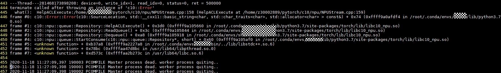

**可能原因**<a name="zh-cn_topic_0175549220_section169499490501"></a>

pytorch算子在npu上运行，通过ACL接口调用底层经过优化的算子。由于在上层报错信息显示为HelpACLExecute. 时，内部也正在对报错信息与日志进行完善，导致部分算子发生错误时，报错信息获取异常。

**处理方法**<a name="section8970834202112"></a>

查看host日志，确定报错算子和位置，日志默认路径为/var/log/npu/slog/host-0。查找对应时间的log文件，搜索ERROR字段，查找错误信息。如对上述的错误，查询日志中的ERROR字段为：

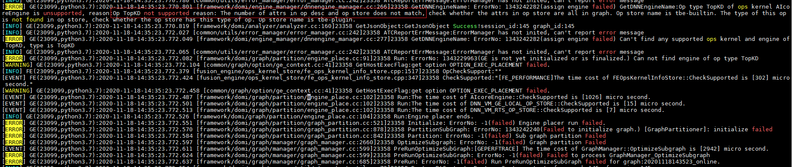

从日志信息EEROR部分可以发现，报错算子为topKD，报错原因为“The number of attrs in op desc and op store does not match. ”，定位到错误原因为topk算子参数不匹配。

在模型代码中查找topk算子调用位置，确定该算子是否可由其他算子代替，若可由其他算子报错，暂时使用代替方案，并将算子报错信息报告华为工程师。若无替代算子，请将算子报错信息通知华为工程师解决。

<h4 id="在模型运行时遇到报错-55056-GetInputConstDataOut-ErrorNo--1(failed)md">在模型运行时遇到报错“55056 GetInputConstDataOut: ErrorNo: -1\(failed\)”</h4>

**现象描述**<a name="section170419711269"></a>

模型训练过程中，查看host训练日志（路径：“/root/ascend/log/plog/“），可能出现如下报错信息。

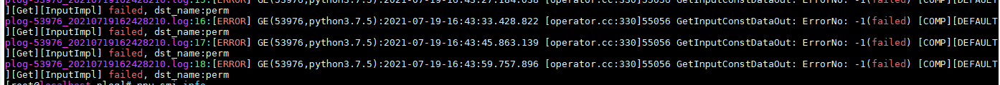

**可能原因**<a name="zh-cn_topic_0175549220_section169499490501"></a>

该报错信息是由于调用某一公共API接口导致。

**处理方法**<a name="section8970834202112"></a>

该报错信息不影响训练功能与性能，可忽略该报错信息。

### 其他操作相关问题

-   **[cuda流同步操作报错](#cuda流同步操作报错md)**  

-   **[aicpu\_kernels/libpt\_kernels.so不存在](#aicpu_kernels-libpt_kernels-so不存在md)**  

-   **[使用npu-smi info查看显存时发现python进程残留](#使用npu-smi-info查看显存时发现python进程残留md)**  

-   **[动态shape报错“match op inputs failed”](#动态shape报错-match-op-inputs-failedmd)**  

-   **[Op type SigmoidCrossEntropyWithLogitsV2 of ops kernel AIcoreEngine is unsupported](#Op-type-SigmoidCrossEntropyWithLogitsV2-of-ops-kernel-AIcoreEngine-is-unsupportedmd)**  

-   **[Hook失败](#Hook失败md)**  

-   **[加载权重时遇到报错“load state\_dict error.”](#加载权重时遇到报错-load-state_dict-errormd)**  


<h4 id="cuda流同步操作报错md">cuda流同步操作报错</h4>

**现象描述**<a name="section1785905019184"></a>

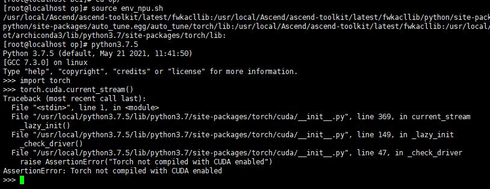

**可能原因**<a name="zh-cn_topic_0175549220_section169499490501"></a>

npu未使用npu的流同步方法。

**处理方法**<a name="section8970834202112"></a>

使用NPU的流同步方法：

```
stream = torch_npu.npu.current_stream()
stream.synchronize()
```

<h4 id="aicpu_kernels-libpt_kernels-so不存在md">aicpu\_kernels/libpt\_kernels.so不存在</h4>

**现象描述**<a name="section1785905019184"></a>

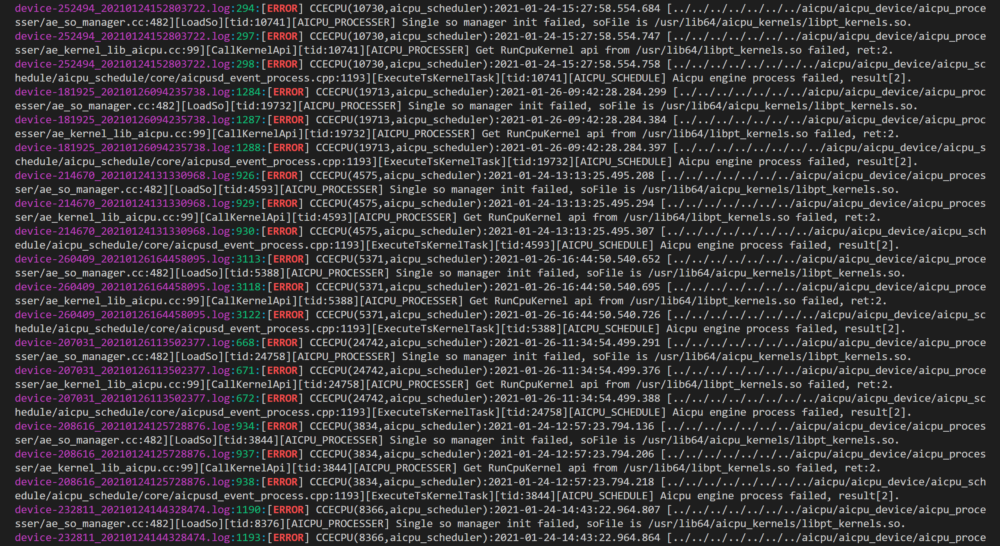

**可能原因**<a name="zh-cn_topic_0175549220_section169499490501"></a>

未导入AICPU。

**处理方法**<a name="section8970834202112"></a>

导入AICPU（以root用户安装CANN软件包，安装路径为默认路径为例）：

```
export ASCEND_AICPU_PATH=/usr/local/Ascend/ascend-toolkit/latest
```

<h4 id="使用npu-smi-info查看显存时发现python进程残留md">使用npu-smi info查看显存时发现python进程残留</h4>

**现象描述**<a name="section1785905019184"></a>

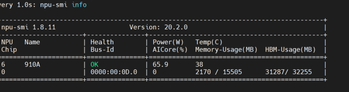

**可能原因**<a name="zh-cn_topic_0175549220_section169499490501"></a>

python进程残留，需要kill。

**处理方法**<a name="section8970834202112"></a>

终止python进程：

```
pkill -9 python
```

<h4 id="动态shape报错-match-op-inputs-failedmd">动态shape报错“match op inputs failed”</h4>

**现象描述**<a name="section1785905019184"></a>

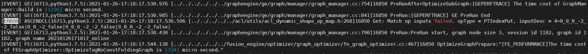

**可能原因**<a name="zh-cn_topic_0175549220_section169499490501"></a>

PTIndexPut编译的算子和输入的shape不一致， 并有acl\_dynamic\_shape\_op打头的日志字样，确定为动态shape报错。

**处理方法**<a name="section8970834202112"></a>

PTIndexPut对应tensor\[indices\] = value，需要在代码中找到对应的地方将动态shape修改为固定shape。

<h4 id="Op-type-SigmoidCrossEntropyWithLogitsV2-of-ops-kernel-AIcoreEngine-is-unsupportedmd">Op type SigmoidCrossEntropyWithLogitsV2 of ops kernel AIcoreEngine is unsupported</h4>

**现象描述**<a name="section1785905019184"></a>

```
[ERROR] GE(24836,python3.7):2021-01-27-18:27:51.562.111 [../../../../../../graphengine/ge/engine_manager/dnnengine_manager.cc:266]25155 GetDNNEngineName: ErrorNo: 1343242282(assign engine failed) GetDNNEngineName:Op type SigmoidCrossEntropyWithLogitsV2 of ops kernel AIcoreEngine is unsupported, reason:Op SigmoidCrossEntropyWithLogitsV2 not supported reason: The type of this op is not found in op store, check whether the op store has this type of op. Op store name is tbe-custom.
The dtype, format or shape of input in op desc is not supported in op store, check the dtype, format or shape of input between the op store and the graph. Op store name is tbe-builtin.
```

**可能原因**<a name="zh-cn_topic_0175549220_section169499490501"></a>

SigmoidCrossEntropyWithLogitsV2算子输入了不支持的数据类型，可能是输入int64类型导致的错误。

**处理方法**<a name="section8970834202112"></a>

检查对应python代码中输入的数据类型，并修改。

<h4 id="Hook失败md">Hook失败</h4>

**现象描述**<a name="section1785905019184"></a>

```
Traceback (most recent call last):
  File "tools/train.py", line 227, in <module>
    main()
  File "tools/train.py", line 221, in main
    meta=meta)
  File "/root/YoloV3/mmdetection/mmdet/apis/train.py", line 192, in train_detector
    runner.run(data_loaders, cfg.workflow, cfg.total_epochs)
  File "/usr/local/python3.7.5/lib/python3.7/site-packages/mmcv/runner/epoch_based_runner.py", line 166, in run
    epoch_runner(data_loaders[i], **kwargs)
  File "/usr/local/python3.7.5/lib/python3.7/site-packages/mmcv/runner/epoch_based_runner.py", line 50, in train
    self.run_iter(data_batch, train_mode=True)
  File "/usr/local/python3.7.5/lib/python3.7/site-packages/mmcv/runner/epoch_based_runner.py", line 30, in run_iter
    outputs = self.model.train_step(data_batch, self.optimizer, **kwargs)
  File "/usr/local/python3.7.5/lib/python3.7/site-packages/mmcv/parallel/data_parallel.py", line 100, in train_step
    return self.module.train_step(*inputs[0], **kwargs[0])
  File "/root/YoloV3/mmdetection/mmdet/models/detectors/base.py", line 251, in train_step
    losses = self(**data)
  File "/usr/local/python3.7.5/lib/python3.7/site-packages/torch/nn/modules/module.py", line 660, in __call__
    var = next((v for v in var.values() if isinstance(v, torch.Tensor)))
StopIteration
```

**可能原因**<a name="zh-cn_topic_0175549220_section169499490501"></a>

mmdet的loss部分结构触发了pytorch原生hook的bug，导致死循环。

**处理方法**<a name="section8970834202112"></a>

解决方案是在/usr/local/python3.7.5/lib/python3.7/site-packages/torch/nn/modules/module.py这个文件的658行加上try跳过：

```
if len(self._backward_hooks) > 0:
    var = result
    try:
        while not isinstance(var, torch.Tensor):
            if isinstance(var, dict):
                var = next((v for v in var.values() if isinstance(v, torch.Tensor)))
            else:
                var = var[0]
        grad_fn = var.grad_fn
        if grad_fn is not None:
            for hook in self._backward_hooks.values():
                wrapper = functools.partial(hook, self)
                functools.update_wrapper(wrapper, hook)
                grad_fn.register_hook(wrapper)
    except Exception as e:
        print('hook failed..')
        print(str(e))
return result
```

<h4 id="加载权重时遇到报错-load-state_dict-errormd">加载权重时遇到报错“load state\_dict error.”</h4>

**现象描述**<a name="section1785905019184"></a>

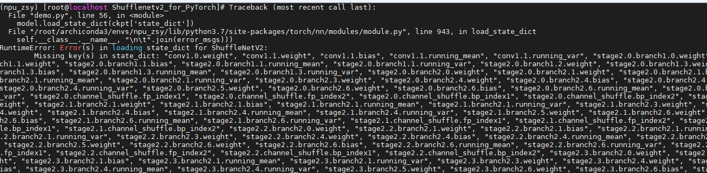

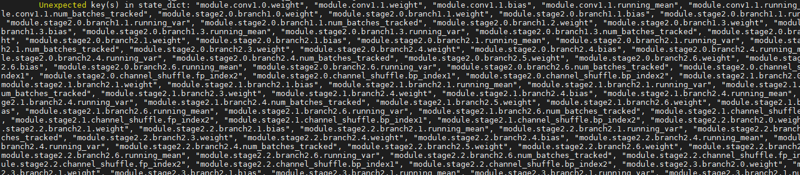

**可能原因**<a name="zh-cn_topic_0175549220_section169499490501"></a>

模型训练后保存的state\_dict的key值与加载时state\_dict的key值不一致，保存时会在每个key的最前面多一个module前缀。

**处理方法**<a name="section8970834202112"></a>

加载权重时先遍历state\_dict字典，修改key值，并使用新建的字典，具体用例参考demo.py。

脚本如下：

```
   ckpt = torch.load("checkpoint.pth", map_location=loc)
   # model.load_state_dict(ckpt['state_dict'])
   state_dict_old = ckpt['state_dict']
   state_dict = {}
   for key, value in state_dict_old.items():
       key = key[7:]
       state_dict[key] = value
   model.load_state_dict(state_dict)
```

### 模型分布式训练常见问题

-   **[在进行模型分布式训练时遇到报错“host not found.”](#在进行模型分布式训练时遇到报错-host-not-foundmd)**  

-   **[在进行模型分布式训练时遇到报错“RuntimeError：connect\(\) timed out.”](#在进行模型分布式训练时遇到报错-RuntimeError-connect()-timed-outmd)**  


<h4 id="在进行模型分布式训练时遇到报错-host-not-foundmd">在进行模型分布式训练时遇到报错“host not found.”</h4>

**现象描述**<a name="section1785905019184"></a>

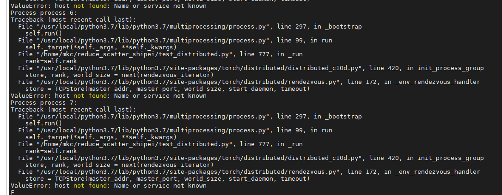

**可能原因**<a name="zh-cn_topic_0175549220_section169499490501"></a>

对模型进行分布式训练时，会调用集合通信模块HCCL，需要根据实际情况设置IP和端口信息。根据报错信息，确定是IP地址设置错误。

**处理方法**<a name="section8970834202112"></a>

在运行脚本中设置正确的IP地址，对于单机情况，设置为本机的IP地址即可；对于多机情况，每个服务器上脚本中的IP需要设置为master节点的IP。

<h4 id="在进行模型分布式训练时遇到报错-RuntimeError-connect()-timed-outmd">在进行模型分布式训练时遇到报错“RuntimeError：connect\(\) timed out.”</h4>

**现象描述**<a name="section1785905019184"></a>


**可能原因**<a name="zh-cn_topic_0175549220_section169499490501"></a>

模型进行分布式训练时，系统防火墙可能会阻截HCCL的集合通信端口的通信。需要根据报错信息，排查通信端口的开放情况，并进行相应设置。

**处理方法**<a name="section8970834202112"></a>

查询出被系统防火墙阻截的集合通信端口，并开放相应端口。

<h4 id="在进行模型分布式训练时遇到报错-RuntimeError-connect()-timed-outmd">在进行模型分布式训练时遇到报错“RuntimeError：HCCL\(\) error.”</h4>

**现象描述**<a name="section1785905019184"></a>


**可能原因**<a name="zh-cn_topic_0175549220_section169499490501"></a>

模型进行分布式训练时，不同设备进程在集合通信初始化之前由于其他因素会导致执行不同步。可以根据实际设备表现情况，对建链等待时间进行设置。

**处理方法**<a name="section8970834202112"></a>

export HCCL_CONNECT_TIMEOUT=time, 
time默认值为120s ，取值范围为[120, 7200]