# PyTorch训练调优&工具使用指南

-   [总体思路](#总体思路)
-   [调优前准备](#调优前准备)
-   [Profiling数据采集](#Profiling数据采集)
-   [Profiling数据解析与导出](#Profiling数据解析与导出)
-   [性能瓶颈分析与优化](#性能瓶颈分析与优化)
-   [精度调测](#精度调测)
-   [模型调优样例](#模型调优样例)
-   [参考信息](#参考信息)
-   [FAQ](#FAQ)

## 总体思路

​		PyTorch训练调优需在开启混合精度的前提下根据训练的结果，根据3种profiling工具导出不同层面的数据分析不同场景下的NPU与CPU的性能瓶颈，主要存在于CPU的使用率高低与NPU使用率高低的组合情况，用户可在根据使用率瓶颈的分类对应自身场景中存在的瓶颈进行点对点优化。

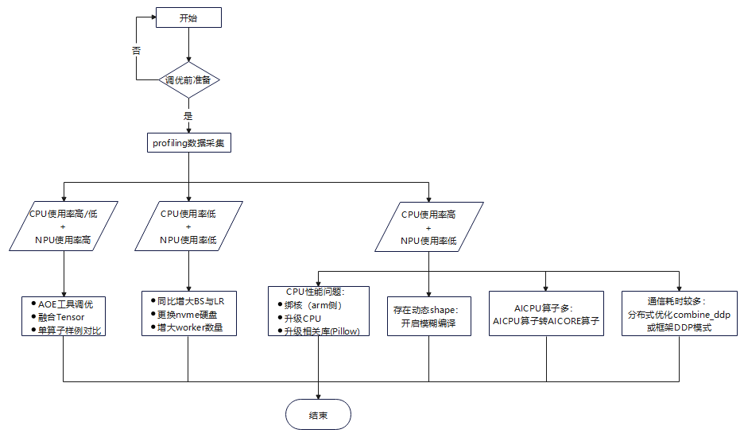

## 调优前准备

1.  开启混合精度，保证性能不降低，如何开启混合精度请参考[《PyTorch网络模型移植&训练指南》](https://gitee.com/ascend/pytorch/blob/v1.8.1-3.0.rc2/docs/zh/PyTorch%E7%BD%91%E7%BB%9C%E6%A8%A1%E5%9E%8B%E7%A7%BB%E6%A4%8D&%E8%AE%AD%E7%BB%83%E6%8C%87%E5%8D%97/PyTorch%E7%BD%91%E7%BB%9C%E6%A8%A1%E5%9E%8B%E7%A7%BB%E6%A4%8D&%E8%AE%AD%E7%BB%83%E6%8C%87%E5%8D%97.md)。
2.  优先打通单卡迁移训练功能，再打通多卡迁移训练功能，训练迁移详细内容请参考[《PyTorch网络模型移植&训练指南》](https://gitee.com/ascend/pytorch/blob/v1.8.1-3.0.rc2/docs/zh/PyTorch%E7%BD%91%E7%BB%9C%E6%A8%A1%E5%9E%8B%E7%A7%BB%E6%A4%8D&%E8%AE%AD%E7%BB%83%E6%8C%87%E5%8D%97/PyTorch%E7%BD%91%E7%BB%9C%E6%A8%A1%E5%9E%8B%E7%A7%BB%E6%A4%8D&%E8%AE%AD%E7%BB%83%E6%8C%87%E5%8D%97.md)。
3.  分布式训练建议使用DDP功能。

## Profiling数据采集<a name="Profiling数据采集"></a>

​		当模型训练过程中吞吐量（系统在单位时间内处理请求的数量）指标不达标时，可以通过采集训练过程中的profiling数据，分析哪个环节、哪个算子导致的性能消耗。基于NPU的pytorch在模型训练时，算子典型的执行流程是，算子通过pytorch框架多次分发后，调用AscendCL接口，然后在CANN层经过编译、GE/FE等模块的处理后，最终在NPU上计算执行，整个流程和调用栈较深。在AscendCL接口之前，调用栈和流程都是pytorch框架内，而在AscendCL接口之后，所有的流程全部在CANN内（基础软件包，通过so方式调用）。

​		因此针对这一系列的流程，我们提供了三种不同层次的profiling方式，可以侧重记录不同层面的性能数据，分别是pytorch profiling、cann profiling和E2E profling：

- pytorch profiling功能是继承自原生pytorch的功能，主要记录了pytorch框架层面的算子在多次分发中调用栈的耗时信息，而对于算子在CANN内的流程，只能作为一整块展示，无法详细展示内部流程。

- cann profiling则是仅针对cann层内算子执行流程来记录性能信息，主要功能是分析算子在NPU设备上的执行性能，可以清晰看出算子在不同shape/format下耗时信息；

- E2E profiling则将pytorch层面和CANN层面的性能数据结合起来，可以端到端地分析模型性能瓶颈所在，其展示的性能数据分模块展示，其在pytorch层面的数据与pytorch profiling的数据基本一致，而在CANN 层面展示的数据分为GE/ACL/RunTime/AI CPU/Device等多个模块，可以从整体上分析模型性能瓶颈。

​		三种profiling的关系如下图所示，注意E2E profiling并不完全为pytorch和cann profiling的叠加。


采集算子OP_INFO则是通过日志信息，获取模型中所有调用到的算子信息，一般用于确认模型中是否有插入多余的transdata（主要用于数据类型和格式转换）。


### PyTorch Profiling数据采集

PyTorch Profiling详细内容参见[开发工具](https://www.hiascend.com/document/detail/zh/canncommercial/51RC2/devtools/auxiliarydevtool/atlasprofiling_16_0197.html)"Profiling工具>高级功能>性能数据采集（AI框架方式）>PyTorch Profiling"章节。

### CANN Profiling数据采集

CANN Profiling详细内容参见[开发工具](https://www.hiascend.com/document/detail/zh/canncommercial/51RC2/devtools/auxiliarydevtool/atlasprofiling_16_0198.html)"Profiling工具>高级功能>性能数据采集（AI框架方式）>CANN Profiling"章节。

###  E2E profiling数据采集

1. 获取性能数据文件

   添加with语句使能E2E prof功能

   ```
   with torch_npu.npu.profile(profiler_result_path="./result",use_e2e_profiler=True):
   
        model_train()
   ```

   - profiler_result_path表示prof结果保存路径，默认为当前路径。
   - use_e2e_profiler表示是否开启E2E prof功能，默认为False（仅开启CANN prof功能）。

   （因NPU算子需要编译后才能执行，为保证数据的准确性，建议先运行10个step，在第十个step后再进行E2E prof操作，并且一般只需要profiling1个或者2个setp即可。）

2. 解析性能数据

   通过E2E prof工具获得的结果为原始数据，需要通过解析后查看。

   ​		a. 以使用教程中路径为例，工具会在profiler_result_path路径下创建文件夹以保存原始数据。

   ​		b. 切换至如上图./result/PROF_XXX路径后，执行脚本。

      ```
   /usr/local/Ascend/ascend-toolkit/latest/toolkit/tools/profiler/bin/msprof --export=on --output=./
   ### 具体路径请根据实际安装路径修改，并设置环境变量
      ```

      - output：原始数据路径。

   ​		c. 运行完成后，在原始数据路径下输出timeline目录。如下图：

      

   ​		d. timeline路径下为解析得到的性能数据，可以通过chrome://tracing/中打开。

      浏览器进入chrome://tracing/。

      点击load，上传文件查看。

      内容示例如下图：

      

      该示例分为4个层次，由上到下，第一层（MsprofTx）为Pytorch框架数据，第二层（AscendCL）为AscendCL层面数据，第三层（GeOPExecute）为GE层数据，第四层（Runtime）为Runtime调度层数据，第五层(Task Scheduler)为device上数据，第六层（如有则为是AICPU，示意图中没有第六层数据）为AICPU上数据。

3. E2E profiling高级设置<a name="E2E"></a>
   E2E prof工具默认配置获取上述所有层面数据。获取数据过程亦会影响性能，若获取数据过多，会导致性能数据不具备参考价值。因此，E2E prof工具提供了可配置选项，用于精细化控制获取部分层面数据。
   
   ```
   with torch_npu.npu.profile(profiler_result_path="./results", use_e2e_profiler=True, \
                           config=torch_npu.npu.profileConfig(ACL_PROF_ACL_API=True, \
                           ACL_PROF_TASK_TIME=True, ACL_PROF_AICORE_METRICS=True, \
                           ACL_PROF_AICPU=True, ACL_PROF_L2CACHE=False, \
                           ACL_PROF_HCCL_TRACE=True, ACL_PROF_TRAINING_TRACE=False, \
                           aiCoreMetricsType=0)):
   
   
   # ACL_PROF_ACL_API：表示采集AscendCL接口的性能数据，默认True
   
   
   # ACL_PROF_TASK_TIME：采集AI Core算子的执行时间，默认True
   
   
   # ACL_PROF_AICORE_METRICS：表示采集AI Core性能指标数据，aicore_metrics入参处配置的性能指标采集项才有效，默认为True
   
   
   # ACL_PROF_AICPU：0x0008，采集AI CPU任务的开始、结束轨迹数据，默认为True 
   
   # ACL_PROF_L2CACHE：表示采集L2 Cache数据，该数据会导致prof结果膨胀，默认False
   
   # ACL_PROF_HCCL_TRACE：表示采集HCCL数据，默认为True
   
   # ACL_PROF_TRAINING_TRACE：表示迭代轨迹数据，记录模型正向和反向等步骤，默认为False
   
   其中，aiCoreMetricsType的取值和定义如下，默认为0：
   
   # ACL_AICORE_ARITHMETIC_UTILIZATION = 0：表示各种计算类指标占比统计，包括采集项mac_fp16_ratio、mac_int8_ratio、vec_fp32_ratio、vec_fp16_ratio、vec_int32_ratio、vec_misc_ratio
   
   # ACL_AICORE_PIPE_UTILIZATION = 1：表示计算单元和搬运单元耗时占比，包括采集项vec_ratio、mac_ratio、scalar_ratio、mte1_ratio、mte2_ratio、mte3_ratio、icache_miss_rate
   
   # ACL_AICORE_MEMORY_BANDWIDTH = 2：表示外部内存读写类指令占比，包括采集项ub_read_bw、ub_write_bw、l1_read_bw、l1_write_bw、l2_read_bw、l2_write_bw、main_mem_read_bw、main_mem_write_bw
   
   # ACL_AICORE_L0B_AND_WIDTH ：表示内部内存读写类指令占比，包括采集项scalar_ld_ratio、scalar_st_ratio、l0a_read_bw、l0a_write_bw、l0b_read_bw、l0b_write_bw、l0c_read_bw、l0c_write_bw
   
   # ACL_AICORE_RESOURCE_CONFLICT_RATIO ：表示流水线队列类指令占比，包括采集项vec_bankgroup_cflt_ratio、vec_bank_cflt_ratio、vec_resc_cflt_ratio、mte1_iq_full_ratio、mte2_iq_full_ratio、mte3_iq_full_ratio、cube_iq_full_ratio、vec_iq_full_ratio、iq_full_ratio
   
   # ACL_AICORE_NONE = 0xFF：表示不采集
   
   ```
   
   

### 获取算子信息OP\_INFO

网络模型最终是以OP执行的，通过OPInfo日志，我们可以获取实际执行时的算子及其属性。通过get\_ascend\_op\_info.py脚本获取。

1. 编写get\_ascend\_op\_info.py脚本获取算子信息，脚本内容如下。

   ```
   # -*- coding: utf-8 -*-
   """用于导出OPINFO"""
   import os
   import sys
   import argparse
   
   def func(host_log_folder):
       """
       :param host_log_folder: where host_log_folder addr is.
       :return:
       """
       host_log_files = os.listdir(host_log_folder)
       result = {}
   
       for host_log in host_log_files:
           if not host_log.endswith('.log') or host_log.endswith('.out'):
               continue
           with open(os.path.join(host_log_folder, host_log), 'r')as f:
               host_log_lines = f.readlines()
               for line in host_log_lines:
                   if line.startswith('[INFO] ASCENDCL') and "aclopCompile::aclOp" in line:
                       op_info = line.split('OpType: ')[1][:-2]
                       op_type = op_info.split(',')[0]
                       op_param = op_info[len(op_type) + 2:]
                       if op_type not in result.keys():
                           result[op_type] = [op_param]
                       else:
                           result[op_type].append(op_param)
   
       with open('ascend_op_info_summary.txt', 'w')as f:
           for k, v in result.items():
               v_set = set(v)
               for info in v_set:
                   f.write(k + " " + info + "\n")
   
   if __name__ == "__main__":
       parser = argparse.ArgumentParser(description='trans the log')
       parser.add_argument('--host_log_folder', default="./",
                           help="input the dir name, trans the current dir with default")
       ags = parser.parse_args()
       func(ags.host_log_folder)
   ```

2. 设置环境变量，用户可自定义将host日志打屏或写入文件中。

   ```
   export ASCEND_SLOG_PRINT_TO_STDOUT=0
   ```

   开启后，日志将不会保存在log文件中，而是将产生的日志直接打屏显示。

   - 0：关闭日志打屏，即日志采用默认输出方式，将日志保存在log文件中。
   - 1：开启日志打屏。
   - 其他值为非法值

3. 设置日志级别为info，详细日志内容修改参考[《故障管理》](https://www.hiascend.com/document/detail/zh/canncommercial/51RC2/troublemanagement/logreference/logreference_0001.html)中“日志参考>日志操作”章节设置日志级别。

   ```
   export ASCEND_GLOBAL_LOG_LEVEL=1
   ```

4. 执行训练脚本，进行模型训练，训练模型一个epoch完成后，若未设置日志打屏，可获取host侧日志，默认位置为HOME/ascend/log/debug/plog目录下，该目录用户可根据自身需要自定义日志保存路径，HOME表示Host侧用户根目录。

5. 解析host侧日志会在当前目录下得到OPInfo信息ascend\_op\_info\_summary.txt。

   ```
   python3 get_ascend_op_info.py --host_log_folder $HOME/ascend/log/debug/plog
   ```

   --host_log_folder：日志保存路径，用户可自定义。

6. 分析TaskInfo中额外的task，尤其关注transdata。

## Profiling数据解析与导出

Profiling 数据解析与导出详细内容参见[开发工具](https://www.hiascend.com/document/detail/zh/canncommercial/51RC2/devtools/auxiliarydevtool/atlasprofiling_16_0080.html)"Profilign工具>高级功能>数据解析与导出"章节。


## 性能瓶颈分析与优化

### 数据分析

#### CPU数据分析

- 使用TOP命令显示CPU占用率（功能：显示最消耗CPU的任务，显示占用百分比），分析使用率判断CPU是否存在瓶颈，如根据CPU占用率过高分析是否数据加载时间过长问题。

  通常查看top命令的回显第三行，例如：

  ``` 
  %Cpu(s):  0.0 us,  0.3 sy,  0.0 ni,  99.7 id,  0.0 wa,    0.0 hi,    0.0 si,    0.0 st  
          #用户时间 #系统时间  #Nice时间 #空闲时间  #等待时间  #硬中断时间  #软中断时间  #丢失时间
  ```

  | 参数名称 | 参数说明                                                     |
  | -------- | ------------------------------------------------------------ |
  | us       | 表示CPU 执行用户进程的时间，包括nices时间。通常期望用户空间CPU 越高越好。 |
  | sy       | 表示CPU 在内核运行时间，包括IRQ 和softirq 时间。系统CPU 占用率高，表明系统某部分存在瓶颈。通常值越低越好。 |
  | ni       | 系统调整进程优先级所花费的时间。                             |
  | id       | 系统处于空闲期，等待进程运行。                               |
  | wa       | 表示CPU在等待I/O 操作完成所花费的时间。系统不应该花费大量时间来等待I/O 操作，否则就说明I/O 存在瓶颈。 |
  | hi       | 表示系统处理硬中断所花费的时间。                             |
  | si       | 表示系统处理软中断所花费的时间。                             |
  | st       | 表示系统被强制等待（involuntary wait）虚拟CPU的时间，此时 hypervisor 在为另一个虚拟处理器服务。 |

- 使用df -lh命令查看磁盘使用率，也可安装iostat查看磁盘负载，根据磁盘负载判断是否存在worker数太小问题。

  1. 安装工具

     ```
     apt install sysstat #Ubuntu
     yum install systat  #CentOS
     ```

  2. 执行命令查看

     ```
     iostat -d -k 1 2 #此命令表示每隔1秒显示2次以KB为单位的设备统计信息，其他命令请自行获取
     ```

  3. 判断IO是否存在瓶颈可查看%IOWAIT属性，如果值过高，表示存在IO瓶颈，可进行进一步的IO瓶颈分析。

#### NPU数据分析

- 使用npu-smi info命令查看NPU使用情况，具体命令参数请查阅使用的设备的对应[《硬件产品文档》](https://www.hiascend.com/document?tag=hardware)。

- 通过Profiling数据OP_SUMMARY文件分析调度任务执行时间，排查算子耗时。

  按照Task Duration排序，找出高耗时算子。

  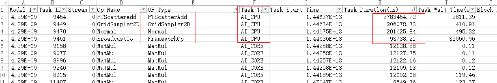

- 通过Profiling数据OP_STATISTIC文件分析算子调用总时间，排查是否算子总耗时较长。

  按照Total Time排序，分析转换类算子是否耗时占比较大，如transdata、cast。

  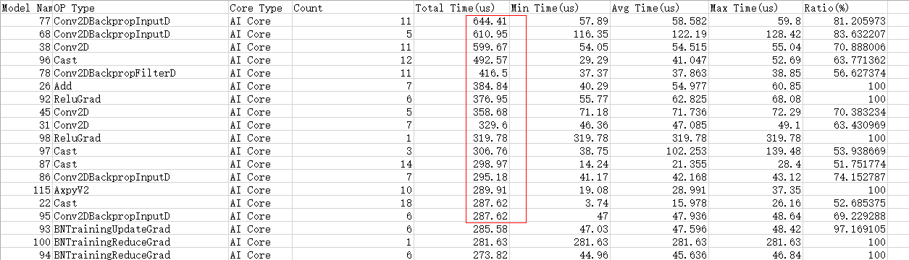

- 通过Profiling数据OP_SUMMARY文件分析算子类型

  按照Task Type排序，查看是否AICPU算子耗时过高。

  

  

- 通过结合P有Torch Profiling数据的json文件和CANN Profiling获得的算子信息文件分析shape问题

  如果CPU轴无算子耗时，排除调度问题，结合算子信息文件，若算子耗时较大，大概率为编译耗时，可能存在动态shape。

  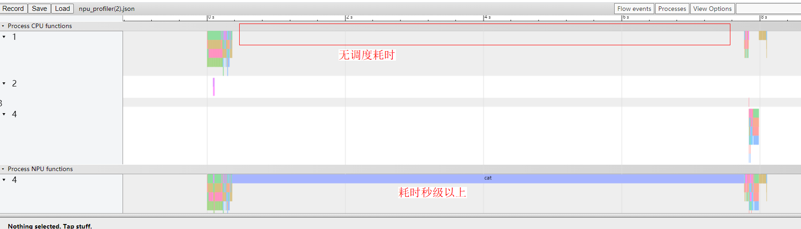

  

### CPU的使用率低/高+NPU的使用率高

**解析数据**

- 根据Profiling数据查看算子名称、类型数量、耗时等数据，判断是否为算子瓶颈。
- 根据NPU使用情况判断，NPU资源利用率不足，直接使用AOE自动调优。

**调优参考**

<details ><summary>出现耗时较大算子-----单算子样例构建对比优化</summary>
<pre style="background-color:Gray">
<h3>场景解析</h3>已根据profiling数据定位出耗时较大的算子，通过构建单算子样例对比GPU与NPU耗时。
在OP_SUMMARY算子信息文件中保存了算子的性能数据，其中按照TaskDuration耗时排序，可找出耗时算子较大的算子，再进行单算子的耗时分析。

<h3>调优思路</h3>从整网中获取profiling数据，再根据算子数据summary文件，判断出大耗时算子，为其单独构建样例，对比耗时情况。
<h3>优化方法</h3>参考prof构建脚本，通过脚本获取算子信息文件，若单个算子耗时明显比GPU耗时长，可联系华为工程师进行分析优化。
<h3>样例参考</h3>单算子prof构建脚本
<Pre>
import torch
import time
import argparse
import os
import torch.nn.functional as F
</div>
<div>
###### 需自行修改的部分 start ######
# 请自行指定运行方式，通常需要正向和反向
def run(x):
    o = F.softplus(x)
    l = o.mean()
    l.backward()
    return o
# 请自行指定输入shape
shape_list = ([128, 64, 128, 128], [128, 128, 64, 64],
              [128, 256, 64, 64], [128, 256, 32, 32],
              [128, 512, 32, 32], [128, 512, 16, 16],
              [128, 1024, 16, 16], [128, 1024, 8, 8],
              [128, 2048, 8, 8])
</div>
<div>
###### 需自行修改的部分 end ######
</div>
<div>
parser = argparse.ArgumentParser(description='PyTorch Prof')
parser.add_argument('--device', type=str, default='cpu',
                    help='set which type of device used. Support cpu, cuda:0(device_id), npu:0(device_id).')
args = parser.parse_args()
</div>
<div>
if args.device.startswith('cuda'):
    torch.cuda.set_device(args.device)
    prof_kwargs = {'use_cuda': True}
    dtype_list = ['fp16', 'fp32']
elif args.device.startswith('npu'):
    torch.npu.set_device(args.device)
    prof_kwargs = {'use_npu': True}
    dtype_list = ['fp16', 'fp32']
else:
    prof_kwargs = {}
    dtype_list = ['fp32']
</div>
<div>
if not os.path.exists('./prof_out'):
    os.makedirs('./prof_out')
</div>
<div>
for dtype in dtype_list:
    for shape in shape_list:
        N, C, H, W = shape
        x = torch.randn(*shape)
        x.requires_grad = True
        x = x.to(args.device)
        if dtype == 'fp16':
            x = x.half()
</div>
<div>
        run(x)
        with torch.autograd.profiler.profile(**prof_kwargs) as prof:
            run(x)
        prof.export_chrome_trace("./prof_out/softplus_device_%s_dtype_%s_shape_%d_%d_%d_%d.prof" % (
        args.device, dtype, N, C, H, W))  # "output.prof"为输出文件地址
</div>
<div>
        if args.device.startswith('npu'):
            x.data = x.data.npu_format_cast(3)
            run(x)
            with torch.autograd.profiler.profile(**prof_kwargs) as prof:
                run(x)
            prof.export_chrome_trace("./prof_out/softplus_device_%s_dtype_%s_shape_%d_%d_%d_%d_5HD.prof" % (
                args.device, dtype, N, C, H, W))  # "output.prof"为输出文件地址
</div>
</Pre>
</pre></details>

<details><summary>出现大量小算子----Tensor融合优化</summary>
<pre style="background-color:Gray">
<h3>场景解析</h3>Profiling数据发现loss scale在梯度更新引入大量Add mul小算子
<h3>调优思路</h3>融合小算子、并替换亲和API减少梯度更新阶段的add、mul算子调用数量
<h3>优化方法</h3><div>1.开启混合精度，并开启combine_grad=True开关。</div>
                  <div>2.替换亲和API。</div>
<h3>样例参考</h3>
<pre>
<div># 原始代码
optimizer = torch.optim.SGD(model.parameters(), lr=args.lr, momentum=args.momentum)  
model, optimizer = amp.initialize(model, optimizer, opt_level='O2', loss_scale=32.0)</div>
<div># 优化后代码
optimizer = apex.optimizers.NpuFusedSGD(model.parameters(), lr=args.lr, momentum=args.momentum)  #NpuFusedSGD为亲和API
model, optimizer = amp.initialize(model, optimizer, opt_level='O2', loss_scale=32.0, combine_grad=True)</div>
</pre>
    <p>更多亲和库接口请参考PyTorch API支持清单</p>
    </pre>
</details>
<details><summary>提升NPU资源利用率----AOE工具自动调优</summary>
<pre style="background-color:Gray">
<h3>场景解析</h3>算子输入参数的信息（shape/format等）会影响算子的性能，进而影响模型整体性能。为了使模型获得更良好的性能，可以将模型中所有的算子的输入参数信息获取至本地进行分析（dump），然后将每个算子在NPU上运行，调整算子运行时的策略，确定性能最佳的策略。
<h3>调优思路</h3>参考AOE工具使用指南，开启自动调优。
    <h3>优化方法</h3>参考<a href="https://www.hiascend.com/document/detail/zh/canncommercial/51RC2/devtools/auxiliarydevtool/aoe_16_001.html">《开发工具》>AOE工具>PyTorch训练场景下调优</a>
</pre>
</details>


### CPU的使用率高+NPU的使用率低

**解析数据**

- linux命令行输入TOP命令，可查看CPU占用情况。若CPU占用率高，考虑CPU性能不足瓶颈。
- 使用Profiling数据查看算子名称、类型数量、耗时等数据，判断是否为算子瓶颈。
- 分析算子shape，判断是否动态shape，开启模糊编译。
- 分布式训练时，profiling数据有较长的通信耗时，可开启DDP功能，减少通信时间。

**调优参考**

<details><summary>cpu性能不足（性能数据抖动）----arm侧通过绑核提升性能</summary>
<pre style="background-color:Gray">
<h3>场景解析</h3>ARM架构多核处理器性能低
<h3>调优思路</h3>设定某个线程/进程与某个处理器核的亲和力，让该线程/进程只在所绑定的核运行。
<h3>优化方法</h3>
<pre>
RANK_ID_START=0
RANK_SIZE=8
KERNEL_NUM=$(($(nproc)/8))
<div>
for((RANK_ID=$RANK_ID_START;RANK_ID<$((RANK_SIZE+RANK_ID_START));RANK_ID++));
do</div>
<div>PID_START=$((KERNEL_NUM * RANK_ID))
PID_END=$((PID_START + KERNEL_NUM - 1))
</div><div>
nohup taskset -c $PID_START-$PID_END python3.7 xxx.py -j ${KERNEL_NUM} --local_rank $RANK_ID & 
done
</div>
<h3>样例参考</h3>模型训练脚本参考链接<a href="https://gitee.com/ascend/ModelZoo-PyTorch/blob/master/PyTorch/contrib/cv/classification/GhostNet/test/train_performance_8p.sh">8P训练</a>
</div>
</pre>
</pre>
</details>


<details><summary>cpu性能不足（数据加载耗时长）----升级高性能处理库Pillow</summary>
<pre style="background-color:Gray">
<h3>场景解析</h3>CPU性能不足
<h3>调优思路</h3>训练时部分网络模型会出现FPS较低、性能不达标的情况。可考虑升级依赖库。
<h3>优化方法</h3>
<pre>
1.执行命令卸载原生pillow库。
  pip3.7 uninstall -y pillow
2.安装SSE4版本pillow-simd。（使用root用户安装，执行如下命令，若使用非root用户安装，需在命令结尾加上--user。）
  pip3.7 install pillow-simd
<h4>说明：</h4>如果CPU支持AVX2指令集，可安装AVX2版本pillow-simd。
CC="cc -mavx2" pip3.7 install -U --force-reinstall pillow-simd
</pre>
</pre>
</details>

<details><summary>cpu性能不足（增加数据处理性能）----编译安装opencv</summary>
<pre style="background-color:Gray">
<h3>场景解析</h3>图像处理性能弱
<h3>调优思路</h3>为获得更好的图像处理性能，可采用编译安装opencv的方式。
<h3>优化方法</h3>
<pre>
1.安装前准备
export GIT_SSL_NO_VERIFY=true
2.下载源码包。
git clone https://github.com/opencv/opencv.git
cd opencv
mkdir -p build
3.源码编译并安装
cd build  
cmake -D BUILD_opencv_python3=yes -D BUILD_opencv_python2=no -D PYTHON3_EXECUTABLE=/usr/local/python3.7.5/bin/python3.7m -D PYTHON3_INCLUDE_DIR=/usr/local/python3.7.5/include/python3.7m -D PYTHON3_LIBRARY=/usr/local/python3.7.5/lib/libpython3.7m.so -D PYTHON3_NUMPY_INCLUDE_DIRS=/usr/local/python3.7.5/lib/python3.7/site-packages/numpy/core/include -D PYTHON3_PACKAGES_PATH=/usr/local/python3.7.5/lib/python3.7/site-packages -D PYTHON3_DEFAULT_EXECUTABLE=/usr/local/python3.7.5/bin/python3.7m .. 
make -j$nproc
make install
</pre>
</pre>
</details>

<details><summary>cpu性能不足（数据加载耗时长）----修改CPU设置(X86)</summary>
<pre style="background-color:Gray">
<h3>场景解析</h3>CPU性能不足
<h3>调优思路</h3>训练时部分网络模型会出现FPS较低、性能不达标的情况。可以考虑对CPU设置进行以下优化尝试提高训练性能。
<h3>优化方法</h3>
<pre>
<h5>修改CPU性能模式（X86服务器）</h5>
<h6>设置电源策略为高性能模式</h6>
<div>提升网络性能需要在X86服务器BIOS设置中将电源策略设为高性能模式，具体操作如下。</div>
<div>1. 登录iBMC界面，启动虚拟控制台，远程控制选择HTML5集成远程控制台，如图。</div>
<div>
<div>2. 在虚拟界面工具栏中，单击启动项工具弹出启动项配置界面，如图：</div>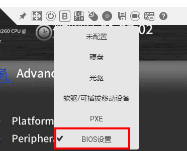
<div>3. 在启动项配置界面选择，选择“BIOS设置”，然后在虚拟界面工具栏中单击重启工具重启服务器。</div>
<div>4. 系统重启后进入BIOS配置界面，依次选择“Advanced”\>“Socket Configuration”，如图所示。</div>
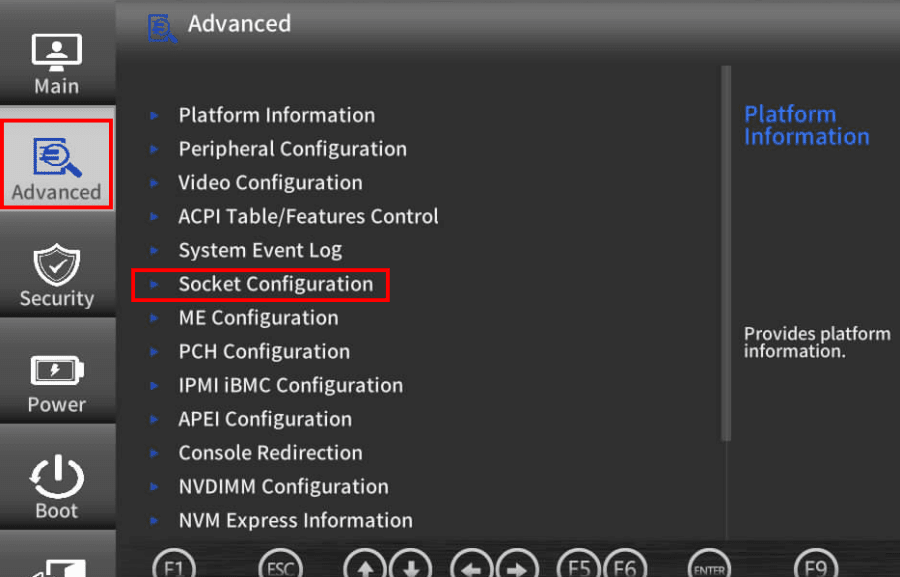
<div>5. 进入Advanced Power Mgmt. Configuration，设置Power Policy为Performance。如图。</div>
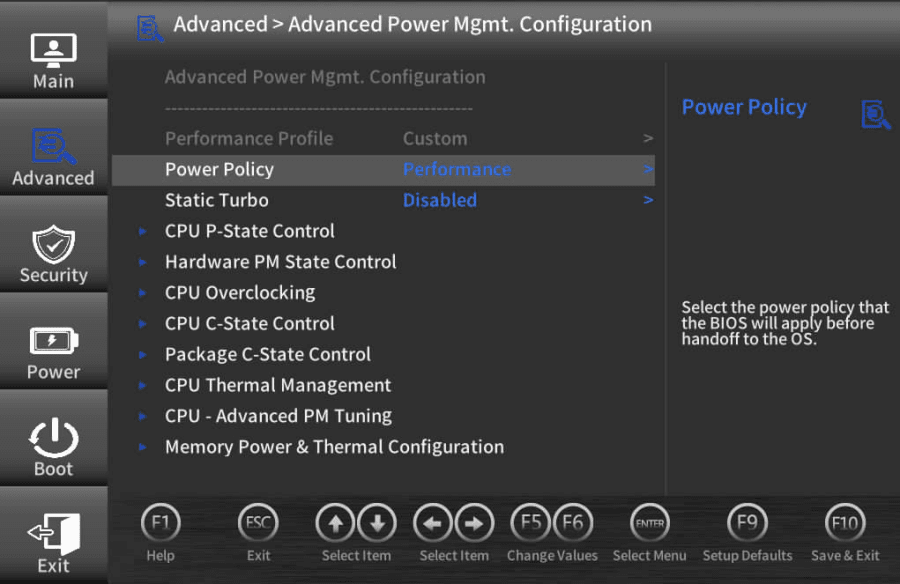
<div>6. 按下“F10”保存配置并重启服务器。</div>
<h6>将CPU设置为performance模式</h6>
<div>请使用root用户执行如下操作。</div>
<div>1.使用如下命令查看当前CPU模式。</div>
<div>cat /sys/devices/system/cpu/cpu0/cpufreq/scaling_governor</div>
<div>执行以上命令会输出当前CPU模式，CPU模式说明请参见[表1](#table354392019384)。如果当前CPU模式不是performance模式，请执行以下操作设置CPU为performance模式。否则请跳过以下步骤。</div>
<div>表1</div>
<div><table><thead align="left"><tr id="row16543172093819"><th class="cellrowborder" valign="top" width="30.819999999999997%" id="mcps1.2.3.1.1"><p id="p2526552113912"><a name="p2526552113912"></a><a name="p2526552113912"></a>调速器</p></th>
<th class="cellrowborder" valign="top" width="69.17999999999999%" id="mcps1.2.3.1.2"><p id="p452519525397"><a name="p452519525397"></a><a name="p452519525397"></a>描述</p>
</th>
</tr>
</thead>
<tbody><tr id="row654317204384"><td class="cellrowborder" valign="top" width="30.819999999999997%" headers="mcps1.2.3.1.1 "><p id="p2376242163917"><a name="p2376242163917"></a><a name="p2376242163917"></a>performance</p>
</td>
<td class="cellrowborder" valign="top" width="69.17999999999999%" headers="mcps1.2.3.1.2 "><p id="p14376442183917"><a name="p14376442183917"></a><a name="p14376442183917"></a>运行于最大频率。</p>
</td>
</tr>
<tr id="row854318200381"><td class="cellrowborder" valign="top" width="30.819999999999997%" headers="mcps1.2.3.1.1 "><p id="p153761542123910"><a name="p153761542123910"></a><a name="p153761542123910"></a>powersave</p>
</td>
<td class="cellrowborder" valign="top" width="69.17999999999999%" headers="mcps1.2.3.1.2 "><p id="p8376942173913"><a name="p8376942173913"></a><a name="p8376942173913"></a>运行于最小频率。</p>
</td>
</tr>
<tr id="row75431920203818"><td class="cellrowborder" valign="top" width="30.819999999999997%" headers="mcps1.2.3.1.1 "><p id="p1437611425398"><a name="p1437611425398"></a><a name="p1437611425398"></a>userspace</p>
</td>
<td class="cellrowborder" valign="top" width="69.17999999999999%" headers="mcps1.2.3.1.2 "><p id="p103771642173920"><a name="p103771642173920"></a><a name="p103771642173920"></a>运行于用户指定的频率。</p>
</td>
</tr>
<tr id="row165438202382"><td class="cellrowborder" valign="top" width="30.819999999999997%" headers="mcps1.2.3.1.1 "><p id="p7377142113915"><a name="p7377142113915"></a><a name="p7377142113915"></a>ondemand</p>
</td>
<td class="cellrowborder" valign="top" width="69.17999999999999%" headers="mcps1.2.3.1.2 "><p id="p237794283917"><a name="p237794283917"></a><a name="p237794283917"></a>按需快速动态调整CPU频率，一有CPU计算量的任务，就会立即达到最大频率运行，空闲时间增加就降低频率。</p>
</td>
</tr>
<tr id="row55441320113810"><td class="cellrowborder" valign="top" width="30.819999999999997%" headers="mcps1.2.3.1.1 "><p id="p8377142203913"><a name="p8377142203913"></a><a name="p8377142203913"></a>conservative</p>
</td>
<td class="cellrowborder" valign="top" width="69.17999999999999%" headers="mcps1.2.3.1.2 "><p id="p737794216395"><a name="p737794216395"></a><a name="p737794216395"></a>按需快速动态调整CPU频率，比ondemand的调整更保守。</p>
</td>
</tr>
<tr id="row5544620123817"><td class="cellrowborder" valign="top" width="30.819999999999997%" headers="mcps1.2.3.1.1 "><p id="p13377154273919"><a name="p13377154273919"></a><a name="p13377154273919"></a>schedutil</p>
</td>
<td class="cellrowborder" valign="top" width="69.17999999999999%" headers="mcps1.2.3.1.2 "><p id="p183779421393"><a name="p183779421393"></a><a name="p183779421393"></a>基于调度程序调整 CPU 频率。</p>
</td>
</tr>
</tbody>
</table></div>
<div>2.安装工具，使用如下命令安装。</div>
<div><b>以“ubuntu/debian“系统为例。</b></div>
<div>apt-get install linux-tools-$(uname -r)</div>
<div><b>以“centos/bclinux/euler“系统为例</b></div>
<div>yum install kernel-tools -y
systemctl daemon-reload 
systemctl enable cpupower 
systemctl start cpupower</div>
<div>3.设置CPU为performance模式。</div>
<div>cpupower frequency-set -g performance</div>
<div>4.再次执行步骤1查看当前CPU模式是否已设置为performance模式。</div>
</div>
</pre>
</pre>
</details>

<details><summary>cpu性能不足（数据加载耗时长）----修改CPU设置(ARM)</summary>
<pre style="background-color:Gray">
<h3>场景解析</h3>CPU性能不足
<h3>调优思路</h3>训练时部分网络模型会出现FPS较低、性能不达标的情况。可以考虑对CPU设置进行以下优化尝试提高训练性能。
<h3>优化方法</h3>
<pre>
<h5>修改CPU性能模式（ARM服务器）</h5>
<h6>设置电源策略为高性能模式</h6>
<div>在某些对Host侧CPU要求较高的模型中，例如目标检测类模型，需要进行较为复杂的图像预处理，开启电源高性能模式能一定程度上提高性能和稳定性。ARM服务器提升网络性能需要在BIOS设置中将电源策略设为高性能模式，具体操作如下。</div>
<div>1.登录ibmc界面，启动虚拟控制台，远程控制选择HTML5集成远程控制台，如图。</div>
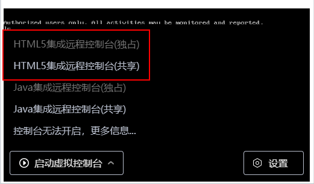
<div>2.在虚拟界面工具栏中，单击启动项工具，弹出启动项配置界面</div>
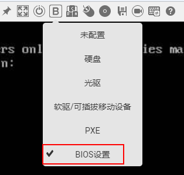
<div>3.在启动项配置界面选择，选择“BIOS设置”，然后在虚拟界面工具栏中单击重启工具，重启服务器。</div>
<div>4.系统重启后进入BIOS配置界面，依次选择“Advanced”\>“ Performance Config”</div>
<div></div>
<div>5.进入“Performance Config”，设置Power Policy为Performance。</div>
<div></div>
<div>6.按下“F10”保存配置并重启服务器。</div>
</pre>
</pre></details>


<details><summary>AICPU算子过多----AICPU转AICORE</summary>
    <pre style="background-color:Gray">
<h3>场景解析</h3>Profiling数据发现，OP_TYPE为AICPU的算子数量较多。
<h3>调优思路</h3>相比与AICPU，AICORE的计算性能更高，需要通过Profiling数据分析，算子为何在AICPU上运行，并调至AICORE上运行，提升性能。
<h3>优化方法</h3>当输入dtype为INT64时，AICORE算子不支持INT64，故可以考虑将dtype转换为INT32或Float类型，即可让算子在AICORE上运行。
<h3>样例参考</h3>
<pre>
#修改前
_,loss_idx = loss_c.sort(1,descending=True)
_,idx_rank = loss_idx.sort(1)
<div>根据profiling数据分析，第二个sort的耗时为10000ms，这个sort的tensor为第一次sort后产生的index，而index为int类型，所以第二次sort会在AICPU上运行。因此需要将index转为AICORE支持的float32位。</div>
#修改后
<div>_,loss_idx = loss_c.sort(1,descending=True)
loss_idx = loss_idx.float()
_,idx_rank = loss_idx.sort(1)
或
_,loss_idx = loss_c.sort(1,descending=True)
_,idx_rank = loss_idx.to(torch.float32).sort(1)</div>
</pre>
</pre>
</details>


<details><summary>存在动态shape----开启模糊编译</summary>
<pre style="background-color:Gray">
<h3>场景解析</h3>当前NPU是是在线编译算子的，对动态shape场景会反复编译算子导致性能较差，动态shape一般发生在nonzero操作与tensor[index]切片操作。
<pre>基础指令参考
·查看当前编译的算子个数ls -l kernel_meta/ | wc -l
	·可以持续观察下算子个数是否随epoch增长来判断是否动态shapewatch "ls -l kernel_meta/ | wc -l"
·查看最新编译的5个算子ls -lt kernel_meta/ | head -5
	·通过查看算子名称，可以大致推断动态shape所在的地方
</pre>
<h3>调优思路</h3>,当前Pytorch在执行算子时会check shape和attribute，如遇到未编译的则会进行编译，导致运行速度下降,可通过脚本获取host侧日志，解析得到重编译算子信息，关注step3后的有编译过程的算子。
<h3>优化方法</h3>
    <pre>
    1.获取host日志
    添加每个iter的标志位
    -------------------
   		# Example
		for idx, (img, target) in enumerate(dataset_loader):
    		# 添加标志位
    		print('=====iter%d'%idx)
   		 ...
  	-------------------
  	推荐运行5-10个step
  	2.解析得到recompile_op.txt
  		# 初步grep得到
		cat nohup.out | egrep "To compile op|=====iter">recompile_op.log
		# 输出recompile_op_list.txt
		python3.7.5  recompiled_op.py
	3.重点关注recompile_op_list.txt中step3以后的compile的算子，视为动态shape引起的重编译算子。
	4.固定动态shape,参考<a href="https://gitee.com/wangjiangben_hw/ascend-pytorch-crowdintelligence-doc/blob/master/pytorch-train-guide/%E5%9B%BA%E5%AE%9A%E5%8A%A8%E6%80%81shape%E8%8C%83%E4%BE%8B%E6%96%87%E6%A1%A3.md#%E5%9B%BA%E5%AE%9A%E5%8A%A8%E6%80%81shape%E8%8C%83%E4%BE%8B%E6%96%87%E6%A1%A3">固定动态shape范例</a>
</pre>
<h3>样例参考</h3>
<pre>
"""用于导出动态shape算子
"""
<div>
import os
import sys
import argparse
</div>
<div>
def func(log_path, split_flag):
    """
    :param log_path: where log_path addr is.
    :return:
    """
    recompile_flag = 'To compile op: '
    output_list = [[]]
<div>
    with open(log_path, 'r')as f:
        log_list = f.read().split('\n')
        for log in log_list:
            log = log.strip()
            if split_flag in log:
                output_list.append([])
            elif recompile_flag in log:
                op_name = log.split(recompile_flag)[1]
                if op_name not in output_list[-1]:
                    output_list[-1].append(op_name)
</div><div>
    with open('recompile_op_list.txt', 'w')as f:
        for idx, output in enumerate(output_list):
            f.write('iter: %d' % idx + '\n')
            f.write(','.join(output) + '\n')
</div>
<div>
if __name__ == "__main__":
    parser = argparse.ArgumentParser(description='trans the log')
    parser.add_argument('--log_path', default="./recompile_op.log",
                        help="input the dir name, trans the current dir with default")
    parser.add_argument('--split_flag', default='=====iter',
                        help="flag for split epochs")
    args = parser.parse_args()
    func(args.log_path, args.split_flag)
</div> 
</div>
</pre>
</details>


<details><summary>通信耗时过长----使用DDP功能</summary>
    <pre style="background-color:Gray">
<h3>场景解析</h3>分布式训练场景
<h3>调优思路</h3>分布式训练时，多卡间的通信会造成多余的耗时，需要消除该耗时即可开启框架的DDP功能。
<h3>优化方法</h3>
    <pre>
1.环境准备
  dist.init_process_group(backend=args.dist_backend, world_size=args.world_size, rank=args.rank)
  #init_process_group有3种初始化方式：TCP、共享文件、环境变量启动
  #分布式的调用方式请参考<a href="https://gitee.com/ascend/pytorch/tree/master/docs/zh/PyTorch%E7%BD%91%E7%BB%9C%E6%A8%A1%E5%9E%8B%E7%A7%BB%E6%A4%8D&%E8%AE%AD%E7%BB%83%E6%8C%87%E5%8D%97">《PyTorch网络模型移植与训练指南》>快速上手>模型迁移</a>章节
2.添加ddp
  model = torch.nn.parallel.DistributedDataParallel(model, device_ids=[args.npu])
3.数据并行
  train_sampler = torch.utils.data.distributed.DistributedSampler(train_dataset)
  train_loader = torch.utils.data.DataLoader(train_dataset,batch_size,......,drop_last)
    </pre>
<h3>样例参考</h3>
    <pre>
import argparse
import torch
import torchvision
import os
import torch.distributed as dist
from torch.nn.parallel import DistributedDataParallel as DDP
class LinearModel(torch.nn.Module):
<div></div>
def __init__(self):
    super(LinearModel, self).__init__() 
    self.linear = torch.nn.Linear(1, 1)
<div></div>
def forward(self, x): 
    y_pred = self.linear(x) 
    return y_pred
<div></div>    
def train(npu, ngpus_per_node, opt): # spawn接口自动对npu进行赋值，从0 ~ ngpus_per_node-1 取值
<div></div>
device = torch.device("npu:%d"%npu)
opt.world_size = ngpus_per_node * opt.world_size                                               # 总的加速卡数量
opt.local_rank = opt.local_rank * ngpus_per_node + npu                                         # 当前卡在所以训练卡中的编号
dist.init_process_group(backend='hccl', world_size=opt.world_size, rank=opt.local_rank)        # 设置后端，聚合通信算法
train_dataset = torchvision.datasets.MNIST(
            './mnist', train=True, transform=torchvision.transforms.ToTensor(), download=True) # 读取训练集
train_sampler = torch.utils.data.distributed.DistributedSampler(train_dataset)                 # 划分数据集，以避免不同进程间数据重复
train_loader = torch.utils.data.DataLoader(train_dataset, batch_size=32, sampler=train_sampler) # 训练集迭代器
test_dataset = torchvision.datasets.MNIST(
            './mnist', train=False, transform=torchvision.transforms.ToTensor())                # 读取验证集
test_loader = torch.utils.data.DataLoader(test_dataset, batch_size=32)                          # 验证集迭代器
<div></div>
model = LinearModel().to(device)                           # 模型初始化
criterion = torch.nn.MSELoss(size_average=False)           # 均方损失函数
optimizer = torch.optim.SGD(model.parameters(), lr=0.01)   # 梯度下降优化器
# model = torch.nn.DataParallel(model)
model = DDP(model, device_ids=[npu], broadcast_buffers=False)
<div></div>
for epoch in range(opt.epochs):            # 训练轮次
    train_sampler.set_epoch(epoch)         # 打乱数据集
    model.train()                          # 训练模式
<div></div>
    for imgs, labels in train_loader:                        # 遍历训练数据集
        imgs, labels = imgs.to(device), labels.to(device)
        optimizer.zero_grad()                                # 优化器梯度清零
        pred = model(imgs)                                   # 正向推理
        loss = criterion(pred, labels)                       # loss计算
        loss.backward()                                      # 反向梯度计算
        optimizer.step()                                     # 模型参数更新
<div></div>
with torch.no_grad():
    for imgs in test_loader: 
        preds = model(imgs)          # 正向推理
        print('preds = ', preds)     # 输出推理结果
<div></div>       
if name == 'main':
<div></div>
parser = argparse.ArgumentParser()
parser.add_argument('--epochs', type=int, default=300)
parser.add_argument('--device', type=int, default=0)
<div></div>
# DDP parameters
parser.add_argument('--world-size', default=1, type=int, help='number of nodes')          # 训练服务器数量
parser.add_argument('--device-num', default=1, type=int, help='number of cards per node') # 每台服务器的卡数量
parser.add_argument('--local_rank', type=int, default=-1, help='DDP parameter')           # 训练服务器编号
parser.add_argument('--addr', default='10.38.60.25', type=str, help='master IP')          # 训练主节点IP
<div></div>
opt = parser.parse_args()
os.environ['MASTER_ADDR'] = opt.addr                                                # 设置环境变量：训练主节点IP
os.environ['MASTER_PORT'] = '29501'                                                 # 设置环境变量：训练主节点端口
ngpus_per_node = opt.device_num                                                     # 每台服务器的加速卡数量
<div></div>
torch.multiprocessing.spawn(train, nprocs=ngpus_per_node, args=(ngpus_per_node, opt))
</pre>
</pre>
</details>


### CPU的使用率低+NPU的使用率低

**解析数据**

- 通过命令判断CPU与NPU的使用率

**调优参考**

<details><summary>NPU资源使用不充分----同比例增大Batchsize与LearningRates</summary>
    <pre style="background-color:Gray">
<h3>场景解析</h3>小batchsize模型训练
<h3>调优思路</h3>同比例增大Batchsize与LearningRates，能够更有效充分的利用NPU的算力资源。
<h3>优化方法</h3>在模型脚本中，依据原始batchsize修改增大模型batchsize。
</pre>
</details>


<details><summary>磁盘IO过低----更换nvme硬盘</summary></details>

<details><summary>WORKER数太少----增大WORKER数</summary></details>


## 精度调测

### 前提条件

优先在同等语义和超参下，跑一定的epoch（推荐完整epoch数的20%），使精度，loss等对齐GPU相应水平，完成后再对齐最终精度。

### 调测过程

-   **[总体思路](#总体)**  

-   **[精度比对工具](#精度比对工具)**  

### 总体思路

精度问题排查需要找出是哪一步出现的问题，主要以下几个方面：

1.  <a name="li17755175510322"></a>模型网络计算错误。
    -   定位思路：在网络中加入hook进行排查判断是哪个地方有较大嫌疑，然后构建[单算子用例](#单算子样例编写说明)逐渐缩小错误范围，证明该算子在当前网络场景下计算有误，可以对比CPU或GPU结果证明。

    -   规避方案：使用同等语义其他算子替代。

    -   解决方案：改进算子精度或功能问题。

2.  <a name="li25281726103316"></a>loss计算错误。
    -   定位思路：由于Loss的特殊性和可以自定义，在判断Loss计算错误后建议dump网络中的loss的输入来测试而非随机同shape tensor，这样才能更好地复现证明。

    -   规避方案：使用同等语义其他算子替代。

    -   解决方案：改进算子精度或功能问题（loss也是由算子构成）。

3.  参数更新错误。

    -   定位思路：在每个optim.step\(\)前对网络中的参数逐个打印其grad进行排查判断是哪个地方有较大嫌疑，然后构建单算子用例逐渐缩小错误范围，证明该算子在当前网络场景下梯度计算有误，可以对比CPU或GPU结果证明。该项优先级应低于[1.](#li17755175510322)与[2.](#li25281726103316)，因为1与2的错误同样可以造成grad异常。

    -   规避方案：使用同等语义其他算子替代。

    -   解决方案：改进计算grad的算子精度或功能问题。

4.  多卡计算错误。

    -   定位思路：在保证单卡精度OK的前提下，稳定复现多卡不收敛。

    -   解决方案：建议联系华为方支撑人员，提供稳定复现的单P和多P脚本。

## 模型调优样例

### ShuffleNet模型调优示例

-   **[样例获取](#样例获取-5)**  

-   **[模型评估](#模型评估)**  

-   **[网络迁移](#网络迁移)**  

-   **[网络调测](#网络调测)**  

#### 样例获取<a name="section1155115015182"></a>

1.  本样例基于PyTorch官网提供的Imagenet数据集训练模型进行适配昇腾910 AI处理器的迁移改造，样例获取路径为[https://github.com/pytorch/examples/tree/master/imagenet](https://github.com/pytorch/examples/tree/master/imagenet)。
2.  ShuffleNet模型参考PyTorch官网模型[ShuffleNet V2](https://pytorch.org/hub/pytorch_vision_shufflenet_v2/)，实际使用在脚本执行中直接指定参数arch为shufflenet\_v2\_x1\_0。

    ```
    --arch shufflenet_v2_x1_0
    ```

    > **说明：** 
    >ShuffleNet为PyTorch内置模型，了解更多内置模型请前往[Pytorch官网](https://pytorch.org/)。

#### 模型评估

模型评估主要关注算子适配情况，使用dump op方法获取ShuffleNet网络算子信息，与[《PyTorch API 支持清单》](https://gitee.com/ascend/pytorch/blob/v1.8.1-3.0.rc2/docs/zh/PyTorch%20API%E6%94%AF%E6%8C%81%E6%B8%85%E5%8D%95.md)算子进行对比，若是发现某个算子当前暂不支持，对于简单场景我们可以考虑先暂时替换成类似的算子或者把该算子单独放到cpu上执行两种方式规避，复杂场景不支持算子需要参见[《PyTorch算子开发指南》](https://gitee.com/ascend/pytorch/blob/v1.8.1-3.0.rc2/docs/zh/PyTorch%E7%AE%97%E5%AD%90%E5%BC%80%E5%8F%91%E6%8C%87%E5%8D%97/PyTorch%E7%AE%97%E5%AD%90%E5%BC%80%E5%8F%91%E6%8C%87%E5%8D%97.md)进行算子开发。

#### 网络迁移

训练脚本迁移请参见[《PyTorch网络模型移植&训练指南》](https://gitee.com/ascend/pytorch/blob/v1.8.1-3.0.rc2/docs/zh/PyTorch%E7%BD%91%E7%BB%9C%E6%A8%A1%E5%9E%8B%E7%A7%BB%E6%A4%8D&%E8%AE%AD%E7%BB%83%E6%8C%87%E5%8D%97/PyTorch%E7%BD%91%E7%BB%9C%E6%A8%A1%E5%9E%8B%E7%A7%BB%E6%A4%8D&%E8%AE%AD%E7%BB%83%E6%8C%87%E5%8D%97.md)。脚本执行时注意选择参数--arch shufflenet\_v2\_x1\_0。

#### 网络调测

网络调测具体方法请参见[性能瓶颈分析与优化](#性能瓶颈分析与优化)。经排查ShuffleNet运行时相关算子耗时过大，以下给出耗时数据及解决方法。

**前向排查**<a name="section7544311140"></a>

前向排查记录表如下：

**表 1**  前向排查

<a name="table232610016208"></a>
<table><thead align="left"><tr id="row5326170182016"><th class="cellrowborder" valign="top" width="6.419999999999999%" id="mcps1.2.5.1.1"><p id="p113266011202"><a name="p113266011202"></a><a name="p113266011202"></a>序号</p>
</th>
<th class="cellrowborder" valign="top" width="10.39%" id="mcps1.2.5.1.2"><p id="p1232670152015"><a name="p1232670152015"></a><a name="p1232670152015"></a>time(ms)</p>
</th>
<th class="cellrowborder" valign="top" width="11.35%" id="mcps1.2.5.1.3"><p id="p1132670152010"><a name="p1132670152010"></a><a name="p1132670152010"></a>batch_size</p>
</th>
<th class="cellrowborder" valign="top" width="71.84%" id="mcps1.2.5.1.4"><p id="p1532619082018"><a name="p1532619082018"></a><a name="p1532619082018"></a>detail</p>
</th>
</tr>
</thead>
<tbody><tr id="row53268019209"><td class="cellrowborder" valign="top" width="6.419999999999999%" headers="mcps1.2.5.1.1 "><p id="p193266092012"><a name="p193266092012"></a><a name="p193266092012"></a>1</p>
</td>
<td class="cellrowborder" valign="top" width="10.39%" headers="mcps1.2.5.1.2 "><p id="p14326102208"><a name="p14326102208"></a><a name="p14326102208"></a>1100</p>
</td>
<td class="cellrowborder" valign="top" width="11.35%" headers="mcps1.2.5.1.3 "><p id="p7326105208"><a name="p7326105208"></a><a name="p7326105208"></a>512</p>
</td>
<td class="cellrowborder" valign="top" width="71.84%" headers="mcps1.2.5.1.4 "><p id="p133269002013"><a name="p133269002013"></a><a name="p133269002013"></a>channel_shuffle操作使用channel_shuffle_index_select替代。</p>
</td>
</tr>
<tr id="row5326150202019"><td class="cellrowborder" valign="top" width="6.419999999999999%" headers="mcps1.2.5.1.1 "><p id="p123267020208"><a name="p123267020208"></a><a name="p123267020208"></a>2</p>
</td>
<td class="cellrowborder" valign="top" width="10.39%" headers="mcps1.2.5.1.2 "><p id="p63261403208"><a name="p63261403208"></a><a name="p63261403208"></a>600</p>
</td>
<td class="cellrowborder" valign="top" width="11.35%" headers="mcps1.2.5.1.3 "><p id="p14326904209"><a name="p14326904209"></a><a name="p14326904209"></a>512</p>
</td>
<td class="cellrowborder" valign="top" width="71.84%" headers="mcps1.2.5.1.4 "><p id="p0326908205"><a name="p0326908205"></a><a name="p0326908205"></a>使用两个channel_shuffle_index_select操作消减chunk带来的不连续。</p>
</td>
</tr>
<tr id="row03268014201"><td class="cellrowborder" valign="top" width="6.419999999999999%" headers="mcps1.2.5.1.1 "><p id="p1332620019203"><a name="p1332620019203"></a><a name="p1332620019203"></a>3</p>
</td>
<td class="cellrowborder" valign="top" width="10.39%" headers="mcps1.2.5.1.2 "><p id="p173263082011"><a name="p173263082011"></a><a name="p173263082011"></a>300</p>
</td>
<td class="cellrowborder" valign="top" width="11.35%" headers="mcps1.2.5.1.3 "><p id="p632617010204"><a name="p632617010204"></a><a name="p632617010204"></a>512</p>
</td>
<td class="cellrowborder" valign="top" width="71.84%" headers="mcps1.2.5.1.4 "><p id="p1432716017202"><a name="p1432716017202"></a><a name="p1432716017202"></a>通过框架层，指定concat输出格式为NCHW以消除过多的transdata。</p>
</td>
</tr>
<tr id="row132740142011"><td class="cellrowborder" valign="top" width="6.419999999999999%" headers="mcps1.2.5.1.1 "><p id="p83271404205"><a name="p83271404205"></a><a name="p83271404205"></a>4</p>
</td>
<td class="cellrowborder" valign="top" width="10.39%" headers="mcps1.2.5.1.2 "><p id="p173278042012"><a name="p173278042012"></a><a name="p173278042012"></a>285</p>
</td>
<td class="cellrowborder" valign="top" width="11.35%" headers="mcps1.2.5.1.3 "><p id="p123272082015"><a name="p123272082015"></a><a name="p123272082015"></a>512</p>
</td>
<td class="cellrowborder" valign="top" width="71.84%" headers="mcps1.2.5.1.4 "><p id="p632715019200"><a name="p632715019200"></a><a name="p632715019200"></a>修复了未初始化weight格式。</p>
</td>
</tr>
<tr id="row123271804206"><td class="cellrowborder" valign="top" width="6.419999999999999%" headers="mcps1.2.5.1.1 "><p id="p23271501207"><a name="p23271501207"></a><a name="p23271501207"></a>5</p>
</td>
<td class="cellrowborder" valign="top" width="10.39%" headers="mcps1.2.5.1.2 "><p id="p33271104207"><a name="p33271104207"></a><a name="p33271104207"></a>275</p>
</td>
<td class="cellrowborder" valign="top" width="11.35%" headers="mcps1.2.5.1.3 "><p id="p5327304206"><a name="p5327304206"></a><a name="p5327304206"></a>512</p>
</td>
<td class="cellrowborder" valign="top" width="71.84%" headers="mcps1.2.5.1.4 "><p id="p132710016204"><a name="p132710016204"></a><a name="p132710016204"></a>修复了DWCONV没有指定输出格式为5HD的问题。</p>
</td>
</tr>
</tbody>
</table>

详细说明如下：

-   由于原生实现的torch.transpose\(x, 1, 2\).contiguous\(\)是使用了View类框架算子transpose，造成了非连续场景，使用channel\_shuffle\_index\_select，在语义相同的情况下使用计算类算子替换框架类算子，从而减少耗时。
-   由于shufflenetv2中含有大量的chunk操作，而chunk操作在Pytorch中为框架类算子，其结果会将一个tensor分割为几个等长的非连续的tensor，而非连续转连续这个操作目前耗时较长，故使用计算类算子消除非连续。
-   适配层在适配算子时默认指定输出格式为输入格式，但是concat不支持C轴非16整数倍的5HD的格式，会转为4D进行处理，又由于concat后面接的是gatherv2算子，也是仅支持4D格式的算子，所以导致数据格式转换过程为5HD-\>4D-\>concat-\>5HD-\>4D-\>gatherv2-\>5HD，解决方法是修改concat输出格式，当非16整数倍时指定输出格式为4D，优化后数据格式转换过程为5HD-\>4D-\>concat-\>gatherv2-\>5HD，当前针对ShuffleNet的做法具体可参考pytorch/aten/src/ATen/native/npu/CatKernelNpu.cpp 第121行。
-   参考[获取算子信息OP_INFO](#获取算子信息OP\_INFO)排查transdata算子，设置weight初始化格式避免计算过程中反复的transdata。
-   修复了DWCONV weight输出格式指定，避免一些不必要5HD-\>4D。

**整网排查**<a name="section1261194410241"></a>

整网排查记录表如下：

**表 2**  整网排查

<a name="table687975742418"></a>

<table><thead align="left"><tr id="row487985710248"><th class="cellrowborder" valign="top" width="6.419999999999999%" id="mcps1.2.5.1.1"><p id="p10879125714244"><a name="p10879125714244"></a><a name="p10879125714244"></a>序号</p>
</th>
<th class="cellrowborder" valign="top" width="10.39%" id="mcps1.2.5.1.2"><p id="p887995716244"><a name="p887995716244"></a><a name="p887995716244"></a>time(ms)</p>
</th>
<th class="cellrowborder" valign="top" width="11.35%" id="mcps1.2.5.1.3"><p id="p20880195718241"><a name="p20880195718241"></a><a name="p20880195718241"></a>batch_size</p>
</th>
<th class="cellrowborder" valign="top" width="71.84%" id="mcps1.2.5.1.4"><p id="p178802574242"><a name="p178802574242"></a><a name="p178802574242"></a>detail</p>
</th>
</tr>
</thead>
<tbody><tr id="row198802057102413"><td class="cellrowborder" valign="top" width="6.419999999999999%" headers="mcps1.2.5.1.1 "><p id="p163268032610"><a name="p163268032610"></a><a name="p163268032610"></a>1</p>
</td>
<td class="cellrowborder" valign="top" width="10.39%" headers="mcps1.2.5.1.2 "><p id="p832616092615"><a name="p832616092615"></a><a name="p832616092615"></a>5500</p>
</td>
<td class="cellrowborder" valign="top" width="11.35%" headers="mcps1.2.5.1.3 "><p id="p19326170172611"><a name="p19326170172611"></a><a name="p19326170172611"></a>512</p>
</td>
<td class="cellrowborder" valign="top" width="71.84%" headers="mcps1.2.5.1.4 "><p id="p43261107269"><a name="p43261107269"></a><a name="p43261107269"></a>通过框架层，index tocpu成index_add操作</p>
</td>
</tr>
<tr id="row108801057122419"><td class="cellrowborder" valign="top" width="6.419999999999999%" headers="mcps1.2.5.1.1 "><p id="p632612020269"><a name="p632612020269"></a><a name="p632612020269"></a>2</p>
</td>
<td class="cellrowborder" valign="top" width="10.39%" headers="mcps1.2.5.1.2 "><p id="p63267042618"><a name="p63267042618"></a><a name="p63267042618"></a>4000</p>
</td>
<td class="cellrowborder" valign="top" width="11.35%" headers="mcps1.2.5.1.3 "><p id="p832650172620"><a name="p832650172620"></a><a name="p832650172620"></a>512</p>
</td>
<td class="cellrowborder" valign="top" width="71.84%" headers="mcps1.2.5.1.4 "><p id="p23266002618"><a name="p23266002618"></a><a name="p23266002618"></a>通过自定义算子，预生成index，不再tocpu</p>
</td>
</tr>
<tr id="row8880175792411"><td class="cellrowborder" valign="top" width="6.419999999999999%" headers="mcps1.2.5.1.1 "><p id="p532616052611"><a name="p532616052611"></a><a name="p532616052611"></a>3</p>
</td>
<td class="cellrowborder" valign="top" width="10.39%" headers="mcps1.2.5.1.2 "><p id="p203262082619"><a name="p203262082619"></a><a name="p203262082619"></a>1800</p>
</td>
<td class="cellrowborder" valign="top" width="11.35%" headers="mcps1.2.5.1.3 "><p id="p832612022620"><a name="p832612022620"></a><a name="p832612022620"></a>512</p>
</td>
<td class="cellrowborder" valign="top" width="71.84%" headers="mcps1.2.5.1.4 "><p id="p153277016260"><a name="p153277016260"></a><a name="p153277016260"></a>通过自定义算子，融合index_add和chunk</p>
</td>
</tr>
<tr id="row1888065718245"><td class="cellrowborder" valign="top" width="6.419999999999999%" headers="mcps1.2.5.1.1 "><p id="p43279082615"><a name="p43279082615"></a><a name="p43279082615"></a>4</p>
</td>
<td class="cellrowborder" valign="top" width="10.39%" headers="mcps1.2.5.1.2 "><p id="p23279032618"><a name="p23279032618"></a><a name="p23279032618"></a>885</p>
</td>
<td class="cellrowborder" valign="top" width="11.35%" headers="mcps1.2.5.1.3 "><p id="p8327708268"><a name="p8327708268"></a><a name="p8327708268"></a>512</p>
</td>
<td class="cellrowborder" valign="top" width="71.84%" headers="mcps1.2.5.1.4 "><p id="p14327404268"><a name="p14327404268"></a><a name="p14327404268"></a>添加contiguous_with_gatherv2</p>
</td>
</tr>
<tr id="row1809181814263"><td class="cellrowborder" valign="top" width="6.419999999999999%" headers="mcps1.2.5.1.1 "><p id="p10266151062717"><a name="p10266151062717"></a><a name="p10266151062717"></a>5</p>
</td>
<td class="cellrowborder" valign="top" width="10.39%" headers="mcps1.2.5.1.2 "><p id="p3266191019278"><a name="p3266191019278"></a><a name="p3266191019278"></a>3480</p>
</td>
<td class="cellrowborder" valign="top" width="11.35%" headers="mcps1.2.5.1.3 "><p id="p426631017276"><a name="p426631017276"></a><a name="p426631017276"></a>1024</p>
</td>
<td class="cellrowborder" valign="top" width="71.84%" headers="mcps1.2.5.1.4 "><p id="p726615104272"><a name="p726615104272"></a><a name="p726615104272"></a>修改batchsize</p>
</td>
</tr>
<tr id="row319224152613"><td class="cellrowborder" valign="top" width="6.419999999999999%" headers="mcps1.2.5.1.1 "><p id="p10266310122713"><a name="p10266310122713"></a><a name="p10266310122713"></a>6</p>
</td>
<td class="cellrowborder" valign="top" width="10.39%" headers="mcps1.2.5.1.2 "><p id="p6266141042716"><a name="p6266141042716"></a><a name="p6266141042716"></a>1650</p>
</td>
<td class="cellrowborder" valign="top" width="11.35%" headers="mcps1.2.5.1.3 "><p id="p1426611012713"><a name="p1426611012713"></a><a name="p1426611012713"></a>1024</p>
</td>
<td class="cellrowborder" valign="top" width="71.84%" headers="mcps1.2.5.1.4 "><p id="p9266810202717"><a name="p9266810202717"></a><a name="p9266810202717"></a>修改batchsize + contiguous_with_gatherv2</p>
</td>
</tr>
<tr id="row1638723117266"><td class="cellrowborder" valign="top" width="6.419999999999999%" headers="mcps1.2.5.1.1 "><p id="p13266171012714"><a name="p13266171012714"></a><a name="p13266171012714"></a>7</p>
</td>
<td class="cellrowborder" valign="top" width="10.39%" headers="mcps1.2.5.1.2 "><p id="p1326615108277"><a name="p1326615108277"></a><a name="p1326615108277"></a>1424</p>
</td>
<td class="cellrowborder" valign="top" width="11.35%" headers="mcps1.2.5.1.3 "><p id="p10266151019277"><a name="p10266151019277"></a><a name="p10266151019277"></a>1024</p>
</td>
<td class="cellrowborder" valign="top" width="71.84%" headers="mcps1.2.5.1.4 "><p id="p02661010122711"><a name="p02661010122711"></a><a name="p02661010122711"></a>通过自定义算子，融合cat+shuffle+chunk，消除不连续</p>
</td>
</tr>
<tr id="row3364411265"><td class="cellrowborder" valign="top" width="6.419999999999999%" headers="mcps1.2.5.1.1 "><p id="p13266810192715"><a name="p13266810192715"></a><a name="p13266810192715"></a>8</p>
</td>
<td class="cellrowborder" valign="top" width="10.39%" headers="mcps1.2.5.1.2 "><p id="p15266610192715"><a name="p15266610192715"></a><a name="p15266610192715"></a>1360</p>
</td>
<td class="cellrowborder" valign="top" width="11.35%" headers="mcps1.2.5.1.3 "><p id="p182661010172714"><a name="p182661010172714"></a><a name="p182661010172714"></a>1024</p>
</td>
<td class="cellrowborder" valign="top" width="71.84%" headers="mcps1.2.5.1.4 "><p id="p9266210132711"><a name="p9266210132711"></a><a name="p9266210132711"></a>通过框架层，修改relugrad传入的grad格式</p>
</td>
</tr>
<tr id="row6787652162615"><td class="cellrowborder" valign="top" width="6.419999999999999%" headers="mcps1.2.5.1.1 "><p id="p726617104277"><a name="p726617104277"></a><a name="p726617104277"></a>9</p>
</td>
<td class="cellrowborder" valign="top" width="10.39%" headers="mcps1.2.5.1.2 "><p id="p11266161012272"><a name="p11266161012272"></a><a name="p11266161012272"></a>1300</p>
</td>
<td class="cellrowborder" valign="top" width="11.35%" headers="mcps1.2.5.1.3 "><p id="p626618101279"><a name="p626618101279"></a><a name="p626618101279"></a>1024</p>
</td>
<td class="cellrowborder" valign="top" width="71.84%" headers="mcps1.2.5.1.4 "><p id="p11266151019277"><a name="p11266151019277"></a><a name="p11266151019277"></a>修改IndexSelectFullImplementation的bp传入格式</p>
</td>
</tr>
<tr id="row04915505264"><td class="cellrowborder" valign="top" width="6.419999999999999%" headers="mcps1.2.5.1.1 "><p id="p8266111017270"><a name="p8266111017270"></a><a name="p8266111017270"></a>10</p>
</td>
<td class="cellrowborder" valign="top" width="10.39%" headers="mcps1.2.5.1.2 "><p id="p32661110112716"><a name="p32661110112716"></a><a name="p32661110112716"></a>920</p>
</td>
<td class="cellrowborder" valign="top" width="11.35%" headers="mcps1.2.5.1.3 "><p id="p426712104276"><a name="p426712104276"></a><a name="p426712104276"></a>1024</p>
</td>
<td class="cellrowborder" valign="top" width="71.84%" headers="mcps1.2.5.1.4 "><p id="p7267710172713"><a name="p7267710172713"></a><a name="p7267710172713"></a>修改amp O1</p>
</td>
</tr>
<tr id="row11238472267"><td class="cellrowborder" valign="top" width="6.419999999999999%" headers="mcps1.2.5.1.1 "><p id="p62671810142717"><a name="p62671810142717"></a><a name="p62671810142717"></a>11</p>
</td>
<td class="cellrowborder" valign="top" width="10.39%" headers="mcps1.2.5.1.2 "><p id="p7267141062717"><a name="p7267141062717"></a><a name="p7267141062717"></a>860</p>
</td>
<td class="cellrowborder" valign="top" width="11.35%" headers="mcps1.2.5.1.3 "><p id="p182672010142713"><a name="p182672010142713"></a><a name="p182672010142713"></a>1024</p>
</td>
<td class="cellrowborder" valign="top" width="71.84%" headers="mcps1.2.5.1.4 "><p id="p19267710182715"><a name="p19267710182715"></a><a name="p19267710182715"></a>修改amp O2</p>
</td>
</tr>
<tr id="row05412410260"><td class="cellrowborder" valign="top" width="6.419999999999999%" headers="mcps1.2.5.1.1 "><p id="p19267161014278"><a name="p19267161014278"></a><a name="p19267161014278"></a>12</p>
</td>
<td class="cellrowborder" valign="top" width="10.39%" headers="mcps1.2.5.1.2 "><p id="p17267141062711"><a name="p17267141062711"></a><a name="p17267141062711"></a>830</p>
</td>
<td class="cellrowborder" valign="top" width="11.35%" headers="mcps1.2.5.1.3 "><p id="p1267131052710"><a name="p1267131052710"></a><a name="p1267131052710"></a>1024</p>
</td>
<td class="cellrowborder" valign="top" width="71.84%" headers="mcps1.2.5.1.4 "><p id="p526741013275"><a name="p526741013275"></a><a name="p526741013275"></a>消除BN参数更新时AXPY引入的过多的transdata</p>
</td>
</tr>
<tr id="row1287433810267"><td class="cellrowborder" valign="top" width="6.419999999999999%" headers="mcps1.2.5.1.1 "><p id="p226771012272"><a name="p226771012272"></a><a name="p226771012272"></a>13</p>
</td>
<td class="cellrowborder" valign="top" width="10.39%" headers="mcps1.2.5.1.2 "><p id="p142671610202714"><a name="p142671610202714"></a><a name="p142671610202714"></a>800</p>
</td>
<td class="cellrowborder" valign="top" width="11.35%" headers="mcps1.2.5.1.3 "><p id="p926731042718"><a name="p926731042718"></a><a name="p926731042718"></a>1024</p>
</td>
<td class="cellrowborder" valign="top" width="71.84%" headers="mcps1.2.5.1.4 "><p id="p1026781062712"><a name="p1026781062712"></a><a name="p1026781062712"></a>消除所有fp bp parm_updata间的流同步</p>
</td>
</tr>
<tr id="row1421637112613"><td class="cellrowborder" valign="top" width="6.419999999999999%" headers="mcps1.2.5.1.1 "><p id="p2026741052717"><a name="p2026741052717"></a><a name="p2026741052717"></a>14</p>
</td>
<td class="cellrowborder" valign="top" width="10.39%" headers="mcps1.2.5.1.2 "><p id="p192671109273"><a name="p192671109273"></a><a name="p192671109273"></a>461</p>
</td>
<td class="cellrowborder" valign="top" width="11.35%" headers="mcps1.2.5.1.3 "><p id="p8267410112719"><a name="p8267410112719"></a><a name="p8267410112719"></a>1024</p>
</td>
<td class="cellrowborder" valign="top" width="71.84%" headers="mcps1.2.5.1.4 "><p id="p182671510182719"><a name="p182671510182719"></a><a name="p182671510182719"></a>针对非32对齐场景，改进GatherV2算子</p>
</td>
</tr>
<tr id="row2016593542618"><td class="cellrowborder" valign="top" width="6.419999999999999%" headers="mcps1.2.5.1.1 "><p id="p9267191020272"><a name="p9267191020272"></a><a name="p9267191020272"></a>15</p>
</td>
<td class="cellrowborder" valign="top" width="10.39%" headers="mcps1.2.5.1.2 "><p id="p122675102278"><a name="p122675102278"></a><a name="p122675102278"></a>429</p>
</td>
<td class="cellrowborder" valign="top" width="11.35%" headers="mcps1.2.5.1.3 "><p id="p1267121012718"><a name="p1267121012718"></a><a name="p1267121012718"></a>1024</p>
</td>
<td class="cellrowborder" valign="top" width="71.84%" headers="mcps1.2.5.1.4 "><p id="p9267710192717"><a name="p9267710192717"></a><a name="p9267710192717"></a>针对ShufflenetV2场景再次优化GatherV2算子--&gt;GatherV3</p>
</td>
</tr>
</tbody>
</table>

详细说明如下：

1.  使用计算类算子替换框架类算子。

2.  使用buffer记录index信息到npu，消除index.to\('npu'\) 的操作。

3.  使用计算类算子消除非连续。

4.  contiguous\_with\_gatherv2是使用aicore算子GatherV2来完成非连续转连续操作。

5.  修改batchsize。

6.  修改batchsize + contiguous\_with\_gatherv2。

7.  由于concat算子的反向是chunk，会引起非连续问题，故自定义concat算子反向，使用Gatherv2替代chunk，将其融合成cat+shuffle+chunk，消除不连续。

8.  ReluGrad算子有两个输入：grad\_output（反向的输入），self（正向的输出），在shufflenet中有时会出现4D + 5HD的场景，而FE的格式对齐往往对齐第一个tensor的format，结果就会导致\(4D, 5HD\)-\>\(4D, 4D\)-\>ReluGrad-\>4D-\>5HD。由于正向的输出格式基本就是输入格式，而relu往往是配合在Conv+BN+Relu这样使用，所以可以认为，在这个场景下，输出5HD是更合适的选择。于是手动插入npu\_format\_cast，\(4D, 5HD\)-\>\(5HD, 5HD\)-\>ReluGrad-\>5HD。

9.  IndexSelectFullImplementation中涉及到了对一个5HD的tensor做两次gatherv2操作，这个时候会导致两次的5HD-\>4D，可以手动先做一次5HD-\>4D，这样就可以在gatherv2时不做transdata，从而消减一次transdata操作。

10. 加入混合精度O1。

11. 加入混合精度O2。
12. 由于Axpy算子的参数校验，所有网络在参数更新时，如C不整除16则会transdata为4D进行Axpy运算，引入了大量的transdata算子，通过增加一个函数，当Axpy的input的shape一致时结束校验，从而避免了格式转换，增加了运行效率。

13. 删除所有的流同步操作，原因是容易导致不收敛，没有采纳。

14. 使用针对非对齐优化后的Gatherv2算子后，整体性能提速至交付水平。

15. 使用针对ShufflenetV2场景再次优化后的Gatherv3算子后，整体性能还能继续提升。

**Python侧优化细节**<a name="section18548161019295"></a>

Python侧优化主要是通过一些同等语义的修改，使网络在NPU上边的更加亲和。当前非连续转连续容易成为性能瓶颈，而ShufflenetV2中的channel\_shuffle操作就涉及了permute后转连续的操作，导致整网性能在NPU上较差。通过对channel\_shuffle操作进行同等语义的修改，加上和concat操作的融合，使得整网性能得到飞升。采用的是torchvision版本参见[开源链接](https://github.com/pytorch/vision/blob/master/torchvision/models/shufflenetv2.py)。

-   框架原始channel\_shuffle操作。

    ```
    def channel_shuffle(x, groups):
        # type: (torch.Tensor, int) -> torch.Tensor
        batchsize, num_channels, height, width = x.data.size()
        channels_per_group = num_channels // groups
        # reshape
        x = x.view(batchsize, groups,
                   channels_per_group, height, width)
        x = torch.transpose(x, 1, 2).contiguous()
        # flatten
        x = x.view(batchsize, -1, height, width)
        return x
    
    class InvertedResidual(nn.Module):
        def __init__(self, inp, oup, stride):
            super(InvertedResidual, self).__init__()
            if not (1 <= stride <= 3):
                raise ValueError('illegal stride value')
            self.stride = stride
            branch_features = oup // 2
            assert (self.stride != 1) or (inp == branch_features << 1)
            if self.stride > 1:
                self.branch1 = nn.Sequential(
                    self.depthwise_conv(inp, inp, kernel_size=3, stride=self.stride, padding=1),
                    nn.BatchNorm2d(inp),
                    nn.Conv2d(inp, branch_features, kernel_size=1, stride=1, padding=0, bias=False),
                    nn.BatchNorm2d(branch_features),
                    nn.ReLU(inplace=True),
                )
            else:
                self.branch1 = nn.Sequential()
    
            self.branch2 = nn.Sequential(
                nn.Conv2d(inp if (self.stride > 1) else branch_features,
                          branch_features, kernel_size=1, stride=1, padding=0, bias=False),
                nn.BatchNorm2d(branch_features),
                nn.ReLU(inplace=True),
                self.depthwise_conv(branch_features, branch_features, kernel_size=3, stride=self.stride, padding=1),
                nn.BatchNorm2d(branch_features),
                nn.Conv2d(branch_features, branch_features, kernel_size=1, stride=1, padding=0, bias=False),
                nn.BatchNorm2d(branch_features),
                nn.ReLU(inplace=True),
            )
    
        @staticmethod
        def depthwise_conv(i, o, kernel_size, stride=1, padding=0, bias=False):
            return nn.Conv2d(i, o, kernel_size, stride, padding, bias=bias, groups=i)
    
        def forward(self, x):
            if self.stride == 1:
                x1, x2 = x.chunk(2, dim=1)
                out = torch.cat((x1, self.branch2(x2)), dim=1)
            else:
                out = torch.cat((self.branch1(x), self.branch2(x)), dim=1)
    
            out = channel_shuffle(out, 2)
    
            return out
    ```

- 同等语义改写。

  ```
  def channel_shuffle_index_select(x, groups=2):
      N, C, H, W = x.shape
      inp = C
      # channel_shuffle操作是对C维按一定规则的重排的工作，可以被表达为一次简单的重排
      group_len = inp // groups
      index = torch.from_numpy(np.array(list(range(inp))).reshape(groups, group_len).transpose(1, 0).flatten()).long()
  
      x = x.index_select(1, index)
      return x
  
  # 对两个操作进行结果对比，可以看到语义是相等的
  x = torch.randn(2, 232, 14, 14)
  for group in [2, 4, 8]:
      out1 = channel_shuffle(x, group)
      out2 = channel_shuffle_index_select(x, group)
      print((out1 - out2).sum())
  ```

-   昇腾AI处理器亲和写法。

    ```
    # 对应 out = channel_shuffle(torch.cat((self.branch1(x), self.branch2(x)), dim=1)) 的情形
    # 使用channel_shuffle_index_select替代channel_shuffle
    # 自定义OP，融合channel_shuffle_index_select和cat，使用计算类算子来消减非连续
    class IndexSelectFullImplementation(torch.autograd.Function):
        @staticmethod
        def forward(ctx, x1, x2, fp_index, bp_index1, bp_index2):
            # 强制流同步，仅稳定训练作用
            stream = torch_npu.npu.current_stream()
            stream.synchronize()
    
            # 对ctx注册bp_index1, bp_index2使反向时可以使用
            ctx.bp_index1 = bp_index1
            ctx.bp_index2 = bp_index2
    
            x = torch.cat([x1, x2], dim=1)
    
            # 使用index_select替代channel_shuffle操作，这里是后面不接chunk算子的场景
            result = x.index_select(1, fp_index)
    
            return result
    
        @staticmethod
        def backward(ctx, grad_output):
            # 强制流同步，仅稳定训练作用
            stream = torch_npu.npu.current_stream()
            stream.synchronize()
    
            # 由于index_select不支持5HD格式，将格式转换为NCHW来减少额外的transdata
            grad_output.data = grad_output.data.npu_format_cast(0)
    
            # 依据正向推导得到的反向的表达式，使用index_select同时完成对index_select和cat的反向
            out1 = grad_output.index_select(1, ctx.bp_index1)
            out2 = grad_output.index_select(1, ctx.bp_index2)
            return out1, out2, None, None, None, None
    
    
    class IndexSelectHalfImplementation(torch.autograd.Function):
        @staticmethod
        def forward(ctx, x1, x2, fp_index1, fp_index2, bp_index1, bp_index2):
            ctx.bp_index1 = bp_index1
            ctx.bp_index2 = bp_index2
            x = torch.cat([x1, x2], dim=1)
    
            # 使用index_select替代channel_shuffle操作，这里是后面接chunk算子的场景
            return x.index_select(1, fp_index1), x.index_select(1, fp_index2)
    
        @staticmethod
        def backward(ctx, grad_output1, grad_output2):
            grad_output = torch.cat([grad_output1, grad_output2], 1)
    
            out1 = grad_output.index_select(1, ctx.bp_index1)
            out2 = grad_output.index_select(1, ctx.bp_index2)
            return out1, out2, None, None, None, None
    
    
    class Channel_Shuffle(nn.Module):
        def __init__(self, inp, groups=2, split_shuffle=True):
            super(Channel_Shuffle, self).__init__()
    
            self.split_shuffle = split_shuffle
            self.group_len = inp // groups
    
            # 初始化channel_shuffle_index_select中需要使用的fp_index
            self.out = np.array(list(range(inp))).reshape(groups, self.group_len).transpose(1, 0).flatten().tolist()
    
            # 将初始化的fp_index按需注册为module的buffer，在to.device的时候顺路带到设备，减少h2dcopy的耗时
            # 此处仅展示常用的group=2的场景下的使用方式，其他情形请自行拓展
            if self.split_shuffle:
                self.register_buffer('fp_index1', torch.tensor(self.out[:self.group_len], dtype=torch.int32))
                self.register_buffer('fp_index2', torch.tensor(self.out[self.group_len:], dtype=torch.int32))
            else:
                self.register_buffer('fp_index', torch.tensor(self.out, dtype=torch.int32))
    
            # 将对应的bp_index按需注册为module的buffer，在to.device的时候顺路带到设备，减少h2dcopy的耗时
            self.register_buffer('bp_index1', torch.tensor(list(range(0, inp, 2)), dtype=torch.int32))
            self.register_buffer('bp_index2', torch.tensor(list(range(1, inp, 2)), dtype=torch.int32))
    
        def forward(self, x1, x2):
            if self.split_shuffle:
                return IndexSelectHalfImplementation.apply(x1, x2, self.fp_index1, self.fp_index2, self.bp_index1,
                                                           self.bp_index2)
            else:
                return IndexSelectFullImplementation.apply(x1, x2, self.fp_index, self.bp_index1, self.bp_index2)
    
    
    class InvertedResidual(nn.Module):
        def __init__(self, inp, oup, stride, split_shuffle=True):
            super(InvertedResidual, self).__init__()
    
            if not (1 <= stride <= 3):
                raise ValueError('illegal stride value')
            self.stride = stride
    
            branch_features = oup // 2
            assert (self.stride != 1) or (inp == branch_features << 1)
    
            if self.stride > 1:
                self.branch1 = nn.Sequential(
                    self.depthwise_conv(inp, inp, kernel_size=3, stride=self.stride, padding=1),
                    nn.BatchNorm2d(inp),
                    nn.Conv2d(inp, branch_features, kernel_size=1, stride=1, padding=0, bias=False),
                    nn.BatchNorm2d(branch_features),
                    nn.ReLU(inplace=True),
                )
            else:
                self.branch1 = nn.Sequential()
    
            self.branch2 = nn.Sequential(
                nn.Conv2d(inp if (self.stride > 1) else branch_features,
                          branch_features, kernel_size=1, stride=1, padding=0, bias=False),
                nn.BatchNorm2d(branch_features),
                nn.ReLU(inplace=True),
                self.depthwise_conv(branch_features, branch_features, kernel_size=3, stride=self.stride, padding=1),
                nn.BatchNorm2d(branch_features),
                nn.Conv2d(branch_features, branch_features, kernel_size=1, stride=1, padding=0, bias=False),
                nn.BatchNorm2d(branch_features),
                nn.ReLU(inplace=True),
            )
    
            if self.stride > 1:
                self.channel_shuffle = Channel_Shuffle(inp=branch_features + branch_features, groups=2,
                                                       split_shuffle=split_shuffle)
            else:
                self.channel_shuffle = Channel_Shuffle(inp=inp, groups=2, split_shuffle=split_shuffle)
    
        @staticmethod
        def depthwise_conv(i, o, kernel_size, stride=1, padding=0, bias=False):
            return nn.Conv2d(i, o, kernel_size, stride, padding, bias=bias, groups=i)
    
        def forward(self, x):
    
            # 删除concat和chunk操作，融合进self.channel_shuffle内处理
            if self.stride == 1:
                x1, x2 = x
                x2 = self.branch2(x2)
            else:
                x1 = self.branch1(x)
                x2 = self.branch2(x)
    
            out = self.channel_shuffle(x1, x2)
    
            return out
    ```

## 参考信息

-   **[亲和库](#亲和库)**
-   **[单算子样例编写说明](#单算子样例编写说明)**  
-   **[编译选项设置](#编译选项设置)**  
-   **[算子数据参考](#算子数据参考)**  

### 亲和库

#### 来源介绍

针对开源模型中常见的网络结构和函数，我们针对性地对其进行了优化，使得运算性能大幅度提升，同时，将其集成到Pytorch框架中，便于模型性能调优中使用。


#### 功能介绍

亲和库详细说明请参见[《PyTorch API 支持清单》](https://gitee.com/ascend/pytorch/blob/v1.8.1-3.0.rc2/docs/zh/PyTorch%20API%E6%94%AF%E6%8C%81%E6%B8%85%E5%8D%95.md)中”亲和库“章节。

> **说明：** 
>该部分调优内容会随着版本不断增强和更新，请以实际PyTorch版本中对应路径下的内容为准。


### 单算子样例编写说明

在模型中遇到问题时，使用整网复现问题成本较大，可以构建测试用例来复现精度或性能问题，便于定位解决。构建测试用例一般有如下两种方式。

1. 单算子测试用例构建，直接调用该算子即可复现错误场景。

   例如构建max算子的单算子样例如下：

   ```
      import copy
      import torch
      import torch_npu
      
      from torch.testing._internal.common_utils import TestCase, run_tests 
      class TestMax(TestCase):
             def cpu_op_exec(self, input1):
              # 调用算子 
              output = torch.max(input1)
              output = output.to('cpu')
              output = output.numpy()
              return output
      
          def npu_op_exec(self, input1):
              # 调用对应npu算子 
              output = torch.max(input1)
              return output
      
          def test_max(self):
              input = torch.randn(10,20))
              input = input.to(torch.int64)   # 数据dtype转换
              input_cpu = copy.deepcopy(input)
              input_npu = copy.deepcopy(input).npu()
      
              output_cpu = self.cpu_op_exec(input_cpu)
              output_npu = self.npu_op_exec(input_npu)
      
              # 比较cpu和npu的计算结果，prec为允许误差
              self.assertEqual(output_cpu, output_npu, prec = 1e-4) 
      
      if __name__ == '__main__':
          run_tests()
   
   ```

   > **说明：** 
   >-   运行上述代码，如果发现报错信息与模型中的max算子报错信息相同，则说明单算子测试用例构建成功。
   >-   假设注释掉输入数据dtype转换代码，发现测试用例无报错，则可以说明在输入参数为torch.int64时，max算子在npu上报错。

2.  基于上下文的单算子测试用例构建。

    这里虽然是单算子样例，但有时候不仅仅为一个操作，而是带有上下文的场景，还有时候是一个带参数Module，Module的方式是更通用的方法。此处构建一个包含两个OP的Module，构建样例如下：

    ```
    import copy
    import torch
    from torch.testing._internal.common_utils import TestCase, run_tests 
    import torch_npu
    
    class Model(nn.Module):
        def __init__(self, in_channels=1, hooks=False):
            super(Model, self).__init__()
            self.conv = nn.Conv2d(in_channels, in_channels*2, kernel_size=64)
            if hooks:
                self.conv.weight.register_hook(lambda grad: print(grad))
        def forward(self, x):
            out = self.conv(x)
            return out
    
    class TestConv2d(TestCase): 
        def test_conv2d(self):
    
            model = Model(in_channels=16)
    
            # 若需要获取反向计算结果，则加入hooks获取反向即可
            # model = Model(in_channels=16, hooks=True)
            # 创建输入tensor
            input_tensor = torch.randn(4,16,64,64)
    
            input_tensor_cpu= copy.deepcopy(input_tensor)
            out = model(input_tensor_cpu)
            loss = out.sum()
            loss.backward()
            cpuout = out
    
            # 3 to NPU 运行，将model和input_tensor放到NPU运行
            torch_npu.npu.set_device("npu:0") # 一般先set_device设定运行卡
            model_npu = Model(in_channels=16).npu()
            input_tensor_npu= copy.deepcopy(input_tensor).npu()
            out = model_npu(input_tensor_npu)
            loss = out.sum()
            loss.backward()
            npuout = out
            #根据结果，确定是否为报错场景
            self.assertEqual(cpuout, npuout, prec = 1e-4)
    
    if __name__ == '__main__':
        run_tests()
    ```

### 编译选项设置

用于配置算子编译过程中的属性，可用于提升性能，通过AscendCL接口实现。用法及解释如下：

```
import torch
import torch_npu
option = {key: val}
torch_npu.npu.set_option(option) # 以dict方式进行设置

其中key可选值和对应的含义如下：
ACL_OP_SELECT_IMPL_MODE,      //选择算子是高精度实现还是高性能实现
ACL_OPTYPELIST_FOR_IMPLMODE,  //列举算子类型的列表，该列表中的算子使用ACL_OP_SELECT_IMPL_MODE指定的模式
ACL_OP_DEBUG_LEVEL,           //TBE算子编译debug功能开关
ACL_DEBUG_DIR,                //保存模型转换、网络迁移过程中算子编译生成的调试相关过程文件的路径，包括算子.o/.json/.cce等文件。路径必须已经存在。
ACL_OP_COMPILER_CACHE_MODE,   //算子编译磁盘缓存模式
ACL_OP_COMPILER_CACHE_DIR,    //算子编译磁盘缓存的路径，路径必须已经存在。

key对应的val值解释和可设置值如下：
ACL_OP_SELECT_IMPL_MODE： 用于选择算子是高精度实现还是高性能实现。如果不配置该编译选项，默认采用high_precision。
    high_precision：表示网络模型中所有算子选择高精度实现。
    high_performance：表示网络模型中所有算子选择高性能实现。

ACL_OPTYPELIST_FOR_IMPLMODE：设置optype列表中算子的实现方式，该参数当前仅支持设置某个具体算子的实现方式，不支持设置多个算子。当前仅支持配置的算子为Pooling、SoftmaxV2、LRN、ROIAlign。算子类型的列表中的算子使用ACL_OP_SELECT_IMPL_MODE指定的模式。

ACL_OP_DEBUG_LEVEL：用于配置TBE算子编译debug功能开关。
    0：不开启算子debug功能。在执行atc命令当前路径算子编译生成的kernel_meta文件夹中不保留.o（算子二进制文件）和.json文件（算子描述文件）。
    1：开启算子debug功能，在执行atc命令当前路径算子编译生成的kernel_meta文件夹中生成TBE指令映射文件（算子cce文件*.cce和python-cce映射文件*_loc.json），用于后续工具进行AICore Error问题定位。
    2：开启算子debug功能，在执行atc命令当前路径算子编译生成的kernel_meta文件夹中生成TBE指令映射文件（算子cce文件*.cce和python-cce映射文件*_loc.json），并关闭编译优化开关并且开启ccec调试功能（ccec编译器选项设置为-O0-g），用于后续工具进行AICore Error问题定位。
    3：不开启算子debug功能，在执行atc命令当前路径算子编译生成的kernel_meta文件夹中保留.o（算子二进制文件）和.json文件（算子描述文件）。
    4：不开启算子debug功能，在执行atc命令当前路径算子编译生成的kernel_meta文件夹中保留.o（算子二进制文件）和.json文件（算子描述文件），生成TBE指令映射文件（算子cce文件*.cce）和UB融合计算描述文件（{$kernel_name}_compute.json）。

ACL_DEBUG_DIR：用于配置保存模型转换、网络迁移过程中算子编译生成的调试相关过程文件的路径，包括算子.o/.json/.cce等文件。

ACL_OP_COMPILER_CACHE_MODE：用于配置算子编译磁盘缓存模式。该编译选项需要与ACL_OP_COMPILER_CACHE_DIR配合使用。
    enable：表示启用算子编译缓存。
    disable：表示禁用算子编译缓存。
    force：表示强制刷新缓存，即先删除已有缓存，再重新编译并加入缓存。当用户的python或者依赖库等发生变化时，需要指定为force用于清理已有的缓存。

ACL_OP_COMPILER_CACHE_DIR：用于配置算子编译磁盘缓存的目录。该编译选项需要与ACL_OP_COMPILER_CACHE_MODE配合使用。
```

### 算子数据参考

| 参数名称           | 参数说明                                                     |
| :----------------- | ------------------------------------------------------------ |
| Model ID           | 模型的ID号                                                   |
| Task ID            | Task任务的ID号                                               |
| Stream ID          | Stream任务的ID号                                             |
| OP Name            | 算子名称                                                     |
| OP Type            | 算子类型                                                     |
| Task Type          | Task类型                                                     |
| Task Start Time    | Task开始时间，单位us。                                       |
| Task Duration(us)  | Task耗时。包含调度时间，第一个核上最先开始时间到核上最晚结束时间，单位us。 |
| Task Wait time(us) | 上一个Task的结束时间与当前Task的开始时间间隔，单位us。       |
| Block Dim          | Task运行切分数量，对应Task运行时核数。                       |
| Input Shapes       | 算子的输入维度。                                             |
| Input Data Type    | 算子输入数据类型。                                           |
| Input Formats      | 算子输入数据格式。                                           |
| Output Shapes      | 算子的输出维度。                                             |
| Output Data Type   | 算子输出数据类型。                                           |
| Output Formats     | 算子输出数据格式。                                           |
| aicore_time(us)    | aicore上task执行耗时平均值，根据total_cycles与block dim计算，单位us。 |
| aicore_cycles      | 该Task的aicore指令的cycle总数。                              |
| total_cycles       | 该Task的所有指令的cycle总数。                                |
| mac_fp16_ratio     | 代表cube fp16类型指令的cycle数在所有指令的cycle数中的占用比。 |
| mac_int8_ratio     | 代表cube int8类型指令的cycle数在所有指令的cycle数中的占用比。 |
| vec_fp32_ratio     | 代表vec fp32类型指令的cycle数在所有指令的cycle数中的占用比。 |
| vec_fp16_ratio     | 代表vec fp16类型指令的cycle数在所有指令的cycle数中的占用比。 |
| vec_int32_ratio    | 代表vec int32类型指令的cycle数在所有指令的cycle数中的占用比。 |
| vec_misc_ratio     | 代表vec misc类型指令的cycle数在所有指令的cycle数中的占用比。 |
| cube_fops          | 代表cube类型的浮点运算数，即计算量，可用于衡量算法/模型的复杂度，其中fops表示floating point operations，缩写为FLOPs。 |
| vector_fops        | 代表vector类型浮点运算数，即计算量，可用于衡量算法/模型的复杂度，其中fops表示floating point operations，缩写为FLOPs。 |

更多csv文件参数解释请参见[《开发工具》](https://www.hiascend.com/document/detail/zh/canncommercial/51RC2/devtools/auxiliarydevtool/atlasprofiling_16_0127.html)中“Profiling工具>Profiling数据说明”章节。


## FAQ

-   **[在模型调测时遇到报错“RuntimeError: malloc:/..../pytorch/c10/npu/NPUCachingAllocator.cpp:293 NPU error, error code is 500000.”](#在模型调测时遇到报错-RuntimeError-malloc-pytorch-c10-npu-NPUCachingAllocator-cpp-293-NPU-error-error-code-is-5)**  

-   **[在模型调测时遇到报错“RuntimeError: Could not run 'aten::trunc.out' with arguments from the 'NPUTensorId' backend.”](#在模型调测时遇到报错-RuntimeError-Could-not-run-aten-trunc-out-with-arguments-from-the-NPUTensorId-backend)**  

-   **[在模型调测时遇到如MaxPoolGradWithArgmaxV1算子和max算子报错](#在模型调测时遇到如MaxPoolGradWithArgmaxV1算子和max算子报错)**  

-   **[在调用torch时遇到报错“ModuleNotFoundError: No module named 'torch.\_C'”](#在调用torch时遇到报错-ModuleNotFoundError-No-module-named-torch-_C)**  

-   **[在开启混合精度后，部分算子性能变差，如Reduce类算子](#在开启混合精度后，部分算子性能变差，如Reduce类算子)**  

#### 在模型调测时遇到报错“RuntimeError: malloc:/..../pytorch/c10/npu/NPUCachingAllocator.cpp:293 NPU error, error code is 500000.”

**现象描述**<a name="section1785905019184"></a>


**可能原因**<a name="zh-cn_topic_0175549220_section169499490501"></a>

对于NPUCachingAllocator中malloc类型的错误原因一般为NPU显存不足，所需显存大于npu上可用显存。

**处理方法**<a name="section8970834202112"></a>

在模型调测中，可用通过减小batch size参数来减少NPU显存的分配，解决该问题。

### 在模型调测时遇到报错“RuntimeError: Could not run 'aten::trunc.out' with arguments from the 'NPUTensorId' backend.”

**现象描述**<a name="section1785905019184"></a>

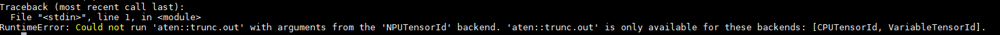

**可能原因**<a name="zh-cn_topic_0175549220_section169499490501"></a>

目前npu设备仅支持pytorch部分算子，对于不支持的算子在使用时均会报上述错误，算子正在不断开发中。算子支持情况可参考[PyTorch原生算子](https://support.huaweicloud.com/opl-pytorch/atlasptol_09_0001.html)，持续更新。

**处理方法**<a name="section8970834202112"></a>

在模型调测中，可通过减小batch size参数，来减少NPU显存的占用，解决该问题。

### 在模型调测时遇到如MaxPoolGradWithArgmaxV1算子和max算子报错

**现象描述**<a name="section1785905019184"></a>


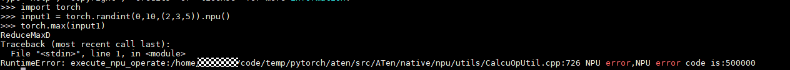

**可能原因**<a name="zh-cn_topic_0175549220_section169499490501"></a>

在模型搭建中，算子输入参数是多样的。某些算子（如MaxPoolGradWithArgmaxV1算子和max算子）在特定参数下，计算报错或者不支持，根据报错信息可以定位到具体算子。

**处理方法**<a name="section8970834202112"></a>

根据报错信息定位到具体算子，解决步骤如下：

1.  排查模型中对该算子的调用方式和参数是否正确；
2.  根据报错算子构建单算子用例，构建报错场景；
3.  一般算子错误无法在python侧解决，构建出报错场景。在论坛中发帖附上报错场景，求助华为工程师即可。

    > **说明：** 
    >输入参数shape和dtype需要重点关注，一般是导致算子报错的主要原因。


前述图中，根据报错信息，定位到是MaxPoolGradWithArgmaxV1算子和max算子报错。MaxPoolGradWithArgmaxV1是在反向计算过程中报错，那么构建测试用例时需要构建对应的反向场景；而对于max算子，是正向计算时报错，构建正向场景即可。

在模型中遇到算子报错，首选是仅构建单算子测试用例，确定报错场景和原因即可；若无法在单算子中构建单算子用例，则需要构建基于上下文的单算子场景, 可以参考[单算子样例编写说明](#单算子样例编写说明)编写用例。

### 在调用torch时遇到报错“ModuleNotFoundError: No module named 'torch.\_C'”

**现象描述**<a name="section1785905019184"></a>


**可能原因**<a name="zh-cn_topic_0175549220_section169499490501"></a>

首先确定报错位置，上述报错路径为.../code/pytorch/torch/\_\_init\_\_.py，而当前运行路径在.../code/pytorch下，在执行import torch时，默认首先在当前目录下查找torch文件夹，因此报错。此处应是调用在系统目录下安装的torch包，而不是当前目录下的torch。

**处理方法**<a name="section8970834202112"></a>

切换到其他目录执行脚本。

### 在开启混合精度后，部分算子性能变差，如Reduce类算子

**现象描述**<a name="section1785905019184"></a>

开启混合精度后，Reduce类算子性能变差，block dim变小，性能降低。

**可能原因**<a name="zh-cn_topic_0175549220_section169499490501"></a>


**处理方法**<a name="section8970834202112"></a>

在AMP初始化之前添加代码

```
amp.register_float_function(torch,'relu') #relu为算子名称，按实际情况替换
```
