# Ascend PyTorch调优工具

## 工具使用导航

Ascend PyTorch调优工具支持性能数据采集和解析功能，可参照如下顺序使用。

-   [采集和自动解析](#采集和自动解析)
    
    -   [采集并解析性能数据（torch\_npu.profiler.profile）](#采集并解析性能数据（torch_npuprofilerprofile）)
    
        （推荐）提供完整的采集接口，通过手动在代码中添加接口，可以自由选择采集的内容。
    
    -   [采集并解析性能数据（dynamic\_profile）](#采集并解析性能数据（dynamic_profile）)
    
        （推荐）支持在训练过程中随时启动采集，支持不修改用户代码直接启动采集，采集方式更灵活。
    
    -   [采集并解析性能数据（torch\_npu.profiler.\_KinetoProfile）](#KinetoProfile)
    
        基础的性能数据采集方式。
    
-   [扩展采集功能](#扩展采集功能)
    
    -   [采集并解析mstx数据](#采集并解析mstx数据)
    -   [采集环境变量信息](#采集环境变量信息)
    -   [标记性能数据采集过程](#标记性能数据采集过程)
    -   [显存可视化](#显存可视化)
    -   [创建Profiler子线程采集](#创建Profiler子线程采集)
    
-   [离线解析](#离线解析)

    对Ascend PyTorch Profiler采集但未解析的性能原始数据手动启动解析。

- [输出结果文件说明](#输出结果文件说明)

  完成采集和自动解析或离线解析后，可在性能数据目录下查看对应的性能数据文件，或将性能数据导入到[MindStudio Insight](https://gitcode.com/Ascend/msinsight/blob/master/docs/zh/user_guide/mindstudio_insight_install_guide.md)工具中分析。

-   [附录](#附录)
    
    Ascend PyTorch调优工具接口及对应参数、配置文件和日志介绍。
    
    -   [Ascend PyTorch Profiler接口说明](#Ascend-PyTorch-Profiler接口说明)
    -   [profiler\_config.json文件说明](#profiler_config.json文件说明)
    -   [experimental\_config参数说明（dynamic\_profile动态采集场景）](#experimental_config参数说明（dynamic_profile动态采集场景）)
    -   [experimental\_config参数说明](#experimental_config参数说明)
    -   [torch\_npu.profiler.schedule类参数说明](#torch\_npu.profiler.schedule类参数说明)
    -   [dynamic\_profile动态采集维测日志介绍](#dynamic_profile动态采集维测日志介绍)
    
- [FAQ](#FAQ)

## 简介

Ascend PyTorch调优工具（Ascend PyTorch Profiler）是针对PyTorch框架开发的性能分析工具，通过在PyTorch训练/在线推理脚本中添加Ascend PyTorch Profiler，执行训练/在线推理的同时采集性能数据，完成训练/在线推理后直接输出可视化的性能数据文件，提升了性能分析效率。Ascend PyTorch Profiler可全面采集PyTorch训练/在线推理场景下的性能数据，主要包括PyTorch层算子信息、CANN层算子信息、底层NPU算子信息、以及算子内存占用信息等，可以全方位分析PyTorch训练/在线推理时的性能状态。

## 使用前准备

**环境准备**

-   安装配套版本的CANN Toolkit开发套件包或算子包并配置环境变量，具体请参见《[CANN软件安装指南](https://www.hiascend.com/document/detail/zh/canncommercial/850/softwareinst/instg/instg_0000.html?Mode=PmIns&InstallType=local&OS=openEuler)》。
-   准备好基于PyTorch 2.1.0或更高版本开发的训练模型以及配套的数据集，并按照《[PyTorch 训练模型迁移调优指南](https://www.hiascend.com/document/detail/zh/Pytorch/730/ptmoddevg/trainingmigrguide/PT_LMTMOG_0002.html)》中的“[模型迁移](https://www.hiascend.com/document/detail/zh/Pytorch/730/ptmoddevg/trainingmigrguide/PT_LMTMOG_0013.html)”完成PyTorch原始模型向昇腾AI处理器的迁移。

**约束**

使用该工具前，请了解相关使用约束：

-   权限约束
    -   用户须自行保证使用最小权限原则（如禁止other用户可写，常见如禁止将文件权限设置为666、777）。
    -   使用性能分析工具前请确保执行用户的umask值大于等于0027，否则会导致获取的性能数据所在目录和文件权限过大。
    -   出于安全性及权限最小化角度考虑，本工具不应使用root等高权限账户，建议使用普通用户权限执行。
    -   本工具为开发调测工具，不建议在生产环境使用。
    -   本工具依赖CANN和对应驱动软件包，使用本工具前，请先安装CANN和对应驱动软件包，并使用**source**命令执行CANN的set\_env.sh环境变量文件，为保证安全，source后请勿擅自修改set\_env.sh中涉及的环境变量。
    -   请确保性能数据保存在不含软链接的当前用户目录下，否则可能引起安全问题。

-   执行约束
    -   不建议性能数据的采集功能与Dump功能同时使用。Dump操作会影响系统性能，如果同时开启采集功能与Dump功能，会造成采集的性能数据指标不准确，启动采集前请关闭数据Dump。
    -   Ascend PyTorch Profiler接口支持多种采集方式，各采集方式不可同时开启。
    -   须保证Ascend PyTorch Profiler接口的调用与要采集的业务流程在同一个进程内。
    -   Ascend PyTorch Profiler接口进行采集任务时，进程与Device之间的关系如下：
        -   多进程多Device场景：支持每个Device下分别设置一个采集进程。
        -   单进程多Device场景：支持。须配套PyTorch 2.1.0post14、2.5.1post2、2.6.0及之后的版本。
        -   多进程单Device场景：需要保证多进程之间的采集动作是串行的，即各个采集动作不在同一时间开始，且各个采集动作须包含完整的启动和停止。

-   数据落盘约束
    -   性能数据会占据一定的磁盘空间，可能存在磁盘写满导致服务器不可用的风险。性能数据所需空间跟模型的参数、采集开关配置、采集的迭代数量有较大关系，须用户自行保证落盘目录下的可用磁盘空间。
    -   性能数据采集时间建议在5min以内，并且预留至少20倍于性能原始数据大小的内存和磁盘空间。原始数据大小指采集落盘后的data目录下数据总大小。

## 采集和自动解析

### 采集并解析性能数据（torch_npu.profiler.profile）

**功能说明**

使用torch\_npu.profiler.profile系列接口采集并解析性能数据。

**注意事项**

无

**使用示例**

1.  在训练脚本（如train\_\*.py文件）/在线推理脚本内添加如下示例代码进行性能数据采集参数配置，之后启动训练/在线推理。

    >[!NOTE] 说明
    >
    >-   以下示例代码中的torch\_npu.profiler.profile接口及参数详细介绍请参见[Ascend PyTorch Profiler接口说明](#Ascend-PyTorch-Profiler接口说明)。
    >-   以下给出两个示例代码，使用不同方式调用**torch\_npu.profiler.profile**接口，可任选其一使用。
    
    -   示例一：使用with语句调用torch\_npu.profiler.profile接口，自动创建Profiler，采集with范围内代码段的性能数据。
    
        ```
        import torch
        import torch_npu
        
        ...
        
        # 添加Profiling采集扩展配置参数，详细参数介绍可参考下文的参数说明
        experimental_config = torch_npu.profiler._ExperimentalConfig(
            export_type=torch_npu.profiler.ExportType.Text,
            profiler_level=torch_npu.profiler.ProfilerLevel.Level0,
            aic_metrics=torch_npu.profiler.AiCMetrics.AiCoreNone
        )
        
        # 添加Profiling采集基础配置参数，详细参数介绍可参考下文的参数说明
        with torch_npu.profiler.profile(
            activities=[
                torch_npu.profiler.ProfilerActivity.CPU,
                torch_npu.profiler.ProfilerActivity.NPU
                ],
            schedule=torch_npu.profiler.schedule(wait=0, warmup=0, active=1, repeat=1, skip_first=0),    # 与prof.step()配套使用
            on_trace_ready=torch_npu.profiler.tensorboard_trace_handler("./result"),
            profile_memory=False,
            with_modules=False,
            experimental_config=experimental_config) as prof:
        
            # 启动性能数据采集
            for step in range(steps):    # 训练函数
                train_one_step()    # 训练函数
                prof.step()    # 与schedule配套使用
        ```
        
    -   示例二：创建torch\_npu.profiler.profile对象，通过start和stop接口控制采集性能数据，用户可自定义采集启动的位置。
    
        ```
        import torch
        import torch_npu
        ...
        
        # 添加Profiling采集扩展配置参数，详细参数介绍可参考下文的参数说明
        experimental_config = torch_npu.profiler._ExperimentalConfig(
            export_type=torch_npu.profiler.ExportType.Text,
            profiler_level=torch_npu.profiler.ProfilerLevel.Level0,
            aic_metrics=torch_npu.profiler.AiCMetrics.AiCoreNone
        )
        
        # 添加Profiling采集基础配置参数，详细参数介绍可参考下文的参数说明
        prof = torch_npu.profiler.profile(
            activities=[
                torch_npu.profiler.ProfilerActivity.CPU,
                torch_npu.profiler.ProfilerActivity.NPU
                ],
            schedule=torch_npu.profiler.schedule(wait=0, warmup=0, active=1, repeat=1, skip_first=0),
            on_trace_ready=torch_npu.profiler.tensorboard_trace_handler("./result"),
            profile_memory=False,
            with_modules=False,
            experimental_config=experimental_config)
        
        prof.start()    # 启动性能数据采集
        for step in range(steps):    # 训练函数
            train_one_step()    # 训练函数
            prof.step()    # 与schedule配套使用
        prof.stop()    # 结束性能数据采集
        ```
    
    以上两个示例主要使用tensorboard\_trace\_handler导出性能数据，也可以使用以下prof.export\_chrome\_trace方式导出单个性能文件“chrome\_trace\_\{pid\}.json”。由于tensorboard\_trace\_handler导出的性能数据包含了prof.export\_chrome\_trace导出的性能数据，所以根据实际需求选择一种方式即可。
    
    ```
    import torch
    import torch_npu
    
    ...
    
    with torch_npu.profiler.profile() as prof:
    
        # 启动性能数据采集
        for step in range(steps):    # 训练函数
            train_one_step()    # 训练函数
    prof.export_chrome_trace('./chrome_trace_14.json')    # 指定chrome_trace_{pid}.json文件导出路径
    ```
    
2.  性能数据解析。

    支持自动解析（参照以上示例代码中**tensorboard\_trace\_handler**和**prof.export\_chrome\_trace**）和[离线解析](#离线解析)。

3.  查看性能数据结果文件和性能数据分析。

    性能数据结果文件详细介绍请参见[输出结果文件说明](#输出结果文件说明)。

    请参见《[MindStudio Insight系统调优](https://gitcode.com/Ascend/msinsight/blob/master/docs/zh/user_guide/system_tuning.md)》将解析后的性能数据文件进行可视化展示和分析。

    可以使用[性能分析工具（msprof-analyze）](https://gitcode.com/Ascend/msprof-analyze)辅助分析性能数据。

### 采集并解析性能数据（dynamic\_profile）

**功能说明**

dynamic\_profile动态采集，主要功能是在执行模型训练/在线推理过程中可以随时开启采集进程。

**注意事项**

以下方式只选择一种使用，不可同时使用两种及以上方式开启dynamic\_profile。

**表 1**  动态采集方式说明

| 动态采集方式                                                 | 说明                                                         |
| ------------------------------------------------------------ | ------------------------------------------------------------ |
| [环境变量方式](#环境变量方式)                                | 仅支持训练场景，通过修改配置文件profiler_config.json控制Profiling配置，不需要修改用户代码。 |
| [修改用户训练/在线推理脚本，添加dynamic_profile接口方式](#添加dynamic_profile接口方式) | 支持训练/在线推理场景，通过修改配置文件profiler_config.json控制Profiling的启动，需要预先在用户脚本中添加dynamic_profile接口。 |
| [修改用户训练/在线推理脚本，添加dynamic_profile的dp.start()函数方式](#添加dynamic_profile的dp.start()函数方式) | 支持训练/在线推理场景，通过预先在用户脚本中添加dp.start()接口控制Profiling的启动，可自定义dp.start()接口添加的位置，适合在需要缩小采集范围时使用。 |

**使用示例（环境变量方式）**<a name="环境变量方式"></a>

1. 配置如下环境变量。

   ```
   export PROF_CONFIG_PATH="/path/to/profiler_config_path"
   ```

   配置该环境变量后启动训练，dynamic\_profile会在profiler\_config\_path下自动创建模板文件profiler\_config.json，用户可基于模板文件自定义修改配置项。

   >[!NOTE] 说明
   >
   >-   该方式仅支持训练场景。
   >-   该方式下dynamic\_profile不支持采集第一个迭代（step0）的数据。
   >-   该方式依赖torch原生Optimizer.step\(\)划分训练过程中Profiling的step，不支持自定义Optimizer场景。
   >-   PROF\_CONFIG\_PATH指定的路径可自定义（要求有读写权限），路径格式仅支持由字母、数字和下划线组成的字符串，不支持软链接，例如"/home/xxx/profiler\_config\_path"。

2.  启动训练任务。
3. 重新开启一个命令行窗口，修改profiler\_config.json配置文件用以使能Profiling任务。

   配置文件中包含Profiler的性能数据采集参数，用户可以参考[profiler\_config.json文件说明](#profiler_config.json文件说明)修改配置文件参数来执行不同的Profiling任务。

   >[!NOTE] 说明
   >
   >-   dynamic\_profile通过识别profiler\_config.json文件的状态判断文件是否被修改：
   >   -   dynamic\_profile每2s轮询一次，若发现profiler\_config.json文件改动，则启动采集流程，之后记录相邻step之间的运行间隔，将此时间作为新的轮询时间，最小值为1s。
   >   -   若在dynamic\_profile采集执行期间，profiler\_config.json文件被修改，则在采集进程结束之后，再次启动最后一次文件修改的dynamic\_profile采集。
   >-   建议用户使用共享存储设置dynamic\_profile的profiler\_config\_path。
   >-   profiler\_config\_path目录下会自动记录dynamic\_profile的维测日志，详细介绍请参见[dynamic\_profile动态采集维测日志介绍](#dynamic_profile动态采集维测日志介绍)。
   >-   修改start\_step参数值应大于当前已执行到的训练/在线推理step，且不超过最大step。例如step总数为10，且已执行到step3，则start\_step只能配置在3\~10之间，且注意由于配置过程中训练/在线推理任务还在持续执行，故配置大于step3。

4.  性能数据解析。

    支持自动解析和手动解析，请参见[表1](#profiler_config_参数说明)中的analyse参数。

5.  查看性能数据结果文件和性能数据分析。

    性能数据结果文件详细介绍请参见[输出结果文件说明](#输出结果文件说明)。

    请参见《[MindStudio Insight系统调优](https://gitcode.com/Ascend/msinsight/blob/master/docs/zh/user_guide/system_tuning.md)》将解析后的性能数据文件进行可视化展示和分析。

    可以使用[性能分析工具（msprof-analyze）](https://gitcode.com/Ascend/msprof-analyze)辅助分析性能数据。

**使用示例（修改用户训练/在线推理脚本，添加dynamic_profile接口方式）**<a name="添加dynamic_profile接口方式"></a>

1.  在训练脚本（如train\_\*.py文件）/在线推理脚本中添加如下示例代码。

    ```
    # 加载dynamic_profile模块
    from torch_npu.profiler import dynamic_profile as dp
    # 设置Profiling配置文件的路径
    dp.init("profiler_config_path")
    ...
    for step in steps:
        train_one_step()
        # 划分step
        dp.step()
    ```

    **init**时，dynamic\_profile会在profiler\_config\_path下自动创建模板文件profiler\_config.json，用户可基于模板文件自定义修改配置项。

    profiler\_config\_path路径格式仅支持由字母、数字和下划线组成的字符串，不支持软链接。

2.  启动训练/在线推理任务。
3. 重新开启一个命令行窗口，修改profiler\_config.json配置文件用以使能Profiling任务。

   配置文件中包含Profiler的性能数据采集参数，用户可以参考[profiler\_config.json文件说明](#profiler_config.json文件说明)修改配置文件参数来执行不同的Profiling任务。

   >[!NOTE] 说明
   >
   >-   dynamic\_profile通过识别profiler\_config.json文件的状态判断文件是否被修改：
   >   -   dynamic\_profile每2s轮询一次，若发现profiler\_config.json文件改动，则启动采集流程，之后记录相邻step之间的运行间隔，将此时间作为新的轮询时间，最小值为1s。
   >   -   若在dynamic\_profile采集执行期间，profiler\_config.json文件被修改，则在采集进程结束之后，再次启动最后一次文件修改的dynamic\_profile采集。
   >-   建议用户使用共享存储设置dynamic\_profile的profiler\_config\_path。
   >-   profiler\_config\_path目录下会自动记录dynamic\_profile的维测日志，详细介绍请参见[dynamic\_profile动态采集维测日志介绍](#dynamic_profile动态采集维测日志介绍)。
   >-   修改start\_step参数值应大于当前已执行到的训练/在线推理step，且不超过最大step。例如step总数为10，且已执行到step3，则start\_step只能配置在3\~10之间，且注意由于配置过程中训练/在线推理任务还在持续执行，故配置大于step3。

4.  支持自动解析和手动解析，请参见[表1](#profiler_config_参数说明)中的analyse参数。
5.  查看性能数据结果文件和性能数据分析。

    性能数据结果文件详细介绍请参见[输出结果文件说明](#输出结果文件说明)。

    请参见《[MindStudio Insight系统调优](https://gitcode.com/Ascend/msinsight/blob/master/docs/zh/user_guide/system_tuning.md)》将解析后的性能数据文件进行可视化展示和分析。

    可以使用[性能分析工具（msprof-analyze）](https://gitcode.com/Ascend/msprof-analyze)辅助分析性能数据。

**使用示例（修改用户训练/在线推理脚本，添加dynamic_profile的dp.start()函数方式）**<a name="添加dynamic_profile的dp.start()函数方式"></a>

1. 在训练脚本（如train_*.py文件）/在线推理脚本中添加如下示例代码。

   ```
   # 加载dynamic_profile模块
   from torch_npu.profiler import dynamic_profile as dp
   # 设置init接口Profiling配置文件路径
   dp.init("profiler_config_path")
   ...
   for step in steps:
       if step==5:
           # 设置start接口Profiling配置文件路径
           dp.start("start_config_path")
       train_one_step()
       # 划分step，需要进行profile的代码需在dp.start()接口和dp.step()接口之间
       dp.step()
   ```

   start\_config\_path同样指定为profiler\_config.json，但需要用户根据[profiler_config.json文件说明](#profiler_config.json文件说明)手动创建配置文件并根据场景需要配置参数。此处须指定具体文件名，例如`dp.start("/home/xx/start_config_path/profiler_config.json")`。

   profiler\_config\_path和start\_config\_path路径格式仅支持由字母、数字和下划线组成的字符串，不支持软链接。

   >[!NOTE] 说明
   >
   >-   添加`dp.start()`后，当训练/在线推理任务进行到`dp.start()`时，会自动按照start\_config\_path指定的profiler\_config.json文件进行采集。`dp.start()`函数不感知profiler\_config.json文件的修改，只会在训练/在线推理过程中触发一次采集任务。
   >-   添加`dp.start()`并启动训练/在线推理后：
   >   -   若`dp.start()`未指定profiler\_config.json配置文件或配置文件因错误未生效，则执行到`dp.start()`后按照profiler\_config\_path目录下的profiler\_config.json文件配置进行采集。
   >   -   若在`dp.init()`配置的dynamic\_profile生效期间，脚本运行至`dp.start()`，则`dp.start()`不生效。
   >   -   若在`dp.init()`配置的dynamic\_profile采集结束后，脚本运行至`dp.start()`，则继续执行`dp.start()`采集，并在prof\_dir目录下生成新的性能数据文件目录。
   >   -   若在`dp.start()`配置的dynamic\_profile生效期间，改动profiler\_config\_path目录下的profiler\_config.json文件，`dp.init()`会等待`dp.start()`采集完成后启动，并在prof\_dir目录下生成新的性能数据文件目录。
   >-   建议用户使用共享存储设置dynamic\_profile的profiler\_config_path。
   >-   修改start\_step参数值应大于当前已执行到的训练/在线推理step，且不超过最大step。例如step总数为10，且已执行到step3，则start\_step只能配置在3~10之间，且注意由于配置过程中训练/在线推理任务还在持续执行，故配置大于step3。

2.  启动训练/在线推理任务。
3.  性能数据解析。

    支持自动解析和手动解析，请参见[表1](#profiler_config_参数说明)中的analyse参数。

4.  查看性能数据结果文件和性能数据分析。

    性能数据结果文件详细介绍请参见[输出结果文件说明](#输出结果文件说明)。

    请参见《[MindStudio Insight系统调优](https://gitcode.com/Ascend/msinsight/blob/master/docs/zh/user_guide/system_tuning.md)》将解析后的性能数据文件进行可视化展示和分析。

    可以使用[性能分析工具（msprof-analyze）](https://gitcode.com/Ascend/msprof-analyze)辅助分析性能数据。

### 采集并解析性能数据（torch\_npu.profiler.\_KinetoProfile）<a name="KinetoProfile"></a>

**功能说明**

使用torch\_npu.profiler.\_KinetoProfile系列接口采集并解析性能数据。

**注意事项**

无

**使用示例**

1. 在训练脚本（如train\_\*.py文件）/在线推理脚本内添加如下示例代码进行性能数据采集参数配置，之后启动训练/在线推理。

   >[!NOTE] 说明
   >以下示例代码中的torch\_npu.profiler.\_KinetoProfile接口详细介绍请参见[Ascend PyTorch Profiler接口说明](#Ascend-PyTorch-Profiler接口说明)。

   ```
   import torch
   import torch_npu
   
   ...
   
   prof = torch_npu.profiler._KinetoProfile(activities=None, record_shapes=False, profile_memory=False, with_stack=False, with_flops=False, with_modules=False, experimental_config=None)
   for epoch in range(epochs):
       train_model_step()
       if epoch == 0:
           prof.start()
       if epoch == 1:
           prof.stop()
   prof.export_chrome_trace("result_dir/trace.json")
   ```

   该方式不支持使用**schedule**和**tensorboard\_trace\_handler**导出性能数据。

2.  性能数据解析。

    支持自动解析（参照以上示例代码中**prof.export\_chrome\_trace**）。

## 扩展采集功能

### 采集并解析mstx数据

**功能说明**

针对大集群场景传统Profiling数据量大、分析流程复杂的现象，通过[experimental\_config](#experimental_config参数说明)的**mstx**参数开启自定义打点功能，自定义采集时间段或者关键函数的开始和结束时间点，识别关键函数或迭代等信息，对性能问题快速定界。

**注意事项**

无

**使用示例**

使用方式及示例代码如下：

1.  使能torch\_npu.profiler，打开mstx开关，搭配profiler\_level开关设置为Level\_none（可根据实际采集需要，配置对应的level）以及mstx\_domain\_include或mstx\_domain\_exclude的domain过滤属性，采集打点数据。
2.  在PyTorch脚本中对于想采集的事件调用torch\_npu.npu.mstx、torch\_npu.npu.mstx.mark、torch\_npu.npu.mstx.range\_start、torch\_npu.npu.mstx.range\_end、torch\_npu.npu.mstx.mstx\_range的打点mark接口实现打点，采集对应事件的耗时。接口详细介绍请参见《[Ascend Extension for PyTorch 自定义API参考](https://www.hiascend.com/document/detail/zh/Pytorch/730/apiref/torchnpuCustomsapi/docs/context/overview.md)》中的“Python接口 \> torch\_npu.npu \>  [profiler](https://www.hiascend.com/document/detail/zh/Pytorch/730/apiref/torchnpuCustomsapi/docs/context/torch_npu-npu-mstx.md)”。

只记录Host侧range耗时：

```
id = torch_npu.npu.mstx.range_start("dataloader", None)    # 第二个入参设置None或者不设置，只记录Host侧range耗时
dataloader()
torch_npu.npu.mstx.range_end(id)
```

在计算流上打点，记录Host侧range耗时和Device侧对应的range耗时：

```
stream = torch_npu.npu.current_stream()
id = torch_npu.npu.mstx.range_start("matmul", stream)    # 第二个入参设置有效的stream，记录Host侧range耗时和Device侧对应的range耗时
torch.matmul()    # 计算流操作示意
torch_npu.npu.mstx.range_end(id)
```

在集合通信流上打点：

```
from torch.distributed.distributed_c10d import _world

if (torch.__version__ != '1.11.0') :
    stream_id = _world.default_pg._get_backend(torch.device('npu'))._get_stream_id(False)
    collective_stream = torch.npu.Stream(stream_id=collective_stream_id, device_type=20, device_index=device_id)    # device_index设置实际业务的device_id值
else:
    stream_id = _world.default_pg._get_stream_id(False)
    current_stream = torch.npu.current_stream()
    cdata = current_stream._cdata & 0xffff000000000000
    collective_stream = torch.npu.Stream(_cdata=( stream_id + cdata), device_index=device_id)    # device_index设置实际业务的device_id值
id = torch_npu.npu.mstx.range_start("allreduce", collective_stream)    # 第二个入参设置有效的stream，记录Host侧range耗时和Device侧对应的range耗时
torch.allreduce()    # 集合通信流操作示意
torch_npu.npu.mstx.range_end(id)
```

在P2P通信流上打点：

```
from torch.distributed.distributed_c10d import _world
 
if (torch.__version__ != '1.11.0') :
    stream_id = _world.default_pg._get_backend(torch.device('npu'))._get_stream_id(True)
    p2p_stream = torch.npu.Stream(stream_id=collective_stream_id, device_type=20, device_index=device_id)    # device_index设置实际业务的device_id值
else:
    stream_id = _world.default_pg._get_stream_id(True)
    current_stream = torch.npu.current_stream()
    cdata = current_stream._cdata & 0xffff000000000000
    p2p_stream = torch.npu.Stream(_cdata=( stream_id + cdata), device_index=device_id)    # device_index设置实际业务的device_id值
id = torch_npu.npu.mstx.range_start("send", p2p_stream)    # 第二个入参设置有效的stream，记录Host侧range耗时和Device侧对应的range耗时
torch.send()
torch_npu.npu.mstx.range_end(id)
```

想要采集如上场景数据，需要配置torch\_npu.profiler.profile接口，使能mstx开关，参考样例如下：

```
import torch
import torch_npu

experimental_config = torch_npu.profiler._ExperimentalConfig(
    profiler_level=torch_npu.profiler.ProfilerLevel.Level_none,
    mstx=True,    # 原参数名msprof_tx改为mstx，新版本依旧兼容原参数名msprof_tx
    export_type=[
        torch_npu.profiler.ExportType.Db
        ])
with torch_npu.profiler.profile(
    schedule=torch_npu.profiler.schedule(wait=0, warmup=0, active=1, repeat=1, skip_first=0),
    on_trace_ready=torch_npu.profiler.tensorboard_trace_handler("./result"),
    experimental_config=experimental_config) as prof:
       
    for step in range(steps):
        train_one_step()    # 用户代码，包含调用mstx接口
        prof.step()
```

根据domain域进行采集：

```
import torch
import torch_npu
import time
experimental_config = torch_npu.profiler._ExperimentalConfig(
    data_simplification=False,
    # 开启mstx，并设置mstx_domain_include或mstx_domain_exclude的domain过滤属性
    mstx=True,
    mstx_domain_include=['default','domain1']    # 配置采集'default'和'domain1'打点数据
    # mstx_domain_exclude=['domain2']    # 配置不采集'domain2'的打点数据，与mstx_domain_include不同时配置
)
with torch_npu.profiler.profile(
    activities=[torch_npu.profiler.ProfilerActivity.CPU, torch_npu.profiler.ProfilerActivity.NPU],
    schedule=torch_npu.profiler.schedule(wait=0, warmup=0, active=1, repeat=1, skip_first=0),
    on_trace_ready=torch_npu.profiler.tensorboard_trace_handler("./result"),
    experimental_config=experimental_config) as prof:
    for i in range(5):
        # 标记默认domain的mstx打点
        torch_npu.npu.mstx.mark("mark_with_default_domain")
        range_id = torch_npu.npu.mstx.range_start("range_with_default_domain")
        time.sleep(1)    # 模拟用户代码
        torch_npu.npu.mstx.range_end(range_id)
        ...    # 用户代码
        # 标记用户自定义domain1的mstx打点
        torch_npu.npu.mstx.mark("mark_with_domain1", domain = "domain1")
        range_id1 = torch_npu.npu.mstx.range_start("range_with_domain1", domain="domain1")
        time.sleep(1)    # 模拟用户代码
        torch_npu.npu.mstx.range_end(range_id1, domain="domain1")
        ...    # 用户代码
        # 标记用户自定义domain2的mstx打点
        torch_npu.npu.mstx.mark("mark_with_domain2", domain = "domain2")
        range_id2 = torch_npu.npu.mstx.range_start("range_with_domain2", domain="domain2")
        time.sleep(1)    # 模拟用户代码
        torch_npu.npu.mstx.range_end(range_id2, domain="domain2")
        prof.step()
```

**输出结果文件说明**

打点数据使用MindStudio Insight工具打开，可视化效果如下：

**图 1**  打点结果示例 

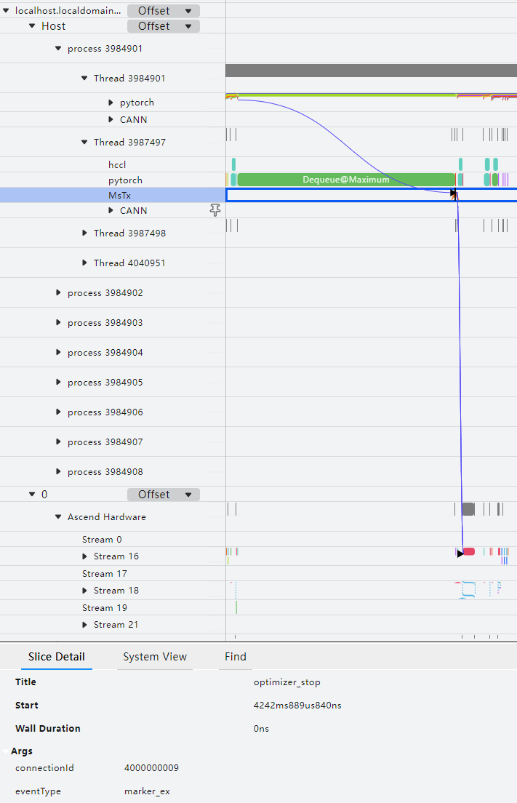

mstx功能默认采集通信算子、dataloader耗时、保存检查点接口耗时的性能数据，数据内容格式分别为：

-   格式：\{"streamId": "\{pg streamId\}","count": "\{count\}","dataType": "\{dataType\}",\["srcRank": "\{srcRank\}"\],\["destRank": "\{destRank\}"\],"groupName": "\{groupName\}","opName": "\{opName\}"\}

    示例：\{"streamId": "32","count": "25701386","dataType": "fp16","groupName": "group\_name\_43","opName": "HcclAllreduce"\}

    -   streamId：用于执行打点任务的Stream ID。
    -   count：输入数据个数。
    -   dataType：输入数据的数据类型。
    -   srcRank：通信域内数据发送端的Rank ID，hcclRecv算子才有srcRank。
    -   destRank：通信域内数据接收端的Rank ID，hcclSend算子才有destRank。
    -   groupName：通信域名称。
    -   opName：算子名称。

-   dataloader
-   save\_checkpoint

此外，mstx功能还可以通过**mstx\_torch\_plugin**获取PyTorch模型中的dataloader、forward、step、save\_checkpoint这四个关键阶段的性能数据，详细介绍请参见《[mstx\_torch\_plugin](https://gitcode.com/Ascend/mstt/blob/master/profiler/example/mstx_torch_plugin/README.md)》。

可以通过该功能查看用户自定义打点从框架侧到CANN层再到NPU侧的执行调度情况，进而帮助识别用户想观察的关键函数或者事件，定界性能问题。

mstx采集结果数据详细介绍请参见《性能调优工具用户指南》中的“性能数据文件参考 \> [msproftx数据说明](https://gitcode.com/Ascend/msprof/blob/master/docs/zh/profile_data_file_references.md#msproftx%E6%95%B0%E6%8D%AE%E8%AF%B4%E6%98%8E)”。

### 采集环境变量信息

**功能说明**

通过Ascend PyTorch Profiler接口采集性能数据时，默认采集环境变量信息，当前支持采集的环境变量如下：

-   "ASCEND\_GLOBAL\_LOG\_LEVEL"
-   "HCCL\_RDMA\_TC"
-   "HCCL\_RDMA\_SL"
-   "ACLNN\_CACHE\_LIMIT"

**注意事项**

无

**使用示例**

1.  在环境下配置环境变量，示例如下：

    ```
    export ASCEND_GLOBAL_LOG_LEVEL=1
    export HCCL_RDMA_TC=0
    export HCCL_RDMA_SL=0
    export ACLNN_CACHE_LIMIT=4096
    ```

    环境变量根据用户实际需要配置。

2.  执行Ascend PyTorch Profiler接口采集。

**输出说明**

-   当experimental\_config参数的export\_type配置为torch\_npu.profiler.ExportType.Text时，以上步骤配置的环境变量信息将保存在\{worker\_name\}\_\{时间戳\}\_ascend\_pt目录下的profiler\_metadata.json文件中以及ascend\_pytorch\_profiler\_\{Rank\_ID\}.db文件下的META\_DATA表中。
-   当experimental\_config参数的export\_type配置为torch\_npu.profiler.ExportType.Db时，在ascend\_pytorch\_profiler\_\{Rank\_ID\}.db文件下的META\_DATA表写入环境变量信息。

### 标记性能数据采集过程

**功能说明**

以自定义字符串键和字符串值的形式标记性能数据采集过程。

**注意事项**

无

**使用示例**

-   示例一

    ```
    with torch_npu.profiler.profile(...)  as prof:
        prof.add_metadata(key, value)
    ```

-   示例二

    ```
    with torch_npu.profiler._KinetoProfile(...)  as prof:
        prof.add_metadata_json(key, value)
    ```

add\_metadata和add\_metadata\_json可以配置在torch\_npu.profiler.profile和torch\_npu.profiler.\_KinetoProfile下，须添加在profiler初始化后，finalize之前，即性能数据采集过程的代码中。

**表 1**  add\_metadata接口说明

|类、函数名|说明|
|--|--|
|add_metadata|添加字符串标记，取值：<br>&#8226; *key*：字符串键。<br/>&#8226; *value*：字符串值。<br/>示例：prof.add_metadata("test_key1", "test_value1")|
|add_metadata_json|添加json格式字符串标记，取值：<br/>&#8226; *key*：字符串键。<br/>&#8226; *value*：字符串值，json格式。<br/>示例：prof.add_metadata_json("test_key2", json.dumps({"key1": test_value1, "key2": test_value2}))|

**输出说明**

调用此接口传入的metadata数据写入到Ascend PyTorch Profiler接口的采集结果根目录下的profiler\_metadata.json文件中。

### 显存可视化

**功能说明**

本功能实现在模型训练过程中训练进程占用存储空间时，对所占用的数据进行分类并可视化展示。主要通过`export_memory_timeline`接口导出可视化文件。

**接口说明**

`export_memory_timeline`用于从采集的数据中导出给定设备的内存事件信息，并导出时间线图。

接口参数：

- output_path：必选参数，配置导出的结果文件，string类型，配置格式为：path = "{path}/{file_name}.html"，{path}为结果文件路径，\{file_name}为结果文件名，路径或文件不存在时会自动创建。
- device：必选参数，指定需要导出的设备ID（Device ID或Rank ID），string类型，配置格式为：device = "npu:{ID}}"，{ID}须配置为采集数据中已有的设备ID，当前仅支持指定一个值。

使用`export_memory_timeline`可以导出三种格式文件，每个文件都由`output_path`的后缀控制：

- 对于与HTML兼容的绘图，使用后缀`.html`，内存时间线图将作为PNG文件嵌入到HTML文件中。
- 对于由[timestamp, [sizes by category]]组成的绘图点，其中timestamp是时间戳，sizes是每个类别的内存使用量。内存时间线图将保存为`.json`文件或压缩的`.json.gz`，具体取决于后缀。
- 对于原始内存信息，使用后缀`raw.json.gz`。每个原始内存事件将由(timestamp, action, numbytes, category)组成，其中action是[PREEXISTING, CREATE, INCREMENT_VERSION, DESTROY]其中之一，category是[PARAMETER，OPTIMIZER_STATE，INPUT，TEMPORARY，ACTIVATION，GRADIENT，AUTOGRAD_DETAIL，UNKNOWN]其中之一。

**注意事项**

导出html文件需要先在Python环境中安装matplotlib，且将对应的torch\_npu.profiler.profile参数设置为True，另外使用该功能会在当前目录下生成后缀为ascend\_pt数据文件。

**使用示例**

操作示例如下：

```
import torch
import torch_npu
...

def trace_handler(prof: torch_npu.profiler.profile):
    prof.export_memory_timeline(output_path="./memory_timeline.html", device="npu:0")

with torch_npu.profiler.profile(
    activities=[
        torch_npu.profiler.ProfilerActivity.CPU,
        torch_npu.profiler.ProfilerActivity.NPU
    ],
    schedule=torch_npu.profiler.schedule(wait=0, warmup=0, active=4, repeat=1, skip_first=0),
    on_trace_ready=trace_handler,
    record_shapes=True,           # 设为True
    profile_memory=True,          # 设为True
    with_stack=True,              # with_stack或者with_modules其中一个设为True
    with_modules=True
) as prof:
    for _ in range(steps):
        ...
        prof.step()
```

**输出结果文件说明**

执行采集并导出memory\_timeline.html后，可视化效果如下：

**图 1**  memory\_timeline  
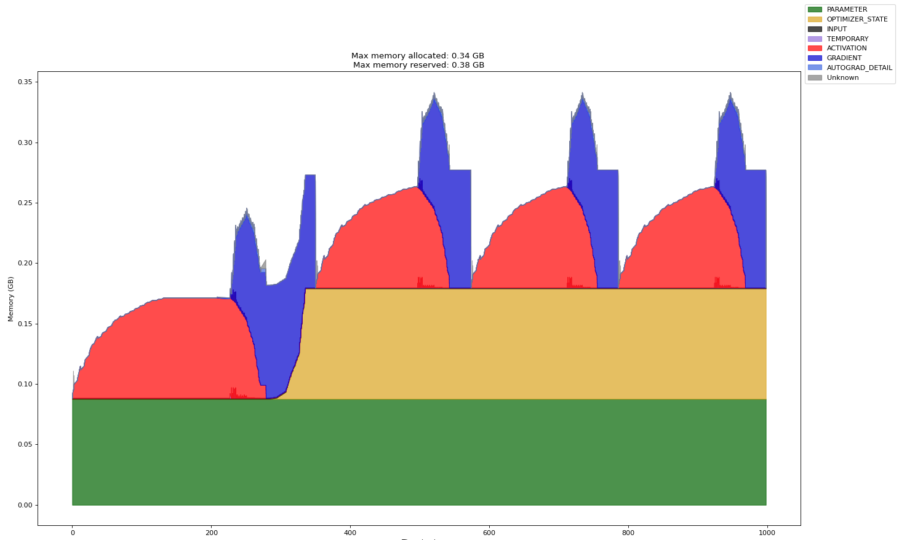

-   Time\(ms\)：为横坐标，表示tensor类型对内存的占用时间，单位ms。
-   Memory\(GB\)：为纵坐标，表示tensor类型占用的内存大小，单位GB。
-   Max memory allocated：最大内存分配总额，单位GB。
-   Max memory reserved：最大内存预留总额，单位GB。
-   PARAMETER：模型参数、模型权重。
-   OPTIMIZER\_STATE：优化器状态，例如Adam优化器会记录模型训练过程中的一些状态。
-   INPUT：输入数据。
-   TEMPORARY：临时占用，这里被定义为单个算子下申请后又被释放，通常是一些保存中间值的tensor。
-   ACTIVATION：前向计算中得到的激活值。
-   GRADIENT：梯度值。
-   AUTOGRAD\_DETAIL：反向计算过程中产生的内存占用。
-   UNKNOWN：未知类型。

### 创建Profiler子线程采集

**功能说明**

在推理场景下，单进程多线程调用torch算子的用法较为常见。在这种情况下，由于Profiler无法感知用户自行创建的子线程，因此Profiler也无法采集这些子线程下发的torch算子等框架侧数据。那么这里在用户创建的子线程中调用torch\_npu.profiler.profile.enable\_profiler\_in\_child\_thread和torch\_npu.profiler.profile.disable\_profiler\_in\_child\_thread接口来注册Profiler采集回调函数并对子线程下发的torch算子等框架侧数据进行采集。

**注意事项**

无

**使用示例**

操作示例如下：

```
import threading
import torch
import torch_npu

# 推理模型定义
...

def infer(device, child_thread):
    torch.npu.set_device(device)

    if child_thread:
        # 开始采集子线程的torch算子等框架侧数据
        torch_npu.profiler.profile.enable_profiler_in_child_thread(with_modules=True)

    for _ in range(5):
        outputs = model(input_data)

    if child_thread:
        # 停止采集子线程的torch算子等框架侧数据
        torch_npu.profiler.profile.disable_profiler_in_child_thread()


if __name__ == "__main__":
    experimental_config = torch_npu.profiler._ExperimentalConfig(
        aic_metrics=torch_npu.profiler.AiCMetrics.PipeUtilization,
        profiler_level=torch_npu.profiler.ProfilerLevel.Level1
    )

    prof = torch_npu.profiler.profile(
        activities=[torch_npu.profiler.ProfilerActivity.CPU, torch_npu.profiler.ProfilerActivity.NPU],
        on_trace_ready=torch_npu.profiler.tensorboard_trace_handler("./result"),
        record_shapes=True,
        profile_memory=True,
        with_stack=False,
        with_flops=False,
        with_modules=True,
        experimental_config=experimental_config)

    prof.start()

    threads = []
    for i in range(1, 3):
        # 创建2个子线程，分别在device1与device2上进行推理任务
        t = threading.Thread(target=infer, args=(i, True))
        t.start()
        threads.append(t)

    # 主线程在device0上运行推理任务，由Profiler正常采集，非enable_profiler_in_child_thread接口采集
    infer(0, False)

    for t in threads:
        t.join()

    prof.stop()
```

**输出结果文件说明**

完成子线程采集后，生成的子线程性能数据如下：

**图 1**  子线程性能数据  
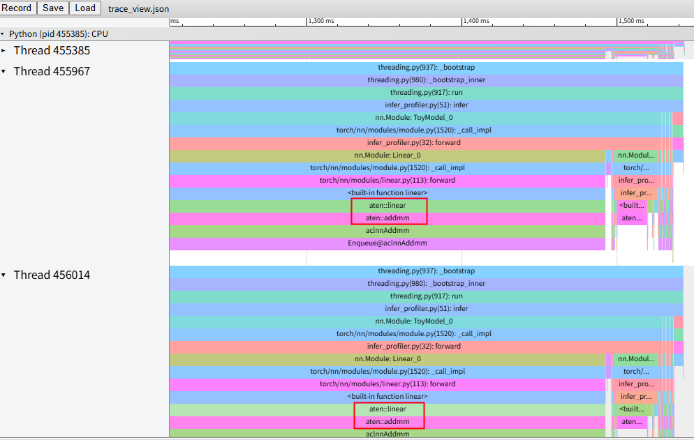

上图中Thread 455385为主线程，Profiler可正常采集，本功能场景无需关注。另外两个线程中aten前缀的timeline即为本功能采集的torch算子数据。

## 离线解析

**功能说明**

当使用Ascend PyTorch Profiler接口采集的性能数据较大时，若在当前环境直接使用on\_trace\_ready接口进行自动解析，则可能导致资源占用过大出现卡顿，那么可以取消on\_trace\_ready接口，并通过环境变量ASCEND\_WORK\_PATH设置落盘目录（例如：export ASCEND\_WORK\_PATH=xx/xx），在采集完成性能数据后，进行离线解析。

**注意事项**

无

**使用示例**

1.  创建*{file_name}*.py文件，*{file_name}*自定义，并编辑如下代码。

    ```
    from torch_npu.profiler.profiler import analyse
    
    if __name__ == "__main__":
        analyse(profiler_path="./result_data", max_process_number=1, export_type=text)
    ```

    **表 1**  参数说明
    
    | 参数               | 可选/必选 | 描述                                                         |
    | ------------------ | --------- | ------------------------------------------------------------ |
    | profiler_path      | 必选      | PyTorch性能数据路径。路径格式仅支持由字母、数字和下划线组成的字符串，不支持软链接。指定的目录下保存PyTorch性能数据目录{worker_name}\_{时间戳}_ascend_pt。 |
    | max_process_number | 可选      | 离线解析最大进程数。取值范围为1~CPU核数，默认为CPU核数的一半。若设置超过该环境的CPU核数，则自动取CPU核数；若设置为非法值，则取默认值CPU核数的一半。 |
    | export_type        | 可选      | 设置导出的性能数据结果文件格式，List类型。取值：<br>&#8226; text：表示解析为json和csv格式的timeline和summary文件以及汇总所有性能数据的db格式文件（ascend_pytorch_profiler\_{Rank_ID}.db、analysis.db）。<br>&#8226; db：表示仅解析为汇总所有性能数据的.db格式文件（ascend_pytorch_profiler_{Rank_ID}.db、analysis.db），使用MindStudio Insight工具展示。仅支持on_trace_ready接口导出和离线解析导出，需配套安装支持导出db格式的Toolkit软件包。<br>设置无效值或未配置时，则读取profiler_info.json中的export_type字段，确定导出格式。<br>解析结果数据请参见[输出结果文件说明](#输出结果文件说明)。 |
    
    > [!NOTE] 说明
    >
    > - 离线解析接口支持多性能数据目录并行解析，当性能数据量较大且数据目录较多的情况下，可能因环境内存不足导致解析失败，此时可以通过自定义最大进程数（max\_process\_number）来控制资源的占用。
    >
    > - 解析过程日志存放在\{worker\_name\}\_\{时间戳\}\_ascend\_pt/logs目录下。

2.  保存文件后执行如下命令解析性能数据：

    ```
    python3 {file_name}.py
    ```

3.  查看性能数据结果文件和性能数据分析。

    性能数据结果文件详细介绍请参见[输出结果文件说明](#输出结果文件说明)。

    请参见《[MindStudio Insight系统调优](https://gitcode.com/Ascend/msinsight/blob/master/docs/zh/user_guide/system_tuning.md)》将解析后的性能数据文件进行可视化展示和分析。

    可以使用[性能分析工具（msprof-analyze）](https://gitcode.com/Ascend/msprof-analyze)辅助分析性能数据。

## 输出结果文件说明

### 数据目录说明

性能数据落盘目录结构为：

- 调用tensorboard\_trace\_handler函数时的落盘目录结构：

  >[!NOTE] 说明
  >
  >-   PyTorch框架在该场景下输出的性能数据文件基本一致，以下将两种框架数据合并介绍，个别不同会在注释中说明。
  >-   以下数据文件用户无需打开查看，可使用[MindStudio Insight](https://gitcode.com/Ascend/msinsight/blob/master/docs/zh/user_guide/mindstudio_insight_install_guide.md)工具进行性能数据的查看和分析。
  >-   若kernel\_details.csv中出现StepID空值，用户可通过trace\_view.json文件查看该算子的Step信息，或重新采集Profiling数据。
  >-   以下数据是基于实际环境采集，若环境中无对应条件，则不会生成对应数据或文件，如模型无AICPU算子，那么即使执行采集也不会生成对应data\_preprocess.csv文件。

  ```
  └── localhost.localdomain_139247_20230628101435_ascend_pt    // 性能数据结果目录，命名格式：{worker_name}_{timestamp}_ascend_{framework}，默认情况下{worker_name}为{hostname}_{pid}，{timestamp}为时间戳，{framework}是PyTorch框架的简写（pt）
      ├── profiler_info_{Rank_ID}.json    // 用于记录Profiler相关的元数据，PyTorch单卡场景时文件名不显示{Rank_ID}
      ├── profiler_metadata.json    // 用来保存用户通过add_metadata接口添加的信息和其他Profiler相关的元数据
      ├── ASCEND_PROFILER_OUTPUT    // Ascend PyTorch Profiler接口采集并解析的性能数据目录
      │   ├── analysis.db    // PyTorch多卡或集群等存在通信的场景下默认生成
      │   ├── api_statistic.csv    // profiler_level配置为Level1或Level2级别时生成
      │   ├── ascend_pytorch_profiler_{Rank_ID}.db    // PyTorch场景默认生成，单卡场景时文件名不显示{Rank_ID}
      │   ├── communication.json    // 多卡或集群等存在通信的场景，为性能分析提供可视化数据基础，profiler_level配置为Level1或Level2级别时生成
      │   ├── communication_matrix.json    // 多卡或集群等存在通信的场景，为性能分析提供可视化数据基础，通信小算子基本信息文件，profiler_level配置为Level1或Level2级别时生成
      │   ├── data_preprocess.csv    // profiler_level配置为Level2时生成
      │   ├── hccs.csv    // sys_interconnection配置True开启时生成
      │   ├── kernel_details.csv    // activities配置为NPU类型时生成
      │   ├── l2_cache.csv    // l2_cache配置True开启时生成
      │   ├── memory_record.csv    // profile_memory配置True开启时生成
      │   ├── nic.csv    // sys_io配置True开启时生成
      │   ├── npu_module_mem.csv    // profile_memory配置True开启时生成
      │   ├── operator_details.csv    // 默认自动生成
      │   ├── operator_memory.csv    // profile_memory配置True开启时生成
      │   ├── op_statistic.csv    // AI Core和AI CPU算子调用次数及耗时数据
      │   ├── pcie.csv    // sys_interconnection配置True开启时生成
      │   ├── roce.csv    // sys_io配置True开启时生成
      │   ├── step_trace_time.csv    // 迭代中计算和通信的时间统计
      │   └── trace_view.json    // 记录整个AI任务的时间信息
      ├── FRAMEWORK    // 框架侧的原始性能数据，无需关注
      ├── logs    // 解析过程日志
      └── PROF_000001_20230628101435646_FKFLNPEPPRRCFCBA    // CANN层的性能数据，命名格式：PROF_{数字}_{时间戳}_{字符串}，data_simplification配置True开启时，仅保留此目录下的原始性能数据，删除其他数据
            ├── analyze    // 多卡或集群等存在通信的场景下，profiler_level配置为Level1或Level2级别时生成
            ├── device_{Rank_ID}    //  CANN Profiling采集的device侧的原始性能数据
            ├── host    // CANN Profiling采集的host侧的原始性能数据
            ├── mindstudio_profiler_log    // CANN Profiling解析的日志文件
            └── mindstudio_profiler_output    // CANN Profiling解析的性能数据
  ├── localhost.localdomain_139247_20230628101435_ascend_pt_op_arg    // PyTorch场景算子信息统计文件目录，record_op_args配置True开启时生成
  ```

  Ascend PyTorch Profiler接口将框架侧的数据与CANN Profiling的数据关联整合，形成trace、Kernel以及memory等性能数据文件。保存在ASCEND\_PROFILER\_OUTPUT目录下，包括json和csv格式的[timeline和summary数据](#timeline和summary数据)、[ascend\_pytorch\_profiler\_\{Rank\_ID\}.db数据](#ascend\_pytorch\_profiler\_\{Rank\_ID\}.db数据)、[analysis.db数据](#analysis.db数据)。

  PROF目录下为CANN Profiling采集的性能数据，主要保存在mindstudio\_profiler\_output目录下和msprof\_\*.db文件内，数据介绍请参见《性能调优工具用户指南》中的“[性能数据文件参考](https://gitcode.com/Ascend/msprof/blob/master/docs/zh/profile_data_file_references.md)”。

-   PyTorch的场景调用export\_chrome\_trace方法时，Ascend PyTorch Profiler接口会将解析的trace数据写入到\*.json文件中，其中\*为文件名，不存在该文件时在指定路径下自动创建。

### timeline和summary数据

**trace\_view.json**

**图 1**  trace\_view  
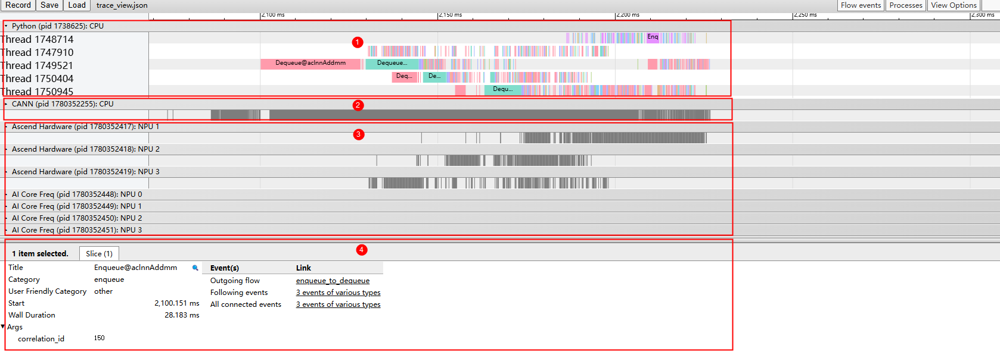

如[图1](#fig1)所示，trace数据主要展示如下区域：

-   区域1：上层应用数据，包含上层应用算子的耗时信息。
-   区域2：CANN层数据，主要包含AscendCL、GE和Runtime组件的耗时数据。
-   区域3：底层NPU数据，主要包含Task Scheduler组件耗时数据和迭代轨迹数据以及其他昇腾AI处理器系统数据。
-   区域4：展示trace中各算子、接口的详细信息。单击各个trace事件时展示。

>[!NOTE] 说明
>trace\_view.json支持使用MindStudio Insight工具、chrome://tracing/和https://ui.perfetto.dev/打开。

**图 2**  trace\_view（record\_shapes）  
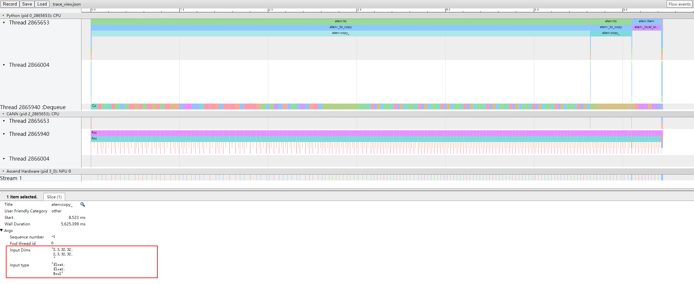

开启record\_shapes时，trace\_view中的上层应用算子会显示Input Dims和Input type信息。

**图 3**  trace\_view（with\_stack）  


开启with\_stack时，trace\_view中的上层应用算子会显示Call stack信息。

**图 4**  trace\_view（GC）  
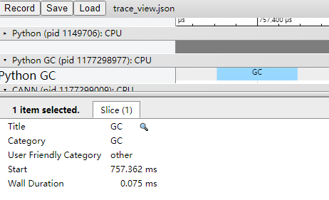

[图4](#fig4)采集结果中Python GC层的时间段为本次GC执行的时间。

GC执行时，会阻塞当前进程，需要等待GC完成，若GC时间过长，可以通过调整GC参数（可参考[垃圾回收器](https://docs.python.org/zh-cn/3/library/gc.html)中的gc.set\_threshold）来缓解GC造成的进程阻塞。

**kernel\_details.csv**

**图 5**  kernel\_details  
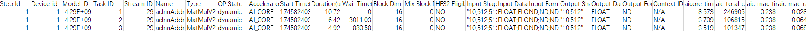

文件包含在NPU上执行的所有算子的信息。若用户前端调用了schedule进行Step打点，则会增加Step Id字段；但若schedule设置了warmup（不为0），且训练/在线推理的每个Step后存在算子异步执行操作，那么这部分算子异步执行操作在warmup阶段执行的算子可能会被采集到，结果为在kernel\_details.csv中没有Step Id字段。

字段信息如[表1](#table1)所示。

>[!NOTE] 说明
>当配置experimental\_config的aic\_metrics参数时，kernel\_details.csv文件将根据experimental\_config参数的aic\_metrics配置增加对应字段，主要增加内容请参见[experimental\_config参数说明](#experimental_config参数说明)，文件内相关字段详细介绍请参见《性能调优工具用户指南》中的“性能数据文件参考 \> [op\_summary（算子详细信息)](https://gitcode.com/Ascend/msprof/blob/master/docs/zh/profile_data_file_references.md#op_summary%EF%BC%88%E7%AE%97%E5%AD%90%E8%AF%A6%E7%BB%86%E4%BF%A1%E6%81%AF%EF%BC%89)”。

**表 1**  kernel\_details<a name="table1"></a>

|字段名|字段解释|
|--|--|
|Step Id|迭代ID。|
|Device_id|设备ID。|
|Model ID|模型ID。|
|Task ID|Task任务的ID。|
|Stream ID|该Task所处的Stream ID。|
|Name|算子名。|
|Type|算子类型。|
|OP State|算子的动静态信息，dynamic表示动态算子，static表示静态算子，通信算子无该状态显示为N/A，该字段仅在--task-time=l1情况下上报，--task-time=l0时显示为N/A。|
|Accelerator Core|AI加速核类型，包括AI Core、AI CPU等。|
|Start Time(us)|算子执行开始时间，单位us。|
|Duration(us)|当前算子执行耗时，单位us。|
|Wait Time(us)|算子执行等待时间，单位us。|
|Block Num|运行切分数量，对应任务执行时核数。|
|Mix Block Num|部分算子同时在AI Core和Vector Core上执行，主加速器的Block Num在Block Num字段描述，从加速器的Block Num在本字段描述。task_time为l0时，不采集该字段，显示为N/A。<br>仅Atlas A2 训练系列产品/Atlas A2 推理系列产品和Atlas A3 训练系列产品/Atlas A3 推理系列产品支持。|
|HF32 Eligible|标识是否使用HF32精度标记，YES表示使用，NO表示未使用。|
|Input Shapes|算子输入Shape。|
|Input Data Types|算子输入数据类型。|
|Input Formats|算子输入数据格式。|
|Output Shapes|算子输出Shape。|
|Output Data Types|算子输出数据类型。|
|Output Formats|算子输出数据格式。|

**memory\_record.csv**

**图 6**  memory\_record  
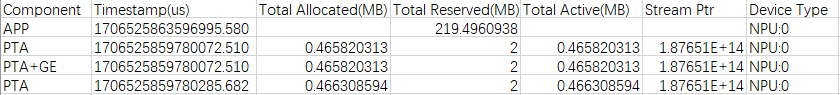

文件包含PTA和GE的显存占用记录，主要记录PTA、GE等组件申请的内存及占用时间。字段信息如[表2](#table2)所示。

**表 2**  memory\_record<a name="table2"></a>

|字段名|字段解释|
|--|--|
|Component|组件，包含：PTA和GE组件、APP进程级、WORKSPACE（采集性能数据前配置环境变量TASK_QUEUE_ENABLE=2时生成）等。|
|Timestamp(us)|时间戳，记录显存占用的起始时间，单位us。|
|Total Allocated(MB)|内存分配总额，单位MB。|
|Total Reserved(MB)|内存预留总额，单位MB。|
|Total Active(MB)|Stream流所申请的总内存（包括被其他流复用的未释放的内存），单位MB。|
|Stream Ptr|AscendCL流的内存地址，用于标记不同的AscendCL流。|
|Device Type|设备类型和设备ID，仅涉及NPU。|

**operator\_memory.csv**

**图 7**  operator\_memory  
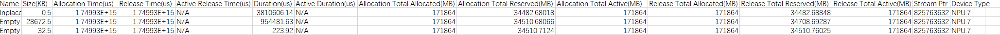

文件包含算子的内存占用明细，主要记录算子在NPU上执行所需内存及占用时间，其中内存由PTA和GE申请。字段信息如[表3](#table3)所示。

>[!NOTE] 说明
>若operator\_memory.csv文件中出现负值或空值，详细原因请参见《性能调优工具用户指南》中的“性能数据文件参考 \> [operator\_memory（CANN算子的内存占用明细）](https://gitcode.com/Ascend/msprof/blob/master/docs/zh/profile_data_file_references.md#operator_memory%EF%BC%88cann%E7%AE%97%E5%AD%90%E7%9A%84%E5%86%85%E5%AD%98%E5%8D%A0%E7%94%A8%E6%98%8E%E7%BB%86%EF%BC%89)” 的负值空值说明。

**表 3**  operator\_memory<a name="table3"></a>

|字段名|字段解释|
|--|--|
|Name|算子名称。|
|Size(KB)|算子占用内存大小，单位KB。|
|Allocation Time(us)|Tensor内存分配时间，单位us。|
|Release Time(us)|Tensor内存释放时间，单位us。|
|Active Release Time(us)|内存实际归还内存池时间，单位us。|
|Duration(us)|内存占用时间（Release Time-Allocation Time），单位us。|
|Active Duration(us)|内存实际占用时间（Active Release Time-Allocation Time），单位us。|
|Allocation Total Allocated(MB)|算子内存分配时的内存分配总额（Name算子名称为aten开头时为PTA内存，算子名称为cann开头时为GE内存），单位MB。|
|Allocation Total Reserved(MB)|算子内存分配时的内存占用总额（Name算子名称为aten开头时为PTA内存，算子名称为cann开头时为GE内存），单位MB。|
|Allocation Total Active(MB)|算子内存分配时当前流所申请的总内存（包括被其他流复用的未释放的内存），单位MB。|
|Release Total Allocated(MB)|算子内存释放时的内存分配总额（Name算子名称为aten开头时为PTA内存，算子名称为cann开头时为GE内存），单位MB。|
|Release Total Reserved(MB)|算子内存释放时的内存占用总额（Name算子名称为aten开头时为PTA内存，算子名称为cann开头时为GE内存），单位MB。|
|Release Total Active(MB)|算子内存释放时的内存中被其他Stream复用的内存总额（Name算子名称为aten开头时为PTA内存，算子名称为cann开头时为GE内存），单位MB。|
|Stream Ptr|AscendCL流的内存地址，用于标记不同的AscendCL流。|
|Device Type|设备类型和设备ID，仅涉及NPU。|

**npu\_module\_mem.csv**

**图 8**  npu\_module\_mem  
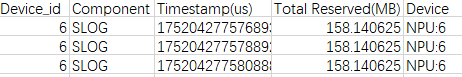

npu\_module\_mem.csv数据在采集进程中自动采集，包含组件级的内存占用情况，主要记录组件在NPU上执行时，当前时刻所占用的内存。字段信息如[表4](#table4)所示。

**表 4**  npu\_module\_mem<a name="table4"></a>

|字段名|字段解释|
|--|--|
|Device_id|设备ID。|
|Component|组件名称。|
|Timestamp(us)|时间戳，表示当前时刻组件占用的内存，单位us。|
|Total Reserved(MB)|内存占用大小，单位MB。|
|Device|设备类型和设备ID，仅涉及NPU。|

**operator\_details.csv**

**图 9**  operator\_details  
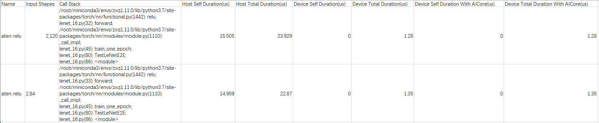

operator\_details.csv文件包含信息如[表5](#table5)所示。

**表 5**  operator\_details<a name="table5"></a>

|字段|说明|
|--|--|
|Name|算子名称。|
|Input Shapes|Shape信息。|
|Call Stack|函数调用栈信息。由with_stack字段控制。|
|Host Self Duration(us)|算子在Host侧的耗时（除去内部调用的其他算子），单位us。|
|Host Total Duration(us)|算子在Host侧的耗时，单位us。|
|Device Self Duration(us)|算子在Device侧的耗时（除去内部调用的其他算子），单位us。|
|Device Total Duration(us)|算子在Device侧的耗时，单位us。|
|Device Self Duration With AICore(us)|算子在Device侧执行在AI Core上的耗时（除去内部调用的算子），单位us。|
|Device Total Duration With AICore(us)|算子在Device侧执行在AI Core上的耗时，单位us。|

**step\_trace\_time.csv**

**图 10**  step\_trace\_time  
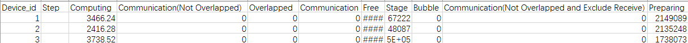

迭代中计算和通信的时间统计，包含信息如[表6](#table6)所示。

**表 6**  step\_trace\_time<a name="table6"></a>

|字段|说明|
|--|--|
|Device_id|设备ID。|
|Step|迭代数。|
|Computing|NPU上算子的计算总时间，单位us。|
|Communication(Not Overlapped)|通信时间，通信总时间减去计算和通信重叠的时间，单位us。|
|Overlapped|计算和通信重叠的时间，单位us。更多重叠代表计算和通信之间更好的并行性。理想情况下，通信与计算完全重叠。|
|Communication|NPU上算子的通信总时间，单位us。|
|Free|迭代总时间减去计算和通信时间，单位us。可能包括初始化、数据加载、CPU计算等。|
|Stage|Stage时间，代表除receive算子时间外的时间，单位us。|
|Bubble|指receive时间的总和，单位us。|
|Communication(Not Overlapped and Exclude Receive)|通信总时间减去计算和通信重叠以及receive算子的时间，单位us。|
|Preparing|迭代开始到首个计算或通信算子运行的时间，单位us。|

**data\_preprocess.csv**

data\_preprocess.csv文件记录AI CPU数据，示例和字段说明以《性能调优工具用户指南》中的“性能数据文件参考 \> [aicpu（AI CPU算子详细耗时）](https://gitcode.com/Ascend/msprof/blob/master/docs/zh/profile_data_file_references.md#aicpu%EF%BC%88ai-cpu%E7%AE%97%E5%AD%90%E8%AF%A6%E7%BB%86%E8%80%97%E6%97%B6%EF%BC%89)”为参考，实际结果略有不同，请以实际情况为准。

**l2\_cache.csv**

示例和字段说明以《性能调优工具用户指南》中的“性能数据文件参考 \> [l2\_cache（L2 Cache命中率）](https://gitcode.com/Ascend/msprof/blob/master/docs/zh/profile_data_file_references.md#l2_cache%EF%BC%88l2-cache%E5%91%BD%E4%B8%AD%E7%8E%87%EF%BC%89)”为参考，实际结果略有不同，请以实际情况为准。

**op\_statistic.csv**

示例和字段说明以《性能调优工具用户指南》中的“性能数据文件参考 \> [op\_statistic（算子调用次数及耗时）](https://gitcode.com/Ascend/msprof/blob/master/docs/zh/profile_data_file_references.md#op_statistic%EF%BC%88%E7%AE%97%E5%AD%90%E8%B0%83%E7%94%A8%E6%AC%A1%E6%95%B0%E5%8F%8A%E8%80%97%E6%97%B6%EF%BC%89)”为参考，实际结果略有不同，请以实际情况为准。

**api\_statistic.csv**

示例和字段说明以《性能调优工具用户指南》中的“性能数据文件参考 \> [api\_statistic（API耗时统计信息）](https://gitcode.com/Ascend/msprof/blob/master/docs/zh/profile_data_file_references.md#api_statistic%EF%BC%88api%E8%80%97%E6%97%B6%E7%BB%9F%E8%AE%A1%E4%BF%A1%E6%81%AF%EF%BC%89) \> api\_statistic\_\*.csv文件说明”为参考，实际结果略有不同，请以实际情况为准。

**pcie.csv**

示例和字段说明以《性能调优工具用户指南》中的“性能数据文件参考 \> [pcie（PCIe带宽）](https://gitcode.com/Ascend/msprof/blob/master/docs/zh/profile_data_file_references.md#pcie%EF%BC%88pcie%E5%B8%A6%E5%AE%BD%EF%BC%89) \> pcie\_\*.csv文件说明”为参考，实际结果略有不同，请以实际情况为准。

**hccs.csv**

示例和字段说明以《性能调优工具用户指南》中的“性能数据文件参考 \> [hccs（集合通信带宽）](https://gitcode.com/Ascend/msprof/blob/master/docs/zh/profile_data_file_references.md#hccs%EF%BC%88%E9%9B%86%E5%90%88%E9%80%9A%E4%BF%A1%E5%B8%A6%E5%AE%BD%EF%BC%89) \> hccs\_\*.csv文件说明”为参考，实际结果略有不同，请以实际情况为准。

**nic.csv**

示例和字段说明以《性能调优工具用户指南》中的“性能数据文件参考 \> [nic（每个时间节点网络信息）](https://gitcode.com/Ascend/msprof/blob/master/docs/zh/profile_data_file_references.md#nic%EF%BC%88%E6%AF%8F%E4%B8%AA%E6%97%B6%E9%97%B4%E8%8A%82%E7%82%B9%E7%BD%91%E7%BB%9C%E4%BF%A1%E6%81%AF%EF%BC%89) \> nic\_\*.csv文件说明”为参考，实际结果略有不同，请以实际情况为准。

**roce.csv**

示例和字段说明以《性能调优工具用户指南》中的“性能数据文件参考 \> [roce（RoCE通信接口带宽）](https://gitcode.com/Ascend/msprof/blob/master/docs/zh/profile_data_file_references.md#roce%EF%BC%88roce%E9%80%9A%E4%BF%A1%E6%8E%A5%E5%8F%A3%E5%B8%A6%E5%AE%BD%EF%BC%89) \> roce\_\*.csv文件说明”为参考，实际结果略有不同，请以实际情况为准。

### ascend\_pytorch\_profiler\_\{Rank\_ID\}.db数据

该文件为表结构文件，该文件推荐使用MindStudio Insight工具查看，也可以使用Navicat Premium等数据库开发工具直接打开。当前db文件汇总的性能数据如下：

**STRING\_IDS**

映射表，用于存储ID和字符串映射关系。

无开关，记录CANN侧使用的String ID映射关系，通常从0开始累加。

**表 1**  格式

|字段名|类型|索引|含义|
|--|--|--|--|
|id|INTEGER|主键|string对应的id|
|value|TEXT|-|string内容|

**PYTORCH\_API**

框架侧API数据，当前仅包含torch\_npu API数据。

由Ascend PyTorch Profiler接口的torch\_npu.profiler.ProfilerActivity.CPU开关控制。

**表 2**  格式

|字段名|类型|含义|
|--|--|--|
|startNs|INTEGER|op API开始时间，单位ns|
|endNs|INTEGER|op API结束时间，单位ns|
|globalTid|INTEGER|该API所属的全局tid。高32位：pid，低32位：tid|
|connectionId|INTEGER|用于在CONNECTION_IDS表查询对应的connectionId；如果无connectionId，此处为空|
|name|INTEGER|该op API名，STRING_IDS(name)|
|sequenceNumber|INTEGER|op序号|
|fwdThreadId|INTEGER|op前向线程id|
|inputDtypes|INTEGER|输入数据类型，STRING_IDS(inputDtypes)|
|inputShapes|INTEGER|输入shape，STRING_IDS(inputShapes)|
|callchainId|INTEGER|用于在PYTORCH_CALLCHAINS表查询对应的call stack信息；如果无stack信息，此处为空|
|type|INTEGER|标记数据类型，op、queue、mstx还是python_trace，数据类型存于枚举表ENUM_API_TYPE中|

**CONNECTION\_IDS**

框架侧API和自身或者和CANN API的关联关系数据。

由Ascend PyTorch Profiler接口的torch\_npu.profiler.ProfilerActivity.CPU开关控制。

**表 3**  格式

|字段名|类型|含义|
|--|--|--|
|id|INTEGER|对应PYTORCH_API表的connectionId|
|connectionId|INTEGER|用于表示关联关系的ID，当前包括task_queue、fwd_bwd、torch-cann-task三种关联关系|

**PYTORCH\_CALLCHAINS**

框架侧的堆栈信息。

由Ascend PyTorch Profiler接口的with\_stack参数控制。

**表 4**  格式

|字段名|类型|含义|
|--|--|--|
|id|INTEGER|对应PYTORCH_API表的callchainId|
|stack|INTEGER|当前栈的字符串内容在STRING_IDS表中对应的id|
|stackDepth|INTEGER|当前栈所在深度|

**MEMORY\_RECORD**

框架侧的显存占用记录。

由Ascend PyTorch Profiler接口的profile\_memory参数控制。

**表 5**  格式

|字段名|类型|含义|
|--|--|--|
|component|INTEGER|组件名（GE、PTA、PTA+GE）在STRING_IDS表中对应的id|
|timestamp|INTEGER|时间戳|
|totalAllocated|INTEGER|内存分配总额|
|totalReserved|INTEGER|内存预留总额|
|totalActive|INTEGER|PTA流申请的总内存|
|streamPtr|INTEGER|ascendcl流地址|
|deviceId|INTEGER|设备ID|

**OP\_MEMORY**

框架侧基于MEMORY\_RECORD整合的算子内存占用信息。

由Ascend PyTorch Profiler接口的profile\_memory参数控制。

**表 6**  格式

|字段名|类型|含义|
|--|--|--|
|name|INTEGER|torch和GE算子名称，STRING_IDS(name)|
|size|INTEGER|算子占用内存大小，单位Byte|
|allocationTime|INTEGER|算子内存申请时间，单位ns|
|releaseTime|INTEGER|算子内存释放时间，单位ns|
|activeReleaseTime|INTEGER|内存实际归还内存池时间，单位ns|
|duration|INTEGER|内存占用时间，单位ns|
|activeDuration|INTEGER|内存实际占用时间，单位ns|
|allocationTotalAllocated|INTEGER|算子内存分配时PTA和GE内存分配总额，单位Byte|
|allocationTotalReserved|INTEGER|算子内存分配时PTA和GE内存占用总额，单位Byte|
|allocationTotalActive|INTEGER|算子内存分配时当前流申请的内存总额，单位Byte|
|releaseTotalAllocated|INTEGER|算子内存释放时PTA和GE内存分配总额，单位Byte|
|releaseTotalReserved|INTEGER|算子内存释放时PTA和GE内存占用总额，单位Byte|
|releaseTotalActive|INTEGER|算子内存释放时当前流申请的内存总额，单位Byte|
|streamPtr|INTEGER|ascendcl流地址|
|deviceId|INTEGER|设备ID|

**RANK\_DEVICE\_MAP**

rankId和deviceId的映射关系数据。

无对应开关，导出ascend\_pytorch\_profiler\_\{Rank\_ID\}.db文件时默认生成。

**表 7**  格式

|字段名|类型|含义|
|--|--|--|
|rankId|INTEGER|集群场景的节点标识ID，显示为-1时表示未设置rankId。|
|deviceId|INTEGER|节点上的设备ID，显示为-1时表示未采集到deviceId。|

**STEP\_TIME**

保存Profiler采集step起始时间。

由Ascend PyTorch Profiler接口torch\_npu.profiler.schedule类的参数控制。

**表 8**  格式

|字段名|类型|含义|
|--|--|--|
|id|INTEGER|Step ID值|
|startNs|INTEGER|Step开始时间，单位ns|
|endNs|INTEGER|Step结束时间，单位ns|

**GC\_RECORD**

保存Profiler采集的GC事件。

由Ascend PyTorch Profiler接口的gc\_detect\_threshold参数控制。

**表 9**  格式

|字段名|类型|含义|
|--|--|--|
|startNs|INTEGER|GC事件开始时间，单位ns|
|endNs|INTEGER|GC事件结束时间，单位ns|
|globalTid|INTEGER|GC事件的全局tid|

**ROCE**

RoCE通信接口带宽数据。

控制开关：

-   msprof命令的--sys-io-profiling、--sys-io-sampling-freq
-   Ascend PyTorch Profiler的sys\_io

**表 10**  格式

|字段名|类型|含义|
|--|--|--|
|deviceId|INTEGER|设备ID|
|timestampNs|INTEGER|本地时间，单位ns|
|bandwidth|INTEGER|带宽，单位Byte/s|
|rxPacketRate|NUMERIC|收包速率，单位packet/s|
|rxByteRate|NUMERIC|接收字节速率，单位Byte/s|
|rxPackets|INTEGER|累计收包数量，单位packet|
|rxBytes|INTEGER|累计接收字节数量，单位Byte|
|rxErrors|INTEGER|累计接收错误包数量，单位packet|
|rxDropped|INTEGER|累计接收丢包数量，单位packet|
|txPacketRate|NUMERIC|发包速率，单位packet/s|
|txByteRate|NUMERIC|发送字节速率，单位Byte/s|
|txPackets|INTEGER|累计发包数量，单位packet|
|txBytes|INTEGER|累计发送字节数量，单位Byte|
|txErrors|INTEGER|累计发送错误包数量，单位packet|
|txDropped|INTEGER|累计发送丢包数量，单位packet|
|funcId|INTEGER|端口号|

**NIC**

每个时间节点网络信息数据。

控制开关：

-   msprof命令的--sys-io-profiling、--sys-io-sampling-freq
-   Ascend PyTorch Profiler的sys\_io

**表 11**  格式

|字段名|类型|含义|
|--|--|--|
|deviceId|INTEGER|设备ID|
|timestampNs|INTEGER|本地时间，单位ns|
|bandwidth|INTEGER|带宽，单位Byte/s|
|rxPacketRate|NUMERIC|收包速率，单位packet/s|
|rxByteRate|NUMERIC|接收字节速率，单位Byte/s|
|rxPackets|INTEGER|累计收包数量，单位packet|
|rxBytes|INTEGER|累计接收字节数量，单位Byte|
|rxErrors|INTEGER|累计接收错误包数量，单位packet|
|rxDropped|INTEGER|累计接收丢包数量，单位packet|
|txPacketRate|NUMERIC|发包速率，单位packet/s|
|txByteRate|NUMERIC|发送字节速率，单位Byte/s|
|txPackets|INTEGER|累计发包数量，单位packet|
|txBytes|INTEGER|累计发送字节数量，单位Byte|
|txErrors|INTEGER|累计发送错误包数量，单位packet|
|txDropped|INTEGER|累计发送丢包数量，单位packet|
|funcId|INTEGER|端口号|

**HCCS**

HCCS集合通信带宽数据。

控制开关：

-   msprof命令的--sys-interconnection-profiling、--sys-interconnection-freq
-   Ascend PyTorch Profiler的sys\_interconnection

**表 12**  格式

|字段名|类型|含义|
|--|--|--|
|deviceId|INTEGER|设备ID|
|timestampNs|INTEGER|本地时间，单位ns|
|txThroughput|NUMERIC|发送带宽，单位Byte/s|
|rxThroughput|NUMERIC|接收带宽，单位Byte/s|

**PCIE**

PCIe带宽数据。

控制开关：

-   msprof命令的--sys-interconnection-profiling、--sys-interconnection-freq
-   Ascend PyTorch Profiler的sys\_interconnection

**表 13**  格式

|字段名|类型|含义|
|--|--|--|
|deviceId|INTEGER|设备ID|
|timestampNs|INTEGER|本地时间，单位ns|
|txPostMin|NUMERIC|发送端PCIe Post数据传输带宽最小值，单位Byte/s|
|txPostMax|NUMERIC|发送端PCIe Post数据传输带宽最大值，单位Byte/s|
|txPostAvg|NUMERIC|发送端PCIe Post数据传输带宽平均值，单位Byte/s|
|txNonpostMin|NUMERIC|发送端PCIe Non-Post数据传输带宽最小值，单位Byte/s|
|txNonpostMax|NUMERIC|发送端PCIe Non-Post数据传输带宽最大值，单位Byte/s|
|txNonpostAvg|NUMERIC|发送端PCIe Non-Post数据传输带宽平均值，单位Byte/s|
|txCplMin|NUMERIC|发送端接收写请求的完成数据包最小值，单位Byte/s|
|txCplMax|NUMERIC|发送端接收写请求的完成数据包最大值，单位Byte/s|
|txCplAvg|NUMERIC|发送端接收写请求的完成数据包平均值，单位Byte/s|
|txNonpostLatencyMin|NUMERIC|发送端PCIe Non-Post模式下的传输时延最小值，单位ns|
|txNonpostLatencyMax|NUMERIC|发送端PCIe Non-Post模式下的传输时延最大值，单位ns|
|txNonpostLatencyAvg|NUMERIC|发送端PCIe Non-Post模式下的传输时延平均值，单位ns|
|rxPostMin|NUMERIC|接收端PCIe Post数据传输带宽最小值，单位Byte/s|
|rxPostMax|NUMERIC|接收端PCIe Post数据传输带宽最大值，单位Byte/s|
|rxPostAvg|NUMERIC|接收端PCIe Post数据传输带宽平均值，单位Byte/s。|
|rxNonpostMin|NUMERIC|接收端PCIe Non-Post数据传输带宽最小值，单位Byte/s|
|rxNonpostMax|NUMERIC|接收端PCIe Non-Post数据传输带宽最大值，单位Byte/s|
|rxNonpostAvg|NUMERIC|接收端PCIe Non-Post数据传输带宽平均值，单位Byte/s|
|rxCplMin|NUMERIC|接收端收到写请求的完成数据包最小值，单位Byte/s|
|rxCplMax|NUMERIC|接收端收到写请求的完成数据包最大值，单位Byte/s|
|rxCplAvg|NUMERIC|接收端收到写请求的完成数据包平均值，单位Byte/s|


### analysis.db数据

该文件为表结构文件，推荐使用MindStudio Insight工具查看，也可以使用Navicat Premium等数据库开发工具直接打开。当前db文件汇总的性能数据如下：

**CommAnalyzerBandwidth**

**表 1**  格式

|字段名|类型|含义|
|--|--|--|
|hccl_op_name|TEXT|通信大算子名，例：hcom_broadcast__303_1_1|
|group_name|TEXT|通信域hash ID|
|transport_type|TEXT|传输类型，包含：LOCAL、SDMA、RDMA|
|transit_size|NUMERIC|传输的数据量，单位MB|
|transit_time|NUMERIC|传输耗时，单位ms|
|bandwidth|NUMERIC|带宽，单位GB/s|
|large_packet_ratio|NUMERIC|大数据包的比例|
|package_size|NUMERIC|一次传输的通信数据包大小，单位MB|
|count|NUMERIC|通信传输次数|
|total_duration|NUMERIC|数据传输总耗时|
|step|TEXT|算子所属的step，例：step12|
|type|TEXT|算子类型，包含：Collective，P2P|

**CommAnalyzerTime**

**表 2**  格式

|字段名|类型|含义|
|--|--|--|
|hccl_op_name|TEXT|通信算子名称。|
|group_name|TEXT|通信算子的分组。|
|start_timestamp|NUMERIC|通信开始时间戳，单位us。|
|elapse_time|NUMERIC|算子的通信总耗时，单位ms。|
|transit_time|NUMERIC|通信时长，单位ms。表示通信算子的通信耗时，如果通信耗时过长，可能是某条链路存在问题。|
|wait_time|NUMERIC|等待时长，单位ms。节点之间通信前首先需要进行同步，确保通信的两个节点同步完成，再进行通信。|
|synchronization_time|NUMERIC|同步时长，单位ms。节点之间进行同步需要的时长。|
|idle_time|NUMERIC|空闲时间，单位ms。空闲时间（idle_time） = 算子的通信总耗时（elapse_time） - 通信时长（transit_time） - 等待时长（wait_time）。|
|step|TEXT|算子所属的step|
|type|TEXT|算子类型，包含：Collective，P2P|

**CommAnalyzerMatrix**

**表 3**  格式

|字段名|类型|含义|
|--|--|--|
|hccl_op_name|TEXT|矩阵分析后的精简算子名，例：send-top1|
|group_name|TEXT|通信域hash ID|
|src_rank|TEXT|发送数据的rankId，例：0|
|dst_rank|TEXT|接收数据的rankId，例：1|
|transport_type|TEXT|传输类型，包含：LOCAL、SDMA、RDMA|
|transit_size|NUMERIC|传输的数据量，单位MB|
|transit_time|NUMERIC|传输耗时，单位ms|
|bandwidth|NUMERIC|带宽，单位GB/s|
|step|TEXT|算子所属的step，例：step12|
|type|TEXT|算子类型，包含：Collective，P2P|
|op_name|TEXT|算子的原始名字，例：hcom_broadcast__303_1_1|

**StepTraceTime**

**表 4**  格式

|字段名|类型|含义|
|--|--|--|
|deviceId|INTEGER|设备ID|
|step|TEXT|step编号，例：12|
|computing|NUMERIC|计算的时间，单位ms|
|communication|NUMERIC|通信的时间，单位ms|
|overlapped|NUMERIC|同时进行计算和通信的时间，单位ms|
|communication_not_overlapped|NUMERIC|纯用于通信的时间，单位ms|
|free|NUMERIC|空闲的时间，单位ms|
|stage|NUMERIC|step内除去接收数据的时间，单位ms|
|bubble|NUMERIC|step内用于接收数据的时间，单位ms|
|communication_not_overlapped_and_exclude_receive|NUMERIC|纯用于通信的时间减去用于接收数据的时间，单位ms|


## 附录

### Ascend PyTorch Profiler接口说明

**表 1**  torch\_npu.profiler.profile和torch\_npu.profiler.\_KinetoProfile配置参数说明

|参数名称|可选/必选|说明|
|--|--|--|
|activities|可选|CPU、NPU事件采集列表，Enum类型。取值为：<br>&#8226; torch_npu.profiler.ProfilerActivity.CPU：框架侧数据采集的开关。<br>&#8226; torch_npu.profiler.ProfilerActivity.NPU：CANN软件栈及NPU数据采集的开关。<br/>默认情况下两个开关同时开启。|
|schedule|可选|设置不同step的行为，Callable类型，由schedule类控制。默认不执行任何操作。<br/>torch_npu.profiler._KinetoProfile不支持该参数。|
|on_trace_ready|可选|采集结束时自动执行操作，Callable类型。当前支持执行tensorboard_trace_handler函数操作。当采集的数据量过大时，在当前环境下不适合直接解析性能数据，或者采集过程中中断了训练/在线推理进程，只采集了部分性能数据，可以采用[离线解析](#离线解析)。<br/>默认不执行任何操作。<br/>torch_npu.profiler._KinetoProfile不支持该参数。<br/>对于使用共享存储的多卡大集群场景，直接使用on_trace_ready执行tensorboard_trace_handler函数的方式进行性能数据落盘，可能因多卡数据直接落盘到共享存储导致性能膨胀的问题。解决方式请参见[PyTorch多卡大集群场景如何避免性能数据直接落盘到共享存储时导致的性能膨胀问题](#PyTorch多卡大集群场景如何避免性能数据直接落盘到共享存储时导致的性能膨胀问题)。|
|record_shapes|可选|算子的InputShapes和InputTypes，Bool类型。取值为：<br/>&#8226; True：开启。<br/>&#8226; False：关闭。<br/>默认关闭。<br/>开启torch_npu.profiler.ProfilerActivity.CPU时生效。|
|profile_memory|可选|算子的显存占用情况，Bool类型。取值为：<br/>&#8226; True：开启。<br/>&#8226; False：关闭。<br/>默认关闭。<br/>开启torch_npu.profiler.ProfilerActivity.CPU时，采集框架显存占用情况；torch_npu.profiler.ProfilerActivity.NPU时，采集CANN的显存占用。<br/>已知在安装有glibc<2.34的环境上采集memory数据，可能触发glibc的一个已知[Bug 19329](https://sourceware.org/bugzilla/show_bug.cgi?id=19329)，通过升级环境的glibc版本可解决此问题。|
|with_stack|可选|算子调用栈，Bool类型。包括框架层及CPU算子层的调用信息。取值为：<br/>&#8226; True：开启。<br/>&#8226; False：关闭。<br/>默认关闭。<br/>开启torch_npu.profiler.ProfilerActivity.CPU时生效。<br/>开启该配置后会引入额外的性能膨胀。|
|with_modules|可选|modules层级的Python调用栈，即框架层的调用信息，Bool类型。取值为：<br/>&#8226; True：开启。<br/>&#8226; False：关闭。<br/>默认关闭。<br/>开启torch_npu.profiler.ProfilerActivity.CPU时生效。<br/>开启该配置后会引入额外的性能膨胀。|
|with_flops|可选|算子浮点操作，Bool类型（该参数暂不支持解析性能数据）。取值为：<br/>&#8226; True：开启。<br/>&#8226; False：关闭。<br/>默认关闭。<br/>开启torch_npu.profiler.ProfilerActivity.CPU时生效。|
|experimental_config|可选|扩展参数，通过扩展配置性能分析工具常用的采集项。支持采集项和详细介绍请参见[experimental_config参数说明](#experimental_config参数说明)。|
|use_cuda|可选|昇腾环境不支持。开启采集cuda性能数据开关，Bool类型。取值为：<br/>&#8226; True：开启。<br/>&#8226; False：关闭。<br/>默认关闭。<br/>torch_npu.profiler._KinetoProfile不支持该参数。|

**表 2**  torch\_npu.profiler.profile和torch\_npu.profiler.\_KinetoProfile方法说明

|方法名|说明|
|--|--|
|step|划分不同迭代。torch_npu.profiler._KinetoProfile不支持该方法。|
|export_chrome_trace|导出trace。在指定的.json文件里写入trace数据。Trace为Ascend PyTorch Profiler接口整合框架侧CANN软件栈及NPU数据后展示的各算子和接口的运行时间及关联关系。包含参数：<br>&#8226; *path*：trace文件（.json）路径。指定文件所在的路径格式仅支持由字母、数字和下划线组成的字符串，不支持软链接。必选。<br>多卡场景下需要将不同卡设置不同的文件名，<br>示例代码：<br>`pid = os.getpid()`<br/>`prof.export_chrome_trace(f'./chrome_trace_{pid}.json')`|
|export_stacks|导出堆栈信息到文件。包含参数：<br>&#8226; *path*：堆栈文件保存路径，需要配置文件名为“\*.log”，可以指定路径，例如：/home/*.log，直接配置文件名时，文件保存在当前目录。路径格式仅支持由字母、数字和下划线组成的字符串，不支持软链接。必选。<br/>&#8226; metric：保存的芯片类型可选择CPU或NPU，配置为“self_cpu_time_total”或“self_npu_time_total”。必选。<br/>与export_chrome_trace方法在训练/在线推理脚本中的位置相同，示例如下：<br/>`export_stacks('result_dir/stack.log', metric='self_npu_time_total')`<br/>导出的结果文件可使用FlameGraph工具进行查看，操作方法如下：<br/>`git clone https://github.com/brendangregg/FlameGraph`<br/>`cd FlameGraph`<br/>`./flamegraph.pl –title "NPU time" –countname "us." profiler.stacks > perf_viz.svg`|
|export_memory_timeline|详细介绍请参见[显存可视化](#显存可视化)。|
|start|设置采集开始的位置。可参考如下样例，在需要采集性能数据的训练/在线推理代码前后添加start和stop：<br/>`prof = torch_npu.profiler.profile(`<br/>`on_trace_ready=torch_npu.profiler.tensorboard_trace_handler("./result"))`<br/>`for step in range(steps):`<br/>`    if step == 5:`<br/>`        prof.start()`<br/>`    train_one_step()`<br/>`    if step == 5:`<br/>`        prof.stop()`|
|stop|设置采集结束的位置，需要先执行start。|
|enable_profiler_in_child_thread|注册Profiler采集回调函数，采集用户子线程下发的torch算子等框架侧数据。该参数中可另外配置torch_npu.profiler.profile的其他参数（包括record_shapes、profile_memory、with_stack、with_flops、with_modules），作为Profiler子线程的采集配置。<br/>与torch_npu.profiler.profile.enable_profiler_in_child_thread配对使用。<br/>详细使用请参见[创建Profiler子线程采集](#创建Profiler子线程采集)。<br/>torch_npu.profiler._KinetoProfile不支持该方法。|
|disable_profiler_in_child_thread|注销Profiler采集回调函数。与torch_npu.profiler.profile.enable_profiler_in_child_thread配对使用。torch_npu.profiler._KinetoProfile不支持该方法。|


**表 3**  torch\_npu.profiler类、函数说明

|类、函数名|说明|
|--|--|
|torch_npu.profiler.schedule|设置不同step的行为，默认不执行该操作。为了获取更稳定的性能数据，建议配置该类的具体参数，参数取值及详细用法请参见[torch_npu.profiler.schedule类参数说明](#torch_npu.profiler.schedule类参数说明)。|
|torch_npu.profiler.tensorboard_trace_handler|导出性能数据。取值为：<br/>&#8226; dir_name：采集到的性能数据的存放路径，string类型。路径格式仅支持由字母、数字和下划线组成的字符串，不支持软链接。若配置tensorboard_trace_handler函数后未指定具体路径，性能数据默认落盘在当前目录；若代码中未使用on_trace_ready=torch_npu.profiler.tensorboard_trace_handler，那么落盘的性能数据为原始数据，需要使用[离线解析](#离线解析)。可选。该函数优先级高于ASCEND_WORK_PATH，具体请参见《[环境变量参考](https://www.hiascend.com/document/detail/zh/canncommercial/850/maintenref/envvar/envref_07_0001.html)》。<br/>&#8226; worker_name：用于区分唯一的工作线程，string类型，默认为{hostname}\_{pid}。路径格式仅支持由字母、数字和下划线组成的字符串，不支持软链接。可选。<br/>&#8226; analyse_flag：性能数据自动解析开关，bool类型。取值True（开启自动解析，默认值）、False（关闭自动解析，采集完后的性能数据可以使用[离线解析](#离线解析)）。可选。<br/>&#8226; async_mode：控制是否开启异步解析（表示解析进程不会阻塞AI任务主流程），bool类型。取值True（开启异步解析）、False（关闭异步解析，即同步解析，默认值）。<br/>torch_npu.profiler.\_KinetoProfile不支持该函数。<br/>解析过程日志存放在{worker_name}\_{时间戳}_ascend_pt/logs目录下。|
|torch_npu.profiler.ProfilerAction|Profiler状态，Enum类型。取值为：<br/>&#8226; NONE：无任何行为。<br/>&#8226; WARMUP：性能数据采集预热。<br/>&#8226; RECORD：性能数据采集。<br/>&#8226; RECORD_AND_SAVE：性能数据采集并保存。|
|torch_npu.profiler._ExperimentalConfig|性能数据采集扩展，Enum类型。通过torch_npu.profiler.profile的experimental_config调用，详细介绍请参见[experimental_config参数说明](#experimental_config参数说明)。|
|torch_npu.profiler.supported_activities|查询当前支持采集的activities参数的CPU、NPU事件。|
|torch_npu.profiler.supported_profiler_level|查询当前支持的experimental_config参数的profiler_level级别。|
|torch_npu.profiler.supported_ai_core_metrics|查询当前支持的experimental_config参数的AI Core性能指标采集项。|
|torch_npu.profiler.supported_export_type|查询当前支持的torch_npu.profiler.ExportType的性能数据结果文件类型。|


### profiler_config.json文件说明

profiler\_config.json文件内容如下，以默认配置为例：

```
{
    "activities": ["CPU", "NPU"],
    "prof_dir": "./",
    "analyse": false,
    "record_shapes": false,
    "profile_memory": false,
    "with_stack": false,
    "with_flops": false,
    "with_modules": false,
    "active": 1,
    "warmup": 0,
    "start_step": 0,
    "is_rank": false,
    "rank_list": [],
    "experimental_config": {
        "profiler_level": "Level0",
        "aic_metrics": "AiCoreNone",
        "l2_cache": false,
        "op_attr": false,
        "gc_detect_threshold": null,
        "data_simplification": true,
        "record_op_args": false,
        "export_type": ["text"],
        "mstx": false,
        "mstx_domain_include": [],
        "mstx_domain_exclude": [],
        "host_sys": [],
        "sys_io": false,
        "sys_interconnection": false
    }
}
```

**表 1**  参数说明<a name="profiler_config_参数说明"></a>

|参数|可选/必选|说明|
|--|--|--|
|start_step|必选|设置开始采集的step，默认值为0（即不采集），设置为-1时表示在保存配置之后的下个step启动采集，配置为正整数时表示执行到该step时启动采集。<br>启动采集进程首先需要配置该参数为有效值。|
|activities|可选|CPU、NPU事件采集列表。取值为：<br/>&#8226; CPU：框架侧数据采集的开关。<br/>&#8226; NPU：CANN软件栈及NPU数据采集的开关。<br/>默认情况下两个开关同时开启。|
|prof_dir|可选|采集到的性能数据的存放路径。默认路径为：./。路径格式仅支持由字母、数字和下划线组成的字符串，不支持软链接。|
|analyse|可选|性能数据自动解析开关，取值为：<br/>&#8226; true：开启自动解析。<br/>&#8226; false：关闭自动解析，即手动解析，采集完后的性能数据可以使用[离线解析](#离线解析)。<br/>默认关闭。|
|record_shapes|可选|算子的InputShapes和InputTypes。取值为：<br/>&#8226; true：开启。<br/>&#8226; false：关闭。<br/>默认关闭。<br/>activities配置为CPU时生效。|
|profile_memory|可选|算子的显存占用情况。取值为：<br/>&#8226; true：开启。<br/>&#8226; false：关闭。<br/>默认关闭。<br/>activities开启CPU时，采集框架显存占用情况；activities开启NPU时，采集CANN的显存占用。<br/>已知在安装有glibc<2.34的环境上采集memory数据，可能触发glibc的一个已知[Bug 19329](https://sourceware.org/bugzilla/show_bug.cgi?id=19329)，通过升级环境的glibc版本可解决此问题。|
|with_stack|可选|算子调用栈。包括框架层及CPU算子层的调用信息。取值为：<br/>&#8226; true：开启。<br/>&#8226; false：关闭。<br/>默认关闭。<br/>activities配置为CPU时生效。|
|with_flops|可选|算子浮点操作，Bool类型（该参数暂不支持解析性能数据）。取值为：<br/>&#8226; true：开启。<br/>&#8226; false：关闭。<br/>默认关闭。<br/>activities配置为CPU时生效。|
|with_modules|可选|modules层级的Python调用栈，即框架层的调用信息。取值为：<br/>&#8226; true：开启。<br/>&#8226; false：关闭。<br/>默认关闭。<br/>activities配置为CPU时生效。|
|active|可选|配置采集的迭代数，取值为正整数，默认值为1。|
|warmup|可选|预热的step轮数，默认值为0，建议设置1轮预热。|
|is_rank|可选|开启指定Rank采集功能。取值为：<br/>&#8226; true：开启。<br/>&#8226; false：关闭。<br/>默认关闭。<br/>开启后，dynamic_profile会识别rank_list参数中配置的Rank ID，根据配置的Rank ID识别环境中存在的对应Rank执行采集操作；若开启后rank_list配置为空则不采集性能数据。<br/>开启后，analyse自动解析不生效，需要使用[离线解析](#离线解析)。|
|rank_list|可选|配置采集的Rank ID，取值为整数，默认值为空，表示不采集任何性能数据。须配置为环境中有效的Rank ID。可同时指定一个或多个Rank，配置示例："rank_list": [1,2,3]。|
|async_mode|可选|控制是否开启异步解析（表示解析进程不会阻塞AI任务主流程）。取值为：<br/>&#8226; true：开启异步解析。<br/>&#8226; false：关闭异步解析，即同步解析。<br/>默认关闭。|
|experimental_config|可选|扩展参数，通过扩展配置性能分析工具常用的采集项。详细介绍请参见[experimental_config参数说明](#experimental_config参数说明)。<br/>对于动态采集场景，该配置文件中配置的experimental_config的子参数选项取实际参数值即可，例如"aic_metrics": "PipeUtilization"。|
|metadata|可选|采集模型超参数（key）和配置信息（value）。<br/>保存数据到ascend_pytorch_profiler\_{Rank_ID}.db中的META_DATA表以及{worker_name}\_{时间戳}_ascend_pt目录下的profiler_metadata.json文件中。<br/>配置示例：<br/>`"metadata": {`<br/>`    "distributed_args":{`<br/>`        "tp":2,`<br/>`        "pp":4,`<br/>`        "dp":8`<br/>`    }`<br/>`}`|


### experimental\_config参数说明（dynamic\_profile动态采集场景）

experimental\_config参数均为可选参数，支持扩展的采集项如下：

**表 1**  experimental\_config

|参数|说明|
|--|--|
|profiler_level|采集的Level等级。取值为：<br/>&#8226; Level_none：不采集所有Level层级控制的数据，即关闭profiler_level。<br/>&#8226; Level0：采集上层应用数据、底层NPU数据以及NPU上执行的算子信息。配置该参数时，仅采集部分数据，其中部分算子信息不采集，详细情况请参见《性能调优工具用户指南》中的“性能数据文件参考 > [op_summary（算子详细信息）](https://gitcode.com/Ascend/msprof/blob/master/docs/zh/profile_data_file_references.md#op_summary%EF%BC%88%E7%AE%97%E5%AD%90%E8%AF%A6%E7%BB%86%E4%BF%A1%E6%81%AF%EF%BC%89)”。<br/>&#8226; Level1：在Level0的基础上多采集CANN层AscendCL数据和NPU上执行的AI Core性能指标信息、开启aic_metrics=torch_npu.profiler.AiCMetrics.PipeUtilization、生成通信算子的communication.json和communication_matrix.json以及api_statistic.csv文件。<br/>&#8226; Level2：在Level1的基础上多采集CANN层Runtime数据以及AI CPU（data_preprocess.csv文件）数据。<br/>默认值为Level0。|
|aic_metrics|AI Core的性能指标采集项。取值为：<br/>以下采集项的结果数据将在Kernel View呈现。<br/>以下采集项的结果数据含义可参见《性能调优工具用户指南》中的“性能数据文件参考 > [op_summary（算子详细信息）](https://gitcode.com/Ascend/msprof/blob/master/docs/zh/profile_data_file_references.md#op_summary%EF%BC%88%E7%AE%97%E5%AD%90%E8%AF%A6%E7%BB%86%E4%BF%A1%E6%81%AF%EF%BC%89)”，但具体采集结果请以实际情况为准。<br/>&#8226; AiCoreNone：关闭AI Core的性能指标采集。<br/>&#8226; PipeUtilization：计算单元和搬运单元耗时占比。<br/>&#8226; ArithmeticUtilization：各种计算类指标占比统计。<br/>&#8226; Memory：外部内存读写类指令占比。<br/>&#8226; MemoryL0：内部L0内存读写类指令占比。<br/>&#8226; ResourceConflictRatio：流水线队列类指令占比。<br/>&#8226; MemoryUB：内部UB内存读写类指令占比。<br/>&#8226; L2Cache：读写cache命中次数和缺失后重新分配次数。<br/>&#8226; MemoryAccess：算子在核上访存的带宽数据量。<br/>当profiler_level设置为Level_none或Level0，默认值为AiCoreNone；当profiler_level设置为Level1或Level2，默认值为PipeUtilization。|
|l2_cache|控制L2 Cache数据采集开关。取值为：<br/>&#8226; true：开启。<br/>&#8226; false：关闭。<br/>默认关闭。<br/>该采集项在ASCEND_PROFILER_OUTPUT生成l2_cache.csv文件，结果字段介绍请参见《性能调优工具用户指南》中的“性能数据文件参考 > [l2_cache（L2 Cache命中率）](https://gitcode.com/Ascend/msprof/blob/master/docs/zh/profile_data_file_references.md#l2_cache%EF%BC%88l2-cache%E5%91%BD%E4%B8%AD%E7%8E%87%EF%BC%89)”。|
|op_attr|控制采集算子的属性信息开关，当前仅支持采集aclnn算子。取值为：<br/>&#8226; true：开启。<br/>&#8226; false：关闭。<br/>默认关闭。<br/>Level_none时，该参数不生效。|
|gc_detect_threshold|GC检测阈值。取值范围为大于等于0的数值，单位ms。当用户设置的阈值为数字时，表示开启GC检测，只采集超过阈值的GC事件。<br/>配置为0时表示采集所有的GC事件（可能造成采集数据量过大，请谨慎配置），推荐设置为1ms。<br/>默认为null，表示不开启GC检测功能。<br/>**GC**是Python进程对已经销毁的对象进行内存回收。<br/>该参数解析结果为在trace_view.json中生成GC层或在ascend_pytorch_profiler_{Rank_ID}.db中生成GC_RECORD表。|
|data_simplification|数据精简模式，开启后将在导出性能数据后删除多余数据，仅保留profiler_*.json文件、ASCEND_PROFILER_OUTPUT目录、PROF_XXX目录下的原始性能数据、FRAMEWORK目录和logs目录，以节省存储空间。取值为：<br/>&#8226; true：开启。<br/>&#8226; false：关闭。<br/>默认开启。|
|record_op_args|控制算子信息统计功能开关。取值为：<br/>&#8226; true：开启。<br/>&#8226; false：关闭。<br/>默认关闭。<br/>开启后会在{worker_name}\_{时间戳}_ascend_pt_op_args目录输出采集到算子信息文件。<br/>该参数在AOE工具执行PyTorch训练场景下调优时使用，且不建议与其他性能数据采集接口同时开启。详细介绍请参见《[AOE调优工具用户指南](https://www.hiascend.com/document/detail/zh/canncommercial/850/devaids/aoe/auxiliarydevtool_aoe_0001.html)》。|
|export_type|设置导出的性能数据结果文件格式，List类型。取值为：<br/>&#8226; text：表示解析为json和csv格式的timeline和summary文件以及汇总所有性能数据的db格式文件（ascend_pytorch_profiler\_{Rank_ID}.db、analysis.db）。<br/>&#8226; db：表示仅解析为汇总所有性能数据的.db格式文件（ascend_pytorch_profiler_{Rank_ID}.db、analysis.db），使用MindStudio Insight工具展示。仅支持on_trace_ready接口导出和离线解析导出。<br/>设置无效值或未配置均取默认值text。<br/>解析结果数据请参见[输出结果文件说明](#输出结果文件说明)。|
|mstx或msprof_tx|打点控制开关，通过开关开启自定义打点功能。取值为：<br/>&#8226; true：开启。<br/>&#8226; false：关闭。<br/>默认关闭。<br/>该参数使用请参见[采集并解析mstx数据](#采集并解析mstx数据)。<br/>原参数名msprof_tx改为mstx，新版本依旧兼容原参数名msprof_tx。|
|mstx_domain_include|输出需要的domain数据。调用torch_npu.npu.mstx系列打点接口，使用默认domain或指定domain进行打点时，可选择只输出本参数配置的domain数据。<br/>domain名称为用户调用torch_npu.npu.mstx系列接口传入的domain或默认domain（'default'），domain名称使用List类型输入。<br/>与mstx_domain_exclude参数互斥，若同时配置，则只有mstx_domain_include生效。<br/>须配置mstx=True。|
|mstx_domain_exclude|过滤不需要的domain数据。调用torch_npu.npu.mstx系列打点接口，使用默认domain或指定domain进行打点时，可选择不输出本参数配置的domain数据。<br/>domain名称为用户调用torch_npu.npu.mstx系列接口传入的domain或默认domain（'default'），domain名称使用List类型输入。<br/>与mstx_domain_include参数互斥，若同时配置，则只有mstx_domain_include生效。<br/>须配置mstx=True。|
|host_sys|Host侧系统数据采集开关，List类型。默认未配置，表示未开启Host侧系统数据采集。取值为：<br/>&#8226; cpu：进程级别的CPU利用率。<br/>&#8226; mem：进程级别的内存利用率。<br/>&#8226; disk：进程级别的磁盘I/O利用率。<br/>&#8226; network：系统级别的网络I/O利用率。<br/>&#8226; osrt：进程级别的syscall和pthreadcall。<br/>配置示例：host_sys : ["cpu", "disk"]。<br/>&#8226; 采集Host侧disk性能数据需要安装第三方开源工具iotop，采集osrt性能数据需要安装第三方开源工具perf和ltrace，其安装方法参见《性能调优工具用户指南》中的“附录 > [安装perf、iotop、ltrace工具](https://www.hiascend.com/document/detail/zh/canncommercial/850/devaids/Profiling/atlasprofiling_16_0136.html)”。完成安装后须参见《性能调优工具用户指南》中的“附录 > [配置用户权限](https://www.hiascend.com/document/detail/zh/canncommercial/850/devaids/Profiling/atlasprofiling_16_0137.html)”完成用户权限配置，且每次重新安装CANN软件包需要重新配置。<br/>&#8226; 使用开源工具ltrace采集osrt性能数据会导致CPU占用率过高，其与应用工程的pthread加解锁相关，会影响进程运行速度。<br/>&#8226; x86_64架构的KylinV10SP1操作系统支持osrt参数， aarch64架构的KylinV10SP1操作系统下不支持osrt参数。<br/>&#8226; 虚拟化环境Euler2.9系统下不支持network参数。|
|sys_io|NIC、ROCE、MAC采集开关。取值为：<br/>&#8226; true：开启。<br/>&#8226; false：关闭。<br/>默认关闭。|
|sys_interconnection|集合通信带宽数据（HCCS）、PCIe数据采集开关、片间传输带宽信息采集开关。取值为：<br/>&#8226; true：开启。<br/>&#8226; false：关闭。<br/>默认关闭。|


### experimental\_config参数说明

experimental\_config参数均为可选参数，支持扩展的采集项如下：

**表 1**  experimental\_config

|参数|说明|
|--|--|
|export_type|设置导出的性能数据结果文件格式，List类型。取值为：<br/>&#8226; torch_npu.profiler.ExportType.Text：表示解析为.json和.csv格式的timeline和summary文件以及汇总所有性能数据的.db格式文件（ascend_pytorch_profiler\_{Rank_ID}.db、analysis.db）。<br/>&#8226; torch_npu.profiler.ExportType.Db：表示仅解析为汇总所有性能数据的.db格式文件（ascend_pytorch_profiler_{Rank_ID}.db、analysis.db），使用MindStudio Insight工具展示。仅支持on_trace_ready接口导出和[离线解析](#离线解析)导出。<br/>设置无效值或未配置均取默认值torch_npu.profiler.ExportType.Text。<br/>解析结果数据请参见[输出结果文件说明](#输出结果文件说明)。|
|profiler_level|采集的Level等级，Enum类型。取值为：<br/>&#8226; torch_npu.profiler.ProfilerLevel.Level_none：不采集所有Level层级控制的数据，即关闭profiler_level。<br/>&#8226; torch_npu.profiler.ProfilerLevel.Level0：采集上层应用数据、底层NPU数据以及NPU上执行的算子信息。配置该参数时，仅采集部分数据，其中部分算子信息不采集，详细情况请参见《性能调优工具用户指南》中的“性能数据文件参考 > [op_summary（算子详细信息）](https://gitcode.com/Ascend/msprof/blob/master/docs/zh/profile_data_file_references.md#op_summary%EF%BC%88%E7%AE%97%E5%AD%90%E8%AF%A6%E7%BB%86%E4%BF%A1%E6%81%AF%EF%BC%89)”中有关task_time为l0时的说明。<br/>&#8226; torch_npu.profiler.ProfilerLevel.Level1：在Level0的基础上多采集CANN层AscendCL数据和NPU上执行的AI Core性能指标信息、开启aic_metrics=torch_npu.profiler.AiCMetrics.PipeUtilization、生成通信算子的communication.json和communication_matrix.json以及api_statistic.csv文件。<br/>&#8226; torch_npu.profiler.ProfilerLevel.Level2：在Level1的基础上多采集CANN层Runtime数据以及AI CPU（data_preprocess.csv文件）数据。<br/>默认值为torch_npu.profiler.ProfilerLevel.Level0。|
|mstx或msprof_tx|打点控制开关，通过开关开启自定义打点功能，bool类型。取值为：<br/>&#8226; True：开启。<br/>&#8226; False：关闭。<br/>默认关闭。<br/>该参数使用请参见[采集并解析mstx数据](#采集并解析mstx数据)。原参数名msprof_tx改为mstx，新版本依旧兼容原参数名msprof_tx。|
|mstx_domain_include|输出需要的domain数据。调用[torch_npu.npu.mstx](https://www.hiascend.com/document/detail/zh/Pytorch/730/apiref/torchnpuCustomsapi/docs/context/torch_npu-npu-mstx.md)系列打点接口，使用默认domain或指定domain进行打点时，可选择只输出本参数配置的domain数据。<br/>domain名称为用户调用torch_npu.npu.mstx系列接口传入的domain或默认domain（'default'），domain名称使用List类型输入。<br/>与mstx_domain_exclude参数互斥，若同时配置，则只有mstx_domain_include生效。<br/>须配置mstx=True。|
|mstx_domain_exclude|过滤不需要的domain数据。调用[torch_npu.npu.mstx](https://www.hiascend.com/document/detail/zh/Pytorch/730/apiref/torchnpuCustomsapi/docs/context/torch_npu-npu-mstx.md)系列打点接口，使用默认domain或指定domain进行打点时，可选择不输出本参数配置的domain数据。<br/>domain名称为用户调用torch_npu.npu.mstx系列接口传入的domain或默认domain（'default'），domain名称使用List类型输入。<br/>与mstx_domain_include参数互斥，若同时配置，则只有mstx_domain_include生效。<br/>须配置mstx=True。|
|aic_metrics|AI Core的性能指标采集项。取值为：<br/>以下采集项的结果数据将在Kernel View呈现。<br/>以下采集项的结果数据含义可参见《性能调优工具用户指南》中的“性能数据文件参考 > [op_summary（算子详细信息）](https://gitcode.com/Ascend/msprof/blob/master/docs/zh/profile_data_file_references.md#op_summary%EF%BC%88%E7%AE%97%E5%AD%90%E8%AF%A6%E7%BB%86%E4%BF%A1%E6%81%AF%EF%BC%89)”，但具体采集结果请以实际情况为准。<br/>&#8226; AiCoreNone：关闭AI Core的性能指标采集。<br/>&#8226; PipeUtilization：计算单元和搬运单元耗时占比。<br/>&#8226; ArithmeticUtilization：各种计算类指标占比统计。<br/>&#8226; Memory：外部内存读写类指令占比。<br/>&#8226; MemoryL0：内部L0内存读写类指令占比。<br/>&#8226; ResourceConflictRatio：流水线队列类指令占比。<br/>&#8226; MemoryUB：内部UB内存读写类指令占比。<br/>&#8226; L2Cache：读写cache命中次数和缺失后重新分配次数。<br/>&#8226; MemoryAccess：算子在核上访存的带宽数据量。<br/>当profiler_level设置为torch_npu.profiler.ProfilerLevel.Level_none或torch_npu.profiler.ProfilerLevel.Level0时，默认值为AiCoreNone；当profiler_level设置为torch_npu.profiler.ProfilerLevel.Level1或torch_npu.profiler.ProfilerLevel.Level2时，默认值为PipeUtilization。|
|l2_cache|控制L2 Cache数据采集开关，bool类型。取值为：<br/>&#8226; True：开启。<br/>&#8226; False：关闭。<br/>默认关闭。<br/>该采集项在ASCEND_PROFILER_OUTPUT生成l2_cache.csv文件，结果字段介绍请参见《性能调优工具用户指南》中的“性能数据文件参考 > [l2_cache（L2 Cache命中率](https://gitcode.com/Ascend/msprof/blob/master/docs/zh/profile_data_file_references.md#l2_cache%EF%BC%88l2-cache%E5%91%BD%E4%B8%AD%E7%8E%87%EF%BC%89)）”。|
|op_attr|控制采集算子的属性信息开关，当前仅支持采集aclnn算子，bool类型。取值为：<br/>&#8226; True：开启。<br/>&#8226; False：关闭。<br/>默认关闭。<br/>该参数采集的性能数据仅db格式文件生效；torch_npu.profiler.ProfilerLevel.None时，该参数不生效。|
|data_simplification|数据精简模式，开启后将在导出性能数据后删除多余数据，仅保留profiler_*.json文件、ASCEND_PROFILER_OUTPUT目录、PROF_XXX目录下的原始性能数据、FRAMEWORK目录和logs目录，以节省存储空间，bool类型。取值为：<br/>&#8226; True：开启。<br/>&#8226; False：关闭。<br/>默认开启。|
|record_op_args|控制算子信息统计功能开关，bool类型。取值为：<br/>&#8226; True：开启。<br/>&#8226; False：关闭。<br/>默认关闭。<br/>开启后会在{worker_name}\_{时间戳}_ascend_pt_op_args目录输出采集到算子信息文件。<br/>该参数在AOE工具执行PyTorch训练场景下调优时使用，且不建议与其他性能数据采集接口同时开启。详细介绍请参见《[AOE调优工具用户指南](https://www.hiascend.com/document/detail/zh/canncommercial/850/devaids/aoe/auxiliarydevtool_aoe_0001.html)》。|
|gc_detect_threshold|GC检测阈值，float类型。取值范围为大于等于0的数值，单位ms。当用户设置的阈值为数字时，表示开启GC检测，只采集超过阈值的GC事件。<br/>配置为0时表示采集所有的GC事件（可能造成采集数据量过大，请谨慎配置），推荐设置为1ms。<br/>默认为None，表示不开启GC检测功能。<br/>**GC**是Python进程对已经销毁的对象进行内存回收。<br/>该参数解析结果为在trace_view.json中生成GC层或在ascend_pytorch_profiler_{Rank_ID}.db中生成GC_RECORD表。|
|host_sys|Host侧系统数据采集开关，List类型。默认未配置，表示未开启Host侧系统数据采集。取值为：<br/>&#8226; torch_npu.profiler.HostSystem.CPU：进程级别的CPU利用率。<br/>&#8226; torch_npu.profiler.HostSystem.MEM：进程级别的内存利用率。<br/>&#8226; torch_npu.profiler.HostSystem.DISK：进程级别的磁盘I/O利用率。<br/>&#8226; torch_npu.profiler.HostSystem.NETWORK：系统级别的网络I/O利用率。<br/>&#8226; torch_npu.profiler.HostSystem.OSRT：进程级别的syscall和pthreadcall。<br/>配置示例：host_sys=[torch_npu.profiler.HostSystem.CPU, torch_npu.profiler.HostSystem.MEM]<br/>&#8226; 采集Host侧disk性能数据需要安装第三方开源工具iotop，采集osrt性能数据需要安装第三方开源工具perf和ltrace，其安装方法参见《性能调优工具用户指南》中的“附录 > [安装perf、iotop、ltrace工具](https://www.hiascend.com/document/detail/zh/canncommercial/850/devaids/Profiling/atlasprofiling_16_0136.html)”。完成安装后须参见《性能调优工具用户指南》中的“附录 > [配置用户权限](https://www.hiascend.com/document/detail/zh/canncommercial/850/devaids/Profiling/atlasprofiling_16_0137.html)”完成用户权限配置，且每次重新安装CANN软件包需要重新配置。<br/>&#8226; 使用开源工具ltrace采集osrt性能数据会导致CPU占用率过高，其与应用工程的pthread加解锁相关，会影响进程运行速度。<br/>&#8226; x86_64架构的KylinV10SP1操作系统支持torch_npu.profiler.HostSystem.OSRT参数， aarch64架构的KylinV10SP1操作系统下不支持torch_npu.profiler.HostSystem.OSRT参数。<br/>&#8226; 虚拟化环境Euler2.9系统下不支持torch_npu.profiler.HostSystem.NETWORK参数。|
|sys_io|NIC、ROCE、MAC采集开关，bool类型。取值为：<br/>&#8226; True：开启。<br/>&#8226; False：关闭。<br/>默认关闭。|
|sys_interconnection|集合通信带宽数据（HCCS）、PCIe数据采集开关、片间传输带宽信息采集开关，bool类型。取值为：<br/>&#8226; True：开启。<br/>&#8226; False：关闭。<br/>默认关闭。|


### torch\_npu.profiler.schedule类参数说明

torch\_npu.profiler.schedule类用于在采集进程中设置在不同step时的采集行为。接口原型为：

```
torch_npu.profiler.schedule(wait, active, warmup = 0, repeat = 0, skip_first = 0)
```

**表 1**  参数说明

|参数|可选/必选|说明|
|--|--|--|
|wait|必选|每次重复执行采集跳过的step轮数，int类型。|
|active|必选|采集的step轮数，int类型。|
|warmup|可选|预热的step轮数，int类型。默认值为0。建议设置1轮预热。|
|repeat|可选|重复执行wait + warmup + active的次数，int类型。取值范围为大于等于0的整数，默认值为0。<br>当使用集群分析工具或MindStudio Insight查看时，建议配置repeat = 1（表示执行1次，仅生成一份性能数据），因为：<br/>&#8226; repeat > 1会在同一目录下生成多份性能数据，则需要手动将采集的性能数据文件夹分为repeat等份，放到不同文件夹下重新解析，分类方式按照文件夹名称中的时间戳先后。<br/>&#8226; repeat = 0表示重复执行的具体次数由总训练步数确定，例如总训练步数为100，wait + active + warmup = 10，skip_first = 10，则repeat = ( 100 - 10 ) / 10 = 9，表示重复执行9次，生成9份性能数据。|
|skip_first|可选|采集前先跳过的step轮数，int类型。默认值为0。动态Shape场景建议跳过前10轮保证性能数据稳定；对于其他场景，可以根据实际情况自行配置。|

> [!NOTE] 说明
>
> 建议根据此公式配置schedule：step总数 > = skip_first + ( wait + warmup + active ) * repeat

torch\_npu.profiler.schedule类、step和on\_trace\_ready函数使用关系示意图如下：

**图 1**  torch\_npu.profiler.schedule类、step和on\_trace\_ready函数使用关系示意图  


设置示例代码如下：

```
with torch_npu.profiler.profile(
    activities=[
        torch_npu.profiler.ProfilerActivity.CPU,
        torch_npu.profiler.ProfilerActivity.NPU,
    ],
    schedule=torch_npu.profiler.schedule(
        wait=1,                        # 等待阶段，跳过1个step
        warmup=1,                      # 预热阶段，跳过1个step
        active=2,                      # 记录2个step的活动数据，并在之后调用on_trace_ready
        repeat=2,                      # 循环wait+warmup+active过程2遍
        skip_first=1                   # 跳过1个step
    ),
    on_trace_ready=torch_npu.profiler.tensorboard_trace_handler('./result')
    ) as prof:
        for _ in range(9):
            train_one_step()
            prof.step()                # 通知profiler完成一个step
```

### dynamic\_profile动态采集维测日志介绍

dynamic\_profile动态采集在profiler\_config\_path目录下自动记录dynamic\_profile的维测日志，生成日志目录结构示例如下：

```
profiler_config_path/
├── log
│    ├── dp_ubuntu_xxxxxx_rank_*.log
│    ├── dp_ubuntu_xxxxxx_rank_*.log.1
│    ├── monitor_dp_ubuntu_xxxxxx_rank_*.log
│    ├── monitor_dp_ubuntu_xxxxxx_rank_*.log.1
├── profiler_config.json
└── shm
```

-   dp\_ubuntu\_xxxxxx.log：dynamic\_profile动态采集的执行日志，记录动态采集执行过程中的所有动作（INFO）、警告（WARNING）和错误（ERROR）。文件命名格式：dp\_\{操作系统\}\_\{AI任务进程ID\}\_\{Rank\_ID\}.log。

    AI任务启动时每个Rank会开启一个AI任务进程，dynamic\_profile根据每个AI任务进程ID生成各个AI任务进程下的日志文件。

-   dp\_ubuntu\_xxxxxx.log.1：日志老化备份文件，dp\_ubuntu\_xxxxxx.log文件的存储上限为200K，达到上限后将时间最早的日志记录转移到dp\_ubuntu\_xxxxxx.log.1中，dp\_ubuntu\_xxxxxx.log.1文件存储上限同样为200K，达到上限后则将最早的日志记录老化删除。
-   monitor\_dp\_ubuntu\_xxxxxx.log：profiler\_config.json文件修改日志，开启dynamic\_profile动态采集后，实时记录profiler\_config.json文件的每次修改时间、修改是否生效以及dynamic\_profile进程的结束，示例如下：

    ```
    2024-08-21 15:51:46,392 [INFO] [2127856] _dynamic_profiler_monitor.py: Dynamic profiler process load json success
    2024-08-21 15:51:58,406 [INFO] [2127856] _dynamic_profiler_monitor.py: Dynamic profiler process load json success
    2024-08-21 15:58:16,795 [INFO] [2127856] _dynamic_profiler_monitor.py: Dynamic profiler process done
    ```

    文件命名格式：monitor\_dp\_\{操作系统\}\_\{monitor进程ID\}\_\{Rank\_ID\}.log。

-   monitor\_dp\_ubuntu\_xxxxxx.log.1：日志老化备份文件，monitor\_dp\_ubuntu\_xxxxxx.log文件的存储上限为200K，达到上限后将时间最早的日志记录转移到monitor\_dp\_ubuntu\_xxxxxx.log.1中，monitor\_dp\_ubuntu\_xxxxxx.log.1文件存储上限同样为200K，达到上限后则将最早的日志记录老化删除。
-   shm目录：为了适配Python3.7，dynamic\_profile会在py37环境下生成shm目录，目录下生成一个二进制文件（DynamicProfileNpuShm+时间）映射共享内存，程序正常结束后会自动清理，当使用pkill终止程序时，由于是异常终止，程序无法释放资源，需要用户手动清理此文件，否则短时间内（&lt;1h）下次使用同一配置路径启动dynamic\_profile，则会导致dynamic\_profile异常。对于Python3.8及以上版本，二进制文件（DynamicProfileNpuShm+时间）存放在/dev/shm目录下，当使用pkill终止程序时，同样需要手动清理此文件。

## FAQ

### PyTorch多卡大集群场景如何避免性能数据直接落盘到共享存储时导致的性能膨胀问题

**故障现象**

PyTorch多卡大集群场景在使用Ascend PyTorch Profiler接口采集并落盘性能数据时，通过使用on\_trace\_ready执行tensorboard\_trace\_handler函数的方式进行性能数据落盘。

采集性能数据的耗时膨胀。

**故障原因**

由于使用on\_trace\_ready执行tensorboard\_trace\_handler函数，将落盘路径直接指向了共享存储，多卡数据大量的落盘请求导致共享存储响应延迟。

**故障处理**

通过自定义on\_trace\_ready的落盘方式，将性能数据先落盘到本地，再将本地的性能数据拷贝到共享存储，可解决性能膨胀问题，示例代码如下：

```
import time
import torch
import torch_npu
import os
import random
import string
import shutil
import argparse
from torch_npu.profiler._profiler_path_creator import ProfPathCreator
def generate_random_filename(length=8):
    letters = string.ascii_lowercase
    random_letters = ''.join(random.choice(letters) for _ in range(length))
    return random_letters
def create_random_dictory():
    random_filename = generate_random_filename()
    file_path = os.path.join("/tmp/", f"{random_filename}")
    return file_path
def move_file_to_user_path(file_path, user_input_path):
    try:
        if not os.path.exists(user_input_path):
            os.makedirs(user_input_path)
        for item in os.listdir(file_path):
            source_item = os.path.join(file_path, item)
            destination_item = os.path.join(user_input_path, item)
            shutil.move(source_item, destination_item)
        os.rmdir(file_path)
        return True
    except Exception as e:
        print(str(e))
        return False
def train_one_step(i):
    print(f"[APP]train: {i} step...")
    a = torch.rand(2, 3).to("npu")
    b = torch.rand(2, 3).to("npu")
    c = a + b
    time.sleep(2)

# 如下user_tensorboard_trace_handler为on_trace_ready的自定义函数，ori_path为本地路径，dst_path为共享存储路径
def user_tensorboard_trace_handler(ori_path, dst_path, dir_name: str = None, worker_name: str = None, analyse_flag: bool = True):
    ProfPathCreator().init(worker_name=worker_name, dir_name=dir_name)
    def handler_fn(prof_inst) -> None:
        if analyse_flag:
            prof_inst.prof_if.analyse()
        result = move_file_to_user_path(ori_path, dst_path)
        if result is True:
            print(f"文件已成功移动到路径：{dst_path}")
        else:
            print(f"移动文件时出错：{result}")
    return handler_fn


def main():
    parser = argparse.ArgumentParser(description="Generate a random txt file and move it to the specified path.")
    parser.add_argument("path", help="Target path where the file will be moved")
    args = parser.parse_args()
    random_txt_file_path = create_random_dictory()
    # 如下on_trace_ready调用了user_tensorboard_trace_handler自定义函数
    prof = torch_npu.profiler.profile(on_trace_ready=user_tensorboard_trace_handler(random_txt_file_path, args.path, random_txt_file_path),
                                      schedule=torch_npu.profiler.schedule(skip_first=1, repeat=1, active=2, wait=0, warmup=0))
    prof.start()
    step_num = 5
    for i in range(step_num):
        train_one_step(i)
        prof.step()
    prof.stop()
if __name__ == "__main__":
    main()
```

### PyTorch使用Profiler导致性能膨胀现象

**现象**

模型训练过程中，存在Profiler开始的step和结束的step，相对其他step耗时增长。

**原因**

Profiler启动采集前，schedule的active或warmup的Profiler初始化存在开销，会有一定性能膨胀。

Profiler采集后的自动解析场景下，解析阶段会有较大性能膨胀。

**处理**

在开启Profiler采集性能数据情况下，若需要参考step耗时，则可排除Profiler启动和解析对应的step耗时，仅参考中间部分的step耗时。

